# 第二章：时间序列分析

在上一章中，我们介绍了人工智能、机器学习和深度学习。我们还了解了银行业的运作方式以及人工智能如何增强银行业务流程。我们学习了银行流程如何变得更易于访问的重要性。我们还了解了一种名为**CRISP-DM**的机器学习建模方法。总体而言，本章为机器学习在银行业中的应用提供了必要的背景知识，以解决各种商业问题。

在本章中，我们将学习一种算法，该算法通过分析历史数据来预测未来的行为，这就是**时间序列分析**。时间序列分析基于一个变量——时间。它是通过在特定时间间隔捕获数据点，也称为**观测值**的过程。本章的目标是通过示例详细了解时间序列分析，并解释**机器对机器**（**M2M**）通信如何在实施时间序列分析中起到帮助作用。我们还将理解金融银行的相关概念。

在本章中，我们将涵盖以下主题：

+   理解时间序列分析

+   M2M 通信

+   金融银行的基本概念

+   人工智能建模技术

+   使用时间序列分析进行需求预测

+   使用 Keras 神经网络采购商品

# 理解时间序列分析

**时间序列**在技术上定义为在均匀时间间隔内捕获的一个变量的有序数值序列。简单来说，它是在特定时间间隔捕获一个变量的值的方法。可以是 1 小时、1 天或 20 分钟。所捕获的变量值也称为**数据点**。进行时间序列分析的目的是理解产生数据的底层源的结构。它也用于预测、前馈控制、监控和反馈。以下是时间序列分析的一些已知应用：

+   公用事业研究

+   股票市场分析

+   天气预测

+   销售预测

+   工作负载调度

+   费用预测

+   预算分析

时间序列分析是通过应用各种分析方法，从各种数据源捕获的原始数据中提取有意义的信息。时间序列分析还可以用来生成数据的统计信息和其他特征——例如数据的大小、数据的类型、数据的频率等。在时间序列分析中，值的捕获是在观察点进行的。

让我们通过一个例子来尝试理解这个过程。在使用时间序列分析建模时，特定分行的分行经理可以预测或预报即将发生的费用。分行经理可以通过采用时间序列分析机器学习模型，并使用历史的年度费用记录来训练该模型，进而实现预测。记录的观察数据可以绘制在图表上，图表的横轴（在此示例中为每一天）表示时间，纵轴表示历史费用。因此，时间序列分析是一种算法，用来根据另一个变量（在此例中为时间）所捕获的值，预测一个变量（即年度费用）未来的值。

让我们通过另一个例子来更详细地理解这个问题。在这个例子中，我们假设一家银行希望根据其历史数据进行费用预测。银行经理希望了解并预测他所管理的分行 2020 年的费用。因此，预测费用的过程将从收集 2000 年以后的历史费用信息开始。首先，银行经理会查看该年度的费用数据。

正如我们之前提到的，时间序列分析是通过捕获一个变量的值来进行的。你能猜到这个例子中的变量是什么吗？我相信你现在已经猜出来了。被观察的变量是每年的总费用。假设以下是每年的数据：

| **年份** | **总费用（以美元计）** |
| --- | --- |
| 2000 | 20,000 |
| 2001 | 22,500 |
| 2002 | 21,000 |
| 2003 | 18,000 |
| 2004 | 25,700 |
| 2005 | 22,100 |
| 2006 | 23,300 |
| 2007 | 17,600 |
| 2008 | 18,200 |
| 2009 | 20,400 |
| 2010 | 21,200 |
| 2011 | 20,900 |
| 2012 | 22,600 |
| 2013 | 17,500 |
| 2014 | 19,300 |
| 2015 | 20,100 |
| 2016 | 22,200 |
| 2017 | 22,500 |
| 2018 | 19,400 |
| 2019 | 23,800 |

有多种选项可用来分析这些数据并预测未来的费用。分析方法的复杂性各不相同。最简单的方法是将费用取平均值，并假设结果值就是 2020 年的费用总额。然而，这仅仅是为了我们的示例。你也可以使用各种其他数学和分析方法来计算费用的平均值。采用这种方法，2020 年的总费用将为 20,915 美元。

复杂的方法可能涉及分析详细的开支，预测每种开支类型的未来数值，并基于此推导出总开支金额。这可能提供比平均法更准确的预测。你可以根据需求应用更复杂的分析方法。这个例子是为了帮助你理解时间序列分析的工作原理。我们在这个例子中使用的历史数据量非常有限。AI 和机器学习算法使用大量数据来生成预测或结果。以下是该例子的图形表示：

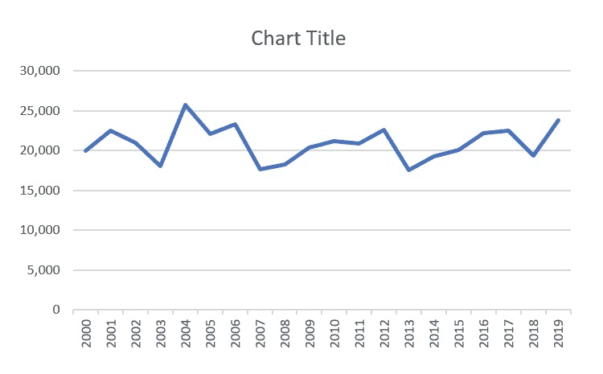

在接下来的部分中，我们将学习机器如何通过一种称为**M2M 通信**的概念进行互相沟通。

# M2M 通信

M2M 通信非常强大，能够显著提升商业银行的功能。

M2M 通信代表通过各种渠道（如物理网络、信息共享网络、软件通信和应用程序接口）进行的机器或设备之间的通信。M2M 通信的唯一目的是在两台或更多机器之间，或运行在这些机器上的软件之间交换信息。

M2M 通信的概念假设在机器之间交换信息时不需要人工干预。M2M 通信也可以通过无线网络进行。无线网络使得 M2M 通信更加便捷和普及。以下列出了 M2M 通信的一些常见应用：

+   制造业

+   智能公用事业管理

+   家用电器

+   医疗设备管理

然而，M2M 通信与物联网（IoT）不同。物联网使用传感器触发输入，而 M2M 通信则专门指两个系统之间的交互。

商业银行是一组金融服务，包括个人和企业的存款、支票账户服务、贷款服务、汇票、存单和储蓄账户。商业银行是人们银行需求的常见去处。*但银行是如何运作并盈利的呢？* 这是一个非常常见的问题，我们现在来解答。商业银行通过从它们提供给客户的各种贷款中赚取利息来赚钱。贷款种类可以有所不同，例如汽车贷款、商业贷款、个人贷款和抵押贷款。通常，商业银行在一种或多种类型的贷款方面有一定的专长。

商业银行通过向客户提供各种类型的账户服务来获取资本。这些账户类型包括支票账户、储蓄账户、公司账户、货币市场账户等。银行利用这些资本投资于高回报的投资选项，如共同基金、股票和债券。然而，银行必须向那些在银行开设账户的客户支付利息，尽管与贷款相比，利率要低得多。

## M2M 通信在商业银行中的作用

考虑一个涉及将钱从一个客户账户转到另一个客户账户的例子。在过去，这是一项手动任务，需要填写适当的表格，提交表格到相关部门进行账本登记，然后从一个账户中扣款并将款项存入受益人的账户。

如今，这一过程已经完全改变。有了手机，客户可以轻松地将资金从一个账户转移到另一个账户。受益人的账户将在几分钟内收到款项。不可思议，对吧？那么，这一切是怎么发生的呢？实际上，M2M 通信和流程自动化在其中起到了重要作用。现在，计算机系统、基于云的虚拟机和移动设备等机器可以通过无线或有线网络连接，向另一台机器或运行在该机器上的软件传输所有必要的信息。如今，客户只需因特定原因前往银行。客户甚至可以直接通过手机开设储蓄账户或贷款账户。

# 金融银行的基本概念

在我们全速进入下一个示例之前，我们首先将构建出我们的数据、人工智能和商业技术及知识。如果你对这些概念已经很熟悉，可以跳过这一部分。

金融知识是理解我们在预测商业活动时如何影响非金融公司财务决策的一个很好的起点。此外，在使用机器学习模型预测未来活动时，我们也能了解金融行业如何为未来的业务量做好准备。融资对非金融公司核心业务活动的帮助将在以下部分中讨论。

## 金融市场的功能——现货和期货定价

金融市场，如交易所，扮演着交换产品的市场角色。例如，考虑天然气这样的商品——我们可以直接从卖家购买，也可以通过交易所购买。实际上，长期的经济学理论鼓励你尽可能通过交易所购买标准化商品。如果是标准化商品，美国的**芝加哥商业交易所**（**CME**）可能是一个热门选择，此外，**纽约证券交易所**（**NYSE**）则是上市股票的市场。

在本章中，我们将天然气作为需要的产品。当然，在某些情况下，从壳牌等大型石油公司购买可能更有效——即如果我们希望定期从生产商那里获得这些实物商品。

在交易市场中，有两种价格——现货价格和期货价格。**现货价格**意味着如果你支付，就可以立即获得货物（交付）；**期货价格**意味着你现在支付，稍后会获得货物。

### 选择实物交付和现金结算之间的区别

即使所有权发生变化，也可能有两种形式：即通过实物交付或现金结算。最终，实物交付或现金结算取决于我们是否需要立即获得货物。然而，在任何交易日，我们必须权衡两种选择的成本：*实物交付（天然气成本+融资成本+储存成本）与现金结算*。

本质上，我们有四种选择，如下表所示——假设我们需要在 3 个月内获得天然气实物产品以进行发电：

|  | **实物交付** | **现金结算** |
| --- | --- | --- |
| **现货** | 资助购买以立即获得产品；储存 3 个月。 | 立即购买产品并在纸面上拥有它，无需保管货物。 |
| **期货** | 现在融资购买以在未来获得产品；3 个月后获得。 | 融资购买未来的产品。3 个月后，从市场上以现货购买并进行实物交付。 |

为了权衡各种选择，我们需要以下数据：

+   **储存成本**应由内部来源提供，如果公司拥有天然气的储存设施。假设这个成本相对稳定，例如每 MMBtu 约为 0.12 美元。MMBtu 是用来衡量燃料能量含量的单位，代表百万英国热量单位（**Million British Thermal Units**）。

+   **融资成本**应涵盖存储期和购买成本的利息费用。假设为每 MMBtu 0.1 美元。此费用应由银行提供。

+   **天然气成本**（现货价格）应由市场数据提供商提供。例如，实时亨利中心现货价格应由汤森路透提供，约为每 MMBtu 2.5 美元。

+   **期货成本**应由 CME 提供。数据应在 Quandl 上免费提供。对于 3 个月期货合同，成本应该在每 MMBtu $3 左右。

这里给出的数字仅提供了数值大小的指示。当然，它们可以通过比较选项进行优化——然而，这些决策可以通过线性代数推导出来，而不需要许多机器学习技术。在现实生活中，如果我们可以使用一个简洁的确定性公式来解决问题，就不应该强行使用机器学习解决方案。

### 对冲价格风险的期权

为了避免天然气价格波动超出预定范围，我们需要采用启发式规则，例如在给定固定目标采购数量的情况下，根据价格决定采取何种行动。或者，我们需要规则来调整已经下单的卖出或买入数量。

以以下示例为例。如果价格超出了可接受的范围，例如低于$2.84 或高于$3.95，我们可以选择通过以下方式锁定利润：

+   如果价格大幅下跌，可以选择卖出期权（卖保险）。

+   如果价格不利地飙升，可以通过购买期权（购买保险）来减少损失。

以下图表显示了通过购买保险对冲高采购价格并在低采购价格下出售收益的每单位收益：

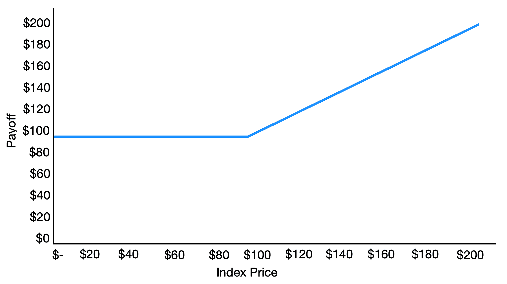

在这里，我们以极低的价格卖出了保险——这意味着尽管我们本应享有更低的采购成本，但我们通过接受保险费用将其赠送出去。另一方面，当价格过高时，会产生正向收益，这可能侵蚀公司的盈利能力——通过支付保费购买保险。保险的确切价格称为期权定价，将在第七章《面向卖方的算法营销中的市场情绪感知》中讨论。我们现在假设我们支付的保险费用与卖出保险所赚取的费用相同。

# AI 建模技术

在接下来的部分，我们将介绍**自回归积分滑动平均**（**ARIMA**）模型，这是最传统的预测模型类型。我们还将介绍一个神经网络模型。ARIMA 是一类用于使用过去值预测时间序列的统计模型。ARIMA 是以下词组的首字母缩写：

+   **AR**（**自回归**）：自回归是一种将先前的数据值作为输入，应用于回归方程并生成基于预测的结果数据值的过程。

+   **I**（**积分**）：ARIMA 通过使用观测值的差异来进行积分处理，使时间序列等间隔。这是通过将当前观测值与前一个时间步骤的观测值相减来实现的。

+   **MA**（**移动平均**）：一种使用观测值和应用于过去观测值的残差误差的模型。

## **介绍时间序列模型——ARIMA**

在这个项目中，我们将数据拟合到一个称为**ARIMA**的时间序列模型。ARIMA 是统计学中一种特定类型的时间序列模型，通常用于预测未来的数据点，包含自回归项（*p*）、非季节性差分项（*d*）和滞后项（*q*）的参数。

这个 ARIMA 模型属于参数模型——通过已知参数拟合的模型。通常，我们将这种类型的模型归类为统计模型，因为我们需要对数据的形态做出假设。这与没有预设假设数据形态的更广泛的机器学习模型有很大不同。

然而，在实际的银行场景中，统计方法仍然在计量经济学、定量金融和风险管理领域占主导地位。当我们拥有少量数据点时，例如大约 30 到 100 个数据点，这种方法是有效的。然而，当我们拥有大量数据时，这种方法可能不如其他机器学习方法有效。

ARIMA 假设存在一个可以描述的平稳趋势。自回归项*p*和*d*各自在其方式上都是重要的：

+   *p*意味着影响当前周期值的过去周期数（例如，*p = 1*：当前周期的*Y* = 当前周期的*Y* - 1 周期 * 系数 + 常数*）。

+   非季节性差分（*d*）是指过去几个周期的变化对当前周期值的影响（例如，*d = 1*：当前的*Y*与上一个周期的*Y*之间的差异）。

+   滞后项（*q*）是指过去周期的预测误差对当前周期值的影响。

考虑一个例子，其中*q = 1*：*Y*受到*t - 1*周期的误差影响——这里，误差是指实际值与预测值之间的差异。

简而言之，ARIMA 指定了前一时期的系数、常数、误差项，甚至是预测值如何影响当前的预测值。听起来有点吓人，但事实上它是非常易于理解的。

在模型拟合后，它将被要求进行预测，并与实际的测试数据进行比较。预测与测试数据之间的偏差将记录模型的准确性。在本章中，我们将使用一种叫做**均方误差**（**MSE**）的度量标准来确定模型对数据的拟合度。

## 介绍神经网络——精准预测需求的秘密武器

我们可能有一个很好的数据源，但我们不应忘记我们还需要一个智能算法。你可能已经读过成千上万次关于神经网络的文章，但在我们在本书中广泛使用它们之前，让我们先来看一个简短的解释。神经网络是计算机模仿我们大脑工作方式的一种尝试——它通过不同的计算点/神经元连接来工作，且这些连接有不同的设置。

从架构上看，它像是公式的层次结构。你们中间阅读本书的读者可能有一定的代数基础，可以看到所关心的结果 *Y* 是如何与变量 *X* 相关联的，其中 *b* 是系数，*c* 是常数项：

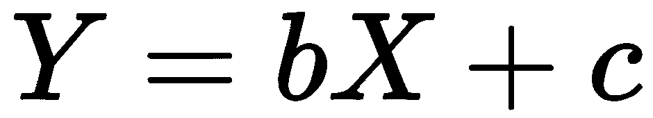

*Y* 是我们希望在左侧预测的内容；在右侧，*bX + c* 是描述特征（*X*）与 *Y* 之间关系的形式。换句话说，*Y* 是输出，而 *X* 是输入。神经网络描述了输入与输出之间的关系。

假设 *Z* 是我们想要预测的内容：

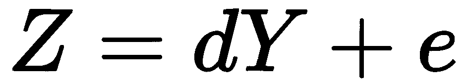

看起来这些公式是相互关联的：

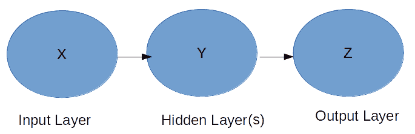

这是神经网络最简单的形式，包含一个输入层、一个隐藏层和一个输出层。每一层都有一个神经元（点）。

我鼓励你阅读关于机器学习的研究论文和入门教材，甚至可以报名参加在线课程。来自 Packt 的有用资源包括 Sebastian Raschka 和 Vahid Mirjalili 的*《Python 机器学习》*（[`www.packtpub.com/big-data-and-business-intelligence/python-machine-learning-second-edition`](https://www.packtpub.com/big-data-and-business-intelligence/python-machine-learning-second-edition)）和 Rowel Atienza 的*《深度学习进阶与 Keras》*（[`www.packtpub.com/big-data-and-business-intelligence/advanced-deep-learning-keras`](https://www.packtpub.com/big-data-and-business-intelligence/advanced-deep-learning-keras)）*。

### 反向传播

神经网络中还有其他概念，比如反向传播。它指的是一个反馈机制，用来微调神经网络的参数，这些参数大多数是在网络内连接神经元（除非它是层中的常数参数）。它通过比较输出层 *Z*（预测值）与 *Z* 的实际值（实际值）来工作。实际值与预测值之间的差距越大，就越需要调整 *b*、*c*、*d* 和 *e*。

理解如何衡量误差也是一个重要的知识点——这就是所谓的**度量**，将在第三章中讨论，*使用特征和强化学习来自动化银行融资*。

### 神经网络架构

架构关注的是每一层的神经元层数和数量，以及神经元在神经网络中的互联方式。输入层表示为**特征**。输出层可以是一个单一的数字或一系列数字（称为**向量**），生成从 0 到 1 的数字或一个连续值——取决于问题领域。

例如，为了理解神经网络的结构，我们可以预测它看起来像下面这个来自 TensorFlow Playground 的截图（[`playground.tensorflow.org/`](https://playground.tensorflow.org/)），这是另一个具有相同隐藏层——三个层，每个层大小为 6——的网络的可视化。

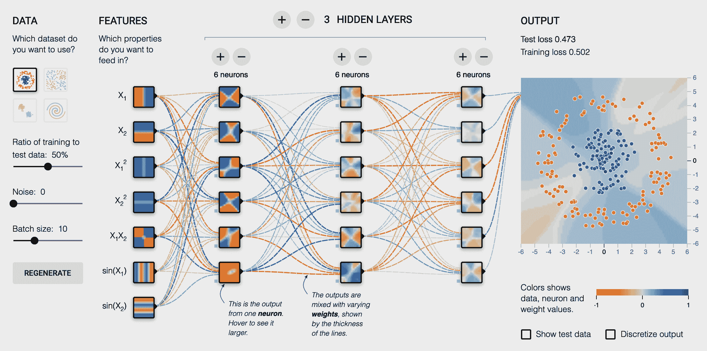

### 使用 epoch 进行神经网络训练

除了神经网络的设计外，我们还利用了`epoch`参数，它表示相同数据集被输入神经网络的次数。

如果我们没有足够的数据来满足神经网络中的参数数量，我们需要增加 epoch 的数量。假设我们在神经网络中有*X*个参数，我们至少需要*X*个数据点输入到网络中。不幸的是，如果我们的数据点只有*X*/2，我们需要将`epoch`设置为 2，以确保我们可以将*X*个数据点（所有数据点都会被输入两次）喂入网络。

### 缩放

在将特征输入机器学习模型之前，我们将对不同数量级的输入特征进行归一化，使其具有相同的数量级。例如，商品的价格和体积是不同类型的数值数据。缩放过程将确保它们都被缩放到相同的范围，从 0 到 1。在经典的统计建模过程中，这一步非常重要，以避免某些具有更大尺度的特征主导对预测的影响。

### 采样

除了数据列级的缩放外，我们还需要注意模型的采样偏差。通常，我们会保留一部分机器在训练和学习另一组数据时看不见的数据——这被称为**训练集**。稍后，测试集（即保留的数据集）将用于与模型所做的预测进行对比。

# 使用时间序列分析进行需求预测

在本节中，我们将首先看一个预测电力消费需求的例子，并使用时间序列分析预测能源费用。我们将从简要的问题陈述开始，并定义解决问题的步骤。这将帮助你更好地理解如何使用时间序列分析找到问题的解决方案。

今天，电力或能源是我们所有人的基本需求。我们使用电力并支付电费。现在，作为消费者，我们希望分析电力消费，预测未来的消费并预测能源费用。这就是我们在本节中要解决的问题。

时间序列分析是解决类似于前面问题描述中的问题的最佳方法。机器学习模型需要大量数据集供其处理，以便得出实际解决方案。这些大数据集被机器学习模型用来推导出模式，或者识别出散布的数据中可能无法看到的模式。同样，我们的第一步是获取大量数据并对其进行处理，以提取有意义的信息。这将是一个三步过程。以下是我们将遵循的步骤：

1.  下载数据

1.  数据预处理

1.  模型拟合数据

## 下载数据

从下载有关电力消费和能源费用的数据开始。尽管我们现在可以从公共网站下载数据，但在实际的生产环境中，通常需要从内部数据库下载数据，并以平面文件的形式将其传递给用户（即没有数据库结构的文本文件）。

您可以从以下路径下载文件：

+   **消费**: [`www.eia.gov/opendata/qb.php?category=873&sdid=ELEC.CONS_TOT.NG-CA-98.M`](https://www.eia.gov/opendata/qb.php?category=873&sdid=ELEC.CONS_TOT.NG-CA-98.M)

+   **成本**: [`www.eia.gov/opendata/qb.php?category=41625&sdid=ELEC.COST.NG-CA-98.M`](https://www.eia.gov/opendata/qb.php?category=41625&sdid=ELEC.COST.NG-CA-98.M)

+   **收入**: [`www.eia.gov/opendata/qb.php?category=1007&sdid=ELEC.REV.CA-RES.M`](https://www.eia.gov/opendata/qb.php?category=1007&sdid=ELEC.REV.CA-RES.M)

获取数据的方式有很多种，例如使用 API 或机器人。我们将在本书后续部分讨论这些其他获取数据的方法。在第四章，*资本市场决策的机械化*中，我们将通过 API 调用获取数据。如果我们使用机器人，例如，可以使用**Beautiful Soup**来解析网站或注册 API。然而，在这个示例中，我们只是使用浏览器访问网站并导航到下载按钮以下载数据。

## 数据预处理

获取数据后，我们将其对齐在同一个时间序列中，因为我们下载的数据可能覆盖不同的时间段。作为数据科学家，我们力求将数据对齐到一张数据表中，所需的所有数据按列列出（即：成本、消费、销售等）：

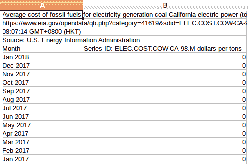

数据的每一行（或每一列）应代表一个单独的月份。在我们将数据提供给机器以学习模式之前，我们需要将一部分数据留作测试，另一部分用作学习。使用测试数据，我们可以查看模型是否预测准确，而无需先在学习数据上进行训练。这是所有机器学习/预测模型中的基本步骤。我们不将测试数据集提供给机器学习/训练。调用该函数的代码行如下：

```py
file_path_out
if select_fld:
    list_flds = ['consumption_ng','avg_cost_ng']
    tuple_shape_list = [(8,0,3),(12,1,3)]
else:
    list_flds = preprocess_data(f_name,list_flds)
```

在这个程序中，我们将最早的 70% 数据点作为训练数据，让机器进行学习和适应，而将后 30% 数据点作为测试数据。这些数据将用于与模型预测进行比较，而不用于拟合数据。

## 模型拟合数据

一旦数据清理完成，我们将开始训练机器学习模式。训练数据将作为拟合数据输入到机器中。模型就像一件衬衫，而训练数据就像我们试图将其拟合的身体。

以下是将我们的数据拟合到 ARIMA 模型的步骤：

1.  对于汇总文件中的每个数据文件/字段，我们运行 *步骤 3* 和 *步骤 4*（这在代码文件中的下一个代码块已经标明）。

1.  如果布尔变量 `parameter_op` 设置为 `True`，则我们将运行 *步骤 5*（该步骤也已标明）。这将探索 ARIMA 中 `p`、`d` 和 `q` 参数的所有可能组合，具体设置如下：

+   `p`：范围从 0 到 12

+   `d`：范围从 0 到 2

+   `q`：范围从 0 到 3

1.  对于前述任何组合的值，我们会计算数据与实际模式的拟合度，并测量误差值。选择误差值最小的组合作为 ARIMA 模型的选定参数。

以下是用于微调参数的代码片段（请参阅 GitHub 上的完整代码文件：[`github.com/PacktPublishing/Hands-On-Artificial-Intelligence-for-Banking`](https://github.com/PacktPublishing/Hands-On-Artificial-Intelligence-for-Banking)）：

```py
start = time.time()
lowest_MSE=99999999999
lowest_order = (0,0,0)
for p_para in range(13):
  for d_para in range(3):
    for q_para in range(4):
      order = (p_para,d_para,q_para)
      ...
      ...
      error,temp_data,temp_model = forecasting(dta_df, fld, False, \
                                               order, 0.7, fld)

if error<lowest_MSE:
  lowest_MSE=error
  lowest_order = order
  lowest_data = temp_data
  lowest_model = temp_model
  end = time.time()
  ...
```

恭喜！我们现在已经交付了一个可以提供未来销售预测的模型！

# 使用 Keras 中的神经网络进行商品采购

在这一部分，我们将通过一个更复杂的例子进行讲解。和之前一样，我们将先定义问题陈述，然后再定义解决问题的步骤。

在这个例子中，我们希望根据历史数据预测商品的采购。我们将使用的商品是天然气。对于天然气，我们无法控制其定价，因为它是一个高度全球化的商品。然而，我们仍然可以在天然气价格达到某个范围时设定内部采购策略。盈利率目标将约束我们能够支付的原材料最大定价，以确保公司所有者的盈利性。我们将跟踪盈利率，即天然气成本与销售额的比率。

让我们通过一个例子来理解这个定价约束。在这个例子中，我们假设每花费 1 美元，而天然气（用于电力）的单位成本上升时，能源公司的材料成本与销售额的比率将增加 **9.18%**（这是基于 3 年的数据）：

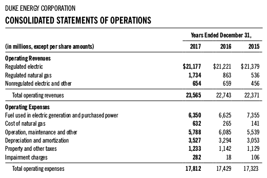

下表显示了年度销售额的加权平均值：

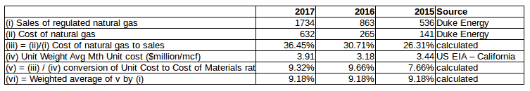

在这里，您可以看到从**2015**年到**2017**年的天然气销售成本。在**2017**年，单位成本平均为**$3.91**时，天然气的销售成本为**36.45%**。我们假设单位成本和销售成本之间存在常量关系——对各年份的材料成本比率进行平均（即**2015**年至**2017**年分别为**7.66%**，**9.32%**和**9.66%**）。我们取了这三个数字的平均值，得到了加权平均值**9.18%**。

请记住，实际数字应来自内部会计系统，而不是仅用于电力目的的外部美国**能源信息管理局**（**EIA**）数据。

根据过去三年的数据，我们发现材料成本与销售额的平均比率为 31.15%（表格中的 iii 平均值），这相当于每千立方英尺$3.39 百万。销售材料成本为 36.24%，单位成本为每千立方英尺$3.95 百万，处于上限范围内。**mcf**是天然气的标准单位成本，等于千立方英尺。然而，在下限范围内，销售材料的成本为 26.07%，单位成本为每千立方英尺$2.84 百万。单位转换的详细信息可以在 EIA 网站上找到。

数据提取自前面的销售数据表：*运营费用/运营收入 = 材料成本与销售额的比例*。

在建立采购计划后，我们需要了解从哪里采购天然气。在现实生活中，我们会考虑模型洞察如何执行；或许我们还需要构建一个模型来做出如何执行模型洞察的后续决策。这正是我们在商业理解部分提到的，关于如何在交易市场上执行订单的问题。

为了完成这个故事，我们假设当价格达到我们预测的数量目标区间时，我们通过物理交付从交易市场购买天然气。

## 数据流

以下数据流概述了我们在准备和生成代码以构建商品采购模型时需要采取的步骤。第一个框表示在 SQLite 数据库上运行的脚本，其他框表示在 Python 中执行的步骤：

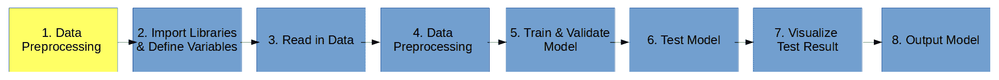

它通常适用于 CRISP-DM 框架，在本书中针对不同的重点领域——有些可能侧重于理解业务，有些则可能侧重于评估。前面的图示步骤将在后续章节中详细介绍。

### 数据预处理（在 SQL 数据库中）

数据预处理意味着将数据转换为所需的数据特征。我们将其在 Python 编码之外运行，以减少所涉及的层级（即，我们直接与 SQLite 进行交互，而不是使用 Python 与 SQLite 交互）。以下是执行数据库操作的步骤：

1.  创建 SQLite 数据库。

1.  将数据导入为暂存表。

1.  创建所需的表（一次性操作）。

1.  将暂存表插入实际表，并进行数据类型和格式转换。

1.  创建执行特征工程的视图。

1.  将预处理后的视图输出为 CSV 数据。

### 导入库并定义变量

导入库并定义变量，以确保可以使用相关函数。导入所有相关库：

+   `pandas`：这是在数据输入机器学习模块之前用于数据存储的库。

+   `keras`：这是一个易于使用的机器学习框架，具有另一个库。

+   `tensorflow`：这被用作后台。

+   `sklearn`：这是一个非常流行的机器学习模块，提供了许多数据预处理工具集以及一些易于使用的机器学习模型。由于我们希望为后续更广泛的机器学习模型应用打下基础，因此本示例中没有使用模型。此外，`sklearn` 还有评估模型性能的度量标准。

+   `matplotlib`：这是默认的数据可视化工具。

以下代码块是导入所有列出库的代码：

```py
'''*************************************
2\. import all the libraries required
'''
import pandas as pd

from keras.models import Model
from keras.layers import Dense, Input
from sklearn.preprocessing import StandardScaler
from sklearn.model_selection import train_test_split
from sklearn.metrics import mean_squared_error

import matplotlib.pyplot as plt

import pickle

demand_model_path = 'demand_model.h5'
f_in_name = 'consumption_ng_exp.csv'
```

### 读取数据

以下是读取数据并获取*步骤 1*生成的结果的代码片段：

```py
'''*************************************
#Read in data
'''
pd_trade_history = pd.read_csv(f_in_name,header=0)
pd_trade_history = pd_trade_history.drop('date_d',1)  
```

### 数据预处理（在 Python 中）

现在我们进入 Python 中的数据预处理步骤。一些研究表明，数据科学家将 80%的时间花在这一步骤上！它包括选择特征和目标变量，检查/验证数据类型以及处理缺失值（此部分在本示例中未包含，以减少复杂性），并将数据分为训练集和测试集。在某些情况下，当目标的各类比例在数量上不相似时，我们可能需要进行分层抽样，以确保为机器学习提供平衡的训练样本。在本示例中，我们将 20%的数据保留用于测试，80%的数据用于训练：

```py
'''*************************************
4\. Pre-processing data
'''
#4.A: select features and target
df_X = pd_trade_history.iloc[:,:-5]
df_Y = pd_trade_history.iloc[:,-4:]

np_X = df_X.values
np_Y = df_Y.values

#4.B: Prepare training and testing set
X_train, X_test, Y_train, Y_test = train_test_split(np_X, np_Y, \
                                                    test_size = 0.2)

#4.C: scaling the inputted features
sc_X = StandardScaler()
X_train_t = sc_X.fit_transform(X_train)
X_test_t = sc_X.fit_transform(X_test)
```

### 训练和验证模型

我们通过将训练数据集输入神经网络来训练模型。以下代码片段定义了 Keras 中的机器学习模型并进行训练。它构建了一个具有 329 个参数的深度神经网络模型：

```py
'''*************************************
#5\. Build the model
'''
inputs = Input(shape=(14,))
x = Dense(7, activation='relu')(inputs)
x = Dense(7, activation='relu')(x)
x = Dense(7, activation='relu')(x)
x = Dense(4, activation='relu')(x)
x = Dense(4, activation='relu')(x)
x = Dense(4, activation='relu')(x)
x = Dense(4, activation='relu')(x)
predictions = Dense(units=4, activation='linear')(x)
demand_model= Model(inputs=inputs,outputs=predictions)
demand_model.compile(loss='mse', optimizer='adam', metrics=['mae'])

demand_model.fit(X_train_t,Y_train, epochs=7000, validation_split=0.2)

Y_pred = demand_model.predict(X_test_t)

#conver numpy as dataframe for visualization
pd_Y_test = pd.DataFrame(Y_test)
pd_Y_pred = pd.DataFrame(Y_pred)
```

### 测试模型

我们将比较*步骤 4*中预留的数据点（20%）与基于训练好的模型和特征数据的预测结果：

```py
'''*************************************
##6\. Test model: Measure the model accuracy
combine both actual and prediction of test data into data
'''
data = pd.concat([pd_Y_test,pd_Y_pred], axis=1)
data_name = list(data)[0]
data.columns=['actual1','actual2','actual3','actual4','predicted1', \
              'predicted2','predicted3','predicted4']

error1 = mean_squared_error(data['actual1'],data['predicted1'])
print('Test MSE 1: %.3f' % error1)
error2 = mean_squared_error(data['actual2'],data['predicted2'])
print('Test MSE 1: %.3f' % error2)
error3 = mean_squared_error(data['actual3'],data['predicted3'])
print('Test MSE 1: %.3f' % error3)
error4 = mean_squared_error(data['actual4'],data['predicted4'])
```

### 可视化测试结果

这一步让我们能够交叉检查表示模型性能的度量标准——均方误差（MSE）：

```py
'''*************************************
#7\. Visualize the prediction accuracy
'''

data.actual1.plot(color='blue',grid=True,label='actual1',title=data_name)
data.predicted1.plot(color='red',grid=True,label='predicted1')
plt.legend()
plt.show()
plt.close()

...
```

这将生成以下图表：

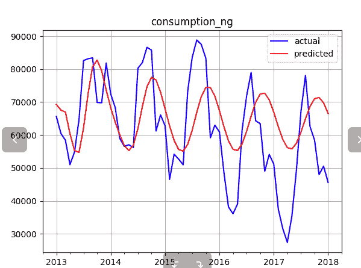

### 为生产生成模型

在*步骤 5*和*步骤 6*中训练和测试的模型将作为文件输出，供生产系统在未见过的生产数据上运行。我们将输出两个文件——一个用于缩放输入特征，另一个用于神经网络：

```py
'''*************************************
#8\. Output the models
'''
demand_model.summary()
demand_model.save(demand_model_path)
f_scaler=open('x_scaler.pkl',"wb+")
pickle.dump(sc_X, f_scaler)
```

恭喜！我们现在已经交付了一个可以在操作层面使用的模型，用于识别本月、下月及下下月的需求量。下图展示了机器学习模型训练与部署的步骤：

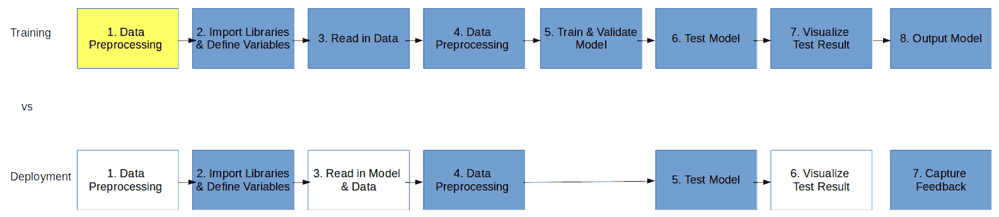

然而，我们现在不会涵盖部署部分。我们会记住这一点，并在本书的后续部分讨论这个话题。我们将在第八章《使用银行 API 构建个人财富顾问》中探讨如何将 AI 生产解决方案封装为 API。

# 总结

在本章中，您了解了时间序列分析、机器对机器（M2M）通信，以及时间序列分析对商业银行的好处。我们还通过定义问题陈述并一步步推导解决方案，探讨了两个有用的例子。我们还学习了时间序列分析的基本概念和一些技术，例如 ARIMA。

在下一章中，我们将探讨强化学习。强化学习是机器学习的一个领域，涉及算法。应用程序在特定情况下采取适当的行动，以最大化结果的效果。我们还将了解如何使用强化学习来自动化银行决策。令人兴奋，是吗？
