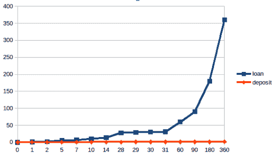

# 第三章：使用特征和强化学习来自动化银行融资

商业银行通过对借款人贷款收取利息来赚取利润。在许多情况下，贷款会变成银行的**不良资产**（**NPA**）。有些情况下，借款人可能会破产，导致银行遭受损失。在这种情况下，商业银行必须及时评估借款人还款能力，变得至关重要。

现在，如果我们仔细看这个场景，我们会意识到每一笔贷款都是由其他客户存款提供资金的。因此，商业银行需要向存款人支付利息，这是对存款人资金的一种回报，通常是按季度计算的。银行还可以通过向借款人收取更高的利息，并向存款人支付较低的利息来获利。

在本章中，我们将通过使用**强化学习**（**RL**），这一机器学习的重要领域，推导出这两种情况的解决方案。除此之外，我们还将看看强化学习如何在银行职能中提供帮助。强化学习是机器学习的三个领域之一，另外两个是监督学习和无监督学习。强化学习特别适用于基于环境或当前环境做出决策的场景。在强化学习中，代理会面临多种选择，朝着奖励前进。代理需要选择一个可用选项。如果选择了正确的选项，代理会得到奖励，否则会受到惩罚。代理的目标是通过每一步最大化接近奖励的机会，并最终获得奖励。

所有这些概念将分为以下主题：

+   拆解银行的功能

+   人工智能建模技术

+   模型性能的度量

+   构建破产预测模型

+   使用强化学习为贷款提供资金

在我们继续深入了解强化学习（RL）之前，了解银行业务及其运作方式是必要的。

# 拆解银行的功能

在银行内部，作为资金过剩者（存款人）和资金需求者（借款人）之间的中介，有两个重要问题需要回答：

+   借款人的风险有多大？

+   资金成本是什么？

这些是我们在查看支持业务运营所需的利润之前，需要考虑的两个重要问题，以覆盖其运行成本。

当这些决策没有正确做出时，会威胁到银行的生存能力。在这种情况下，可能会有两种结果：

+   如果银行在发生风险事件时无法赚取足够的利润来覆盖风险和运营成本，银行可能会倒闭。

+   如果银行未能满足存款人的要求或未能履行借款人贷款协议，就会损害银行的信誉，从而导致潜在客户流失。

## 主要风险类型

为了回答“*借款人有多大风险？*”的问题，我们首先需要了解影响风险的因素。

**风险**是指未来对银行运作产生不利影响的结果。对于银行而言，主要的风险因素包括以下内容：

+   **信用风险**：这种风险涉及借款人在借款交易中无法按时偿还资本的问题；例如，借款公司面临财务困境，导致无法偿还贷款。

+   **市场风险**：这种风险涉及金融市场中不利的价格变动，例如银行筹资来源市场的利率上升。

+   **操作风险**：这种风险涉及银行作为组织在运营过程中发生的事件。这可能包括内部盗窃、网络攻击等。

有关风险类型的完整列表，请参考 BIS 的《巴塞尔框架》([`www.bis.org/bcbs/basel3.htm`](https://www.bis.org/bcbs/basel3.htm))。

## 资产负债管理

商业银行需要存款来为贷款提供资金。除了评估借款人的风险外，银行还发挥着一个有用的功能，即将储户的存款转化为借款人的贷款。因此，为存款人和借款人设定定价机制非常重要。对银行而言，贷款位于财务报表的资产端，而存款位于负债端。因此，这通常被称为**资产负债管理**（**ALM**）。

在本书中，我们将仅关注整个 ALM 功能中的一部分——资金方面——而不涉及流动性风险、利率风险和外汇风险等其他风险。以下是银行 ALM 功能的目标：

+   ALM（资产负债管理）的首要目标是确保贷款有存款支持，并且银行将有足够的存款，以防存款人要求取回他们的钱。从总量来看，大约$100 的存款支持$70 的贷款。参考一些大银行的比率，客户存款与客户贷款的比率应该在 1.2:1 到 1.5:1 之间。

+   其次，还有一个方面是关于存款的存放期限和贷款的借出期限。存放多长时间的问题被称为**期限**。为了满足长期贷款承诺，银行还需要存款在足够长的时间内被锁定，以确保贷款能够长期得到存款的支持。

+   第三，ALM 功能需要是盈利的，这意味着 ALM 收入应高于 ALM 成本。*成本*是你给出的 ALM 定价。实际上，这个成本是 ALM/银行的收入，而银行给客户报价的存款利率是银行的支出。

银行盈利的一个知名秘诀是将短期存款（低价）转化为长期贷款（高利息收入）。以下曲线显示了银行存款和贷款的定价情况：



在前面的图表中，*x*轴表示存款/贷款在银行中保持的时间（以天为单位），而*y*轴表示年化利率。

## 利率计算

尽管有许多方法来计算存款应支付的利息，但最常见的计算利息的方法是以年化形式报价；也就是说，无论存款时间有多长，都假设利息是以一年的时间来计算的。

例如，如果存款的 7 天利率为 1%，这意味着在 7 天内，我们将获得以下收益：


我们只需将年化利率除以 7 天，就能得到 7 天期间的利率。其背后的原因是，市场交易员需要一种标准化的方式来报价。

我们将在本章后面“*使用强化学习为贷款融资*”一节中使用此公式进行利息定价和存款定价。然而，关于利息定价，还有很多其他细节问题，包括不同的复利方式（利息可以从利息中赚取）和天数计数规则（365 天、实际日历或实际工作日、360 天、220 天等）。为了简化说明，我们假设一年有 365 天，并且使用不计复利的简单利率。

## 信用评级

除了在 ALM 中描述的借贷成本外，银行的另一个职能是评估在与客户打交道时所承担的风险水平。这种风险性会被加到资金成本中。这个概念在银行中被称为**信用评级**。

巴塞尔委员会评估并实施全球银行风险管理的相关规定。根据巴塞尔委员会提供的*违约/损失定义*（[`www.bis.org/bcbs/qis/qis3qa_f.htm`](https://www.bis.org/bcbs/qis/qis3qa_f.htm)），信用评级预测借款人（即被评级者）在一年内破产的概率。借款人通常因公司破产而违约。因此，我们通常将违约和破产互换使用。

关键问题是，考虑到所需信息，公司在 1 年内破产、无法履行偿还义务的可能性有多大？这可能由多种原因驱动，但一个显而易见的原因是公司的财务状况不好。

财务报表就像公司的成绩单——尽管它需要时间来制作，但它符合某种国际公认的标准，并且有审计师的质量保证。

# 人工智能建模技术

现在我们已经了解了业务的功能，是时候了解一些技术概念了。在这一部分中，我们将学习人工智能建模技术，包括蒙特卡洛模拟、逻辑回归模型、决策树和神经网络。

## 蒙特卡洛模拟

蒙特卡洛模拟通过假设可以用概率描述的随机运动，使用大量计算预测物体的行为。这种方法是研究分子在物理学中运动的标准工具，分子的运动只能以模式的确定性描述，通常使用概率来预测。

金融专业人士采用这种方法来描述证券价格的变动。我们将在本章稍后的*使用强化学习为贷款提供资金*部分中使用该方法进行定价模拟。

## 逻辑回归模型

逻辑回归模型是人工智能在银行业中最常见的应用之一，尤其是在信用风险建模领域。该模型的目标变量将是 1 或 0 的二元结果，1 的概率表示满足目标。1 和 0 的具体含义取决于我们如何准备数据。

在这种情况下，目标变量可以是公司在 1 年内破产的情况。该模型称为逻辑回归，因为用于建模 1 和 0 的函数被称为**logit**。它被称为回归模型，因为它属于一种统计模型——回归模型，旨在确定影响结果的因果关系。

## 决策树

决策树算法实际上属于监督学习算法组。然而，鉴于该算法的性质，它常用于解决回归和分类问题。回归和分类通常需要根据当前情况做出决策。因此，这些问题通常使用强化学习算法来解决。

决策树的有益之处在于我们实际上可以可视化决策树的表示。决策过程从树的顶部开始，向树的叶子节点分支。叶子节点是目标变量最终落点的地方。所有被分类到同一叶子节点的变量值，具有相同的违约概率。以下是一个决策树算法可视化示例，展示了如何做出是否向申请人发放贷款的决策：


决策树中最常见的前进方式是查看最小叶子大小，这指的是每个训练样本被分类到的桶的大小。如果桶内的样本数量少于`min_samples_leaf`所规定的数量，则该桶将被舍弃。这样做可以减少桶的数量（称为**决策树的叶子节点**）。

阅读决策树很容易。然而，令人惊讶的是，机器如何学习用于分裂的各种条件。

## 神经网络

一个简单的神经网络如下面的图所示：


它由三层组成，即**输入层**、**隐藏层**和**输出层**。每一层由节点构成。用于解决 AI 问题的人工神经网络模仿人脑中存在的物理神经网络。人脑中的神经元由人工神经网络中的节点表示。神经元之间的连接则通过权重在人工神经网络中表示。

让我们理解神经网络中每一层的意义。输入层用于将输入数据馈送到模型中。它还负责呈现模型正在训练的条件。输入层中的每个神经元或节点代表一个对输出有影响的独立变量。

隐藏层是最关键的，因为它的工作是处理从输入层接收到的数据，并负责从输入数据中提取必要的特征。隐藏层由一个或多个层组成。

在解决线性表示数据的问题时，激活函数（处理输入数据）可以包含在输入层本身中。然而，对于复杂数据表示的处理，则需要一个或多个隐藏层。隐藏层的数量取决于数据的复杂性。隐藏层将处理后的数据传递给输出层。

输出层负责收集和传递信息。输出层展示的模式可以追溯到输入层。输出层的节点数取决于最终需要做出的决策数量。

## 强化学习

在强化学习中，模型会在每一步行动后收到反馈。首先，让我们理解强化学习中涉及的实体：

+   **代理**：这是执行操作的主体；在我们的案例中，它是银行。

+   **动作**：这是代理实际执行的工作。在我们的案例中，动作指的是银行提供的定价网格。

+   **效用函数**：它为状态的期望度分配数值。效用函数通过与实际**盈亏**（**P&L**）/资金状况与所提供的定价网格（包括存款和贷款）之间的反馈交互来学习。

+   **奖励**：这是结果的期望度的数字表示。在我们的案例中，它是累计盈亏（即达到或未达到自我融资目标的二元结果，其中 1 表示达到，0 表示未达到）。如果银行未能满足自我融资要求，则累计盈亏将为 0。

+   **策略**：根据估算的效用选择行动。在我们的案例中，我们的策略不会变化，因为它努力选择提供最大下一个状态奖励的定价网格。我们采用的策略导致了“利用”，而非“探索”，这意味着该策略不会放弃当前的盈亏来产生长期的盈亏。这是因为如果存款人和借款人在短期内看到无盈利，而长期则能获得盈亏，他们会表现出一定程度的粘性。探索是关系银行家常见的行动，他们看重关系的长期盈利能力。

## 深度学习

随着我们学习的每个模型或技术的复杂性不断增加。在这个例子中，我们假设输入层有 36 个变量/特征。输出层将有两个变量/特征——一个用于盈利能力，另一个用于自筹资金状态。在输入层和输出层之间将有两个隐藏层——一个紧接着输入层，有 10 个神经元，另一个层有 15 个神经元。这个例子将形成一个神经网络，用于为银行做出一般的定价决策。

要估算神经网络的盈利能力和自筹资金状态，输入层有 127 个变量，三个隐藏层每个层有 15 个神经元，输出层有一个输出神经元，用于生成盈利能力（当天的累计盈亏）或客户存款与客户贷款的比例。

相比于逻辑回归模型，深度学习中的输入特征要复杂得多，涉及的参数数量大约是逻辑回归模型的 10 倍或更多。

以下表格展示了定价模型的总结：

| **层** | **形状** | **参数数量** |
| --- | --- | --- |
| 输入层 | (1, 36) | 0 |
| 隐藏层 1 | (1, 10) | 370 |
| 隐藏层 2 | (1, 15) | 165 |
| 隐藏层 3 | (1, 15) | 240 |
| **总参数数量** | **775** |

在前面的表格中，第一列列出了是哪一层——输入层还是隐藏层。第二列表示该层的形状，即从上一层到当前层的参数数量。

要计算参数的数量，我们来考虑**隐藏层 1**。在这种情况下，上一层的 36 个特征连接到当前层的 10 个神经元。我们还需要与当前层特征数量相等的常数，以实现跨特征的缩放。因此，**隐藏层 1**的总参数数量是 36*10 + 10 = 370 个参数。

知道如何计算参数有助于我们了解训练数据是否足够充足以训练网络。强烈建议确保参数数量至少等于 *记录数* * *训练轮数*。想一想，解决两个变量问题需要多少个公式 – 至少需要两个。公式就像是深度学习中的训练数据，而变量就像是网络的参数。

# 模型性能的度量标准

当我们构建一个 AI 模型时，最重要的步骤之一就是定义一种衡量模型性能的方法。这使得数据科学家能够决定如何改进并选择最佳模型。

在本节中，我们将学习三种常见的度量标准，这些标准在工业界通常用于评估 AI 模型的性能。

## 度量标准 1 – ROC 曲线

**接收者操作特征** (**ROC**) 度量标准衡量分类器在执行分类任务时，与随机分类器相比的表现。该度量标准使用的分类器是二元分类器。二元分类器根据预定义的分类规则将给定的数据集分为两组。

这与以下情况相关，比如我们将这个模型与抛硬币进行比较，用来分类公司是否违约或非违约，正面表示违约，反面表示非违约。在这种情况下，违约和非违约的分类概率各为 50%。

对于一个完全随机的预测系统，比如抛硬币，真正率和假正率的概率很可能是相同的。但是在如公司一年内违约的案例中，例如以下例子，违约率为 6.3%（1,828 中的 123），这意味着我们实际有 1,828 个非违约案例和 123 个违约案例。一个完全随机的模型将会把一半的违约案例预测为非违约。

让我们绘制一个图表，展示 ROC 图表中的真正率和假正率。真正和假定意味着针对默认事件所做的预测是否事实正确。正意味着分类器为正（在此情况下等于 1，即默认值）。

当我们没有进行预测时，真正率和假正率都是 0。当我们完成样本的 50% 时，假设为 1,951/2，我们默认会得到 50% 的样本，其中 50% 的猜测为假正。当我们到达 100% 样本时，我们应该得到 100% 的样本作为真正，100% 作为假正。

该随机分类器的性能由图中的虚线表示：


在最理想的分类器情况下，我们应该能够将真正率提高到 100%，并将假正率降到 0%（由前面图中的黄色线表示）。

对于最差的分类器（将所有情况都分类为 100%错误），真实正例率应为 0%，假正例率应为 100%（由红点表示）。ROC 曲线的使用在信用风险模型验证中也很常见。

## 指标 2 – 混淆矩阵

混淆矩阵是衡量分类器性能的最常用指标，具有两种结果：

|  |  | **实际情况：真实值** |
| --- | --- | --- |
|  |  | 真实违约 | 假负例/非违约 |
| **分类器预测** | 正例/违约 | 62 | 27 |
| 非违约/负面 | 61 | 1,801 |
|  |  | 真实正例率 = 62/(62+61) | 假正例率 = 27/(27+1,801) |

混淆矩阵还提供了类似于 ROC 曲线的结果。其主要思想是通过行和列将预测结果与实际真值区分开。

## 指标 3 – 分类报告

分类报告是另一种评估模型性能的方式，包含以下指标：


指标的详细信息如下：

+   **精度和召回率**：精度衡量模型预测的真实正例率，而召回率衡量模型的覆盖率。精度表示预测值为正确值的百分比。召回率表示目标值被预测为期望值的百分比。

+   **F1-score**：F1-score 是评估模型整体准确性的重要指标之一。它是精度和召回率的调和均值。这是我们用来比较模型性能的标准。

+   **Support**：这是另一个术语，表示在最左列中列出的值所对应的记录数量。这里有 123 个实际违约案例（在*default*列下目标值为*value = 1*）。

# 构建破产风险预测模型

银行作为贷款方，需要确定能够覆盖借款成本的利率。银行通过考虑向其他机构借款的成本，以及公司从银行借款后可能申请破产的风险来确定利率。

在这个例子中，我们假设自己是一个银行家，用来评估借款人破产的可能性。数据来源于 data.world（[`data.world`](https://data.world)），提供了不同公司破产预测的数据。该链接中的数据来自于**新兴市场信息服务**（**EMIS**）。EMIS 数据库包含了关于全球新兴市场的信息。

EMIS 分析了 2000 年至 2012 年期间的破产公司和 2007 年至 2013 年期间的运营公司。在数据收集后，基于预测期对数据进行了五类分类。第一类是包含预测期内财务数据的年份数据。另一类标签显示 5 年后破产状态的预测。

## 获取数据

我们将使用一个开源程序进行数据转换，然后使用另一个程序基于下载的数据训练模型：

1.  我们首先获得从新数据源下载的数据。然而，这些数据是通过浏览器下载的，而不是通过数据流获取的。以`.arff`结尾的文件将从 data.world 获得。其网址为[`data.world/uci/polish-companies-bankruptcy-data`](https://data.world/uci/polish-companies-bankruptcy-data)。通常，我们可以使用 1 年的破产数据，因为模型预测的是 1 年内的破产情况。为了举例说明，我们将使用一个包含 5 年数据的数据集。

1.  然后，我们将对数据进行预处理，并通过提取、转换和加载进行特征工程。在这种情况下，从 data.world 下载的文件为`.arff`文件格式，Python 无法直接读取。用于转换文件格式的代码可以在 GitHub 上找到([`github.com/jeffreynghm/AIFinance_Packt`](https://github.com/jeffreynghm/AIFinance_Packt))。

## 构建模型

在这个示例中，我们将尝试三种模型：逻辑回归、决策树和神经网络。

在计算能力尚未普及之前，通常会根据我们试图解决的问题以及机器需要提供的答案来选择模型。然而，如今，我们倾向于尝试所有可能的模型，并选择性能最佳的模型。

在这种情况下，我们可以将其标记为我们想要预测的内容。我们希望预测的目标行为是公司违约——在机器学习领域，这称为目标变量。我们将通过使用常见的评估指标，比较不同模型的性能，来评估模型在给定输入数据时预测目标变量的准确性。

在本示例中，我们将需要以下库：

+   `os`：用于文件路径操作。

+   `re`：用于匹配列头的正则表达式。

+   `pandas`：用于保存数据的 DataFrame。

+   `matplotlib.pyplot`：用于绘制模型结果，展示其准确性。

+   `seaborn`：一个美观的数据分析可视化工具。

+   `sklearn`：一个机器学习库，包含强大的数据准备功能，用于拆分、训练和测试数据集、重新缩放数据值以供神经网络使用、处理缺失值或异常值等。

+   `pickle`：用于保存机器学习过程生成的模型的文件格式。

+   `graphviz`：用于可视化决策树。

步骤如下：

1.  使用以下代码导入所有相关库：

```py
import os
import re
import pandas as pd
import matplotlib.pyplot as plt 
import seaborn as sns

from sklearn.metrics import classification_report,roc_curve, auc,confusion_matrix,f1_score
from sklearn.model_selection import train_test_split
from sklearn.feature_selection import RFE
from sklearn import linear_model,tree
from sklearn.neural_network import MLPClassifier
from sklearn.preprocessing import StandardScaler

import pickle
import graphviz
```

对于逻辑回归，决定选择哪些特征时，我们将依赖于测试不同特征的准确性。提供最高准确性的组合将被选中。

1.  定义`optimize_RFE()`函数，它将执行特征选择过程。该函数将尝试不同的特征组合，选择出能给出最高真正例和最低假正例的组合。我们将通过衡量性能来决定生成最佳性能的特征数量。以下是该函数定义的代码：

```py
def select_columns(df, col_list):
    ...
def generate_column_lists(col_support,col_list):
    ...
def optimize_RFE(logreg, X, Y, target_features = 10):
    ...
    while trial_cnt<=target_features:
        rfe = RFE(logreg,trial_cnt,verbose=1)
        ...    
        select_cols = generate_column_lists(col_support, col_list)
        X_selected = select_columns(X,select_cols)
       ...            
        #build model
        ...    
        ##metric 1: roc
       ...        
        #memorize this setting if this ROC is the highest
        ...        
    return max_roc_auc, best_col_list, result_list

def train_logreg(X,Y):
    print('Logistic Regression')
    logreg = linear_model.LogisticRegression(C=1e5)
    roc_auc, best_col_list, result_list = optimize_RFE(logreg, \
                                                       X, Y, 20)    
    scaler = StandardScaler()
    scaler.fit(X_train)
    ...
    ##metric 1: roc
    ...
    ##metric 2: Confusion matrix
    Y_pred_logreg = logreg.predict(X_test)
    confusion_matrix_logreg = confusion_matrix(Y_test, \
                                               Y_pred_logreg)
    ...
    #common standard to compare across models
    f1_clf = f1_score(Y_test, Y_pred_logreg, average='binary')
    ##Quality Check: test for dependency
    ...
    ##save model
...
```

1.  除了逻辑回归模型外，我们还将构建一个决策树。特征选择将在训练时由算法执行。因此，与逻辑回归模型不同，我们不需要限制作为输入提供给训练过程的特征数量：

```py
'''
## Decision Tree
'''
#feed in data to the decision tree
def train_tree(X,Y):
    print('Decision Tree')
    #split the dataset into training set and testing set
    ...
    tree_clf = \
        tree.DecisionTreeClassifier(min_samples_leaf=min_leaf_size)

    #preprocessing the data
    scaler = StandardScaler()
    scaler.fit(X_train)    
    ...    
    #fit the training data to the model
    ...
    ##metric 1: roc
    ...
    ##metric 2: Confusion matrix
    ...
    #common standard to compare across models
    ...
    ##save model
    ...
```

1.  最后，我们将在模型中加入一个神经网络。它与决策树类似。特征选择将在训练时由算法执行。然而，进行超参数调优时，执行网格搜索是很重要的。我们正在寻找的超参数属于神经网络的架构，即我们需要构建多少层以实现最佳性能。以下代码用于训练逻辑回归模型：

```py
##Grid search that simulate the performance of different neural network #design
def grid_search(X_train,X_test, Y_train,Y_test,num_training_sample):
    ...
    #various depth
    for depth in range(1,5):
        ...
        for layer_size in range(1,8):
            ...
            nn_clf = MLPClassifier(alpha=1e-5, \
                     hidden_layer_sizes=hidden_layers_tuple, \
                     random_state=1)
            ...
    ...

    #various size

def train_NN(X,Y):
    print('Neural Network')
    #split the dataset into training set and testing set
    ...

    #preprocessing the data
    scaler = StandardScaler()
    scaler.fit(X_train)
    ...
```

对于本章中列出的所有模型，我们还需要衡量其准确性。我们将使用两种不同的方法来衡量准确性。在这个分类问题中，使用了各种度量指标。然而，当构建一个机器学习模型来判断一家公司是否违约时，我们需要确保其准确性。

1.  在定义了这些函数之后，我们使用以下代码示例来实际调用函数。所有三个模型将依次构建。结果将存储在`f1_list`中，以便稍后打印出来：

```py
f1_list = []
f1_score_temp= 0

#logistic regression model
log_reg,f1_score_temp = train_logreg(X,Y)
f1_list.append(f1_score_temp)
log_reg.get_params()

#decision tree
tree_clf,f1_score_temp = train_tree(X,Y)
f1_list.append(f1_score_temp)
tree_clf.get_params()

#neural network
nn_clf,f1_score_temp = train_NN(X,Y)
f1_list.append(f1_score_temp)
nn_clf.get_params()
```

1.  使用以下代码可视化每个模型的性能：

```py
'''
#4 Visualize the result
'''
print('********************')
print('f1 of the models')
print(f1_list)
print('********************')
```

1.  使用以下代码示例来可视化模型：

```py
#for visualization of decision tree
x_feature_name = fields_list[:-1]
y_target_name = fields_list[-1]
d_tree_out_file = 'decision_tree'
dot_data = tree.export_graphviz(tree_clf, out_file=None, 
                         feature_names=x_feature_name,  
                         class_names=y_target_name,  
                         filled=True, rounded=True,  
                         special_characters=True) 
graph = graphviz.Source(dot_data) 
graph.render(d_tree_out_file)
```

在下一节中，我们将使用强化学习来决定是否向客户提供贷款。

# 使用强化学习进行贷款资金的提供

假设我们的角色是银行的负责人，那么确定贷款资金的成本变得非常重要。我们要解决的问题涉及三个方（或者我们称之为**代理人**）——银行、存款人和借款人。首先，我们假设只有一个银行，但有许多存款人和借款人。存款人和借款人将通过随机生成的数据创建。

在模拟机器学习中这些方的不同行为时，每个方都被称为一个代理人或一个对象实例。我们需要创建成千上万的代理人，其中一些是存款人，一些是借款人，一个是银行，一个是市场。这些代理人代表了竞争银行的集体行为。接下来，我们将描述每种代理人类型的行为。

假设我们扮演银行财务主管或财务部门负责人的角色。财务部门负责人的工作是报价无风险融资成本。与客户打交道的银行人员会把融资成本加上信用风险溢价，形成总融资成本。任何高于这个总融资成本的额外利润，都是银行人员的净贡献。但在财务报表中，来自客户的实际利息收入将会抵消存款人或借款人支付给银行的净利息成本。

我们希望生成的是每个到期日（1 天、2 天等）之前的贷款和存款定价，在银行开门营业之前。公共领域没有这样的数据集。因此，我们将模拟这些数据。到期日、贷款或存款金额、起始日期和利率都会被模拟出来。

## 理解利益相关者

在使用人工智能建模定义解决方案时，我们通常会模拟参与实体的行为。首先理解利益相关者的行为变得至关重要。为了这个例子，我们需要了解三个实体的行为方面——银行、存款人和借款人。

一家银行有两个目标：

+   生成存款和贷款的定价表格。

+   计算其利润/亏损，并在任何时刻评估其自筹资金的状况。

存款和贷款的定价表格假设在不同的到期日进行定价。

在这个例子中，引入了强化学习来更新定价，并通过考虑近期行为对盈亏、资产和负债比例的影响来进行反馈。假设存款人对存款利息的预期会随着存款到期而变化。到最后，我们假设存款人会领取他们的利息收入，并且银行账户中报告的存款金额也会随之变动。

在市场开盘前的当天以及存款到期日，存款人会考虑是否继续存款或提取存款。此时，我们通过随机化决策来模拟这一行为，生成期望利息的百分比概率。有 50%的概率期望利息增加，50%的概率期望利息减少。然后，这一预期将与银行在特定到期日的报价进行比较。如果银行满足这一预期，那么存款将继续留存；否则，存款将在相同的到期期内离开银行。

关于利率预期如何变化，存款人使用了两种不同的变化方式：一种是完全线性的，另一种则是符合正态分布的。如果存款离开了银行，我们假设相同金额的存款将被存入另一家银行。因此，在另一家银行存款到期时，存款人会设定他们的预期，并评估是继续留在该银行还是返回原银行。

对于借款人，假设其行为与存款人相同，具有相同的日终应计活动。然而，在一天之内，贷款到期的借款人会重新考虑是否留下。这通过利率预期来表示，模拟的具体方法与存款人的相同——但不同之处在于，银行提供的贷款必须低于借款人预期的定价，借款人才能选择留下并进行再融资。

## 得出解决方案

以下是创建借款人和存款人以便银行每天结账的步骤：

1.  首先，我们需要从贷款和存款列表中导入数据，以生成借款人和存款人的列表。在这一步中，从电子表格加载场景，以模拟不同天数的借款人和存款人。以下代码示例展示了生成借款人和存款人列表的函数定义：

```py
##Step 1: Import Data from the list of Loans and Deposits
##Based on an input file, generate list of borrowers and depositors at the beginning
##Keep the master copy of clean clients list
'''
list_depositors_template,list_borrowers_template = generate_list(f_deposit_path,f_loan_path,start_date)
```

1.  在每次迭代的开始（除了营业的第一天），会提供市场定价，银行也需要提供定价。我们生成一定数量的模拟（1,000 次）。在每次模拟中，我们假设一个 10 年的周期（3,650 天 = 365 天/年 × 10 年）。在任何给定的日子，存款人和借款人通过参考市场利率来设定他们的预期。当我们开始每次模拟的第一天时，存款人和借款人会从存款和贷款列表中创建。以下代码运行 1,000 次模拟：

```py
print('running simulation')
for run in range(0,1000):
    print('simulation ' +str(run))
    #reward function reset
    reward = 0

    list_depositors = copy.deepcopy(list_depositors_template)
    list_borrowers = copy.deepcopy(list_borrowers_template)
    ...
```

执行上述代码将创建银行对象。此时，银行内部会初始化两个神经网络——一个用于存款定价，另一个用于贷款定价。对于名为**market**的银行也执行相同的操作。

市场定价基于蒙特卡洛模拟初始定价的输入随机化。根据市场定价，借款人和存款人通过参考市场定价以及归因倾向来设定他们的预期。在设定预期之后，生成两种存款定价和贷款定价网格的变化。

1.  存款定价和贷款定价是通过两个神经网络和蒙特卡洛模拟生成的。神经网络决定了贷款和存款定价网格所需的网格移动。然而，`bank`对象还会基于神经网络生成的定价生成随机定价。以下代码用于构建模型：

```py
#build a model if this is the first run, otherwise, load the saved model
#bank and environment objects created
...
deposit_pricing_grid_pred = jpm.generate_deposit_grid(deposit_constant_grid)
loan_pricing_grid_pred = jpm.generate_loan_grid(loan_constant_grid)
loan_pricing_grid_prev = loan_empty_grid
deposit_pricing_grid_prev = deposit_empty_grid
loan_pricing_grid_final = loan_empty_grid
deposit_pricing_grid_final = deposit_empty_grid

#market is also a bank (collective behavior of many banks)
#market object created
market = bank()
...

daily_loan_list=[]
daily_deposit_list=[]
daily_net_asset_list=[]
cum_income_earned =0
cum_expense_paid =0

mkt_expense = 0
mkt_income = 0

for i_depositor in list_depositors_template:
...

for i_borrower in list_borrowers_template:
...
```

这样，环境就已创建。在这里，环境对象包含提供给定定价网格（贷款和存款）回报估计的神经网络模型，以及市场定价、到期的借款人和存款人等外部环境。

1.  生成当天的定价网格：

```py
##Generate two pricing grids for the day
mkt_deposit_pricing_grid, mkt_loan_pricing_grid = \
                            market.generate_pricing_grids_MC()
loan_pricing_grid_pred,x_np_loan = jpm.generate_loan_grid_ML(...)
deposit_pricing_grid_pred,x_np_deposit = \
                            jpm.generate_deposit_grid_ML(...)
loan_pricing_grid_prev = loan_pricing_grid_final
deposit_pricing_grid_prev = deposit_pricing_grid_final
...
```

银行的定价模型基于机器学习模型。市场是基于随机化过程，参考我们硬编码的初始值。同时，将计算到期概况（今天到期的贷款和存款），并建立客户对定价的期望。这一期望基于市场定价以及由定义的辅助函数随机化的内部需求。

1.  生成可能的定价列表，预测回报，并选择最佳定价。此步骤在强化学习领域中被称为**行动**。行动是向客户和市场同行报价的行为。根据上一步生成的定价，我们创建更多的变体（在我们的案例中是 20 个），通过随机化过程：

```py
## Generating list of all possible loan / deposit pricing, including previous, and current predicted pricing
...
#generate lots of variations:
for i in range(0,num_randomized_grid):
...

#accessing each of the choice
...

## Predict the reward values of each the variation and make the choice of pricing
for loan_i in range(0,num_grid_variations):
     for deposit_i in range(0,num_grid_variations):
     ...
     #Policy A
     if max_reward<= temp_reward:
     ...

     #Policy B: if both conditions fail, randomize the choice
     ...

     #Policy C: Choose the best choice & reward
     ...
```

使用环境对象的机器学习模型，我们可以预测每个变体的结果，并选择最佳变体，以最大化盈利性，满足存款的资金需求。

1.  执行定价网格。收入和支出根据所选的定价网格生成，该网格在满足自筹资金平衡目标的同时，生成最大估计净利润。一旦选择了银行的定价网格，就会与到期的借款人和存款人一起执行。有些人会留在银行，有些人则会离开：

```py
#Carry forward the deposit and Roll-over the loan
#stay or not
##Update borrower and depositor
for i_borrower in list_borrowers:
...

for i_depositor in list_depositors:
...

# Actualized p n l
##*************************************
# with clients
for i_borrower in list_borrowers:
#pocket in the loan interest
...

for i_depositor in list_depositors:
#pay out the deposit interest
...

#market operations
...

##*************************************
#End of day closing
##*************************************
#cumulative income = income earned from client + income earned from market (if any excess deposit placed overnight)
...

#cumulative expense = expense paid to the client + expense paid to market (if any insufficient deposit to fund overnight pos)
...

#Closed book for the day
...

f_log.write('\n****************summary run:' +str(run) + ' day ' +str(day_cnt)+'****************')
...
```

在一天结束时，对于那些继续留在银行的客户，将会累计利息，并更新在银行的会计账簿中（`bank`对象中的变量）。当天的仓位也会输出到日志文件中。

胜出的组合将被送入模型进行进一步的强化学习，既适用于银行，也适用于环境。反馈将包含银行的实际损益（P&L），包括存款和贷款网格定价；对于环境来说，将反馈实际的盈利性和自筹资金状态到回报模型。

实际的损益和自筹资金状态将作为反馈提供给`environment`对象和`bank`对象，以便更准确地预测回报和定价。

1.  每次模拟后，结果会保存在输出文件中，我们可以监控强化学习的进展。在每次模拟结束时，会输出最后一天的快照结果。使用以下代码生成输出：

```py
#output result of this run and save model
print('run ' + str(run) + ' is completed')
...
```

*x*轴上的每一条柱形代表 10 次模拟的平均盈亏。模拟的盈亏在第八条柱形时达到了峰值。通过对日志文件中每次模拟结果的详细分析，我们可以看到，从第八十七次模拟开始，盈亏的改善停止了，因为盈亏在第八十次及以后趋于平稳和稳定。随着进一步的训练，盈亏下降，显示出过度训练的迹象。

# 摘要

在这一章中，我们通过两个例子了解了不同的人工智能建模技术——第一个例子是预测借款人破产的几率，另一个是确定贷款资金的来源。我们还在这一章中学习了强化学习。其他人工智能技术，包括深度学习、神经网络、逻辑回归模型、决策树和蒙特卡洛模拟也被涵盖在内。我们还在本章提供的例子背景下了解了银行的业务职能。

在下一章中，我们将继续学习更多的人工智能建模技术。我们将学习线性优化和线性回归模型，并运用这些模型解决投资银行领域的问题。我们还将学习人工智能技术如何在资本市场决策的机械化中发挥重要作用。
