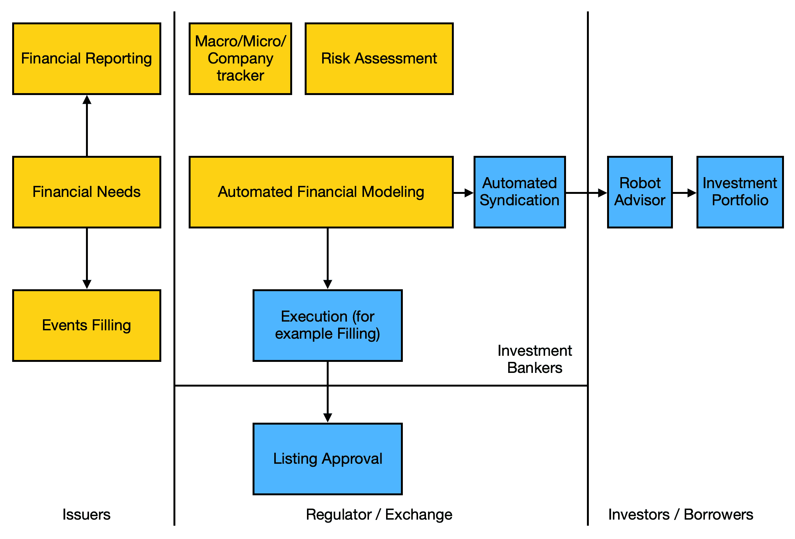
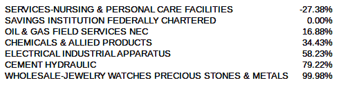

# 第四章：资本市场决策的机械化

在上一章中，我们学习了强化学习。我们学习了如何使用强化学习自动化银行决策。我们还学习了如蒙特卡罗模拟、逻辑回归模型、决策树、神经网络和深度学习等 AI 建模技术。然后，我们学习了如何建立破产风险预测模型，并使用决策制定来通过强化学习为贷款提供资金。

本章将帮助我们理解基本的财务和资本市场概念。我们将研究 AI 如何通过运行风险模型来生成销售预测，从宏观经济数据中优化最佳资本结构。它有助于规划组织的内部财务领域和与外部投资者的沟通。与商业银行活动一起，包括为公司日常交易活动提供资金，投资银行旨在从这些资本筹集市场中为可能需要在资本部署方面具有更大灵活性的公司提供支持，特别是在中长期活动方面。我们将通过两个例子帮助你进行资本需求的财务规划。

本章将涵盖以下主题：

+   理解投资银行的愿景

+   财务领域的基本概念

+   AI 建模技术

+   寻找最佳资本结构

+   使用宏观经济情景提供财务表现预测

让我们开始吧！

# 理解投资银行的愿景

在我们探讨财务领域的基本概念之前，必须先了解投资银行的愿景。投资银行的未来取决于公司未来财务表现和行为的预测准确性，以及在模型中如何将企业的关键因素作为特征捕捉。证券分发给投资者的过程将实现自动化，联合承销台也会实现自动化。接下来的两章将介绍关于客户资本决策方面的变化，以及关于投资银行家如何使用模型来寻找投资者，以支持客户的资本需求（通过债务或股权融资的客户被称为**发行人**），并基于财务因素预测客户的并购需求。

## 基于投资银行的业务表现

一旦所有这些预测都由机器完成，将通过连接公司与监管机构和交易所的 API 实现自动化申报。下图展示了发行人、投资银行家、投资者/所有者和监管机构/交易所如何协作和协调：



在前面的图表中，**发行人**是与注册和销售证券相关的法律实体。发行人出售这些证券以便为实体的运营筹集资金。发行人必须执行的任务包括准备财务报表和评估财务需求。投资银行家通过执行各种操作来促进发行人的上市和审批过程。

# 财务领域的基本概念

在本节中，我们将了解财务领域的基本概念。我们将首先看看财务报表是如何形成的。我们还将理解如何优化资本结构的理论部分。

## 财务报表

财务报表用于公司的健康报告。财务报表是上市公司年度报告的一部分，也是了解公司财务健康状况的基础。

银行家根据该报告中的结果推荐金融产品，而投资者则通过参考此报告做出投资决策。关于财务报表，主要有两种类型：

+   **资产负债表**：这关乎整体净资产。它详细列出了总投资（资产）、我们欠他人的债务（例如，信用卡、抵押贷款、负债等）以及投资减去负债后的净值，即净资产（股东权益）。

+   **利润表**（**P&L**或收入表）：这种类型的报表显示财务年度的动态。它类似于每月的收入和支出报告。

除了主要类型之外，我们还有以下几种财务报表：

+   股东权益变动

+   综合收益表

+   现金流量表

这些描述了所有者权益的变化、未在收入表中捕捉到的收入和现金流动。然而，为了简化我们示例的范围，我们不会深入讨论这三张报表。

### **实时财务报告**

每一笔交易都会作为输入传递到会计系统中，而每笔交易会被分类到一个账户，这个账户将被归类到这些报表中的一个或两个。到一天结束时，每个账户都会被归类为账户条目。

通过分析时间序列数据（在第二章，*时间序列分析*中），我们可以清楚地看到长期预测的局限性。因此，为了做出准确的预测，我们的方法转向进行频繁更新的短期预测。由于我们是公司的一部分，因此完全有可能基于系统每天流动的交易数据生成每日财务报表。对于那些不了解会计系统和财务报表的人，我们的 Excel 表格提供了一个例子，展示了交易数据如何被汇总成财务报表。下表显示了账户如何分类到资产负债表和利润表中：

| **项目** | **资产** | **股本** | **负债** | **损益表** |
| --- | --- | --- | --- | --- |
| 股本 | Y | Y |  |  |
| 营运资本 | Y | Y |  | Y |
| 资本支出 | Y | Y |  | Y |
| 债务资本 | Y |  | Y |  |
| 银行贷款 | Y |  | Y |  |

**股本** 是我们为公司成立所贡献的资金（资本意味着生产性的金钱）。这就像我们出生时从父母那里获得的资源一样。它用于公司的股本，自然地成为公司拥有的资产的一部分。股东是为公司的资本做出贡献的人；因此，他们是公司的所有者。公司有望向投资者支付股息（可以是现金或以公司股票形式），主要是每年一次。关于他们在公司中拥有的资金，他们在偿还欠他人的款项后拥有一切。

**营运资本和资本支出（资本支出）** 就像我们运行家庭所需的常规经常性支出，如食品杂货、账单和燃料。资本支出就像是让你拥有的房屋看起来更好，从而提高市场价值，或者是你作为 Uber 司机购买的新车（对于 AI 研究人员来说，GPU 电脑可能是资本支出）。以这种方式，任何影响损益表的因素都会影响股本和资产，这意味着我们作为净收入所赚取的东西将成为我们的净值和资产的一部分。对于公司来说，资本支出用于获取房地产和设备。

**负债：** 债务资本和银行贷款是借来的钱和资产。当我们借这些负债时，它们通常以现金形式出现，但我们会立即将这笔现金用于资本支出。债券持有人和借款人是为公司提供债务资本和银行贷款的人。公司有责任支付利息（现金）以奖励借款人/债券持有人，主要是每半年一次。债券利息也称为 **票息**。我们借的金额称为 **本金**。因此，在每种借款关系中，我们既有本金，也有利息。

**首席财务官的目标：** 对于不同类型的资本或资金，你可能会想知道公司到底是为了什么。它应该做什么？根据 Max Weber ([`sk.sagepub.com/books/writers-on-organizations`](http://sk.sagepub.com/books/writers-on-organizations))的说法，公司应通过组织公司内部的资源高效地提供经济价值。因此，成为首席财务官意味着我们正在组织财务资源，支持公司主要的经济活动，这可能是为 Duke Energy 生成能源或组织商品，使其到达超市的最终客户手中。

## 优化公司结构的最佳理论

最佳的资本结构是将融资渠道用于公司发展，同时通过适当的风险承受能力最大化投资者的投资价值，以最符合公司业务的方式。例如，当公司处于发展阶段且未来不确定时，最好使用“粘性”资本进行融资，即股权。等公司稳定后，通常会配合稳定的资金来源，即债券。

### 需要做出哪些决策？

作为长期战略 CFO，我们需要做出的决策是如何在股权和债务之间找到合适的平衡，以便为公司提供资金。在股权方面，我们需要考虑发行多少股票来吸引这些投资者，以及支付多少股息（定期回报投资者）。在债务方面，我们需要考虑多少负债、债务类型、债务货币、利率以及还款期限。

### 资本结构的财务理论

其中一个很好的资源是 Aswath Damodaran 的《应用公司财务》（*Applied Corporate Finance*）( [`www.wiley.com/en-us/Applied+Corporate+Finance%2C+4th+Edition-p-9781118808931`](https://www.wiley.com/en-us/Applied+Corporate+Finance%2C+4th+Edition-p-9781118808931))。一方面，公司识别一个投资项目（投资决策），另一方面，公司为项目安排资金（融资决策）。我们不是要确定投资哪个项目，而是如何为项目融资以实现它。

根据 Bradley、Jarrel 和 Kim 的研究（[`econpapers.repec.org/article/blajfinan/v_3a39_3ay_3a1984_3ai_3a3_3ap_3a857-78.htm`](https://econpapers.repec.org/article/blajfinan/v_3a39_3ay_3a1984_3ai_3a3_3ap_3a857-78.htm)），存在一种最佳的股权和负债（称为**债务**）资本结构，可以实现最低的整体融资成本。虽然 Damodaran 已经总结了很多原因，但我们主要关注的是如何利用人工智能帮助 CFO 确定一个可量化、可衡量的最佳资本结构。

作为数据科学家，我们关注两种选择的成本和收益，这两者将帮助我们找到最佳的资本结构。我们来看看：

| **为什么选择股权？** | **为什么选择债务？** |
| --- | --- |
| 1) 如果没有利润，则无需支付股息——对于投资的灵活性更大，尤其是像技术这种现金流不明确的领域。2) 单纯增加股本不会提高股本成本——这可以近似为我们支付的股息。然而，增加债务会增加公司破产的概率，因为有更多的义务偿还利息或本金。3) 在某些财务比率的特定细节上更具灵活性；例如，一些债券借款人会限制公司某些财务比率在特定范围内。 | 4) 支付给贷方的利息被视为费用，因此无需缴纳税款，而如果作为股息支付（给股东），则不计入费用，因此需要缴纳利润税。5) 现有股东可以保持公司控制权，而无需稀释所有权。 |

+   第一点关于项目产生高于融资成本回报的确定性，可以通过回报的方差来近似。

+   第二点和第三点可以用公式编码：对于第二点，一个公式可以指定债务的百分比（称为**杠杆**）在增加破产风险中的作用（信贷风险模型在上一章中有解释）。对于第三点，这只是一个可以获得的比率，即公司的税率。

+   第四点和第五点可以通过设定一个固定的阈值来实现，限制公司可以筹集的最大股本。对于家族企业来说，股本的变化很少发生，除非家族发生变化（例如创始人去世）。

## 总要素生产率用于衡量项目价值

这实际上是我们在第二章中提出的问题，*时间序列分析*，当时我们使用时间序列分析来自动化客户采购，并试图理解如何预测每个月的需求。对于长期预测，我们可以使用 ARIMA 模型进行投影。然而，在预测一个项目在组织内的成功时，并没有明确的模型，因为它需要团队成员的数据、项目的执行情况以及项目的类型和产出，这本身属于管理学中一个独立的学科领域。

我们可以通过三种方式来实现这一点：

+   通过借鉴市场洞察，我们可以假设如果一个项目没有风险，它通常会产生市场的资本回报——其下限接近无风险利率。当然，高风险项目的回报应该更高。

+   总的来说，如果项目与过去相似，则项目回报的预期值应为项目投资回报的现值。它必须等于公司的股本回报。

+   如果一定要有一个模型，可以借鉴宏观经济学文献，生产率由总要素生产率公式来衡量：


在这里，*Y* 是产出，*A* 是技术效率，*K* 是资本支出，*L* 是劳动力。资本消耗效率在融资、采购和资源获取方面的效率由 *alpha* 表示。劳动力技能由 *beta* 表示。让我们更详细地讨论这些：

+   ***A*** (**技术效率**): 技术效率可能是每花费一美元机器的全面处理能力提供的理想经济价值。

+   ***L*** (**劳动力**): 劳动力意味着每花费一美元产生的劳动力的理想经济价值。

+   ***K*** (**资本**): 投资于技术和劳动力的资本金额。

+   ***alpha*** (**资本消耗效率**): 这可以是花费在无货物利润上的实际经济价值，由中介获取并在过程中。

+   ***beta*** (**劳动力技能**): 正如《人力资源与组织行为》一书所述，成功的项目交付直接与个体成员的能力及其在团队中扮演的角色相关。这可以从越来越多的体育比赛结果预测中看出，这些预测可以预测每场比赛的成功概率。

宏观经济模型确实是许多微观行为的集合行为。关于宏观经济学的下一个前沿，数据科学家从已应用于个体公司或聚合微观行为的宏观经济模型中获取见解可能是有意义的。

如果我们要提供一个预测每个公司项目价值的模型，我们经常会从其他学科中发现一些见解，并且可以通过预测模型来量化它。拥有这些技术、投资金额和劳动力的特征可能是研究宏观经济的一个良好起点。

这样做可以预测项目的经济价值，这本身可以成为一个机器学习模型。在本章中，我们不会涉及这一点，因为我们希望专注于高层次的财务决策，但是金融的下一个前沿可以产生价值。

## 项目的现金流模式

除了项目的生产力/经济价值之外，我们还需要找出项目的精确现金流支付或收款。答案是从一个集中的信任存储库跟踪项目的所有事件。但等等：为了让所有方共享有关同一项目的信息，而不是拥有一个成为黑客中心的中央存储库，我们需要一个完全分散的地方；这就是区块链的理念。最佳的现金流模式预测来自于获取触发现金流活动的数据：无论是由签署进度确认的项目状态、根据付款条件确认销售协议、在仓库确认货物收到等。

实际上，在今天的世界中，大多数这些步骤仍然需要人工输入，因此更容易要求相关人员提供前瞻性的现金流预测。当然，如果所有这些活动都实现自动化，并由智能机器处理并编码到结构化数据库中，那么可靠地预测未来的现金流似乎是可能的。

即使我们将数据输入交给人类，财务中仍然要求人类提供三种情景——最优情景、现实情景和悲观情景——每种情景都有不同的发生概率。预期的预测结果将是这三种情景的预测结果。然而，考虑到极端预测的潜在问题，似乎更好让人类做出一个现实的预测，并为这些现金流事件在短期内发生的可能性分配一个概率。

再次强调，我们讨论的是大额支付。对于小额支付和多次支付，我们有以下几种方法：

+   规则性现金流

+   不规则/事件触发的现金流

**规则性现金流** 基于商业规则；例如，工资支付每周五进行。但为了预测下周的工资现金流，我们需要获取人力资源数据库，并查看每个员工的薪水。

对于日常业务而言，规则性现金流是基于采购支付和销售产生的支出，我们可以依赖在上一章中开发的模型。一旦我们预测了需求（销售），就可以可靠地估算所需的采购量及对应的支付延迟时间——因为我们知道企业买家会延迟支付供应商，以获取流动性。为了澄清这一点，以下是几种解释：

+   在财务中，通过 Churchill N.C.和 Mullins, J.W. 2001 年《*How Fast Can Your Company Afford to Grow?*》中的公式可以计算销售增长所需的营运资金比率。（[`hbr.org/2001/05/how-fast-can-your-company-afford-to-grow`](https://hbr.org/2001/05/how-fast-can-your-company-afford-to-grow)）

+   延迟支付对于供应链来说可能不是最优选择，因为我们知道这种延迟支付会导致上游供应商进一步增加其短期融资需求，以资助商品生产。如果上游供应商规模较小，那么如果这些高风险/小规模供应商以更高的利率获得融资，实际上会增加供应链的整体生产成本。

**不规则/事件触发的现金流：** 通常由其他方或外部事件触发。处理这一情况的最佳方法是改善与客户或供应商的数据交换。

## 财务报表项目预测

在这一部分，我们将讨论如何预测财务项目。让我们来看看：

+   **销售：** 如果你是经过金融培训的专业人士，那么最大的驱动因素——即收入——必须基于公司所提供的商品/服务的需求来预测。以杜克能源为例，预测电力市场基本上是观察各个细分市场的市场增长：工业、商业和家庭。这是与市场营销合作的最佳方式。

在工业和商业（B2B）市场中，最可靠的预测是观察客户的情况；最终，商业实体将必须创造一些商品和服务供最终消费者消费。对于工业和商业市场，我们可以从观察加利福尼亚州主要的工业活动及其潜在的电力消费开始。然后，我们可以进一步观察他们生产的是什么。

家庭的电力需求取决于家庭收入、人口、私人电动汽车以及最重要的天气情况——无论是厄尔尼诺现象还是其他天气预报，这些都是重要因素。尽管我们可以使用宏观经济数据（及其预报，例如天气预报）来预测我们的销售额，但并非总能为财务报表中的每一项财务数据找到预测指标。在这里，我们可以利用已知/可预测的项目来预测其他项，这应当具有经济和统计上的意义。

简而言之，预测销售的最佳方式是预测个人部门的销售活动。

+   **商品销售成本：** 这与销售量相关。尽管我们知道这并非 1:1 的关系，但作为首席财务官，我们可以获取每月的内部成本和销售数据，并建立一个基于销售额来预测这些成本的模型。或者，我们可以利用需求量来预测采购量。至于杜克能源，单位成本也主要来源于商品市场；鉴于我们已经设定了关于何时购买的目标采购策略，并且单位成本的全球市场受资本市场的驱动，我们可以从市场中获得前瞻性的定价（即 CME Henry Hub 的 12 个月定价，[`www.cmegroup.com/trading/energy/natural-gas/natural-gas.html`](https://www.cmegroup.com/trading/energy/natural-gas/natural-gas.html)））。

对于从事实物商品行业的公司，如果没有将任何固定成本（如设备、机械等）分配到某项商品上，那么商品销售成本与销售额的比例接近 1:1。一个典型的例子是时尚行业，在这种情况下，商品销售成本应与销售额对齐。这些销售额与我们购买的商品成本成正比。

为了说明这一点，让我们对不同行业的商品销售成本与销售额进行小规模分析：



+   **运营费用，包括销售、一般管理和行政费用**（**SG&A**）：根据会计准则和公司实践，一些公司并未单独列出折旧和摊销，这些并非与销售活动呈线性关系。从前面的表格来看，我们看到的趋势是，固定资产密集型行业（称为**资本支出**）的销售对销售成本的预测能力较低。另一方面，人力密集型且固定资产较少的行业，其销售成本更有可能随着可变成本比例的提高而发生变化。

# AI 建模技术

在本节中，我们将探讨两种重要的建模技术，分别是**线性优化**和**线性回归模型**。在上一章中，我们学习了深度学习、神经网络、决策树和强化学习。

## 线性优化

线性优化模型在供应链业务中经常使用，它通过改变一些变量同时考虑一些约束条件，来实现优化目标（即最大化利润或最小化成本）。在线性优化的情况下，我们也实现了类似于资本结构优化过程的结构。

这不是一个机器学习模型，因为我们不需要训练机器来学习任何模式。

## 线性回归模型

这通常被称为回归模型。它的作用是找出一些因素对结果的因果关系。结果必须是数值型的。在统计学中，*一些因素*指的是自变量，我们假设这些因素彼此独立，而结果则是**因变量**。结果依赖于自变量。

# 寻找最优资本结构

现在，我们可以开始分析应当在资本市场筹集多少股权和债务资本来支持需求（新项目和业务，或者通过更换旧的或过时的机械设备）和供应（通过利润产生）。我们对最优资本结构的预测是有时间限制的；也就是说，它涉及给定时期的最优组合，比如下一年。当然，我们也可以将其扩展到未来五年。用来预测商业表现的公式如下：

*收入增长 * 固定资本需求 / 销售额*

最优资本结构是能够以最低资金成本提供所需资本，从而在公司内创造价值的资本结构。

## 实施步骤

在本节中，我们将学习如何实现一个机器学习模型，该模型能够找到最低资金成本的最优资本结构。

### 下载数据并加载到模型中

在我们的示例中，我们从外部金融数据提供商 Quandl 下载数据。这些数据是季度数据。假设我们是公司的 CFO，我们可以获得实时的每日预测，以定期更新我们的资金策略——每周、每月和每季度更新。步骤如下：

1.  在这里，我们将使用*Ticker*来表示公司的唯一标识符。使用以下代码导入所需的库依赖：

```py
import quandl
import pickle
import numpy as np
import math
import pandas as pd
from sklearn import linear_model
import matplotlib.pyplot as plt 
import seaborn as sns
```

1.  定义公司 API 密钥和股票代码：

```py
tkr = 'DUK'
quandl.ApiConfig.api_key = '[API key from Quandl]'
```

1.  下载纽约证券交易所指数值和股票代码，然后计算纽约证券交易所与股票的回报，以得出 CAPM 定价模型中的贝塔值和无风险利率：

```py
'''*************************************
## Retrieve data for 2A.
'''
econ = quandl.get("FRED/TEDRATE", authtoken="[API Key from Quandl]", start_date='2018-05-31', end_date='2018-07-31')
NYSE_index = quandl.get('WFE/INDEXES_NYSECOMPOSITE', start_date='2013-05-31', end_date='2018-07-31')
```

1.  下载公司的财务数据，以预测并获取目标公司两年的财务数据。这些数据将输入到信用模型中：

```py
'''*************************************
## Retrieve Data for the target ticker
'''
record_db = quandl.get_table('SHARADAR/SF1', calendardate='2017-12-31', ticker=tkr,dimension='MRY')
record_db_t_1 = quandl.get_table('SHARADAR/SF1', calendardate='2016-12-31', ticker=tkr,dimension='MRY')
```

1.  下载公司的历史财务数据，以便估算驱动因素之间的参数：

```py
'''*************************************
## Download & Load Data for 2C.
'''
tkr = 'DUK'
quandl.ApiConfig.api_key = 'nzBtupqX5H65EG3sFusF'
record_db_t_2017Q1=quandl.get_table('SHARADAR/SF1', calendardate='2017-3-31', ticker=tkr,dimension='MRQ')
...
df_all = pd.concat(list_all)

#fix the dataframes

#convert to float

#create new fields

#remove any record with na and 0 values to avoid division errors

#we take a proxy here, should use last period's numbers as denominator not current period
```

### 准备参数和模型

在本节中，将计算以下参数：

+   使用资本资产定价模型（CAPM）中的杠杆贝塔来计算股本成本。

+   通过重新使用信用模型（逻辑回归模型）来计算债务成本。我们之所以使用这个模型，是因为它简单，并且需要最少的财务比率。

+   销售成本。资本支出通过将其与销售增长和销售成本相关联来估算。

使用这些参数，可以估算财务模型的主要变量，具体如下：

+   **计算股本成本公式**：根据 1A 的数据，找出无风险利率和贝塔值，作为 CAPM 模型回归公式的截距和系数：*股票回报 = 无风险利率 + 贝塔值 * 市场回报。*

+   **计算债务成本公式**：通过计算财务比率来计算债务成本。我们使用的模型基于上一章节中计算的 5 年违约率。在现实中，债券评级由评级机构（如穆迪或标准普尔）制定，而银行贷款评级则由每家银行的信用风险模型内部进行评定，类似于我们使用的模型。

+   计算驱动因素，查看销售如何直接或间接地通过销售成本驱动利润与损益表/营运资本中的其他项目。

+   我们假设销售成本（或销售费用）由销售活动驱动，而运营费用由销售成本驱动。我们假设这种关系是线性的，可以通过回归模型计算得出。

+   销售费用和一般管理费用在我们的示例中为零；因此，我们没有相关的计算。

+   我也尝试过弄清楚营运资本与应收账款、存货和应付账款之间的关系，但我们最终不采用这个方法，而是采用另一种方式——每笔销售所需的总现金量——来计算在日常运营中支持销售所需的现金/营运资本量。

### 预测

预测涉及估算收入增长，然后考虑影响损益表的股本和债务资本需求。大部分预测逻辑嵌入在`cal_F_WACC`中。优化结果是通过尝试资本结构中债务比例（%）范围来最小化加权平均资本成本（WACC）。遗憾的是，我们尝试过后发现，通过代码执行这一过程并不简单，除非实现线性优化算法，这将使程序更复杂，尽管这种方法在计算上更高效。

*准备参数和模型*部分提到的所有阶段都已合并。公式是基于在 Excel 中看到的依赖关系构建的。然而，流程大体从销售额开始，然后确定资本结构，再回到损益表。

计算加权平均资本成本后，将其与预设条件进行比较，比如信用风险变化，不能超过某个阈值。

以下是预测中的会计公式：

+   **销售额预测：** *销售额 = 现有销售额 * (1 + 销售增长率)*

+   **净收入按照销售额计算：** *净收入 = 销售额 - 销售成本 - 销售、一般管理费用 - 营运费用 - 净利息费用 - 税务费用*

+   *销售成本 = 销售额 * 销售成本比率*

+   *销售、一般管理费用 = 销售额 * 销售费用比率*

+   *一般管理费用与销售额比率*

+   *营运费用 = 销售额 * 营运费用与销售额比率*

+   *净利息费用 = 债务 * 利息费用百分比*

+   **我们需要的总股本和债务等于所需资本**：*股本 + 债务 >= 现有固定资产净值 + 新增固定资产需求 + 所需营运资本 + 存货 + 商誉*

+   *股本 = 现有股本 + 新生成的股本*

+   *债务 = 现有债务 + 新增净债务资本*

+   *所需新资本 = 所需新股本 + 所需新债务资本*

+   *新增净股本生成 = 新股本筹集 - 分红支付 + 来自收益的新股本*

+   *新股本来自收益 = 净收入*

+   *新增净债务资本生成 = 新增债务资本筹集 - 债务偿还*

+   *债务偿还 = 上期债务偿还*

+   *所需总固定资产（PPE） = 现有固定资产（扣除折旧） - 下期折旧 + 所需新增固定资产*

+   *销售额 / 总固定资产需求 = 销售额与固定资产比率*

+   *所需营运资本 = 每销售所需营运资本 * 销售额*

+   *每销售所需的营运资金 = 销售成本/销售额 * 总现金周期天数/经营现金周期天数 + 经营费用/销售额 * 1/2*

其代码如下：

```py
'''*************************************
3\. Projection
'''
print('optimization...')
#simulations
record_db_f = record_db

#Projection
...

def cal_F_WACC(record_db_f, logreg, logreg_sc, new_debt_pct,price_offering,levered_beta,sales_growth,coefs,r_free):
...
for new_debt_pct in debt_pct_range:
 for price_offering in price_offering_range:
 ...
 F_WACC, F_default_risk,conditions = cal_F_WACC(record_db_f,logreg,logreg_sc, new_debt_pct, price_offering,levered_beta,sales_growth,coefs,r_free)
 '''****************************************
 4\. Calculate WACC
 '''
 #update WACC
 obj = F_WACC < optimal_WACC and F_default_risk/default_risk_existing-1<=0.75
 ...
```

### 计算加权平均资本成本

这一步骤的目标是确保以下事项发生：

+   理想的资本结构通过债务和股本的组合获得最低资本成本的奖励。

+   股本成本由资本资产定价模型定义。

+   债务成本由信用风险成本和无风险利率的成本定义。信用风险成本由我们在上一章构建的信用模型计算得出。

+   最小化以下内容：

+   **加权平均资本成本**（**WACC**）

+   债务成本

+   信用风险成本

+   股本成本

+   无杠杆贝塔

+   杠杆贝塔

### 优化中使用的约束

让我们看看资本的供需关系，它必须得到妥善安排：

+   **资本结构限制**：现有债权人不希望信用评级发生变化；因此，他们希望将违约风险的变化限制在 75%以内。

+   **计算出的约束，但未进行优化检查**：

+   这些限制未被实施，因为会导致损益项目的循环引用，必须加以修复。

+   通常，这些是现有股东施加的限制。

+   现有股东不希望每股收益因股份增多而下降。

+   现有股东不希望通过大幅增加股本的方式向公司追加额外股本。

以下代码片段展示了如何计算股权发行约束：

```py
#equity offering constraints --- not bounding
price_offering = record_db_f['price'][0]
unit_offering = int(F_new_equity / price_offering)
F_eps = F_earnings / (unit_offering+record_db_f['shareswa'][0])
equity_growth = F_equity / record_db_f['equity'][0]-1
eps_growth = abs(F_eps/ (record_db_f['netinc'][0]/record_db_f['shareswa'][0])-1)
c_eq_1 = equity_growth <= 0.1
c_eq_2 = eps_growth <= 0.3
```

恭喜！我们已经通过优化找到了公司的最优资本结构。

# 使用宏观经济情境提供财务表现预测

首席财务官的一个关键工作是提供财务表现的预测。那么，人工智能将如何改变这一工作？我们将基于我们在财务领域的知识，帮助进行会计规则之间的财务预测，并加入我们时代的预测能力来提升它。

作为上市公司的首席财务官，我们的一个关键职责是为前瞻性的财务数据提供管理层和分析师指导。假设数据由作者手工制作，旨在模拟会计系统的样子。

在这一部分，我们将探讨如何预测公司的财务表现。

## 实施步骤

在这一部分，我们将学习如何使用宏观经济情境推导财务表现预测。步骤如下：

1.  通过从 CSV 文件加载并导入所需的库依赖项，初始化每个行业的股票代码：

```py
from pyquery import PyQuery
import pandas as pd
import quandl
import matplotlib.pyplot as plt
from sklearn import linear_model
from sklearn.metrics import r2_score

...
```

1.  从 Quandl 下载历史财务数据：

```py
cal_LIND = quandl.get("FRED/CASLIND", authtoken="nzBtupqX5H65EG3sFusF")
cal_ele = quandl.get(["EIA/ELEC_SALES_CA_RES_M","EIA/ELEC_SALES_CA_IND_M"], authtoken="nzBtupqX5H65EG3sFusF")
```

1.  计算推导表现所需的各种参数：

```py
#update the index date to begin of month (in fact all index should be referring to end of month)
cal_ele['mth_begin'] = cal_ele.index
#change the column to begin of month
...

reg_retail = linear_model.LinearRegression()
reg_retail.fit(df_marco[[' MeanAvgTemperature']], \
               df_marco['EIA/ELEC_SALES_CA_RES_M - Value'])
reg_retail.coef_
reg_retail_pred = \
            reg_retail.predict(df_marco[['MeanAvgTemperature']])
error_retail = r2_score(df_marco['EIA/ELEC_SALES_CA_RES_M - \
                                  Value'], reg_retail_pred)

reg_ind = linear_model.LinearRegression()
reg_ind.fit(df_marco[[' MeanAvgTemperature']], \
            df_marco['EIA/ELEC_SALES_CA_IND_M - Value'])
reg_ind.coef_
reg_ind_pred = reg_ind.predict(df_marco[['MeanAvgTemperature']])
error_ind = r2_score(df_marco['EIA/ELEC_SALES_CA_IND_M - \
                               Value'], reg_ind_pred)
...
```

恭喜！你已经使用气象专家可靠预测的宏观因素生成了销售预测。

# **总结**

在本章中，我们探讨了金融银行业务以及金融领域的一些基本概念。我们学习了两种重要的机器学习建模技术，分别是优化技术和线性回归模型。我们还研究了两个帮助自动化资本市场决策的例子——*寻找最佳资本结构*和*使用宏观经济情景提供财务表现预测*。此外，我们还探讨了投资银行和财务报告的未来及其影响。

然后，我们探索了财务预测和财务建模的内部过程，这得益于实时财务 IT 系统的迅速更新，使得财务职位能够实时更新。通过每天利用丰富的财务职位数据，我们有大量数据点可以进行可靠的公司财务状况预测。作为公司的战略思维者，我们还探讨了如何依赖外部数据（如来自政府流行天气预报服务的天气数据）来弥补 CFO 所面临的内部财务数据缺失问题。我们利用了一个外部数据提供商 Quandl，将同行业的所有财务数据融合在一起。实际上，这种技术应该被内部职位快照所替代，但本质上，关键点是将 AI 与财务建模结合起来。

正如你所看到的，财务报告的未来可能不仅仅是报告财务报表那么简单。首席财务官（CFO）可能需要披露项目的状态和计划，以提高透明度，同时提供投资者的利益，而不危及商业机密。这种披露形式也出现在年度报告中，但尚未以定量格式呈现。未来的 CFO 们将不得不迎接这种新的报告理念浪潮，因为组织内部发生的事情正是推动资本回报的关键因素。

在下一章中，我们将继续学习新型机器学习技术，这些技术将帮助我们解决复杂的金融问题。我们还将了解一个核心商业概念——**并购**（**M&A**）。我们将了解像 SQL 这样的数据技术基础概念，并研究一种名为**聚类模型**的机器学习建模技术。
