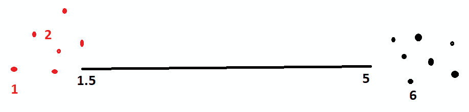
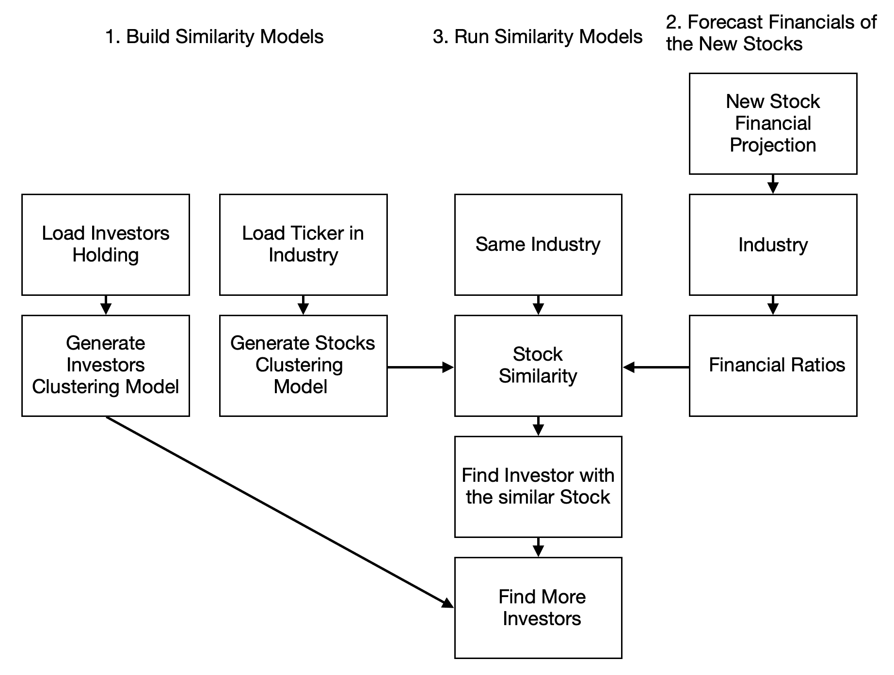

# 第五章：预测投资银行家的未来

在上一章，我们理解了基本的金融和资本市场概念。我们探讨了人工智能如何通过运行风险模型和利用宏观经济数据生成销售预测，帮助我们优化最佳资本结构。我们还看到了人工智能在规划组织的财务内部和外部投资者沟通方面的应用。接着，我们通过两个例子进行说明——第一个是如何优化债务和股本的资金组合，第二个是进行财务预测，以帮助我们规划资本需求。

本章的目标是介绍可用于财务规划的额外技术。你将学习如何为新发行执行自动化配售，以便从有兴趣的投资者那里获得资本。接着，你将学习如何识别收购方和目标方，这一过程需要具备科学背景，才能挑选出最需要银行服务的对象。

本章将涵盖以下主题：

+   投资银行的基础知识

+   理解数据技术

+   聚类模型

+   新发行的自动化配售

+   识别收购方和目标方

让我们开始吧！

# 投资银行的基础知识

投资银行业务将是本章的重点。因此，你需要理解一些与投资银行相关的基本概念。我们将从理解**首次公开募股**（简称**IPO**）的挑战开始。当一家公司决定通过公开市场从公众那里获得资金时，它们会发布 IPO 供公众和机构认购。我们还将理解并购（M&A）的概念，以及如何对投资者进行分类并将人工智能应用于并购。

## 投资银行家在首次公开募股（IPO）中的角色

以下是投资银行家处理的一些核心问题：

+   **定价：**新发行（股本）的正确价格是多少？

+   **配售：**我们应该将股票分配给谁，且以什么价格？

+   **上市：**我们如何将这些股票注册到市场（如证券交易所），以便它们满足作为市场投资证券的所有要求？

让我们逐个回答这些问题。

为了回答第一个问题，在上一章中，我们简要阐述了如何正确建模公司资本结构，包括其财务状况。核心问题在于如何估算驱动因素，尤其是在给定一些与公司相关的宏观指标时。

要回答第二个问题，市场对投资偏好的可见性是很重要的。当投资者的投资决策由机器人顾问自动化时，我们应该很容易测试由机器人代表的投资者需求。机器人需要投资参数，而这些预测大部分是由投资银行的引擎生成的；也就是说，在访问潜在问题信息时（也称为**招股说明书**），其过去的准确性也应被考虑。我们将在本章完成的第一个示例中讨论这个问题。

第三个问题侧重于报告和归档公司所有权和法律状态的合法性以及其风险因素的相关信息。当这个问题由机器人执行时，监管机构/证券交易所会有不同的要求：

+   应该有一个来自监管机构/证券交易所的机器人来验证公司申报的声明。在这里，机器人指的是一种智能软件程序，可以执行为其设计的特定任务。然而，按照我们在第四章《资本市场决策的机械化》中的讨论，上市公司的 CFO 也许能够上传他们的销售预测。影响电力公司销售的关键因素是天气，因为天气对销售的预测性非常强。

+   除了与销售相关的因素外，风险因素还包括影响财务报表主要财务项目的其他宏观经济变量。与公司战略相关的因素将在第七章《感知市场情绪进行卖方算法营销》中进一步探讨。我们在这里也会进行讨论，因为投资者方面也会影响需要关注的重要议题。

## 股票分类 – 风格

关于股票分类，有两种思路：一种基于定性特征，另一种基于定量特征。我们将重点关注定性方法，这种方法被称为**风格**。一个例子就是*晨星风格盒子*（[`news.morningstar.com/pdfs/FactSheet_StyleBox_Final.pdf`](http://news.morningstar.com/pdfs/FactSheet_StyleBox_Final.pdf)）。

在这里，我们可以考虑行业/部门、股票规模、股票的风险性、股票的潜力等等。有许多方法可以创建特征并对股票进行分类。我们将在本章中使用行业和规模作为定性分类的特征。

定量方法（例如，**套利定价理论**（**APT**））将包含相似因素的股票进行分析性分组。

## 投资者分类

像股票分类一样，既有定量方法，也有定性方法。定性方法可以基于资金类型（养老金、主权财富基金、保险等）、策略（多空策略、全球宏观策略等）、基础资产（期货、商品、股票、债券和私人股本等）、风险性等。定量方法则可以基于这些投资者所依赖的临近因素。在本章的第一个例子中，我们将使用投资风险性和回报作为定性分类的特征。

## 并购

投资银行业务不仅仅涵盖证券上市，还包括像**并购**（**M&A**）这样的咨询服务、公司估值等财务意见，以及其他由事件驱动的融资活动，比如管理层收购。简而言之，所有这些活动都涉及公司和/或公司资产的买卖，并正确定价。理解这些最简单的方式是通过想象房地产经纪人、评估师和按揭银行家买房子的方式。并购就像两个人结婚——有时一个会更占主导地位，而有时则是两个平等实体的结合。这背后的逻辑是，公司的存在是因为它的运营效率更高，正如罗纳德·科斯在 1937 年所理论化的那样。随着技术、法规和消费者偏好的变化，公司的经济边界也会变化，这就为并购提供了合理性。

我们主要讨论以下几种类型的交易：

+   收购（收购另一家公司）

+   合并（两家或更多公司合并）

+   剥离（出售公司本身）

+   分拆（出售部分公司资产）等

另一个对并购分类的维度是通过收购方和目标公司之间的交易前关系来区分：如果它们处于同一行业，这被称为**横向整合**；如果它们是供应商与客户关系，这被称为**纵向整合**；如果它们没有任何关联，这被称为**多元化**。

作为一名投资银行家，以下是你需要关注的关键领域：

+   **交易前事项**：确保收购方和目标方有意愿共同探索交易的可能性。

+   **审批**：由监管机构或现有股东批准。

+   **交易后事项**：确保 1 + 1 > 2。这并不是因为数学错误，而是因为某些过程的整合可以带来更好的结果。所以，当两个实体（公司）合并时，成本将更低，或者收入会更高。

根据《傻瓜指南》([`www.dummies.com/business/corporate-finance/mergers-and-acquisitions/steps-of-the-ma-process/`](https://www.dummies.com/business/corporate-finance/mergers-and-acquisitions/steps-of-the-ma-process/))，并购交易可以通过以下步骤进行总结：

1.  联系目标公司

1.  交换文件和定价

1.  进行尽职调查

1.  完成交易

1.  执行交易后整合

接下来，我们将探讨人工智能在并购中的应用。

## 人工智能在并购中的应用

关于人工智能在银行业务中的应用，人工智能被用来识别正确的目标，并帮助量化交易后的协同效应定价。在现有的设置下，这两个步骤（第一步和最后一步）都不太可靠，因为目前没有太多科学依据。首先，银行家的时间非常昂贵，而任何潜在交易的成功率非常低（例如，90%）。客户（买方/卖方）会有动机最大化银行家的服务时间，即使交易可能无法达成。鉴于银行家的时间有限，而客户有最大化银行家时间的矛盾目标，无论他们是否真正打算完成交易，最佳的方法是找到并基于并购交易得出的实际经济效益。如果从根本上可行，就应更紧迫地宣布并推动投资银行家参与交易执行/公告。

这种建模方法实际上今天已经存在于信用风险建模中，正如我们在前面章节中提到的。根据财务数据，我们预测某一事件是否会发生的二元结果。在信用风险模型的情况下，可能在*X*年内发生破产；而在并购的情况下，基于财务数据，它可能是在*X*年内发生收购或剥离公告。我个人认为，如果能够如此估计破产概率，那么这些建模方法之间并没有什么区别。

其次，在量化交易后协同效应时，通常考虑的是成本效率、收入增长，或通过员工的知识转移实现更高的生产力：

+   关于成本效率，我们可以轻松地运行销售分析，验证行业中的成本关系，以定量方式确认这是否是行业的实际行为，或者仅仅是供应商会接受合并公司支付较低款项的空想。

+   关于收入协同效应，这是一项庞大的数据交换工作，只能通过适当的机器学习模型来完成。例如，如果协同效应是关于更好的市场准入（例如，买方竞争对手 A 收购同行业的竞争对手 B），那么竞争对手 A 的目标模型应在竞争对手 B 的客户数据库上运行，以推测可能产生的收入。这种情况也出现在联合数据库营销项目中，例如通过银行销售的保险（**银保**）。在这种情况下，保险公司提供模型，应用于银行的客户数据库。

+   关于与人力资源协同相关的专业知识，我认为将人力资源分析应用于衡量和量化知识、技能水平、文化适应性以及团队表现是同样具有可行性的。在协同效应分析前期，需要对员工的硬性与软性素质进行衡量、预测和模拟。

为了实现这一点，我认为现有的并购银行家不会愿意做太多的改变，因为考虑到目前客户和员工的数字化程度尚未普及，完成这项任务所花费的时间会非常长。这意味着现有的功能和模型无法实现这一目标。但我确实相信我们应该致力于这一未来的并购模型，特别是现在我们正在构建并购的未来，并培养下一代人才。

与金融投资相比，并购在运营整合方面具有巨大的不确定性，这正是人工智能应当发挥价值的地方。已经有许多研究探讨了成功的并购交易中决定性因素，这些因素能够实现预期的协同效应；这些来自学术研究的发现或特征需要被收集并进行分析，以生成可量化的成功可能性，并在计算报价时进行定价。

## 上市公司报备义务

为了确保公开上市证券的投资者拥有公平的市场，交易所要求我们宣布诸如财务结果发布、重大影响证券估值的公司活动等事件。例如，您可以参考*纽约证券交易所的 IPO 指南*（[`www.nyse.com/publicdocs/nyse/listing/nyse_ipo_guide.pdf`](https://www.nyse.com/publicdocs/nyse/listing/nyse_ipo_guide.pdf)）。

# 理解数据技术

我们将在本章的示例中管理大量数据。因此，了解我们将使用的底层数据技术至关重要。这些数据技术与存储不同类型的数据和信息有关。信息存储有两个挑战——首先是我们用来存储信息的物理介质，其次是信息存储的格式。

Hadoop 是一种解决方案，允许将存储的文件物理分布。这帮助我们处理许多问题，例如将大量数据存储在一个地方、备份、恢复等。在我们的案例中，由于数据量不足以支持使用该技术，我们将数据存储在一台计算机上，但以下 NoSQL 数据库可以支持这种存储选项。在 Python 中，还有一种文件格式叫做 **HDF5**，它也支持分布式文件系统。

虽然可以使用 NoSQL 数据库，但我在本章中没有使用它们的原因可以通过以下表格来解释，该表格对比了 SQLite、Cassandra 和 MongoDB 的特点：

|  | **优点** | **缺点** | **结论** |
| --- | --- | --- | --- |
| **SQLite** | 结构化数据格式，兼容 DataFrames | 不能保存非结构化数据。 | 我们需要它来简化操作。 |
| **Cassandra** | 可以在分布式计算环境中运行，并能够存储结构化数据（以字段为项目） | 处理结构化数据时，语法不直观，需要进行插入操作。 | 由于我们的目标是聚类相似的投资者并预测谁会在首次公开募股（IPO）中购买我们的新发行股票，因此这些工具不适用于我们的案例。 |
| **MongoDB** | 可以处理巨大的数据规模并进行并行处理不同记录 | 不适合处理完全结构化的数据，如交易记录；在运行任何机器学习算法之前，仍然需要将其转换为 DataFrame。 |  |

通过这项分析，我们发现，采用 NoSQL 数据库并非出于追求前沿技术的必要性。在资本市场中，数据相当结构化，使用适合此目的的 SQL 数据库可能更高效。

# 聚类模型

在开始研究编程内容之前，我们先来看看聚类模型，因为在第一个例子中我们将使用一个聚类模型。

聚类的目标是将相似的数据点聚集在一起。以一个简单的例子，当有三个数据点，每个数据点都有一列，[1]，[2]，[6]，我们选取一个点作为质心，表示附近的点；例如，使用两个质心，[1.5] 和 [5]，分别代表一个聚类：一个包含 [1]、[2]，另一个聚类包含 [6]。这些示例聚类可以通过以下图表查看：



当每个数据点有两列时，实际数据点与质心之间的距离需要将这两列视为一个数据点来考虑。我们采用一种称为**欧几里得距离**的度量方法。

在银行业中采用聚类的主要挑战之一是，它可能会生成过大的聚类，这会降低真正的正例率，如果将所有聚类作为目标进行分析的话。根据我的经验，我会将其作为初步数据分析工具，帮助了解目标人群的主要动态，而不一定用于在批发银行环境中得出具有经济意义的可操作性见解。在我们的例子中，我们将创建许多聚类，且有严格要求，每个数据点与质心之间的距离平均偏差为 5%。

另一个关于聚类算法的关键问题是如何确定输入的特征数量。我们可能会因过度权重某些类型的财务比率（例如，使用两种不同的盈利能力比率，如股本回报率和资产回报率）而导致聚类偏差。解决方法是进行主成分分析，它通过将相似的特征合并为同一特征来去除冗余特征。

对于非金融/银行领域的示例，您可以参考 Suresh Kumar Gorakala 的*《构建推荐引擎》*（[`www.packtpub.com/big-data-and-business-intelligence/building-practical-recommendation-engines-part-1-video`](https://www.packtpub.com/big-data-and-business-intelligence/building-practical-recommendation-engines-part-1-video)）。

# 新发行自动配售

如果有问题，背后一定有投资者。传统的投资银行会雇佣一组专业人士，组成一个被称为**联合配售台**的团队，负责将证券问题分配给能够购买这些股票和债券的投资者。

如果我们考虑投资银行联合配售台的角色，我们的工作就是识别即将发布的新证券中的基石投资者，因为 CFO 在股权方面有资金需求。为此，我们将使用来自 SEC 备案的美国股票的机构持股数据，通过 Quandl/Sharadar 来帮助我们找到那些投资偏好相似的投资者，并将这些与同样持有类似股票的投资者匹配，如杜克能源。

关于卖给谁，我们将以美国股票的最大投资者作为我们的投资者群体。联合配售台的工作是将任何股票发行的主要仓位卖给这些投资者。通过使用无监督学习方法，我们将相关的股票推荐给合适的投资者作为首次公开发行（IPO）。这可以通过证券相似度（称为**持仓相似度**）和投资风格（称为**投资者相似度**）来实现。

## 解决问题

以下图表展示了解决当前问题所涉及的步骤：



我们将在接下来的章节中详细讲解每个步骤。

### 构建相似度模型

在这里，我们将构建两个相似度模型——一个是股票相似度模型，另一个是找出相似投资者的模型。两个模型都是聚类模型，属于最后一种机器学习方法——无监督学习。我们选择了 21 个财务比率来构建股票层级的聚类模型，而在投资者模型中，我们最多使用 60 个特征（*六个市值规模 * 五个投资决策 * 两种指标类型*）：

+   六个市值规模：纳米级、市值小型、市值中型、市值大型、市值超大、和巨型

+   五个投资决策：两个买入决策（全新或部分），一个持有决策，两个卖出决策（全卖或部分卖）

+   七个指标：季度回报（总回报、已实现、未实现）、新资金变化率的均值和标准差，以及当前市值

导入所有相关库，然后通过读取 CSV 文件加载股票代码的集合，并同时加载描述股票的规模字段。为了减少处理时间，加载投资者列表，而不是所有投资者。对于每个投资者，计算每个市场细分股票的方向（即，我们使用规模作为唯一的市场细分，实际上，我们应使用国家×行业×规模）。

### 构建投资者聚类模型

为了构建投资者聚类模型，遍历投资者并计算其变动和利润（已实现和未实现利润），如下所示：

1.  导入所需的库和数据：

```py
'''************************
Load Data
'''
#import relevant libraries
import quandl
from datetime import date,timedelta
import pandas as pd
import os

#load tickers universe and description field (scale)
...

#loop through investors
...

for investor in investorNameList:
   ...
   #calculate the change in position by ticker on 
    Quarter-to-quarter basis
   ...

   #qualify investor's activities
   print('classify investor decision')
   ...
   #output the ticker’s activities of the investor
```

1.  准备投资者概况：

```py
## Prepare investor Profile'''
#load relevant libraries
import os
import pandas as pd
import numpy as np
from time import time
from sklearn import metrics
from sklearn.cluster import KMeans
from sklearn.preprocessing import StandardScaler
import pickle

...

#Summarize quarterly performance of investors per quarter
...
for file in file_list:
    ...
    for index, row in tmp_pd.iterrows():
        ...

    #calculate return (realized, unrealized and new money)
    ...
```

1.  准备聚类投资者，以及输出聚类和结果：

```py
## Cluster investors
#cleansed and transform data for clustering
...

sc_X = StandardScaler()
X = sc_X.fit_transform(investor_pd)

#define the k means function
def bench_k_means(estimator, name, data):
    ...

#try out different K means parameters and find out the best parameters
...

for num_cluster in range(5, 500):
    KMeans_model = KMeans(init='k-means++', \
                          n_clusters=num_cluster, n_init=10)
    ...

## Output the results
#Output clusters
```

在这里，我们对列出按市场划分的已实现和未实现收益特征进行聚类分析。然后，我们设置一个 0.05 的阈值，这意味着我们构建的聚类在特征变量上必须有 5%的变化。最后，输出聚类结果；即聚类结果、聚类模型和标准化器。

### 构建股票聚类模型

为了构建股票聚类模型，我们将加载数据，准备股票概况，聚类股票，并输出聚类结果：

1.  加载行业、股票代码和函数，并导入库以及 Quandl 的 KPI 关键数据：

```py
'''*************************************
i. load industry, tickers and functions
'''
#import libraries
import quandl
import pandas as pd
import numpy as np
import os
from time import time
from sklearn import metrics
from sklearn.cluster import KMeans
from sklearn.preprocessing import StandardScaler
import pickle

#KPI keys
...

...
```

1.  使用`sklearn`来运行训练模型。使用`pickle`加载结果和模型。然后，下载股票代码的最新年度财务基本数据：

```py
#define important functions
#download fundamental data of the ticker
def download_tkr(tkr):
    ...
```

1.  定义所需的*k*均值聚类函数。通过使用超过临界值的股票代码来过滤行业。这里，我们将使用 100 个股票代码作为临界值。评估行业时，列出行业中的聚类。然后，下载通过该门槛的行业财务数据。对于行业聚类中的每个股票代码，清理数据类型：

```py
#kmean clustering function
def bench_k_means(estimator, name, data):
    ...

'''*************************************
#2a. load data
'''
#parameters
...

'''*************************************
#i. filter the industry in scope
'''
...

#collect tkr in each industry
for index, row in df_tkr.iterrows():
    ...
```

1.  然后，计算行业的聚类模型。行业中股票代码总数的一半应该是聚类的最大数量。聚类模型将在达到最大轮廓系数 5%的目标值时停止，或者当达到*N*/2 个聚类时停止（*N* = 行业内股票代码的数量）：

```py
'''*************************************
#ii. create a dataframe for each industry to do clustering
'''
...
#loop through the industry
for ind, list_tkr in dict_ind_tkr.items():
    ...
    #Go through the ticker list to Download data from source
    #loop through tickers from that industry
    for tkr in list_tkr:
        ...

    '''*************************************
    2b. prepare features for clustering for the industry
    '''
    #convert to float and calc the difference across rows
    ...
    '''*************************************
    2C. Perform K means clustering for the industry
    '''
    #clustering        
    sc_X = StandardScaler()
    X = sc_X.fit_transform(df_fs_filter)

    ...
    for num_cluster in range(5, max_clsuter):
        KMeans_model = KMeans(init='k-means++', \
                              n_clusters=num_cluster, n_init=10)
        ...
```

1.  输出标准化器、聚类模型和聚类结果：

```py
    '''*************************************
    2D. Output the clustering model and scaler for the industry
    '''    
    #Output clusters
    ...
```

通过采用我们在前一章中开发的财务预测方法，我们可以推导出财务报表，从而得出后续分类股票所需的财务比率。

在前一章我们查看的示例中，我们展示了发行债务和股本后资本结构的变化。但最初，我们并没有假设股价发生任何变化，比如市盈率，而仅假设盈利能力、规模等因素发生变化。

为了预测新股票的财务数据，执行以下步骤：

1.  导入所有相关库并使用`pickle`加载结果和模型：

```py
#import relevant libraries
import os
import pickle
import math
import numpy as np
import pandas as pd
import quandl

...
```

1.  利用我们在上一章中构建的程序，并运行前面一节定义的财务预测。然后，计算预计上市公司财务的各项指标：

```py
#perform financial projection
#reuse the function developed for WACC optimization
def cal_F_financials(record_db_f, logreg, logreg_sc, new_debt_pct, price_offering, levered_beta, sales_growth, coefs, r_free):
    ...

'''*****************************
Step 2: Simulate financial of the new stock
'''
...

#load credit model built previously
...

#reuse the parameters developed from WACC example
...

#assume that we are raising equity for the same client
...

#run simulation / projection of financial data
...
```

如我们所见，股票聚类看起来像我们正在处理的新股票。聚类模型会告诉我们这只新股票与同一聚类中的其他股票的关联。

在构建股票模型时，我们可以使用一个快捷方式，这也是一个实际的考虑因素。对于行业中股票数量过少的情况（例如少于 100 只股票），不需要建立聚类模型来帮助我们发现行业中的子群体。相反，如果股票数量不多，我们应该检查每一只股票。

给定完整的股票聚类成员列表，我们可以去这些股票的现有股东中查找当前的所有者（投资者列表 A）。如果我们仍然需要更多的潜在投资者名单，我们可以再运行一个投资者级别的聚类模型，找出谁（投资者列表 B）可能对这只与投资者列表 A 有相似特征的股票感兴趣。

执行聚类的步骤如下：

1.  查找与我们计划上市/联合发行的股票具有相似财务状况并且属于同一行业的股票。

1.  根据我们找到的股票，我们找出这些股票的现有持有者。

1.  我们查找持有我们检查过的股票的投资者列表；也就是说，选择的投资者。

1.  我们找到所有投资者的聚类 ID。

1.  给定选择的投资者，找出聚类及与该聚类 ID 相同的其他投资者。这些就是我们将出售新发行股票的目标投资者。

以下是我们可以用来执行聚类的伪代码：

```py
#Step 2 and 3\. Perform clustering to find out the similar investors whose sharing the similar stocks

'''*****************************
Step 3: Run the similarity models to find out holders of the similar stocks
'''
#check if we need any model - if industry has too few stocks, no model needed to find out the similar stocks
...

#retrieve the list of tickers that are similar
...

#find list of investors looking at the similar size and more
#check which investors have it...
...

#loop through investors holding name by name to find out investor that is holding the similar stocks
for filename in investorNameList:
    ...

#Load the investor clustering model
...
#extract the investors' cluster id
...

#find out who else share the same cluster id
...

#print out the investor list
...
```

上述代码展示了如何列出具有相似投资组合股票的聚类投资者。在这里，我们已经为投资者构建并使用了一个聚类模型。在下一节中，我们将建立收购方和目标方的理解。

# 识别收购方和目标方

在收购方和目标方领域，企业财务研究有着悠久的历史，而我们的挑战是将这丰富的研究成果应用于现实世界。对冲基金已经将这些研究成果应用于并购套利，而并购银行家一直定期关注市场评分和评估（例如阅读早间新闻）。

在本章中，我们假设你是一位寻找组织机会的并购银行家。为了优化我们的时间分配，我们可以通过集中精力在那些能够完成交易的客户身上，从而更好地分配我们的时间。因此，我们将使用一个模型来预测我们在并购中成为收购方或目标方的概率。

当前的新一代投资银行家应该使用自动化的财务建模工具。随着时间的推移，数据可以被捕捉，然后可以添加预测能力来协助银行家进行财务建模。当前使用 Excel 的世界，确实需要更多关于如何训练机器来解析/理解基于 Excel 的财务模型的自然语言处理研究，这些模型对人类来说很容易理解，但对机器来说几乎无法理解！

其次，M&A 预测模型应成为投资委员会/承保委员会的一部分，其将呈现宣布交易可能性，就像今天的信用委员会呈现信用评级一样。

所以，让我们看看如何将类似的方法应用于并购预测中的信用评级以发现交易。

按照以下步骤解决这个问题。我们将从加载必要的 Python 库开始：

1.  导入所有必需的库并定义关键变量：

```py
'''*************************************
#1\. Import libraries and define key variables
'''
import pandas as pd
import numpy as np
import quandl
import matplotlib.pyplot as plt 
from sklearn.metrics import classification_report,roc_curve, auc,confusion_matrix,f1_score
from sklearn.model_selection import train_test_split
from sklearn import tree
from sklearn.neural_network import MLPClassifier
from sklearn.preprocessing import StandardScaler
import pickle
import graphviz

#KPI keys
quandl.ApiConfig.api_key = '[API Key for Quandl]'
```

1.  下载给定股票的财务数据（从前面的示例中提取），并定义您将用于训练决策树和神经网络的函数，包括网格搜索（所有这些都可以从第三章中获得，*使用特征和强化学习自动化银行融资*）：

```py
'''*************************************
#2\. Definition of functions
'''
#2a.Download tickers
def download_tkr(tkr):
...
#2b.Train tree
def train_tree(X,Y,ind):
...
##2C Neural Network
#2Ci. Grid search that simulate the performance of different neural network design
def grid_search(X_train,X_test, Y_train,Y_test,num_training_sample):
...
#2Cii. Train Neural Network
def train_NN(X,Y,ind):
...
```

1.  筛选具有大量股票代码的行业，并运行通过行业及其相应股票代码来构建决策树和神经网络：

```py
def filterIndustriesByTickets(ind):
```

1.  按行业输出 ROC 曲线的结果：

```py
def displayCurveChart(type, ind):
```

1.  从文件中加载公司列表以及它们的行业，就像我们自动合作一样。选择至少有 30 家公司的行业，将相同行业的股票代码加载到字典的一个条目中，以行业作为键，股票代码作为值：

```py
'''*************************************
3\. Execute the program
#3a. filter the industry in scope
'''
groupby_fld = 'sicsector'
min_size = 30
df_tkr = pd.read_csv('industry_tickers_list.csv')
...
#collect ticker in each industry
for index, row in df_tkr.iterrows():
    ind = row[groupby_fld]
    tkr = row['ticker']
    if ind in list_scope:
        if ind in dict_ind_tkr:
            dict_ind_tkr[ind].append(tkr)
        else:
            dict_ind_tkr[ind] = tkr
```

1.  逐个循环遍历所选行业，并加载公司的历史财务。对于每家公司，我们将加载 10 年的年度财务记录：

```py
#loop through the dictionary - one industry at a time
for ind, list_tkr in dict_ind_tkr.items():
    df_X = pd.DataFrame({})
    df_Y = pd.DataFrame({})
    print(ind)
    #Go through the ticker list to Download data from source
    #loop through tickers from that industry
    for tkr in list_tkr:
        print(tkr)
        try:
            df_tmp,X_tmp,Y_tmp = download_tkr(tkr)
        ...
```

在这里，我们加载了公司的事件。加载事件后，我们仅筛选与并购相关的事件，并将它们制成二进制列，以表示公司在一年内是否完成任何并购，其中`1`表示`是`。然后，我们将公司财务和事件结合在一起——我们将*t-1*年的财务与年度*t*的二进制事件指示符结合起来。我们将空事件转换为*0*。大部分这种逻辑是通过`download_tkr(tkr)`来准备财务和事件的。

1.  将行业数据拆分以训练模型：

```py
    #neural network
    nn_clf,f1_score_temp = train_NN(df_X,df_Y,ind)
    f1_list.append(f1_score_temp)
    nn_clf.get_params()

    #decision tree
    try:
        tree_clf,f1_score_temp = train_tree(df_X,df_Y,ind)
    except Exception:
        continue

    f1_list.append(f1_score_temp)
    tree_clf.get_params()
```

在这里，我们利用了我们在[第二章中构建的内容，*时间序列分析*。然而，为了说明问题，我们仅使用了决策树和神经网络代码。

这就是本章的结束。

# 摘要

在这一章中，你已经理解了投资银行的基本知识。现在，你应该能够理解 IPO 和并购的概念。基于你在本章中学到的数据技术，你应该能够建模领域需求。通过使用聚类模型技术，你现在可以创建高性能的人工智能系统。

在这之后，我们完成了一个练习，解决了新发行问题的自动联合发布问题。我们还看了一个示例，讲解了如何识别收购方和目标方。

在下一章，我们将重点讨论投资组合管理、资产管理，以及一些适用于投资组合管理领域的人工技巧。
