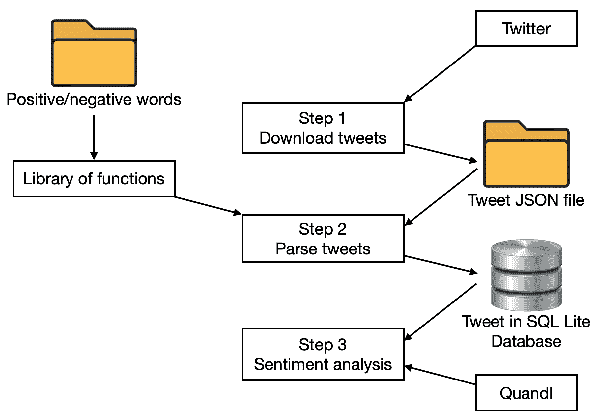
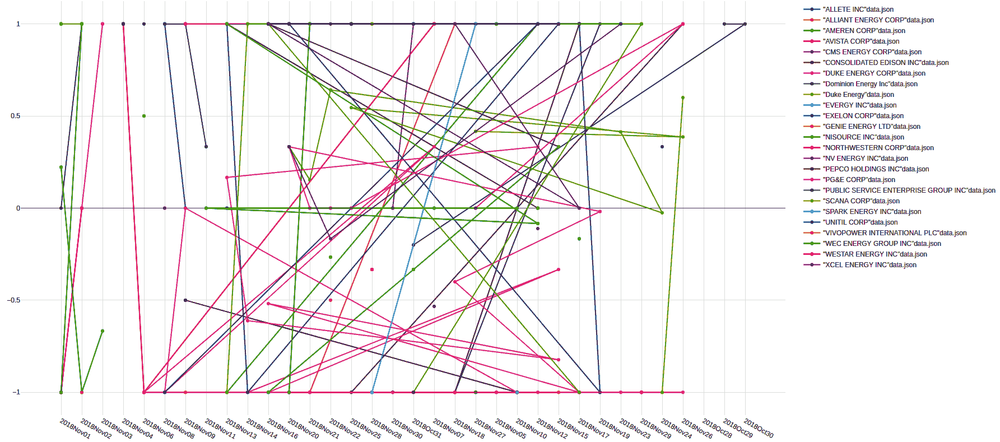
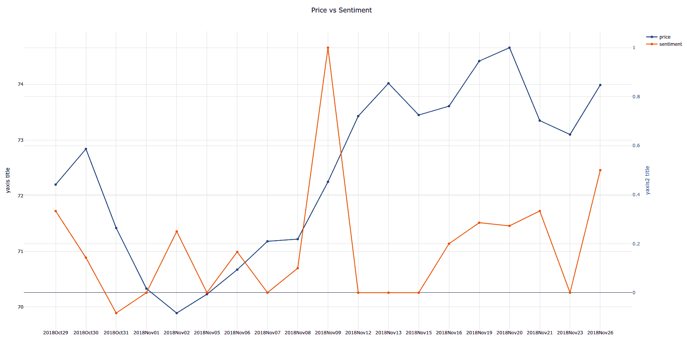
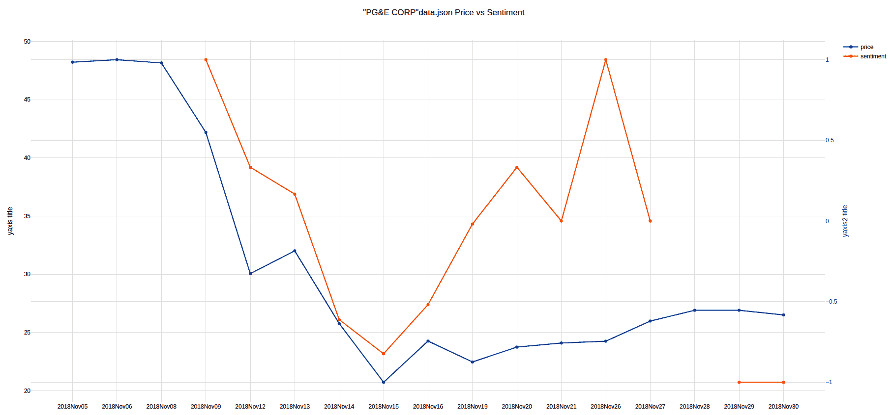
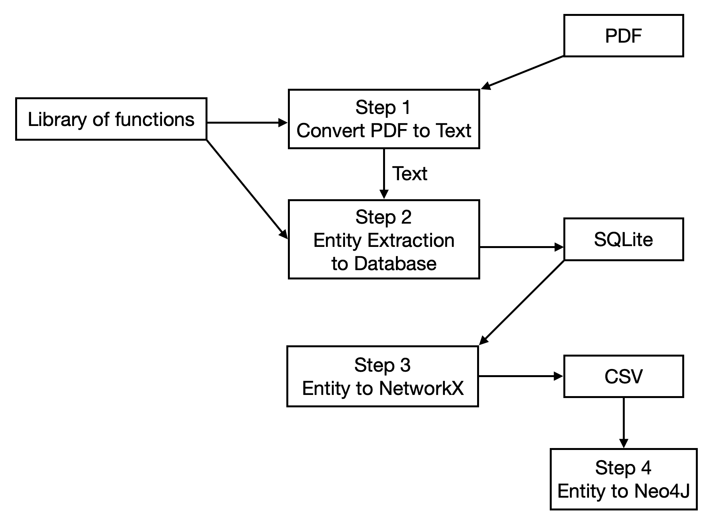
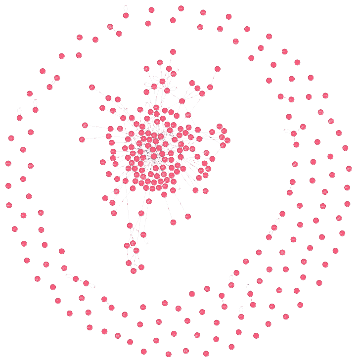

# 第七章：在卖方感知市场情感的算法营销

在上一章中，我们了解了投资组合管理。我们还学习了一些投资组合管理技术，例如马克维茨均值-方差模型和特雷诺–布莱克模型，用于投资组合构建。我们还了解了如何预测证券的趋势。因此，上一章是基于市场的买方部分，描述了投资组合经理或资产管理人的行为。

在本章中，我们将探讨市场的卖方部分。我们将了解投资组合经理对手的行为。卖方指的是证券公司/投资银行及其主要服务，包括销售、交易和研究。销售指的是向投资者营销证券，告知他们可以出售的证券。交易指的是投资者用来买卖证券的服务，以及为了帮助投资者评估证券而进行的研究。银行的一个关键职能是以客户为中心，感知终端投资者的需求和情感，进而推动资产管理人从银行购买产品。我们将通过几个概念和技术来开始本章的讨论。我们将通过一个例子来说明如何感知投资者的需求。我们还将通过另一个例子分析年报并从中提取信息。

本章将涵盖以下主题：

+   了解情感分析

+   使用情感分析感知市场需求

+   使用 Neo4j 进行网络构建与分析

# 了解情感分析

情感分析是一种文本挖掘技术，用于提取上下文信息。上下文信息从源材料中识别并提取出来。它帮助企业理解其产品、证券或资产的情感。利用人工智能的先进技术进行深入研究，在文本分析领域非常有效。对交易进行分类时，重要的是围绕以下概念进行分类：

+   买卖双方关心的证券方面

+   客户对证券的意图和反应

情感分析被认为是最常见的文本分析和分类工具。它接收一条传入的消息或交易，并根据该交易所涉及的情感是积极、消极还是中性进行分类。通过使用情感分析技术，可以输入一句话并理解该句背后的情感。

既然我们已经理解了什么是情感分析，接下来我们来看看如何在以下章节中感知市场需求。

# 使用情感分析感知市场需求

一家证券公司/投资银行在卖方的一个关键要求是为市场制造相关的证券。我们在第四章《*机械化资本市场决策*》和第五章《*预测投资银行家未来*》中探讨了公司在这方面的基本行为和责任。我们在第六章《*使用 Treynor-Black 模型和 ResNet 的自动化投资组合管理*》中了解了动量方法。尽管市场并不总是理性运作，但听听市场的情绪可能会很有趣。这也是我们在本章中要做的。

在这个例子中，我们将扮演投资银行交易大厅的销售员角色，进行股票交易。我们想要了解的是市场对证券的喜好和厌恶，以便能够营销相关证券，包括衍生品。我们的见解来自 Twitter Search，股价数据来自 Quandl。所有这些数据都需要付费许可。

## 解决方案与步骤

使用编码实现获取市场情绪的过程总共有三个主要步骤。数据如下面的图所示：



步骤如下：

1.  数据将从 Twitter 获取并以 JSON 文件格式保存在本地。

1.  JSON 文件将被读取，进一步处理，通过计算正面和负面词汇的数量，并作为记录输入到 SQL Lite 数据库中。

1.  最后，情感将从数据库中读取，并与从 Quandl 获取的股票价格进行比较。

我们将在接下来的部分中更详细地阐述这些步骤。

### 从 Twitter 下载数据

通过使用 Twitter Search 商业许可，我们下载与 Shalender（Quandl）行业分类定义的相同行业的数据。我们将使用 API 密钥逐一搜索并下载包含公司名称或标记为公司名称的最新 500 条推文。所有推文都以 JSON 格式接收，看起来像一个 Python 字典。然后，JSON 文件将保存在计算机中，供进一步处理。

可以在 GitHub 上找到示例 Python 代码（[`github.com/twitterdev/search-tweets-python`](https://github.com/twitterdev/search-tweets-python)），特别是关于身份验证的部分。以下是从 Twitter 下载推文的代码片段：

```py
'''*************************************
#1\. Import libraries and key variable values

'''
from searchtweets import ResultStream, gen_rule_payload, load_credentials
from searchtweets import collect_results
import json
import os

script_dir = os.path.dirname(__file__)
#Twitter search commerical accounts credential
premium_search_args = load_credentials("~/.twitter_keys.yaml",
                                      env_overwrite=False)
MAX_RESULTS=500 #maximum at 500

#list of companies in the same industry
...

'''*************************************
#2\. download tweets of each company

'''
for comp in comp_list:
   ...
```

### 将下载的推文转换为记录

推文的消息及任何链接的页面将被一个简单的语言处理程序加载并读取，该程序将计算消息和链接页面正文中正面和负面词汇的数量。解析后的推文将被转换为结构化的 SQL 数据库格式并存储在 SQL Lite 数据库中。

以下是将推文转换为记录的代码片段：

```py
'''*************************************
#1\. Import libraries and key variable values

'''
import json
import os
import re
import sqlite3
import 7A_lib_cnt_sentiment as sentiment

#db file
db_path = 'parsed_tweets.db'
db_name = 'tweet_db'

#sql db
...
#load tweet json
...
#loop through the tweets
    ...
    for tweet in data:
        ...
        tweet_txt_pos,tweet_txt_neg = sentiment.cnt_sentiment(tweet_txt)
        keywords,sentences_list,words_list = \
                                           sentiment.NER_topics(tweet_txt)
        ...
        if len(url_link)>0:
            ...
            url_txt = sentiment.url_to_string(url)
            temp_tweet_link_txt_pos, temp_tweet_link_txt_neg = \
                                           sentiment.cnt_sentiment(url_txt)
            link_keywords,link_sentences_list,link_words_list = \
                                           sentiment.NER_topics(tweet_txt)
            ...
```

前面的程序调用了三个函数。一个是用于计算正面和负面词汇，另一个是分析关注的主题，最后一个是从推文中给定的 URL 中提取文本。

以下代码片段定义了程序中使用的函数：

```py
import os
import requests
from bs4 import BeautifulSoup
import re
import spacy
import en_core_web_sm
nlp = en_core_web_sm.load()

...
#cal the positive and negative sentiment words given the text
def cnt_sentiment(text_to_be_parsed):
    ...

def noun_phrase(sentence,item_list,lower):
   ...

#NER
import spacy
from spacy import displacy
from collections import Counter
import math

#text has to be less than 1000000
def NER_topics(text_to_be_parsed):
    ...
    MAX_SIZE =100000
    ...
    for nlp_cnt in range(number_nlp):
        start_pos = nlp_cnt*MAX_SIZE
        end_pos = min(MAX_SIZE,txt_len-start_pos)+start_pos-1
        txt_selected = text_to_be_parsed[start_pos:end_pos]
        ...
        sentences_list = [x for x in article.sents]
        full_sentences_list+=sentences_list
        for sent in sentences_list:
            phrases_list =[]
            phases_list,items_list = noun_phrase(sent, items_list, \
                                                 lower=True)
     ...

#convert the URL's content into string
def url_to_string(url):
    ...
```

### 执行情感分析

存储解析过的推文的数据库将被另一个程序读取。对于每一条记录，情感将以每日汇总情感的形式表示。每条推文的情感得分是通过将负面情感的总数从正面情感的总数中减去来计算的。这个情感得分的范围应该在-1 到+1 之间，-1 代表完全负面，+1 代表完全正面。每一天的情感得分是所有推文的情感得分的平均值。相同领域中所有证券的情感得分将绘制在图表上，类似于以下内容：



例如，在我们覆盖的短时间段内，Dominion Energy（道明能源）有着最有利的情感评分（在 10 月 29 日至 10 月 30 日之间）。

Dominion Energy（道明能源）的示例输出如下图所示：



情感是橙色线，股价是蓝色线（请参阅本书提供的彩色图表）。

以下是情感分析的代码片段：

```py
'''*************************************
#1\. Import libraries and key variable values

'''
import sqlite3
import pandas as pd
import plotly
import plotly.graph_objs as go
import quandl
import json

# Create your connection.
db_path = 'parsed_tweets.db'
cnx = sqlite3.connect(db_path)
db_name = 'tweet_db'

'''*************************************
#2\. Gauge the sentiment of each security

'''
...
sql_str = ...
...
print('Sentiment across securities')
field_list = ['positive','negative']
for sec in sec_list:
    ...
```

### 比较每日情感与每日价格

在我们获得每只股票的情感得分后，我们还想了解情感对股价的预测能力或影响。当天的股价是通过中午时分的最高价和最低价来计算的。对于每只股票，我们绘制并比较情感和股价在一段时间内的变化。以下截图展示了 PG&E 公司情感与股价的对比：



以下是针对每日价格的情感分析数据的代码片段：

```py
#run it on different companies
print('Retrieve data')
df_comp = pd.read_csv('ticker_companyname.csv')
corr_results={}

for index, row in df_comp.iterrows():
    tkr = row['ticker']
    name = row['name']

    target_sec = '"'+name +'"data.json'

    corr_result = price_sentiment(tkr,target_sec,date_range)
    try:
        corr_results[name]=corr_result['close'][0]
    except Exception:
        continue

f_corr = open('corr_results.json','w')
json.dump(corr_results,f_corr)
f_corr.close()
```

恭喜！你已经开发了一个程序，帮助销售人员找到热门证券以开发产品。

从我们看到的情况来看，比较这个例子与技术分析例子，我们可以发现情感数据所提供的信息远高于技术趋势。到目前为止，我们只看到了趋势、基本面和情感的初步影响；然而，企业在我们的社会中是相互关联的。那么，我们如何才能建模公司和个人之间的关联呢？这将引出下一个话题——网络分析。

# 使用 Neo4j 构建和分析网络

作为卖方分析师，除了找出新闻对公司产生的主要影响外，我们还应该找出任何新闻的次级影响。在我们的例子中，我们将找出新闻对股票的供应商、客户和竞争对手的影响。

我们可以通过以下三种方法来实现：

+   通过直接披露，例如年度报告

+   通过次级来源（媒体报道）

+   通过行业推断（例如，原材料行业，如石油行业，为交通行业提供输出）

在本书中，我们使用公司直接披露的信息来说明这一点。

我们扮演的是公司股票的股权研究员，其中一个关键角色是理解相关方与公司之间的联系。我们通过阅读公司年报，寻找公司——杜克能源的相关方。

## 解决方案

总共有四个步骤。下图展示了数据流：



接下来，我们将更详细地介绍以下各个步骤。

### 使用 PDFMiner 从 PDF 中提取文本

除了存储外，我们还需要从文本文档中提取关系。在开始处理文本之前，我们需要将 PDF 数据转换为文本。为此，我们使用一个叫做**PDFMiner**的库（具体来说，该模块叫做**pdfminer.six**，适用于 Python 3+）进行转换。PDF 是一种开放标准，用于描述文档。它存储了文档中的行、文本、图片以及它们在文档中的精确位置。我们仅使用 PDFMiner 中的一个基础函数来提取其中的文本。尽管我们也可以提取坐标，但为了简化工作，我们将跳过这一部分。在提取文本后，我们将所有行拼接成一行超长文本。

以下代码片段导入了必要的库，并初始化了一个待处理的 PDF 文件：

```py
'''*************************************
#1\. Import relevant libraries and variables

'''
#custom made function
import 7B_lib_entitiesExtraction as entitiesExtraction
import 7B_lib_parser_pdf as pdf_parser
import json
import sqlite3

pdf_path = 'annualrpt/NYSE_DUK_2017.pdf'
...
```

### 实体提取

我们采用了一种叫做**词性**（**POS**）标注的语言分析方法来决定词汇 X 和 Z 是公司还是个人，以及 Y 是产品还是服务。由于句子的结构，我们知道这些是名词，而不是因为我们知道 X、Y 和 Z 是什么。

然而，仅仅标注实体仍然不够。一个实体是一个独立的主语或宾语。由于实体种类繁多，我们应当仅仅标注首字母大写的实体，作为那些对我们的工作相关的独特组织或资产。

实体类型包括`ORG`、`PERSON`、`FAC`、`NORP`、`GPE`、`LOC`和`PRODUCT`——即使用 SpaCy 模型的组织、个人、设施、国籍或宗教或政治团体、地理空间、地点和产品。

在从步骤 1 的 PDF 中获取文本片段后，我们运行 SpaCy 提取每个句子中的实体。对于每个句子，我们将实体类型和实体存储在数据库记录中。SpaCy 在分析文档时有技术限制，因此我们将非常长的文本片段切割成不同的块，以遵守技术限制。然而，这样做的代价是会在文本片段的切割点拆分句子。考虑到我们正在处理数百页的内容，我们将采取这个快捷方式。当然，最好的切割方法是大致围绕文本块切割，同时遵守标点符号，以保持完整的句子。

以下代码片段演示了如何提取各种实体：

```py
'''*************************************
#2\. NLP

'''
#Named Entity Extraction
print('ner')
#see if we need to convert everything to lower case words - we keep the original format for this case
lower=False
common_words, sentences, words_list,verbs_list = entitiesExtraction.NER_topics(text,lower)
entities_in_sentences = entitiesExtraction.org_extraction(text)
...
#create this list to export the list of ent and cleanse them
...
print('looping sentences')
for sentence in entities_in_sentences:
    ents_dict[sentence_cnt] = {}
    for entity in sentence:
        ...
        if ent_type in( 'ORG','PERSON','FAC','NORP','GPE','LOC','PRODUCT'):
        ...
    #handle other type
    ...
```

**通过词汇表进行实体分类：** 在我们的用例中，我们需要进一步将组织分类为供应商、客户、竞争者、投资者、政府或姊妹公司/资产——例如，作为公司信用投资者的银行，首先会被分类为**银行**，然后在其年度报告中被推断为公司的信用投资者/银行家。因此，一些关系需要我们与组织数据库核对，以进一步分类它们。获取此类知识需要我们下载相关数据库——在我们的案例中，我们使用 Wikipedia 下载银行列表。只有在与银行名称列表核对后，我们才能将组织分类为银行与否。在我们的示例中，我们没有执行此步骤，因为我们没有通常可供银行使用的词汇集。

### 使用 NetworkX 存储网络结构

处理完数据后，实体将被存储在 SQL 数据库中，并通过 NetworkX 进一步分析——这是一个处理网络数据的 Python 包。边和节点是任何图的构建块；然而，还有许多其他指标可以用来衡量和描述图，以及节点和边在图中的位置。现在对我们工作来说，重要的是看看节点是否与我们关注的公司相连接，以及它们之间的连接类型。

在 NetworkX 的最终图中，数据仍然非常抽象。我们需要更好的交互式软件来查询和处理这些数据。因此，我们将把数据输出为 CSV 格式，供 Neo4j 进一步处理，因为它提供了与数据交互的用户界面。

然而，距离实际使用仍然很远——需要大量时间来清理数据集并定义所涉及的关系类型。Neo4j 是一个完整的图形数据库，能够满足复杂的关系结构。

必须在公司年报中提到的实体与数据库中存储的实体之间建立关系。在我们的示例中，我们没有对实体进行任何过滤，因为前一步的 NLP 模型具有 85% 的提升率，因此它在识别实体时并不完美。我们仅提取人物和组织作为实体。对于关系类型（边），我们不区分不同的边类型。

在定义网络结构后，我们准备了一个列表，用于存储节点和边，并通过 `matplotlib` 生成图形，但它本身不足以进行操作或可视化。因此，我们将 NetworkX 的数据输出为 CSV 文件—一个存储节点，另一个存储边。

以下是生成实体网络的代码片段：

```py
'''*************************************
#1\. Import relevant libraries and variables

'''
#generate network
import sqlite3
import pandas as pd
import networkx as nx
import matplotlib.pyplot as plt

#db file
db_path = 'parsed_network.db'
db_name = 'network_db'

#sql db
conn = sqlite3.connect(db_path)
c = conn.cursor()

...

network_dict={}
edge_list=[]
curr_source =''
curr_entity = ''
org_list = []
person_list = []

'''*************************************
#2\. generate the network with all entities connected to Duke Energy - whose annual report is parsed

'''
target_name = 'Duke Energy'
#loop through the database to generate the network format data
for index, row in df_org.iterrows():
    ...

#Generate the output in networkX
print('networkx')

#output the network
G = nx.from_edgelist(edge_list)
pos = nx.spring_layout(G)
nx.draw(G, with_labels=False, nodecolor='r',pos=pos, edge_color='b')
plt.savefig('network.png')
```

### 使用 Neo4j 进行图形可视化和查询

我们将安装 Neo4j 并导入 CSV 文件，以在 Neo4j——这一行业级图形数据库中构建数据网络。不幸的是，Neo4j 本身需要另一套编程语言来操作其数据，称为**Cypher**。这使我们能够提取和搜索我们需要的数据。

我们生成 Neo4j 所需的文件。以下代码片段初始化 Neo4j：

```py
#Generate output for Neo4j
print('prep data for Neo4j')
f_org_node=open('node.csv','w+')
f_org_node.write('nodename\n')

f_person_node=open('node_person.csv','w+')
f_person_node.write('nodename\n')

f_vertex=open('edge.csv','w+')
f_vertex.write('nodename1,nodename2,weight\n')
...
```

在终端中，我们将输出文件复制到 Neo4j 的主目录。以下是从终端执行的命令：

```py
sudo cp '[path]/edge.csv' /var/lib/Neo4j/import/edge.csv
sudo cp '[path]/node.csv' /var/lib/Neo4j/import/node.csv

sudo service Neo4j restart
```

在 Neo4j 中，我们通过浏览器登录。以下是输入到浏览器中的 URL：

```py
http://localhost:7474/browser/
```

以下是 Neo4j Cypher 的示例代码片段：

```py
MATCH (n) DETACH DELETE n;

USING PERIODIC COMMIT
LOAD CSV WITH HEADERS FROM "file:///node.csv" AS row
CREATE (:ENTITY {node: row.nodename});

CREATE INDEX ON :ENTITY(node);

USING PERIODIC COMMIT
LOAD CSV WITH HEADERS FROM "file:///edge.csv" AS row
MATCH (vertex1:ENTITY {node: row.nodename1})
MATCH (vertex2:ENTITY {node: row.nodename2})
MERGE (vertex1)-[:LINK]->(vertex2);

MATCH (n:ENTITY)-[:LINK]->(ENTITY) RETURN n;
```

以下是结果输出的截图：



恭喜！你已经成功提取了年报中大量需要聚焦进一步分析的重要名称/主体。

# 总结

在本章中，我们学习了市场卖方的行为。我们了解了什么是情感分析，以及如何使用它。我们还看了一个例子，使用情感分析来感知市场需求。我们学习了使用 Neo4j 进行网络分析，Neo4j 是一种 NoSQL 数据库技术。我们学习了使用 PDF miner 工具进行文本挖掘。

在下一章，我们将学习如何使用银行 API 来构建个人财富顾问。本章将重点关注消费者银行业务。我们将学习如何访问开放银行项目（Open Bank Project）以获取财务健康数据。我们还将学习文档布局分析。让我们不再拖延，直接开始吧。
