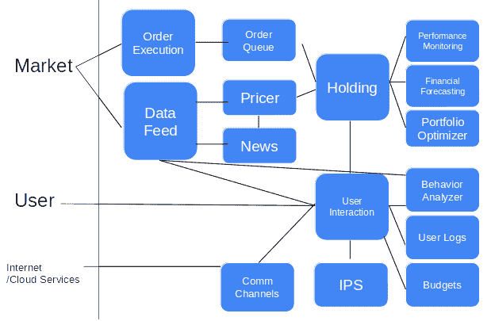

# 第八章：使用银行 API 构建个人财富顾问

在上一章中，我们分析了交易所卖方的行为。我们还学习了情绪分析，并通过学习如何使用情绪分析来分析市场需求，深入了解了这一主题。接着，我们学习了 Neo4j，这是一个 NoSQL 数据库技术。然后，我们使用 Neo4j 构建并存储了一个涉及证券交易的实体网络。

在本章中，我们将重点关注消费者银行业务，理解如何管理客户的数字数据需求。接着，我们将学习如何访问开放银行项目，这是一个开源平台，旨在促进开放银行业务。之后，我们将查看如何将人工智能模型与银行 API 结合使用的示例。最后，我们将学习文档布局分析。

本章将涵盖以下主题：

+   管理客户的数字数据

+   开放银行项目

+   执行文档布局分析

+   使用开放银行 API 进行现金流预测

+   使用发票实体识别追踪日常开支

让我们开始吧！

# 管理客户的数字数据

在这个数字化时代，没理由认为资金不能做到 100%透明，也没有理由认为资金转账不能在实时、全天候（24/7）进行。消费者有权拥有自己的数据，因为数据代表了他们的身份。无论是否可能，我们都应该开始整合自己的数据——实际上，这应该在今天以及未来几年内实现。最好将我们的银行数据整合到一个地方；例如，我们的常客飞行里程。关键是要有两层数据架构——一层用于数据整合（包括存储），另一层用于运行将通过智能设备进行数据分析的人工智能服务，也就是所谓的**移动应用程序**。如果不了解数据整合层的运作，设计一个 AI 算法是很痛苦的。

在这里，我们的数据来源可以是身份数据、生物/心理数据、财务数据、可能影响这些静态数据的事件以及社交数据，后者代表我们与他人的关系（包括人类、物体、生命体等）。事实上，这与**企业对企业**（**B2B**）环境非常相似，其中任何公司都可以通过其法律身份、股东/所有权结构、财务状况、事件以及商业关系来表示，正如在第七章《在卖方市场中感知市场情绪进行算法营销》中所概述的那样，*利用情绪分析来理解市场需求*。这也意味着我们在本章学到的内容可以帮助你更好地理解本书前几章的内容。

然而，对于所有个人，包括你和我们，我们的财务需求是相当基础的——它们包括支付、信用和财富。这些勾画了金融服务的核心活动。保险作为财富的一部分被纳入其中，因为它旨在保护我们的财富免受不良事件和风险的影响——这就像是第二章中关于采购成本风险对冲的衍生品，*时间序列分析*。

然而，我也认为从消费者那里得出的数据同样属于处理交易的银行。这就像父母身份——所有关于数据（父母的孩子）的决策都是由数据所有者（消费者）和数据生产者（银行）之间达成的协议。目前缺乏的是能够迅速将这些数据以及其使用所带来的经济利益归属到某些经济活动（例如市场营销）中的技术。如果某个组织（例如超市）为消费者数据付费给社交媒体（例如谷歌、Facebook 和 Twitter）用于市场营销目的，那么数据所有者应当获得一定比例的经济利益。没有数据技术的进步，单纯的法律法规将不具备实际可操作性。

# **开放银行项目**

允许消费者整合自己数据的世界上最先进政策被称为**开放银行项目**。它始于 2016 年在英国，遵循欧洲的支付服务指令 PSD2——修订后的支付服务指令（[`www.ecb.europa.eu/paym/intro/mip-online/2018/html/1803_revisedpsd.en.html`](https://www.ecb.europa.eu/paym/intro/mip-online/2018/html/1803_revisedpsd.en.html)）。这一政策通过降低使用银行信息进行财务咨询的准入门槛，改变了银行的竞争格局。这使得机器人顾问成为可行的商业模式，因为银行所拥有的金融数据不再是隔离的。

这个项目面临的挑战是，现有的主导性银行几乎没有动力开放它们的数据。在消费者方面，数据整合的缓慢影响了银行服务中这种互联网络的经济价值。这遵循了梅特卡夫定律，即一个网络的价值等同于连接用户数量的平方（在我们的案例中是银行）。下表使用博弈论分析了这种情况，预期了银行和消费者的结果——假设消费者市场中只有两家银行，有四种可能的结果：

| **单元格值 = 银行 A/银行 B/消费者的收益** | **银行 B：开放银行 API** | **银行 B：未开放银行 API** |
| --- | --- | --- |
| 银行 A：开放银行 API | 0.5\0.5\2 | 0.5\1\1 |
| 银行 A：未开放银行 API | 1\0.5\1 | 1\1\1 |

对于现状（即没有开放银行 API 的情况下），假设银行 A 和银行 B 将各自享有 1 个单位的收益，而消费者也将拥有 1 个单位的收益。

任何银行要开发开放银行 API，都需要消耗其 0.5 的资源。因此，我们将展示两种情况：银行 A 或 B 开发开放银行 API，而另一家则没有。开发开放银行 API 的银行将获得较少的收益，因为原本 1 个单位的 0.5 将需要用作维持 API 的资源。在这两种情况下，由于数据没有整合，消费者无法享受任何额外的收益。

只有在所有银行都采用开放银行 API 的情况下，消费者才能看到逐步增加的收益（假设再增加一个单位，使总数变为两个，仅为任意假设），而两家银行的收益却减少。当然，这种情况可能是错误的，因为整体市场会变得更加竞争激烈，这也是英国虚拟银行所发生的情况——由于这一举措，已经创造了一个新的子领域！所以，归根结底，所有银行的收益可能都会得到改善。

话虽如此，大多数现有银行的现实情况是，它们必须维持两套银行服务——一套完全虚拟，而另一套银行渠道仍然是传统的实体存在，且不可扩展。或许前进的道路是，在现有银行渠道之外再建立一个新的银行渠道，并将客户转移到那里。

由于理想状态尚未实现，目前，要构建数字化你，需要来自英国**开放银行项目**（**OBP**）的金融交易数据（[`uk.openbankproject.com/`](https://uk.openbankproject.com/)）、来自欧盟 Digidentity 的身份验证（[`www.digidentity.eu/en/home/`](https://www.digidentity.eu/en/home/)）、新加坡 IHiS 存储的健康记录（[`www.ihis.com.sg/`](https://www.ihis.com.sg/)）、Facebook、Twitter、Instagram 和 LinkedIn 的事件与社交数据、保险公司提供的生活事件等。简而言之，我们仍需为每个相应系统的推出做好准备，才能整合所有这些数据源。

## 智能设备——使用 Flask 和 MongoDB 作为存储的 API

你的智能设备就是一位个性化的私人银行家：软件将与市场和你自己互动。在智能设备中，核心模块是**持有**模块和**用户互动**模块。**持有**模块将保障用户/客户的投资，而用户的互动和用户本身则由**用户互动**模块迎接并连接。

**持有**模块处理投资的定量方面——这正是我们在前两章中讨论的内容，但是在个人层面——通过管理投资组合并捕获各种市场数据。然而，区别在于，我们需要通过在**用户互动**模块中捕获的行为数据，更好地理解用户/客户。**持有**模块是智能设备的认知大脑。

**用户互动**模块提供了智能设备的互动方面——它理解用户在投资和互动中的偏好。这些投资偏好记录在**投资政策声明（IPS）**中。然后，这些互动通过**行为分析器**处理，分析用户偏好的时间、渠道和沟通方式，以及关于用户个性和风险偏好的财务行为，这些信息都来自于通过设备使用获得的**外部数据源**或用户生成的数据。最后但同样重要的是，**沟通渠道**（**Comm Channels**）通过语音、文字或通过物理机器人与用户互动。

这很好地总结了我们在第一章《人工智能在银行业中的重要性》中提到的内容，作为人工智能的定义——一种能够像人类一样进行理性或感性（或两者兼具）思考和行动的机器。**持有**模块是人类的理性大脑，在市场中根据此理性行动，而情感则由**用户互动**模块处理——通过**行为分析器**同情并根据**沟通渠道**与用户互动。下图展示了通过银行功能实现的市场与用户互动：



由于我们在前两章中已经讨论过**持有**模块，主要聚焦于投资过程，因此在这里，我们将更多地关注**用户互动**模块。具体来说，我们将深入探讨**投资政策声明（IPS）**，它记录了用户的投资需求。

### 理解 IPS

正如我们在第六章《使用 Treynor-Black 模型和 ResNet 的自动化投资组合管理》中提到的，我们将在这里开始研究个人的投资政策声明。为此，我们需要收集数据，以便为个别客户构建 IPS。

这是为一个家庭构建 IPS 所需的内容：

+   **回报和风险目标**：

| **目标** | **注释** |
| --- | --- |
| 投资回报目标 | 由投资者输入，并通过行为分析器——个性化分析 |
| 承担风险的能力 | 由投资者输入，并通过行为分析器——个性化分析 |
| 承担风险的意愿 | 由投资者输入，并通过行为分析器——个性化分析 |

+   **约束条件**：

| **约束条件** | **注释** |
| --- | --- |
| 流动性 | 资产的流动性可以通过智能设备中的价格来确定。 |
| 时间范围 | 规划你孩子的未来——他们的学业（在哪里、上什么学校、学费等）、住房计划、工作、退休等。 |
| 税收（美国公民） | 通过 Digidentity 验证公民身份。 |
| 法律和监管环境 | 这可能涉及商业交易、公民身份、就业和居住限制。你也可能需要考虑管理你财富的法律实体，如家庭信托。 |
| 独特情况 | 兴趣和特殊情况没有被公开，包括社交媒体或与*标准*用户不同的医疗档案——这需要在用户之间匿名对比，提供真实的、独特的情况。 |

## 行为分析器 – 支出分析器

类似于第二章，*时间序列分析*，我们将预测市场中的日常现金流。由于大多数情况下的收入（甚至是大多数按月领薪的工作人群）是固定的，唯一变动的部分是支出。在这些支出中，可能有一些定期支出，如购买日常杂货，和一些不定期支出，如购买家电甚至是汽车。为了让机器追踪并预测定期支出习惯以及不常见的支出，实际的方法是当这些支出发生时，能够高效地记录这些习惯。

## 将 AI 服务暴露为 API

虽然我们在第六章，*使用 Treynor-Black 模型和 ResNet 的自动化投资组合管理*中建立的投资组合优化模型很出色，但本章将要讨论的关键技术是如何通过 API 将 AI 模型封装并提供给用户。关于技术建模技能，本章不会向我们的技能库中添加任何新技术。

# 执行文档布局分析

在机器学习中，有一门学科叫做**文档布局分析**。它实际上是研究人类如何理解文档的过程。它包括计算机视觉、自然语言处理和知识图谱。最终目标是提供一个本体，允许任何文档都能像文字处理软件那样被导航，但方式是自动化的。在文字处理软件中，我们需要定义某些词汇，这些词汇出现在标题中，也出现在不同层次的层级中——例如，一级标题、二级标题、正文文本、段落等。而没有人为定义的是句子、词汇、单词、字符、像素等。然而，当我们处理相机或扫描仪拍摄的图像时，最低级别的数据是像素。

## 文档布局分析的步骤

在本节中，我们将学习如何执行文档布局分析。步骤如下：

1.  **从像素形成字符**：这项技术用于将像素转换为字符，称为**光学字符识别**（**OCR**）。这是一个众所周知的问题，可以通过许多深度学习示例来解决，包括 MNIST 数据集。或者，我们可以使用 Tesseract-OCR 来执行 OCR。

1.  **图像旋转**：当图像没有正确的垂直方向时，可能会给人们阅读字符带来挑战。当然，当前在这一领域的研究表明，有些技术似乎能够跳过这个步骤。

1.  **从字符形成单词**：实际上，我们不能等待几分钟才能完成这个过程；在人类的表现下，我们可以做对这一点。我们怎么知道一个字符要与其他字符组合形成一个单词呢？我们知道这一点是通过空间线索。然而，字符之间的距离并不是固定的，那么我们如何教机器理解这个空间距离呢？这也许是大多数患有阅读障碍的人面临的挑战。机器默认也会遭遇阅读障碍。

1.  **从词语构建意义**：这要求我们了解文章的主题和单词的拼写，这有助于我们查阅各种词典来理解文档的内容。*学习*（在本书中指深度学习）可能只是一个与教育相关的主题，而我们之所以知道这一点，是因为你理解到这本书是由 Packt 出版社出版的机器学习书籍——一个你以前学过的出版社名称。否则，仅仅通过阅读“Packt”这个词，我们可能会猜测它与一个包装公司有关（也就是 PACK-t）？此外，我们还可以从标签词中获得线索——*步骤 3*本身就像是标签词，用来引导右侧的实际内容。

将词语分类为各种通用类型的实体是有帮助的——例如，日期、序列号、金额、时间等等。这些是我们通常在开源领域看到的通用实体，比如我们在第七章中使用的 spaCy，*在卖方算法营销中感知市场情绪*。

关于词语的空间线索，我们可能会在关注较大的词语时，忽视较小的词语。词语在页面上的位置也很重要。例如，在阅读英文时，我们通常是从上到下，从左到右，而在一些其他语言中，我们需要从右到左，从上到下阅读，比如古代汉语。

## 使用 Gensim 进行主题建模

在我们的主题建模示例中，我们将专注于*步骤 4*来限制我们的工作范围。我们在此过程中会默认*步骤 1*到*步骤 3*的预工作，并跳过*步骤 5*和*步骤 6*。我们将使用的数据集图像已经过清理、旋转和 OCR 处理——这包括将字符绑定成单词。我们手头的数据集每条记录由一个文本块表示，可能包含多个单词。Gensim 关注的是追踪文本中的名词。

## Word2vec 的向量维度

Word2Vec 通过不同的特征定义单词——每个单词的特征值由出现在同一句子中的单词之间的距离定义。它的目的是量化概念和话题之间的相似性。在我们的 Word2Vec 示例中，我们将使用一个预训练模型将文本转换成单词。然而，对于每个文本块，可能涉及多个值。在这种情况下，这些向量会被压缩成一个值，使用一个叫做**特征值**的值。我们将采用这种简单的方法进行降维，这通常用于减少变量的特征数量（维度）。降维的最常见方法叫做**主成分分析**（**PCA**）。它主要应用于标量，而不是变量的向量。想象每个单词都由一个向量表示。在这里，两个单词的文本块将由一个由两个向量组成的矩阵表示。因此，PCA 可能不是这种降维任务的理想解决方案。

在解释代表单词主题的向量时，分析涉及的维度非常重要，因为每个维度代表一个语义/意义组。在我们的 Word2Vec 示例中，我们将跳过这一步，以避免将过多的维度引入有意义的提取过程。这意味着我们会为说明目的缩小特征空间。

# 使用 Open Bank API 的现金流预测

未来，我们需要机器人顾问能够理解我们的需求。最基本的步骤是能够从不同银行提取我们的财务数据。在这里，我们假设我们是来自美国的消费银行服务客户，当前居住在英国。我们正在为一个四口之家——一对已婚夫妇和两个孩子——寻找财富规划。我们希望机器人顾问为我们执行所有的财务活动。

我们将通过**Open Bank Project**（**OBP**）API 检索所有必要的交易数据，以预测我们的支出。我们将使用遵循 OBP 格式的模拟数据。我们不会深入探讨任何软件技术，而是专注于构建财富规划引擎。我们使用的家庭描述来自美联储（[`www.federalreserve.gov/econresdata/2016-economic-well-being-of-us-households-in-2015-Income-and-Savings.htm`](https://www.federalreserve.gov/econresdata/2016-economic-well-being-of-us-households-in-2015-Income-and-Savings.htm)）关于美国家庭财务的相关数据。

以下表格展示了美国家庭的典型数值，帮助我们了解消费银行的一般需求：

| **收入/支出** | **数值（单位：美元）** | **数据来源（OBS）** |
| --- | --- | --- |
| **收入** | **102.7** |  |
| 工作人员工资 | 102.7 | 每月最大自动支付，月薪固定。 |
| **生活费用** | **67.3** |  |
| 年度支出 | 57.3 | 从信用卡、储蓄和活期账户中提取所有交易。 |
| 债务偿还 | 10.0 | 与债务账户相关的交易。 |
| **净资产** | **97** |  |
| **资产** | **189.9** |  |
| 金融资产 | 23.5 | 证券账户的未偿还余额。401 计划无可见性。 |
| 非金融资产 | 158.9 | 由 Zillow 提供的房产估值。 |
| **负债** | **92.6** |  |
| 抵押贷款 | 59.5 | 债务账户的未偿还余额。 |
| 汽车贷款和教育债务 | 32.8 | 汽车贷款：债务账户的未偿还余额；学生贷款（联邦），对应为联邦学生贷款；学生贷款（私人）：债务账户的未偿还余额。 |

欲了解更多关于 Zillow 的细节，请参考此链接：[`www.zillow.com/howto/api/APIOverview.htm`](https://www.zillow.com/howto/api/APIOverview.htm)。

## 所涉及的步骤

使用开放银行 API，我们需要做以下操作：

1.  注册使用开放银行 API。

1.  下载所需数据。

1.  创建一个数据库来存储这些数据。

1.  设置一个预测用的 API。

让我们开始吧！

### 注册使用开放银行 API

我们可以通过几种方式访问开放银行项目——我们将在其中一个方式中进行操作，我们已在[`demo.openbankproject.com/`](https://demo.openbankproject.com/)注册。

### 创建并下载示例数据

这一部分的代码可以从 GitHub 下载([`github.com/OpenBankProject/Hello-OBP-DirectLogin-Python`](https://github.com/OpenBankProject/Hello-OBP-DirectLogin-Python))。基于此库中的`hello_obp.py`文件，我们已修改程序，使其能够下载所需的数据。使用以下代码片段下载示例数据：

```py
# -*- coding: utf-8 -*-

from __future__ import print_function    # (at top of module)
import sys
import time
import requests

# Note: in order to use this example, you need to have at least one account
# that you can send money from (i.e. be the owner).
# All properties are now kept in one central place

from props.default import *

# You probably don't need to change those
...

#add the following lines to hello-obp.py before running it
#add lines to download the file
print("")
print(" --- export json")
import json
f_json = open('transactions.json','w+')
json.dump(transactions,f_json,sort_keys=True, indent=4)
```

### 创建 NoSQL 数据库以本地存储数据

我更倾向于使用 MongoDB，因为它能够以层级方式导入 JSON 文件，而我们无需提前定义结构。即使我们需要将 NoSQL 文件以 SQL 数据库格式存储（就像在上一章中那样），每当需要使用 ML 模型进行预测时，它仍然有助于我们在运行预测之前将下载的数据物理缓存起来。

所以，你可能会想知道为什么我们需要将数据存储在 NoSQL 数据库中——难道我们不能像上一章处理推文数据时那样直接保存吗？不——我们希望使用数据库，因为为了更快地检索数据，我们将存储数十万个 JSON 文件，而不是批量下载的数据。这也取决于我们希望多频繁地下载数据；如果我们希望每天更新数据库，可能就不需要将 JSON 数据存储在 NoSQL 数据库中，因为我们处理的数据文件不会很多。然而，如果我们需要查询数据或持续向训练数据集中添加新特征，存储原始数据可能更有利。

以下代码用于建立与 MongoDB 服务器的连接：

```py
from pymongo import MongoClient
import json
import pprint

#client = MongoClient()
client = MongoClient('mongodb://localhost:27017/')
db_name = 'AIFinance8A'
collection_name = 'transactions_obp'

f_json = open('transactions.json', 'r')
json_data = json.loads(f_json)

...

#to check if all documents are inserted
...
```

以下代码用于创建数据库：

```py
#define libraries and variables
import sqlite3
from pymongo import MongoClient
import json
from flatten_dict import flatten

client = MongoClient('mongodb://localhost:27017/')
db_name = 'AIFinance8A'
collection_name = 'transactions_obp'

db = client[db_name]
collection = db[collection_name]
posts = db.posts

...

#flatten the dictionary
...

#create the database schema
#db file
db_path = 'parsed_obp.db'
db_name = 'obp_db'

#sql db
...
sqlstr = 'drop table '+db_name
...
print('create')
...
#loop through the dict and insert them into the db
...

for cnt in dict_cnt:
    ...
    for fld in tuple_fields_list:
        ...
    ...
    sqlstr = 'insert into '+ db_name+ '(' + str(fld_list_str)+') VALUES \
                                       ('+question_len[1:]+')'
    ...
```

### 设置预测用 API

为了进行支付预测，我们需要知道我们想要构建什么样的预测模型。我们是想要一个时间序列模型，还是机器学习模型？当然，我们希望有一个能够提供更多信息的模型。

在我们的示例中，我们没有为此准备任何模型，因为我们将使用的方法与我们在第二章中使用的模型类似，*时间序列分析*。这里的主要目的是说明如何设置 API 服务器，以及如何使用另一个程序来调用该 API。请确保这两个程序同时运行。

服务器将被设置为监听请求，以便它可以运行预测。我们将简单地加载模型，而不运行任何预测。以下代码片段用于将我们连接到 Open Bank API 服务器：

```py
#Libraries
from flask import Flask, request, jsonify
from sklearn.externals import joblib
import traceback
import pandas as pd
import numpy as np

# Your API definition
app = Flask(__name__)

@app.route('/predict', methods=['POST'])
def predict():
    ...

#Run the server
if __name__ == '__main__':
    ...
```

以下代码片段用于从客户端应用程序创建请求：

```py
import requests

host = 'http://127.0.0.1:12345/'

r = requests.post(host+'predict', json={"key": "value"})
print(r)
```

恭喜！你已经建立了一个能够读取银行数据的机器人，并使其能够在这些数据上运行 AI 模型。

对于家庭来说，限制支出以增加现金流变得至关重要。在接下来的部分，我们将探讨如何使用发票实体识别技术来追踪日常支出。

# 使用发票实体识别技术追踪日常支出

虽然我们一直在梦想通过 AI 在金融领域实现数字化的最终目标，但现实是有些数据被困住了。而且这些费用往往以纸质的形式存在，而不是 API 数据流。如果我们要转型为一个完全数字化的世界，所有信息都存储在 JSON 文件或 SQL 数据库中，处理纸质文档将是不可避免的。我们无法避免处理现有的纸质信息。通过一个纸质文档数据集的例子，我们将展示如何建立发票实体提取模型的引擎。

在这个示例中，我们假设你正在开发自己的引擎来扫描并将发票转换为结构化数据格式。然而，由于缺乏数据，你需要解析专利图像数据集，该数据集可以在[`machinelearning.inginf.units.it/data-and-tools/ghega-dataset`](http://machinelearning.inginf.units.it/data-and-tools/ghega-dataset)找到。在这个数据集中，有图像、文本块以及我们希望从中提取的目标结果。这被称为**实体提取**。这里的挑战在于，这些发票并不是标准化格式。不同的商家开具的发票尺寸和格式各不相同，但我们仍然能够理解视觉线索（字体大小、线条、位置等）以及单词及其周围的单词（称为**标签**）。

## 涉及的步骤

我们必须遵循六个步骤，使用发票实体识别来追踪每日开销。这些步骤如下：

1.  导入相关库并定义变量。在本示例中，我们引入了主题建模技术，包括**词向量**（`Word2vec`），使用`gensim`，以及使用`re`进行正则表达式匹配，这是一个内置模块。以下代码片段用于导入所需的库：

```py
import os
import pandas as pd
from numpy import genfromtxt
import numpy as np
from gensim.models import Word2Vec
from gensim.models.keyedvectors import WordEmbeddingsKeyedVectors
import gensim.downloader as api
from gensim.parsing.preprocessing import remove_stopwords
from gensim.parsing.preprocessing import preprocess_string, strip_tags, remove_stopwords,strip_numeric,strip_multiple_whitespaces
from scipy import linalg as LA
import pickle
import re
from sklearn.model_selection import train_test_split
from sklearn.neural_network import MLPClassifier
from sklearn.preprocessing import StandardScaler
from sklearn.metrics import classification_report,roc_curve, auc,confusion_matrix,f1_score

#please run this in terminal: sudo apt-get install libopenblas-dev
model_word2vec = api.load("text8") # load pre-trained words vectors
```

1.  定义之后需要使用的函数。将有两组函数——一组`2A`用于训练和测试神经网络，另一组`2B`旨在将文本转换为数值。以下代码片段定义了将用于发票实体识别的函数：

```py
#2\. Define functions relevant for works
##2A Neural Network
##2A_i. Grid search that simulate the performance of different neural network design
def grid_search(X_train,X_test, Y_train,Y_test,num_training_sample):
...
##2A_ii train network
def train_NN(X,Y,target_names):
...
#2B: prepare the text data series into numeric data series
#2B.i: cleanse text by removing multiple whitespaces and converting to lower cases
def cleanse_text(sentence,re_sub):
...
#2B.ii: convert text to numeric numbers
def text_series_to_np(txt_series,model,re_sub):
...

```

1.  准备数据集。在本示例中，我们将尝试使用`numpy`来存储特征，因为它们相当大。我们还将使用`pandas`处理每个文件，因为使用 DataFrame 来操作和选择列更加方便，前提是每个图像的大小不太大。以下代码片段用于准备数据集：

```py
#3\. Loop through the files to prepare the dataset for training and testing
#loop through folders (represent different sources)
for folder in list_of_dir:
    files = os.path.join(path,folder)
    #loop through folders (represent different filing of the same 
     source)
    for file in os.listdir(files):
        if file.endswith(truth_file_ext):
        #define the file names to be read
         ...

        #merge ground truth (aka target variables) with the blocks 
         ...

        #convert the text itself into vectors and lastly a single 
        value using Eigenvalue
        text_df = f_df['text']
        text_np = text_series_to_np(text_df,model_word2vec,re_sub)

        label_df = f_df['text_label'] 
        label_np = text_series_to_np(label_df, model_word2vec, \
                                     re_sub)
         ...
Y_pd = pd.get_dummies(targets_df)
Y_np = Y_pd.values
```

1.  执行模型。在这里，我们使用之前步骤中定义的函数来执行我们准备的模型。以下代码片段用于执行该模型：

```py
#4\. Execute the training and test the outcome
NN_clf, f1_clf = train_NN(full_X_np,Y_np,dummy_header)
...
```

恭喜！到此为止，你已经构建了一个能够从扫描图像中提取信息的模型！

1.  从单词的空间和视觉环境中提取线索。前述这一行明确区分了*步骤 4*和*步骤 5*。注意这些线条如何被投射出来，也有助于我们将相似的单词分组。对于需要原件的文档，我们可能需要查看签名和标志，并将其与真实的已验证签名或印章进行比对。

1.  构建这些文档的知识图谱。这是我们可以深入了解文档中所蕴含的知识的时候。在这里，我们需要使用图形数据库来追踪这些知识（我们在前一章中已介绍过）。

这就结束了我们关于追踪每日开销的示例，也结束了这一章的内容。

# 总结

在这一章中，我们介绍了如何使用 API 提取数据并提供 AI 服务。我们理解了管理客户数字数据的重要性。我们还理解了开放银行项目和文档布局分析。通过两个示例我们学习了这些内容——一个是关于现金流投影，另一个是关于追踪每日开销的。

下一章将继续聚焦于消费者银行业务。我们将学习如何为客户资料中缺失的信息创建代理数据。我们还将查看一个示例聊天机器人，用于服务和与客户互动。我们将使用图形和自然语言处理技术来构建这个聊天机器人。
