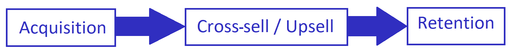
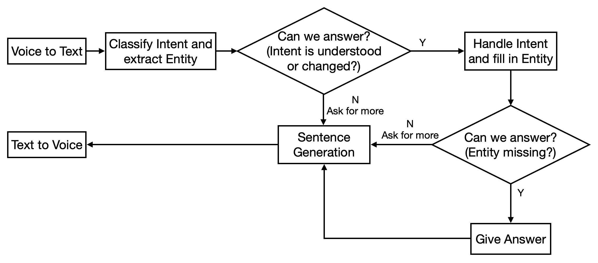
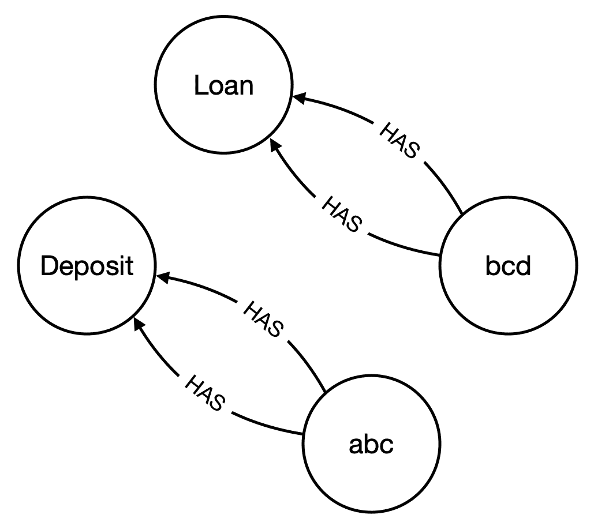

# 第九章：客户终身财富的大规模定制

在上一章中，我们学习了如何管理客户的数字数据。我们还介绍了开放银行项目和开放银行 API。此外，我们还学习了文档布局分析，并查看了一个投影典型家庭现金流的示例。然后，我们查看了另一个使用发票实体识别跟踪日常支出的示例。

在本章中，我们将学习如何结合来自调查的数据进行个人数据分析。我们将学习 Neo4j 等技术，这是一个图数据库。我们将构建一个全天候为客户服务的聊天机器人。我们还将学习如何使用 NLP 和 Neo4j 预测客户响应，以一个示例为例。之后，我们将学习如何使用 Cypher 语言操作来自 Neo4j 数据库的数据。

本章将涵盖以下主题：

+   财富工具的金融概念

+   集成学习

+   预测客户的响应

+   构建一个全天候为客户服务的聊天机器人

+   使用自然语言处理（NLP）和图表进行知识管理

# 财富工具的金融概念

在这一部分，我们将回答消费银行营销人员提出的一些问题。然后，我们将研究另一个重要的模型开发技术——集成学习，这在将不同模型的预测结合起来方面非常有用。

## 财富的来源：资产、收入和天赋

零售银行客户分析中最常见的任务之一是获取额外数据，以帮助解释客户的投资行为和模式。毫无疑问，我们将了解客户的响应，但模型的工作是找出他们为什么做出这样的响应。令人惊讶的是，关于个人行为的聚合信息有很多，例如人口普查数据。我们还可以从社交媒体获取数据，用户使用社交媒体进行身份验证。然后，可以将相关的社交媒体信息与我们在组织内部观察到的个人级交易数据进行链接。为了解释个人银行行为，我们最希望的相关补充数据是关于他们财富的信息。

### 客户生命周期

典型的生命周期包括三个主要阶段——获取、交叉销售/增值和保留。以下图表说明了这三个阶段：



**获取**是我们开始与客户建立商业关系的时刻。然后，我们进入**交叉销售**和**向上销售**。交叉销售是提高向客户销售的产品/服务数量。向上销售是通过同一产品与其他产品/服务加深客户的资金份额。**保持**是指维持关系，这是银行保护关系的防御性举措。我们的第一个例子（将在后面的章节中描述）涉及交叉销售（如果客户没有该产品）和向上销售（如果客户拥有该产品）。

# 集成学习

集成学习是一种提升技术，可以帮助我们提高预测的准确性。我们还将学习如何使用图数据库进行知识存储。知识存储是当前知识表示中的挑战，可以用来增强人工智能在专业级金融服务中的应用。

集成学习是一种用于总结多个模型以提供更稳定预测的方法。在深度神经网络流行之前，这是非常常见的一种方法。为了完整性，我们不想忽视这种建模技术，即使这是一本非常简短的书。特别是，我们使用了随机森林，这意味着我们建立了大量的决策树作为森林，并应用逻辑来削减那些表现较差的树。另一种方法是将较弱的模型结合起来产生强大的结果，这被称为**提升方法**。我们在这里不详细讲解，但鼓励读者深入阅读 scikit-learn 文档（[`scikit-learn.org/stable/`](https://scikit-learn.org/stable/)）。

## 通过图数据库进行知识检索

要使机器在客户服务中像人类一样交流，其中一个关键要素是对话组件。当我们进行对话时，正常情况下人类客户可能无法提供处理所需的全部信息。人类能够应对模糊性。人类能够理解上下文，因此可以推断出意义，而无需明确提及概念。知道机器只能解决明确的问题，而人类能够处理模糊性，机器的任务是从它所拥有的知识图谱中推断出客户的意义。图数据库就是为此目的而使用的工具。

# 预测客户响应

到目前为止，我们还没有讨论银行的日常营销活动。现在，我们终于来看看如何确定营销前景。尽管每个客户都是独特的，但他们仍然是通过算法以相同的方式处理的。

在这个示例中，你将扮演一名数据科学家的角色，负责推广定期存款产品。我们将训练模型来预测定期存款的营销活动。与银行内部客户数据及其对营销活动的历史响应相关的数据来自机器学习与智能系统中心（[`archive.ics.uci.edu/ml/datasets/bank+marketing`](https://archive.ics.uci.edu/ml/datasets/bank+marketing)）、布伦信息与计算机科学学院和加利福尼亚大学尔湾分校。有关个人财富的调查信息来自美国人口普查局（[`www.census.gov/data/tables/time-series/demo/income-poverty/historical-income-households.html`](https://www.census.gov/data/tables/time-series/demo/income-poverty/historical-income-households.html)），它作为对银行内部数据的补充。

## 解决方案

完成此示例有四个步骤：

1.  我们引入了随机森林，它是一种机器学习算法，利用集成学习，使得可以通过多个模型进行预测。最终的模型是多个模型结果的组合。以下是导入所需库并定义变量的代码片段：

```py
#import libraries & define variables
import pandas as pd
import os
from sklearn.ensemble import RandomForestClassifier
from sklearn.datasets import make_classification
```

1.  人口普查数据提供了关于年龄段存款和财富的信息，这些数据被存储在银行中。以下是处理人口普查数据的代码片段：

```py
cat_val = ''
cat_dict = {}
for index, row in df_xtics.iterrows():
    ...

df_bank['age_c'] = pd.cut(df_bank['age'], [0,35,45,55,65,70,75,200])

#ID Conversions
df_bank['age_c_codes']=df_bank['age_c'].cat.codes.astype(str)
age_map={'0':'Less than 35 years'
,'1':'35 to 44 years'
,'2':'45 to 54 years'
,'3':'55 to 64 years'
,'4':'.65 to 69 years'
,'5':'.70 to 74 years'
,'6':'.75 and over'}
```

1.  我们希望通过使用年龄来引入财富数据，说明如何将一列数据映射。以下是将人口普查数据与银行数据结合的代码片段：

```py
#3\. map back the survey data
df_bank['age_c1']=df_bank['age_c_codes'].map(age_map)
df_bank['age_c1_val']=df_bank['age_c1'].map(cat_dict['Age of Householder'])

X_flds = ['balance','day', 'duration', 'pdays',
       'previous', 'age_c1_val']
X = df_bank[X_flds]
y = df_bank['y']
```

1.  以下是训练模型的代码片段：

```py
X, y = make_classification(n_samples=1000, n_features=3,
                           n_informative=2, n_redundant=0,
                           random_state=0, shuffle=False)
clf = RandomForestClassifier(n_estimators=100, max_depth=2,
                             random_state=0)
clf.fit(X, y)
print(clf.feature_importances_)
```

恭喜！你已经将外部数据集与内部数据集合并，增强了我们对客户的理解。

# 建立一个 24/7 服务客户的聊天机器人

当我们与机器人互动时，我们期望它能够理解并与我们对话。机器人为我们工作的好处在于它可以 24 小时全天候为我们服务。实际上，现在的聊天机器人与客户的互动表现较差，因此我们应该尝试拆解这些聊天机器人的组成部分，并将其标准提高。对于应用类型的开发，你可以使用谷歌助手、亚马逊的 Alexa 或 IBM 的 Watson。但为了学习目的，让我们拆解这些组成部分，并集中关注关键挑战：



聊天机器人执行两个高级操作。一个是将语音输入转为文本，另一个是将文本输出转为语音。这两个操作都涉及提取实体和理解意图。在这个例子中，生成的文本是一个实体，而文本的意义则是意图。它代表了服务请求者和服务提供者之间的对话。当面对一个服务请求时，聊天机器人将语音指令转为文本，并为接收到的信息添加上下文。一旦上下文构建完成，聊天机器人就会处理这些信息并生成文本格式的输出。然后，聊天机器人必须将其转换为可听见的语音输出，呈现给服务请求者。整个场景在前面的图示中已做解释。

现在，让我们只专注于聊天，不考虑语音识别和语音输出——也就是说，我们忽略语音转文本和文本转语音。在我看来，由于这个任务涉及大量的机器运算和内存消耗，而且数据在许多地方都可以获取，这个任务不适合初创公司去做；相反，我们应该将其交给具备强大基础设施的主流云服务提供商来提供服务。

对于仅文本聊天，关键的重点应放在意图分类和实体提取上。虽然我们在上一章中已提及实体提取，但输入仍然需要在提取之前进行分类。意图分类与实体提取的工作原理类似，但将整个句子作为一个实体进行分类。

虽然使用 ChatterBot 或 RasaNLU 来运行聊天机器人是非常常见的，但我们可以从下往上分解这些组件来运行。

假设我们是一个简单的银行，提供存款和贷款服务。我们正在构建一个只能为现有客户服务的简单聊天机器人，目前我们只有两个客户，一个叫做**abc**，拥有存款账户，另一个叫做**bcd**，拥有贷款账户：



abc 的存款余额为 100 个单位，定价为 1，而 bcd 的贷款余额为 100 个单位，定价为 2。

# 使用自然语言处理和图谱进行知识管理

从本质上讲，我们有两种方法来检索和更新我们现实世界的知识。一种是将知识存储在向量空间中，并在运行时使用诸如 Word2Vector 和 BERT 等程序将文件读取到内存中。另一种方法是将知识加载到图数据库中，例如 Neo4j，并检索和查询数据。这两种方法的优势和劣势在于速度和透明度。对于高速主题分类，内存模型表现更好，但对于需要透明度的任务，例如银行决策，数据更新需要完全透明和永久记录。在这些情况下，我们将使用图数据库。然而，就像我们在第七章中简要介绍的例子*Sensing Market Sentiment for Algorithmic Marketing at Sell Side*一样，需要使用 NLP 从文档中提取信息，然后才能将信息存储为图格式。

## 实际实现

以下是完成此示例的步骤：

1.  使用 Cypher 语言将 `csv` 文件导入数据库。我们假设 CSV 文件是从传统 SQL 数据库中导出的。以下是从命令行执行的命令：

```py
sudo cp dataset.csv /var/lib/Neo4j/import/edge.csv
sudo cp product.csv /var/lib/Neo4j/import/product.csv
sudo cp customer.csv /var/lib/Neo4j/import/customer.csv
```

1.  打开浏览器并导航至 `http://localhost:7474/browser/`。然后，创建一个 `username` 并设置一个 `password`。这将仅执行一次：

```py
username: test, password: test
```

1.  删除所有节点：

```py
MATCH (n) DETACH DELETE n;
```

1.  创建客户数据：

```py
LOAD CSV WITH HEADERS FROM "file:///customer.csv" AS row
CREATE (c:Customer {customer_id: row.customer});
```

1.  创建产品数据：

```py
LOAD CSV WITH HEADERS FROM "file:///product.csv" AS row
CREATE (p:Product {product_name: row.product});
```

1.  加载 CSV 文件：

```py
LOAD CSV WITH HEADERS FROM "file:///edge.csv" AS line
WITH line
MATCH (c:Customer {customer_id:line.customer})
MATCH (p:Product {product_name:line.product})
MERGE (c)-[:HAS {TYPE:line.type, VALUE:toInteger(line.value)}]->(p)
RETURN count(*);
```

1.  匹配并返回数据：

```py
MATCH (c)-[cp]->(p) RETURN c,cp,p;
```

Cypher 本身是一种语言；我们所做的基本上是创建产品和客户。然后，我们加载另一个连接客户和产品的文件。

1.  我们将连接到刚刚填充数据的`Neo4j`数据库。参数遵循默认设置。请注意 Cypher 的独特语法。此外，加载了 NLP 模型以用于输入指令的相似性分析。Cypher 查询存储在字典中。读取意图后，检索查询字符串。然后，我们使用图数据库构建知识：

```py
#import libraries and define parameters
from Neo4j import GraphDatabase
import spacy

#define the parameters, host, query and keywords
uri = "bolt://localhost:7687"
driver = GraphDatabase.driver(uri, auth=("test", "test"))
session = driver.session()

check_q = ("MATCH (c:Customer)-[r:HAS]->(p:Product)" 
 "WHERE c.customer_id = $customerid AND p.product_name = \
  $productname" 
 "RETURN DISTINCT properties(r)")
...
intent_dict = {'check':check_q, 'login':check_c}

#list of key intent, product and attribute
product_list = ['deposit','loan']
attribute_list = ['pricing','balance']
intent_list = ['check']
print('loading nlp model')
nlp = spacy.load('en_core_web_md')
```

1.  用户应使用 SQL 数据库正确进行身份验证和标识。为了便于说明，我们将使用`GraphDatabase`，但显然使用`GraphDatabase`进行身份验证是不正确的，因为我们希望将大量数据与用户名和密码存储在专用表中，其访问权限设置为少于数据库上总人数的个体。以下是验证用户的代码片段：

```py
if name == '' or reset:
    name = input('Hello, What is your name? ')
    print('Hi '+name)
    #check for login
    query_str = intent_dict['login']
    result = session.read_transaction(run_query, query_str, name, \
                                 product, attribute, attribute_val)
```

句子意图和实体提取利用 spaCy 进行相似性分析。基于预训练的词向量模型，意图和实体的保留词与输入的句子进行比较，以提取相关的意图和实体。该模型过于简化，读者有足够的创作空间，通过使用更好的语言模型，如 BERT，来增强提取工作，假设我们已经制作了相关的模型来执行相关的分类任务。

以下是提取实体并添加意图的代码片段：

```py
#Sentences Intent and Entities Extraction
input_sentence = input('What do you like to do? ')
if input_sentence == "reset":
    reset = True 
entities = intent_entity_attribute_extraction(nlp, input_sentence, \
                         tokens_intent, tokens_products, tokens_attribute)
#actually can build another intent classifier here based on the scores and words matched as features, as well as previous entities
intent = entities[0]
product = entities[1]
attribute = entities[2]
attribute_val = entities[3]
```

### 交叉检查并进一步请求缺失信息

程序将不断地请求意图、产品和属性，直到这三项信息对程序明确为止。在每个参数的分类下，我们使用 Word2vec 进行简化的分类。实际上，我们可以运行一个一流的话题分类模型，例如 BERT，来理解语言和话题。

以下是请求用户提供缺失信息的代码片段：

```py
while intent == '':
    input_sentence = input('What do you want to do?')
    entities = intent_entity_attribute_extraction(nlp, input_sentence, \
                     tokens_intent, tokens_products, tokens_attribute)
    intent = entities[0]

while product == '':
    input_sentence = input('What product do you want to check?')
    entities = intent_entity_attribute_extraction(nlp, input_sentence, \
                     tokens_intent, tokens_products, tokens_attribute)
    product = entities[1]

while attribute == '':
    input_sentence = input('What attribute of the ' + product + \
                        ' that you want to '+intent+'?')
    entities = intent_entity_attribute_extraction(nlp, input_sentence, \
                      tokens_intent, tokens_products, tokens_attribute)
    attribute = entities[2]
```

### 提取答案

当所有信息填写完成后，将执行 Cypher 查询，信息将呈现给用户。以下是提取答案的代码片段：

```py
#execute the query to extract the answer
query_str = intent_dict[intent]
results = session.read_transaction(run_query, query_str, name, \
                                    product,attribute,attribute_val)
if len(results) >0:
    for result in results:
        if result['TYPE'] == attribute:
            print(attribute + ' of ' + product + ' is '+ \
                  str(result['VALUE']))
else:
    print('no record')

```

### 交互样本脚本

以下片段展示了用户的输入和输出。它旨在展示 NLU 如何使用密切相关的词汇提取意图和实体，得益于 spaCy 字典使我们能够找到相似的词汇。这个示例的关键是展示，对于那些需要在做出决策之前获得完整信息的情况，图数据库允许我们管理对话并在执行任何指令以服务用户之前跟进缺失的信息。这在做出专业决策时非常重要，因为我们需要其推理过程对机器能够理解的语言具有较高的透明度和准确性。以下是聊天机器人的样本对话片段：

```py
loading nlp model
Hello, What is your name? testing
Hi testing
Failed to find testing
Hello, What is your name? abc
Hi abc
What do you like to do? do sth
matching...

What do you want to do?check sth
matching...
check 
What product do you want to check?some product
matching...

What product do you want to check?deposit
matching...
 deposit 
What attribute of the deposit that you want to check?sth
matching...

What attribute of the deposit that you want to check?pricing
matching...
 pricing
pricing of deposit is 1
```

恭喜！你已经构建了一个非常简单的聊天机器人，它可以向你展示聊天机器人的核心功能。

我们使用的示例非常好地反映了我们在商业银行中使用借款人和存款人数据结合强化学习的起点。当时，数据是在运行时存储在变量中的。现在，我们展示了将数据存储在图形数据中的另一种可能性。事实上，与第三章中“*使用特征和强化学习来自动化银行融资*”的示例相比，如果我们将数据存储在图数据库中，而不是 Python 程序中的变量中，强化学习的速度会较慢。因此，我们将使用图数据库，但仅在生产和应用级别使用，当个别对话可以容忍相对于计算密集型训练阶段的延迟时。

# 总结

在本章中，我们学习了自然语言处理（NLP）和图数据库，并了解了分析客户数据所需的金融概念。我们还学习了一种名为集成学习的人工智能技术。我们通过一个例子来预测客户的响应，使用了自然语言处理技术。最后，我们构建了一个聊天机器人，能够 24/7 为客户提供服务。这些概念非常强大。NLP 能够让程序理解人类自然使用的语言。而图数据库则有助于设计高效的算法。

在下一章中，我们将学习在构建模型来解决日常挑战时需要考虑的实际因素。此外，我们还将讨论在为数据科学家提供与 IT 开发人员互动的语言时，涉及到的实际 IT 考虑因素，这些开发人员将算法应用到现实生活中。
