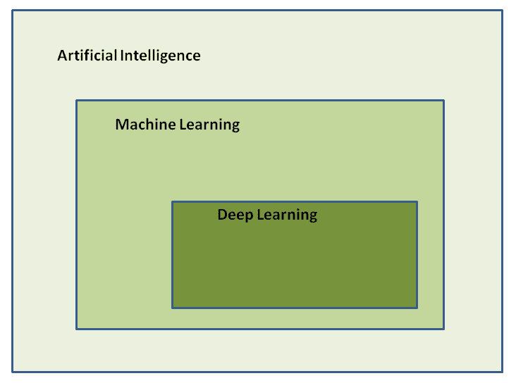
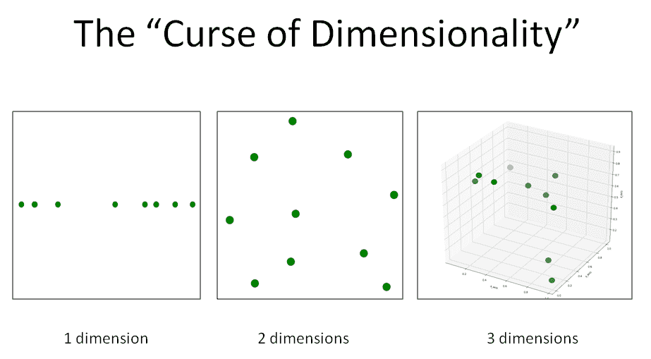
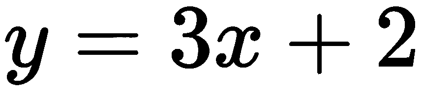
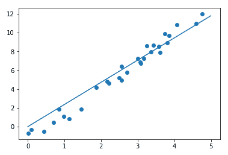
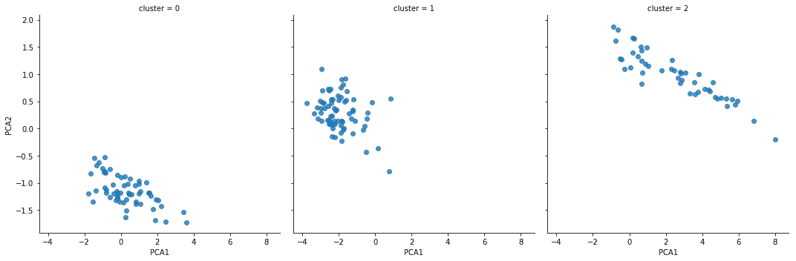
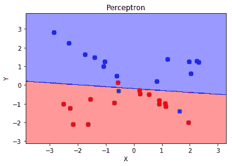

# 第二章：网络安全专业人士的人工智能入门

在本章中，我们将区分**人工智能**（**AI**）的各个分支，重点探讨自动化学习在**网络安全**领域中不同方法的利弊。

我们将介绍不同的学习策略以及各种算法的优化方法，同时还将通过 Jupyter Notebooks 和 `scikit-learn` Python 库，展示人工智能实际运作中的主要概念。

本章将涵盖以下主题：

+   将人工智能应用于网络安全

+   从专家系统到数据挖掘和人工智能的演变

+   自动化学习的不同形式

+   算法训练和优化的特点

+   通过 Jupyter Notebooks 开始学习人工智能

+   在网络安全领域引入人工智能

# 将人工智能应用于网络安全

将人工智能应用于网络安全是一个实验性的研究领域，并非没有问题，我们将在本章中尝试解释这一点。然而，不可否认的是，到目前为止取得的成果是有前景的，并且在不久的将来，分析方法将成为常见实践，对网络安全专业领域产生明确而积极的影响，无论是从新就业机会还是新挑战的角度来看。

在讨论将人工智能应用于网络安全的话题时，业内人士的反应往往是矛盾的。事实上，怀疑的反应与保守的态度交替出现，部分原因是担心机器会取代人工操作员，尽管人类具备通过多年努力工作获得的高技术和专业技能。

然而，在不久的将来，公司和组织将越来越需要投资于自动化分析工具，以便对当前和未来的网络安全挑战作出快速和充分的响应。因此，眼下即将到来的情景实际上是技能的结合，而非人工操作员与机器之间的冲突。因此，人工智能在网络安全领域可能会负责繁重的工作，即筛选潜在的可疑案例，将更高级的任务交给安全分析员，让他们更深入地调查值得关注的威胁。

# 人工智能的演变：从专家系统到数据挖掘

为了理解在网络安全领域采用人工智能所带来的优势，有必要介绍支撑人工智能不同方法论的基本逻辑。

我们将从对人工智能演变的简要历史分析开始，以便充分评估将其应用于网络安全领域的潜在好处。

# 专家系统简介

自动学习的最初尝试之一是定义基于**规则**的决策系统，应用于特定的应用领域，涵盖了现实世界中可能遇到的所有分支和具体案例。通过这种方式，所有可能的选项都被硬编码到自动学习解决方案中，并由领域专家进行验证。

这种**专家系统**的根本限制在于，它将决策简化为布尔值（这将一切简化为二选一），从而限制了将解决方案适应现实世界中不同细微差别的能力。

实际上，专家系统与硬编码解决方案相比并没有学习到任何新内容，它们仅仅局限于在一个（可能非常庞大的）知识库中寻找正确的答案，而这个知识库并不能适应之前未处理过的新问题。

# 反映现实的非确定性特征

由于我们在现实世界中遇到的具体案例无法仅通过真假分类模型来表示（尽管该领域的专家努力列出所有可能的案例，但现实中总有一些情况无法分类），因此有必要充分利用我们手头的数据，从而揭示潜在的趋势和异常情况（如**异常值**），利用统计学和概率模型，更恰当地反映现实的**非确定性**特征。

# 超越统计学，迈向机器学习

尽管统计模型的引入突破了专家系统的局限性，但这种方法的根本僵化性仍然存在，因为统计模型，如基于规则的决策，实际上是在预先建立的，无法修改以适应新数据。例如，最常用的统计模型之一是高斯分布。统计学家可以决定数据来自高斯分布，并尝试估计描述数据的假设分布的参数，而不考虑其他可能的模型。

因此，为了克服这些局限性，有必要采用**迭代**方法，这种方法允许引入能够从现有数据出发，对描述性模型进行泛化的**机器学习**（**ML**）算法，从而自主生成其自身的特征，不仅仅局限于预定义的目标函数，而是将其适应于算法训练过程的持续演化。

# 挖掘数据以生成模型

与预定义的**静态**模型相比，这种方法的差异也体现在被称为**数据挖掘**的研究领域。

对数据挖掘过程的恰当定义是从数据中发现合适的代表性模型。此外，在这种情况下，我们可以使用基于训练数据的机器学习算法来识别最合适的预测模型，而不是采用预先建立的统计模型（当我们无法理解手头数据的性质时，这一点尤为重要）。

然而，**算法方法**并不总是适用。当数据的性质明确并符合已知模型时，使用机器学习算法而非预定义模型并没有优势。下一步吸收并扩展了前面方法的优势，并增加了管理训练数据中未涵盖情况的能力，这将我们引导到人工智能。

人工智能（AI）是一个比机器学习（ML）更广泛的研究领域，它可以处理比机器学习更为通用和抽象的数据，因此能够在不完全重新训练的情况下，将常见的解决方案转移到不同类型的数据上。例如，可以从彩色图像中识别物体，尽管最初的物体是从黑白样本中获得的。

因此，AI 被视为一个包含机器学习（ML）的广泛研究领域。而机器学习又包括基于人工神经网络的**深度学习**（**DL**），如下图所示：



# 机器学习的类型

从数据中进行机械学习的过程可以采取不同的形式，具有不同的特征和预测能力。

在机器学习（ML）的情况下（正如我们所看到的，它是人工智能研究的一个分支），通常会区分以下几种类型的机器学习：

+   监督学习

+   无监督学习

+   强化学习

这些学习方式之间的差异可以归因于我们打算根据所需输入产生的结果（输出）的类型。

# 监督学习

在**监督学习**的情况下，算法训练是通过使用输入数据集进行的，其中我们必须获得的输出类型已经是已知的。

实际上，算法必须经过训练，以识别正在训练的变量之间的关系，试图根据目标变量（也称为**标签**）来优化学习参数，这些目标变量如前所述是已知的。

一个监督学习算法的例子是分类算法，它在网络安全领域中被广泛用于**垃圾邮件分类**。

**垃圾邮件过滤器**实际上是通过向算法提交输入数据集进行训练的，数据集包含了许多已经被先前标记为垃圾邮件（这些邮件是恶意的或不需要的）或正常邮件（这些邮件是真实的且无害的）的示例。

垃圾邮件过滤器的分类算法因此必须学习如何对未来接收到的新邮件进行分类，根据之前对已分类邮件数据集的训练，归类为垃圾邮件或正常邮件。

另一个监督学习算法的例子是回归算法。最终，主要的监督学习算法如下：

+   回归（线性与逻辑回归）

+   **k 最近邻** (**k-NNs**)

+   **支持向量机** (**SVMs**)

+   决策树与随机森林

+   **神经网络** (**NNs**)

# 无监督学习

在**无监督学习**的情况下，算法必须尝试**独立分类数据**，无需依赖分析师提供的先前分类。在网络安全的背景下，无监督学习算法对于识别新的（之前未检测到的）**恶意软件**攻击、**欺诈**行为和**电子邮件垃圾邮件**攻击非常重要。

以下是一些无监督算法的示例：

+   降维：

    +   **主成分分析** (**PCA**)

    +   PCA 核

+   聚类：

    +   k 均值

    +   **层次聚类分析** (**HCA**)

# 强化学习

在**强化学习**（**RL**）的情况下，采用不同的学习策略，这种策略模仿试错法。因此，算法通过在学习过程中获取的反馈信息，目的是最大化最终获得的奖励，奖励依据算法选择的正确决策数量来决定。

实际上，学习过程以无监督的方式进行，特别之处在于，每一次正确决策会被分配一个**正奖励**（而每次错误决策会获得**负奖励**），这些决策在学习过程中每一步都做出。在学习过程结束时，算法的决策会基于最终获得的奖励进行重新评估。

由于其动态特性，强化学习（RL）与人工智能采用的通用方法更为相似，而非机器学习中常见的算法，这并非偶然。

以下是一些强化学习（RL）算法的示例：

+   马尔科夫过程

+   Q 学习

+   **时序差分** (**TD**) 方法

+   蒙特卡洛方法

特别是，**隐马尔科夫模型**（**HMM**）（利用马尔科夫过程）在检测变种恶意软件威胁方面极为重要。

# 算法训练与优化

在准备自动化学习程序时，我们常常会面临一系列挑战。我们需要克服这些挑战，以确保程序本身的可靠性不受损害，从而避免得出错误或仓促的结论，而这些结论在网络安全的背景下可能会带来灾难性后果。

我们经常面对的一个主要问题，特别是在配置威胁检测程序的情况下，是管理**虚警**；即，由算法检测并分类为潜在威胁的案例，实际上并非如此。我们将在第七章，*云 AI 解决方案下的欺诈预防*，和第九章，*评估算法*中更深入地讨论虚警和 ML 评估指标。

特别是在旨在对抗**网络威胁**的**检测系统**的情况下，虚警的管理尤为繁重，因为检测到的事件数量通常如此之高，以至于吸收和饱和了所有专门用于威胁检测活动的人力资源。

另一方面，即使是正确的（真正的阳性）报告，如果数量过多，也会导致分析员的功能超载，分散他们的重要任务。因此，需要优化学习过程，以减少需要分析员深入分析的案例数量。

此优化活动通常始于选择和清理提交给算法的数据。

# 如何找到有用的数据来源

在**异常检测**的情况下，特别需要注意正在分析的数据。有效的异常检测活动假定训练数据不包含所寻找的异常，而是反映了参考正常情况。

另一方面，如果训练数据偏向于包含正在调查的异常，那么异常检测活动将丧失其可靠性和实用性，符合通常被称为**GIGO**的原则，即**垃圾进，垃圾出**。

鉴于实时原始数据的日益可用，通常认为数据的初步清理本身就是一个挑战。事实上，经常需要对数据进行初步筛选，**消除无关或冗余**的信息。然后，我们可以以正确的形式**呈现数据**给算法，这可以提高它们学习的能力，并根据使用的算法类型调整数据的形式。

例如，**分类算法**将能够在输入数据以**分组形式**呈现或能够**线性可分**的情况下，识别更具代表性和更有效的模型。同样，包含**空字段**（也称为**维度**）的**变量**会增加算法的计算负担，并由于所谓的**维度诅咒**现象产生较不可靠的预测模型。

这种情况发生在特征数量，也就是维度*，* 增加而没有改善相关信息时，结果仅仅是数据在增大的研究空间中分散：



此外，我们从哪些 **来源** 获取测试案例（样本）也非常重要。例如，假设我们必须预测一个 **未知可执行文件** 的恶意行为。问题简化为对可执行文件 **分类模型** 的定义，该模型必须归属于两个类别之一： **正品** 和 **恶意**。

为了达到这样的结果，我们需要通过提供一系列被认为是恶意的可执行文件示例来训练我们的分类算法，作为输入数据集。

# 数量与质量

当问题归结为数量与质量时，我们立即面临以下两个问题：

+   我们可以认为哪些类型的恶意软件最能代表我们公司最可能面临的风险和威胁？

+   我们应该收集多少个示例案例（样本），并将它们提供给算法，以便在未来威胁的有效性和预测效率方面获得可靠的结果？

对这两个问题的回答与分析师对 **特定组织领域** 知识的了解密切相关，在该领域他们必须开展工作。

所有这些可能使分析师认为，创建一个 *蜜罐*，它有助于收集恶意样本，这些样本将被作为训练样本输入算法，比使用数据集作为通用威胁的示例，更能 **代表** 组织面临的风险水平。同时，提交给算法的测试样本数量由 **数据本身的特征** 决定。这些特征实际上可能呈现某一类型的案例（偏斜性）占优势，忽视其他类型，从而导致算法的预测出现 **失真**，偏向于最常见的类别，而实际上，对我们调查最有意义的信息是由数量较少的类别所代表的。

总之，这不仅仅是选择最适合我们目标的算法（这往往是不存在的），而是主要选择 **最具代表性的案例**（样本）提交给一组算法，我们将根据获得的结果尝试优化这些算法。

# 了解 Python 库

在接下来的章节中，我们将探索目前所介绍的概念，并展示一些示例代码，这些代码使用了一系列在机器学习领域中最为知名和广泛应用的 Python 库：

+   NumPy（版本 1.13.3）

+   pandas（版本 0.20.3）

+   Matplotlib（版本 2.0.2）

+   scikit-learn（版本 0.20.0）

+   Seaborn（版本 0.8.0）

示例代码将以代码片段的形式展示在此，并附有显示其输出的截图。不要担心如果你一开始不能完全理解所有的实现细节；在整个书中，我们将有机会逐步理解每个算法的实现方面。

# 有监督学习示例 - 线性回归

作为我们的第一个示例，我们将看一下有监督学习领域中最常用的算法之一——线性回归。利用`scikit-learn` Python 库，我们通过导入`scikit-learn`库中`linear_model`包的`LinearRegression`类来实例化一个线性回归对象。

模型将使用通过调用 Python `numpy`库中的`random`包的`RandomState`类的`rand()`方法获得的训练数据集进行训练。训练数据按照线性模型分布，见下图，。模型的训练通过调用`LinearRegression`类中的`lreg`对象的`fit()`方法来完成。

在这一步，我们将尝试通过调用`lreg`对象的`predict()`方法，预测不包含在训练数据集中的数据。

训练数据集以及模型插值的值最终通过`matplotlib`库中的`scatter()`和`plot()`方法在屏幕上打印出来：

```py
%matplotlib inline
import matplotlib.pyplot as plt
import numpy as np

from sklearn.linear_model import LinearRegression

pool = np.random.RandomState(10)
x = 5 * pool.rand(30)
y = 3 * x - 2 + pool.randn(30)
# y = 3x - 2;

lregr = LinearRegression(fit_intercept=False)
X = x[:, np.newaxis]
lregr.fit(X, y)
lspace = np.linspace(0, 5)
X_regr = lspace[:, np.newaxis]
y_regr = lregr.predict(X_regr)
plt.scatter(x, y);
plt.plot(X_regr, y_regr);

```

上面的代码生成了以下输出，展示了数据样本如何通过线性回归模型返回的直线得到了很好的逼近：



# 无监督学习示例 - 聚类

作为无监督学习的一个例子，我们使用`GaussianMixture`聚类模型。通过这种类型的模型，我们将尝试将数据恢复为一组**高斯斑点**。

训练数据从`.csv`格式（逗号分隔值）文件中加载，并存储在`pandas` Python 库的`DataFrame`对象中。数据加载后，我们将继续**降低其维度**，以识别一个将原始维度（特征）从四维降到二维的表示，尽量保留**最具代表性**的特征。

降维可以避免与维度灾难现象相关的缺点，提高计算效率，并简化数据的可视化。

我们将用于降维的技术被称为**主成分分析**（**PCA**），它在`scikit-learn`库中可以找到。

一旦数据维度从四维降低到二维，我们将尝试使用`GaussianMixture`模型对数据进行分类，方法如下：

```py
import pandas as pd
import seaborn as sns

data_df = pd.read_csv("../datasets/clustering.csv")
data_df.describe()
X_data = data_df.drop('class_1', axis=1)
y_data = data_df['class_1']

from sklearn.decomposition import PCA   

pca = PCA(n_components=2)               
pca.fit(X_data)                         
X_2D = pca.transform(X_data)            
data_df['PCA1'] = X_2D[:, 0]
data_df['PCA2'] = X_2D[:, 1]

from sklearn.mixture import GaussianMixture         

gm = GaussianMixture(n_components=3, covariance_type='full')     
gm.fit(X_data)                         
y_gm = gm.predict(X_data)              
data_df['cluster'] = y_gm
sns.lmplot("PCA1", "PCA2", data=data_df, col='cluster', fit_reg=False)
```

如下图所示，聚类算法已成功地以合适的方式自动分类数据，而无需事先了解与各个样本相关的当前标签：



# 简单的神经网络示例 – 感知机

在本节中，我们将展示一个简单的神经网络模型，称为**感知机**。

**神经网络（NN）**和**深度学习（DL）**是机器学习的子领域，旨在模拟人脑的学习能力。NN 和 DL 将在第三章，《火腿还是垃圾邮件？使用 AI 检测电子邮件中的网络安全威胁》和第八章，《生成对抗网络（GANs）– 攻击与防御》中深入讨论。

尽管感知机非常基础，但它仍然能够充分分类那些倾向于聚集在一起的样本（在技术术语中，指的是**线性可分**的样本）。

如我们所见，感知机在网络安全领域中最常见的用途之一是**垃圾邮件过滤**。

在以下示例中，我们将使用`scikit-learn`实现的感知机算法：

```py
from matplotlib.colors import ListedColormap 
# Thanks to Sebastian Raschka for 'plot_decision_regions' function 
def plot_decision_regions(X, y, classifier, resolution=0.02): 
 # setup marker generator and color map 
 markers = ('s', 'x', 'o', '^', 'v')
 colors = ('red', 'blue', 'lightgreen', 'gray', 'cyan')
 cmap = ListedColormap(colors[:len(np.unique(y))]) 
 # plot the decision surface 
 x1_min, x1_max = X[:, 0].min() - 1, X[:, 0].max() + 1
 x2_min, x2_max = X[:, 1].min() - 1, X[:, 1].max() + 1
 xx1, xx2 = np.meshgrid(np.arange(x1_min, x1_max, resolution), 
 np.arange(x2_min, x2_max, resolution))
 Z = classifier.predict(np.array([xx1.ravel(), xx2.ravel()]).T)
 Z = Z.reshape(xx1.shape)
 plt.contourf(xx1, xx2, Z, alpha=0.4, cmap=cmap)
 plt.xlim(xx1.min(), xx1.max())
 plt.ylim(xx2.min(), xx2.max()) 
 # plot class samples 
 for idx, cl in enumerate(np.unique(y)):
 plt.scatter(x=X[y == cl, 0], y=X[y == cl, 1], 
 alpha=0.8, c=cmap(idx), 
 marker=markers[idx], label=cl) 
from sklearn.linear_model import perceptron
from sklearn.datasets import make_classification 
X, y = make_classification(30, 2, 2, 0, weights=[.3, .3], random_state=300) 
plt.scatter(X[:,0], X[:,1], s=50)
pct = perceptron.Perceptron(max_iter=100, verbose=0, random_state=300, 
fit_intercept=True, eta0=0.002)
pct.fit(X, y)
plot_decision_regions(X, y, classifier=pct)
plt.title('Perceptron')
plt.xlabel('X')
plt.ylabel('Y')
plt.show()
```

上述代码生成以下输出：



# AI 在网络安全中的应用

随着与新型恶意软件传播日益增加相关的威胁数量呈指数级增长，单纯依赖人工操作员的分析来有效应对这些威胁几乎是不可能的。我们必须引入能够自动化分析初步阶段的算法，称为**分诊**，即对威胁进行**初步筛选**，然后将其提交给网络安全专业人员，以便我们能够及时、有效地应对正在进行的攻击。

我们需要能够以动态的方式做出响应，适应与**前所未有**威胁相关的环境变化。这不仅意味着分析师管理网络安全的工具和方法，还意味着他们能够正确解读和评估 AI 和 ML 算法提供的结果。

因此，网络安全专业人员被要求理解**算法的逻辑**，并根据结果和要实现的目标，对其学习阶段进行**微调**。

使用 AI 的一些任务如下：

+   **分类**：这是网络安全框架中的主要任务之一。它用于正确识别相似攻击类型，例如属于同一家族的不同**恶意软件**，即具有共同特征和行为的恶意软件，尽管它们的特征不同（想想**变种恶意软件**）。同样，能够适当地分类电子邮件也是非常重要的，区分**垃圾邮件**与合法邮件。

+   **聚类**：与分类不同，聚类能够在没有预先了解类别信息的情况下自动识别样本所属的类别（正如我们所见，这是无监督学习的典型目标）。这一任务在**恶意软件分析**和**取证分析**中具有基础性的重要性。

+   **预测分析**：通过利用神经网络（NN）和深度学习（DL），可以在威胁发生时进行识别。为此，必须采取一种**高度动态**的方法，使得算法能够自动优化其学习能力。

AI 在网络安全中的可能应用如下：

+   **网络保护**：使用机器学习（ML）可以实现高度复杂的**入侵检测系统**（**IDS**），这些系统将用于网络边界保护领域。

+   **终端保护**：威胁如**勒索软件**可以通过采用学习这些类型恶意软件典型行为的算法得到有效检测，从而克服**传统防病毒**软件的**局限性**。

+   **应用安全**：一些最隐蔽的网络应用攻击类型包括**服务器端请求伪造**（**SSRF**）攻击、**SQL 注入**、**跨站脚本**（**XSS**）攻击，以及**分布式拒绝服务**（**DDoS**）攻击。这些都是可以通过使用 AI 和 ML 工具与算法有效防御的威胁类型。

+   **可疑用户行为**：识别恶意用户在发生时试图**欺诈**或破坏应用程序的行为，是深度学习（DL）应用的一个新兴领域。

# 总结

在本章中，我们介绍了与**网络安全**背景相关的 AI 和 ML 的基本概念。我们展示了在自动学习过程管理中采用的一些策略，以及数据分析师面临的潜在问题。本章中学到的概念和工具将在接下来的章节中被应用和调整，解决网络安全的具体问题。

在下一章中，我们将更深入地学习如何管理 Jupyter 交互式笔记本，这允许读者互动地执行指令并实时显示执行结果。

在本书的过程中，AI 和 ML 的概念将在各章讨论的主题中不时出现，力求对所研究的算法提供实际的解释。对于那些有兴趣深入研究各种算法实现细节的读者，我们建议参考由 Sebastian Raschka 和 Vahid Mirjalili 编写、Packt 出版的《*Python 机器学习（第二版）*》。
