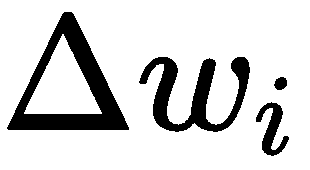
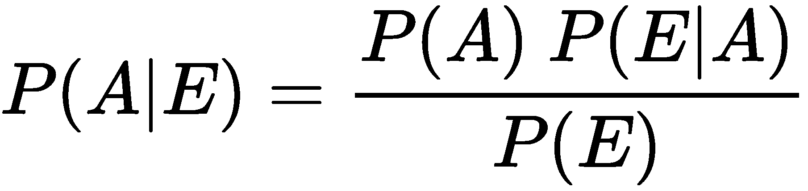

# 第四章：垃圾邮件还是正常邮件？使用人工智能检测电子邮件中的网络安全威胁

大多数安全威胁使用电子邮件作为攻击向量。由于通过这种方式传输的流量特别大，因此需要使用自动化检测程序，这些程序利用**机器学习**（**ML**）算法。在本章中，将介绍不同的检测策略，从线性分类器和贝叶斯滤波器到更复杂的解决方案，如决策树、逻辑回归和**自然语言处理**（**NLP**）。

本章将涵盖以下主题：

+   如何使用感知器检测垃圾邮件

+   使用**支持向量机**（**SVMs**）进行图像垃圾邮件检测

+   使用逻辑回归和决策树进行钓鱼检测

+   使用朴素贝叶斯的垃圾邮件检测

+   基于 NLP 的垃圾邮件检测

# 使用感知器检测垃圾邮件

人工智能在网络安全领域的第一个具体成功应用之一就是垃圾邮件检测，而最著名的开源工具之一就是**SpamAssassin**。

可以实施的有效垃圾邮件检测策略是不同的，正如我们将在本章中看到的那样，但最常见且简单的策略是使用**神经网络**（**NNs**）的最基本形式；也就是感知器（Perceptron）。

垃圾邮件检测还为我们提供了逐步引入与神经网络相关的理论概念的机会，从感知器开始，以一种易于理解的方式进行介绍。

# 了解神经网络最纯粹的形态——感知器

所有神经网络的共同特征（无论其实现复杂性如何）是，它们在概念上模仿人脑的行为。当我们分析大脑的行为时，最基本的结构无疑是神经元。

感知器是**人工智能**（**AI**）领域中最早成功实现神经元的案例之一。就像人类大脑中的神经元一样，它具有分层结构，旨在将特定输入级别的结果与输出关联，如下图所示：


同样，通过感知器模型实现的人工神经元表示是以一种结构化的方式，旨在将给定的输出值与一个或多个输入数据级别关联起来：


将输入数据转化为输出值的机制是通过对输入值进行适当加权实现的，这些值经过综合后传递给激活函数，当超过某个阈值时，生成的输出值将传递给神经网络的其余部分。

# 关键在于找到合适的权重！

统计模型与人工智能算法方法之间的一个区别在于，算法实现了一种基于迭代的优化策略。事实上，在每次迭代中，算法会尝试调整自己对值的估计，依据我们需要最小化的成本函数，为其分配更大或更小的权重。算法的目标之一是精确地识别一个最佳的权重向量，以便将其应用于估算值，从而对未知的未来数据做出可靠的预测。

为了充分理解应用于垃圾邮件检测的人工智能算法的强大功能，我们必须首先明确我们应该执行垃圾邮件过滤器的任务。

# 简言之，垃圾邮件过滤器。

为了理解垃圾邮件过滤器执行的任务，我们来看一个例子。假设将我们收到的电子邮件进行分类，根据电子邮件文本中出现某些特定关键词的频率，判断这些关键词是否存在。为此，我们可以将收到的所有邮件列入表格。但是，我们将如何进行邮件的分类，将其标记为“正常邮件”还是“垃圾邮件”呢？

正如我们所说的，我们将查找电子邮件文本中可疑关键词的出现次数。然后，我们将根据识别的关键词的出现次数，为单个被识别为垃圾邮件的消息分配分数。这个分数也将为我们提供一个参考，用于分类后续的电子邮件。

我们将识别一个阈值，该值允许我们分离垃圾邮件。如果计算出的分数超过阈值，邮件将自动被分类为垃圾邮件；否则，它将被接受为合法邮件，并因此被分类为正常邮件。这个阈值（以及分配的分数）将不断重新确定，以考虑我们将来遇到的新一系列垃圾邮件。

即使从我们对垃圾邮件检测算法的抽象描述中，我们也注意到一些必须牢记的重要特征：我们必须识别一定数量的可疑关键词，以便将邮件分类为潜在的垃圾邮件，并为每封邮件根据识别出的关键词出现次数分配一个分数。

我们需要为分配给各个电子邮件的分数设置一个阈值，超过该阈值的邮件将自动被分类为垃圾邮件。我们还必须正确地权衡电子邮件文本中关键词的意义，以便充分表示包含这些关键词的消息代表垃圾邮件的概率（实际上，单独来看，关键词可能是无害的，但将它们组合在一起时，它们更有可能代表垃圾邮件）。

我们必须考虑到垃圾邮件发送者充分意识到我们正在尝试过滤不需要的邮件，因此他们会尽最大努力采用新的策略来欺骗我们和我们的垃圾邮件过滤器。这就导致了一个持续和迭代的学习过程，这个过程非常适合用人工智能算法来实现。

从我们所说的内容来看，很明显垃圾邮件检测成为人工智能在网络安全领域应用的首次测试并非偶然。事实上，第一代垃圾邮件检测解决方案使用了静态规则，通过正则表达式识别电子邮件文本中预定义的可疑词语模式。

这些静态规则很快证明是无效的，因为垃圾邮件发送者不断采用新的欺骗策略来欺骗反垃圾邮件过滤器。因此，必须采用一种动态方法，使得垃圾邮件过滤器能够根据垃圾邮件发送者不断创新的方式进行学习，同时还可以借助用户在分类电子邮件时做出的决策。通过这种方式，能够有效地管理垃圾邮件现象的爆炸性传播。

# 垃圾邮件过滤器的作用

反垃圾邮件算法在电子邮件分类时的实际表现如何呢？首先，我们根据可疑关键词来对电子邮件进行分类。为了简化问题，我们假设最具代表性的可疑关键词列表只包含两个词：buy（购买）和 sex（性）。

在这一部分，我们将把电子邮件消息分类在一个表格中，显示在电子邮件文本中识别出的各个关键词的出现次数，并标明这些消息是垃圾邮件还是正常邮件：


目前，我们将给每一封电子邮件消息分配一个分数。

这个分数将通过一个评分函数来计算，该函数考虑了文本中可疑关键词的出现次数。

一种可能的评分函数可以是我们两个关键词出现次数的总和，在这种情况下，使用 *B* 变量表示“buy”一词，使用 *S* 变量表示“sex”一词。

因此，评分函数变成了如下形式：

<q></q>

我们还可以根据不同的关键词，为各自的代表性变量赋予不同的权重。例如，消息中包含关键词“sex”比包含“buy”更可能被判定为垃圾邮件，因此可以赋予“sex”更高的权重。

很明显，如果文本中同时出现这两个词，那么它被判定为垃圾邮件的概率就会增加。因此，我们会为 *B* 变量赋予较低的权重 *2*，为 *S* 变量赋予较高的权重 *3*。

我们的评分函数，经过相应权重调整后，变成了以下公式：


现在让我们尝试重新分类我们的邮件，计算每封邮件的相对得分，使用我们的评分函数：


在这一点上，我们必须尝试确定一个阈值，有效地区分垃圾邮件和正常邮件。实际上，**4** 和 **5** 之间的阈值可以帮助我们正确地区分垃圾邮件和正常邮件。换句话说，如果一封新邮件的得分大于或等于 **4**，我们很可能面临的是垃圾邮件，而非正常邮件。

我们如何将刚刚看到的概念有效地转化为可用于算法的数学公式呢？

为此，线性代数（正如我们在 第二章 *为网络安全武器设置你的 AI* 中提到的，当时我们讨论了 `numpy` 库提供的矩阵实现）为我们提供了帮助。

我们将进一步讨论感知机的实现，但首先，我们将介绍线性分类器的概念，它对于数学表示常见的垃圾邮件检测算法任务非常有用。

# 使用线性分类器检测垃圾邮件

正如线性代数中所知，用于确定每封邮件得分的函数方程如下：


这标识了笛卡尔平面中的一条直线；因此，我们的垃圾邮件过滤器用于分类邮件的分类器称为 **线性分类器**。通过采用统计学中常见的数学形式化，可以通过引入求和运算符 ，用一个索引值矩阵  和一个与之关联的权重向量  来替代 *B* 和 *S* 变量，从而以更紧凑的形式重新定义先前的方程：


使用索引 *i*，其取值范围从 *1* 到 *n*，这种形式化只是前述变量与相对权重之间求和的紧凑表示：


这样，我们将线性分类器推广到了一个不确定的变量个数 *n*，而不是像前一个例子中那样限制为 *2*。这种紧凑的表示法对于在线性代数公式中利用算法实现也非常有用。

实际上，我们的函数转化为一系列乘积的和（每个权重和变量的乘积），这可以很容易地表示为矩阵与向量的乘积：


这里，*wT* 表示转置的权重载体，计算矩阵与向量乘积时是必需的。

正如我们所见，为了正确地分类电子邮件，我们需要识别一个合适的阈值，以正确地将垃圾邮件与正常邮件区分开：如果某封电子邮件的得分等于或高于阈值，则该邮件将被分类为垃圾邮件（并赋予值 `+1`）；否则，它将被分类为正常邮件（我们将赋值 `-1`）。

从正式的角度来看，我们将此条件表示为如下（其中 *θ* 代表阈值）：


前述条件不过是以下形式：


将 *θ* 阈值移到方程的左侧，并将其与 *x[0]* 变量关联（从而引入求和的 *i = 0* 位置索引），并为 *x[0]* 分配常规值 1，同时将权重 *w[0]* 设为 *-θ*（即阈值的负值，跟随 *θ* 向方程左侧的位移）。因此，用 *θ* 替代乘积：


这样，我们对线性分类器的简洁公式就变成了最终的形式：


在这里，索引  现在取值从 *0* 到 *n*。

# 感知机是如何学习的

我们在本章中迄今为止描述的 Rosenblatt 感知机模型所采用的方法，基于对人脑神经元的简化描述。正如大脑的神经元在接收到正信号时会激活，否则保持静止一样，感知机通过激活函数使用阈值，该函数会分配一个 `+1` 值（在感知机激活的情况下，表示预设的阈值已被超过），或 `-1` 值（换句话说，表示未能超过阈值）。

重新审视前面确定感知机激活条件的数学表达式：


我们看到，它是  值的乘积（即对应权重的输入数据），必须超过 *θ* 阈值才能确定感知机是否激活。由于 *x[i]* 输入数据按定义是预先设定的，正是对应权重的值帮助判断感知机是否需要激活。

但在实际操作中，权重是如何更新的，从而确定感知机的学习过程呢？

感知机的学习过程可以总结为以下三个阶段：

+   将权重初始化为预定义值（通常为 *0*）

+   计算每个相应训练样本的输出值，

+   基于预期输出值（即与相应输入数据的原始类别标签相关联的值，）和预测值（感知器估算的值）之间的距离来更新权重。

实际上，个别权重根据以下公式进行更新：


在这里，值表示预期（***y***）值与预测值之间的偏差：


从前面的公式可以明显看出，预期的***y***值与预测值之间的偏差会被输入值的值和常数相乘，这个常数表示分配给感知器的学习率。常数通常取值在*0.0*到*1.0*之间，该值是在感知器初始化阶段指定的。

如我们所见，学习率的值对感知器的学习至关重要，因此有必要仔细评估（甚至通过反复试验）赋给常数的值，以优化感知器返回的结果。

# 一个基于感知器的简单垃圾邮件过滤器

现在我们将看到一个使用感知器的实际例子。我们将使用`scikit-learn`库创建一个基于感知器的简单垃圾邮件过滤器。我们将用来测试垃圾邮件过滤器的数据集来自于短信垃圾邮件消息集，数据集可在[`archive.ics.uci.edu/ml/datasets/sms+spam+collection`](https://archive.ics.uci.edu/ml/datasets/sms+spam+collection)找到。

原始数据集可以以 CSV 格式下载；我们处理了 CSV 文件中的数据，将其转化为数字值，以便感知器能够处理。此外，我们只选择了包含“buy”和“sex”关键词的消息（根据我们之前的描述），并计算了每条消息（无论是垃圾邮件还是正常邮件）中这些关键词在文本中出现的次数。

我们预处理后的结果保存在`sms_spam_perceptron.csv`文件中（附在本书的源代码库中）。

然后，使用`pandas`库加载`sms_spam_perceptron.csv`文件中的数据，从`pandas`的`DataFrame`中提取相应的值，通过`iloc()`方法引用：

```py
import pandas as pd
import numpy as np

df = pd.read_csv('../datasets/sms_spam_perceptron.csv')
y = df.iloc[:, 0].values
y = np.where(y == 'spam', -1, 1)
X = df.iloc[:, [1, 2]].values
```

因此，我们使用`iloc()`方法，将类标签`ham`和`spam`（出现在`DataFrame`的`.csv`文件的第一列中）分配给`y`变量（表示期望值的向量）。此外，我们使用 NumPy 的`where()`方法将之前提到的类标签转换为数值`-1`（对于垃圾邮件）和`+1`（对于正常邮件），以便我们能够在感知机中管理这些类标签。

同样地，我们将`DataFrame`中`sex`和`buy`列对应的值分配给了`X`矩阵，这些值是文本中与两个关键字对应的出现次数。这些值也是数字格式，因此可以将它们输入到我们的感知机中。

在创建感知机之前，我们将输入数据分为训练数据和测试数据：

```py
from sklearn.model_selection import train_test_split
X_train, X_test, y_train, y_test = train_test_split(X, y, test_size=0.3, random_state=0)
```

使用应用于`X`和`y`变量的`train_test_split()`方法，我们将数据集分成两个子集，将原始数据集的 30%（使用`test_size = 0.3`参数）分配给测试值，将剩余的 70%分配给训练值。

此时，我们可以通过实例化`sklearn.linear_model`包中的`Perceptron`类来定义我们的感知机：

```py
from sklearn.linear_model import Perceptron
p = Perceptron(max_iter=40, eta0=0.1, random_state=0)
p.fit(X_train, y_train)
```

在`p`感知机的初始化阶段，我们设置最大迭代次数为`40`（初始化时使用`max_iter = 40`参数）和学习率为`0.1`（`eta0 = 0.1`）。最后，我们调用感知机的`fit()`方法，用训练数据训练`p`对象。

我们现在可以继续在测试数据上估计值，调用感知机的`predict()`方法：

```py
y_pred = p.predict(X_test)
```

作为训练阶段的结果（训练数据占原始数据集的 70%），感知机现在应该能够正确估计测试数据子集（原始数据集剩余的 30%）的期望值。

我们可以使用`scikit-learn`的`sklearn.metrics`包来验证感知机返回的估计值的准确性，方法如下：

```py
from sklearn.metrics import accuracy_score
print('Misclassified samples: %d' % (y_test != y_pred).sum())
print('Accuracy: %.2f' % accuracy_score(y_test, y_pred))
Misclassified samples: 3
Accuracy: 0.90
```

通过将测试数据（`y_test`）与预测值（`y_pred`）进行比较，并统计所有的不匹配项，我们现在能够评估感知机提供的预测准确性。

在我们的例子中，准确率相当好（90%），因为错误分类的总数仅为三个。

# 感知机的优缺点

尽管感知器的实现相对简单（这里的简单性是该算法的优势，相较于预测结果的准确性），但它存在一些重要的局限性。作为一个本质上的二分类线性分类器，感知器只有在分析的数据是线性可分的情况下才能提供准确的结果；也就是说，可以识别一条直线（或在多维数据的情况下，一个超平面），将数据完全分割在笛卡尔平面中：


如果相反（在大多数实际情况中确实如此）分析的数据不可线性分离，感知器学习算法将围绕数据无限振荡，试图寻找一个可以线性分离数据的权重向量（但无法找到）：


因此，感知器的收敛仅在数据线性可分且学习率较小的情况下才可能发生。如果数据的类别不可线性分离，那么设置最大迭代次数（对应于`max_iter`参数）非常重要，以防止算法在寻找（不存在的）最优解时无限振荡。

克服感知器实际限制的一种方法是接受更**宽的间隔**来分离数据。这正是 SVM 所采用的策略，我们将在下一节中讨论这一话题。

# 使用 SVM 进行垃圾邮件检测

SVM 是*监督式*算法的一个例子（与感知器一样），其任务是识别最佳分离数据类别的超平面，这些数据可以在**多维空间**中表示。然而，可以识别出不同的超平面来正确分离数据；在这种情况下，选择的超平面是**优化预设间隔**的，即超平面与数据之间的距离。

SVM 的一个优势是，所识别的超平面**不限于**线性模型（与感知器不同），如下图所示：


然而，SVM 可以被看作是感知器的扩展。在感知器的情况下，我们的目标是**最小化**分类错误，而在 SVM 的情况下，我们的目标则是**最大化**间隔，即超平面与训练数据之间的**距离**，并且该数据是距离超平面*最近*的（因此，最接近的训练数据被称为**支持向量**）。

# SVM 优化策略

为什么一开始选择最大化边距的超平面？原因在于，**更宽的边距**对应于更少的分类错误，而**更窄的边距**则可能导致我们遭遇**过拟合**现象（当我们处理*迭代*算法时，过拟合是一个真正的灾难，正如我们将在讨论 AI 解决方案的验证和优化策略时所见）。

我们可以用数学术语来翻译 SVM 优化策略，类似于我们在感知机案例中所做的（感知机仍然是我们的起点）。我们定义了必须满足的条件，以确保 SVM 正确识别出将数据类分隔开的最佳超平面：


在这里，*β*常数表示*偏置*，而*µ*表示我们的*边距*（它假设最大可能的正值，以便在各个值的类别之间获得最佳分隔）。

实际上，在代数乘法（由  表示）中，我们添加了*β*偏置值，这使得我们能够在值落入相同的**类标签**时，得到一个大于或等于零的值（记住，*y*只能取`-1`或`+1`的值，以区分样本所属的相应类别，正如我们在感知机案例中已经看到的那样）。

在此时，我们以这种方式计算出的值与  边距进行比较，以确保每个样本与我们识别出的分隔超平面（即构成我们的决策边界）之间的距离大于或等于我们的边距（正如我们所看到的，边距被确定为最大可能的正值，以便在各个值的类别之间获得*最佳*分隔）。

# SVM 垃圾邮件过滤器示例

让我们回到我们的垃圾邮件过滤器示例，并将感知机替换为 SVM，正如我们在识别超平面时所看到的那样，我们并不仅限于使用线性分类器模型（可以选择具有更高复杂性的分类器）。

然而，为了比较之前与感知机得到的结果，感知机是一个严格的线性分类器，我们在 SVM 的情况下也选择了线性分类器。

然而，这一次，我们的数据集（存储在`sms_spam_svm.csv`文件中，并源自本章前面找到的 SMS 垃圾邮件消息集合，其中提取并比较了各种可疑关键词的总出现次数和消息中无害单词的总数）并不是严格线性可分的。

与感知机案例中相同，我们将使用`pandas`加载数据，将类标签与相应的`-1`值（表示垃圾邮件）和`1`值（表示正常邮件）关联起来：

```py
import pandas as pd
import numpy as np
df = pd.read_csv('../datasets/sms_spam_svm.csv')
y = df.iloc[:, 0].values
y = np.where(y == 'spam', -1, 1)
```

一旦数据加载完毕，我们接着将原始数据集拆分为 30%的测试数据和 70%的训练数据：

```py
from sklearn.model_selection import train_test_split

X_train, X_test, y_train, y_test = train_test_split(X, y, test_size=0.3, random_state=0)
```

在这一点上，我们可以继续实例化我们的 SVM，导入`SVC`类（代表**支持向量分类器**）来自`sklearn.svm`包，选择线性分类器（`kernel = 'linear'`），然后通过调用`fit()`方法进行模型训练，最后通过调用`predict()`方法估计测试数据：

```py
from sklearn.svm import SVC

svm = SVC(kernel='linear', C=1.0, random_state=0)
svm.fit(X_train, y_train)
y_pred = svm.predict(X_test)
```

我们现在可以通过使用`sklearn.metrics`包来评估 SVM 算法返回的预测准确性，就像我们在使用感知机时所做的那样：

```py
from sklearn.metrics import accuracy_score

print('Misclassified samples: %d' % (y_test != y_pred).sum())
print('Accuracy: %.2f' % accuracy_score(y_test, y_pred))
Misclassified samples: 7
Accuracy: 0.84
```

即使在存在非线性可分数据的情况下，我们也可以看到 SVM 算法的表现如何，因为预测的准确度达到了 84%，而错误分类的案例仅为 7 个。

# 使用 SVM 进行图像垃圾邮件检测

SVM 算法的多功能性使我们能够处理更复杂的现实世界分类案例，例如以图像形式呈现的垃圾邮件，而不是简单的文本。

正如我们所看到的，垃圾邮件发送者非常清楚我们的检测尝试，因此会尝试采用各种可能的解决方案来欺骗我们的过滤器。规避策略之一是使用图像作为传播垃圾邮件的载体，而不是简单的文本。

然而，已有一段时间，基于图像的垃圾邮件检测解决方案已可行。在这些方案中，我们可以区分以下几种基于不同策略的检测方法：

+   **基于内容的过滤**：这种方法的核心是尝试识别在文本垃圾邮件中常见的嫌疑关键词，即使在图像中也存在这些关键词；为此，采用模式识别技术并利用光学字符识别（**OCR**）技术来提取图像中的文本（这是 SpamAssassin 采用的解决方案）。

+   **非基于内容的过滤**：在这种情况下，我们尝试识别垃圾邮件图像的特定特征（如颜色特征等），理由是垃圾邮件图像由于计算机生成，与自然图像相比显示出不同的特征；为了提取这些特征，我们采用基于神经网络（NN）和**深度学习**（**DL**）的先进识别技术。

# SVM 是如何诞生的？

一旦提取出图像的显著特征，并且将相应的样本归类到其对应类别（垃圾邮件或正常邮件）中，就可以利用 SVM 对这些特征进行模型训练。

关于这个主题的最新项目之一是*图像垃圾邮件分析*，由 Annapurna Sowmya Annadatha ([`scholarworks.sjsu.edu/etd_projects/486`](http://scholarworks.sjsu.edu/etd_projects/486))完成，该项目以创新的方法为特点，基于以下假设：垃圾邮件图像的特征由于是计算机生成的，与由相机生成的图像的特征不同；并且选择性使用 SVM，从而在计算成本较低的情况下，实现了结果的高准确度。

该方法包括以下步骤：

1.  使用线性 SVM 和特征集训练分类器

1.  计算所有特征的 SVM 权重

1.  选择第一个具有最大权重的

1.  基于该子集创建模型

有关更多信息，请参阅上一段提到的项目参考资料。

# 使用逻辑回归和决策树进行钓鱼检测

在分析了感知机和 SVM 之后，我们现在处理使用逻辑回归和决策树的替代分类策略。

但在继续之前，我们将首先了解这些算法的独特特征以及它们在垃圾邮件检测和钓鱼检测中的应用，从回归模型开始。

# 回归模型

回归模型无疑是所有学习算法中最常用的。回归模型起源于统计分析，并迅速在机器学习和人工智能中得到应用。最为人熟知和使用的回归模型是线性回归，因为它的实现简单，并且在许多实际案例中（例如根据利率变化估算房价水平）具有良好的预测能力。

除了线性模型外，还有逻辑回归模型，特别是在数据处理过于复杂、线性模型过于僵化的情况下非常有用。因此，这两种模型代表了分析师和算法开发人员的首选工具。

在下一节中，我们将分析回归模型的特性和优势，以及它们在垃圾邮件检测领域的可能应用。让我们从最简单的模型——线性回归模型开始分析，这将帮助我们与逻辑回归模型进行比较。

# 介绍线性回归模型

线性回归模型的特点在于，数据表现为特征的和，从而在笛卡尔平面上形成一条直线。

从正式的角度看，线性回归可以用以下公式描述：


这里，*y* 代表预测值，它是单个特征（由 *X* 矩阵表示）的线性组合结果，应用了一个权重向量（由 *w* 向量表示），并加上一个常数 (*β*)，这个常数代表在所有特征的值为零（或简单缺失）时的默认预测值。

*β* 常数也可以解释为模型的系统性偏差，并在图形上与笛卡尔平面垂直轴上的截距值对应（也就是说，回归线与垂直轴相交的点）。

显然，线性模型可以扩展到有多个特征的情况。在这种情况下，数学公式化的形式如下：


之前公式的几何表示将对应于 *n* 维空间中的超平面，而不是笛卡尔平面中的直线。我们已经提到过， 常数作为模型在特征值为零时的默认预测值，具有重要性。

权重向量中的各个 值，，可以解释为相应特征的重要性度量，[.]

实际上，如果 权重值接近零，则对应的 特征在预测值的确定中具有最小重要性（或者根本没有重要性）。相反，如果 权重为正值，它将放大回归模型返回的最终值。

另一方面，如果 取负值，它将有助于逆转模型预测的方向，因为当 ** 特征增加时，它将对应回归模型估算值的下降。因此，考虑权重对 ** 特征的影响非常重要，因为它们是我们从回归模型中推导出预测正确性的决定性因素。

# 使用 scikit-learn 进行线性回归

在下面的代码片段中，我们将看到如何基于线性回归实现一个简单的预测模型，使用 `scikit-learn` 的 `linear_model` 模块，并以之前使用的垃圾邮件数据集之一作为输入：

```py
import pandas as pd
import numpy as np

df = pd.read_csv('../datasets/sms_spam_perceptron.csv')
X = df.iloc[:, [1, 2]].values
y = df.iloc[:, 0].values
y = np.where(y == 'spam', -1, 1)

from sklearn.linear_model import LinearRegression

linear_regression = LinearRegression()
linear_regression.fit(X,y)
print (linear_regression.score(X,y))
```

为了验证线性回归模型提供的预测的准确性，我们可以使用 `score()` 方法，该方法给我们提供 R² 判定系数的度量。

这个系数在`0`和`1`之间变化，用来衡量当与简单均值相比时，线性模型返回的预测有多好。

# 线性回归 – 优缺点

如我们所见，线性回归模型的实现简单性代表了其无可争议的优势。然而，模型的局限性也相当显著。

实际上，线性回归模型只能用来处理定量数据，而在使用分类数据进行预测分析的情况下，我们必须借助逻辑回归模型。此外，线性回归的主要局限性在于模型假设特征之间大多不相关；也就是说，特征之间不会相互影响。这一假设使得我们可以将特征及其各自权重的乘积表示为独立项的和。

然而，确实存在一些实际情况，其中这一假设并不现实（例如，人的年龄与体重之间可能存在关系，体重会随年龄变化）。这一假设的负面副作用是，我们可能会多次添加相同的信息，无法正确预测变量组合对最终结果的影响。

从技术角度看，线性回归模型的特点是预测中具有较大的偏差，而不是较大的方差（稍后我们将有机会讨论偏差和方差之间的权衡）。

换句话说，当被分析的数据表现出复杂的关系时，线性回归模型会导致我们做出系统性的失真预测。

# 逻辑回归

我们已经看到，线性回归的一个限制是它不能用来解决分类问题：

实际上，如果我们想使用线性回归对属于两个类别的样本进行分类（如垃圾邮件检测中的情况），这些样本的标签由数值表示（例如，`-1`表示**垃圾邮件**，`+1`表示**正常邮件**），线性回归模型将试图识别与目标值最接近的结果（也就是说，线性回归的目标是最小化预测误差）。这种行为的负面副作用是，它会导致更大的分类误差。相对于感知器，线性回归在分类准确性方面无法给出良好的结果，正是因为线性回归在处理值的连续区间时效果较好，而不是处理离散值的类别（如分类中的情况）。

一种替代策略，更适用于分类目的，是估算样本属于各个类别的概率。这是逻辑回归所采用的策略（尽管名字中有“回归”二字，但它实际上是一个分类算法，而不是回归模型）。

逻辑回归的数学公式如下：


这里， 。  因此衡量的是给定样本属于  类别的条件概率，前提是已知  特征。

# 使用逻辑回归的钓鱼检测器

然后我们可以使用逻辑回归来实现一个钓鱼检测器，利用逻辑回归特别适用于解决分类问题的特点。像垃圾邮件检测一样，钓鱼检测不过是一个样本分类任务。

在我们的示例中，我们将使用 UCI 机器学习库网站提供的数据集（[`archive.ics.uci.edu/ml/datasets/Phishing+Websites`](https://archive.ics.uci.edu/ml/datasets/Phishing+Websites)）。

数据集已经从原始的`.arff`格式转换为 CSV 格式，采用了被称为**独热编码**的数据整理技术（[`en.wikipedia.org/wiki/One-hot`](https://en.wikipedia.org/wiki/One-hot)），包含了 30 个特征，用于表征钓鱼网站。

在以下代码块中找到我们检测器的源代码：

```py
import pandas as pd
import numpy as np
from sklearn import *
from sklearn.linear_model import LogisticRegression
from sklearn.metrics import accuracy_score

phishing_dataset = np.genfromtxt('../datasets/phishing_dataset.csv',
delimiter=',', dtype=np.int32)

samples = phishing_dataset[:,:-1]

targets = phishing_dataset[:, -1]

from sklearn.model_selection import train_test_split

training_samples, testing_samples, training_targets, testing_targets = train_test_split(samples, targets, test_size=0.2, random_state=0)

log_classifier = LogisticRegression()

log_classifier.fit(training_samples, training_targets)

predictions = log_classifier.predict(testing_samples)
accuracy = 100.0 * accuracy_score(testing_targets, predictions)

print ("Logistic Regression accuracy: " + str(accuracy))

Logistic Regression accuracy: 91.72320217096338

```

如我们所见，逻辑回归分类器的准确率相当不错，因为该模型能够正确检测出超过 90%的 URL。

# 逻辑回归的优缺点

采用逻辑回归的优势可以总结如下：

+   该模型可以非常高效地训练

+   即使在特征数量较多的情况下，它也能有效使用

+   由于其评分函数的简洁性，该算法具有很高的可扩展性

然而，逻辑回归也存在一些重要的局限性，这些局限性源于其基本假设，比如要求特征必须是线性独立的（这一规则在技术上称为不存在多重共线性），并且通常需要比其他竞争算法更多的训练样本，因为逻辑回归中采用的最大似然准则比起线性回归中用于最小化预测误差的最小二乘法来说，较为无力。

# 使用树进行决策

如我们在前述段落中所见，当我们需要选择使用哪种算法来执行某项任务时，必须考虑构成数据的特征类型。特征实际上可以由定量值或定性数据组成。

机器学习算法显然更擅长处理定量值；然而，大多数实际情况涉及使用以定性形式（如描述、标签、单词等）表示的数据，这些数据包含了非数字形式的信息。

正如垃圾邮件检测的例子，我们已经看到如何将定性特征（如垃圾邮件和正常邮件标签，分别赋予数值`-1`和`+1`）转换为数值形式（这种做法称为**数值编码**），但它仅部分解决了分类问题。

这并非偶然，约翰·罗斯·昆兰（John Ross Quinlan）在论文《决策树的归纳》（*Induction of Decision Trees*）中描述了决策树算法，这篇论文考虑了以定性形式传递的信息。昆兰的论文（他的贡献对决策树的发展至关重要）实际上是选择是否在户外打网球，基于如天气（晴天、多云或下雨）、温度（凉爽、温和或炎热）、湿度（高或正常）、风速（真或假）等特征。

我们如何指示机器处理同时以定量和定性形式呈现的信息？

# 决策树的基本原理

决策树使用二叉树来分析和处理数据，从而成功地对以数值和类别形式表示的值做出预测，接受数值型和定性信息作为输入数据。

为了直观理解决策树所采用的策略，下面我们来看一看其实现中的典型步骤：

1.  第一步是将原始数据集划分为两个子集，在验证二元条件后，进行第一次划分，结果会得到两个子集，在这两个子集中二元条件被验证或否定。

1.  子集将根据进一步的条件继续细分；在每一步中，选择能够提供最佳二分划分的条件（为此，使用适当的度量标准来衡量划分质量）。

1.  划分过程是递归进行的。因此，必须定义一个停止条件（例如，达到最大深度）。

1.  在每次迭代中，算法生成一棵树结构，其中子节点代表每一步所做的选择，每个叶子节点则有助于输入数据的整体分类。

请查看下图，它展示了 Iris 数据集的决策树：


决策树在处理大型数据集方面也非常高效。事实上，树形数据结构的特点使我们能够将算法的复杂度限制在一个数量级为*0*（*log n*）的范围内。

# 使用决策树进行钓鱼攻击检测

现在我们来看决策树在钓鱼攻击检测任务中的应用。如前所述，钓鱼攻击检测（以及垃圾邮件过滤）基本上涉及输入数据的分类：

```py
import pandas as pd
import numpy as np
from sklearn import *
from sklearn.linear_model import LogisticRegression
from sklearn.metrics import accuracy_score

phishing_dataset = np.genfromtxt('../datasets/phishing_dataset.csv', delimiter=',', dtype=np.int32)

samples = phishing_dataset[:,:-1]
targets = phishing_dataset[:, -1]

from sklearn.model_selection import train_test_split

training_samples, testing_samples, training_targets, testing_targets =
train_test_split(samples, targets, test_size=0.2, random_state=0)

from sklearn import tree

tree_classifier = tree.DecisionTreeClassifier()

tree_classifier.fit(training_samples, training_targets)

predictions = tree_classifier.predict(testing_samples)
accuracy = 100.0 * accuracy_score(testing_targets, predictions)

print ("Decision Tree accuracy: " + str(accuracy))

Decision Tree accuracy: 96.33649932157394
```

我们可以看到，决策树分类器进一步增强了之前通过逻辑回归获得的优秀性能。

# 决策树——优缺点

除了已经描述的优点外，我们还必须记住与决策树相关的可能缺点；这些缺点主要与过拟合现象有关，这是由于树形数据结构的复杂性（实际上，必须通过系统化的方式进行树的修剪，以减少其整体复杂性）。

复杂性带来的一个不利后果是算法对训练数据集中的细微变化非常敏感，这可能会对预测模型产生显著影响。因此，决策树不适合增量学习。

# 使用朴素贝叶斯进行垃圾邮件检测

朴素贝叶斯的一个优势是，它只需要很少的初始数据就可以开始对输入数据进行分类；此外，随着信息的逐步增加，它有助于动态更新先前的估计，逐步改善预测模型（与我们在前一段看到的基于决策树的算法不同）。

# 朴素贝叶斯在垃圾邮件检测中的优势

上述特性非常适合垃圾邮件检测任务。事实上，在不需要大量数据集的情况下，基于朴素贝叶斯的垃圾邮件检测算法可以利用收件箱中已经存在的邮件，不断地根据逐渐加入的新邮件更新概率估计。

不断更新概率估计的过程基于著名的贝叶斯规则：



上述方程描述了事件*A*发生的概率与证据*E*之间的关系。

这个关系取决于*A*（先验概率）和证据*E*的似然性！[](img/834b7330-4413-44d0-a70a-be766c67857f.png)，后者决定了概率估计！[](img/cf3e7f1e-cb2f-4e29-b54b-85a51147b8b1.png)（后验概率）。

贝叶斯规则概率更新的一个重要特性是，经过更新过程后，概率 （后验概率）会成为新的先验概率，从而有助于动态更新现有的概率估计。

# 为什么选择朴素贝叶斯？

贝叶斯规则的基本假设之一是它假设事件之间是独立的。这个假设并不总是现实的。

然而，在大多数情况下，这是一个合理的条件，有助于做出良好的预测，同时简化了贝叶斯法则的应用，特别是在多个竞争事件的情况下，从而将计算简化为对每个事件相关概率的简单相乘。

在实际使用朴素贝叶斯算法进行垃圾邮件检测之前，我们需要分析文本分析技术，以使朴素贝叶斯能够动态地识别垃圾邮件发送者使用的可疑关键词（而不是像之前的示例那样以固定的方式选择它们）。

# NLP 来拯救我们

AI 最令人兴奋的领域之一无疑是自然语言处理（NLP），它包括对人类语言的分析和自动化理解。

NLP 的目的是尝试从非结构化数据中提取有意义的信息（例如电子邮件、推文和 Facebook 帖子）。

NLP 的应用领域非常广泛，从实时翻译到情感分析和语音识别等。

# NLP 步骤

NLP 的主要阶段如下：

1.  识别构成语言的单词（标记）

1.  文本结构分析

1.  识别单词之间的关系（例如段落、句子等）

1.  文本的语义分析

最著名的 Python 自然语言处理库之一是**自然语言工具包**（**NLTK**），它常用于垃圾邮件检测。

在下面的示例中，我们将看到如何利用 NLTK 结合朴素贝叶斯算法来创建一个垃圾邮件检测器。

# 使用 NLTK 的贝叶斯垃圾邮件检测器

作为结束示例，我们将展示如何使用基于朴素贝叶斯的分类器，采用来自`sklearn.naive_bayes`模块的`MultinomialNB`。和往常一样，我们将把原始数据集（包含 CSV 格式的垃圾邮件消息存档）划分为测试数据子集和训练数据子集，其中 30%为测试数据，70%为训练数据。

数据将采用**词袋模型**（**BoW**）技术处理，该技术使用`sklearn`的`CountVectorizer`为文本中识别的每个单词分配一个编号，并传入`get_lemmas()`方法，该方法返回从消息文本中提取的单个标记。

最后，我们将使用`TfidfTransformer`对数据进行标准化和加权，它将计数矩阵转换为标准化的`tf`或`tf-idf`表示。

在 scikit-learn 文档中关于`TfidfTransformer`的说明（[`scikit-learn.org/stable/modules/generated/sklearn.feature_extraction.text.TfidfTransformer.html`](https://scikit-learn.org/stable/modules/generated/sklearn.feature_extraction.text.TfidfTransformer.html)），我们可以找到如下内容：

“Tf 代表词频，而 tf-idf 代表词频与逆文档频率的乘积。这是一种在信息检索中常用的词项加权方案，且在文档分类中也得到了良好的应用。使用 tf-idf 而非原始的词项在特定文档中出现的频率的目的是缩小那些在给定语料库中频繁出现的词项的影响，这些词项经验上比那些在训练语料库中出现频率较低的特征提供的讯息更少<q>。</q>”

让我们进入源代码：

```py
import matplotlib.pyplot as plt
import csv
from textblob import TextBlob
import pandas
import sklearn
import numpy as np

import nltk

from sklearn.feature_extraction.text import CountVectorizer, TfidfTransformer
from sklearn.naive_bayes import MultinomialNB
from sklearn.metrics import classification_report, accuracy_score
from sklearn.model_selection import train_test_split 

from defs import get_tokens
from defs import get_lemmas

sms = pandas.read_csv('../datasets/sms_spam_no_header.csv', sep=',', names=["type", "text"])

text_train, text_test, type_train, type_test = train_test_split(sms['text'], sms['type'], test_size=0.3)

# bow stands for "Bag of Words"
bow = CountVectorizer(analyzer=get_lemmas).fit(text_train)

sms_bow = bow.transform(text_train)

tfidf = TfidfTransformer().fit(sms_bow)

sms_tfidf = tfidf.transform(sms_bow)

spam_detector = MultinomialNB().fit(sms_tfidf, type_train)
```

我们可以通过尝试对一个随机消息进行预测来检查 `spam_detector` 是否正常工作（在我们的示例中，我们选择了数据集中的第 26 条消息），并通过将预测值与消息的对应 `type` 标签进行比较，检查检测器是否正确分类了消息类型（垃圾邮件或正常邮件）：

```py
msg = sms['text'][25]
msg_bow = bow.transform([msg])
msg_tfidf = tfidf.transform(msg_bow)

print ('predicted:', spam_detector.predict(msg_tfidf)[0])
print ('expected:', sms.type[25])

predicted: ham
expected: ham
```

到此为止，一旦验证了正确功能，我们就可以对整个数据集进行预测：

```py
predictions = spam_detector.predict(sms_tfidf)
print ('accuracy', accuracy_score(sms['type'][:len(predictions)], predictions))
accuracy 0.7995385798513202
```

前述命令生成了以下输出：


如前面的截图所示，朴素贝叶斯的准确率已经相当高（达到 80%），与其他算法不同的是，随着分析的消息数量增加，这个准确率还可以进一步提高。

# 总结

在本章中，我们解释了几种监督学习算法，并展示了它们在解决网络安全领域常见任务中的具体应用，例如垃圾邮件检测和钓鱼邮件检测。

本章获得的知识有助于培养正确的思维方式，以应对越来越复杂的任务，例如我们将在接下来的章节中面临的任务，从而更清晰地认识到每种 AI 算法的优缺点。

在下一章中，我们将学习恶意软件分析以及通过深度学习进行高级恶意软件检测。
