# 第五章：恶意软件威胁检测

恶意软件和勒索软件代码的广泛传播，加上同一威胁的不同变种（多态和变形恶意软件）中的快速多态变异，已使得基于图像文件签名和哈希的传统检测方案过时，而这些传统方案是大多数常见杀毒软件所依赖的。

因此，越来越有必要采用**机器学习**（**ML**）解决方案，这些方案可以快速筛选（**分诊**）威胁，集中精力避免浪费稀缺资源，比如恶意软件分析师的技能和精力。

本章将涵盖以下主题：

+   介绍恶意软件分析方法

+   如何区分不同的恶意软件家族

+   决策树恶意软件检测器

+   使用**隐马尔可夫模型**（**HMMs**）检测变种恶意软件

+   基于深度学习的高级恶意软件检测

# 恶意软件分析一瞥

对于那些接触恶意软件分析的人员来说，一个最有趣的方面是学会区分，例如，合法的二进制文件与那些可能危害计算机及其数据完整性的文件。我们泛指**二进制**文件，而非**可执行**文件（即扩展名为 `.exe` 或 `.dll` 的文件），因为恶意软件甚至可以隐藏在看似无害的文件中，如图像文件（扩展名为 `.jpg` 或 `.png` 的文件）。

同样，文本文件（例如 `.docx` 或 `.pdf`）也可能成为**健康载体**或软件感染的传播媒介，尽管它们的**非可执行**文件格式。此外，恶意软件传播的第一阶段（无论是在家庭 PC 还是公司局域网中）通常通过破坏被攻击计算机内部文件的完整性来实现。

因此，能够有效地识别恶意软件的存在至关重要，以便预防或至少限制其在组织内的传播。

以下是常用的分析策略（及相关工具），用于对通过假冒链接、垃圾邮件、钓鱼等方式传播的文件和软件进行初步调查，以识别那些潜在危险的文件。

为了实现这一目标，我们需要更深入地审视传统的静态和动态恶意软件分析方法。

# 用于恶意软件检测的人工智能

随着与新恶意软件每日传播相关的威胁数量几乎呈指数级增长，单纯依靠**人工**操作员进行分析，几乎不可能有效应对这些威胁。

因此，有必要引入一些算法，至少能够自动化恶意软件分析的准备阶段（称为分诊，源自第一次世界大战中医生采用的相同实践，目的是选择最有可能生还的伤员进行治疗）。也就是说，通过对待分析的恶意软件进行初步筛选，可以使恶意软件分析师及时有效地应对真实的网络威胁。

这些算法实际上是采用 AI 工具的形式，考虑到网络安全的动态性，AI 工具被定义为具备适应能力。事实上，机器需要能够有效应对，并适应与前所未有的威胁传播相关的上下文变化。

这不仅意味着分析师操作恶意软件分析的工具和方法（这显而易见），还意味着他们能够解读算法的行为，并意识到机器所做的选择。

因此，恶意软件分析师需要理解机器学习所遵循的逻辑，并在自动化分析结果的基础上（直接或间接地）参与**微调**（精细调整）相关的学习过程。

# 恶意软件有许多不同的名称

恶意软件的类型繁多，每天都有新的威胁形式出现，这些新威胁巧妙地重新利用了以往的攻击方式，或者采用了完全新的危害策略，利用目标组织的特定特点（在**高级持续性威胁**（**APTs**）中，这些是量身定制的攻击形式，完美地适应目标受害者）。这一切仅受攻击者想象力的限制。

然而，可以编制出最常见恶意软件类型的分类，以便了解哪些是最有效的预防措施，并对它们在应对每种恶意软件时的有效性进行对比：

+   **Trojans**：看似合法且无害的可执行文件，但一旦启动，它们会在后台执行恶意指令

+   **Botnets**：一种旨在危害尽可能多主机的恶意软件，通过控制网络中的主机，将其计算能力服务于攻击者

+   **Downloaders**：恶意软件，从网络上下载恶意库或代码片段，并在受害者主机上执行它们

+   **Rootkits**：一种在操作系统层面危害主机的恶意软件，因此通常以设备驱动程序的形式出现，使得各种反制措施（例如安装在终端上的杀毒软件）变得无效

+   **Ransomwares**：恶意软件，它会加密存储在主机机器上的文件，并要求受害者支付赎金（通常是比特币）以获取解密密钥，用于恢复原始文件

+   **APT（高级持续性威胁）**：APT 是利用受害主机上特定漏洞进行定制化攻击的一种形式。

+   **零日（0 天）**：利用尚未公开给研究人员和分析师社区的漏洞的恶意软件，其特征和安全影响尚未为人所知，因此无法被杀毒软件检测到。

显然，这些不同类型的威胁可能会因为它们能在同一个恶意文件中混合在一起而被放大（例如，一个看似无害的木马一旦执行后变成真正的威胁，它作为下载程序连接到网络并下载恶意软件，如 rootkit，进而危害本地网络并将其转化为僵尸网络）。

# 行业内的恶意软件分析工具

常用的恶意软件分析工具可以按以下方式分类：

+   反汇编工具（如 Disasm 和 IDA）

+   调试工具（如 OllyDbg、WinDbg 和 IDA）

+   系统监控工具（如 Process Monitor 和 Process Explorer）

+   网络监控工具（如 TCP View、Wireshark 和 tcpdump）

+   解包工具和打包器识别工具（如 PEiD）

+   二进制和代码分析工具（如 PEView、PE Explorer、LordPE 和 ImpREC）

# 恶意软件检测策略

显然，每种类型的威胁都需要特定的检测策略。在本节中，我们将介绍传统上由恶意软件分析师手动执行的恶意软件检测分析方法。这些方法提供了对分析阶段的更详细理解，可以通过引入 AI 算法来提高效率，进而减轻人工分析师的重复性或繁重任务，让他们专注于分析中最特殊或最不寻常的方面。

应当强调的是，恶意软件的开发是攻击者进行的创造性活动的结果，因此，难以归类为预设的模式或固定的方式。同样，恶意软件分析师必须依靠所有的创造性资源，并开发非常规程序，以便在一种*猫鼠游戏*中始终领先于攻击者。

因此，恶意软件分析应被视为一种艺术而非科学，因此，它要求分析师能够不断地想出新的检测方法，以便及时识别未来的威胁。因此，恶意软件分析师需要不断更新他们的技术技能，并改进他们的调查方法。

事实上，确实可以通过采取常见的分析方法来启动检测活动，特别是用于检测已知威胁的存在。

为此，在最常见的恶意软件检测活动中，我们可以包括以下恶意软件检测活动：

+   **哈希文件计算**：用于识别已经存在于知识库中的已知威胁

+   **系统监控**：识别硬件和操作系统的异常行为（例如，CPU 周期的异常增加、特别大的磁盘写入活动、注册表项的变化，以及在系统中创建新的和未经请求的进程）

+   **网络监控**：识别主机机器与远程目的地之间建立的异常连接

这些检测活动可以通过使用特定的算法轻松实现自动化，正如我们将在稍后讨论恶意软件分析方法时所看到的。

# 静态恶意软件分析

恶意软件分析的第一步是评估二进制文件中可疑构件的存在，而无需实际运行（执行）代码。

该阶段使用的技术的复杂性被称为**静态恶意软件分析**。

静态恶意软件分析包括以下内容：

+   识别被认为对分析有价值的目标

+   理解可执行指令的流

+   识别已知的模式并将其与可能的恶意软件关联（也称为**恶意软件检测**）

为此，分析工具和程序被用于执行以下功能：

+   识别对系统 API 的调用

+   解码和操作字符串数据以获取敏感信息（例如，域名和 IP 地址）

+   通过下载其他恶意代码检测恶意软件的存在和调用（例如，**命令与控制**（**C2**）、后门和反向 Shell）

# 静态分析方法

静态恶意软件分析采用的方法是检查恶意软件反汇编二进制镜像中的机器指令（汇编指令），以识别其潜在危害，并评估二进制代码的外部特征，然后再进行执行。

# 静态恶意软件分析的难点

静态恶意软件分析中最狡猾的方面之一是确定恶意软件反汇编的正确性存在困难。鉴于反分析技术的日益普及，不能总是假设反汇编器生成的反汇编二进制镜像是可靠的。因此，分析员必须进行初步分析，以检测例如，存在加密可执行代码部分的打包器。

这些初步分析程序常常被分析员忽视，因为它们在所需时间上非常昂贵；然而，它们对于限定需要执行的相关目标是不可或缺的。

此外，如果无法正确检测到可执行代码的部分（可能是因为它们隐藏在被认为是**无害**的数据中，例如表示图像的资源），这一缺陷可能会破坏后续的动态分析阶段，使得无法识别正在调查的恶意软件的确切类型。

# 如何进行静态分析

一旦验证反汇编后的恶意软件是可靠的，就可以采用不同的方式继续：每个分析员实际上都遵循自己首选的策略，这些策略基于他们的经验和他们打算追求的目标。

原则上，可采纳的策略如下：

+   以系统化的方式分析二进制指令，而不执行它们。这是一种有效的技术，适用于代码的有限部分，在大规模恶意软件的情况下变得复杂，因为分析员必须跟踪每条指令分析时的数据状态。

+   扫描指令，寻找被认为有意义的序列，设置断点并部分执行程序直到断点，然后检查此时程序的状态。这种方法通常用于确定被认为危险的系统调用的存在，基于这些调用的调用顺序（例如，连接到网络、创建文件和修改系统注册表的序列是恶意软件下载程序最常见的系统 API 调用序列之一）。

+   同样，也可以检测某些 API 调用的缺失。一个没有调用系统函数（例如与网络相关的函数）的代码，显然无法代表一个后门（但它可能充当键盘记录器，例如，它调用系统 API 序列来检测按下的键，并将其写入磁盘）。

+   在反汇编图像中查找敏感信息（如域名和 IP 地址）字符串格式。同样，在这种情况下，可以在与网络调用对应的位置设置调试器断点，并检测恶意软件连接到互联网时所联系的任何域名或远程 IP 地址。

# 静态分析的硬件要求

与动态分析不同，静态分析通常在硬件方面需要较少的特定资源，因为原则上分析员不会执行正在分析的恶意代码。

正如我们将看到的，在动态恶意软件分析的情况下，可能需要非凡的硬件要求，有时仅使用虚拟机是不够的。这是由于恶意软件实施的反分析措施（反分析技巧），如果检测到虚拟机的存在，就会阻止代码的执行。

# 动态恶意软件分析

如我们所见，静态恶意软件分析的具体特征包括以下几点：

+   验证给定的二进制文件是否真的具有恶意性质。

+   在不启动执行的情况下，尽可能识别二进制文件的更多信息，并基于可以回溯的特征（如文件格式特征或存储在其中的资源特征）进行分析。

+   通过计算可疑二进制文件的哈希值来对其进行目录编制，哈希值即该文件的签名（这个签名也可以在恶意软件分析师社区中共享，以便更新恶意软件威胁的整体知识库）。

+   毫无疑问，静态恶意软件分析虽然快速，但存在一系列方法学上的局限性，特别是在分析复杂类型的恶意软件（如 APT 攻击和变种恶意软件）时。这些方法学上的局限性的一种解决方法是将其与动态恶意软件分析结合，以期更深入地理解所分析的恶意软件的性质和类型。

动态恶意软件分析的独特之处在于，与静态恶意软件分析不同，二进制文件需要被执行（通常是在隔离和保护的环境中进行，称为**恶意软件分析实验室**，这些环境利用沙箱和虚拟机来防止恶意软件在企业网络中广泛传播）。

因此，这一策略涉及到分析**动态**行为，也就是说，例如验证恶意可执行文件是否从互联网下载恶意库或代码片段（有效载荷），或者是否每次执行时都会修改自身的可执行指令，从而使基于签名的检测程序（例如杀毒软件使用的方式）失效。

# 反分析技巧

恶意软件开发者通常采取的对策是加密有效载荷，使用加壳工具、下载器等，这些措施可以防止恶意软件分析或使其变得更加困难。

这些技巧通常可以通过动态恶意软件分析来检测；然而，即使是动态恶意软件分析，也存在一些局限性，尤其是当使用虚拟机时——例如，恶意软件可以通过利用某些执行技巧轻松检测虚拟机的存在，具体如下：

+   执行期望默认行为的指令：恶意软件可以计算执行某些操作时所花费的时间，如果这些操作执行得比预期的慢，它可以推断执行环境为虚拟机。

+   基于硬件的虚拟机检测：通过执行一些特定的硬件级别指令（例如，访问 CPU 保护寄存器的指令，如`sldt`*、`sgdt`*和`sidt`）。

+   访问某些注册表键值，如`HKEY_LOCAL_MACHINE\SYSTEM\ControlSet001\Services\Disk\Enum`。

当恶意软件检测到虚拟机的存在时，它会停止按预期的方式工作，从而逃避分析人员的检测。

# 获取恶意软件样本

在我们的分析过程中，我们主要参考为微软 Windows 平台开发的恶意软件代码，因为考虑到该平台的普及，我们有大量的样本可以使用。

无论如何，一个常见的问题是：我们可以从哪里获得恶意软件样本？

有多个在线资源可以下载恶意软件样本，包括以下几个：

+   *MALWARE-TRAFFIC-ANALYSIS.NET*: [`www.malware-traffic-analysis.net/`](https://www.malware-traffic-analysis.net/)

+   *VIRUSTOTAL*: [`www.virustotal.com`](https://www.virustotal.com)

+   *VirusShare*: [`virusshare.com`](https://virusshare.com)

+   *theZoo*: [`github.com/ytisf/theZoo`](https://github.com/ytisf/theZoo)（作者定义为*为您的乐趣和享受提供的活跃恶意软件库*）

也可以通过配置蜜罐（甚至只是收集自己电子邮件账户中收到的垃圾邮件）来获取恶意软件样本，进而创建自己的样本数据集。

一旦我们有了恶意软件数据集，就有必要进行初步的特征分析，利用自动化恶意软件分析活动的脚本。

正如我们预期的，在我们的分析中，我们将重点关注为微软 Windows 平台开发的恶意软件代码。为了进一步进行分析，我们需要了解该平台采用的可执行文件格式，这就是所谓的**便携式可执行文件**（**PE**）格式。

每一个微软平台的可执行文件，无论是`.exe`、`.dll`还是`.sys`扩展名的文件（在设备驱动程序的情况下），为了能够加载到运行时内存中并由 Windows 操作系统执行，必须遵循 PE 文件格式中包含的必要规范。

我们将很快检查这一文件格式，演示如何从可执行文件中提取存储在 PE 文件格式中的特征，以便创建一个**数据集**，该数据集将用于训练我们的 AI 算法。

# 破解 PE 文件格式

在我们对 PE 文件格式的分析中，我们将使用**PEView**（在线提供，网址为[`wjradburn.com/software/PEview.zip`](http://wjradburn.com/software/PEview.zip)），这是一个非常简单但有效的工具，用于可视化**PE 结构**。正如我们所说，PE 是 Windows 操作系统上执行的二进制镜像的标准文件格式。

实际上，当**Windows 操作系统加载程序**将可执行文件（不仅限于`.exe`，还包括`.dll`和`.sys`）加载到运行时内存中时，它会执行 PE 部分中找到的加载指令，以便加载二进制镜像。

因此，PE 文件格式的工件仍然是恶意软件开发人员和病毒编写者的**主要目标**之一。

# PE 文件格式作为潜在的感染向量

正如我们将看到的，PE 可执行文件在二进制文件镜像中包含多个部分，这一特性可以被利用来隐藏恶意软件。

实际上，每个 PE 段可以被视为一个文件夹，托管各种二进制对象（从图形文件到加密库），这些对象会在运行时执行和/或解密，可能感染同一台计算机上的其他可执行文件或网络上的远程计算机。

例如，PE 段可能包含一个 `.sys`（恶意驱动程序）文件，旨在危害内核，以及一个包含配置参数的启动文件，或二进制文件可以连接的远程链接，以便下载其他激活工件、C2 后门等。

# PE 文件格式概述

PE 规范源自于 Unix **通用对象文件格式** (**COFF**)，它基本上是一个 **数据结构**，涵盖了 Windows **操作系统加载器** 管理可执行映像所需的信息，也就是说，当其结构映射到运行时内存中并被操作系统执行时。

简单来说，PE 文件由 **PE 文件头** 和 **段表**（段头）组成，接着是 **段数据**。

**PE 文件头** 被封装在 Windows **NT 头** 结构中（在 `winnt.h` 头文件中定义，连同其他 C 结构），并由以下内容组成：

+   MS DOS 头

+   PE 签名

+   映像文件头

+   可选头

**文件头** 后面跟着 **段头**：

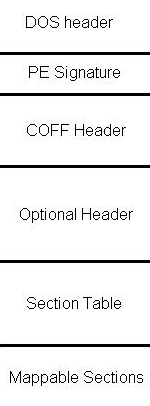

图片来源：https://commons.wikimedia.org/wiki/File:RevEngPEFile.JPG

**段头** 提供有关其关联段的信息，包括位置、长度和特性。一个段是 PE 文件中代码或数据的基本单位。

不同的功能区域，如代码区和数据区，逻辑上被分隔成多个段。

此外，一个映像文件可以包含多个段，如 `.tls` 和 `.reloc`，这些段有特殊用途。

段头提供有关其关联段的信息。可执行文件中最常见的段包括文本、数据、RSRC、RData 和 RELOC。

大多数 Windows 可执行文件包含资源：这是一个通用术语，指代像光标、图标、位图、菜单和字体等对象。PE 文件可以包含一个资源目录，包含该文件中的程序代码所使用的所有资源。

恶意软件很少使用图形资源，因此它们的资源总数相对于良性软件较少。

PE 文件的许多字段没有强制约束。PE 文件中有许多冗余字段和空白，这可能为恶意软件隐藏创造机会。

在以下截图中，我们执行 PEView 并将其 `.exe` 映像加载到内存中；工具部分显示了其 PE 格式的各个段。

我们还概述了 DOS 头的特殊`e_magic`字段，通常包含 MZ 字符序列（对应的字节序列是`"0x4D 0x5A"`），以及 PE 头的特殊`Signature`字段（定义为`IMAGE_NT_HEADERS`结构），其中包含**PE**字符序列，表示该二进制文件是一个原生 Windows 可执行文件：

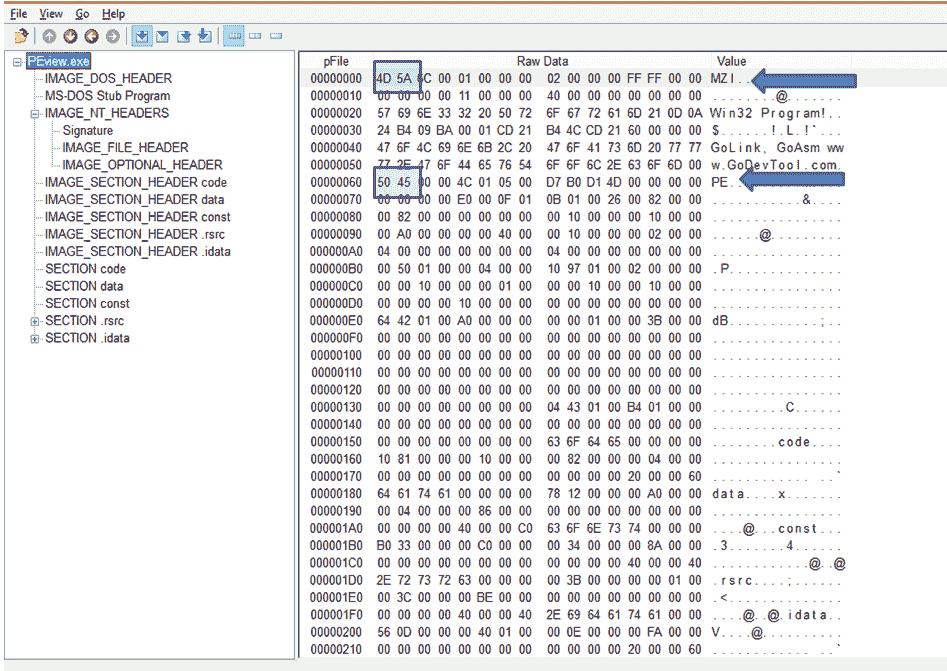

# DOS 头和 DOS 存根

DOS 头仅用于向后兼容，并且位于显示错误信息的 DOS 存根之前，提示程序可能无法在 DOS 模式下运行。

根据官方 PE 文档（可在[`docs.microsoft.com/en-us/windows/desktop/debug/pe-format#ms-dos-stub-image-only`](https://docs.microsoft.com/en-us/windows/desktop/debug/pe-format#ms-dos-stub-image-only)查看），MS-DOS 存根使得 Windows 能够正确执行该镜像文件，即使它包含一个 MS-DOS 存根。

它位于`EXE`镜像的前面，并在镜像以 MS-DOS 模式运行时显示消息`该程序无法在 DOS 模式下运行`。

DOS 头包括一些用于向后兼容的字段，定义如下：

```py
typedef struct _IMAGE_DOS_HEADER {      
// DOS .EXE header
    WORD   e_magic;                     
// Magic number
    WORD   e_cblp;                      
// Bytes on last page of file
    WORD   e_cp;                        
// Pages in file
    WORD   e_crlc;                      
// Relocations
    WORD   e_cparhdr;                   
// Size of header in paragraphs
    WORD   e_minalloc;                  
// Minimum extra paragraphs needed
    WORD   e_maxalloc;                  
// Maximum extra paragraphs needed
    WORD   e_ss;                        
// Initial (relative) SS value
    WORD   e_sp;                        
// Initial SP value
    WORD   e_csum;                      
// Checksum
    WORD   e_ip;                        
// Initial IP value
    WORD   e_cs;                        
// Initial (relative) CS value
    WORD   e_lfarlc;                    
// File address of relocation table
    WORD   e_ovno;                      
// Overlay number
    WORD   e_res[4];                    
// Reserved words
    WORD   e_oemid;                     
// OEM identifier (for e_oeminfo)
    WORD   e_oeminfo;                   
// OEM information; e_oemid specific
    WORD   e_res2[10];                  
// Reserved words
    LONG   e_lfanew;                    
// File address of new exe header
  } IMAGE_DOS_HEADER, *PIMAGE_DOS_HEADER;
```

# PE 头结构

在 DOS 头和 DOS 存根之后，我们会找到 PE 头。

PE 头包含关于不同部分的信息，这些部分用于存储代码和数据，以及请求的其他库（DLL）中的导入项或提供的导出项，以防该模块实际上是一个库。请查看以下 PE 头结构：

```py
typedef struct _IMAGE_NT_HEADERS {
    DWORD Signature;
    IMAGE_FILE_HEADER FileHeader;
    IMAGE_OPTIONAL_HEADER32 OptionalHeader;
} IMAGE_NT_HEADERS32, *PIMAGE_NT_HEADERS32;
```

`FileHeader`结构字段描述文件的格式（即内容、符号等），其类型在以下结构中定义：

```py
typedef struct _IMAGE_FILE_HEADER {
    WORD    Machine;
    WORD    NumberOfSections;
    DWORD   TimeDateStamp;
    DWORD   PointerToSymbolTable;
    DWORD   NumberOfSymbols;
    WORD    SizeOfOptionalHeader;
    WORD    Characteristics;
} IMAGE_FILE_HEADER, *PIMAGE_FILE_HEADER;
```

`OptionalHeader`字段包含有关可执行模块的信息，包括所需的操作系统版本、内存要求和`itsentry`点（即实际执行开始的相对内存地址）：

```py
typedef struct _IMAGE_OPTIONAL_HEADER {
    //
    // Standard fields.
    //

    WORD    Magic;
    BYTE    MajorLinkerVersion;
    BYTE    MinorLinkerVersion;
    DWORD   SizeOfCode;
    DWORD   SizeOfInitializedData;
    DWORD   SizeOfUninitializedData;
    DWORD   AddressOfEntryPoint;
    DWORD   BaseOfCode;
    DWORD   BaseOfData;

    //
    // NT additional fields.
    //

    DWORD   ImageBase;
    DWORD   SectionAlignment;
    DWORD   FileAlignment;
    WORD    MajorOperatingSystemVersion;
    WORD    MinorOperatingSystemVersion;
    WORD    MajorImageVersion;
    WORD    MinorImageVersion;
    WORD    MajorSubsystemVersion;
    WORD    MinorSubsystemVersion;
    DWORD   Win32VersionValue;
    DWORD   SizeOfImage;
    DWORD   SizeOfHeaders;
    DWORD   CheckSum;
    WORD    Subsystem;
    WORD    DllCharacteristics;
    DWORD   SizeOfStackReserve;
    DWORD   SizeOfStackCommit;
    DWORD   SizeOfHeapReserve;
    DWORD   SizeOfHeapCommit;
    DWORD   LoaderFlags;
    DWORD   NumberOfRvaAndSizes;
    IMAGE_DATA_DIRECTORY DataDirectory[IMAGE_NUMBEROF_DIRECTORY_ENTRIES];
} IMAGE_OPTIONAL_HEADER32, *PIMAGE_OPTIONAL_HEADER32;
```

`OptionalHeader`中包含的特殊`AddressOfEntryPoint`字段指定了可执行文件的入口点，通常设置为`0x1000`的相对内存地址，如下截图所示：

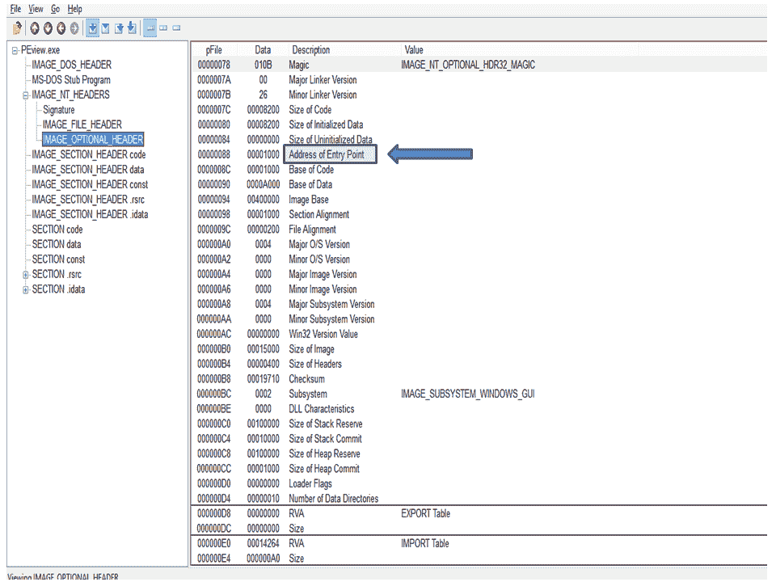

# 数据目录

`DataDirectory`结构字段包含`IMAGE_NUMBEROF_DIRECTORY_ENTRIES`条目，定义了模块的逻辑组件。相对条目按编号并定义如下：

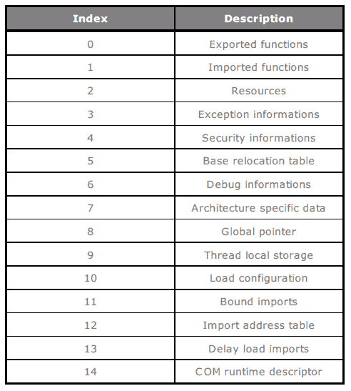

# 导入和导出表

导入表列出了所有需要在加载时从其他 DLL 中解析和导入的符号：

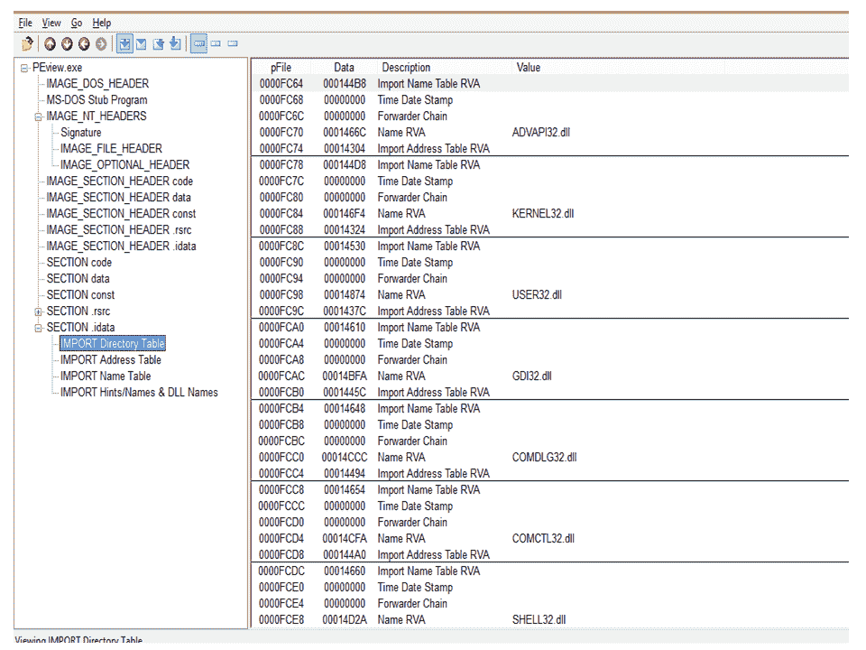

大多数类型的良性软件在导入地址表中有大量条目，因为它们有复杂的功能，并从导入地址表中导入不同的 Windows API 函数：

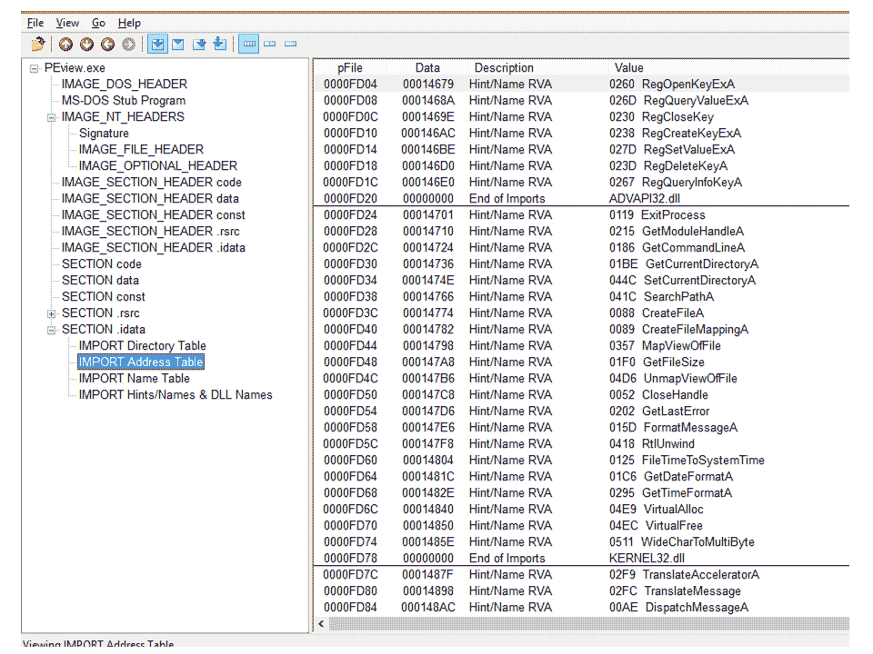

Windows 还允许程序通过 `LoadLibrary` 和 `FreeLibrary` 显式加载和卸载 DLL，以及使用 `GetProcAddress`（由 `kernel32.dll` 提供）查找符号的地址。

大多数类型的恶意软件使用后者的方法，因此它们的导入表中的符号数量比良性软件少。

导出表包含关于其他 PE 文件可以通过动态链接访问的符号的信息。导出的符号通常位于 DLL 文件中，而大多数类型的恶意软件没有导出符号。

大多数类型的恶意软件通过 `LoadLibrary` 和 `FreeLibrary` 显式加载和卸载 DLL，以隐藏其恶意目的。

然而，有一个显著的例外：恶意软件通常会导入 `wsock32.dll`，而良性软件则很少导入这个 DLL，这解释了恶意软件如何通过网络连接进行传播和破坏。

# 提取数据集中的恶意软件痕迹

在分析完 PE 文件格式后，我们现在可以提取二进制文件（无论是合法的还是可疑的）的特征，并将它们存储在一个痕迹数据集中，用于训练我们的算法。

为此，我们将开发 Python 脚本，以自动化提取我们分析的每个文件的 PE 文件格式字段。

我们将在脚本中使用的 Python 库是著名的 `pefile` 库，该库由 Ero Carrera 开发，并可在 [`github.com/erocarrera/pefile`](https://github.com/erocarrera/pefile) 上获取。

一旦包含库的压缩包下载并解压到本地，我们可以执行以下命令来进行安装：

```py
python setup.py install
```

如果我们按照前几章的说明在 Anaconda 中创建了一个环境，那么我们可以通过以下命令安装 `pefile` 库（假设环境名为 `py35`）：

```py
conda install -n py35 -c conda-forge pefile
```

这样，我们将能够在 Jupyter Notebooks 中调用该库的函数。

在输入我们的恶意软件数据集之后，正如之前讨论的那样，我们可以继续从每个文件中提取痕迹，使用 `pefile` Python 库读取相应的 `pefile` 格式字段，如以下脚本所示：

```py
import os
import pefile

suspect_pe = pefile.PE("suspect.exe")
```

在这里，我们上传了本地的 `suspect.exe` 文件，这是我们恶意软件数据集的一部分。

此时，我们能够通过简单地解除引用 `suspect_pe` 对象来提取 `suspect.exe` 文件所属的 PE 文件格式的各个字段。

使用以下脚本，我们将提取 PE 文件格式的主要字段，并直接将其调用到之前定义的对象中：

```py
AddressOfEntryPoint = suspect_pe.OPTIONAL_HEADER.AddressOfEntryPoint
MajorImageVersion = suspect_pe.OPTIONAL_HEADER.MajorImageVersion
NumberOfSections = suspect_pe.FILE_HEADER.NumberOfSections
SizeOfStackReserve = suspect_pe.OPTIONAL_HEADER.SizeOfStackReserve
```

然后我们可以继续从数据集中每个文件中提取痕迹，并将字段导出到`.csv`文件中。

我们的最终提取脚本版本将如下所示：

```py
import os
import pefile
import glob

csv = file('MalwareArtifacts.csv','w')

files = glob.glob('c:\\MalwareSamples\\*.exe')

csv.write("AddressOfEntryPoint,MajorLinkerVersion,MajorImageVersion,
MajorOperatingSystemVersion,,DllCharacteristics,SizeOfStackReserve,
NumberOfSections,ResourceSize,\n")

for file in files:
    suspect_pe = pefile.PE(file)
    csv.write( str(suspect_pe.OPTIONAL_HEADER.AddressOfEntryPoint) + ',')
    csv.write( str(suspect_pe.OPTIONAL_HEADER.MajorLinkerVersion) + ',')
    csv.write( str(suspect_pe.OPTIONAL_HEADER.MajorImageVersion) + ',')
    csv.write( str(suspect_pe.OPTIONAL_HEADER.MajorOperatingSystemVersion) + ',')
    csv.write( str(suspect_pe.OPTIONAL_HEADER.DllCharacteristics) + ',')
    csv.write( str(suspect_pe.OPTIONAL_HEADER.SizeOfStackReserve) + ',')
    csv.write( str(suspect_pe.FILE_HEADER.NumberOfSections) + ',')
    csv.write( str(suspect_pe.OPTIONAL_HEADER.DATA_DIRECTORY[2].Size) + "\n")

csv.close()

```

我们还可以提取与合法文件相关的工件，将它们与恶意软件样本一起存储在`.csv`文件中，以便通过比较这两种类型的文件来进行训练。

显然，我们需要向`.csv`文件中添加一个额外的列，指定该文件是否为合法文件，分别用`1`（合法）或`0`（可疑）表示该字段的值。

# 区分不同的恶意软件家族

我们已经了解了传统恶意软件分析方法的优缺点，并且明白了为什么—鉴于恶意软件威胁的高发—我们需要引入算法自动化方法来进行恶意软件检测。

特别是，正确识别恶意软件行为中的相似性变得越来越重要，这意味着即使恶意软件签名由于例如变形代码的存在而无法互相比对（这会相应地改变哈希校验和），恶意软件样本也必须与同类型的类或家族关联。

相似性的分析可以通过使用**聚类算法**以自动化的方式进行。

# 理解聚类算法

聚类算法背后的直觉是识别并利用表征某些现象类型的相似性。

从技术角度来看，这是在数据集中区分和识别那些值变化频繁的特征与那些值系统性稳定的特征。只有这些后者的特征会被考虑用于检测具有相似性特征的现象。

我们可以通过这两种方法来识别相似性：

+   **有监督**：相似性是基于先前分类的样本来识别的（例如，**k 近邻**（**k-NNs**）算法）。

+   **无监督**：相似性是由算法本身独立识别的（例如，**K 均值**算法）。

特征间相似性的估算是通过将其与**距离**的定义相联系来进行的。

如果我们将各个特征看作是* n *维空间中的点（与分析的特征数量相关），我们可以选择一个合适的数学准则来估算单个点之间的距离（每个点单独标识一个代数向量）。

可以选择的用于识别数值向量之间距离的度量方法如下：

+   **欧几里得距离**：该特征识别连接两个点的最短路径（即直线），并通过以下数学公式计算：

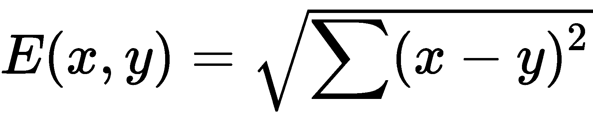

+   **曼哈顿距离**：这个特性通过计算向量元素间差异的绝对值之和得到。与欧几里得距离不同，曼哈顿距离识别连接两点的最长路径；在公式中，它等价于以下内容：

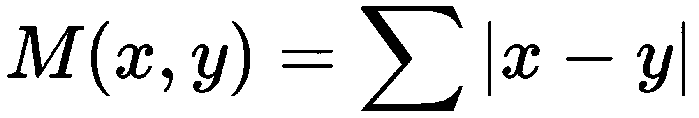

+   **切比雪夫距离**：通过计算向量元素之间差异的绝对值的最大值来获得；在公式中，它等价于以下内容：

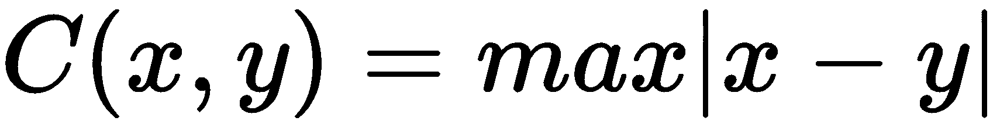

使用切比雪夫距离在需要考虑的维度数量特别高时尤其有用，尽管其中大多数对分析目的而言是无关的。

# 从距离到聚类

因此，聚类过程本质上是将表现出某些相似性的元素归类在一起。

通过使用某些数学定义的距离来定义相似度概念，聚类过程因此被简化为在给定数据空间的各个方向上从某一点开始，探索不同维度，然后将落在某一特定距离范围内的样本聚集在一起。

# 聚类算法

可以设想不同类型的聚类算法，从最简单和最直观的到最复杂和最抽象的。

一些最常用的算法如下所列：

+   **K-Means**：在无监督聚类算法中最为广泛使用的一种。K-Means 的优势之一是其实现简单，并且能够揭示数据中隐藏的模式。这可以通过独立识别可能的标签来实现。

+   **K-NN 算法**：这是一个懒惰学习模型的例子。K-NN 算法仅在评估阶段开始工作，而在训练阶段，它仅限于记忆观测数据。由于这些特性，K-NN 在大数据集下的使用效率较低。

+   **基于密度的空间聚类应用与噪声**（**DBSCAN**）：与基于距离的算法 K-Means 不同，DBSCAN 是一个基于密度的算法示例。因此，该算法通过识别高密度区域来尝试对数据进行分类。

# 使用轮廓系数评估聚类

聚类算法的一个反复出现的问题是结果的评估。

而对于监督算法，通过已经知道分类标签的情况下，我们可以通过简单地计算错误分类样本的数量，并将其与正确分类样本进行比较，来评估算法获得的结果。在无监督算法的情况下，结果的评估则不那么直观。

由于事先没有分类标签可用，我们将通过分析算法本身的行为来评估结果，只有在同一聚类中分类的样本确实都相似时，我们才认为聚类过程成功。

对于基于距离的聚类算法，我们可以使用称为**轮廓系数**的评估指标，其采用以下数学公式：

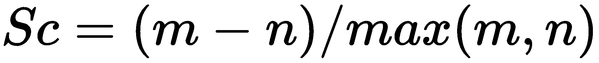

在这里，`m`代表每个单独样本与**最近**聚类的所有其他样本之间的平均距离，而`n`代表每个单独样本与**相同**聚类的所有其他样本之间的平均距离。

对于每个单独的样本，计算轮廓系数（Silhouette coefficient）（因此，当处理大型数据集时，计算过程会变得特别缓慢），并且距离的估计是由我们选择的特定度量（如欧几里得距离或曼哈顿距离）决定的。

轮廓系数的主要特点如下：

+   *Sc*的值可以在`-1`和`+1`之间变化，这取决于聚类过程的优劣。

+   当最佳聚类时，*Sc*的值将趋向于`+1`，而在非最佳聚类的情况下，它将趋向于`-1`。

+   如果*Sc*的值接近`0`，则我们将会遇到重叠的聚类。

# 深入了解 K 均值

我们现在将更深入地讨论 K 均值聚类算法。

如前所述，K 均值是一种无监督算法，即不预设与数据关联的标签的先验知识。

算法以其最终目的将数据分成 k 个不同的子组而得名。作为聚类算法，它基于所选择的度量来表示单个样本（通常，这个度量是欧几里得距离）与其所属聚类的中心点（也称为**质心**）之间的距离进行数据的分割。

换句话说，K 均值算法通过最小化由计算数据（被视为空间中的点）与各自质心之间的欧几里得距离所代表的成本函数，将数据分组成不同的聚类。

在其处理结束时，算法会返回个别样本，这些样本被分组对应于每个聚类，其质心构成算法识别出的不同类别的特征集。

# K 均值步骤

K 均值算法的特点如下：

1.  **初始化**：这是根据分析人员定义的聚类数量来识别质心的阶段（通常情况下，我们无法提前知道**真实**的聚类数量，因此在定义聚类数量时，经常需要通过试错法来进行）。

1.  **数据分配到聚类**：根据初始化阶段定义的质心，数据会被分配到最接近的聚类，依据的是计算出的数据与各自质心之间的最小欧几里得距离。

1.  **质心更新**：作为一个迭代过程，K-Means 算法会再次估计质心，通过计算单个聚类中数据的平均值。然后，算法会继续重新分配平均值，直到数据与相应质心之间的欧几里得距离最小化，或者分析人员定义的迭代次数输入参数已被超过。

要使用`scikit-learn`库中提供的 K-Means 算法实现，我们必须适当地选择一系列输入参数，以便定义算法迭代过程的各个阶段，如前所述。

特别地，需要确定聚类的数量（代表`k`参数）和质心初始化的方式。

分析人员选择聚类数量对算法得到的结果有影响：如果作为初始化参数的聚类数量过多，则聚类的目的就被忽视了（算法在极限情况下将倾向于为每个数据点识别一个不同的聚类）。

为此，进行一次**探索性数据分析**（**EDA**）的初步阶段可能会有所帮助——通过数据绘图帮助，视觉上识别数据可以分布成的可能不同子群的数量。

# K-Means 的优缺点

K-Means 算法的优点之一，除了其简单易用外，它的高可扩展性使其在大规模数据集面前更具优势。

另一方面，缺点主要由于`k`参数的选择不当，`k`代表聚类的数量，正如我们所见，它需要分析人员特别注意，分析人员必须基于 EDA 小心评估该选择，或者通过试错法来进行。

使用 K-Means 算法的另一个缺点是，由于高维数据集的存在，它会提供代表性较差的结果。

结果，**维度灾难**现象就会发生，其中在 n 维空间中呈现出**稀疏**的形式。

这意味着距离最小化的成本函数（用作聚类的选择标准）并不具有很好的代表性（事实上，数据可能在 n 维空间中彼此等距分布）。

# 使用 K-Means 聚类恶意软件

在以下示例中，我们将看到 K-Means 聚类算法应用于我们之前创建的工件数据集。

请记住，我们的工件数据集包含从各个样本的 PE 文件格式中提取的字段，包括之前存储的`.exe`文件，涵盖了合法和可疑文件。

因此，我们将在算法初始化阶段为`k`参数分配的聚类数为`2`，而我们选择作为可能恶意软件的区分标准的特征对应于`MajorLinkerVersion`、`MajorImageVersion`、`MajorOperatingSystemVersion`和`DllCharacteristics`字段：

```py
import numpy as np 
import pandas as pd 
import matplotlib.pyplot as plt 

from sklearn.cluster import KMeans 
from sklearn.metrics import silhouette_score 

malware_dataset = pd.read_csv('../datasets/MalwareArtifacts.csv', delimiter=',')

# Extracting artifacts samples fields 
# MajorLinkerVersion,MajorImageVersion,
# MajorOperatingSystemVersion,DllCharacteristics

samples = malware_dataset.iloc[:, [1,2,3,4]].values
targets = malware_dataset.iloc[:, 8].values
```

一旦从我们的数据集中选择了感兴趣的字段，我们就可以开始实例化`scikit-learn`的`KMeans`类，将`k`值作为输入参数，表示聚类的数量，为`2`（`n_clusters = 2`），并定义算法可以执行的最大**迭代次数**，在我们的例子中为`300`（`max_iter = 300`）：

```py
k_means = KMeans(n_clusters=2,max_iter=300)
```

然后我们可以调用`k_means`对象上的`fit()`方法，从而开始迭代算法过程：

```py
k_means.fit(samples)
```

我们只需评估算法获得的结果。为此，我们将使用我们之前介绍的轮廓系数，采用欧几里得距离作为度量标准，并结合**混淆矩阵**来显示结果。这将为我们提供一张表，显示各自的聚类结果，分为正确预测和错误预测：

```py
k_means = KMeans(n_clusters=2,max_iter=300)
k_means.fit(samples) 

print("K-means labels: " + str(k_means.labels_))

print ("\nK-means Clustering Results:\n\n", pd.crosstab(targets,
k_means.labels_,rownames = ["Observed"],colnames = ["Predicted"]) )      

print ("\nSilhouette coefficient: %0.3f" % silhouette_score(samples, k_means.labels_, metric='euclidean')) 
```

该过程的结果如下：

```py
K-means labels: [0 0 0 ... 0 1 0]
K-means Clustering Results:

Predicted      0      1
Observed               
0           83419  13107
1            7995  32923

Silhouette coefficient: 0.975
```

我们可以看到聚类算法成功地识别了与个体样本关联的聚类标签，并且从混淆矩阵中可以看出，共有`83419`个样本（总数为 96,526）属于可疑类别并被正确识别（已被归类为标签`0`），而只有`13107`个（占总数的 13.58%）被错误地认为是**合法的**。

以同样的方式，尽管这些样本实际上是合法的，但仍有`7995`个样本（总数为 40,918）被错误地分类为可疑（占总数的 19.54%），相比之下，有`32923`个样本被正确分类为合法。

`Silhouette 系数`为`0.975`，接近 1，反映了聚类算法获得结果的良好性。

# 决策树恶意软件检测器

除了聚类算法，还可以使用分类算法来检测恶意软件威胁。特别重要的是使用*决策树*进行的恶意软件分类。

我们在第三章《*垃圾邮件还是正常邮件？使用 AI 检测电子邮件网络安全威胁*》中已经接触过决策树，当时讨论的是**垃圾邮件检测**的问题。现在，我们将讨论决策树在检测恶意软件威胁时解决的分类问题。

决策树的独特特征是，这些算法通过基于一系列 if-then-else 决策建模学习过程，达到了将数据分类到特定类别的目标。

对于这一特征，决策树代表了一种非线性分类器，其决策边界不能简化为空间中的直线或超平面。

# 决策树分类策略

因此，决策树根据树形结构塑造其学习过程。从根节点开始，随后的决策分支成不同深度的分支。

本质上，算法以迭代的方式将样本数据集划分，基于每个节点做出的决策，从而产生不同的分支。另一方面，分支不过是根据在各个决策节点做出的可能选择，对数据进行分类的不同方式。

这个迭代的子集划分过程是由预定义的子集划分质量度量来决定的。最常用的划分质量度量标准如下：

+   基尼不纯度

+   方差减少

+   信息增益

尽管决策树具有较高的解释能力，但它们仍然存在一些重要的局限性：

+   随着考虑的特征数量增加，表示相关决策树的结构复杂度也随之增加，将这种复杂性转化为我们所说的**过拟合**现象（即，算法倾向于拟合数据中的**噪声**，而不是**信号**，导致在测试数据上的预测精度降低）

+   决策树对样本数据的微小变化特别敏感，这使得预测不稳定

克服这些局限性的一种方法是创建树集成，将**投票**分配给每棵树。因此，将样本分配到各个类别的机制简化为计数各棵树分配的投票；树集成的一个例子是**随机森林**算法。

# 使用决策树检测恶意软件

我们之前已经遇到过决策树，当时我们讨论了*钓鱼攻击*检测的话题。显然，我们也可以使用决策树来进行恶意软件检测。

在我们的示例中，我们将使用`AddressOfEntryPoint`和`DllCharacteristics`字段作为潜在的独特特征来检测可疑的`.exe`文件：

```py
import pandas as pd
import numpy as np
from sklearn import *

from sklearn.metrics import accuracy_score

malware_dataset = pd.read_csv('../datasets/MalwareArtifacts.csv', delimiter=',')

# Extracting artifacts samples fields "AddressOfEntryPoint" and
# "DllCharacteristics"
samples = malware_dataset.iloc[:, [0, 4]].values
targets = malware_dataset.iloc[:, 8].values

from sklearn.model_selection import train_test_split

training_samples, testing_samples, training_targets, 
testing_targets = train_test_split(samples, targets, 
                    test_size=0.2, random_state=0)

from sklearn import tree
tree_classifier = tree.DecisionTreeClassifier()

tree_classifier.fit(training_samples, training_targets)

predictions = tree_classifier.predict(testing_samples)

accuracy = 100.0 * accuracy_score(testing_targets, predictions)

print ("Decision Tree accuracy: " + str(accuracy))
Decision Tree accuracy: 96.25860195581312
```

从所获得的结果来看，选择`AddressOfEntryPoint`和`DllCharacteristics`字段所做的预测准确度特别高，超过了 96%。

我们可以尝试选择不同的字段作为特征进行描述，并通过比较它们来评估所得到的结果。

# 激动的决策树——随机森林

我们已经看到决策树存在一些重要的局限性，这些局限性可能导致即便是训练数据的微小变化也会导致不稳定的结果。为了提高预测精度，可以使用**集成**算法，例如**随机森林**。

随机森林其实就是一个决策树集成，其中每棵树都有一个投票。预测的改进因此取决于赋予它们的投票数：获得最高票数的预测将被选择作为算法的最终结果。

随机森林算法的创始人莱奥·布雷曼（Leo Breiman）指出，如果树之间是**统计上不相关**且**相互独立**的，那么通过一组树所获得的结果会得到改进。接下来，我们将看到使用`scikit-learn`库实现的**随机森林恶意软件分类器**的示例。

# 随机森林恶意软件分类器

以下是使用`scikit-learn`库实现的随机森林恶意软件分类器的示例：

```py
import pandas as pd
import numpy as np
from sklearn import *

malware_dataset = pd.read_csv('../datasets/MalwareArtifacts.csv', delimiter=',')

# Extracting artifacts samples fields "AddressOfEntryPoint" and
# "DllCharacteristics"

samples = malware_dataset.iloc[:, [0,4]].values
targets = malware_dataset.iloc[:, 8].values

from sklearn.model_selection import train_test_split

training_samples, testing_samples, 
training_targets, testing_targets = train_test_split(samples, targets,
test_size=0.2)

rfc =  ensemble.RandomForestClassifier(n_estimators=50)
rfc.fit(training_samples, training_targets)
accuracy = rfc.score(testing_samples, testing_targets)

print("Random Forest Classifier accuracy: " + str(accuracy*100) )
```

正如我们从结果中看到的，随机森林分类器改善了决策树的性能；要验证这一点，只需比较各自算法的准确性：

```py
Decision Tree accuracy: 96.25860195581312
Random Forest accuracy: 96.46142701919594
```

# 使用隐马尔可夫模型（HMM）检测变形恶意软件

迄今为止，应用于恶意软件检测的算法示例旨在自动化恶意软件分析师执行的一些常规活动。

然而，它们所依赖的分析方法本质上是静态恶意软件分析。

然而，许多具体的恶意软件威胁实例并不能通过这种分析方法轻易识别，因为恶意软件开发者已经学会了绕过基于签名的检测技术。

因此，我们必须采用不同的方法来识别更先进恶意软件的恶意行为，为此我们需要转向基于动态恶意软件分析的方法，并将其与适当的算法结合使用。

但要充分解决这个问题，需要详细了解基于签名的传统检测策略的局限性。

# 恶意软件如何绕过检测？

最常用的检测策略是利用与被识别为恶意的可执行文件相关联的签名。

这种策略具有无可争议的优势，并且被广泛应用于杀毒软件中。

它基于寻找特定模式（由一系列位组成，这些位被认为是恶意可执行文件的代表），对存储在系统中的每个文件进行这些模式的搜索，并对系统资源（包括运行时内存）进行系统扫描。

模式搜索是基于一个数据库进行的，数据库中包含了恶意文件的签名。这些签名必须及时且不断地更新，以便能够在系统中搜索和比较文件，从而防止威胁被忽视。

基于签名的检测策略所带来的优势基本如下：

+   高效地识别数据库中已知的威胁和存在的签名。

+   低频率的误报，连同误报一起，是恶意软件检测软件的主要弱点。

相反，这种检测策略的局限性实质上体现在其基本假设上：即恶意软件一旦被识别，它的二进制表示就不会改变，因此被认为通过相应的签名得到了充分的“拍照”。

实际上，这些假设很快就被证明是不现实的。随着时间的推移，恶意软件开发者的创意努力也逐渐显现，他们试图创造能够改变自身形态的软件，从而避免基于签名的检测机制，同时保持自身的攻击潜力。

恶意软件作者采用的最初防范措施之一是混淆技术。为此，可以对恶意软件的可执行部分进行加密，每次使用不同的加密密钥来改变与恶意软件载荷相关的杀毒软件签名，而可执行指令保持不变，并在执行前解密。

一种更复杂的混淆变种是创建多态恶意软件，在这种恶意软件中，不仅恶意软件的加密密钥不断变化，而且恶意软件的解密指令本身也在变化。

多态恶意软件的后续演变导致了变形恶意软件，其中即使是载荷的可执行指令在每次执行时也会被修改，从而防止最先进的杀毒软件通过扫描运行时内存来识别恶意载荷，一旦载荷被解密。

为了改变载荷的可执行指令，变形恶意软件通过采用以下方法实现**变异引擎**：

+   插入额外的指令（死代码），这些指令不会改变恶意软件的逻辑和操作。

+   改变指令的顺序，而不改变逻辑和整体功能。这种技术在生成许多**主题变体**方面特别有效。

+   用其他等效指令替换一些指令。

# 多态恶意软件检测策略。

在恶意软件开发者和杀毒软件生产商之间的不断*猫鼠游戏*中，后者试图跟上步伐，调整其检测策略以应对不同形式的多态性。

在多态恶意软件的情况下，采取的一种策略是代码仿真：在受控环境（如沙箱）中执行恶意软件，允许恶意软件进行有效负载的解密阶段，之后传统的基于签名的杀毒软件检测会随之进行。

在变异性恶意软件以及零日漏洞的情况下，最先进的杀毒软件执行的检测活动试图分析可疑文件的行为，理解执行的指令的逻辑。

然而，这种检测策略存在一些以下重要的限制：

+   这会导致较高的误报率。

+   对执行中的指令的分析是动态进行的，这可能会在计算上产生显著影响。

在变异性恶意软件（以及零日漏洞）检测中，另一种策略是使用基于 HMM（隐马尔可夫模型）的机器学习算法。

为了理解这些限制是什么，我们首先需要介绍这些类型的算法。

# HMM 基础

要理解 HMM 是什么，我们需要引入马尔可夫过程。

马尔可夫过程（或马尔可夫链）是一种随机模型，它根据预定义的概率集改变其状态。

马尔可夫过程的一个假设规定了**未来状态**的**概率分布**完全依赖于**当前状态**。

因此，HMM 是一个马尔可夫过程，其中**不能**直接**观察**系统的状态：唯一可观察的元素是与系统状态相关的事件和二次效应；然而，事件的概率由系统的每个状态决定，并且是固定的。

因此，系统每个状态的**观察值**是**间接**通过由这些隐藏状态决定的事件来进行的，并且可以与这些事件的概率估计相关联：

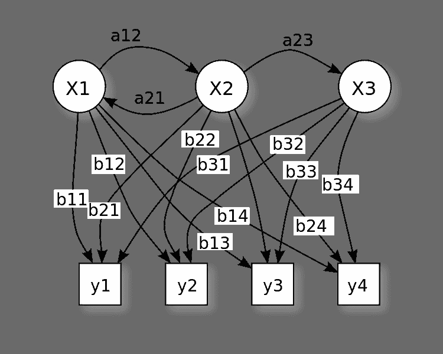

（图片来源：https://en.wikipedia.org/wiki/File:HiddenMarkovModel.svg）

为了直观地理解 HMM 是如何工作的，我们展示以下示例：假设一个可执行文件在主机上运行。在某一时刻，机器可以继续正常工作，或者停止正常工作；这种行为代表了可观察事件。

为了简化起见，假设机器定期停止工作的原因可以归结为以下几点：

+   可执行文件执行了**恶意**的指令。

+   可执行文件执行了**合法**的指令。

与机器停止正常工作相关的具体原因是我们无法直接得知的实体，我们只能基于可观察的事件进行推测。

在我们的例子中，这些可观察的事件被归结为以下几点：

+   机器正常工作（工作）

+   机器停止工作（不工作）

同样，我们示例中的隐藏实体由程序执行的指令表示：

+   **恶意**指令

+   **合法**指令

最后，假设为系统的各种事件和状态分配概率估计。我们将此总结在下表中，也称为**发射矩阵**，它总结了给定观察结果与特定可观察状态相关的概率（记住，每个隐藏实体相关的概率之和，按可能事件细分，必须等于 1）：

```py
                 Working   Not Working

Malicious          0.2         0.8

Legitimate         0.4         0.6
```

在这一点上，我们必须估计程序执行的**下一条指令**的概率，这可以通过**转移矩阵**进行总结：

因此，如果程序之前执行了恶意（而非合法）指令，则下一条指令是恶意（而非合法）的概率为：

```py
             Malicious  Legitimate

Malicious        0.7       0.3

Legitimate       0.1       0.9
```

最后，我们必须分配与 HMM 起始状态相关的概率；换句话说，第一个隐藏状态的概率对应于程序执行的第一条指令是**恶意**还是**合法**的概率：

```py
Malicious        0.1 

Legitimate       0.9
```

在这一点上，我们 HMM 的任务是基于机器行为的观察来识别隐藏实体（在我们的例子中，判断程序执行的指令是恶意还是合法）。

# HMM 示例

在我们的例子中，可能的观察结果如下：

```py
ob_types = (‘W’,‘N’ )
```

在这里，`W` 代表工作（Working），`N` 代表不工作（Not Working），而隐藏状态如下：

```py
states = (‘L’, ’M')
```

在这里，`M` 对应恶意（Malicious），`L` 对应合法（Legitimate）。

接下来是观察序列，这与程序执行的单条指令相关：

```py
observations = (‘W’,‘W’,‘W’,‘N’)
```

这一系列观察结果告诉我们，在执行程序的前三条指令之后，机器正常工作，而只有在执行第四条指令后才停止工作。

基于这一系列可观察事件，我们必须继续训练 HMM。为此，我们将把我们的概率矩阵（如前所定义）传递给算法，对应于`开始`矩阵：

```py
start = np.matrix(‘0.1 0.9’)
```

`转移`矩阵如下：

```py
transition = np.matrix(‘0.7 0.3 ; 0.1 0.9’)
```

`发射`矩阵如下：

```py
emission = np.matrix(‘0.2 0.8 ; 0.4 0.6’)
```

以下代码使用了隐藏马尔可夫（Hidden Markov）库，可以在[`github.com/rahul13ramesh/hidden_markov`](https://github.com/rahul13ramesh/hidden_markov)找到：

```py
import numpy as np
from hidden_markov import hmm

ob_types = ('W','N' )

states = ('L', 'M')

observations = ('W','W','W','N')

start = np.matrix('0.1 0.9')
transition = np.matrix('0.7 0.3 ; 0.1 0.9')
emission = np.matrix('0.2 0.8 ; 0.4 0.6')

_hmm = hmm(states,ob_types,start,transition,emission)

print("Forward algorithm: ")
print ( _hmm.forward_algo(observations) )

print("\nViterbi algorithm: ")
print( _hmm.viterbi(observations) )
```

这些是脚本的结果：

```py
Forward algorithm: 0.033196
Viterbi algorithm: [’M', ’M', ’M', ’M']
```

`前向算法（Forward algorithm）`给我们提供了 HMM 中观察序列的概率，而`维特比算法（Viterbi algorithm）`则用于找出能够生成给定观察序列的最可能的隐藏状态序列。

有关隐藏马尔可夫库的更多信息，请参见[`hidden-markov.readthedocs.io/en/latest/`](http://hidden-markov.readthedocs.io/en/latest/)的文档。

# 深度学习在恶意软件检测中的应用

在本章的最后部分，为了完整性，我们将介绍一些利用基于神经网络的实验方法进行恶意软件检测的解决方案。

我们将在后续的第八章中更深入地探讨深度学习技术，尤其是在讨论**生成对抗网络**（**GANs**）时，关于攻击与防御的内容。

在这里，我们将介绍一种创新且非传统的方法来解决不同恶意软件家族分类的问题，该方法利用了在图像识别领域开发的深度学习算法，如**卷积神经网络**（**CNNs**）。

在深入探讨之前，让我们简要介绍一下**神经网络**（**NNs**）及其在恶意软件检测中的主要特征。

# 神经网络简述

神经网络（NNs）是一类试图模仿人脑学习机制的算法，通过人工再现大脑的神经元结构。

神经网络有不同类型，但在这里我们特别关注两种类型：CNN 和**前馈网络**（**FFN**），后者是 CNN 的基础；我们从描述 FFN 开始。

前馈神经网络（FFN）由至少三层神经元组成，具体分布如下：

1.  输入层

1.  输出层

1.  隐藏层（一层或多层）

FFN 的层次结构使我们能够拥有第一层来管理输入数据，以及一层返回输出结果。

各层中的单个神经元直接连接到相邻的层，而同一层中的神经元之间没有连接。

# CNN（卷积神经网络）

CNN 是一种特定类型的前馈神经网络（FFN），其特点是神经层的组织方式遵循生物学世界中现有视觉系统的组织方式，并且神经元区域在视觉场中重叠。

如前所述，在 CNN 中，每个神经元都连接到一片相邻的输入神经元区域，以便映射图像的像素区域。

通过这种方式，可以通过相邻层之间的局部连接方案识别空间相关性，这使得例如识别物体成为可能。

在 CNN 中，相邻的神经元区域实际上是通过模拟宽度、高度和深度的三维量来组织的，这些量映射到图像的宽度和高度特征，而深度则由 RGB 通道组成。

因此，CNN 因其卷积层（与池化层和全连接层一起构成了这种神经网络的三大特征层）而在图像识别方面得到了优化。

特别地，卷积层通过卷积操作提取输入图像的相关特征，这些卷积操作从原始图像中创建一幅新图像，通过突出最相关的特征，并模糊较不相关的特征；通过这种方式，卷积层能够发现相似的图像，而不考虑它们的实际位置或方向。

# 从图像到恶意软件

在接下来的描述中，我们将展示一种利用 CNN 在图像识别中的典型技能来进行恶意软件检测的替代方法。但要做到这一点，首先需要将恶意软件的可执行代码表示为图像，并将其输入到 CNN 中。

这种方法在《构建智能反恶意软件系统：一种使用支持向量机（SVM）进行恶意软件分类的深度学习方法》一文中有所描述，作者：Abien Fred M. Agarap，其中每个可执行恶意软件被视为一个由零和一组成的二进制序列，然后将其转换为灰度图像。

通过这种方式，可以根据图像中布局和纹理的相似性识别恶意软件家族。

为了对图像进行分类，使用了 k-NN 聚类算法，其中采用欧几里得距离作为度量标准来表示距离。

实验结果显示，分类率为 99.29%，并且计算负载极低：

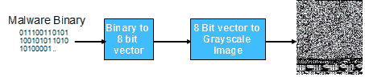

图像来源：《构建智能反恶意软件系统：一种使用支持向量机（SVM）进行恶意软件分类的深度学习方法》，作者：Abien Fred M. Agarap

# 为什么我们要使用图像来进行恶意软件检测？

将恶意软件表示为图像的优点如下：

+   识别恶意软件代码特定部分的能力，例如那些被恶意软件开发者修改的部分，目的是为了创建原始代码的不同变种。

+   通过图像，可以识别出代码中微小的修改，同时保持恶意软件图像的整体结构。

+   这些特征使得属于同一家族的不同恶意软件变种能够通过其表示它们的图像相似性轻松识别。这是因为不同类型的图像对应着不同的恶意软件家族。

# 使用 CNN 进行图像中的恶意软件检测

从前述的原始论文中，开发了一个工具，利用 CNN 识别和分类表示恶意软件代码的图像。

可以通过执行以下命令，从 GitHub 仓库下载该工具：

```py
git clone https://github.com/AFAgarap/malware-classification.git/
```

在档案内还有一组恶意软件代码图像的数据集（`malimg.npz`）。要将您的恶意软件代码转换为灰度图像，还可以使用 Chiheb Chebbi 开发的 Python 脚本，该脚本可在[`github.com/PacktPublishing/Mastering-Machine-Learning-for-Penetration-Testing/blob/master/Chapter04/MalwareConvert.py`](https://github.com/PacktPublishing/Mastering-Machine-Learning-for-Penetration-Testing/blob/master/Chapter04/MalwareConvert.py)上找到。

我们展示了工具的一些使用示例如下：

```py
Usage: main.py [-h] -m MODEL -d DATASET -n NUM_EPOCHS -c PENALTY_PARAMETER -k CHECKPOINT_PATH -l LOG_PATH -r RESULT_PATH
```

要使用 CNN-SVM 模型，请将`-model`参数设置为`1`，如下例所示：

```py
main.py –model 1 –dataset ./dataset/malimg.npz –num_epochs 100 –penalty_parameter 10 -c ./checkpoint/ -l ./logs/ -r ./results/
```

# 摘要

在本章中，我们讨论了恶意软件威胁检测的不同策略，利用了各种 AI 算法。

我们看到恶意软件如何欺骗分析师，使用诸如多态性之类的高级技术，迫使采用基于算法的检测工具。

因此，我们介绍了聚类和分类算法，从基于 HMMs 和神经网络的高级算法，如 CNNs，以处理此类高级威胁。

在下一章中，我们将讨论利用人工智能的网络异常检测技术。
