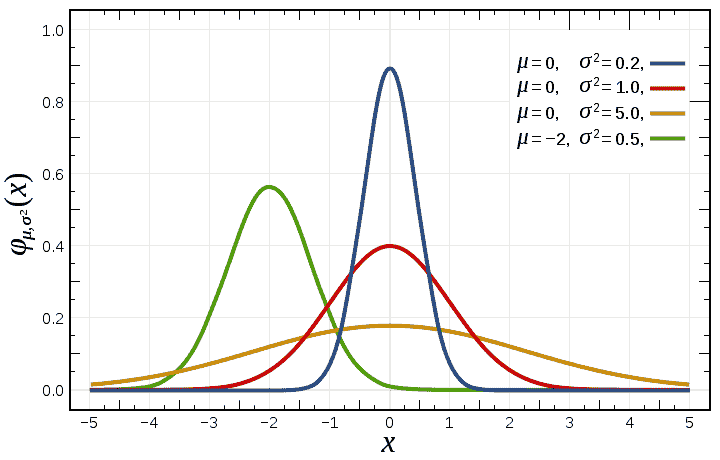
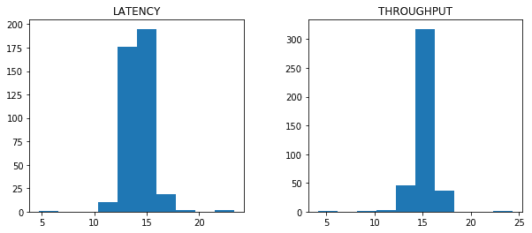
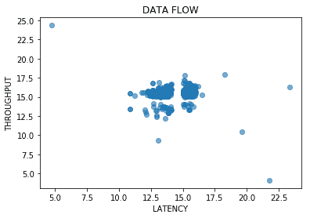
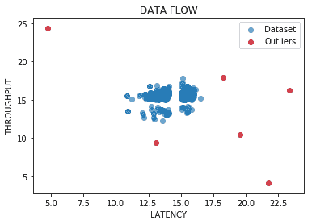
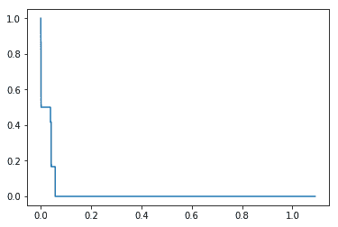
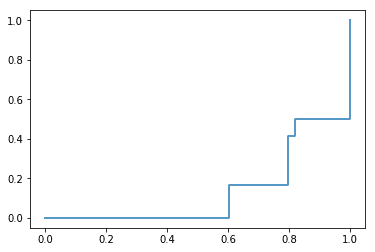

# 第六章：基于 AI 的网络异常检测

当前可以在不同设备之间建立的互联互通水平（例如，考虑到**物联网**（**IoT**））已达到如此复杂的程度，以至于严重质疑传统概念，如边界安全的有效性。实际上，网络空间的攻击面呈指数级增长，因此，必须借助自动化工具来有效地检测与前所未有的网络安全威胁相关的网络异常。

本章将涵盖以下主题：

+   网络异常检测技术

+   如何分类网络攻击

+   检测僵尸网络拓扑

+   不同的**机器学习**（**ML**）算法用于僵尸网络检测

在本章中，我们将重点讨论与网络安全相关的异常检测，将欺诈检测和用户异常行为检测的讨论推迟到后续章节。

# 网络异常检测技术

我们迄今为止所看到的技术也可以应用于管理异常检测以及相关的未授权访问企业网络的尝试。为了充分理解异常检测技术的潜力，我们将追溯其在网络安全领域的发展，阐明其基本原理。

实际上，异常检测一直是网络安全领域的研究方向，尤其是在网络安全保护领域。然而，异常检测不仅仅局限于识别和防止网络攻击，它还可以在其他领域中应用，比如欺诈检测和用户资料的潜在泄露识别。

# 异常检测的原理

在网络入侵检测领域，特别是长期以来，采取了以下两种不同的策略：

+   基于签名的检测

+   异常检测

在第一种情况下，我们从已知攻击的分析开始，构建一个由之前检测到的攻击签名组成的知识库。这与警报系统结合，一旦网络流量中出现与归档签名的匹配，即可触发警报。基于签名的检测系统与各种杀毒软件的类比显而易见，缺点同样明显，因此，签名知识库必须不断更新，以便检测新的攻击类型。

在异常检测的情况下，另一方面，我们尝试识别可以定义为**正常**的网络流量行为，以便检测那些偏离正常行为的差异，即将其识别为**异常**。因此，这种方法使得通过分析可能被认为是异常的网络流量特征来检测新型攻击成为可能。

因此，有必要识别出什么构成**异常行为**，特别是针对网络流量的异常行为。

为了检测异常流量，可以考虑以下一些元素：

+   到特定主机的连接数量

+   不寻常的远程通信端口或意外的流量模式

+   特定时间段内出现的不寻常流量高峰（例如，夜间持续的流量）

+   网络中由特定主机占用的大量通信带宽

所有这些事件可能会被视为可疑，基于之前对被认为是正常的网络流量进行的分析。这种比较的基础是，可以定义适当的过滤器并将警报信号（警报）与它们关联，一旦触发，甚至可以决定丢弃相应的网络流量。

显然，还需要考虑与可疑行为无关的新型网络流量。例如，如果添加了以前没有的新通信通道，这种变化必须被考虑，并视为正常。

因此，正如我们将看到的，异常检测的一个敏感方面是区分真正的正例和假正例。

# 入侵检测系统

传统上，入侵检测活动通过引入专门的设备来管理，这些设备被称为**入侵检测系统**（**IDS**）。这些设备通常被分为以下两类：

+   基于主机的 IDS

+   基于网络的入侵检测系统

随着**人工智能**（**AI**）技术在网络安全领域的引入，第三种类型的 IDS——基于异常的 IDS——也加入了前述的两种传统类型。

为了充分理解基于异常的入侵检测系统（IDS）的区别和优势，简要描述两种传统类型的 IDS 是适当的。

# 主机入侵检测系统

**主机入侵检测系统**（**HIDS**）的任务是检测可能影响组织内主机的入侵，尤其是那些被认为是关键的机器。为此，HIDS 监控一些被认为对识别可能攻击至关重要的系统指标，如与以下系统指标相关的系统信息：

+   正在运行的进程的数量和类型

+   用户账户的数量、类型和创建情况

+   内核模块加载（包括设备驱动程序）

+   文件和目录活动

+   任务调度器活动

+   注册表键值修改

+   后台进程（守护进程和服务）

+   **操作系统**（**OS**）在启动时加载的模块

+   主机网络活动

通常，待监控的系统指标的识别严格依赖于所采用的威胁模型，并且为了收集待监控的信息，可以使用操作系统自带的工具，或通过安装专门的系统监控工具。

# 网络入侵检测系统

**网络入侵检测系统**（**NIDS**）的典型任务是通过分析网络流量来识别可能的攻击模式；也就是说，通过处理传输中的网络数据包——包括进站和出站数据——并在数据流中检测已知的攻击模式。

NIDS 通常检测到的网络攻击如下：

+   广告软件（导致来自远程主机的未经请求和恶意的**广告**（**AD**）下载）

+   间谍软件（向远程主机传输敏感信息）

+   **高级持续性威胁**（**APT**）（APT 针对特定组织漏洞或配置错误服务的攻击）

+   僵尸网络（典型的**指挥与控制**（**C2**）攻击，通过将主机转变为僵尸机器并执行远程指令来利用组织的网络资源）

NIDS 的实施可以利用网络诊断工具，包括嗅探器（如`tcpdump`和 Wireshark）。

NIDS 还可以部署集成软件解决方案，如 Snort，这代表了实时检测可能的网络入侵的有效解决方案。

这有助于根据特定规则来定义，在此基础上可以比较正常和恶意的网络流量，从而在攻击被识别后激活触发器，执行适当的操作。

通常，这些触发器与给定的阈值相关联，这是一个预定值，它可靠地区分它们之间的事件。显然，如何充分确定该阈值值的问题就出现了，且该值是否可以有效地用于不同上下文下。以同样的方式，攻击者可能尝试修改此阈值，或发现这个值实际上被设置成什么，尝试采用隐形访问模式（通过保持活动始终低于阈值），使自己对 IDS 不可见。

因此，更优的做法是采用动态阈值（而不是依赖硬编码的值），通过系统地重新计算其值来随时间变化。这些改进可以通过采用基于时间序列（移动平均）的统计度量来获得，例如，或者通过对数据分布的统计测量重新处理（例如，采用位置测量如中位数或**四分位间距**（**IQR**））。

尽管有用，但这种统计方法用于确定触发阈值在最复杂的入侵检测案例中不可避免地无效，因为它需要考虑不同变量之间可能存在的相关性。

换句话说，在某些场景中，可能需要同时触发多个触发阈值，因为异常在相互关系中由不同特征表示。

鉴于网络数据流的复杂性，因此有必要引入**有状态检查**——也称为**数据包过滤**活动——作为与常见网络监控（旨在提取不同类型数据包的信息）分开的过程。

通过跟踪传输和接收的各种数据包，有状态检查的特点在于能够关联不同类型的数据包，以识别针对某些网络服务的连接尝试、网络资源的饱和攻击（**拒绝服务攻击**（**DoS**））或在更低网络协议层次进行的攻击（如 ARP 缓存中毒）。

由于其先进的网络分析功能，有状态检查可以与更复杂的异常检测形式结合使用。

# 基于异常的 IDS

随着人工智能技术的引入，NIDS（网络入侵检测系统）领域现在可以将传统的 IDS 发展为更先进的检测解决方案，利用监督学习和无监督学习算法，以及强化学习和深度学习。

同样，前几章分析的聚类技术，利用了数据类别之间的相似性概念，可以有效地用于基于异常的入侵检测系统（IDS）的实现。

然而，在选择用于异常检测网络的算法时，必须考虑网络环境的一些特征性方面：

+   在基于监督学习算法的解决方案中，我们必须对所有数据进行分类（标记），因为按定义，监督学习中样本数据所属的类别是已知的。

+   所有数据的分类不可避免地会涉及计算过载，并可能导致网络性能下降，因为在发送到目标之前，网络流量必须进行分析。从这个角度来看，我们可以决定采用无监督学习算法，不仅让算法识别未知类别，还能减少计算开销。

类似地，利用相似性概念的算法（如聚类算法）非常适合用于实现异常检测解决方案。然而，在这种情况下，同样需要特别注意用于定义相似性概念的度量类型，这些度量能够区分正常流量与异常流量。

通常，在实施异常检测解决方案时，会使用评分系统来评估流量：确定分隔不同类型流量（正常与异常）之间的值阈值。为此，在选择最合适的度量时，我们必须考虑数据的排序和分布。

换句话说，异常检测系统可以使用——作为评分指标——数据集值之间的距离（这些值被视为代表不同特征的*n*维空间中的点），或评估数据分布的规律性，依据的是被认为是研究现象代表性的分布。

# 将服务日志转化为数据集

网络异常检测的一个问题是如何收集足够且可靠的数据来进行算法分析和训练。互联网上有数百个免费提供的数据集，可以用于我们的分析；然而，我们也可以使用自己的网络设备来积累更能代表我们特定现实的数据。

为此，我们可以使用以下方法：

+   网络设备，如路由器或网络传感器，使用`tcpdump`等工具进行数据采集。

+   服务日志和系统日志

在操作系统内部，服务日志和系统日志可以存储在不同的位置。对于类 Unix 系统，服务日志通常以文本文件的形式存储在`/var/log`目录及其相关子目录中。对于 Windows 操作系统，日志分为 Windows 日志（包括安全日志和系统日志）和应用程序日志。它们可以通过 Windows 事件查看器应用程序访问，或者通过访问文件系统位置如`%SystemRoot%\System32\Config`进行访问。

无论是类 Unix 系统还是 Windows 操作系统，日志文件都是基于预定义模板的文本格式，唯一不同的是，在 Windows 中，每个事件在相应的日志文件中都会关联一个事件 ID。日志文件的文本性质非常适合集成存储在日志中的信息。

# 集成网络数据与服务日志的优势

两个数据源，即网络数据和服务日志，在网络异常检测中各有优缺点。

然而，它们的集成使得可以在利用优势的同时，限制其缺点。

近年来，发布了多种软件解决方案（包括专有软件和开源软件），这些解决方案旨在解决集成不同数据源的问题，使用户能够利用数据科学和大数据分析的方法进行分析，这并非偶然。

在最广泛的解决方案中，我们可以提到**ElasticSearch, Logstash, Kibana**（**ELK**）套件，它可以对从日志文件中提取的事件进行索引，并以直观的可视化形式表示。

其他广泛使用的专有网络解决方案基于 Cisco 的 NetFlow 协议，它可以紧凑地表示网络流量。

从原始数据重构感兴趣的事件是非常困难的。更重要的是，如果以自动化的方式进行处理，这可能会导致生成不可靠的信号（误报），这代表了安全管理中的一个问题。

此外，在网络数据的情况下，它们代表了各个相关服务，而在服务日志的情况下，它们直接与生成它们的进程相关。

因此，整合两种数据源（网络数据和服务日志）可以实现对正在分析事件的上下文化，进而提高上下文意识，并减少从原始数据开始解读事件所需的努力。

# 如何分类网络攻击

我们已经看到，可以使用各种不同类型的算法（如监督学习、无监督学习和强化学习），即使是在实施网络异常检测系统时。

那么我们如何有效地训练这些算法，以便识别异常流量呢？

首先需要识别一个代表给定组织内正常流量的训练数据集。

为此，我们必须适当地选择代表我们模型的特征。

特征选择尤为重要，因为它们为所分析的数据提供了上下文价值，从而决定了我们检测系统的可靠性和准确性。

事实上，选择那些与可能的异常行为相关性不高的特征会导致较高的错误率（误报），因此会使它们失去效用。

选择可靠特征的一种解决方案是评估现有的网络协议使用中的异常。

攻击——例如 SYN 洪水攻击——的特征是 TCP/IP 握手的异常使用（在这种情况下，设置 SYN 标志的数据包后面没有跟随设置 ACK 标志的数据包，从而无法建立有效连接）。

一个特征可以通过一个或多个与协议或网络数据包头部相关的属性来描述，就像不同类型的网络属性构成了由正在分析的特定网络连接表示的特征（即，telnet 会话的特征是连接到远程端口`23`，该连接发生在两个具有各自 IP 地址和 IP 端口的端点之间）。

# 最常见的网络攻击

鉴于我们可以通过组合不同的特征来识别的各种组合的巨大多样性，必须依赖一个反映给定组织所面临风险水平的威胁模型，并在此模型的基础上，识别出最具代表性的特征组合，以便应对可能的攻击。

从这个角度来看，分析最常见的网络攻击类型是有用的：

+   基于恶意软件的

+   零日漏洞

+   通过网络嗅探进行数据泄漏

+   网络资源饱和（DoS）

+   会话劫持

+   连接欺骗

+   端口扫描

基于类似的分类（需根据具体上下文进行调整并不断更新），我们可以识别需要考虑的特征，将更具代表性的数据集输入到我们的算法中。

# 异常检测策略

因此，我们已经看到，异常检测的概念本身指的是与预期行为不同的表现；这种差异，从技术角度来说，就是离群点检测。

要识别离群点，可以采取不同的策略：

+   **分析时间序列中的事件序列**：数据在定时间隔内收集，评估序列随时间发生的变化。这种技术广泛应用于金融市场分析，但也可以有效地应用于网络安全领域，用于检测用户在远程会话中输入字符（或命令）的频率。即使是每单位时间内输入数据频率的简单不自然增加，也可以表明存在异常，这可能表明远程端点中存在自动化代理（而非人工用户）。

+   **使用监督学习算法**：当正常行为与异常行为可以可靠地区分时，这种方法是有意义的，例如在信用卡欺诈的情况下，可以检测到预定义的可疑行为模式，依赖于未来的欺诈行为可以归因于一个预定义的方案。

+   **使用无监督学习算法**：在这种情况下，无法将异常行为追溯到预定义的行为，因为无法识别出可靠且具有代表性的训练数据集用于监督学习。这种场景最常描述网络安全的现实，特征是新的攻击形式或新漏洞的利用（零日攻击）。同样，通常也很难将所有理论上可能的入侵归结为一个预定义的方案。

# 异常检测假设与挑战

从方法论角度来看，毫无疑问，离群点是学习算法的一个问题，因为它们在基于训练数据构建描述性模型时构成了干扰因素。

当处理异常值时，算法应如何处理？是应该考虑模型的判定，还是应该将其丢弃，视为估计误差？或者，离群点是否代表数据集中反映出实际变化的创新现象？要回答这些问题，我们需要调查离群点的最可能来源。

在某些情况下，异常值是不同寻常值的组合，它们是估计误差，或者源自多个具有不同语义的数据集的合并，导致不可靠或极不可能的样本。然而，它们的存在却构成了一个干扰因素，特别是对于那些基于估计预期值与观察值之间距离的度量的算法而言。从技术角度讲，这意味着整体方差增加，可能导致算法高估误差，从而影响信号的正确性（这一现象被称为**过拟合**）。

显然，并不是所有算法对异常值的存在都同样敏感。然而，良好的做法是尽量使学习过程更具鲁棒性，通过平滑参数更新阶段，给那些尽管在数值上低于正常值但可能会影响正确参数估计的异常值加权。

为了识别数据集中可能存在的异常值，通常做法是进行数据的初步分析，这被称为**探索性数据分析**（**EDA**），利用可视化工具并计算简单的描述性统计量（如均值或中位数）。

通过这种方式，可以直观地发现异常值的存在，并验证数据中的任何不对称性，表现为分布中均值与中位数之间的距离逐渐增大。

一些统计度量对极端值的存在不那么敏感。事实上，旨在表示数据排序的度量对于分布中的异常值具有更强的鲁棒性（例如四分位间距 IQR）。

因此，异常值检测的一个基本假设是数据集中正常观测值远多于异常观测值。然而，事实是，通常正确识别异常值并不是一项容易完成的任务。

从这个角度来看，如果我们决定使用统计度量来确定异常值的存在，我们可以按照以下步骤进行操作：

1.  计算代表数据的统计值，用作对比标准，以确定异常值（即，最偏离代表性值的那些值）。

1.  确定一个异常检测的参考模型，这个模型可以基于距离度量，或者假定已知的**统计分布**（即正态分布）作为正常值的代表。

1.  定义置信区间并评估异常值存在的概率（可能性），基于所选择的分布。

统计方法用于识别异常值，虽然容易且直接应用，但仍然存在重要的理论限制：

+   大多数统计检验只考虑单一特征。

+   通常，数据的底层分布是未知的，或者不能归因于已知的统计分布。

+   在复杂且多维的案例中（其中必须同时考虑多个特征），离群值的存在会导致总方差的增加，使得所识别的代表性模型在预测上变得不那么显著。

# 检测僵尸网络拓扑

网络异常检测中最常见的陷阱之一与在企业网络内检测僵尸网络有关。由于这些隐藏网络的危险，检测僵尸网络尤其重要，不仅是为了防止外部攻击者耗尽组织的计算和网络资源，还为了防止敏感信息的泄露（数据泄漏）。

然而，及时识别僵尸网络的存在往往是一个复杂的操作。这就是为什么理解僵尸网络的本质非常重要。

# 什么是僵尸网络？

**僵尸网络**这一术语来源于**bot**和**net**两个词的组合。对于“net”一词，我们显然需要处理网络的概念；而对于“bot”一词，我们则需要再多说几句。

“Bot”一词实际上越来越与自动化代理在网络空间中的传播相关联。

从**聊天机器人**（通常在网站上用于管理客户服务初期阶段的软件代理，但也越来越广泛，甚至在社交网络上为各种目的使用）到网络喷子（旨在通过传播虚假信息分散用户注意力或困惑用户的软件代理），网络空间正日益被这些自动化的、在人与数字设备之间进行交互的软件代理所感染。

在僵尸网络的情况下，攻击者的意图是通过安装恶意软件将受害主机转变为自动化代理，通过通常由集中式服务器管理的 C2 控制台接收并执行攻击者的命令。

受害机器因此成为一个庞大的受感染机器网络（僵尸网络）的一部分，通过其计算和网络资源贡献共同目标：

+   参与电子邮件垃圾邮件活动

+   对机构或私人第三方网站执行**分布式拒绝服务**（**DDoS**）攻击

+   比特币和加密货币挖矿

+   密码破解

+   信用卡破解

+   数据泄漏和数据泄露

对于一个组织来说，处理一个僵尸网络（即使是不自觉地）代表着在法律责任方面对第三方的重大风险；这不仅仅是公司资源的浪费。

因此，重要的是监控公司网络，尽早识别可能属于僵尸网络的主机。

# 僵尸网络杀伤链

为了及时识别僵尸网络的可能存在，考虑其攻击链（实现过程中的不同阶段）可能是有益的。

因此，我们可以区分以下阶段：

+   恶意软件安装

+   通过 C2 加入僵尸网络

+   将僵尸网络传播到其他主机

在需要持续监控的可能存在僵尸网络的事件中，应包括定期连接到远程主机的行为。与其监控流量本身的质量（事实上，僵尸网络经常使用看似无害的通信协议，如 HTTP 流量，使用服务的默认端口`80`，以掩盖其在日志文件中的存在），不如调查网络连接的实际性质。

在僵尸网络的情况下，受害主机必须不断呼叫主控服务器（C2），以接收新命令并将收集到的信息以及在受害系统上执行的进程结果发送给 C2 服务器。

这种现象被称为**信标现象**，其特征正是网络中存在定期（即使在非工作时间）进行连接的行为，这些连接发生在感染的主机与远程目标之间（这些远程目标也可能是被攻击者妥协的合法网站）。

信标现象通常以以下特点为特征：

+   长期的用户会话，交换空包（保持连接的空包），以保持连接的打开

+   主机之间定期的数据交换

信标现象的问题在于它不能总是可靠地识别；因此，它构成了僵尸网络存在的一个症状，因为其他合法服务也可能表现出类似之前提到的特征。为了捕获能够证明真实信标过程存在的可靠信号——并将其与良性的 SSH 或 telnet 会话区分开来，以及与抗病毒软件执行的系统更新下载过程区分开来——因此需要深入的网络流量监控，并结合时间序列的统计分析和位置度量的计算，如中位数和 IQR，以便识别那些定期发生的通信。

随后，必须通过图形化的方式展示这些本地和远程主机的映射，以便识别可能具有稳定特征的网络拓扑，并合理地引发对僵尸网络存在的怀疑。

从对必要的初步分析活动的描述中，很容易推断出在被误判为僵尸网络而非真实僵尸网络的网络中，存在被误报的风险，特别是在潜在的设备数量（它们持续连接到网络）呈指数增长时（这一情景比以往任何时候都更为现实，因为物联网的普及）。

# 用于僵尸网络检测的不同机器学习算法

从我们迄今为止描述的内容来看，显然不建议仅依赖自动化工具进行网络异常检测，采用能够动态学习如何识别网络流量中异常存在的人工智能算法可能更为高效，这样可以使分析师对仅真正可疑的案例进行深入分析。接下来，我们将展示不同的机器学习算法在网络异常检测中的应用，这些算法也可用于识别僵尸网络。

我们示例中选择的特征包括网络延迟和网络吞吐量的值。在我们的威胁模型中，与这些特征相关的异常值可以视为僵尸网络存在的代表。

对于每个示例，都会计算算法的准确度，以便能够对比所获得的结果：

```py
import numpy as np
import pandas as pd

from sklearn.linear_model import *
from sklearn.tree import *
from sklearn.naive_bayes import *
from sklearn.neighbors import *
from sklearn.metrics import accuracy_score

from sklearn.model_selection import train_test_split

import matplotlib.pyplot as plt
%matplotlib inline

# Load the data
dataset = pd.read_csv('../datasets/network-logs.csv')

samples = dataset.iloc[:, [1, 2]].values
targets = dataset['ANOMALY'].values

training_samples, testing_samples, training_targets, testing_targets =
train_test_split(samples, targets, test_size=0.3, random_state=0)

# k-Nearest Neighbors model
knc = KNeighborsClassifier(n_neighbors=2)
knc.fit(training_samples,training_targets)
knc_prediction = knc.predict(testing_samples)
knc_accuracy = 100.0 * accuracy_score(testing_targets, knc_prediction)
print ("K-Nearest Neighbours accuracy: " + str(knc_accuracy))

K-Nearest Neighbours accuracy: 95.90163934426229

# Decision tree model
dtc = DecisionTreeClassifier(random_state=0)
dtc.fit(training_samples,training_targets)
dtc_prediction = dtc.predict(testing_samples)
dtc_accuracy = 100.0 * accuracy_score(testing_targets, dtc_prediction)
print ("Decision Tree accuracy: " + str(dtc_accuracy))

Decision Tree accuracy: 96.72131147540983

# Gaussian Naive Bayes model
gnb = GaussianNB()
gnb.fit(training_samples,training_targets)
gnb_prediction = gnb.predict(testing_samples)
gnb_accuracy = 100.0 * accuracy_score(testing_targets, gnb_prediction)
print ("Gaussian Naive Bayes accuracy: " + str(gnb_accuracy))

Gaussian Naive Bayes accuracy: 98.36065573770492
```

# 高斯异常检测

检测数据分布规律性最广泛使用的一种方法是利用高斯概率分布。

正如我们所看到的，这种统计分布具有一系列有趣的特性，帮助我们适当建模许多自然、社会和经济现象。

显然，并非所有待研究的现象都可以用高斯分布表示（正如我们所看到的，分析现象的基础分布往往是未知的）；然而，在许多异常检测的案例中，它仍然是一个可靠的参考点。

因此，我们必须了解高斯分布的特性，才能理解为什么它被广泛使用。

# 高斯分布

从数学角度来看，高斯分布（也称为**正态分布**）表示随机变量的概率分布，其数学形式如下：


在这里，*µ*表示均值，*σ²*表示方差（它代表数据围绕均值的变化性）。在其标准形式中，均值*µ*为*0*，*σ*^(*2*)为*1*。

高斯分布的优势在于中心极限定理，简单来说，它确立了随机变量的观察数据的平均值——独立提取的——随着观察次数的增加会收敛到正态值。

换句话说，随着观察次数的增加，这些观察值会围绕均值*µ*对称分布（且具有更高的概率）：



当偏离平均值（趋向于分布在左右极端）时，随着*σ*值的增加，正态分布因此由*µ*和*σ*所假定的值充分表示。

同样，可以确定观察值围绕平均值分布的概率，这与方差的值成比例；换句话说，我们可以确定以下内容：

+   68%的观察值落在*µ - σ*和*µ + σ*之间

+   95%的观察值落在*µ - 2σ*和*µ + 2σ*之间

+   99.7%的观察值落在*µ - 3σ*和*µ + 3σ*之间

# 使用高斯分布进行异常检测

高斯分布可以用来识别异常值。此外，在这种情况下，异常元素由与其余数据相比，异常值的显著差异所组成。

显然，数据的大多数值越是紧密集中在均值*µ*周围，且方差*σ*较低，越能使异常值的差异变得更加显著。

为了在异常检测中使用高斯分布，我们需要执行以下步骤：

1.  假设训练集的特征服从正态分布（这一点也可以通过对绘制数据的直观分析来验证）

1.  估算*µ*和*σ*值，代表该分布

1.  选择一个合适的阈值，代表观察值为异常的概率

1.  评估算法的可靠性

在以下示例中，我们将展示高斯异常检测的实现。

# 高斯异常检测示例

首先，让我们导入必要的 Python 库，然后从`.csv`文件加载数据，该文件表示我们检测到的每个数据流的延迟和网络吞吐量值：

```py
import numpy as np
import pandas as pd
import matplotlib.pyplot as plt
%matplotlib inline

dataset = pd.read_csv('../datasets/network-logs.csv')
```

数据加载到内存后，我们验证样本的分布是否可能类似于高斯分布，并以直方图的形式显示相应的值：

```py
hist_dist = dataset[['LATENCY', 'THROUGHPUT']].hist(grid=False, figsize=(10,4))
```

前面的代码生成以下输出：



在这一点上，我们在散点图上进行数据绘制，直观地识别出可能的异常值：

```py
data = dataset[['LATENCY', 'THROUGHPUT']].values

plt.scatter(data[:, 0], data[:, 1], alpha=0.6)
plt.xlabel('LATENCY')
plt.ylabel('THROUGHPUT')
plt.title('DATA FLOW')
plt.show()
```

前面的代码生成以下输出：



从视觉上看，绝大多数观察值集中在平均值周围，只有一些例外。因此，我们希望验证异常情况是否属实，然后继续估算潜在高斯分布的代表性值*µ*和*σ*：

```py
"""
Anomaly Detection Module
Thanks to Oleksii Trekhleb:
https://github.com/trekhleb/homemade-machine-learning/blob/master/homemade/anomaly_detection/gaussian_anomaly_detection.py
"""
from gaussian_anomaly_detection import GaussianAnomalyDetection

gaussian_anomaly_detection = GaussianAnomalyDetection(data)

print('mu param estimation: ')
print(gaussian_anomaly_detection.mu_param)

print('\n')

print('sigma squared estimation: ')
print(gaussian_anomaly_detection.sigma_squared)

mu param estimation:  
[14.42070163 15.39209133]

sigma squared estimation: 
[2.09674794 1.37224807]
```

接下来，我们估算概率和阈值，然后进行比较，以识别异常数据：

```py
targets = dataset['ANOMALY'].values.reshape((data.shape[0], 1))
probs = gaussian_anomaly_detection.multivariate_gaussian(data)

(threshold, F1, precision_, recall_, f1_) =
gaussian_anomaly_detection.select_threshold(targets, probs)

print('\n')

print('threshold estimation: ')
print(threshold)

threshold estimation: 
0.00027176836728971885
```

在这一点上，我们可以通过将各个样本的概率与先前估算的最优阈值进行比较，从而识别异常值，并在散点图中可视化它们的存在：

```py
outliers = np.where(probs < threshold)[0]
plt.scatter(data[:, 0], data[:, 1], alpha=0.6, label='Dataset')
plt.xlabel('LATENCY')
plt.ylabel('THROUGHPUT')
plt.title('DATA FLOW')

plt.scatter(data[outliers, 0], data[outliers, 1], alpha=0.6, c='red', label='Outliers')

plt.legend()
plt.plot()
```

前面的代码生成以下输出：



现在是对算法进行估计的时候了。但首先，我们需要介绍一些与异常检测中误报识别相关的概念。

# 异常检测中的误报管理

我们之前已经看到异常检测会导致相当一致的估计误差。特别是在基于签名的 IDS 案例中，错误的风险由较高数量的假阴性表示，即未检测到的攻击。

当使用反病毒软件时，我们面临相同类型的风险。如果没有与可疑签名的对应，IDS 将不会检测到任何异常。

另一方面，在基于异常驱动的 IDS 案例中，该系统被编程为自动检测异常，我们面临着高假阳性数量的风险；即检测到的异常实际上并非有害。

要适当地管理这些误报，我们需要引入一些度量标准，这些度量标准将帮助我们估计这些错误。

第一个是**真正率**（也称为**灵敏度**或召回率）：

```py
Sensitivity or True Positive Rate (TPR) = True Positive / (True Positive + False Negative);
```

然后，我们有**假正率**：

```py
False Positive Rate (FPR) = False Positive / (False Positive + True Negative);

Precision = True Positive / (True Positive + False Positive);
```

基于这些指标，可以估计`F1`值，它表示`Precision`和`Sensitivity`之间的调和平均值：

```py
F1 = 2 * Precision * Sensitivity / (Precision + Sensitivity);
```

`F1`可用于评估从高斯异常检测中获得的结果。最佳估计结果通常对应于接近`1`的`F1`值，而最差的估计结果则对应于接近`0`的`F1`值。

在我们的高斯异常检测示例中，`F1`值如下：

```py
print('F1 score: ')
print(F1)

F1 score: 
0.6666666666666666
```

这个`F1`值接近`1`，这并不令我们惊讶，因为在选择最佳阈值时，我们的高斯异常检测模型选择对应于最高`F1`分数的值。

# 接收器工作特性分析

在假阳性和假阴性之间经常需要进行权衡。减少未检测到的攻击数或未检测到的攻击数会导致检测到的假阳性攻击增加。为了展示这种权衡的存在，使用一种特定的曲线，称为**接收器工作特性**（**ROC**）曲线。在我们的例子中，通过`scikit-learn`的`roc_curve()`计算 ROC 曲线，将目标值和相应的概率作为参数传递：

```py
from sklearn.metrics import roc_curve

FPR, TPR, OPC = roc_curve(targets, probs)
```

我们可以注意到**真正率**（`TPR`或灵敏度）、**假正率**（`FPR`）与 ROC 曲线之间的关联（`OPC`值代表控制系数，称为**工作特性**，例如总连接数）。

因此，我们可以通过绘制`TPR`值与`OPC`控制系数的值来表示灵敏度：

```py
# Plotting Sensitivity

plt.plot(OPC,TPR)
```

前述代码生成以下输出：



我们还可以看到灵敏度（`TPR`）随着`OPC`值的增加而降低。

同样，我们可以通过将敏感度（`TPR`）与`FPR`值进行比较来绘制 ROC 曲线：

```py
# Plotting ROC curve

plt.plot(FPR,TPR)
```

上述代码生成了以下输出：



# 摘要

在这个日益互联的世界中，随着物联网（IoT）的逐步普及，有效分析网络流量以寻找可能代表安全漏洞的异常变得至关重要（例如，僵尸网络的存在）。

另一方面，单纯依赖自动化系统进行网络异常检测任务会使我们面临管理越来越多误导性信号（假阳性）的风险。

因此，将自动化异常检测活动与人工操作员进行的分析相结合，利用 AI 算法作为过滤器，选择那些真正值得分析人员深入关注的异常，显得更加合适。

在下一章，我们将讨论用于保护用户认证的 AI 解决方案。
