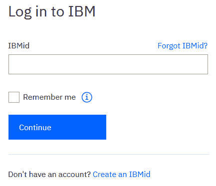

# 第八章：使用云 AI 解决方案进行欺诈预防

许多公司遭遇的安全攻击和数据泄露的目标是违反敏感信息，如客户的信用卡详细信息。这类攻击通常以隐蔽模式进行，因此，使用传统方法难以检测到这些威胁。此外，需要监控的数据量往往庞大，单靠传统的**提取、转换和加载**（**ETL**）程序，运行在关系型数据库上，无法有效分析数据，因此采用**人工智能**（**AI**）可扩展解决方案显得尤为重要。通过这样做，企业可以利用云架构来管理大数据，并运用预测分析方法。

信用卡欺诈代表了人工智能（AI）解决方案在网络安全领域应用的一个重要考验，因为它要求开发利用大数据分析的预测分析模型，并通过使用云计算平台进行处理。

在本章中，您将学习以下内容：

+   如何利用**机器学习**（**ML**）算法进行欺诈检测

+   如何通过集成（bagging）和提升（boosting）技术提高算法的效果

+   如何使用 IBM Watson 和 Jupyter Notebook 分析数据

+   如何利用统计度量进行结果评估

让我们来介绍一下算法在信用卡欺诈检测中所扮演的角色。

# 引入欺诈检测算法

近年来，我们见证了金融领域欺诈活动的增加，特别是在信用卡欺诈方面。这是因为网络犯罪分子设立信用卡欺诈活动相对容易，因此，金融机构和组织必须能够及时识别欺诈行为。

此外，在信用卡欺诈的背景下，欺诈检测与预防的工作还受到一个复杂因素的影响：这种类型的欺诈具有全球化的特点；也就是说，它涉及不同的地理区域以及多种金融机构和组织。

因此，能够共享全球不同组织之间的可用信息源至关重要。

这些信息源是异构的，且具有数据生成爆炸性增长的特点，必须实时分析。

这类似于典型的大数据分析场景，要求使用分析工具及合适的软件和硬件平台，例如云计算所提供的工具。

这种情境的复杂性还由于我们比以往任何时候都更容易发现洗钱和非法活动，如国际恐怖主义融资，通常与信用卡欺诈相关联。

网络犯罪分子进行的非法活动因此具有跨国性质，涉及不同领域的有组织犯罪。

所有组织，无论是公共部门还是私人部门，都被要求在反洗钱等法规的基础上合作，共同打击这些非法活动。

网络犯罪分子对信用卡欺诈的兴趣日益增长，源于扭曲的经济激励；信用卡欺诈的预期回报远高于其他非法活动，且被警方抓获的风险远低于传统犯罪。

此外，如果个人金融欺诈涉及的金额和价值没有超过某些阈值，金融机构本身也不愿追究非法活动，因为调查活动可能会被证明是经济上不划算的（例如，通过位于不同国家和地区的假冒电子商务网站进行的欺诈，往往需要涉及不同法律管辖区的调查活动，从而增加执法成本和实施时间）。

信用卡欺诈导致的金融损失并不是金融机构必须面对的唯一问题；由于失去信誉和可靠性，还会造成声誉损害。

此外，信用卡欺诈还可能对客户构成威胁；信用卡欺诈的一个令人不安的方面与身份盗窃现象的日益增多有关，身份盗窃可以通过伪造文件或通过获取身份文件的数字副本（例如，通过数据泄露、网络钓鱼邮件等方式）轻松实现。

# 处理信用卡欺诈

然而，根据前述讨论，金融机构随着时间的推移引入了防止欺诈的措施：实际上，金融机构已经推出了基于双重身份验证的安全措施，通过将一次性密码（OTP）代码通过短信发送到客户的手机号码，从而整合传统的身份验证程序，以防止支付工具的滥用。

然而，事实仍然是，这些措施还不够，金融机构因信用卡欺诈而遭受的货币损失仍然高达数十亿美元；因此，减少这些损失的最有效预防活动是基于欺诈检测和预防的程序。

与信用卡欺诈检测和预防相关的分析领域相当复杂，这将使我们有机会在实践中看到，使用预测分析、机器学习和大数据分析技术的不同分析方法。

本章中，我们将探讨使用云计算平台的优势（使用 IBM Watson 平台提供的工具），考虑到欺诈检测与防范需要集成不同的活动分析，以及集成异构数据源。

这将引导我们采用一种利用预测分析的检测方法，包括认知计算等创新方法。

# 用于欺诈检测的机器学习

在信用卡领域引入算法程序进行欺诈检测，代表了预测分析领域的一个重要试验台（正如我们很快会看到的那样）。在这一领域进行的科学研究的早期例子中，我们必须提到*《用于信用卡欺诈检测的自适应机器学习》*，该研究由 Andrea Dal Pozzolo 撰写，且可以在[`dalpozz.github.io/static/pdf/Dalpozzolo2015PhD.pdf`](https://dalpozz.github.io/static/pdf/Dalpozzolo2015PhD.pdf)获取，这是最为深入的科学研究之一，广泛揭示了如何有效地利用机器学习算法进行信用卡欺诈检测。

信用卡欺诈检测的算法选择和设计具有以下特点：

+   有关欺诈交易的数据通常不易获得，因为金融机构不愿公开此类信息，以避免声誉损害以及保密合规要求。

+   从技术角度来看，欺诈数据通常表现为非平稳分布，也就是说，它们随时间发生变化；这也与客户消费行为的变化有关。

+   交易分布严重失衡，因为欺诈通常仅占总体交易的一个小比例；因此，分布显示出向真实交易的高度偏斜。事实上，我们通常只能衡量已被检测到的欺诈，而要估计未被检测到的欺诈实例（假阴性）则要困难得多。此外，欺诈通常是在事件发生后很长时间才被记录的。

由于欺诈交易的内在特征，这些误表示导致了在选择和设计检测与预防算法时所面临的挑战，例如：

+   在数据分析中使用采样策略；在存在不平衡分布的情况下，选择欠采样/过采样策略可能更加有用。

+   整合人工操作员在识别欺诈警报时生成的反馈。这一方面对于在非平稳数据存在的情况下改善算法学习过程尤为重要，而这些数据随着时间的推移不断变化。

所有这些都转化为一个欺诈检测与防范系统的开发，该系统能够集成大数据分析、机器学习算法以及人工操作员的反馈。因此，显而易见，使用云计算架构是必然的实施选择。

# 欺诈检测与防范系统

有多种可能的信用卡欺诈场景，包括以下几种：

+   **信用卡盗窃**：这是实践中最常见的情况；犯罪分子盗窃信用卡并在短时间内尽可能多地消费。这种活动通常会很喧闹，可以通过与合法信用卡持有人的消费习惯进行比对，借助异常或不寻常的模式检测来识别。

+   **信用卡滥用**：与前述情况不同，欺诈者不需要实际持有信用卡，只需知道与卡片相关的相关信息（如识别码、PIN 码、个人身份号码、卡号、设备代码等）即可。这是最隐蔽的欺诈场景之一，因为它是以悄无声息的方式进行的（与前述场景相比，它不那么显眼），而信用卡的合法拥有者通常并未意识到背后正在进行的欺诈活动。

+   **身份盗窃**：在这种情况下，信用卡是基于虚假的个人信息发放的，或者通过利用毫无防备的第三方的个人信息，这些第三方发现自己在名下被收取服务费用以及进行的取款和支付。

我们应该牢记，欺诈场景随着时间的推移而发展，特别是在涉及金融服务和技术的流程和产品创新方面，这些技术被金融机构采纳。

同样，欺诈者根据信用卡发卡机构为防止和打击欺诈所采取的技术措施调整自己的行为。

要正确实施**欺诈检测与防范系统**（**FDPS**），必须区分与信用卡欺诈管理相关的两项活动：

+   **欺诈检测**：这是旨在正确和可靠地识别欺诈案件的一套程序；它是在欺诈发生后实施的。

+   **欺诈防范**：这是旨在有效预防欺诈发生的一套程序；它是在欺诈发生之前实施的。

这两项活动的特点在于实施的程序类型不同，以及它们引入的时机也有所不同，具体如下：

+   在欺诈预防的情况下，分析程序可以利用由领域专家处理的基于规则的警报系统（因此，需要操作员不断微调），或利用基于数据挖掘、机器学习、神经网络等的先进分析技术，通过这些技术可以自动发现数据分布中的模式。

+   在欺诈检测的情况下，分析程序旨在根据现有数据正确分类欺诈，从而将其与真实交易区分开来。

实施 FDPS 的一个重要方面不仅是其能够实现的结果的可靠性，还包括其成本效益。如果实施成本高于由于欺诈造成的损失，那么采用 FDPS 就毫无意义！

这两项活动之间存在明显的权衡；如果无法防止欺诈尝试，那么必须尽可能快地检测到它。

同样，这两项活动都需要尽量减少假阳性（即那些被错误地视为欺诈的交易，实际上它们是合法的交易）数量，并避免由于假阳性引发的自动反应导致客户可能遭受的服务拒绝（例如，尽管交易是合法的，信用卡仍被自动封锁）。

管理假阳性的问题还包括人工操作员进行检查的可扩展性差；如果人工操作员执行的控制通常在正确识别真正的欺诈中起到决定性作用，那么对所有交易进行系统性的人力控制，实际上就是过度的。

这就是为什么正确实施自动化检测和预防程序来支持操作员分析变得至关重要。

在本章中，我们将探讨如何考虑管理大量数据所涉及的困难，这些数据往往是不平衡的，并且由于客户不断变化的购买习惯而持续变化，这与现有算法的关系。

在接下来的章节中，我们将研究在实施自动化预测模型时可以采用的可能策略，分析专家驱动策略与数据驱动策略之间的差异。

# 专家驱动的预测模型

专家驱动的方法包括基于由行业专家（而非偶然的）制定的规则来实施预测模型，因此专家驱动的方法也被定义为基于规则的方法。

规则遵循`if...then...else`形式的逻辑条件，旨在表示不同的欺诈场景及其相关的自动对策，这些对策是在对交易数据进行检查后自动采取的。

因此，一个可能的规则是：如果信用卡交易金额超过某一特定金额，并且与某一特定的日常频率相关（与客户购买习惯的历史系列进行比较），则将所有交易视为欺诈性交易，规则可能如下：

```py
IF amount > $1,000 AND buying_frequency > historical_buying_frequency THEN fraud_likelihood = 90%
```

对于在地理位置上相距很远的后续交易，可能会呈现如下情况：

```py
IF distance(new_transaction, last_transaction) > 1000 km AND time_range < 30 min THEN block_transaction
```

在第一种情况下，我们将看一个评分规则的例子，而在第二种情况下，我们将讨论一个阻止规则。

评分规则旨在根据常见经验规则估算与交易相关的欺诈概率，并通过在超过特定阈值后对事件进行分类，来实现这一目标。

阻止规则更加严格，因为它们不仅仅限于估算欺诈的概率。相反，它们旨在在交易完成之前拒绝交易的授权；因此，阻止规则必须基于更严格的逻辑条件（例如在我们的例子中，如果交易与前一次交易相隔不足半小时，并且执行地点之间的距离大于 1000 公里，则拒绝该交易。合理推测，同一客户在这么短的时间内不可能在如此远的地方之间移动）。

基于规则的预测模型的优点如下：

+   警报实施的易用性

+   警报理解的易用性

+   更高的警报可解释性

专家驱动的预测模型的缺点同样显而易见：

+   它们表达了主观判断，可能会因执行这些模型的专家不同而有所差异。

+   它们只能处理少数几个重要变量及其相互关系。

+   它们基于过去的经验，无法自动识别新的欺诈模式。

+   需要专家不断地手动微调规则，以便考虑到欺诈者所采用的欺诈策略的演变。

因此，这些缺点有利于推动数据驱动预测模型的采用。

# 数据驱动预测模型

数据驱动预测模型利用自动化学习算法，试图根据数据驱动的学习方法调整其预测，持续更新检测和预防程序，并基于动态识别的行为模式进行操作。

数据驱动预测模型中使用的算法源自多个定量分析领域，从统计学到数据挖掘和机器学习，旨在学习数据中隐藏或潜在的模式。

在数据驱动预测模型的实现中，机器学习算法的特权角色一目了然；机器学习使得基于对数据进行训练所获得的模型，能够识别出预测模型。

此外，在欺诈检测领域使用机器学习有几个优点：

+   分析多维数据集的能力（数据集特征数量较多，代表欺诈的可能解释变量）

+   关联各个识别特征之间的能力

+   动态更新模型、使其适应欺诈者所采用策略变化的能力

+   机器学习采用数据驱动的方法，实时利用大量数据（大数据）

鉴于此，数据驱动的预测模型通常比基于规则的模型更具鲁棒性和可扩展性。

然而，与基于规则的模型不同，数据驱动预测模型往往表现得像“黑箱”，这意味着它们生成的警报很难解释和证明（例如，在客户的交易被基于算法自动决策拒绝后，客户提出澄清要求时）。

同样，数据的特性本身可能会导致算法正确实现时的困难；以信用卡为例，交易分布存在重要的不规则性，如不平衡、非平稳和偏斜。因此，必须仔细选择能够充分处理这些不规则性的机器学习算法。

特别是在非平稳数据的情况下（即数据随着客户购买行为的变化而随时间变化），算法必须仔细更新自身的学习参数，权重最近的数据，或忽略过时的样本。

数据驱动预测模型的一个无可争议的优点是能够将操作员的反馈集成到预测中，从而提高程序的准确性。

操作员的反馈，事实上，具有更高的可靠性，能正确分类欺诈案件，从而减少假阴性的数量（即可能未被发现的欺诈行为），并可以自动集成到数据驱动的预测模型中。

相反，基于规则的模型需要手动修订，以考虑操作员的反馈。

结合专家驱动和数据驱动预测模型的优势构成了 FDPS 的核心优势，正如我们接下来将看到的那样。

# FDPS – 集两者之长

因此，专家驱动和数据驱动预测模型可以在 FDPS 中结合使用，以利用两种方法的优势，通过减少假阴性和假阳性来提高预测的准确性。

基于规则的模型通常会减少假阴性的数量，尽管这会增加假阳性的数量；与数据驱动模型结合使用时，可以通过减少假阳性来改善预测。

此外，正如我们所看到的，数据驱动的模型允许将操作员的反馈与其他大数据源集成，从而有助于动态更新 FDPS。

FDPS 的自动化维护和调优活动需要实施能够自主学习新预测模式的机器学习算法，这些模式从大量数据中开始。

如前所述，信用卡交易的统计分布具有非平稳数据的特点（数据的特征随着消费习惯的变化而变化），而且数据通常偏向于代表合法交易的大类，而不是代表欺诈行为的小类。

这是因为欺诈案件的数量相对于总交易数是极少的（此外，欺诈交易的检测通常需要更长时间，因此欺诈交易的类别通常较小）。

并非所有的机器学习算法都能有效处理同时具备非平稳和不平衡特征的数据。因此，需要适当选择算法，以获得可靠和准确的预测。

# 从不平衡和非平稳数据中学习

在第一章《面向网络安全专业人士的 AI 简介》中，我们看到了机器学习算法如何分为监督学习和无监督学习；这一划分在信用卡欺诈检测中同样有效，尽管必须注意启发这两类算法的不同假设。这是因为它们对预测的可靠性和准确性有重要影响。

在监督学习算法的情况下，假设有一个已经分类的数据集（有标签样本）；也就是说，每个样本之前已与两种可能类别之一（合法或欺诈）关联。

因此，监督算法是基于这些信息进行训练的，它们所做的预测是由在训练样本上进行的先前分类所决定的，这可能导致假阴性的增加。

无监督算法则不依赖于任何关于样本数据（无标签样本）可能分类的先前信息，因此必须独立推断数据可能属于的类，以便更容易地产生假阳性。

# 处理不平衡数据集

在信用卡交易的情况下，我们说过数据分布既是不平衡的，又是非平稳的。

解决不平衡数据分布问题的方法是在进行算法训练之前对类别进行重新平衡。

常用于重平衡样本类别的策略包括对数据集进行欠采样和过采样。

本质上，欠采样包括随机删除属于某一类别的一些观察结果，以减少其相对一致性。

在不平衡分布的情况下，例如与信用卡交易相关的分布，如果我们排除主要类别（代表合法交易）的随机样本，我们可以合理地期望数据的分布由于数据的移除不会发生根本性改变（可以可靠地视为冗余）。

然而，我们总是面临着消除包含相关信息的数据的风险。因此，确定正确的采样水平并不总是即时的，因为它取决于数据集的具体特征，因此需要使用适应性策略。

另一种数据采样策略包括过采样，即通过在较小类别中生成合成样本来增加其大小。

与过采样技术相关的缺点包括引入过拟合的风险，以及增加模型的训练时间。

# 处理非平稳数据集

为了管理分布的非平稳特性，过于强调由人工操作员获得的反馈可能是有用的，这有助于改善受监督样本的分类。

因此，在存在非平稳数据的情况下，使用一组分类器（集成学习）可能是有用的，其训练是在不同的样本上进行的，以提高整体预测准确性。

通过集成不同的分类器，可以将基于新观察到的知识与先前获得的知识结合起来，根据其分类能力对每个分类器进行加权，排除那些不再能够表示数据分布随时间变化的分类器。

# 信用卡欺诈检测的预测分析

要充分解决欺诈检测问题，必须开发预测分析模型，即能够使用数据驱动方法识别数据中趋势的数学模型。

不同于描述性分析（其范式由**商业智能**（**BI**）构成），后者仅限于根据应用描述性统计产生的度量对过去数据进行分类（例如总和、平均值、方差等），准确描述正在分析的数据特征；相反，通过查看现在和过去的情况，预测分析试图以一定的概率预测未来事件。它通过挖掘分析数据中的隐藏模式来实现这一点。

作为数据驱动的预测分析，利用数据挖掘和机器学习技术进行预测，且基于对大量可用数据（大数据分析）的分析。

在接下来的章节中，我们将探索如何开发用于信用卡欺诈分析的预测分析模型。我们将学习以下内容：

+   利用大数据分析整合来自不同来源的信息

+   结合不同的分类器（集成学习）以提高预测性能

+   使用 bagging 和 boosting 算法来开发预测模型

+   使用采样技术对数据集进行重平衡，从而提高预测准确性

让我们从利用大数据分析开发预测模型来管理信用卡欺诈检测的优势开始了解。

# 在欺诈检测中采用大数据分析

组织普遍采用的传统 ETL 解决方案，这些方案基于关系型数据库和数据仓库的数据架构，毫无疑问能够执行基于描述性分析的报告（例如商业智能报告），但无法通过数据驱动方法处理大量数据，而这种方法是预测分析的典型特征。

因此，有必要采用数据架构，通过使用功能编程范式（如 MapReduce、NoSQL 原语等）来实现处理的可扩展性。

可以利用大数据分析技术，并将其与机器学习和数据挖掘算法结合，以实现欺诈检测的自动化。

采用大数据分析范式有助于组织最大化利用其信息资产，这些资产通常来自不同（且往往异构）的数据源。这使得能够实施先进的情境意识形式，进而实时调整检测程序以适应情境变化。

众所周知，非法活动往往是相互关联的，能够构建一个整体的欺诈活动图景前提是要不断监控不同的信息源。

采用云计算平台可以促进数据的实时监控和分析，这也使得聚合各种数据源成为可能。

比如，想象一下将组织内部产生的数据和信息与公开可用的网络数据、社交媒体及其他平台的数据进行整合。通过整合这些不同的信息源，可以重构待监控的金融交易的情境（例如，通过社交媒体，你可能发现持卡人当前位于一个远离正在进行信用卡交易地点的地理位置）。

同样地，不同数据源的整合可以增强数据集特征；也就是说，从数据集中现有的变量出发，引入新的变量，这些变量可以描述合法持卡人的行为，并将其与欺诈者的行为进行比较。

例如，我们可以向现有变量中添加新的变量，这些变量包含重新计算的值，比如上一时间段的平均支出水平、每天的购买次数，以及通常在哪些商店（包括电商网站）进行购买。

通过这种方式，可以不断更新客户档案，及时发现潜在的行为异常和巩固的消费习惯。

# 集成学习

从数据到算法的过渡，前面我们提到过，在非平稳数据的情况下，引入分类器集成可能比单独使用个别分类器更有助于提高整体预测准确性。

因此，集成学习的目的是将不同的分类算法结合起来，从而获得一个分类器，能够提供比单个分类器更好的预测结果。

为了理解为什么集成分类器表现得比单个分类器更好，我们需要想象我们有若干个二元分类器，它们都是相同类型，具有在 75%的情况下做出正确预测，而在剩余 25%的情况下做出错误预测的能力。

通过使用组合分析和二项分布（因为我们考虑的是二元分类器），可以证明，使用集成分类器而非单个分类器时，获得正确预测的概率会提高（而错误的概率则会降低）。

例如，如果我们有 11 个二元分类器进行集成学习，那么错误率将降低到 3.4%（相比于单个分类器的 25%错误率）。

如需正式证明，请参考 Sebastian Raschka 的《Python 机器学习（第二版）》，由 Packt 出版。

你可以使用多种方法来结合分类器；其中一种方法是使用多数投票法（也称为**多数投票原则**）。

多数投票原则是指，在单个分类器做出的预测中，我们选择那个显示最高频率的预测。

用正式的术语来说，这就转化为计算位置统计量之一，称为**众数**，即频率最高的类别。

假设我们有 `n` 个分类器，`C`*[i]**(x)*，需要确定最被投票通过的预测 `y`，即大多数单个分类器确认的预测。我们可以写出以下公式：


显然，我们可以在可用的不同类型的算法中选择个别分类器（如决策树、随机森林、**支持向量机**（**SVMs**）等）。

同时，也有几种方法可以创建集成分类器，如下所示：

+   袋装法（Bootstrap Aggregating）

+   提升法

+   堆叠法

使用袋装法，可以通过选择不同的训练集并应用自助重采样技术来减少个体估计器的方差。

通过提升法，我们可以创建一个集成估计器，从而减少个体分类器的偏差。最后，通过堆叠法，将通过异构估计器获得的不同预测结果结合起来。

我们将在接下来的章节中分析创建集成估计器的不同方法。

# 袋装法（Bootstrap Aggregating）

**自助法**（bootstrap）是指对数据集进行有放回抽样的操作。因此，袋装法将每个自助样本与一个单独的估计器相关联；集成估计器通过对个别分类器应用多数投票法来实现。

要考虑的自助抽样次数可以预先确定，也可以通过使用验证数据集进行调整。

袋装法特别适用于在有放回抽样帮助下重新平衡原始数据集的情况，从而减少总方差。

# 提升算法

提升法则是使用从数据中提取的加权样本，这些样本的权重根据个别分类器报告的分类错误进行迭代调整，从而减少其偏差。

更重要（加权）的是对那些最难分类的观测值。

最著名的提升算法之一是**自适应提升**（**AdaBoost**），其中第一个分类器在训练集上进行训练。

对于第一个分类器错误分类的样本，相关的权重会增加，然后在包含更新权重的数据集上训练第二个分类器，依此类推。迭代过程在达到预定的估计器数量时结束，或者当找到最佳预测器时结束。

AdaBoost 的主要缺点之一是该算法由于其顺序学习策略，无法并行执行。

# 堆叠法

堆叠法得名于集成估计器的构建方式，它是通过叠加两层来实现的，第一层由单个估计器组成，这些估计器的预测结果被传递到下层，在那里另一个估计器负责对接收到的预测进行分类。

与袋装法（bagging）和提升法（boosting）不同，堆叠法（stacking）可以使用不同类型的基础估计器，这些估计器的预测可以通过与之前不同的算法进行分类。

让我们来看看一些集成估计器的例子。

# Bagging 示例

在以下示例中，我们将使用 Python 的 `scikit-learn` 库实例化一个 `BaggingClassifier` 类的对象，并将 `DecisionTreeClassifier` 类型作为基本分类器传入；通过 `n_estimators` 参数设置要实例化的 `DecisionTreeClassifier` 类型的基本估计器的数量。

可以在 `BaggingClassifier` 类型的**bagging**实例上调用`fit()`和`predict()`方法，这些方法通常也会在常见的分类器上调用。

正如我们所知道的，bagging 方法使用有放回抽样。由于这一点，我们可以设置每个基本估计器关联的最大样本数量（使用 `max_samples` 参数），并通过将同名 `bootstrap` 参数设置为 `True` 来激活自助采样机制，如下所示：

```py
from sklearn.tree import DecisionTreeClassifier

from sklearn.ensemble import BaggingClassifier

bagging = BaggingClassifier(
            DecisionTreeClassifier(), 
            n_estimators=300,
            max_samples=100, 
            bootstrap=True
          )
```

# 使用 AdaBoost 提升方法

作为提升方法的示例，我们将实例化一个 `scikit-learn` 库中 `AdaBoostClassifier` 类型的对象，该库为我们提供了 AdaBoost 算法的实现；作为基本估计器，我们还将在此示例中使用 `DecisionTreeClassifier` 类的实例，并通过 `n_estimators` 参数设置基本估计器的数量*：*

```py
from sklearn.tree import DecisionTreeClassifier

from sklearn.ensemble import AdaBoostClassifier

adaboost = AdaBoostClassifier(
              DecisionTreeClassifier(),
              n_estimators=300
           )
```

另一种广泛使用的提升算法是 **梯度提升** 算法。为了理解梯度提升算法的特性，我们必须首先引入梯度的概念。

# 引入梯度

在数学上，梯度表示在给定点计算的偏导数；它还表示被考虑点的切线（斜率）。

梯度在机器学习中作为一种成本函数被用来最小化，以减少算法产生的预测误差。它的核心是最小化算法估计值与观察值之间的差异。

使用的最小化方法被称为梯度下降，它是一种优化分配给输入数据的权重组合的方法，以便获得估计值与观察值之间的最小差异。

因此，梯度下降法计算各个权重的偏导数，基于这些偏导数更新权重，直到达到对应于所求最小值的偏导数的驻点值。

梯度下降公式及其图形表示如下图所示：


（图片来源：Wikipedia，网址：https://commons.wikimedia.org/wiki/File:Gradient_descent.jpg ）

问题在于，梯度下降法返回的最小值可能对应一个全局最小值（即，无法再进一步最小化），但更有可能对应局部最小值；问题在于，梯度下降法无法确定是否已经到达局部最小值，因为优化过程在达到稳定值时停止。

梯度下降优化方法如图所示：


（图片来源：Wikipedia，网址：https://commons.wikimedia.org/wiki/File:Gradient_descent_method.png）

现在让我们看看梯度提升算法的特点。

# 梯度提升

类似于 AdaBoost 算法，梯度提升也在每一轮迭代中基于估计器返回的值来修正估计器；在梯度提升的情况下，修正是基于前一轮估计器生成的残差误差，而不是要分配的权重（如在 AdaBoost 中）。

接下来，我们将展示一个使用`scikit-learn`库中`GradientBoostingClassifier`类的示例。

默认估计器是决策树，其特征通过参数进行指定（例如`max_depth`，用于设定决策树的最大深度）。

另外，请注意`learning_rate`参数，它必须与`warm_start`参数一起考虑。

分配给`learning_rate`参数的值决定了每个估计器对集成分类器的贡献；如果分配的值为`低`，则需要更多的估计器（通过`n_estimators`参数设置）来继续在训练集上进行集成拟合。

对于`learning_rate`和`n_estimators`参数的最优值决策，必须考虑与过拟合相关的问题（即，模型在训练数据上的过度拟合可能导致的泛化误差）。克服这些问题的一种方法是设置`warm_start=True`参数，这将决定在训练阶段的提前停止，示例如下：

```py
from sklearn.ensemble import GradientBoostingClassifier

gradient_boost = GradientBoostingClassifier(
                   max_depth=2, 
                   n_estimators=100, 
                   learning_rate=1.0,
                   warm_start=True
                 )
```

# 极限梯度提升（XGBoost）

与梯度提升相似的算法是 XGBoost 算法。

它是梯度提升的扩展，证明在处理大规模数据时更加适用，因为它具有更好的可扩展性。

XGBoost 同样使用梯度下降法来最小化估计器的残差误差，并且特别适合并行计算（这一特点使其更适合云计算）。

我们将在稍后使用 IBM Watson 在 IBM Cloud 平台上实施信用卡欺诈检测时看到 XGBoost 算法的应用。

# 不平衡数据集的采样方法

在进入欺诈检测操作阶段之前，最后一个需要考虑的方面是数据不平衡的管理。

我们已经说过，信用卡交易的一个特征是其向真实交易分布的失衡。

为了管理数据中的这种不对称性，我们可以使用不同的采样方法来重新平衡交易数据集，从而使分类器的性能得到提升。

最常用的两种采样模式是欠采样和过采样。通过欠采样，从最多的类别（在我们这里是合法交易类别）中随机移除一些样本；通过过采样，向最少的类别添加合成样本。

# 使用 SMOTE 进行过采样

在过采样方法中，我们有**合成少数类过采样技术** (**SMOTE**)；它通过插值生成合成样本，这些样本基于被过采样类别内的现有值。

实际上，合成样本是基于类中观察值周围识别到的聚类生成的，因此计算**k-最近邻** (**k-NNs**)。

根据需要重新平衡类别的合成样本数量，随机选择一定数量的 k-NN 聚类，围绕这些聚类通过插值生成落在选定聚类中的值的合成示例。

# 采样示例

以下示例取自官方 Python 库 imbalanced-learn 文档，该库实现了包括欠采样和过采样算法等多种方法。

让我们来看一个使用`RandomUnderSampler`类的欠采样技术示例：

```py
# From the Imbalanced-Learn library documentation:
# https://imbalanced-learn.readthedocs.io/en/stable/generated/imblearn.under_sampling.RandomUnderSampler.html

from collections import Counter
from sklearn.datasets import make_classification
from imblearn.under_sampling import RandomUnderSampler 

X, y = make_classification(n_classes=2, class_sep=2,
 weights=[0.1, 0.9], n_informative=3, n_redundant=1, flip_y=0,
n_features=20, n_clusters_per_class=1, n_samples=1000, random_state=10)
print('Original dataset shape %s' % Counter(y))

rus = RandomUnderSampler(random_state=42)
X_res, y_res = rus.fit_resample(X, y)
print('Resampled dataset shape %s' % Counter(y_res))
```

这是一个使用 SMOTE 类的过采样技术示例：

```py
# From the Imbalanced-Learn library documentation:
# https://imbalanced-learn.readthedocs.io/en/stable/generated/imblearn.over_sampling.SMOTE.html

from collections import Counter
from sklearn.datasets import make_classification
from imblearn.over_sampling import SMOTE 

X, y = make_classification(n_classes=2, class_sep=2,
   weights=[0.1, 0.9], n_informative=3, n_redundant=1, flip_y=0,
   n_features=20, n_clusters_per_class=1, n_samples=1000,    
   random_state=10)

print('Original dataset shape %s' % Counter(y))
Original dataset shape Counter({1: 900, 0: 100})

sm = SMOTE(random_state=42)
X_res, y_res = sm.fit_resample(X, y)
print('Resampled dataset shape %s' % Counter(y_res))
Resampled dataset shape Counter({0: 900, 1: 900})
```

# 了解 IBM Watson Cloud 解决方案

现在是时候了解市场上最有趣的基于云的解决方案之一，它将让我们看到信用卡欺诈检测实际应用的具体示例：我们所说的是 IBM Watson Cloud 解决方案，它在其他创新概念中引入了认知计算。

通过认知计算，有可能模拟典型的人类模式识别能力，从而为决策提供充分的上下文感知。

IBM Watson 可以成功应用于多个现实场景；以下是几个示例：

+   增强现实

+   犯罪预防

+   客户支持

+   面部识别

+   欺诈预防

+   医疗保健和医学诊断

+   物联网 (IoT)

+   语言翻译和**自然语言处理** (**NLP**)

+   恶意软件检测

在详细了解 IBM Watson Cloud 平台之前，让我们先看看与云计算和认知计算相关的优势。

# 云计算优势

随着更高带宽网络的普及，再加上低成本计算机和存储设备的可用性，云计算的架构模型迅速普及，得益于虚拟化解决方案的可用，无论是在软件还是硬件方面。

云计算的核心特点是架构的可扩展性，这也是其商业成功的决定性因素。

采用云计算解决方案的组织成功优化了 IT 领域的投资，从而提高了利润率；这些组织不再需要基于最坏情况（即考虑到工作负载高峰，即使只是暂时的）来规划其技术基础设施，而是通过云解决方案的按需模式，从而降低了固定成本，将其转化为可变成本。

技术投资质量的提升使得组织能够专注于管理和分析构成公司信息资产的数据。

实际上，云计算使得高效存储和管理大量数据成为可能，保证了高性能、高可用性和低延迟；为了提供这些访问和性能保障，数据存储并复制在分布在不同地理区域的服务器上。此外，通过对数据进行分区，可以获得与架构可扩展性相关的优势。

更具体来说，可扩展性与通过增加资源到架构中来管理日益增长的工作负载相关——成本以线性方式增加，且与增加的资源数量成正比。

# 实现数据可扩展性

传统架构（基于关系数据库和数据仓库）面临的主要问题之一是，这些解决方案在应对数据爆炸性增长时无法良好扩展。此类架构即使在设计阶段，也需要适当的规模规划。

随着大数据分析的普及，因此有必要转向其他数据存储范式，称为**分布式存储系统**，这些系统能够精确防止数据管理和存储中的瓶颈。

云计算广泛使用这些分布式存储系统来实现对大量数据的分析（大数据分析），即使是在流媒体模式下。

分布式存储系统由非关系型数据库组成，称为 NoSQL 数据库，数据以键值对的形式存储。这使得可以在多个服务器上以分布式模式管理数据，并遵循如 MapReduce 等函数式编程范式。这反过来使得数据处理可以并行执行，充分利用云所提供的分布式计算能力。

使用 NoSQL 数据库还可以以灵活的方式管理数据，而无需在分析变化时重新组织数据的整体结构。

然而，基于关系数据库的传统解决方案需要重新配置几乎整个档案结构，这使得数据在长时间内无法使用。在需要实时验证预测模型准确性并根据此做出业务决策的背景下，这种做法已经不再可接受；这一点在网络安全领域的决策制定中尤为重要。

# 云交付模型

架构的可扩展性，再加上按需模式管理资源的能力，使得提供商可以提供不同的云交付模型：

+   **基础设施即服务**（**IaaS**）：提供商部署 IT 基础设施，如存储能力和网络设备。

+   **平台即服务**（**PaaS**）：提供商部署中间件、数据库等。

+   **软件即服务**（**SaaS**）：提供商部署完整的应用程序。

IBM Cloud 平台提供了一种交付模型，包括 IaaS 和 PaaS，以及一系列可以集成到组织开发的应用程序中的云服务，例如：

+   **视觉识别**：这使得应用程序能够在图像和视频中定位信息，如物体、人脸和文本；平台提供的服务包括检查预训练模型的可用性，以及使用企业数据集进行训练的机会。

+   **自然语言理解**：该服务可以基于对文本的分析提取情感信息；如果你想从社交媒体中提取信息（例如，了解在某次信用卡交易中，信用卡持有者是否真的在外地度假），这项服务特别有用。该服务能够识别与人物、地点、组织、概念和类别相关的信息，并且可以通过 Watson Knowledge Studio 根据公司特定的应用领域进行适配。

IBM Cloud 平台还提供一系列用于应用程序开发的高级工具：

+   **Watson Studio**：这使得项目管理成为可能，并提供团队成员间协作的工具。通过 Watson Studio，可以添加数据源、创建 Jupyter Notebooks、训练模型，并使用许多其他功能来促进数据分析，如数据清洗功能。我们将有机会进一步深入了解 Watson Studio。

+   **知识工作室**：这使得根据公司的特定需求开发定制模型成为可能；开发完成后，这些模型可以由 Watson 服务使用，作为预定义模型的补充或替代。

+   **知识目录**：这使得公司数据的管理和共享成为可能；该工具还可以执行数据清洗和整理操作，从而通过安全策略对数据访问权限进行概况化管理。

在 IBM 云平台提供的主要优势中，有一个不容忽视的优势，那就是可以实施利用认知计算的先进解决方案。让我们来看一看这是什么。

# 授权认知计算

人工智能的传播自始至今伴随着过度且毫无根据的担忧；许多作者和评论员预见了灾难性的场景，在这些场景中，机器（在不久的将来）将超越人类。这样的灾难的原因，正是人工智能的崛起。

现实是，尽管计算机取得了惊人的成功，它们仍然是天才型傻瓜。

毫无疑问，计算机的计算能力远超人类，且超出多个数量级；IBM Watson 在“世纪之战”中的胜利——计算机击败了当时的世界象棋冠军加里·卡斯帕罗夫——似乎宣布了人工智能最终战胜人类认知能力的到来。

然而，尽管计算能力有限，人类在许多技能方面依然无可匹敌，比如适应能力、互动能力、判断力等。

比如，我们人类可以一眼认出一个人（或物体），无需经过大量样本数据的训练；只需一张照片（或一张画像），就足以在人群中认出被描绘的人。计算机远未达到这种专业水平。

所以，问题并不是用机器替代人类；相反，眼前最可能的情景是，人类和机器将更加紧密地合作，以日益普及的方式整合彼此的技能。

这就是认知计算的含义：将人类的能力与计算机的计算能力结合起来，携手应对当代社会日益增长的复杂性。

在这种共生关系中，机器将其巨大的计算能力和取之不尽的记忆提供给人类，从而使人类能够增强其判断、直觉、同理心和创造力等能力。

从某种意义上说，通过认知计算，机器不仅使我们能够增强我们的五种自然感官，还赋予了我们第六种*人工*感官：情境意识。

我们已经多次提到，尤其是在网络安全领域，遇到的一个主要难题是，如何从大量分散且零散的信息中，重建一个准确的整体图景。

面对我们从各个数据源不断接收到的大量数据和信息，人类的能力显得力不从心；大数据分析超出了人类分析的能力，正是因为大数据的特点，包括无数维度（由许多不同的特征以及数据量组成）。

然而，大数据使我们能够定义语义上下文，在此上下文中我们可以进行分析；就好像它们增加了我们的感知能力，添加了无数的人工传感器。

只有机器的计算能力才能过滤我们不断从人工传感器到人类判断技能、直觉中接收到的大量信息，为我们提供整体意义，并使我们能够理解这些信息。

# 在云端导入示例数据并运行 Jupyter Notebook

现在，让我们学习如何使用 IBM Watson 平台。首先，我们需要创建一个帐户，如果还没有的话；只需连接到此处提供的 IBM Cloud 平台主页链接：[`dataplatform.cloud.ibm.com/`](https://dataplatform.cloud.ibm.com/)，你将看到以下屏幕：


IBM Watson 主页

为继续注册，选择前面的截图中显示的“试用免费版（注册）”。我们将自动被重定向到注册表单，见下方截图：


IBM Watson 注册页面

注册完成后，我们可以从主页重新登录：



IBM Watson 登录表单

登录后，我们可以创建一个新项目：


IBM Watson 开始创建项目页面

我们可以选择想要创建的项目类型：


IBM Watson 项目选择

在我们的例子中，我们将选择数据科学，如下所示：


IBM Watson 数据科学项目

我们将项目命名为 `CREDIT CARD FRAUD DETECTION`（或我们选择的其他名称）：


IBM Watson 新建项目页面

我们现在可以通过选择“添加到项目 | 数据”将数据集添加到我们的项目中：


IBM Watson-添加数据

要添加数据集，只需点击“查找并添加数据”，然后转到“文件”标签。从那里，您可以点击并添加来自计算机的数据文件。

我们将使用的数据集是信用卡数据集，下载格式为 `.csv`，可以在[`www.openml.org/data/get_csv/1673544/phpKo8OWT`](https://www.openml.org/data/get_csv/1673544/phpKo8OWT) 下载：

信用卡数据集已按公共领域许可证发布（[`creativecommons.org/publicdomain/mark/1.0/`](https://creativecommons.org/publicdomain/mark/1.0/)）([`www.openml.org/d/1597`](https://www.openml.org/d/1597))，并且在 Andrea Dal Pozzolo、Olivier Caelen、Reid A. Johnson 和 Gianluca Bontempi 的论文 *Calibrating Probability with Undersampling for Unbalanced Classification* 中获得了致谢，发表于 **计算智能与数据挖掘**（**CIDM**）研讨会，IEEE，2015 年。

数据集包含 31 个数值型输入变量，如时间（表示每笔交易之间的时间间隔）、交易金额和类特征。

类特征是一个二元变量，仅取值 1 或 0（分别表示欺诈或合法交易）。

数据集的主要特点是极度不平衡，欺诈交易仅占所有交易的 0.172%。

添加数据集后，我们可以通过选择“添加到项目 | 笔记本”来将 Jupyter 笔记本添加到项目中，如下截图所示：


IBM Watson-添加笔记本

要创建 Jupyter 笔记本，请执行以下步骤：

1.  点击创建一个笔记本

1.  选择标签

1.  为笔记本输入名称

1.  可选地，输入笔记本描述

1.  输入笔记本 URL：[`github.com/IBM/xgboost-smote-detect-fraud/blob/master/notebook/Fraud_Detection.ipynb`](https://github.com/IBM/xgboost-smote-detect-fraud/blob/master/notebook/Fraud_Detection.ipynb)

1.  选择运行时

1.  点击创建

恭喜！你已经成功配置了项目，并准备好在 IBM Cloud 平台上的 IBM Watson Studio 中查看信用卡欺诈检测模型的实际应用。

# 使用 IBM Watson Studio 进行信用卡欺诈检测

让我们来看一下我们加载到 IBM Watson Studio Jupyter 笔记本中的欺诈检测预测模型（完整代码由 IBM 发布，并采用 Apache 2.0 许可证，链接：[`github.com/IBM/xgboost-smote-detect-fraud/blob/master/notebook/Fraud_Detection.ipynb`](https://github.com/IBM/xgboost-smote-detect-fraud/blob/master/notebook/Fraud_Detection.ipynb) ）的实际应用。

第一步操作是将加载的 `.csv` 格式的信用卡数据集转换为 `pandas` DataFrame。可以按以下步骤进行操作。

选择下面的单元格，读取数据并将其转换为笔记本中的 DataFrame 部分，然后执行以下步骤：

1.  使用“查找并添加数据”及其“文件”标签。你应该能看到我们之前上传的文件名。

1.  选择插入代码。

1.  点击插入 Pandas DataFrame。

1.  一旦数据集被转换为 `pandas` DataFrame，我们可以通过用自己选择的名称替换 Watson Studio 自动分配的名称来重命名它，如以下代码片段所示：

```py
# Rename the dataframe to df

df = df_data_2
```

此时，我们可以使用`train_test_split`方法将数据集分为训练集和测试集；这通过使用常见的拆分比例（30%用于测试，剩余的 70%用于训练）来完成，如以下示例所示：

```py

from sklearn.model_selection import train_test_split

x = df[['Time', 'V1', 'V2', 'V3', 'V4', 'V5', 'V6', 'V7', 'V8', 'V9', 'V10',
       'V11', 'V12', 'V13', 'V14', 'V15', 'V16', 'V17', 'V18', 'V19', 'V20',
       'V21', 'V22', 'V23', 'V24', 'V25', 'V26', 'V27', 'V28', 'Amount']]
y = df['Class']

xtrain, xtest, ytrain, ytest = train_test_split(x, y, test_size=0.30,
random_state=0)
```

请记住，数据集包含 31 个数值型输入变量，其中`Time`特征表示每次交易与数据集中的第一次交易之间经过的秒数，而`Amount`特征表示交易金额。

`Class`特征是响应变量，在欺诈情况下取值为`1`，否则为`0`。

出于保密原因，大多数变量（以`V1`、`V2`、……、`V28`表示）的含义未被揭示，特征通过主成分方法进行了转换。

此时，我们可以引入我们的第一个集成分类器，以测试其在数据集上的分类质量。

# 使用`RandomForestClassifier`进行预测

选择落在集成算法中最常用的一个，即随机森林算法。

这种类型的算法被`RandomForestClassifier`类用于从训练集随机提取的子集创建一组决策树。

该算法是使用袋装技术的学习集成方法，因此特别适用于减少模型的过拟合。

让我们看一个`RandomForestClassifier`的例子及其准确度得分：

```py
from sklearn.ensemble import RandomForestClassifier
from sklearn import metrics

rfmodel = RandomForestClassifier()
rfmodel.fit(xtrain,ytrain)
ypredrf = rfmodel.predict(xtest)

print('Accuracy : %f' % (metrics.accuracy_score(ytest, ypredrf)))

Accuracy : 0.999414
```

模型的准确率相当高（99.9414%），证明了集成学习的有效性。

让我们看看是否可以通过使用另一个分类器集成，利用提升技术，来改善预测结果。

# 使用`GradientBoostingClassifier`进行预测

现在我们将使用基于 AlgaBoost 的`GradientBoostingClassifier`。

集成分类器使用的算法采用了提升技术；它还使用梯度下降来最小化成本函数（由各个基础分类器返回的残差误差表示，这些基础分类器也是由决策树构成的）。

在以下代码中，我们可以看到梯度提升集成分类器的应用：

```py
from sklearn import ensemble

params = {'n_estimators': 500, 'max_depth': 3, 'subsample': 0.5,
          'learning_rate': 0.01, 'min_samples_leaf': 1, 'random_state': 3}

clf = ensemble.GradientBoostingClassifier(**params)
clf.fit(xtrain, ytrain) 

y_pred = clf.predict(xtest) 

print("Accuracy is :")
print(metrics.accuracy_score(ytest, y_pred))

Accuracy is : 0.998945085858
```

模型的准确率仍然很高，但没有比`RandomForestClassifier`有更大提升；事实上，我们的预测准确率已经达到了 99.89%，但我们可以做得更好。

# 使用`XGBoost`进行预测

我们现在将通过使用**XGBoost**来进一步改进预测，XGBoost 是梯度提升算法的改进版，旨在优化性能（使用并行计算），从而减少过拟合。

我们将使用`xgboost`库中的`XGBClassifier`类，它实现了极限梯度提升分类器，如以下代码所示：

```py
from sklearn import metrics
from xgboost.sklearn import XGBClassifier

xgb_model = XGBClassifier()

xgb_model.fit(xtrain, ytrain, eval_metric=['error'], eval_set=[((xtrain, ytrain)),(xtest, ytest)])

y_pred = xgb_model.predict(xtest)  

print("Accuracy is :")
print(metrics.accuracy_score(ytest, y_pred))

Accuracy is : 0.999472542929
```

准确率进一步提高，我们已经达到了 99.9472%的准确率（比`RandomForestClassifier`的准确率 99.9414%略高）。虽然不错，但我们现在必须仔细评估我们预测的质量。

# 评估我们预测的质量

为了正确评估分类器所获得的预测结果的质量，我们不能仅仅满足于`accuracy_score`，还必须使用其他度量标准，例如**F1 得分**和**ROC 曲线**，这些我们之前在第五章《*基于 AI 的网络异常检测*》中遇到过，该章节讨论了与异常检测相关的主题。

# F1 值

为了方便起见，我们简要回顾一下之前介绍的度量标准及其定义：

*敏感度或真正率（TPR）= 真阳性 / (真阳性 + 假阴性);*

在这里，敏感度也被称为召回率：

*假阳性率（FPR）= 假阳性 / (假阳性 + 真阴性);*

*精确度 = 真阳性 / (真阳性 + 假阳性)*

基于这些指标，可以估算出 F1 得分，它表示精确度和敏感度之间的调和平均数：

*F1 = 2 * 精确度 * 敏感度 / (精确度 + 敏感度)*

F1 得分可以用来评估从预测中获得的结果；最佳估算值是 F1 接近 1 的值，而最差的估算值对应 F1 接近 0 的值。

# ROC 曲线

在假阳性和假阴性之间，通常存在一种权衡；减少假阴性的数量会导致假阳性的增加，为了检测这种权衡，使用了一条特定的曲线，称为 ROC 曲线。如下图所示：


（图片来源：维基百科，链接：[`commons.wikimedia.org/wiki/File:ROC_curve.svg`](https://commons.wikimedia.org/wiki/File:ROC_curve.svg)）

ROC 曲线是通过`scikit-learn`中的`roc_curve()`函数计算的，该函数以目标值和相应的概率作为参数，示例代码如下：

```py
from sklearn.metrics import roc_curve

FPR, TPR, OPC = roc_curve(targets, probs)
```

我们应该注意到真正率（`TPR`或敏感度）、假阳性率（`FPR`）和 ROC 曲线之间的关系（另外，`OPC`参数代表一个控制系数，称为**操作特征**，它标识了曲线上可能的分类阈值）。因此，我们可以通过绘制`TPR`值与`OPC`控制系数的关系来表示敏感度：

```py
# Plotting Sensitivity
plt.plot(OPC,TPR)
```

我们可以看到，随着`OPC`值的增加，敏感度（`TPR`）会降低；同样地，我们可以通过将`TPR`与`FPR`进行比较，绘制 ROC 曲线：

```py
# Plotting ROC curve
plt.plot(FPR,TPR)
```

# AUC（ROC 曲线下的面积）

ROC 曲线允许我们通过将`TPR`与`FPR`绘制在一起，来评估分类器的性能（曲线上的每个点对应一个不同的分类阈值）。

我们还可以通过 ROC 曲线下的面积来比较不同的分类器，以找出哪个分类器更准确。

为了理解这种比较的逻辑，我们必须考虑到，在 ROC 空间内，最优分类器是由点`x` = 0 和 `y` = 1 的坐标标识的（它们对应的是没有假阴性和假阳性的极限情况）。

为了比较不同的分类器，我们可以计算每个分类器对应的**ROC 曲线下面积**（**AUC**）值；获得最高 AUC 值的分类器是最准确的。

我们还可以考虑两个特殊分类器的 AUC 值：

+   最佳分类器的 AUC 是 1 x 1 = 1

+   最差分类器的 AUC 是 0.5

此外，AUC 也是衡量不平衡数据集的一种指标。

我们可以使用`scikit-learn`来计算`AUC`，如下所示：

```py
from sklearn.metrics import auc

AUC = auc(FPR, TPR)
```

基于我们所说的内容，现在我们可以更准确地评估由我们的分类器得到的预测结果，并相互比较。

# 比较集成分类器

现在，我们可以通过比较它们来计算每个分类器的主要准确性度量。

# RandomForestClassifier 报告

`RandomForestClassifier`度量的分类报告如下所示：

```py
print('classification report')
print(metrics.classification_report(ytest, ypredrf))
print('Accuracy : %f' % (metrics.accuracy_score(ytest, ypredrf)))
print('Area under the curve : %f' % (metrics.roc_auc_score(ytest, ypredrf)))

classification report
             precision    recall  f1-score   support

          0       1.00      1.00      1.00     17030
          1       0.96      0.73      0.83        33

avg / total       1.00      1.00      1.00     17063

Accuracy : 0.999414
Area under the curve : 0.863607
```

# GradientBoostingClassifier 报告

`GradientBoostingClassifier`度量的分类报告如下所示：

```py
print('classification report')
print(metrics.classification_report(ytest, y_pred))
print("Accuracy is :")
print(metrics.accuracy_score(ytest, y_pred))
print('Area under the curve : %f' % (metrics.roc_auc_score(ytest, y_pred)))

classification report
             precision    recall  f1-score   support

          0       1.00      1.00      1.00     17030
          1       0.74      0.70      0.72        33

avg / total       1.00      1.00      1.00     17063

Accuracy is : 0.998945085858
Area under the curve : 0.848250
```

# XGBClassifier 报告

`XGBClassifier`度量的分类报告如下所示：

```py
print('classification report')
print(metrics.classification_report(ytest, y_pred))
print("Accuracy is :")
print(metrics.accuracy_score(ytest, y_pred))
print('Area under the curve : %f' % (metrics.roc_auc_score(ytest, y_pred)))

classification report
             precision    recall  f1-score   support

          0       1.00      1.00      1.00     17030
          1       0.93      0.79      0.85        33

avg / total       1.00      1.00      1.00     17063

Accuracy is : 0.999472542929
Area under the curve : 0.893881
```

通过比较 AUC 和 F1 分数值，这些值是通过各个分类器计算得出的，`XGBClassifier`依然是最准确的分类器，而`GradientBoostingClassifier`是三者中最不准确的。

# 使用 SMOTE 提高预测准确性

我们通过展示基于过采样的重平衡技术如何有助于提高预测准确性来总结我们的分析。

我们将使用 imbalanced-learn 库提供的 SMOTE 过采样算法实现，将欺诈样本从 102 增加到 500，并在重新采样的数据上再次使用`RandomForestClassifier`，如下所示：

```py
from collections import Counter
from imblearn.over_sampling import SMOTE 

x = df[['Time', 'V1', 'V2', 'V3', 'V4', 'V5', 'V6', 'V7', 'V8', 'V9', 'V10',
       'V11', 'V12', 'V13', 'V14', 'V15', 'V16', 'V17', 'V18', 'V19', 'V20',
       'V21', 'V22', 'V23', 'V24', 'V25', 'V26', 'V27', 'V28', 'Amount']]

y = df['Class']

# Increase the fraud samples from 102 to 500

sm = SMOTE(random_state=42,ratio={1:500})
X_res, y_res = sm.fit_sample(x, y)
print('Resampled dataset shape {}'.format(Counter(y_res)))

Resampled dataset shape Counter({0: 56772, 1: 500})

# Split the resampled data into train & test data with 70:30 mix

xtrain, xtest, ytrain, ytest = train_test_split(X_res, y_res, test_size=0.30, random_state=0)

# Random Forest Classifier on resampled data

from sklearn.ensemble import RandomForestClassifier
from sklearn import metrics

rfmodel = RandomForestClassifier()
rfmodel.fit(xtrain,ytrain)

ypredrf = rfmodel.predict(xtest)

print('classification report')
print(metrics.classification_report(ytest, ypredrf))
print('Accuracy : %f' % (metrics.accuracy_score(ytest, ypredrf)))
print('Area under the curve : %f' % (metrics.roc_auc_score(ytest, ypredrf)))

classification report
             precision    recall  f1-score   support

          0       1.00      1.00      1.00     17023
          1       0.97      0.91      0.94       159

avg / total       1.00      1.00      1.00     17182

Accuracy : 0.998952
Area under the curve : 0.955857
```

由于应用了合成过采样技术，我们可以看到 F1 分数和 AUC 都有所提高。

# 总结

我们已经学会了如何开发一个信用卡欺诈检测的预测模型，利用 IBM Cloud 平台和 IBM Watson Studio。

通过利用 IBM Cloud 平台，我们还学会了如何解决数据集中与信用卡交易相关的非平衡和非平稳数据的问题，并充分利用了集成学习和数据采样技术。

在下一章中，我们将深入探讨**生成对抗网络**（**GANs**）。
