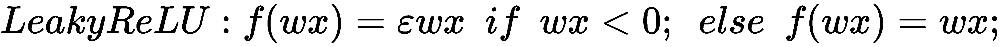

# 第九章：GANs - 攻击与防御

**生成对抗网络**（**GANs**）代表了深度学习在网络安全领域为我们提供的最先进的神经网络示例。GANs 可以用于合法目的，如身份验证程序，但它们也可以被利用来破坏这些程序。

在本章中，我们将讨论以下主题：

+   GANs 的基本概念及其在攻击和防御场景中的应用

+   开发对抗样本的主要库和工具

+   通过模型替代对**深度神经网络**（**DNNs**）的攻击

+   通过 GANs 对**入侵检测系统**（**IDS**）的攻击

+   利用对抗样本对面部识别程序的攻击

我们现在将通过介绍 GANs 的基本概念开始本章内容。

# GANs 简述

GANs 在 2014 年发表的一篇著名论文中被提出（[`arxiv.org/abs/1406.2661`](https://arxiv.org/abs/1406.2661)），该论文由包括 Ian Goodfellow 和 Yoshua Bengio 在内的研究团队撰写，描述了一种特殊类型对抗过程的潜力和特点，这种过程被称为 GANs。

GANs 背后的基本思想很简单，它们通过让两个神经网络相互竞争，直到达到一个平衡的结果条件；然而，与此同时，利用这些直觉的可能性几乎是无限的，因为 GANs 能够学习如何模仿并人工重现任何数据分布，无论是面孔、声音、文本，还是甚至是艺术作品。

在本章中，我们将扩展生成对抗网络（GANs）在网络安全领域的应用，了解如何利用它们同时进行攻击（例如针对基于生物特征识别的安全程序的攻击）以及保护神经网络免受通过 GANs 进行的攻击。为了全面理解 GANs 的特点和潜力，我们需要介绍一些关于**神经网络**（**NNs**）和**深度学习**（**DL**）的基本概念。

# 深度学习概述

我们在第四章《恶意软件威胁检测》和第六章《保护用户身份验证》中已经遇到过神经网络（NN）。现在，我们将通过更加系统化的方式进一步探讨深度学习（DL）。深度学习是**机器学习**（**ML**）的一个分支，旨在模仿人脑的认知能力，试图执行那些典型的高复杂度人类任务，如面部识别和语音识别。因此，深度学习旨在通过引入基于人工神经元的网络来模拟人脑的行为，这些神经元分布在多个层级并相互连接，并且这些层次的深度可以高或低，这也是“深度学习”这一术语中**深度**一词的由来。

深度学习和神经网络的概念并不新鲜，但仅在近年来，得益于数字架构领域的进展，它们才找到了实际的理论与实践应用，这一进展得到了计算能力的提升、分布式计算通过云计算的充分利用以及大数据分析所带来的几乎无限的训练数据的支持。

深度学习的潜力不仅在研究和商业领域得到了认可，还在网络安全领域得到了广泛应用。在网络安全中，越来越需要使用能够动态适应环境变化的解决方案，这些解决方案不仅采用静态检测工具，还能够动态学习如何自动识别新型攻击的算法，进而通过分析数据集中的代表性特征来发现可能的威胁，尤其是在这些数据集往往是噪声较多的情况下。

与传统的机器学习（ML）相比，从数学角度来看，深度学习也具有更高的复杂性，尤其是在广泛使用微积分和线性代数方面。然而，与机器学习相比，深度学习能够在准确性和算法在不同应用领域的潜在重用方面取得更好的结果。

通过使用互相连接的神经网络（NN）层，深度学习不仅限于分析原始数据集的特征，还能够通过创建新的特征重新组合这些数据，从而适应所需进行的分析的复杂性。

构成深度学习（DL）的人工神经网络层分析接收到的输入数据和特征，并将它们与各个内部层共享，这些内部层反过来处理外部层的输出数据。通过这种方式，从数据集中提取的原始特征被重新组合，产生新的特征，这些特征经过优化以供分析使用。

内部层之间的连接越多，深度和重新组合特征的能力越强，从而更好地适应问题的复杂性，将其分解为更具体、可管理的子任务。

我们已经提到，深度学习（DL）的构成元素是由人工神经元组成的神经网络（NN）层。现在，我们将更详细地研究这些构成元素的特点，从人工神经元开始。

# 人工神经元和激活函数

我们已经在第三章中遇到过一种特定类型的人工神经元——罗森布拉特的感知器，并且我们已经看到，这种人工神经元通过在超过阈值的正信号出现时自我激活，模拟了人类大脑中神经元的行为。

为了验证阈值以上是否存在正信号，使用了一个特殊的函数，称为**激活**函数，在感知器的情况下，具有以下特点：


在实际应用中，如果*wx*值的乘积——即输入数据与相应权重的乘积——超过某个阈值 ，则感知器被激活；否则，它保持静止。因此，激活函数的任务就是在验证某些条件后，决定是否激活人工神经元。

激活函数有不同的类型，但最常见的可能是**修正线性单元**（**ReLU**），在其最简单的版本中，假设将函数*max(0, wx)*应用于输入值（与相应的权重相乘），结果即为激活值。

从形式上看，这可以表示为以下方程：


还有一种变体被称为*LeakyReLU*，如以下方程所示：



与普通 ReLU 不同，激活函数的泄漏版本返回的是*wx*的软化值（对于*wx*的负值，而不是`0`），这个值是通过应用乘法常数 得到的，通常该常数的值较小，接近`0`（但不等于`0`）。

从数学角度看，ReLU 激活函数代表了一种非线性变换，将输入值与各自权重的乘积关系转化为非线性关系。

通过这种方式，我们能够逼近任何类型的行为，而不必将自己局限于简单的线性关系。我们在第六章《确保用户身份验证》中提到过这一点，当时我们介绍了名为*用户检测与多层感知器*的章节，展示了如何通过**多层感知器**（**MLP**）——由多个人工神经元组成的感知器层——克服单一感知器的局限性，通过在神经网络中引入足够数量的神经元来逼近任何连续的数学函数。这种逼近任何连续数学函数的能力正是神经网络的特征，这也决定了它们在学习方面的强大能力。

现在，让我们看看如何从单个人工神经元过渡到神经网络。

# 从人工神经元到神经网络

我们已经了解了人工神经元的特性以及激活函数执行的任务。接下来，让我们更深入地了解神经网络的特性。神经网络由多层神经元组成，这些神经元共同构成一个网络。神经网络还可以解释为人工神经元图，每个连接都有一个权重。

我们已经说过，通过向神经网络中添加足够数量的神经元，可以模拟任何连续数学函数的行为。实际上，神经网络不过是表示任意复杂度数学函数的一种替代方式。神经网络的强大之处在于它们能够通过创造新的特征来组装从数据集中提取的原始特征。

神经网络中会增加（隐藏层）层，以便执行这种特征组合。随着层数的增加，网络生成新特征的能力也得到了增强。必须特别关注神经网络的训练过程。

训练神经网络的最常见方法之一是**前向传播**。训练数据作为输入被送入网络的外层，外层将它们的部分处理输出传递给内层，依此类推。内层将对来自外层的输入数据进行处理，并将它们处理后的部分输出继续传递给后续层。

各层所执行的处理通常包括根据预期值评估与单个预测相关的权重的好坏。例如，在监督学习的情况下，我们已经提前知道标记样本的预期值，并根据所选的学习算法调整权重。这将导致一系列计算，通常通过表示与各层神经元相关的参数的偏导数来表示，这些计算需要在各个层中迭代执行，从而在计算上带来了相当大的负担。

随着神经网络中层数的增加，数据在网络中需要经历的步骤数呈指数级增长。为了理解这一点，可以想象一个神经元的输出经过 100 个神经元组成的内部层后，继续传递到另一个由 100 个神经元组成的层，依此类推，直到到达返回最终网络输出的外层神经元。

一种替代的训练策略，显著降低了计算负担，涉及**反向传播**。与其将从单层获得的部分输出传递到后续层，不如在各个层级上通过整合所获得的值来计算最终输出，通过记忆各个层级获得的输出值。这样，训练就受到将整个网络的输出反向传播的影响。不同于各个层返回的单一输出，权重会根据需要更新，以最小化错误率。

从数学角度看，**反向传播**是作为**矩阵**和**向量**的乘积（在计算上要求较低），而不是像前向传播那样进行**矩阵**–**矩阵乘法**（更多细节请参阅*Python 机器学习——第二版*，作者：Sebastian Raschka，Packt 出版）。

现在，让我们来看一下最常见的几种神经网络类型：

+   **前馈神经网络（FFNNs）**：FFNNs 代表了神经网络（NNs）的基本类型。每一层的神经元与下一层的一些（或所有）神经元相连接。FFNNs 的特点是各层之间的连接仅朝一个方向进行，并且没有循环或反向连接。

+   **循环神经网络（RNNs）**：这些网络的特点是神经元之间的连接形成有向循环，输入和输出都是时间序列。随着数据的积累和分析，RNNs 有助于识别数据中的模式，因此特别适用于执行动态任务，如语音识别和语言翻译。在网络流量分析和静态分析中，RNNs 在网络安全领域被广泛使用。一个 RNN 的例子是**长短期记忆（LSTM）**网络。

+   **卷积神经网络（CNNs）**：这些网络特别用于执行图像识别任务。CNNs 的特点是能够识别数据中特定特征的存在。构成 CNNs 的层与特定的过滤器相关联，这些过滤器表示感兴趣的特征（例如，表示图像中数字的一组像素）。这些过滤器具有相对于空间平移不变的特性，从而能够检测到搜索空间中不同区域中的感兴趣特征的存在（例如，在图像的不同区域中相同数字的存在）。CNN 的典型架构包括一系列**卷积层**、**激活层**、**池化层**和**全连接层**。池化层的功能是减小感兴趣特征的大小，以便在搜索空间内查找这些特征。


（*图片来源：https://commons.wikimedia.org/wiki/File:3_filters_in_a_Convolutional_Neural_Network.gif*）

在这对神经网络的快速回顾之后，我们现在准备认识 GANs。

# 认识 GANs

我们已经提到，GANs 的基本直觉是让两个神经网络相互竞争，以改进总体结果。术语**对抗**特指这两个神经网络在完成各自任务时相互竞争。这种竞争的结果是一个无法进一步改进的整体结果，从而达到平衡条件。

使用 GANs 的典型例子是实现一个名为**生成网络**的特定神经网络，其任务是创建模拟真实图像特征的人工图像。第二个神经网络称为**判别网络**，与生成网络竞争，以区分人工模拟图像与真实图像。

一个有趣的方面是，这两个网络通过实现一种平衡状态（无差异状态）进行协作，它们各自的目标函数优化彼此竞争。生成网络将其优化过程建立在欺骗判别网络的能力上。

判别网络则基于在区分真实图像和由生成网络人工生成的图像时所达到的准确度，执行其优化过程。现在，让我们更详细地看一下这两个神经网络之间的差异。

# 生成网络与判别网络

理解生成对抗网络（GAN）中各个神经网络（NN）任务的一种直观方式是考虑这样一个场景：判别网络试图正确分类由生成网络人工生成的垃圾邮件。为了展示每个神经网络必须优化的不同目标函数，我们将借助条件概率（这是贝叶斯定理的基础），这一概念我们已经在第三章，*垃圾邮件还是正常邮件？利用人工智能检测电子邮件网络安全威胁*一节中的*朴素贝叶斯垃圾邮件检测*部分遇到过。

我们定义*`P`*(*`S`*|*`W`*)为给定电子邮件消息表示垃圾邮件（*`S`*）的概率，该概率基于文本中出现可疑词汇（*`W`*）。因此，判别网络的任务是正确估计与每封分析过的电子邮件相关的概率*`P`*(*`S`*|*`W`*).

对称地，生成网络的任务正好相反：即估计概率*`P`*(*`W`*|*`S`*)——也就是说，给定一条垃圾邮件，文本中包含可疑词汇（*`W`*）的可能性有多大。你会从条件概率理论中回忆到，*`P`*(*`S`*|*`W`*)的值与*`P`*(*`W`*|*`S`*)的值不同，因此这两个神经网络有不同的目标函数需要优化，即使它们是相关的。

因此，判别网络将寻求优化其目标函数，该函数涉及通过正确分类由生成网络人工生成的垃圾邮件，来适当地估计概率*`P`*(*`S`*|*`W`*)，而生成网络通过根据每条邮件的概率*`P`*(*`W`*|*`S`*)生成垃圾邮件，从而优化其目标函数。生成网络接着将尝试模拟垃圾邮件，试图欺骗判别网络。同时，判别网络则试图正确识别真实的垃圾邮件，将其与生成网络人工创建的邮件区分开来，通过与先前已分类的真实垃圾邮件样本进行比较。

两个网络通过相互作用进行学习。生成网络生成的虚假垃圾邮件被作为输入传递给判别网络，判别网络将它们与真实垃圾邮件一起分析，逐步细化由*`P`*(*`S`*|*`W`*) 估计值组成的概率估计。这建立了两个神经网络之间的共生关系，在这种关系中，两个网络都试图优化各自的对立目标函数。

这种情况被博弈论定义为**零和博弈**，而逐步达成的动态平衡，结束了两个网络的优化过程，这就是**纳什均衡**。

# 纳什均衡

在博弈论的数学理论中，纳什均衡被定义为两个竞争玩家将各自的游戏策略视为他们可以选择的最佳选项的条件。这种平衡状态是玩家通过反复进行博弈学习的结果。

在纳什均衡条件下，每个玩家将选择执行相同的动作，并且不会做出修改。

确定这种平衡的条件是特别严格的。事实上，它们意味着以下几点：

+   所有玩家都是理性的（也就是说，他们必须最大化自己的目标函数）

+   所有玩家都知道其他玩家也是理性的，并且知道各自需要最大化的目标函数

+   所有玩家同时进行博弈，而不了解其他玩家做出的选择

现在，让我们来看一下如何用数学术语表示 GAN。

# GAN 背后的数学

我们已经说过，GAN 的目的是实现两个神经网络之间的平衡状态。寻找这个平衡涉及到解决以下方程式，这是一个极小极大条件：


从前面的公式中，你可以看到定义两个神经网络的对抗目标。我们试图最大化`D`，同时最小化`G`。换句话说，代表判别器的神经网络`D`旨在最大化方程式，这转化为最大化与真实样本相关的输出，同时最小化与虚假样本相关的输出。另一方面，代表生成器的神经网络`G`有相反的目标，即最小化`G`的失败次数，从而最大化`D`在面对虚假样本时返回的输出。

GAN 的总体目标是在零和博弈（纳什均衡）中实现平衡，这种平衡特征是一个无差别的条件，其中`D`的输出将是每个分类样本分配的 50%的概率估计。换句话说，判别器不能可靠地区分真实样本和虚假样本。

# 如何训练 GAN

训练 GAN 可能需要较高的计算能力；否则，进行训练所需的时间可能从几小时到几天不等。由于两个神经网络之间的相互依赖，建议在训练判别器网络时保持生成器网络返回的值不变。与此同时，使用可用的训练数据对判别器网络进行预训练，再训练生成器网络也是一种有益的做法。

同时，合理设置两个神经网络的学习率也非常重要，以避免判别器网络的学习率超过生成器网络的学习率，反之亦然，从而防止各自的神经网络未能实现其优化目标。

# 一个 GAN 的示例–模拟 MNIST 手写数字

在下面的示例中，改编自原始代码，原始代码可在[`github.com/eriklindernoren/ML-From-Scratch/blob/master/mlfromscratch/unsupervised_learning/generative_adversarial_network.py`](https://github.com/eriklindernoren/ML-From-Scratch/blob/master/mlfromscratch/unsupervised_learning/generative_adversarial_network.py)找到（根据 MIT 许可证发布，详情见[`github.com/eriklindernoren/ML-From-Scratch/blob/master/LICENSE`](https://github.com/eriklindernoren/ML-From-Scratch/blob/master/LICENSE)），我们看到一个 GAN 的示例，它能够通过一些输入噪声，生成与 MNIST 数据集中的手写数字图像相似的图像（MNIST 数据集可在[`yann.lecun.com/exdb/mnist/`](http://yann.lecun.com/exdb/mnist/)下载）。

GAN 的神经网络的激活函数，由`build_generator()`和`build_discriminator()`函数实现，都基于 Leaky ReLU（为了提高 GAN 的稳定性，避免稀疏梯度的影响）。

我们将通过利用`random`库中的`normal()`函数来使用样本噪声作为生成器输入，如下所示：

```py
noise = np.random.normal(0, 1, (half_batch, self.latent_dim))
```

两个神经网络的训练阶段通过`train()`方法实现：

```py
train(self, n_epochs, batch_size=128, save_interval=50)
```

最后，在`train()`方法中，两个神经网络之间的联系非常明显：

```py
# The generator wants the discriminator to label the generated samples as valid

valid = np.concatenate((np.ones((batch_size, 1)), np.zeros((batch_size, 1))), axis=1)

# Train the generator
g_loss, g_acc = self.combined.train_on_batch(noise, valid)
```

在下面的图像中，我们可以看到生成对抗网络（GAN）在不同训练周期中的逐步学习进程。GAN 在生成数字图像代表的过程中所取得的进展是显而易见的：


以下是代码示例，改编自原始代码，原始代码可在[`github.com/eriklindernoren/ML-From-Scratch/blob/master/mlfromscratch/unsupervised_learning/generative_adversarial_network.py`](https://github.com/eriklindernoren/ML-From-Scratch/blob/master/mlfromscratch/unsupervised_learning/generative_adversarial_network.py)找到（根据 MIT 许可证发布，详情见[`github.com/eriklindernoren/ML-From-Scratch/blob/master/LICENSE`](https://github.com/eriklindernoren/ML-From-Scratch/blob/master/LICENSE)）：

```py
from __future__ import print_function, division
from sklearn import datasets
import math
import matplotlib.pyplot as plt
import numpy as np
import progressbar

from sklearn.datasets import fetch_openml
from mlxtend.data import loadlocal_mnist

from mlfromscratch.deep_learning.optimizers import Adam
from mlfromscratch.deep_learning.loss_functions import CrossEntropy
from mlfromscratch.deep_learning.layers import Dense, Dropout, Flatten, Activation, Reshape, BatchNormalization
from mlfromscratch.deep_learning import NeuralNetwork

```

在导入必要的库之后，我们现在可以着手定义`GAN`类，该类实现了我们的生成对抗网络（GAN），并以生成器和判别器组件的形式部署了深度全连接神经网络，这些组件在类构造函数（`__init__()`方法）中实例化：

```py
class GAN():

    def __init__(self):
        self.img_rows = 28 
        self.img_cols = 28
        self.img_dim = self.img_rows * self.img_cols
        self.latent_dim = 100

        optimizer = Adam(learning_rate=0.0002, b1=0.5)
        loss_function = CrossEntropy

        # Build the discriminator
        self.discriminator = self.build_discriminator(optimizer, loss_function)

        # Build the generator
        self.generator = self.build_generator(optimizer, loss_function)

        # Build the combined model
        self.combined = NeuralNetwork(optimizer=optimizer, loss=loss_function)
        self.combined.layers.extend(self.generator.layers)
        self.combined.layers.extend(self.discriminator.layers)

        print ()
        self.generator.summary(name="Generator")
        self.discriminator.summary(name="Discriminator")

```

生成器和判别器组件分别在`build_generator()`和`build_discriminator()`类方法中定义：

```py
    def build_generator(self, optimizer, loss_function):

        model = NeuralNetwork(optimizer=optimizer, loss=loss_function)

        model.add(Dense(256, input_shape=(self.latent_dim,)))
        model.add(Activation('leaky_relu'))
        model.add(BatchNormalization(momentum=0.8))
        model.add(Dense(512))
        model.add(Activation('leaky_relu'))
        model.add(BatchNormalization(momentum=0.8))
        model.add(Dense(1024))
        model.add(Activation('leaky_relu'))
        model.add(BatchNormalization(momentum=0.8))
        model.add(Dense(self.img_dim))
        model.add(Activation('tanh'))

        return model

    def build_discriminator(self, optimizer, loss_function):

        model = NeuralNetwork(optimizer=optimizer, loss=loss_function)

        model.add(Dense(512, input_shape=(self.img_dim,)))
        model.add(Activation('leaky_relu'))
        model.add(Dropout(0.5))
        model.add(Dense(256))
        model.add(Activation('leaky_relu'))
        model.add(Dropout(0.5))
        model.add(Dense(2))
        model.add(Activation('softmax'))

        return model
```

为了训练 GAN，我们定义了`train()`类方法，负责训练生成器和判别器组件：

```py
    def train(self, n_epochs, batch_size=128, save_interval=50):  

        X, y = loadlocal_mnist(images_path='./MNIST/train-images.idx3-ubyte', labels_path='./MNIST/train-labels.idx1-ubyte')  

        # Rescale [-1, 1]
        X = (X.astype(np.float32) - 127.5) / 127.5

        half_batch = int(batch_size / 2)

        for epoch in range(n_epochs):

            # ---------------------
            #  Train Discriminator
            # ---------------------

            self.discriminator.set_trainable(True)

            # Select a random half batch of images
            idx = np.random.randint(0, X.shape[0], half_batch)
            imgs = X[idx]

            # Sample noise to use as generator input
            noise = np.random.normal(0, 1, (half_batch, self.latent_dim))

            # Generate a half batch of images
            gen_imgs = self.generator.predict(noise)

            # Valid = [1, 0], Fake = [0, 1]
            valid = np.concatenate((np.ones((half_batch, 1)), np.zeros((half_batch, 1))), axis=1)
            fake = np.concatenate((np.zeros((half_batch, 1)), np.ones((half_batch, 1))), axis=1)

            # Train the discriminator
            d_loss_real, d_acc_real = self.discriminator.train_on_batch(imgs, valid)
            d_loss_fake, d_acc_fake = self.discriminator.train_on_batch(gen_imgs, fake)
            d_loss = 0.5 * (d_loss_real + d_loss_fake)
            d_acc = 0.5 * (d_acc_real + d_acc_fake)

            # ---------------------
            #  Train Generator
            # ---------------------

            # We only want to train the generator for the combined model
            self.discriminator.set_trainable(False)

            # Sample noise and use as generator input
            noise = np.random.normal(0, 1, (batch_size, self.latent_dim))

            # The generator wants the discriminator to label the generated samples as valid
            valid = np.concatenate((np.ones((batch_size, 1)), np.zeros((batch_size, 1))), axis=1)

            # Train the generator
            g_loss, g_acc = self.combined.train_on_batch(noise, valid)

            # Display the progress
            print ("%d [D loss: %f, acc: %.2f%%] [G loss: %f, acc: %.2f%%]" % (epoch, d_loss, 100*d_acc, g_loss, 100*g_acc))

            # If at save interval => save generated image samples
            if epoch % save_interval == 0:
                self.save_imgs(epoch)
```

在训练完 GAN 后，我们可以通过`save_imgs()`类方法保存新创建的对抗样本图像，该方法定义如下：

```py
    def save_imgs(self, epoch):
        r, c = 5, 5 # Grid size
        noise = np.random.normal(0, 1, (r * c, self.latent_dim))
        # Generate images and reshape to image shape
        gen_imgs = self.generator.predict(noise).reshape((-1, self.img_rows, self.img_cols))

        # Rescale images 0 - 1
        gen_imgs = 0.5 * gen_imgs + 0.5

        fig, axs = plt.subplots(r, c)
        plt.suptitle("Generative Adversarial Network")
        cnt = 0
        for i in range(r):
            for j in range(c):
                axs[i,j].imshow(gen_imgs[cnt,:,:], cmap='gray')
                axs[i,j].axis('off')
                cnt += 1
        fig.savefig("mnist_%d.png" % epoch)
        plt.close()

```

要启动脚本，我们只需如下定义`__main__`入口点：

```py
if __name__ == '__main__':

    gan = GAN()
    gan.train(n_epochs=200000, batch_size=64, save_interval=400)

```

现在，让我们继续看看用 Python 开发的 GAN 工具和库。

# GAN Python 工具和库

用于开发对抗样本的工具和库（无论是进行攻击还是防御）不断增多。我们将查看其中一些最常见的示例。在本节中，我们将整合常用的库和工具，接下来的章节将分别讨论基于不同攻击和防御策略与场景的特定库和工具。

为了充分理解这些工具和库的实用性，我们需要分析基于神经网络的网络安全解决方案的脆弱性、实施攻击的可能性，以及准备适当防御措施的难度。

# 神经网络的脆弱性

尽管正如我们之前所看到的，神经网络（NN）近年来因其在解决通常是人类认知能力专属的复杂问题（如面部识别和语音识别）时展现出的巨大潜力，已获得了特别关注，神经网络，尤其是深度神经网络（DNN），仍然存在一些相当重要的脆弱性，这些脆弱性可以通过生成对抗网络（GAN）加以利用。这意味着，举例来说，可能会通过人工创建对抗样本来欺骗基于面部识别或其他生物特征的生物认证程序。

显然无害的设备，如 3D 医学影像扫描仪，已被用作攻击载体，正如最近一篇论文所示，*CT-GAN: 使用深度学习恶意篡改 3D 医学影像*，作者为以色列本·古里安大学信息系统工程系、Soroka 大学医学中心的 Yisroel Mirsky、Tom Mahler、Ilan Shelef 和 Yuval Elovici（arXiv: 1901.03597v2）。

在这项研究中，作者集中研究了如何将癌症图像注入和移除 CT 扫描，展示了深度神经网络（DNN）对攻击的高度脆弱性。

通过添加虚假证据或删除一些真实的医学图像证据，攻击者如果能访问到医学影像，可以改变患者的诊断结果。

例如，攻击者可以添加或删除脑动脉瘤、脑肿瘤以及其他病理证据，如心脏病的证据。这种类型的威胁展示了 DNN 在处理敏感信息（如健康状况信息）时如何通过几个数量级的扩展攻击面，甚至可能涉及犯罪，如谋杀，且不需要攻击者亲自参与，只需利用数字设备和程序的漏洞作为**无菌**攻击向量。

从我们所说的内容中，我们可以轻松理解深度神经网络（DNN）在面对对抗性攻击时缺乏鲁棒性所带来的严重性，这可能决定了程序及其依赖应用的妥协性。

然而，在利用 DNN 的应用中，也有一些关键任务应用（例如那些管理自动驾驶汽车功能的应用）。

# 深度神经网络攻击

对 DNN 进行攻击的基本方法有两种：

+   **白盒攻击**：这种攻击假设 DNN 目标模型具有透明性，允许直接验证对抗性示例对响应的敏感性。

+   **黑盒攻击**：与前一种情况不同，对抗性示例的敏感性检查是间接实现的，因为无法获得目标神经网络的配置细节；唯一可用的信息是神经网络对发送给它们的相应输入返回的输出值。

无论攻击类型如何，攻击者总是能够利用一些关于神经网络的一般特性。如我们所见，最广泛的对抗性攻击之一是那些旨在欺骗图像分类算法的攻击，利用人工创建的图像样本。因此，考虑到图像分类应用更倾向于使用**卷积神经网络**（**CNN**），攻击者将更加专注于这种神经网络的漏洞进行攻击。

即使是 DNN 使用的学习策略也可以间接构成攻击向量。我们之前已经看到，反向传播技术因其在计算上的更高效率而被优先用于训练算法。了解这一优先学习选择后，攻击者可以反过来利用梯度下降等算法攻击 DNN，假设反向传播策略允许计算整个 DNN 返回输出的梯度。

# 对抗性攻击方法

以下是一些最常用的对抗攻击开发方法：

+   **快速梯度符号方法**（**FGSM**）：为了生成对抗样本，这种方法利用与 DNN 受害者反向传播方法相关的梯度符号。

+   **基于雅可比矩阵的显著性图攻击**（**JSMA**）：这种攻击方法通过迭代修改信息（例如图像中最显著的像素）来创建对抗样本，基于一个 JSMA 来描述输入和目标神经网络返回输出之间的现有关系。

+   **Carlini 和 Wagner**（**C 和 W**）：这种对抗攻击方法可能是最可靠且最难检测的。对抗攻击被视为一个优化问题，使用预定义的度量（例如欧几里得距离）来确定原始样本与对抗样本之间的差距。

然而，对抗样本也表现出一个有趣的特点：**攻击可转移性**。

# 对抗攻击的可转移性

对抗攻击的一个典型特点与其**可转移性**有关。

这一特点指的是，针对某个特定 DNN 生成的对抗样本，可能也能转移到另一个 DNN，因为神经网络具有很高的泛化能力，这正是它们的优势（但同时也是它们的脆弱性）。

利用对抗攻击的可转移性，攻击者能够创建可重用的对抗样本，而无需知道神经网络的个别配置的确切参数。

因此，很可能一组成功欺骗特定 DNN 进行图像分类的对抗样本，能够被用来欺骗其他具有相似分类任务的神经网络。

# 防御对抗攻击

随着对抗攻击的传播，已经有许多尝试提供适当的防御措施，主要基于以下几种方法：

+   **基于统计的检测防御**：这种方法通过利用统计测试和异常值检测来尝试检测对抗样本的存在。它假设描述真实样本和对抗样本的统计分布在根本上是不同的。然而，C 和 W 攻击方法的有效性表明，这一假设并不是显而易见或可靠的。

+   **梯度遮蔽防御**：我们已经看到对抗攻击如何利用大多数深度神经网络（DNN）采用的反向传播优化策略，并依赖于目标神经网络执行的梯度计算信息。梯度遮蔽防御因此涉及在神经网络训练过程中隐藏与梯度相关的信息。

+   **对抗训练防御**：这种防御方法旨在通过将对抗样本和真实样本插入训练数据集中，使学习算法对可能出现在训练数据中的扰动更加鲁棒。这种防御方法似乎对 C 和 W 对抗攻击最为有效。然而，它也有一定的代价，涉及网络复杂性的增加和模型参数的增加。

现在，DNN 的脆弱性以及对抗攻击和防御方法已被介绍，我们可以分析开发对抗样本时使用的主要库。

# CleverHans 对抗样本库

当前备受关注的 Python 库之一无疑是 CleverHans 库，它通常是开发对抗样本的其他库和工具的基础。

CleverHans 库可以在[`github.com/tensorflow/cleverhans`](https://github.com/tensorflow/cleverhans)找到，并根据 MIT 许可证发布（[`github.com/tensorflow/cleverhans/blob/master/LICENSE`](https://github.com/tensorflow/cleverhans/blob/master/LICENSE)）。

该库特别适合构建攻击、搭建防御措施，以及基准测试机器学习系统对对抗攻击的脆弱性。

要安装 CleverHans 库，我们必须首先安装 TensorFlow 库（[`www.tensorflow.org/install/`](https://www.tensorflow.org/install/)），该库用于执行学习模型实现所需的图计算。

安装 TensorFlow 后，我们可以使用常规命令安装 CleverHans：

```py
pip install cleverhans
```

CleverHans 库的众多优点之一是它提供了多个示例和教程，展示了使用不同方法通过模型开发对抗样本的过程。

特别是，CleverHans 库为我们提供了以下教程（基于 MNIST 手写数字训练数据集，数据集可以在[`yann.lecun.com/exdb/mnist/`](http://yann.lecun.com/exdb/mnist/)下载）：

+   **使用 FGSM 的 MNIST**：本教程介绍了如何训练 MNIST 模型，利用 FGSM 制作对抗样本，并通过对抗训练使模型对对抗样本更加鲁棒。

+   **使用 JSMA 的 MNIST**：本教程介绍了如何定义一个 MNIST 模型，通过 JSMA 方法制作对抗样本。

+   **使用黑盒攻击的 MNIST**：本教程实现了一种基于对抗训练的替代模型的黑盒攻击（即通过观察黑盒模型为精心挑选的输入分配的标签，来模仿黑盒模型的副本）。对抗者然后使用替代模型的梯度来查找那些被黑盒模型错误分类的对抗样本。

在本章中，我们将遇到一些使用 CleverHans 库开发对抗性攻击和防御场景的示例。

# EvadeML-Zoo 对抗性示例库

另一个特别值得关注的库是 EvadeML-Zoo。EvadeML-Zoo 是一个用于对抗性机器学习的基准测试和可视化工具，由弗吉尼亚大学的机器学习小组和安全研究小组开发。

EvadeML-Zoo 采用 MIT 许可证发布（[`github.com/mzweilin/EvadeML-Zoo/blob/master/LICENSE`](https://github.com/mzweilin/EvadeML-Zoo/blob/master/LICENSE)），并可在 [`github.com/mzweilin/EvadeML-Zoo`](https://github.com/mzweilin/EvadeML-Zoo) 免费下载。

EvadeML-Zoo 库提供了一系列工具和模型，包括以下内容：

+   攻击方法如 FGSM、BIM、JSMA、Deepfool、Universal Perturbations 和 Carlini/Wagner-L2/Li/L0

+   用于攻击的最先进的预训练模型

+   对抗性示例的可视化

+   防御方法

+   几个现成的可用数据集，如 MNIST、CIFAR-10 和 ImageNet-ILSVRC

下载完包后，你可以使用以下命令在只使用 CPU 的机器上安装 EvadeML-Zoo 库：

```py
pip install -r requirements_cpu.txt
```

此外，如果你有兼容的 GPU 可用，可以执行以下命令：

```py
pip install -r requirements_gpu.txt
```

我们已经看到，EvadeML-Zoo 库提供的功能还包括预训练模型，这对于加速对抗性示例的开发过程尤其有用，而这些示例通常在计算上非常消耗资源。

要下载预训练模型，请运行以下命令：

```py
mkdir downloads; curl -sL https://github.com/mzweilin/EvadeML-Zoo/releases/download/v0.1/downloads.tar.gz | tar xzv -C downloads
```

EvadeML-Zoo 库的另一个有趣特点是，它可以通过运行 `main.py` 工具来执行。

在以下代码块中，你可以看到 `main.py` 的使用菜单，并附带了工具执行的示例：

```py
usage: python main.py [-h] [--dataset_name DATASET_NAME] [--model_name MODEL_NAME]
 [--select [SELECT]] [--noselect] [--nb_examples NB_EXAMPLES]
 [--balance_sampling [BALANCE_SAMPLING]] [--nobalance_sampling]
 [--test_mode [TEST_MODE]] [--notest_mode] [--attacks ATTACKS]
 [--clip CLIP] [--visualize [VISUALIZE]] [--novisualize]
 [--robustness ROBUSTNESS] [--detection DETECTION]
 [--detection_train_test_mode [DETECTION_TRAIN_TEST_MODE]]
 [--nodetection_train_test_mode] [--result_folder RESULT_FOLDER]
 [--verbose [VERBOSE]] [--noverbose]

 optional arguments:
 -h, --help            show this help message and exit
 --dataset_name DATASET_NAME
 Supported: MNIST, CIFAR-10, ImageNet, SVHN.
 --model_name MODEL_NAME
 Supported: cleverhans, cleverhans_adv_trained and
 carlini for MNIST; carlini and DenseNet for CIFAR-10;
 ResNet50, VGG19, Inceptionv3 and MobileNet for
 ImageNet; tohinz for SVHN.
 --select [SELECT]     Select correctly classified examples for the
 experiment.
 --noselect
 --nb_examples NB_EXAMPLES
 The number of examples selected for attacks.
 --balance_sampling [BALANCE_SAMPLING]
 Select the same number of examples for each class.
 --nobalance_sampling
 --test_mode [TEST_MODE]
 Only select one sample for each class.
 --notest_mode
 --attacks ATTACKS     Attack name and parameters in URL style, separated by
 semicolon.
 --clip CLIP           L-infinity clip on the adversarial perturbations.
 --visualize [VISUALIZE]
 Output the image examples for each attack, enabled by
 default.
 --novisualize
 --robustness ROBUSTNESS
 Supported: FeatureSqueezing.
 --detection DETECTION
 Supported: feature_squeezing.
 --detection_train_test_mode [DETECTION_TRAIN_TEST_MODE]
 Split into train/test datasets.
 --nodetection_train_test_mode
 --result_folder RESULT_FOLDER
 The output folder for results.
 --verbose [VERBOSE]   Stdout level. The hidden content will be saved to log
 files anyway.
 --noverbose
```

EvadeML-Zoo 库使用 Carlini 模型和对 MNIST 数据集的 FGSM 对抗性攻击进行执行，具体如下：

```py
python main.py --dataset_name MNIST --model_name carlini \
 --nb_examples 2000 --balance_sampling \
 --attacks "FGSM?eps=0.1;" \
 --robustness "none;FeatureSqueezing?squeezer=bit_depth_1;" \
 --detection "FeatureSqueezing?squeezers=bit_depth_1,median_filter_2_2&distance_measure=l1&fpr=0.05;"

Defense-GAN library
```

最后，我们将学习如何使用 `Defense-GAN` 库开发对抗性攻击的防御模型。

在分析 Defense-GAN 库的详细信息之前，让我们先尝试理解它所基于的假设，以及它提供的功能，以实现有效的对抗性攻击防御。

正如我们所见，对抗性攻击可以分为白盒攻击和黑盒攻击；在白盒攻击的情况下，攻击者可以完全访问模型的架构和参数，而在黑盒攻击的情况下，攻击者无法访问模型参数。

我们还知道，许多防御对抗攻击的方法已经被提出，这些方法本质上基于区分对抗样本与真实样本的统计分布（统计检测），基于隐藏与神经网络学习阶段相关的敏感信息（梯度掩蔽），或者基于使用对抗样本与其他训练样本一起训练学习算法（对抗训练）。

所有这些防御方法都有一定的局限性，因为它们只能有效防御白盒攻击或黑盒攻击，但不能同时防御两者。

Defense-GAN 可以作为对抗任何攻击的防御工具，因为它不假设攻击模型，而是简单地利用 GAN 的生成能力来重构对抗样本。

Defense-GAN 提出了一种新的防御策略，该策略基于一个无监督训练的 GAN，在合法（未扰动）训练样本上进行训练，以去噪对抗样本。

Defense-GAN 库是根据 Apache 2.0 许可证发布的 ([`github.com/kabkabm/defensegan/blob/master/LICENSE`](https://github.com/kabkabm/defensegan/blob/master/LICENSE))，并可以在 [`github.com/kabkabm/defensegan`](https://github.com/kabkabm/defensegan) 上免费下载。

下载库后，您可以通过启动以下命令来安装它：

```py
pip install -r requirements.txt
```

要下载数据集并准备数据目录，请使用以下命令启动 `download_dataset.py` Python 脚本：

```py
python download_dataset.py [mnist|f-mnist|celeba]
```

通过启动 `train.py` 脚本来训练 GAN 模型：

```py
python train.py --cfg  --is_train

 --cfg This can be set to either a .yml configuration file like the ones in experiments/cfgs, or an output directory path.
 can be any parameter that is defined in the config file.
```

脚本执行将创建：

+   每个实验的目录都位于输出目录中，并与保存模型检查点的目录同名。

+   每个实验目录中都会保存一个配置文件，以便可以加载该目录的地址。

+   每个实验的训练目录都位于输出目录中，并与保存模型检查点的目录同名。

+   每个实验目录中都会保存一个训练配置文件，以便可以加载该目录的地址。

Defense-GAN 库还提供了一些工具，您可以用来实验不同的攻击模式，从而验证防御模型的有效性。

要执行黑盒攻击，我们可以启动 `blackbox.py` 工具：

```py
python blackbox.py --cfg  \
     --results_dir  \
     --bb_model {A, B, C, D, E} \
     --sub_model {A, B, C, D, E} \
     --fgsm_eps  \
     --defense_type {none|defense_gan|adv_tr}
     [--train_on_recs or --online_training]  
```

让我们来看一下这里的每个参数：

+   `--cfg` 参数是用于训练 iWGAN 的配置文件路径。这也可以是模型输出目录的路径。

+   `--results_dir` 参数是保存最终结果文本文件的路径。

+   `--bb_model` 参数表示在表格 1 和 2 中使用的黑盒模型架构。

+   `--sub_model` 参数表示在表格 1 和 2 中使用的替代模型架构。

+   `--defense_type` 参数指定保护分类器的防御类型。

+   `--train_on_recs`和`--online_training`参数是可选的。如果设置了这些参数，分类器将基于 Defense-GAN 的重构结果进行训练（例如，表 1 和表 2 中的`Defense-GAN-Rec`列）；否则，结果将是`Defense-GAN-Orig`的结果。请注意，如果设置了`--rec_iters`或论文中的`L`为较大的值，`--online_training`将需要一些时间。

还有一份`--`参数列表，与配置文件中定义的超参数（均为小写）相同，并列出了`blackbox.py`中的标志。最重要的几个如下：

+   `--rec_iters`: Defense-GAN 的**梯度下降**（**GD**）重构迭代次数，或论文中的`L`。

+   `--rec_lr`: 重构步骤的学习率。

+   `--rec_rr`: 重构步骤的随机重启次数，或论文中的`R`。

+   `--num_train`: 用于训练黑盒模型的图像数量。为了调试，设置一个较小的值。

+   `--num_test`: 测试图像的数量。为了调试，设置一个较小的值。

+   `--debug`: 该选项将把定性攻击和重构结果保存到调试目录，并且不会运行代码中的对抗攻击部分。

带参数的`blackbox.py`执行示例如下：

```py
python blackbox.py --cfg output/gans/mnist \
 --results_dir defensegan \
 --bb_model A \
 --sub_model B \
 --fgsm_eps 0.3 \
 --defense_type defense_gan
```

我们当然可以通过启动`whitebox.py`工具，测试 Defense-GAN 对抗白盒攻击：

```py
python whitebox.py --cfg  \
        --results_dir  \
        --attack_type {fgsm, rand_fgsm, cw} \
        --defense_type {none|defense_gan|adv_tr} \
        --model {A, B, C, D} \
        [--train_on_recs or --online_training]

```

带参数的`whitebox.py`执行示例如下：

```py
python whitebox.py --cfg  \
        --results_dir whitebox \
        --attack_type fgsm \
        --defense_type defense_gan \
        --model A
```

至于`blackbox.py`，还有一份`--`参数列表，与配置文件中定义的超参数（均为小写）相同，并列出了`whitebox.py`中的标志。最重要的几个如下：

+   `--rec_iters`: Defense-GAN 的 GD 重构迭代次数，或论文中的`L`。

+   `--rec_lr`: 重构步骤的学习率。

+   `--rec_rr`: 重构步骤的随机重启次数，或论文中的`R`。

+   `--num_test`: 测试图像的数量。为了调试，设置一个较小的值。

现在让我们继续看看如何通过模型替代来对神经网络进行攻击。

# 通过模型替代进行网络攻击

在黑盒模式下进行对抗攻击所展现的潜力的一个有趣示例是论文*Practical Black-Box Attacks against Machine Learning*（arXiv: 1602.02697v4）中描述的内容，其中展示了对远程托管的深度神经网络进行攻击的可能性，而攻击者并不知道目标神经网络的配置特征。

在这些情况下，攻击者唯一可用的信息是神经网络根据攻击者提供的输入类型返回的输出。实际上，攻击者观察到 DNN 在针对攻击输入时返回的分类标签。正是在这里，攻击策略变得有趣。实际上，本地替代模型是用一个对抗模型合成生成的输入，并由目标神经网络标记训练的，以代替远程托管的神经网络。

由 MetaMind 托管的神经网络作为远程托管网络目标，公开了一个互联网 DL API。通过将攻击示例提交到托管网络，作者验证了在本地替代模型上训练的对抗示例，RNN 错误地分类了超过 80%的对抗示例。此外，这一攻击策略也在亚马逊和谷歌提供的类似在线服务上进行验证，结果更为糟糕，误分类率高达 96%。

通过这种方式，作者证明了他们的黑盒对抗攻击策略具有普遍有效性，而不仅仅局限于特定选择的目标神经网络。获得的结果还证明了**对抗攻击可转移性**原理的有效性，使用在本地模型上测试的合成数据集。攻击者实际上是通过充分逼近特征来替代本地模型，用目标模型来替代本地模型，从而能够利用本地模型识别到的漏洞攻击目标模型。

因此，基于模型替代的对抗攻击方法的关键要素是替代模型训练和合成数据集生成。

让我们更仔细地看一下这两个特性。

# 替代模型训练

如我们之前所说，基于模型替代的对抗攻击方法旨在训练一个**替代模型**，该模型与原始目标神经网络相似，以便找到目标神经网络上的可行漏洞。

因此，替代模型的训练阶段具有一些重要的特殊性，涉及以下内容：

+   在没有目标模型知识的情况下选择替代模型的架构

+   限制对目标模型进行查询的次数，以确保该方法可操作

为了应对这些困难的任务，提出的攻击策略基于合成数据的生成（使用一种称为**雅可比矩阵数据增强**的技术）。

# 生成合成数据集

合成数据集生成中的方法在基于模型替代的攻击策略中至关重要。

要理解这一点，你只需要考虑这样一个事实：尽管原则上可以对目标模型进行无限次（甚至是无限数量的）不同查询（以验证目标模型针对每个查询输入生成的输出），但从实际角度来看，这种方法是不可行的。

首先，它是不可持续的，因为大量的查询会使对抗性攻击容易被检测到，而且它也不可持续，因为我们需要根据目标神经网络的潜在输入组件数量，增加发送到目标模型的请求数量。

替代方案涉及使用合适的启发式方法生成合成数据集，基于识别目标模型输出中方向在初始训练点集周围的变化。这些方向通过替代模型的雅可比矩阵来识别，以便通过优先选择样本并在查询目标模型标签时准确地逼近目标模型的决策边界。

# 用 MalGAN 欺骗恶意软件检测器

黑盒对抗性攻击策略同样可以有效地用来欺骗基于神经网络的下一代反恶意软件系统。

一个有用的库，用于开发带有恶意软件示例的黑盒对抗性攻击是 MalGAN，可以从[`github.com/yanminglai/Malware-GAN/`](https://github.com/yanminglai/Malware-GAN/)下载，并且遵循 GPL 3.0 许可证（[`github.com/yanminglai/Malware-GAN/blob/master/LICENSE`](https://github.com/yanminglai/Malware-GAN/blob/master/LICENSE)）。MalGAN 背后的基本思想是使用 GAN 生成对抗性的恶意软件示例，这些示例能够绕过基于机器学习的黑盒检测模型。要安装 MalGAN 库，你需要安装 TensorFlow 1.80、Keras 2.0 和 Cuckoo Sandbox 2.03（[`cuckoo.readthedocs.io/en/2.0.3/`](https://cuckoo.readthedocs.io/en/2.0.3/)）库。Cuckoo Sandbox 用于从[`virusshare.com/`](https://virusshare.com/)获取的恶意软件样本中提取 API 特征（选择 128 个 API 特征作为维度向量输入神经网络）。

以下是主 MalGAN 类（版本 2）的代码：

```py
"""
 MalGAN v2 Class definition
 https://github.com/yanminglai/Malware-GAN/blob/master/MalGAN_v2.py
 Released under GPL 3.0 LICENSE: https://github.com/yanminglai/Malware-GAN/blob/master/LICENSE  

 """

 from keras.layers import Input, Dense, Activation
 from keras.layers.merge import Maximum, Concatenate
 from keras.models import Model
 from keras.optimizers import Adam
 from numpy.lib import format
 from sklearn.ensemble import RandomForestClassifier
 from sklearn import linear_model, svm
 from sklearn.model_selection import train_test_split
 import matplotlib.pyplot as plt
 from load_data import *
 import numpy as np
```

在导入必要的库之后，让我们先看看`MalGAN()`类的定义，从其构造函数（`__init__()`方法）开始：

```py
 class MalGAN():
     def __init__(self):
         self.apifeature_dims = 74
         self.z_dims = 10
         self.hide_layers = 256
         self.generator_layers = [self.apifeature_dims+self.z_dims, self.hide_layers, self.apifeature_dims]
         self.substitute_detector_layers = [self.apifeature_dims, self.hide_layers, 1]
         self.blackbox = 'RF'
         optimizer = Adam(lr=0.001)

         # Build and Train blackbox_detector
         self.blackbox_detector = self.build_blackbox_detector()

         # Build and compile the substitute_detector
         self.substitute_detector = self.build_substitute_detector()
         self.substitute_detector.compile(loss='binary_crossentropy', optimizer=optimizer, metrics=['accuracy'])

         # Build the generator
         self.generator = self.build_generator()

         # The generator takes malware and noise as input and generates adversarial malware examples
         example = Input(shape=(self.apifeature_dims,))
         noise = Input(shape=(self.z_dims,))
         input = [example, noise]
         malware_examples = self.generator(input)

         # For the combined model we will only train the generator
         self.substitute_detector.trainable = False

         # The discriminator takes generated images as input and determines validity
         validity = self.substitute_detector(malware_examples)

         # The combined model  (stacked generator and substitute_detector)
         # Trains the generator to fool the discriminator
         self.combined = Model(input, validity)
         self.combined.compile(loss='binary_crossentropy', optimizer=optimizer)

```

`MalGAN`类提供了构建生成器组件和替代检测器的方法，以及`blackbox_detector`：

```py
     def build_blackbox_detector(self):

         if self.blackbox is 'RF':
             blackbox_detector = RandomForestClassifier(n_estimators=50, max_depth=5, random_state=1)
         return blackbox_detector

     def build_generator(self):

         example = Input(shape=(self.apifeature_dims,))
         noise = Input(shape=(self.z_dims,))
         x = Concatenate(axis=1)([example, noise])
         for dim in self.generator_layers[1:]:
             x = Dense(dim)(x)
         x = Activation(activation='sigmoid')(x)
         x = Maximum()([example, x])
         generator = Model([example, noise], x, name='generator')
         generator.summary()
         return generator

     def build_substitute_detector(self):

         input = Input(shape=(self.substitute_detector_layers[0],))
         x = input
         for dim in self.substitute_detector_layers[1:]:
             x = Dense(dim)(x)
         x = Activation(activation='sigmoid')(x)
         substitute_detector = Model(input, x, name='substitute_detector')
         substitute_detector.summary()
         return substitute_detector
```

生成器组件的训练以及`blackbox`和替代检测器的训练在`train()`方法中实现：

```py
     def train(self, epochs, batch_size=32):

         # Load the dataset
         (xmal, ymal), (xben, yben) = self.load_data('mydata.npz')
         xtrain_mal, xtest_mal, ytrain_mal, ytest_mal = train_test_split(xmal, ymal, test_size=0.20)
         xtrain_ben, xtest_ben, ytrain_ben, ytest_ben = train_test_split(xben, yben, test_size=0.20)

         # Train blackbox_detector
         self.blackbox_detector.fit(np.concatenate([xmal, xben]),
                                    np.concatenate([ymal, yben]))

         ytrain_ben_blackbox = self.blackbox_detector.predict(xtrain_ben)
         Original_Train_TPR = self.blackbox_detector.score(xtrain_mal, ytrain_mal)
         Original_Test_TPR = self.blackbox_detector.score(xtest_mal, ytest_mal)
         Train_TPR, Test_TPR = [Original_Train_TPR], [Original_Test_TPR]
         best_TPR = 1.0
         for epoch in range(epochs):

             for step in range(xtrain_mal.shape[0] // batch_size):
                 # ---------------------
                 #  Train substitute_detector
                 # ---------------------

                 # Select a random batch of malware examples
                 idx = np.random.randint(0, xtrain_mal.shape[0], batch_size)
                 xmal_batch = xtrain_mal[idx]
                 noise = np.random.uniform(0, 1, (batch_size, self.z_dims))   #noise as random uniform
                 idx = np.random.randint(0, xmal_batch.shape[0], batch_size)
                 xben_batch = xtrain_ben[idx]
                 yben_batch = ytrain_ben_blackbox[idx]

                 # Generate a batch of new malware examples
                 gen_examples = self.generator.predict([xmal_batch, noise])
                 ymal_batch = self.blackbox_detector.predict(np.ones(gen_examples.shape)*(gen_examples > 0.5))

                 # Train the substitute_detector
                 d_loss_real = self.substitute_detector.train_on_batch(gen_examples, ymal_batch)
                 d_loss_fake = self.substitute_detector.train_on_batch(xben_batch, yben_batch)
                 d_loss = 0.5 * np.add(d_loss_real, d_loss_fake)               
```

我们将按如下方式训练生成器：

```py

                 idx = np.random.randint(0, xtrain_mal.shape[0], batch_size)
                 xmal_batch = xtrain_mal[idx]
                 noise = np.random.uniform(0, 1, (batch_size, self.z_dims))

                 # Train the generator
                 g_loss = self.combined.train_on_batch([xmal_batch, noise], np.zeros((batch_size, 1)))

             # Compute Train TPR
             noise = np.random.uniform(0, 1, (xtrain_mal.shape[0], self.z_dims))
             gen_examples = self.generator.predict([xtrain_mal, noise])
             TPR = self.blackbox_detector.score(np.ones(gen_examples.shape) * (gen_examples > 0.5), ytrain_mal)
             Train_TPR.append(TPR)

             # Compute Test TPR
             noise = np.random.uniform(0, 1, (xtest_mal.shape[0], self.z_dims))
             gen_examples = self.generator.predict([xtest_mal, noise])
             TPR = self.blackbox_detector.score(np.ones(gen_examples.shape) * (gen_examples > 0.5), ytest_mal)
             Test_TPR.append(TPR)

             # Save best model
             if TPR < best_TPR:
                 self.combined.save_weights('saves/malgan.h5')
                 best_TPR = TPR
```

要启动脚本，我们只需定义`__main__`入口点：

```py
 if __name__ == '__main__':
     malgan = MalGAN()
     malgan.train(epochs=50, batch_size=64)

```

现在，让我们继续说明利用 GAN 进行 IDS 规避的技术。

# 通过 GAN 进行 IDS 规避

我们在第五章《*基于 AI 的网络异常检测*》中详细讨论了 IDS，了解了这些设备在当前这种网络攻击不断增加、恶意软件威胁日益扩散的背景下所发挥的微妙作用。

因此，有必要引入能够及时检测可能的恶意软件威胁的工具，防止它们在整个企业网络中扩散，从而危及软件和数据的完整性（例如，想想日益蔓延的勒索软件攻击）。

为了能够及时有效地执行——即减少——误报的数量，因此有必要为 IDS 系统配备能够充分分类分析流量的自动化程序。因此，现代 IDS 系统采用机器学习算法，也越来越多地借助深度神经网络（如 CNN 和 RNN）来提高入侵检测的准确性。

因此，连**入侵检测系统**（**IDS**）也不能视为对对抗性攻击免疫，这些攻击是专门为欺骗 IDS 的基础模型而生成的，从而降低（甚至消除）正确分类异常流量的能力。

尽管如此，迄今为止，仍然有少数理论研究和软件实现利用对抗性样本对 IDS 进行攻击。

使用 GAN 绕过 IDS 检测的可能性的一个示范描述在论文《*IDSGAN: 生成对抗网络用于入侵检测攻击生成*》中（[`arxiv.org/pdf/1809.02077`](https://arxiv.org/pdf/1809.02077)）。

# 介绍 IDSGAN

同时，在 IDSGAN 的情况下，攻击类型基于黑盒策略，其中目标 IDS 的实现细节和配置是未知的。

IDSGAN 的基础 GAN 通常包括两个对抗性的神经网络，其中生成器组件负责通过构造对抗性样本将原始网络流量转换为恶意流量。

IDSGAN 的判别器组件则负责正确分类流量，模拟黑盒检测系统，从而为生成对抗样本的生成器组件提供必要的反馈。

即使在 IDSGAN 的情况下，使用 NSL-KDD 数据集生成的对抗性样本（[`www.unb.ca/cic/datasets/nsl.html`](http://www.unb.ca/cic/datasets/nsl.html)）也显示了**攻击可转移性**的特征；也就是说，它们可以被重新利用来攻击许多检测系统，从而展示了基础模型的鲁棒性。

# IDSGAN 的特点

IDSGAN 提供的主要功能如下：

+   通过模拟 IDS 的行为开发攻击的能力

+   利用对抗样本在黑盒模式下对 IDS 进行攻击的能力

+   将人工生成流量的检测率降到零的能力

+   重用生成的对抗样本以攻击不同类型的 IDS 的能力

现在，让我们来看一下 IDSGAN 的结构。

# IDSGAN 训练数据集

首先，IDSGAN 使用 NSL-KDD 数据集（[`www.unb.ca/cic/datasets/nsl.html`](http://www.unb.ca/cic/datasets/nsl.html)），该数据集包含恶意和真实的流量样本。这些样本对于检查 IDSGAN 的性能特别有用，因为它们也被常见的 IDS 所使用。

然后，NSL-KDD 数据集作为基准，既验证生成器组件的有效性，又允许判别器组件返回创建对抗样本所需的反馈。因此，选择 NSL-KDD 数据集并非偶然，因为流量数据样本包含正常和恶意流量，细分为四个主要类别，如探测（probe）、**拒绝服务**（**DoS**）、**用户到根**（**U2R**）和**根到本地**（**R2L**）。

此外，数据集根据 41 个复杂特征展示流量，其中 9 个特征为离散值，剩余的 32 个特征为连续值。

这些特性可以进一步分为以下四种类型：

+   **内在**：这些特性反映了单个连接的固有特征

+   **内容**：这些特性标记与可能的攻击相关的连接内容

+   **基于时间**：这些特性检查过去 2 秒内已建立的连接，这些连接与当前连接具有相同的目标主机或相同的服务

+   **基于主机**：这些特性监视过去 100 个连接中与当前连接具有相同目标主机或相同服务的连接

在数据预处理阶段，特别关注特征值之间的维度影响减少。采用基于最小-最大标准的方法进行归一化，将输入数据转换并使其落入区间[0, 1]，从而能够管理离散特征和连续特征。

用于执行此归一化的数学公式如下：


这里，`x`表示归一化前的特征值，*x′*是归一化后的特征值。

一旦我们分析了训练数据集和数据归一化，我们就可以继续研究 IDSGAN 组件的特性。

# 生成器网络

与所有 GAN 一样，生成器网络是负责生成对抗样本的组件。

在 IDSGAN 中，生成器将原始输入流量样本转换为与大小为`m`的向量相关联的样本，该向量表示原始样本的特征，另一个维度为`n`的向量，其中包含噪声——即从均匀分布中提取的随机数，其值落在[*`0`*, *`1`*]范围内。

生成器网络由五个层组成（其中与 ReLU 激活函数相关联），用于管理内部层的输出，而输出层具有足够的单元，以满足原始的`m`维样本向量。

正如我们所预期的那样，生成器网络根据从判别器网络（模拟 IDS 在黑箱模式下的行为）收到的反馈调整其参数。

现在，让我们更详细地看看 IDSGAN 判别器组件的特性。

# 判别器网络

我们已经提到，IDSGAN 实现的攻击策略遵循黑箱模式，这意味着假设攻击者对目标 IDS 的实现没有任何了解。从这个角度来看，IDSGAN 的判别器组件试图模拟被攻击的 IDS，通过将生成器组件输出与正常流量示例进行比较，来分类其输出。

这样，判别器能够为生成器提供必要的反馈，以便生成对抗样本。因此，判别器组件由一个多层神经网络组成，其训练数据集包含正常流量和对抗样本。

判别器网络的训练阶段如下：

+   正常样本和对抗样本由 IDS 进行分类

+   IDS 的结果用作判别器的目标标签

+   判别器使用结果训练数据集来模拟 IDS 分类

用于训练生成器和判别器组件的算法将在接下来的章节中概述。

# 理解 IDSGAN 的算法训练

为了训练生成器网络，使用来自判别器网络对对抗样本分类结果的梯度。目标函数，也称为**损失函数**—以下方程中的`L`表示，生成器网络必须最小化的函数—由以下方程组成：


这里，`G`和`D`分别表示生成器和判别器网络，而`S`*[attack]*表示原始恶意样本，`M`和`N`分别表示与原始流量样本匹配的`m`维向量和与噪声部分匹配的`n`维向量。

对于判别器网络，训练是通过优化由以下方程表示的目标函数进行的：


正如我们所看到的，判别器网络的训练数据集包含了正常样本和对抗性样本，而目标标签则由 IDS 返回的输出表示。

因此，在目标函数中，`s` 代表用于判别器训练的流量样本，而 `B[normal]` 和 `B`[*attack*] 分别代表 IDS 正确预测的正常样本和对抗性样本。

# 使用 GAN 进行人脸识别攻击

作为 GAN 使用的最后一个例子，我们将看到可能是最具象征性和最著名的案例，它涉及生成代表人类面孔的对抗性样本。

除了这一技术对结果检查者可能产生的惊人效果（这些结果通常非常真实），当它作为攻击工具使用时，它构成了对所有基于生物识别证据验证的网络安全程序的严重威胁（这些程序常用于访问例如在线银行服务，或更近期的社交网络登录，甚至是访问你的智能手机）。

此外，它甚至可以用来欺骗警方用于识别嫌疑人的 AI 驱动的人脸识别工具，从而降低其整体可靠性。

正如论文《*解释与利用对抗性样本*》中所证明的（arxiv: 1412.6572，其作者包括首次将 GAN 引入世界的 Ian Goodfellow），你只需要引入微小的扰动（人眼无法察觉），就可以构建出能够欺骗神经网络分类器的人工图像。

以下是从一张著名图片中复制的内容，其中一只熊猫由于注入原始样本的微小扰动而被错误分类为长臂猿：


（图片摘自论文《*解释与利用对抗性样本*》– 1412.6572）

# 人脸识别对抗攻击的脆弱性

普通人脸识别模型易受对抗攻击的原因在于使用了两个相同的 CNN，它们共同构成了一个**连体网络**。为了计算要比较的两张人脸的代表性图像之间的距离，一个 CNN 与第一张图像结合，另一个 CNN 与第二张图像结合。

计算表示之间的距离——也称为**输出嵌入**，由 CNN 相对于各自图像的表示形式进行——是根据超过给定阈值来评估的。

这种人脸识别方法的薄弱环节恰恰在于正确评估与单独图像相关联的嵌入输出之间的距离，以验证是否超过决定图像匹配失败的阈值。

因此，攻击者如果想替代合法用户被识别，例如，为了登录在线银行网站或社交网络，应该尝试通过未经授权访问存储 CNN 输出嵌入的数据库来获取这些嵌入。另一种方式是，攻击者可以通过利用对抗示例攻击，欺骗 Siamese 网络，冒充任何用户。

# 对 FaceNet 的对抗示例

使用对抗示例欺骗实现面部识别模型的 CNN 的攻击示例包含在 CleverHans 库中（位于 examples 目录下；可以在 [`github.com/tensorflow/cleverhans/blob/master/examples/facenet_adversarial_faces/facenet_fgsm.py`](https://github.com/tensorflow/cleverhans/blob/master/examples/facenet_adversarial_faces/facenet_fgsm.py) 免费下载。示例代码根据 MIT 许可证发布，详情请见 [`github.com/tensorflow/cleverhans/blob/master/LICENSE`](https://github.com/tensorflow/cleverhans/blob/master/LICENSE)）。

示例代码展示了如何使用 `FGSM` 方法对 FaceNet 库进行对抗攻击，准确率超过 99%。

以下是对 FaceNet 库实现的面部识别模型进行对抗攻击的示例代码：

```py
"""
 Script name: facenet_fgsm.py  
 https://github.com/tensorflow/cleverhans/blob/master/examples/facenet_adversarial_faces/facenet_fgsm.py
 Released under MIT LICENSE:  
 https://github.com/tensorflow/cleverhans/blob/master/LICENSE
 """

 import facenet
 import tensorflow as tf
 import numpy as np
 from cleverhans.model import Model
 from cleverhans.attacks import FastGradientMethod

 import set_loader

```

在加载必要的库之后，我们可以深入了解 `InceptionResnetV1Model` 类的定义，它为我们提供了执行针对 FaceNet 库的对抗攻击所需的所有方法：

```py
 class InceptionResnetV1Model(Model):
   model_path = "models/facenet/20170512-110547/20170512-110547.pb"

   def __init__(self):
     super(InceptionResnetV1Model, self).__init__(scope='model')

     # Load Facenet CNN
     facenet.load_model(self.model_path)
     # Save input and output tensors references
     graph = tf.get_default_graph()
     self.face_input = graph.get_tensor_by_name("input:0")
     self.embedding_output = graph.get_tensor_by_name("embeddings:0")

   def convert_to_classifier(self):
     # Create victim_embedding placeholder
     self.victim_embedding_input = tf.placeholder(
         tf.float32,
         shape=(None, 128))

     # Squared Euclidean Distance between embeddings
     distance = tf.reduce_sum(
         tf.square(self.embedding_output - self.victim_embedding_input),
         axis=1)

     # Convert distance to a softmax vector
     # 0.99 out of 4 is the distance threshold for the Facenet CNN
     threshold = 0.99
     score = tf.where(
         distance > threshold,
         0.5 + ((distance - threshold) * 0.5) / (4.0 - threshold),
         0.5 * distance / threshold)
     reverse_score = 1.0 - score
     self.softmax_output = tf.transpose(tf.stack([reverse_score, score]))

     # Save softmax layer
     self.layer_names = []
     self.layers = []
     self.layers.append(self.softmax_output)
     self.layer_names.append('probs')

   def fprop(self, x, set_ref=False):
     return dict(zip(self.layer_names, self.layers))

```

我们现在准备好利用 FGSM 方法执行我们的攻击：

```py

 with tf.Graph().as_default():
   with tf.Session() as sess:
     # Load model
     model = InceptionResnetV1Model()
     # Convert to classifier
     model.convert_to_classifier()

     # Load pairs of faces and their labels in one-hot encoding
     faces1, faces2, labels = set_loader.load_testset(1000)

     # Create victims' embeddings using Facenet itself
     graph = tf.get_default_graph()
     phase_train_placeholder = graph.get_tensor_by_name("phase_train:0")
     feed_dict = {model.face_input: faces2,
                  phase_train_placeholder: False}
     victims_embeddings = sess.run(
         model.embedding_output, feed_dict=feed_dict)

     # Define FGSM for the model
     steps = 1
     eps = 0.01
     alpha = eps / steps
     fgsm = FastGradientMethod(model)
     fgsm_params = {'eps': alpha,
                    'clip_min': 0.,
                    'clip_max': 1.}
     adv_x = fgsm.generate(model.face_input, **fgsm_params)

     # Run FGSM
     adv = faces1
     for i in range(steps):
       print("FGSM step " + str(i + 1))
       feed_dict = {model.face_input: adv,
                    model.victim_embedding_input: victims_embeddings,
                    phase_train_placeholder: False}
       adv = sess.run(adv_x, feed_dict=feed_dict)

```

因此，FGSM 将遵循两种不同的攻击策略：

+   冒充攻击（该攻击旨在冒充特定用户），使用属于不同个体的面部图像对

+   躲避攻击（该攻击旨在将自己识别为任何可能的用户），使用属于同一人的面部图像对

现在让我们来看一下如何对 FaceNet 的 CNN 发起对抗攻击。

# 对 FaceNet 的 CNN 发起对抗攻击

为了运行针对 FaceNet CNN 的对抗攻击示例，请按照以下步骤操作：

1.  安装 FaceNet 库，下载并对齐 LFW 人脸，并根据 FaceNet 教程中的说明下载一个预训练的 FaceNet 模型，教程请见 [`github.com/davidsandberg/facenet/wiki/Validate-on-LFW`](https://github.com/davidsandberg/facenet/wiki/Validate-on-LFW)。

1.  确保下载的数据集和模型文件夹位于示例代码的同一文件夹中。

1.  编辑示例代码中的以下行，确保 `.pb` 文件的名称和路径与之前下载的 FaceNet 模型的路径和文件名匹配：

```py
model_path = "models/facenet/20170512-110547/20170512-110547.pb"
```

1.  使用以下命令启动 Python 脚本：

```py
python facenet_fgsm.py
```

# 摘要

在本章中，我们探讨了利用 GAN 创建的对抗示例进行的攻击与防御技术。

我们研究了使用 GANs 对越来越多成为网络安全程序核心的 DNNs 可能带来的具体威胁，例如恶意软件检测工具和生物识别。除了与 NNs 广泛应用于敏感数据管理相关的风险，如健康数据，这些威胁导致了基于 GAN 的新型攻击形式，甚至可能 compromise 公民的健康和生理安全。

在下一章中，我们将学习如何通过多个示例评估算法。
