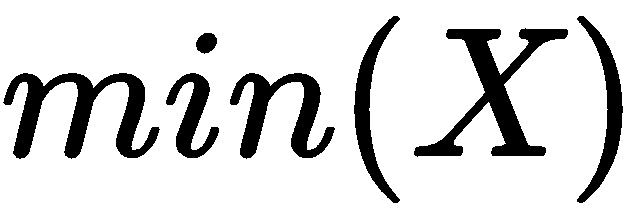

# 第十章：评估算法

正如我们在前几章中所看到的，为了实现某些网络安全目标，有多种 AI 解决方案可以选择，因此，学习如何评估各种替代解决方案的效果是非常重要的，同时，使用适当的分析指标也同样关键。同时，防止过拟合等现象也很重要，因为这些现象可能会影响从训练数据转到测试数据时预测的可靠性。

在本章中，我们将学习以下主题：

+   处理原始数据时的特征工程最佳实践

+   如何使用 ROC 曲线评估检测器的性能

+   如何适当地将样本数据拆分为训练集和测试集

+   如何通过交叉验证来管理算法的过拟合和偏差–方差权衡

现在，让我们从原始数据的本质开始，讨论为什么我们需要特征工程。

# 特征工程的最佳实践

在前几章中，我们探讨了不同的**人工智能**（**AI**）算法，分析了它们在不同场景中的应用及其在网络安全背景下的使用案例。现在，到了学习如何评估这些算法的时刻，前提是算法是数据驱动学习模型的基础。

因此，我们必须处理数据的本质，数据是算法学习过程的基础，算法旨在根据训练阶段接收的样本输入，进行基于预测的泛化。

因此，算法的选择将落在能够最好地进行泛化的算法上，从而在面对新数据时获得最佳预测。实际上，识别一个适合训练数据的算法是相对简单的；当算法必须对从未见过的数据做出正确预测时，问题变得更加复杂。事实上，我们将看到，优化算法在训练数据上的预测准确性会导致一个名为**过拟合**的现象，即在处理新测试数据时，预测结果变得更差。

因此，理解如何正确执行算法训练变得非常重要，从选择训练数据集到正确调整特征所选算法的学习参数。

有多种方法可以用于执行算法训练，比如使用相同的训练数据集（例如，通过将训练数据集划分为两个独立的子集，一个用于训练，一个用于测试），并选择一个适当的原始训练数据集百分比来分配到这两个不同的子集。

另一种策略基于交叉验证，正如我们将看到的，它是通过随机将训练数据集划分为若干子集，然后在这些子集上训练算法并计算所得结果的平均值，从而验证预测的准确性。

# 更好的算法还是更多的数据？

虽然确实如此，为了做出正确的预测（这些预测其实也不过是从样本数据出发的泛化），单凭数据是不够的；你需要将数据与算法结合（算法实际上不过是数据的表示）。然而，在实践中，我们常常面临一个困境：是应该设计更好的算法，还是仅仅需要收集更多数据？这个问题随着时间的推移并非始终如一的答案，因为当人工智能领域的研究起步时，重点在于算法的质量，因为数据的可用性受制于存储成本。

随着存储成本的降低，近年来我们见证了数据可用性前所未有的爆炸式增长，这催生了基于大数据的新分析技术，因此，焦点逐渐转向了数据的可用性。然而，随着可用数据量的增加，所需分析的时间也相应增加，因此，在选择算法的质量和训练数据量之间，我们必须面对一个权衡。

一般来说，实践经验告诉我们，即便是一个由大量数据驱动的简单算法，也能比一个处理较少数据的复杂算法产生更好的预测结果。

然而，数据的本质往往是决定性因素。

# 原始数据的本质

对数据相关性的重视常常体现在一句格言中：“让数据为自己说话”。然而，现实中，数据几乎从来不能为自己说话，而且当它确实这么做时，通常会误导我们。原始数据不过是一些信息碎片，像拼图的碎片一样，我们（还）无法看到完整的图景。

因此，为了理解原始数据，我们需要模型帮助我们区分必要的部分（信号）与无用的部分（噪声），并且识别出缺失的部分，以完成我们的拼图。

在人工智能的案例中，模型表现为特征之间的数学关系，通过这些关系，我们能够根据分析目的，展示数据所代表的不同方面和不同功能。为了将原始数据输入到我们的数学模型中，它必须首先经过适当处理，从而成为我们模型的特征。事实上，特征不过是原始数据的数值表示。

例如，原始数据往往不是以数字形式出现。然而，以数字形式表示数据是必要的前提，以便能够通过算法进行处理。因此，我们必须在将原始数据输入到算法之前，将其转换为数字形式。

# 特征工程来拯救我们

因此，在实施我们的预测模型时，我们不能仅仅局限于指定算法的选择，还必须定义支持这些算法所需的特征。因此，正确地定义特征是一个关键步骤，既是实现我们目标的必要步骤，也是高效实施预测模型的前提。

正如我们所说，特征是原始数据的数值表示。显然，将原始数据转换为数值形式的方式有很多种，这些方式根据原始数据的性质以及所选择的算法类型有所不同。不同的算法实际上需要不同的特征才能工作。

特征的数量对我们模型的预测性能同样至关重要。因此，选择特征的质量和数量构成了一个初步过程，这被称为特征工程。

# 处理原始数据

首先，根据将要与我们的模型关联的数值性质进行筛选。我们应该问自己，我们所需的数值是仅为正数还是负数，还是仅为布尔值，是否可以仅限于某些数量级，是否能够预先确定特征可以假定的最大值和最小值，等等。

我们还可以通过从简单特征出发，人工创建复杂特征，以提高我们模型的解释能力和预测能力。

以下是一些最常见的适用于将原始数据转化为模型特征的转化方法：

+   数据二值化

+   数据分箱

+   对数数据转化

接下来，我们将详细讨论这些转化方法。

# 数据二值化

基于原始数据计数的最基本的转化形式之一是二值化，它是将大于`0`的所有计数值赋值为`1`，其余情况赋值为`0`。为了理解二值化的实用性，我们只需考虑开发一个预测模型，其目标是根据视频视觉化来预测用户的偏好。因此，我们可以简单地通过计算每个用户观看视频的次数来评估他们的偏好；然而，问题在于视觉化的数量级因用户的个人习惯而有所不同。

因此，视觉化的绝对值——即原始计数——并不能作为衡量每个视频所获得偏好程度的可靠标准。事实上，一些用户有反复观看同一视频的习惯，而不特别关注它，而其他用户则倾向于集中注意力，从而减少了视觉化的次数。

此外，由于每个用户的视频可视化所关联的不同量级，视图数从几十到几百，甚至几千不等，这与用户的习惯有关，这使得某些统计度量，如算术平均值，较难代表个体偏好。

我们可以将视图计数二值化，将值 `1` 关联到所有获取了大于 `0` 次视图的视频，将值 `0` 关联到其他视频。以这种方式获得结果是衡量个体偏好的更高效和稳健的方式。

# 数据分箱

管理计数的不同量级是一个在不同场景中都会遇到的问题，许多算法在处理具有广泛值范围的数据时表现不佳，例如基于欧几里得距离衡量相似度的聚类算法。

与二值化类似，可以通过将原始数据计数分组到称为**箱**的容器中来减少维度尺度，箱具有固定的幅度（固定宽度分箱），按升序排序，从而线性或指数地缩放其绝对值。

# 对数数据转换

同样，可以通过将原始数据计数的绝对值替换为对数值，从而减少数据的量级。

对数转换的一个独特特性正是减少大值的重要性，同时放大小值，从而实现更均匀的值分布。

除了对数之外，还可以使用其他幂函数，这些函数可以稳定数据分布的方差（例如**Box–Cox 变换**）。

# 数据归一化

数据归一化也称为特征归一化或特征缩放，它能提高受输入值规模影响的算法的性能。

以下是最常见的特征归一化示例。

# 最小–最大缩放

使用最小–最大缩放转换时，我们将数据限制在一个有限的值范围内：`0` 和 `1`。

数据的转换涉及用以下公式计算的值替换原始值 ：


这里， 代表整个分布的最小值， 代表最大值。

# 方差缩放

另一种非常常见的数据归一化方法是从每个单独的值中减去分布的均值，然后将得到的结果除以分布的方差 。

经过归一化（也称为**标准化**）后，重新计算的数据分布显示均值为 `0`，方差为 `1`。

方差缩放的公式如下：


# 如何管理类别变量

原始数据可以通过取非数字值的类别变量来表示。

类别变量的典型示例是国籍。为了数学上管理类别变量，我们需要使用某种形式的类别转换为数值，也称为编码。

以下是最常见的几种类别编码方法。

# 序数编码

一种直观的编码方法是为各个类别分配一个逐步递增的值：


这种编码方法的优点和缺点是，尽管这些转换后的值可能在数值上有顺序，但这种数值顺序实际上没有实际意义。

# 独热编码

使用独热编码方法，为每个变量分配一组位，每个位表示一个不同的类别。

这组位使我们能够区分不能属于多个类别的变量，结果只会有一个位的数据集：


# 虚拟编码

独热编码方法实际上有些浪费（事实上，并不是绝对必要的），这一点可以通过使用虚拟编码方法来消除：


# 使用 sklearn 进行特征工程的示例

现在让我们看看使用 NumPy 库和`scikit-learn`库的预处理包实现特征工程的一些示例。

# 最小-最大缩放器

在以下代码中，我们看到一个使用`scikit-learn`的`MinMaxScaler`类进行特征工程的示例，旨在将特征缩放到给定的值范围（最小值和最大值）之间，例如`0`和`1`：

```py
from sklearn import preprocessing
 import numpy as np
 raw_data = np.array([
 [ 2., -3., 4.],
 [ 5., 0., 1.],
 [ 4., 0., -2.]])
 min_max_scaler = preprocessing.MinMaxScaler()
 scaled_data = min_max_scaler.fit_transform(raw_data)
```

# 标准化缩放器

以下示例展示了`scikit-learn`的`StandardScaler`类的应用，使用`transform()`方法计算训练集的均值和标准差：

```py
from sklearn import preprocessing
import numpy as np
raw_data = np.array([
[ 2., -3., 4.],
[ 5., 0., 1.],
[ 4., 0., -2.]])
std_scaler = preprocessing.StandardScaler().fit(raw_data)
std_scaler.transform(raw_data)
test_data = [[-3., 1., 2.]]
std_scaler.transform(test_data)
```

# 幂变换

在下面的示例中，我们看到`scikit-learn`的`PowerTransformer`类在应用 Box-Cox 变换时，使用零均值、单位方差归一化对变换后的输出进行处理：

```py
from sklearn import preprocessing
import numpy as np
pt = preprocessing.PowerTransformer(method='box-cox', standardize=False) 
X_lognormal = np.random.RandomState(616).lognormal(size=(3, 3))
pt.fit_transform(X_lognormal)
```

# 使用 sklearn 进行序数编码

在以下示例中，我们看到如何使用`scikit-learn`的`OrdinalEncoder`类及其`transform()`方法将类别特征编码为整数：

```py
from sklearn import preprocessing
ord_enc = preprocessing.OrdinalEncoder()
cat_data = [['Developer', 'Remote Working', 'Windows'], ['Sysadmin', 'Onsite Working', 'Linux']]
ord_enc.fit(cat_data)
ord_enc.transform([['Developer', 'Onsite Working', 'Linux']])
```

# 使用 sklearn 进行独热编码

以下示例展示了如何使用`scikit-learn`的`OneHotEncoder`类将类别特征转换为二进制表示：

```py
from sklearn import preprocessing
one_hot_enc = preprocessing.OneHotEncoder()
cat_data = [['Developer', 'Remote Working', 'Windows'], ['Sysadmin', 'Onsite Working', 'Linux']]
one_hot_enc.fit(cat_data)
one_hot_enc.transform([['Developer', 'Onsite Working', 'Linux']])
```

在描述完特征工程的最佳实践后，我们可以继续评估我们模型的性能。

# 使用 ROC 曲线评估检测器的性能

我们之前已经遇到过 ROC 曲线和 AUC 度量（第五章，*基于 AI 的网络异常检测*，以及第七章，*基于云 AI 解决方案的欺诈预防*），用于评估和比较不同分类器的性能。

现在让我们以更系统的方式探索这个主题，引入与欺诈检测分类器返回的所有可能结果相关的混淆矩阵，将预测值与实际值进行比较：


然后我们可以基于之前的混淆矩阵计算以下值（附带其解释）：

+   **敏感度** = **召回率** = **命中率** = ***TP/(TP + FP)***：该值衡量正确标记为欺诈者的比例，表示**真阳性率**（**TPR**）。

+   **假阳性率** ***(FPR) = FP/(FP + TN)***：FPR 也可以通过 1 – 特异性来计算。

+   **分类准确率** = ***(TP + TN)/(TP + FP + FN + TN)***：该值表示正确分类的观察结果所占的百分比。

+   **分类错误率** = ***(FP + FN)/(TP + FP + FN + TN)***：该值表示误分类率。

+   **特异性** = ***TN/(FP + TN)***：该值衡量正确标记为非欺诈者的比例。

+   **精确率** = ***TP/(TP + FP)***：该值衡量预测为欺诈者的个体中，实际为欺诈者的比例。

+   ***F*** - ***度量*** = ***2*** x **(*精确率*** x ***召回率*)/(*精确率*** + ***召回率*)**：该值表示精确率和召回率的加权调和平均数。*F*度量的范围从 0（最差评分）到 1（最佳值）。

现在我们可以详细分析 ROC 曲线及其相关的 AUC 度量。

# ROC 曲线和 AUC 度量

在比较不同分类器性能时最常用的技术之一是**接收操作特征**（**ROC**）曲线，它描述了每个分类器的 TPR（真阳性率或敏感度）与 FPR（假阳性率或 1-特异性）之间的关系：


*(图片来源：http://scikit-learn.org/)*

如何比较不同分类器的性能？

让我们首先考虑最佳分类器应具备的特性。其曲线应对应于 ROC 空间中的坐标对***x*** = ***0***和***y*** = ***1***。换句话说，最佳分类器是能够正确识别所有欺诈案件且没有产生任何假阳性的分类器，即理想情况下***FPR*** = ***0***和***TPR*** = ***1***。

类似地，随机分类器的性能（即随机预测）会落在由坐标对[***x*** = ***0***，***y*** = ***0***]和[***x*** = ***1***，***y*** = ***1***]描述的对角线上。

因此，不同分类器性能之间的比较需要验证它们的曲线与*L*-曲线（对应最佳分类器）之间的偏差。

为了更精确地衡量性能，我们可以计算每个分类器的**ROC 曲线下面积（AUC）**指标。AUC 指标的值介于 0 到 1 之间。

最佳分类器的 AUC 指标等于 1，对应于 AUC 的最大值。AUC 指标也可以解释为概率度量。

事实上，一个随机分类器，其曲线对应于 ROC 空间中的对角线，将具有 0.5 的 AUC 值。因此，任何其他分类器的性能应当介于最小 AUC 值 0.5 和最大值 1 之间。***AUC***值小于***0.5***表明所选分类器的表现比随机分类器更差。

为了正确评估单个分类器的估计概率质量，我们可以使用**Brier 分数**（**BS**），它衡量估计概率与实际值之间差异的平均值。

下面是 BS 公式：


这里，*P**[i]*是观察值*i*的估计概率，是一个二进制估算器（假定为 0 或 1），用于表示实际值*i*。此外，*BS*的值介于 0 和 1 之间，但与 AUC 不同，较小的*BS*值（即接近 0 的*BS*值）对应于更准确的概率估计。

以下是一些使用`scikit-learn`库计算 ROC 曲线及其相关指标的示例。

# ROC 指标示例

在以下代码中，我们可以看到使用`scikit-learn`的各种方法（如`precision_recall_curve()`、`average_precision_score()`、`recall_score()`和`f1_score()`）计算 ROC 指标的示例：

```py
import numpy as np
from sklearn import metrics
from sklearn.metrics import precision_recall_curve
from sklearn.metrics import average_precision_score
y_true = np.array([0, 1, 1, 1])
y_pred = np.array([0.2, 0.7, 0.65, 0.9])
prec, rec, thres = precision_recall_curve(y_true, y_pred)
average_precision_score(y_true, y_pred)
metrics.precision_score(y_true, y_pred)
metrics.recall_score(y_true, y_pred)
metrics.f1_score(y_true, y_pred)
```

# ROC 曲线示例

以下代码展示了如何使用`scikit-learn`的`roc_curve()`方法计算 ROC 曲线：

```py
import numpy as np
from sklearn.metrics import roc_curve
y_true = np.array([0, 1, 1, 1])
y_pred = np.array([0.2, 0.7, 0.65, 0.9])
FPR, TPR, THR = roc_curve(y_true, y_pred)
```

# AUC 分数示例

在以下示例代码中，我们可以看到如何使用`scikit-learn`的`roc_auc_score()`方法计算 AUC 曲线：

```py
import numpy as np
from sklearn.metrics import roc_auc_score
y_true = np.array([0, 1, 1, 1])
y_pred = np.array([0.2, 0.7, 0.65, 0.9])
roc_auc_score(y_true, y_pred)
```

# Brier 分数示例

在以下示例中，我们使用`scikit-learn`的`brier_score_loss()`方法评估估计概率的质量：

```py
 import numpy as np
 from sklearn.metrics import brier_score_loss
 y_true = np.array([0, 1, 1, 1])
 y_cats = np.array(["fraud", "legit", "legit", "legit"])
 y_prob = np.array([0.2, 0.7, 0.9, 0.3])
 y_pred = np.array([1, 1, 1, 0])
 brier_score_loss(y_true, y_prob)
 brier_score_loss(y_cats, y_prob, pos_label="legit")
 brier_score_loss(y_true, y_prob > 0.5)
```

现在，让我们通过引入从将样本数据集分割为训练集和测试集子集得到的影响，继续评估模型的性能。

# 如何将数据分割为训练集和测试集

评估我们模型学习效果的最常用方法之一是测试算法在从未见过的数据上的预测。然而，并非总能将新数据输入到我们的模型中。一种替代方法是将现有数据划分为训练集和测试集，并调整分配给每个子集的数据比例。通常，训练集占 70%到 80%，剩余的 20%到 30%分配给测试集。

将原始样本数据集划分为训练集和测试集可以通过`scikit-learn`库轻松完成，正如我们在多个例子中所做的那样：

```py
from sklearn.model_selection import train_test_split
# Create training and testing subsets
X_train, X_test, y_train, y_test = train_test_split(X, y, test_size=0.2)
```

通过调用`sklearn.model_selection`包中的`train_test_split()`方法，并设置`test_size = 0.2`参数，我们将原始样本数据集划分为训练集和测试集，保留原始数据集 20%的比例作为测试数据集，剩余的 80%分配给训练数据集。

这种技术虽然简单，但仍可能对我们算法的学习效果产生重要影响。

# 算法泛化误差

正如我们所见，算法的目的是通过对训练样本的泛化来学习做出正确的预测。因此，所有算法在这一学习过程中都会表现出一定的泛化误差，可以用以下公式表示：


通过*偏差*（Bias），我们指的是算法在执行预测时所犯的系统性错误，通过*方差*（Variance），我们指的是算法对影响分析数据的变化的敏感度。最后，*噪声*（Noise）是一个不可减少的成分，它表征了被分析数据的特点。

下图展示了不同估算器的能力，这些估算器根据其适应数据的能力而有所不同。从最简单的估算器开始，逐渐到最复杂的估算器，我们可以看到*偏差*和*方差*的变化。估算器的复杂度越低，通常对应着更高的*偏差*（系统性误差）和较低的方差，即对数据变化的敏感度减少。

相反，随着模型复杂度的增加，*偏差*（Bias）减少，但*方差*（Variance）增加，因此更复杂的模型往往会过度适应（过拟合）其预测，导致从训练数据到测试数据的预测效果变差：


*(图片来源：http://scikit-learn.org/)*

一种减少与算法复杂度相关的*方差*的方法是增加构成训练数据集的数据量；然而，并不是总能轻松区分哪个成分（*偏差*还是*方差*）在确定泛化误差时更为重要。因此，我们必须使用适当的工具来区分各个成分在泛化误差决定中的作用。

# 算法学习曲线

一个用于识别*偏差*（Bias）和*方差*（Variance）之间成分的有用工具，对于确定算法的泛化误差非常重要。这就是学习曲线，通过它可以比较算法的预测性能与训练数据的数量。通过这种方式，可以评估算法的训练得分和测试得分如何随着训练数据集的变化而变化：


*(图片来源：维基百科 https://commons.wikimedia.org/wiki/File:Variance-bias.svg)*

如果当训练数据集增长时，训练得分和测试得分趋于收敛（如上图所示），为了提高我们的预测效果，我们必须增加算法的复杂度，从而减少*偏差*成分。

如果训练得分始终高于测试得分，那么增加训练数据集的规模将提高我们算法的预测性能，从而减少*方差*成分。最后，如果训练得分和测试得分无法收敛，那么我们的模型就表现出高方差特征，因此我们必须同时调整算法的复杂度和训练数据集的大小。

在下面的示例中，我们可以看到如何使用`sklearn.model_selection`包的`learning_curve()`方法，基于不同的训练数据集大小，获取设计学习曲线所需的值，并结合**支持向量分类器**（**SVC**）进行分析：

```py
from sklearn.model_selection import learning_curve
from sklearn.svm import SVC
_sizes = [ 60, 80, 100]
train_sizes, train_scores, valid_scores = learning_curve(SVC(), X, y, train_sizes=_sizes)
```

总结来说，我们可以说，训练数据集大小的选择会影响我们算法的学习效果。原则上，通过减少分配给训练数据集的比例，我们会增加*偏差*误差成分。如果我们在保持原始样本数据集大小不变的情况下，增加训练数据集的规模，我们可能会导致算法过度拟合训练数据，这会导致当算法接收新数据时的预测效果较差，更不用说由于具体拆分策略的影响，某些高信息量样本可能会被排除在训练数据集之外。

此外，如果训练数据集具有高维度，那么测试数据与训练数据之间的相似性可能只是表面现象，从而使得学习过程变得更加困难。

因此，按照固定百分比拆分样本数据集的简单策略并不总是最优解，特别是在评估和微调算法性能时。

一种替代解决方案是使用交叉验证。

# 使用交叉验证进行算法训练

最常用的交叉验证类型是 k 折交叉验证，它涉及将样本数据集随机分成若干个折叠，*k*对应于尽可能相等的数据部分。

学习过程是以迭代方式进行的，基于不同的折叠组成，既用作训练数据集，也用作测试数据集。这样，每个折叠轮流作为训练数据集或测试数据集：


*(图片来源：http://scikit-learn.org/)*

实际上，不同的折叠（随机生成的）轮流作为训练数据集和测试数据集，迭代过程在所有 k 个折叠都作为训练和测试数据集使用后结束。

由于在每次迭代中产生的泛化误差是不同的（因为算法使用不同的数据集进行训练和测试），我们可以计算这些误差的平均值，作为交叉验证策略的代表性度量。

# K 折交叉验证的优缺点

K 折交叉验证具有多个优点，包括以下几点：

+   它使得所有可用的数据都可以用于训练和测试目的

+   单个折叠的具体组成是无关紧要的，因为每个折叠最多用于一次训练和一次测试

+   我们可以通过增加*k*值来增加折叠的数量，从而增加训练数据集的大小，以减少泛化误差中的*偏差*成分

在缺点方面，我们必须强调，k 折交叉验证认为原始样本数据集的顺序是无关的。如果数据的顺序包含重要信息（如时间序列数据集），我们将不得不使用另一种策略，考虑到原始顺序—可能通过按最旧数据拆分数据—用于训练数据集，从而将最新的数据保留用于测试。

# K 折交叉验证示例

在以下示例中，我们将使用`scikit-learn`包中实现的 k 折交叉验证，`sklearn.model_selection`。为了简化，我们将变量`k`的值设为`2`，从而得到一个 2 折交叉验证。

样本数据集仅包含四个样本。因此，每个折叠将包含两个数组，交替使用，一个用于训练，另一个用于测试。最后，注意如何使用`numpy`索引语法将不同的折叠与训练数据和测试数据关联起来：

```py
import numpy as np
from sklearn.model_selection import KFold
X = np.array([[1., 0.], [2., 1.], [-2., -1.], [3., 2.]])
y = np.array([0, 1, 0, 1])
k_folds = KFold(n_splits=2)
for train, test in k_folds.split(X):
print("%s %s" % (train, test))
[2 0] [3 1]
[3 1] [2 0]
X_train, X_test, y_train, y_test = X[train], X[test], y[train], y[test]
```

# 总结

在本章中，我们探讨了常用的不同技术，用于评估不同算法的预测性能。我们研究了如何将原始数据转化为特征，遵循特征工程的最佳实践，从而使算法能够使用没有数值形式的数据，如类别变量。接着，我们重点介绍了评估算法所涉及的各种组成部分（如偏差和方差）所需的技术，以正确评估算法的泛化误差，最后，我们学习了如何进行算法的交叉验证，以改进训练过程。

在下一章中，我们将学习如何评估你的 AI 工具库。
