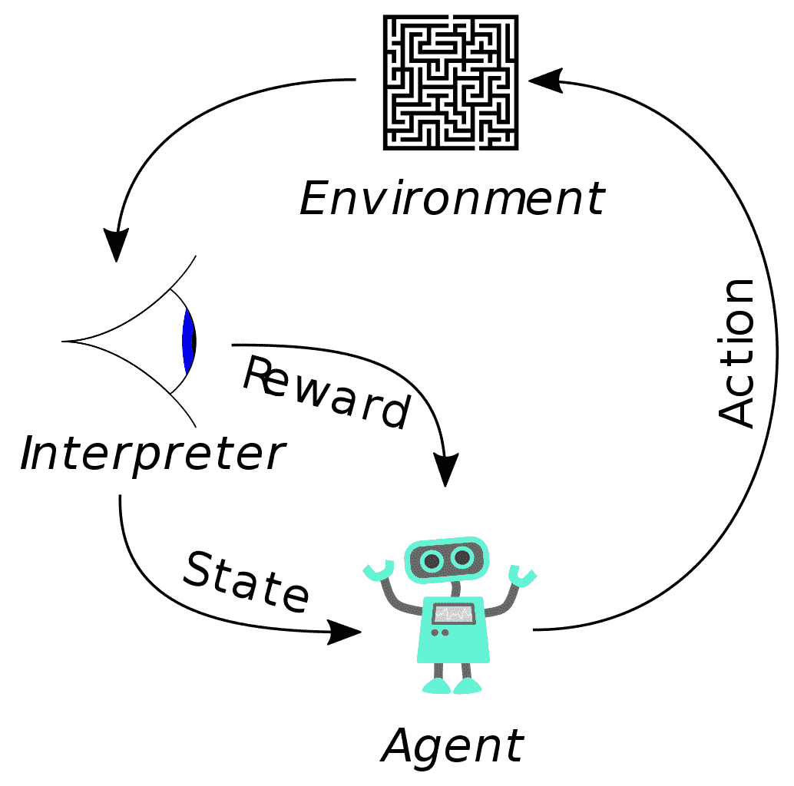

# 第十一章：评估你的 AI 武器库

除了评估算法的有效性之外，了解攻击者利用哪些技术来避开我们的 AI 驱动的工具也很重要。只有这样，才能真实地评估所采用解决方案的有效性和可靠性。此外，解决方案的可扩展性以及它们的持续监控也必须加以考虑，以保证其可靠性。

在本章中，我们将学习以下内容：

+   攻击者如何利用**人工智能**（**AI**）避开**机器学习**（**ML**）异常检测器

+   我们在实施 ML 异常检测时面临的挑战

+   如何测试我们的解决方案的数据和模型质量

+   如何确保我们 AI 网络安全解决方案的安全性和可靠性

让我们从学习攻击者如何避开 ML 异常检测器开始。

# 避开 ML 检测器

在第八章，*生成对抗网络（GANs）*——*攻击与防御*中，我们展示了如何利用**生成对抗网络（GANs）**来欺骗检测算法。现在，我们将看到，不仅仅是 GANs 对我们的基于 AI 的网络安全解决方案构成威胁，更广泛地说，强化学习（RL）也可以被用来使我们的检测工具失效。

为了理解这一点，我们需要简要介绍强化学习（RL）的基本概念。

# 理解强化学习（RL）

相比于其他形式的 AI，强化学习（RL）的特点是通过试错的方式进行自动化学习。实际上，RL 算法会根据从环境中获得的反馈调整其学习过程。这些反馈可以是正面的，即奖励；也可以是负面的，即惩罚。此外，反馈根据预测的成功与错误而有所不同。

因此，我们可以说，学习是基于智能软件获得的奖励和惩罚进行的：这样，智能软件（也称为**智能体**）从所处领域的反馈中学习（该领域也称为**环境**）。

与 ML 不同，在 RL 中，学习过程并不是基于训练数据集进行的，而是基于智能体与模拟现实世界用例的环境的相互作用。每个环境则由大量的参数和信息组成，智能体通过这些信息学习如何实现自己的目标。

在学习如何实现目标的过程中，智能体会根据环境中的反馈（奖励和惩罚）进行调整。

一个典型的 RL 智能体目标的例子是学习如何解答游戏题目，例如迷宫：



（图片来源：https://commons.wikimedia.org/wiki/File:Reinforcement_learning_diagram.svg）

学习过程所发生的环境可以是已知的，也可以是未知的。在实现目标时，智能体遵循最大化奖励的学习策略。

这些特点使得强化学习特别适用于解决未知环境中的问题，比如学习迷宫的解决方案。

在解决迷宫问题时，智能体的最终目标是尽可能快地到达出口，而事先并不知道迷宫的布局，而是通过试错法学习路线（即，借助从环境获得的反馈）。

总结一下，RL（强化学习）的特点如下：

+   一个或多个智能体

+   一个环境

+   状态（智能体到达的地方）

+   动作（智能体为了到达不同状态所执行的移动）

+   反馈（与特定状态相关的得分）

让我们看看这些元素在学习过程中的相互作用。

# 强化学习的反馈与状态转移

我们之前提到，在强化学习中，学习过程是由反馈引导的，模拟了一种通过试错法进行决策的方法。在实现目标（如找到迷宫出口）时，智能体会执行与反馈（奖励或惩罚）相关的动作（移动），这些反馈来自不同的环境。

反馈是基于智能体在每次行动后所处的状态发出的，也就是智能体在每次移动后的所在位置。然后，反馈会从环境发送给智能体。因此，智能体会根据收到的奖励迭代地更新其对下一个状态的预测，评估后续行动的成功概率。通过利用反馈，智能体能够调整其行为以适应环境。这种适应发生在从一个状态到另一个状态的过渡中，而学习过程也正是在这一过渡过程中发生的。这种从一个状态到另一个状态的过渡也被称为**状态转移过程**。

在简要介绍了强化学习的基本概念后，让我们看看如何将它们应用于规避恶意软件机器学习检测器。

# 使用强化学习规避恶意软件检测器

在第四章，*恶意软件威胁检测*，我们详细分析了使用机器学习算法实现恶意软件检测器的优势。

在第八章，*GANs*–*攻击与防御*，我们还展示了如何利用 GANs 来欺骗这些检测器。

我们提到过，基于 GAN（生成对抗网络）的攻击方法可以分为以下几种：

+   **白盒攻击**：攻击者知道模型的结构，且能够执行查询以理解如何规避检测器。

+   **黑盒攻击**：攻击者不知道检测器的结构或特征，但可以间接访问底层模型以执行模型替换。

即使在黑盒攻击的情况下，攻击者虽然不知道检测器的结构和特性，但仍然必须了解目标模型的完整特征（特征空间）。因此，为了训练替代模型并通过模型替代进行攻击，攻击者必须了解表征原始模型的特征，这就是强化学习（RL）发挥作用的地方。

事实上，得益于强化学习，攻击者可以在完全不知情的情况下进行攻击，不仅不了解恶意软件检测器底层模型的结构和实现特征，还不了解检测特征。

使用强化学习攻击恶意软件检测器的第一个例子之一，描述在名为*《规避机器学习恶意软件检测》*的论文中，该论文由 Hyrum S. Anderson、Anant Kharkar、Phil Roth 和 Bobby Filar 撰写，其结果在 2017 年 7 月 22 日至 27 日于美国拉斯维加斯的 Black Hat USA 2017 大会上进行了展示。

该论文展示了一个针对分类器进行黑盒攻击的例子，该攻击使用强化学习，其中攻击者完全不知道目标分类器的结构和特征空间。然而，攻击者可用的信息减少导致其攻击成功率低于使用生成对抗网络（GAN）进行的黑盒攻击。

然而，论文证明了通过利用强化学习，尽管信息有限，依然可以进行黑盒攻击的可能性。

# 强化学习的黑盒攻击

在前述论文中，实施了一个强化学习模型，以对恶意软件检测器进行黑盒攻击，目的是规避静态 Windows **可移植可执行文件**（**PE**）恶意软件分类器。

攻击场景包括以下元素：

+   强化学习模型由一个代理和一个环境组成。

+   代理（agent）反复选择一个动作 A 来执行。

+   每个动作 A 都与状态空间 S 的变化相关联。

+   每次状态变化都与来自环境的反馈相关联，以标量奖励的形式表现出来。

然后，反馈及其标量奖励被反馈给代理。代理根据这些反馈，遵循一个策略，即最大化奖励的目标函数，来决定下一步的行动。这个目标函数决定了接下来要执行的动作。

具体而言，A 动作集合代表可以对 PE 格式的可执行文件进行的相应修改集合，以欺骗恶意软件分类器，同时保持恶意软件的功能。

每个动作的标量奖励由环境根据恶意软件分类器返回的结果进行评估。

论文的作者们还开发了一种规避环境恶意软件，名为**EvadeRL**（[`github.com/drhyrum/gym-malware`](https://github.com/drhyrum/gym-malware)），其源代码作为开源发布。

EvadeRL 基于 OpenAI Gym 框架（[`gym.openai.com/`](https://gym.openai.com/)），提供标准化的预配置强化学习环境。

恶意软件规避环境由以下部分组成：

+   初始恶意软件样本

+   一个可定制的反恶意软件引擎

每个步骤为代理提供以下反馈：

+   **奖励**：如果恶意软件样本通过恶意软件引擎控制，则为 `10.0`，如果恶意软件样本失败，则为 `0.0`

+   **观察空间**：总结恶意软件样本组成的特征向量

基于此反馈，代理选择下一步操作，即对恶意软件样本的 PE 文件格式进行修改，但不改变可执行文件的原始功能。

恶意软件样本在环境中的表示形式为一个 2350 维的特征向量，包括常见的 PE 文件格式工件类别，例如以下内容：

+   PE 头

+   PE 区段

+   导入和导出表

+   ASCII 字符串，如文件路径、URL 和注册表键

代理的每个动作对应于一个状态变化，表示恶意软件样本 PE 文件格式的可能修改之一。

由于需要同时保持 PE 文件格式的完整性和恶意软件功能的完整性，因此可能的修改数量相对较小，以下是一些示例：

+   向**导入地址表**（**IAT**）添加一个新功能，但该功能不会被可执行文件调用

+   修改现有区段的名称

+   添加新的未使用区段

+   每个区段末尾的额外空间填充

在引用论文的作者进行的实验中，使用包含 100,000 个样本（包括恶意样本和良性样本）的训练数据集进行训练的梯度提升决策树分类器成功遭到攻击，获得了 **ROC 曲线下面积**（**AUC**）得分 `0.96`。

# 挑战性的机器学习异常检测

正如我们在第五章《使用 AI 进行网络异常检测》中所看到的，机器学习在异常检测领域特别有用。然而，即使在异常检测的情况下，基于 AI 的网络安全解决方案的采用也必须谨慎评估，因为这些解决方案的复杂性不可避免地带来了挑战。

尤其是，必须仔细评估由异常检测系统引发的错误对业务和安全的潜在负面影响，这些错误来源于假阳性和假阴性。

正如我们所知，通常在假阳性和假阴性之间存在权衡；因此，试图减少假阴性（未被检测到的攻击）几乎不可避免地会导致假阳性（检测到的虚假攻击）增加。

很多时候，由分类错误带来的成本是相关的：如果一个假阴性（即未检测到的攻击）可能导致企业敏感数据的完整性遭到破坏（甚至系统本身遭到破坏）。同时，过多的假阳性（即检测到实际上不存在的攻击）可能会导致检测系统的不可靠，阻碍实时识别真正的攻击。

这些就是为什么**纯粹**的异常检测系统（即仅基于自动化程序的检测系统）在实践中极为罕见的一些原因。

无论是异常检测系统，还是欺诈检测和预防系统（见第七章，*云 AI 解决方案中的欺诈预防*），通过将自动化程序与人工操作员反馈结合，可靠性得到提高（因此，例如，监督算法相关标签的可靠性得到了增强）。

另一个问题是算法可解释性的要求，因为算法得到的结果往往难以解释（不足为奇，机器学习算法常被视为黑盒）。

由于算法结果难以解释，可能导致调查活动陷入困境，因无法理解算法为何会检测到某些异常。

换句话说，由于算法和学习过程固有的不可理解性，往往难以与需要精确（且可重复）地重建导致系统报告异常的过程这一需求相协调。

如果考虑到检测系统所使用的实际环境具有本质上的动态性质（因为在不断发展的现实中，总会有之前未遇到过的新**异常**案例），这些困难会加剧。

# 事件响应与威胁缓解

显然，实施异常检测系统需要假设生成的警报得到了适当管理。

事件响应指的是警报发出后进行的一系列活动。

这些活动通常由专门从事各个领域的人工操作员管理，他们负责调查并深入分析与警报相关的证据。

鉴于进行此类调查所需的高度专业化（例如，数字取证活动通常来源于数据泄露报告），自动化程序的采用通常仅限于支持人工操作员的专业活动，而不是取而代之。

**威胁缓解**，则涉及预防未来的攻击或入侵，或反制正在进行的攻击。

尽管可以成功实施自动屏蔽可疑活动的算法程序以应对威胁，但这些程序也可能被攻击者利用（例如，设想一个攻击者通过模拟**分布式拒绝服务**（**DDoS**）攻击，试图通过自动屏蔽大部分客户 IP 地址来破坏一个电子商务网站的声誉）。

# 通过人类反馈增强检测系统

从我们至今所见，最佳的异常检测系统使用方式是自动化程序与人类操作员所进行的专业活动相结合。

因此，将异常检测系统作为人类专家的辅助工具，能够在减轻假阳性带来的成本的同时，通过利用人类反馈（如前述提高用于训练监督算法的分类样本标签的可靠性）提高减少假阴性的能力。

然而，这种人机协同假设了算法不再那么晦涩难懂，更容易为人类解读，从而增加了算法报告特定异常的透明度（这种透明度仅限于内部人员，以防止攻击者利用它为自己谋取利益）。

同样地，异常检测系统必须易于维护，既能迅速适应环境变化，也能方便地通过操作员反馈修正算法的分类错误。

# 测试数据和模型质量

迄今为止，我们已经看到了在实现检测系统过程中所面临的技术难题。

更广泛地说，每当我们决定在网络安全解决方案中使用算法时，我们必须考虑数据质量和模型质量的各个方面，以确保不仅是预测的准确性，而且还要确保其可靠性。

接下来，我们将继续分析与数据质量过程相关的各个方面。

# 评估数据质量

正如我们在本书中多次强调，特别是在第九章《评估算法》中所提到的，*算法的选择无疑是重要的，但数据的选择对于实现我们的目标更为关键*。

在许多情况下，使用更多的数据来训练一个非最优的算法，往往比试图优化该算法更为可取。

因此，确保所使用的数据是可靠的，并且数量足够用于训练我们的算法，显得尤为重要。

因此，数据质量过程的任务之一就是验证样本数据集中的偏差（这与算法偏差不同，后者是导致欠拟合的原因，正如我们在上一章所见）。

# 偏差数据集

数据集中的偏差通常是由于收集数据时所使用的选择方法所导致的（称为**选择偏差**）。例如，在恶意软件检测器的训练中，我们通常使用从公司安全防护圈内的蜜罐中获得的样本。

蜜罐是收集安全信息的有效工具：它们揭示了组织面临的定制攻击的具体风险。然而，蜜罐不太可能确保收集的样本能代表所有不同类型的实际恶意软件威胁。因此，使用蜜罐可能会在训练数据集中引入选择偏差。

对于反垃圾邮件分类器的训练也可以做类似的考虑：收集的样本几乎不可能包含所有可能利用电子邮件作为攻击向量的威胁情况，因此难以恰当地代表所有可能的攻击种类。

在这种情况下，我们可能会遇到**排除偏差**，即某些代表性样本被从数据集中排除。

防止数据集中的偏差出现的最有效策略之一是限制我们算法检测器的范围，特别是明确识别我们打算管理的威胁。

通过这种方式，即使是我们收集的数据样本用于训练算法，也会根据选择的使用案例来进行筛选。

# 不平衡和错误标注的数据集

同样，正如我们在第七章《利用云 AI 解决方案预防欺诈》中看到的，当我们分析信用卡欺诈数据时，可能会面临严重不平衡的数据分布，或者样本数据集被错误分类，从而降低了监督算法的效果。

我们已经看到，通过利用人类操作员获得的反馈，如何解决与错误标注数据集相关的问题（即使这种解决方案通常在时间和专业资源方面非常繁重）。

在不平衡的数据集的情况下（例如信用卡交易，其中属于合法交易类别的样本远远多于欺诈交易的样本），我们已经看到使用诸如**合成少数类过采样技术**（**SMOTE**）等采样技术是多么有效。

# 数据集中的缺失值

在数据质量处理中需要解决的最常见问题之一与数据集中的缺失值有关。

这个问题发生在例如列中的并非所有值都存在的情况下，从而导致空字段的出现。空字段的存在不仅对关系型数据库构成问题，还对许多机器学习算法构成问题。因此，有必要删除这些空字段，以便算法能够正确运行，避免分类错误。

解决缺失值问题的常见方法之一包括以下做法：

+   从数据集中排除包含空值的行

+   从数据集中排除包含空值的列

+   用默认值（例如 0）替换空字段，或根据数据集中其他值重新计算值

这些方法各有缺点：一般来说，排除包含空值的行和列可能导致丢失包含在其他非空字段中的重要信息。

类似地，插入预定义或重新计算的数据可能会引入偏差，特别是在缺失值较多的情况下。

# 缺失值示例

为了解决数据集中缺失值的问题，`scikit-learn`库提供了专门的类来完成此任务。

`scikit-learn`所采用的策略是通过推断数据集中已知部分的值来进行缺失值的插补。

值的插补有两种类型：

+   单变量插补

+   多变量插补

在单变量插补的情况下，使用`SimpleImputer`类。它允许你将空值替换为常数值，或使用基于包含空值的列中剩余值计算的统计量（如均值、中位数或众数）。

在以下示例中，我们看到将空值（以`np.nan`表示）替换为基于同一列中其他值计算的平均值：

```py
"""
Univariate missing value imputation with SimpleImputer class 
"""

import numpy as np
from sklearn.impute import SimpleImputer

simple_imputer = SimpleImputer(missing_values=np.nan, strategy='mean')

simple_imputer.fit([[3, 2], [np.nan, 4], [np.nan, 3], [7, 9]])

X_test = [[np.nan, 3], [5, np.nan], [6, 8], [np.nan, 4],]

simple_imputer.transform(X_test)

```

在多变量插补的情况下，缺失值通过循环策略进行估算，该策略考虑了剩余特征。

使用循环策略（对每个特征进行迭代）时，将特征列作为输入。然后通过应用回归函数来估算缺失值。

在以下示例中，我们使用`scikit-learn`包中的`IterativeImputer`类（位于`sklearn.impute`模块）来执行缺失值的多变量插补：

```py
"""
Multivariate missing value imputation with IterativeImputer class
"""

import numpy as np
from sklearn.experimental import enable_iterative_imputer
from sklearn.impute import IterativeImputer

iterative_imputer = IterativeImputer(imputation_order='ascending',
initial_strategy='mean',max_iter=15, missing_values=nan, random_state=0, tol=0.001)

iterative_imputer.fit([[3, 2], [np.nan, 4], [np.nan, 3], [7, 9]])

X_test = [[np.nan, 3], [5, np.nan], [6, 8], [np.nan, 4],]

np.round(iterative_imputer.transform(X_test))

```

是时候开始关注模型质量过程了。

# 评估模型质量

我们强调了数据对算法的重要性，并且我们已经看到在数据质量过程中应该遵循哪些策略。

一旦我们确定数据可靠且完整，就必须将其输入到为实现 AI 解决方案而选定的算法中，并将得到的结果提交给模型质量过程。

模型质量过程涉及算法部署的各个阶段。

事实上，监控算法的表现至关重要，以便不断地对超参数进行微调。

所谓超参数，是指算法从外部接收的所有参数（即那些在学习过程中未被设置或更新的参数），而这些参数是在训练开始之前由分析师决定的（例如，k-means 聚类算法中的参数*k*，或多层感知机分类器中使用的感知机数量）。

这就是为什么不断监控算法性能很重要，以便能够优化这些超参数。

# 微调超参数

在微调算法超参数时，我们必须记住，没有一种配置适用于所有情况；然而，我们必须根据面临的不同场景进行优化，考虑到我们想要实现的不同目标。

超参数的微调假设了对算法及其特性有深入了解，除此之外，还需要了解我们的解决方案所部署的应用领域（场景和使用案例）。

此外，微调还必须考虑输入数据变化可能带来的影响（正如我们在第三章中所看到的，*垃圾邮件或正常邮件？利用人工智能检测电子邮件网络安全威胁*一节中提到的，关于钓鱼检测，使用决策树时对输入数据的小变化也非常敏感）。

在许多情况下，分析师可以依靠自己的经验或决定遵循经验启发式方法来尝试优化超参数。

在这种情况下，`scikit-learn`库为我们提供了帮助，通过`GridSearchCV`类，我们可以利用交叉验证来比较不同算法的性能。

# 使用交叉验证进行模型优化

以下示例展示了如何使用`sklearn.model_selection`包中的`GridSearchCV`类，通过交叉验证对分类器进行超参数优化（请参见第九章的*算法交叉验证*一节，了解交叉验证的解释）。

我们使用`scikit-learn`库附带的数字样本数据集。

数据集被平均分成训练子集和测试子集，使用`train_test_split()`方法，并设置`test_size=0.5`参数。

通过对不同超参数组合（在`tuned_parameters`变量中定义）微调精度和召回率指标，使用`GridSearchCV`类实施的交叉验证策略，比较**支持向量分类器**（**SVC**）的不同性能：

```py
"""
Cross Validation Model Optimization
"""

from sklearn import datasets
from sklearn.model_selection import train_test_split
from sklearn.model_selection import GridSearchCV
from sklearn.metrics import classification_report
from sklearn.svm import SVC

# Loading the scikit-learn Digits dataset
digit_dataset = datasets.load_digits()

num_images = len(digit_dataset.images)
X_images  = digit_dataset.images.reshape((num_images, -1))
y_targets = digit_dataset.target

# Split the dataset in two equal parts
X_train, X_test, y_train, y_test = train_test_split(
    X_images, y_targets, test_size=0.5, random_state=0)

# Set Cross Validation parameters 
cv_params = [{'kernel': ['rbf'], 'gamma': [1e-3, 1e-4],
                     'C': [1, 10, 100, 1000]},
                    {'kernel': ['linear'], 'C': [1, 10, 100, 1000]}]

# Tuning hyper-parameters for precision 
# using Support Vector Classifier

precision_clf = GridSearchCV(SVC(), cv_params, cv=5, scoring='precision_micro')

precision_clf.fit(X_train, y_train)

print("Best parameters set found for 'precision' tuning: \n")

print(precision_clf.best_params_)

print("\nDetailed report for 'precision':\n")

y_true, y_pred = y_test, precision_clf.predict(X_test)

print(classification_report(y_true, y_pred))

# Tuning hyper-parameters for recall
# using Support Vector Classifier

recall_clf = GridSearchCV(SVC(), cv_params, cv=5, scoring='recall_micro')

recall_clf.fit(X_train, y_train)

print("Best parameters set found for 'recall' tuning:\n")

print(recall_clf.best_params_)

print("\nDetailed report for 'recall':\n")

y_true, y_pred = y_test, recall_clf.predict(X_test)

print(classification_report(y_true, y_pred))

```

前面的脚本生成了以下输出：

```py

 Best parameters set found for 'precision' tuning:

 {'C': 10, 'gamma': 0.001, 'kernel': 'rbf'}

 Detailed classification report for 'precision':

               precision    recall  f1-score   support

            0       1.00      1.00      1.00        89
            1       0.97      1.00      0.98        90
            2       0.99      0.98     0.98        92
            3       1.00      0.99      0.99        93
            4       1.00      1.00      1.00        76
            5       0.99      0.98      0.99       108
            6       0.99      1.00      0.99        89
            7       0.99      1.00      0.99        78
            8       1.00      0.98      0.99        92
            9       0.99      0.99      0.99        92

     accuracy                           0.99       899
    macro avg       0.99      0.99      0.99       899
 weighted avg       0.99      0.99      0.99       899

 Best parameters set found for 'recall' tuning:

 {'C': 10, 'gamma': 0.001, 'kernel': 'rbf'}

 Detailed classification report for 'recall':

               precision    recall  f1-score   support

            0       1.00      1.00      1.00        89
            1       0.97      1.00      0.98        90
            2       0.99      0.98      0.98        92
            3       1.00      0.99      0.99        93
            4       1.00      1.00      1.00        76
            5       0.99      0.98      0.99       108
            6       0.99      1.00      0.99        89
            7       0.99      1.00      0.99        78
            8       1.00      0.98      0.99        92
            9       0.99      0.99      0.99        92

     accuracy                           0.99       899
    macro avg       0.99      0.99      0.99       899
 weighted avg       0.99      0.99      0.99       899
```

我们的评估继续（并结束）于我们的人工智能增强的网络安全解决方案。

# 确保安全性和可靠性

管理解决方案的安全性和可靠性是一个关键方面，它可以决定解决方案的成功或失败，无论实现的模型质量如何。

因此，确保 AI 驱动解决方案的安全性和可靠性可以转化为以下几个方面：

+   确保性能和可扩展性

+   确保韧性和可用性

+   确保机密性和隐私

我们首先分析性能和可扩展性需求如何影响算法的可靠性。

# 确保性能和可扩展性

毋庸置疑，基于 AI 的网络安全解决方案的性能对于确保其成功至关重要，特别是当目标是尽可能快速地检测入侵尝试或安全漏洞时。这就转化为确保响应的低延迟。然而，低延迟的需求与算法的本质相悖，通常涉及较高的计算负载。此外，当待处理数据量呈爆炸式增长时（如现代大数据场景中典型的情况），通常很难保证 AI 解决方案的可扩展性。

为了保证足够的性能水平，因此有必要在解决方案的各个组件上采取措施，从选择最具性能的算法开始，即使这可能牺牲精确度。同时，减少数据集的维度（即使用的特征的数量和类型）可以显著提高算法的性能。

在第六章，*确保用户认证安全*中，我们看到如何通过简单的技术手段（如**主成分分析**（**PCA**））减少大数据集的维度（例如图像数据集）。

此外，算法的可扩展性是提高性能的关键要素，特别是当我们打算将解决方案部署到云端时。

然而，并非所有算法都被设计为保证可扩展性，而某些算法（如支持向量机，SVM）本质上效率较低，因为它们在训练阶段特别慢，并且需要大量硬件资源（如内存、计算负载及其他方面）。

因此，有必要在做出决策之前，仔细评估每种算法的优缺点（正如我们在书中的各章中所做的那样）。

# 确保韧性和可用性

当我们谈论安全性时，我们不仅仅是指通过传统措施来防范攻击，例如定义网络安全边界或使用杀毒软件。

在复杂环境中的安全需求（例如在云计算用于解决方案的开发和部署时）转化为确保韧性和高可用性的需求。

相同的传统安全措施，从杀毒软件到**入侵检测系统**（**IDS**），越来越依赖基于人工智能的云解决方案来实现其目标（例如，想想杀毒软件如何利用基于云的神经网络进行嫌疑可执行文件的行为分析，从而进行恶意软件检测）。

如今，人工智能渗透到了所有通过互联网和网络为客户提供增值服务的企业中。

这在网络安全领域尤为如此：例如，考虑所有采用某种形式的人工智能进行用户识别的生物识别程序。

因此，持续监控部署人工智能网络安全解决方案的系统健康状态至关重要。

同样，确保输入算法的数据的完整性和保密性，对于保证它们的安全性和可靠性至关重要。

一旦攻击者成功访问了算法使用的数据集，不仅能够模拟底层预测模型的行为，还能通过篡改数据，毒化数据，从而改变算法的预测结果。

我们将在下一节讨论这个话题。

# 确保保密性和隐私

数据在数据驱动解决方案正确运行中的核心地位，通过所谓的**垃圾输入，垃圾输出**原则得到证明。保护数据的完整性在人工智能中同样重要，因为—与常见的看法相反—算法并不是**客观的**，它们可能根据提供给它们的训练数据，做出截然不同的预测。

因此，仅仅通过改变算法使用的数据，就能够影响预测模型的结果。

这一方面尤其敏感，因为它横向地提出了确保数据安全和完整性的需求，以及确保算法结果的可解释性和可重复性，而这在隐私法合规的背景下可能带来重要的负面影响。

众所周知，数据驱动技术（如人工智能和大数据分析）广泛使用用户和消费者的个人数据，带来了严重问题，不仅是数据安全问题，还有隐私保护问题。

尤其是，通过聚合足够多的个人数据，可以以高度的统计真实度重建每个人的个人资料。

当我们将大多数商业决策是基于对个人资料的自动化分析这一事实考虑进去时，我们意识到错误的个人资料分析可能带来的风险。

具体来说，如果一家金融或保险公司因错误的个人画像拒绝个人签署金融合同，那么该个人就会因其个人数据处理不当而遭受负面歧视。

同样地，如果一个欺诈检测算法基于错误的个人画像判断某笔金融交易为可疑，评估执行交易的人的信用状况，那么除了名誉损害外，还可能面临因非法处理个人数据而受到的处罚。

如果处理的数据属于特殊类别（例如，广泛用于网络安全领域的生物识别数据，如虹膜、声音、指纹、面部和 DNA 等），则可能会产生更严重的后果，这些数据被用于所有身份验证、授权和检测的目的。

因此，确保数据的机密性和完整性显得尤为重要，不仅从安全角度来看，还从未遵守保护隐私的国家法律而产生的法律责任角度来看。

为此，适当的做法是确保在基于人工智能的解决方案中采用数据加密，确保对数据可以处于的所有不同状态（**传输中的数据**、**使用中的数据**和**静态数据**）进行加密。

# 摘要

在本章中，我们讨论了基于人工智能的网络安全解决方案的评估，分析了安全性、数据和模型质量的各个方面，以确保在生产环境中部署的解决方案的可靠性和高可用性，同时不忽视算法使用的敏感数据的隐私和机密性要求。
