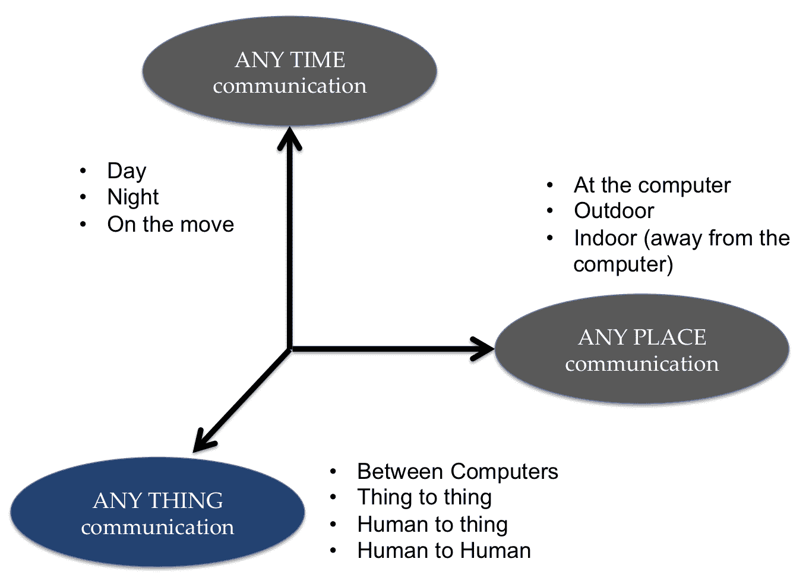
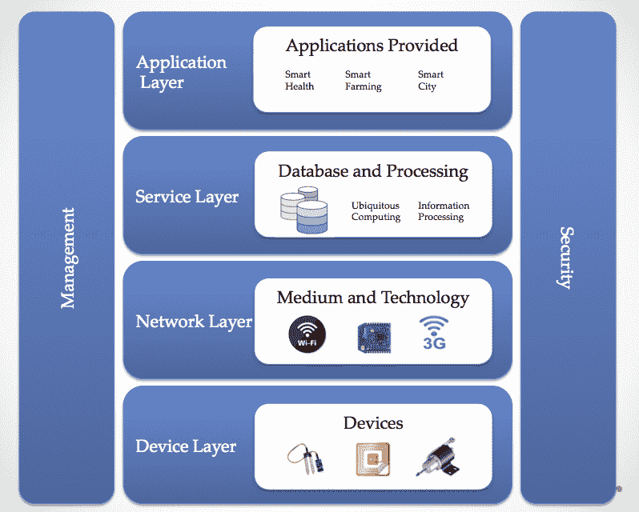
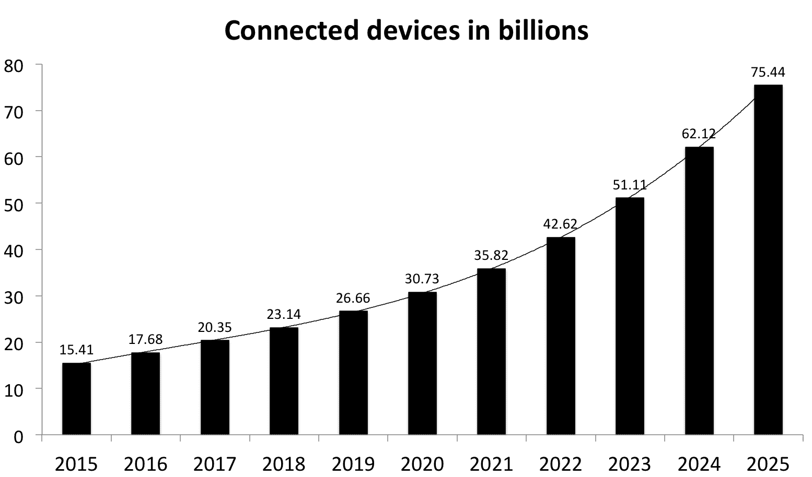
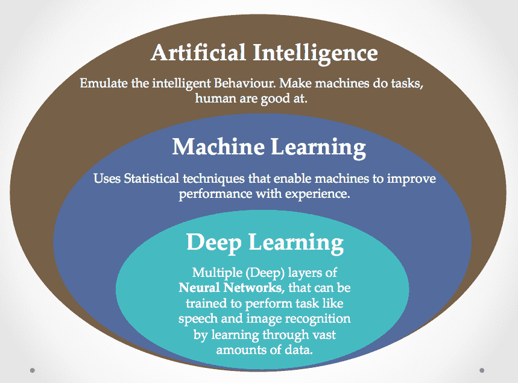
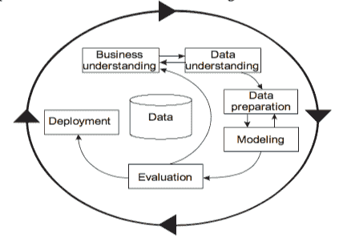
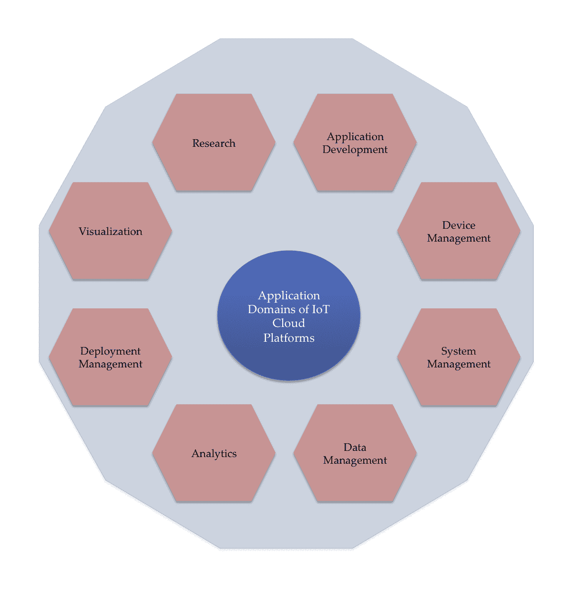

# 第一章：物联网和人工智能的原理与基础

恭喜你购买了本书；这表明你对跟进最新的科技进展充满兴趣。本书讨论的是当前商业环境中的三大趋势——**物联网**（**IoT**）、大数据和**人工智能**（**AI**）。随着连接互联网的设备数量呈指数级增长，并且这些设备生成的数据量也在指数级增加，使用人工智能和**深度学习**（**DL**）的分析与预测技术变得至关重要。本书专门针对第三个组件——物联网生成的大数据所需的各种分析和预测方法或模型，进行深入讲解。

本章将简要介绍这三大趋势，并扩展它们之间的相互依赖关系。物联网设备生成的数据上传到云端，因此你还将了解各种物联网云平台及其提供的数据服务。

本章将涵盖以下内容：

+   了解物联网中的*事物*是什么，哪些设备构成了这些事物，物联网的不同平台是什么，物联网垂直领域是什么

+   了解什么是大数据，并理解物联网生成的数据量如何处于大数据的范畴内

+   理解人工智能如何以及为什么对理解物联网生成的大量数据有所帮助

+   通过一幅插图，理解物联网、大数据和人工智能如何共同帮助我们塑造更美好的世界

+   学习执行分析所需的一些工具

# 什么是物联网 101？

“物联网”（IoT）这个术语是由凯文·阿什顿（Kevin Ashton）于 1999 年提出的。那时，大多数输入到计算机的数据都是由人类生成的；他提出，最好的方法是让计算机直接获取数据，而不需要任何人为干预。因此，他提出像 RFID 和传感器这样的设备，应该连接到网络，直接向计算机提供数据。

你可以阅读阿什顿完整的文章，了解他对物联网的定义，文章可以通过此链接阅读：[`www.itrco.jp/libraries/RFIDjournal-That%20Internet%20of%20Things%20Thing.pdf`](http://www.itrco.jp/libraries/RFIDjournal-That%20Internet%20of%20Things%20Thing.pdf)。

今天，物联网（也被称为**万物互联网**，有时也叫做雾网络）指的是连接到互联网的各种设备，如传感器、执行器和智能手机。这些设备可以是任何物品：带有可穿戴设备（甚至手机）的人、带有 RFID 标签的动物，甚至是我们日常使用的家电，如冰箱、洗衣机或咖啡机。这些设备可以是物理的——也就是存在于物理世界中，可以被感知、执行并连接的物品——也可以是信息世界中的虚拟物品——即那些不存在于物理世界，但以信息（数据）的形式存在，可以存储、处理和访问的物品。这些设备必须具备直接与互联网通信的能力；它们也有可能具备感知、执行、数据采集、数据存储和数据处理等功能。

**国际电信联盟**（**ITU**），一个联合国机构，定义物联网为：

“为信息社会提供全球基础设施，通过互联（物理和虚拟）事物，基于现有和不断发展的可互操作的信息和通信技术，提供先进的服务。”

你可以在[`www.itu.int/en/ITU-T/gsi/iot/Pages/default.aspx`](https://www.itu.int/en/ITU-T/gsi/iot/Pages/default.aspx)了解更多信息。

信息通信技术的广泛应用已经为我们提供了随时随地的通信；物联网（IoT）则为我们增加了**任何事物**之间的通信维度：



物联网引入的新维度（改编自 b-ITU-T Y.2060 报告）

预计物联网作为一项技术将对人类和我们生活的社会产生深远的影响。为了让你了解它可能带来的广泛影响，考虑以下场景：

+   你和我一样住在高楼大厦里，而且非常喜欢植物。经过大量的努力和细心照料，你用花盆打造了一个小小的室内花园。你的老板让你去出差一周，你担心没有水的植物会在一周内枯死。物联网的解决方案是为你的植物添加土壤湿度传感器，将它们连接到互联网，并安装执行器远程控制水源和人工阳光的开启或关闭。现在，无论你身处世界的哪个角落，你的植物都不会枯死，你还可以随时查看每棵植物的土壤湿度状况，按需浇水。

+   你在办公室度过了非常疲惫的一天；你只想回家，让有人为你做咖啡，准备好床铺，并加热浴缸的水，但可惜你一个人在家。现在不再是问题；物联网可以帮忙。你的物联网助手可以从咖啡机中准备出你喜欢的口味咖啡，指令智能热水器打开并维持你所需的水温，甚至请求智能空调开启并调节房间温度。

选择仅受你的想象力限制。前面提到的两个场景对应于消费者物联网——以消费者为中心的物联网应用。还有一个广阔的**工业物联网**（**IIoT**），在这个领域中，制造商和工业部门优化流程，实施远程监控功能，以提高生产力和效率。在本书中，你将体验到这两种物联网应用的实践。

# 物联网参考模型

就像互联网的 OSI 参考模型一样，物联网架构通过六个层次进行定义：四个横向层和两个纵向层。两个纵向层是**管理**和**安全**，它们分布在所有四个横向层上，如下图所示：



物联网层

**设备层**：在整个架构的底部，我们有设备层，也称为**感知层**。这一层包含了感知或控制物理世界以及获取数据所需的物理设备（即通过感知物理世界）。现有硬件，如传感器、RFID 和执行器，构成了感知层。

**网络层**：这一层提供网络支持，并通过有线或无线网络传输数据。该层安全地将来自设备层的设备信息传输到信息处理系统。**介质**和**技术**都是网络层的一部分。举例来说，包括 3G、UMTS、ZigBee、蓝牙、Wi-Fi 等。

**服务层**：这一层负责服务管理。它接收来自网络层的信息，将其存储到数据库中，处理这些信息，并可以根据结果做出自动决策。

**应用层**：这一层管理依赖于服务层处理过的信息的应用程序。物联网可以实现各种应用：智能城市、智能农业和智能家居等。

# 物联网平台

网络层的信息通常通过物联网平台进行管理。如今，许多公司提供物联网平台服务，帮助处理数据，并支持与不同硬件的无缝集成。由于物联网平台作为硬件与应用层之间的中介，因此也被称为物联网中间件，并且是物联网参考架构中的服务层的一部分。物联网平台提供了随时随地连接和通信的能力。在本书中，我们将简要介绍一些流行的物联网平台，如谷歌云平台、Azure 物联网、亚马逊 AWS 物联网、Predix 和 H2O。

你可以根据以下标准选择最适合你的物联网平台：

+   **可扩展性**：应当能够将新设备添加到现有物联网网络中，或删除已有设备

+   **易用性**：该系统应能够完美运行，按照所有规格要求提供服务，并且只需最小的干预。

+   **第三方集成**：异构设备和协议应能够相互连接并互通。

+   **部署选项**：它应能够在各种硬件设备和软件平台上运行。

+   **数据安全**：确保数据和设备的安全性。

# 物联网垂直行业

垂直市场是指提供特定行业、贸易、职业或其他具有特殊需求的顾客群体所需商品和服务的市场。物联网使得许多这样的垂直市场成为可能，一些主要的物联网垂直行业如下：

+   **智能建筑**：使用物联网技术的建筑不仅能减少资源消耗，还能提高居住或工作在其中的人的满意度。建筑配备智能传感器，除了监测资源消耗外，还可以主动检测住户的需求。通过这些智能设备和传感器收集的数据，能够远程监控建筑、能源、安全、景观、HVAC（暖通空调）、照明等系统。然后利用这些数据预测行动，并根据事件自动化，从而优化效率，节省时间、资源和成本。

+   **智能农业**：物联网可以使本地和商业农业更加环保、成本效益高且生产效率更高。通过在农场中安装传感器，可以帮助自动化灌溉过程。预计智能农业实践将显著提高生产力，从而增加食品资源。

+   **智慧城市**：智慧城市可以是拥有智能停车、智能公共交通系统等功能的城市。智慧城市能够解决交通、公共安全、能源管理等问题，为政府和市民提供服务。通过使用先进的物联网技术，它能够优化城市基础设施的使用，并提高市民的生活质量。

+   **联网医疗**：物联网使得远程实时进行重要业务和病患监测决策成为可能。个人佩戴医疗传感器以监测身体参数，如心跳、体温、血糖等。可穿戴传感器，如加速度计和陀螺仪，可以用来监测一个人的日常活动。

本书将作为案例研究介绍其中的一些。内容聚焦于信息处理和物联网应用，因此我们将不会深入探讨物联网参考架构中涉及的设备、架构和协议的细节。

感兴趣的读者可以参考以下文献，了解更多关于物联网架构和不同协议的信息：

+   Da Xu, Li, Wu He, and Shancang Li. *工业中的物联网：一项调查。* IEEE 工业信息学杂志 10.4 (2014): 2233-2243。

+   Khan, Rafiullah 等人，*未来互联网：物联网架构、可能的应用及关键挑战*，**信息技术前沿**（**FIT**），2012 年国际会议论文集，IEEE，2012 年。

+   该网站提供了物联网相关协议的概述：

    [`www.postscapes.com/internet-of-things-protocols/`](https://www.postscapes.com/internet-of-things-protocols/)。

# 大数据与物联网

物联网已经将以前从未连接到互联网的事物（如汽车发动机）连接起来，从而产生大量持续的数据流。以下截图展示了 IHS 对未来几年内连接设备数量的探索性数据。其估计显示，到 2025 年，物联网设备数量将达到 754.4 亿：



对 2025 年物联网设备增长的预测

IHS 的完整白皮书，*物联网平台：实现物联网*，可以在 PDF 格式下载：[`cdn.ihs.com/www/pdf/enabling-IOT.pdf`](https://cdn.ihs.com/www/pdf/enabling-IOT.pdf)。

传感器成本的降低、有效的功耗技术、大范围的连接性（红外、NFC、蓝牙、Wi-Fi 等）以及支持物联网部署和开发的云平台的可用性是物联网在我们家庭、个人生活和工业中普及的主要原因。这也促使公司考虑提供新服务并开发新商业模式。一些例子包括：

+   **Airbnb**：它将人们连接起来，使他们可以相互出租空闲的房间和小屋，并赚取佣金。

+   **Uber**：它将出租车司机与旅行者连接起来，通过旅行者的位置为他们指派最近的司机。

在此过程中生成的数据量既庞大又复杂，迫使我们采用大数据方法。大数据方法和物联网几乎是天作之合；二者协同工作。

物体持续生成大量数据流，提供其状态信息，如温度、污染水平、地理位置和接近度。生成的数据是时间序列格式并具有自相关性。由于数据的动态特性，这一任务变得具有挑战性。此外，生成的数据可以在边缘（传感器或网关）或云端进行分析。在将数据发送到云端之前，会执行某种形式的物联网数据转化。这可能涉及以下内容：

+   时间或空间分析

+   边缘数据汇总

+   数据汇聚

+   关联多个物联网数据流中的数据

+   清洗数据

+   填充缺失值

+   归一化数据

+   将其转化为适合云端的不同格式

在边缘，**复杂事件处理**（**CEP**）用于将来自多个来源的数据结合起来，推断出事件或模式。

这些数据通过流分析进行分析，例如，应用分析工具处理数据流，但洞察和规则是在离线模式下开发的。模型在离线构建后，应用于生成的数据流。这些数据可能以不同的方式进行处理：

+   **原子性**：一次使用单一数据

+   **微批处理**：每批次的数据组

+   **窗口化**：按批次处理时间段内的数据

流分析可以与 CEP 结合，在时间范围内合并事件并关联模式，以检测特殊模式（例如，异常或故障）。

# 人工智能的融合——物联网中的数据科学

数据科学家和机器学习工程师之间非常流行的一句话是<q>"AI is the new electricity"</q>，这是 Andrew Ng 教授在 NIPS 2017 中所说的，我们可以这样扩展它：*如果 AI 是新的电力，那么数据就是新的煤炭，而物联网则是新的煤矿*。

物联网生成大量数据；目前，90%的数据未被捕获，而被捕获的 10%中，大多数数据是时间依赖性的，几毫秒内就会失去其价值。手动持续监控这些数据既繁琐又昂贵。这就需要一种智能分析这些数据并从中获得洞察的方法；AI 的工具和模型为我们提供了以最小人工干预完成这一目标的途径。本书的主要重点将是理解可以应用于物联网数据的各种 AI 模型和技术。我们将使用**机器学习**（**ML**）和深度学习（DL）算法。以下截图说明了**人工智能**、**机器学习**和**深度学习**之间的关系：



AI、ML 和 DL

通过观察多个事物的行为，物联网（借助大数据和人工智能）旨在深入了解数据并优化基础过程。这涉及多个挑战：

+   存储实时生成的事件

+   对存储的事件运行分析查询

+   使用 AI/ML/DL 技术对数据进行分析，以获取洞察并进行预测

# 跨行业标准数据挖掘过程

对于物联网（IoT）问题，最常用的**数据管理**（**DM**）方法论是 Chapman 等人提出的**跨行业标准数据挖掘过程**（**CRISP-DM**）。这是一种过程模型，描述了成功完成数据挖掘所需执行的任务。它是一种供应商独立的方法论，分为六个不同的阶段：

1.  **商业理解**

1.  **数据理解**

1.  **数据准备**

1.  **建模**

1.  **评估**

1.  **部署**

以下图表展示了不同的阶段：



CRISP-DM 中的不同阶段

如我们所见，这是一个连续的过程模型，数据科学和 AI 在第 2 到第 5 步骤中起着重要作用。

关于 CRISP-DM 及其所有阶段的详细信息，可以在以下内容中阅读：

Marbán, Óscar, Gonzalo Mariscal, 和 Javier Segovia。 *一个数据挖掘与知识发现过程模型*。 *《数据挖掘与现实生活应用中的知识发现》*。InTech，2009 年。

# AI 平台和 IoT 平台

今天有大量的云平台同时具备 AI 和 IoT 能力。这些平台提供集成传感器和设备并在云中执行分析的能力。全球市场上存在 30 多种云平台，每种平台针对不同的 IoT 垂直领域和服务。以下截图列出了 AI/IoT 平台支持的各种服务：



不同 AI/IoT 平台支持的服务

让我们简要了解一些流行的云平台。在第十二章*,* *将所有内容结合起来*，我们将学习如何使用最流行的云平台。以下是一些流行的云平台的列表：

+   **IBM Watson IoT 平台**：由 IBM 托管，该平台提供设备管理；它使用 MQTT 协议与 IoT 设备和应用程序连接。它提供实时可扩展的连接性。数据可以存储一段时间并实时访问。IBM Watson 还提供 Bluemix **平台即服务**（**PaaS**）用于分析和可视化。我们可以编写代码来构建和管理与数据和连接设备交互的应用程序。它支持 Python、C#、Java 和 Node.js。

+   **Microsoft IoT-Azure IoT 套件**：它提供一系列基于 Azure PaaS 的预配置解决方案。它使得 IoT 设备与云之间实现可靠和安全的双向通信。预配置的解决方案包括数据可视化、远程监控以及对实时 IoT 遥测数据进行规则和警报配置。它还提供 Azure Stream Analytics 用于实时处理数据。Azure Stream Analytics 允许我们使用 Visual Studio。它支持 Python、Node.js、C 和 Arduino，具体取决于 IoT 设备。

+   **Google Cloud IoT**：Google Cloud IoT 提供一个完全托管的服务，用于安全连接和管理 IoT 设备。它支持 MQTT 和 HTTP 协议。它还提供 IoT 设备与云之间的双向通信。它支持 Go、PHP、Ruby、JS、.NET、Java、Objective-C 和 Python。它还提供 BigQuery，允许用户进行数据分析和可视化。

+   **Amazon AWS IoT**：Amazon AWS IoT 允许 IoT 设备通过 MQTT、HTTP 和 WebSockets 进行通信。它提供安全的双向通信，连接 IoT 设备与云端。它还拥有一个规则引擎，可以将数据与其他 AWS 服务集成并进行数据转换。可以定义规则，触发在 Java、Python 或 Node.js 中的用户代码执行。AWS Lambda 使我们能够使用自己训练的模型。

# 本书中使用的工具

为了实现基于 IoT 的服务，我们需要遵循自下而上的方法。对于每个 IoT 垂直领域，我们需要找到分析方法和数据，最后将其实现为代码。

由于 Python 在几乎所有的 AI 和 IoT 平台上都有广泛的支持，本书将使用 Python 进行编码。除了 Python，还会使用一些辅助库，如 NumPy、pandas、SciPy、Keras 和 TensorFlow 来对数据进行 AI/ML 分析。对于可视化，我们将使用 Matplotlib 和 Seaborn。

# TensorFlow

TensorFlow 是一个由 Google Brain 团队开发的开源软件库，提供了实现深度神经网络的函数和 API。它支持 Python、C++、Java、R 和 Go。它可以用于多个平台，包括 CPU、GPU、移动设备，甚至是分布式系统。TensorFlow 允许模型部署，并且在生产环境中使用更为便捷。TensorFlow 中的优化器通过自动计算梯度并应用这些梯度来更新权重和偏置，从而简化了训练深度神经网络的任务。

在 TensorFlow 中，一个程序有两个不同的组件：

+   **计算图** 是一个由节点和边组成的网络。在这里，所有的数据、变量、占位符以及要执行的计算都被定义。TensorFlow 支持三种数据对象：常量、变量和占位符。

+   **执行图** 实际上是通过 `Session` 对象来计算网络的。实际的计算和从一个层到另一个层的信息传递发生在 `Session` 对象中。

让我们来看一下在 TensorFlow 中执行矩阵乘法的代码。完整的代码可以从 GitHub 仓库中访问（[`github.com/PacktPublishing/Hands-On-Artificial-Intelligence-for-IoT`](https://github.com/PacktPublishing/Hands-On-Artificial-Intelligence-for-IoT)），文件名为 `matrix_multiplication.ipynb`：

```py
import tensorflow as tf
import numpy as np
```

这部分导入了 TensorFlow 模块。接下来，我们定义计算图。`mat1` 和 `mat2` 是我们需要相乘的两个矩阵：

```py
# A random matrix of size [3,5]
mat1 = np.random.rand(3,5)  
# A random matrix of size [5,2]
mat2 = np.random.rand(5,2)  

```

我们声明两个占位符 `A` 和 `B`，这样我们就可以在运行时传递它们的值。在计算图中，我们声明所有的数据和计算对象：

```py
# Declare placeholders for the two matrices 
A = tf.placeholder(tf.float32, None, name='A')
B = tf.placeholder(tf.float32, None, name='B')  
```

这声明了两个名为 `A` 和 `B` 的占位符；`tf.placeholder` 方法的参数指定占位符的数据类型为 `float32`。由于指定的形状是 `None`，我们可以传入任意形状的张量，并为操作指定一个可选的名称。接下来，我们定义了使用矩阵乘法方法 `tf.matmul` 要执行的操作：

```py
C = tf.matmul(A,B)
```

执行图被声明为一个 `Session` 对象，两个矩阵 `mat1` 和 `mat2` 分别被传入占位符 `A` 和 `B` 中：

```py
with tf.Session() as sess:
    result = sess.run(C, feed_dict={A: mat1, B:mat2})
    print(result)
```

# Keras

Keras 是一个运行在 TensorFlow 之上的高级 API。它允许快速且轻松的原型开发。它支持卷积神经网络和循环神经网络，甚至是两者的组合。它可以在 CPU 和 GPU 上运行。以下代码使用 Keras 执行矩阵乘法：

```py
# Import the libraries
import keras.backend as K
import numpy as np

# Declare the data
A = np.random.rand(20,500)
B = np.random.rand(500,3000)

#Create Variable
x = K.variable(value=A)
y = K.variable(value=B)
z = K.dot(x,y)
print(K.eval(z))
```

# 数据集

在接下来的章节中，我们将学习不同的深度学习（DL）模型和机器学习（ML）方法。它们都基于数据进行工作；尽管有大量数据集可供展示这些模型的工作方式，但在本书中，我们将使用通过无线传感器和其他物联网（IoT）设备免费提供的数据集。以下是本书中使用的一些数据集及其来源。

# 联合循环电厂数据集

该数据集包含 9,568 个数据点，这些数据点是在六年的时间里（2006-2011）从一个**联合循环电厂**（**CCPP**）收集的。CCPP 使用两台涡轮机发电，分别是燃气涡轮机和蒸汽涡轮机。CCPP 电厂的三个主要组成部分是：燃气涡轮机、热回收系统和蒸汽涡轮机。该数据集可在 UCI 机器学习库中获取（[`archive.ics.uci.edu/ml/datasets/combined+cycle+power+plant`](http://archive.ics.uci.edu/ml/datasets/combined+cycle+power+plant)），由 Namik Kemal 大学的 Pinar Tufekci 和 Bogazici 大学的 Heysem Kaya 收集。数据包含四个特征，这些特征决定了平均环境变量。这些平均值是从电厂周围的各种传感器收集的，传感器每秒记录一次环境变量。目标是预测每小时的净电能输出。数据以`xls`和`ods`格式提供。

数据集中的特征如下：

+   **环境温度**（**AT**）的范围是 1.81°C 到 37.11°C

+   **环境压力**（**AP**）的范围是 992.89 至 1033.30 毫巴

+   **相对湿度**（**RH**）的范围是 25.56%到 100.16%

+   排气**真空**（**V**）的范围是 25.36 至 81.56 厘米汞柱

+   每小时净电能输出（PE）的范围是 420.26 至 495.76 兆瓦

关于数据和问题的更多细节可以从以下内容中了解：

+   Pınar Tüfekci，*基于机器学习方法预测基荷运行的联合循环电厂满负荷电力输出*，《国际电力与能源系统期刊》，第 60 卷，2014 年 9 月，第 126-140 页，ISSN 0142-0615。

+   Heysem Kaya, Pınar Tüfekci, Sadık Fikret Gürgen: *结合燃气与蒸汽涡轮机的功率预测的本地与全球学习方法*，《2012 年国际计算机与电子工程新兴趋势会议论文集》ICETCEE 2012，第 13-18 页（2012 年 3 月，迪拜）。

# 葡萄酒质量数据集

世界各地的酒厂必须进行葡萄酒认证和质量评估，以保障人类健康。葡萄酒认证通过物理化学分析和感官测试进行。随着技术的进步，物理化学分析可以通过体外设备常规进行。

我们在本书中使用这个数据集进行分类示例。该数据集可以从 UCI-ML 存储库下载（[`archive.ics.uci.edu/ml/datasets/Wine+Quality`](https://archive.ics.uci.edu/ml/datasets/Wine+Quality)）。葡萄酒质量数据集包含了对不同样本的红葡萄酒和白葡萄酒进行的物理化学测试结果。每个样本还由专家品酒师根据 0 到 10 的评分标准评定质量。

该数据集共有 4,898 个实例，总共有 12 个属性。这 12 个属性如下：

+   固定酸度

+   挥发性酸度

+   柠檬酸

+   残余糖

+   氯化物

+   游离二氧化硫

+   总二氧化硫

+   密度

+   pH

+   硫酸盐

+   酒精

+   质量

该数据集提供 CSV 格式文件。

关于该数据集的详细信息可以参见这篇论文：Cortez, Paulo 等人。*通过数据挖掘葡萄酒偏好模型*。《决策支持系统》47.4（2009）：547-553（[`repositorium.sdum.uminho.pt/bitstream/1822/10029/1/wine5.pdf`](https://repositorium.sdum.uminho.pt/bitstream/1822/10029/1/wine5.pdf)）。

# 空气质量数据

空气污染是对人类健康的重大环境风险。研究发现，改善空气质量与缓解各种健康问题之间存在相关性，例如呼吸道感染、心血管疾病和肺癌。世界各国的气象组织通过广泛的传感器网络为我们提供了实时空气质量数据。这些数据可以通过各个组织提供的网络 API 进行访问。

在本书中，我们将使用历史空气质量数据来训练我们的网络并预测死亡率。英国的历史数据可以通过 Kaggle 自由获取（[`www.kaggle.com/c/predict-impact-of-air-quality-on-death-rates`](https://www.kaggle.com/c/predict-impact-of-air-quality-on-death-rates)），这些空气质量数据包括日均**臭氧**（**O3**）、**二氧化氮**（**NO2**）、直径小于或等于 10 微米的颗粒物（PM10）和 PM2.5（2.5 微米或更小）以及温度。英国地区的死亡率（每 10 万人中的死亡人数）由英国国家统计局提供的数据得出。

# 摘要

在本章中，我们学习了物联网、大数据和人工智能。本章介绍了物联网中常用的术语。我们了解了物联网架构在数据管理和数据分析中的应用。物联网设备生成的大量数据需要特殊的方式来处理。

我们了解了数据科学和人工智能如何帮助进行分析和预测，尤其是在许多物联网设备所生成的数据中。本章简要介绍了各种物联网平台以及一些流行的物联网行业。我们还了解了专用的深度学习库：TensorFlow 和 Keras。最后，我们介绍了本书中将要使用的一些数据集。

下一章将介绍如何访问以不同格式提供的数据集。
