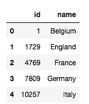

# 第二章：IoT 数据访问与分布式处理

数据无处不在：图像、语音、文本、天气信息、你车速、你的最后一次 EMI、变动的股价。随着 **物联网**（**IoT**）系统的集成，产生的数据量大幅增加；例如，传感器读数可以用于房间温度、土壤碱度等。这些数据以各种格式存储并提供访问。在本章中，我们将学习如何读取、保存和处理一些流行格式的数据。具体来说，你将执行以下操作：

+   访问 TXT 格式的数据

+   通过 CSV、pandas 和 NumPy 模块读取和写入 csv 格式数据

+   使用 JSON 和 pandas 访问 JSON 数据

+   学习如何使用 PyTables、pandas 和 h5py 处理 HDF5 格式

+   使用 SQLite 和 MySQL 处理 SQL 数据库

+   使用 MongoDB 处理 NoSQL 数据库

+   使用 Hadoop 的分布式文件系统

# TXT 格式

存储数据的最简单和常见格式之一是 TXT 格式；许多 IoT 传感器以简单的 `.txt` 文件格式记录传感器读取数据及其时间戳。Python 提供了内置函数，用于创建、读取和写入 TXT 文件。

我们可以在 Python 中直接访问 TXT 文件，而无需使用任何模块；在这种情况下，数据为字符串类型，你需要将其转换为其他类型以便使用。或者，我们可以使用 NumPy 或 pandas。

# 在 Python 中使用 TXT 文件

Python 提供了内置函数，用于读取和写入 TXT 文件。完整的功能通过四组函数实现：`open()`、`read()`、`write()` 和 `close()`。顾名思义，它们分别用于打开文件、读取文件、写入文件和最终关闭文件。如果你处理的是字符串数据（文本），这是最佳选择。在本节中，我们将使用 `Shakespeare` 的剧本，以 TXT 格式存储；文件可以从 MIT 网站下载：[`ocw.mit.edu/ans7870/6/6.006/s08/lecturenotes/files/t8.shakespeare.txt`](https://ocw.mit.edu/ans7870/6/6.006/s08/lecturenotes/files/t8.shakespeare.txt)。

我们定义以下变量来访问数据：

```py
data_folder = '../../data/Shakespeare'
data_file = 'alllines.txt'
```

这里的第一步是打开文件：

```py
f = open(data_file)
```

接下来，我们读取整个文件；我们可以使用 `read` 函数，它会将整个文件读取为一个单一的字符串：

```py
contents = f.read()
```

这会将整个文件（包含 4,583,798 个字符）读取到 `contents` 变量中。让我们来查看 `contents` 变量的内容；以下命令将打印出前 `1000` 个字符：

```py
print(contents[:1000])
```

上述代码将输出如下结果：

```py
"ACT I"
"SCENE I. London. The palace."
"Enter KING HENRY, LORD JOHN OF LANCASTER, the EARL of WESTMORELAND, SIR WALTER BLUNT, and others"
"So shaken as we are, so wan with care,"
"Find we a time for frighted peace to pant,"
"And breathe short-winded accents of new broils"
"To be commenced in strands afar remote."
"No more the thirsty entrance of this soil"
"will daub her lips with her own children's blood,"
"Nor more will trenching war channel her fields,"
"Nor bruise her flowerets with the armed hoofs"
"Of hostile paces: those opposed eyes,"
"Which, like the meteors of a troubled heaven,"
"All of one nature, of one substance bred,"
"Did lately meet in the intestine shock"
"And furious close of civil butchery"
"will now, in mutual well-beseeming ranks,"
"March all one way and be no more opposed"
"Against acquaintance, kindred and allies:"
"The edge of war, like an ill-sheathed knife,"
"No more will cut his master. Therefore, friends,"
"As far as to the sepulchre of Christ,"
"Whose
```

如果 TXT 文件包含数值数据，最好使用 NumPy；如果数据混合，pandas 是最佳选择。

# CSV 格式

**逗号分隔值**（**CSV**）文件是由物联网系统生成的存储表格数据的最流行格式。在 `.csv` 文件中，记录的值存储在纯文本行中，每行包含由分隔符分隔的字段值。默认情况下分隔符是逗号，但可以配置为任何其他字符。在本节中，我们将学习如何使用 Python 的 `csv`、`numpy` 和 `pandas` 模块处理 CSV 文件中的数据。我们将使用 `household_power_consumption` 数据文件。该文件可以从以下 GitHub 链接下载：[`github.com/ahanse/machlearning/blob/master/household_power_consumption.csv`](https://github.com/ahanse/machlearning/blob/master/household_power_consumption.csv)。为了访问数据文件，我们定义以下变量：

```py
data_folder = '../../data/household_power_consumption' 
data_file = 'household_power_consumption.csv'
```

一般来说，为了快速从 CSV 文件中读取数据，使用 Python 的 `csv` 模块；但是，如果数据需要被解释为日期和数字数据字段的混合，最好使用 pandas 包。如果数据只是数字，NumPy 是最合适的包。

# 使用 `csv` 模块处理 CSV 文件

在 Python 中，`csv` 模块提供了用于读写 CSV 文件的类和方法。`csv.reader` 方法从中创建一个可迭代地读取行的 reader 对象。每次从文件中读取一行时，reader 对象返回一个字段列表。例如，以下代码演示了如何读取数据文件并打印行：

```py
import csv
import os

with open(os.path.join(data_folder,data_file),newline='') as csvfile:
   csvreader = csv.reader(csvfile)
   for row in csvreader:
     print(row)
```

行作为字段值列表打印：

```py
['date', 'time', 'global_active_power', 'global_reactive_power', 'voltage', 'global_intensity', 'sub_metering_1', 'sub_metering_2', 'sub_metering_3'] ['0007-01-01', '00:00:00', '2.58', '0.136', '241.97', '10.6', '0', '0', '0'] ['0007-01-01', '00:01:00', '2.552', '0.1', '241.75', '10.4', '0', '0', '0'] ['0007-01-01', '00:02:00', '2.55', '0.1', '241.64', '10.4', '0', '0', '0']
```

`csv.writer` 方法返回一个对象，可以用来向文件写入行。例如，以下代码将文件的前 10 行写入临时文件，然后打印它：

```py
# read the file and write first ten rows
with open(os.path.join(data_folder, data_file), newline='') as csvfile, \
        open(os.path.join(data_folder, 'temp.csv'), 'w', newline='') as tempfile:
    csvreader = csv.reader(csvfile)
    csvwriter = csv.writer(tempfile)
    for row, i in zip(csvreader, range(10)):
        csvwriter.writerow(row)

# read and print the newly written file
with open(os.path.join(data_folder, 'temp.csv'), newline='') as tempfile:
    csvreader = csv.reader(tempfile)
    for row in csvreader:
        print(row)
```

`delimiter` 字段和 `quoting` 字段字符是创建 `reader` 和 `writer` 对象时可以设置的重要属性。

默认情况下，`delimiter` 字段为 `,`，其他分隔符可以通过 `reader` 或 `writer` 函数的 `delimiter` 参数指定。例如，以下代码将文件保存为 `|` 作为 `delimiter`：

```py
    # read the file and write first ten rows with '|' delimiter
with open(os.path.join(data_folder, data_file), newline='') as csvfile, \
        open(os.path.join(data_folder, 'temp.csv'), 'w', newline='') as tempfile:
    csvreader = csv.reader(csvfile)
    csvwriter = csv.writer(tempfile, delimiter='|')
    for row, i in zip(csvreader, range(10)):
        csvwriter.writerow(row)

# read and print the newly written file
with open(os.path.join(data_folder, 'temp.csv'), newline='') as tempfile:
    csvreader = csv.reader(tempfile, delimiter='|')
    for row in csvreader:
        print(row)
```

如果在读取文件时未指定 `delimiter` 字符，则行将作为一个字段读取并打印如下：

```py
['0007-01-01|00:00:00|2.58|0.136|241.97|10.6|0|0|0']
```

`quotechar` 指定用于包围字段的字符。`quoting` 参数指定哪种字段可以用 `quotechar` 包围。`quoting` 参数可以有以下值之一：

+   `csv.QUOTE_ALL`：所有字段都加引号

+   `csv.QUOTE_MINIMAL`：只有包含特殊字符的字段才加引号

+   `csv.QUOTE_NONNUMERIC`：所有非数值字段都加引号

+   `csv.QUOTE_NONE`：所有字段都不加引号

作为例子，让我们首先打印临时文件：

```py
0007-01-01|00:00:00|2.58|0.136|241.97|10.6|0|0|0
0007-01-01|00:01:00|2.552|0.1|241.75|10.4|0|0|0
0007-01-01|00:02:00|2.55|0.1|241.64|10.4|0|0|0
0007-01-01|00:03:00|2.55|0.1|241.71|10.4|0|0|0
0007-01-01|00:04:00|2.554|0.1|241.98|10.4|0|0|0
0007-01-01|00:05:00|2.55|0.1|241.83|10.4|0|0|0
0007-01-01|00:06:00|2.534|0.096|241.07|10.4|0|0|0
0007-01-01|00:07:00|2.484|0|241.29|10.2|0|0|0
0007-01-01|00:08:00|2.468|0|241.23|10.2|0|0|0
```

现在让我们用所有字段都加引号保存它：

```py
# read the file and write first ten rows with '|' delimiter, all quoting and * as a quote charachetr.
with open(os.path.join(data_folder, data_file), newline='') as csvfile, \
        open('temp.csv', 'w', newline='') as tempfile:
    csvreader = csv.reader(csvfile)
    csvwriter = csv.writer(tempfile, delimiter='|', quotechar='*',quoting=csv.QUOTE_ALL)
    for row, i in zip(csvreader, range(10)):
        csvwriter.writerow(row)
```

文件将使用指定的引号字符保存：

```py
*0007-01-01*|*00:00:00*|*2.58*|*0.136*|*241.97*|*10.6*|*0*|*0*|*0*
*0007-01-01*|*00:01:00*|*2.552*|*0.1*|*241.75*|*10.4*|*0*|*0*|*0*
*0007-01-01*|*00:02:00*|*2.55*|*0.1*|*241.64*|*10.4*|*0*|*0*|*0*
*0007-01-01*|*00:03:00*|*2.55*|*0.1*|*241.71*|*10.4*|*0*|*0*|*0*
*0007-01-01*|*00:04:00*|*2.554*|*0.1*|*241.98*|*10.4*|*0*|*0*|*0*
*0007-01-01*|*00:05:00*|*2.55*|*0.1*|*241.83*|*10.4*|*0*|*0*|*0*
*0007-01-01*|*00:06:00*|*2.534*|*0.096*|*241.07*|*10.4*|*0*|*0*|*0*
*0007-01-01*|*00:07:00*|*2.484*|*0*|*241.29*|*10.2*|*0*|*0*|*0*
*0007-01-01*|*00:08:00*|*2.468*|*0*|*241.23*|*10.2*|*0*|*0*|*0*
```

记得使用相同的参数读取文件；否则，`*` 引号字符将被视为字段值的一部分，并打印如下：

```py
['*0007-01-01*', '*00:00:00*', '*2.58*', '*0.136*', '*241.97*', '*10.6*', '*0*', '*0*', '*0*']
```

使用正确的参数与`reader`对象一起打印如下内容：

```py
['0007-01-01', '00:00:00', '2.58', '0.136', '241.97', '10.6', '0', '0', '0']
```

现在让我们看看如何使用 pandas，另一个流行的 Python 库，来读取 CSV 文件。

# 使用 pandas 模块处理 CSV 文件

在 pandas 中，`read_csv()`函数读取 CSV 文件后返回一个 DataFrame：

```py
df = pd.read_csv('temp.csv')
print(df)
```

DataFrame 将如下所示地打印：

```py
         date      time  global_active_power  global_reactive_power  voltage  \
0  0007-01-01  00:00:00                2.580                  0.136   241.97   
1  0007-01-01  00:01:00                2.552                  0.100   241.75   
2  0007-01-01  00:02:00                2.550                  0.100   241.64   
3  0007-01-01  00:03:00                2.550                  0.100   241.71   
4  0007-01-01  00:04:00                2.554                  0.100   241.98   
5  0007-01-01  00:05:00                2.550                  0.100   241.83   
6  0007-01-01  00:06:00                2.534                  0.096   241.07   
7  0007-01-01  00:07:00                2.484                  0.000   241.29   
8  0007-01-01  00:08:00                2.468                  0.000   241.23   

   global_intensity  sub_metering_1  sub_metering_2  sub_metering_3  
0              10.6               0               0               0  
1              10.4               0               0               0  
2              10.4               0               0               0  
3              10.4               0               0               0  
4              10.4               0               0               0  
5              10.4               0               0               0  
6              10.4               0               0               0  
7              10.2               0               0               0  
8              10.2               0               0               0  
```

我们在前面的输出中看到，pandas 自动将`date`和`time`列解释为相应的数据类型。pandas 的 DataFrame 可以通过`to_csv()`函数保存到 CSV 文件中：

```py
df.to_csv('temp1.cvs')
```

pandas 在读取和写入 CSV 文件时提供了很多参数。以下是其中的一些及其使用方法：

+   `header`：定义要用作标题的行号，如果文件没有标题则为“无”。

+   `sep`：定义行中字段分隔符的字符。默认情况下，`sep`的值设置为`,`。

+   `names`：为文件中的每一列定义列名。

+   `usecols`：定义需要从 CSV 文件中提取的列。没有在此参数中提到的列将不会被读取。

+   `dtype`：定义 DataFrame 中各列的字段类型。

其他许多可用选项可以在以下链接中查阅：[`pandas.pydata.org/pandas-docs/stable/generated/pandas.read_csv.html`](https://pandas.pydata.org/pandas-docs/stable/generated/pandas.read_csv.html) 和 [`pandas.pydata.org/pandas-docs/stable/generated/pandas.DataFrame.to_csv.html`](https://pandas.pydata.org/pandas-docs/stable/generated/pandas.DataFrame.to_csv.html)。

现在让我们看看如何使用 NumPy 模块读取 CSV 文件中的数据。

# 使用 NumPy 模块处理 CSV 文件

NumPy 模块提供了两种从 CSV 文件读取值的函数：`np.loadtxt()`和`np.genfromtxt()`。

`np.loadtxt`的一个示例如下：

```py
arr = np.loadtxt('temp.csv', skiprows=1, usecols=(2,3), delimiter=',')
arr
```

上述代码读取了我们之前创建的文件中的第`3`列和第`4`列，并将它们保存到一个 9×2 的数组中，如下所示：

```py
array([[2.58 , 0.136],
       [2.552, 0.1  ],
       [2.55 , 0.1  ],
       [2.55 , 0.1  ],
       [2.554, 0.1  ],
       [2.55 , 0.1  ],
       [2.534, 0.096],
       [2.484, 0\.   ],
       [2.468, 0\.   ]])
```

`np.loadtxt()`函数无法处理缺失数据的 CSV 文件。对于缺失数据的情况，可以使用`np.genfromtxt()`。这两个函数都提供了许多其他参数；详细信息可以参考 NumPy 文档。以下代码可以使用`np.genfromtxt()`重写：

```py
arr = np.genfromtxt('temp.csv', skip_header=1, usecols=(2,3), delimiter=',')
```

作为应用 AI 于物联网数据后得到的 NumPy 数组，可以使用`np.savetxt()`保存。例如，之前加载的数组可以按如下方式保存：

```py
np.savetxt('temp.csv', arr, delimiter=',')
```

`np.savetxt()`函数也接受各种其他有用的参数，例如保存字段和标题的格式。有关此函数的更多详细信息，请查看 NumPy 文档。

CSV 是物联网平台和设备上最流行的数据格式。在本节中，我们学习了如何使用 Python 的三个不同包来读取 CSV 数据。在下一节中，我们将学习另一个流行格式——XLSX。

# XLSX 格式

Excel 是 Microsoft Office 套件中的一个组件，是存储和可视化数据的流行格式之一。从 2010 年起，Office 开始支持 `.xlsx` 格式。我们可以使用 OpenPyXl 和 pandas 函数来读取 XLSX 文件。

# 使用 OpenPyXl 处理 XLSX 文件

OpenPyXl 是一个用于读取和写入 Excel 文件的 Python 库。它是一个开源项目。通过以下命令可以创建一个新的 `workbook`：

```py
wb = Workbook()
```

我们可以通过以下命令访问当前 `active` 工作表：

```py
ws = wb.active()
```

要更改工作表名称，使用 `title` 命令：

```py
ws.title = "Demo Name"
```

可以使用 `append` 方法将一行数据添加到工作表：

```py
ws.append()
```

可以使用 `create_sheet()` 方法创建一个新的工作表。可以通过 `column` 和 `row` 值在活动工作表中创建一个单独的单元格：

```py
# Assigns the cell corresponding to 
# column A and row 10 a value of 5
ws.['A10'] = 5  
#or
ws.cell(column=1, row=10, value=5)
```

可以使用 `save` 方法保存工作簿。要加载现有工作簿，我们可以使用 `load_workbook` 方法。可以通过 `get_sheet_names()` 获取 Excel 工作簿中不同工作表的名称。

以下代码创建一个包含三个工作表的 Excel 工作簿并保存；之后，它加载该工作表并访问一个单元格。代码可以在 GitHub 上通过 `OpenPyXl_example.ipynb` 访问：

```py
# Creating and writing into xlsx file
from openpyxl import Workbook
from openpyxl.compat import range
from openpyxl.utils import get_column_letter
wb = Workbook()
dest_filename = 'empty_book.xlsx'
ws1 = wb.active
ws1.title = "range names"
for row in range(1, 40):
 ws1.append(range(0,100,5))
ws2 = wb.create_sheet(title="Pi")
ws2['F5'] = 2 * 3.14
ws2.cell(column=1, row=5, value= 3.14)
ws3 = wb.create_sheet(title="Data")
for row in range(1, 20):
 for col in range(1, 15):
 _ = ws3.cell(column=col, row=row, value="\
 {0}".format(get_column_letter(col)))
print(ws3['A10'].value)
wb.save(filename = dest_filename)

# Reading from xlsx file
from openpyxl import load_workbook
wb = load_workbook(filename = 'empty_book.xlsx')
sheet_ranges = wb['range names']
print(wb.get_sheet_names())
print(sheet_ranges['D18'].value)
```

您可以通过其文档了解更多关于 OpenPyXL 的信息，文档地址为 [`openpyxl.readthedocs.io/en/stable/`](https://openpyxl.readthedocs.io/en/stable/)。

# 使用 pandas 处理 XLSX 文件

我们可以借助 pandas 加载现有的 `.xlsx` 文件。`read_excel` 方法用于将 Excel 文件读取为 DataFrame。该方法使用一个参数 `sheet_name`，用于指定我们要加载的工作表。工作表名称可以通过字符串或从 0 开始的数字来指定。`to_excel` 方法可以用来写入 Excel 文件。

以下代码读取一个 Excel 文件，对其进行操作并保存。代码可以在 GitHub 上通过 `Pandas_xlsx_example.ipynb` 访问：

```py
import pandas as pd
df = pd.read_excel("empty_book.xlsx", sheet_name=0)
df.describe()
result = df * 2
result.describe()
result.to_excel("empty_book_modified.xlsx")
```

# 处理 JSON 格式

**JavaScript** **对象** **表示法**（**JSON**）是物联网系统中另一种流行的数据格式。在本节中，我们将学习如何使用 Python 的 JSON、NumPy 和 pandas 包来读取 JSON 数据。

在本节中，我们将使用 `zips.json` 文件，该文件包含美国 ZIP 代码、城市代码、地理位置详情和州代码。该文件中的 JSON 对象按以下格式记录：

```py
{ "_id" : "01001", "city" : "AGAWAM", "loc" : [ -72.622739, 42.070206 ], "pop" : 15338, "state" : "MA" }
```

# 使用 JSON 模块处理 JSON 文件

要加载和解码 JSON 数据，使用 `json.load()` 或 `json.loads()` 函数。作为示例，以下代码读取 `zips.json` 文件中的前 10 行并美观地打印出来：

```py
import os
import json
from pprint import pprint

with open(os.path.join(data_folder,data_file)) as json_file:
    for line,i in zip(json_file,range(10)):
        json_data = json.loads(line)
        pprint(json_data)
```

这些对象的打印结果如下：

```py
{'_id': '01001',
 'city': 'AGAWAM',
 'loc': [-72.622739, 42.070206],
 'pop': 15338,
 'state': 'MA'}
```

`json.loads()` 函数接受字符串对象作为输入，而 `json.load()` 函数接受文件对象作为输入。两者都会解码 JSON 对象并将其加载为 Python 字典对象，存储在 `json_data` 文件中。

`json.dumps()`函数接受一个对象并生成一个 JSON 字符串，而`json.dump()`函数接受一个对象并将 JSON 字符串写入文件。因此，这两个函数的作用正好与`json.loads()`和`json.load()`函数相反。

# 使用 pandas 模块操作 JSON 文件

JSON 字符串或文件可以使用`pandas.read_json()`函数读取，该函数返回一个 DataFrame 或 Series 对象。例如，以下代码读取`zips.json`文件：

```py
df = pd.read_json(os.path.join(data_folder,data_file), lines=True)
print(df)
```

我们设置`lines=True`，因为每行包含一个单独的 JSON 格式对象。如果没有将这个参数设置为`True`，pandas 会引发`ValueError`。DataFrame 如下所示：

```py
         _id             city                               loc    pop state
0       1001           AGAWAM           [-72.622739, 42.070206]  15338    MA
1       1002          CUSHMAN            [-72.51565, 42.377017]  36963    MA
...      ...              ...                               ...    ...   ...
29351  99929         WRANGELL          [-132.352918, 56.433524]   2573    AK
29352  99950        KETCHIKAN           [-133.18479, 55.942471]    422    AK

[29353 rows x 5 columns]
```

要将 pandas 的 DataFrame 或 Series 对象保存到 JSON 文件或字符串中，可以使用`Dataframe.to_json()`函数。

这两个函数的更多信息可以在以下链接中找到：[`pandas.pydata.org/pandas-docs/stable/generated/pandas.read_json.html`](https://pandas.pydata.org/pandas-docs/stable/generated/pandas.read_json.html)和[`pandas.pydata.org/pandas-docs/stable/generated/pandas.DataFrame.to_json.html`](https://pandas.pydata.org/pandas-docs/stable/generated/pandas.DataFrame.to_json.html)。

尽管 CSV 和 JSON 仍然是 IoT 数据中最受欢迎的数据格式，但由于其庞大的体积，通常需要分发数据。有两种流行的分布式数据存储和访问机制：HDF5 和 HDFS。让我们首先了解一下 HDF5 格式。

# HDF5 格式

**层次数据格式**（**HDF**）是由 HDF 集团（一个由学术界和行业组织组成的联盟）制定的规范（[`support.hdfgroup.org/HDF5/`](https://support.hdfgroup.org/HDF5/)）。在 HDF5 文件中，数据被组织成组和数据集。一个组是**组**或**数据集**的集合。数据集是一个多维的同质数组。

在 Python 中，PyTables 和 h5py 是处理 HDF5 文件的两个主要库。这两个库都要求安装 HDF5。对于 HDF5 的并行版本，还需要安装 MPI 版本。HDF5 和 MPI 的安装超出了本书的范围。并行 HDF5 的安装说明可以在以下链接中找到：[`support.hdfgroup.org/ftp/HDF5/current/src/unpacked/release_docs/INSTALL_parallel`](https://support.hdfgroup.org/ftp/HDF5/current/src/unpacked/release_docs/INSTALL_parallel)。

# 使用 PyTables 操作 HDF5

让我们首先通过以下步骤，从`temp.csv`文件中的数字数据创建一个 HDF5 文件：

1.  获取数字数据：

```py
import numpy as np
arr = np.loadtxt('temp.csv', skiprows=1, usecols=(2,3), delimiter=',')
```

1.  打开 HDF5 文件：

```py
import tables
h5filename = 'pytable_demo.hdf5'
with tables.open_file(h5filename,mode='w') as h5file:
```

1.  获取`root`节点：

```py
    root = h5file.root
```

1.  使用`create_group()`创建一个组，或使用`create_array()`创建一个数据集，并重复此操作直到所有数据都被存储：

```py
    h5file.create_array(root,'global_power',arr)
```

1.  关闭文件：

```py
    h5file.close()
```

让我们读取文件并打印数据集，以确保它被正确写入：

```py
with tables.open_file(h5filename,mode='r') as h5file:
    root = h5file.root
    for node in h5file.root:
        ds = node.read()
        print(type(ds),ds.shape)
        print(ds)
```

我们得到了 NumPy 数组。

# 使用 pandas 操作 HDF5

我们还可以使用 pandas 读取和写入 HDF5 文件。要使用 pandas 读取 HDF5 文件，必须先使用 pandas 创建它。例如，使用 pandas 创建一个包含全球电力值的 HDF5 文件：

```py
import pandas as pd
import numpy as np
arr = np.loadtxt('temp.csv', skiprows=1, usecols=(2,3), delimiter=',')
import pandas as pd
store=pd.HDFStore('hdfstore_demo.hdf5')
print(store)
store['global_power']=pd.DataFrame(arr)
store.close()
```

现在让我们读取我们创建的 HDF5 文件，并将数组打印出来：

```py
import pandas as pd
store=pd.HDFStore('hdfstore_demo.hdf5')
print(store)
print(store['global_power'])
store.close()
```

DataFrame 的值可以通过三种不同的方式读取：

+   `store['global_power']`

+   `store.get('global_power')`

+   `store.global_power`

pandas 还提供了高级的 `read_hdf()` 函数和 `to_hdf()` DataFrame 方法，用于读取和写入 HDF5 文件。

关于 pandas 中 HDF5 的更多文档，请访问以下链接：[`pandas.pydata.org/pandas-docs/stable/io.html#io-hdf5`](http://pandas.pydata.org/pandas-docs/stable/io.html#io-hdf5)。

# 使用 h5py 操作 HDF5

`h5py` 模块是处理 Python 中 HDF5 文件的最流行方式。可以使用 `h5py.File()` 函数打开一个新的或现有的 HDF5 文件。文件打开后，可以像字典对象一样通过下标访问其组。例如，以下代码使用 `h5py` 打开一个 HDF5 文件，然后打印 `/global_power` 组中存储的数组：

```py
import h5py
hdf5file = h5py.File('pytable_demo.hdf5')
ds=hdf5file['/global_power']
print(ds)
for i in range(len(ds)):
    print(arr[i])
hdf5file.close()
```

`arr` 变量打印出 `HDF5 数据集` 类型：

```py
<HDF5 dataset "global_power": shape (9, 2), type "<f8">
[2.58  0.136]
[2.552 0.1  ]
[2.55 0.1 ]
[2.55 0.1 ]
[2.554 0.1  ]
[2.55 0.1 ]
[2.534 0.096]
[2.484 0\.   ]
[2.468 0\.   ]
```

对于一个新的 `hdf5file`，可以通过使用 `hdf5file.create_dataset()` 函数来创建数据集，返回数据集对象，并通过使用 `hdf5file.create_group()` 函数来创建组，返回文件夹对象。`hdf5file` 文件对象也是一个文件夹对象，表示根文件夹 `/`。数据集对象支持类似数组的切片操作，可以用于设置或读取它们的值。例如，以下代码创建一个 HDF5 文件并存储一个数据集：

```py
import numpy as np
arr = np.loadtxt('temp.csv', skiprows=1, usecols=(2,3), delimiter=',')

import h5py
hdf5file = h5py.File('h5py_demo.hdf5')
dataset1 = hdf5file.create_dataset('global_power',data=arr)
hdf5file.close()
```

`h5py` 提供了一个 `attrs` 代理对象，具有类似字典的接口，用于存储和检索有关文件、文件夹和数据集的元数据。例如，以下代码设置并打印数据集和文件属性：

```py
dataset1.attrs['owner']='City Corp.'
print(dataset1.attrs['owner'])

hdf5file.attrs['security_level']='public'
print(hdf5file.attrs['security_level'])
```

更多关于 `h5py` 库的信息，请参考以下文档：[`docs.h5py.org/en/latest/index.html`](http://docs.h5py.org/en/latest/index.html)。

到目前为止，我们已经了解了不同的数据格式。通常，大型数据会以商业形式存储在数据库中，因此接下来我们将探讨如何访问 SQL 和 NoSQL 数据库。

# SQL 数据

大多数数据库使用关系模型组织。关系数据库由一个或多个相关的信息表组成，表之间的信息关系通过键来描述。传统上，这些数据库通过**数据库管理系统**（**DBMS**）进行管理，DBMS 是与最终用户、不同应用程序和数据库本身进行交互的软件，用于捕获和分析数据。商业化的 DBMS 使用**结构化查询语言**（**SQL**）来访问和操作数据库。我们也可以使用 Python 来访问关系型数据库。在本节中，我们将探索 SQLite 和 MySQL 这两个非常流行的数据库引擎，它们可以与 Python 一起使用。

# SQLite 数据库引擎

根据 SQLite 主页（[`sqlite.org/index.html`](https://sqlite.org/index.html)），*SQLite 是一种独立的、高可靠性的、嵌入式的、功能齐全的、公有领域的 SQL 数据库引擎*。

SQLite 专为嵌入式应用程序优化。 它使用简单且速度相当快。 我们需要使用`sqlite3` Python 模块将 SQLite 与 Python 集成。 `sqlite3`模块已与 Python 3 捆绑在一起，因此无需安装它。

我们将使用欧洲足球数据库（[`github.com/hugomathien/football-data-collection`](https://github.com/hugomathien/football-data-collection)）进行演示。 假设您已经安装并启动了 SQL 服务器：

1.  导入`sqlite3`后的第一步是使用`connect`方法创建到数据库的连接：

```py
import sqlite3 
import pandas as pd
connection = sqlite3.connect('database.sqlite')
print("Database opened successfully")
```

1.  欧洲足球数据库包括八张表。 我们可以使用`read_sql`将数据库表或 SQL 查询读取到 DataFrame 中。 这将打印出数据库中所有表的列表：

```py
tables = pd.read_sql("SELECT * FROM sqlite_master WHERE 
        type='table';", connection)
print(tables)
```


1.  从`Country`表中读取数据：

```py
countries = pd.read_sql("SELECT * FROM Country;", connection)
countries.head()
```



1.  我们可以在表上使用 SQL 查询。 在以下示例中，我们选择身高大于或等于`180`且体重大于或等于`170`的球员：

```py
selected_players = pd.read_sql_query("SELECT * FROM Player WHERE
         height >= 180 AND weight >= 170 ", connection)
print(selected_players)
```


1.  最后，不要忘记使用`close`方法关闭连接：

```py
connection.close()
```

如果您对数据库进行了任何更改，则需要使用`commit()`方法。

# MySQL 数据库引擎

虽然我们可以使用 SQLite 处理大型数据库，但通常首选 MySQL。 除了适用于大型数据库的可伸缩性外，MySQL 在数据安全性至关重要的情况下也很有用。 在使用 MySQL 之前，您需要安装 Python MySQL 连接器。 有许多可能的 Python MySQL 连接器，如 MySQLdb、PyMySQL 和 MySQL；我们将使用`mysql-connector-python`。

在所有三种情况下，在使用`connect`方法建立连接后，我们定义`cursor`元素，并使用`execute`方法运行不同的 SQL 查询。 要安装 MySQL，请使用以下方式：

```py
pip install mysql-connector-python 
```

1.  现在 Python MySQL 连接器已安装，我们可以启动与 SQL 服务器的连接。 将`host`、`user`和`password`配置替换为您的 SQL 服务器配置：

```py
import mysql.connector 
connection = mysql.connector.connect(host="127.0.0.1", # your host 
        user="root", # username
        password="**********" ) # password
```

1.  让我们检查服务器中的现有数据库并列出它们。 为此，我们使用`cursor`方法：

```py
mycursor = connection.cursor()
mycursor.execute("SHOW DATABASES")
for x in mycursor:
    print(x)
```


1.  我们可以访问现有数据库之一。 让我们列出一个数据库中的表：

```py
connection = mysql.connector.connect(host="127.0.0.1", # your host 
user="root", # username
password="**********" ,  #replace with your password
database = 'mysql')
mycursor = connection.cursor()
mycursor.execute("SHOW TABLES")
for x in mycursor:
    print(x)
```

# NoSQL 数据

**不仅仅是结构化查询语言**（**NoSQL**）数据库不是关系数据库；而是数据可以以键-值、JSON、文档、列或图格式存储。 它们在大数据和实时应用程序中经常使用。 我们将在这里学习如何使用 MongoDB 访问 NoSQL 数据，并假设您已正确配置并启动了 MongoDB 服务器：

1.  我们需要使用 `MongoClient` 对象与 Mongo 守护进程建立连接。以下代码建立与默认主机 `localhost` 和端口（`27017`）的连接，并让我们访问数据库：

```py
from pymongo import MongoClient
client = MongoClient()
db = client.test
```

1.  在这个例子中，我们尝试将 scikit-learn 中可用的 `cancer` 数据集加载到 Mongo 数据库中。因此，我们首先获取乳腺癌数据集并将其转换为 pandas DataFrame：

```py
from sklearn.datasets import load_breast_cancer
import pandas as pd

cancer = load_breast_cancer()
data = pd.DataFrame(cancer.data, columns=[cancer.feature_names])

data.head()
```

1.  接下来，我们将其转换为 JSON 格式，使用 `json.loads()` 函数进行解码，并将解码后的数据插入到开放数据库中：

```py
import json
data_in_json = data.to_json(orient='split')
rows = json.loads(data_in_json)
db.cancer_data.insert(rows)
```

1.  这将创建一个名为 `cancer_data` 的集合，包含数据。我们可以使用 `cursor` 对象查询我们刚刚创建的文档：

```py
cursor = db['cancer_data'].find({})
df = pd.DataFrame(list(cursor))
print(df)
```


在物联网中的分布式数据方面，**Hadoop 分布式文件系统**（**HDFS**）是提供分布式数据存储和访问的另一种流行方法。在下一节中，我们将研究如何访问和存储 HDFS 中的数据。

# HDFS

HDFS 是一种流行的存储和访问方法，用于存储和检索物联网解决方案中的数据文件。HDFS 格式能够以可靠且可扩展的方式存储大量数据。其设计基于 **Google 文件系统**（[`ai.google/research/pubs/pub51`](https://ai.google/research/pubs/pub51)）。HDFS 将单个文件分割成固定大小的块，这些块存储在集群中的多台机器上。为了确保可靠性，它会复制文件块并将它们分布在集群中；默认情况下，复制因子为 3。HDFS 有两个主要的架构组件：

+   第一个，**NodeName**，存储整个文件系统的元数据，例如文件名、权限以及每个文件的每个块的位置。

+   第二个，**DataNode**（一个或多个），是存储文件块的地方。它使用 protobufs 执行 **远程过程调用**（**RPC**）。

**RPC** 是一种协议，允许一个程序请求位于网络上另一台计算机上的程序提供服务，而无需了解网络的详细信息。过程调用有时也称为 **函数调用** 或 **子例程调用**。

在 Python 中，有许多选项可以编程方式访问 HDFS，如 `snakebite`、`pyarrow`、`hdfs3`、`pywebhdfs`、`hdfscli` 等。在这一节中，我们将主要关注提供本地 RPC 客户端接口并与 Python 3 配合使用的库。

Snakebite 是一个纯 Python 模块和命令行工具，允许您从 Python 程序访问 HDFS。目前，它仅支持 Python 2，不支持 Python 3。此外，它尚不支持写操作，因此我们没有将其包含在书中。然而，如果您有兴趣了解更多，可以参考 Spotify 的 GitHub：[`github.com/spotify/snakebite`](https://github.com/spotify/snakebite)。

# 使用 hdfs3 访问 HDFS

`hdfs3`是一个轻量级的 Python 封装，封装了 C/C++的`libhdfs3`库。它允许我们从 Python 原生使用 HDFS。首先，我们需要通过`HDFileSystem`类连接到 HDFS 的 NameNode：

```py
from hdfs3 import HDFileSystem
hdfs = HDFileSystem(host = 'localhost', port=8020)
```

这会自动与 NameNode 建立连接。现在，我们可以使用以下命令访问目录列表：

```py
print(hdfs.ls('/tmp')) 
```

这将列出`tmp`文件夹中的所有文件和目录。你可以使用诸如`mkdir`的函数来创建目录，使用`cp`来将文件从一个位置复制到另一个位置。要向文件写入数据，我们首先使用`open`方法打开文件，然后使用`write`：

```py
with hdfs.open('/tmp/file1.txt','wb') as f:
    f.write(b'You are Awesome!')
```

可以从文件中读取数据：

```py
with hdfs.open('/tmp/file1.txt') as f:
    print(f.read())
```

你可以通过它的文档了解更多关于`hdfs3`的信息：[`media.readthedocs.org/pdf/hdfs3/latest/hdfs3.pdf`](https://media.readthedocs.org/pdf/hdfs3/latest/hdfs3.pdf)。

# 使用 PyArrow 的 HDFS 文件系统接口

PyArrow 提供了一个基于 C++的 HDFS 接口。默认情况下，它使用`libhdfs`，这是一个基于 JNI 的接口，用于 Java Hadoop 客户端。我们也可以选择使用`libhdfs3`，这是一个 C++库，用于 HDFS。我们使用`hdfs.connect`连接到 NameNode：

```py
import pyarrow as pa
hdfs = pa.hdfs.connect(host='hostname', port=8020, driver='libhdfs')
```

如果我们将驱动程序更改为`libhdfs3`，我们将使用 Pivotal Labs 提供的 C++库来访问 HDFS。一旦与 NameNode 建立连接，文件系统将使用与 hdfs3 相同的方法进行访问。

当数据量非常庞大时，HDFS 是首选。它允许我们分块读取和写入数据；这对于访问和处理流数据非常有帮助。以下博客文章提供了三种原生 RPC 客户端接口的良好比较：[`wesmckinney.com/blog/python-hdfs-interfaces/`](http://wesmckinney.com/blog/python-hdfs-interfaces/)。

# 小结

本章介绍了许多不同的数据格式，并且在过程中使用了许多不同的数据集。我们从最简单的 TXT 数据开始，并访问了`莎士比亚`的剧本数据。我们学习了如何使用`csv`、`numpy`和`pandas`模块从 CSV 文件中读取数据。接着我们转向了 JSON 格式，使用了 Python 的 JSON 和 pandas 模块来访问 JSON 数据。从数据格式的学习，我们逐步进入了数据库的访问，涵盖了 SQL 和 NoSQL 数据库。接下来，我们学习了如何在 Python 中使用 Hadoop 文件系统。

访问数据是第一步。在下一章中，我们将学习一些机器学习工具，这些工具将帮助我们设计、建模，并在数据上做出明智的预测。
