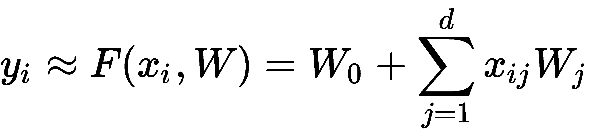

# 第三章：物联网的机器学习

**机器学习**（**ML**）指的是能够自动检测数据中有意义的模式并通过经验不断改进的计算机程序。尽管这不是一个新兴领域，但目前正处于其兴奋周期的顶峰。本章将向读者介绍标准的机器学习算法及其在物联网领域的应用。

阅读本章后，您将了解以下内容：

+   机器学习（ML）是什么，它在物联网（IoT）管道中扮演的角色

+   监督学习和无监督学习的范式

+   回归分析以及如何使用 TensorFlow 和 Keras 进行线性回归

+   流行的机器学习分类器，并在 TensorFlow 和 Keras 中实现它们

+   决策树、随机森林以及执行提升的技术和如何为它们编写代码

+   提升系统性能和模型局限性的技巧与方法

# 机器学习与物联网（IoT）

机器学习（ML）是人工智能的一个子集，旨在构建能够通过经验自动学习和改进的计算机程序，而无需明确编程。在大数据时代，随着数据生成速度惊人地加快，人类无法逐一处理和理解所有数据。根据思科（Cisco）公司的估算，这家公司是 IT 和网络领域的领先企业，到 2018 年，物联网（IoT）将每年产生 400 泽字节的数据。这表明我们需要寻找自动化的手段来理解这些庞大的数据，这正是机器学习的作用所在。

完整的思科报告，发布于 2018 年 2 月 1 日，可以通过[`www.cisco.com/c/en/us/solutions/collateral/service-provider/global-cloud-index-gci/white-paper-c11-738085.html`](https://www.cisco.com/c/en/us/solutions/collateral/service-provider/global-cloud-index-gci/white-paper-c11-738085.html)访问。报告预测了物联网、机器人技术、人工智能和电信结合下的数据流量和云服务趋势。

每年，Gartner 这家研究和咨询公司都会发布一份图示，提供新兴技术成熟度的视觉和概念性展示，分为五个阶段。

您可以在[`www.gartner.com/smarterwithgartner/5-trends-emerge-in-gartner-hype-cycle-for-emerging-technologies-2018/`](https://www.gartner.com/smarterwithgartner/5-trends-emerge-in-gartner-hype-cycle-for-emerging-technologies-2018/)找到 2018 年*Gartner 新兴技术兴奋周期*的图片。

我们可以看到，物联网平台和机器学习都处于“虚 inflated 期”的顶峰。那意味着什么呢？虚 inflated 期是技术生命周期中的一个阶段，通常伴随着对技术的过度热情。大量供应商和初创公司投资于处于顶峰的技术。越来越多的商业机构探索新技术如何融入其商业战略。简而言之，这是跳入该技术的时机。你会听到投资者在风险投资活动中开玩笑说，*只要你在推介中提到机器学习，你就可以在估值后面加一个零*。

所以，系好安全带，让我们深入探索机器学习技术。

# 学习范式

机器学习算法可以根据其使用的方法进行如下分类：

+   概率与非概率

+   建模与优化

+   监督学习与无监督学习

在本书中，我们将我们的机器学习算法分为监督学习和无监督学习。两者之间的区别取决于模型是如何学习的，以及提供给模型的数据类型：

+   **监督学习**：假设我给你一个序列，并要求你预测下一个元素：

*(1, 4, 9, 16, 25*,...)

你猜对了：下一个数字是 36，接下来是 49，依此类推。这就是监督学习，也叫**通过示例学习**；你并没有被告知这个序列表示的是正整数的平方——你通过提供的五个示例自己猜出了这一点。

类似地，在监督学习中，机器从示例中学习。它提供了一组包含(*X*, *Y*)的训练数据，其中*X*是输入（可以是一个单一数字或具有大量特征的输入值），*Y*是给定输入的预期输出。一旦在示例数据上训练完成，模型就应该能够在面对新数据时得出准确的结论。

监督学习用于根据一组输入预测一个实值输出（回归）或一个离散标签（分类）。我们将在接下来的章节中探讨回归和分类算法。

+   **无监督学习**：假设你得到了八个不同半径和颜色的圆形块，并要求你按照某种顺序排列或分组它们。你会怎么做？

有些人可能会根据半径的增减顺序排列它们，有些人可能会根据颜色将它们分组。方法有很多，而对我们每个人来说，这取决于我们在分组时对数据的内部表征。这就是无监督学习，大多数人类的学习也属于这一类别。

在无监督学习中，模型仅给定数据(*X*)，但并未告诉它任何相关信息；模型通过自己学习数据中的潜在模式和关系。无监督学习通常用于聚类和降维。

尽管我们在本书中的大部分算法中使用的是 TensorFlow，但在本章中，由于 scikit 库高效地构建了机器学习算法，我们将在提供更多灵活性和功能的情况下使用 scikit 提供的函数和方法。目标是为你，读者，提供使用 AI/ML 技术处理物联网生成的数据，而不是重新发明轮子。

# 使用线性回归进行预测

我的朋友 Aaron 对钱的管理有点马虎，总是无法估算出他的每月信用卡账单会是多少。我们能做点什么来帮助他吗？当然，线性回归可以帮助我们预测每月的信用卡账单，只要我们有足够的数据。得益于数字经济，他过去五年的所有货币交易都可以在网上找到。我们提取了他的每月食品杂货、文具和旅行支出以及他的月收入。线性回归不仅帮助预测了他的月信用卡账单，还揭示了最主要的消费因素。

这只是一个例子；线性回归可以用于许多类似的任务。在本节中，我们将学习如何在数据上执行线性回归。

线性回归是一个监督学习任务。它是最基础、最简单且应用广泛的机器学习预测技术之一。回归的目标是为给定的输入输出对(*x*, *y*)找到一个函数*F*(*x, W*)，使得*y* = *F*(*x, W*)。在(*x*, *y*)对中，*x*是自变量，*y*是因变量，且它们都是连续变量。它帮助我们找到因变量*y*和自变量*x*之间的关系。

输入*x*可以是单一的输入变量，也可以是多个输入变量。当*F*(*x, W*)映射一个单一输入变量*x*时，这叫做**简单线性回归**；当有多个输入变量时，则称为**多元线性回归**。

函数*F*(*x, W*)可以通过以下表达式来近似：



在这个表达式中，*d*是*x*的维度（独立变量的数量），*W*是与*x*的每个分量相关的权重。为了找到函数*F*(*x, W*)，我们需要确定权重。自然的选择是找到能够减少平方误差的权重，因此我们的目标函数如下：


在前面的函数中，*N*是所提供的输入输出对的总数。为了找到权重，我们对目标函数关于权重进行求导并使其等于*0*。在矩阵表示法中，我们可以将列向量*W* = (*W*[0], *W*[1], *W*[2], ..., *W*[d])^T 的解写为如下：


通过求导并简化，我们得到以下结果：


*X*是大小为[*N*, *d*]的输入向量，*Y*是大小为[*N*, 1]的输出向量。如果(*X^TX*)^(-1)存在，即*X*的所有行和列是线性独立的，那么可以找到权重。为了确保这一点，输入输出样本的数量（*N*）应该远大于输入特征的数量（*d*）。

需要记住的一件重要事情是，*Y*，即因变量，并不是与自变量*X*线性相关的；相反，它是与模型参数*W*，即权重，线性相关的。因此，我们可以通过线性回归建模诸如指数型甚至正弦型的关系（在*Y*和*X*之间）。在这种情况下，我们将问题推广到寻找权重*W*，使得*y* = *F*(*g*(*x*), *W*)，其中*g*(*x*)是*X*的非线性函数。

# 使用回归进行电力输出预测

现在你已经理解了线性回归的基础知识，让我们用它来预测联合循环电厂的电力输出。我们在第一章中描述了这个数据集，*人工智能与物联网的原理与基础*；在这里，我们将使用 TensorFlow 及其自动梯度来找到解决方案。该数据集可以从 UCI ML 档案下载（[`archive.ics.uci.edu/ml/datasets/combined+cycle+power+plant`](http://archive.ics.uci.edu/ml/datasets/combined+cycle+power+plant)）。完整的代码可以在 GitHub 上找到（[`github.com/PacktPublishing/Hands-On-Artificial-Intelligence-for-IoT`](https://github.com/PacktPublishing/Hands-On-Artificial-Intelligence-for-IoT)），文件名为`ElectricalPowerOutputPredictionUsingRegression.ipynb`。

让我们理解以下步骤中的代码执行：

1.  我们导入了`tensorflow`、`numpy`、`pandas`、`matplotlib`和一些`scikit-learn`的有用函数：

```py
# Import the modules
import tensorflow as tf
import numpy as np
import pandas as pd
import matplotlib.pyplot as plt
from sklearn.preprocessing import MinMaxScaler
from sklearn.metrics import mean_squared_error, r2_score
from sklearn.model_selection import train_test_split
%matplotlib inline # The data file is loaded and analyzed
```

1.  数据文件已加载并进行分析：

```py
filename = 'Folds5x2_pp.xlsx' # download the data file from UCI ML repository
df = pd.read_excel(filename, sheet_name='Sheet1')
df.describe()
```

1.  由于数据没有标准化，在使用它之前，我们需要使用`sklearn`的`MinMaxScaler`进行标准化：

```py
X, Y = df[['AT', 'V','AP','RH']], df['PE']
scaler = MinMaxScaler()
X_new = scaler.fit_transform(X)
target_scaler = MinMaxScaler()
Y_new = target_scaler.fit_transform(Y.values.reshape(-1,1))
X_train, X_test, Y_train, y_test = \
 train_test_split(X_new, Y_new, test_size=0.4, random_state=333)
```

1.  现在，我们定义一个类`LinearRegressor`；这是所有实际工作发生的地方。类初始化定义了计算图并初始化所有`Variables`（权重和偏差）。该类有一个`function`方法，用于建模函数*y* = *F*(*X*,*W*)；`fit`方法执行自动梯度并更新权重和偏差，`predict`方法用于获取给定输入*X*的输出*y*，`get_weights`方法返回学习到的权重和偏差：

```py
class LinearRegressor:
 def __init__(self,d, lr=0.001 ):
 # Placeholders for input-output training data
 self.X = tf.placeholder(tf.float32,\
 shape=[None,d], name='input')
 self.Y = tf.placeholder(tf.float32,\
 name='output')
 # Variables for weight and bias
 self.b = tf.Variable(0.0, dtype=tf.float32)
 self.W = tf.Variable(tf.random_normal([d,1]),\
 dtype=tf.float32)

 # The Linear Regression Model
 self.F = self.function(self.X)

 # Loss function
 self.loss = tf.reduce_mean(tf.square(self.Y \
 - self.F, name='LSE'))
 # Gradient Descent with learning 
 # rate of 0.05 to minimize loss
 optimizer = tf.train.GradientDescentOptimizer(lr)
 self.optimize = optimizer.minimize(self.loss)

 # Initializing Variables
 init_op = tf.global_variables_initializer()
 self.sess = tf.Session()
 self.sess.run(init_op)

 def function(self, X):
 return tf.matmul(X, self.W) + self.b

 def fit(self, X, Y,epochs=500):
 total = []
 for i in range(epochs):
 _, l = self.sess.run([self.optimize,self.loss],\
 feed_dict={self.X: X, self.Y: Y})
 total.append(l)
 if i%100==0:
 print('Epoch {0}/{1}: Loss {2}'.format(i,epochs,l))
 return total

 def predict(self, X):
 return self.sess.run(self.function(X), feed_dict={self.X:X})

 def get_weights(self):
 return self.sess.run([self.W, self.b])
```

1.  我们使用前面定义的类来创建线性回归模型并进行训练：

```py
N, d = X_train.shape
model = LinearRegressor(d)
loss = model.fit(X_train, Y_train, 20000) #Epochs = 20000
```

让我们看看训练好的线性回归器的性能。带有**Epochs**的均方误差图显示，网络试图达到均方误差的最小值：


在测试数据集上，我们实现了*R²*值为*0.768*，均方误差为*0.011*。

# 分类的逻辑回归

在上一节中，我们学习了如何进行预测。在机器学习中，还有一个常见的任务：分类任务。将狗和猫分开、垃圾邮件和非垃圾邮件分开，甚至识别房间或场景中的不同物体——这些都是分类任务。

逻辑回归是一种经典的分类技术。它提供了一个事件发生的概率，给定输入值。事件被表示为类别型的因变量，而某一特定因变量为 *1* 的概率通过 logit 函数表示：


在详细讨论如何使用逻辑回归进行分类之前，我们先来看看 logit 函数（也被称为 **sigmoid** 函数，因其 S 形曲线）。下图展示了 logit 函数及其导数随着输入 *X* 的变化，Sigmoid 函数（蓝色）及其导数（橙色）：


从该图中需要注意的几点如下：

+   Sigmoid 函数的值（因此 *Y[pred]*）介于 (*0*, *1*) 之间。

+   当 *W^TX + b = 0.0* 时，sigmoid 的导数最大，且该导数的最大值为 *0.25*（在同一点上，sigmoid 的值为 *0.5*）

+   Sigmoid 函数变化的斜率取决于权重，而我们将得到导数峰值的位置则取决于偏置。

我建议你尝试在本书的 GitHub 仓库中使用 `Sigmoid_function.ipynb` 程序，感受当权重和偏置发生变化时，sigmoid 函数如何变化。

# 交叉熵损失函数

逻辑回归的目标是找到权重 *W* 和偏置 *b*，使得每个输入向量 *X[i]* 在输入特征空间中能够正确分类到其所属的类别 *y[i]*。换句话说，*y[i]* 和 ** 应该对给定的 *x[i]* 有类似的分布。我们首先考虑一个二分类问题；在这种情况下，数据点 *y[i]* 的值可以是 *1* 或 *0*。由于逻辑回归是一种监督学习算法，我们将训练数据对 (*X[i]*, *Y[i]*) 作为输入，并让 ** 是 *P*(*y*=*1*|*X*=*X[i]*) 的概率；然后，对于 *p* 个训练数据点，总的平均损失定义如下：


因此，对于每个数据对，当 *Y[i]* = *1* 时，第一项将对损失项做出贡献，且随着  从 *0* 到 *1* 变化时，其贡献从无穷大到 *0*；同样地，对于 *Y[i]* = *0* 时，第二项将对损失项做出贡献，且随着  从 *1* 到 *0* 变化时，其贡献从无穷大变为零。

对于多分类问题，损失项被推广为以下形式：


在前述内容中，*K*是类别的数量。需要注意的是，虽然对于二分类问题，输出的*Y[i]*和*Y[pred]*是单一值，但对于多类问题，*Y[i]*和*Y[pred]*现在是*K*维的向量，每个类别有一个分量。

# 使用逻辑回归器分类酒质

现在让我们利用所学的知识来分类酒的质量。我能听到你在想：*什么酒质？不可能！*让我们看看我们的逻辑回归器与专业品酒师相比表现如何。我们将使用酒质数据集([`archive.ics.uci.edu/ml/datasets/wine+quality`](https://archive.ics.uci.edu/ml/datasets/wine+quality))；数据集的详细信息请参见第一章，*人工智能与物联网的原理与基础*。完整代码位于 GitHub 仓库中的`Wine_quality_using_logistic_regressor.ipynb`文件中。让我们一步步理解代码：

1.  第一步是加载所有模块：

```py
# Import the modules
import tensorflow as tf
import numpy as np
import pandas as pd
import matplotlib.pyplot as plt
from sklearn.preprocessing import MinMaxScaler
from sklearn.metrics import mean_squared_error, r2_score
from sklearn.model_selection import train_test_split
%matplotlib inline
```

1.  我们读取数据；在当前的代码中，我们只分析红酒，所以我们从`winequality-red.csv`文件中读取数据。该文件中的数据值不是通过逗号分隔的，而是通过分号分隔，因此我们需要指定分隔符参数：

```py
filename = 'winequality-red.csv' # Download the file from UCI ML Repo 
df = pd.read_csv(filename, sep=';')
```

1.  我们从数据文件中分离出输入特征和目标质量。在文件中，目标酒质以 0 到 10 的尺度表示。为了简化处理，我们将其分为三类，因此如果初始质量小于 5，我们将其归为第三类（表示差）；在 5 到 8 之间，我们认为它是`ok`（第二类）；大于 8 时，我们认为它是`good`（第一类）。我们还会对输入特征进行归一化，并将数据集分为训练集和测试集：

```py
X, Y = df[columns[0:-1]], df[columns[-1]]
scaler = MinMaxScaler()
X_new = scaler.fit_transform(X)
Y.loc[(Y<3)]=3
Y.loc[(Y<6.5) & (Y>=3 )] = 2
Y.loc[(Y>=6.5)] = 1
Y_new = pd.get_dummies(Y) # One hot encode
X_train, X_test, Y_train, y_test = \
train_test_split(X_new, Y_new, test_size=0.4, random_state=333)
```

1.  代码的主要部分是`LogisticRegressor`类；乍一看，你可能会认为它与我们之前做的`LinearRegressor`类相似。该类定义在 Python 文件`LogisticRegressor.py`中。它确实类似，但有几个重要的不同之处：`Y` `output`被`Y[pred]`替代，后者不再是单一值，而是一个三维的分类值，每个维度指定了三类的概率。这里的权重具有*d × n*的维度，其中`d`是输入特征的数量，`n`是输出类别的数量。偏差也变成了三维。另一个重要变化是损失函数的变化：

```py
class LogisticRegressor:
    def __init__(self, d, n, lr=0.001 ):
        # Place holders for input-output training data
        self.X = tf.placeholder(tf.float32,\
              shape=[None,d], name='input')
        self.Y = tf.placeholder(tf.float32,\
              name='output')
        # Variables for weight and bias
        self.b = tf.Variable(tf.zeros(n), dtype=tf.float32)
        self.W = tf.Variable(tf.random_normal([d,n]),\
              dtype=tf.float32)
        # The Logistic Regression Model
        h = tf.matmul(self.X, self.W) + self.b
        self.Ypred = tf.nn.sigmoid(h)
        # Loss function
        self.loss = cost = tf.reduce_mean(-tf.reduce_sum(self.Y*tf.log(self.Ypred),\
                 reduction_indices=1), name = 'cross-entropy-loss')
        # Gradient Descent with learning 
        # rate of 0.05 to minimize loss
        optimizer = tf.train.GradientDescentOptimizer(lr)
        self.optimize = optimizer.minimize(self.loss)
        # Initializing Variables
        init_op = tf.global_variables_initializer()
        self.sess = tf.Session()
        self.sess.run(init_op)

    def fit(self, X, Y,epochs=500):
        total = []
        for i in range(epochs):
            _, l = self.sess.run([self.optimize,self.loss],\
                  feed_dict={self.X: X, self.Y: Y})
            total.append(l)
            if i%1000==0:
                print('Epoch {0}/{1}: Loss {2}'.format(i,epochs,l))
        return total

   def predict(self, X):
        return self.sess.run(self.Ypred, feed_dict={self.X:X})

    def get_weights(self):
        return self.sess.run([self.W, self.b])
```

1.  现在我们只需训练我们的模型并预测输出。学到的模型在测试数据集上的准确率约为 85%。相当令人印象深刻！

使用机器学习，我们还可以识别哪些成分使酒的质量更好。名为 IntelligentX 的公司最近开始根据用户反馈酿造啤酒；它使用人工智能来获得最美味的啤酒配方。你可以在这篇*Forbes*文章中了解该项目：[`www.forbes.com/sites/emmasandler/2016/07/07/you-can-now-drink-beer-brewed-by-artificial-intelligence/#21fd11cc74c3`](https://www.forbes.com/sites/emmasandler/2016/07/07/you-can-now-drink-beer-brewed-by-artificial-intelligence/#21fd11cc74c3)。

# 使用支持向量机进行分类

**支持向量机**（**SVMs**）可以说是最常用的机器学习分类技术。SVM 的主要思想是找到一个最大间隔的最优超平面来分隔两个类别。如果数据是线性可分的，那么寻找超平面的过程是直接的，但如果数据不可线性分隔，则使用核技巧将数据转化到某个高维特征空间中，使其线性可分。

支持向量机（SVM）被认为是一种非参数化的监督学习算法。SVM 的主要思想是寻找一个**最大间隔分隔器**：一个与训练样本最远的分隔超平面。

考虑以下图示；红色的点表示类别 1，其输出应为 1，蓝色的点表示类别 2，其输出应为-1。可以有多条直线将红点与蓝点分开；图示展示了三条这样的直线：**A**、**B**和**C**。你认为哪一条线是最好的选择？直观上，最好的选择是 B 线，因为它距离两个类别的样本最远，从而确保分类错误最少：


在接下来的部分，我们将学习如何寻找最大分隔超平面的基本数学。虽然这里的数学大多是基础的，但如果你不喜欢数学，你可以跳过这部分，直接进入实现部分，看看我们如何再次使用 SVM 进行酒类分类！干杯！

# 最大间隔超平面

根据我们对线性代数的了解，我们知道平面的方程由以下内容给出：


在 SVM 中，这个平面应该将正类（*y*=*1*）与负类（*y*=*-1*）分开，并且有一个附加约束：这个超平面与最靠近的正负训练向量（*X[pos]* 和 *X[neg]*）之间的距离（间隔）应该是最大值。因此，这个平面被称为最大间隔分隔器。

向量*X*[*pos*]和*X*[*neg*]被称为**支持向量**，它们在定义 SVM 模型中起着重要作用。

从数学角度看，这意味着以下内容成立：


同样，以下也是如此：


从这两个方程，我们得到以下结果：


将权重向量的长度除以两边，我们得到以下结果：


所以我们需要找到一个分隔器，使得正负支持向量之间的间隔最大，也就是说：最大，同时确保所有点都被正确分类，如下所示：


使用一些数学知识，尽管本书不会深入讲解，前述条件可以表示为以下最优解的求解问题：


需要满足以下约束条件：


从α的值中，我们可以使用以下公式从*α*（系数向量）中得到权重*W*：


这是一个标准的二次规划优化问题。大多数机器学习库都有内置的函数来解决这个问题，所以你不需要担心如何处理。

对于有兴趣了解更多关于 SVM 及其背后数学的读者，Vladimir Vapnik 的《统计学习理论的本质》（The Nature of Statistical Learning Theory），由*Springer Science+Business Media*出版，2013 年，是一本非常好的参考书。

# 核技巧

当输入特征空间是线性可分时，上述方法效果很好。那么当输入特征空间不可线性分隔时，我们该怎么办呢？一种简单的方法是将数据（*X*）转换到一个更高维的空间，在这个高维空间中数据是线性可分的，然后在该高维空间中找到一个最大间隔的超平面。让我们来看看；我们关于*α*的超平面如下：

**

设*φ*为变换，那么我们可以用*φ*(*X*)替换*X*，从而将其点积*X^(T )X^((i))*替换为一个函数 K(*X^T*, *X*^((*i*))) = *φ*(*X*)*^T* *φ*(*X*^((*i*)))，这个函数叫做**核**。因此，我们现在只需要通过应用变换*φ*对数据进行预处理，然后在变换后的空间中像之前一样找到一个线性分隔器。

最常用的核函数是**高斯核**，也叫**径向基函数**，定义如下：


# 使用 SVM 进行葡萄酒分类

我们将使用 scikit 库提供的`svm.SVC`函数来完成这个任务。这样做的原因是，直到目前为止，TensorFlow 库只提供了 SVM 的线性实现，并且它只适用于二分类。我们可以利用之前在 TensorFlow 中学到的数学知识自己实现 SVM，并且 GitHub 仓库中的`SVM_TensorFlow.ipynb`包含了 TensorFlow 中的实现。以下代码可以在`Wine_quality_using_SVM.ipynb`中找到。

scikit 的 SVC 分类器是一个支持向量分类器。它也可以通过一对一的方式处理多类问题。该方法的一些可选参数如下：

+   `C`：它是一个指定惩罚项的参数（默认值为`1.0`）。

+   `kernel`：指定要使用的核函数（默认为`rbf`）。可选值包括`linear`、`poly`、`rbf`、`sigmoid`、`precomputed`和`callable`。

+   `gamma`：它指定`rbf`、`poly`和`sigmoid`的核函数系数，默认值为`auto`。

+   `random_state`：它设置伪随机数生成器的种子，用于数据洗牌时。

按照给定的步骤创建我们的 SVM 模型：

1.  让我们加载代码中需要的所有模块。请注意，我们没有在这里导入 TensorFlow，而是从`scikit`库中导入了某些模块：

```py
# Import the modules
import numpy as np
import pandas as pd
import matplotlib.pyplot as plt
from sklearn.preprocessing import MinMaxScaler, LabelEncoder
from sklearn.model_selection import train_test_split
from sklearn.metrics import confusion_matrix, accuracy_score
from sklearn.svm import SVC # The SVM Classifier from scikit
import seaborn as sns
%matplotlib inline
```

1.  我们读取数据文件，进行预处理，并将数据分为测试集和训练集。这次，为了简便起见，我们将数据分为两类：`good`和`bad`：

```py
filename = 'winequality-red.csv' #Download the file from UCI ML Repo
df = pd.read_csv(filename, sep=';')

#categorize wine quality in two levels
bins = (0,5.5,10)
categories = pd.cut(df['quality'], bins, labels = ['bad','good'])
df['quality'] = categories

#PreProcessing and splitting data to X and y
X = df.drop(['quality'], axis = 1)
scaler = MinMaxScaler()
X_new = scaler.fit_transform(X)
y = df['quality']
labelencoder_y = LabelEncoder()
y = labelencoder_y.fit_transform(y)
X_train, X_test, y_train, y_test = train_test_split(X, y, \
        test_size = 0.2, random_state = 323)
```

1.  现在我们使用`SVC`分类器，并通过`fit`方法在我们的训练数据集上训练它：

```py
classifier = SVC(kernel = 'rbf', random_state = 45)
classifier.fit(X_train, y_train)
```

1.  现在让我们预测测试数据集的输出：

```py
y_pred = classifier.predict(X_test)
```

1.  该模型的准确率为`67.5%`，混淆矩阵如下：

```py
print("Accuracy is {}".format(accuracy_score(y_test, y_pred)))
## Gives a value ~ 67.5%
cm = confusion_matrix(y_test, y_pred)
sns.heatmap(cm,annot=True,fmt='2.0f')
```


上述代码使用的是二分类；我们可以修改代码，使其适用于多个类别。例如，在第二步中，我们可以将代码替换为以下内容：

```py
bins = (0,3.5,5.5,10)
categories = pd.cut(df['quality'], bins, labels = ['bad','ok','good'])
df['quality'] = categories
```

1.  然后我们得到三个类别，就像我们之前的逻辑回归分类器一样，准确率为 65.9%。混淆矩阵如下：

在三类情况下，训练数据的分布如下：

+   `good` `855`

+   `ok` `734`

+   `bad` `10`

由于`bad`类（对应混淆矩阵中的`0`）的样本数量仅为`10`，模型无法学习哪些参数会影响酒的质量。因此，数据应该在我们本章中探索的所有分类器的各个类之间均匀分布。

# 朴素贝叶斯

朴素贝叶斯是最简单和最快的机器学习算法之一。它也属于监督学习算法的范畴。它基于贝叶斯概率定理。在朴素贝叶斯分类器的情况下，我们做出的一个重要假设是输入向量的所有特征都是**独立同分布**（**iid**）。目标是为每个类*C*[*k*]学习一个条件概率模型，该模型在训练数据集中进行训练：


在 iid 假设下，并使用贝叶斯定理，这可以表示为联合概率分布*p*(*C[k]*, *X*)：


我们选择最大化此项的类 ***Maximum A Posteriori* **（**MAP**）：


根据*p*(*x[i]*|*C[k]*)的分布，可能会有不同的朴素贝叶斯算法。常见的选择有：对于实数值数据使用高斯分布，对于二进制数据使用伯努利分布，对于数据中包含某事件频率的情况（例如文档分类）使用多项式分布。

现在我们来看看是否能使用朴素贝叶斯对葡萄酒进行分类。为了简单和高效起见，我们将使用 scikit 内置的朴素贝叶斯分布。由于我们数据中的特征值是连续的——我们将假设它们符合高斯分布，因此我们将使用 scikit-learn 的`GaussianNB`。

# 用高斯朴素贝叶斯预测葡萄酒质量

scikit-learn 的朴素贝叶斯模块支持三种朴素贝叶斯分布。我们可以根据输入特征的数据类型选择其中之一。scikit-learn 中可用的三种朴素贝叶斯如下：

+   `GaussianNB`

+   `MultinomialNB`

+   `BernoulliNB`

正如我们已经看到的，葡萄酒数据是一种连续数据类型。因此，如果我们使用高斯分布来表示*p*(*x[i]*|*C[k]*)——也就是`GaussianNB`模块，那么效果会更好，所以我们需要在 Notebook 的导入单元中加入`from sklearn.naive_bayes import GaussianNB`。你可以通过这个 scikit-learn 的链接了解更多关于`GaussianNB`模块的详细信息：[`scikit-learn.org/stable/modules/generated/sklearn.naive_bayes.GaussianNB.html#sklearn.naive_bayes.GaussianNB`](http://scikit-learn.org/stable/modules/generated/sklearn.naive_bayes.GaussianNB.html#sklearn.naive_bayes.GaussianNB)。

前两步将与 SVM 案例中的相同。但现在，我们不会声明一个`SVM`分类器，而是声明一个`GaussianNB`分类器，并使用它的`fit`方法来学习训练样本。通过`predict`方法可以得到从学习的模型中获得的结果。所以，按照以下步骤操作：

1.  导入必要的模块。请注意，现在我们正在从`scikit`库中导入`GaussianNB`：

```py
# Import the modules
import numpy as np
import pandas as pd
import matplotlib.pyplot as plt
from sklearn.preprocessing import MinMaxScaler, LabelEncoder
from sklearn.model_selection import train_test_split
from sklearn.metrics import confusion_matrix, accuracy_score
from sklearn.naive_bayes import GaussianNB # The SVM Classifier from scikit
import seaborn as sns
%matplotlib inline
```

1.  读取数据文件并进行预处理：

```py
filename = 'winequality-red.csv' #Download the file from UCI ML Repo
df = pd.read_csv(filename, sep=';')

#categorize wine quality in two levels
bins = (0,5.5,10)
categories = pd.cut(df['quality'], bins, labels = ['bad','good'])
df['quality'] = categories

#PreProcessing and splitting data to X and y
X = df.drop(['quality'], axis = 1)
scaler = MinMaxScaler()
X_new = scaler.fit_transform(X)
y = df['quality']
labelencoder_y = LabelEncoder()
y = labelencoder_y.fit_transform(y)
X_train, X_test, y_train, y_test = train_test_split(X, y, \
        test_size = 0.2, random_state = 323)
```

1.  现在我们声明一个高斯朴素贝叶斯，使用训练数据集对其进行训练，并使用训练好的模型来预测测试数据集中的葡萄酒质量：

```py
classifier = GaussianNB()
classifier.fit(X_train, y_train)
#Predicting the Test Set
y_pred = classifier.predict(X_test)
```

就是这样，大家；我们的模型已经准备好了并开始运作。在二分类的情况下，这个模型的准确率为 71.25%。在下面的截图中，你可以看到混淆矩阵的热力图：


在你得出朴素贝叶斯是最好的结论之前，我们先要注意它的一些陷阱：

+   朴素贝叶斯是基于频率的概率进行预测的，因此它在很大程度上依赖于我们用于训练的数据。

+   另一个问题是，我们假设输入特征空间是独立同分布（iid）的，但这并不总是成立。

# 决策树

在这一部分，你将学习另一种非常流行且快速的机器学习算法——决策树。在决策树中，我们构建一个类似树状的决策结构；从根节点开始，选择一个特征并分裂成分支，继续分裂直到到达叶节点，叶节点表示预测的类别或数值。决策树的算法涉及两个主要步骤：

+   决定选择哪些特征以及使用什么条件进行划分

+   知道何时停止

我们通过一个例子来理解。假设有一个由 40 名学生组成的样本；我们有三个变量：性别（男孩或女孩；离散型），班级（XI 或 XII；离散型），身高（5 到 6 英尺；连续型）。其中 18 名学生在空闲时间倾向于去图书馆，其他学生则喜欢玩耍。我们可以建立一个决策树来预测哪些学生会去图书馆，哪些学生会去操场。为了构建决策树，我们需要根据三个输入变量中最具显著性的变量来将去图书馆和去操场的学生区分开。下图展示了基于每个输入变量的划分：


我们考虑所有特征，选择能给我们最大信息量的那个特征。在前面的例子中，我们可以看到，基于身高特征的划分生成了最均匀的组，其中**身高 > 5.5 英尺**的组包含了 80%的学生玩耍，20%的学生去图书馆，而**身高 < 5.5 英尺**的组包含了 13%的学生玩耍，86%的学生去图书馆。因此，我们将基于身高特征进行第一次划分。我们将继续以这种方式划分，最终得到决策（叶节点），告诉我们学生在空闲时间是去玩耍还是去图书馆。下图展示了决策树的结构；黑色圆圈是**根** **节点**，蓝色圆圈是**决策** **节点**，绿色圆圈是**叶** **节点**：


决策树属于贪心算法的一类。为了找到最均匀的划分，我们定义了代价函数，使其尽量在特定组内最大化同类输入值的比例。对于回归问题，我们通常使用均方误差代价函数：


在这里，*y* 和 *y[pred]* 表示给定的输出值和预测的输出值，分别对应输入值（*i*）；我们找到最小化该损失的划分。

对于分类问题，我们使用*基尼*不纯度或交叉熵作为损失函数：


在前述中，*c[k]* 定义了特定组中同类输入值的比例。

以下是一些学习决策树的好资源：

+   L. Breiman, J. Friedman, R. Olshen 和 C. Stone: *分类与回归树*，Wadsworth，Belmont，CA，1984

+   J.R. Quinlan: *C4.5：机器学习程序*，Morgan Kaufmann，1993

+   T. Hastie, R. Tibshirani 和 J. Friedman: *统计学习的元素*，Springer，2009

# scikit 中的决策树

`scikit` 库提供了 `DecisionTreeRegressor` 和 `DecisionTreeClassifier` 来实现回归和分类。两者都可以从 `sklearn.tree` 导入。`DecisionTreeRegressor` 定义如下：

```py
*c*lass sklearn.tree.DecisionTreeRegressor (criterion=’mse’, splitter=’best’, max_depth=None, min_samples_split=2, min_samples_leaf=1, min_weight_fraction_leaf=0.0, max_features=None, random_state=None, max_leaf_nodes=None, min_impurity_decrease=0.0, min_impurity_split=None, presort=False)
```

不同的参数如下：

+   `criterion`：它定义了用于确定拆分的损失函数。默认值是均方误差（`mse`）。该库支持使用 `friedman_mse` 和均值绝对误差（`mae`）作为损失函数。

+   `splitter`：我们用它来决定是否使用贪婪策略并选择最佳拆分（默认值），或者可以使用随机 `splitter` 来选择最佳随机拆分。

+   `max_depth`：它定义了树的最大深度。

+   `min_samples_split`：它定义了拆分内部节点所需的最小样本数。它可以是整数或浮动数（在这种情况下，它定义了拆分所需的最小样本百分比）。

`DecisionTreeClassifier` 定义如下：

```py
class sklearn.tree.DecisionTreeClassifier(criterion=’gini’, splitter=’best’, max_depth=None, min_samples_split=2, min_samples_leaf=1, min_weight_fraction_leaf=0.0, max_features=None, random_state=None, max_leaf_nodes=None, min_impurity_decrease=0.0, min_impurity_split=None, class_weight=None, presort=False)
```

不同的参数如下：

+   `criterion`：它指示用于确定拆分的损失函数。分类器的默认值是 `gini`。该库支持使用 `entropy` 作为损失函数。

+   `splitter`：我们用它来决定如何选择拆分（默认值是最佳拆分），或者可以使用随机 `splitter` 来选择最佳随机拆分。

+   `max_depth`：它定义了树的最大深度。当输入特征空间很大时，我们用它来限制最大深度并避免过拟合。

+   `min_samples_split`：它定义了拆分内部节点所需的最小样本数。它可以是整数或浮动数（在这种情况下，它指示拆分所需的最小样本百分比）。

我们仅列出了常用的前导参数；有关两个参数的其余细节，请参见 scikit-learn 网站：[`scikit-learn.org/stable/modules/generated/sklearn.tree.DecisionTreeRegressor.html`](http://scikit-learn.org/stable/modules/generated/sklearn.tree.DecisionTreeRegressor.html) 和 [`scikit-learn.org/stable/modules/generated/sklearn.tree.DecisionTreeClassifier.html`](http://scikit-learn.org/stable/modules/generated/sklearn.tree.DecisionTreeClassifier.html)

# 决策树的实际应用

我们将首先使用决策树回归器来预测电力输出。数据集及其描述已在 第一章，*物联网和人工智能的原理与基础* 中介绍。代码可在 GitHub 仓库中的文件 `ElectricalPowerOutputPredictionUsingDecisionTrees.ipynb` 中找到：

```py
# Import the modules
import tensorflow as tf
import numpy as np
import pandas as pd
import matplotlib.pyplot as plt
from sklearn.preprocessing import MinMaxScaler
from sklearn.metrics import mean_squared_error, r2_score
from sklearn.model_selection import train_test_split
from sklearn.tree import DecisionTreeRegressor
%matplotlib inline

# Read the data 
filename = 'Folds5x2_pp.xlsx' # The file can be downloaded from UCI ML repo
df = pd.read_excel(filename, sheet_name='Sheet1')
df.describe()

# Preprocess the data and split in test/train
X, Y = df[['AT', 'V','AP','RH']], df['PE']
scaler = MinMaxScaler()
X_new = scaler.fit_transform(X)
target_scaler = MinMaxScaler()
Y_new = target_scaler.fit_transform(Y.values.reshape(-1,1))
X_train, X_test, Y_train, y_test = \
 train_test_split(X_new, Y_new, test_size=0.4, random_state=333)

# Define the decision tree regressor
model = DecisionTreeRegressor(max_depth=3)
model.fit(X_train, Y_train)

# Make the prediction over the test data
Y_pred = model.predict(np.float32(X_test))
print("R2 Score is {} and MSE {}".format(\
 r2_score(y_test, Y_pred),\
 mean_squared_error(y_test, Y_pred)))
```

在测试数据上，我们得到了 0.90 的 R 平方值和 0.0047 的均方误差；这相比使用线性回归器的预测结果（R 平方:`0.77`; mse:`0.012`）有了显著的提高。

让我们也看看决策树在分类任务中的表现；我们依旧使用葡萄酒质量分类。代码可在 GitHub 仓库中的`Wine_quality_using_DecisionTrees.ipynb`文件中找到：

```py
# Import the modules
import numpy as np
import pandas as pd
import matplotlib.pyplot as plt
from sklearn.preprocessing import MinMaxScaler, LabelEncoder
from sklearn.metrics import mean_squared_error, r2_score
from sklearn.model_selection import train_test_split
from sklearn.tree import DecisionTreeClassifier
%matplotlib inline

# Read the data 
filename = 'winequality-red.csv' #Download the file from https://archive.ics.uci.edu/ml/datasets/wine+quality df = pd.read_csv(filename, sep=';')

# categorize the data into three classes
bins = (0,3.5,5.5,10)
categories = pd.cut(df['quality'], bins, labels = ['bad','ok','good'])
df['quality'] = categories

# Preprocessing and splitting data to X and y X = df.drop(['quality'], axis = 1) scaler = MinMaxScaler() X_new = scaler.fit_transform(X) y = df['quality'] from sklearn.preprocessing import LabelEncoder labelencoder_y = LabelEncoder() y = labelencoder_y.fit_transform(y) X_train, X_test, y_train, y_test = train_test_split(X, y, test_size = 0.2, random_state = 323)

# Define the decision tree classifier
classifier = DecisionTreeClassifier(max_depth=3)
classifier.fit(X_train, y_train)

# Make the prediction over the test data
Y_pred = classifier.predict(np.float32(X_test))
print("Accuracy is {}".format(accuracy_score(y_test, y_pred)))
```

决策树产生的分类准确率约为 70%。我们可以看到，对于小规模数据，决策树和朴素贝叶斯几乎可以同样成功。决策树容易过拟合，可以通过限制最大深度或设置最小训练输入数量来解决。像朴素贝叶斯一样，决策树也是不稳定的——数据的微小变化可能会导致完全不同的树结构；这可以通过使用装袋法和提升法来解决。最后，由于它是贪心算法，无法保证它能返回全局最优解。

# 集成学习

在我们的日常生活中，当我们需要做出决定时，我们不仅依赖一个人的指导，而是依赖许多我们信任的智者。在机器学习中也可以应用同样的思想；我们可以使用一组模型（集成）来进行预测或分类，而不是依赖于单一模型。这种学习方式称为**集成学习**。

通常，集成学习作为许多机器学习项目中的最后一步使用。当各模型尽可能独立时，它的效果最佳。以下图展示了集成学习的图示：


不同模型的训练可以是顺序进行，也可以是并行进行。集成学习有多种实现方式：投票法、装袋法、拼接法和随机森林。让我们来看看这些技术是什么，以及如何实现它们。

# 投票分类器

投票分类器遵循多数规则；它会汇总所有分类器的预测，并选择票数最多的类别。例如，在下面的截图中，投票分类器将预测输入实例属于类别**1**：


scikit-learn 提供了`VotingClassifier`类来实现这一功能。通过在葡萄酒质量分类中使用集成学习，我们达到了 74%的准确度，超过了单独使用任何模型的结果。完整代码在`Wine_quality_using_Ensemble_learning.ipynb`文件中。以下是使用投票法进行集成学习的主要代码：

```py
# import the different classifiers
from sklearn.svm import SVC 
from sklearn.naive_bayes import GaussianNB 
from sklearn.tree import DecisionTreeClassifier
from sklearn.ensemble import VotingClassifier

# Declare each classifier
clf1 = SVC(random_state=22)
clf2 = DecisionTreeClassifier(random_state=23)
clf3 = GaussianNB()
X = np.array(X_train)
y = np.array(y_train)

#Employ Ensemble learning
eclf = VotingClassifier(estimators=[
('lr', clf1), ('rf', clf2), ('gnb', clf3)], voting='hard')
eclf = eclf.fit(X, y)

# Make prediction on test data
y_pred = eclf.predict(X_test)
```

# 装袋法与拼接法

在投票法中，我们使用不同的算法对相同的数据集进行训练。我们也可以通过使用不同的模型与相同的学习算法来实现集成学习，但我们将它们训练在不同的训练数据子集上。训练子集是随机抽样的。抽样可以是有放回的（袋装法）或无放回的（拼接法）：

+   **袋装法**：在袋装法中，额外的训练数据是通过对原始数据集进行带重复的组合生成的。这有助于减少不同模型的方差。

+   **拼接法**：由于拼接法是无放回的，因此每个训练数据的子集最多只能使用一次。如果原始数据集较大，拼接法更为合适。

`scikit` 库提供了执行袋装法（bagging）和拼接法（pasting）的方法；通过 `sklearn.ensemble`，我们可以导入 `BaggingClassifier` 并使用它。以下代码使用袋装法估算 `500` 个决策树分类器，每个分类器使用 `1000` 个训练样本（对于拼接法，将 `bootstrap=False`）：

```py
from sklearn.ensemble import BaggingClassifier
bag_classifier = BaggingClassifier(
        DecisionTreeClassifier(), n_estimators=500, max_samples=1000,\
        bootstrap=True, n_jobs=-1)    
bag_classifier.fit(X_train, y_train)
y_pred = bag_classifier.predict(X_test)
```

这导致葡萄酒质量分类的准确率为 77%。`BaggingClassifier` 的最后一个参数 `n_jobs` 定义了使用多少个 CPU 核心（即并行运行的任务数）；当它的值设置为 `-1` 时，将使用所有可用的 CPU 核心。

只有决策树的集成被称为 **随机森林**。因此，我们之前实现的就是一个随机森林。我们可以直接在 scikit 中使用 `RandomForestClassifier` 类实现随机森林。使用该类的优势在于它在构建树时引入了额外的随机性。在分裂时，它会在随机子集的特征中寻找最佳的分裂特征。

# 提升你的模型 – 提示与技巧

在本章中，我们学习了大量的机器学习算法，每种算法都有其优缺点。在本节中，我们将探讨一些常见的问题及其解决方法。

# 通过特征缩放解决不均匀的数据尺度问题

收集到的数据通常没有相同的尺度；例如，一个特征可能在 10 到 100 之间变化，而另一个特征则可能仅在 2 到 5 之间分布。这种不均匀的数据尺度可能对学习产生不利影响。为了解决这个问题，我们使用特征缩放（标准化）方法。标准化方法的选择已被发现会极大地影响某些算法的性能。两种常见的标准化方法（在某些书籍中也称为标准化）如下：

+   **Z-score 标准化**：在 Z-score 标准化中，每个单独的特征都会被缩放，使其具备标准正态分布的特性，即均值为 *0*，方差为 *1*。如果 *μ* 是均值，*σ* 是方差，我们可以通过对每个特征进行如下线性变换来计算 Z-score 标准化：


+   **最小-最大归一化**：最小-最大归一化将输入特征重新缩放，使其位于*0*和*1*之间。这会减少数据的标准差，从而抑制异常值的影响。为了实现最小-最大归一化，我们找到特征的最大值和最小值（分别为*x[max]*和*x[min]*），然后执行以下线性变换：


我们可以使用`scikit`库中的`StandardScaler`或`MinMaxScaler`方法对数据进行归一化。在本章中的所有示例中，我们使用了`MinMaxScaler`；你可以尝试将其更改为`StandardScaler`并观察性能是否有所变化。在下一章中，我们还将学习如何在 TensorFlow 中执行这些归一化操作。

# 过拟合

有时，模型会尝试过拟合训练数据集；这样做会失去其泛化能力，因此在验证数据集上的表现较差；这反过来会影响模型在未见数据上的表现。有两种标准方式可以解决过拟合问题：正则化和交叉验证。

# 正则化

正则化在损失函数中添加了一项，确保当模型增加特征数时，代价会增加。因此，我们强制模型保持简单。如果*L(X*, *Y)*是之前的损失函数，我们将其替换为以下公式：


在上面，*N*可以是*L*[1]范数、*L*[2]范数或两者的组合，*λ*是正则化系数。正则化有助于减少模型的方差，同时不失去数据分布的任何重要属性：

+   **套索回归正则化**：在这种情况下，*N*是*L*[1]范数。它使用权重的模作为惩罚项*N*：


+   **岭回归正则化**：在这种情况下，*N*是*L2*范数，表示为以下公式：


# 交叉验证

使用交叉验证还可以帮助减少过拟合问题。在*k*-折交叉验证中，数据被分成*k*个子集，称为**折**。然后，它训练和评估模型*k*次；每次，选择一个折进行验证，其余部分用于训练模型。当数据较少且训练时间较短时，我们可以执行交叉验证。scikit 提供了一个`cross_val_score`方法来实现 k 折交叉验证。假设`classifier`是我们要交叉验证的模型，那么我们可以使用以下代码在`10`折上执行交叉验证：

```py
from sklearn.model_selection import cross_val_score 
accuracies = cross_val_score(estimator = classifier, X = X_train,\
     y = y_train, cv = 10)
print("Accuracy Mean {} Accuracy Variance \
     {}".format(accuracies.mean(),accuracies.std()))
```

结果是一个平均均值和方差值。一个好的模型应该有较高的平均值和较低的方差。

# 无免费午餐定理

面对如此多的模型，人们总是会想，应该使用哪个模型。沃尔珀特（Wolpert）在他著名的论文《学习中缺乏先验区分》中探讨了这个问题，并证明了如果我们对输入数据没有任何先验假设，那么就没有理由偏向某一个模型。这就是**无免费午餐定理**。

这意味着没有任何模型可以*先验*地保证其表现更好。我们能确定哪个模型最好的唯一方法是评估它们所有。但实际上，评估所有模型是不可能的，因此在实际操作中，我们会对数据做出合理的假设，并评估一些相关的模型。

# 超参数调整和网格搜索

不同的模型有不同的超参数；例如，在线性回归中，学习率就是一个超参数；如果我们使用正则化，那么正则化参数λ就是超参数。它们的值应该是多少？虽然有些超参数有经验法则，但大多数时候我们只能做出猜测，或者使用网格搜索来进行有序的搜索，以找到最佳的超参数。接下来，我们将展示使用`scikit`库在支持向量机（SVM）中进行超参数搜索的代码；在下一章中，我们将看到如何使用 TensorFlow 进行超参数调整：

```py
Grid search for best model and parameters
from sklearn.model_selection import GridSearchCV
#parameters = {'kernel':('linear', 'rbf'), 'C':[1, 10]}
classifier = SVC()
parameters = [{'C': [1, 10], 'kernel': ['linear']},
    {'C': [1, 10], 'kernel': ['rbf'],
    'gamma': [0.1, 0.2, 0.3, 0.4, 0.5, 0.6, 0.7, 0.8, 0.9]}]
    grid_search = GridSearchCV(estimator = classifier,
    param_grid = parameters,
    scoring = 'accuracy',
    cv = 10,)
grid_search.fit(X_train, y_train)
best_accuracy = grid_search.best_score_
best_parameters = grid_search.best_params_
#here is the best accuracy
best_accuracy
```

`GridSearchCV`将为我们提供产生最佳结果的支持向量机分类器的超参数。

# 总结

本章的目标是为你提供不同标准机器学习算法的直观理解，以便你能够做出明智的选择。我们介绍了用于分类和回归的流行机器学习算法。我们还学习了有监督学习和无监督学习之间的区别。我们介绍了线性回归、逻辑回归、支持向量机（SVM）、朴素贝叶斯和决策树，并探讨了每种算法所涉及的基本原理。我们使用回归方法预测了热电站的电力生产，并使用分类方法将葡萄酒分类为好或坏。最后，我们讨论了不同机器学习算法的常见问题以及一些解决这些问题的技巧。

在下一章中，我们将研究不同的深度学习模型，并学习如何使用它们来分析我们的数据并做出预测。
