# 第四章：物联网的深度学习

在上一章中，我们学习了不同的**机器学习**（**ML**）算法。本章的重点是基于多层模型的神经网络，也被称为深度学习模型。在过去几年中，它们成为了一个热门词汇，并成为了人工智能初创企业投资者的绝对最爱。在目标检测任务中实现超越人类水平的准确率，并击败世界顶尖的九段围棋大师，是深度学习可能实现的一些壮举。在本章和几个随后的章节中，我们将学习不同的深度学习模型以及如何在我们的物联网生成数据上使用深度学习。在本章中，我们将先来一窥深度学习的历程，并学习四个流行模型，即**多层感知器**（**MLP**）、**卷积神经网络**（**CNN**）、**递归神经网络**（**RNN**）和自编码器。具体而言，您将学习以下内容：

+   深度学习的历史及其目前成功的因素

+   人工神经元及其如何连接以解决非线性问题

+   反向传播算法及其用于训练 MLP 模型

+   TensorFlow 中可用的不同优化器和激活函数

+   CNN 的工作原理及卷积核、填充和步幅背后的概念

+   使用 CNN 模型进行分类和识别

+   RNN 及其修改版、长短期记忆和门控循环单元

+   自编码器的架构和功能

# 深度学习 101

人类思维一直令哲学家、科学家和工程师着迷。人类通过仿效和复制大脑智能的愿望已经被多年写入文献；比如希腊神话中的塞浦路斯的毕格马利翁的加拉特亚、犹太民间传说中的歌勒姆和印度神话中的玛雅·希塔，只是少数例子。拥有**人工智能**（**AI**）的机器人自古以来就是（科幻）作家钟爱的对象。

人工智能，如今我们所知的，与计算机的概念是平行的。1943 年，McCulloch 和 Pitts 在其开创性论文《神经活动中内在思想的逻辑演算》中提出了第一个神经网络模型——阈值设备，可以执行逻辑运算如 AND、OR、AND-NOT。1950 年，Alan Turing 在其开创性工作《计算机器与智能》中提出了**图灵测试**；一种识别机器是否具有智能的测试方法。1957 年，Rosenblatt 在其报告《感知和识别自动机——感知器》中奠定了可以从经验中学习的网络基础。这些想法当时遥遥领先；虽然这些概念在理论上看似可能，但当时的计算资源严重限制了通过这些能够执行逻辑和学习的模型获得的性能。

虽然这些论文看起来有些陈旧且不太相关，但它们非常值得阅读，并能深入洞察这些早期思想家的视野。以下是这些论文的链接，供感兴趣的读者参考：

+   *神经活动中固有思想的逻辑演算*，麦卡洛克和皮茨：[`link.springer.com/article/10.1007%2FBF02478259`](https://link.springer.com/article/10.1007%2FBF02478259)

+   *计算机机械与智能*，艾伦·图灵：[`phil415.pbworks.com/f/TuringComputing.pdf`](http://phil415.pbworks.com/f/TuringComputing.pdf)

+   *感知机——一种感知和识别的自动机*，罗森布拉特：[`blogs.umass.edu/brain-wars/files/2016/03/rosenblatt-1957.pdf`](https://blogs.umass.edu/brain-wars/files/2016/03/rosenblatt-1957.pdf)

    另一篇有趣的论文是来自卡内基梅隆大学的王和 Raj 的论文，*深度学习的起源*；这篇 72 页的论文详细介绍了深度学习的历史，从麦卡洛克·皮茨模型到最新的注意力模型：[`arxiv.org/pdf/1702.07800.pdf`](https://arxiv.org/pdf/1702.07800.pdf)。

经历了两次 AI 寒冬和一些成功（2012 年突破，当亚历克斯·克里日夫斯基、伊利亚·苏茨克维尔和杰弗里·辛顿的 AlexNet 在年度 ImageNet 挑战赛中取得了 16%的错误率），今天我们站在了一个地方，深度学习已经超越了大多数现有的 AI 技术。以下是来自 Google Trends 的截图，显示大约在 2014 年，**深度学习**开始变得流行，并且自那时起一直在增长：


Google Trends 中的深度学习，从 2004 年到 2018 年 4 月

让我们来看看这一增长趋势背后的原因，分析一下这是不是只是炒作，还是背后还有更多内容。

# 深度学习——为什么是现在？

深度学习领域的大多数核心概念在 80 年代和 90 年代就已经基本成型，因此，问题来了：为什么我们现在突然看到深度学习被应用于解决从图像分类、图像修复到自动驾驶汽车和语音生成等不同问题？主要原因有两个，具体如下：

+   **大规模高质量数据集的可用性**：互联网的出现产生了大量的图像、视频、文本和音频数据集。虽然大部分数据没有标签，但在许多领先研究人员的努力下（例如，李飞飞创建了 ImageNet 数据集），我们终于可以获得大量标注数据集。如果深度学习是一炉点燃你想象力的火炉，那么数据就是燃烧它的燃料。数据量和种类越多，模型的表现就越好。

+   **使用图形处理单元进行并行计算的可用性**：在 DL 模型中，主要有两种数学矩阵操作发挥着至关重要的作用，即矩阵乘法和矩阵加法。通过**图形处理单元**（**GPUs**）对这些过程进行并行化，使得在合理的时间内训练 DL 模型成为可能。

随着深度学习（DL）兴趣的增长，人们提出了进一步的改进，例如更好的优化器，用于梯度下降（在 DL 模型中用于计算权重和偏差更新的必要算法），例如 Adam 和 RMSprop；新的正则化技术，如 dropout 和批量归一化（batch normalization），不仅有助于解决过拟合问题，还能减少训练时间；最后但同样重要的是，DL 库的出现，如 TensorFlow、Theano、Torch、MxNet 和 Keras，这些都让定义和训练复杂架构变得更加容易。

根据[deeplearning.ai](https://www.deeplearning.ai/)的创始人 Andrew Ng 的说法，尽管有大量炒作和疯狂的投资，但我们不会再看到 AI 冬天的到来，因为计算设备的改进*将持续带来性能提升和突破*。Andrew Ng 在 2016 年的 EmTech Digital 上做出了这一预测，并且正如他所预言的那样，我们已经看到了处理硬件的进步，如谷歌的**张量处理单元**（**TPUs**）、Intel Movidius 以及 NVIDIA 最新的 GPU。此外，今天有云计算 GPU 服务，其价格低至每小时 0.40 美元，使其对所有人都变得更加可负担。

你可以阅读 MIT Technology Review 上发表的完整文章*《AI 冬天不会到来》*：[`www.technologyreview.com/s/603062/ai-winter-isnt-coming/`](https://www.technologyreview.com/s/603062/ai-winter-isnt-coming/)。在这篇文章中，Andrew Ng 回答了有关人工智能未来的各种问题。

对于深度学习（DL），GPU 计算能力是必须的；有大量公司提供云计算服务来满足这一需求。但如果你是刚刚开始涉足这一领域，可以使用以下一些服务：

+   **Google Colaboratory**：它提供了一个基于浏览器的、启用 GPU 的 Jupyter Notebook 风格界面，并且为用户提供 12 小时的 GPU 计算能力。

+   **Kaggle**：Kaggle 同样提供了一个 Jupyter Notebook 风格的界面，并且为用户提供大约六小时的 GPU 计算能力，完全免费。

# 人工神经元

所有 DL 模型的基本组成部分是人工神经元。人工神经元的灵感来源于生物神经元的工作方式。它由一些通过权重连接的输入（也称为**突触连接**）组成，所有输入的加权和通过一个处理函数（称为**激活函数**）进行处理，生成一个非线性输出。

下图展示了**生物神经元**与**人工神经元**：


生物神经元与人工神经元

如果*X[i]*是连接到人工神经元(*j*)的第*i*输入，且通过突触连接*w[ij]*连接，则该神经元的净输入，通常称为**神经元的活动**，可以定义为所有输入的加权和，表示为：


在前述方程中，*N*是输入到第*j*个神经元的总数，*θ[j]*是第*j*个神经元的阈值；神经元的输出由下式给出：

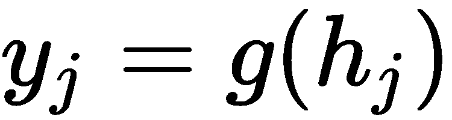

在前述表达式中，*g*是激活函数。以下列出了不同深度学习模型中使用的不同激活函数，并给出了它们的数学和图形表示：

+   Sigmoid: 

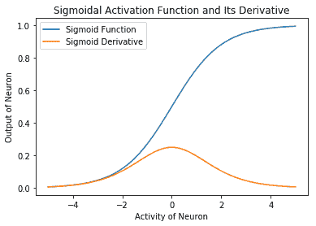

+   双曲正切：*g(h[j]) = tanh(h[j])*


+   ReLU: *g(h[j])= max(0,h[j])*


+   Softmax: 


+   Leaky ReLU: 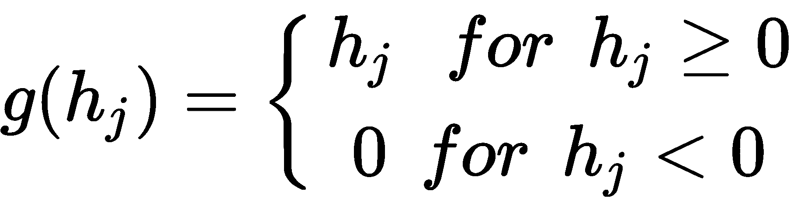


+   ELU: 


+   阈值：


# 在 TensorFlow 中建模单一神经元

我们能否使用这个单一的神经元并让它学习？答案是肯定的，学习的过程涉及调整权重，使得预定义的损失函数(*L*)减小。如果我们按照损失函数关于权重的梯度的反方向更新权重，它将确保每次更新时损失函数减少。这个算法被称为**梯度下降**算法，是所有深度学习模型的核心。数学上，如果*L*是损失函数，*η*是学习率，那么权重*w[ij]*的更新表示为：


如果我们需要建模单一的人工神经元，首先需要决定以下参数：

+   **学习率参数**：学习率参数决定了我们梯度下降的速度。通常，它的值介于*0*和*1*之间。如果学习率过高，网络可能会围绕正确的解振荡，或者完全偏离解。另一方面，当学习率过低时，最终收敛到解所需的时间会很长。

+   **激活函数**：激活函数决定了神经元的输出如何随其活动而变化。由于权重更新方程涉及损失函数的导数，而这个导数又依赖于激活函数的导数，因此我们更倾向于选择一个连续可微的函数作为神经元的激活函数。最初，使用的是 sigmoid 和双曲正切函数，但它们存在收敛慢和梯度消失的问题（梯度变为零，从而没有学习，而解决方案还未达到）。近年来，**修正线性单元**（**ReLU**）及其变体如 leaky ReLU 和 ELU 更受欢迎，因为它们提供了快速收敛，并且有助于克服梯度消失问题。在 ReLU 中，我们有时会遇到**死神经元**的问题，即一些神经元永远不会激活，因为它们的活动总是小于零，因此它们永远无法学习。Leaky ReLU 和 ELU 通过确保神经元输出不为零，即使活动为负，也解决了死神经元的问题。常用激活函数的列表以及它们的数学和图形表示在本节之前已经解释。（你可以尝试使用`activation_functions.ipynb`代码，其中使用了 TensorFlow 定义的激活函数。）

+   **损失函数**：损失函数是我们网络试图最小化的参数，因此选择正确的损失函数对于学习至关重要。随着你深入了解深度学习，你会发现许多巧妙定义的损失函数。你会看到，通过正确地定义损失函数，我们可以让我们的深度学习模型生成新的图像、可视化梦境、为图像添加标题等等。传统上，根据任务的类型（回归或分类），人们使用**均方误差**（**MSE**）或**类别交叉熵**损失函数。你将在本书的后续内容中学习这些损失函数。

现在我们已经知道了建模人工神经元所需的基本元素，让我们开始编写代码。我们假设是一个回归任务，因此我们将使用均方误差（MSE）损失函数。如果 *y[j]* 是我们单个神经元对输入向量 *X* 的输出，而  是我们期望输出神经元 *j* 的输出，那么 MSE 误差在数学上可以表示为（误差的平方的均值 ），如下所示：


在前面的公式中，*M* 是训练样本的总数（输入-输出对）。

请注意，如果您要实现这个人工神经元而不使用 TensorFlow（具体而言是不使用前面提到的任何 DL 库），那么您将需要自己计算梯度，例如，您将编写一个函数或代码，首先计算损失函数的梯度，然后您将必须编写代码来更新所有权重和偏差。对于具有 MSE 损失函数的单个神经元，计算导数仍然很简单，但随着网络复杂性的增加，计算特定损失函数的梯度、在代码中实现它，然后最终更新权重和偏差可能变得非常繁琐。

TensorFlow 通过使用自动微分使整个过程变得更加简单。TensorFlow 指定了 TensorFlow 图中的所有操作；这使它能够使用链式法则并在图中复杂地分配梯度。

因此，在 TensorFlow 中，我们构建执行图，并定义我们的损失函数，然后它会自动计算梯度，并支持许多不同的梯度计算算法（优化器），我们可以方便地使用它们。

您可以通过此链接了解更多关于自动微分的概念：[`www.columbia.edu/~ahd2125/post/2015/12/5/`](http://www.columbia.edu/~ahd2125/post/2015/12/5/)。

现在有了所有这些基本信息，我们通过以下步骤在 TensorFlow 中构建我们的单个神经元：

1.  每个 Python 代码的第一步始终是导入程序中将需要的模块。我们将导入 TensorFlow 来构建单个人工神经元。Numpy 和 pandas 则用于任何支持的数学计算和读取数据文件。此外，我们还从 scikit-learn 中导入一些有用的函数（用于数据归一化、将数据分割为训练集和验证集以及对数据进行洗牌），我们在早期章节已经使用过这些函数，并且知道归一化和洗牌在任何 AI 流水线中都是重要的步骤：

```py
import tensorflow as tf
import numpy as np
import pandas as pd
import matplotlib.pyplot as plt
from sklearn.utils import shuffle
from sklearn.preprocessing import MinMaxScaler
from sklearn.model_selection import train_test_split
% matplotlib inline
```

正如前面所解释的，验证有助于了解模型是否学习，以及是否出现了过拟合或欠拟合的情况。

1.  在 TensorFlow 中，我们首先构建一个模型图，然后执行它。一开始可能会觉得复杂，但一旦掌握了它，它就非常方便，并允许我们优化用于生产的代码。因此，让我们首先定义我们的单个神经元图。我们将 `self.X` 和 `self.y` 定义为占位符，以便将数据传递给图，如以下代码所示：

```py
class ArtificialNeuron:
    def __init__(self,N=2, act_func=tf.nn.sigmoid, learning_rate= 0.001):
        self.N = N # Number of inputs to the neuron
        self.act_fn = act_func

        # Build the graph for a single neuron
        self.X = tf.placeholder(tf.float32, name='X', shape=[None,N])
        self.y = tf.placeholder(tf.float32, name='Y')
```

1.  权重和偏置被定义为变量，以便自动求导自动更新它们。TensorFlow 提供了一个图形界面，支持 TensorBoard 查看图的结构、不同参数以及它们在训练过程中的变化。这对于调试和理解模型的行为非常有帮助。在以下代码中，我们因此添加了代码行来为权重和偏置创建直方图摘要：

```py
self.W = tf.Variable(tf.random_normal([N,1], stddev=2, seed = 0), name = "weights")
        self.bias = tf.Variable(0.0, dtype=tf.float32, name="bias")
        tf.summary.histogram("Weights",self.W)
        tf.summary.histogram("Bias", self.bias)
```

1.  接下来，我们执行数学运算，即输入和权重之间的矩阵乘法，加入偏差，计算神经元的激活值及其输出，记为`self.y_hat`，如下面所示：

```py
activity = tf.matmul(self.X, self.W) + self.bias
self.y_hat = self.act_fn(activity)
```

1.  我们定义了我们希望模型最小化的损失函数，并使用 TensorFlow 优化器最小化该损失，利用梯度下降优化器更新权重和偏置，如下代码所示：

```py
error = self.y - self.y_hat

self.loss = tf.reduce_mean(tf.square(error))
self.opt = tf.train.GradientDescentOptimizer(learning_rate=learning_rate).minimize(self.loss)

```

1.  我们通过定义一个 TensorFlow 会话并初始化所有变量来完成`init`函数。我们还添加了代码，确保 TensorBoard 将所有摘要写入指定位置，如下所示：

```py
tf.summary.scalar("loss",self.loss)
init = tf.global_variables_initializer()

self.sess = tf.Session()
self.sess.run(init)

self.merge = tf.summary.merge_all()
self.writer = tf.summary.FileWriter("logs/",graph=tf.get_default_graph())
```

1.  我们定义了`train`函数，在其中执行之前构建的图，如下代码所示：

```py
def train(self, X, Y, X_val, Y_val, epochs=100):
epoch = 0
X, Y = shuffle(X,Y)
loss = []
loss_val = []
while epoch &amp;lt; epochs:
            # Run the optimizer for the whole training set batch wise (Stochastic Gradient Descent)     
            merge, _, l = self.sess.run([self.merge,self.opt,self.loss], feed_dict={self.X: X, self.y: Y})    
            l_val = self.sess.run(self.loss, feed_dict={self.X: X_val, self.y: Y_val})    

            loss.append(l)
            loss_val.append(l_val)
            self.writer.add_summary(merge, epoch)    

            if epoch % 10 == 0:
                print("Epoch {}/{} training loss: {} Validation loss {}".\    
                    format(epoch,epochs,l, l_val ))    

            epoch += 1
        return loss, loss_val
```

1.  为了进行预测，我们还包括了一个`predict`方法，如下代码所示：

```py
    def predict(self, X):
        return self.sess.run(self.y_hat, feed_dict={self.X: X})
```

1.  接下来，像在上一章中一样，我们读取数据，使用 scikit-learn 函数对其进行归一化，并将其划分为训练集和验证集，如下所示：

```py
filename = 'Folds5x2_pp.xlsx'
df = pd.read_excel(filename, sheet_name='Sheet1')
X, Y = df[['AT', 'V','AP','RH']], df['PE']
scaler = MinMaxScaler()
X_new = scaler.fit_transform(X)
target_scaler = MinMaxScaler()
Y_new = target_scaler.fit_transform(Y.values.reshape(-1,1))
X_train, X_val, Y_train, y_val = \
        train_test_split(X_new, Y_new, test_size=0.4, random_state=333)
```

1.  我们使用创建的人工神经元来进行能量输出预测。随着人工神经元学习，`训练损失`和`验证损失`被绘制，如下所示：

```py
_, d = X_train.shape
model = ArtificialNeuron(N=d)

loss, loss_val = model.train(X_train, Y_train, X_val, y_val, 30000)

plt.plot(loss, label="Taining Loss")
plt.plot(loss_val, label="Validation Loss")
plt.legend()
plt.xlabel("Epochs")
plt.ylabel("Mean Square Error")
```


单个人工神经元学习预测能量输出时，训练和验证数据的均方误差

包含数据读取、数据归一化、训练等完整代码在`single_neuron_tf.ipynb` Jupyter Notebook 中给出。

# 多层感知器用于回归和分类

在最后一节中，你了解了单个人工神经元并使用它来预测能量输出。如果我们将其与第三章《物联网的机器学习》中的线性回归结果进行比较，我们会发现，尽管单神经元表现不错，但仍不如线性回归。单神经元架构在验证数据集上的均方误差（MSE）为 0.078，而线性回归为 0.01。我们能否通过增加更多的训练周期、调整学习率或增加更多的单一神经元来改善结果呢？不行，单神经元只能解决线性可分的问题。例如，只有当类别/决策之间存在一条直线时，单神经元才能提供解决方案。

只有一层神经元的网络被称为**简单感知机**。感知机模型由 Rosenblatt 于 1958 年提出（[htt](http://citeseerx.ist.psu.edu/viewdoc/download?doi=10.1.1.335.3398&rep=rep1&type=pdf)[p://citeseerx.ist.psu.edu/viewdoc/download?doi=10.1.1.335.3398&amp;rep=rep1&amp;type=pdf](http://citeseerx.ist.psu.edu/viewdoc/download?doi=10.1.1.335.3398&rep=rep1&type=pdf)）。该论文在科学界引起了广泛的反响，并促使该领域展开了大量的研究。它首次被应用于硬件中进行图像识别任务。尽管感知机在初期看起来非常有前景，但 Marvin Minsky 和 Seymour Papert 的书籍《感知机》证明了简单的感知机只能解决线性可分的问题（[`books.google.co.in/books?hl=en&amp;lr=&amp;id=PLQ5DwAAQBAJ&amp;oi=fnd&amp;pg=PR5&amp;dq=Perceptrons:+An+Introduction+to+Computational+Geometry&amp;ots=zyEDwMrl__&amp;sig=DfDDbbj3es52hBJU9znCercxj3M#v=onepage&amp;q=Perceptrons%3A%20An%20Introduction%20to%20Computational%20Geometry&amp;f=false`](https://books.google.co.in/books?hl=en&lr=&id=PLQ5DwAAQBAJ&oi=fnd&pg=PR5&dq=Perceptrons:+An+Introduction+to+Computational+Geometry&ots=zyEDwMrl__&sig=DfDDbbj3es52hBJU9znCercxj3M#v=onepage&q=Perceptrons%3A%20An%20Introduction%20to%20Computational%20Geometry&f=false))。

那么我们该怎么办呢？我们可以使用多个单一神经元的层，换句话说，使用 MLP。就像在现实生活中，我们通过将复杂问题分解为小问题来解决问题，MLP 的第一层中的每个神经元将问题分解为小的线性可分问题。由于信息在这里是单向流动的，从输入层通过隐藏层流向输出层，这个网络也被称为**前馈**网络。在下图中，我们可以看到如何通过第一层的两个神经元和**输出层**中的一个神经元来解决**XOR**问题。网络将不可线性分割的问题分解为三个线性可分的问题：


上图可以通过使用具有一个隐藏层和一个输出层神经元的 MLP 来解释 XOR 的解决方案。红色点表示零，蓝色点表示一。我们可以看到，隐藏层神经元将问题分解为两个线性可分的问题（与、或），然后输出神经元实现另一个线性可分的逻辑——与非逻辑。将它们结合在一起，我们能够解决 XOR 问题，而 XOR 是不可线性分割的。

隐藏层神经元将问题转换成输出层可以使用的形式。多层神经元的思想最早由 McCulloch 和 Pitts 提出，但虽然 Rosenblatt 为简单的感知器提供了学习算法，但他无法训练多层感知器。主要的困难在于，对于输出神经元，我们知道应该期望的输出是什么，因此可以计算误差，从而使用梯度下降法来计算损失函数和权重更新，但是对于隐藏层神经元却没有办法知道期望的输出。因此，在没有任何学习算法的情况下，MLP（多层感知器）从未被广泛探索。这一情况在 1982 年发生了变化，当时 Hinton 提出了反向传播算法（[`www.researchgate.net/profile/Yann_Lecun/publication/2360531_A_Theoretical_Framework_for_Back-Propagation/links/0deec519dfa297eac1000000/A-Theoretical-Framework-for-Back-Propagation.pdf`](https://www.researchgate.net/profile/Yann_Lecun/publication/2360531_A_Theoretical_Framework_for_Back-Propagation/links/0deec519dfa297eac1000000/A-Theoretical-Framework-for-Back-Propagation.pdf)），该算法可以用来计算误差，从而计算隐藏层神经元的权重更新。他们采用了链式法则的一个简单直接的数学技巧，解决了将输出层的误差传递回隐藏层神经元的问题，从而给神经网络带来了新的生机。今天，反向传播算法几乎是所有深度学习模型的核心。

# 反向传播算法

首先，让我们对反向传播算法背后的技术有一个简单的了解。如果你还记得上一节的内容，输出神经元的损失函数如下：


你可以看到它保持不变，因此连接隐藏层神经元*k*到输出神经元*j*的权重如下所示：


应用链式法则，这简化为以下形式：


在前面的方程中，*O[k]*是隐藏神经元*k*的输出。现在，连接输入神经元*i*到隐藏层*n*中隐藏神经元*k*的权重更新可以写成以下形式：


再次应用链式法则，它简化为以下形式：


在这里，*O[i]* 是 *n-1^(th)* 隐藏层中隐藏神经元 *i* 的输出。由于我们使用的是 TensorFlow，因此无需担心计算这些梯度，但了解这些表达式还是很有帮助的。从这些表达式中，你可以看到为什么激活函数的可微性非常重要。权重更新在很大程度上依赖于激活函数的导数以及神经元的输入。因此，像 ReLU 和 ELU 这样的平滑导数函数会导致更快的收敛。如果导数变得太大，我们会遇到梯度爆炸的问题；如果导数接近零，我们会遇到梯度消失的问题。在这两种情况下，网络都无法进行最佳学习。

通用逼近定理：1989 年，Hornik 等人和 George Cybenko 独立证明了通用逼近定理。该定理以最简单的形式表述为，在激活函数满足温和假设的前提下，足够大的前馈多层感知器具有单个隐藏层，可以以我们所需的任何精度逼近任何 Borel 可测函数。

用更简单的话来说，这意味着神经网络是一个通用逼近器，我们可以逼近任何函数，列举如下：

+   我们可以使用单个隐藏层前馈网络来实现这一点。

+   只要网络足够大（即如果需要，可以增加更多的隐藏神经元），我们就能做到这一点。

+   Cybenko 证明了在隐藏层使用 sigmoid 激活函数，在输出层使用线性激活函数的情况。后来，Hornik 等人证明了这实际上是 MLP 的一个性质，并且可以证明对于其他激活函数也是成立的

该定理保证了 MLP 可以解决任何问题，但没有给出网络应有多大的衡量标准。此外，它也不保证学习和收敛。

你可以参考以下链接中的论文：

+   Hornik 等人: [`www.sciencedirect.com/science/article/pii/0893608089900208`](https://www.sciencedirect.com/science/article/pii/0893608089900208)

+   Cybenko: [`pdfs.semanticscholar.org/05ce/b32839c26c8d2cb38d5529cf7720a68c3fab.pdf`](https://pdfs.semanticscholar.org/05ce/b32839c26c8d2cb38d5529cf7720a68c3fab.pdf)

现在我们可以描述反向传播算法中涉及的步骤，列举如下：

1.  将输入应用到网络中

1.  将输入向前传播并计算网络的输出

1.  计算输出的损失，然后使用前面的表达式，计算输出层神经元的权重更新

1.  使用输出层的加权误差，计算隐藏层的权重更新

1.  更新所有的权重

1.  对其他训练示例重复这些步骤

# 使用 MLP 在 TensorFlow 中进行能量输出预测

现在让我们看看 MLP 在预测能量输出方面的表现如何。这将是一个回归问题。我们将使用一个单一的隐藏层 MLP，预测联合循环发电厂的每小时净电能输出。数据集的描述见于第一章《物联网与人工智能的原理与基础》。

由于这是一个回归问题，我们的损失函数与之前相同。实现`MLP`类的完整代码如下：

```py
class MLP:
    def __init__(self,n_input=2,n_hidden=4, n_output=1, act_func=[tf.nn.elu, tf.sigmoid], learning_rate= 0.001):
        self.n_input = n_input # Number of inputs to the neuron
        self.act_fn = act_func
        seed = 123

        self.X = tf.placeholder(tf.float32, name='X', shape=[None,n_input])
        self.y = tf.placeholder(tf.float32, name='Y')

        # Build the graph for a single neuron
        # Hidden layer
        self.W1 = tf.Variable(tf.random_normal([n_input,n_hidden],\
                 stddev=2, seed = seed), name = "weights")    
        self.b1 = tf.Variable(tf.random_normal([1, n_hidden], seed = seed),\
                    name="bias")    
        tf.summary.histogram("Weights_Layer_1",self.W1)
        tf.summary.histogram("Bias_Layer_1", self.b1)

        # Output Layer
        self.W2 = tf.Variable(tf.random_normal([n_hidden,n_output],\
                stddev=2, seed = 0), name = "weights")
        self.b2 = tf.Variable(tf.random_normal([1, n_output], seed = seed),\
                name="bias")
        tf.summary.histogram("Weights_Layer_2",self.W2)
        tf.summary.histogram("Bias_Layer_2", self.b2)

        activity = tf.matmul(self.X, self.W1) + self.b1
        h1 = self.act_fn0

        activity = tf.matmul(h1, self.W2) + self.b2
        self.y_hat = self.act_fn1

        error = self.y - self.y_hat

        self.loss = tf.reduce_mean(tf.square(error))\
                 + 0.6*tf.nn.l2_loss(self.W1) 
        self.opt = tf.train.GradientDescentOptimizer(learning_rate\
                    =learning_rate).minimize(self.loss)        

        tf.summary.scalar("loss",self.loss)
        init = tf.global_variables_initializer()

        self.sess = tf.Session()
        self.sess.run(init)

        self.merge = tf.summary.merge_all()
        self.writer = tf.summary.FileWriter("logs/",\
                graph=tf.get_default_graph())

     def train(self, X, Y, X_val, Y_val, epochs=100):
        epoch = 0
        X, Y = shuffle(X,Y)
        loss = []
        loss_val = []
        while epoch &amp;lt; epochs:
            # Run the optimizer for the training set 
            merge, _, l = self.sess.run([self.merge,self.opt,self.loss],\
                     feed_dict={self.X: X, self.y: Y})
            l_val = self.sess.run(self.loss, feed_dict=\
                    {self.X: X_val, self.y: Y_val})

            loss.append(l)
            loss_val.append(l_val)
            self.writer.add_summary(merge, epoch)

            if epoch % 10 == 0:
                print("Epoch {}/{} training loss: {} Validation loss {}".\
                    format(epoch,epochs,l, l_val ))

            epoch += 1
        return loss, loss_val

    def predict(self, X):
        return self.sess.run(self.y_hat, feed_dict={self.X: X})
```

在使用之前，我们来看看之前的代码和我们为单个人工神经元编写的代码之间的区别。这里，隐藏层的权重维度是`#inputUnits × #hiddenUnits`；隐藏层的偏置将等于隐藏单元的数量（`#hiddenUnits`）。输出层的权重维度是`#hiddenUnits × #outputUnits`；输出层的偏置维度与输出层单元的数量（`#outputUnits`）相同。

在定义偏置时，我们只使用了列维度，而没有使用行维度。这是因为像`numpy`一样，TensorFlow 根据执行的操作对矩阵进行广播。通过不固定偏置的行维度，我们能够保持输入训练样本数（批量大小）对网络的灵活性。

以下截图展示了计算活动时的矩阵乘法和加法维度：


计算活动时的矩阵乘法和加法维度

你需要注意的第二个区别是在损失的定义中，我们在这里加入了`l2`正则化项，以减少过拟合，如在第三章《物联网的机器学习》中讨论的那样，具体如下：

```py
self.loss = tf.reduce_mean(tf.square(error)) + 0.6*tf.nn.l2_loss(self.W1) 
```

在从`csv`文件中读取数据并像之前一样将其分为训练集和验证集后，我们定义了一个`MLP`类对象，输入层有`4`个神经元，隐藏层有`15`个神经元，输出层有`1`个神经元：

```py
_, d = X_train.shape
_, n = Y_train.shape
model = MLP(n_input=d, n_hidden=15, n_output=n)
```

在以下代码中，我们将在训练数据集上训练模型`6000`个周期：

```py
loss, loss_val = model.train(X_train, Y_train, X_val, y_val, 6000)
```

这个训练好的网络给出了 0.016 的均方误差（MSE）和 0.67 的*R²*值。两者都优于我们从单个神经元得到的结果，并且与我们在第三章《物联网的机器学习》中研究的机器学习方法相当。完整代码可以在名为`MLP_regresssion.ipynb`的文件中找到。

你可以调整超参数，包括：隐藏神经元的数量、激活函数、学习率、优化器和正则化系数，并能获得更好的结果。

# 使用 MLP 在 TensorFlow 中进行葡萄酒质量分类

MLP 也可以用于分类任务。我们可以在之前的基础上对 MLP 类进行少量修改来执行分类任务。

我们需要做以下两个主要的修改：

+   在分类任务中，目标将会是 one-hot 编码的。

+   损失函数现在将是类别交叉熵损失：`tf.reduce_mean(tf.nn.softmax_cross_entropy_with_logits(logits=self.y_hat, labels=self.y))`

现在，让我们来看看完整的代码，这个代码也可以在 GitHub 上的 `MLP_classification` 文件中找到。我们将对红酒质量进行分类，为了方便起见，我们只使用两类红酒：

1.  我们导入了必要的模块，即：TensorFlow、Numpy、Matplotlib，以及来自 scikit-learn 的某些函数，代码如下所示：

```py
import tensorflow as tf
import numpy as np
import pandas as pd
import matplotlib.pyplot as plt
from sklearn.utils import shuffle
from sklearn.preprocessing import MinMaxScaler
from sklearn.model_selection import train_test_split
% matplotlib inline
```

1.  我们定义了 `MLP` 类，它与您之前看到的 `MLP` 类非常相似，唯一的不同是在损失函数的定义上：

```py
class MLP:
    def __init__(self,n_input=2,n_hidden=4, n_output=1, act_func=[tf.nn.relu, tf.nn.sigmoid], learning_rate= 0.001):
        self.n_input = n_input # Number of inputs to the neuron
        self.act_fn = act_func
        seed = 456

        self.X = tf.placeholder(tf.float32, name='X', shape=[None,n_input])
        self.y = tf.placeholder(tf.float32, name='Y')

        # Build the graph for a single neuron
        # Hidden layer
        self.W1 = tf.Variable(tf.random_normal([n_input,n_hidden],\
             stddev=2, seed = seed), name = "weights")
        self.b1 = tf.Variable(tf.random_normal([1, n_hidden],\
             seed = seed), name="bias")
        tf.summary.histogram("Weights_Layer_1",self.W1)
        tf.summary.histogram("Bias_Layer_1", self.b1)

        # Output Layer
        self.W2 = tf.Variable(tf.random_normal([n_hidden,n_output],\
            stddev=2, seed = seed), name = "weights")
        self.b2 = tf.Variable(tf.random_normal([1, n_output],\
             seed = seed), name="bias")    
        tf.summary.histogram("Weights_Layer_2",self.W2)
        tf.summary.histogram("Bias_Layer_2", self.b2)

        activity1 = tf.matmul(self.X, self.W1) + self.b1
        h1 = self.act_fn0

        activity2 = tf.matmul(h1, self.W2) + self.b2
        self.y_hat = self.act_fn1

        self.loss = tf.reduce_mean(tf.nn.softmax_cross_entropy_with_logits(\
                logits=self.y_hat, labels=self.y))
        self.opt = tf.train.AdamOptimizer(learning_rate=\
                learning_rate).minimize(self.loss)

        tf.summary.scalar("loss",self.loss)
        init = tf.global_variables_initializer()

        self.sess = tf.Session()
        self.sess.run(init)

        self.merge = tf.summary.merge_all()
        self.writer = tf.summary.FileWriter("logs/",\
             graph=tf.get_default_graph())

    def train(self, X, Y, X_val, Y_val, epochs=100):
        epoch = 0
        X, Y = shuffle(X,Y)
        loss = []
        loss_val = []
        while epoch &amp;lt; epochs:
            # Run the optimizer for the training set 
            merge, _, l = self.sess.run([self.merge,self.opt,self.loss],\
                 feed_dict={self.X: X, self.y: Y})        
            l_val = self.sess.run(self.loss, feed_dict={self.X: X_val, self.y: Y_val})

            loss.append(l)
            loss_val.append(l_val)
            self.writer.add_summary(merge, epoch)

            if epoch % 10 == 0:
                print("Epoch {}/{} training loss: {} Validation loss {}".\
                    format(epoch,epochs,l, l_val ))

            epoch += 1
        return loss, loss_val

    def predict(self, X):
        return self.sess.run(self.y_hat, feed_dict={self.X: X})
```

1.  接下来，我们读取数据，对其进行标准化和预处理，以便将红酒质量进行 one-hot 编码，并使用两个标签。我们还将数据划分为训练集和验证集，如下所示：

```py
filename = 'winequality-red.csv' 
#Download the file from https://archive.ics.uci.edu/ml/datasets/wine+quality
df = pd.read_csv(filename, sep=';')
columns = df.columns.values
# Preprocessing and Categorizing wine into two categories
X, Y = df[columns[0:-1]], df[columns[-1]]
scaler = MinMaxScaler()
X_new = scaler.fit_transform(X)
#Y.loc[(Y&amp;lt;3.5)]=3
Y.loc[(Y&amp;lt;5.5) ] = 2
Y.loc[(Y&amp;gt;=5.5)] = 1
Y_new = pd.get_dummies(Y) # One hot encode
X_train, X_val, Y_train, y_val = \
 train_test_split(X_new, Y_new, test_size=0.2, random_state=333)
```

1.  我们定义一个`MLP`对象并对其进行训练，代码如下所示：

```py
_, d = X_train.shape
_, n = Y_train.shape
model = MLP(n_input=d, n_hidden=5, n_output=n)
loss, loss_val = model.train(X_train, Y_train, X_val, y_val, 10000)
```

1.  接下来，您可以看到训练结果，随着网络的学习，交叉熵损失逐渐减少：

```py
plt.plot(loss, label="Taining Loss")
plt.plot(loss_val, label="Validation Loss")
plt.legend()
plt.xlabel("Epochs")
plt.ylabel("Cross Entropy Loss")
```

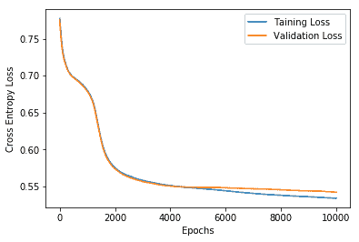

1.  在验证数据集上测试训练后的网络，准确率为 77.8%。验证集上的`confusion_matrix`如下所示：

```py
from sklearn.metrics import confusion_matrix, accuracy_score
import seaborn as sns
cm = confusion_matrix(np.argmax(np.array(y_val),1), np.argmax(Y_pred,1))
sns.heatmap(cm,annot=True,fmt='2.0f')
```


这些结果与我们使用 ML 算法获得的结果相当。通过调整超参数，我们可以进一步改善结果。

# 卷积神经网络

MLP 很有趣，但正如您在上一节中使用 MLP 代码时所观察到的那样，随着输入空间复杂度的增加，学习时间也会增加；此外，MLP 的表现仅次于 ML 算法。无论您能在 MLP 中做什么，使用第三章《物联网的机器学习》中的 ML 算法，您都有很大可能做得更好。正因如此，尽管反向传播算法早在 1980 年代就已出现，但我们还是经历了第二次人工智能寒冬，大约从 1987 年到 1993 年。

这一切发生了变化，神经网络不再在 2010 年代的深度神经网络发展中屈居 ML 算法的“配角”。如今，深度学习在计算机视觉的多种任务中，像是识别交通信号（[`people.idsia.ch/~juergen/cvpr2012.pdf`](http://people.idsia.ch/~juergen/cvpr2012.pdf)）、人脸（[`www.cv-foundation.org/openaccess/content_cvpr_2014/papers/Taigman_DeepFace_Closing_the_2014_CVPR_paper.pdf`](https://www.cv-foundation.org/openaccess/content_cvpr_2014/papers/Taigman_DeepFace_Closing_the_2014_CVPR_paper.pdf)）、手写数字（[`cs.nyu.edu/~wanli/dropc/dropc.pdf`](https://cs.nyu.edu/~wanli/dropc/dropc.pdf)）等，已经达到了人类水平或超越人类水平的表现。这个名单还在不断增长。

CNN 是这个成功故事的重要组成部分。在本节中，您将学习 CNN、CNN 背后的数学原理以及一些流行的 CNN 架构。

# CNN 的不同层

CNN 由三种主要类型的神经元层组成：卷积层、池化层和全连接层。全连接层就是 MLP 层，它们总是 CNN 的最后几层，执行分类或回归的最终任务。让我们看看卷积层和最大池化层是如何工作的。

# 卷积层

这是 CNN 的核心构建模块。它对输入数据（通常是 3D 图像）执行类似卷积的数学操作（更精确地说是交叉相关）。它由卷积核（滤波器）定义。基本的思路是，这些滤波器遍历整个图像，并从中提取特定的特征。

在深入细节之前，首先让我们看一下卷积操作在二维矩阵上的应用，简化问题。以下图示展示了当一个像素位于 5×5**二维图像**矩阵的[2, 2]位置，并与 3×3 滤波器进行卷积时的操作：


单像素上的卷积操作

卷积操作包括将滤波器放置在像素的中心位置，然后对滤波器元素与该像素及其邻居之间进行逐元素相乘，并最终求和。由于卷积操作是针对单个像素进行的，因此滤波器通常是奇数大小，如 5×5、3×3 或 7×7 等。滤波器的大小指定了它覆盖的邻域范围。

设计卷积层时的重要参数如下：

+   滤波器的大小（k×k）。

+   层中的滤波器数量，也称为**通道**。输入的彩色图像包含三个 RGB 通道。通道的数量通常在更高的层次中增加，从而使得高层具有更深的信息。

+   滤波器在图像中滑动的像素数（s）。通常，步幅为一个像素，以便滤波器从左上角到右下角覆盖整个图像。

+   卷积时使用的填充。传统上，有两种选项，分别是 valid 或 same。在**valid**填充中，完全没有填充，因此卷积后的图像大小比原图小。在**same**填充中，围绕边界像素进行零填充，以确保卷积后图像的大小与原图相同。以下截图展示了完整的**卷积图像**。当使用 valid 填充时，绿色的 3×3 方框是结果，右侧的完整 5×5 矩阵是使用 same 填充时的结果：


在 5×5 图像上应用的卷积操作

右侧的绿色方块将是**有效**填充的结果。对于**相同**填充，我们将得到右侧显示的完整 5×5 矩阵。

# 池化层

卷积层后面通常跟着一个池化层。池化层的目的是逐步减小表示的大小，从而减少网络中的参数和计算量。因此，它以前馈的方式对信息进行下采样，随着信息在网络中的传播。

这里我们再次使用一个滤波器，传统上人们偏好使用大小为 2×2 的滤波器，并且它在两个方向上以两个像素的步长进行移动。池化过程将 2×2 滤波器下的四个元素替换为四个中的最大值（**最大池化**）或四个中的平均值（**平均池化**）。在下图中，你可以看到池化操作对**二维单通道图像切片**的结果：


图像的二维单通道切片上的最大池化和平均池化操作

多个卷积池化层被堆叠在一起形成深度 CNN。当图像通过 CNN 传播时，每个卷积层提取特定的特征。较低的层提取粗略的特征，如形状、曲线、线条等，而较高的层提取更抽象的特征，如眼睛、嘴唇等。随着图像在网络中的传播，尺寸逐渐减小，但深度逐渐增加。最后一层卷积层的输出被展平并传递到全连接层，如下图所示：


CNN 网络的基本架构

滤波器矩阵的值也称为**权重**，并且它们在整个图像中是共享的。这种共享减少了训练参数的数量。权重通过反向传播算法由网络学习。由于我们将使用 TensorFlow 的自动微分功能，因此我们不需要计算卷积层的权重更新的精确表达式。

# 一些常见的 CNN 模型

以下是一些常见的 CNN 模型列表：

+   **LeNet**：LeNet 是第一个成功应用于识别手写数字的 CNN。它由 Yann LeCun 在 1990 年代开发。你可以在 Yann LeCun 的主页上了解更多关于 LeNet 架构及相关出版物的信息（[`yann.lecun.com/exdb/lenet/`](http://yann.lecun.com/exdb/lenet/)）。

+   **VGGNet**：这是 ILSVRC 2014 的亚军，由 Karen Simonyan 和 Andrew Zisserman 开发。它的第一个版本包含 16 个卷积+全连接层，被称为**VGG16**，后来他们推出了包含 19 层的 VGG19。有关其性能和出版物的详细信息可以从牛津大学网站访问（[`www.robots.ox.ac.uk/~vgg/research/very_deep/`](http://www.robots.ox.ac.uk/~vgg/research/very_deep/)）。

+   **ResNet**：由 Kaiming He 等人开发，ResNet 是 ILSVRC 2015 年的获胜者。它使用了一个新的特性——**残差学习**和**批量归一化**。它是一个非常深的网络，层数超过 100 层。众所周知，增加更多的层可以提高性能，但增加层数也会引入梯度消失问题。ResNet 通过使用身份快捷连接解决了这个问题，在这种连接中，信号跳过一个或多个层。你可以阅读原始论文以了解更多信息（[`arxiv.org/abs/1512.03385`](https://arxiv.org/abs/1512.03385)）。

+   **GoogleNet**：这是 ILSVRC 2014 年的获胜架构。它有 22 层，并引入了 inception 层的概念。基本思路是覆盖更大的区域，同时保持对图像上小信息的高分辨率。因此，在每一层中，我们使用从 1×1（用于精细细节）到 5×5 的不同大小的滤波器，而不是单一大小的滤波器。所有滤波器的结果将连接在一起并传递到下一层，这一过程会在下一个 inception 层中重复。

# 使用 LeNet 识别手写数字

在接下来的章节中，我们将使用一些流行的 CNN 及其变体来解决图像和视频处理任务。现在，让我们使用 Yann LeCun 提出的 LeNet 架构来识别手写数字。这个架构曾被美国邮政服务用于识别他们收到的信件上的手写邮政编码（[`yann.lecun.com/exdb/publis/pdf/jackel-95.pdf`](http://yann.lecun.com/exdb/publis/pdf/jackel-95.pdf)）。

LeNet 包含五个层，其中有两个卷积最大池化层和三个全连接层。该网络还使用了 dropout 特性，即在训练时，某些权重会被关闭。这迫使其他连接来补偿这些权重，从而有助于克服过拟合：

1.  我们导入必要的模块，如下所示：

```py
# Import Modules
import numpy as np
import pandas as pd
import matplotlib.pyplot as plt
%matplotlib inline
```

1.  接下来，我们创建`LeNet`类对象，它将包含必要的 CNN 架构和模块来进行训练和预测。在`__init__`方法中，我们定义了所有需要的占位符来保存输入图像及其输出标签。我们还定义了损失函数，由于这是一个分类问题，我们使用交叉熵损失，如以下代码所示：

```py
# Define your Architecture here
import tensorflow as tf
from tensorflow.contrib.layers import flatten
class my_LeNet:
    def __init__(self, d, n, mu = 0, sigma = 0.1, lr = 0.001):
        self.mu = mu
        self.sigma = sigma
        self.n = n
        # place holder for input image dimension 28 x 28
        self.x = tf.placeholder(tf.float32, (None, d, d, 1)) 
        self.y = tf.placeholder(tf.int32, (None,n))
        self.keep_prob = tf.placeholder(tf.float32) # probability to keep units

        self.logits = self.model(self.x)
        # Define the loss function
        cross_entropy = tf.nn.softmax_cross_entropy_with_logits(labels=self.y,\
                        logits=self.logits)
        self.loss = tf.reduce_mean(cross_entropy)
        optimizer = tf.train.AdamOptimizer(learning_rate = lr)
        self.train = optimizer.minimize(self.loss)
        correct_prediction = tf.equal(tf.argmax(self.logits, 1), tf.argmax(self.y, 1))
        self.accuracy = tf.reduce_mean(tf.cast(correct_prediction, tf.float32))
        init = tf.global_variables_initializer()
        self.sess = tf.Session()
        self.sess.run(init)
        self.saver = tf.train.Saver()
```

1.  `model`方法是实际构建卷积网络架构图的方法。我们使用 TensorFlow 的`tf.nn.conv2d`函数来构建卷积层。该函数接受一个参数，即定义为权重的滤波器矩阵，并计算输入与滤波器矩阵之间的卷积。我们还使用偏置来提供更大的自由度。在两个卷积层之后，我们将输出展平并传递到全连接层，如下所示：

```py
def model(self,x):
    # Build Architecture
    keep_prob = 0.7
    # Layer 1: Convolutional. Filter 5x5 num_filters = 6 Input_depth =1
    conv1_W = tf.Variable(tf.truncated_normal(shape=(5, 5, 1, 6), mean \
                    = self.mu, stddev = self.sigma))
    conv1_b = tf.Variable(tf.zeros(6))
    conv1 = tf.nn.conv2d(x, conv1_W, strides=[1, 1, 1, 1], padding='VALID') + conv1_b
    conv1 = tf.nn.relu(conv1)

    # Max Pool 1
    self.conv1 = tf.nn.max_pool(conv1, ksize=[1, 2, 2, 1],\
                     strides=[1, 2, 2, 1], padding='VALID')

    # Layer 2: Convolutional. Filter 5x5 num_filters = 16 Input_depth =6
    conv2_W = tf.Variable(tf.truncated_normal(shape=(5, 5, 6, 16), \
                    mean = self.mu, stddev = self.sigma))
    conv2_b = tf.Variable(tf.zeros(16))
    conv2 = tf.nn.conv2d(self.conv1, conv2_W, strides=[1, 1, 1, 1],\
                     padding='VALID') + conv2_b
    conv2 = tf.nn.relu(conv2)

    # Max Pool 2.
    self.conv2 = tf.nn.max_pool(conv2, ksize=[1, 2, 2, 1], \
                    strides=[1, 2, 2, 1], padding='VALID')

    # Flatten.
    fc0 = flatten(self.conv2)
    print("x shape:",fc0.get_shape())

    # Layer 3: Fully Connected. Input = fc0.get_shape[-1]. Output = 120.
    fc1_W = tf.Variable(tf.truncated_normal(shape=(256, 120), \
                mean = self.mu, stddev = self.sigma))
    fc1_b = tf.Variable(tf.zeros(120))
    fc1 = tf.matmul(fc0, fc1_W) + fc1_b
    fc1 = tf.nn.relu(fc1)

    # Dropout
    x = tf.nn.dropout(fc1, keep_prob)

    # Layer 4: Fully Connected. Input = 120\. Output = 84.
    fc2_W = tf.Variable(tf.truncated_normal(shape=(120, 84), \
                    mean = self.mu, stddev = self.sigma))
    fc2_b = tf.Variable(tf.zeros(84))
    fc2 = tf.matmul(x, fc2_W) + fc2_b
    fc2 = tf.nn.relu(fc2)

    # Dropout
    x = tf.nn.dropout(fc2, keep_prob)

    # Layer 6: Fully Connected. Input = 120\. Output = n_classes.
    fc3_W = tf.Variable(tf.truncated_normal(shape=(84, self.n), \
                    mean = self.mu, stddev = self.sigma))
    fc3_b = tf.Variable(tf.zeros(self.n))
    logits = tf.matmul(x, fc3_W) + fc3_b
    #logits = tf.nn.softmax(logits)
    return logits
```

1.  `fit`方法执行按批次的训练，而`predict`方法为给定输入提供输出，如下所示：

```py
def fit(self,X,Y,X_val,Y_val,epochs=10, batch_size=100):
    X_train, y_train = X, Y
    num_examples = len(X_train)
    l = []
    val_l = []
    max_val = 0
    for i in range(epochs):
        total = 0
        for offset in range(0, num_examples, batch_size): # Learn Batch wise
            end = offset + batch_size
            batch_x, batch_y = X_train[offset:end], y_train[offset:end]
            _, loss = self.sess.run([self.train,self.loss], \
                        feed_dict={self.x: batch_x, self.y: batch_y})
            total += loss
            l.append(total/num_examples)
            accuracy_val = self.sess.run(self.accuracy, \
                                feed_dict={self.x: X_val, self.y: Y_val})
            accuracy = self.sess.run(self.accuracy, feed_dict={self.x: X, self.y: Y})
            loss_val = self.sess.run(self.loss, feed_dict={self.x:X_val,self.y:Y_val})
            val_l.append(loss_val)
            print("EPOCH {}/{} loss is {:.3f} training_accuracy {:.3f} and \
                        validation accuracy is {:.3f}".\
                        format(i+1,epochs,total/num_examples, accuracy, accuracy_val))
            # Saving the model with best validation accuracy
            if accuracy_val &amp;gt; max_val:
                save_path = self.saver.save(self.sess, "/tmp/lenet1.ckpt")
                print("Model saved in path: %s" % save_path)
                max_val = accuracy_val

    #Restore the best model
    self.saver.restore(self.sess, "/tmp/lenet1.ckpt")
    print("Restored model with highest validation accuracy")
    accuracy_val = self.sess.run(self.accuracy, feed_dict={self.x: X_val, self.y: Y_val})
    accuracy = self.sess.run(self.accuracy, feed_dict={self.x: X, self.y: Y})
    return l,val_l, accuracy, accuracy_val

def predict(self, X):
    return self.sess.run(self.logits,feed_dict={self.x:X})
```

1.  我们使用手写数字数据集，并从 Kaggle 下载（[`www.kaggle.com/c/digit-recognizer/data`](https://www.kaggle.com/c/digit-recognizer/data)）。数据集以 `.csv` 格式提供。我们加载 `.csv` 文件并对数据进行预处理。以下是样本训练图：

```py
def load_data():
    # Read the data and create train, validation and test dataset
    data = pd.read_csv('train.csv')
    # This ensures always 80% of data is training and 
    # rest Validation unlike using np.random
    train = data.sample(frac=0.8, random_state=255) 
    val = data.drop(train.index)
    test = pd.read_csv('test.csv')
    return train, val, test

def create_data(df):
    labels = df.loc[:]['label']
    y_one_hot = pd.get_dummies(labels).astype(np.uint8)
    y = y_one_hot.values # One Hot encode the labels
    x = df.iloc[:,1:].values
    x = x.astype(np.float)
    # Normalize data
    x = np.multiply(x, 1.0 / 255.0)
    x = x.reshape(-1, 28, 28, 1) # return each images as 96 x 96 x 1
    return x,y

train, val, test = load_data()
X_train, y_train = create_data(train)
X_val, y_val = create_data(val)
X_test = (test.iloc[:,:].values).astype(np.float)
X_test = np.multiply(X_test, 1.0 / 255.0)
X_test = X_test.reshape(-1, 28, 28, 1) # return each images as 96 x 96 x 1

# Plot a subset of training data
x_train_subset = X_train[:12]

# visualize subset of training data
fig = plt.figure(figsize=(20,2))
for i in range(0, len(x_train_subset)):
    ax = fig.add_subplot(1, 12, i+1)
    ax.imshow(x_train_subset[i].reshape(28,28), cmap='gray')
fig.suptitle('Subset of Original Training Images', fontsize=20)
plt.show()
```


在这里，我们将训练模型：

```py
n_train = len(X_train)
# Number of validation examples
n_validation = len(X_val)

# Number of testing examples.
n_test = len(X_test)

# What's the shape of an handwritten digits?
image_shape = X_train.shape[1:-1]

# How many unique classes/labels there are in the dataset.
n_classes = y_train.shape[-1]
print("Number of training examples =", n_train)
print("Number of Validation examples =", n_validation)
print("Number of testing examples =", n_test)
print("Image data shape =", image_shape)
print("Number of classes =", n_classes)

# The result
## &amp;gt;&amp;gt;&amp;gt; Number of training examples = 33600
## &amp;gt;&amp;gt;&amp;gt; Number of Validation examples = 8400 
## &amp;gt;&amp;gt;&amp;gt; Number of testing examples = 28000 
## &amp;gt;&amp;gt;&amp;gt; Image data shape = (28, 28) 
## &amp;gt;&amp;gt;&amp;gt; Number of classes = 10

# Define the data values
d = image_shape[0]
n = n_classes
from sklearn.utils import shuffle
X_train, y_train = shuffle(X_train,y_train)
```

1.  我们创建 `LeNet` 对象并在训练数据上进行训练。训练数据集的准确率为 99.658%，验证数据集的准确率为 98.607%：

```py
# Create the Model
my_model = my_LeNet(d, n)

### Train model  here.
loss, val_loss, train_acc, val_acc = my_model.fit(X_train, y_train, \
    X_val, y_val, epochs=50) 
```

印象深刻！你可以预测测试数据集的输出并在 Kaggle 上提交。

# 循环神经网络

迄今为止，我们学习的模型仅响应当前输入。你给它一个输入，基于它所学的知识，它会给出相应的输出。但这并不是我们人类的工作方式。当你读一个句子时，你不会单独理解每个词，而是会考虑前面的词汇来推断它的语义。

意思是。

RNN 能够解决这个问题。它们利用反馈回路来保留信息。反馈回路允许信息从前一个步骤传递到当前步骤。下图展示了 RNN 的基本架构，以及反馈如何使信息从网络的一个步骤传递到下一个步骤（**展开**）：

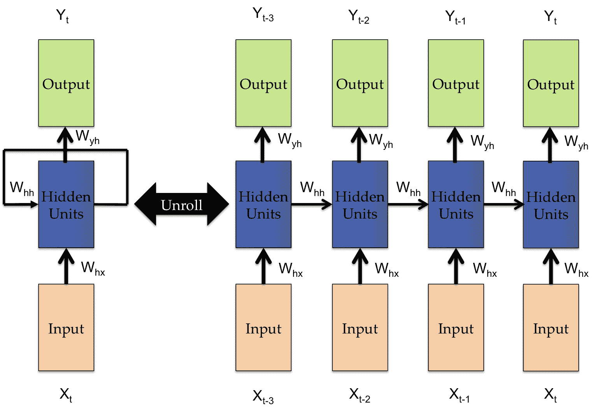

循环神经网络

在上图中，*X* 代表输入。它通过权重 *W[hx]* 连接到隐藏层的神经元，隐藏层的输出 *h* 通过权重 *W[hh]* 反馈到隐藏层，同时也通过权重 *W[yh]* 影响输出 *O*。我们可以将这些数学关系写成如下形式：


其中 *g* 是激活函数，*b[h]* 和 *b[y]* 分别是隐藏层和输出层神经元的偏置项。在前述关系中，*X*、*h* 和 *O* 都是向量；*W[hx]*、*W[hh]* 和 *W[yh]* 都是矩阵。输入 *X* 和输出 *O* 的维度取决于你使用的数据集，隐藏层 *h* 的单元数由你决定；你会发现许多论文中，研究者使用了 128 个隐藏单元。前述架构只展示了一个隐藏层，但我们可以根据需要添加任意数量的隐藏层。RNN 已被应用于自然语言处理领域，也用于分析时间序列数据，比如股价。

RNN 通过一种叫做 **时间反向传播** (**BPTT**) 的算法进行学习，这是一种反向传播算法的修改版，考虑了数据的时间序列特性。这里，损失函数被定义为从 *t*=*1* 到 *t*=*T*（要展开的时间步数）的所有损失函数之和，例如：

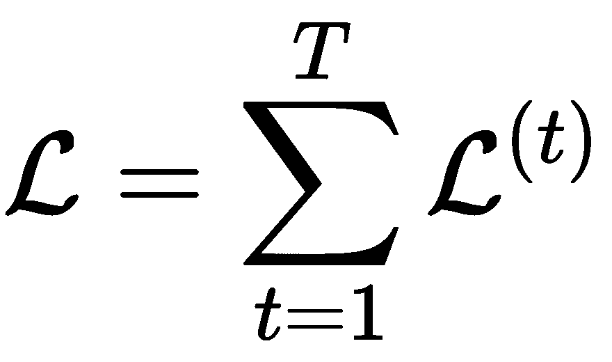

其中，*L^((t))*是时间*t*的损失，我们像之前一样应用链式法则进行微分，并推导出权重*W[hx]*、*W[hh]*和*W[yh]*的更新。

本书中我们不推导权重更新的表达式，因为我们不会实现代码。TensorFlow 提供了 RNN 和 BPTT 的实现。但是对于那些有兴趣深入数学细节的读者，以下是一些参考文献：

+   *关于训练递归神经网络的困难*，Razvan Pascanu、Tomas Mikolov 和 Yoshua Bengio（[`arxiv.org/pdf/1211.5063.pdf`](https://arxiv.org/pdf/1211.5063.pdf)）

+   *学习长期依赖关系与梯度下降的困难*，Yoshua Bengio、Patrice Simard 和 Paolo Frasconi（[www.iro.umontreal.ca/~lisa/pointeurs/ieeetrnn94.pdf](http://www.iro.umontreal.ca/~lisa/pointeurs/ieeetrnn94.pdf)）

+   此外，不提及 Colah 的博客（[`colah.github.io/posts/2015-08-Understanding-LSTMs/`](http://colah.github.io/posts/2015-08-Understanding-LSTMs/)）和 Andrej Karpathy 的博客（[`karpathy.github.io/2015/05/21/rnn-effectiveness/`](http://karpathy.github.io/2015/05/21/rnn-effectiveness/)）对于 RNN 及其一些酷应用的精彩解释，实在是不完整的。

我们呈现了每个时间步有一个输入的 RNN，并预测相应的输出。BPTT 通过展开所有输入时间步来工作。误差在每个时间步计算并积累，之后网络会回滚以更新权重。BPTT 的一个缺点是当时间步数增加时，计算量也会增加，这使得整个模型的计算代价较高。此外，由于多次梯度乘法，网络容易出现梯度消失问题。

为了解决这个问题，通常使用 BPTT 的修改版——截断 BPTT。在截断 BPTT 中，数据一次处理一个时间步，BPTT 的权重更新定期在固定的时间步数内执行。

我们可以按以下步骤列举截断 BPTT 算法：

1.  向网络呈现*K[1]*时间步的输入和输出对的序列

1.  通过展开网络，计算并积累*K[2]*时间步的误差

1.  通过回滚网络来更新权重

算法的表现取决于两个超参数*K[1]*和*K[2]*。更新之间的前向传递时间步数由*K[1]*表示，它影响训练的速度和权重更新的频率。而*K[2]*则表示应用于 BPTT 的时间步数，它应该足够大，以捕捉输入数据的时间结构。

# 长短期记忆（LSTM）

Hochreiter 和 Schmidhuber 在 1997 年提出了一种修改版的 RNN 模型，称为 **长短期记忆** (**LSTM**)，用以解决梯度消失问题。RNN 中的隐藏层被 LSTM 单元取代。

LSTM 单元由三个门组成：忘记门、输入门和输出门。这些门控制着单元生成和保持的长期记忆和短期记忆的量。这些门都使用 `sigmoid` 函数，将输入压缩到 *0* 和 *1* 之间。接下来，我们将看到各种门的输出是如何计算的。如果这些表达式看起来有些难以理解，不用担心，我们将使用 TensorFlow 中的 `tf.contrib.rnn.BasicLSTMCell` 和 `tf.contrib.rnn.static_rnn` 来实现 LSTM 单元，见下图：


基本的 LSTM 单元，*x* 是输入，*h* 是短期记忆，*c* 是长期记忆。下标表示时间步。

在每个时间步 *t*，LSTM 单元接收三个输入：输入 *x[t]*、短期记忆 *h*[*t-1*] 和长期记忆 *c[t-1]*，并输出长期记忆 *c[t]* 和短期记忆 *h[t]*。*x*、*h* 和 *c* 的下标表示时间步。

**忘记门** *f*(.) 控制当前时间步中要记住的短期记忆 *h* 的量，以便在后续步骤中继续流动。从数学角度，我们可以表示忘记门 *f(.)* 如下：

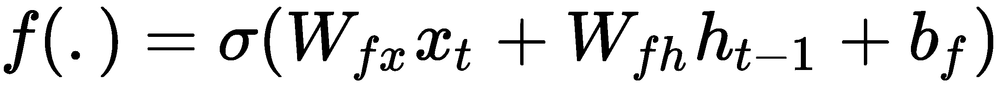

其中 σ 代表 sigmoid 激活函数，*W[fx]* 和 *W[fh]* 是控制输入 *x[t]*、短期记忆 *h*[*t*-1] 和 *b[f]* 忘记门偏置的权重。

**输入门** *i*(.) 控制输入和工作记忆对单元输出的影响。我们可以将其表示如下：


**输出门** *o*(.) 控制用于更新短期记忆的信息量，表达式如下：


除了这三个门，LSTM 单元还计算候选隐藏状态 ，它与输入门和忘记门一起用于计算长期记忆 *c[t]* 的量：

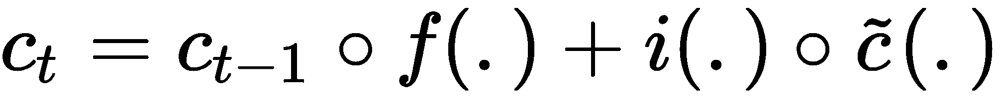

圆圈表示逐元素相乘。短期记忆的新值接下来按如下方式计算：


现在让我们来看看如何在 TensorFlow 中实现 LSTM，按以下步骤操作：

1.  我们使用以下模块：

```py
import tensorflow as tf
from tensorflow.contrib import rnn
import numpy as np
```

1.  我们定义了一个 LSTM 类，在其中构建了图并使用 TensorFlow 的`contrib`定义了 LSTM 层。为了处理内存，我们首先清除默认的图堆栈并使用`tf.reset_default_graph()`重置全局默认图。输入直接传递到具有`num_units`个隐藏单元的 LSTM 层。随后是一个带有`out_weights`权重和`out_bias`偏置的全连接输出层。创建输入`self.x`和标签`self.y`的占位符。输入被重塑并馈送到 LSTM 单元。为了创建 LSTM 层，我们首先定义具有`num_units`隐藏单元和遗忘偏置设置为`1.0`的 LSTM 单元。这会在遗忘门中添加偏置，以减少训练开始时的遗忘规模。将来自 LSTM 层的输出重塑并馈送到全连接层，如下所示：

```py
 class LSTM:
    def __init__(self, num_units, n_classes, n_input,\
             time_steps, learning_rate=0.001,):    
        tf.reset_default_graph()
        self.steps = time_steps
        self.n = n_input
        # weights and biases of appropriate shape
        out_weights = tf.Variable(tf.random_normal([num_units, n_classes]))
        out_bias = tf.Variable(tf.random_normal([n_classes]))
        # defining placeholders
        # input placeholder
        self.x = tf.placeholder("float", [None, self.steps, self.n])
        # label placeholder
        self.y = tf.placeholder("float", [None, n_classes])
        # processing the input tensor from [batch_size,steps,self.n] to 
        # "steps" number of [batch_size,self.n] tensors
        input = tf.unstack(self.x, self.steps, 1)

        # defining the network
        lstm_layer = rnn.BasicLSTMCell(num_units, forget_bias=1)
        outputs, _ = rnn.static_rnn(lstm_layer, input, dtype="float32")
        # converting last output of dimension [batch_size,num_units] to 
        # [batch_size,n_classes] by out_weight multiplication
        self.prediction = tf.matmul(outputs[-1], out_weights) + out_bias

        # loss_function
        self.loss = tf.reduce_mean(tf.squared_difference(self.prediction, self.y))
        # optimization
        self.opt = tf.train.AdamOptimizer(learning_rate=learning_rate).minimize(self.loss)

        # model evaluation
        correct_prediction = tf.equal(tf.argmax(self.prediction, 1), tf.argmax(self.y, 1))
        self._accuracy = tf.reduce_mean(tf.cast(correct_prediction, tf.float32))

        init = tf.global_variables_initializer()
        gpu_options = tf.GPUOptions(allow_growth=True)

        self.sess = tf.Session(config=tf.ConfigProto(gpu_options=gpu_options))
        self.sess.run(init)
```

1.  我们创建了训练和预测的方法，如下所示的代码：

```py
def train(self, X, Y, epochs=100,batch_size=128):
    iter = 1
    #print(X.shape)
    X = X.reshape((len(X),self.steps,self.n))
    while iter &amp;lt; epochs:
        for i in range(int(len(X)/batch_size)):
            batch_x, batch_y = X[i:i+batch_size,:], Y[i:i+batch_size,:]
            #print(batch_x.shape)
            #batch_x = batch_x.reshape((batch_size, self.steps, self.n))    
            #print(batch_x.shape)    
            self.sess.run(self.opt, feed_dict={self.x: batch_x, self.y: batch_y})
            if iter % 10 == 0:
                acc = self.sess.run(self._accuracy, feed_dict={self.x: X, self.y: Y})
                los = self.sess.run(self.loss, feed_dict={self.x: X, self.y: Y})
                print("For iter ", iter)
                print("Accuracy ", acc)
                print("Loss ", los)    
                print("__________________")
            iter = iter + 1

def predict(self,X):
    # predicting the output
    test_data = X.reshape((-1, self.steps, self.n))
    out = self.sess.run(self.prediction, feed_dict={self.x:test_data})
    return out
```

在接下来的章节中，我们将使用 RNN 处理时间序列生成和文本处理。

# 门控循环单元

**门控循环单元**（**GRU**）是对 RNN 的另一种修改。它相对于 LSTM 有简化的架构，并且解决了梯度消失问题。它只接受两个输入，时间*t*处的输入*x[t]*和来自时间*t*-1 处的记忆*h[t-1]*。它有两个门，**更新门**和**重置门**，如下图所示：


一个基本的 GRU 单元的结构

更新门控制要保留多少以前的记忆，重置门确定如何将新输入与以前的记忆结合。我们可以通过以下四个方程定义完整的 GRU 单元：

+   

+   

+   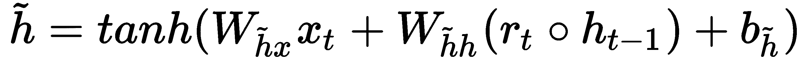

+   

GRU 和 LSTM 表现相当，但 GRU 的训练参数更少。

# 自编码器

我们到目前为止学习的模型都是使用监督学习来学习的。在这一节中，我们将学习自编码器。它们是前馈非递归神经网络，通过无监督学习进行学习。它们和生成对抗网络一样是最新的热点，我们可以在图像重建、聚类、机器翻译等领域找到应用。最初由 Geoffrey E. Hinton 和 PDP 小组在 1980 年代提出（[`www.cs.toronto.edu/~fritz/absps/clp.pdf`](http://www.cs.toronto.edu/~fritz/absps/clp.pdf)）。

自编码器基本上由两个级联的神经网络组成——第一个网络充当编码器；它接受输入*x*并使用变换*h*编码为编码信号*y*，如下方程所示：


第二个神经网络使用编码信号*y*作为输入，并执行另一个变换*f*以获得重建信号*r*，如图所示：

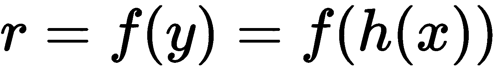

损失函数是均方误差（MSE），其中误差*e*定义为原始输入*x*与重建信号*r*之间的差异：


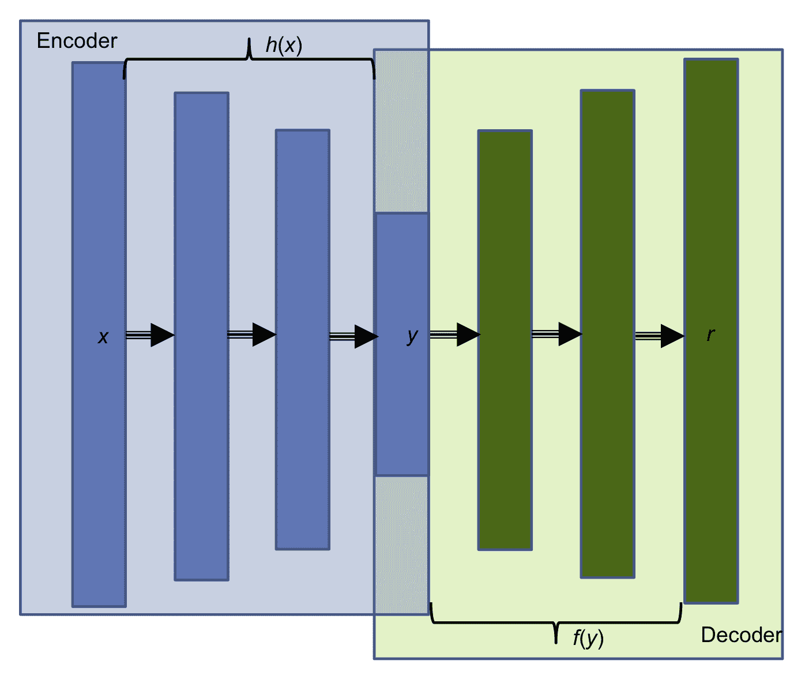

自编码器的基本架构

上面的图示展示了一个自编码器，其中**编码器**和**解码器**被分别突出显示。自编码器可能会使用权重共享，即解码器和编码器的权重是共享的。这是通过简单地使它们互为转置来实现的；这有助于加速网络的学习，因为训练参数的数量较少。自编码器有很多种类，例如：稀疏自编码器、去噪自编码器、卷积自编码器和变分自编码器等。

# 去噪自编码器

去噪自编码器从被破坏（有噪声）的输入中学习；我们将有噪声的输入送入编码器网络，解码器重建的图像与原始去噪后的输入进行比较。其核心思想是，这样可以帮助网络学会如何去噪。网络不仅仅进行逐像素比较，相反，为了去噪，网络被迫学习邻近像素的信息。

一旦自编码器学会了编码特征*y*，我们就可以去掉网络中的解码器部分，仅使用编码器部分来实现降维。降维后的输入可以送入其他分类或回归模型中。

# 变分自编码器

另一种非常流行的自编码器是**变分自编码器**（**VAE**）。它们结合了深度学习和贝叶斯推理的优点。

变分自编码器（VAE）有一个额外的随机层；该层在编码器网络之后，使用高斯分布对数据进行采样，而解码器网络之后的层使用伯努利分布对数据进行采样。

变分自编码器（VAE）可以用于生成图像。VAE 允许在潜在空间中设定复杂的先验分布，并学习强大的潜在表示。我们将在后续章节中深入了解它们。

# 总结

在本章中，我们介绍了一些基础且实用的深度神经网络模型。我们从单个神经元开始，了解了它的强大之处以及局限性。多层感知机被构建用于回归和分类任务，反向传播算法也在此时引入。接着我们深入探讨了卷积神经网络（CNN），并介绍了卷积层和池化层。我们学习了一些成功的 CNN 应用，并使用第一个 CNN 模型 LeNet 进行手写数字识别。从前馈型多层感知机（MLP）和卷积神经网络（CNN）出发，我们继续深入到循环神经网络（RNN）。随后介绍了 LSTM 和 GRU 网络。我们在 TensorFlow 中实现了自己的 LSTM 网络，最终学习了自编码器。

在下一章，我们将从一种全新的人工智能模型——遗传算法开始。像神经网络一样，它们也受到自然的启发。我们将在后续章节的案例研究中，运用本章以及接下来的几章所学的内容。
