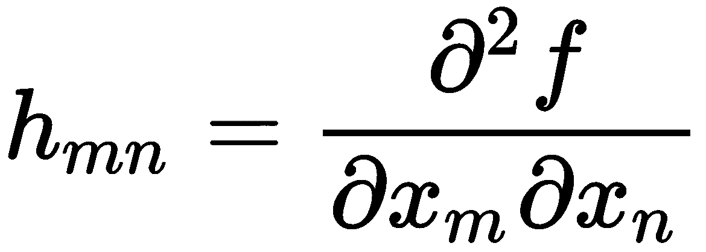
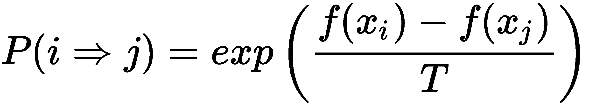
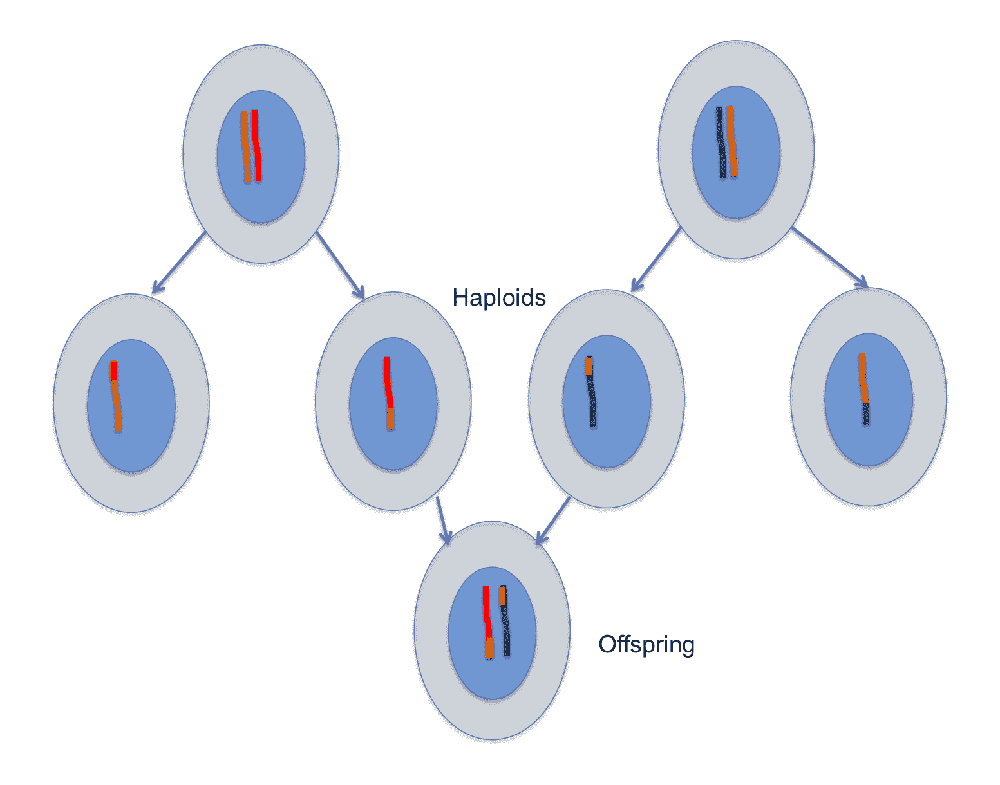

# 第五章：遗传算法在物联网中的应用

在上一章中，我们研究了不同的基于深度学习的算法；这些算法在识别、检测、重建甚至在视觉、语音和文本数据生成领域取得了成功。目前，**深度学习**（**DL**）在应用和就业方面处于领先地位，但它与进化算法有着激烈的竞争。这些算法受自然进化过程的启发，是世界上最好的优化器。是的，连我们自己也是多年遗传进化的结果。在这一章中，你将进入迷人的进化算法世界，并更详细地了解一种特定类型的进化算法——遗传算法。在这一章中，你将学习到以下内容：

+   什么是优化

+   解决优化问题的不同方法

+   理解遗传算法背后的直觉

+   遗传算法的优点

+   理解并实现交叉、变异和适应度函数选择的过程

+   使用遗传算法找回丢失的密码

+   遗传算法在优化模型中的各种应用

+   Python 遗传算法库中的分布式进化算法

# 优化

优化（Optimization）不是一个新词汇；我们之前已经在机器学习和深度学习（DL）算法中使用过它，当时我们使用了 TensorFlow 自动微分器，通过一种梯度下降算法找到最佳的模型权重和偏差。在本节中，我们将深入了解优化、优化问题以及执行优化的不同技术。

从最基本的角度来看，**优化**是使某物变得更好的过程。其核心思想是找到最佳的解决方案，显然，当我们谈论最佳解决方案时，意味着存在不止一个解决方案。在优化中，我们尝试调整我们的变量参数/过程/输入，以便找到最小或最大的输出。通常，这些变量构成输入，我们有一个称为**目标函数**、**损失函数**或**适应度函数**的函数，作为输出我们期望的是成本/损失或适应度。成本或损失应该最小化，如果我们定义适应度，那么它应该最大化。在这里，我们通过改变输入（变量）来实现所需的（优化的）输出。

我希望你能理解，称其为损失/成本或适应度只是一个选择问题，计算成本并需要最小化的函数，如果我们给它加上一个负号，那么我们期望修改后的函数能够最大化。例如，最小化*2 - x²*在区间*-2 < x < 2*上，和在相同区间内最大化*x*² - 2 是一样的。

我们的日常生活中充满了许多这样的优化任务。到办公室的最佳路线应该是怎样的？我应该先做哪个项目？为面试做准备，应该阅读哪些主题以最大化面试成功率？下图展示了**输入变量**、**需要优化的函数**和**输出/成本**之间的基本关系：


输入、需要优化的函数和输出之间的关系

目标是最小化成本，使得函数指定的约束条件通过输入变量得到满足。成本函数、约束条件和输入变量之间的数学关系决定了优化问题的复杂性。一个关键问题是成本函数和约束条件是凸的还是非凸的。如果成本函数和约束条件是凸的，我们可以确信确实存在可行解，并且如果我们在一个足够大的领域内进行搜索，我们一定能找到一个。下图展示了一个凸成本函数的示例：


一个凸成本函数。左边是表面图，右边显示的是同一成本函数的等高线图。图像中最深的红色点对应于最优解点。

另一方面，如果成本函数或约束条件是非凸的，优化问题会变得更加困难，我们无法确定是否确实存在解决方案，或者我们是否能够找到一个。

在数学和计算机编程中，有多种方法可以解决优化问题。接下来让我们了解一下它们每一种方法。

# 确定性和解析方法

当目标函数是平滑的并且具有连续的二阶导数时，根据微积分的知识，我们知道在局部最小值处，以下条件成立：

+   在最小值处，目标函数的梯度是 0，即*f*'(*x*) = *0*

+   二阶导数（Hessian *H*(*x*) = ∇²*f*(*x*)）是正定的

在这种情况下，对于某些问题，可以通过确定梯度的零点并验证 Hessian 矩阵在零点处的正定性来解析地找到解决方案。因此，在这些情况下，我们可以通过迭代地探索搜索空间来找到目标函数的最小值。有多种搜索方法；让我们来看一看。

# 梯度下降法

我们在前面的章节中学习了梯度下降及其工作原理，看到搜索方向是梯度下降的方向，-∇*f*(*x*)。这也叫做**柯西方法**，因为它是由柯西于 1847 年提出的，从那时起就非常流行。我们从目标函数表面上的一个任意点开始，沿着梯度方向改变变量（在前面的章节中，这些是权重和偏置）。数学上，它表示为：


这里，*α[n]*是迭代*n*时的步长（变化/学习率）。梯度下降算法在训练深度学习模型时效果良好，但也有一些严重的缺点：

+   所使用的优化器性能在很大程度上取决于学习率和其他常数。如果稍微改变它们，网络很可能不会收敛。正因为如此，研究人员有时将训练模型称为一门艺术，或炼金术。

+   由于这些方法基于导数，它们不适用于离散数据。

+   当目标函数是非凸时，我们无法可靠地应用该方法，这在许多深度学习网络中是常见的（尤其是使用非线性激活函数的模型）。许多隐藏层的存在可能导致多个局部最小值，模型很有可能陷入局部最小值中。这里，你可以看到一个具有多个局部最小值的目标函数示例：


具有多个局部最小值的成本函数。左侧是表面图，右侧是相同成本函数的等高线图。图中的深红色点对应于最小值。

梯度下降法有许多变种，其中最流行的几种可以在 TensorFlow 优化器中找到，包括以下几种：

+   随机梯度优化器

+   Adam 优化器

+   Adagrad 优化器

+   RMSProp 优化器

你可以通过 TensorFlow 文档中的[`www.tensorflow.org/api_guides/python/train`](https://www.tensorflow.org/api_guides/python/train)了解更多有关 TensorFlow 中不同优化器的信息。

一个不错的来源是 Sebastian Ruder 的博客（[`ruder.io/optimizing-gradient-descent/index.html#gradientdescentoptimizationalgorithms`](http://ruder.io/optimizing-gradient-descent/index.html#gradientdescentoptimizationalgorithms)），基于他在 arXiv 上的论文[`arxiv.org/abs/1609.04747`](https://arxiv.org/abs/1609.04747)。

# 牛顿-拉夫森方法

该方法基于目标函数*f*(*x*)在点*x^*附近的二阶泰勒级数展开：

**

这里，*x**是泰勒级数展开的点，*x*是靠近*x**的点，超脚本*T*表示转置，*H*是 Hessian 矩阵，其元素如下所示：

**

通过对泰勒级数展开式求梯度并使其等于**0**，我们得到：

**

假设初始猜测为*x*[0]，下一个点*x*[n+1]可以通过以下公式从前一个点*x*[n]计算得到：

**

该方法同时使用目标函数的一阶和二阶偏导数来寻找最小值。在第*k*次迭代时，它通过围绕*x*(*k*)的二次函数来逼近目标函数，并朝向最小值移动。

由于计算 Hessian 矩阵在计算上很昂贵且通常未知，因此有许多算法致力于逼近 Hessian 矩阵；这些技术被称为**拟牛顿方法**。它们可以表示如下：

**

*α[n]*是第*n*次迭代中的步长（变化/学习率），*A[n]*是第*n*次迭代中的 Hessian 矩阵逼近值。我们构造一个 Hessian 的逼近序列，使得以下条件成立：

**

两种流行的拟牛顿方法如下：

+   Davidon-Fletcher-Powell 算法

+   Broyden-Fletcher-Goldfarb-Shanno 算法

当 Hessian 的逼近*A[n]*是单位矩阵时，牛顿法变成了梯度下降法。

牛顿法的主要缺点是它无法扩展到具有高维输入特征空间的问题。

# 自然优化方法

自然优化方法受到一些自然过程的启发，即在自然界中存在的一些在优化某些自然现象上非常成功的过程。这些算法不需要求取目标函数的导数，因此即使是离散变量和非连续目标函数也能使用。

# 模拟退火

模拟退火是一种随机方法。它受到物理退火过程的启发，在该过程中，一个固体首先被加热到足够高的温度使其融化，然后温度慢慢降低；这使得固体的粒子能够以最低的能量状态重新排列，从而产生一个高度结构化的晶格。

我们从为每个变量分配一些随机值开始，这表示初始状态。在每一步中，我们随机选择一个变量（或一组变量），然后选择一个随机值。如果将该值分配给变量后，目标函数有所改善，则算法接受该赋值，形成新的当前赋值，系统状态发生变化。否则，它以一定的概率*P*接受该赋值，*P*的值依赖于温度*T*以及当前状态和新状态下目标函数值的差异。如果不接受变化，则当前状态保持不变。从状态*i*到状态*j*的转变概率*P*如下所示：



这里，*T*表示一个与物理系统中温度类似的变量。当温度趋近于*0*时，模拟退火算法就变成了梯度下降算法。

# 粒子群优化

**粒子群优化**（**PSO**）由爱德华和肯尼迪于 1995 年提出。它基于动物的社会行为，例如鸟群。你一定注意到，在天空中，鸟群飞行时呈 V 字形。研究鸟类行为的人告诉我们，当鸟群寻找食物或更好的栖息地时，它们会以这种方式飞行，队伍前面的鸟最接近目标源。

现在，当它们飞行时，领头的鸟并不固定不变；相反，随着它们的移动，领头鸟会发生变化。看到食物的鸟会发出声音信号，其他鸟会围绕着它以 V 字形聚集。这是一个连续重复的过程，已经让鸟类受益了数百万年。

PSO 从这种鸟类行为中汲取灵感，并利用它来解决优化问题。在 PSO 中，每个解决方案都是搜索空间中的一只鸟（称为**粒子**）。每个粒子都有一个适应度值，这个值通过待优化的适应度函数来评估；它们还有速度，决定了粒子的飞行方向。粒子通过跟随当前最优粒子飞行，通过问题的搜索空间。

粒子在搜索空间中根据两个最佳适应度值进行移动，一个是它们自己已知的最佳位置（**pbest**：粒子最佳），另一个是整个群体已知的最佳适应度值（**gbest**：全局最佳）。随着改进位置的发现，这些位置被用来指导粒子群体的运动。这个过程不断重复，期望最终能够找到一个最优解。

# 遗传算法

当我们环顾四周，看到不同的物种时，一个问题自然会浮现：为什么这些特征组合能稳定存在，而其他特征不能？为什么大多数动物有两条腿或四条腿，而不是三条腿？我们今天看到的这个世界，是否是经过多次迭代优化算法的结果？

设想有一个成本函数来衡量生存能力，并且该生存能力应该是最大化的。自然界生物的特性适应于一个拓扑景观。生存能力的水平（通过适应性来衡量）代表景观的高度。最高的点对应于最适合的条件，而限制条件则由环境以及不同物种之间的相互作用提供。

那么，进化过程可以看作是一个庞大的优化算法，它选择哪些特征能产生适应生存的物种。景观的顶峰由生物体占据。有些顶峰非常广阔，容纳了多种特征，涵盖了许多物种，而另一些顶峰则非常狭窄，只允许具有非常特定特征的物种存在。

我们可以将这一类比扩展到包括分隔不同物种的山谷。我们可以认为人类可能处于这个景观的全局最优峰值，因为我们拥有智慧和改变环境的能力，并能确保在极端环境下的更好生存能力。

因此，可以将这个拥有不同生命形式的世界视作一个巨大的搜索空间，而不同的物种则是许多次迭代优化算法的结果。这一思想构成了遗传算法的基础。

本章的主题是遗传算法，让我们深入探讨一下它们。

# 遗传算法简介

根据著名生物学家查尔斯·达尔文的研究，我们今天看到的动物和植物物种是经过数百万年的进化而形成的。进化过程遵循**适者生存**的原则，选择那些拥有更好生存机会的生物。我们今天看到的植物和动物是数百万年适应环境约束的结果。在任何时候，许多不同的生物可能会共存并争夺相同的环境资源。

那些最具资源获取能力和繁殖能力的生物，它们的后代将拥有更多的生存机会。另一方面，能力较弱的生物往往会有很少或没有后代。随着时间的推移，整个种群会发生演化，平均而言，新一代的生物会比前几代更具适应性。

是什么使得这一切成为可能？是什么决定了一个人会很高，而一棵植物会有特定形状的叶子？这一切都被像一套规则一样编码在生命蓝图中的程序里——基因。地球上的每一个生物都拥有这套规则，它们描述了该生物是如何被设计（创造）的。基因存在于染色体中。每个生物都有不同数量的染色体，这些染色体包含数千个基因。例如，我们人类有 46 条染色体，这些染色体包含约 20,000 个基因。每个基因代表一个特定的规则：比如一个人会有蓝色的眼睛，棕色的头发，是女性，等等。这些基因通过繁殖过程从父母传递给后代。

基因从父母传递给后代的方式有两种：

+   **无性繁殖**：在这种情况下，子代是父代的完全复制。它发生在一个叫做**有丝分裂**的生物过程里；如细菌和真菌等低等生物通过有丝分裂繁殖。此过程中只需要一个父母：


有丝分裂过程：父母的染色体首先翻倍，然后细胞分裂成两个子细胞

+   **有性生殖**：这一过程通过一种叫做**减数分裂**的生物学过程完成。在这一过程中，最初涉及两个父母；每个父母的细胞经历交叉过程，其中一条染色体的一部分与另一条染色体的一部分交换位置。这样改变了遗传序列，细胞随后分裂为两部分，但每部分只包含一半的染色体数。来自两个父母的单倍体细胞最终结合，形成受精卵，后通过有丝分裂和细胞分化，最终产生一个与父母相似但又有所不同的**后代**。



细胞分裂过程：父母的细胞染色体发生交叉，一部分染色体与另一部分染色体交换位置。然后，细胞分裂为两部分，每个分裂的细胞只包含一条染色体（单倍体）。来自两个父母的两个单倍体细胞随后结合，完成染色体的总数。

自然选择和进化过程中另一个有趣的现象是突变现象。在这里，基因发生突然变化，产生一个完全新的基因，这个基因在父母双方中都没有出现过。这个现象进一步增加了多样性。

通过世代间的有性生殖，应该带来进化，并确保具有最适应特征的生物拥有更多的后代。

# 遗传算法

现在让我们来了解如何实现遗传算法。这一方法是由约翰·霍兰德于 1975 年提出的。他的学生戈德堡展示了这一方法可以用来解决优化问题，并且使用遗传算法来控制天然气管道的传输。此后，遗传算法一直广受欢迎，并启发了其他各种进化程序的研究。

为了将遗传算法应用于计算机优化问题的求解，第一步我们需要**将问题变量编码为基因**。这些基因可以是实数的字符串或二进制位串（0 和 1 的序列）。这代表了一个潜在的解决方案（个体），而多个这样的解决方案一起构成了时间点*t*时的人口。例如，考虑一个需要找到两个变量 a 和 b 的问题，其中这两个变量的范围是(0, 255)。对于二进制基因表示，这两个变量可以通过一个 16 位的染色体表示，其中高 8 位代表基因 a，低 8 位代表基因 b。编码之后需要解码才能获得变量 a 和 b 的实际值。

遗传算法的第二个重要要求是定义一个合适的**适应度函数**，该函数计算任何潜在解的适应度分数（在前面的示例中，它应该计算编码染色体的适应度值）。这是我们希望通过寻找系统或问题的最优参数集来优化的函数。适应度函数是与问题相关的。例如，在自然进化过程中，适应度函数代表生物体在其环境中生存和运作的能力。

一旦我们决定了问题解决方案在基因中的编码方式，并确定了适应度函数，遗传算法将遵循以下步骤：

1.  **种群初始化**：我们需要创建一个初始种群，其中所有染色体（通常）是随机生成的，以产生整个可能解的范围（搜索空间）。偶尔，解决方案可能会在最有可能找到最佳解的区域中进行初始化。种群的大小取决于问题的性质，但通常包含数百个潜在的解决方案，这些解决方案被编码成染色体。

1.  **父代选择**：对于每一代，根据适应度函数（或随机选择），我们接下来选择现有种群中的一定比例。这些被选中的种群将通过繁殖形成新一代。这个过程是通过竞赛选择法来完成的：随机选择固定数量的个体（竞赛大小），然后选择适应度分数最好的个体作为父母之一。

1.  **繁殖**：接下来，我们通过在步骤 2 中选择的个体，通过遗传算子如交叉和变异来生成后代。最终，这些遗传算子会产生一个与初代不同但又在许多方面继承了父母特征的后代染色体种群。

1.  **评估**：生成的后代将通过适应度函数进行评估，并且它们将替换种群中最不适应的个体，以保持种群大小不变。

1.  **终止**：在*评估*步骤中，如果任何后代达到了目标适应度分数或达到最大代数，遗传算法过程将终止。否则，步骤*2*到*4*将重复进行，以产生下一代。

两个对遗传算法成功至关重要的算子是交叉和变异。

# 交叉

为了执行交叉操作，我们在两个父母的染色体上选择一个随机位置，然后基于这个点交换它们的遗传信息，交叉概率为*P[x]*。这将产生两个新的后代。当交叉发生在一个随机点时，称为**单点交叉**（或**Single Point Crossover**）：


单点交叉：随机选择父代染色体中的一个点，并交换相应的基因位。

我们也可以在多个位置交换父代的基因；这称为**多点交叉**：


多点交叉：在多个位置交换父代的基因。这是双点交叉的一个例子。

存在许多不同的交叉方式，例如，均匀交叉、基于顺序的交叉和循环交叉。

# 变异

虽然交叉操作确保了多样性并且有助于加速搜索，但它并不产生新的解。这是变异操作符的工作，变异操作符帮助保持和引入种群中的多样性。变异操作符以概率*P[m]*应用于子代染色体的某些基因（位）。

我们可以进行位翻转变异；如果我们考虑之前的例子，那么在 16 位染色体中，位翻转变异将导致一个位的状态发生变化（从*0*变为*1*，或者从*1*变为*0*）。

我们有可能将基因设置为所有可能值中的一个随机值，这称为**随机重置**。

概率*P[m]*起着重要作用；如果我们给*P[m]*分配一个非常低的值，它可能导致遗传漂移，但另一方面，过高的*P[m]*可能会导致丧失好的解。我们选择一个变异概率，使得算法学会牺牲短期适应度来获得长期适应度。

# 优缺点

遗传算法听起来很酷，对吧！现在，在我们尝试围绕它们构建代码之前，让我们先指出遗传算法的一些优缺点。

# 优势

遗传算法提供了一些令人着迷的优势，并且在传统的基于梯度的方法失败时也能产生结果。

+   它们可以用于优化连续变量或离散变量。

+   与梯度下降不同，我们不需要导数信息，这也意味着适应度函数不必是连续可微的。

+   它可以从广泛的成本表面进行同时搜索。

+   我们可以处理大量变量，而不会显著增加计算时间。

+   种群的生成及其适应度值的计算可以并行进行，因此遗传算法非常适合并行计算机。

+   它们即使在拓扑表面极其复杂时也能正常工作，因为交叉和变异操作符帮助它们跳出局部最小值。

+   它们可以提供多个最优解。

+   我们可以将它们应用于数值生成的数据、实验数据，甚至是分析函数。它们特别适用于大规模优化问题。

# 劣势

尽管之前提到的优势存在，我们仍然不认为遗传算法是所有优化问题的普适解决方案。原因如下：

+   如果优化函数是一个良性凸函数，那么基于梯度的方法将实现更快的收敛速度

+   大量的解集帮助遗传算法更广泛地覆盖搜索空间，但也导致了收敛速度变慢

+   设计一个适应度函数可能是一项艰巨的任务

# 使用 Python 中的分布式进化算法编码遗传算法

现在我们理解了遗传算法的工作原理，接下来我们可以尝试用它们解决一些问题。它们已经被用来解决 NP 难题，例如旅行推销员问题。为了简化生成种群、执行交叉操作和进行变异操作的任务，我们将使用**分布式进化算法在 Python 中**（**DEAP**）。它支持多进程，我们也可以用它来进行其他进化算法的应用。你可以通过 PyPi 直接下载 DEAP，方法如下：

```py
pip install deap
```

它与 Python 3 兼容。

要了解更多关于 DEAP 的信息，可以参考其 GitHub 仓库([`github.com/DEAP/deap`](https://github.com/DEAP/deap))和用户指南([`deap.readthedocs.io/en/master/`](http://deap.readthedocs.io/en/master/))。

# 猜测单词

在这个程序中，我们使用遗传算法猜测一个单词。遗传算法知道单词中有多少个字母，并会一直猜这些字母，直到找到正确的答案。我们决定将基因表示为单个字母数字字符；这些字符的字符串构成了染色体。我们的适应度函数是个体与正确单词中匹配的字符数之和：

1.  作为第一步，我们导入所需的模块。我们使用`string`模块和`random`模块来生成随机字符（a—z、A—Z 以及 0—9）。从 DEAP 模块中，我们使用`creator`、`base`和`tools`：

```py
import string
import random

from deap import base, creator, tools
```

1.  在 DEAP 中，我们首先创建一个继承自`deep.base`模块的类。我们需要告诉它我们是进行函数的最小化还是最大化；这通过权重参数来实现。`+1`表示我们在进行最大化（如果是最小化，则值为`-1.0`）。以下代码行将创建一个类`FitnessMax`，它将最大化该函数：

```py
creator.create("FitnessMax", base.Fitness, weights=(1.0,))  
```

1.  我们还定义了一个`Individual`类，该类将继承列表类，并告诉 DEAP 创作者模块将`FitnessMax`分配为其`fitness`属性：

```py
creator.create("Individual", list, fitness=creator.FitnessMax)
```

1.  现在，定义了`Individual`类后，我们使用 DEAP 在基础模块中定义的`toolbox`。我们将用它来创建种群并定义基因池。从现在开始，我们所需的所有对象——个体、种群、函数、算子和参数——都存储在一个叫做`toolbox`的容器中。我们可以使用`register()`和`unregister()`方法向`toolbox`容器中添加或删除内容：

```py
toolbox = base.Toolbox()
# Gene Pool
toolbox.register("attr_string", random.choice, \
               string.ascii_letters + string.digits )
```

1.  现在我们已经定义了如何创建基因池，我们通过反复使用`Individual`类来创建个体和种群。我们将类传递给负责创建`N`参数的工具箱，告诉它需要生成多少个基因：

```py
#Number of characters in word
# The word to be guessed
word = list('hello')
N = len(word)
# Initialize population
toolbox.register("individual", tools.initRepeat, \
         creator.Individual, toolbox.attr_string, N )
toolbox.register("population",tools.initRepeat, list,\
         toolbox.individual)
```

1.  我们定义了`fitness`函数。注意返回语句中的逗号。这是因为 DEAP 中的适应度函数以元组的形式返回，以支持多目标的`fitness`函数：

```py
def evalWord(individual, word):
    return sum(individual[i] == word[i] for i in\
            range(len(individual))),    
```

1.  将适应度函数添加到容器中。同时，添加交叉算子、变异算子和父代选择算子。可以看到，为此我们使用了`register`函数。在第一行中，我们注册了已定义的适应度函数，并传入它将接受的额外参数。下一行注册了交叉操作；它指定我们这里使用的是双点交叉（`cxTwoPoint`）。接下来，我们注册了变异算子；我们选择了`mutShuffleIndexes`选项，它会以`indpb=0.05`的概率打乱输入个体的属性。最后，我们定义了父代选择的方式；在这里，我们定义了采用比赛选择的方法，比赛大小为`3`：

```py
toolbox.register("evaluate", evalWord, word)
toolbox.register("mate", tools.cxTwoPoint)
toolbox.register("mutate", tools.mutShuffleIndexes, indpb=0.05)
toolbox.register("select", tools.selTournament, tournsize=3)
```

1.  现在我们已经有了所有的组成部分，接下来我们将编写遗传算法的代码，它将按我们之前提到的步骤反复执行：

```py
def main():
    random.seed(64)
    # create an initial population of 300 individuals 
    pop = toolbox.population(n=300)
    # CXPB is the crossover probability 
    # MUTPB is the probability for mutating an individual
    CXPB, MUTPB = 0.5, 0.2

    print("Start of evolution")

    # Evaluate the entire population
    fitnesses = list(map(toolbox.evaluate, pop))
    for ind, fit in zip(pop, fitnesses):
        ind.fitness.values = fit

    print(" Evaluated %i individuals" % len(pop))

    # Extracting all the fitnesses of individuals in a list
    fits = [ind.fitness.values[0] for ind in pop]
    # Variable keeping track of the number of generations
    g = 0

    # Begin the evolution
    while max(fits) < 5 and g < 1000:
        # A new generation
        g += 1
        print("-- Generation %i --" % g)

        # Select the next generation individuals
        offspring = toolbox.select(pop, len(pop))
        # Clone the selected individuals
        offspring = list(map(toolbox.clone, offspring))

        # Apply crossover and mutation on the offspring
        for child1, child2 in zip(offspring[::2], offspring[1::2]):
            # cross two individuals with probability CXPB
            if random.random() < CXPB:    
            toolbox.mate(child1, child2)
            # fitness values of the children
            # must be recalculated later
            del child1.fitness.values
            del child2.fitness.values
        for mutant in offspring:
            # mutate an individual with probability MUTPB
            if random.random() < MUTPB:
                toolbox.mutate(mutant)
                del mutant.fitness.values

        # Evaluate the individuals with an invalid fitness
        invalid_ind = [ind for ind in offspring if not ind.fitness.valid]
        fitnesses = map(toolbox.evaluate, invalid_ind)
        for ind, fit in zip(invalid_ind, fitnesses):
        ind.fitness.values = fit

        print(" Evaluated %i individuals" % len(invalid_ind))

        # The population is entirely replaced by the offspring
        pop[:] = offspring

        # Gather all the fitnesses in one list and print the stats
        fits = [ind.fitness.values[0] for ind in pop]

        length = len(pop)
        mean = sum(fits) / length
        sum2 = sum(x*x for x in fits)
        std = abs(sum2 / length - mean**2)**0.5

        print(" Min %s" % min(fits))
        print(" Max %s" % max(fits))
        print(" Avg %s" % mean)
        print(" Std %s" % std)

    print("-- End of (successful) evolution --")

    best_ind = tools.selBest(pop, 1)[0]
    print("Best individual is %s, %s" % (''.join(best_ind),\
             best_ind.fitness.values))
```

1.  在这里，你可以看到这个遗传算法的结果。在七代内，我们找到了正确的词：


DEAP 提供了选择各种交叉工具、不同变异算子，甚至如何进行比赛选择的选项。DEAP 提供的所有进化工具及其说明的完整列表可在[`deap.readthedocs.io/en/master/api/tools.html.`](http://deap.readthedocs.io/en/master/api/tools.html#deap.tools.mutFlipBit)查看。

# CNN 架构的遗传算法

在第四章《物联网中的深度学习》中，我们了解了不同的深度学习模型，如 MLP、CNN、RNN 等。现在，我们将看到如何将遗传算法应用于这些深度学习模型。遗传算法可以用来找到优化的权重和偏差，已经有人尝试过了。但在深度学习模型中，遗传算法最常见的应用是寻找最优超参数。

在这里，我们使用遗传算法来寻找最优的 CNN 架构。该方案基于 Lingxi Xie 和 Alan Yuille 发表的论文 *Genetic CNN*（[`arxiv.org/abs/1703.01513`](https://arxiv.org/abs/1703.01513)）。第一步是找到问题的正确表示方法。作者提出了网络架构的二进制串表示。网络的家族被编码成固定长度的二进制串。网络由 *S* 个阶段组成，其中第 *s* 阶段 *s* = *1*, *2*,....*S*，包含 *K[s]* 个节点，表示为 ，这里 *k[s]* = *1*, *2*,..., *K[s][.* 每个阶段的节点是有序的，并且为了正确表示，只允许从较低编号的节点连接到较高编号的节点。每个节点表示一个卷积层操作，随后是批量归一化和 ReLU 激活。位串的每一位表示一个卷积层（节点）与另一个卷积层之间连接的存在或不存在，位的顺序如下：第一位表示 (*v*[*s*,1]，*v*[*s*,2]) 之间的连接，接下来的两位表示 (*v*[*s*,1]，*v*[*s*,3]) 和 (*v*[*s*,2]，*v*[*s*,3]) 之间的连接，接下来的三位表示 (*v*[*s*,1]，*v*[*s*,3])，(*v*[*s*,1]，*v*[*s*,4]) 和 (*v*[*s*,2]，*v*[*s*,4]) 之间的连接，依此类推。

为了更好地理解它，我们考虑一个两阶段的网络（每个阶段将具有相同数量的滤波器和滤波器大小）。假设阶段 *S*[1] 包含四个节点（即 *K[s]* = 4），因此需要编码的位数总共为 (*4×3×½ =*) 6。阶段 *1* 中的卷积滤波器数量是 3*2；同时我们确保卷积操作不会改变图像的空间维度（例如，填充保持一致）。下图显示了相应的位串编码及对应的卷积层连接。红色连接是默认连接，不在位串中编码。第一位编码了 (*a1*，*a2*) 之间的连接，接下来的两位编码了 (*a1*，*a3*) 和 (*a2*，*a3*) 之间的连接，最后三位编码了 (*a1*，*a4*)，(*a2*，*a4*) 和 (*a3*，*a4*) 之间的连接：


位串编码及对应的卷积层连接

阶段 *1* 接受一个 **32 × 32 × 3** 的输入；该阶段的所有卷积节点都有 32 个滤波器。红色连接表示默认连接，不在位串中编码。绿色连接表示根据编码的位串 1-00-111 所表示的连接。阶段 *1* 的输出将传递到池化层，并在空间维度上减半。

第二阶段有五个节点，因此需要（5×4×½ =) 10 位。它将从第一阶段*1*接收输入，维度为**16 × 16 × 32**。现在，如果我们将第二阶段*2*中的卷积滤波器数量设为*64*，那么池化后的输出将是 8 × 8 × 64。

这里呈现的代码来自[`github.com/aqibsaeed/Genetic-CNN`](https://github.com/aqibsaeed/Genetic-CNN)。由于我们需要表示图结构，因此网络是使用**有向无环图**（**DAG**）构建的。为了表示 DAG，我们定义了一个类 DAG，其中定义了添加新节点、删除现有节点、在两个节点之间添加边（连接）和删除两个节点之间的边的方法。除此之外，还定义了查找节点前驱节点、连接到该节点的节点以及图的叶子节点列表的方法。完整代码位于`dag.py`中，可以通过 GitHub 链接访问。

主要代码在`Genetic_CNN.ipynb` Jupyter 笔记本中给出。我们使用 DEAP 库来运行遗传算法，并使用 TensorFlow 根据遗传算法构建的图来构建 CNN。适应度函数是准确度。代码旨在找到在 MNIST 数据集上能够给出最高准确度的 CNN（我们在第四章《物联网深度学习》中使用了手写数字，这里我们直接从 TensorFlow 库中获取它们）：

1.  第一步是导入模块。这里，我们将需要 DEAP 和 TensorFlow，还将导入我们在`dag.py`中创建的 DAG 类，以及标准的 Numpy 和 Random 模块：

```py
import random
import numpy as np

from deap import base, creator, tools, algorithms
from scipy.stats import bernoulli
from dag import DAG, DAGValidationError

import tensorflow as tf
from tensorflow.examples.tutorials.mnist import input_data
```

1.  我们直接从 TensorFlow 示例库中读取数据：

```py
mnist = input_data.read_data_sets("mnist_data/", one_hot=True)
train_imgs   = mnist.train.images
train_labels = mnist.train.labels
test_imgs    = mnist.test.images
test_labels  = mnist.test.labels

train_imgs = np.reshape(train_imgs,[-1,28,28,1])
test_imgs = np.reshape(test_imgs,[-1,28,28,1])
```

1.  现在，我们构建将保存网络信息的比特数据结构。我们设计的网络是一个三阶段网络，第一个阶段有三个节点（3 位），第二个阶段有四个节点（6 位），第三个阶段有五个节点（10 位）。因此，一个个体将由一个二进制字符串表示，长度为*3 + 6 + 10 = 19* 位：

```py
STAGES = np.array(["s1","s2","s3"]) # S
NUM_NODES = np.array([3,4,5]) # K

L =  0 # genome length
BITS_INDICES, l_bpi = np.empty((0,2),dtype = np.int32), 0 # to keep track of bits for each stage S
for nn in NUM_NODES:
    t = nn * (nn - 1)
    BITS_INDICES = np.vstack([BITS_INDICES,[l_bpi, l_bpi + int(0.5 * t)]])
    l_bpi = int(0.5 * t)
    L += t
L = int(0.5 * L)

TRAINING_EPOCHS = 20
BATCH_SIZE = 20
TOTAL_BATCHES = train_imgs.shape[0] // BATCH_SIZE
```

1.  现在是根据编码后的比特串构建图的部分。这将有助于为遗传算法构建种群。首先，我们定义构建 CNN 所需的函数（`weight_variable`：为卷积节点创建权重变量；`bias_variable`：为卷积节点创建偏置变量；`apply_convolution`：执行卷积操作的函数；`apply_pool`：在每个阶段之后执行池化操作的函数；最后，使用`linear_layer`函数构建最后的全连接层）：

```py
def weight_variable(weight_name, weight_shape):
    return tf.Variable(tf.truncated_normal(weight_shape, stddev = 0.1),name = ''.join(["weight_", weight_name]))

def bias_variable(bias_name,bias_shape):
    return tf.Variable(tf.constant(0.01, shape = bias_shape),name = ''.join(["bias_", bias_name]))

def linear_layer(x,n_hidden_units,layer_name):
    n_input = int(x.get_shape()[1])
    weights = weight_variable(layer_name,[n_input, n_hidden_units])
    biases = bias_variable(layer_name,[n_hidden_units])
    return tf.add(tf.matmul(x,weights),biases)

def apply_convolution(x,kernel_height,kernel_width,num_channels,depth,layer_name):
    weights = weight_variable(layer_name,[kernel_height, kernel_width, num_channels, depth])
    biases = bias_variable(layer_name,[depth])
    return tf.nn.relu(tf.add(tf.nn.conv2d(x, weights,[1,2,2,1],padding = "SAME"),biases)) 

def apply_pool(x,kernel_height,kernel_width,stride_size):
    return tf.nn.max_pool(x, ksize=[1, kernel_height, kernel_width, 1], 
            strides=[1, 1, stride_size, 1], padding = "SAME")
```

1.  现在，我们可以基于编码后的比特串构建网络。所以，我们使用`generate_dag`函数生成 DAG：

```py
def generate_dag(optimal_indvidual,stage_name,num_nodes):
    # create nodes for the graph
    nodes = np.empty((0), dtype = np.str)
    for n in range(1,(num_nodes + 1)):
        nodes = np.append(nodes,''.join([stage_name,"_",str(n)]))

    # initialize directed asyclic graph (DAG) and add nodes to it
    dag = DAG()
    for n in nodes:
        dag.add_node(n)

    # split best indvidual found via genetic algorithm to identify vertices connections and connect them in DAG 
    edges = np.split(optimal_indvidual,np.cumsum(range(num_nodes - 1)))[1:]
    v2 = 2
    for e in edges:
        v1 = 1
        for i in e:
            if i:
                dag.add_edge(''.join([stage_name,"_",str(v1)]),''.join([stage_name,"_",str(v2)])) 
            v1 += 1
        v2 += 1

    # delete nodes not connected to anyother node from DAG
    for n in nodes:
        if len(dag.predecessors(n)) == 0 and len(dag.downstream(n)) == 0:
            dag.delete_node(n)
            nodes = np.delete(nodes, np.where(nodes == n)[0][0])

    return dag, nodes
```

1.  生成的图用于使用`generate_tensorflow_graph`函数构建 TensorFlow 图。该函数利用`add_node`函数添加卷积层，使用`sum_tensors`函数将多个卷积层的输入合并：

```py
def generate_tensorflow_graph(individual,stages,num_nodes,bits_indices):
    activation_function_pattern = "/Relu:0"

    tf.reset_default_graph()
    X = tf.placeholder(tf.float32, shape = [None,28,28,1], name = "X")
    Y = tf.placeholder(tf.float32,[None,10],name = "Y")

    d_node = X
    for stage_name,num_node,bpi in zip(stages,num_nodes,bits_indices):
        indv = individual[bpi[0]:bpi[1]]

        add_node(''.join([stage_name,"_input"]),d_node.name)
        pooling_layer_name = ''.join([stage_name,"_input",activation_function_pattern])

        if not has_same_elements(indv):
            # ------------------- Temporary DAG to hold all connections implied by genetic algorithm solution ------------- #  

            # get DAG and nodes in the graph
            dag, nodes = generate_dag(indv,stage_name,num_node) 
            # get nodes without any predecessor, these will be connected to input node
            without_predecessors = dag.ind_nodes() 
            # get nodes without any successor, these will be connected to output node
            without_successors = dag.all_leaves()

            # ----------------------------------------------------------------------------------------------- #

            # --------------------------- Initialize tensforflow graph based on DAG ------------------------- #

            for wop in without_predecessors:
                add_node(wop,''.join([stage_name,"_input",activation_function_pattern]))

            for n in nodes:
                predecessors = dag.predecessors(n)
                if len(predecessors) == 0:
                    continue
                elif len(predecessors) > 1:
                    first_predecessor = predecessors[0]
                    for prd in range(1,len(predecessors)):
                        t = sum_tensors(first_predecessor,predecessors[prd],activation_function_pattern)
                        first_predecessor = t.name
                    add_node(n,first_predecessor)
                elif predecessors:
                    add_node(n,''.join([predecessors[0],activation_function_pattern]))

            if len(without_successors) > 1:
                first_successor = without_successors[0]
                for suc in range(1,len(without_successors)):
                    t = sum_tensors(first_successor,without_successors[suc],activation_function_pattern)
                    first_successor = t.name
                add_node(''.join([stage_name,"_output"]),first_successor) 
            else:
                add_node(''.join([stage_name,"_output"]),''.join([without_successors[0],activation_function_pattern])) 

            pooling_layer_name = ''.join([stage_name,"_output",activation_function_pattern])
            # ------------------------------------------------------------------------------------------ #

        d_node =  apply_pool(tf.get_default_graph().get_tensor_by_name(pooling_layer_name), 
                                 kernel_height = 16, kernel_width = 16,stride_size = 2)

    shape = d_node.get_shape().as_list()
    flat = tf.reshape(d_node, [-1, shape[1] * shape[2] * shape[3]])
    logits = linear_layer(flat,10,"logits")

    xentropy =  tf.nn.softmax_cross_entropy_with_logits(logits = logits, labels = Y)
    loss_function = tf.reduce_mean(xentropy)
    optimizer = tf.train.AdamOptimizer().minimize(loss_function) 
    accuracy = tf.reduce_mean(tf.cast( tf.equal(tf.argmax(tf.nn.softmax(logits),1), tf.argmax(Y,1)), tf.float32))

    return  X, Y, optimizer, loss_function, accuracy

# Function to add nodes
def add_node(node_name, connector_node_name, h = 5, w = 5, nc = 1, d = 1):
    with tf.name_scope(node_name) as scope:
        conv = apply_convolution(tf.get_default_graph().get_tensor_by_name(connector_node_name), 
                   kernel_height = h, kernel_width = w, num_channels = nc , depth = d, 
                   layer_name = ''.join(["conv_",node_name]))

def sum_tensors(tensor_a,tensor_b,activation_function_pattern):
    if not tensor_a.startswith("Add"):
        tensor_a = ''.join([tensor_a,activation_function_pattern])

    return tf.add(tf.get_default_graph().get_tensor_by_name(tensor_a),
                 tf.get_default_graph().get_tensor_by_name(''.join([tensor_b,activation_function_pattern])))

def has_same_elements(x):
    return len(set(x)) <= 1
```

1.  适应度函数评估生成的 CNN 架构的准确性：

```py
def evaluateModel(individual):
    score = 0.0
    X, Y, optimizer, loss_function, accuracy = generate_tensorflow_graph(individual,STAGES,NUM_NODES,BITS_INDICES)
    with tf.Session() as session:
        tf.global_variables_initializer().run()
        for epoch in range(TRAINING_EPOCHS):
            for b in range(TOTAL_BATCHES):
                offset = (epoch * BATCH_SIZE) % (train_labels.shape[0] - BATCH_SIZE)
                batch_x = train_imgs[offset:(offset + BATCH_SIZE), :, :, :]
                batch_y = train_labels[offset:(offset + BATCH_SIZE), :]
                _, c = session.run([optimizer, loss_function],feed_dict={X: batch_x, Y : batch_y})

        score = session.run(accuracy, feed_dict={X: test_imgs, Y: test_labels})
        #print('Accuracy: ',score)
    return score,
```

1.  所以，现在我们准备实现遗传算法：我们的适应度函数将是一个最大值函数（`weights=(1.0,)`），我们使用伯努利分布（`bernoulli.rvs`）初始化二进制字符串，个体的长度为 `L= 19`，种群由 `20` 个个体组成。这一次，我们选择了有序交叉，其中从第一个父代选择一个子串并将其复制到子代的相同位置；剩余位置由第二个父代填充，确保子串中的节点不重复。我们保留了之前的变异操作符 `mutShuffleIndexes`；锦标赛选择方法为 `selRoulette`，它通过轮盘选择方法进行选择（我们选择 `k` 个个体，并从中选择适应度最高的个体）。这一次，我们没有自己编码遗传算法，而是使用了 DEAP 的 eaSimple 算法，这是基本的遗传算法：

```py
population_size = 20
num_generations = 3
creator.create("FitnessMax", base.Fitness, weights = (1.0,))
creator.create("Individual", list , fitness = creator.FitnessMax)
toolbox = base.Toolbox()
toolbox.register("binary", bernoulli.rvs, 0.5)
toolbox.register("individual", tools.initRepeat, creator.Individual, toolbox.binary, n = L)
toolbox.register("population", tools.initRepeat, list , toolbox.individual)
toolbox.register("mate", tools.cxOrdered)
toolbox.register("mutate", tools.mutShuffleIndexes, indpb = 0.8)
toolbox.register("select", tools.selRoulette)
toolbox.register("evaluate", evaluateModel)
popl = toolbox.population(n = population_size)

import time
t = time.time()
result = algorithms.eaSimple(popl, toolbox, cxpb = 0.4, mutpb = 0.05, ngen = num_generations, verbose = True)
t1 = time.time() - t
print(t1)
```

1.  算法将需要一些时间；在 i7 配备 NVIDIA 1070 GTX GPU 的机器上，大约需要 1.5 小时。最好的三个解决方案如下：

```py
best_individuals = tools.selBest(popl, k = 3)
for bi in best_individuals:
    print(bi)
```


# LSTM 优化的遗传算法

在遗传 CNN 中，我们使用遗传算法来估计最佳的 CNN 架构；在遗传 RNN 中，我们将使用遗传算法来寻找 RNN 的最佳超参数、窗口大小和隐藏单元数。我们将找到能够减少 **均方根误差** (**RMSE**) 的参数。

超参数窗口大小和单元数再次被编码为二进制字符串，窗口大小使用 6 位，单元数使用 4 位。因此，完整编码的染色体将是 10 位。LSTM 使用 Keras 实现。

我们实现的代码来自 [`github.com/aqibsaeed/Genetic-Algorithm-RNN`](https://github.com/aqibsaeed/Genetic-Algorithm-RNN)：

1.  必要的模块已导入。这一次，我们使用 Keras 来实现 LSTM 模型：

```py
import numpy as np
import pandas as pd
from sklearn.metrics import mean_squared_error
from sklearn.model_selection import train_test_split as split

from keras.layers import LSTM, Input, Dense
from keras.models import Model

from deap import base, creator, tools, algorithms
from scipy.stats import bernoulli
from bitstring import BitArray

np.random.seed(1120)
```

1.  我们需要的 LSTM 数据集必须是时间序列数据；我们使用来自 Kaggle 的风力发电预测数据 ([`www.kaggle.com/c/GEF2012-wind-forecasting/data`](https://www.kaggle.com/c/GEF2012-wind-forecasting/data))：

```py
data = pd.read_csv('train.csv')
data = np.reshape(np.array(data['wp1']),(len(data['wp1']),1))

train_data = data[0:17257]
test_data = data[17257:]
```

1.  定义一个函数，根据选定的 `window_size` 准备数据集：

```py
def prepare_dataset(data, window_size):
    X, Y = np.empty((0,window_size)), np.empty((0))
    for i in range(len(data)-window_size-1):
        X = np.vstack([X,data[i:(i + window_size),0]])
        Y = np.append(Y,data[i + window_size,0])   
    X = np.reshape(X,(len(X),window_size,1))
    Y = np.reshape(Y,(len(Y),1))
    return X, Y
```

1.  `train_evaluate` 函数为给定个体创建 LSTM 网络并返回其 RMSE 值（适应度函数）：

```py
def train_evaluate(ga_individual_solution):   
    # Decode genetic algorithm solution to integer for window_size and num_units
    window_size_bits = BitArray(ga_individual_solution[0:6])
    num_units_bits = BitArray(ga_individual_solution[6:]) 
    window_size = window_size_bits.uint
    num_units = num_units_bits.uint
    print('\nWindow Size: ', window_size, ', Num of Units: ', num_units)

    # Return fitness score of 100 if window_size or num_unit is zero
    if window_size == 0 or num_units == 0:
        return 100, 

    # Segment the train_data based on new window_size; split into train and validation (80/20)
    X,Y = prepare_dataset(train_data,window_size)
    X_train, X_val, y_train, y_val = split(X, Y, test_size = 0.20, random_state = 1120)

    # Train LSTM model and predict on validation set
    inputs = Input(shape=(window_size,1))
    x = LSTM(num_units, input_shape=(window_size,1))(inputs)
    predictions = Dense(1, activation='linear')(x)
    model = Model(inputs=inputs, outputs=predictions)
    model.compile(optimizer='adam',loss='mean_squared_error')
    model.fit(X_train, y_train, epochs=5, batch_size=10,shuffle=True)
    y_pred = model.predict(X_val)

    # Calculate the RMSE score as fitness score for GA
    rmse = np.sqrt(mean_squared_error(y_val, y_pred))
    print('Validation RMSE: ', rmse,'\n')

    return rmse,
```

1.  接下来，我们使用 DEAP 工具定义个体（由于染色体是通过二进制编码的字符串（10 位）表示的，所以我们使用伯努利分布），创建种群，使用有序交叉，使用 mutShuffleIndexes 变异，并使用轮盘选择法来选择父代：

```py
population_size = 4
num_generations = 4
gene_length = 10

# As we are trying to minimize the RMSE score, that's why using -1.0\. 
# In case, when you want to maximize accuracy for instance, use 1.0
creator.create('FitnessMax', base.Fitness, weights = (-1.0,))
creator.create('Individual', list , fitness = creator.FitnessMax)

toolbox = base.Toolbox()
toolbox.register('binary', bernoulli.rvs, 0.5)
toolbox.register('individual', tools.initRepeat, creator.Individual, toolbox.binary, n = gene_length)
toolbox.register('population', tools.initRepeat, list , toolbox.individual)

toolbox.register('mate', tools.cxOrdered)
toolbox.register('mutate', tools.mutShuffleIndexes, indpb = 0.6)
toolbox.register('select', tools.selRoulette)
toolbox.register('evaluate', train_evaluate)

population = toolbox.population(n = population_size)
r = algorithms.eaSimple(population, toolbox, cxpb = 0.4, mutpb = 0.1, ngen = num_generations, verbose = False)
```

1.  我们得到最佳解决方案，如下所示：

```py
best_individuals = tools.selBest(population,k = 1)
best_window_size = None
best_num_units = None

for bi in best_individuals:
    window_size_bits = BitArray(bi[0:6])
    num_units_bits = BitArray(bi[6:]) 
    best_window_size = window_size_bits.uint
    best_num_units = num_units_bits.uint
    print('\nWindow Size: ', best_window_size, ', Num of Units: ', best_num_units)
```

1.  最后，我们实现了最佳 LSTM 解决方案：

```py
X_train,y_train = prepare_dataset(train_data,best_window_size)
X_test, y_test = prepare_dataset(test_data,best_window_size)

inputs = Input(shape=(best_window_size,1))
x = LSTM(best_num_units, input_shape=(best_window_size,1))(inputs)
predictions = Dense(1, activation='linear')(x)
model = Model(inputs = inputs, outputs = predictions)
model.compile(optimizer='adam',loss='mean_squared_error')
model.fit(X_train, y_train, epochs=5, batch_size=10,shuffle=True)
y_pred = model.predict(X_test)

rmse = np.sqrt(mean_squared_error(y_test, y_pred))
print('Test RMSE: ', rmse)
```

耶！现在，你已经拥有了最好的 LSTM 网络来预测风能。

# 总结

本章介绍了一种有趣的自然启发算法家族：遗传算法。我们涵盖了各种标准优化算法，涵盖了从确定性模型到基于梯度的算法，再到进化算法。我们讨论了自然选择的生物学过程。接着，我们学习了如何将优化问题转换为适合遗传算法的形式。遗传算法中的两个关键操作——交叉和变异也得到了阐述。虽然无法广泛涵盖所有交叉和变异方法，但我们学习了其中一些流行的方式。

我们将所学应用于三种非常不同的优化问题。我们用它来猜一个单词。例子是一个五个字母的单词；如果我们使用简单的暴力搜索，搜索空间会是*61⁵*。我们使用遗传算法优化了 CNN 架构；同样注意，假设有*19*个可能的位，搜索空间是*2¹⁹*。然后，我们用它来寻找 LSTM 网络的最优超参数。

在下一章中，我们将讨论另一个引人入胜的学习范式：强化学习。这是另一种自然的学习范式，因为在自然界中，我们通常没有监督学习；相反，我们通过与环境的互动来学习。同样，在这里，智能体除了从环境中获得的奖励和惩罚外，什么也不被告知。
