# 第六章：物联网的强化学习

**强化学习**（**RL**）与监督学习和无监督学习有很大不同。它是大多数生物学习的方式——与环境互动。在本章中，我们将研究强化学习中使用的不同算法。随着章节的进展，你将完成以下内容：

+   了解什么是强化学习，以及它与监督学习和无监督学习的不同

+   学习强化学习的不同元素

+   了解强化学习在现实世界中的一些迷人应用

+   了解用于训练强化学习（RL）智能体的 OpenAI 接口

+   了解 Q 学习并用它来训练一个强化学习智能体

+   了解深度 Q 网络并用它来训练一个智能体玩 Atari 游戏

+   了解策略梯度算法并运用它

# 介绍

你是否曾观察过婴儿如何学会翻身、坐起、爬行，甚至站立？你有没有看过小鸟如何学会飞翔——父母把它们从巢里扔出去，它们拍打一段时间，慢慢学会飞行。所有这些学习都包含了以下的一个组成部分：

+   **试错法**：婴儿尝试不同的方法，许多次未能成功，最终才能做到。

+   **目标导向**：所有的努力都指向一个特定的目标。人类婴儿的目标可以是爬行，幼鸟的目标可以是飞翔。

+   **与环境的互动**：它们得到的唯一反馈来自环境。

这个 YouTube 视频是一个美丽的视频，展示了一个孩子学习爬行以及中间的各个阶段：[`www.youtube.com/watch?v=f3xWaOkXCSQ`](https://www.youtube.com/watch?v=f3xWaOkXCSQ)。

人类婴儿学习爬行或幼鸟学习飞行都是自然界中强化学习的例子。

强化学习（在人工智能中）可以定义为一种从与环境互动中进行目标导向学习和决策的计算方法，在某些理想化条件下进行。让我们详细说明这一点，因为我们将使用各种计算机算法来执行学习——这是一种计算方法。在我们考虑的所有例子中，智能体（学习者）都有一个具体的目标，试图实现——这是一个目标导向的方法。强化学习中的智能体没有被给予任何明确的指示，它只从与环境的互动中学习。正如下面的图所示，与环境的互动是一个循环过程。**智能体**可以感知**环境**的状态，**智能体**可以对**环境**执行特定的、定义明确的动作；这会导致两件事：首先，环境状态发生变化，其次，生成奖励（在理想条件下）。这个循环继续进行：

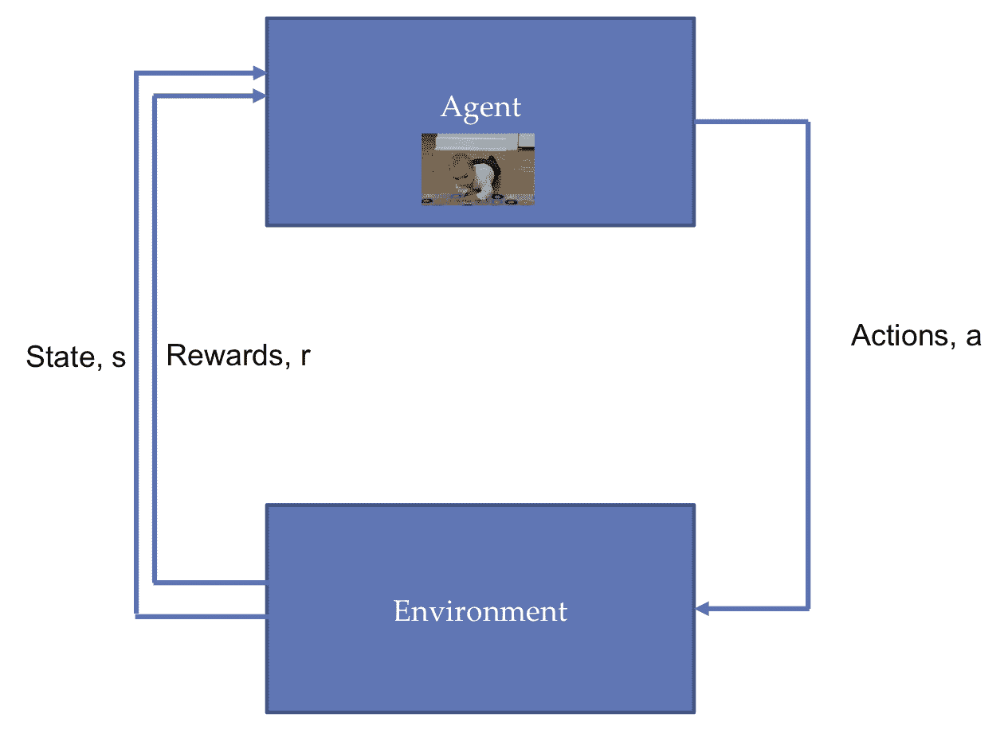

智能体与环境之间的互动

与监督学习不同，**智能体**并没有被提供任何示例。**智能体**不知道正确的动作是什么。与无监督学习不同，智能体的目标不是在输入数据中寻找某种固有的结构（尽管学习过程可能会发现某些结构，但这不是目标）；相反，它的目标是最大化奖励（从长远来看）。

# RL 术语

在学习不同的算法之前，让我们先了解一下 RL 术语。为了举例说明，我们可以考虑两个例子：一个智能体在迷宫中找到路线，另一个智能体驾驶**自动驾驶汽车**（**SDC**）。这两个例子在下图中进行了说明：

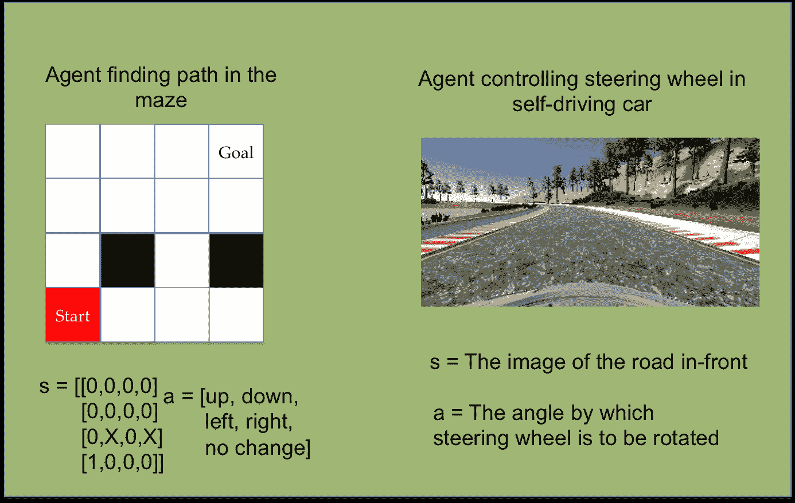

两个示例 RL 场景

在深入之前，让我们熟悉一些常见的 RL 术语：

+   **状态 *s***：状态可以看作是一个表示所有可能环境状态的集合（或表示符）。状态可以是连续的，也可以是离散的。例如，在一个智能体寻找迷宫路径的案例中，状态可以由一个 4 × 4 的数组表示，其中**0**代表空白块，**1**代表被智能体占据的块，**X**代表不能占据的状态；这里的状态是离散的。对于一个驾驶方向盘的智能体来说，状态就是 SDC 前方的视图。图像包含连续值的像素。

+   **动作 *a*(*s*)**：动作是智能体在某一特定状态下可以执行的所有可能操作的集合。可能的动作集合，***a***，取决于当前的状态，***s***。动作可能导致状态的变化，也可能不会。动作可以是离散的，也可以是连续的。在迷宫中，智能体可以执行五个离散动作：**[上， 下， 左， 右， 不变]**。另一方面，SDC 智能体可以在一个连续的角度范围内旋转方向盘。

+   **奖励 *r(s, a, s'*)**：当智能体选择一个动作时，环境返回的标量值。它定义了目标；如果动作将智能体带到目标附近，智能体会得到更高的奖励，否则会得到较低（甚至负）的奖励。我们如何定义奖励完全取决于我们——以迷宫为例，我们可以将奖励定义为智能体当前位置与目标之间的欧几里得距离。SDC 智能体的奖励可以是汽车在道路上（正奖励）或在道路外（负奖励）。

+   **策略 π(*s*)**：它定义了每个状态与在该状态下采取的动作之间的映射。策略可以是确定性的——即对于每个状态都有一个明确的策略。例如，对于迷宫代理，策略可以是如果上方的格子是空的，则向上移动。策略也可以是随机的——即某个动作是由某个概率决定的。它可以通过简单的查找表来实现，或者可以是一个依赖于当前状态的函数。策略是强化学习代理的核心。在本章中，我们将学习帮助代理学习策略的不同算法。

+   **价值函数 *V*(*s*)**：它定义了一个状态在长期中的好坏。它可以被看作是代理从状态***s***开始，未来能够积累的奖励的总量。你可以将其视为长期的好处，而不是奖励的即时好处。你认为哪个更重要，最大化奖励还是最大化价值函数？是的，你猜对了：就像下棋时，我们有时会牺牲一个兵去换取几步后赢得比赛一样，代理应该尝试最大化价值函数。价值函数通常有两种考虑方式：

    +   **价值函数 *V*^π(*s*)**：它是跟随策略*π*时状态的好坏。数学上，在状态*s*时，它是从跟随策略*π*中预期的累积奖励：

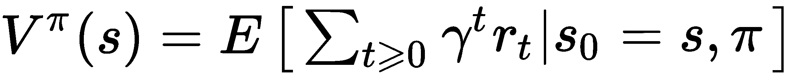

+   **价值-状态函数（或 *Q* 函数） *Q*^π(*s*, *a*)**：它是状态 *s* 下采取动作 *a*，然后跟随策略 *π* 时的好坏。数学上，我们可以说，对于一个状态-动作对 (*s*, *a*)，它是从状态 *s* 中采取动作 *a*，然后跟随策略 *π* 所得到的预期累积奖励：

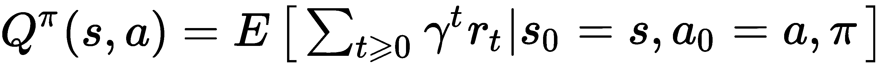

*γ*是折扣因子，它的值决定了我们在比较即时奖励和后续奖励时对即时奖励赋予多大的重要性。折扣因子的高值决定了代理能看到多远的未来。许多成功的强化学习算法中，*γ*的理想选择值通常为*0.97*。

+   **环境模型**：它是一个可选元素，模拟环境的行为，并包含环境的物理规律；换句话说，它定义了环境将如何表现。环境模型由转移到下一个状态的概率定义。

强化学习问题在数学上被公式化为**马尔可夫决策过程**（**MDP**），并且遵循马尔可夫性质——即*当前状态完全表征世界的状态*。

# 深度强化学习

强化学习算法可以根据它们所迭代/逼近的内容分为两类：

+   **基于价值的方法**：在这些方法中，算法选择最大化价值函数的动作。这里，智能体学习预测一个给定状态或动作的好坏。因此，目标是找到最优的价值。一个基于价值的方法的例子是 Q 学习。例如，考虑我们的强化学习智能体在迷宫中的情况：假设每个状态的值是从该方格到达目标所需步数的负数，那么，在每个时间步，智能体将选择一个动作，带它到达具有最优值的状态，如下图所示。所以，从值为**-6**的状态开始，它将移动到**-5**、**-4**、**-3**、**-2**、**-1**，最终到达值为**0**的目标：

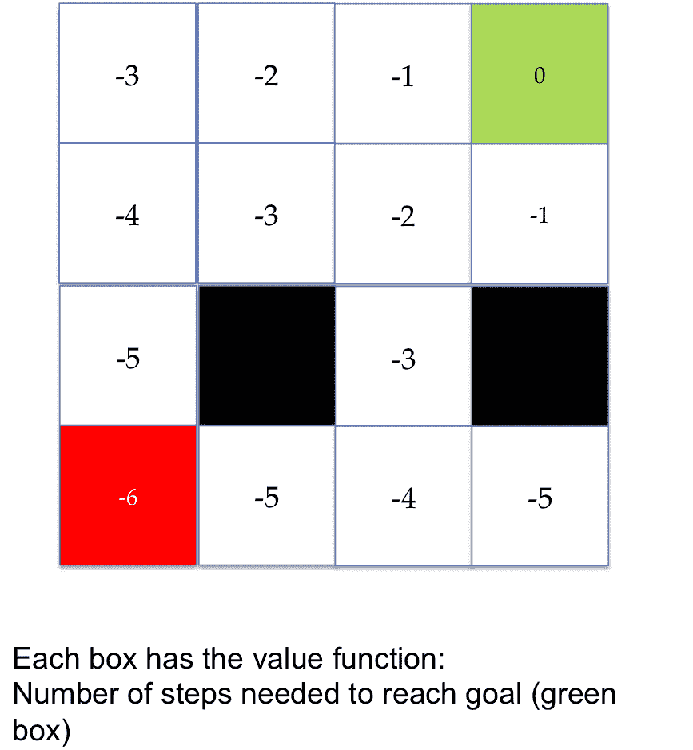

具有每个方格值的迷宫世界

+   **基于策略的方法**：在这些方法中，算法预测最大化价值函数的最佳策略。目标是找到最优策略。一个基于策略的方法的例子是策略梯度。在这里，我们近似策略函数，从而将每个状态映射到最佳的对应动作。

我们可以使用神经网络作为函数逼近器来获取策略或价值的近似值。当我们使用深度神经网络作为策略逼近器或价值逼近器时，我们称之为**深度强化学习**（**DRL**）。在最近的研究中，DRL 取得了非常成功的结果，因此，在本章中，我们将重点讨论 DRL。

# 一些成功的应用

在过去几年中，强化学习在各种任务中取得了成功，尤其是在游戏和机器人领域。在学习其算法之前，让我们先了解一些强化学习的成功案例：

+   **AlphaGo Zero**：由谷歌的 DeepMind 团队开发的 AlphaGo Zero，*通过完全没有人类知识的方式掌握围棋*，从一个完全空白的起点开始（**tabula rasa**）。AlphaGo Zero 使用一个神经网络来同时近似走棋概率和价值。这个神经网络以原始的棋盘表示为输入，使用由神经网络引导的蒙特卡洛树搜索来选择走棋。强化学习算法将前瞻性搜索整合到训练循环中。它使用 40 个区块的残差 CNN 训练了 40 天，在此过程中，它进行了大约 2900 万场比赛（一个非常庞大的数字！）。该神经网络在谷歌云上使用 TensorFlow 进行了优化，配备了 64 个 GPU 工作节点和 19 个 CPU 参数服务器。你可以在这里访问论文：[`www.nature.com/articles/nature24270`](https://www.nature.com/articles/nature24270)。

+   **AI 控制的滑翔机**：微软开发了一种控制系统，可以在多种不同的自动驾驶硬件平台上运行，如 Pixhawk 和 Raspberry Pi 3。它可以通过自动寻找并搭乘自然发生的上升气流，使滑翔机在空中飞行而不使用发动机。该控制器帮助滑翔机自行操作；它检测并利用上升气流在没有发动机或人员帮助的情况下飞行。他们将其实现为部分可观察的 MDP（马尔可夫决策过程）。他们采用贝叶斯强化学习，并使用蒙特卡罗树搜索来寻找最佳动作。他们将整个系统分为两个级别的规划者——一个基于经验做出决策的高级规划者和一个利用贝叶斯强化学习实时检测并捕捉上升气流的低级规划者。您可以在微软新闻上查看滑翔机的操作：[`news.microsoft.com/features/science-mimics-nature-microsoft-researchers-test-ai-controlled-soaring-machine/`](https://news.microsoft.com/features/science-mimics-nature-microsoft-researchers-test-ai-controlled-soaring-machine/)。

+   **运动行为**：在论文*《丰富环境中运动行为的出现》*（[`arxiv.org/pdf/1707.02286.pdf`](https://arxiv.org/pdf/1707.02286.pdf)）中，DeepMind 的研究人员为代理提供了丰富且多样的环境。这些环境提供了不同难度等级的挑战。代理面临的困难按顺序递增，这促使代理在没有执行任何奖励工程的情况下学会了复杂的运动技能。

# 模拟环境

由于强化学习（RL）涉及试错过程，因此在模拟环境中首先训练我们的 RL 代理是很有意义的。虽然有大量的应用可以用于创建环境，但一些流行的应用包括以下内容：

+   **OpenAI gym**：它包含了一系列我们可以用来训练 RL 代理的环境。在本章中，我们将使用 OpenAI gym 接口。

+   **Unity ML-Agents SDK**：它允许开发者通过易于使用的 Python API，将使用 Unity 编辑器创建的游戏和模拟转换为可以通过深度强化学习（DRL）、进化策略或其他机器学习方法训练智能代理的环境。它与 TensorFlow 兼容，并提供训练二维/三维以及虚拟现实（VR）/增强现实（AR）游戏中智能代理的能力。您可以在此了解更多：[`github.com/Unity-Technologies/ml-agents`](https://github.com/Unity-Technologies/ml-agents)。

+   **Gazebo**：在 Gazebo 中，我们可以构建具有基于物理模拟的三维世界。Gazebo 与**机器人操作系统**（**ROS**）和 OpenAI Gym 接口一起使用，称为 gym-gazebo，可以用来训练 RL 代理。有关更多信息，您可以参考白皮书：[`erlerobotics.com/whitepaper/robot_gym.pdf`](http://erlerobotics.com/whitepaper/robot_gym.pdf)。

+   **Blender**学习环境：这是 Blender 游戏引擎的 Python 接口，它也可以在 OpenAI gym 上使用。它以 Blender 为基础。Blender 是一个免费的三维建模软件，集成了游戏引擎，提供了一套易于使用、功能强大的工具，用于创建游戏。它提供了一个 Blender 游戏引擎的接口，而游戏本身是在 Blender 中设计的。我们可以创建自定义虚拟环境，以便在特定问题上训练强化学习（RL）智能体（[`github.com/LouisFoucard/gym-blender`](https://github.com/LouisFoucard/gym-blender)）。

# OpenAI gym

OpenAI gym 是一个开源工具包，用于开发和比较 RL 算法。它包含多种模拟环境，可用于训练智能体并开发新的 RL 算法。首先，你需要安装`gym`。对于 Python 3.5 及以上版本，可以使用`pip`安装`gym`：

```py
pip install gym
```

OpenAI gym 支持多种环境，从简单的基于文本的到三维环境。最新版本中支持的环境可以分为以下几类：

+   **算法**：它包含涉及执行计算任务的环境，如加法运算。尽管我们可以轻松地在计算机上进行计算，但作为一个 RL 问题，这些问题的有趣之处在于智能体仅通过示例学习这些任务。

+   **Atari**：此环境提供各种经典的 Atari/街机游戏。

+   **Box2D**：它包含二维机器人任务，如赛车代理或双足机器人行走。

+   **经典控制**：包含经典的控制理论问题，如平衡推车摆杆。

+   **MuJoCo**：这是一个专有的物理引擎（你可以获得一个为期一个月的免费试用）。它支持多种机器人模拟任务。该环境包含物理引擎，因此用于训练机器人任务。

+   **机器人学**：这个环境也使用 MuJoCo 的物理引擎。它模拟基于目标的任务，如取物和影子手机器人任务。

+   **玩具文本**：这是一个基于文本的简单环境，非常适合初学者。

要获取这些组下所有环境的完整列表，你可以访问：[`gym.openai.com/envs/#atari`](https://gym.openai.com/envs/#atari)。OpenAI 接口的最棒之处在于，所有环境都可以通过相同的最小接口进行访问。要获取你安装中所有可用环境的列表，你可以使用以下代码：

```py
from gym import envs
print(envs.registry.all())
```

这将提供所有已安装环境的列表及其环境 ID，ID 为字符串类型。你还可以在`gym`注册表中添加你自己的环境。要创建一个环境，我们使用`make`命令，并将环境名称作为字符串传递。例如，要创建一个使用 Pong 环境的游戏，我们需要的字符串是`Pong-v0`。`make`命令创建环境，而`reset`命令用于激活该环境。`reset`命令将环境恢复到初始状态。该状态以数组形式表示：

```py
import gym
env = gym.make('Pong-v0')
obs = env.reset()
env.render()
```

`Pong-v0`的状态空间由一个 210×160×3 的数组表示，这实际上代表了 Pong 游戏的原始像素值。另一方面，如果你创建一个**Go9×9-v0**环境，状态则由一个 3×9×9 的数组定义。我们可以使用`render`命令来可视化环境。下图展示了**Pong-v0**和**Go9x9-v0**环境在初始状态下的渲染环境：

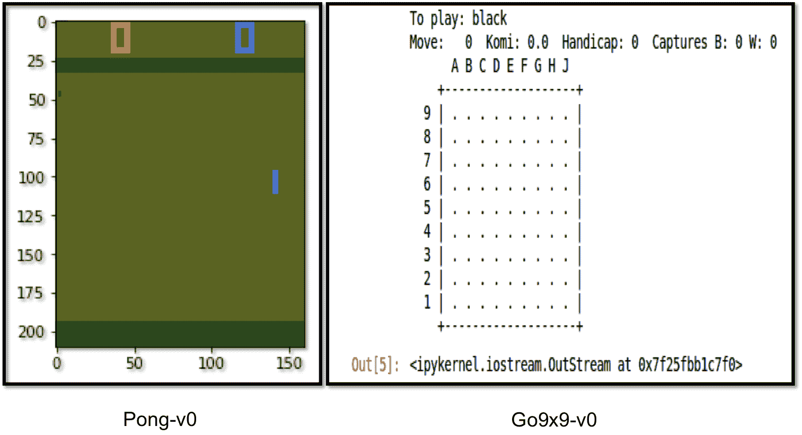

**Pong-v0**和**Go9x9-v0**的渲染环境

`render`命令会弹出一个窗口。如果你想在内联显示环境，可以使用 Matplotlib 的内联模式，并将`render`命令更改为`plt.imshow(env.render(mode='rgb_array'))`。这将在 Jupyter Notebook 中内联显示环境。

环境包含`action_space`变量，它决定了环境中可能的动作。我们可以使用`sample()`函数随机选择一个动作。选择的动作可以通过`step`函数影响环境。`step`函数在环境上执行所选动作；它返回改变后的状态、奖励、一个布尔值表示游戏是否结束，以及一些有助于调试但在与强化学习智能体互动时不会用到的环境信息。以下代码展示了一个 Pong 游戏，其中智能体执行一个随机动作。我们在每个时间步将状态存储在一个数组`frames`中，以便稍后查看游戏：

```py
frames = [] # array to store state space at each step
for _ in range(300):
    frames.append(env.render(mode='rgb_array'))
    obs,reward,done, _ = env.render(env.action_space.sample())
    if done:
        break
```

这些帧可以借助 Matplotlib 和 IPython 中的动画函数，在 Jupyter Notebook 中以持续播放的 GIF 风格图像显示：

```py
import matplotlib.animation as animation
from JSAnimation.Ipython_display import display_animation
from IPython.display import display

patch = plt.imshow(frames[0])
plt.axis('off')

def animate(i)
    patch.set_data(frames[i])

anim = animation.FuncAnimation(plt.gcf(), animate, \
        frames=len(frames), interval=100)

display(display_animation(anim, default_mode='loop')
```

通常情况下，训练一个智能体需要大量的步骤，因此在每个步骤保存状态空间是不可行的。我们可以选择在前述算法中的每 500 步（或任何其他你希望的步数）后进行存储。相反，我们可以使用 OpenAI gym 的包装器将游戏保存为视频。为此，我们首先需要导入包装器，然后创建环境，最后使用 Monitor。默认情况下，它将存储 1、8、27、64 等的每个视频，以及每 1,000^(次)的回合（回合数为完美的立方数）；每次训练默认保存在一个文件夹中。实现此功能的代码如下：

```py
import gym
from gym import wrappers
env = gym.make('Pong-v0')
env = wrappers.Monitor(env, '/save-mov', force=True)
# Follow it with the code above where env is rendered and agent
# selects a random action

```

如果你想在下次训练中使用相同的文件夹，可以在`Monitor`方法调用中选择`force=True`选项。最后，我们应该使用`close`函数关闭环境：

```py
env.close()
```

前述代码可以在`OpenAI_practice.ipynb` Jupyter Notebook 中找到，位于 GitHub 的第六章，*物联网强化学习*文件夹内。

# Q-learning

在他的博士论文《从延迟奖励中学习》中，Watkins 在 1989 年提出了 Q 学习的概念。Q 学习的目标是学习一个最优的动作选择策略。给定一个特定的状态，*s*，并采取一个特定的动作，*a*，Q 学习试图学习状态*s*的值。在最简单的版本中，Q 学习可以通过查找表来实现。我们维护一个表，记录环境中每个状态（行）和动作（列）的值。算法试图学习这个值——即在给定状态下采取特定动作的好坏。

我们首先将 Q 表中的所有条目初始化为*0*；这确保了所有状态都有相同的（因此是平等的）价值。后来，我们观察采取特定动作所获得的奖励，并根据奖励更新 Q 表。Q 值的更新是动态进行的，通过**贝尔曼方程**来帮助实现，方程如下：

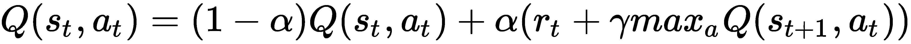

这里，*α*是学习率。以下是基本的 Q 学习算法：

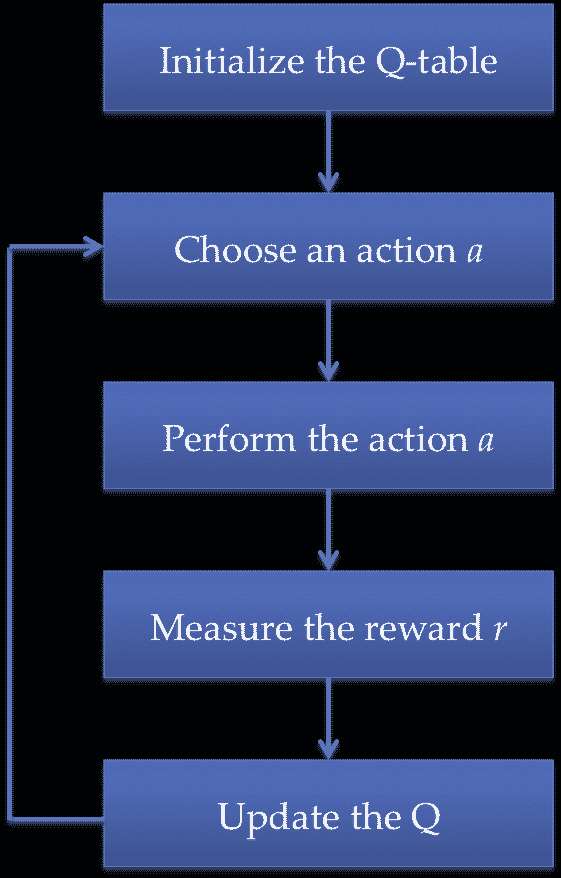

简单的 Q 学习算法

如果你有兴趣，你可以在这里阅读 Watkins 的 240 页博士论文：[`www.cs.rhul.ac.uk/~chrisw/new_thesis.pdf`](http://www.cs.rhul.ac.uk/~chrisw/new_thesis.pdf)。

学习结束时，我们将拥有一个好的 Q 表，并且有最优策略。这里有一个重要问题：我们如何选择第二步的动作？有两种选择；首先，我们随机选择一个动作。这使得我们的智能体能够以相等的概率探索所有可能的动作，但同时忽略了它已经学到的信息。第二种方式是我们选择具有最大值的动作；最初，所有动作的 Q 值相同，但随着智能体的学习，一些动作将获得高值，另一些则获得低值。在这种情况下，智能体正在利用它已经学到的知识。那么，哪个更好呢：探索还是利用？这就是所谓的**探索-利用权衡**。解决这个问题的一种自然方式是依赖于智能体已经学到的知识，但有时也需要进行探索。这是通过使用**ε-贪婪算法**实现的。基本的想法是，智能体以概率*ε*随机选择动作，而以概率（*1-ε*）利用在之前的回合中学到的信息。该算法大多数时候（*1-ε*）选择最好的选项（贪婪），但有时（*ε*）会做出随机选择。现在让我们尝试在一个简单的问题中实现我们学到的东西。

# 使用 Q 表的出租车下车

简单的 Q 学习算法涉及维护一个大小为 *m*×*n* 的表，其中 *m* 为状态总数，*n* 为可能的动作总数。因此，我们从玩具文本组中选择了一个问题，因为它们的 `state` 空间和 `action` 空间都很小。为了便于说明，我们选择了 `Taxi-v2` 环境。我们的智能体目标是选择一个位置的乘客并将其送到另一个位置。智能体成功送客后会获得 *+20* 分，每走一步会失去 *1* 分。如果进行非法的接送操作，还会扣除 10 分。状态空间中有墙壁（用 **|** 表示）和四个位置标记，分别是 **R**、**G**、**Y** 和 **B**。出租车用框表示：接送位置可以是这四个标记中的任何一个。接客点用蓝色表示，送客点用紫色表示。`Taxi-v2` 环境的状态空间大小为 *500*，动作空间大小为 *6*，因此 Q 表的大小为 *500×6=3000* 个条目：

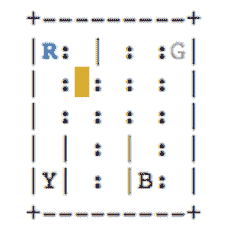

出租车接送环境

在出租车接送环境中，出租车用黄色框表示。位置标记 R 是接客点，G 是送客点：

1.  我们首先导入必要的模块并创建我们的环境。由于这里只需要创建查找表，因此使用 TensorFlow 并不是必需的。如前所述，`Taxi-v2` 环境有 *500* 种可能的状态和 *6* 种可能的动作：

```py
import gym
import numpy as np
env = gym.make('Taxi-v2')
obs = env.reset()
env.render()
```

1.  我们将大小为 (*300×6*) 的 Q 表初始化为全零，并定义超参数：*γ* 为折扣因子，*α* 为学习率。我们还设定了最大轮次（一个轮次意味着从重置到完成=`True` 的一次完整运行）和智能体将在每一轮中学习的最大步数：

```py
m = env.observation_space.n # size of the state space
n = env.action_space.n # size of action space
print("The Q-table will have {} rows and {} columns, resulting in \
     total {} entries".format(m,n,m*n))

# Intialize the Q-table and hyperparameters
Q = np.zeros([m,n])
gamma = 0.97
max_episode = 1000
max_steps = 100
alpha = 0.7
epsilon = 0.3
```

1.  现在，对于每一轮，我们选择具有最高值的动作，执行该动作，并根据收到的奖励和未来的状态，使用贝尔曼方程更新 Q 表：

```py
for i in range(max_episode):
    # Start with new environment
    s = env.reset()
    done = False
    for _ in range(max_steps):
        # Choose an action based on epsilon greedy algorithm
        p = np.random.rand()
        if p > epsilon or (not np.any(Q[s,:])):
            a = env.action_space.sample() #explore
        else:
            a = np.argmax(Q[s,:]) # exploit
        s_new, r, done, _ = env.step(a) 
        # Update Q-table
        Q[s,a] = (1-alpha)*Q[s,a] + alpha*(r + gamma*np.max(Q[s_new,:]))
        #print(Q[s,a],r)
        s = s_new
        if done:
            break
```

1.  现在我们来看一下学习型智能体是如何工作的：

```py
s = env.reset()
done = False
env.render()
# Test the learned Agent
for i in range(max_steps):
 a = np.argmax(Q[s,:])
 s, _, done, _ = env.step(a)
 env.render()
 if done:
 break 
```

下图展示了在一个特定示例中智能体的行为。空车用黄色框表示，载有乘客的车用绿色框表示。从图中可以看出，在给定的情况下，智能体在 11 步内完成接送乘客，目标位置标记为 (**B**)，目的地标记为 (**R**)：

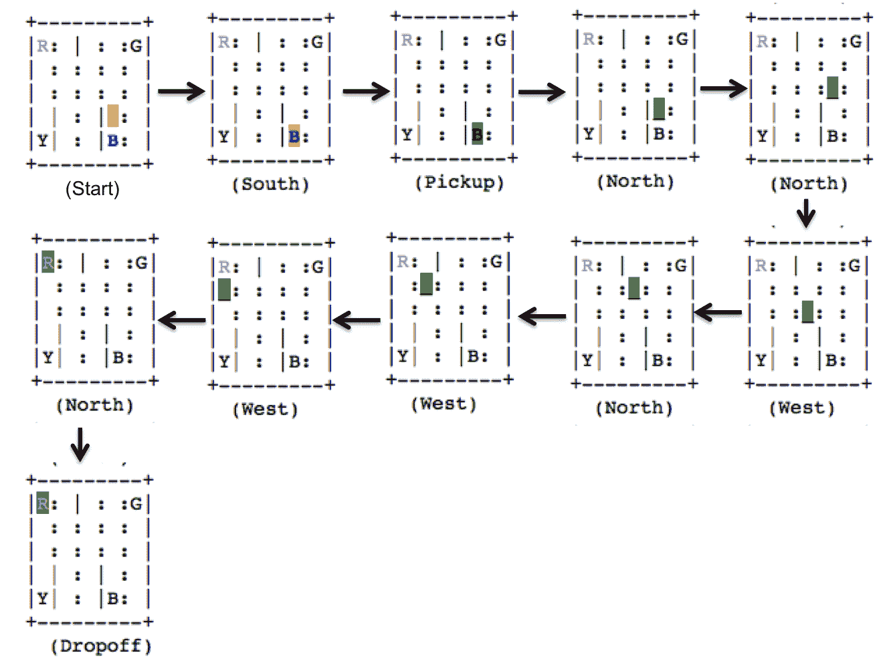

使用学习到的 Q 表，智能体接送乘客

酷吧？完整的代码可以在 GitHub 上找到，文件名为 `Taxi_drop-off.ipynb`。

# Q 网络

简单的 Q 学习算法涉及维持一个大小为 *m*×*n* 的表格，其中 *m* 是状态的总数，*n* 是可能动作的总数。这意味着我们不能将其用于大规模的状态空间和动作空间。一个替代方法是用神经网络替换表格，作为一个函数逼近器，逼近每个可能动作的 Q 函数。在这种情况下，神经网络的权重存储着 Q 表格的信息（它们将给定状态与相应的动作及其 Q 值匹配）。当我们用深度神经网络来逼近 Q 函数时，我们称其为 **深度 Q 网络** (**DQN**)。

神经网络以状态为输入，计算所有可能动作的 Q 值。

# 使用 Q-网络进行出租车下车

如果我们考虑前面的 *出租车下车* 示例，我们的神经网络将由 *500* 个输入神经元组成（状态由 *1×500* 的 one-hot 向量表示），以及 *6* 个输出神经元，每个神经元代表给定状态下某一特定动作的 Q 值。神经网络将在此处逼近每个动作的 Q 值。因此，网络应该经过训练，使得其逼近的 Q 值与目标 Q 值相同。目标 Q 值由贝尔曼方程给出，如下所示：

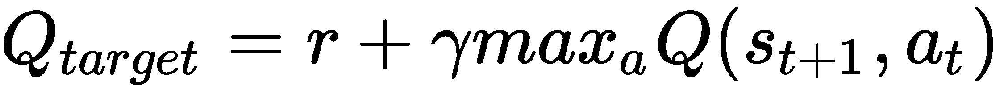

我们训练神经网络，使得目标 *Q* 和预测 *Q* 之间的平方误差最小化——也就是说，神经网络最小化以下损失函数：

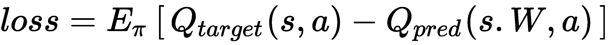

目标是学习未知的 Q[target] 函数。通过反向传播更新 `QNetwork` 的权重，以使损失最小化。我们使神经网络 `QNetwork` 来逼近 Q 值。它是一个非常简单的单层神经网络，具有提供动作及其 Q 值（`get_action`）、训练网络（`learnQ`）以及获取预测 Q 值（`Qnew`）的方法：

```py
class QNetwork:
    def __init__(self,m,n,alpha):
        self.s = tf.placeholder(shape=[1,m], dtype=tf.float32)
        W = tf.Variable(tf.random_normal([m,n], stddev=2))
        bias = tf.Variable(tf.random_normal([1, n]))
        self.Q = tf.matmul(self.s,W) + bias
        self.a = tf.argmax(self.Q,1)

        self.Q_hat = tf.placeholder(shape=[1,n],dtype=tf.float32)
        loss = tf.reduce_sum(tf.square(self.Q_hat-self.Q))
        optimizer = tf.train.GradientDescentOptimizer(learning_rate=alpha)
        self.train = optimizer.minimize(loss)
        init = tf.global_variables_initializer()

        self.sess = tf.Session()
        self.sess.run(init)

    def get_action(self,s):
        return self.sess.run([self.a,self.Q], feed_dict={self.s:s})

    def learnQ(self,s,Q_hat):
        self.sess.run(self.train, feed_dict= {self.s:s, self.Q_hat:Q_hat})

    def Qnew(self,s):
        return self.sess.run(self.Q, feed_dict={self.s:s})

```

我们现在将这个神经网络集成到之前训练 RL 代理解决 *出租车下车* 问题的代码中。我们需要进行一些更改；首先，OpenAI 步骤和重置函数返回的状态只是状态的数字标识符，所以我们需要将其转换为一个 one-hot 向量。此外，我们不再使用 Q 表格更新，而是从 `QNetwork` 获取新的 Q 预测值，找到目标 Q 值，并训练网络以最小化损失。代码如下：

```py
QNN = QNetwork(m,n, alpha)
rewards = []
for i in range(max_episode):
 # Start with new environment
 s = env.reset()
 S = np.identity(m)[s:s+1]
 done = False
 counter = 0
 rtot = 0
 for _ in range(max_steps):
 # Choose an action using epsilon greedy policy
 a, Q_hat = QNN.get_action(S) 
 p = np.random.rand()
 if p > epsilon:
 a[0] = env.action_space.sample() #explore

 s_new, r, done, _ = env.step(a[0])
 rtot += r
 # Update Q-table
 S_new = np.identity(m)[s_new:s_new+1]
 Q_new = QNN.Qnew(S_new) 
 maxQ = np.max(Q_new)
 Q_hat[0,a[0]] = r + gamma*maxQ
 QNN.learnQ(S,Q_hat)
 S = S_new
 #print(Q_hat[0,a[0]],r)
 if done:
 break
 rewards.append(rtot)
print ("Total reward per episode is: " + str(sum(rewards)/max_episode))
```

这本应该做得很好，但正如你所看到的，即使训练了*1,000*个回合，网络的奖励依然很低，如果你查看网络的表现，似乎它只是随便走动。是的，我们的网络什么都没学到；表现比 Q 表还差。这也可以从训练过程中的奖励图表验证——理想情况下，随着代理的学习，奖励应该增加，但这里并没有发生这种情况；奖励像是围绕平均值的随机漫步（该程序的完整代码可以在`Taxi_drop-off_NN.ipynb`文件中找到，文件在 GitHub 上可用）：

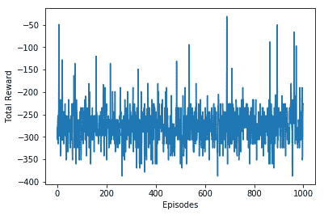

代理在学习过程中每个回合获得的总奖励

发生了什么？为什么神经网络没有学到东西，我们能改进它吗？

假设出租车需要往西走去接客，而代理随机选择了西行；代理获得了奖励，网络会学习到，在当前状态下（通过一个独热编码表示），西行是有利的。接下来，考虑另一个与此相似的状态（相关状态空间）：代理再次做出西行动作，但这次却获得了负奖励，所以现在代理会忘记之前学到的东西。因此，相似的状态-动作对但目标不同会混淆学习过程。这被称为**灾难性遗忘**。问题的产生是因为连续状态高度相关，因此，如果代理按顺序学习（如本例），这个高度相关的输入状态空间会妨碍代理的学习。

我们可以打破输入数据与网络之间的关联吗？可以：我们可以构建一个**回放缓冲区**，在这里我们首先存储每个状态、其对应的动作、连续奖励和结果状态（状态、动作、奖励、新状态）。在这种情况下，动作是完全随机选择的，从而确保了动作和结果状态的多样性。回放缓冲区最终将由这些元组（*S*，*A*，*R*，*S'*）组成一个大列表。接下来，我们将这些元组随机地输入到网络中（而不是按顺序输入）；这种随机性将打破连续输入状态之间的关联。这被称为**经验回放**。它不仅解决了输入状态空间中的关联问题，还使我们能够多次从相同的元组中学习，回顾稀有事件，并且通常能更好地利用经验。从某种意义上说，通过使用回放缓冲区，我们已经减少了监督学习中的问题（回放缓冲区作为输入输出数据集），其中输入的随机采样确保了网络能够进行泛化。

我们的方法的另一个问题是，我们立即更新目标 Q。这也会导致有害的相关性。请记住，在 Q 学习中，我们试图最小化*Q[target]*与当前预测的*Q*之间的差异。这个差异被称为**时序差分**（**TD**）误差（因此 Q 学习是一种**TD 学习**）。目前，我们立即更新我们的*Q[target]*，因此目标与我们正在更改的参数之间（通过*Q[pred]*进行的权重）存在相关性。这几乎就像在追逐一个移动的目标，因此不会给出一个通用的方向。我们可以通过使用**固定的 Q 目标**来解决这个问题——即使用两个网络，一个用于预测*Q*，另一个用于目标*Q*。这两个网络在架构上完全相同，预测 Q 网络在每一步中都会改变权重，而目标 Q 网络的权重会在固定的学习步骤后更新。这提供了一个更加稳定的学习环境。

最后，我们做一个小小的改变：目前，我们的 epsilon 在整个学习过程中都有一个固定值。但在现实生活中并非如此。最初，当我们一无所知时，我们会进行大量探索，但随着我们变得熟悉，我们倾向于采取已学到的路径。在我们的 epsilon 贪婪算法中也可以做到这一点，通过随着网络在每个回合中学习，逐步改变 epsilon 的值，使得 epsilon 随时间减少。

配备了这些技巧后，现在我们来构建一个 DQN 来玩 Atari 游戏。

# DQN 来玩 Atari 游戏

我们将在这里学习的 DQN 基于 DeepMind 的论文（[`web.stanford.edu/class/psych209/Readings/MnihEtAlHassibis15NatureControlDeepRL.pdf`](https://web.stanford.edu/class/psych209/Readings/MnihEtAlHassibis15NatureControlDeepRL.pdf)）。DQN 的核心是一个深度卷积神经网络，它以游戏环境的原始像素为输入（就像任何人类玩家看到的一样），每次捕捉一屏幕，并将每个可能动作的值作为输出。值最大的动作就是选择的动作：

1.  第一步是获取我们所需的所有模块：

```py

import gym
import sys
import random
import numpy as np
import tensorflow as tf
import matplotlib.pyplot as plt
from datetime import datetime
from scipy.misc import imresize
```

1.  我们选择了 OpenAI Atari 游戏列表中的 Breakout 游戏——你可以尝试其他 Atari 游戏的代码；你可能唯一需要更改的地方是预处理步骤。Breakout 的输入空间——即我们的输入空间——由 210×160 个像素组成，每个像素有 128 种可能的颜色。这是一个非常庞大的输入空间。为了减少复杂性，我们将选择图像中的一个感兴趣区域，将其转换为灰度图像，并将其调整为大小为*80×80*的图像。我们通过`preprocess`函数来实现这一点：

```py
def preprocess(img):
    img_temp = img[31:195] # Choose the important area of the image
    img_temp = img_temp.mean(axis=2) # Convert to Grayscale#
    # Downsample image using nearest neighbour interpolation
    img_temp = imresize(img_temp, size=(IM_SIZE, IM_SIZE), interp='nearest')
    return img_temp
```

以下截图展示了预处理前后的环境：

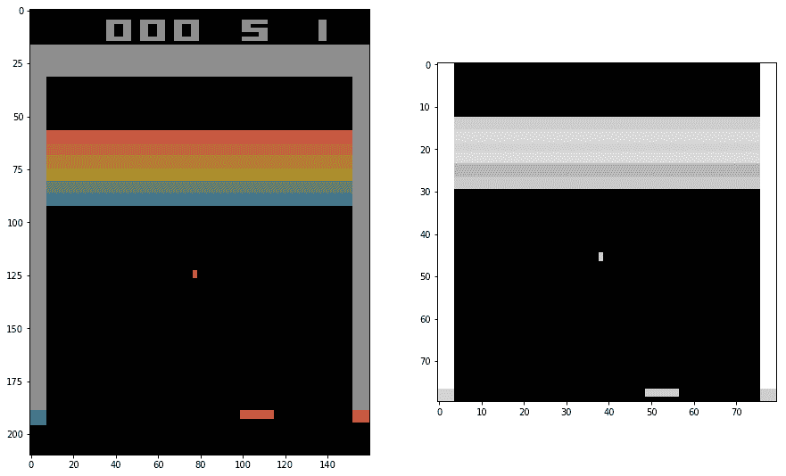

原始环境的大小为 210×160（彩色图像），处理后的环境大小为 80×80（灰度图像）。

1.  从前面的图示中可以看到，无法判断球是下落还是上升。为了解决这个问题，我们将四个连续的状态（由于四个独特的动作）结合为一个输入。我们定义了一个函数`update_state`，它将当前环境的观察结果追加到前一个状态数组中：

```py
def update_state(state, obs):
    obs_small = preprocess(obs)
    return np.append(state[1:], np.expand_dims(obs_small, 0), axis=0)
```

该函数将处理过的新状态追加到切片的状态中，确保网络的最终输入由四个帧组成。在以下截图中，你可以看到这四个连续的帧。这是我们 DQN 的输入：

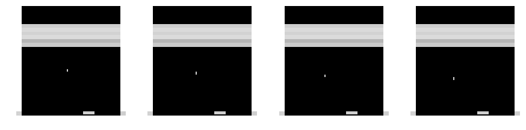

DQN 的输入是四个连续的游戏状态（帧）

1.  我们创建了一个在`class DQN`中定义的 DQN；它由三层卷积层组成，最后一层卷积层的输出被展平，然后是两个全连接层。该网络和之前的情况一样，试图最小化*Q[target]*和*Q[predicted]*之间的差异。在代码中，我们使用的是 RMSProp 优化器，但你也可以尝试其他优化器：

```py
def __init__(self, K, scope, save_path= 'models/atari.ckpt'):
    self.K = K
    self.scope = scope
    self.save_path = save_path
    with tf.variable_scope(scope):
        # inputs and targets
        self.X = tf.placeholder(tf.float32, shape=(None, 4, IM_SIZE, IM_SIZE), name='X')
        # tensorflow convolution needs the order to be:
        # (num_samples, height, width, "color")
        # so we need to tranpose later
        self.Q_target = tf.placeholder(tf.float32, shape=(None,), name='G')
        self.actions = tf.placeholder(tf.int32, shape=(None,), name='actions')
        # calculate output and cost
        # convolutional layers
        Z = self.X / 255.0
        Z = tf.transpose(Z, [0, 2, 3, 1])
        cnn1 = tf.contrib.layers.conv2d(Z, 32, 8, 4, activation_fn=tf.nn.relu)
        cnn2 = tf.contrib.layers.conv2d(cnn1, 64, 4, 2, activation_fn=tf.nn.relu)
        cnn3 = tf.contrib.layers.conv2d(cnn2, 64, 3, 1, activation_fn=tf.nn.relu)
        # fully connected layers
        fc0 = tf.contrib.layers.flatten(cnn3)
        fc1 = tf.contrib.layers.fully_connected(fc0, 512)
        # final output layer
        self.predict_op = tf.contrib.layers.fully_connected(fc1, K)
        Qpredicted = tf.reduce_sum(self.predict_op * tf.one_hot(self.actions, K),
     reduction_indices=[1])
        self.cost = tf.reduce_mean(tf.square(self.Q_target - Qpredicted))
        self.train_op = tf.train.RMSPropOptimizer(0.00025, 0.99, 0.0, 1e-6).minimize(self.cost)
```

我们在接下来的步骤中讨论了该类所需的必要方法：

1.  我们添加了一个方法来返回预测的 Q 值：

```py
def predict(self, states):
    return self.session.run(self.predict_op, feed_dict={self.X: states})
```

1.  我们需要一个方法来确定具有最大值的动作。在这个方法中，我们还实现了 epsilon-贪婪策略，且 epsilon 的值在主代码中会发生变化：

```py
def sample_action(self, x, eps):
    """Implements epsilon greedy algorithm"""
    if np.random.random() < eps:
        return np.random.choice(self.K)
    else:
        return np.argmax(self.predict([x])[0])
```

1.  我们需要一个方法来更新网络的权重，以最小化损失。该函数可以定义如下：

```py
 def update(self, states, actions, targets):
     c, _ = self.session.run(
         [self.cost, self.train_op],
         feed_dict={
         self.X: states,
         self.Q_target: targets,
         self.actions: actions
         })
     return c
```

1.  将模型权重复制到固定的 Q 网络中：

```py
def copy_from(self, other):
    mine = [t for t in tf.trainable_variables() if t.name.startswith(self.scope)]
    mine = sorted(mine, key=lambda v: v.name)
    theirs = [t for t in tf.trainable_variables() if t.name.startswith(other.scope)]
    theirs = sorted(theirs, key=lambda v: v.name)
    ops = []
    for p, q in zip(mine, theirs):
        actual = self.session.run(q)
        op = p.assign(actual)
        ops.append(op)
    self.session.run(ops)
```

1.  除了这些方法，我们还需要一些辅助函数来保存学习到的网络、加载保存的网络，并设置 TensorFlow 会话：

```py
def load(self):
    self.saver = tf.train.Saver(tf.global_variables())
    load_was_success = True
    try:
        save_dir = '/'.join(self.save_path.split('/')[:-1])
        ckpt = tf.train.get_checkpoint_state(save_dir)
        load_path = ckpt.model_checkpoint_path
        self.saver.restore(self.session, load_path)
    except:
        print("no saved model to load. starting new session")
        load_was_success = False
    else:
        print("loaded model: {}".format(load_path))
        saver = tf.train.Saver(tf.global_variables())
        episode_number = int(load_path.split('-')[-1])

def save(self, n):
    self.saver.save(self.session, self.save_path, global_step=n)
    print("SAVED MODEL #{}".format(n))

def set_session(self, session):
    self.session = session
    self.session.run(tf.global_variables_initializer())
    self.saver = tf.train.Saver()
```

1.  为了实现 DQN 算法，我们使用一个`learn`函数；它从经验重放缓冲区中随机选择一个样本，并使用目标 Q 网络中的目标 Q 来更新 Q 网络：

```py
def learn(model, target_model, experience_replay_buffer, gamma, batch_size):
    # Sample experiences
    samples = random.sample(experience_replay_buffer, batch_size)
    states, actions, rewards, next_states, dones = map(np.array, zip(*samples))
    # Calculate targets
     next_Qs = target_model.predict(next_states)
     next_Q = np.amax(next_Qs, axis=1)
     targets = rewards +     np.invert(dones).astype(np.float32) * gamma * next_Q
    # Update model
     loss = model.update(states, actions, targets)
     return loss
```

1.  好了，所有的元素都准备好了，现在让我们决定 DQN 的超参数并创建我们的环境：

```py
# Some Global parameters
MAX_EXPERIENCES = 500000
MIN_EXPERIENCES = 50000
TARGET_UPDATE_PERIOD = 10000
IM_SIZE = 80
K = 4 # env.action_space.n

# hyperparameters etc
gamma = 0.97
batch_sz = 64
num_episodes = 2700
total_t = 0
experience_replay_buffer = []
episode_rewards = np.zeros(num_episodes)
last_100_avgs = []
# epsilon for Epsilon Greedy Algorithm
epsilon = 1.0
epsilon_min = 0.1
epsilon_change = (epsilon - epsilon_min) / 700000

# Create Atari Environment
env = gym.envs.make("Breakout-v0")

# Create original and target Networks
model = DQN(K=K, scope="model")
target_model = DQN(K=K, scope="target_model")
```

1.  最后，以下是调用并填充经验重放缓冲区、逐步执行游戏并在每一步训练模型网络以及每四步训练`target_model`的代码：

```py
with tf.Session() as sess:
    model.set_session(sess)
    target_model.set_session(sess)
    sess.run(tf.global_variables_initializer())
    model.load()
    print("Filling experience replay buffer...")
    obs = env.reset()
    obs_small = preprocess(obs)
    state = np.stack([obs_small] * 4, axis=0)
    # Fill experience replay buffer
    for i in range(MIN_EXPERIENCES):
        action = np.random.randint(0,K)
        obs, reward, done, _ = env.step(action)
        next_state = update_state(state, obs)
        experience_replay_buffer.append((state, action, reward, next_state, done))
        if done:
            obs = env.reset()
            obs_small = preprocess(obs)
            state = np.stack([obs_small] * 4, axis=0)
        else:
            state = next_state
        # Play a number of episodes and learn
        for i in range(num_episodes):
            t0 = datetime.now()
            # Reset the environment
            obs = env.reset()
            obs_small = preprocess(obs)
            state = np.stack([obs_small] * 4, axis=0)
            assert (state.shape == (4, 80, 80))
            loss = None
            total_time_training = 0
            num_steps_in_episode = 0
            episode_reward = 0
            done = False
            while not done:
                # Update target network
                if total_t % TARGET_UPDATE_PERIOD == 0:
                    target_model.copy_from(model)
                    print("Copied model parameters to target network. total_t = %s, period = %s" % (total_t, TARGET_UPDATE_PERIOD))
                # Take action
                action = model.sample_action(state, epsilon)
                obs, reward, done, _ = env.step(action)
                obs_small = preprocess(obs)
                next_state = np.append(state[1:], np.expand_dims(obs_small, 0), axis=0)
                episode_reward += reward
                # Remove oldest experience if replay buffer is full
                if len(experience_replay_buffer) == MAX_EXPERIENCES:
                    experience_replay_buffer.pop(0)
                    # Save the recent experience
                    experience_replay_buffer.append((state, action, reward, next_state, done))

                # Train the model and keep measure of time
                t0_2 = datetime.now()
                loss = learn(model, target_model, experience_replay_buffer, gamma, batch_sz)
                dt = datetime.now() - t0_2
                total_time_training += dt.total_seconds()
                num_steps_in_episode += 1
                state = next_state
                total_t += 1
                epsilon = max(epsilon - epsilon_change, epsilon_min)
                duration = datetime.now() - t0
                episode_rewards[i] = episode_reward
                time_per_step = total_time_training / num_steps_in_episode
                last_100_avg = episode_rewards[max(0, i - 100):i + 1].mean()
                last_100_avgs.append(last_100_avg)
                print("Episode:", i,"Duration:", duration, "Num steps:", num_steps_in_episode, "Reward:", episode_reward, "Training time per step:", "%.3f" % time_per_step, "Avg Reward (Last 100):", "%.3f" % last_100_avg,"Epsilon:", "%.3f" % epsilon)
                if i % 50 == 0:
                    model.save(i)
                sys.stdout.flush()

#Plots
plt.plot(last_100_avgs)
plt.xlabel('episodes')
plt.ylabel('Average Rewards')
plt.show()
env.close()
```

我们可以看到，现在奖励随着回合数增加，最终的平均奖励是**20**，尽管它可能更高，但我们仅仅学习了几千个回合，甚至我们的重放缓冲区的大小在（50,000 到 5,000,000）之间：

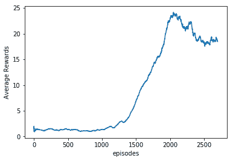

智能体学习过程中的平均奖励

1.  让我们看看我们的智能体在学习了大约 2,700 个回合后是如何表现的：

```py
env = gym.envs.make("Breakout-v0")
frames = []
with tf.Session() as sess:
    model.set_session(sess)
    target_model.set_session(sess)
    sess.run(tf.global_variables_initializer())
    model.load()
    obs = env.reset()
    obs_small = preprocess(obs)
    state = np.stack([obs_small] * 4, axis=0)
    done = False
    while not done:
        action = model.sample_action(state, epsilon)
        obs, reward, done, _ = env.step(action)
        frames.append(env.render(mode='rgb_array'))
        next_state = update_state(state, obs)
        state = next_state
```

你可以在这里看到学习过的智能体的视频：[`www.youtube.com/watch?v=rPy-3NodgCE`](https://www.youtube.com/watch?v=rPy-3NodgCE)。

很酷，对吧？没有告诉它任何信息，它仅仅通过 2,700 个回合学会了如何玩一款不错的游戏。

有一些方法可以帮助你更好地训练智能体：

+   由于训练需要大量时间，除非你有强大的计算资源，否则最好保存模型并重新启动保存的模型。

+   在代码中，我们使用了`Breakout-v0`和 OpenAI gym，在这种情况下，环境中会对连续（随机选择的`1`、`2`、`3`或`4`）帧重复相同的步骤。你也可以选择`BreakoutDeterministic-v4`，这是 DeepMind 团队使用的版本；在这里，步骤会恰好在连续的四帧中重复。因此，智能体在每第四帧后看到并选择动作。

# 双重 DQN

现在，回想一下，我们使用最大值操作符来选择一个动作并评估这个动作。这可能导致一个可能并非最理想的动作被高估。我们可以通过将选择和评估解耦来解决这个问题。通过 Double DQN，我们有两个权重不同的 Q 网络；这两个网络都通过随机经验进行学习，但一个用于通过 epsilon-greedy 策略来确定动作，另一个用于确定其值（因此，计算目标 Q 值）。

为了更清楚地说明，让我们先看一下 DQN 的情况。选择具有最大 Q 值的动作；设*W*为 DQN 的权重，那么我们正在做的是：

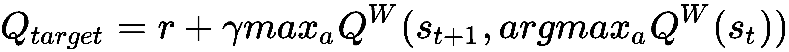

上标*W*表示用于近似 Q 值的权重。在 Double DQN 中，方程变为如下：

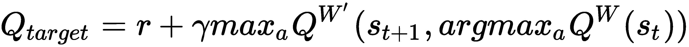

请注意变化：现在，动作是通过使用权重为*W*的 Q 网络选择的，并且最大 Q 值是通过使用权重为*W'*的 Q 网络预测的。这减少了过估计，有助于我们更快且更可靠地训练智能体。你可以在这里访问*Deep Reinforcement Learning with Double Q-Learning*论文：[`www.aaai.org/ocs/index.php/AAAI/AAAI16/paper/download/12389/11847`](https://www.aaai.org/ocs/index.php/AAAI/AAAI16/paper/download/12389/11847)。

# 对战 DQN

对战 DQN 将 Q 函数解耦为价值函数和优势函数。价值函数和之前讨论的相同；它表示状态的价值，与动作无关。另一方面，优势函数提供了动作*a*在状态*s*中的相对效用（优势/好处）的度量：

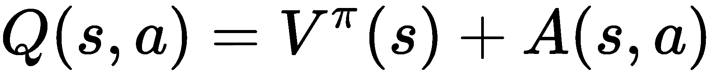

在 Dueling DQN 中，使用相同的卷积层来提取特征，但在后期阶段，它被分成两个独立的网络，一个提供价值，另一个提供优势。随后，两个阶段通过聚合层重新组合，以估计 Q 值。这确保了网络为价值函数和优势函数生成独立的估计值。这种价值和优势的解耦直觉是，对于许多状态，估计每个动作选择的价值并非必要。例如，在赛车中，如果前方没有车，那么选择“向左转”或“向右转”就没有必要，因此在给定状态下无需估计这些动作的价值。这使得网络可以学习哪些状态是有价值的，而不必为每个状态确定每个动作的效果。

在聚合层中，价值和优势被结合在一起，使得可以从给定的*Q*中唯一地恢复出*V*和*A*。这是通过强制要求优势函数估计器在所选动作下的优势为零来实现的：

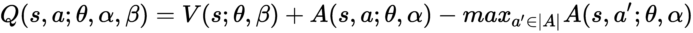

这里，*θ*是通用卷积特征提取器的参数，*α*和*β*是优势和值估计器网络的参数。Dueling DQN 也是由谷歌 DeepMind 团队提出的。你可以在*arXiv*上阅读完整的论文：[`arxiv.org/abs/1511.06581`](https://arxiv.org/abs/1511.06581)。作者发现，用平均操作替换先前的`max`操作可以提高网络的稳定性。在这种情况下，优势的变化速度仅与均值变化速度相同。因此，在他们的结果中，使用了以下给出的聚合层：

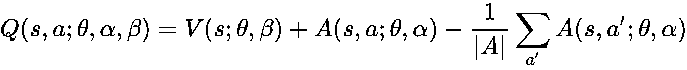

以下截图展示了 Dueling DQN 的基本架构：

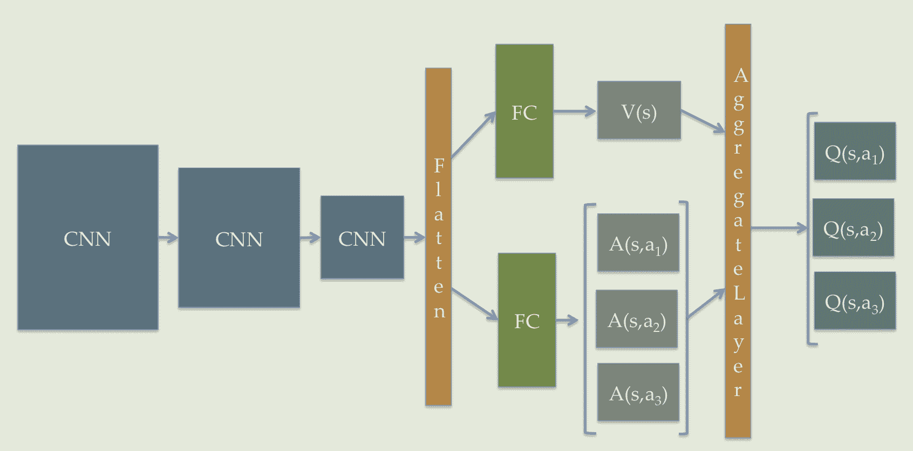

Dueling DQN 的基本架构

# 策略梯度

在基于 Q 学习的方法中，我们在估计价值/Q 函数之后生成策略。在基于策略的方法中，如策略梯度方法，我们直接逼近策略。

按照之前的方法，我们在这里使用神经网络来逼近策略。在最简单的形式下，神经网络通过使用最陡梯度上升法调整权重来学习选择最大化奖励的动作策略，因此得名“策略梯度”。

在策略梯度中，策略由一个神经网络表示，其输入是状态的表示，输出是动作选择的概率。该网络的权重是我们需要学习的策略参数。自然会产生一个问题：我们应该如何更新这个网络的权重？由于我们的目标是最大化奖励，因此可以理解，我们的网络试图最大化每个回合的期望奖励：

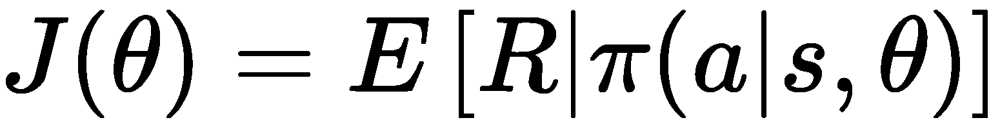

在这里，我们使用了一个参数化的随机策略 *π*——也就是说，策略决定了在给定状态 *s* 的情况下选择动作 *a* 的概率，神经网络的参数是 *θ*。*R* 代表一个回合中所有奖励的总和。然后，使用梯度上升法更新网络参数：

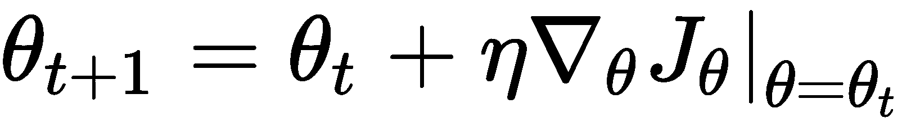

这里，*η* 是学习率。通过策略梯度定理，我们得到如下公式：

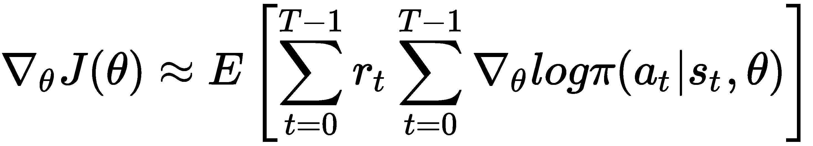

因此，替代最大化期望回报，我们可以使用损失函数作为对数损失（将期望动作和预测动作作为标签和 logits），并将折扣奖励作为权重来训练网络。为了增加稳定性，研究发现添加基线有助于减少方差。最常见的基线形式是折扣奖励的总和，结果如下所示：

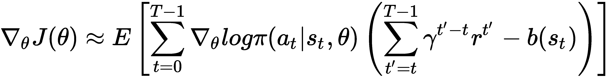

基线 *b*(*s[t]*) 如下所示：

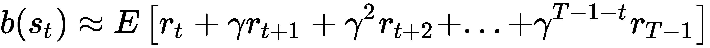

这里，*γ* 是折扣因子。

# 为什么选择策略梯度？

首先，政策梯度方法像其他基于策略的方法一样，直接估计最优策略，无需存储额外的数据（经验回放缓冲区）。因此，它的实现非常简单。其次，我们可以训练它来学习真正的随机策略。最后，它非常适合连续动作空间。

# 使用策略梯度玩 Pong 游戏

让我们尝试使用策略梯度来玩 Pong 游戏。这里的实现灵感来自 Andrej Karpathy 的博客文章，文章地址：[`karpathy.github.io/2016/05/31/rl/`](http://karpathy.github.io/2016/05/31/rl/)。回想一下，在 *Breakout* 游戏中，我们使用了四个游戏帧堆叠在一起作为输入，从而使代理能够了解游戏的动态；而在这里，我们使用连续两帧游戏图像的差异作为输入。因此，我们的代理同时拥有当前状态和前一个状态的信息：

1.  首先，和往常一样，我们需要导入必要的模块。我们导入了 TensorFlow、Numpy、Matplotlib 和 `gym` 作为环境：

```py
import numpy as np
import gym
import matplotlib.pyplot as plt
import tensorflow as tf
from gym import wrappers
%matplotlib inline
```

1.  我们构建了我们的神经网络，即 `PolicyNetwork`；它以游戏状态作为输入，并输出动作选择概率。在这里，我们构建了一个简单的两层感知器，且没有偏置。`weights` 使用 `Xavier` 初始化方法随机初始化。隐藏层使用 `ReLU` 激活函数，输出层使用 `softmax` 激活函数。我们使用稍后定义的 `tf_discount_rewards` 方法来计算基线。最后，我们使用 TensorFlow 的 `tf.losses.log_loss` 来计算预测的动作概率，并选择一个热编码的动作向量作为标签，同时将折扣奖励和方差校正后的奖励作为权重：

```py
class PolicyNetwork(object):
    def __init__(self, N_SIZE, h=200, gamma=0.99, eta=1e-3, decay=0.99, save_path = 'models1/pong.ckpt' ):
        self.gamma = gamma
        self.save_path = save_path
        # Placeholders for passing state....
        self.tf_x = tf.placeholder(dtype=tf.float32, shape=[None, N_SIZE * N_SIZE], name="tf_x")
        self.tf_y = tf.placeholder(dtype=tf.float32, shape=[None, n_actions], name="tf_y")
        self.tf_epr = tf.placeholder(dtype=tf.float32, shape=[None, 1], name="tf_epr")

        # Weights
        xavier_l1 = tf.truncated_normal_initializer(mean=0, stddev=1\. / N_SIZE, dtype=tf.float32)
        self.W1 = tf.get_variable("W1", [N_SIZE * N_SIZE, h], initializer=xavier_l1)
        xavier_l2 = tf.truncated_normal_initializer(mean=0, stddev=1\. / np.sqrt(h), dtype=tf.float32)
        self.W2 = tf.get_variable("W2", [h, n_actions], initializer=xavier_l2)

        #Build Computation
        # tf reward processing (need tf_discounted_epr for policy gradient wizardry)
        tf_discounted_epr = self.tf_discount_rewards(self.tf_epr)
        tf_mean, tf_variance = tf.nn.moments(tf_discounted_epr, [0], shift=None, name="reward_moments")
        tf_discounted_epr -= tf_mean
        tf_discounted_epr /= tf.sqrt(tf_variance + 1e-6)

        #Define Optimizer, compute and apply gradients
        self.tf_aprob = self.tf_policy_forward(self.tf_x)
        loss = tf.losses.log_loss(labels = self.tf_y,
        predictions = self.tf_aprob,
        weights = tf_discounted_epr)
        optimizer = tf.train.AdamOptimizer()
        self.train_op = optimizer.minimize(loss)
```

1.  该类有方法来计算动作概率（`tf_policy_forward` 和 `predict_UP`），使用 `tf_discount_rewards` 计算基线，更新网络权重（`update`），并最终设置会话（`set_session`），然后加载和保存模型：

```py
def set_session(self, session):
    self.session = session
    self.session.run(tf.global_variables_initializer())
    self.saver = tf.train.Saver()

def tf_discount_rewards(self, tf_r): # tf_r ~ [game_steps,1]
    discount_f = lambda a, v: a * self.gamma + v;
    tf_r_reverse = tf.scan(discount_f, tf.reverse(tf_r, [0]))
    tf_discounted_r = tf.reverse(tf_r_reverse, [0])
    return tf_discounted_r

def tf_policy_forward(self, x): #x ~ [1,D]
    h = tf.matmul(x, self.W1)
    h = tf.nn.relu(h)
    logp = tf.matmul(h, self.W2)
    p = tf.nn.softmax(logp)
    return p

def update(self, feed):
    return self.session.run(self.train_op, feed)

def load(self):
    self.saver = tf.train.Saver(tf.global_variables())
    load_was_success = True 
    try:
        save_dir = '/'.join(self.save_path.split('/')[:-1])
        ckpt = tf.train.get_checkpoint_state(save_dir)
        load_path = ckpt.model_checkpoint_path
        print(load_path)
        self.saver.restore(self.session, load_path)
    except:
        print("no saved model to load. starting new session")
        load_was_success = False
    else:
        print("loaded model: {}".format(load_path))
        saver = tf.train.Saver(tf.global_variables())
        episode_number = int(load_path.split('-')[-1])

def save(self):
    self.saver.save(self.session, self.save_path, global_step=n)
    print("SAVED MODEL #{}".format(n))

def predict_UP(self,x):
    feed = {self.tf_x: np.reshape(x, (1, -1))}
    aprob = self.session.run(self.tf_aprob, feed);
    return aprob
```

1.  现在，`PolicyNetwork`已经创建，我们为游戏状态创建了一个`preprocess`函数；我们不会处理完整的 210×160 状态空间——而是将其缩减为 80×80 的二值状态空间，最后将其展平：

```py
# downsampling
def preprocess(I):
    """ 
    prepro 210x160x3 uint8 frame into 6400 (80x80) 1D float vector 
    """
    I = I[35:195] # crop
    I = I[::2,::2,0] # downsample by factor of 2
    I[I == 144] = 0 # erase background (background type 1)
    I[I == 109] = 0 # erase background (background type 2)
    I[I != 0] = 1 # everything else (paddles, ball) just set to 1
    return I.astype(np.float).ravel()
```

1.  让我们定义一些变量，来保存状态、标签、奖励和动作空间大小。我们初始化游戏状态并实例化策略网络：

```py
# Create Game Environment
env_name = "Pong-v0"
env = gym.make(env_name)
env = wrappers.Monitor(env, '/tmp/pong', force=True)
n_actions = env.action_space.n # Number of possible actions
# Initializing Game and State(t-1), action, reward, state(t)
states, rewards, labels = [], [], []
obs = env.reset()
prev_state = None

running_reward = None
running_rewards = []
reward_sum = 0
n = 0
done = False
n_size = 80
num_episodes = 2500

#Create Agent
agent = PolicyNetwork(n_size)
```

1.  现在我们开始实施策略梯度算法。对于每一集，智能体首先进行游戏，存储状态、奖励和选择的动作。一旦游戏结束，它就会使用所有存储的数据来进行训练（就像监督学习一样）。然后它会重复这一过程，直到达到你想要的集数：

```py
with tf.Session() as sess:
    agent.set_session(sess)
    sess.run(tf.global_variables_initializer())
    agent.load()
    # training loop
    done = False
    while not done and n< num_episodes:
        # Preprocess the observation
        cur_state = preprocess(obs)
        diff_state = cur_state - prev_state if prev_state isn't None else np.zeros(n_size*n_size)
        prev_state = cur_state

        #Predict the action
        aprob = agent.predict_UP(diff_state) ; aprob = aprob[0,:]
        action = np.random.choice(n_actions, p=aprob)
        #print(action)
        label = np.zeros_like(aprob) ; label[action] = 1

        # Step the environment and get new measurements
        obs, reward, done, info = env.step(action)
        env.render()
        reward_sum += reward

        # record game history
        states.append(diff_state) ; labels.append(label) ; rewards.append(reward)

        if done:
            # update running reward
            running_reward = reward_sum if running_reward is None else         running_reward * 0.99 + reward_sum * 0.01    
            running_rewards.append(running_reward)
            #print(np.vstack(rs).shape)
            feed = {agent.tf_x: np.vstack(states), agent.tf_epr: np.vstack(rewards), agent.tf_y: np.vstack(labels)}
            agent.update(feed)
            # print progress console
            if n % 10 == 0:
                print ('ep {}: reward: {}, mean reward: {:3f}'.format(n, reward_sum, running_reward))
            else:
                print ('\tep {}: reward: {}'.format(n, reward_sum))

            # Start next episode and save model
            states, rewards, labels = [], [], []
            obs = env.reset()
            n += 1 # the Next Episode

            reward_sum = 0
            if n % 50 == 0:
                agent.save()
            done = False

plt.plot(running_rewards)
plt.xlabel('episodes')
plt.ylabel('Running Averge')
plt.show()
env.close()
```

1.  在训练了 7,500 集后，智能体开始赢得一些游戏。在训练了 1,200 集后，胜率有所提高，达到了 50%。经过 20,000 集训练后，智能体已经能够赢得大部分游戏。完整代码可在 GitHub 的 `Policy gradients.ipynb` 文件中找到。你可以在这里查看智能体经过 20,000 集学习后进行的游戏：[`youtu.be/hZo7kAco8is`](https://youtu.be/hZo7kAco8is)。请注意，这个智能体学会了在自己的位置附近振荡；它还学会了将自己运动产生的力量传递给球，并且知道只有通过进攻性击球才能击败对手。

# 演员-评论家算法

在策略梯度方法中，我们引入了基线来减少方差，但依然是动作和基线（仔细看：方差是预期奖励的总和，换句话说，它是状态的好坏或其价值函数）同时变化。是不是应该将策略评估和价值评估分开呢？这正是演员-评论家方法的思想。它由两个神经网络组成，一个用于近似策略，称为**演员网络**，另一个用于近似价值，称为**评论家网络**。我们在策略评估和策略改进步骤之间交替进行，从而实现更稳定的学习。评论家使用状态和动作值来估计价值函数，接着用它来更新演员的策略网络参数，使得整体性能得以提升。下图展示了演员-评论家网络的基本架构：

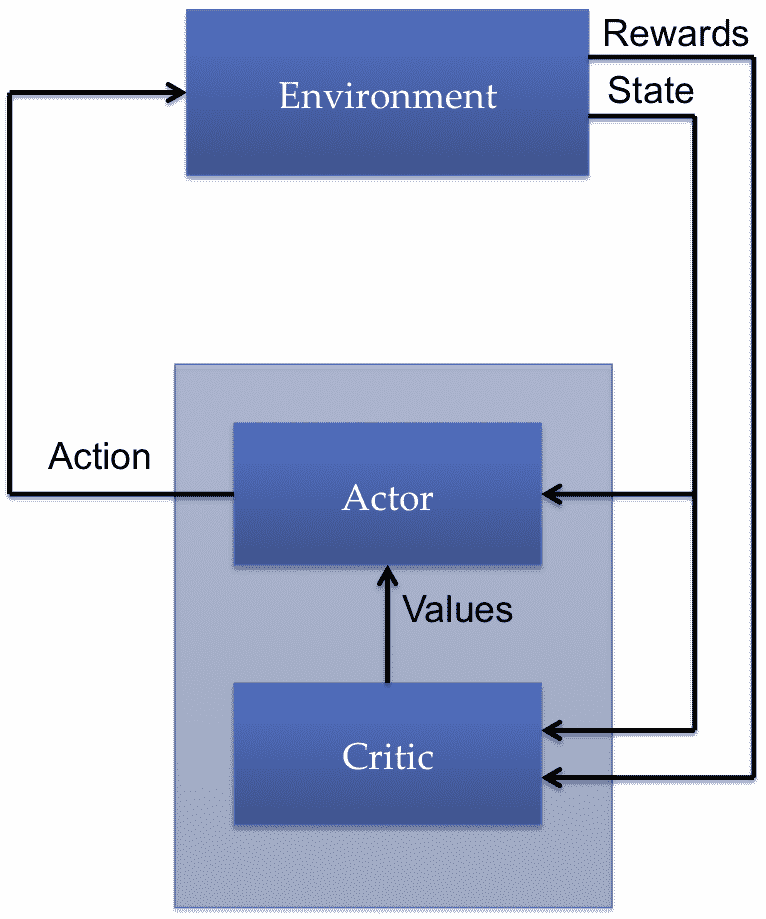

演员-评论家架构

# 总结

在本章中，我们学习了强化学习（RL）以及它与监督学习和无监督学习的区别。本章的重点是深度强化学习（DRL），在该方法中，深度神经网络用于近似策略函数或价值函数，甚至两者兼而有之。本章介绍了 OpenAI Gym，这是一个提供大量环境来训练 RL 代理的库。我们学习了基于价值的方法，如 Q-learning，并利用它训练一个代理来接载和放下出租车中的乘客。我们还使用了 DQN 来训练一个代理玩 Atari 游戏。接着，本章介绍了基于策略的方法，特别是策略梯度。我们讨论了策略梯度背后的直觉，并使用该算法训练一个 RL 代理来玩 Pong 游戏。

在下一章中，我们将探索生成模型，并学习生成对抗网络背后的秘密。
