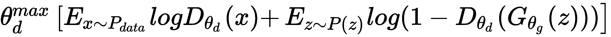

# 第七章：物联网的生成模型

**机器学习**（**ML**）和**人工智能**（**AI**）几乎触及了所有与人类相关的领域。农业、音乐、健康、国防——你找不到一个没有 AI 印记的领域。AI/ML 的巨大成功，除了计算能力的存在，还依赖于大量数据的生成。大多数生成的数据是未标注的，因此理解数据的内在分布是一个重要的机器学习任务。正是在这一点上，生成模型发挥了作用。

在过去的几年中，深度生成模型在理解数据分布方面取得了巨大成功，并已应用于各种领域。最受欢迎的两种生成模型是 **变分自编码器**（**VAEs**）和 **生成对抗网络**（**GANs**）。

在本章中，我们将学习 VAEs 和 GANs，并使用它们生成图像。阅读完本章后，你将掌握以下内容：

+   了解生成网络与判别网络之间的区别

+   了解 VAEs

+   理解 GANs 的直观功能

+   实现一个基本的 GAN，并用它生成手写数字

+   了解 GAN 最受欢迎的变种——深度卷积 GAN

+   在 TensorFlow 中实现深度卷积 GAN，并用它生成人脸

+   了解 GANs 的进一步修改和应用

# 介绍

生成模型是深度学习模型中的一个令人兴奋的新分支，它通过无监督学习进行学习。其主要思想是生成具有与给定训练数据相同分布的新样本；例如，一个在手写数字上训练的网络可以生成新的数字，这些数字不在数据集中，但与其相似。从形式上讲，我们可以说，如果训练数据遵循分布 *P*data，那么生成模型的目标是估计概率密度函数 *P*model，该函数与 *P*data 相似。

生成模型可以分为两种类型：

+   **显式生成模型**：在这些模型中，概率密度函数 *P*model 被显式定义并求解。密度函数可能是可处理的，像 PixelRNN/CNN 这种情况，或者是密度函数的近似，像 VAE 这种情况。

+   **隐式生成模型**：在这些模型中，网络学习从 *P*model 中生成一个样本，而无需显式地定义它。GANs 就是这种类型的生成模型的一个例子。

在本章中，我们将探讨 VAE（一种显式生成模型）和 GAN（一种隐式生成模型）。生成模型可以有效地生成逼真的样本，并可用于执行超分辨率、上色等任务。对于时间序列数据，我们甚至可以用它们进行模拟和规划。最后，生成模型还可以帮助我们理解数据的潜在表示。

# 使用 VAEs 生成图像

在第四章《物联网深度学习》中，你应该对自编码器及其功能有所了解。VAE 是一种自编码器；在这里，我们保留了（训练过的）**解码器**部分，可以通过输入随机的潜在特征**z**来生成类似于训练数据的样本。现在，如果你还记得，在自编码器中，**编码器**的作用是生成低维特征，**z**：


自编码器的架构

VAE 关注的是从潜在特征**z**中找到似然函数 *p*(*x*)：


这是一个难以处理的密度函数，无法直接优化；相反，我们通过使用简单的高斯先验 *p*(*z*) 并使**编码器**和**解码器**网络具有概率性质来获得下界：


VAE 的架构

这使我们能够定义一个可处理的对数似然的下界，如下所示：


在前述的公式中，*θ*表示解码器网络的参数，*φ*表示编码器网络的参数。通过最大化这个下界，网络得以训练：


下界中的第一个项负责输入数据的重构，第二个项则用于使近似后验分布接近先验分布。训练完成后，编码器网络作为识别或推理网络，而解码器网络则作为生成器。

你可以参考 Diederik P Kingma 和 Max Welling 在 2014 年 ICLR 会议上发表的论文《Auto-Encoding Variational Bayes》（[`arxiv.org/abs/1312.6114`](https://arxiv.org/abs/1312.6114))中的详细推导。

# TensorFlow 中的 VAE

现在让我们来看一下 VAE 的实际应用。在这个示例代码中，我们将使用标准的 MNIST 数据集，并训练一个 VAE 来生成手写数字。由于 MNIST 数据集较为简单，编码器和解码器网络将仅由全连接层组成；这将帮助我们集中精力于 VAE 架构。如果你计划生成复杂的图像（例如 CIFAR-10），你需要将编码器和解码器网络修改为卷积和反卷积网络：

1.  与之前的所有情况一样，第一步是导入所有必要的模块。在这里，我们将使用 TensorFlow 的高级 API，`tf.contrib`，来构建全连接层。注意，这样我们就避免了单独声明每一层的权重和偏置的麻烦：

```py
import numpy as np
import tensorflow as tf

import matplotlib.pyplot as plt
%matplotlib inline

from tensorflow.contrib.layers import fully_connected
```

1.  我们读取数据。MNIST 数据集可以在 TensorFlow 教程中找到，所以我们直接从那里获取：

```py
# Load MNIST data in a format suited for tensorflow.
from tensorflow.examples.tutorials.mnist import input_data
mnist = input_data.read_data_sets('MNIST_data', one_hot=True)
n_samples = mnist.train.num_examples
n_input = mnist.train.images[0].shape[0]
```

1.  我们定义了`VariationalAutoencoder`类；这个类是核心代码。它包含用于定义编码器和解码器网络的方法。编码器生成潜在特征*z*的均值和方差，分别称为`z_mu`和`z_sigma`。利用这些，取一个样本`Z`。然后，潜在特征*z*被传递给解码器网络生成`x_hat`。网络通过 Adam 优化器最小化重建损失和潜在损失的总和。该类还定义了重建、生成、转换（到潜在空间）和单步训练的方法：

```py
class VariationalAutoencoder(object):
    def __init__(self,n_input, n_z,
        learning_rate=0.001, batch_size=100):
        self.batch_size = batch_size
        self.n_input = n_input
        self.n_z = n_z

        # Place holder for the input 
        self.x = tf.placeholder(tf.float32, shape = [None, n_input])

        # Use Encoder Network to determine mean and 
        # (log) variance of Gaussian distribution in the latent space
        self.z_mean, self.z_log_sigma_sq = self._encoder_network()
        # Draw a sample z from Gaussian distribution
        eps = tf.random_normal((self.batch_size, n_z), 0, 1, dtype=tf.float32)
        # z = mu + sigma*epsilon
        self.z = tf.add(self.z_mean,tf.multiply(tf.sqrt(tf.exp(self.z_log_sigma_sq)), eps))
        # Use Decoder network to determine mean of
        # Bernoulli distribution of reconstructed input
        self.x_hat = self._decoder_network()

        # Define loss function based variational upper-bound and 
        # corresponding optimizer
        # define generation loss
        reconstruction_loss = \
            -tf.reduce_sum(self.x * tf.log(1e-10 + self.x_hat)
            + (1-self.x) * tf.log(1e-10 + 1 - self.x_hat), 1)
        self.reconstruction_loss = tf.reduce_mean(reconstruction_loss)

        latent_loss = -0.5 * tf.reduce_sum(1 + self.z_log_sigma_sq 
            - tf.square(self.z_mean)- tf.exp(self.z_log_sigma_sq), 1)
        self.latent_loss = tf.reduce_mean(latent_loss)
        self.cost = tf.reduce_mean(reconstruction_loss + latent_loss) 
        # average over batch
        # Define the optimizer
        self.optimizer = tf.train.AdamOptimizer(learning_rate).minimize(self.cost)

        # Initializing the tensor flow variables
        init = tf.global_variables_initializer()
        # Launch the session
        self.sess = tf.InteractiveSession()
        self.sess.run(init)

    # Create encoder network
    def _encoder_network(self):
        # Generate probabilistic encoder (inference network), which
        # maps inputs onto a normal distribution in latent space.
        layer_1 = fully_connected(self.x,500,activation_fn=tf.nn.softplus) 
        layer_2 = fully_connected(layer_1, 500, activation_fn=tf.nn.softplus) 
        z_mean = fully_connected(layer_2,self.n_z, activation_fn=None)
        z_log_sigma_sq = fully_connected(layer_2, self.n_z, activation_fn=None)
        return (z_mean, z_log_sigma_sq)

    # Create decoder network
    def _decoder_network(self):
        # Generate probabilistic decoder (generator network), which
        # maps points in the latent space onto a Bernoulli distribution in the data space.
        layer_1 = fully_connected(self.z,500,activation_fn=tf.nn.softplus) 
        layer_2 = fully_connected(layer_1, 500, activation_fn=tf.nn.softplus) 
        x_hat = fully_connected(layer_2, self.n_input, activation_fn=tf.nn.sigmoid)

        return x_hat

    def single_step_train(self, X):
        _,cost,recon_loss,latent_loss = self.sess.run([self.optimizer,         self.cost,self.reconstruction_loss,self.latent_loss],feed_dict={self.x: X})
        return cost, recon_loss, latent_loss

    def transform(self, X):
        """Transform data by mapping it into the latent space."""
        # Note: This maps to mean of distribution, we could alternatively
        # sample from Gaussian distribution
        return self.sess.run(self.z_mean, feed_dict={self.x: X})

    def generate(self, z_mu=None):
        """ Generate data by sampling from latent space.

        If z_mu isn't None, data for this point in latent space is
        generated. Otherwise, z_mu is drawn from prior in latent 
        space. 
        """
        if z_mu is None:
            z_mu = np.random.normal(size=n_z)
            # Note: This maps to mean of distribution, we could alternatively    
            # sample from Gaussian distribution
        return self.sess.run(self.x_hat,feed_dict={self.z: z_mu})

    def reconstruct(self, X):
        """ Use VAE to reconstruct given data. """
        return self.sess.run(self.x_hat, feed_dict={self.x: X})
```

1.  在所有成分准备好之后，我们开始训练我们的 VAE。我们通过`train`函数来完成这项任务：

```py
def train(n_input,n_z, learning_rate=0.001,
    batch_size=100, training_epochs=10, display_step=5):
    vae = VariationalAutoencoder(n_input,n_z, 
        learning_rate=learning_rate, 
        batch_size=batch_size)
    # Training cycle
    for epoch in range(training_epochs):
        avg_cost, avg_r_loss, avg_l_loss = 0., 0., 0.
        total_batch = int(n_samples / batch_size)
        # Loop over all batches
        for i in range(total_batch):
            batch_xs, _ = mnist.train.next_batch(batch_size)
            # Fit training using batch data
            cost,r_loss, l_loss = vae.single_step_train(batch_xs)
            # Compute average loss
            avg_cost += cost / n_samples * batch_size
            avg_r_loss += r_loss / n_samples * batch_size
            avg_l_loss += l_loss / n_samples * batch_size
        # Display logs per epoch step
        if epoch % display_step == 0:
            print("Epoch: {:4d} cost={:.4f} Reconstruction loss = {:.4f} Latent Loss = {:.4f}".format(epoch,avg_cost,avg_r_loss,avg_l_loss))
     return vae
```

1.  在以下截图中，您可以看到潜在空间大小为 10 的 VAE 的重建数字（左）和生成的手写数字（右）：


1.  正如之前讨论的，编码器网络将输入空间的维度降低。为了更清楚地说明这一点，我们将潜在空间的维度降为 2。以下是二维 z 空间中每个标签的分离情况：


1.  来自潜在空间维度为 2 的 VAE 的重建和生成数字如下所示：


从前面的截图（右）可以看到有趣的一点是，改变二维*z*的值会导致不同的笔画和不同的数字。完整的代码可以在 GitHub 上的`Chapter 07`文件夹中的`VariationalAutoEncoders_MNIST.ipynb`文件里找到：

```py
tf.contrib.layers.fully_connected(
    inputs,
    num_outputs,
    activation_fn=tf.nn.relu,
    normalizer_fn=None,
    normalizer_params=None,
    weights_initializer=intializers.xavier_intializer(),
    weights_regularizer= None, 
    biases_initializer=tf.zeros_intializer(),
    biases_regularizer=None,
    reuse=None,
    variables_collections=None,
    outputs_collections=None,
    trainable=True,
    scope=None
)
```

`contrib`层是 TensorFlow 中包含的一个更高级的包。它提供了构建神经网络层、正则化器、总结等操作。在前面的代码中，我们使用了`tf.contrib.layers.fully_connected()`操作，定义在[tensorflow/contrib/layers/python/layers/layers.py](https://www.github.com/tensorflow/tensorflow/blob/r1.10/tensorflow/contrib/layers/python/layers/layers.py)中，它添加了一个全连接层。默认情况下，它创建代表全连接互连矩阵的权重，默认使用 Xavier 初始化。同时，它也创建了初始化为零的偏置。它还提供了选择归一化和激活函数的选项。

# GANs

GANs 是隐式生成网络。在 Quora 的一个会议中，Facebook 人工智能研究总监兼纽约大学教授 Yann LeCun 将 GANs 描述为*过去 10 年中机器学习领域最有趣的想法*。目前，关于 GAN 的研究非常活跃。过去几年的主要 AI/ML 会议上，报道了大多数与 GAN 相关的论文。

GAN 由 Ian J. Goodfellow 和 Yoshua Bengio 在 2014 年的论文《生成对抗网络》([`arxiv.org/abs/1406.2661`](https://arxiv.org/abs/1406.2661))中提出。它们的灵感来自于两人对抗的游戏场景。就像游戏中的两个玩家一样，GAN 中有两个网络——一个称为**判别网络**，另一个称为**生成网络**——彼此对抗。生成网络试图生成与输入数据相似的数据，而判别网络则必须识别它所看到的数据是来自真实数据还是伪造数据（即由生成器生成）。每次判别器发现真实输入和伪造数据之间的分布差异时，生成器都会调整其权重以减少这种差异。总结来说，判别网络试图学习伪造数据和真实数据之间的边界，而生成网络则试图学习训练数据的分布。随着训练的结束，生成器学会生成与输入数据分布完全相似的图像，判别器则无法再区分二者。GAN 的总体架构如下：


GAN 的架构

现在让我们深入探讨 GAN 是如何学习的。判别器和生成器轮流进行学习。学习过程可以分为两个步骤：

1.  在这里，**判别器**，*D*(*x*)，进行学习。**生成器**，*G*(*z*)，用于从随机噪声**z**（它遵循某种**先验**分布*P*(*z*)）生成**假图像**。**生成器**生成的**假图像**和来自训练数据集的**真实图像**都被输入到**判别器**，然后判别器执行监督学习，试图将假图像与真实图像区分开。如果*P*data 是训练数据集的分布，那么**判别器网络**试图最大化其目标，使得当输入数据为真实数据时，*D*(*x*)接近 1，当输入数据为假数据时，接近 0。这可以通过对以下目标函数执行梯度上升来实现：



1.  在下一步，**生成器网络**进行学习。它的目标是欺骗**判别器网络**，让它认为生成的*G*(*z*)是真实的，也就是说，迫使*D*(*G*(*z*))接近 1。为了实现这一目标，**生成器网络**最小化以下目标：


这两个步骤会依次重复进行。一旦训练结束，判别器将无法再区分真实数据和伪造数据，生成器也变得非常擅长生成与训练数据非常相似的数据。嗯，说起来容易做起来难：当你尝试使用 GAN 时，你会发现训练并不是很稳定。这是一个开放的研究问题，已经提出了许多 GAN 的变种来解决这一问题。

# 在 TensorFlow 中实现一个基础的 GAN

在这一部分，我们将编写一个 TensorFlow 代码来实现一个 GAN，正如我们在上一节所学的那样。我们将为判别器和生成器使用简单的 MLP 网络。为了简便起见，我们将使用 MNIST 数据集：

1.  像往常一样，第一步是添加所有必要的模块。由于我们需要交替访问和训练生成器和判别器的参数，我们将为了清晰起见在当前代码中定义我们的权重和偏置。使用 Xavier 初始化权重并将偏置初始化为零总是更好的做法。因此，我们还从 TensorFlow 导入执行 Xavier 初始化的方法：`from tensorflow.contrib.layers import xavier_initializer`：

```py
# import the necessaey modules
import tensorflow as tf
import numpy as np
import matplotlib.pyplot as plt
import matplotlib.gridspec as gridspec
import os
from tensorflow.contrib.layers import xavier_initializer
%matplotlib inline
```

1.  让我们读取数据并定义超参数：

```py
# Load data
from tensorflow.examples.tutorials.mnist import input_data
data = input_data.read_data_sets('MNIST_data', one_hot=True)

# define hyperparameters
batch_size = 128
Z_dim = 100
im_size = 28
h_size=128
learning_rate_D = .0005
learning_rate_G = .0006
```

1.  我们定义生成器和判别器的训练参数，并为输入`X`和潜在变量`Z`定义占位符：

```py
#Create Placeholder for input X and random noise Z
X = tf.placeholder(tf.float32, shape=[None, im_size*im_size])
Z = tf.placeholder(tf.float32, shape=[None, Z_dim])
initializer=xavier_initializer()

# Define Discriminator and Generator training variables
#Discriminiator
D_W1 = tf.Variable(initializer([im_size*im_size, h_size]))
D_b1 = tf.Variable(tf.zeros(shape=[h_size]))

D_W2 = tf.Variable(initializer([h_size, 1]))
D_b2 = tf.Variable(tf.zeros(shape=[1]))

theta_D = [D_W1, D_W2, D_b1, D_b2]

#Generator
G_W1 = tf.Variable(initializer([Z_dim, h_size]))
G_b1 = tf.Variable(tf.zeros(shape=[h_size]))

G_W2 = tf.Variable(initializer([h_size, im_size*im_size]))
G_b2 = tf.Variable(tf.zeros(shape=[im_size*im_size]))

theta_G = [G_W1, G_W2, G_b1, G_b2]
```

1.  既然我们已经设置了占位符和权重，我们定义一个函数来生成来自`Z`的随机噪声。在这里，我们使用均匀分布来生成噪声；有些人也尝试过使用高斯噪声——要做到这一点，你只需要将随机函数从`uniform`改为`normal`：

```py
def sample_Z(m, n):
    return np.random.uniform(-1., 1., size=[m, n])
```

1.  我们构建判别器和生成器网络：

```py
def generator(z):
    """ Two layer Generator Network Z=>128=>784 """
    G_h1 = tf.nn.relu(tf.matmul(z, G_W1) + G_b1)
    G_log_prob = tf.matmul(G_h1, G_W2) + G_b2
    G_prob = tf.nn.sigmoid(G_log_prob)
    return G_prob

def discriminator(x):
    """ Two layer Discriminator Network X=>128=>1 """
    D_h1 = tf.nn.relu(tf.matmul(x, D_W1) + D_b1)
    D_logit = tf.matmul(D_h1, D_W2) + D_b2
    D_prob = tf.nn.sigmoid(D_logit)
    return D_prob, D_logit
```

1.  我们还需要一个辅助函数来绘制生成的手写数字。以下函数会将生成的 25 个样本以 5×5 的网格展示：

```py
def plot(samples):
    """function to plot generated samples"""
    fig = plt.figure(figsize=(10, 10))
    gs = gridspec.GridSpec(5, 5)
    gs.update(wspace=0.05, hspace=0.05)
    for i, sample in enumerate(samples):
        ax = plt.subplot(gs[i])
        plt.axis('off')
        ax.set_xticklabels([])
        ax.set_yticklabels([])
        ax.set_aspect('equal')
        plt.imshow(sample.reshape(28, 28), cmap='gray')
    return fig
```

1.  现在，我们定义 TensorFlow 操作来生成生成器的样本，并从判别器获取对假输入和真实输入数据的预测：

```py
G_sample = generator(Z)
D_real, D_logit_real = discriminator(X)
D_fake, D_logit_fake = discriminator(G_sample)
```

1.  接下来，我们为生成器和判别器网络定义交叉熵损失，并交替最小化它们，同时保持其他权重参数冻结：

```py
D_loss_real = tf.reduce_mean(tf.nn.sigmoid_cross_entropy_with_logits(logits=D_logit_real, labels=tf.ones_like(D_logit_real)))
D_loss_fake = tf.reduce_mean(tf.nn.sigmoid_cross_entropy_with_logits(logits=D_logit_fake, labels=tf.zeros_like(D_logit_fake)))
D_loss = D_loss_real + D_loss_fake
G_loss = tf.reduce_mean(tf.nn.sigmoid_cross_entropy_with_logits(logits=D_logit_fake, labels=tf.ones_like(D_logit_fake)))

D_solver = tf.train.AdamOptimizer(learning_rate=learning_rate_D).minimize(D_loss, var_list=theta_D)
G_solver = tf.train.AdamOptimizer(learning_rate=learning_rate_G).minimize(G_loss, var_list=theta_G)
```

1.  最后，让我们在 TensorFlow 会话中执行训练：

```py
sess = tf.Session()
sess.run(tf.global_variables_initializer())
GLoss = []
DLoss = []
if not os.path.exists('out/'):
    os.makedirs('out/')

for it in range(100000):
    if it % 100 == 0:
        samples = sess.run(G_sample, feed_dict={Z: sample_Z(25, Z_dim)})
        fig = plot(samples)
        plt.savefig('out/{}.png'.format(str(it).zfill(3)), bbox_inches='tight')
        plt.close(fig)
    X_mb, _ = data.train.next_batch(batch_size)
    _, D_loss_curr = sess.run([D_solver, D_loss], feed_dict={X: X_mb, Z: sample_Z(batch_size, Z_dim)})
    _, G_loss_curr = sess.run([G_solver, G_loss], feed_dict={Z: sample_Z(batch_size, Z_dim)})
    GLoss.append(G_loss_curr)
    DLoss.append(D_loss_curr)
    if it % 100 == 0:
        print('Iter: {} D loss: {:.4} G_loss: {:.4}'.format(it,D_loss_curr, G_loss_curr))

print('Done')
```

1.  在以下屏幕截图中，你可以看到生成和判别网络的损失是如何变化的：


生成和判别网络的损失

1.  让我们还看看在不同的训练轮次中生成的手写数字：


手写数字

尽管手写数字已经足够好，但我们可以看到仍有很多改进的空间。研究人员用来稳定性能的一些方法如下：

+   将输入图像从(0,1)标准化到(-1,1)。而且，生成器最终输出的激活函数不再使用 sigmoid，而是使用双曲正切激活函数。

+   我们可以通过最大化损失`log D`来替代最小化生成器损失`log 1-D`；这可以通过在训练生成器时反转标签来实现，例如（将真实标签转为假标签，假标签转为真实标签）。

+   另一种方法是存储以前生成的图像，并通过从中随机选择来训练判别器。（没错，你猜对了——这类似于我们在第六章《物联网的强化学习》中学到的经验回放缓冲区。）

+   人们还尝试过只有当生成器或判别器的损失超过某个阈值时才更新它们。

+   在判别器和生成器的隐藏层中，使用 Leaky ReLU 激活函数，而不是 ReLU。

# 深度卷积生成对抗网络

2016 年，Alec Radford *等人* 提出了 GAN 的一种变体，叫做 **深度卷积生成对抗网络** (**DCGAN**)。 （完整论文链接：[`arxiv.org/abs/1511.06434`](https://arxiv.org/abs/1511.06434)。）他们将 MLP 层替换为卷积层，并在生成器和判别器网络中都加入了批量归一化。我们将在这里使用名人图像数据集实现 DCGAN。你可以从 [`mmlab.ie.cuhk.edu.hk/projects/CelebA.html`](http://mmlab.ie.cuhk.edu.hk/projects/CelebA.html) 下载 ZIP 文件 `img_align_celeba.zip`。我们将利用我们在第二章《物联网的数据访问与分布式处理》中创建的 `loader_celebA.py` 文件来解压并读取图像：

1.  我们将导入所有需要的模块的语句：

```py
import loader
import os
from glob import glob
import numpy as np
from matplotlib import pyplot
import tensorflow as tf
%matplotlib inline
```

1.  我们使用 `loader_celebA.py` 解压 `img_align_celeba.zip`。由于图像数量非常庞大，我们使用该文件中定义的 `get_batches` 函数来生成用于训练网络的批次：

```py
loader.download_celeb_a()

# Let's explore the images
data_dir = os.getcwd()
test_images = loader.get_batch(glob(os.path.join(data_dir, 'celebA/*.jpg'))[:10], 56, 56)
pyplot.imshow(loader.plot_images(test_images))
```

在接下来的内容中，您可以看到数据集的图像：


1.  我们定义了判别器网络。它由三个卷积层组成，分别使用 `64`、`128` 和 `256` 个 5×5 大小的滤波器。前两个层使用 `2` 的步幅，第三个卷积层使用 `1` 的步幅。所有三个卷积层都使用 `leakyReLU` 作为激活函数。每个卷积层后面都跟有一个批量归一化层。第三个卷积层的结果会被拉平，并传递到最后一个全连接（密集）层，该层使用 sigmoid 激活函数：

```py
def discriminator(images, reuse=False):
    """
    Create the discriminator network
    """
    alpha = 0.2

    with tf.variable_scope('discriminator', reuse=reuse):
        # using 4 layer network as in DCGAN Paper

        # First convolution layer
        conv1 = tf.layers.conv2d(images, 64, 5, 2, 'SAME')
        lrelu1 = tf.maximum(alpha * conv1, conv1)

        # Second convolution layer
        conv2 = tf.layers.conv2d(lrelu1, 128, 5, 2, 'SAME')
        batch_norm2 = tf.layers.batch_normalization(conv2, training=True)
        lrelu2 = tf.maximum(alpha * batch_norm2, batch_norm2)

        # Third convolution layer
        conv3 = tf.layers.conv2d(lrelu2, 256, 5, 1, 'SAME')
        batch_norm3 = tf.layers.batch_normalization(conv3, training=True)
        lrelu3 = tf.maximum(alpha * batch_norm3, batch_norm3)

        # Flatten layer
        flat = tf.reshape(lrelu3, (-1, 4*4*256))

        # Logits
        logits = tf.layers.dense(flat, 1)

        # Output
        out = tf.sigmoid(logits)

        return out, logits
```

1.  生成器网络是判别器的反向；生成器的输入首先会传递给一个包含 2×2×512 单元的全连接层。全连接层的输出会被重塑，以便我们将其传递给卷积堆栈。我们使用 `tf.layers.conv2d_transpose()` 方法来获取转置卷积的输出。生成器有三个转置卷积层。除了最后一个卷积层外，所有层都使用 `leakyReLU` 作为激活函数。最后一个转置卷积层使用双曲正切激活函数，以确保输出位于 (`-1` 到 `1`) 的范围内：

```py
def generator(z, out_channel_dim, is_train=True):
    """
    Create the generator network
    """
    alpha = 0.2

    with tf.variable_scope('generator', reuse=False if is_train==True else True):
        # First fully connected layer
        x_1 = tf.layers.dense(z, 2*2*512)

        # Reshape it to start the convolutional stack
        deconv_2 = tf.reshape(x_1, (-1, 2, 2, 512))
        batch_norm2 = tf.layers.batch_normalization(deconv_2, training=is_train)
        lrelu2 = tf.maximum(alpha * batch_norm2, batch_norm2)

        # Deconv 1
        deconv3 = tf.layers.conv2d_transpose(lrelu2, 256, 5, 2, padding='VALID')
        batch_norm3 = tf.layers.batch_normalization(deconv3, training=is_train)
        lrelu3 = tf.maximum(alpha * batch_norm3, batch_norm3)

        # Deconv 2
        deconv4 = tf.layers.conv2d_transpose(lrelu3, 128, 5, 2, padding='SAME')
        batch_norm4 = tf.layers.batch_normalization(deconv4, training=is_train)
        lrelu4 = tf.maximum(alpha * batch_norm4, batch_norm4)

        # Output layer
        logits = tf.layers.conv2d_transpose(lrelu4, out_channel_dim, 5, 2, padding='SAME')

        out = tf.tanh(logits)

        return out
```

1.  我们定义了计算模型损失的函数，该函数定义了生成器和判别器的损失，并返回它们：

```py
def model_loss(input_real, input_z, out_channel_dim):
    """
    Get the loss for the discriminator and generator
    """

    label_smoothing = 0.9

    g_model = generator(input_z, out_channel_dim)
    d_model_real, d_logits_real = discriminator(input_real)
    d_model_fake, d_logits_fake = discriminator(g_model, reuse=True)

    d_loss_real = tf.reduce_mean(
        tf.nn.sigmoid_cross_entropy_with_logits(logits=d_logits_real,
                                                labels=tf.ones_like(d_model_real) * label_smoothing))
    d_loss_fake = tf.reduce_mean(
        tf.nn.sigmoid_cross_entropy_with_logits(logits=d_logits_fake,
                                                labels=tf.zeros_like(d_model_fake)))

    d_loss = d_loss_real + d_loss_fake

    g_loss = tf.reduce_mean(
        tf.nn.sigmoid_cross_entropy_with_logits(logits=d_logits_fake,
                                                labels=tf.ones_like(d_model_fake) * label_smoothing))

    return d_loss, g_loss
```

1.  接下来，我们需要定义优化器，以便判别器和生成器能够顺序学习。为此，我们利用`tf.trainable_variables()`获取所有训练变量的列表，然后首先优化仅判别器的训练变量，再优化生成器的训练变量：

```py
def model_opt(d_loss, g_loss, learning_rate, beta1):
    """
    Get optimization operations
    """
    t_vars = tf.trainable_variables()
    d_vars = [var for var in t_vars if var.name.startswith('discriminator')]
    g_vars = [var for var in t_vars if var.name.startswith('generator')]

    # Optimize
    with tf.control_dependencies(tf.get_collection(tf.GraphKeys.UPDATE_OPS)): 
        d_train_opt = tf.train.AdamOptimizer(learning_rate, beta1=beta1).minimize(d_loss, var_list=d_vars)
        g_train_opt = tf.train.AdamOptimizer(learning_rate, beta1=beta1).minimize(g_loss, var_list=g_vars)

    return d_train_opt, g_train_opt
```

1.  现在，我们已经具备了训练 DCGAN 所需的所有要素。为了更好地观察生成器的学习过程，我们定义了一个辅助函数，来显示生成器网络在学习过程中生成的图像：

```py
def generator_output(sess, n_images, input_z, out_channel_dim):
    """
    Show example output for the generator
    """
    z_dim = input_z.get_shape().as_list()[-1]
    example_z = np.random.uniform(-1, 1, size=[n_images, z_dim])

    samples = sess.run(
        generator(input_z, out_channel_dim, False),
        feed_dict={input_z: example_z})

    pyplot.imshow(loader.plot_images(samples))
    pyplot.show()
```

1.  最后，进入训练部分。在这里，我们使用之前定义的`ops`来训练 DCGAN，并将图像按批次输入到网络中：

```py
def train(epoch_count, batch_size, z_dim, learning_rate, beta1, get_batches, data_shape, data_files):
    """
    Train the GAN
    """
    w, h, num_ch = data_shape[1], data_shape[2], data_shape[3]
    X = tf.placeholder(tf.float32, shape=(None, w, h, num_ch), name='input_real') 
    Z = tf.placeholder(tf.float32, (None, z_dim), name='input_z')
    #model_inputs(data_shape[1], data_shape[2], data_shape[3], z_dim)
    D_loss, G_loss = model_loss(X, Z, data_shape[3])
    D_solve, G_solve = model_opt(D_loss, G_loss, learning_rate, beta1)

    with tf.Session() as sess:
        sess.run(tf.global_variables_initializer())
        train_loss_d = []
        train_loss_g = []
        for epoch_i in range(epoch_count):
            num_batch = 0
            lossD, lossG = 0,0
            for batch_images in get_batches(batch_size, data_shape, data_files):

                # values range from -0.5 to 0.5 so we scale to range -1, 1
                batch_images = batch_images * 2
                num_batch += 1

                batch_z = np.random.uniform(-1, 1, size=(batch_size, z_dim))

                _,d_loss = sess.run([D_solve,D_loss], feed_dict={X: batch_images, Z: batch_z})
                _,g_loss = sess.run([G_solve,G_loss], feed_dict={X: batch_images, Z: batch_z})

                lossD += (d_loss/batch_size)
                lossG += (g_loss/batch_size)
                if num_batch % 500 == 0:
                    # After every 500 batches
                    print("Epoch {}/{} For Batch {} Discriminator Loss: {:.4f} Generator Loss: {:.4f}".
                          format(epoch_i+1, epochs, num_batch, lossD/num_batch, lossG/num_batch))

                    generator_output(sess, 9, Z, data_shape[3])
            train_loss_d.append(lossD/num_batch)
            train_loss_g.append(lossG/num_batch)

    return train_loss_d, train_loss_g
```

1.  现在我们来定义数据的参数并进行训练：

```py
# Data Parameters
IMAGE_HEIGHT = 28
IMAGE_WIDTH = 28
data_files = glob(os.path.join(data_dir, 'celebA/*.jpg'))

#Hyper parameters
batch_size = 16
z_dim = 100
learning_rate = 0.0002
beta1 = 0.5
epochs = 2
shape = len(data_files), IMAGE_WIDTH, IMAGE_HEIGHT, 3
with tf.Graph().as_default():
    Loss_D, Loss_G = train(epochs, batch_size, z_dim, learning_rate, beta1, loader.get_batches, shape, data_files)
```

每处理一个批次，你可以看到生成器的输出在不断改善：


DCGAN 生成器输出随着学习的进展而改善

# GAN 的变体及其酷炫应用

在过去几年里，已经提出了大量的 GAN 变体。你可以通过[`github.com/hindupuravinash/the-gan-zoo`](https://github.com/hindupuravinash/the-gan-zoo)访问完整的 GAN 变体列表。在这一部分，我们将列出一些更受欢迎和成功的变体。

# Cycle GAN

2018 年初，伯克利 AI 研究实验室发表了一篇名为《*使用循环一致对抗网络进行未配对图像到图像的转换*》的论文（arXiv 链接：[`arxiv.org/pdf/1703.10593.pdf`](https://arxiv.org/pdf/1703.10593.pdf)）。这篇论文的特别之处不仅在于它提出了一种新的架构——CycleGAN，并且具有更好的稳定性，还因为它展示了这种架构可以用于复杂的图像转换。以下图示展示了 CycleGAN 的架构，两个部分分别突出显示了在计算两个对抗损失时起作用的**生成器**和**判别器**：


CycleGAN 的架构

CycleGAN 由两个 GAN 组成。它们分别在两个不同的数据集上进行训练，*x*∼*P*data 和*y*∼*P*data。生成器被训练来执行映射，即*G[A]: x→y*和*G[B]: y→x*。每个判别器的训练目标是能够区分图像*x*和变换后的图像*GB*，从而得出两个变换的对抗损失函数，定义如下：


第二个步骤如下：


两个 GAN 的生成器以循环方式连接在一起，这样如果一个生成器的输出被输入到另一个生成器中，并且将对应的输出反馈到第一个生成器，我们就会得到相同的数据。我们通过一个例子来解释这个过程；假设**生成器 A**（**G[A]**）输入一张图像 *x*，那么输出就是转换后的图像 GA。这个转换后的图像现在输入到**生成器 B**（**G[B]**），*GB)≈x*，结果应该是原始图像 *x*。类似地，我们也会有 GA≈*y*。这一过程通过引入循环损失项得以实现：


因此，网络的目标函数如下：


在这里，*λ* 控制着两个目标之间的相对重要性。它们还在经验缓冲区中保留了先前的图像，用于训练判别器。在下面的截图中，你可以看到论文中报告的从 CycleGANs 获得的一些结果：


CycleGAN 的结果（来自原始论文）

作者展示了 CycleGANs 可以用于以下几种情况：

+   **图像转换**：例如将马变成斑马，反之亦然。

+   **分辨率增强**：当 CycleGAN 用包含低分辨率和超分辨率图像的数据集进行训练时，能够在输入低分辨率图像时执行超分辨率。

+   **风格迁移**：给定一张图像，可以将其转换为不同的绘画风格

# GANs 的应用

GANs 确实是很有趣的网络；除了你已经看到的应用，GANs 还在许多其他令人兴奋的应用中得到了探索。接下来，我们列举了一些：

+   **音乐生成**：MIDINet 是一种卷积 GAN，已被证明可以生成旋律。你可以参考这篇论文：[`arxiv.org/pdf/1703.10847.pdf`](https://arxiv.org/pdf/1703.10847.pdf)。

+   **医学异常检测**：AnoGAN 是一种由 Thomas Schlegl 等人展示的 DCGAN，用于学习正常解剖变异性的流形。他们成功地训练了网络，能够标记视网膜光学相干断层扫描图像中的异常。如果你对这项工作感兴趣，可以在 arXiv 上阅读相关论文：[`arxiv.org/pdf/1703.05921.pdf`](https://arxiv.org/pdf/1703.05921.pdf)。

+   **使用 GANs 进行人脸向量运算**：在 Indico Research 和 Facebook 共同研究的论文中，他们展示了使用 GANs 进行图像运算的可能性。例如，*戴眼镜的男人*—*不戴眼镜的男人* + *不戴眼镜的女人* = *戴眼镜的女人*。这是一篇有趣的论文，你可以在 Arxiv 上阅读更多内容：[`arxiv.org/pdf/1511.06434.pdf`](https://arxiv.org/pdf/1511.06434.pdf)。

+   **文本到图像合成**：生成对抗网络（GAN）已被证明可以根据人类书写的文本描述生成鸟类和花卉的图像。该模型使用了 DCGAN，并结合了混合字符级卷积递归网络。该工作的详细信息可以在论文《生成对抗文本到图像合成》中找到。论文的链接是[`arxiv.org/pdf/1605.05396.pdf`](https://arxiv.org/pdf/1605.05396.pdf)。

# 总结

这是一个有趣的章节，希望你在阅读时能像我写这篇文章时一样享受其中。目前这是研究的热点话题。本章介绍了生成模型及其分类，即隐式生成模型和显式生成模型。首先介绍的生成模型是变分自编码器（VAE）；它们是显式生成模型，旨在估计密度函数的下界。我们在 TensorFlow 中实现了 VAE，并用其生成了手写数字。

本章随后转向了一个更为流行的显式生成模型：生成对抗网络（GAN）。详细解释了 GAN 架构，特别是判别器网络和生成器网络如何相互竞争。我们使用 TensorFlow 实现了一个 GAN，用于生成手写数字。本章还介绍了 GAN 的成功变种：DCGAN，并实现了一个 DCGAN，用于生成名人图像。本章还介绍了最近提出的 GAN 变种——CycleGAN 的架构细节，以及它的一些酷应用。

本章标志着本书第一部分的结束。到目前为止，我们集中讨论了不同的机器学习（ML）和深度学习（DL）模型，这些模型是我们理解数据并用于预测/分类以及其他任务所需的。从下一章开始，我们将更多地讨论数据本身，以及在当前物联网驱动的环境中，我们如何处理这些数据。

在下一章，我们将探讨分布式处理，这是处理大量数据时的必需技术，并介绍两种提供分布式处理的平台。
