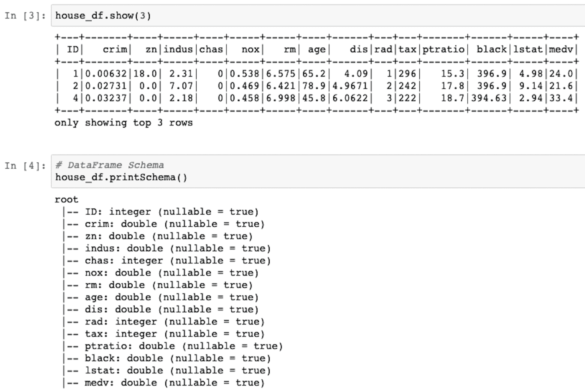

# 第八章：物联网的分布式 AI

分布式计算环境的进步和互联网的全球普及导致了**分布式人工智能**（**DAI**）的出现。在本章中，我们将了解两个框架，一个是 Apache 的**机器学习库**（**MLlib**），另一个是 H2O.ai，它们都为大规模、流式数据提供分布式和可扩展的**机器学习**（**ML**）。本章将以 Apache 的 Spark 介绍开始，它是事实上的分布式数据处理系统。本章将涵盖以下主题：

+   Spark 及其在分布式数据处理中的重要性

+   理解 Spark 架构

+   学习 MLlib

+   在深度学习管道中使用 MLlib

+   深入了解 H2O.ai 平台

# 介绍

物联网（IoT）系统会生成大量数据；虽然在许多情况下可以从容分析数据，但对于某些任务（如安全、欺诈检测等），这种延迟是不可接受的。在这种情况下，我们需要的是一种在指定时间内处理大量数据的方法——解决方案是 DAI，多个集群中的机器以分布式方式处理大数据（数据并行）和/或训练深度学习模型（模型并行）。有许多方式可以执行 DAI，大多数方法是建立在或围绕 Apache Spark 的基础上。Apache Spark 于 2010 年发布，并采用 BSD 许可协议，如今它是大数据领域最大的开源项目。它帮助用户创建一个快速且通用的集群计算系统。

Spark 运行在 Java 虚拟机上，使得它可以在任何安装了 Java 的机器上运行，无论是笔记本电脑还是集群。它支持多种编程语言，包括 Python、Scala 和 R。许多深度学习框架和 API 围绕 Spark 和 TensorFlow 构建，旨在简化分布式人工智能（DAI）任务，例如**TensorFlowOnSpark**（**TFoS**）、Spark MLlib、SparkDl 和 Hydrogen Sparkling（结合了 H2O.ai 和 Spark）。

# Spark 组件

Spark 使用主从架构，其中一个中央协调器（称为**Spark 驱动程序**）和多个分布式工作节点（称为**Spark 执行器**）。驱动程序进程创建一个`SparkContext`对象，并将用户应用程序分解成更小的执行单元（任务）。这些任务由工作节点执行。工作节点之间的资源由**集群** **管理器**管理。下图展示了 Spark 的工作原理：


Spark 的工作原理

现在让我们逐一了解 Spark 的不同组件。下图展示了构成 Spark 的基本组件：


构成 Spark 的组件

让我们简要看看在本章中我们将使用的一些组件，如下所示：

+   **弹性分布式数据集**：**弹性分布式数据集**（**RDDs**）是 Spark 中的主要 API。它们表示一个不可变的、分区的数据集合，可以并行操作。更高层的 API 如 DataFrames 和 DataSets 是建立在 RDD 之上的。

+   **分布式变量**：Spark 有两种类型的分布式变量：广播变量和累加器。它们由用户定义的函数使用。累加器用于将所有执行器中的信息聚合成共享结果。广播变量则是集群中共享的变量。

+   **DataFrames**：它是一个分布式的数据集合，非常类似于 pandas 中的 DataFrame。它们可以从各种文件格式中读取，并使用单个命令对整个 DataFrame 执行操作。它们分布在集群中。

+   **库**：Spark 内置了用于 MLlib 和图形处理（GraphX）的库。在本章中，我们将使用基于 Spark 框架的 MLlib 和 SparkDl。我们将学习如何应用它们来进行机器学习预测。

Spark 是一个大话题，本书无法提供有关 Spark 的更多细节。我们建议感兴趣的读者参考 Spark 文档：[`spark.apache.org/docs/latest/index.html`](http://spark.apache.org/docs/latest/index.html)。

# Apache MLlib

Apache Spark MLlib 为机器学习提供了强大的计算环境。它提供了一个大规模分布式架构，使得运行机器学习模型更加快速高效。这还不是全部；它是开源的，并且拥有一个不断壮大的活跃社区，持续改进并提供最新的功能。它提供了流行的机器学习算法的可扩展实现，涵盖以下算法：

+   **分类**：逻辑回归、线性支持向量机、朴素贝叶斯

+   **回归**：广义线性回归

+   **协同过滤**：交替最小二乘法

+   **聚类**：K 均值

+   **分解**：奇异值分解和主成分分析

它已被证明比 Hadoop MapReduce 更快。我们可以使用 Java、Scala、R 或 Python 编写应用程序。它还可以轻松与 TensorFlow 集成。

# MLlib 中的回归

Spark MLlib 内置了回归的方法。为了能够使用 Spark 的内置方法，您需要在您的集群（独立集群或分布式集群）上安装`pyspark`。可以使用以下方式进行安装：

```py
pip install pyspark
```

MLlib 库具有以下回归方法：

+   **线性回归**：我们在前面的章节中已经学习了线性回归；我们可以使用在`pyspark.ml.regression`中定义的`LinearRegression`类来使用这种方法。默认情况下，它使用最小化平方误差和正则化。它支持 L1 和 L2 正则化以及它们的组合。

+   **广义线性回归**：Spark MLlib 提供了指数族分布的子集，如高斯分布、泊松分布等。回归是通过`GeneralizedLinearRegression`类实例化的。

+   **决策树回归**：可以使用`DecisionTreeRegressor`类进行决策树回归预测。

+   **随机森林回归**：作为一种流行的机器学习方法，它们在`RandomForestRegressor`类中定义。

+   **梯度提升树回归**：我们可以使用`GBTRegressor`类来使用决策树的集成方法。

此外，MLlib 还支持使用`AFTSurvivalRegression`和`IsotonicRegression`类进行生存回归和等温回归。

借助这些类，我们可以在不到 10 行代码的情况下构建回归（或如下一节所示的分类）机器学习模型。基本步骤如下：

1.  构建 Spark 会话。

1.  实现数据加载管道：加载数据文件，指定格式，并将其读取到 Spark DataFrame 中。

1.  确定要用作输入的特征以及目标（可选择将数据集拆分为训练集/测试集）。

1.  实例化所需的类对象。

1.  使用`fit()`方法并将训练数据集作为参数。

1.  根据所选择的回归器，你可以查看学习到的参数并评估拟合的模型。

我们使用线性回归模型来预测波士顿房价数据集（[`www.cs.toronto.edu/~delve/data/boston/bostonDetail.html`](https://www.cs.toronto.edu/~delve/data/boston/bostonDetail.html)），数据集为`csv`格式：

1.  导入必要的模块。我们将使用`LinearRegressor`来定义线性回归类，使用`RegressionEvaluator`来评估训练后的模型，使用`VectorAssembler`来将特征合并为一个输入向量，使用`SparkSession`来启动 Spark 会话：

```py
from pyspark.ml.regression import LinearRegression as LR
from pyspark.ml.feature import VectorAssembler
from pyspark.ml.evaluation import RegressionEvaluator

from pyspark.sql import SparkSession
```

1.  接下来，使用`SparkSession`类启动一个 Spark 会话，代码如下：

```py
spark = SparkSession.builder \
 .appName("Boston Price Prediction") \
 .config("spark.executor.memory", "70g") \
 .config("spark.driver.memory", "50g") \
 .config("spark.memory.offHeap.enabled",True) \
 .config("spark.memory.offHeap.size","16g") \
 .getOrCreate()
```

1.  现在我们来读取数据；首先从给定路径加载数据，定义我们要使用的格式，最后将其读取到 Spark DataFrame 中，具体如下：

```py
house_df = spark.read.format("csv"). \
    options(header="true", inferschema="true"). \
    load("boston/train.csv")
```

1.  你可以看到现在内存中加载的 DataFrame 及其结构，见下图：



1.  类似于 pandas DataFrame，Spark DataFrame 也可以通过单一命令进行处理。让我们通过以下截图来进一步了解我们的数据集：


1.  接下来，我们定义要用于训练的特征；为此，我们使用`VectorAssembler`类。我们定义来自`house_df` DataFrame 的列，将其合并为输入特征向量和相应的输出预测（类似于定义`X_train`、`Y_train`），然后执行相应的转换，具体如下：

```py
vectors = VectorAssembler(inputCols = ['crim', 'zn','indus','chas',
    'nox','rm','age','dis', 'rad', 'tax',
    'ptratio','black', 'lstat'],
    outputCol = 'features')
vhouse_df = vectors.transform(house_df)
vhouse_df = vhouse_df.select(['features', 'medv'])
vhouse_df.show(5)
```


1.  数据集随后被分割为训练/测试数据集，代码如下所示：

```py
train_df, test_df = vhouse_df.randomSplit([0.7,0.3])
```

1.  现在数据集已经准备好，我们实例化`LinearRegression`类，并将其拟合到训练数据集上，如下所示：

```py
regressor = LR(featuresCol = 'features', labelCol='medv',\
    maxIter=20, regParam=0.3, elasticNetParam=0.8)
model = regressor.fit(train_df)
```

1.  我们可以获得线性回归的结果系数，如下所示：

```py
print("Coefficients:", model.coefficients)
print("Intercept:", model.intercept)
```


1.  该模型在训练数据集上提供了 RMSE 值为`4.73`，`r2`值为`0.71`，共进行了`21`次迭代：

```py
modelSummary = model.summary
print("RMSE is {} and r2 is {}"\ 
   .format(modelSummary.rootMeanSquaredError,\
    modelSummary.r2))
print("Number of Iterations is ",modelSummary.totalIterations)
```

1.  接下来，我们在测试数据集上评估我们的模型；我们得到的 RMSE 为`5.55`，R2 值为`0.68`：

```py
model_evaluator = RegressionEvaluator(predictionCol="prediction",\
    labelCol="medv", metricName="r2")
print("R2 value on test dataset is: ",\
    model_evaluator.evaluate(model_predictions))
print("RMSE value is", model.evaluate(test_df).rootMeanSquaredError)
```

一旦工作完成，你应该使用`stop()`方法停止 Spark 会话。完整代码可以在`Chapter08/Boston_Price_MLlib.ipynb`中找到。`r2`值较低和 RMSE 较高的原因是我们考虑了训练数据集中的所有特征作为输入特征向量，而其中许多特征对房价的预测没有显著作用。尝试减少特征，保留与价格高度相关的特征。

# MLlib 中的分类

MLlib 还提供了多种分类器；它提供了二项和多项逻辑回归分类器。决策树分类器、随机森林分类器、梯度提升树分类器、多层感知器分类器、线性支持向量机分类器和朴素贝叶斯分类器都得到了支持。每个分类器都在其各自的类中定义；有关详细信息，请参阅[`spark.apache.org/docs/2.2.0/ml-classification-regression.html`](https://spark.apache.org/docs/2.2.0/ml-classification-regression.html#naive-bayes)。基本步骤与我们在回归案例中学到的相同；唯一的区别是，现在，模型评估的标准是准确率，而不是 RMSE 或 r2。

本节将为你展示如何使用 Spark MLlib 的逻辑回归分类器实现葡萄酒质量分类问题：

1.  对于这个分类问题，我们将使用通过`LogisticRegressor`类提供的逻辑回归。像之前的例子一样，`VectorAssembler`将用于将输入特征合并为一个向量。在我们之前看到的葡萄酒质量数据集中（第一章，*物联网与人工智能的原理与基础*），质量是一个介于 0 到 10 之间的整数，我们需要对其进行处理。在这里，我们将使用`StringIndexer`来处理。

Spark 的一个伟大特点是我们可以将所有的预处理步骤定义为一个管道。当有大量的预处理步骤时，这非常有用。这里我们只有两个预处理步骤，但为了展示如何形成管道，我们将使用`Pipeline`类。我们将所有这些模块导入作为第一步，并创建一个 Spark 会话，代码如下所示：

```py
from pyspark.ml.classification import LogisticRegression as LR
from pyspark.ml.feature import VectorAssembler
from pyspark.ml.feature import StringIndexer
from pyspark.ml import Pipeline

from pyspark.sql import SparkSession

spark = SparkSession.builder \
    .appName("Wine Quality Classifier") \
    .config("spark.executor.memory", "70g") \
    .config("spark.driver.memory", "50g") \
    .config("spark.memory.offHeap.enabled",True) \
    .config("spark.memory.offHeap.size","16g") \
    .getOrCreate()
```

1.  我们将加载并读取`winequality-red.csv`数据文件，如下所示：

```py
wine_df = spark.read.format("csv"). \
    options(header="true",\
    inferschema="true",sep=';'). \
    load("winequality-red.csv")
```

1.  我们处理给定数据集中的`quality`标签，将其拆分为三个不同的类别，并将其作为新的`quality_new`列添加到现有的 Spark DataFrame 中，代码如下所示：

```py
from pyspark.sql.functions import when
wine_df = wine_df.withColumn('quality_new',\
    when(wine_df['quality']< 5, 0 ).\
    otherwise(when(wine_df['quality']<8,1)\
    .otherwise(2)))
```

1.  尽管修改后的质量`quality_new`已经是一个整数，我们可以直接将其用作标签。在这个例子中，我们添加了`StringIndexer`将其转换为数字索引，目的是为了说明。你可以使用`StringIndexer`将字符串标签转换为数字索引。我们还使用`VectorAssembler`将各列组合成一个特征向量。两个阶段通过`Pipeline`结合在一起，如下所示：

```py
string_index = StringIndexer(inputCol='quality_new',\
    outputCol='quality'+'Index')
vectors = VectorAssembler(inputCols = \
    ['fixed acidity','volatile acidity',\
    'citric acid','residual sugar','chlorides',\
    'free sulfur dioxide', 'total sulfur dioxide', \
    'density','pH','sulphates', 'alcohol'],\
    outputCol = 'features')

stages = [vectors, string_index]

pipeline = Pipeline().setStages(stages)
pipelineModel = pipeline.fit(wine_df)
pl_data_df = pipelineModel.transform(wine_df)
```

1.  在流水线处理之后得到的数据随后被拆分成训练数据集和测试数据集，如以下代码所示：

```py
train_df, test_df = pl_data_df.randomSplit([0.7,0.3])
```

1.  接下来，我们实例化`LogisticRegressor`类，并使用`fit`方法在训练数据集上进行训练，如下所示：

```py
classifier= LR(featuresCol = 'features', \
    labelCol='qualityIndex',\
    maxIter=50)
model = classifier.fit(train_df)
```

1.  在以下截图中，我们可以看到学习到的模型参数：


1.  模型的准确率为 94.75%。我们还可以在以下代码中看到其他评估指标，如`precision`（精确度）、`recall`（召回率）、F 值、真阳性率和假阳性率：

```py
modelSummary = model.summary

accuracy = modelSummary.accuracy
fPR = modelSummary.weightedFalsePositiveRate
tPR = modelSummary.weightedTruePositiveRate
fMeasure = modelSummary.weightedFMeasure()
precision = modelSummary.weightedPrecision
recall = modelSummary.weightedRecall
print("Accuracy: {} False Positive Rate {} \
    True Positive Rate {} F {} Precision {} Recall {}"\
    .format(accuracy, fPR, tPR, fMeasure, precision, recall))
```

我们可以看到，使用 MLlib 的葡萄酒质量分类器的性能与我们之前的方法相当。完整代码可以在 GitHub 仓库中的`Chapter08/Wine_Classification_MLlib.pynb`文件找到。

# 使用 SparkDL 进行迁移学习

前面几节讲解了如何使用 Spark 框架和其 MLlib 处理机器学习问题。然而，在大多数复杂任务中，深度学习模型提供了更好的性能。Spark 支持 SparkDL，这是一个在 MLlib 上运行的更高级 API。它在后台使用 TensorFlow，并且还需要 TensorFrames、Keras 和 TFoS 模块。

在本节中，我们将使用 SparkDL 进行图像分类。这将帮助你熟悉 Spark 对图像的支持。对于图像，正如我们在第四章《物联网的深度学习》中学到的，**卷积神经网络**（**CNNs**）是事实上的选择。在第四章《物联网的深度学习》中，我们从头开始构建了 CNN，并且还了解了一些流行的 CNN 架构。CNN 的一个非常有趣的特点是，每个卷积层都学习识别图像中的不同特征，起到特征提取器的作用。较低的卷积层会过滤出基本形状，比如线条和圆形，而较高的层则过滤出更抽象的形状。这个特点可以用来利用在一组图像上训练的 CNN 来分类另一组类似领域的图像，只需要更改顶部的全连接层。这种技术被称为**迁移学习**。根据新数据集图像的可用性以及两个领域之间的相似性，迁移学习可以显著帮助减少训练时间，并且减少对大规模数据集的需求。

在 2016 年 NIPS 教程中，AI 领域的关键人物之一 Andrew Ng 提到，*迁移学习将是下一个商业成功的推动力*。在图像领域，通过使用在 ImageNet 数据上训练的 CNN 进行迁移学习，已经在其他领域的图像分类中取得了巨大的成功。目前，许多研究正在致力于将迁移学习应用于其他数据领域。您可以通过 Sebastian Ruder 的这篇博客文章了解*迁移学习*的基础：[`ruder.io/transfer-learning/`](http://ruder.io/transfer-learning/)。

我们将采用 Google 提出的 CNN 架构 InceptionV3（[`arxiv.org/pdf/1409.4842.pdf`](https://arxiv.org/pdf/1409.4842.pdf)），并使用在 ImageNet 数据集（[`www.image-net.org`](http://www.image-net.org)）上训练的模型，来识别道路上的车辆（目前我们仅限于公交车和小汽车）。

在开始之前，请确保以下模块已安装在您的工作环境中：

+   PySpark

+   TensorFlow

+   Keras

+   TFoS

+   TensorFrames

+   Wrapt

+   Pillow

+   pandas

+   Py4J

+   SparkDL

+   Kafka

+   Jieba

这些可以通过`pip install`命令在您的独立机器或集群中的机器上安装。

接下来，您将学习如何使用 Spark 和 SparkDL 进行图像分类。我们通过 Google 图像搜索截图了两种不同的花朵，雏菊和郁金香；雏菊有 42 张图片，郁金香有 65 张图片。在下面的截图中，您可以看到雏菊的样本截图：


以下截图展示了郁金香的样本图片：


我们的数据集太小，因此如果从头开始构建 CNN，它无法提供任何有用的性能。在这种情况下，我们可以利用迁移学习。SparkDL 模块提供了一个简单方便的方式，通过`DeepImageFeaturizer`类使用预训练模型。它支持以下 CNN 模型（在 ImageNet 数据集（[`www.image-net.org`](http://www.image-net.org)）上预训练）：

+   InceptionV3

+   Xception

+   ResNet50

+   VGG16

+   VGG19

我们将使用 Google 的 InceptionV3 作为我们的基础模型。完整的代码可以从 GitHub 仓库中的`Chapter08/Transfer_Learning_Sparkdl.ipynb`访问：

1.  在第一步中，我们需要为 SparkDL 库指定环境。这是一个重要的步骤；如果没有它，内核将无法知道从哪里加载 SparkDL 包：

```py
import os
SUBMIT_ARGS = "--packages databricks:spark-deep-learning:1.3.0-spark2.4-s_2.11 pyspark-shell"
os.environ["PYSPARK_SUBMIT_ARGS"] = SUBMIT_ARGS
```

即使在某些操作系统上通过`pip`安装 SparkDL 时，仍需要指定操作系统环境或 SparkDL。

1.  接下来，让我们启动一个`SparkSession`，如下所示的代码：

```py
from pyspark.sql import SparkSession
spark = SparkSession.builder \
    .appName("ImageClassification") \
    .config("spark.executor.memory", "70g") \
    .config("spark.driver.memory", "50g") \
    .config("spark.memory.offHeap.enabled",True) \
    .config("spark.memory.offHeap.size","16g") \
    .getOrCreate()
```

1.  我们导入必要的模块并读取数据图像。除了读取图像路径，我们还将标签分配给 Spark DataFrame 中的每个图像，如下所示：

```py
import pyspark.sql.functions as f
import sparkdl as dl
from pyspark.ml.image import ImageSchema
from sparkdl.image import imageIO
dftulips = ImageSchema.readImages('data/flower_photos/tulips').\
    withColumn('label', f.lit(0))
dfdaisy = ImageSchema.readImages('data/flower_photos/daisy').\
    withColumn('label', f.lit(1))
```

1.  接下来，你可以看到两个数据框的前五行。第一列包含每张图像的路径，第二列显示其标签（是否属于雏菊（标签 1）或属于郁金香（标签 0））：


1.  我们使用`randomSplit`函数将两个图像数据集划分为训练集和测试集（这始终是一种良好的做法）。通常，人们选择 60%—40%、70%—30%或 80%—20%的训练-测试数据集比例。我们在这里选择了 70%—30%的划分。为了训练，我们将两种花的训练图像合并到`trainDF`数据框中，将测试数据集图像合并到`testDF`数据框中，如下所示：

```py
trainDFdaisy, testDFdaisy = dfdaisy.randomSplit([0.70,0.30],\
        seed = 123)
trainDFtulips, testDFtulips = dftulips.randomSplit([0.70,0.30],\
        seed = 122)
trainDF = trainDFdaisy.unionAll(trainDFtulips)
testDF = testDFdaisy.unionAll(testDFtulips)
```

1.  接下来，我们使用`InceptionV3`作为特征提取器，后接逻辑回归分类器来构建管道。我们使用`trainDF`数据框来训练模型：

```py
from pyspark.ml.classification import LogisticRegression
from pyspark.ml import Pipeline

vectorizer = dl.DeepImageFeaturizer(inputCol="image",\
        outputCol="features", modelName="InceptionV3")
logreg = LogisticRegression(maxIter=20, labelCol="label")
pipeline = Pipeline(stages=[vectorizer, logreg])
pipeline_model = pipeline.fit(trainDF)
```

1.  现在我们在测试数据集上评估训练好的模型。我们可以看到，在测试数据集上，使用以下代码我们得到了 90.32%的准确率：

```py
predictDF = pipeline_model.transform(testDF) #predict on test dataset

from pyspark.ml.evaluation import MulticlassClassificationEvaluator as MCE
scoring = predictDF.select("prediction", "label")
accuracy_score = MCE(metricName="accuracy")
rate = accuracy_score.evaluate(scoring)*100
print("accuracy: {}%" .format(round(rate,2)))
```

1.  这里是两个类别的混淆矩阵：


在不到 20 行代码的情况下，我们成功训练了模型并获得了 90.32%的良好准确率。请记住，这里使用的数据集是原始数据；通过增加数据集中的图像数量，并过滤掉低质量的图像，你可以提高模型的表现。你可以从官方 GitHub 仓库了解更多关于深度学习库 SparkDL 的内容：[`github.com/databricks/spark-deep-learning`](https://github.com/databricks/spark-deep-learning)。

# 介绍 H2O.ai

H2O 是由 H2O.ai 开发的一个快速、可扩展的机器学习和深度学习框架，采用开源 Apache 许可证发布。根据公司提供的详细信息，超过 9000 个组织和 80,000+名数据科学家使用 H2O 来满足他们的机器学习/深度学习需求。它使用内存压缩技术，即使在一个小型的机器集群中，也能处理大量数据。它支持 R、Python、Java、Scala 和 JavaScript 接口，甚至还内置了一个 Web 界面。H2O 可以在独立模式下运行，也可以在 Hadoop 或 Spark 集群中运行。

H2O 包括大量的机器学习算法，如广义线性模型、朴素贝叶斯、随机森林、梯度提升和深度学习算法。H2O 的最佳特点是，用户可以在几行代码中构建成千上万个模型，比较结果，甚至进行超参数调优。H2O 还拥有更好的数据预处理工具。

H2O 需要 Java，因此，请确保你的系统上已安装 Java。你可以使用`PyPi`安装 H2O 以在 Python 中使用，以下是安装代码：

```py
pip install h2o
```

# H2O AutoML

H2O 最令人兴奋的功能之一是**AutoML**，自动化机器学习。它旨在开发一个易于使用的机器学习接口，可以供非专业人士使用。H2O AutoML 自动化了训练和调优大量候选模型的过程。其界面设计如此简便，用户只需要指定数据集、输入输出特征以及他们希望在训练的总模型数量或时间限制方面设置的任何约束条件。其余的工作由 AutoML 本身完成；在指定的时间限制内，它会识别出表现最好的模型，并提供一个排行榜。通常，已训练的所有模型的集成模型——堆叠集成模型，会占据排行榜的顶端。对于高级用户，有大量选项可供使用；这些选项的详细信息以及它们的各种功能可以在[`docs.h2o.ai/h2o/latest-stable/h2o-docs/automl.html`](http://docs.h2o.ai/h2o/latest-stable/h2o-docs/automl.html)上找到。

要了解更多关于 H2O 的信息，您可以访问他们的网站：[`h2o.ai`](http://h2o.ai)。

# H2O 中的回归

我们将首先展示如何在 H2O 中进行回归。我们将使用与之前在 MLlib 中使用的相同数据集，即波士顿房价数据集，来预测房屋的价格。完整的代码可以在 GitHub 上找到：`Chapter08/boston_price_h2o.ipynb`：

1.  完成该任务所需的模块如下：

```py
import h2o
import time
import seaborn
import itertools
import numpy as np
import pandas as pd
import seaborn as sns
import matplotlib.pyplot as plt
from h2o.estimators.glm import H2OGeneralizedLinearEstimator as GLM
from h2o.estimators.gbm import H2OGradientBoostingEstimator as GBM
from h2o.estimators.random_forest import H2ORandomForestEstimator as RF
%matplotlib inline
```

1.  在导入必要的模块后，第一步是启动一个`h2o`服务器。我们通过`h2o.init()`命令来完成这一操作。它首先检查是否已有现有的`h2o`实例，如果没有，它将启动一个新的实例。还可以通过指定 IP 地址和端口号作为`init()`函数的参数来连接到现有集群。在下面的截图中，您可以看到在独立系统上执行`init()`的结果：


1.  接下来，我们使用`h2o`的`import_file`函数读取数据文件。它将文件加载到 H2O 数据框中，可以像使用 pandas 数据框一样轻松处理。我们可以很容易地使用`cor()`方法找到`h2o`数据框中不同输入特征之间的相关性：

```py
boston_df = h2o.import_file("../Chapter08/boston/train.csv", destination_frame="boston_df")

plt.figure(figsize=(20,20))
corr = boston_df.cor()
corr = corr.as_data_frame()
corr.index = boston_df.columns
#print(corr)
sns.heatmap(corr, annot=True, cmap='YlGnBu',vmin=-1, vmax=1)
plt.title("Correlation Heatmap")
```

以下是波士顿房价数据集中不同特征之间相关性图的输出：


1.  现在，和往常一样，我们将数据集分为训练集、验证集和测试集。定义要作为输入特征使用的特征（`x`）：

```py
train_df,valid_df,test_df = boston_df.split_frame(ratios=[0.6, 0.2],\
         seed=133)
features =  boston_df.columns[:-1]
```

1.  完成这项工作后，过程非常简单。我们只需实例化来自 H2O 库的回归模型类，并使用`train()`函数，传入训练集和验证集数据作为参数。在`train`函数中，我们还需要指定输入特征（`x`）和输出特征（`y`）。在本例中，我们将所有可用的特征作为输入特征，房价`medv`作为输出特征。通过简单的打印语句，我们可以查看训练后模型的特征。接下来，你可以看到一个广义线性回归模型的声明及其在训练集和验证集上的训练结果：

```py
model_glm = GLM(model_id='boston_glm')
model_glm.train(training_frame= train_df,\
         validation_frame=valid_df, \
         y = 'medv', x=features)
print(model_glm)
```


1.  训练后，下一步是检查在测试数据集上的表现，这可以通过`model_performance()`函数轻松完成。我们也可以将其应用于任何数据集：训练集、验证集、测试集或某些新的类似数据集：

```py
test_glm = model_glm.model_performance(test_df)
print(test_glm)
```


1.  如果我们想使用梯度提升估计回归模型或随机森林回归模型，我们将实例化相应的类对象；接下来的步骤保持不变。不同的是输出参数；在梯度提升估计器和随机森林回归的情况下，我们还会学习不同输入特征的相对重要性：

```py
#Gradient Boost Estimator
model_gbm = GBM(model_id='boston_gbm')
model_gbm.train(training_frame= train_df, \
        validation_frame=valid_df, \
        y = 'medv', x=features)

test_gbm = model_gbm.model_performance(test_df)

#Random Forest
model_rf = RF(model_id='boston_rf')
model_rf.train(training_frame= train_df,\
        validation_frame=valid_df, \
        y = 'medv', x=features)

test_rf = model_rf.model_performance(test_df)
```

1.  机器学习和深度学习中最难的部分是选择正确的超参数。在 H2O 中，通过其`H2OGridSearch`类，任务变得相当简单。以下代码片段在之前定义的梯度提升估计器上执行网格搜索，搜索超参数深度：

```py
from h2o.grid.grid_search import H2OGridSearch as Grid
hyper_params = {'max_depth':[2,4,6,8,10,12,14,16]}
grid = Grid(model_gbm, hyper_params, grid_id='depth_grid')
grid.train(training_frame= train_df,\
        validation_frame=valid_df,\
        y = 'medv', x=features)
```

1.  H2O 的最佳部分是使用 AutoML 自动寻找最佳模型。让我们要求它在 10 个模型中为我们搜索，并且将时间限制为 100 秒。AutoML 将在这些参数下构建 10 个不同的模型，不包括堆叠集成模型。它将在最多 100 秒内运行，最终训练出堆叠集成模型：

```py
from h2o.automl import H2OAutoML as AutoML
aml = AutoML(max_models = 10, max_runtime_secs=100, seed=2)
aml.train(training_frame= train_df, \
        validation_frame=valid_df, \
        y = 'medv', x=features)
```

1.  我们回归任务的排行榜如下：


排行榜中的不同模型可以通过各自的`model_id`进行访问。最佳模型通过 leader 参数进行访问。在我们的例子中，`aml.leader`代表最佳模型，即所有模型的堆叠集成模型。我们可以使用`h2o.save_model`函数将最佳模型保存为二进制格式或 MOJO 格式。

# H2O 中的分类

相同的模型可以用于 H2O 中的分类，只需做一个改动；我们需要使用`asfactor()`函数将输出特征从数值型转为类别型。我们将对红酒的质量进行分类，并使用我们之前的红酒数据库（第三章，*物联网中的机器学习*）。我们需要导入相同的模块并启动 H2O 服务器。完整代码可在`Chapter08/wine_classification_h2o.ipynb`文件中找到：

1.  下面是导入必要模块并启动 H2O 服务器的代码：

```py
import h2o
import time
import seaborn
import itertools
import numpy as np
import pandas as pd
import seaborn as sns
import matplotlib.pyplot as plt
from h2o.estimators.glm import H2OGeneralizedLinearEstimator as GLM
from h2o.estimators.gbm import H2OGradientBoostingEstimator as GBM
from h2o.estimators.random_forest import H2ORandomForestEstimator as RF

%matplotlib inline

h2o.init()
```

1.  下一步是读取数据文件。我们首先修改输出特征以适应两个类别（好酒和坏酒），然后使用`asfactor()`函数将其转换为类别变量。这是 H2O 中的一个重要步骤；因为我们在回归和分类中使用相同的类对象，它们要求回归时输出标签为数值型，分类时输出标签为类别型，如代码块所示：

```py
wine_df = h2o.import_file("../Chapter08/winequality-red.csv",\
        destination_frame="wine_df")    
features = wine_df.columns[:-1]
print(features)
wine_df['quality'] = (wine_df['quality'] > 7).ifelse(1,0)
wine_df['quality'] = wine_df['quality'].asfactor()
```

1.  接下来，将数据集分为训练集、验证集和测试集。我们将训练集和验证集输入到广义线性估计器中，唯一的改动是；我们需要指定`family=binomial`参数，因为这里我们只有两类分类：好酒和坏酒。如果你有超过两个类别，使用`family=multinomial`。记住，指定这个参数是可选的；H2O 会自动检测输出特征：

```py
train_df,valid_df,test_df = wine_df.split_frame(ratios=[0.6, 0.2],\
        seed=133)    

model_glm = GLM(model_id='wine_glm', family = 'binomial')
model_glm.train(training_frame= train_df, \
        validation_frame=valid_df,\
        y = 'quality', x=features)
print(model_glm)
```

1.  经过训练后，你可以查看模型在所有性能指标上的表现：准确率、精确度、召回率、F1 值和 AUC，甚至是混淆矩阵。你可以获取三种数据集（训练集、验证集和测试集）的所有指标。以下是从广义线性估计器获取的测试数据集的指标：


1.  在不改变前面的代码的情况下，我们可以进行超参数调优并使用 H2O 的 AutoML 来获得更好的模型：

```py
from h2o.automl import H2OAutoML as AutoML
aml = AutoML(max_models = 10, max_runtime_secs=100, seed=2)
aml.train(training_frame= train_df, \
        validation_frame=valid_df, \
        y = 'quality', x=features)
```


我们看到，在红酒质量分类中，最佳模型是 XGBoost。

# 概要

随着物联网的普及，生成的数据正在以指数速度增长。这些数据通常是非结构化的，且数量庞大，常被称为大数据。为应对庞大的数据集，已经提出了大量的框架和解决方案。一个有前景的解决方案是 DAI，将模型或数据分布在一组机器上。我们可以使用分布式 TensorFlow 或 TFoS 框架来进行分布式模型训练。近年来，出现了一些易于使用的开源解决方案。两个最受欢迎且成功的解决方案是 Apache Spark 的 MLlib 和 H2O.ai 的 H2O。在本章中，我们展示了如何在 MLlib 和 H2O 中为回归和分类任务训练机器学习模型。Apache Spark 的 MLlib 支持 SparkDL，后者为图像分类和检测任务提供了出色的支持。本章使用 SparkDL 通过预训练的 InceptionV3 对花卉图像进行分类。另一方面，H2O.ai 的 H2O 在处理数值型和表格数据时表现良好。它提供了一个有趣且实用的 AutoML 功能，甚至允许非专家用户在很少的细节输入下调优并搜索大量的机器学习/深度学习模型。本章涵盖了如何使用 AutoML 进行回归和分类任务的示例。

当在一组机器上工作时，充分利用这些分布式平台是非常有利的。随着计算和数据以可承受的价格转移到云端，将机器学习任务迁移到云端是有意义的。接下来的一章将介绍不同的云平台，以及如何使用它们来分析由您的物联网设备生成的数据。
