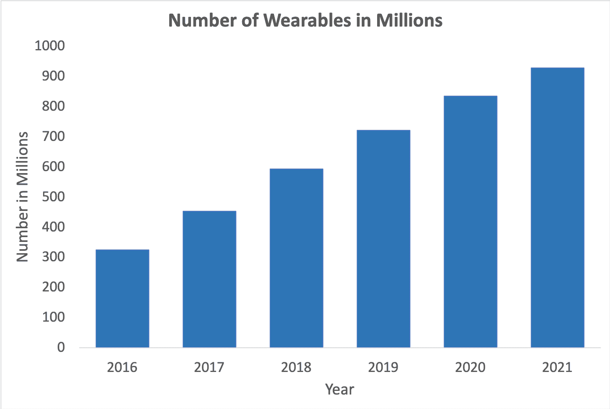
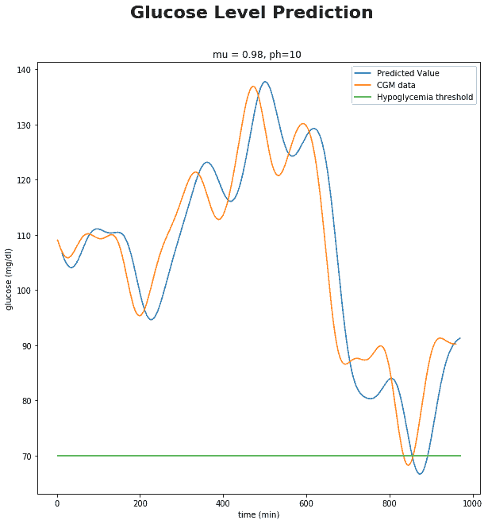
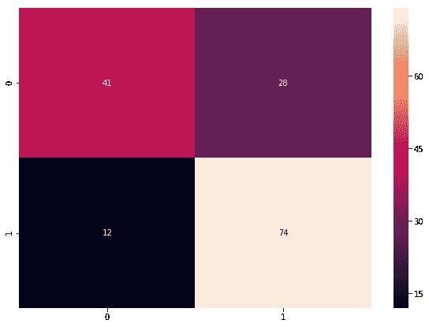
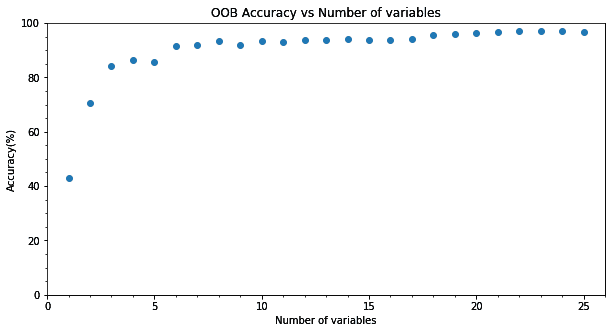
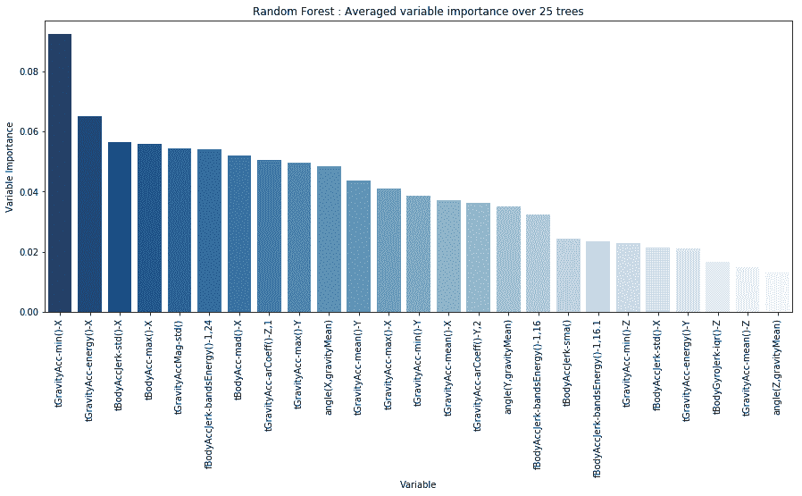
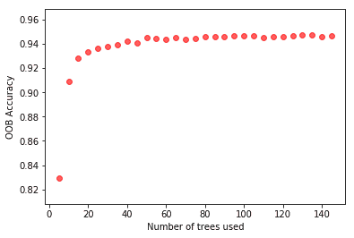
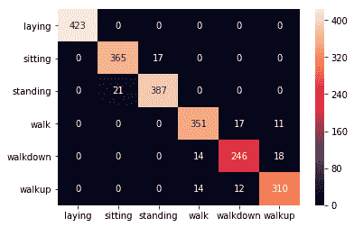
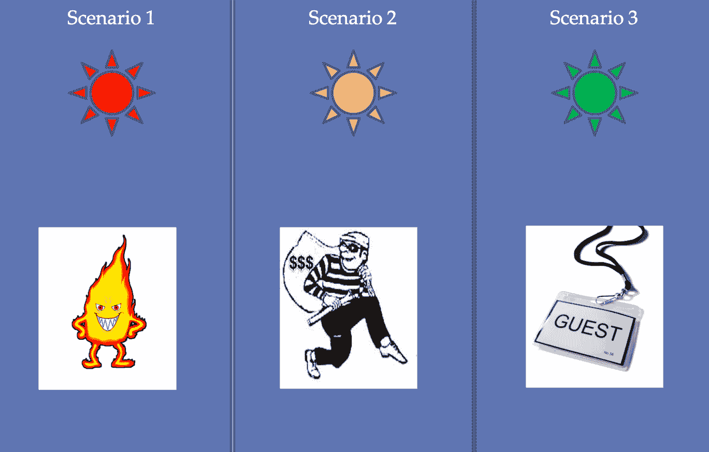
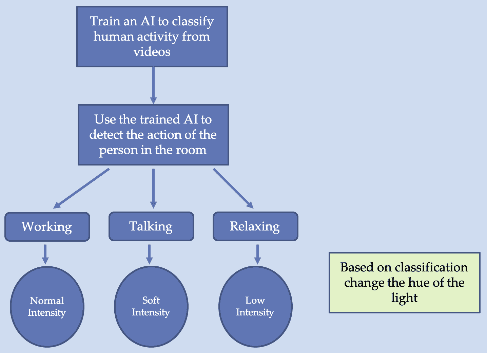

# 第九章：个人和家庭物联网

现在，您已经掌握了**机器学习**（**ML**）和**深度学习**（**DL**）的知识，并学习了如何将其应用于大数据、图像任务、文本任务和时间序列数据，是时候探索您所学的算法和技术在实际中的应用了。本章及接下来的两章将集中介绍一些具体的案例研究。本章将重点讨论个人和家庭**物联网**（**IoT**）的使用案例。我们将在本章中讨论以下内容：

+   成功的物联网应用

+   可穿戴设备及其在个人物联网中的作用

+   如何通过机器学习监测心脏

+   什么让家成为智能家居

+   智能家居中使用的设备

+   人工智能在预测人类活动识别中的应用

# 个人物联网

个人物联网主要由可穿戴设备主导，这些技术设备设计为佩戴在身体上，并与智能手机上的应用程序配合使用。第一款可穿戴设备是由美国 Time Computer Inc.（当时称为**汉密尔顿手表公司**）生产的 Pulsar 计算器手表。那时它是一款不连接互联网的独立设备。随着互联网的普及，能够连接互联网的可穿戴设备成为了一种潮流。预计可穿戴设备市场将从 2016 年约**3.25**亿台增长至 2020 年超过**8.3**亿台：



该图展示了 2016 至 2021 年间全球可穿戴设备的数量（数据来源：Statista）。随着越来越多的设备在线连接并持续生成数据，AI/ML 工具成为分析这些数据并做出明智决策的自然选择。在本节中，您将了解一些成功的个人物联网应用。

# MIT 的 SuperShoes

当你用一只手拿着手机并通过*Google Maps*导航时，你有多少次觉得这种方式很繁琐？你有多少次希望能有一双能带你去任何地方的魔法拖鞋？由*MIT Media Lab*开发的 SuperShoes（[`www.media.mit.edu/projects/supershoes/overview/`](https://www.media.mit.edu/projects/supershoes/overview/)）几乎就像这些魔法拖鞋；它们使用户无需查看智能手机屏幕即可在街道上导航。

SuperShoes 具有灵活的鞋垫，在脚趾下嵌入了振动马达。它们通过无线连接到智能手机上的应用程序。该应用程序不仅允许用户与 SuperShoes 进行交互，还将用户的喜好、不喜欢的东西、爱好、商店、食物、人物、兴趣等存储在云账户中。振动马达产生的触觉刺激与用户进行沟通。一旦用户在应用程序中输入目的地，鞋子就开始工作。如果左脚趾有触觉刺激，用户应该向左转；如果右脚趾有触觉刺激，用户应该向右转。如果没有触觉刺激，用户则需要继续直行。如果两个脚趾都反复有触觉刺激，说明用户已经到达目的地。

除了导航，它还可以推荐附近的兴趣地点；用户可以在云端更新他们的喜好和不喜欢的事物。根据用户的喜好和不喜欢，SuperShoes 在用户接近推荐地点时会给出提示（两只脚趾同时被刺激）。SuperShoes 的另一个有趣功能是它可以提醒用户；如果用户附近有任务，它会提醒用户。

制作这款鞋所需的硬件非常简单，主要包括以下内容：

+   三个振动触觉装置刺激脚趾

+   用于感应步态的电容传感器

+   一块微控制器，用于接收应用程序的命令，并相应地控制触觉刺激装置

+   用于与智能手机连接的蓝牙设备

+   为整个系统提供电力的电池

这一魔法由应用程序中的软件代码实现。您可以在此网站了解更多关于 SuperShoes 的信息：[`dhairyadand.com/works/supershoes`](http://dhairyadand.com/works/supershoes)。

# 持续血糖监测

人工智能的一个主要应用领域是物联网（IoT）在医疗保健中的应用，其中最成功的商业应用之一就是持续监测人体血糖水平。雅培的 FreeStyle CGM、DexCom CGM 和美敦力的 CGM 是一些市面上可用的品牌。

**连续血糖监测**（**CGM**）使糖尿病患者能够实时检查自己体内的血糖水平。它帮助他们在一段时间内监测血糖数据，这些数据还可以用于预测未来的血糖水平，从而帮助他们应对低血糖等情况。

在 CGM 中，通常将传感器放置在腹部皮肤下或粘贴在手臂背部。传感器将读数发送到连接的呼叫器或智能手机应用程序。该应用程序具有基于人工智能的算法，可以告知用户任何临床相关的血糖模式。数据的可用性不仅帮助用户主动管理血糖的升高和下降，还可以提供关于饮食、锻炼或疾病对血糖水平影响的见解。

传感器的使用寿命通常为 7 到 14 天，通常这个时间足够医疗人员了解个人的生活方式，并相应地建议调整。

# 使用 CGM 数据预测低血糖

一旦一个人拥有 CGM 数据，就可以使用 AI/ML 对其进行分析，以收集更多信息或预测低血糖。在本节中，我们将看到如何使用前面章节中学到的算法来构建一个血糖预测系统。

我们将基于 Sparacino 等人发表的论文《血糖浓度可以通过连续血糖监测传感器时间序列提前预测》（[10.1109/TBME.2006.889774](https://doi.org/10.1109/TBME.2006.889774)）构建我们的预测器。

在论文中，CGM 时间序列的血糖数据由一个时间序列模型描述；论文考虑了两种模型，一个是简单的一阶多项式，另一个是一阶自回归模型。模型参数在每个采样时间 *t[s]* 对过去的血糖数据进行拟合。这里，我们将使用在第三章《物联网中的机器学习》中学到的 scikit 线性回归器来实现简单的一阶多项式：

1.  我们导入模块 pandas 来读取`csv`文件，Numpy 用于数据处理，Matplotlib 用于绘图，scikit-learn 用于线性回归器，如下所示：

```py
import pandas as pd
import numpy as np
import matplotlib.pyplot as plt
from sklearn.linear_model import LinearRegression
%matplotlib inline
```

1.  将从 CGM 获得的数据保存在数据文件夹中并读取。我们需要两个值：血糖读数和对应的时间。我们使用的数据在两个 CSV 文件中提供，分别是`ys.csv`（包含血糖值）和`ts.csv`（包含对应的时间），如下所示：

```py
# Read the data
ys = pd.read_csv('data/ys.csv')
ts = pd.read_csv('data/ts.csv')
```

1.  根据论文，我们定义了预测模型的两个参数`ph`，即预测**时间范围**，和`mu`，即遗忘因子。有关这两个参数的更多细节，请参考前面提到的论文：

```py
# MODEL FIT AND PREDICTION

# Parameters of the predictive model. ph is Prediction horizon, mu is Forgetting factor.
ph = 10 
mu = 0.98
```

1.  我们创建数组来保存预测值，如下所示：

```py
n_s = len(ys)

# Arrays to hold predicted values
tp_pred = np.zeros(n_s-1) 
yp_pred = np.zeros(n_s-1)
```

1.  现在我们读取 CGM 数据，模拟实时采集，并预测`ph`分钟后的血糖水平。所有过去的数据都用于确定模型参数，但每个数据点的贡献不同，由分配给它的个体权重`mu^k`（表示距当前采样时间`k`时刻的样本权重）决定：

```py
# At every iteration of the for loop a new sample from CGM is acquired.
for i in range(2, n_s+1):
    ts_tmp = ts[0:i]
    ys_tmp = ys[0:i]
    ns = len(ys_tmp)

    # The mu**k assigns the weight to the previous samples.
    weights = np.ones(ns)*mu
    for k in range(ns):
        weights[k] = weights[k]**k
    weights = np.flip(weights, 0)
    # MODEL
    # Linear Regression.
    lm_tmp = LinearRegression() 
    model_tmp = lm_tmp.fit(ts_tmp, ys_tmp, sample_weight=weights)

    # Coefficients of the linear model, y = mx + q 
    m_tmp = model_tmp.coef_
    q_tmp = model*tmp.intercept

*    # PREDICTION
    tp = ts.iloc[ns-1,0] + ph
    yp = m_tmp*tp + q_tmp

    tp_pred[i-2] = tp 
    yp_pred[i-2] = yp
```

1.  我们可以看到预测滞后于实际数据。正常的血糖水平在`70`到`180`之间。低于`70`，患者可能会出现低血糖，超过`180`则可能导致高血糖。让我们来看一下我们预测数据的图示：

```py
# PLOT
# Hypoglycemia threshold vector. 
t_tot = [l for l in range(int(ts.min()), int(tp_pred.max())+1)]
hypoglycemiaTH = 70*np.ones(len(t_tot)) 
#hyperglycemiaTH = 180*np.ones(len(t_tot))

fig, ax = plt.subplots(figsize=(10,10))
fig.suptitle('Glucose Level Prediction', fontsize=22, fontweight='bold')
ax.set_title('mu = %g, ph=%g ' %(mu, ph))
ax.plot(tp_pred, yp_pred, label='Predicted Value') 
ax.plot(ts.iloc[:,0], ys.iloc[:,0], label='CGM data') 
ax.plot(t_tot, hypoglycemiaTH, label='Hypoglycemia threshold')
#ax.plot(t_tot, hyperglycemiaTH, label='Hyperglycemia threshold')
ax.set_xlabel('time (min)')
ax.set_ylabel('glucose (mg/dl)')
ax.legend()
```



1.  以下代码的 RMSE 误差将为 27：

```py
from sklearn.metrics import mean_squared_error as mse
print("RMSE is", mse(ys[1:],yp_pred))
```

代码位于`Chapter09/Hypoglycemia_Prediction.ipynb`笔记本中。葡萄糖预测系统已经出现在许多商业产品中。你也可以根据我们刚刚创建的模型来做一个类似的系统。你还可以使用人工神经网络做类似的预测，结果可能会更好（参考 [`www.ncbi.nlm.nih.gov/pubmed/20082589`](https://www.ncbi.nlm.nih.gov/pubmed/20082589)）。

# 心脏监测器

另一个非常有用的个人 AI 应用在物联网中的例子是心脏病的检测。现在有很多可穿戴设备可以用来监测和记录心率。这些数据可以用来预测任何有害的心脏状况。在这里，我们将采用 AI/ML 工具来预测心脏**心律失常**，这是一组心率不规律的情况；它可以是过快（每分钟超过 100 次）或过慢（每分钟低于 60 次）。使用的数据来自*UCI 机器学习数据集*：[`archive.ics.uci.edu/ml/datasets/heart+Disease`](https://archive.ics.uci.edu/ml/datasets/heart+Disease)。该数据集包含 76 个属性，但并非所有属性都用于预测疾病的存在；每一行数据都有一个目标字段。它有五个可能的值 0–4，值 0 表示健康的心脏，其他任何值都表示有疾病。为了更好的准确性，问题可以被划分为二分类问题。该代码灵感来源于 Mohammed Rashad 的 GitHub 链接，并且以 GNU GPL 3.0 许可证共享：[`github.com/MohammedRashad/Deep-Learning-and-Wearable-IoT-to-Monitor-and-Predict-Cardiac-Arrhytmia`](https://github.com/MohammedRashad/Deep-Learning-and-Wearable-IoT-to-Monitor-and-Predict-Cardiac-Arrhytmia)。完整的代码可以通过 GitHub 仓库中的`Chapter09/Heart_Disease_Prediction.ipynb`文件访问：

1.  和往常一样，第一步是导入必要的模块。由于我们现在要对患者进行心脏病与否的分类，因此我们需要一个分类器。为了简便起见，我们使用`SVC`分类器。你也可以尝试使用 MLP 分类器，代码如下所示：

```py
# importing required libraries
import numpy as np
import pandas as pd
import matplotlib.pyplot as plt

from sklearn.svm import SVC
from sklearn import metrics
from sklearn.metrics import confusion_matrix
from sklearn.model_selection import train_test_split
```

1.  接下来，读取数据集，对数据集进行预处理，选择你将考虑的属性。我们从 76 个属性中选择了 13 个，然后将目标值从多类值转换为二分类。最后，数据被分割为训练集和测试集，如下所示：

```py
# reading csv file and extracting class column to y.
dataset = pd.read_csv("data.csv")
dataset.fillna(dataset.mean(), inplace=True)

dataset_to_array = np.array(dataset)
label = dataset_to_array[:,57] # "Target" classes having 0 and 1
label = label.astype('int')
label[label>0] = 1 # When it is 0 heart is healthy, 1 otherwise

# extracting 13 features
dataset = np.column_stack((
    dataset_to_array[:,4] , # pain location
    dataset_to_array[:,6] , # relieved after rest
    dataset_to_array[:,9] , # pain type 
    dataset_to_array[:,11], # resting blood pressure
    dataset_to_array[:,33], # maximum heart rate achieve
    dataset_to_array[:,34], # resting heart rate 
    dataset_to_array[:,35], # peak exercise blood pressure (first of 2 parts) 
    dataset_to_array[:,36], # peak exercise blood pressure (second of 2 parts) 
    dataset_to_array[:,38], # resting blood pressure 
    dataset_to_array[:,39], # exercise induced angina (1 = yes; 0 = no) 
    dataset.age, # age 
    dataset.sex , # sex
    dataset.hypertension # hyper tension
 ))

print ("The Dataset dimensions are : " , dataset.shape , "\n")

# dividing data into train and test data
X_train, X_test, y_train, y_test = train_test_split(dataset, label, random_state = 223)
```

1.  现在，我们定义要使用的模型。这里我们使用的是支持向量分类器，通过`fit`函数来训练数据集：

```py
model = SVC(kernel = 'linear').fit(X_train, y_train)
```

1.  让我们来看一下它在测试数据集上的表现：

```py
model_predictions = model.predict(X_test)
# model accuracy for X_test 
accuracy = metrics.accuracy_score(y_test, model_predictions)
print ("Accuracy of the model is :" , 
    accuracy , "\nApproximately : ", 
    round(accuracy*100) , "%\n")
```

1.  你可以看到，它提供了 74%的准确率，使用 MLP，我们可以进一步提高准确率。但请记住，在使用 MLP 分类器之前，务必对所有输入特征进行归一化处理。以下是我们训练的支持向量分类器在测试数据集上的混淆矩阵：

```py
#creating a confusion matrix
cm = confusion_matrix(y_test, model_predictions)

import pandas as pd
import seaborn as sn
import matplotlib.pyplot as plt
%matplotlib inline
df_cm = pd.DataFrame(cm, index = [i for i in "01"],
columns = [i for i in "01"])
plt.figure(figsize = (10,7))
sn.heatmap(df_cm, annot=True)
```

以下输出显示了测试数据集的混淆矩阵：



你可以在相同的数据集上训练你的模型，并使用训练好的模型为你的朋友、家人或客户预测心脏状况。

# 数字助手

数字助手是最早设想的人工智能应用之一。最初的数字助手尝试并未取得成功。然而，随着智能手机的出现和普及，今天我们有了大量的数字助手，它们提供拨打电话、写短信、安排日程，甚至为你上网搜索等服务。你可以让它们推荐附近的餐厅、酒吧或其他类似的地方。

以下是一些流行的数字助手：

+   **Siri**：由苹果开发，允许用户拨打电话、添加日程、播放音乐或视频，甚至发送短信。如今，几乎所有的苹果产品上都提供语音激活界面。

+   **Cortana**：由微软创建，帮助你通过基于时间、地点甚至人物的提醒保持日程安排。你可以让 Cortana 为你订午餐，或者使用它与之合作的其他应用程序。它与 Edge 集成，并启用了一个配备 Cortana 的语音激活扬声器。

+   **Alexa**：由亚马逊开发，适用于亚马逊 Echo 智能音响。它可以播放音乐、制定待办事项清单、为你设置闹钟、播放有声书，并提供关于股票、天气等的实时信息。它还支持语音互动。

+   **Google Assistant**：这是一个语音控制的智能助手。它提供持续的对话功能，即一旦你开始讲话，它会在没有触发词的情况下继续听取后续请求，而无需重复说*嘿，Google*。它还可以识别不同人的语音特征，并根据个人的喜好和厌恶量身定制回答。它不仅可以在安卓智能手机上使用，还可以在 Google Home 上使用。

2018 年，谷歌更进一步，发布了 Google Duplex，它可以为你打电话并预定约会。它说话像人类一样，并且在交谈时能够理解上下文。

# 物联网与智能家居

我的一个密友一直担心他年迈的母亲，母亲独自待在家中，而他、妻子和孩子们都外出。当母亲的健康状况开始恶化时，他向我求助。解决方案很简单；他在每个房间安装了 CCTV 摄像头，并与手机应用程序进行了连接。摄像头通过互联网联网，现在，无论他身在何处，都可以查看家中的情况，确保母亲的安好。

闭路电视（CCTV）、智能照明、智能音箱等连接到互联网帮助家庭自动化许多任务，您获得的是智能家居。目前大多数智能家居系统通过语音命令界面工作，您可以使用一组命令控制特定设备。例如，在 Amazon 的 Echo Dot 中，您可以要求其搜索或播放特定歌曲。您可以要求 Apple 的 Siri 使用手机打电话给朋友，都可以通过简单的语音界面。大多数这些设备都在某种形式上使用 AI/ML，但通过使用 AI/ML，家庭自动化可以进一步发展。例如，对于我的朋友，可以训练 AI 系统从视频中识别活动，或者检测家庭入侵。可能性是无限的。有了正确的数据和足够的计算能力，您只受想象的限制。

在本节中，我们将看到一些现有的家庭自动化产品，并探讨如何进一步利用 AI 来增强自动化。

# 人体活动识别

最受关注的智能家居应用之一是**人体活动识别**（**HAR**）。有许多公司试图开发能够追踪体育活动及其相应热量消耗的应用程序。健康与健身无疑是一个大生意。除了在健身和健康方面的应用外，HAR 在老年护理或康复中也很有用。进行 HAR 已有许多方法，以下是其中两种：

+   使用摄像头（或雷达或类似设备）记录人类活动，并使用深度学习方法对其进行分类

+   个人使用可穿戴传感器（类似于智能手机中的加速计）记录其数据，并用于预测活动

这两种方法各有优缺点。我们将在以下章节详细讨论它们。

# 使用可穿戴传感器进行 HAR

大量供应商提供带有健身追踪器的可穿戴手表和手镯。这些手表和手镯配备了 GPS、加速度计、陀螺仪、心率传感器和/或环境光传感器。通过**传感器融合**，它们结合这些传感器的输出来对活动进行预测。由于数据的时间性质，这是一个具有挑战性的时间序列分类任务。

Fitbit ([`www.fitbit.com/smarttrack`](https://www.fitbit.com/smarttrack))，作为健身追踪器领域的领先公司，使用了它称之为**SmartTrack**的技术，能够识别连续运动或轻微运动的活动。它利用运动的强度和模式对活动进行分类。它将活动分为七类，如下所示：

+   步行

+   跑步

+   有氧运动

+   椭圆机

+   户外骑行

+   运动

+   游泳

Apple Watch ([`www.apple.com/in/apple-watch-series-4/workout/`](https://www.apple.com/in/apple-watch-series-4/workout/)) 对 Fitbit 构成了强有力的竞争。它运行在 iOS 操作系统上，具备跌倒检测功能，以及许多其他健康跟踪特性。通过分析手腕的轨迹和冲击加速度，它可以检测到是否发生跌倒，并能够发起紧急呼叫。Apple Watch 默认将活动分为三类：步行、锻炼和站立。锻炼（运动）则进一步分类到其他领域，如室内跑步、户外跑步、滑雪、单板滑雪、瑜伽，甚至徒步旅行。

如果你想尝试使用智能手机传感器制作类似的应用程序，首先你需要的数据。接下来，我们展示了一个使用随机森林实现的 HAR 方法，代码改编自罗切斯特大学的数据科学家 Nilesh Patil 的 GitHub 链接：[`github.com/nilesh-patil/human-activity-recognition-smartphone-sensors`](https://github.com/nilesh-patil/human-activity-recognition-smartphone-sensors)。

数据集来自论文 *Davide Anguita, Alessandro Ghio, Luca Oneto, Xavier Parra 和 Jorge L. Reyes-Ortiz. A Public Domain Dataset for Human Activity Recognition Using Smartphones. 2013 年 21 届欧洲人工神经网络、计算智能与机器学习研讨会，ESANN 2013。比利时布鲁日，2013 年 4 月 24-26 日。*

可在 UCI ML 网站上获取：[`archive.ics.uci.edu/ml/datasets/Human+Activity+Recognition+Using+Smartphones#`](https://archive.ics.uci.edu/ml/datasets/Human+Activity+Recognition+Using+Smartphones#)。

数据集中的每一条记录包含：

+   来自加速度计的三轴加速度（总加速度）以及估算的身体加速度

+   来自陀螺仪的三轴角速度

+   一个包含 561 个特征的向量，包含时域和频域变量

+   它的活动标签

+   实验执行者的标识符

数据被分类为六个类别：

+   躺卧

+   坐姿

+   站立

+   步行

+   向下行走

+   向上行走

1.  在这里，我们使用 scikit-learn 的随机森林分类器对数据进行分类。实现所需的模块在第一步中被导入：

```py
import pandas as pd
import numpy as np
import seaborn as sns
import matplotlib.pyplot as plt

from sklearn.ensemble import RandomForestClassifier as rfc
from sklearn.metrics import confusion_matrix
from sklearn.metrics import accuracy_score
%matplotlib inline
```

1.  我们读取数据并将其分为`train`和`test`数据集，如下所示：

```py
data = pd.read_csv('data/samsung_data.txt',sep='|')
train = data.sample(frac=0.7,
        random_state=42)
test = data[~data.index.isin(train.index)]

X = train[train.columns[:-2]]
Y = train.activity
```

1.  数据包含 561 个特征，但并非所有特征都同等重要。我们可以通过制作一个简单的随机森林分类器来选择更重要的特征，仅选择最重要的特征。在此实现中，分为两个步骤。首先，我们获取重要特征的列表，并按重要性降序排列。然后，通过网格超参数调优找到特征的数量和特征。超参数调优的结果显示在曲线上。我们可以看到，大约 20 个特征后，使用以下代码，**袋外**（**OOB**）精度没有显著提高：

```py
randomState = 42
ntree = 25

model0 = rfc(n_estimators=ntree,
random_state=randomState,
n_jobs=4,
warm_start=True,
oob_score=True)
model0 = model0.fit(X, Y)

# Arrange the features in ascending order
model_vars0 = pd.DataFrame(
    {'variable':X.columns,
    'importance':model0.feature_importances_})

model_vars0.sort_values(by='importance',
    ascending=False,
    inplace=True)

# Build a feature vector with most important 25 features

n = 25
cols_model = [col for col in model_vars0.variable[:n].values]
```



1.  我们还可以在下图中看到前 25 个特征的平均重要性：



1.  同样，我们可以超调树的数量参数。在这里，我们将特征限制为四个重要特征：

```py
n_used = 4
cols_model = [col for col in model_vars0.variable[:n_used].values]\
     + [model_vars0.variable[6]]
X = train[cols_model]
Y = train.activity

ntree_determination = {}
for ntree in range(5,150,5):
    model = rfc(n_estimators=ntree,
        random_state=randomState,
        n_jobs=4,
        warm_start=False,
        oob_score=True)
model = model.fit(X, Y)
ntree_determination[ntree]=model.oob_score_
```



1.  因此，我们可以看到，具有大约四个重要特征和`50`棵树的随机森林能够提供良好的 OOB 准确率。因此，我们的最终模型如下：

```py
model2 = rfc(n_estimators=50,
    random_state=randomState,
    n_jobs=4,
    warm_start=False,
    oob_score=True)
model2 = model2.fit(X, Y)
```

1.  这样会得到 94%的测试数据准确率。接下来，您可以看到测试数据集的混淆矩阵：

```py
test_actual = test.activity
test_pred = model2.predict(test[X.columns])
cm = confusion_matrix(test_actual,test_pred)
sns.heatmap(data=cm,
     fmt='.0f',
     annot=True,
     xticklabels=np.unique(test_actual),
     yticklabels=np.unique(test_actual))
```



完整代码和数据探索可在 GitHub 仓库中找到，文件路径为`Chapter09/Human_activity_recognition_using_accelerometer.ipynb`。使用加速度计数据的优势在于，它是从可穿戴设备收集的，因此无需在现场进行安装。另一个优势是它是文本数据，因此比视频数据所需的计算资源更少。

# 来自视频的 HAR

检测人类活动的另一种方法是通过视频。在这种情况下，我们必须使用诸如 CNN 这样的深度学习模型来获得良好的结果。Ivan Laptev 和 Barbara Caputo 提供了一个适用于分类视频的良好数据集，网址为：[`www.nada.kth.se/cvap/actions/`](http://www.nada.kth.se/cvap/actions/)。该数据集包含六种类型的动作：步行、慢跑、跑步、拳击、挥手和拍手，且在不同的场景下录制。每个视频都是使用 25fps 的相机录制的，空间分辨率为 160 × 120，平均长度为四秒。数据集中总共有 599 个视频，每个类别大约 100 个。

视频数据的一个问题是它在计算上非常昂贵，因此，减少数据集的大小非常重要，以下是几种减少数据集的方法：

+   由于颜色在活动检测中并不起作用，因此可以将图像从三通道彩色图像转换为二维灰度图像。

+   视频时长为四秒，且每秒 25 帧，其中大部分帧包含冗余数据，因此我们可以将帧数从（25 × 4 = 100）帧减少到每秒 5 帧，从而得到 20 帧。（如果每个视频提取的总帧数固定，会更好）。

+   将单个帧的空间分辨率从 160 × 120 降低。

接下来，在建模时，我们应该使用三维卷积层。假设我们每个视频只取了 20 帧，并将每帧的大小缩减到 128 × 128，那么一个样本将是：20 × 128 × 128 × 1，这对应的是一个具有单通道的 20 × 128 × 128 的体积。

# 智能照明

提到智能家居时，首先想到的家庭自动化应用是使用智能灯。目前大多数智能照明系统都提供了通过智能手机应用或互联网来控制灯光的开关，以及灯光的强度。有些还允许你改变灯光的颜色/色调。运动探测灯是今天几乎所有家庭的标准配置，能够在检测到任何运动后自动开启：



听力障碍人士使用的智能灯根据情况变化颜色

使用人工智能，我们可以使这些智能灯更加智能。在紧急情况下，它们可以被编程成相互协作，引导你走向正确的出口。对于听力障碍的人，智能灯可以用来替代警报，例如，火灾警报响起时显示红灯，遇到入室盗窃时显示橙灯，当有人按门铃时显示欢迎的绿色灯。借助**如果这样，那么那样**（**IFTTT**）等服务，你可以建立更智能、更复杂的支持系统。

IFTTT 提供一个免费的服务来控制你的设备。一个设备（或服务）的动作可以触发一个或多个其他设备。使用起来非常简单，你只需在 IFTTT 网站创建一个小程序：[`ifttt.com`](https://ifttt.com)，选择你想用作触发器的设备（点击选择）或服务，并将其与 IFTTT 账户关联。接下来，你选择（点击选择）当触发器激活时，哪个服务或设备应该采取行动。该网站包含成千上万的预制小程序，让你的工作更加轻松。



个性化智能灯系统的算法

这些只是你可以用现有智能灯做的一些例子。但如果你喜欢冒险并准备将新传感器与这些智能灯进行接口，你可以为自己打造一盏个性化的灯，它会根据人的精神活动改变其色调/强度。当你感到困倦时，它会变暗，而在你工作时，它则会全亮，但当你和朋友们交谈、共度时光时，它会提供一个愉悦的色调。听起来有些离谱？其实不然，你可以首先使用一种 AI 算法，通过视频（或可穿戴的健身追踪器）检测人体活动，并将其分类为三种状态：工作、休闲和睡眠，然后利用其输出控制智能灯的色调/强度。

# 家庭监控

家庭监控是一个非常有用且迫切需要的应用。随着单亲家庭和老龄化人口的增加，安全和监控的需求不仅限于外部环境，还需要在家庭内部进行。许多公司正在尝试使用视频提供室内监控。一个成功的实施案例是由 DeepSight AILabs 公司开发的，他们开发了专有软件**SuperSecure**；这是一个与任何闭路电视系统、任何摄像头、任何分辨率兼容的通用后期解决方案，将其转变为**AI 驱动的智能监控解决方案**，以高准确度检测潜在威胁，并触发即时警报以挽救生命和保护资产。

当您尝试实施自己的家庭监控时，我们在使用视频实施 HAR 时讨论的要点也同样适用。

智能家居仍处于初级阶段，主要原因是它们涉及高昂的拥有成本和互连设备的不灵活性。通常，一个特定的系统完全由一个公司管理。如果某些原因导致公司关闭，消费者就会陷入困境。解决方案将是允许开源家庭自动化硬件和软件。有关家庭自动化领域的挑战和机遇的一篇有趣文章是微软研究的一篇文章，*Home Automation in the Wild: Challenges and Opportunities* ([`www.microsoft.com/en-us/research/publication/home-automation-in-the-wild-challenges-and-opportunities/`](https://www.microsoft.com/en-us/research/publication/home-automation-in-the-wild-challenges-and-opportunities/))。

# 总结

本章的重点是个人和家庭的 AI 驱动物联网解决方案。智能手机的大规模使用使得可穿戴传感器成为每个人都可以接触到的设备，导致了大量的个人应用的出现。在这一章节中，我们探讨并实施了一些成功的个人和家庭 AI 驱动的物联网解决方案。我们了解了麻省理工学院的 SuperShoes，这是一种可以自主找到目的地路径的鞋子。我们了解了连续血糖监测系统，并编写了代码来预测高血糖。本章还展示了个性化心率监测器如何实施。

尽管智能家居仍处于初级阶段，本章探讨了一些最流行和有用的智能家居解决方案。介绍了 HAR，这是一种位于智能家居和个人物联网边界的应用。我们使用 scikit-learn 编写了一些代码，用于根据加速度计获取的数据分类活动。本章介绍了一些酷炫的智能照明应用，并讨论了使用视频进行家庭监控。

在接下来的章节中，我们将研究一些案例研究，其中从物联网传感器获得的数据被用来提高工业生产和效率。
