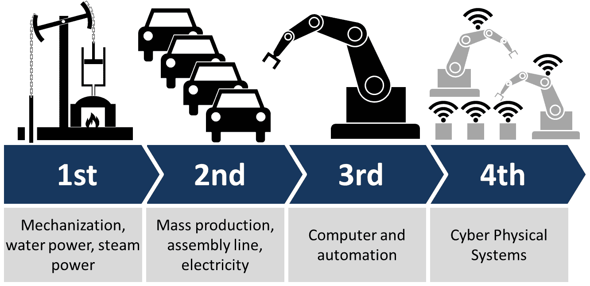
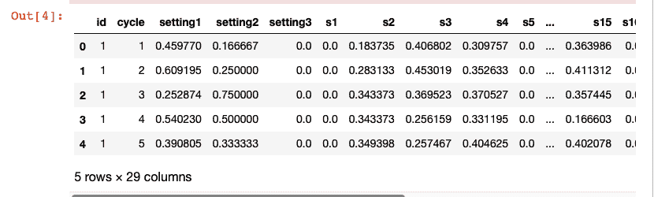
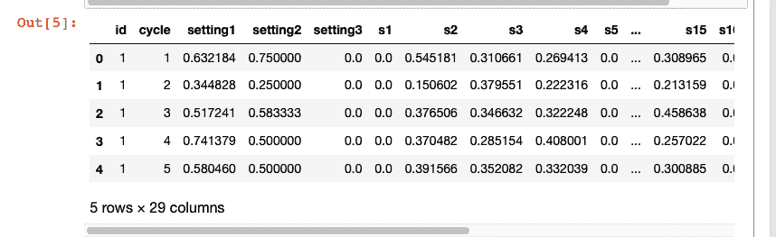
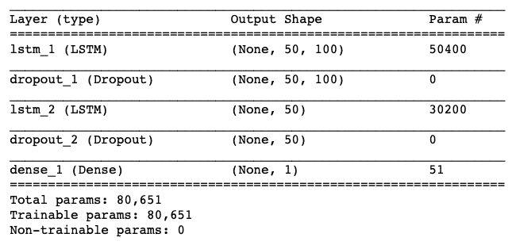
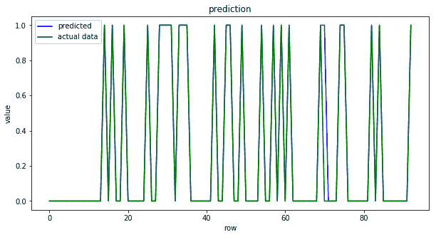
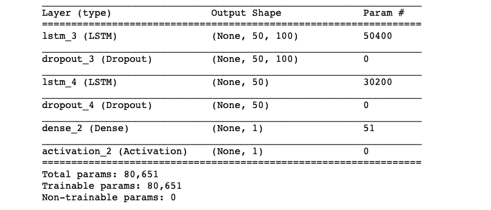
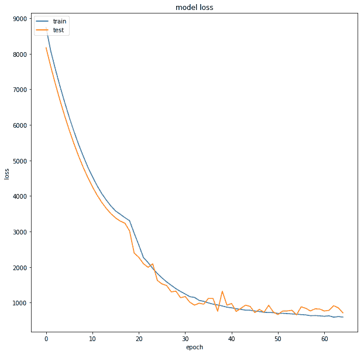
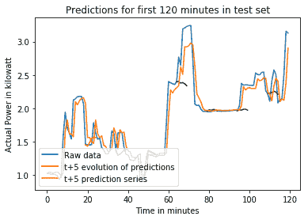

# 第十章：工业物联网的 AI 应用

来自不同背景的公司如今意识到**人工智能**（**AI**）的重要性，因此正在将其纳入到各自的生态系统中。本章重点介绍一些成功的 AI 驱动的**工业物联网**解决方案。到本章结束时，您将涵盖以下内容：

+   AI 驱动的物联网解决方案如何改变行业

+   不同行业提供 AI 驱动的数据分析，以提高生产效率、优化物流和改善客户体验

+   预防性维护

+   基于飞机引擎传感器数据实现预防性维护的代码

+   电力负荷预测

+   实现一个 TensorFlow 代码来执行短期负荷预测

# AI 驱动的工业物联网简介

物联网、机器人技术、大数据和**机器学习**（**ML**）的融合正在为工业企业创造巨大的机遇，也带来了显著的挑战。

低成本传感器、多云平台和强大的边缘基础设施的可用性使得各行业采用 AI 变得更加容易且具有盈利性。这种 AI 驱动的工业物联网正在改变公司提供产品和服务、以及与客户和合作伙伴互动的方式。

AI 驱动的工业物联网的一个有前景的领域是**预防性维护**。直到现在，工业公司通常采用反应式维护方式，即根据固定的时间表进行维护（如每六个月），或者仅在某些设备停止运作时才进行维护。例如，一家物流公司可能会对其车队中的每辆车辆进行半年一次的服务检查，并按计划更换某些部件或整车。这种反应性维护常常浪费时间且费用高昂。应用 AI 算法在问题发生之前预测异常和故障，可以节省大量时间。

另一个 AI 驱动的工业物联网可以实现奇迹的领域是人类与机器人之间的协作。机器人已经是工业物联网生态系统的一部分；它们在生产线和仓库中工作，执行那些特别重复或对人类工人来说危险的任务。目前矿业行业中使用的半自动化卡车、火车和装载机通常是通过预设程序、固定轨道和/或远程人工操作来引导的。

在许多工业场景中，云计算所引入的延迟可能是不可接受的，在这种情况下，需要边缘计算基础设施。

为了让您了解 AI 驱动的工业物联网的普及和应用，以下是一些提供工业物联网服务和解决方案的热门 AI 初创企业名单：

+   **Uptake Technologies Inc**：总部位于芝加哥的初创公司，由 Brad Keywell 于 2014 年共同创立，开发用于监控和分析工业设备实时数据的软件，并利用这些数据提高机械的性能和维护效率。该公司计划将其业务扩展到能源、铁路、石油天然气、矿业和风能等重型行业 ([`www.uptake.com/`](https://www.uptake.com/))。

+   **C3.ai**：由 Thomas Siebel 领导的领先大数据、物联网和人工智能应用提供商，在 Forrester Research 2018 年工业物联网波段报告中被评为物联网平台领导者。公司成立于 2009 年，成功地为能源管理、网络效率、欺诈检测和库存优化等领域的工业提供服务 ([`c3.ai`](https://c3.ai))。

+   **Alluvium**：由*《Machine Learning for Hackers》*的作者 Drew Conway 于 2015 年创立，Alluvium 使用机器学习和人工智能帮助工业公司实现运营稳定并改善生产。他们的旗舰产品 Primer 帮助公司从传感器的原始和精炼数据中识别有用的洞察力，使他们能够在操作故障发生之前预测它们 ([`alluvium.io`](https://alluvium.io))。

+   **Arundo Analytics**：由 Jakob Ramsøy 领导，成立于 2015 年，Arundo Analytics 提供将实时数据与机器学习和其他分析模型相连接的服务。他们的产品可以扩展已部署的模型，创建和管理实时数据管道 ([`www.arundo.com`](https://www.arundo.com))。

+   **Canvass Analytics**：它通过基于实时运营数据的预测分析，帮助企业做出关键的业务决策。Canvass AI 平台从工业设备、传感器和操作系统生成的数百万个数据点中提炼出模式和相关性，从而创造新的洞察力。由 Humera Malik 领导，Canvass Analytics 成立于 2016 年 ([`www.canvass.io`](https://www.canvass.io))。

这还不是结束，像 Amazon 和 Google 这样的软件技术巨头也在物联网领域投入大量资金和基础设施。Google 利用预测建模来降低数据中心成本，而 PayPal 则使用机器学习来发现欺诈交易。

# 一些有趣的应用案例

来自不同背景的大量公司正在意识到将数据分析和人工智能融入其生态系统的重要性和影响。从提高运营、供应链和维护效率到提升员工生产力，再到创建新的商业模式、产品和服务，人工智能已经在各个领域得到了探索。以下，我们列出了一些人工智能驱动物联网在工业中的有趣应用案例：

+   **预测性维护**：在预测性维护中，使用人工智能算法预测设备故障的发生时间。这样，公司可以提前进行维护，从而减少停机时间。在接下来的部分中，我们将详细讨论预防性维护如何帮助行业，以及它可以采取的各种方式。

+   **资产追踪**：也叫**资产管理**，这是一种跟踪关键物理资产的方法。通过跟踪关键资产，公司可以优化物流、维持库存水平并发现任何低效之处。传统上，资产追踪限于在资产上添加 RFID 或条形码，从而跟踪其位置。然而，凭借人工智能算法的支持，现在可以进行更积极的资产追踪。例如，风力发电站可以感知风速、风向甚至温度的变化，并利用这些参数将每台风机调整到最佳方向，以最大化发电量。

+   **车队管理与维护**：运输行业在车队管理中已经使用人工智能约十年，通过优化路线来提高效率。如今，许多低成本传感器的可用性和边缘计算设备的进步使运输公司能够收集并利用这些传感器接收到的数据，不仅能够通过更好的车对车通信和预防性维护优化物流，还能提高安全性。通过安装如困倦检测等系统，因疲劳或分心导致的危险行为能够被检测到，司机会被提醒采取应对措施。

# 使用人工智能的预测性维护

重型机械和设备是任何行业的支柱，和所有物理对象一样，它们会逐渐退化、老化并发生故障。最初，公司通常采取反应式维护，即在设备发生故障后才进行维护。这往往会导致计划外的停机时间。对于任何行业来说，计划外的停机时间都会导致资源紧张，显著降低效率、生产力，进而减少利润。为了解决这些问题，行业开始转向预防性维护。

在预防性维护中，定期按预定的时间间隔进行例行检查。预防性维护要求记录设备及其定期维护计划。第三次工业革命中，计算机引入到工业领域，使得维护和更新这些记录变得更加容易。虽然预防性维护可以避免大多数计划外的停机，但它仍然不是最理想的替代方案，因为定期检查可能会造成不必要的开支。下图展示了四次工业革命的示例：



根据创作共用许可协议共享的图像：([`commons.wikimedia.org/wiki/File:Industry_4.0.png`](https://commons.wikimedia.org/wiki/File:Industry_4.0.png))

当前自动化和数字化的趋势推动了第四次工业革命，也称为**工业 4.0**。这使得企业能够部署**机器对机器**（**M2M**）和**机器对人**（**M2H**）的通信，以及基于 AI 的分析算法，从而实现预测性维护，能够利用历史数据预测设备故障的发生。预测性维护策略极大地简化了企业资源的维护和管理。

预测性维护的主要思想是根据条件监测数据预测设备何时可能发生故障。传感器用于监控设备在正常运行中的状态和性能，依据设备的不同，可能会使用不同类型的传感器。以下是一些常见的条件监测参数/传感器值：

+   振动传感器，主要用于检测泵和电机的错位、不平衡、机械松动或磨损。

+   电流/电压传感器，用于测量供电电机的电流和电压。

+   超声波分析，用于检测管道系统或储罐中的泄漏，或可动部件的机械故障以及电气设备的故障。

+   红外热成像，用于识别温度波动。

+   用于检测液体质量的传感器（例如，在葡萄酒的情况下，传感器用于检测葡萄酒中不同元素的存在）。

实施预测性维护，最重要的是识别需要监控的条件。接着，部署所需的传感器来监控这些条件。最后，收集来自传感器的数据以构建模型。

# 使用长短期记忆（LSTM）进行预测性维护。

为了演示预测性维护，我们将使用 Azure ML 提供的模拟数据（[`gallery.azure.ai/Collection/Predictive-Maintenance-Template-3`](https://gallery.azure.ai/Collection/Predictive-Maintenance-Template-3)）。数据集包含以下三个文件：

+   **训练数据**：包含飞机发动机故障前运行数据。数据下载链接为[`azuremlsamples.azureml.net/templatedata/PM_train.txt`](http://azuremlsamples.azureml.net/templatedata/PM_train.txt)。

+   **测试数据**：包含没有故障事件记录的飞机发动机运行数据。数据可以通过以下链接加载：[`azuremlsamples.azureml.net/templatedata/PM_test.txt`](http://azuremlsamples.azureml.net/templatedata/PM_test.txt)。

+   **真实数据**：此处提供了测试数据中每个发动机的真实剩余周期信息。真实数据的链接为[`azuremlsamples.azureml.net/templatedata/PM_truth.txt`](http://azuremlsamples.azureml.net/templatedata/PM_truth.txt)。

根据数据源提供的数据描述，训练数据（`train_FD001.txt`）由多个多变量时间序列组成，以周期作为时间单位，每个周期有 21 个传感器读数。可以假设每个时间序列是从不同的相同类型引擎生成的。假定每个引擎在开始时具有不同程度的初始磨损和制造差异，这些信息未知于用户。在这些模拟数据中，引擎被假定在每个时间序列开始时正常运行。在一定时间段内开始退化，退化进展并增加幅度。当达到预定义的阈值时，引擎被认为不再适合继续操作。换句话说，每个时间序列中的最后一个周期可以视为相应引擎的故障点。以样本训练数据为例，`id=1` 的引擎在周期 `192` 失败，而 `id=2` 的引擎在周期 `287` 失败。

测试数据（`test_FD001.txt`）与训练数据具有相同的数据结构。唯一的区别在于数据不指示故障发生的时间点（换句话说，最后一个时间段不表示故障点）。以样本测试数据为例，`id=1` 的引擎从周期 `1` 运行到周期 `31`。未显示该引擎在故障前还能运行多少个周期。

地面真实数据（`RUL_FD001.txt`）提供了测试数据中引擎剩余工作周期的数量。以示例地面真实数据为例，测试数据中 `id=1` 的引擎在故障前可以再运行 `112` 个周期。

由于这是时间序列数据，我们将使用**长短期记忆网络**（**LSTM**）来分类引擎在某个时间段内是否会失败。这里呈现的代码基于 Umberto Griffo 提供的实现，GitHub 链接如下：（[`github.com/umbertogriffo/Predictive-Maintenance-using-LSTM`](https://github.com/umbertogriffo/Predictive-Maintenance-using-LSTM)）：

1.  实施预测性维护所需的模块在第一步导入。我们还为随机计算设置种子，以便结果可重现：

```py
import keras
import pandas as pd
import numpy as np
import matplotlib.pyplot as plt
import os

# Setting seed for reproducibility
np.random.seed(1234) 
PYTHONHASHSEED = 0

from sklearn import preprocessing
from sklearn.metrics import confusion_matrix, recall_score, precision_score
from keras.models import Sequential,load_model
from keras.layers import Dense, Dropout, LSTM
```

1.  让我们读取数据并分配列名，如下所示的代码：

```py
# read training data - It is the aircraft engine run-to-failure data.
train_df = pd.read_csv('PM_train.txt', sep=" ",
         header=None)
train_df.drop(train_df.columns[[26, 27]], 
        axis=1, 
        inplace=True)
train_df.columns = ['id', 'cycle', 'setting1',
         'setting2', 'setting3', 's1', 's2',
         's3', 's4', 's5', 's6', 's7', 's8',
         's9', 's10', 's11', 's12', 's13', 
        's14', 's15', 's16', 's17', 's18', 
        's19', 's20', 's21']

train_df = train_df.sort_values(['id','cycle'])

# read test data - It is the aircraft engine operating data without failure events recorded.
test_df = pd.read_csv('PM_test.txt', 
        sep=" ", header=None)
test_df.drop(test_df.columns[[26, 27]], 
        axis=1, 
        inplace=True)
test_df.columns = ['id', 'cycle', 'setting1', 
        'setting2', 'setting3', 's1', 's2', 's3',
         's4', 's5', 's6', 's7', 's8', 's9', 
        's10', 's11', 's12', 's13', 's14',
         's15', 's16', 's17', 's18', 's19', 
        's20', 's21']

# read ground truth data - It contains the information of true remaining cycles for each engine in the testing data.
truth_df = pd.read_csv('PM_truth.txt', 
        sep=" ", 
        header=None)
truth_df.drop(truth_df.columns[[1]], 
        axis=1, 
        inplace=True)
```

1.  作为第一步，我们预测引擎在某个时间段内是否会失败，因此我们的标签将是 `1` 或 `0`，即这将是一个二元分类问题。为了创建二元标签，我们预处理数据并创建一个新的**剩余寿命**（**RUL**）标签。我们还创建一个名为 `label1` 的二元变量，指示特定引擎是否会在 `w1` 个周期内失败。最后，数据（非传感器）被归一化，如下所示：

```py
# Data Labeling - generate column RUL(Remaining Usefull Life or Time to Failure)
rul = pd.DataFrame(train_df.groupby('id')
        ['cycle'].max()).reset_index()
rul.columns = ['id', 'max']
train_df = train_df.merge(rul, 
        on=['id'], 
        how='left')
train_df['RUL'] = train_df['max'] -     train_df['cycle']
train_df.drop('max', 
        axis=1, 
        inplace=True)

# Let us generate label columns for training data
# we will only use "label1" for binary classification, 
# The question: is a specific engine going to fail within w1 cycles?
w1 = 30
w0 = 15
train_df['label1'] = np.where(train_df['RUL'] <= w1, 1, 0 )

# MinMax normalization (from 0 to 1)
train_df['cycle_norm'] = train_df['cycle']
cols_normalize = train_df.columns.difference
        (['id','cycle','RUL','label1'])
min_max_scaler = preprocessing.MinMaxScaler()
norm_train_df = pd.DataFrame(min_max_scaler.
        fit_transform(train_df[cols_normalize]), 
        columns=cols_normalize, 
        index=train_df.index)
join_df = train_df[train_df.columns.
        difference(cols_normalize)].
        join(norm_train_df)
train_df = join_df.reindex(columns = train_df.columns)

train_df.head()
```



1.  对测试数据集执行类似的预处理操作，唯一的变化是——RUL 值是从真实数据中获取的：

```py
# MinMax normalization (from 0 to 1)
test_df['cycle_norm'] = test_df['cycle']
norm_test_df = pd.DataFrame(
        min_max_scaler.
        transform(test_df[cols_normalize]), 
        columns=cols_normalize,     
         index=test_df.index)
test_join_df = test_df[test_df.
        columns.difference(cols_normalize)].
        join(norm_test_df)
test_df = test_join_df.
        reindex(columns = test_df.columns)
test_df = test_df.reset_index(drop=True)

# We use the ground truth dataset to generate labels for the test data.
# generate column max for test data
rul = pd.DataFrame(test_df.
        groupby('id')['cycle'].max()).
        reset_index()
rul.columns = ['id', 'max']
truth_df.columns = ['more']
truth_df['id'] = truth_df.index + 1
truth_df['max'] = rul['max'] + truth_df['more']
truth_df.drop('more', 
        axis=1, 
        inplace=True)

# generate RUL for test data
test_df = test_df.merge(truth_df, 
        on=['id'], how='left')
test_df['RUL'] = test_df['max'] - test_df['cycle']
test_df.drop('max', 
        axis=1, 
        inplace=True)

# generate label columns w0 and w1 for test data
test_df['label1'] = np.where
        (test_df['RUL'] <= w1, 1, 0 )
test_df.head()
```



1.  由于我们使用 LSTM 进行时间序列建模，我们创建了一个函数，该函数将根据窗口大小生成要输入 LSTM 的序列。我们选择的窗口大小为`50`。我们还需要一个函数来生成相应的标签：

```py
# function to reshape features into 
# (samples, time steps, features) 
def gen_sequence(id_df, seq_length, seq_cols):
    """ Only sequences that meet the window-length
    are considered, no padding is used. This 
    means for testing we need to drop those which 
    are below the window-length. An alternative
    would be to pad sequences so that
    we can use shorter ones """

    # for one id we put all the rows in a single matrix
    data_matrix = id_df[seq_cols].values
    num_elements = data_matrix.shape[0]
    # Iterate over two lists in parallel.
    # For example id1 have 192 rows and 
    # sequence_length is equal to 50
    # so zip iterate over two following list of 
    # numbers (0,112),(50,192)
    # 0 50 -> from row 0 to row 50
    # 1 51 -> from row 1 to row 51
    # 2 52 -> from row 2 to row 52
    # ...
    # 111 191 -> from row 111 to 191
    for start, stop in zip(range(0, num_elements-seq_length), range(seq_length, num_elements)):
        yield data_matrix[start:stop, :]

def gen_labels(id_df, seq_length, label):
    # For one id we put all the labels in a 
    # single matrix.
    # For example:
    # [[1]
    # [4]
    # [1]
    # [5]
    # [9]
    # ...
    # [200]] 
    data_matrix = id_df[label].values
    num_elements = data_matrix.shape[0]
    # I have to remove the first seq_length labels
    # because for one id the first sequence of 
    # seq_length size have as target
    # the last label (the previus ones are 
    # discarded).
    # All the next id's sequences will have 
    # associated step by step one label as target. 
    return data_matrix[seq_length:num_elements, :]
```

1.  现在让我们为我们的数据生成训练序列和对应的标签，代码如下：

```py
# pick a large window size of 50 cycles
sequence_length = 50

# pick the feature columns 
sensor_cols = ['s' + str(i) for i in range(1,22)]
sequence_cols = ['setting1', 'setting2', 
        'setting3', 'cycle_norm']
sequence_cols.extend(sensor_cols)

# generator for the sequences
seq_gen = (list(gen_sequence
        (train_df[train_df['id']==id], 
        sequence_length, sequence_cols)) 
        for id in train_df['id'].unique())

# generate sequences and convert to numpy array
seq_array = np.concatenate(list(seq_gen)).
        astype(np.float32)
print(seq_array.shape)

# generate labels
label_gen = [gen_labels(train_df[train_df['id']==id], 
        sequence_length, ['label1']) 
        for id in train_df['id'].unique()]
label_array = np.concatenate(label_gen).
        astype(np.float32)
print(label_array.shape)
```

1.  我们现在构建一个包含两个 LSTM 层和一个全连接层的 LSTM 模型。该模型用于二分类训练，因此它尝试减少二元交叉熵损失。我们使用`Adam`优化器来更新模型参数：

```py
nb_features = seq_array.shape[2]
nb_out = label_array.shape[1]

model = Sequential()

model.add(LSTM(
     input_shape=(sequence_length, nb_features),
     units=100,
     return_sequences=True))
model.add(Dropout(0.2))

model.add(LSTM(
     units=50,
     return_sequences=False))
model.add(Dropout(0.2))

model.add(Dense(units=nb_out,
     activation='sigmoid'))
model.compile(loss='binary_crossentropy', 
    optimizer='adam', 
    metrics=['accuracy'])

print(model.summary())
```



1.  我们训练模型，结果如下所示：

```py
history = model.fit(seq_array, label_array, 
        epochs=100, batch_size=200, 
        validation_split=0.05, verbose=2,
         callbacks = [keras.callbacks.
            EarlyStopping(monitor='val_loss', 
            min_delta=0, patience=10, 
            verbose=0, mode='min'),
        keras.callbacks.
            ModelCheckpoint
            (model_path,monitor='val_loss',     
            save_best_only=True, 
            mode='min', verbose=0)])    
```

1.  经过训练的模型在测试数据集上的准确率为 98%，在验证数据集上的准确率为 98.9%。精度值为`0.96`，召回率为`1.0`，F1 分数为`0.98`。不错吧！下图显示了训练模型的这些结果：



我们可以使用相同的数据来预测飞机发动机的 RUL 值，也就是预测发动机的故障时间。这将是一个回归问题，我们现在可以使用 LSTM 模型进行回归。最初的步骤将与之前相同，但从第五步开始会有所变化。虽然生成的输入数据序列将与之前保持一致，但目标将不再是二进制标签，而是使用 RUL 作为回归模型的目标：

1.  我们使用相同的`gen_labels()`函数创建目标值。我们还使用`gen_sequence()`函数创建了一个验证集：

```py
# generate labels
label_gen = [gen_labels(train_df[train_df['id']==id],
        sequence_length, ['RUL']) 
        for id in train_df['id'].unique()]
label_array = np.concatenate(label_gen).astype(np.float32)

# val is a list of 192 - 50 = 142 bi-dimensional array 
# (50 rows x 25 columns)
val=list(gen_sequence(train_df[train_df['id']==1], 
        sequence_length, sequence_cols))
```

1.  创建一个 LSTM 模型。我们在训练过程中使用`r2`作为评估指标，因此我们使用 Keras 的自定义指标功能和我们自己的指标函数：

```py
def r2_keras(y_true, y_pred):
     """Coefficient of Determination 
     """
     SS_res = K.sum(K.square( y_true - y_pred ))
     SS_tot = K.sum(K.square( y_true - K.mean(y_true) ) )
     return ( 1 - SS_res/(SS_tot + K.epsilon()) )

# Next, we build a deep network. 
# The first layer is an LSTM layer with 100 units followed by 
# another LSTM layer with 50 units. 
# Dropout is also applied after each LSTM layer to control 
# overfitting. 
# Final layer is a Dense output layer with single unit and linear 
# activation since this is a regression problem.
nb_features = seq_array.shape[2]
nb_out = label_array.shape[1]

model = Sequential()
model.add(LSTM(
     input_shape=(sequence_length, nb_features),
     units=100,
     return_sequences=True))
model.add(Dropout(0.2))
model.add(LSTM(
     units=50,
     return_sequences=False))
model.add(Dropout(0.2))
model.add(Dense(units=nb_out))
model.add(Activation("linear"))
model.compile(loss='mean_squared_error', optimizer='rmsprop',metrics=['mae',r2_keras])

print(model.summary())
```



1.  在训练数据集上训练模型，结果如下所示：

```py
# fit the network
history = model.fit(seq_array, label_array, epochs=100, 
    batch_size=200, validation_split=0.05, verbose=2,
    callbacks = [keras.callbacks.EarlyStopping
    (monitor='val_loss', min_delta=0, patience=10, 
    verbose=0, mode='min'),
    keras.callbacks.ModelCheckpoint
    (model_path,monitor='val_loss', 
    save_best_only=True, mode='min', 
    verbose=0)])
```

1.  训练后的模型在测试数据集上提供了`r2`值为 0.80，在验证数据集上为 0.72。我们可以通过超参数调优来改善我们的结果。接下来，您可以看到训练过程中训练和验证数据集的损失：



要运行此代码，请确保您的 TensorFlow 版本为 1.4 及以上，Keras 版本为 2.1.2。如果您的 Keras 版本更高，请首先使用`pip uninstall keras`卸载它，然后使用`pip install keras==2.1.2`重新安装。

完整的代码，包括二分类和回归模型，已上传至 GitHub 仓库，`Chapter10/Predictive_Maintenance_using_LSTM.ipynb`。我们还可以创建一个模型，确定故障是否会在不同的时间窗口发生，例如，故障发生在窗口*(1,w[0])*或窗口(*w[0+1], w[1]*)天内，依此类推。这将变成一个多分类问题，数据需要相应地进行预处理。你可以在 Azure AI Gallery 中阅读更多关于这个预测性维护模板的信息：[`gallery.azure.ai/Experiment/Predictive-Maintenance-Step-2A-of-3-train-and-evaluate-regression-models-2`](https://gallery.azure.ai/Experiment/Predictive-Maintenance-Step-2A-of-3-train-and-evaluate-regression-models-2)。

# 预测性维护的优缺点

根据 GE 的一份调查报告（[`www.gemeasurement.com/sites/gemc.dev/files/ge_the_impact_of_digital_on_unplanned_downtime_0.pdf`](https://www.gemeasurement.com/sites/gemc.dev/files/ge_the_impact_of_digital_on_unplanned_downtime_0.pdf)），停机时间会对石油和天然气行业的性能产生负面影响。这不仅仅是石油和天然气行业，所有行业都是如此。因此，为了减少停机时间，提高效率，采用预测性维护至关重要。然而，建立预测性维护系统的成本相当高，但一旦预测性维护系统建立得当，它有助于提供多个具有成本效益的好处，例如：

+   最小化设备维护所需的时间

+   最小化因维护而丧失的生产时间

+   最后，备件成本也得到了最小化

成功的预测性维护可以在积极的方面重塑整个公司

# 工业中的电力负荷预测

电力目前是国内和工业领域最重要的能源载体。由于与燃料不同，电力难以存储且存储成本高，因此需要精确地将电力的生成与需求进行耦合。因此，电力负荷预测至关重要。根据时间范围（预测范围），电力负荷预测可分为以下三类：

+   **短期负荷预测**：预测的时间范围为一小时到几周

+   **中期负荷预测**：预测持续时间从几周到几个月不等

+   **长期负荷预测**：在这里，预测从几个月到几年

根据需求和应用，可能需要规划其中一个或所有之前的负荷预测类别。近年来，**短期负荷预测**（**STLF**）领域进行了大量的研究工作。STLF 能够通过提供准确的未来负荷预测手段来帮助工业界，从而有助于精确规划、降低运营成本，进而提高利润并提供更可靠的电力供应。STLF 基于历史数据（通过智能电表获取）和预测的天气条件，预测未来的能源需求。

负荷预测问题是一个回归问题。它可以作为时间序列问题或静态模型进行建模。将负荷预测建模为时间序列数据是最常见的选择。使用时间序列建模，我们可以使用标准的机器学习时间序列模型，如 ARIMA，或者我们可以利用深度学习模型，如循环神经网络和 LSTM。

有关电力负荷预测中使用的各种策略和模型的全面回顾，请参考这篇论文：

Fallah, S., Deo, R., Shojafar, M., Conti, M., and Shamshirband, S. (2018). *智能能源管理网格中的能源负荷预测的计算智能方法：现状、未来挑战和研究方向*。Energies, 11(3), 596。

# 使用 LSTM 进行 STLF

在这里，我们展示了使用 LSTM 进行短期负荷预测的代码。用于训练和测试的数据来自 UCI ML 网站([`archive.ics.uci.edu/ml/datasets/Individual+household+electric+power+consumption#`](https://archive.ics.uci.edu/ml/datasets/Individual+household+electric+power+consumption#))。STLF 的代码已从 GitHub 进行适配([`github.com/demmojo/lstm-electric-load-forecast`](https://github.com/demmojo/lstm-electric-load-forecast))：

1.  我们导入必要的模块并设置随机种子，代码如下所示：

```py
import time
from keras.layers import LSTM
from keras.layers import Activation, Dense, Dropout
from keras.models import Sequential, load_model
from numpy.random import seed

from tensorflow import set_random_seed
set_random_seed(2) # seed random numbers for Tensorflow backend
seed(1234) # seed random numbers for Keras
import numpy as np
import csv
import matplotlib.pyplot as plt

%matplotlib inline
```

1.  定义加载数据并将其转换为适合 LSTM 输入的序列的工具函数：

```py
def load_data(dataset_path, sequence_length=60, prediction_steps=5, ratio_of_data=1.0):
    # 2075259 is the total number of measurements 
    # from Dec 2006 to Nov 2010
    max_values = ratio_of_data * 2075259

    # Load data from file
    with open(dataset_path) as file:
        data_file = csv.reader(file, delimiter=";")
        power_consumption = []
        number_of_values = 0
        for line in data_file:
            try:
                power_consumption.append(float(line[2]))
                number_of_values += 1
            except ValueError:
                pass

            # limit data to be considered by 
            # model according to max_values
            if number_of_values >= max_values: 
                break

    print('Loaded data from csv.')
    windowed_data = []
    # Format data into rolling window sequences
    # for e.g: index=0 => 123, index=1 => 234 etc.
    for index in range(len(power_consumption) - sequence_length): 
            windowed_data.append(
            power_consumption[
            index: index + sequence_length])

    # shape (number of samples, sequence length)
    windowed_data = np.array(windowed_data)

    # Center data
    data_mean = windowed_data.mean()
    windowed_data -= data_mean
    print('Center data so mean is zero 
            (subtract each data point by mean of value: ', 
            data_mean, ')')
    print('Data : ', windowed_data.shape)

    # Split data into training and testing sets
    train_set_ratio = 0.9
    row = int(round(train_set_ratio * windowed_data.shape[0]))
    train = windowed_data[:row, :]

    # remove last prediction_steps from train set
    x_train = train[:, :-prediction_steps] 
    # take last prediction_steps from train set
    y_train = train[:, -prediction_steps:] 
    x_test = windowed_data[row:, :-prediction_steps]

    # take last prediction_steps from test set
    y_test = windowed_data[row:, -prediction_steps:] 

    x_train = np.reshape(x_train, 
            (x_train.shape[0], x_train.shape[1], 1))
    x_test = np.reshape(x_test, 
            (x_test.shape[0], x_test.shape[1], 1))

    return [x_train, y_train, x_test, y_test, data_mean]
```

1.  构建 LSTM 模型，我们所构建的模型包含两个 LSTM 层和一个全连接层：

```py
def build_model(prediction_steps):
    model = Sequential()
    layers = [1, 75, 100, prediction_steps]
    model.add(LSTM(layers[1], 
        input_shape=(None, layers[0]), 
        return_sequences=True)) # add first layer
    model.add(Dropout(0.2)) # add dropout for first layer
    model.add(LSTM(layers[2], 
        return_sequences=False)) # add second layer
    model.add(Dropout(0.2)) # add dropout for second layer
    model.add(Dense(layers[3])) # add output layer
    model.add(Activation('linear')) # output layer 
    start = time.time()
    model.compile(loss="mse", optimizer="rmsprop")
    print('Compilation Time : ', time.time() - start)
    return model
```

1.  训练模型，代码如下所示：

```py
def run_lstm(model, sequence_length, prediction_steps):
    data = None
    global_start_time = time.time()
    epochs = 1
    ratio_of_data = 1 # ratio of data to use from 2+ million data points
    path_to_dataset = 'data/household_power_consumption.txt'

    if data is None:
        print('Loading data... ')
        x_train, y_train, x_test, y_test, result_mean = load_data(path_to_dataset, sequence_length,
                                                                  prediction_steps, ratio_of_data)
    else:
        x_train, y_train, x_test, y_test = data

    print('\nData Loaded. Compiling...\n')

    model.fit(x_train, y_train, batch_size=128, epochs=epochs, validation_split=0.05)
    predicted = model.predict(x_test)
    # predicted = np.reshape(predicted, (predicted.size,))
    model.save('LSTM_power_consumption_model.h5') # save LSTM model

    plot_predictions(result_mean, prediction_steps, predicted, y_test, global_start_time)

    return None

sequence_length = 10 # number of past minutes of data for model to consider
prediction_steps = 5 # number of future minutes of data for model to predict
model = build_model(prediction_steps)
run_lstm(model, sequence_length, prediction_steps)
```

1.  从以下图表中，我们可以看到我们的模型做出了良好的预测：



完整的代码可以在 GitHub 上找到：`Chapter10/Electrical_load_Forecasting.ipynb`。

# 总结

在这一章中，我们看到，AI 驱动的物联网对工业界产生了重大影响。从制造业、物流、农业、采矿到新产品和服务的创造，AI 触及了各个领域。我们可以合理假设，AI 驱动的工业物联网将改变并颠覆当前的商业流程和模式，带来更好的发展。

下一章将展示 AI 和物联网如何帮助塑造更好的城市。
