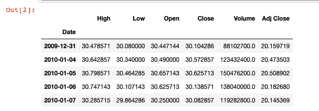
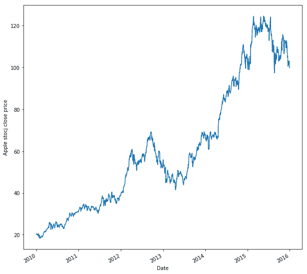
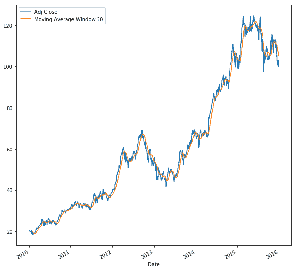
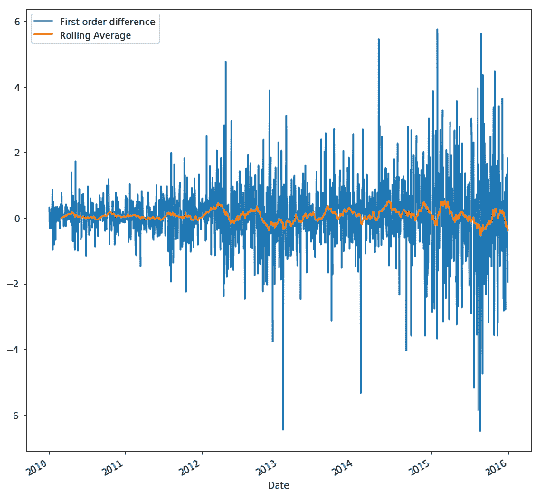
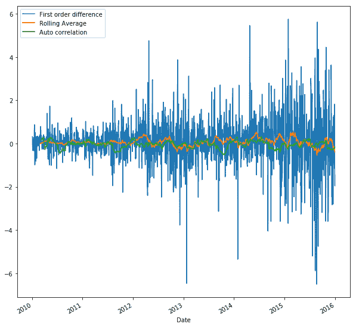
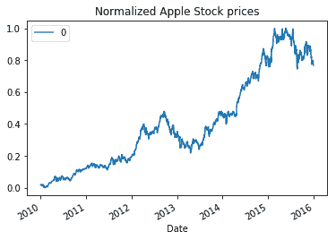
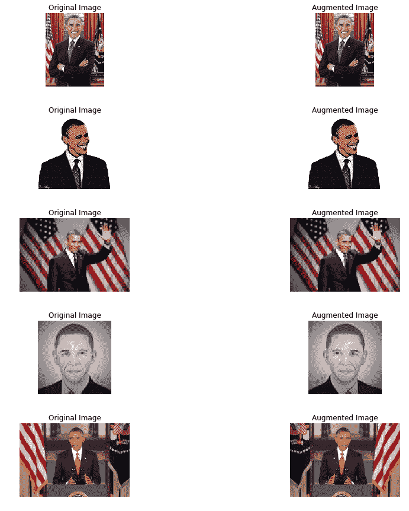
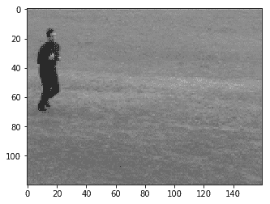
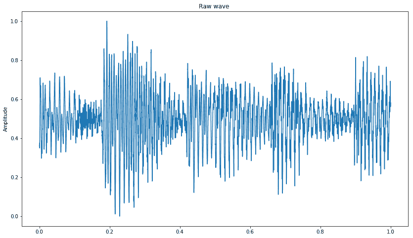
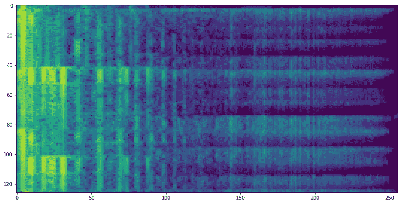

# 第十二章：综合所有内容

现在，我们已经理解并实现了不同的**人工智能**（**AI**）/**机器学习**（**ML**）算法，是时候将它们结合起来，了解每种算法最适合哪种类型的数据，并同时理解每种数据类型所需的基本预处理。在本章结束时，你将了解以下内容：

+   可以输入模型的不同类型数据

+   如何处理时间序列数据

+   文本数据的预处理

+   可以对图像数据进行的不同转换

+   如何处理视频文件

+   如何处理语音数据

+   云计算选项

# 处理不同类型的数据

数据有各种各样的形式、大小和类型：推文、每日股价、每分钟的心跳信号、相机拍摄的照片、通过 CCTV 获取的视频、音频录音等。每种数据都包含信息，当这些数据经过正确的处理并与合适的模型结合使用时，我们可以分析这些数据，并获得关于潜在模式的高级信息。在本节中，我们将介绍每种数据类型在输入模型之前所需的基本预处理，以及可以使用的模型。

# 时间序列建模

时间是许多有趣的人类行为的基础，因此，AI 驱动的物联网系统必须知道如何处理时间相关的数据。时间可以显式地表示，例如，通过定期捕获数据，其中时间戳也是数据的一部分，或者隐式地表示，例如，在语音或书面文本中。能够捕捉时间相关数据中固有模式的方法称为**时间序列建模**。

在定期间隔捕获的数据是时间序列数据，例如，股价数据就是时间序列数据。让我们来看一下苹果股票价格数据；这些数据可以从 NASDAQ 网站下载（[`www.nasdaq.com/symbol/aapl/historical`](https://www.nasdaq.com/symbol/aapl/historical)）。或者，你可以使用`pandas_datareader`模块直接下载数据，通过指定数据源来实现。要在你的工作环境中安装`pandas_datareader`，可以使用以下命令：

```py
pip install pandas_datareader
```

1.  以下代码从 2010 年 1 月 1 日到 2015 年 12 月 31 日，从 Yahoo Finance 下载苹果公司股票价格：

```py
import datetime
from pandas_datareader import DataReader
%matplotlib inline

Apple = DataReader("AAPL", "yahoo", 
        start=datetime.datetime(2010, 1, 1), 
        end=datetime.datetime(2015,12,31)) 
Apple.head()
```

1.  下载的 DataFrame 提供了每个工作日的`High`、`Low`、`Open`、`Close`、`Volume`和`Adj Close`值：



1.  现在我们来绘制图表，如下所示：

```py
close = Apple['Adj Close']
plt.figure(figsize= (10,10))
close.plot()
plt.ylabel("Apple stocj close price")
plt.show()
```



要能够建模时间序列数据，我们需要识别几个要素：趋势、季节性和稳定性。

1.  **趋势**是指找出在平均情况下，测量值是否随着时间的推移而减少（或增加）。找到趋势最常见的方法是绘制移动平均，如下所示：

```py
moving_average = close.rolling(window=20).mean()

plt.figure(figsize= (10,10))
close.plot(label='Adj Close')
moving_average.plot(label='Moving Average Window 20')
plt.legend(loc='best')
plt.show()
```



1.  我们可以看到，使用窗口为 20，上升和下降趋势。 对于时间序列建模，我们应该去趋势化数据。 去趋势化可以通过从原始信号中减去趋势（移动平均值）来完成。 另一种流行的方法是使用一阶差分方法，即取相邻数据点之间的差异：

```py
fod = close.diff()
plt.figure(figsize= (10,10))
fod.plot(label='First order difference')
fod.rolling(window=40).mean().\
        plot(label='Rolling Average')
plt.legend(loc='best')
plt.show()
```



1.  **季节性**是与时间相关的高低规律重复出现的模式（例如，正弦系列）。 最简单的方法是在数据中找到自相关。 找到季节性后，您可以通过将数据差分到与季节长度相对应的时间滞来移除它：

```py
# Autocorrelation
plt.figure(figsize= (10,10))
fod.plot(label='First order difference')
fod.rolling(window=40).mean().\
        plot(label='Rolling Average')
fod.rolling(window=40).corr(fod.shift(5)).\
        plot(label='Auto correlation')
plt.legend(loc='best')
plt.show()
```



1.  最后一件事是确保系列是否**平稳**，即系列的均值不再是时间的函数。 数据的平稳性对于时间序列建模至关重要。 我们通过消除数据中存在的任何趋势或季节性来实现平稳性。 一旦数据平稳，我们可以使用回归模型对其进行建模。

传统上，时间序列数据是使用自回归和移动平均模型（如 ARMA 和 ARIMA）进行建模的。 要了解更多关于时间序列建模的信息，感兴趣的读者可以参考这些书籍：

+   Pandit, S. M., and Wu, S. M. (1983). *带应用的时间序列与系统分析*(Vol. 3). 纽约：约翰·威利。

+   Brockwell, P. J., Davis, R. A., and Calder, M. V. (2002). *时间序列和预测简介*(Vol. 2). 纽约：斯普林格出版社。

对于任何时间序列数据，平稳性都是一个重要的特性，无论您是使用传统的时间序列建模还是深度学习模型。 这是因为，如果一个系列具有平稳性（即使是弱平稳性），那么它意味着数据在时间上具有相同的分布，因此可以在时间上进行估计。 如果您计划使用诸如 RNN 或 LSTM 之类的深度学习模型，则在确认时间序列的平稳性后，此外，您需要对数据进行归一化，并使用滑动窗口转换将系列转换为输入-输出对，以便进行回归。 使用 scikit-learn 库和 NumPy 可以非常容易地完成这一操作：

1.  让我们对`close` DataFrame 进行归一化。 归一化确保数据位于`0`和`1`之间。 请注意，以下图与前述*步骤 3*中`close` DataFrame 的图表相同，但*y*轴比例现在不同：

```py
# Normalization
from sklearn.preprocessing import MinMaxScaler
def normalize(data):
    x = data.values.reshape(-1,1)
    pre_process = MinMaxScaler()
    x_normalized = pre_process.fit_transform(x)
    return x_normalized

x_norm = normalize(close)

plt.figure(figsize= (10,10))
pd.DataFrame(x_norm, index = close.index).plot(label="Normalized Stock prices")
plt.legend(loc='best')
plt.show()
```



1.  我们定义了一个`window_transform()`函数，它将数据系列转换为一系列输入-输出对。 例如，您想构建一个 RNN，该 RNN 将前五个值作为输出，并预测第六个值。 然后，您选择`window_size = 5`：

```py
# Create window from the normalized data
def window_transform(series, window_size):
    X = []
    y = []

    # Generate a sequence input/output pairs from series
    # x= <s1,s2,s3,s4,s5,... s_n> y = s_n+1 and so on
    for i in range(len(series) - window_size):
    X.append(series[i:i+window_size])
    y.append(series[i+window_size])

    # reshape each 
    X = np.asarray(X)
    X.shape = (np.shape(X)[0:2])
    y = np.asarray(y)
    y.shape = (len(y),1)

    return X,y

window_size = 7
X,y = window_transform(x_norm,window_size = window_size)
```

请参阅 GitHub 存储库，`Chapter-12/time_series_data_preprocessing.ipynb`，查看本节的完整代码。

# 预处理文本数据

语言在我们日常生活中扮演着非常重要的角色。对我们来说，阅读书面文本是非常自然的，但计算机呢？它们能读取文本吗？我们能让深度学习模型根据旧的模式生成新的文本吗？例如，如果我说，“昨天，我在星巴克喝了 ____”，我们大多数人都能猜出空白处是“咖啡”，但是我们的深度学习模型能做到吗？答案是肯定的；我们可以训练我们的深度学习模型来猜测下一个词（或字符）。然而，深度学习模型运行在计算机上，而计算机只理解二进制，只有 0 和 1。因此，我们需要一种方法来处理文本数据，以便将其转换为计算机易于处理的形式。此外，尽管“cat”、“CAT”和“Cat”有不同的 ASCII 表示，但它们表示的意思相同；这对我们来说很容易理解，但要让模型将它们视为相同，我们需要对文本数据进行预处理。本节将列出文本数据的必要预处理步骤，您将学习如何在 Python 中实现：

1.  在这一节中，我们将考虑来自我最喜欢的科幻小说《基地》的小段文本，作者是艾萨克·阿西莫夫。该文本位于`foundation.txt`文件中。第一步是，读取文本：

```py
f = open('foundation.txt')
text = f.read()
print(text)
```

1.  文本处理的下一步是清洗数据。我们保留文本中相关的部分。在大多数情况下，标点符号不会为文本增加额外的含义，因此我们可以放心地将其去除：

```py
# clean data
import re
# remove Punctuation
text = re.sub(r"[^a-zA-Z0-9]", " ", text) 
print(text)
```

1.  清洗数据后，我们需要对文本进行规范化处理。在文本处理过程中，规范化文本意味着将所有文本转换为相同的大小写，通常是小写。为了遵循惯例，我们将文本转换为小写：

```py
# Normalize text
# Convert to lowercase
text = text.lower() 
print(text)
```

1.  一旦文本被规范化，下一步是对文本进行分词。我们可以将文本分割为单词令牌或句子令牌。为了做到这一点，您可以使用`split`函数，或者使用功能强大的 NLTK 模块。如果您的系统中没有安装 NLTK，可以通过`pip install nltk`进行安装。在接下来的例子中，我们使用 NLTK 的单词分词器来完成这项任务：

```py
import os
import nltk
nltk.download('punkt') 
from nltk.tokenize import word_tokenize

# Split text into words using NLTK
words_nltk = word_tokenize(text)
print(words_nltk)
```

1.  根据您拥有的文本类型和所做的工作，您可能需要去除停用词。停用词是出现在大多数文本样本中的词，因此不会为文本的上下文或意义增加任何信息。例如，the、a 和 an。您可以声明自己的停用词，也可以使用 NLTK 提供的停用词。在这里，我们从文本中移除`english`语言的`stopwords`：

```py
from nltk.corpus import stopwords
nltk.download('stopwords')
#Remove stop words
words = [w for w in words \
        if w not in stopwords.words("english")]

```

1.  另一个可以在文本数据上进行的操作是词干提取和词形还原。这些操作用于将单词转换为规范形式：

```py
from nltk.stem.porter import PorterStemmer

# Reduce words to their stems
stemmed = [PorterStemmer().stem(w) for w in words]
print(stemmed)

from nltk.stem.wordnet import WordNetLemmatizer

# Reduce words to their root form
lemmed = [WordNetLemmatizer().lemmatize(w) for w in words]
print(lemmed)
```

您可以通过 GitHub 访问包含此代码的笔记本：`Chapter12/text_processing.ipynb`。

# 图像数据增强

Python 有 OpenCV，它为图像提供了非常好的支持。OpenCV 可以从 Conda 通道和 PyPi 下载安装。一旦使用 OpenCV 的`imread()`函数读取图像，图像就表示为一个数组。如果图像是彩色的，则通道以 BGR 顺序存储。数组中的每个元素表示相应像素值的强度（这些值的范围在 0 到 255 之间）。

假设你已经训练了一个模型来识别一个球：你给它展示一个网球，它能识别为球。接下来我们展示的这张球的图像是在缩放之后拍摄的：我们的模型还能识别它吗？一个模型的效果取决于它所训练的数据集，因此，如果模型在训练时看到了缩放后的图像，它将很容易识别出缩放后的球是一个球。一种确保数据集中有这些图像的方法是隐式地包含这些变化图像，然而，由于图像是作为数组表示的，我们可以进行数学变换来重新缩放、翻转、旋转，甚至改变强度。在现有训练图像上执行这些变换以生成新图像的过程叫做**数据增强**。使用数据增强的另一个好处是，您可以增加训练数据集的大小（当与数据生成器一起使用时，我们可以获得无限的图像）。

大多数深度学习库都提供了标准的 API 来进行数据增强。在 Keras（[`keras.io/preprocessing/image/`](https://keras.io/preprocessing/image/)）中，有`ImageDataGenerator`，在 TensorFlow-TfLearn 中，我们有`ImageAugmentation`。TensorFlow 也有操作符来执行图像转换和变换（[`www.tensorflow.org/api_guides/python/image`](https://www.tensorflow.org/api_guides/python/image)）。在这里，我们将看看如何使用 OpenCV 强大的库进行数据增强，并创建我们自己的数据生成器：

1.  我们导入了必要的模块：OpenCV 用于读取和处理图像，`numpy`用于矩阵操作，Matplotlib 用于可视化图像，`shuffle`来自 scikit-learn 用于随机打乱数据，以及 Glob 用于查找目录中的文件：

```py
import cv2 # for image reading and processsing
import numpy as np
from glob import glob
import matplotlib.pyplot as plt
from sklearn.utils import shuffle
%matplotlib inline
```

1.  我们读取了必要的文件。对于这个示例，我们从 Google 图像搜索中下载了一些前美国总统巴拉克·奥巴马的图像：

```py
img_files = np.array(glob("Obama/*"))
```

1.  我们创建了一个函数，可以在图像中随机引入以下任意变形：在 0 到 50 度范围内随机旋转，随机改变图像强度，随机将图像水平和垂直平移最多 50 个像素，或者随机翻转图像：

```py
def distort_image(img, rot = 50, shift_px = 40):
    """
    Function to introduce random distortion: brightness, flip,
    rotation, and shift 
    """
    rows, cols,_ = img.shape
    choice = np.random.randint(5)
    #print(choice)
    if choice == 0: # Randomly rotate 0-50 degreee
        rot *= np.random.random() 
        M = cv2.getRotationMatrix2D((cols/2,rows/2), rot, 1)
        dst = cv2.warpAffine(img,M,(cols,rows))
    elif choice == 1: # Randomly change the intensity
        hsv = cv2.cvtColor(img, cv2.COLOR_RGB2HSV)
        ratio = 1.0 + 0.4 * (np.random.rand() - 0.5)
        hsv[:, :, 2] = hsv[:, :, 2] * ratio
        dst = cv2.cvtColor(hsv, cv2.COLOR_HSV2RGB)
    elif choice == 2: # Randomly shift the image in horizontal and vertical direction
        x_shift,y_shift = np.random.randint(-shift_px,shift_px,2)
        M = np.float32([[1,0,x_shift],[0,1,y_shift]])
        dst = cv2.warpAffine(img,M,(cols,rows))
    elif choice == 3: # Randomly flip the image
        dst = np.fliplr(img)
    else:
        dst = img

    return dst
```

1.  在下图中，您可以看到前述函数在我们数据集中随机选择的图像上的结果：



1.  最后，您可以使用 Python 的`yield`创建数据生成器，生成您需要的任意数量的图像：

```py
# data generator
def data_generator(samples, batch_size=32, validation_flag = False):
    """
    Function to generate data after, it reads the image files, 
    performs random distortions and finally 
    returns a batch of training or validation data
    """
    num_samples = len(samples)
    while True: # Loop forever so the generator never terminates
 shuffle(samples)
        for offset in range(0, num_samples, batch_size):
            batch_samples = samples[offset:offset+batch_size]
            images = []

            for batch_sample in batch_samples:
                if validation_flag: # The validation data consists only of center image and without distortions
                    image = cv2.imread(batch_sample)
                    images.append(image)
                    continue
                else: # In training dataset we introduce distortions to augment it and improve performance
                    image = cv2.imread(batch_sample)
                    # Randomly augment the training dataset to reduce overfitting
                    image = distort_image(image)
                    images.append(image)

        # Convert the data into numpy arrays
        X_train = np.array(images)

        yield X_train 

train_generator = data_generator(img_files,  batch_size=32)
```

`Chapter12/data_augmentation.ipynb`文件包含了这一部分的代码。

# 处理视频文件

视频本质上是静态图像（帧）的集合，因此，如果我们能够从视频中提取图像，就可以将我们信任的 CNN 网络应用到这些图像上。唯一需要做的就是将视频转换为帧列表：

1.  我们首先导入必要的模块。我们需要 OpenCV 来读取视频并将其转换为帧。我们还需要`math`模块进行基本的数学运算，以及 Matplotlib 来可视化这些帧：

```py
import cv2 # for capturing videos
import math # for mathematical operations
import matplotlib.pyplot as plt # for plotting the images
%matplotlib inline
```

1.  我们使用 OpenCV 函数读取视频文件，并通过属性标识符`5`来获取视频的帧率（[`docs.opencv.org/2.4/modules/highgui/doc/reading_and_writing_images_and_video.html#videocapture-get`](https://docs.opencv.org/2.4/modules/highgui/doc/reading_and_writing_images_and_video.html#videocapture-get)）：

```py
videoFile = "video.avi" # Video file with complete path
cap = cv2.VideoCapture(videoFile) # capturing the video from the given path
frameRate = cap.get(5) #frame rate
```

1.  我们通过`read()`函数逐帧读取视频中的所有帧。虽然我们每次只读取一帧，但我们只保存每秒的第一帧。这样，我们可以覆盖整个视频，同时减少数据大小：

```py
count = 0
while(cap.isOpened()):
    frameId = cap.get(1) #current frame number
    ret, frame = cap.read()
    if (ret != True):
        break
    if (frameId % math.floor(frameRate) == 0):
        filename ="frame%d.jpg" % count
        count += 1
        cv2.imwrite(filename, frame)

cap.release()
print ("Finished!")
```

1.  让我们来可视化一下我们保存的第五帧：

```py
img = plt.imread('frame5.jpg') # reading image using its name
plt.imshow(img)
```



本代码所用的视频文件来自 Ivan Laptev 和 Barbara Caputo 维护的网站（[`www.nada.kth.se/cvap/actions/`](http://www.nada.kth.se/cvap/actions/)）。代码可以在 GitHub 上找到：`Chapter12/Video_to_frames.ipynb`。

使用 CNN 进行视频分类的最佳论文之一是 Andrej Karpathy 等人撰写的*大规模视频分类与卷积神经网络*。你可以在这里访问：[`www.cv-foundation.org/openaccess/content_cvpr_2014/html/Karpathy_Large-scale_Video_Classification_2014_CVPR_paper.html`](https://www.cv-foundation.org/openaccess/content_cvpr_2014/html/Karpathy_Large-scale_Video_Classification_2014_CVPR_paper.html)。

# 音频文件作为输入数据

另一个有趣的数据类型是音频文件。将语音转换为文本或分类音频声音的模型以音频文件作为输入。如果你想处理音频文件，那么你需要使用`librosa`模块。处理音频文件的方法有很多；我们可以将其转换为时间序列并使用循环神经网络。另一种取得良好结果的方法是将其作为一维或二维图案，并训练 CNN 进行分类。一些采用这种方法的优秀论文如下：

+   Hershey, S., Chaudhuri, S., Ellis, D. P., Gemmeke, J. F., Jansen, A., Moore, R. C., 和 Slaney, M. (2017 年 3 月). *用于大规模音频分类的 CNN 架构.* 在声学、语音和信号处理（ICASSP）2017 年 IEEE 国际会议（第 131-135 页）。IEEE.

+   Palaz, D., Magimai-Doss, M., 和 Collobert, R. (2015). *基于 CNN 的语音识别系统分析，使用原始语音作为输入*。在第十六届国际语音通信协会年会上。

+   Zhang, H., McLoughlin, I., and Song, Y. (2015, April). *使用卷积神经网络进行稳健的声音事件识别*。在《声学、语音与信号处理》(ICASSP)，2015 年 IEEE 国际会议中（第 559-563 页）。IEEE。

+   Costa, Y. M., Oliveira, L. S., and Silla Jr, C. N. (2017). *使用声谱图对卷积神经网络进行音乐分类的评估*。应用软计算，52，28–38。

我们将使用`librosa`模块读取音频文件，并将其转换为一维声音波形和二维声谱图。你可以通过以下方式在你的 Anaconda 环境中安装`librosa`：

```py
pip install librosa
```

1.  在这里，我们将导入`numpy`、`matplotlib`和`librosa`。我们将从`librosa`数据集中获取示例音频文件：

```py
import librosa
import numpy as np
import matplotlib.pyplot as plt
%matplotlib inline
# Get the file path to the included audio example
filename = librosa.util.example_audio_file()
```

1.  `librosa`的加载函数返回音频数据，表示为一维 NumPy 浮点数组的时间序列。我们可以将它们用作时间序列，甚至用作 CNN 的一维模式：

```py
input_length=16000*4
def audio_norm(data):
    # Function to Normalize
    max_data = np.max(data)
    min_data = np.min(data)
    data = (data-min_data)/(max_data-min_data) 
    return data

def load_audio_file(file_path, 
            input_length=input_length):
    # Function to load an audio file and 
    # return a 1D numpy array 
    data, sr = librosa.load(file_path, sr=None)

    max_offset = abs(len(data)-input_length)
    offset = np.random.randint(max_offset)
    if len(data)>input_length:
        data = data[offset:(input_length+offset)]
    else:
        data = np.pad(data, (offset, 
            input_size - len(data) - offset), 
            "constant")    

    data = audio_norm(data)
    return data
```

1.  以下是归一化后的一维音频波形图：

```py
data_base = load_audio_file(filename)
fig = plt.figure(figsize=(14, 8))
plt.title('Raw wave ')
plt.ylabel('Amplitude')
plt.plot(np.linspace(0, 1, input_length), data_base)
plt.show()
```



1.  `librosa`还有一个`melspectrogram`函数，我们可以使用它来生成梅尔声谱图，该图可以作为 CNN 的二维图像使用：

```py
def preprocess_audio_mel_T(audio, sample_rate=16000, 
        window_size=20, #log_specgram
        step_size=10, eps=1e-10):

    mel_spec = librosa.feature.melspectrogram(y=audio,
             sr=sample_rate, n_mels= 256)
    mel_db = (librosa.power_to_db(mel_spec,
         ref=np.max) + 40)/40
    return mel_db.T

def load_audio_file2(file_path,
             input_length=input_length):
    #Function to load the audio file  
    data, sr = librosa.load(file_path, sr=None)

    max_offset = abs(len(data)-input_length)
    offset = np.random.randint(max_offset)
    if len(data)>input_length:
        data = data[offset:(input_length+offset)]
    else:
        data = np.pad(data, (offset, 
            input_size - len(data) - offset),
            "constant")

    data = preprocess_audio_mel_T(data, sr)
    return data
```

1.  这是相同音频信号的梅尔声谱图：

```py
data_base = load_audio_file2(filename)
print(data_base.shape)
fig = plt.figure(figsize=(14, 8))
plt.imshow(data_base)
```



你可以在 GitHub 仓库中的`Chapter12/audio_processing.ipynb`文件找到示例的代码文件。

# 云计算

将 AI 算法应用于物联网生成的数据需要计算资源。随着大量云平台以具有竞争力的价格提供服务，云计算提供了一个具有成本效益的解决方案。在如今众多的云平台中，我们将讨论三大云平台提供商，它们占据了大部分市场份额：**Amazon Web Service**（**AWS**）、**Google Cloud Platform**（**GCP**）和 Microsoft Azure。

# AWS

Amazon 提供几乎所有云计算功能，从云数据库、云计算资源，到云分析，甚至是建立安全数据湖的空间。它的物联网核心允许用户将设备连接到云端。它提供一个统一的仪表盘，可以用来控制你注册的服务。它按小时收费，提供这些服务已有近 15 年。Amazon 不断升级其服务，提供更好的用户体验。你可以通过其网站了解更多关于 AWS 的信息：[`aws.amazon.com/`](https://aws.amazon.com/)。

它允许新用户免费使用其许多服务整整一年。

# Google Cloud Platform

Google Cloud Platform ([`cloud.google.com/`](https://cloud.google.com/)) 也提供了众多服务。它提供云计算、数据分析、数据存储，甚至云 AI 产品，用户可以使用这些预训练模型和服务来生成自定义的模型。该平台允许按分钟计费。它提供企业级安全服务。Google Cloud 控制台是访问和控制所有 GCP 服务的唯一入口。GCP 为第一年提供 $300 的信用额度，让你可以免费访问其所有服务。

# Microsoft Azure

Microsoft Azure 也提供了各种云服务。Microsoft 云服务的最大特点是其易用性；你可以轻松地将其与现有的 Microsoft 工具集成。与 AWS 相比，它声称成本低五倍。像 AWS 和 GCP 一样，Azure 也提供了价值 $200 的一年免费试用。

你可以使用这些云服务来开发、测试和部署你的应用程序。

# 总结

本章重点提供了处理不同类型数据的工具以及如何为深度学习模型准备这些数据。我们从时间序列数据开始。本章接着详细介绍了文本数据如何进行预处理。本章展示了如何执行数据增强，这是一项对图像分类和物体检测至关重要的技术。接着，我们进入了视频处理部分；我们展示了如何从视频中提取图像帧。然后，本章介绍了音频文件；我们从音频文件中生成了时间序列和梅尔频谱图。最后，我们讨论了云平台，并介绍了三大云服务提供商的功能和服务。
