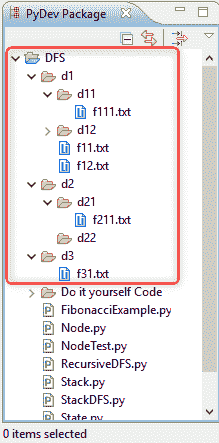

# 第一章：理解深度优先搜索算法

搜索算法在工业和研究领域的人工智能解决方案中有广泛的应用，涉及计算机视觉、机器学习和机器人技术。在本书的后续章节中，我们将教你如何在搜索应用程序中使用人工智能。搜索是我们每天都会进行的操作，无论是搜索文件系统中的歌曲、在社交网络中寻找朋友或同事，还是寻找前往目的地的最佳路线。在这一章中，你将学习 **深度优先搜索**（**DFS**）算法并开发一个文件搜索应用程序。

在本章中，我们将涵盖以下主题：

+   安装并设置库

+   介绍文件搜索应用程序

+   搜索问题的表述

+   使用节点构建搜索树

+   堆栈与 DFS

+   递归 DFS

# 安装并设置库

在我们深入探讨搜索的基本概念之前，我们将先了解以下需要安装的库以及如何在 Windows 中安装它们：

+   **Python**：你可以根据操作系统，从 [`www.python.org/downloads/`](https://www.python.org/downloads/) 下载并安装 Python 库。

+   **Graphviz**：这款开源图形可视化软件可以从 [`graphviz.org/download/`](http://graphviz.org/download/) 下载。

+   **Pip**：用于安装 Python 包的工具如下：

    +   **Pydot**：Graphviz 的 DOT 语言的 Python 接口

    +   **Matplotlib**：这是一款 Python 2D 绘图库。

执行以下部分中的步骤来安装前述库。

# 设置 Python

设置 Python 的步骤如下：

1.  对于本书中的应用程序，我们将使用 Python 2.7.6，可以从 [`www.python.org/downloads/`](https://www.python.org/downloads/) 下载。

1.  下载适当的安装程序后，双击它并继续使用默认选项进行安装。

1.  根据你的操作系统，选择合适的 Python 安装程序进行下载，如下截图所示：


图 1

1.  以下截图显示了 Python 将被安装的位置；请记下此位置：


图 2

现在，Python 将会安装。

1.  下一步是将 Python 的路径添加到 Path 环境变量中。在系统属性 | 高级标签下，点击“环境变量...”按钮。

1.  在“环境变量…”窗口中，进入系统变量 | Path，并添加你在步骤 4 中记下的 Python 位置（在我们的例子中是 `C:\Python27`）。

1.  现在，检查 Python 是否工作，打开命令提示符并输入 `python -- version` 命令。你将看到以下输出：


图 3

上面的截图显示的输出确认 Python 已成功安装。

根据你的操作系统，Python 可能已经安装好了。

# 设置 Graphviz

以下步骤描述如何设置 Graphviz：

1.  我们可以从 [`graphviz.gitlab.io/download/`](https://graphviz.gitlab.io/download/) 下载图形可视化软件。

1.  由于我们使用的是 Windows 操作系统，我们选择标有“稳定 2.38 Windows 安装包”的选项，如下图所示：


图 4

选择可下载的 `.msi` 文件，如下所示：


图 5

1.  一旦 Graphviz 可执行文件下载完成，继续安装该文件并选择默认选项；再次记录安装路径，如下图所示：


图 6

1.  现在，我们将像安装 Python 时一样，将 Graphviz 的 `bin` 文件夹添加到路径变量中。然后，复制 Graphviz 安装的路径，并在后面加上 `\bin`，如下图所示：


图 7

1.  为了验证这个库是否已正确安装，打开一个新的命令提示符窗口，输入 `dot -V` 命令，你将看到以下结果：


图 8

上述截图显示的输出确认 Graphviz 已成功安装。

# 安装 pip

安装 `pip` 的步骤如下：

1.  为了安装 `pip`，你需要从 [`bootstrap.pypa.io/get-pip.py`](https://bootstrap.pypa.io/get-pip.py) 下载 `get-pip.py` 文件，并记录该文件所在的路径。在我的例子中，文件位于 `Documents\ai\softwares`。

1.  打开命令提示符，并使用 `cd` 命令进入 `Documents\ai\softwares` 文件夹，如下图所示：


图 9

1.  使用 `dir` 命令查看该文件夹的内容，你将看到 `get-pip.py`，如下图所示：


图 10

1.  接下来，我们将运行 `python get-pip.py` 命令。

1.  现在，让我们将 Python 的 `scripts` 文件夹添加到 Path 环境变量中。

1.  打开另一个命令提示符窗口，通过输入 `pip --version` 命令来测试 `pip` 的安装。如果安装成功，你将看到以下输出：


图 11

1.  一旦 `pip` 安装完成，你可以通过运行以下命令来安装 `pydot`：

```py
pip install pydot 
```

1.  最后，通过执行以下命令安装 `matplotlib`：

```py
pip install matplotlib  
```

1.  我们可以通过在 Python 解释器中使用 `import` 命令来检查库是否已正确安装，如下图所示：


图 12

现在，我们已经在 Windows 中安装好了本书所需的所有库。接下来，我们将探讨如何开发一个文件搜索应用。

# 文件搜索应用介绍

在文件管理器中，文件搜索用于查找特定名称的文件；在集成开发环境（IDE）中，文件搜索用于查找包含特定代码文本的程序文件。

在本主题中，我们将开发第一个示例，以便查找一个名为`f211.txt`的文件。文件夹结构如下截图所示：



图 13

这个文件夹结构可以表示为树形结构，如下图所示；我们要寻找的文件用绿色边框标出：


图 14

让我们看看文件搜索是如何工作的，以便找到这个文件：

1.  文件搜索从**当前目录**开始；它打开第一个文件夹（**d1**），然后打开**d1**中的第一个文件夹（**d11**）。在**d11**中，它会比较所有的文件名。

1.  由于**d11**中没有更多内容，算法退出**d11**，进入**d1**，然后去下一个文件夹，即**d12**，并比较所有文件。

1.  现在，它离开了**d12**，去访问**d1**中的下一个文件夹（**f11**），然后是下一个文件夹（**f12**）。

1.  现在，搜索算法已经覆盖了**d1**文件夹中的所有内容。于是，它退出**d1**，进入**当前目录**中的下一个文件夹，即**d2**。

1.  在**d2**中，它打开第一个文件夹（**d21**）。在**d21**中，它比较所有文件，并找到了我们要找的**f211**文件。

如果你参考前面的文件夹结构，你会发现一个被反复使用的模式。当我们到达**f111**时，算法已经探索了树的最左边部分，直到它的最大深度。一旦达到了最大深度，算法就会回溯到上一级，然后开始探索右侧的子树。再次地，在这种情况下，子树的最左边部分被探索，当我们达到最大深度时，算法会去下一棵子树。这个过程会一直重复，直到找到我们正在搜索的文件。

现在我们已经理解了搜索算法的逻辑功能，在下一个主题中，我们将探讨执行搜索所需的搜索主要组成部分，这些组成部分在本应用中被用来进行搜索。

# 基本搜索概念

为了理解搜索算法的功能，我们首先需要了解一些基本的搜索概念，如状态、搜索的组成部分和节点：

+   **状态**：状态被定义为搜索过程发生的空间。它基本上回答了这个问题——*我们在搜索什么？* 例如，在一个导航应用中，状态是一个地点；在我们的搜索应用中，状态是一个文件或文件夹。

+   **搜索的元素**：搜索算法中有三个主要元素。这些元素如下，以寻宝为例：

    +   **初始状态**：这是回答问题——*我们从哪里开始搜索？* 在我们的例子中，初始状态就是我们开始寻宝的地点。

    +   **后继函数**：这是回答问题——*我们如何从初始状态开始探索？* 在我们的例子中，后继函数应该返回我们开始寻宝时的所有路径。

    +   **目标函数**：这是回答问题——*我们如何知道何时找到了解决方案？* 在我们的例子中，目标函数返回 true，如果你找到了标记为宝藏的地方。

搜索元素在下图中进行了说明：


图 15

+   **节点**：节点是树的基本单元。它可以包含数据或指向其他节点的链接。

# 制定搜索问题

在文件搜索应用程序中，我们从当前目录开始搜索，因此我们的初始状态是当前目录。现在，让我们编写状态和初始状态的代码，如下所示：


图 16

在前面的截图中，我们创建了两个 Python 模块，`State.py`和`StateTest.py`。`State.py`模块将包含前一部分提到的三个搜索元素的代码。`StateTest`模块是一个可以用来测试这些元素的文件。

让我们继续创建一个构造函数和一个返回初始状态的函数，如下所示的代码：

```py
....
import os 

class State:
    '''
    This class retrieves state information for search application
    '''

    def __init__(self, path = None):
        if path == None:
            #create initial state
            self.path = self.getInitialState()
        else:
            self.path = path

    def getInitialState(self):
        """
        This method returns the current directory
        """
        initialState = os.path.dirname(os.path.realpath(__file__))
        return initialState
 ....
```

在前面的代码中，以下内容适用：

+   我们有构造函数（构造函数名称），并且我们创建了一个名为`path`的属性，用于存储状态的实际路径。在前面的代码示例中，我们可以看到构造函数将`path`作为参数。`if...else`块表示如果没有提供路径，则将状态初始化为初始状态；如果提供了路径，则会创建具有该特定路径的状态。

+   `getInitialState()`函数返回当前工作目录。

现在，让我们继续创建一些示例状态，如下所示：

```py
...
from State import State
import os
import pprint

```

```py
initialState = State()
print "initialState", initialState.path

interState = State(os.path.join(initialState.path, "d2", "d21"))
goalState = State(os.path.join(initialState.path, "d2", "d21", "f211.txt"))

print "interState", interState.path
print "goalState", goalState.path
....
```

在前面的代码中，我们创建了以下三个状态：

+   `initialState`，指向当前目录

+   `interState`，是指向`d21`文件夹的中间函数

+   `goalState`，指向`f211.txt`文件夹

接下来，我们将看一下`successor`函数。如果我们在某个特定文件夹中，`successor`函数应该返回该文件夹内的文件夹和文件。如果你当前查看的是一个文件，它应该返回一个空数组。考虑下图，如果当前状态是`d2`，它应该返回指向`d21`和`d22`文件夹的路径：


图 17

现在，让我们按照以下代码创建前面的函数：

```py
...
    def successorFunction(self):
        """
        This is the successor function. It generates all the possible
         paths that can be reached from current path.
        """
```

```py
        if os.path.isdir(self.path):
            return [os.path.join(self.path, x) for x in         
            sorted(os.listdir(self.path))]
        else:
            return []
...
```

前述函数检查当前路径是否为目录。如果是目录，它会获取目录中所有文件夹和文件的排序列表，并将当前路径添加到它们前面。如果是文件，它会返回一个空数组。

现在，让我们用一些输入来测试这个函数。打开`StateTest`模块，查看初始状态和中间状态的后继状态：

```py
...
initialState = State()
print "initialState", initialState.path

interState = State(os.path.join(initialState.path, "d2", "d21"))
goalState = State(os.path.join(initialState.path, "d2", "d21", "f211.txt"))

print "interState", interState.path
print "goalState", goalState.path
...
```

如前所示，当前目录（或初始状态）的后继状态是 LiClipse 项目文件和文件夹`d1`、`d2`和`d3`，而中间状态的后继状态是`f211.txt`文件。

运行前述代码的输出结果如下图所示：


图 18

最后，我们来看看目标函数。那么，我们如何知道我们已经找到了目标文件`f211.txt`呢？我们的目标函数应该对`d21`文件夹返回`False`，对`f211.txt`文件返回`True`。我们来看看如何在代码中实现这个函数：

```py
...
def checkGoalState(self):
        """
        This method checks whether the path is goal state 
        """ 
        #check if it is a folder
        if os.path.isdir(self.path):
            return False
        else:
            #extract the filename
            fileSeparatorIndex = self.path.rfind(os.sep)
            filename = self.path[fileSeparatorIndex + 1 : ]
            if filename == "f211.txt":
                return True
            else:
                return False
...
```

如前所示，`checkGoalState()`函数是我们的目标函数；它检查当前路径是否为目录。现在，因为我们要找的是文件，如果是目录，它会返回`False`。如果是文件，它会从路径中提取文件名。文件名是从路径中最后一个斜杠到字符串结尾的子串。所以，我们提取文件名并与`f211.txt`进行比较。如果匹配，我们返回`True`；否则，返回`False`。

再次测试这个函数，测试我们创建的状态。为此，打开`StateTest`模块，如下图所示：


图 19

如你所见，该函数对当前目录返回`False`，对`d21`文件夹返回`False`，对`f211.txt`文件返回`True`。

现在我们已经理解了搜索算法中的三个要素，在接下来的章节中，我们将讨论如何使用节点构建搜索树。

# 使用节点构建树

在本节中，您将学习如何使用节点创建搜索树。我们将讨论状态和节点的概念、节点类的属性和方法，并展示如何用节点对象创建一棵树。在我们的应用中，状态是我们正在处理的文件或文件夹的路径（例如，当前目录），而节点是搜索树中的一个节点（例如，当前目录节点）。

一个节点有许多属性，其中之一是状态。其他属性如下：

+   **深度**：这是节点在树中的层级

+   **对父节点的引用**：这包括指向父节点的链接

+   **对子节点的引用**：这包括指向子节点的链接

让我们看一些例子，以便更清楚地理解这些概念：

+   这些概念在**当前目录**节点中的示例如下：

    +   **深度**：0

    +   **父节点引用**：无

    +   **子节点引用**：d1、d2、d3


图 20

+   这些概念在节点**d3**中的一个示例如下：

    +   **深度**：1

    +   **父节点引用**：当前目录节点

    +   **子节点引用**：f31


图 21

+   这些文件节点**f111**概念的一个示例如下：

    +   **深度**：3

    +   **父节点引用**：d11

    +   **子节点引用**：[]


图 22

让我们创建一个名为`Node`的类，其中包含我们刚才讨论的四个属性：

```py
...
class Node:
    '''
    This class represents a node in the search tree
    '''

    def __init__(self, state):
        """
        Constructor
        """
        self.state = state
        self.depth = 0
        self.children = []
        self.parent = None
...
```

如上面代码所示，我们创建了一个名为`Node`的类，这个类有一个构造函数，接受`state`作为参数。`state`参数被分配给该节点的`state`属性，其他属性初始化如下：

+   深度设置为`0`

+   子节点的引用被设置为空数组

+   父节点引用设置为`None`

该构造函数为搜索树创建一个空节点。

除了构造函数，我们还需要创建以下两个方法：

+   `addChild()`：该方法在父节点下添加一个子节点

+   `printTree()`：该方法打印树形结构

请参考以下`addChild()`函数的代码：

```py
def addChild(self, childNode):
        """
        This method adds a node under another node
        """
        self.children.append(childNode)
        childNode.parent = self
        childNode.depth = self.depth + 1
```

`addChild()`方法将子节点作为参数；子节点被添加到子节点数组中，并且子节点的父节点被设置为其父节点。子节点的深度是父节点深度加一。

让我们以块图的形式来看这个，以便更清晰地理解：


图 23

假设我们要在节点**d3**下添加节点**f31**。那么，**f31**将被添加到**d3**的`children`属性中，并且**f31**的父节点属性将被设置为**d3**。此外，子节点的深度将比父节点深度多一。在这里，节点**d3**的深度是**1**，因此**f31**的深度是**2**。

让我们看看`printTree`函数，如下所示：

```py
def printTree(self):
        """
        This method prints the tree
        """
        print self.depth , " - " , self.state.path
        for child in self.children:
            child.printTree()
```

首先，该函数打印当前节点的深度和状态；然后，遍历所有子节点，并对每个子节点调用`printTree`方法。

让我们尝试创建下图所示的搜索树：


图 24

如前图所示，作为根节点，我们有**当前目录**节点；在该节点下，有**d1**、**d2**和**d3**节点。

我们将创建一个`NodeTest`模块，它将创建示例搜索树：

```py
...
from Node import Node
from State import State

initialState = State()
root = Node(initialState)

childStates = initialState.successorFunction()
for childState in childStates:
    childNode = Node(State(childState))
    root.addChild(childNode)

root.printTree()
...
```

如前面的代码所示，我们通过创建一个没有参数的 `State` 对象来创建初始状态，然后将这个初始状态传递给 `Node` 类的构造函数，进而创建根节点。为了获取文件夹 `d1`、`d2` 和 `d3`，我们在初始状态上调用 `successorFunction` 方法，并遍历每个子状态（从每个子状态创建一个节点）；我们将每个子节点添加到根节点下。

当我们执行上述代码时，我们将得到如下输出：


图 25

在这里，我们可以看到当前目录的深度为 `0`，它的所有内容的深度为 `1`，包括 `d1`、`d2` 和 `d3`。

这样，我们已经成功地使用 `Node` 类构建了一个示例搜索树。

在下一个主题中，你将学习栈数据结构，这将帮助我们创建 DFS 算法。

# 栈数据结构

**栈** 是一堆物体，一个叠一个地放置（例如，一堆书、一堆衣服或一堆纸）。栈有两个操作：一个用于将元素添加到栈中，另一个用于从栈中移除元素。

用于将元素添加到栈中的操作叫做 **push**，而移除元素的操作叫做 **pop**。元素是按压入顺序的逆序弹出的；这就是为什么这个数据结构叫做 **后进先出**（**LIFO**）的原因。

让我们在 Python 中实验栈数据结构。我们将使用列表数据结构作为栈来进行操作。在 Python 中，我们将使用 `append()` 方法将元素压入栈中，并使用 `pop()` 方法将它们弹出：

```py
...
stack = []

print "stack", stack

#add items to the stack
stack.append(1)
stack.append(2)
stack.append(3)
stack.append(4)

print "stack", stack

#pop all the items out
while len(stack) > 0:
    item = stack.pop()
    print item

print "stack", stack
...
```

如前面的代码所示，我们创建了一个空栈并打印出来。我们一个接一个地将数字 `1`、`2`、`3` 和 `4` 添加到栈中并打印它们。然后，我们一个接一个地弹出这些元素并打印出来；最后，我们打印剩余的栈。

如果我们执行上述代码，`Stack.py`，我们将得到如下输出：


图 26

最开始，我们有一个空栈，当元素 `1`、`2`、`3` 和 `4` 被压入栈时，栈顶为 `4`。现在，当你弹出元素时，第一个弹出的将是 `4`，然后是 `3`，接着是 `2`，最后是 `1`；这正是入栈顺序的逆序。最后，我们会得到一个空栈。

现在我们清楚了栈的工作原理，让我们将这些概念应用到实际的 DFS 算法创建中。

# DFS 算法

现在你已经理解了搜索的基本概念，我们将通过使用搜索算法的三大基本要素——初始状态、后继函数和目标函数，来了解 DFS 是如何工作的。我们将使用栈数据结构。

让我们首先用流程图来表示 DFS 算法，以便更好地理解：


图 27

前面流程图中的步骤如下：

1.  我们使用初始状态创建根节点，并将其添加到我们的栈和树中。

1.  我们从栈中弹出一个节点。

1.  我们检查它是否具有目标状态；如果它具有目标状态，我们就停止搜索。

1.  如果步骤 3 中的条件答案是**否**，那么我们找到弹出节点的子节点，并将它们添加到树和栈中。

1.  我们重复步骤 2 到 4，直到找到目标状态或搜索树中的所有节点都被耗尽。

让我们将前面的算法应用到我们的文件系统，如下所示：


图 28

1.  我们创建根节点，将其添加到搜索树，并将其添加到栈中。我们从栈中弹出一个节点，它是**当前目录**节点。

1.  **当前目录**节点没有目标状态，因此我们找到它的子节点，并将它们添加到树和栈中。

当我们将节点添加到栈中时，必须按相反的顺序添加，以确保栈顶的节点在搜索树的最左侧。

1.  我们从栈中弹出一个节点（**d1**）；它没有目标状态，因此我们找到它的子节点，并将它们添加到树和栈中。

1.  我们从栈中弹出一个节点（**d11**）；它没有目标状态，因此我们找到它的子节点，并将它们添加到树和栈中。

1.  我们弹出一个节点（**f111**）；它没有目标状态，而且也没有子节点，因此我们继续。

1.  我们弹出下一个节点，**d12**；我们找到它的子节点，并将它们添加到树和栈中。

1.  我们弹出下一个节点，**f121**，它没有任何子节点，因此我们继续。

1.  我们弹出下一个节点，**f122**，它没有任何子节点，因此我们继续。

1.  我们弹出下一个节点，**f11**，我们遇到了相同的情况（没有子节点），所以我们继续；**f12**也一样。

1.  我们弹出下一个节点，**d2**，我们找到它的子节点，并将它们添加到树和栈中。

1.  我们弹出下一个节点，**d21**，我们找到它的子节点，并将它添加到树和栈中。

1.  我们弹出下一个节点，**f211**，我们发现它具有目标状态，因此我们在这里结束搜索。

让我们尝试将这些步骤实现为代码，如下所示：

```py
...
from Node import Node
from State import State

def performStackDFS():
    """
    This function performs DFS search using a stack
    """
    #create stack
    stack = []

    #create root node and add to stack 
    initialState = State()
    root = Node(initialState)
    stack.append(root)
...
```

我们创建了一个名为`StackDFS.py`的 Python 模块，它有一个名为`performStackDFS()`的方法。在这个方法中，我们创建了一个空栈，它将存储我们所有的节点，`initialState`，一个包含`initialState`的根节点，最后我们将这个根节点添加到栈中。

记住，在`Stack.py`中，我们写了一个`while`循环来处理栈中的所有项目。因此，在这种情况下，我们将编写一个`while`循环来处理栈中的所有节点：

```py
...
while len(stack) > 0:

        #pop top node
        currentNode = stack.pop()

        print "-- pop --", currentNode.state.path

        #check if this is goal state
        if currentNode.state.checkGoalState():
            print "reached goal state"
            break

        #get the child nodes 
        childStates = currentNode.state.successorFunction()
        for childState in childStates:
            childNode = Node(State(childState))
            currentNode.addChild(childNode)

...
```

如上面的代码所示，我们从栈顶弹出节点并将其称为 `currentNode()`，然后打印它，这样我们就可以看到节点处理的顺序。我们检查当前节点是否具有目标状态，如果有，我们在此处结束执行。如果没有目标状态，我们会找到它的子节点并将其添加到 `currentNode` 下，就像我们在 `NodeTest.py` 中所做的那样。

我们还将这些子节点按相反顺序添加到栈中，使用以下的 `for` 循环：

```py
...
for index in range(len(currentNode.children) - 1, -1, -1):
            stack.append(currentNode.children[index])

#print tree
    print "----------------------"
    root.printTree()
...
```

最后，当我们退出 `while` 循环时，我们打印出树。代码成功执行后，我们将得到以下输出：


图 29

输出显示了节点处理的顺序，我们可以看到树的第一个节点。最终，我们遇到了我们的目标状态，搜索停止：


图 30

上面的截图显示了搜索树。请注意，上面的输出和之前的输出几乎相同。唯一的区别是，在上面的截图中，我们可以找到两个节点，`d22` 和 `d3`，因为它们的父节点已经被探索过了。

# 递归 DFS

当一个函数调用自身时，我们说这个函数是**递归**函数。让我们看看斐波那契数列的例子。它的定义如下：`f(1)` 等于 `1`，`f(2)` 等于 `1`，对于 `n` 大于 `2`，`f(n)` 等于 `f(n-1) + f(n-2)`。让我们看看这个函数在代码中的实现，代码如下：

```py
...
def fibonacci(n):
    if n <= 2:
        return 1
    else:
        return fibonacci(n-1) + fibonacci(n-2)

print "fibonacci(5)", fibonacci(5)
...
```

在上面的代码中，我们创建了我们的函数，`fibonacci`，它接受一个数字 `n` 作为输入。如果 `n` 小于或等于 `2`，它返回 `1`；否则，它返回 `fibonacci(n-1) + fibonacci(n-2)`。在代码的末尾，我们计算了 `fibonacci(5)` 的值，即 `5`。

运行上面代码的输出如下截图所示：


图 31

如果我们想可视化 `fibonacci` 函数的递归树，可以访问 [`visualgo.net/en/recursion`](https://visualgo.net/en/recursion)。这个网站提供了各种数据结构和算法的可视化。

递归树的可视化如下：


图 32

如上面的截图所示，我们在这里得到的输出与我们用代码得到的输出相同，并且节点被探索的顺序与深度优先搜索（DFS）相似。

所以，*当函数 1 调用函数 2 时会发生什么？* 程序会在程序栈上添加一个栈帧。栈帧包含函数 1 的局部变量、传递给函数 1 的参数，以及函数 2 和函数 1 的返回地址。

让我们再次看看斐波那契数列的例子：


图 33

如您所见，斐波那契代码为了更清晰而进行了修改。假设程序正在执行加粗的那一行，**val2 = fibonacci(n-2)**。那么，创建的栈帧将包含以下值——局部变量为 **val1**，传递的参数为 **n**，返回地址为加粗部分代码的地址。

这意味着返回地址指向未处理的曲线。因为在递归中，程序栈保持一堆未处理的调用，而不是将节点存储在栈中，我们会递归地对子节点调用 DFS，这样栈就间接地得到了维护。

让我们看一下递归 DFS 在以下图示中的步骤：


图 34

上述图示中的步骤解释如下：

1.  我们创建了一个初始状态。

1.  我们使用这个初始状态创建了一个根节点。

1.  我们将根节点添加到搜索树中，并对根节点调用 DFS。

1.  递归 DFS 定义如下：检查节点是否具有目标状态。如果是，则返回路径；如果没有，则 DFS 会找到子节点，对于每个子节点，DFS 会将该节点添加到树中，最后在子节点上递归调用自身。

现在，我们将上述算法应用于我们的文件系统，步骤如下：


图 35

1.  我们创建根节点并将其添加到搜索树中，并对该根节点调用 DFS。

1.  当我们对这个根节点调用 DFS 时，函数会检查该节点是否具有目标状态，如果没有，它会找到其子节点（**d1**，**d2** 和 **d3**）。它选取第一个节点 **d1**，将其添加到搜索树中，并对该节点调用 DFS。

1.  当对 **d1** 调用 DFS 时，函数会创建一个程序。当对 **d1** 调用 DFS 时，程序会创建一个栈帧并将其添加到程序栈中。在这种情况下，我们将在 `for` 循环中展示剩余需要处理的节点。这里，我们将 **d2** 和 **d3** 添加到程序栈中。

1.  当对 **d1** 调用 DFS 时，它会找到子节点 **d11**，**d12**，**f11** 和 **f12**，并将 **d11** 添加到搜索树中。

1.  它对 **d11** 调用 DFS，当它这么做时，它会在程序栈中创建一个包含未处理节点的条目。现在，当对 **d11** 调用 DFS 时，它会找到子节点 **f111**，将 **f111** 添加到搜索树中，并对该节点调用 DFS。

1.  当对 **f111** 调用 DFS 时，它没有子节点，所以它会返回；当这种情况发生时，程序栈会被解开，意味着程序会返回执行并处理栈中最后一个未处理的节点。在这种情况下，它开始处理节点 **d12**。因此，程序将节点 **d12** 添加到搜索树中，并对 **d1** 调用 DFS。

1.  当对 **d12** 调用 DFS 时，它会找到子节点 **f121** 和 **f122**。它将节点 **f121** 添加到搜索树，并对其调用 DFS。当对 **f121** 调用 DFS 时，它将未处理的节点 **f122** 添加到栈中。

1.  当对**f121**调用 DFS 时，它没有子节点，因此栈会被解开。然后，我们处理节点**f122**。这个节点被添加到搜索树中，并对其调用 DFS。接着，我们继续处理最后一个节点**f11**，将其添加到搜索树中，并对其调用 DFS。

1.  当我们对**f11**调用 DFS 时，它没有子节点，因此栈再次被解开。我们继续处理节点**f12**，将其添加到搜索树中，并对其调用 DFS。我们遇到了这种情况，然后继续处理节点**d2**。我们将其添加到搜索树中，并对**d2**调用 DFS。

1.  当我们对**d2**调用 DFS 时，发现它有子节点：**d21**和**d22**。我们将**d21**添加到搜索树中，并对**d21**调用 DFS；当我们对**d21**调用 DFS 时，它会为**d22**创建一个入口。在程序栈中，当对**d21**调用 DFS 时，发现它有一个子节点**f211**。这个节点被添加到搜索树中，并对**f211**调用 DFS。

1.  当对**f211**调用 DFS 时，我们意识到它包含目标状态，搜索过程在此结束。

让我们看看如何实现递归 DFS，代码如下：

```py
...
from State import State
from Node import Node

class RecursiveDFS():
    """
    This performs DFS search
    """
    def __init__(self):
        self.found = False
...
```

如前面的代码所示，我们创建了一个名为`RecursiveDFS.py`的 Python 模块。它包含一个名为`RecursiveDFS`的类，在构造函数中有一个名为`found`的属性，用来表示是否已找到解决方案。稍后我们将查看`found`变量的重要性。

让我们来看一下以下几行代码：

```py
...
    def search(self):
        """
        This method performs the search
        """
        #get the initial state
        initialState = State()

        #create root node
        rootNode = Node(initialState)

        #perform search from root node
        self.DFS(rootNode)

        rootNode.printTree()
...
```

这里，我们有一个名为`search`的方法，在其中我们创建了`initialState`，并在`rootNode`上调用 DFS 函数。最后，在执行 DFS 搜索后，我们打印出树的内容，如下所示：

```py
...
def DFS(self, node):
        """
        This creates the search tree
        """
        if not self.found:
            print "-- proc --", node.state.path

            #check if we have reached goal state
            if node.state.checkGoalState():
                print "reached goal state"
                #self.found = True

            else:
                #find the successor states from current state 
                childStates = node.state.successorFunction()

                #add these states as children nodes of current node
                for childState in childStates:
                    childNode = Node(State(childState))
                    node.addChild(childNode)

                    self.DFS(childNode)
....
```

`DFS` 函数可以定义如下：

+   如果未找到解决方案，则打印当前正在处理的节点。

+   我们检查节点是否包含目标状态，如果包含，我们就打印出已经达成目标状态。

+   如果它没有目标状态，我们就寻找子状态；接下来，我们为每个子状态创建子节点，将它们添加到树中，并对每个子节点调用`DFS`。

让我们执行程序，我们将得到以下输出：


图 36

当我们处理`f211`时，达到了目标状态，但这里有三行多余的输出；这是因为这些节点已经被添加到程序栈中。为了去除这些行，我们创建了一个名为`found`的变量，当目标状态被找到时，变量将被设置为`True`。一旦遇到`f211`，程序栈中的剩余节点将不会被处理：


图 37

让我们再次运行这段代码，看看会发生什么：


图 38

如你所见，一旦我们处理了`f211`并达到了目标状态，节点处理就停止了。`printTree`函数的输出与我们在`StackDFS.py`中存储的内容相同。

现在你已经理解了如何将 DFS 实现为递归函数，在下一个主题中，我们将讨论一个你可以自己开发的应用。

# 自己动手

在本节中，我们将讨论一个你可以自己开发的应用程序。我们将看看一个新的应用，并讨论需要进行的修改。在*文件搜索应用介绍*部分，我们讨论了两种文件搜索的应用；现在，我们将开发第二种类型的示例。我们的目标是开发一个能够查找包含特定程序文本的程序文件的搜索应用。

在递归 DFS 的代码中，我们主要使用了三个类，如下所示：

+   **状态（State）**：包含搜索过程的三个主要要素

+   **节点（Node）**：用于构建搜索树

+   **递归** **DFS**：包含实际的算法实现

假设我们想要将这个代码或文件搜索应用程序适配到新的应用程序中。我们需要修改三个方法：`getInitialState`、`successorFunction`和`checkGoalState`。对于新的程序搜索应用，你只需要修改一个方法：`checkGoalState`。

在你的新`checkGoalState`函数中，你需要打开文件，逐行读取文件内容，并进行子字符串检查或正则表达式检查。最后，根据检查结果返回 true 或 false。

那么，去试试看吧！

# 小结

在本章中，我们讨论了与搜索相关的四个基本概念：状态（state），即我们搜索过程的当前状态；节点（node），用于构建搜索树；栈（stack），用于帮助遍历搜索树，并决定遍历节点的顺序；递归（recursion），它消除了显式栈的需求。你还学习了深度优先搜索（DFS），它以深度优先的顺序探索搜索树。

在下一章中，你将学习**广度优先搜索**（**BFS**），它以广度优先的顺序探索搜索树。到时候见！

请参考链接 [`www.packtpub.com/sites/default/files/downloads/HandsOnArtificialIntelligenceforSearch_ColorImages.pdf`](https://www.packtpub.com/sites/default/files/downloads/HandsOnArtificialIntelligenceforSearch_ColorImages.pdf)，查看本章的彩色图片。
