# 第二章：理解广度优先搜索算法

**广度优先搜索**（**BFS**）算法是一种遍历算法，首先从选定的节点（源节点或起始节点）开始，按层次遍历图，探索相邻节点（与源节点直接连接的节点）。然后，继续向下一层的相邻节点移动。

在本章中，你将学习 BFS 算法，并开发 LinkedIn 的连接功能。你将学习如何通过 BFS 算法计算二度连接。

本章我们将涵盖以下主题：

+   理解 LinkedIn 的连接功能

+   图数据结构

+   队列数据结构

+   BFS 算法

+   DFS 与 BFS

# 理解 LinkedIn 的连接功能

如你所知，LinkedIn 是一个社交网络，用户通过一度或二度连接与他人建立联系。为了更好地理解这个概念，可以参考以下图示：

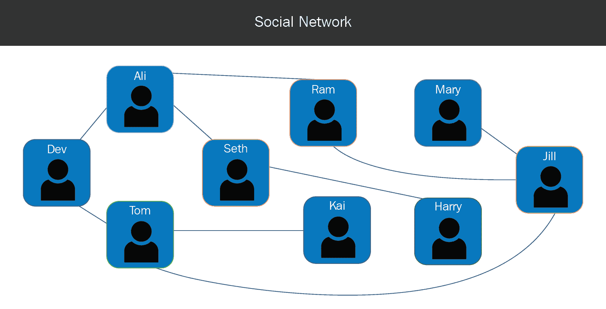

图 1

假设我想找到一个名为**Jill**的熟人并与她建立连接。当我查看她的个人资料时，我发现她是二度连接，这意味着我们有一个共同的同事。让我们来看看这个度数是如何计算的。为此，我们将创建一个连接树：

1.  我们从个人资料节点**Dev**开始，并将其添加到连接树中：


图 2

1.  现在，我将找到我的同事并把他们添加到我的节点下。因此，我将**Ali**和**Tom**添加到**Dev**节点下：

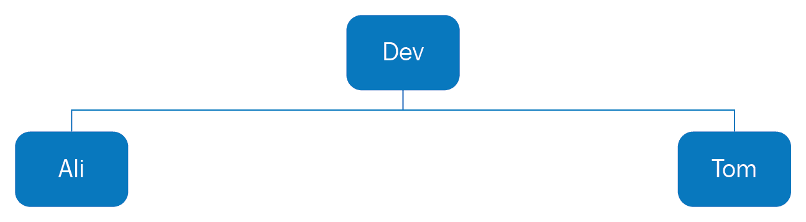

图 3

1.  现在，对于**Ali**和**Tom**，我找到他们的同事并把他们添加到各自的节点下。因此，在**Ali**节点下，我添加了**Dev**、**Seth**和**Ram**；在**Tom**节点下，我添加了**Dev**、**Seth**、**Kai**和**Jill**：

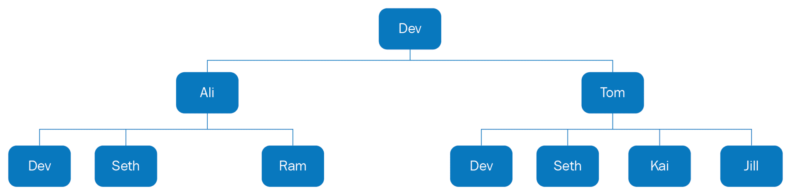

图 4

1.  现在，对于这些节点，我们找到它们的连接并将其添加进去：

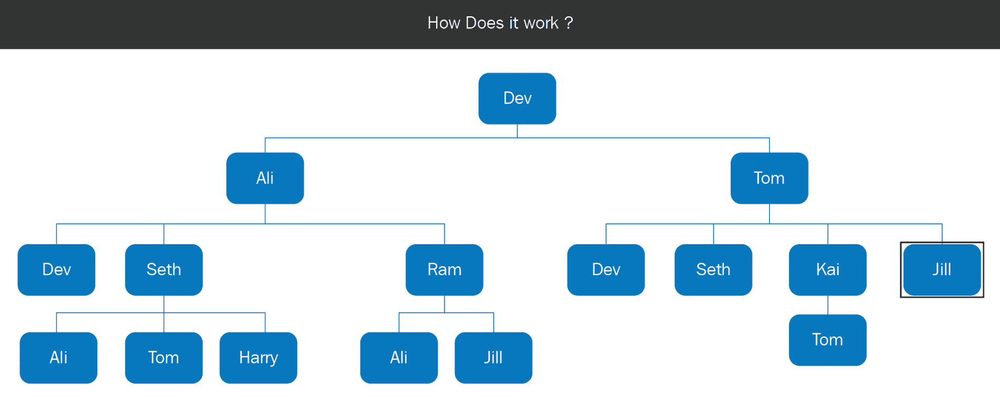

图 5

在上面的图中，已经添加了与**Dev**的连接（由于空间限制，未显示）。对于**Seth**，我们找到他的连接（**Ali**、**Tom**和**Harry**），并将它们添加到他的名字下。对于**Ram**，我们添加了**Ali**和**Jill**。类似地，由于空间限制，未显示**Dev**和**Seth**的连接，因为它们已经在图中显示。对于**Kai**，我们添加了他的连接**Tom**。最后，当我们到达**Jill**节点（以添加她的连接）时，我们发现这个节点已经到达目标状态，因此我们结束了搜索。

你可能注意到**Jill**作为与**Ram**的连接出现在树的底部；但是，如果你考虑底部节点，连接度为**3**，这不是最小值。然而，由于 BFS 搜索按层次逐级处理搜索树，我们能够找到最短路径解决方案。我们还可以看到在这个连接树中，有些人出现了多次。例如，**Dev**、**Ali**和**Tom**每个人都出现了三次，而**Seth**和**Jill**每个人出现了两次。

所以，我们将保留连接树中的节点的第一个条目，并移除其他实例；下图展示了搜索树的样子：

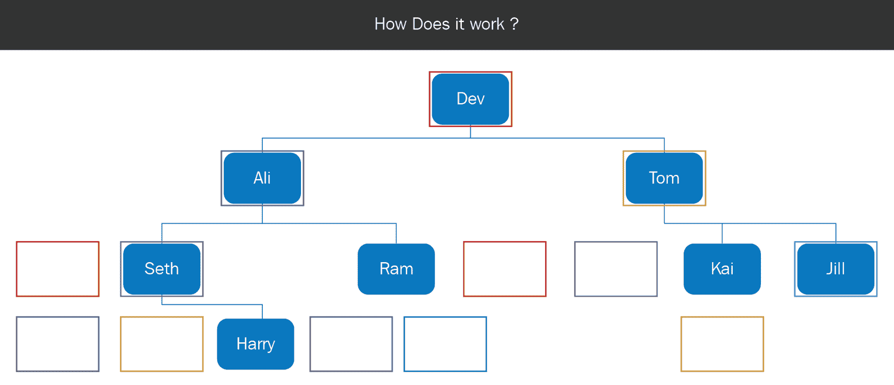

图 6

当我们将节点添加到搜索树时，我们应该检查它是否已经存在于搜索树中。

在第一章，*理解深度优先搜索算法*中，您学到了`State`类表示搜索过程的状态。您还学到了，即使搜索算法相同，`State`类也需要针对每个应用进行更改。现在，让我们看看为了这个应用，我们需要对`State`类进行的更改。

首先，我们需要一个属性来追踪搜索的状态。在这个应用中，该属性是当前正在考虑的人。然后，我们有四个相同的方法——`constructor()`、`getInitialState()`、`successorFunction()`和`checkGoalState()`。

让我们详细查看这三种成分。为了找到初始状态，我们应该问自己一个问题，*我们从哪里开始搜索？* 在这个应用中，我们从我的个人资料开始搜索。为了找到后继函数，我们应该问自己，*我们如何从当前状态进行探索？* 在这个应用中，函数应该返回与当前人相关联的人员。因此，对于**Ali**，它应该返回他的所有同事。最后，为了找到目标函数，我们应该问一个问题，*我们如何知道何时找到了解决方案？* 如果当前人是`Jill`，目标函数应该返回 true。如果当前人是 Harry，函数应该返回 false，如果当前人是`Jill`，则返回 true。

让我们看看这个应用中的`State`类代码，如下所示：

```py
...
from GraphData import *
class State:
    '''
    This class retrieves state information for social connection    
    feature
    '''

    def __init__(self, name = None):
        if name == None:
            #create initial state
            self.name = self.getInitialState()
        else:
            self.name = name

    def getInitialState(self):
        """
        This method returns me.
        """
        initialState = "Dev"
        return initialState
   def successorFunction(self):
        """
        This is the successor function. It finds all the persons     
        connected to the current person
        """
        return connections[self.name]
...
```

如前面的代码所示，在这个模块`State.py`中，我们从`GraphData`导入了所有变量。`GraphData`的作用将在*图形数据结构*部分中进行解释。在构造函数中，传递了`name`参数。如果`name`参数为`None`，则会创建初始状态；如果提供了名称，则该名称将赋值给名称属性。`initialState`属性的值为`Dev`，而`successorFunction`方法返回与当前人相关联的所有人员。为了获取与该人相关联的人员，我们使用来自 GraphData 的连接：

```py
    def checkGoalState(self):
        """
        This method checks whether the person is Jill.
        """ 
        #check if the person's name is Jill
        return self.name == "Jill"
```

`checkGoalState`函数返回当前人的名字是否是`Jill`。

现在，你应该了解了连接度是如何计算的，以及`State`类在这个应用中的变化。

在接下来的部分，我们将看看如何将社交网络数据表示为图。

# 图数据结构

**图**是一种非线性数据结构，包含一组称为**节点**（或顶点）的点，以及一组称为**边**的连接，如下图所示：

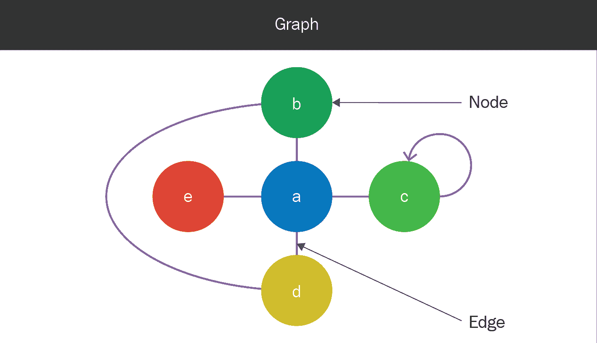

图 7

连接到同一个节点的边被称为**循环**。如前面的图示所示，节点**a**和**b**通过两条路径连接；一条是通过边**a-b**，另一条是通过边**a-d**和**d-b**。**树**是一种特殊的图形，在这种图形中没有循环，且两个节点之间只有一条路径。

在 Python 中，我们可以使用字典结构来表示图。**字典**是一种数据结构，其中许多键映射到值。对于表示图的字典，键是节点，而这些节点的值是它们连接的节点：

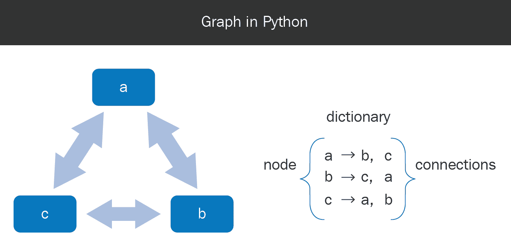

图 8

在前面的图示中，我们可以看到以下内容：

+   **对于键 a**，值是**b**和**c**

+   **对于键 b**，值是**c**和**a**

+   **对于键 c**，值是**a**和**b**

现在，让我们创建一个字典来展示上一节中提到的社交网络的图结构：

```py
...
#create a dictionary with all the mappings
connections = {}
connections["Dev"] = {"Ali", "Seth", "Tom"}
connections["Ali"] = {"Dev", "Seth", "Ram"}
connections["Seth"] = {"Ali", "Tom", "Harry"}
connections["Tom"] = {"Dev", "Seth", "Kai", 'Jill'}
connections["Ram"] = {"Ali", "Jill"}
connections["Kai"] = {"Tom"}
connections["Mary"] = {"Jill"}
connections["Harry"] = {"Seth"}
connections["Jill"] = {"Ram", "Tom", "Mary"}
...
```

在 Python 模块`GraphData.py`中，我们创建了一个名为`connections`的字典。字典的键是社交网络中的人物，值则是他们连接的人。现在，`connections`字典在`State.py`中使用。它在`successorFunction`函数中使用，如以下代码所示：

```py
... 
def successorFunction(self):
        """
        This is the successor function. It finds all the persons   
        connected to the current person
        """
        return connections[self.name]
...
```

在这里，我们可以通过使用`connections`字典来获取与某人连接的其他人，以此人的名字作为键。我们可以通过使用`connections`对象来获取与该人连接的其他人。

现在，让我们来看一下如何遍历这个图数据结构，以便创建一个搜索树：

1.  我们将从我在图中的个人资料开始，并将**Dev**节点添加到搜索树和已访问节点列表中。

1.  从我在图中的节点出发，我们可以找到连接的人员，**Ali**和**Tom**；我们将这些节点添加到搜索树和已访问节点列表中。

1.  对于**Ali**和**Tom**，我们通过使用图形数据结构找出他们连接的节点，并将这些节点添加到搜索树和访问节点列表中，如果它们之前没有被访问过。**Ali**与**Dev**、**Seth**和**Ram**连接。**Dev**已经被访问过，所以我们忽略这个节点。**Seth**和**Ram**没有被访问过，所以我们将这些节点添加到搜索树和访问节点列表中。**Tom**与**Dev**、**Seth**、**Kai**和**Jill**连接。**Dev**和**Seth**已经被访问过，所以我们忽略这些节点，添加**Kai**和**Jill**到列表中，因为它们之前没有被访问过。

1.  我们重复将子节点添加到搜索树和访问节点列表的过程（如果它们之前没有被访问过）。**Seth**与**Ali**、**Tom**和**Harry**连接。**Ali**和**Tom**已经被访问过，所以我们忽略它们，添加**Harry**到搜索树和访问节点列表中。**Ram**与**Ali**和**Jill**连接，而这两个节点之前都已经被访问过。接下来，**Kai**与**Tom**连接，而他也已经被访问过。当我们处理**Jill**节点时，发现它具有目标状态，搜索结束。

你现在已经学会了如何使用访问节点的列表将图形作为树进行探索，结果将如下所示：

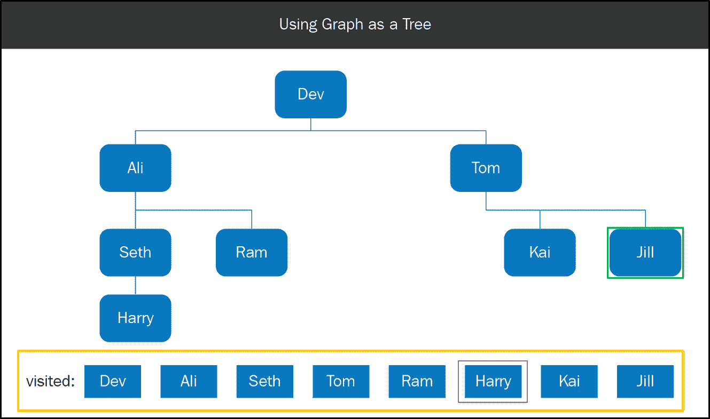

图 9

在接下来的章节中，你将学习队列数据结构，它与深度优先搜索（DFS）方法中的栈类似，是节点反转的基础。

# 队列数据结构

**队列**是一系列等待处理的人或物体。举几个例子，包括排队等候在柜台前的人们，准备跳入游泳池的游泳者队列，以及播放列表中的歌曲队列：

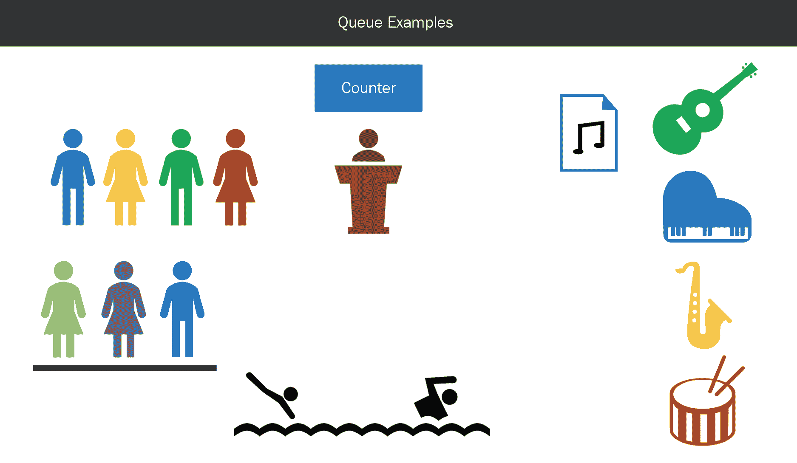

图 10

就像栈一样，队列也有两种操作——一种是将项目插入队列，另一种是从队列中移除项目。当一个人排队时，他或她必须站在最后一个人后面。向队列添加项目的操作称为**入队**。队列中第一个被处理的人是站在前面的人。从队列中移除项目的操作称为**出队**。队列操作可以通过以下图示表示：

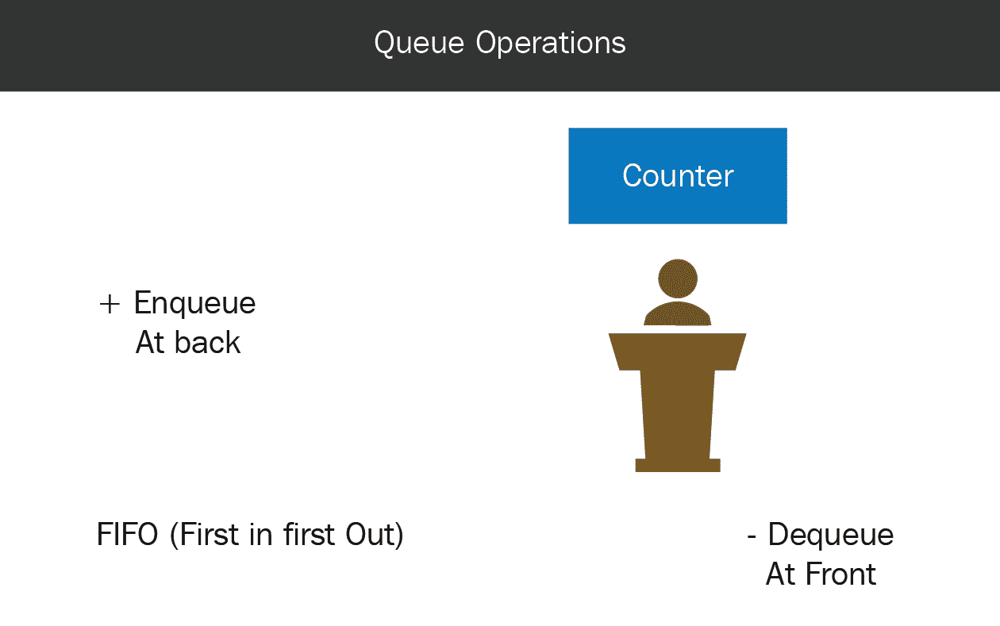

图 11

由于第一个插入的对象是第一个被移除的，这种数据结构称为**先进先出**（**FIFO**）。在 Python 中，我们可以使用`deque`类来创建`queue`对象。`deque`类提供了两种方法——一种方法是`append`，用于插入项目，另一种方法是`popleft`，用于移除项目：

```py
...
from collections import deque

queue = deque([])
print queue

queue.append("1") 
queue.append("2") 
queue.append("3") 
queue.append("4") 

print queue
...
```

在上面的代码中，我们创建了一个空队列，并向其中添加了 `1`、`2`、`3` 和 `4`，随后我们将逐一从队列中删除这些项目。代码成功执行后，我们将得到以下输出：

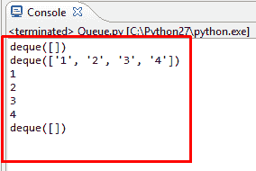

图 12

如上图所示，我们最初有一个空队列，添加了 `1`、`2`、`3` 和 `4` 后，你可以看到这些项目在队列中，`1` 在前，`4` 在后。当我们从队列中移除一个项目时，第一个被移除的是 `1`，因为它在前，接着是 `2`、`3` 和 `4`，最后队列为空。

现在你已经理解了队列的工作原理，我们将查看 BFS 算法中的步骤，以及图和队列数据结构是如何使用的。

# BFS 算法

在本节中，我们将了解 BFS 算法的流程，队列如何使用，以及图数据如何影响算法。BFS 算法的流程与 DFS 类似，但不同之处在于，BFS 使用的是队列数据结构，而不是栈数据结构。

BFS 算法的流程图可以如下所示：

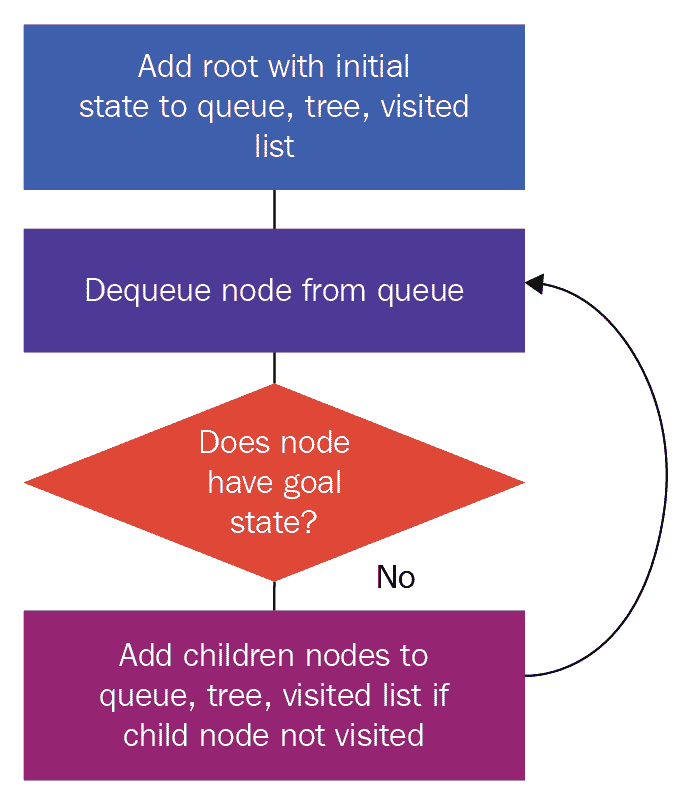

图 13

1.  我们首先创建一个具有初始状态的根节点，并将其添加到队列和树中。

1.  一个节点从队列中出队，我们检查它是否具有目标状态。如果有，我们结束搜索。如果没有，我们找到该节点的子节点并将它们添加到队列中。

1.  这个过程会一直重复，直到我们找到目标状态或者所有节点都已被搜索完。

1.  由于我们的连接数据采用图结构，因此我们必须检查每个节点是否已被访问过。

1.  因此，我们将根节点添加到已访问节点列表中，子节点被添加到队列、树和已访问列表中（如果子节点之前未被访问）。

让我们通过在图形图示中实现这些步骤来详细了解它们，这是我们在 *理解 LinkedIn 连接功能* 部分中讨论的内容：

1.  我们首先将我的个人资料节点添加到搜索树、队列和已访问节点列表中。然后我们将 **Dev** 节点从队列中出队。

1.  由于 **Ali** 节点尚未被访问，我们将这个节点添加到搜索树、队列和已访问节点列表中。同样，由于 **Tom** 节点未被访问，我们也将它添加到搜索树、队列和已访问节点列表中。

1.  我们从队列中出队 **Ali** 节点，并且由于它没有目标状态，我们找到它的子节点：**Dev**、**Seth** 和 **Ram**。**Dev** 节点已被访问，因此我们忽略该节点。**Seth** 节点未被访问，因此我们将该节点添加到搜索树、队列和已访问节点列表中。同样，我们将 **Ram** 节点添加到搜索树、队列和已访问节点列表中。

1.  我们从队列中出队**Tom**节点，并找到它的子节点：**Dev**、**Seth**、**Kai**和**Jill**。**Dev**节点已经被访问过，因此我们忽略该节点，**Seth**节点也是如此。**Kai**节点尚未被访问，因此我们将该节点添加到搜索树、队列和已访问节点列表中；**Jill**节点也同样处理。我们从队列中出队**Seth**节点，并找到它的子节点：**Ali**、**Tom**和**Harry**。**Ali**和**Tom**节点已经被访问，因此我们忽略这些节点。我们将**Harry**节点添加到搜索树、队列和已访问节点列表中。

1.  我们从队列中出队**Ram**节点，并找到它的子节点，**Ali**和**Jill**，这两个节点都已被访问；因此，我们继续。

1.  我们从队列中出队**Kai**节点，并找到它的子节点**Tom**，该节点已被访问，因此我们继续。

1.  我们从队列中出队**Jill**节点，发现它是目标状态，因此我们结束搜索。

一旦完成上述步骤，我们将得到以下树形结构：

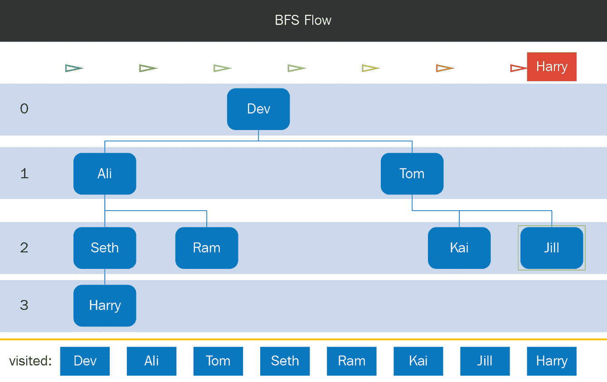

图 14

让我们用以下代码实现上述算法：

```py
...
def performQueueBFS():
    """
    This function performs BFS search using a queue
    """
    #create queue
    queue = deque([])

    #since it is a graph, we create visited list
    visited = []

    #create root node
    initialState = State()
    root = Node(initialState)
    #add to queue and visited list
    queue.append(root) 
    visited.append(root.state.name)
...
```

在 Python 模块`QueueBFS.py`中，我们创建了一个名为`performQueueBFS`的方法，其中有一个空队列用于存放节点，并有一个已访问节点的列表。我们使用`initialState`创建根节点，并将该根节点和已访问节点列表一起添加到队列中。我们逐个从队列中出队元素；我们将出队的节点称为`currentNode`：

```py
...   
        while len(queue) > 0:

        #get first item in queue
        currentNode = queue.popleft()

        print "-- dequeue --", currentNode.state.name

        #check if this is goal state
        if currentNode.state.checkGoalState():
            print "reached goal state"
            #print the path
            print "----------------------"
            print "Path"
            currentNode.printPath()
            break
...
```

我们打印当前节点的名称，并检查它是否具有目标状态。如果是，我们打印从根节点到当前节点的路径并跳出循环。如果没有目标状态，我们找到当前状态的子状态，对于每个更高的状态，我们构建子节点并检查该节点是否已被访问。

现在，已访问节点的列表中保存了节点的名称。因此，在下面的代码中，我们已经添加了根节点的名称：

```py
 visited.append(root.state.name)
```

我们在下面的代码中做了同样的事情：

```py
...
#check if node is not visited
            if childNode.state.name not in visited:

                #add this node to visited nodes
                visited.append(childNode.state.name)

                #add to tree and queue
                currentNode.addChild(childNode)
                queue.append(childNode)

    #print tree
    print "----------------------"
    print "Tree"
    root.printTree()
...
```

在上面的代码中，我们检查节点名称是否未被访问。因为我们在检查唯一的名称，如果节点没有被访问，我们就将该子节点的名称添加到已访问节点列表中，并将该子节点添加到搜索树和队列中。最后，我们打印队列。

让我们运行代码，看看会发生什么：

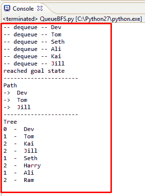

图 15

在上面的截图中，我们可以看到节点处理的顺序。我们从`Dev`节点开始，然后处理连接的`Ali`和`Tom`，接着是`Ali`、`Ram`和`Seth`的连接，再然后是`Tom`、`Kai`和`Jill`的连接。当我们处理到`Jill`节点时，发现已经达到了目标状态，我们结束了搜索。

在前面的截图中，我们可以看到从初始状态到目标状态的路径通过`Tom`节点打印出来。从中可以看到`Jill`是二级连接。我们还可以看到到目前为止构建的搜索树。

现在你已经了解了 BFS 的步骤，我们将对比 BFS 和 DFS 算法。

# BFS 与 DFS

在本节中，我们将研究 DFS 和 BFS 算法之间的区别。我们将从多个因素来比较这些差异。

# 遍历顺序

在 DFS 中，优先考虑子节点，这意味着在探索完节点**a**和节点**b**后，接着探索完节点**b**和节点**c**，当遇到死胡同时，我们会回溯到上一级。这意味着我们回到节点**b**，然后继续探索它的下一个子节点，即节点**c**。

在 BFS 中，节点按层级覆盖，优先考虑兄弟节点。这意味着在探索完节点**a**后，接着探索节点**b**和**e**，然后再探索节点**c**、**d**和**f**，如下面的图所示：

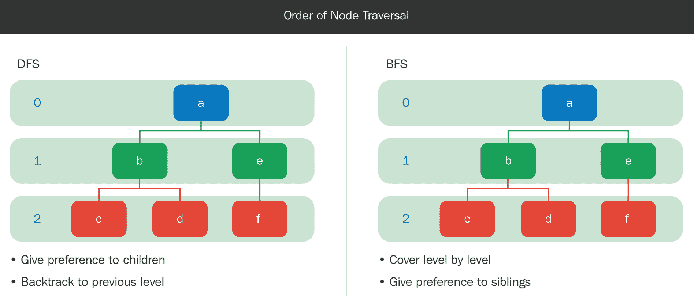

图 16

# 数据结构

在 DFS 中，使用栈数据结构，而在 BFS 中，使用队列，如下图所示：

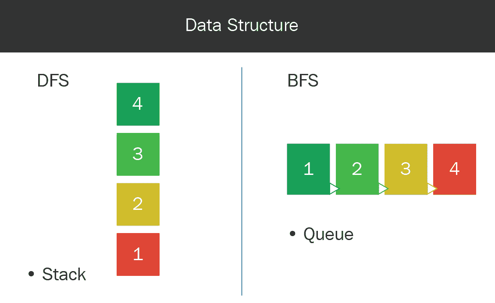

图 17

# 内存

当递归调用 DFS 时，节点**c**的隐式栈会存储两个条目——一个是节点**e**，另一个是节点**c**和**d**。因此，所使用的内存是按**d**的顺序，其中**d**是搜索树的深度。

当 BFS 方法被调用在节点**c**时，队列包含四个条目——节点**c**、**d**、**f**和**g**。因此，所使用的内存是按*b^d*的顺序，其中**b**是分支因子，**d**是搜索树的深度。这里，分支因子为**2**，因为每个内部节点有两个子节点：

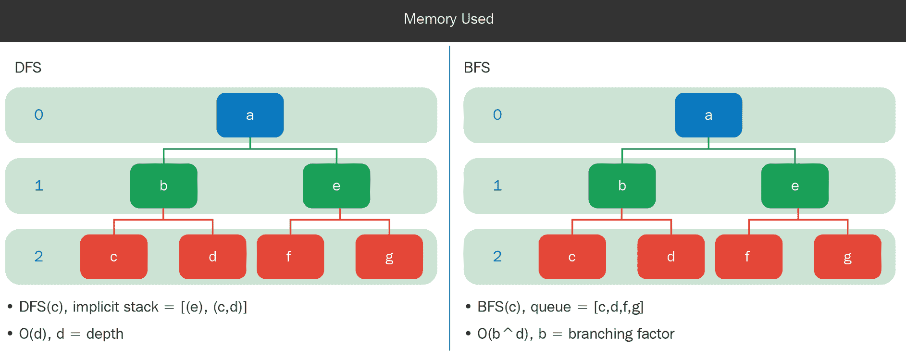

图 18

# 最优解

假设有两个可能的解决方案——节点**d**和**e**。在这种情况下，**e**是最优解，因为它从根节点**a**到达的路径最短。这里，DFS 首先找到子最优解**d**，然后才找到最优解**e**。BFS 在遇到节点**d**之前，先找到了最优解**e**：

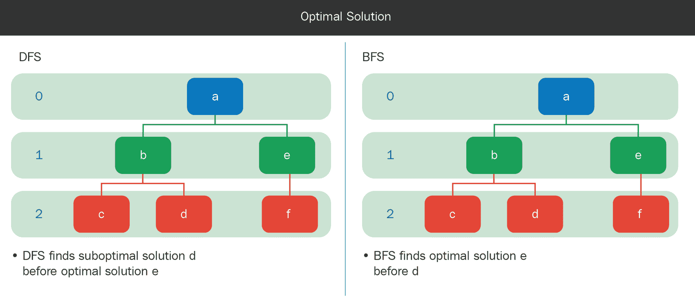

图 19

我们已经看到 DFS 使用的内存比 BFS 少，而 BFS 能找到最优解。所以，算法的选择取决于搜索空间的大小（在这种情况下，你会选择 DFS），以及是否需要找到最优解（在这种情况下，BFS 更为合适）。

接下来，我们将看看一个你可以尝试自己开发的应用程序。

# 自己动手试试

在上一节中，我们讨论了 DFS 和 BFS 算法的区别。在本节中，我们将介绍一个应用程序，你可以尝试自己开发。我们将讲解你需要开发的应用程序以及为此所需的更改。

你的目标是开发一个大学导航应用程序，如下图所示：

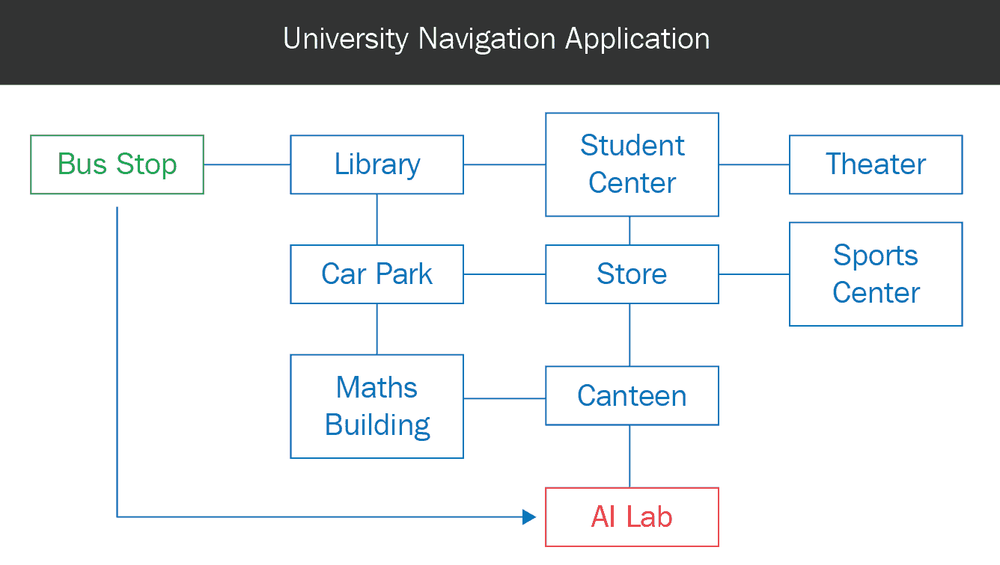

图 20

假设这是大学的布局，学生可以沿着水平或垂直线路行走。在这个应用程序中，用户需要输入起点和终点。对于这个具体的情况，我们假设一名新生想要从 **公交车站** 找到 **人工智能实验室**。

你可以参考我们为 LinkedIn 连接功能开发的类，具体如下：

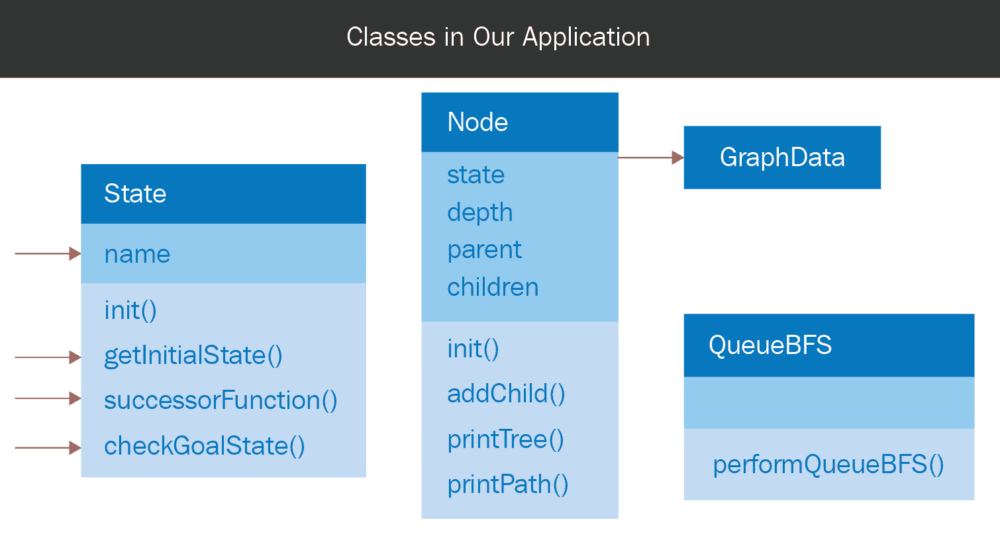

图 21

为了将代码适配到这个应用程序，我们需要修改 `State` 类和图数据。在 `State` 类中，`name` 属性被替换为 `place` 属性，`NavigationData` 包含地点之间的连接：

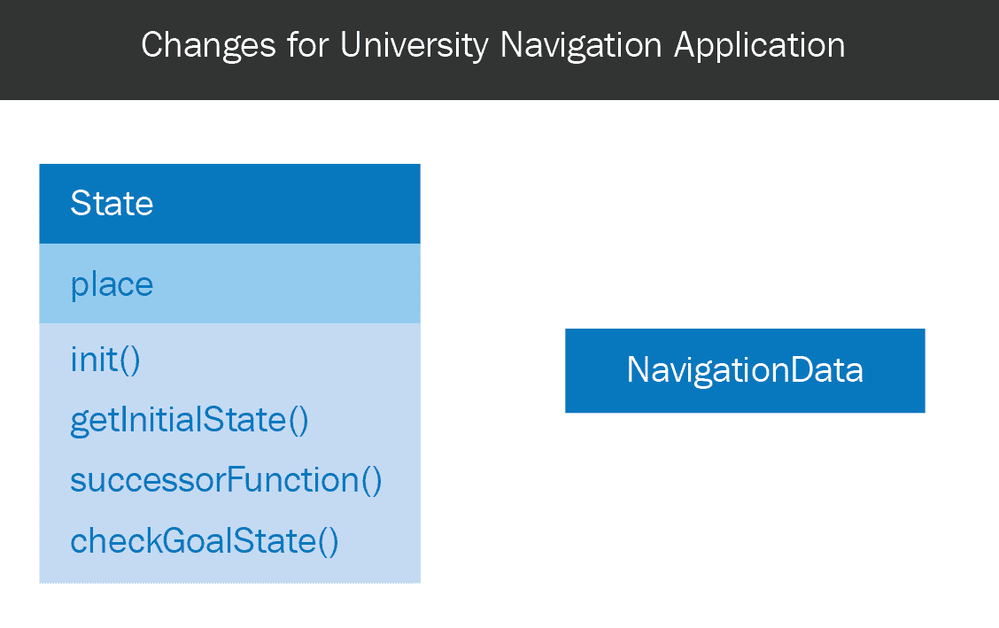

图 22

让我们详细看看搜索的三个要素。为了得到初始状态的答案，我们可以问自己一个问题，*我们从哪里开始搜索？* 在这个例子中，是 **公交车站**。因此，`successorFunction` 应该返回所有连接的地点。例如，如果当前地点是 **停车场**，那么该函数应该返回 **图书馆**、**商店** 和 **数学楼**。为了得到目标函数的答案，我们应该问自己一个问题，*我们怎么知道何时找到了解决方案？* 对于这个应用程序，如果地点是 **人工智能实验室**，函数应该返回 true；例如，如果当前地点是 **餐厅**，则返回 false；如果当前地点是 **人工智能实验室**，则返回 true。

去试试看吧！

# 总结

在本章中，为了帮助你理解 BFS 算法，我们重新回顾了状态和节点的概念。你了解了图和队列数据结构，并且我们讨论了 DFS 和 BFS 算法的区别。

在下一章中，你将学习启发式搜索算法。与优先考虑子节点或兄弟节点不同，这种方法优先考虑距离目标状态最近的节点；术语 **启发式** 指的是衡量节点与目标状态之间距离的度量。

请参考链接 [`www.packtpub.com/sites/default/files/downloads/HandsOnArtificialIntelligenceforSearch_ColorImages.pdf`](https://www.packtpub.com/sites/default/files/downloads/HandsOnArtificialIntelligenceforSearch_ColorImages.pdf) 获取本章的彩色图片。
