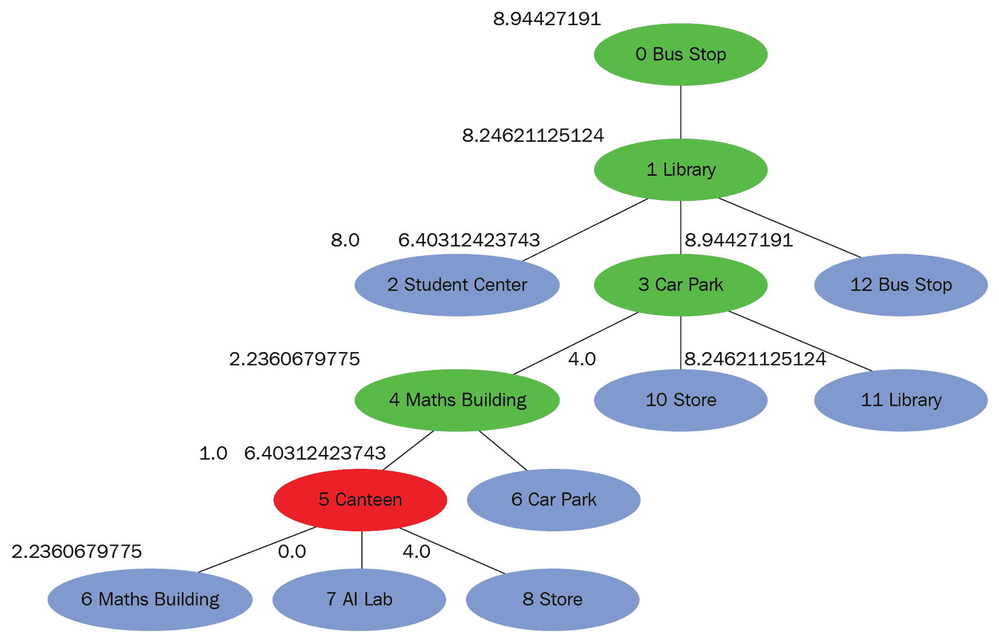
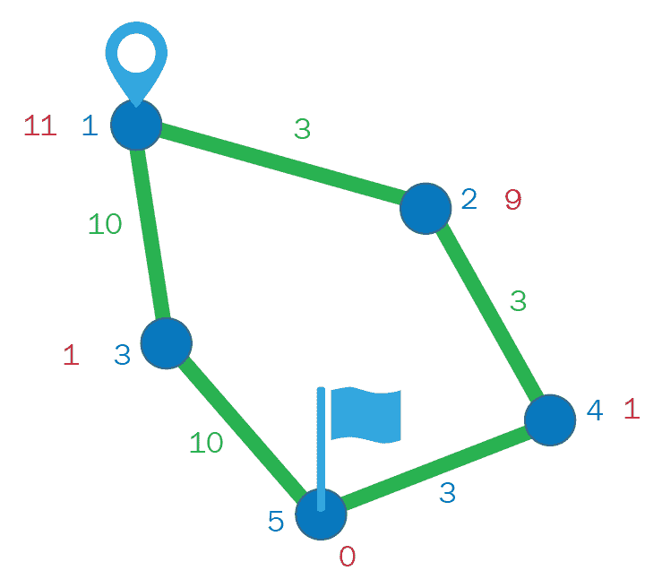

# 第三章：理解启发式搜索算法

启发式搜索是一种利用启发式方法来实现功能的人工智能搜索技术。**启发式**是一个通常能引导出答案的一般性指导原则。启发式在搜索策略中扮演着重要角色，因为大多数问题的规模是指数级的。启发式帮助减少从指数级选项中筛选出多项可能性，从而减少搜索空间。 在**人工智能**（**AI**）中，启发式搜索具有普遍重要性，同时也有其特定的重要性。一般而言，启发式一词用于指代任何通常有效，但在每种情况下并不保证成功的做法。在启发式搜索设计中，启发式通常指的是启发式评估函数的特殊实例。

在本章中，我们将讨论以下主题：

+   重访导航应用

+   优先队列数据结构

+   可视化搜索树

+   贪心**最佳优先搜索**（**BFS**）

+   A* 搜索

+   优秀启发式的特征

# 重访导航应用

在第二章《理解广度优先搜索算法》中，我们看到了大学导航应用程序，其中我们想要从公交车站找到到达人工智能实验室的路径。在 BFS 方法中，我们假设连接地点之间的距离是 1（即相同）。然而，实际情况并非如此。现在，让我们假设大学是按如下方式设计的：


图 1

绿色值表示连接地点之间的实际距离。接下来，我们创建一个字典，用于存储这些地点的位置：

```py
...
#connections between places
connections = {}
connections["Bus Stop"] = {"Library"}
connections["Library"] = {"Bus Stop", "Car Park", "Student Center"}
connections["Car Park"] = {"Library", "Maths Building", "Store"}
connections["Maths Building"] = {"Car Park", "Canteen"}
connections["Student Center"] = {"Library", "Store" , "Theater"}
connections["Store"] = {"Student Center", "Car Park", "Canteen", "Sports Center"}
connections["Canteen"] = {"Maths Building", "Store", "AI Lab"}
connections["AI Lab"] = {"Canteen"}
connections["Theater"] = {"Student Center", "Sports Center"}
connections["Sports Center"] = {"Theater", "Store"}
...
```

在 Python `NavigationData.py` 模块中，我们创建了一个名为 `connections` 的字典；该字典存储了地点之间的连接。这些连接与我们在第二章《理解广度优先搜索算法》中看到的 LinkedIn 连接功能应用中的人际连接类似：

```py
...
#location of all the places

location = {}
location["Bus Stop"] = [2, 8]
location["Library"] = [4, 8]
location["Car Park"] = [1, 4]
location["Maths Building"] = [4, 1]
location["Student Center"] = [6, 8]
location["Store"] = [6, 4]
location["Canteen"] = [6, 1]
location["AI Lab"] = [6, 0]
location["Theater"] = [7, 7]
location["Sports Center"] = [7, 5]
...
```

我们还拥有 `location` 字典，用于存储地点的位置。`location` 字典的键是地点，值是这些地点的 *x* 和 *y* 坐标。

在 DFS 中，搜索树的探索优先考虑子节点；在 BFS 中，优先考虑兄弟节点。在启发式搜索中，优先考虑启发式值较低的节点。

现在，让我们来看一下术语*启发式*。启发式是节点类别的一个属性。它是对哪个节点能比其他节点更快到达目标状态的猜测或估计。这是一种用于减少探索节点数量并更快到达目标状态的策略：


图 2

例如，假设我们位于前面图示中的红色节点，它有两个子节点——黄色节点和绿色节点。绿色节点似乎离目标状态更近，因此我们会选择这个节点进行进一步探索。

在本章接下来的内容中，我们将看到以下两种启发式搜索算法：

+   贪心广度优先搜索算法

+   A* 搜索算法

# 优先队列数据结构

**优先队列**是一种队列，其中每个元素都有一个优先级。例如，当乘客排队等候登机时，带有小孩的家庭和商务舱乘客通常优先登机；然后，经济舱乘客登机。我们来看另一个例子。假设有三个人在服务台排队等候，而一位老人走到了队伍的最后面。考虑到他的年龄，队中的人可能会给他更高的优先级，让他先走。通过这两个例子，我们可以看到优先队列中的元素具有优先级，它们按优先级顺序处理。

就像在排队中一样，我们有操作可以将元素插入到优先队列中。**插入**操作会以特定优先级插入一个元素。考虑下图，说明插入操作：


图 3

在前面的图示中，元素**A**的优先级是**5**，因为优先队列为空，元素保持在前端。在 Python 中，优先级较低的元素排列在队列的前面，而优先级较高的元素排列在优先队列的后面。这意味着优先级较低的元素先被处理，因为它们位于优先队列的前面。现在，假设元素**B**需要以优先级**10**插入。由于**10**大于**5**，元素**B**被插入到元素**A**之后。现在，假设元素**C**需要以优先级**1**插入。因为**1**小于**5**，它被排在元素**A**前面。接下来，元素**D**需要以优先级**5**插入；这里，元素**A**和**D**的优先级都是**5**，但由于**A**先插入，它具有更高的优先级。这意味着**D**被插入在**A**之后，**B**之前。

在队列中，我们有一个操作叫做**出队**，它从队列前端移除一个元素。同样地，在优先队列中，我们有一个操作叫做**获取前端元素**，它从优先队列的前端移除一个元素。因此，调用这个操作四次，应该首先移除**C**，然后是**A**，接着是**D**，最后是**B**。

在 Python 中，我们有 `Queue` 类用于优先队列数据结构。它有一个 `PriorityQueue` 方法，该方法以 `maxsize` 作为参数来创建优先队列。如果 `maxsize` 小于 `0` 或等于 `0`，则队列的大小是无限的。在我们的案例中，我们将不带参数地调用该方法，因为默认参数是 `0`。在 `PriorityQueue` 中，元组的元素是 `priority_number` 和 `data`。`Queue` 类有一个 `empty()` 方法，如果队列为空，则返回 `True`，否则返回 `False`。它还有一个 `put()` 方法，用于插入一个元组形式的项：`(priority_number, data)`。最后，我们有一个 `get()` 方法，用于返回队列前端的元素。接下来，让我们尝试这些方法，如下所示：

```py
...
import Queue

pqueue = Queue.PriorityQueue()
print pqueue.qsize()

pqueue.put((5, 'A'))
pqueue.put((10, 'B'))
pqueue.put((1, 'C'))
pqueue.put((5, 'D'))

print pqueue.qsize()

while not pqueue.empty(): 
    print pqueue.get()

print pqueue.qsize()
...
```

我们创建了一个名为 `PriorityQueue.py` 的 Python 模块，并且导入了 `Queue` 类。我们还创建了一个优先队列，并逐个插入具有特定优先级的元素。

如前面的代码所示，我们插入了一个元组，其中优先级数字为 `5`，数据为 `A`；然后，我们插入了优先级为 `10` 的元素 `B`，优先级为 `1` 的元素 `C`，以及优先级为 `5` 的元素 `D`。我们还检查了优先队列是否为空，当队列不为空时，我们逐一打印出所有元素，如下所示：


图 4

如你所见，在前面的输出中，优先队列最初是空的。插入四个元素后，队列的长度变为 `4`；当我们获取前端元素时，第一个元素是 `C`，接下来是 `A`，然后是 `D`，最后是 `B`。

# 可视化搜索树

在上一章中，你学习了 **图** 是一个节点通过边连接的结构。**树** 是一种特殊类型的图，其中没有循环，并且两个节点通过一条路径连接。为了可视化树，我们将使用 `pydot` Python 库，这是 Graphviz 的 DOT 语言的 Python 接口。在 第一章《理解深度优先搜索算法》中，我们了解到 **Graphviz** 是开源的图形可视化软件，它提供了 DOT 语言用于创建有向图的分层图形。此外，我们还将使用 `matplotlib` 库来显示最终渲染的图像。

现在，让我们使用这些库来可视化以下简单的树。它有一个根节点，并且根节点下有三个子节点：


图 5

请考虑以下代码：

```py
...
import pydot 
import matplotlib.image as mpimg
import matplotlib.pyplot as plt

#create graph object
graph = pydot.Dot(graph_type='graph', dpi = 300)

#create and add root node
rootNode = pydot.Node("0 Root", style="filled", fillcolor = "#00ee11", xlabel = "0")
graph.add_node(rootNode)
...
```

我们创建了一个名为`TreePlotTest.py`的 Python 模块，并导入了`pydot`库和`matplotlib`中所需的类。使用`pydot`的`Dot()`方法，我们可以创建一个`graph`对象，该对象将容纳图形的节点和边。我们还在此情况下指定了图像的`dpi`为`300`。我们可以使用`pydot`的`Node()`方法来创建一个节点。我们通过传递标签为`0 Root`，并使用`style`参数`filled`和`fillcolor`参数`#00ee11`来创建`rootNode`；`xlabel`为`0`。

`fillcolor`参数以十六进制格式指定。浏览到[`www.w3schools.com/colors/colors_picker.asp`](https://www.w3schools.com/colors/colors_picker.asp)选择颜色并查看其十六进制代码；稍后，你将了解为什么使用`xlabel`：

```py
...
rootNode = pydot.Node("0 Root", style="filled", fillcolor = "#00ee11", xlabel = "0")
graph.add_node(rootNode)

for i in range(3):
    #create node and add node
    childNode = pydot.Node("%d Child" % (i+1), style="filled", \
        fillcolor = "#ee0011", xlabel = "1")
    graph.add_node(childNode)

    #create edge between two nodes
    edge = pydot.Edge(rootNode, childNode)    
    #add the edge to graph
    graph.add_edge(edge)
...
```

创建好`rootNode`后，它将被添加到`graph`对象中，我们将三次创建`childNode`并为其指定适当的名称。`style`参数将为`filled`并使用另一种颜色，`xlabel`为`1`。我们还将此节点添加到图中。接着，我们将创建一个从`rootNode`到新创建的`childNode`的边，并将这条边添加到`graph`对象中。以下代码块末尾的代码片段用于全屏显示图形：

```py
...
#show the diagram
graph.write_png('graph.png')
img=mpimg.imread('graph.png')
plt.imshow(img)
plt.axis('off')
mng = plt.get_current_fig_manager()
mng.window.state('zoomed')
plt.show()
...
```

让我们运行前面的代码，看看会发生什么：


图 6

在成功执行代码后，我们将看到四个节点：根节点，然后是它下面的三个子节点。我们可以看到`0`和`1`的 xlabel 值，它们是节点的附加注释。

现在，让我们尝试修改`childNode`的名称。我们将从子节点的名称中删除数字值，使得这三个节点具有相同的名称：

```py
...
for i in range(3):
    #create node and add node
    childNode = pydot.Node("%d Child", style="filled", \
        fillcolor = "#ee0011", xlabel = "1")
    graph.add_node(childNode)
...
```

在修改了`childNode`的名称后，我们将看到如下所示：


图 7

由于这三个节点具有相同的名称，`pydot`将它们视为同一个节点。因此，我们应该尽量在搜索树中的节点使用唯一的名称。下面的图示显示了一个搜索树的示例：


图 8

在前面的图示中，我们希望可视化一个启发式搜索。每个节点都有一个启发式值。在这个例子中，**公交车站**出现了两次，因此我们使用索引值来区分多个实例。每个节点还有一个颜色编码。绿色节点已经被探索过；在这种情况下，**公交车站**和**图书馆**将被探索。红色节点已经被选择进行探索；在这种情况下，**停车场**被选择进行探索。蓝色节点是未探索的，形成了一个边缘，它们按启发式值的降序排列在优先队列中。**边缘**是一个按启发式值排序的未探索节点的优先队列。

在我们的例子中，**数学大楼**排在第一位，因为它的启发式值最小（**2.2**），接下来是**商店**，它的启发式值为**4**；然后是**学生中心**，启发式值为**8**；**图书馆**，启发式值为**8.2**；最后是**公交站**，启发式值为**8.9**。

在深度优先搜索（DFS）中，我们使用栈数据结构，优先考虑子节点。在广度优先搜索（BFS）中，我们使用队列数据结构，优先考虑兄弟节点。在启发式搜索中，我们将使用优先队列；这将优先选择距离目标最近的未探索节点，该节点是优先队列中的第一个节点：


图 9

需要对`Node`类做一些修改，以适应启发式搜索和可视化过程。引入了一个新的属性`fringe`，用于指示节点是否是边缘的一部分。引入了一个新的属性`heuristic`，构造函数也发生了变化，新增了一个参数`parentNode`。`addChild`方法被修改为`setParent`方法，我们还新增了一个名为`computeHeuristic`的方法。现在，让我们来看一下`Node`类的代码，如下所示：

```py
...
 def __init__(self, state, parentNode):
        """
        Constructor
        """
        self.state = state
        self.depth = 0
        self.children = []
        #self.parent = None
        self.setParent(parentNode)
        self.fringe = True
        #self.heuristic
        self.computeHeuristic()

    def setParent(self, parentNode):
        """
        This method adds a node under another node
        """
        if parentNode != None:
            parentNode.children.append(self)
            self.parent = parentNode
            self.depth = parentNode.depth + 1
        else:
            self.parent = None
...
```

在这里，我们已经注释掉了将父节点设置为`None`的代码。取而代之的是`setParent`方法，它将父节点作为参数并设置该属性。我们有一个名为`fringe`的属性，默认为`True`，还有一个新属性`heuristic`，它由`computeHeuristic`函数设置。如前所述，`addChild`已被设置为`setParent`，它接受`parentNode`作为参数。我们检查父节点是否不是`None`；如果不是`None`，则将节点添加到父节点的`children`属性中，并将当前节点的`parent`属性设置为`parentNode`；当前节点的深度等于`parentNode.depth + 1`。如果`parentNode`是`None`，则`parent`属性设置为`None`：

```py
...
def computeHeuristic(self):
        """
        This function computes the heuristic value of node
        """
        #find the distance of this state to goal state

        #goal location
        goalLocation = location["AI Lab"]
        #current location
        currentLocation = location[self.state.place]
        #difference in x coordinates
        dx = goalLocation[0] - currentLocation[0]
        #difference in y coordinates
        dy = goalLocation[1] - currentLocation[1]
   ...
```

还有一个新方法叫做`computeHeuristic`。这个函数将`heuristic`属性设置为一个值。我们将在*贪心* *广度优先搜索*和*A* 搜索*部分中看到这个函数如何实际工作，以及它计算的内容：

```py
...
class TreePlot:
    """
    This class creates tree plot for search tree
    """

    def __init__(self):
        """
        Constructor
        """
        # create graph object
        self.graph = pydot.Dot(graph_type='graph', dpi = 500)
        #index of node
        self.index = 0

    def createGraph(self, node, currentNode):
        """
        This method adds nodes and edges to graph object
        Similar to printTree() of Node class
        """

        # assign hex color
        if node.state.place == currentNode.state.place:
            color = "#ee0011"
        elif node.fringe:
            color = "#0011ee"
        else:
            color = "#00ee11"
...
```

在 Python 的`TreePlot.py`模块中，我们创建了一个名为`TreePlot`的类，用于创建`Node`类的树形可视化。这个类有两个属性：一个是`graph`对象，另一个是节点的`index`。它有一个名为`createGraph`的方法，用于将节点和边添加到`graph`对象中。这个方法的流程类似于`printTree`，因为它会递归地在子节点上调用。这个方法接收当前正在处理的节点和`currentNode`作为参数。`currentNode`是图中*图 8*中红色显示的节点，**停车场**。`createGraph`方法检查我们正在处理的节点是否与`currentNode`的状态相同，如果相同，则将其颜色设置为红色。如果它是边缘的一部分，则设置为蓝色。如果该节点已被探索，则将其颜色设置为绿色：

```py
... 
#create node
        parentGraphNode = pydot.Node(str(self.index) + " " + \
            node.state.place, style="filled", \
            fillcolor = color, xlabel = node.heuristic)
        self.index += 1
#add node
        self.graph.add_node(parentGraphNode)
...
```

在为节点分配了十六进制颜色后，我们将创建该节点并将其命名为`parentGraphNode`。该节点的标签是索引值和节点状态的组合，`xlabel`是节点的启发式值。在创建完这个节点后，索引值将递增，节点将被添加到图中：

```py
...
#call this method for child nodes
        for childNode in node.children:
            childGraphNode = self.createGraph(childNode, currentNode)

            #create edge
            edge = pydot.Edge(parentGraphNode, childGraphNode)

            #add edge
            self.graph.add_edge(edge)

        return parentGraphNode
...
```

对于每个`childNode`对象，我们调用`self.createGraph`方法并传入`childNode`和`currentNode`。所以，当我们在`childNode`上调用时，它应该返回相应的`pydot`节点。然后，我们可以在`parentGraphNode`和`childGraphNode`之间创建一条边。创建完这条边后，我们可以将其添加到我们的`graph`对象中：

```py
... 
def generateDiagram(self, rootNode, currentNode):
        """
        This method generates diagram
        """
        #add nodes to edges to graph
        self.createGraph(rootNode, currentNode)

        #show the diagram
        self.graph.write_png('graph.png')
        img=mpimg.imread('graph.png')
        plt.imshow(img)
        plt.axis('off')
        mng = plt.get_current_fig_manager()
        mng.window.state('zoomed')
        plt.show()
...
```

这个类还有一个方法，叫做`generateDiagram`，它接收`rootNode`和`currentNode`作为参数。首先，通过调用`createGraph`方法生成包含所有节点和边的`graph`对象，`rootNode`作为第一个参数，`currentNode`作为第二个参数。然后，我们会看到与之前展示图形时相同的代码片段。所以，如果你想可视化一个搜索树，你需要实例化一个`TreePlot`对象，并调用`generateDiagram`方法：

```py
...
from Node import Node
from State import State
from TreePlot import TreePlot

initialState = State()
root = Node(initialState)

childStates = initialState.successorFunction()
for childState in childStates:
    childNode = Node(State(childState))
    root.addChild(childNode)

treeplot = TreePlot()
treeplot.generateDiagram(root, root)
...
```

在 Python 的`TreePlotTest2.py`模块中，我们导入了必要的类——`Node`、`State`和`TreePlot`，并且正在创建一个包含根节点和第一层子节点的示例树。我们还创建了一个`TreePlot`对象，并调用了`generateDiagram`方法，参数是`root`和`root`：


图 10

在前面的图中，我们可以看到根节点和第一层的子节点。

现在你已经学会了如何可视化树结构，在接下来的部分，你将学习贪心最佳优先搜索。

# 贪心 BFS

在*重新审视导航应用*部分，你已经学到启发式值是节点的一个属性，它是一个猜测或估计，表示哪个节点能比其他节点更快地到达目标状态。这是一种用来减少探索节点数量并更快达到目标状态的策略。在**贪心 BFS**中，启发式函数计算到达目标状态的估计代价。对于我们的应用，启发式函数可以计算到目标状态的直线距离，如下所示：


图 11

如你所见，在上面的图中，初始状态是**Bus Stop**。从**Bus Stop**节点出发，我们有一个通道，即**Library**节点。假设我们现在在**Library**，从**Library**节点出发，有三个子节点：**Car Park**、**Bus Stop**和**Student Center**。在现实生活中，我们更倾向于去**Car Park**，因为它似乎离目标状态更近，且到达**AI Lab**的几率也更高：

```py
...
#connections between places
connections = {}
connections["Bus Stop"] = {"Library"}
connections["Library"] = {"Bus Stop", "Car Park", "Student Center"}
connections["Car Park"] = {"Library", "Maths Building", "Store"}
connections["Maths Building"] = {"Car Park", "Canteen"}
connections["Student Center"] = {"Library", "Store" , "Theater"}
...
```

让我们使用这四个地点（`Library`、`Car Park`、`Bus Stop` 和 `Student Center`）的位置信息来计算这三个节点的启发式值。当你计算这三个节点的启发式值时，你会发现`Car Park`的值是`6.4`，`Bus Stop`的值是`8.9`，`Student Center`的值是`8.0`。根据这些启发式值，我们将选择边界中的第一个值，也就是启发式值最小的节点（`Car Park`）：

```py
...
def computeHeuristic(self):
        """
        This function computes the heuristic value of node
        """
        #find the distance of this state to goal state

        #goal location
        goalLocation = location["AI Lab"]
        #current location
        currentLocation = location[self.state.place]
        #difference in x coordinates
        dx = goalLocation[0] - currentLocation[0]
        #difference in y coordinates
        dy = goalLocation[1] - currentLocation[1]
        #distance
        distance = math.sqrt(dx ** 2 + dy ** 2)
        print "heuristic for", self.state.place, "=", distance
        self.heuristic = distance
...
```

让我们来看一下前面的`computeHeuristic`函数。`Node`类有一个名为`computeHeuristic`的方法。该函数通过计算从当前状态到目标状态的距离来计算节点的启发式值。你可以通过使用导航数据中的`location`字典，并以 AI 实验室作为键，来找到目标位置。你可以通过使用`location`字典，并以当前位置作为键，来找到当前地点。我们通过以下方式计算`x`坐标的差值：`dx = goalLocation[0] - currentLocation[0]`。我们通过以下方式计算`y`坐标的差值：`dy = goalLocation[1] - currentLocation[1]`。最后，我们通过计算`dx`的平方加`dy`的平方的平方根来得到距离，并将这个距离赋值给`Node`类的`heuristic`属性：


图 12

现在你已经理解了这个启发式函数，我们来看看贪心 BFS 算法的流程。该算法的流程类似于 BFS，不同的是它使用的是优先队列而不是队列，我们将计算节点的启发式值，并将节点和启发式值一起加入优先队列中：

1.  我们首先创建根节点并将其添加到树中，然后将该节点及其启发式值一起添加到优先队列中。

1.  我们从优先队列中获取前一个节点，并检查它是否有目标状态。如果有，我们就结束搜索；如果没有目标状态，我们就找到它的子节点，添加它们到树中，然后将它们连同启发式值一起添加到优先队列中。

1.  我们继续这个过程，直到找到目标状态或搜索流中的所有节点都已被遍历完。

让我们尝试按以下方式编写贪婪 BFS 算法：

```py
...
def performGreedySearch():
    """
    This method performs greedy best first search
    """

    #create queue
    pqueue = Queue.PriorityQueue()

    #create root node
    initialState = State()
    #parent node of root is None
    root = Node(initialState, None)

    #show the search tree explored so far
    treeplot = TreePlot()
    treeplot.generateDiagram(root, root)

    #add to priority queue
    pqueue.put((root.heuristic, root))
        while not pqueue.empty(): 

        #get front node from the priority queue
        _, currentNode = pqueue.get()

        #remove from the fringe
        #currently selected for exploration
        currentNode.fringe = False

        print "-- current --", currentNode.state.place

...
```

在 Python `GreedySearch.py`模块中，我们创建了一个`performGreedySearch()`方法，该方法将执行贪婪 BFS。在这个方法中，我们创建了一个空的优先队列来存储节点。通过`initialState`，我们创建了一个根节点，正如之前提到的，构造性节点已经改变；父节点中多了一个额外的参数。对于根节点，父节点是`None`。

我们正在创建一个`TreePlot`对象并调用其`generateDiagram()`方法来可视化当前的搜索树。在这种情况下，搜索树将只包含根节点。我们将根节点及其启发式值添加到优先队列中。我们检查优先队列是否为空；如果不为空，我们获取队列的前一个元素并将其命名为`currentNode`。如前所述，优先队列的格式是一个包含启发式值和节点的元组。由于我们只关心节点，因此会忽略启发式值。我们将`currentNode`的`fringe`属性设置为`False`，因为它当前已被选中进行探索：

```py
...
#check if this is goal state
        if currentNode.state.checkGoalState():
            print "reached goal state"
            #print the path
            print "----------------------"
            print "Path"
            currentNode.printPath()

            #show the search tree explored so far
            treeplot = TreePlot()
            treeplot.generateDiagram(root, currentNode)
            break
#get the child nodes 
        childStates = currentNode.state.successorFunction()
        for childState in childStates:

            #create node 
            #and add to tree
            childNode = Node(State(childState), currentNode)

            #add to priority queue
            pqueue.put((childNode.heuristic, childNode))

        #show the search tree explored so far
        treeplot = TreePlot()
        treeplot.generateDiagram(root, currentNode)
...
```

我们检查当前节点是否具有目标状态；如果它有目标状态，我们将打印从初始状态到目标状态的路径。我们通过调用`treeplot.generateDiagram`方法来显示当前的搜索树。如果没有目标状态，我们会找到当前节点的子状态，并为每个`childState`使用新的构造函数创建`childNode`。在这个新的构造函数中，我们将父节点作为`currentNode`传递，并将子节点及其启发式值添加到优先队列中；然后我们显示当前的搜索树。

所以，我们实际上在每一步都显示搜索树，每当搜索树的一层被添加时。在这种情况下，搜索树只包含根节点。当添加一层搜索树时，我们会显示搜索树；最后，当我们到达目标状态时，我们会准备并显示已经探索过的搜索树：


图 13

正如你在前面的输出中看到的，我们的搜索树中有一个启发式值为`8.9`的根节点。`Bus Stop`节点已被选中进行探索，它的子节点`Library`已经被添加到搜索树中。`Library`的启发式值是`8.2`，低于`Bus Stop`的启发式值`8.9`。由于这是唯一的“fringe”节点，它将在稍后被选中进行探索：


图 14

如上图所示，`Library`已被选中进行探索，并且`Library`节点的子节点已被添加。我们可以看到，对于边缘上的三个子节点，`Bus Stop`的启发式值为`8.9`，`Car Park`的启发式值为`6.4`，而`Student Center`的启发式值为`8.0`。在这三个节点中，`Car Park`的启发式值最低，因此它将被选中进行探索：


图 15

现在，`Car Park`已被选中进行探索，并且其子节点已被添加到优先队列中。此时，边缘中有五个节点。`Bus Stop`的启发式值为`8.9`，`Maths Building`的启发式值为`2.2`，`Library`的值为`8.2`，`Store`的值为`4`，`Student Center`的值为`8.0`。这五个节点中，`Maths Building`的启发式值最低（`2.2`），因此它将被选中进行探索：


图 16

现在，`Maths Building`已被选中进行探索，并且其子节点已被添加到搜索树中。在边缘中的节点中，`Canteen`的启发式值最低（`1.0`），因此它将被选中进行探索：



图 17

现在，`Canteen`节点已被选中进行探索，并且其子节点已被添加到搜索树和边缘。所有蓝色节点中，`AI Lab`的启发式值最低（`0.0`），因此它将被选中进行探索：


图 18

最终，`AI Lab`被选中进行处理，我们发现我们已经达到了目标状态，因此我们在这里结束搜索。最优路径由绿色节点和红色节点表示。最优路径是`Bus Stop`、`Library`、`Car Park`、`Maths Building`、`Canteen`和`AI Lab`。

当我们从初始状态到达目标状态时，我们可以观察到启发式值在减少。`Bus Stop`的值为`8.9`，`Library`的值为`8.2`，`Car Park`的值为`6.4`，`Maths Building`的值为`2.2`，`Canteen`的值为`1`，`AI Lab`的值为`0`。这意味着，当我们遍历搜索树时，我们正逐渐接近目标状态。在贪心 BFS 算法中，启发式值随着我们朝目标状态前进而减少。

现在你已经了解了贪心 BFS 算法的启发式函数，在接下来的部分，你将学习贪心 BFS 算法的问题，并且你将看到 A*搜索如何解决这些问题。

# A* 搜索

在前面的部分，你学到了贪心 BFS 找到的路径如下：


图 19

总覆盖距离为**14.24**。然而，实际的最优解如下图所示：


图 20

总行驶距离是**12**。这意味着贪心 BFS 算法并非最优。问题在于，启发式函数没有考虑到已经发生的成本。A*搜索提出了一种新的启发式函数，它计算了已经发生的成本与到目标状态的预计成本之和。

对于我们的应用，启发式函数可以计算从根节点到当前节点的已行驶距离与到目标状态的直线距离之和。让我们看一下我们在上一节中看到的例子，并为三个节点**停车场**、**公交车站**和**学生中心**计算这个新的启发式函数：


图 21

对于**停车场**，已经行进的距离是**2** + **5**，到目标状态的距离是**6**，所以新的启发式值为**13.4**。对于**公交车站**，已经行进的距离是**2** + **2**，即**4**，到目标状态的距离是**8.9**，因此**公交车站**的新的启发式函数值为**4** + **8.9**，即**12.9**。对于**学生中心**，已经行进的距离是**2** + **2**，即**4**，到目标状态的距离是**8**，所以**学生中心**的新的启发式函数值为**4** + **8**，即**12**。根据这些新的启发式值，我们将选择**学生中心**进行进一步探索：


图 22

除了我们在*可视化搜索树*部分看到的对`Node`类的更改外，我们将引入一个名为`costFromRoot`的属性和一个名为`computeCost`的方法。`costFromRoot`属性表示从根节点到当前节点的行驶距离，这个值将通过`computeCost`函数计算得出：


图 23

让我们看看`computeCost`方法是如何工作的。如前面的图所示，我们有三个节点：**公交车站**、**图书馆**和**停车场**。**公交车站**到**图书馆**的距离是**2**，**图书馆**到**停车场**的距离是**5**。由于**公交车站**是初始状态，该节点的成本是**0**。对于**图书馆**，根节点到它的成本是**2**，对于**停车场**，`costFromRoot`是**2** + **5**，即**7**。这也是它的父节点的成本加上父节点与当前节点之间的距离。所以，我们可以写出如下公式：

*costFromRoot = 父节点的 costFromRoot + 父节点到当前节点的距离*

让我们看一下这个方法的代码。在查看`computeCost`方法之前，我们先看一下`computeDistance`方法：

```py
...
def computeDistance(self, location1, location2):
        """
        This method computes distance between two places
        """
        #difference in x coordinates
        dx = location1[0] - location2[0]
        #difference in y coordinates
        dy = location1[1] - location2[1]
        #distance
        distance = math.sqrt(dx ** 2 + dy ** 2)
        return distance
...
```

这个方法计算两个位置之间的距离，它将`location1`和`location2`作为参数。它通过计算 *x* 坐标的差值得到 `dx`，即 `dx = location1[0] - location2[0]`，并通过计算 *y* 坐标的差值得到 `dy`，即 `dy = location1[1] - location2[1]`。然后它通过计算 `dx` 的平方加 `dy` 的平方的平方根来得到距离，并返回这个距离：

```py
...
def computeCost(self):
        """
        This method computes distance of current node from root node
        """

        if self.parent != None:
            #find distance from current node to parent
            distance = self.computeDistance(location[self.state.place], \
                location[self.parent.state.place])
            #cost = parent cost + distance
            self.costFromRoot = self.parent.costFromRoot + distance
        else:
            self.costFromRoot = 0
...
```

`computeCost` 方法计算当前节点到根节点的距离。所以，我们检查 `parent` 属性是否为 `None`。然后，我们计算从当前节点到父节点的距离，并计算 `costFromRoot` 为父节点的 `costFromRoot` 加上我们刚刚计算的距离；如果父节点是 `None`，则 `costFromRoot` 为 `0`，因为这是根节点：

```py
...
def computeHeuristic(self):
        """
        This function computes the heuristic value of node
        """

        #find the distance of this state from goal state
        goalLocation = location["AI Lab"]
        currentLocation = location[self.state.place]
        distanceFromGoal = self.computeDistance(goalLocation,  
        currentLocation)

        #add them up to form heuristic value
        heuristic = self.costFromRoot + distanceFromGoal

        print "heuristic for", self.state.place, "=", 
        self.costFromRoot, distanceFromGoal, heuristic
        self.heuristic = heuristic
...
```

现在，我们来看一下`computerHeuristic`方法。就像在贪心 BFS 中一样，我们找出目标位置为`AI 实验室`的地点，并且找出当前地点与目标地点之间的距离。接着，我们计算启发式值，将`costFromRoot`和`distanceFromGoal`相加，并将`heuristic`属性赋值为这个启发式值：


图 24

如前面的图所示，A* 搜索的流程实际上与贪心 BFS 相同。那么，我们来看一下 A* 搜索的代码，如下所示：

```py
...
def performAStarSearch():
    """
    This method performs A* Search
    """

    #create queue
    pqueue = Queue.PriorityQueue()

    #create root node
    initialState = State()
    root = Node(initialState, None)

    #show the search tree explored so far
    treeplot = TreePlot()
    treeplot.generateDiagram(root, root)

    #add to priority queue
    pqueue.put((root.heuristic, root))
...
```

在 Python 的 `AStar.py` 模块中，我们创建了一个名为 `performAStarSearch` 的方法，它包含了 A* 搜索的代码；这段代码与贪心 BFS 的代码完全相同：


图 25

最初，我们有一个启发式值为`8.9`的根节点，并选择`公交车站`节点进行扩展；它的`图书馆`子节点被添加，并且该节点的启发式值为`10.2`。由于这是唯一在边界的节点，它将被选中进行探索：


图 26

现在`图书馆`节点被选中进行探索，它的三个子节点被添加。`公交车站`的启发式值为`12.9`，`停车场`的启发式值为`13.4`，`学生中心`的启发式值为`12`。在这三者中，`学生中心`的启发式值最低，因此它将被选中进行探索：


图 27

现在`学生中心`被选中进行探索，它的三个子节点被添加到边界。在边界的五个节点中，`商店`的启发式值最低，因此它将被选中进行探索：


图 28

现在`商店`被选中进行探索，它的四个子节点被添加。在边界的八个节点中，`食堂`的启发式值最低，因此它将被选中进行探索：


图 29

现在`Canteen`已被选中进行探索，其子节点被添加到搜索树和边界中。在所有边界中的节点中，`AI Lab`具有最低的启发式值，因此该节点将被选中进行探索：


图 30

当`AI Lab`被选中进行探索时，我们发现已经遇到了目标状态，因此停止搜索。

最优路径由绿色节点和红色节点表示。最优路径是从`Bus Stop`到`Library`，再到`Student Center`，然后到`Store`，最后到`Canteen`，最终到`AI Lab`。当我们从根节点遍历到目标节点时，我们发现启发式函数的值要么保持不变，要么增加。因此，`Bus Stop`的值为`9`，`Library`的值为`10.2`，`Student Center`的值为`12.0`，`Store`的值为`12.0`，`Canteen`的值为`12.0`，最后`AI Lab`的值为`12.0`。因此，在这个例子中，我们了解到启发式函数在从初始状态到目标状态的过程中是增加或保持不变的，并且我们还观察到 A* 搜索是最优的。我们看到贪婪的 BFS 不是最优的，现在我们能理解为什么。我们看到了一种新的启发式函数，这使得 A* 是最优的。在下一节中，我们将探讨一个好的启发式函数应该具备哪些特点。

# 什么是好的启发式函数？

为了回答这个问题，*为什么需要一个好的启发式函数？* 我们将把深度优先搜索（DFS）和广度优先搜索（BFS）方法与启发式搜索方法进行比较。在 DFS 和 BFS 中，所有边的成本都等于**1**，DFS 会探索所有子节点，而 BFS 会探索所有兄弟节点。在启发式搜索中，边的成本是不同的，启发式搜索根据启发式函数选择要探索的节点。

通过使用启发式函数，我们可以减少所使用的内存，并且可以在更短的时间内达到解决方案。接下来需要回答的问题是，*为什么需要一个好的启发式函数？* 答案是为了找到**最优解**。在我们的 A* 搜索示例中，我们通过使用更好的启发式函数，说明了我们能够找到最优解；很明显，A* 探索的节点数量最少。现在，让我们来看看一个好的启发式函数的属性。

# 好的启发式函数的属性

一个好的启发式函数的属性将在接下来的章节中详细说明。

# 可接受性

一个好的启发式函数应该是可接受的，这意味着启发式函数的值应该小于或等于到达目标的真实成本：


图 31

假设节点**1**是根节点，节点**5**是目标状态，而我们正在为节点**2**计算启发式函数；以下内容适用：

+   **d12**是从**1**到**2**的路径成本

+   **d24**是从节点**2**到**4**的路径成本

+   **d45**是从节点**4**到节点**5**的代价

+   **d23**是从节点**2**到节点**3**的代价

+   **d35**是从节点**3**到节点**5**的代价

然后，为了使我们的函数是可接受的，必须满足以下条件：

+   节点**2**的启发式函数值应该小于或等于**d24** + **d45**

+   节点**2**的启发式函数值应该小于或等于**d23** + **d35**



图 32

在前面的例子中，节点**1**是根节点，节点**5**是目标状态。红色值表示估计到目标状态的代价，绿色值表示边的真实代价：

1.  假设我们已经探索过节点**1**，并将节点**2**和**3**添加到了边缘。接下来，我们将计算节点**2**和**3**的启发式函数值。

1.  节点**2**的启发式值为**3** + **9**，即**12**，节点**3**的启发式值为**10** + **1**，即**11**；基于这些值，我们选择节点**3**进行进一步探索。

1.  我们将节点**3**的子节点，即节点**5**，添加到边缘。边缘包含节点**2**和节点**5**。我们之前已经计算了节点**2**的启发式函数值为**12**，节点**5**的启发式函数值为**10** + **10** + **0**，即**20**。所以，基于这些值，我们将选择节点**2**进行探索。

1.  我们将节点**2**的子节点，即节点**4**，添加到边缘。现在，边缘包含节点**4**和节点**5**。我们之前已经计算了节点**5**的启发式函数值为**20**，并将计算节点**4**的启发式函数值为**3** + **3** + **1**，即**7**。基于这些值，我们将选择节点**4**进行进一步探索。

1.  我们将节点**4**的子节点，即节点**5**，添加到边缘。边缘通过路径[1-3-5]包含节点**5**，并且通过路径[1-2-4-5]也包含节点**5**。我们之前已经计算了节点**5**通过路径[1-3-5]的启发式函数值为**20**。所以，我们计算节点**5**通过路径[1-2-4-5]的启发式函数值为**3** + **3** + **3** + **0**，即**9**。基于这些值，我们选择路径[1-2-4-5]上的节点**5**；当我们处理这个节点时，我们看到已经到达了目标状态，并在此结束搜索。

在这个例子中，你看到在搜索过程中，我们偏离了路径来探索节点**3**。后来，我们发现最优解是[1-2-4-5]。因此，一个可接受的启发式函数确保找到了最优解。

# 一致性

一个好的启发式函数应具备的第二个属性是它应该是一致的，这意味着它应该是非递减的：


图 33

例如，节点**3**的启发式函数应该大于（或等于）节点**2**的启发式函数，而节点**4**的启发式函数值应该大于（或等于）节点**2**的启发式函数值。让我们通过以下图示来看看为什么会这样：


图 34

假设节点**1**和**2**是中间节点，节点**5**是目标状态。首先，**x1**是从节点**1**到节点**5**的估计成本，**x2**是从节点**2**到目标状态的估计成本；**d12**是从节点**1**到节点**2**的成本。

假设节点**2**离目标状态比节点**1**更近；这意味着以下陈述适用：

```py
x2 < x1 
```

假设以下陈述为真：

```py
x2 =100 
x1= 101 
d12 >= 1 
```

上述代码意味着`x1 <= d12 + x2`。

假设`TC1`是从根节点到节点**1**的真实成本；那么，节点**1**的启发式函数如下：

```py
h(1) =TC1 + x1 
```

节点**2**的启发式函数如下：

```py
h(2) = TC1 + d12 + x2 
```

这是因为`d12 + x2 >= x1`；节点**2**的启发式值大于或等于节点**1**的启发式函数值（即，`h(2)>=h(1)`）。

# 总结

你现在应该理解什么是启发式函数，以及优先队列数据结构。在本章中，你学会了如何可视化搜索树。你了解了贪心最佳优先搜索的启发式函数和该算法的步骤。我们还讨论了与贪心最佳优先算法相关的问题，以及 A*搜索是如何解决这些问题的。最后，你了解了一个好的启发式函数所需的属性。

请参阅链接[`www.packtpub.com/sites/default/files/downloads/HandsOnArtificialIntelligenceforSearch_ColorImages.pdf`](https://www.packtpub.com/sites/default/files/downloads/HandsOnArtificialIntelligenceforSearch_ColorImages.pdf)以获取本章的彩色图像。
