# 第三章：导航

*路径查找背后的问题是与克诺索斯迷宫一样古老：如何使用最短路径从点 A 到点 B，同时避开所有中间的障碍物？*

已经开发了许多算法来解决路径查找问题，包括与 A*算法相关的问题，该算法最早在 20 世纪 60 年代计算机科学中引入（第二部分）。

路径查找例程是许多视频游戏的典型组件，非玩家角色（NPC）的任务是在游戏地图上找到最优路径，这些路径可以不断变化。例如，通道、门或门在游戏过程中可以改变其状态。

在路径查找方面存在许多问题，不幸的是，我们并没有一个通用的解决方案。这是因为每个问题都会有其特定的解决方案，这取决于问题的类型。不仅如此，它还取决于你正在开发的游戏类型。例如，AI 的最终目的地是一个静态建筑（静止的），还是他们需要跳上漂浮的筏子（动态的）？你还需要考虑地形——它是平坦的还是多岩石的，等等？为了增加额外的复杂性，我们还需要考虑是否存在障碍物，以及这些物体是静态的（如消防栓）还是可以移动的（例如箱子）。然后，我们需要考虑实际的路径本身。例如，沿着道路旅行可能更容易，但穿越屋顶会更快地到达目的地。遵循同样的思路，AI 可能甚至没有最终目的地，从某种意义上说，他们不需要去某个特定的地方。例如，他们可能只是像村庄里的人一样四处闲逛。然而，我仅仅指出了与路径查找相关的一些问题和考虑因素。随着你经历使用路径查找的不同情况，你可能会遇到其他问题。请记住要有耐心，并考虑我提到的所有变量以及其他特定于你情况的因素。

幸运的是，虚幻引擎已经集成了可以用于最常见情况的导航系统。因此，我们不需要从头开始重新实现一切。本章的主要目标是确保你了解如何使用它，并确保你对如何扩展它有一些想法。

在本章中，我们将涵盖以下主题：

+   对**导航系统**的期望

+   **虚幻导航系统**及其工作原理

+   如何**生成导航网格**以及其可用设置

+   如何**修改导航网格**，以下方法：

    +   **导航区域**，以改变与导航网格一部分相关的权重

    +   **导航链接**，以连接原本分开的导航网格的两部分

    +   ***导航过滤器***，在执行对*导航系统*的特定查询时对导航网格进行轻微的更改

让我们深入探讨吧！

# 对导航系统有什么期望

首先，在我们探索***虚幻导航系统***之前，定义一下我们对一个通用的*导航系统*的期望是有用的。以下是从*导航系统*中所需的内容：

+   需要确定在地图上的两个通用点之间是否存在一条路径（可以由执行查询的代理穿越）

+   如果存在这样的路径，则返回对代理最方便的路径（通常是最近的路径）

然而，在搜索最佳路径时，有许多方面需要考虑。一个好的导航系统不仅应该考虑这些方面，而且应该在相对较短的时间内执行查询。以下是一些这些方面的例子：

+   执行查询的人工智能代理能否通过地图上的特定部分？例如，可能有一个湖，AI 角色可能不知道如何游泳。同样，代理能否蹲下并进入通风隧道？

+   人工智能代理可能想要避免（或偏好）某些路径，这些路径不一定是最近的。例如，如果一座建筑着火了，代理应该尽量避免这种情况，否则可能会被烧伤。作为另一个例子，假设有两条路径：一条被敌人的火力覆盖，但路程较长，而另一条路程较短但暴露在敌人的火力下；AI 应该选择哪一条？虽然这可能是决策过程的一部分，但在路径查找的层面上可以实施一些启发式方法，并且导航系统应该支持它们。

+   地图可能是动态的，这意味着障碍物、物体、道路、悬崖等在游戏过程中会发生变化。导航系统能否在实时处理这些变化的同时，并纠正生成的路径？

现在，是时候看看虚幻是如何实现所有这些功能的了。

# 虚幻导航系统

虚幻导航系统基于一个***导航网格***（简称***Nav Mesh***）。它包括将可导航空间划分为区域——在这种情况下，多边形——这些区域被细分为三角形以提高效率。然后，为了到达某个地方，每个三角形被视为图中的一个节点，如果两个三角形相邻，则它们的相应节点相连。在这个图上，你可以执行路径查找算法，如带有欧几里得距离启发式的 A*算法，甚至更复杂的算法（例如 A*的变体或考虑不同成本的系统）。这将在这几个三角形之间产生一条路径，AI 角色可以行走。

在现实中，这个过程要复杂一些，因为将所有三角形视为一个巨大图的网络节点会产生一个好的结果，但这是低效的，尤其是当我们能够访问存储在多边形中的信息以及这些多边形是如何连接的时候。此外，你可能还需要关于特定三角形的一些额外信息，这些三角形可能具有不同的成本、穿越它们所需的不同能力等。然而，除非你需要改变*导航系统*的底层结构，否则你不需要在这个细节级别上进行工作/操作。能够理解所有三角形以某种方式形成一个图，路径查找算法可以在其中运行，就足以掌握这个工具本身。

要能够使用*导航系统*，让我们了解设置导航系统的主过程。在这个阶段，我们不再担心系统是如何构建的，而是如何使用其所有功能。系统会完成剩下的工作。同样，我们需要向导航系统提供有关地图的信息（例如，指定特殊区域）。通常，这是你的团队中的 AI 程序员负责这项工作，但如果你的团队规模较小，关卡设计师可能会负责这项任务。尽管没有特定的流程，而是一个迭代过程，但让我们探索你可以用来在 Unreal 中定义*导航网格*的不同步骤——或者如果你更喜欢，工具。我们将在本章中详细检查它们。

+   **导航网格的生成**：这是第一步。在你能够使用以下工具之前，生成一个*导航网格*非常重要。这一步骤包括定义如何生成多边形、三角形、*导航网格*的精度，甚至确定哪些类型的代理将穿越这个特定的*导航网格*。

+   **导航网格修改器**：*导航网格*的各个部分并不都是相同的，这是一个工具，用于指定*导航网格*的哪些部分应该有不同的行为。实际上，正如我们之前所看到的，可能有一个含有毒气体的区域，代理会希望避开这部分，除非他们真的不得不穿越它。导航网格修改器允许你指定包含气体的区域是特殊的。然而，区域内的行为类型（例如，这条路径不应该穿越，或者只有具有游泳能力的代理才能穿越）是在导航区域内指定的。

+   **导航区域**：这允许你指定特定类型的区域应该如何行为，是否应该避开等。在执行*导航过滤*以确定代理可以穿越哪些区域时，这些信息是关键的。

+   **导航链接**：这些可以连接*导航网格*的两个不同部分。假设你有一个平台边缘。默认情况下，AI 代理会找到另一条路。如果你考虑的是第三人称地图模板，需要从平台上下来的代理会绕过该区域使用楼梯，而不是直接从平台上掉落/跳跃。一个***导航链接***允许你连接平台上的*导航网格*部分与下面的部分。结果，代理将能够从平台上掉落。然而，请注意，***导航链接***可以连接*导航网格*的两个通用部分，从而允许路径查找通过跳跃、传送等方式找到路径。

+   **导航过滤**：我们并不一定希望每次都以相同的方式找到路径。***导航过滤***允许我们定义针对特定实例（在路径查找被调用以寻找路径的特定时间）如何执行路径查找的特定规则。

让我们逐一分析这些点，并更详细地讨论它们。

# 生成导航网格

在虚幻引擎中生成简单的*导航网格*相当直接。让我们看看我们如何能完成它。从***模式***面板，在***体积***选项卡中，你可以找到**导航网格边界体积**，如下截图所示：

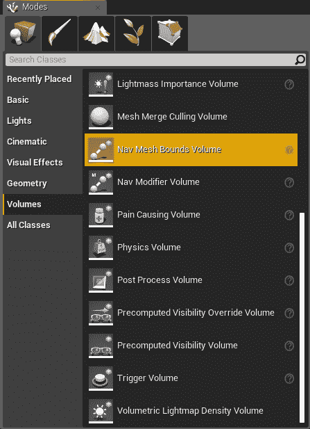

将其拖入世界。你会注意到与地图相比，体积相当小。该体积内的所有内容都将被考虑以生成*导航网格*。当然，*导航网格*有许多参数，但为了简单起见，我们现在保持简单。

如果你按下键盘上的`P`按钮，你将能够在*视口*中看到*导航网格*，如下截图所示：

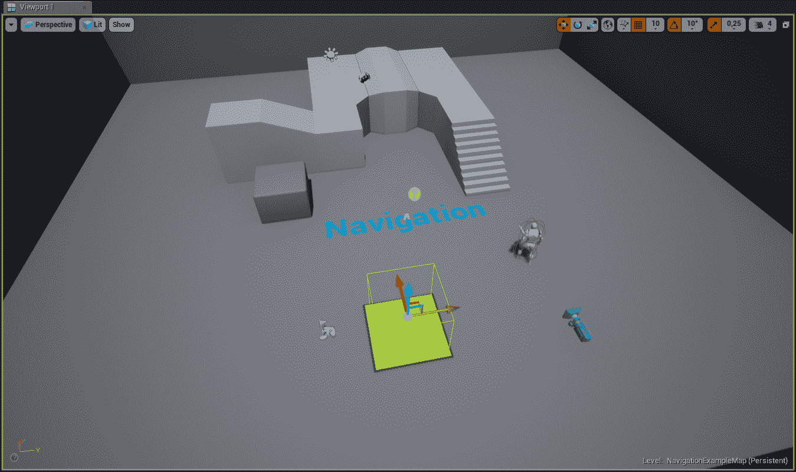

如你所见，它限制在***导航网格边界体积***所包含的区域。让我们调整***导航网格边界体积***以适应我们拥有的所有关卡。你的关卡应该看起来像这样：

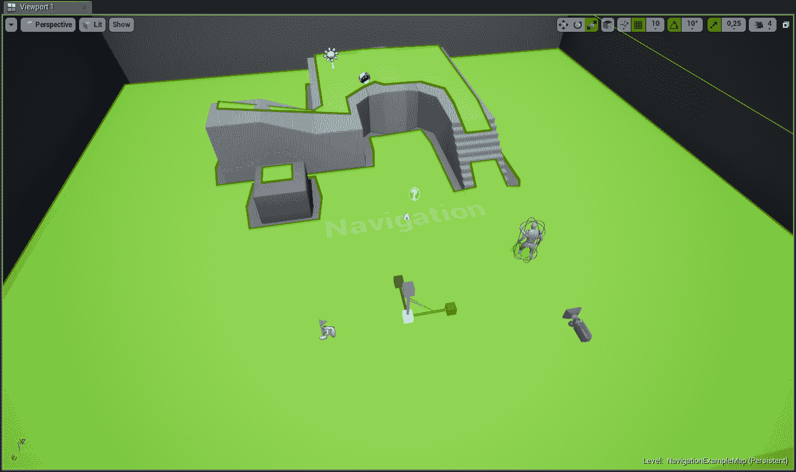

你注意到当你调整体积时，*导航网格*会自动更新吗？这是因为，在虚幻引擎中，每次影响*导航网格*的任何东西移动时，都会生成*导航网格*。

在更新过程中，受影响的*导航网格*部分（即更新的部分）应变为红色，如下截图所示：

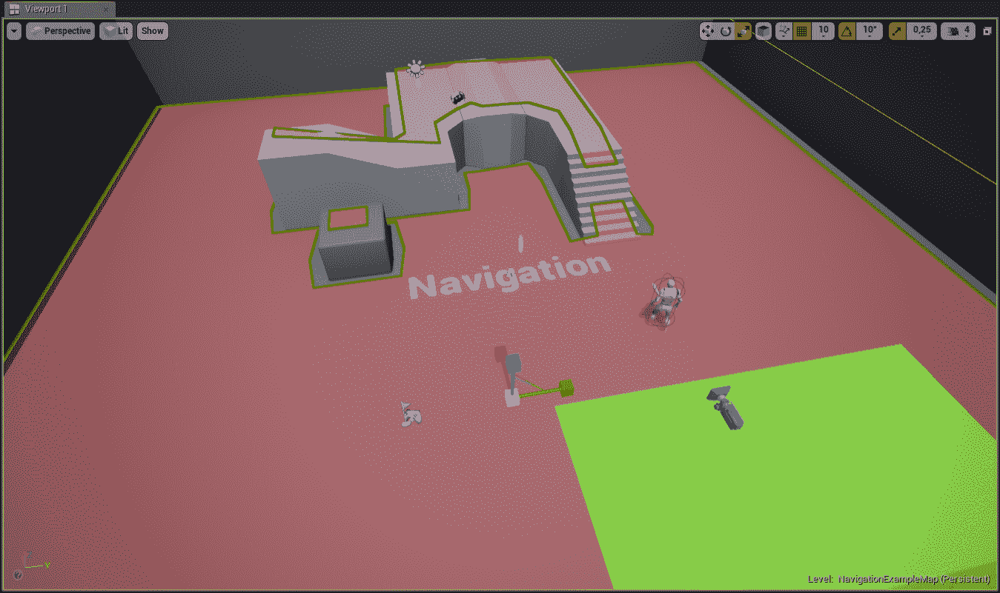

这就是生成*导航网格*有多简单。然而，为了能够掌握这个工具，我们需要了解更多关于如何细化*导航网格*以及它是如何被 AI 使用的。

# 为导航网格设置参数

如果你点击***导航网格边界体积***，你会注意到没有生成*导航网格*的选项。事实上，一些参数是在项目级别，而另一些是在地图级别。

让我们导航到**世界轮廓图**，在那里你会发现场景中已经放置了一个**RecastNavMesh-Default**演员，如下面的截图所示：

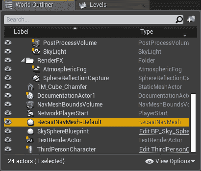

实际上，当你拖动**导航网格边界体积**时，如果地图中没有**RecastNavMesh-Default**，则会创建一个。如果我们点击它，我们将在**详细信息面板**中能够更改其所有属性。

如你所见，有很多默认值。这些可以在**项目设置**（在**导航网格**选项卡下）中更改。让我们逐个分析每个部分，并尝试掌握它们的主要概念。

# 显示设置

正如名称所示，这些是与如何详细可视化我们生成的**导航网格**相关的设置。特别是，我们将能够看到生成的多边形、三角形以及多边形是如何连接的。我们将在第十二章*，AI 调试方法 - 导航、EQS 和性能分析*中更详细地介绍这些内容，届时我们将讨论调试工具：

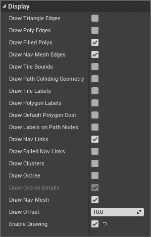

# 生成设置

这些设置涉及**导航网格**的生成。通常，默认值已经足够好，可以开始使用，因此只有在你了解自己在做什么的情况下才应该更改这些值。以下截图显示了这些设置：

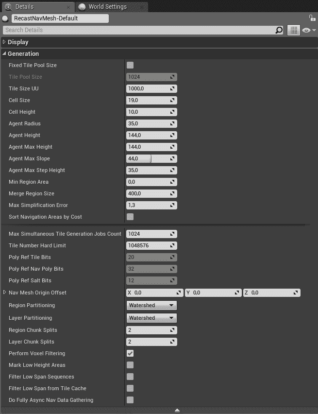

了解这些设置的最好方法是调整它们的参数，首先在一个示例地图中，然后在自己的地图中进行。之后，你需要检查这样做的结果（特别是第十二章中介绍的视觉调试工具，*AI 调试方法 - 导航、EQS 和性能分析*）。为了帮助你入门，让我们看看主要的设置：

+   **瓦片大小 UU**：此参数定义了生成的多边形的精细程度。较低的值意味着更精确的导航网格，具有更多的多边形，但生成时间会更长（并且可能使用更多的内存）。你可以通过在显示设置中打开**绘制三角形边缘**来查看此参数的效果，如前一个截图所示。

+   **单元格高度**：这决定了生成的单元格从地板的高度（这可能会导致连接不同高度的区域，所以请小心）。

+   *代理设置*（**半径**、**高度**、**最大高度**、**最大坡度**、**最大步高**）：这些设置针对您的代理，应适当指定。特别是，这些是代理穿越此*Nav Mesh*所需的最小值。因此，*Nav Mesh*将无法导航具有比这些值更小值的代理，因为*Nav Mesh*只为满足这些要求的代理生成。这些设置有助于为您的代理生成适当的*Nav Mesh*，而不会在代理永远无法导航的区域浪费资源。

+   **最小区域面积**：这消除了*Nav Mesh 生成*中的一些过于微不足道的瑕疵。

许多剩余的设置都是关于优化的，它们可能会让人感到不知所措，尤其是对于 AI 编程的新手来说。因此，我决定不将这些细节包含在本书中。然而，一旦您对使用导航系统有信心，您就可以检查这些设置的提示，并尝试它们，以便了解它们的作用。

# 项目设置

值得注意的是，即使我们不详细讨论，相同的*导航*设置也可以从***项目设置***中更改；有一个专门的选项卡，如下图所示：

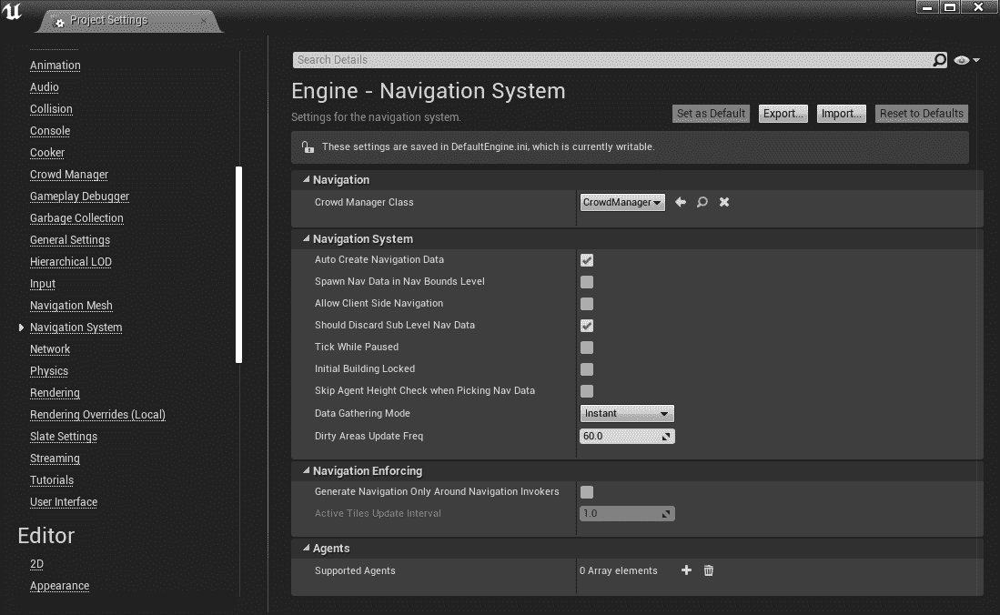

有趣的是，最后一个选项卡是关于*代理*的。在这里，您可以创建一个***支持代理数组***，以便不同的代理可以以不同的方式在*Nav Mesh*中导航。例如，鼠标可能有一个与巨魔非常不同的*导航网格*。事实上，鼠标还可以进入小洞，而巨魔则不能。在这里，您将能够指定您拥有的所有不同类型的代理：

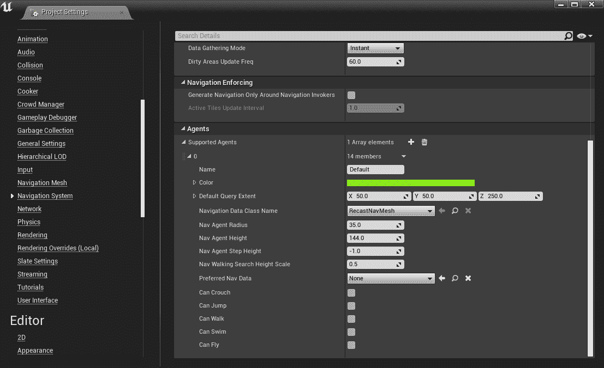

您不能直接指定角色将跟随哪种类型的*代理*，但基于*角色移动组件*（或一般意义上的*移动组件*），会将一种代理分配给*角色/AI 代理*。

# 角色移动组件上的设置

如前节所述，代理的能力、形状等对其在*Nav Mesh*中的导航有很大影响。您可以在*角色移动组件*中找到所有这些设置。

然而，这个组件超出了本书的范围，我们不会看到它。

# 修改导航网格

到目前为止，我们已经看到了如何生成导航网格。然而，我们希望对其进行修改，使其更好地满足我们的需求。正如我们之前提到的，可能会有一些区域穿越成本较高，或者*Nav Mesh*中两个点之间的连接似乎被隔开（例如，由悬崖隔开）。

因此，本节探讨了 Unreal 中用于修改*Nav Mesh*的不同工具，以便它可以适应关卡。

# Nav Modifier Volume

好的——现在是时候看看我们如何开始修改 *Nav Mesh* 了。例如，可能有一些我们不希望 AI 可以穿越的 *Nav Mesh* 部分，或者我们希望另一部分具有不同的属性。我们可以通过使用 ***Nav Modifier Volume*** 来实现这一点。

您可以通过转到 *Mode* 面板，在 *Volumes* 选项卡下，然后转到 *Nav Mesh Bounds Volume* 来找到此设置：

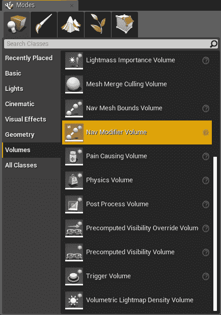

一旦这个体积被放置到地图中，默认值是移除体积内的 ***Nav Mesh*** 部分，如下面的截图所示：

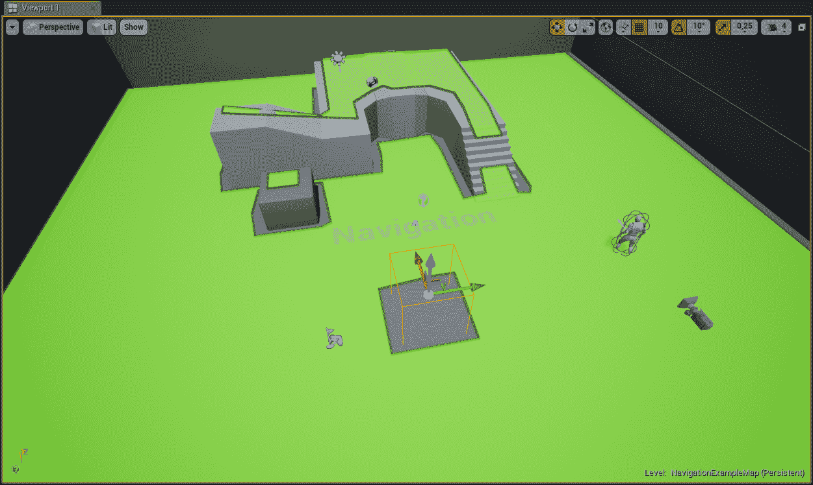

当你有不想让 AI 进入的区域，或者修复导航网格的瑕疵时，这很有用。尽管 ***Nav Modifier Volume*** 指定了地图的一部分，但其行为是在 ***Nav Mesh Areas*** 中指定的。这意味着，如果我们查看 ***Nav Mesh Modifier Volume*** 的设置，我们只能找到一个与 *Navigation* 相关的设置，名为 ***Area Class***：


因此，本卷只能指定应用了特定 ***区域类别*** 的地图的一部分。默认情况下，***区域类别*** 是 ***NavArea_Null***，它将地图中与该体积重叠的部分的 *Nav Mesh* “移除”。我们将在下一节中探讨 ***Nav Mesh Areas*** 的工作原理。

# Nav Mesh Areas

在上一节中，我们讨论了地图的可导航区域并非所有部分都同等重要。如果有一个被认为是危险区域的区域，AI 应该避开它。虚幻引擎内置的导航系统能够通过使用成本来处理这些不同的区域。这意味着 AI 将通过计算路径上的所有成本来评估要采取的路径，并选择成本最低的那条路径。

此外，还值得指出的是，存在两种类型的成本。对于每个区域，都有一个进入（或离开）区域的基本成本和穿越区域的成本。让我们通过几个例子来澄清这两种成本之间的区别。

想象一下有一个森林，但在森林的每个入口处，AI 都需要向森林中的土著居民支付通行费。然而，一旦进入森林，AI 可以自由移动，就像他们在外面一样。在这种情况下，进入森林有成本，但一旦进入，就没有成本需要支付。因此，当 AI 需要评估是否穿越森林时，这取决于是否有其他路线以及他们这样做需要多长时间。

现在，想象一下有一个区域充满了毒气。在这个第二种情况下，进入该区域的成本可能是零，但穿越该区域的成本很高。事实上，AI 在该区域停留的时间越长，它的健康值损失就越多。是否值得进入不仅取决于是否有替代路线以及穿越替代路线需要多长时间（就像在先前的例子中那样），还取决于一旦进入，AI 需要穿越该区域多长时间。

在 Unreal 中，成本是在类中指定的。如果你点击一个 ***Nav Modifier Volume***，你会注意到你需要指定一个 ***Area Class***，如下面的截图所示：

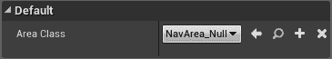

如你所猜，默认值是 ***NavArea_Null***，进入该区域的成本是无限的，导致 AI 从不进入该区域。导航系统足够智能，甚至不会生成该区域，将其视为不可导航区域。

然而，你可以更改 ***Area 类***。默认情况下，你将能够访问以下 *Area Classes*：

+   ***NavArea_Default***：这是默认生成的区域。如果你想在同一个位置有多个这些修饰符，那么它很有用。

+   **NavArea_LowHeight**：这表明该区域不适合所有代理，因为高度降低了（例如，在通风隧道的情况下，并非所有代理都能适应/蹲下）。

+   **NavArea_Null**：这使得该区域对所有代理都不可导航。

+   **NavArea_Obstacle**：这会给区域分配更高的成本，因此代理会想要避开它：

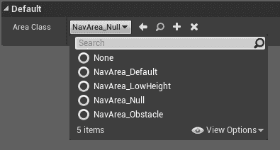

你会注意到，如果你创建一个新的蓝图，或者甚至当你在 Visual Studio 中打开源代码时，都会有一个 **NavArea_Meta** 以及它的一个子项，**NavArea_MetaSwitchingActor**。然而，如果你查看它们的代码，它们主要有一些过时的代码。因此，我们在这本书中不会使用它们。

然而，你可以通过扩展 ***NavArea 类*** 来扩展不同区域列表（并且可能添加更多功能）。让我们看看我们如何在蓝图和 C++ 中做到这一点。当然，就像我们在上一章中做的那样，我们将创建一个名为 *Chapter3/Navigation* 的新文件夹，我们将把所有的代码放在这个文件夹中。

# 在蓝图中创建 NavArea 类

在蓝图中创建一个新的 ***NavArea*** 类相当简单；你只需要创建一个新的蓝图，它继承自 ***NavArea*** 类，如下面的截图所示：

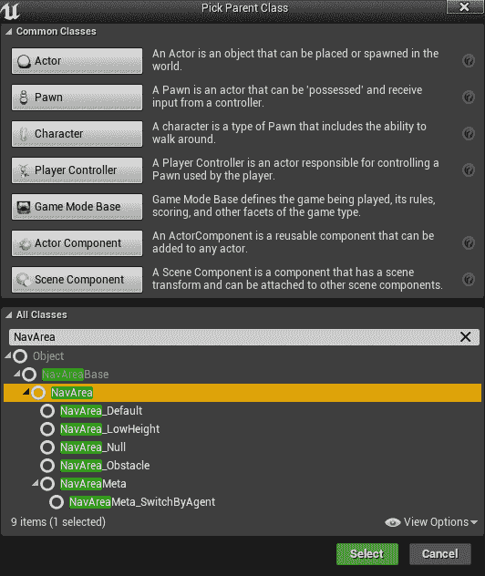

按照惯例，类的名称应该以 "*NavArea_" 开头。在这里我们将将其重命名为 ***NavArea_BPJungle***（我添加了 BP 来表示我们是用蓝图创建的，因为我们同时在蓝图和 C++ 中重复执行相同的任务）。这是它在 *内容浏览器* 中的样子：

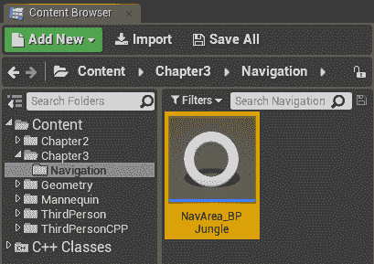

然后，如果你打开蓝图，你将能够为该区域分配自定义成本。你还可以为你的区域指定一个特定的颜色，以便在构建*导航网格*时易于识别。这是默认情况下*详细信息*面板的外观：

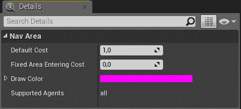

现在，我们可以根据我们的需求进行自定义。例如，我们可能想要为进入*丛林*设置一个成本，并且穿越它时设置一个略高的成本。我们将使用明亮的绿色作为颜色，如下面的截图所示：

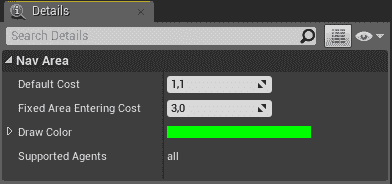

编译并保存后，我们可以将这个新创建的区域分配给***Nav Modifier Volume***，如下面的截图所示：

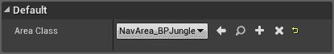

这是我们级别中完成后的类的外观（如果*导航网格*可见）：

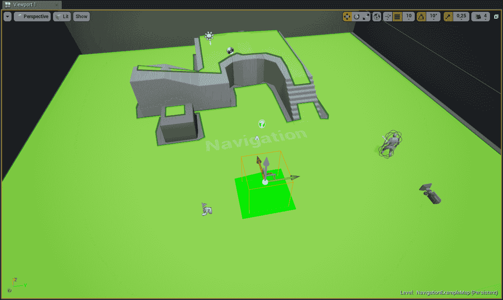

# 在 C++中创建 NavArea 类

在 C++中创建一个***NavArea***类同样简单。首先，你需要创建一个新的 C++类，该类从***NavArea***类继承，如下面的截图所示：

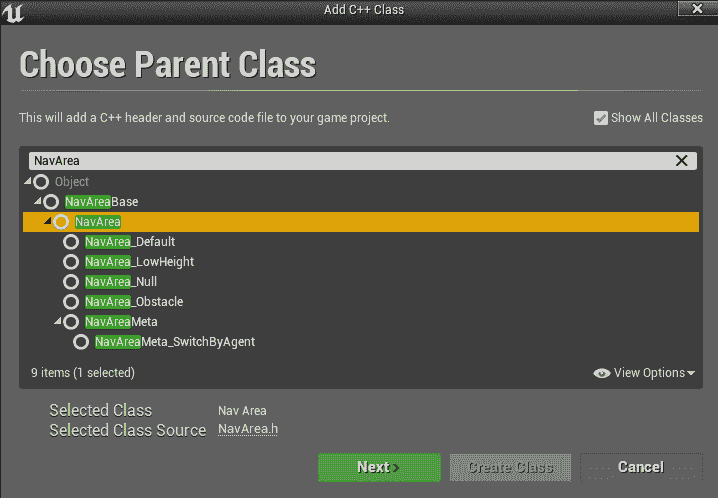

按照惯例，名称应该以"*NavArea_*"开头。因此，你可以将其重命名为***NavArea_Desert***（只是为了改变 AI 可能遇到的哪种地形，因为我们之前创建了一个*丛林*），并将其放置在"***Chapter3/Navigation***"：

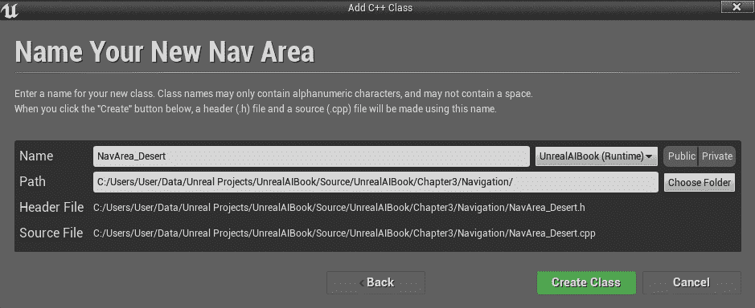

一旦创建了类，你只需要在构造函数中分配参数。为了方便起见，以下是类定义，其中我们声明了一个简单的构造函数：

```py
#include "CoreMinimal.h"
#include "NavAreas/NavArea.h"
#include "NavArea_Desert.generated.h"

/**
 * 
 */
UCLASS()
class UNREALAIBOOK_API UNavArea_Desert : public UNavArea
{
  GENERATED_BODY()

  UNavArea_Desert();

};
```

然后，在构造函数的实现中，我们可以分配不同的参数。例如，我们可以为进入设置一个高成本，为穿越设置一个更高的成本（相对于*默认*或*丛林*）。此外，我们可以将颜色设置为*黄色*，以便我们记住这是一个沙漠区域：

```py
#include "NavArea_Desert.h"

UNavArea_Desert::UNavArea_Desert()
{
  DefaultCost = 1.5f;
  FixedAreaEnteringCost = 3.f;
  DrawColor = FColor::Yellow;
}
```

你可以随时调整这些值以查看哪个最适合你。例如，你可以创建一个进入成本非常高但穿越成本很低的区域。结果，如果只穿越一小段时间，该区域应该被避免，但如果代理穿越它的时间较长，它可能比较短路线更方便。

一旦创建了类，你可以将其设置为***Nav Modifier Volume***的一部分，如下面的截图所示：

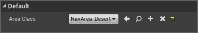

因此，你将能够在*导航网格*（在这种情况下，带有*黄色*）中看到你的自定义区域：*

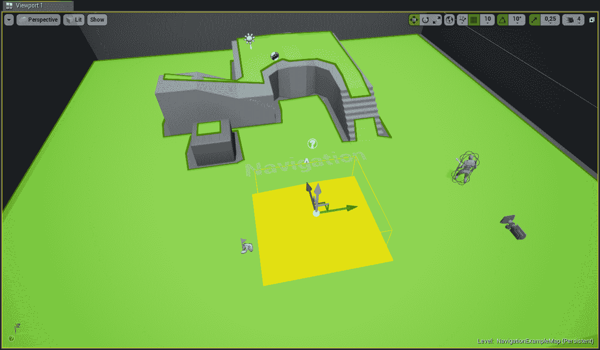

# 导航链接代理

默认情况下，如果有一个悬崖，AI 不会从悬崖上掉下去，即使这是它们到达目的地的最短路径。实际上，悬崖上的“*导航网格*”并没有（直接）与底部的“*导航网格*”连接。然而，“**虚幻导航系统**”提供了一种通过所谓的“**导航链接代理**”连接“*导航网格*”中任意两个三角形的方法。

尽管区域是连接的，路径查找器也会找到正确的道路，但 AI 不能违反游戏规则，无论是物理规则还是游戏机制。这意味着如果 AI 无法跳跃或穿越魔法墙，角色会卡住，因为路径查找器返回了一条路径，但角色无法执行它。

让我们更详细地探索这个工具。

# 创建导航链接代理

要通过链接连接两个区域，我们需要进入“**模式**”面板，在“**所有类**”选项卡中并选择“**导航链接代理**”，如图所示：

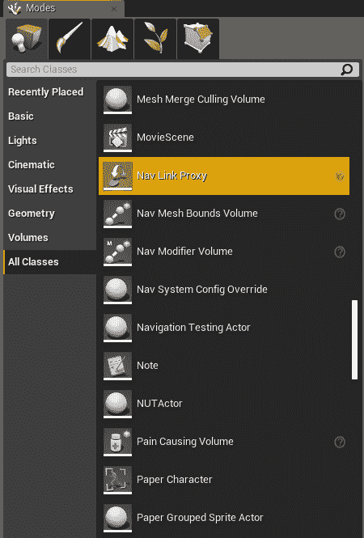

或者，你可以在“**模式**”面板中搜索它以更快地找到它：

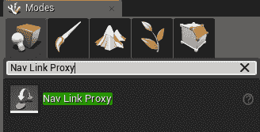

一旦链接被放置在层级中，你将看到一个“*箭头/链接*”，并且你可以修改链接的起始点和终点。它们被称为“**左**”和“**右**”，设置它们位置的最简单方法是拖动（并放置）它们在“*视口*”中。结果，你将能够连接“*导航网格*”的两个不同部分。正如我们在以下截图中可以看到的，如果“*导航网格*”是可见的（通过按“`P`”键启用），你将看到一个连接“**右**”和“**左**”节点的箭头。这个箭头指向两个方向。这将导致链接是**双向的**：

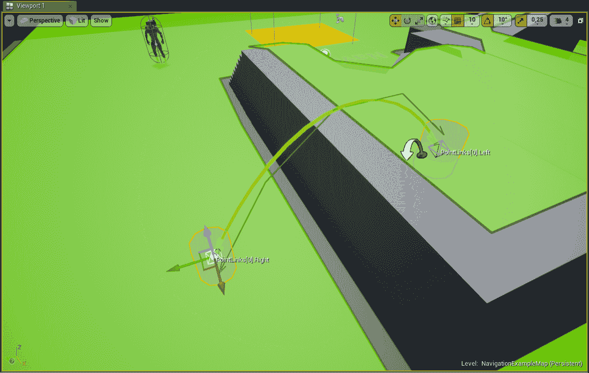

你可能会注意到有两个箭头，一个带有较深的绿色阴影。此外，这个第二个“*箭头/弧/链接*”可能并不完全在你放置的“*右*”端点处，而是附着在“*导航网格*”上。你可以在以下截图中更清楚地看到这个第二个箭头：

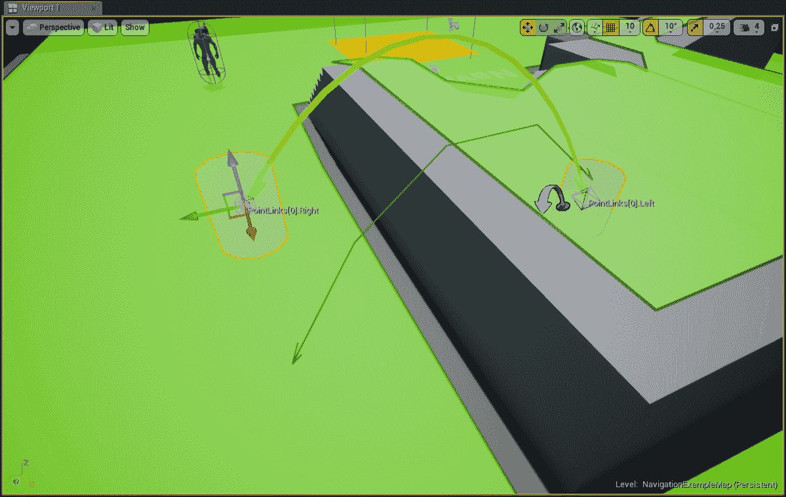

这实际上是“*导航网格*”是如何通过“*链接*”的“**投影设置**”连接起来的。我们将在下一节中探讨这个设置。

如果你想让链接只向一个方向走，我们可以在“**详情面板**”中更改这个设置。然而，要探索这些设置，我们首先需要理解存在两种不同的“**链接**”类型：“**简单**”和“**智能**”。

# 简单链接和智能链接

当我们创建一个“**导航链接代理**”时，它附带一系列“**简单链接**”。这意味着我们可以使用单个“**导航链接代理**”将“*导航网格*”的不同部分连接在一起。然而，“**导航链接代理**”还附带一个默认禁用的单个“**智能链接**”。

让我们了解**简单链接**和**智能链接**之间的相似之处和不同之处。

# 简单链接和智能链接

**简单链接和智能链接**的行为方式相似，即在意义上将*导航网格*的两个部分连接起来。此外，这两种类型的链接都可以有**方向**（*从左到右*，*从右到左*，或*双向*）和**导航区域**（链接所在的导航区域类型；例如，您可能希望在通过此链接时使用自定义成本）。

# 简单链接

**简单链接**存在于*导航代理链接*中的**点链接数组**中，这意味着在单个*导航代理链接*中可以存在多个简单链接。要创建另一个*简单链接*，您可以从*详细信息*面板中向*简单节点*数组添加一个额外的元素，如下所示：

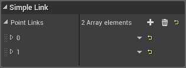

一旦我们有了更多的**简单链接**，我们可以设置**起始**和**结束**位置，就像我们为第一个链接所做的那样（通过选择它们并在*视口*内移动它们，就像其他任何代理一样）。以下截图显示了我在同一*导航代理链接*旁边放置的两个*简单链接*的位置：

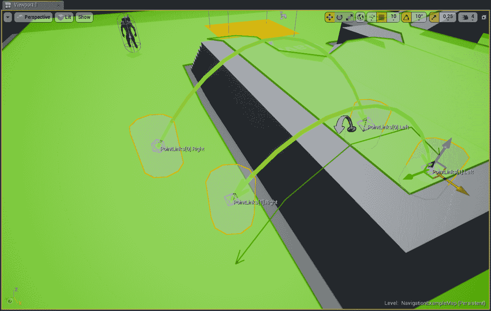

每次我们创建一个*导航链接代理*时，它都会在数组中包含一个*简单链接*。

对于我们在*点链接数组*中的每个**简单链接**，我们可以通过展开项目来访问其设置。以下截图显示了第一个*简单链接*的设置：

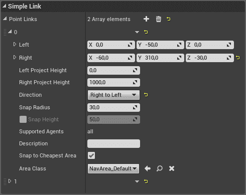

让我们了解这些不同的设置：

+   **左**和**右**：链接**左**和**右**端的位置，分别。

+   **左投影高度**和**右投影高度**：如果此数字大于零，则链接将分别投影到*链接*的**左**和**右**端导航几何形状上（使用最大长度由此数字指定的跟踪）。您可以在以下截图中看到此投影链接：


+   **方向**：这指定了链接工作的方向。此外，*视口*中的箭头将相应更新。此选项的可能如下：

    +   **双向**：链接是双向的（请记住，AI 需要能够以两个方向穿越链接；例如，如果我们正在越过悬崖，代理需要能够从它上掉落（链接的一个方向）和跳跃（链接的另一个方向）。

    +   **从左到右**：链接只能从左端向右端穿越（代理仍然需要具备在该链接方向行进的能力）。

    +   **从右到左**：链接只能从右端向左端穿越（代理仍然需要具备在该链接方向行进的能力）。

+   ***吸附半径***和***高度半径***：您可能已经注意到连接每个链接末端的圆柱体。这两个设置控制该圆柱体的半径和高度。查看*吸附到最便宜的区域*以获取有关该圆柱体使用的更多信息。以下截图显示第一个链接有一个更大的圆柱体（更大的半径和更高的高度）：

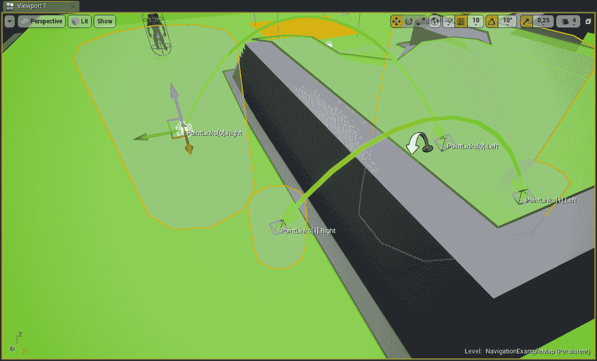

+   ***描述***：这只是一个字符串，您可以在其中插入方便的描述；它对*导航*或*链接*没有影响。

+   ***吸附到最便宜的区域***：如果启用，它将尝试将链接端连接到由*吸附半径*和*高度半径*指定的圆柱体内的最便宜的三角形区域。例如，如果圆柱体同时与*默认导航区域*和*BPJungle*导航区域（我们之前创建的）相交，链接将直接连接到*默认导航区域*，而不是丛林。

+   ***区域类***：链接可能具有穿越成本，或属于特定的*导航区域*。此参数允许您定义链接穿越时是哪种类型的*导航区域*。

这就结束了所有关于***简单链接***的可能性。然而，这是一个非常强大的工具，让您能够塑造*导航网格*并实现惊人的 AI 行为。现在，让我们深入了解*智能链接*。

# 智能链接

智能链接可以通过使用“***智能链接相关***”布尔变量在*运行时*启用和禁用。您还可以通知周围的演员这一变化。默认情况下，它是不相关的（它没有被使用，即链接不可用），并且每个*导航代理链接*只有一个***智能链接***。

**请注意，不要混淆**：智能链接可以处于两种状态：启用和禁用。然而，如果链接实际上是“存在/存在”（对于导航网格），这又是另一个属性（*智能链接相关*），换句话说，这意味着链接对于导航系统来说是“*活动*”的（但它仍然可以处于启用或禁用状态）。

不幸的是（至少对于当前版本的引擎），这些在编辑器中是不可见的，这意味着需要手动设置***起始***和***结束***位置。

然而，让我们来看看*智能链接*的设置：

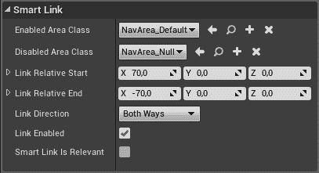

+   ***启用区域类***：这是链接启用时假设的*导航区域*。默认为*NavArea_Default*。

+   ***禁用区域类***：这是链接禁用时假设的*导航区域*。这意味着当链接禁用时，如果分配了可穿越的区域（例如，当链接禁用时，我们可能希望有非常高的成本来穿越，但我们仍然希望它能够穿越。当然，默认为*NavArea_Default*，这意味着它不可穿越。

+   ***链接相对起始***：这表示链接的起始点，相对于其*导航链接代理*的位置。

+   ***链接相对结束***：这表示链接的结束点，相对于其*导航链接代理*的位置。

+   ***链接方向***：这指定了链接工作的方向。可能的选项如下：

    +   ***双向***：链接是双向的（记住 AI 需要能够双向穿越链接；例如，在悬崖上，代理需要能够从上面掉落（链接的一个方向）和跳跃（链接的另一个方向）。

    +   ***从左到右***：链接只能从左端穿越到右端（代理仍然需要在该链接方向上移动的能力）。

    +   ***从右到左***：链接只能从右端穿越到左端（代理仍然需要在该链接方向上移动的能力）。

虽然此参数的选项将链接的端点标记为*左*和*右*，但它们指的是链接的*起始*点和*结束*点。或者（这可能更好，因为链接可以是双向的），*链接相对起始*和*链接相对结束*指的是*左*和*右*。

+   ***链接启用***：这是一个布尔变量，用于确定*智能链接*是否启用。此值可以在运行时更改，并且链接可以"*通知*"对这种信息感兴趣的周围代理/演员（见后文了解更多信息）。默认值是 true。

+   ***智能链接相关***：这是一个布尔变量，用于确定*智能链接*是否实际上是"*活动状态*"，即它是否相关，或者我们应该忽略它。默认值是 false。

这些是关于智能链接的主要设置。

值得注意的是，*智能链接*实际上可以做的不仅仅是连接导航网格。它们有一系列处理正在穿越链接的代理的功能。例如，通过打开`NavLinkProxy.h`文件，我们可以找到以下函数：

```py
  /** called when agent reaches smart link during path following, use ResumePathFollowing() to give control back */
  UFUNCTION(BlueprintImplementableEvent)
  void ReceiveSmartLinkReached(AActor* Agent, const FVector& Destination);

  /** resume normal path following */
  UFUNCTION(BlueprintCallable, Category="AI|Navigation")
  void ResumePathFollowing(AActor* Agent);

  /** check if smart link is enabled */
  UFUNCTION(BlueprintCallable, Category="AI|Navigation")
  bool IsSmartLinkEnabled() const;

  /** change state of smart link */
  UFUNCTION(BlueprintCallable, Category="AI|Navigation")
  void SetSmartLinkEnabled(bool bEnabled);

  /** check if any agent is moving through smart link right now */
  UFUNCTION(BlueprintCallable, Category="AI|Navigation")
  bool HasMovingAgents() const;
```

不幸的是，这些功能超出了本书的范围，但我邀请您阅读代码以了解更多关于它们的信息。

之前我们提到，*智能链接*可以在运行时向附近的代理/演员广播有关其状态变化的信息。您可以通过以下***广播***设置更改*智能链接*广播此信息的方式，这些设置位于*智能链接*下方：

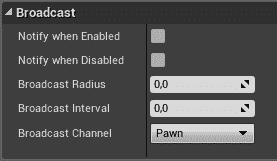

这些设置相当直观，但让我们快速浏览一下：

+   ***启用时通知***：如果为真，链接将在启用时通知代理/演员。

+   ***禁用时通知***：如果为真，链接将在禁用时通知代理/演员。

+   ***广播半径***：这指定了广播应该延伸多远。所有位于此半径之外的代理都不会收到关于链接变化的通知。

+   ***广播间隔***：这指定了链接应该在多长时间后重复广播。如果值为零，则广播只重复一次。

+   ***广播频道***：这是用于广播变化的跟踪频道。

这就结束了我们对 ***智能链接*** 的讨论。

# 其他 Nav Link Proxy 设置

最后，值得一提的是，当生成 *Nav Mesh* 时，***Nav Link Proxy*** 可以创建一个 *障碍盒*。你可以在 ***Nav Link Proxy*** 的 *详细信息面板* 中找到这些设置，如下面的截图所示：

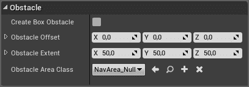

这些设置允许你决定是否激活/使用 *障碍盒*，其 *尺寸/范围* 和偏移量，以及 *导航区域* 的类型。

# 扩展 Nav Link Proxy

如果你想知道是否可以扩展 *链接* 或在更复杂的演员中包含它们，答案是“*当然可以！但你只能用 C++ 扩展它们*”。

由于这本书不能涵盖所有内容，我们没有时间详细处理这部分。然而，你可能想要扩展 ***Nav Link Proxy*** 的原因之一是更好地控制进入你的链接的角色。例如，你可能想要有一个 *跳跃垫* 将角色推过链接。这并不复杂，如果你在网上搜索，你会找到很多关于如何使用 *导航链接* 来实现这一点的教程。

只需记住，要成为一名优秀的 Unreal AI 程序员，你最终需要掌握 *Nav Links* 的这部分内容，但就目前而言，我们已经涵盖了足够的内容。

# 导航规避

导航规避是一个非常广泛的话题，Unreal 有一些子系统为我们处理这个问题。因此，我们将把这个话题放在 第六章*，人群* 中讨论。

# 导航过滤

我们不希望每次都以相同的方式找到特定的路径。想象一下，我们的 AI 代理使用了一个增强效果，它能够以两倍的速度穿越丛林。在这种情况下，导航系统没有意识到这种变化，这也不是对 *Nav Mesh* 形状或权重的永久性更改。

***导航过滤*** 允许我们定义在特定时间段内如何执行路径查找的具体规则。你可能已经注意到，每次我们在蓝图或 C++ 中执行导航任务时，都有一个可选参数用于插入一个 ***导航过滤器***。以下是一些具有此可选过滤器参数的蓝图节点（C++ 函数也是如此）的示例：

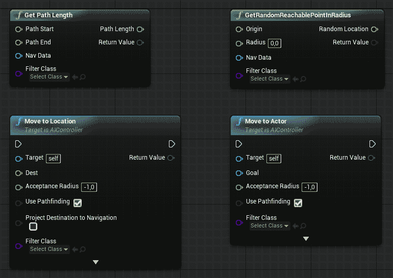

即使是 ***行为树*** 中的 ***移动到*** 节点也有 ***导航过滤器*** 选项：

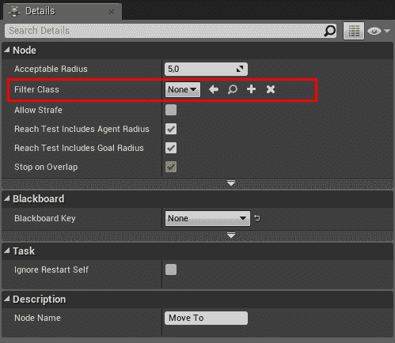

当然，一旦您插入了一个过滤器，路径查找将相应地表现。这意味着使用***导航过滤器***非常简单。然而，我们如何创建***导航过滤器***？让我们在蓝图和 C++中找出答案。

# 在蓝图创建导航过滤器

在本章之前，我们在蓝图中创建了一个丛林区域。因此，这似乎是一个很好的例子，我们可以用它来创建一个允许 AI 代理更快地穿越丛林——甚至比穿越*导航网格*的*默认区域*还要快——的***导航过滤器***。让我们想象 AI 代理有一些力量或能力，允许它在关卡中的丛林类型区域中更快地移动。

要在蓝图创建一个***导航过滤器***，我们需要开始创建一个新的蓝图，该蓝图继承自***NavigationQueryFilter***，如下面的截图所示：

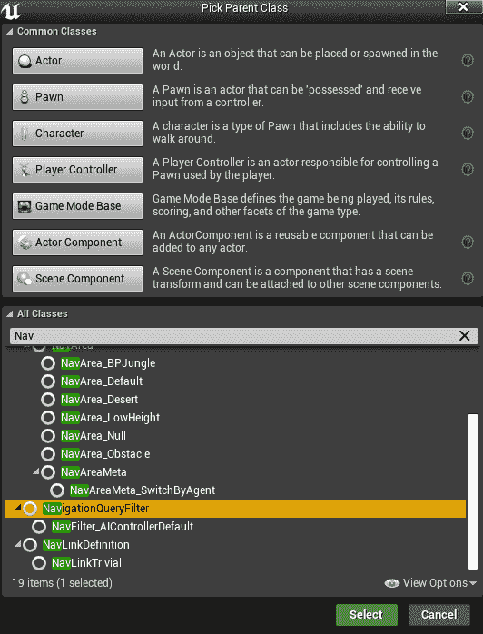

按照惯例，类的名称应该以"*NavFilter_***"开头。我们将将其重命名为***NavFilter_BPFastJungle***（我添加了 BP，以便我可以记住我是用蓝图创建的，因为我们正在蓝图和 C++中重复相同的任务）。这是它在*内容浏览器*中的样子：

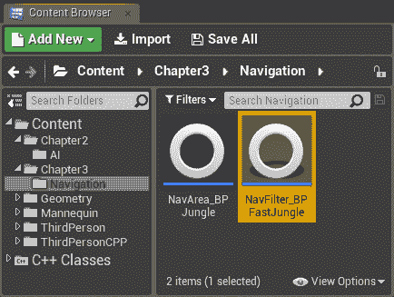

一旦我们打开蓝图，我们将在*详细信息*面板中找到其选项：

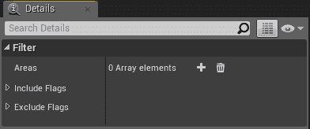

如您所见，有一个***区域数组***和两个用于*包括和排除（导航）标志*的集合。不幸的是，我们没有涵盖*导航标志*，因为它们超出了本书的范围，并且在撰写时只能在 C++中分配。然而，***区域数组***非常有趣。让我们添加一个新的区域，并使用我们的***NavArea_BPJungle***作为***区域类***，如下面的截图所示：

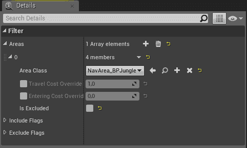

现在，我们可以覆盖丛林区域的***旅行成本***和***进入成本***，如果使用此过滤器，则将使用这些成本代替我们在区域类中指定的成本。请记住勾选选项旁边的复选框以启用编辑。例如，我们可以将***旅行成本***设置为***0.6***（因为我们可以快速通过丛林而不会遇到任何问题），并将***进入成本***设置为***零***：

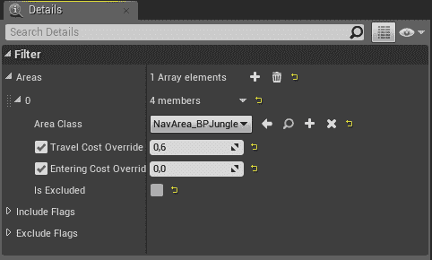

现在，我们一切都准备好了。过滤器已准备好供您在丛林中旅行时使用！

**为** **导航区域** **更改** **旅行成本** **并不会使 AI 代理在该区域更快或更慢，它只是使路径查找更倾向于该路径而不是另一条路径**。代理在该区域变得更快是实现，被排除在*导航系统*之外，因此您需要在 AI 角色在丛林中时实现这一点。

如果你同时也跟随了*Nav Areas*的 C++部分，那么你应该在你的项目中也有沙漠区域。作为一个可选步骤，我们可以向过滤器添加第二个区域。想象一下，通过使用在丛林中移动更快的加成或能力，我们的角色对阳光变得非常敏感，很容易晒伤，这会显著降低他们的健康。因此，如果使用此过滤器，我们可以为*沙漠区域*设置更高的成本。只需添加另一个区域，并将***区域类***设置为***NavArea_Desert***。然后，覆盖成本；例如，一个***旅行成本***为***2.5***和***进入成本***为***10***：

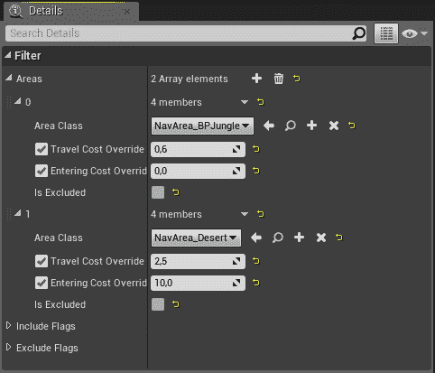

一旦你完成了设置编辑，保存蓝图。从现在起，你将能够在*导航系统*中使用此过滤器。这标志着如何在蓝图中创建***Nav Filter***的方法结束。

# 在 C++中创建导航过滤器

以类似蓝图的方式，我们可以创建一个 C++的***Nav Filter***。这次，我们可以创建一个稍微降低沙漠区域成本的过滤器。你可以将此过滤器用于某些生活在沙漠中的动物，使其不太容易受到其影响。

首先，我们需要创建一个新的 C++类，它继承自***NavigationQueryFilter***，如下面的截图所示：

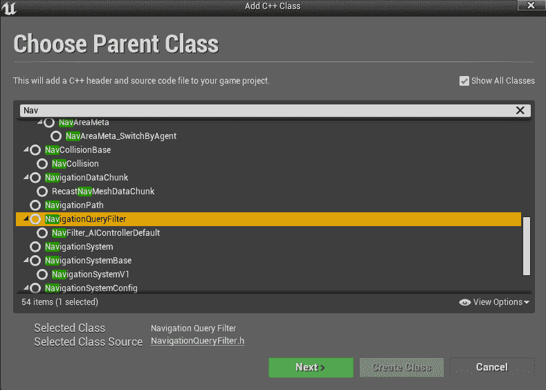

按照惯例，类的名称应该以"*NavFilter_*"开头。因此，我们将将其重命名为***NavFilter_Desert Animal***并将其放置在"***Chapter3/Navigation***"：

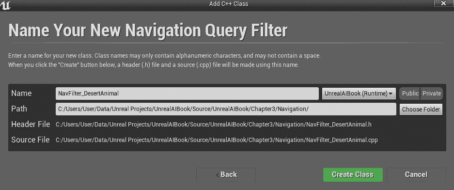

为了设置其属性，我们需要创建一个默认构造函数。在头文件（`.h`）中写下以下内容：

```py
#include "CoreMinimal.h"
#include "NavFilters/NavigationQueryFilter.h"
#include "NavFilter_DesertAnimal.generated.h"

/**
 * 
 */
UCLASS()
class UNREALAIBOOK_API UNavFilter_DesertAnimal : public UNavigationQueryFilter
{
  GENERATED_BODY()

 UNavFilter_DesertAnimal();
};
```

对于实现（`.cpp`文件），我们需要做更多的工作。首先，我们需要访问我们需要的*Nav Area*，在这种情况下，是沙漠。让我们添加以下`#include`语句：

```py
#include "NavArea_Desert.h"
```

然后，在构造函数中，我们需要创建一个***FNavigationFilterArea***，这是一个包含过滤特定类所有选项的类。在我们的例子中，我们可以将这个新的*过滤器区域*存储在一个名为`Desert`的变量中：

```py
UNavFilter_DesertAnimal::UNavFilter_DesertAnimal() {

 //Create the Navigation Filter Area
 FNavigationFilterArea Desert = FNavigationFilterArea();

 *// [REST OF THE CODE]*
}
```

接下来，我们需要将`Desert`变量填充为我们想要覆盖该类的选项，包括我们正在修改的哪个***Nav Area***：

```py
UNavFilter_DesertAnimal::UNavFilter_DesertAnimal() {

 *// [PREVIOUS CODE]*

 //Set its parameters
 Desert.AreaClass = UNavArea_Desert::StaticClass();

 Desert.bOverrideEnteringCost = true;
 Desert.EnteringCostOverride = 0.f;

 Desert.bOverrideTravelCost = true;
 Desert.TravelCostOverride = 0.8f;

 *// [REST OF THE CODE]*
}
```

最后，我们需要将此*过滤器区域*添加到***Areas***数组中：

```py
UNavFilter_DesertAnimal::UNavFilter_DesertAnimal() {

 *// [PREVIOUS CODE]*

 //Add it to the the Array of Areas for the Filter.
 Areas.Add(Desert);
}
```

为了方便起见，以下是完整的`.cpp`文件：

```py
#include "NavFilter_DesertAnimal.h"
#include "NavArea_Desert.h"

UNavFilter_DesertAnimal::UNavFilter_DesertAnimal() {

  //Create the Navigation Filter Area
  FNavigationFilterArea Desert = FNavigationFilterArea();

  //Set its parameters
  Desert.AreaClass = UNavArea_Desert::StaticClass();

  Desert.bOverrideEnteringCost = true;
  Desert.EnteringCostOverride = 0.f;

  Desert.bOverrideTravelCost = true;
  Desert.TravelCostOverride = 0.8f;

  //Add it to the the Array of Areas for the Filter.
  Areas.Add(Desert);
}
```

编译此代码，你将能够在下次需要使用*导航系统*时使用此过滤器。这标志着我们对*导航过滤器*的讨论结束。

# 覆盖导航系统

从*模式面板*中，你可以将一个名为***Nav System Config Override***的特殊演员拖入级别。

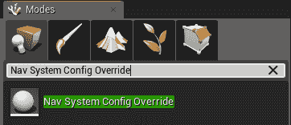

此演员允许你通过使用另一个来覆盖内置的*导航系统*。当然，你将不得不首先开发它，这将需要大量的努力。

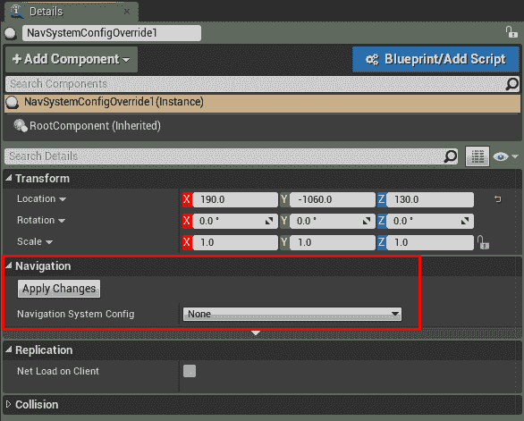

你应该替换默认的导航系统（或者可能与其他系统一起使用）的原因主要是为了克服限制。那么空中单位呢？它们如何进行 3D 路径查找？蜘蛛如何进行表面路径查找？

# 摘要

在本章中，我们探讨了如何设置*导航系统*，以便我们的 AI 角色可以在地图上移动。特别是，我们学习了如何使用*修改体积*、*导航链接代理*和*导航网格区域*来塑造*导航网格*。

因此，我们的 AI 代理可以平滑地穿越地图，高效地找到两点之间的路径，该路径基于他们的能力进行了优化（例如，使用*导航过滤器*），同时尊重地图上各种类型的"*地形*"（例如，使用*导航区域*）。此外，它们可以翻过悬崖或跳过平台（例如，通过使用*导航链接代理*和一点跳跃的编码）。

在下一章中，我们将学习关于 Unreal 框架中更高级的 AI 功能，即*环境查询系统*，它允许代理"*查询*"环境，以便他们可以找到具有特定要求的地点（或演员）。
