# 第四章：环境查询系统

*一位优秀的领导者知道哪里是好的，而 EQS 知道得更好！*

欢迎来到第四章，*环境查询系统*。Chapter 4。在本章中，我们将使用虚幻 AI 框架中的一个特定且非常强大的系统。我指的是 **环境查询系统**（**EQS**）。我们将探索这个系统，并不仅了解其工作原理，还将了解如何在我们的游戏中有效地使用它。

再次强调，**EQS** 属于 *决策制定* 的领域，特别是评估哪个位置（或虚幻中的演员）最适合满足某些条件。我们将通过本章详细了解其工作原理，但作为对我们将要涵盖内容的预览，请记住，系统过滤器提供不同的可能性，剩余的则分配一个分数。得分最高的选择将被选中。

尤其是我们将涵盖以下主题：

+   如何启用 ***环境查询系统 (EQS)***？

+   理解 ***EQS 的工作原理***

+   了解 ***Generators***、***Tests*** 和 ***Contexts***

+   探索 *EQS* 内置的 ***Generators***、***Tests*** 和 ***Contexts***

+   使用自定义的 ***Generators***、***Tests*** 和 ***Contexts*** 来扩展 ***EQS***

那么，让我们深入探讨吧！

# 启用环境查询系统

EQS 是一个在 Unreal 4.7 中引入的功能，在 4.9 中得到了很大的改进。然而，在版本 4.22 中，EQS 被列为实验性功能，尽管它在许多游戏中得到了成功应用，这表明 EQS 是稳健的。

因此，我们需要从 ***实验性功能设置*** 中启用它。从顶部菜单，转到 **编辑 | 编辑器首选项…**，如下面的截图所示：

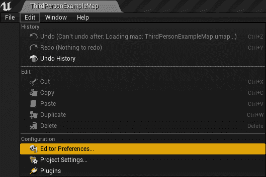

请注意，不要与 ***项目设置*** 混淆。从顶部菜单，在 *视口* 之上，您只能访问 ***项目设置***。然而，从整个编辑器的顶部菜单中，您将能够找到 ***编辑器首选项***。前面的截图应有助于您找到正确的菜单（即 ***编辑*** 下拉菜单）。

从侧边菜单中，您将能够看到一个名为 **Experimental**（在 **General** 类别下）的部分，如下面的截图所示：

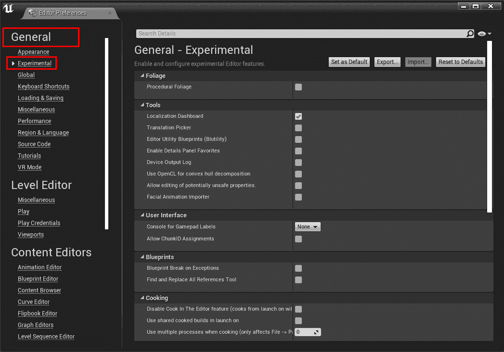

如果您滚动浏览设置，您将找到 AI 类别，其中您可以启用 **环境查询系统**：

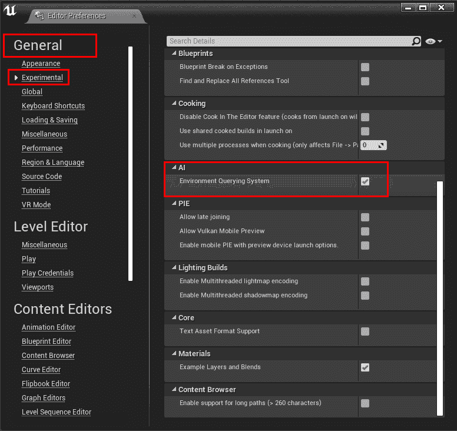

勾选此选项旁边的框，结果，整个项目中的 ***环境查询系统*** 将被激活。现在，您将能够为其创建资产（以及扩展它），并从 *行为树* 中调用它。

如果你在**AI 类别**中看不到***环境查询系统***复选框，那么你很可能正在使用一个较新的引擎版本，其中（终于）***EQS***不再是实验性的，因此在你的项目中始终是启用的。如果这是你的情况，那么请跳过这一部分，继续下一部分。

# 理解环境查询系统

当人们第一次面对 EQS 时，可能会感到不知所措，尤其是因为它不清楚系统的不同部分是如何工作的以及为什么。本节的目标是通过让你熟悉 EQS 的底层工作流程来提高你对系统的理解，这将有助于你在创建查询时的实际工作流程。

# EQS 的一般机制

想象一下，在某个时刻，我们的 AI 代理正在遭受火力攻击，并且需要评估不同的掩护地点。一个地方可能很远但保护得很好，而另一个地方可能很近但保护得不好。我们应该怎么办？

解决这个问题的方法之一是使用***效用函数***并在时间上解决方程（我们将在第十四章，*超越*)中详细讨论）。实际上，这会产生非常好的结果，并且已经在许多游戏中成功实施。然而，Unreal 提供了另一种可能性：EQS。也就是说，使用 EQS 而不是效用函数不是强制性的，但作为 AI 框架的一部分，EQS 使得评估此类决策变得容易，因为它是一个内置的系统。

因此，回到我们那个需要掩护的代理，一个*行为树*将运行一个 EQS 查询，这将给出代理应该获得掩护的最终位置。现在，环境查询是如何工作的呢？

首先，一个组件（称为生成器，我们稍后将讨论）将根据在测试中指定的某些标准生成一系列位置（或代理，我们将在本章稍后讨论）。例如，我们可以在一个均匀的网格上取不同的位置，这在不知道预先（在评估之前）要寻找哪种位置时非常有用。

然后，有一个过滤过程用于可能的地点（或演员），其中它会消除所有不符合特定标准的。在我们的掩护示例中，任何仍然暴露在直接火力下的地方都应该被丢弃。

剩余的地方将根据其他标准进行评估（系统会为它们分配一个分数）。再次，在我们的掩护示例中，这可能是代理的距离、它们提供的掩护程度，或者地点离敌人的距离。系统通过考虑所有这些因素（当然，其中一些因素可能比其他因素更重要；例如，从火力的保护可能比从敌人位置的距离更重要）来分配分数。

最后，从查询中给出得分最高的位置（或演员）到 *行为树*，这将决定如何处理它（例如，快速逃离到那个地方以躲避）。

# 环境查询的组件

基于我们在上一节中描述的机制，让我们深入了解 Unreal 中 EQS 的实际实现方式。

在高层次上，我们有 *环境查询*、*上下文*、*生成器* 和 *测试*。

# 环境查询

如其名所示，***环境查询*** 是一种数据结构（类似于 *行为树*），它包含有关如何执行查询的信息。实际上，它是一个您可以在您的 *内容浏览器* 中创建和找到的资产。

您可以通过在您的 *内容浏览器* 上右键单击，然后选择 **人工智能** | **环境查询** 来创建一个新的 **环境查询**，如下面的截图所示：

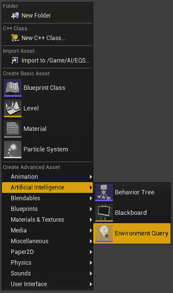

请记住，如果 EQS 未启用，此选项将不会出现。

这是在 *内容浏览器* 中的样子：

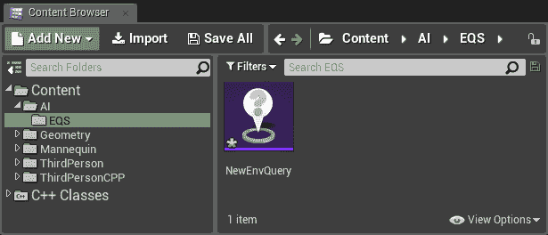

如果我们双击它以打开它，Unreal 将打开一个特定且 **专用** 的编辑器用于 ***环境查询***。这就是编辑器的样子：

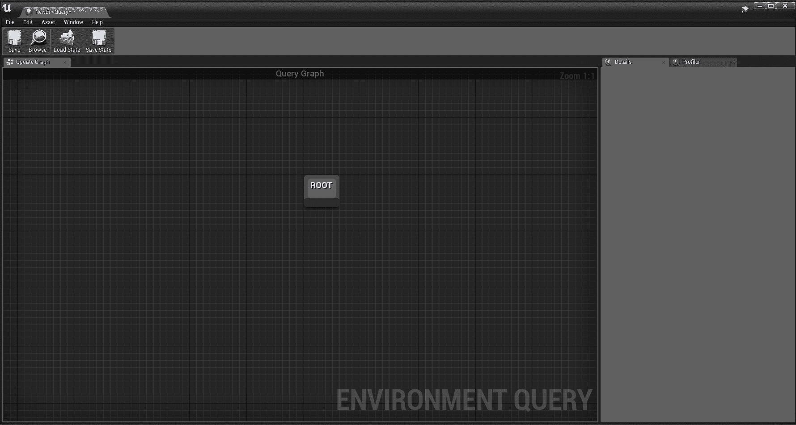

编辑器视图

如您所见，它与 *行为树* 非常相似，但您只能将一个生成器节点附加到 ***根节点***（只有一个），这将使其也成为叶子节点。因此，整个 "*树*" 将只是 ***根节点*** 和一个 ***生成器***。实际上，通过使用类似 *行为树* 的编辑器，您可以轻松设置一个 ***环境查询***。在（唯一的）*生成器* 节点上，您可以附加一个或多个 ***测试节点****——无论是生成器本身还是上下文。以下是一个示例：

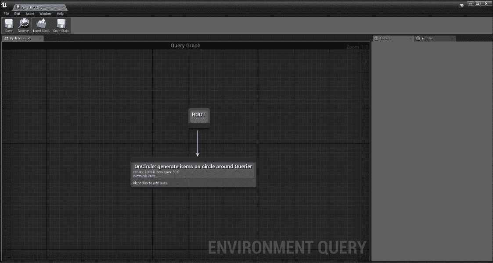

编辑器视图

我们将在下一节中了解这意味着什么。

# 上下文

上下文是特定且方便的类，用于检索信息。您可以通过蓝图或使用 C++ 来创建/扩展一个 ***上下文***。

它们被称为上下文的原因是，它们为生成器或测试提供了一个上下文。通过拥有上下文，生成器（或测试）能够从那个点开始执行所有计算。如果您愿意，可以将上下文视为一个特殊（并且非常详细的）变量，能够程序化地传递一组有趣的演员和/或位置。

让我们通过一个例子来看看**上下文**是什么。在进行**测试**时，您通常知道**查询者**（例如，需要掩护的智能体）的位置（在引擎盖下，即使**查询者**是默认上下文）。然而，我们的测试可能需要我们敌人的位置（例如，检查掩护点是否受到攻击，因为这取决于我们智能体的敌人的位置）。**上下文**可以提供所有这些信息，并且可以以程序化的方式做到这一点：例如，智能体可能不知道地图上的每个敌人，因此**上下文**可能只返回智能体当前意识到的敌人，因此它只从那些地方找到掩护。因此，如果有一个隐藏的敌人被选为掩护的地方，那么对我们智能体来说就是不幸的事情！

理解**上下文**并不容易，所以请坚持这一章，也许在您对生成器和测试以及如何在我们的项目中构建**EQS**有更好的了解之后，再重新阅读上一段。

# 生成器

如同其名，**生成器**生成一个初始位置集（或数组）或演员。这个集合将由测试进行过滤和评估。

生成初始集的方法完全自由。如果您在评估阶段之前有关您正在寻找的地方的重要信息，那么您可以创建一个自定义的**生成器**（例如，如果智能体不能游泳，则不要检查有水的地方；如果唯一可用的攻击是近战，则不考虑飞行敌人）。

与**上下文**一样，**生成器**是特定类别的子类。您可以在蓝图以及 C++中创建生成器。

通常，最常用的生成器是网格生成器，它会在一个上下文周围（例如，在智能体周围）生成一个均匀的网格。通过这样做，智能体将检查其周围的大部分区域。

# 测试

**测试**负责对由**生成器**生成的不同位置（或演员）进行**过滤**和**评分**（评估）。单个**测试**可以在同一标准上过滤和评分，也可以只进行其中之一。

在使用**过滤**的**测试**的情况下，它们试图确定哪些位置（或演员）不符合我们的标准。EQS 进行了优化，因此它以特定的顺序执行测试，以尽早检测不合适的地方。这样做是为了避免分配不会使用的分数。

一旦所有位置（或演员）都被过滤掉，剩下的位置将被评估。因此，**每个能够分配分数的测试**都会在位置（或演员）上执行（执行），以报告评估结果，形式为分数（可以是正数或负数）。

作为旁注，**测试**需要（至少）一个**上下文**来正确地进行**过滤**和**评估**。

让我们通过一个简单的测试例子来了解它们是如何工作的。最常见的测试之一是***距离***，即这个地点（我们正在评估的生成地点）距离***上下文***有多远？上下文可以是*查询者*，或它正在攻击的敌人，或任何其他东西。因此，我们可以（例如）过滤距离高于或低于某个距离阈值的地点（例如，如果它们离玩家太远，我们可能不想有完美的掩护地点）。相同的***距离测试***可以根据距离分配得分，如果上下文远离（或接近），得分可以是正的（或负的）。

此外，一个**测试**有一个**得分因子**，它代表***测试***的**权重**：测试的重要性以及此***测试***在计算当前评估位置（或演员）的最终得分时需要产生的影响。实际上，您将在由*生成器*生成的位置上运行许多不同的***测试***。得分因子允许您轻松权衡它们，以确定哪个测试对位置的最终得分（或演员）有更高的影响。

每个*测试*在其*详细信息*面板中的选项具有以下结构：

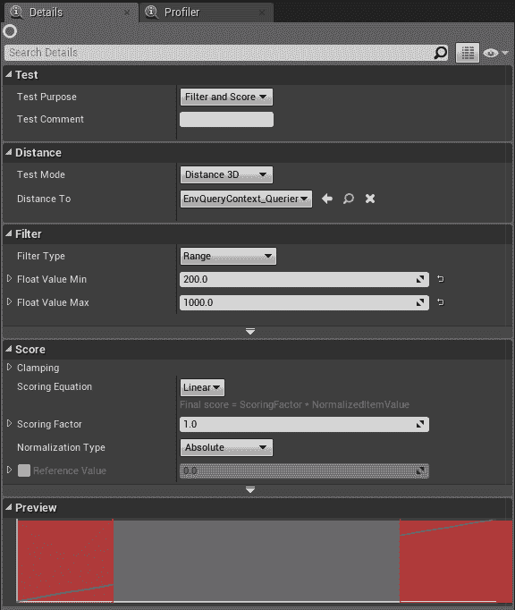

+   ***测试***：在这里，您可以选择***测试目的***是要***过滤和得分***，还是仅其中之一，并添加描述（对测试没有影响，但您可以将其视为注释来回忆这个测试的内容）。此外，可能还有其他选项，例如可以与*导航系统*一起使用的*投影数据*（对于依赖于*导航系统*的测试）。

+   ***特定测试***：这是存放测试特定选项的地方。这因测试而异。

+   ***过滤***：在这里，您可以选择如何设置*过滤*的行为。这因测试而异，但通常您可以选择一个***过滤类型***，如果测试将返回值评估为浮点数，则可以是*范围*（或*最小值*或*最大值*）；否则，在条件*测试*的情况下，可以是*布尔值*。如果***测试目的***设置为***仅得分***，则此选项卡不会显示。

+   ***得分***：在这里，您可以选择如何设置*得分*的行为。这因测试而异。对于测试的浮点返回类型，您可以选择一个得分方程，以及一个归一化。此外，还有***得分因子***，这是与其他测试相比此测试的权重。对于布尔返回值，只有得分因子。如果***测试目的***设置为***仅过滤***，则此选项卡不会显示。

+   ***预览***：这为您提供了过滤和得分函数的预览。

如您所见，这些选项非常容易理解，如果您使用 EQS 进行练习，您将更好地理解它们。

# 组件的视觉表示

这些组件一开始可能不太直观，但一旦你习惯了 EQS，你就会意识到它们是如何有意义的，以及为什么系统会以这种方式设计。

为了总结组件及其重要性，以及提供一个视觉表示，这里有一个你可以参考的图表：

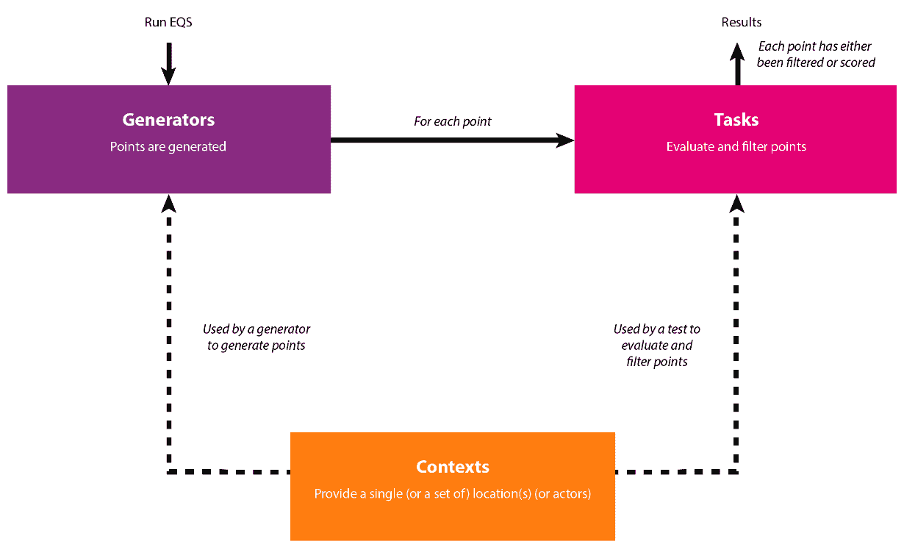

# 在行为树中运行环境查询

最后，要完全理解环境查询是如何工作的，最后一步是看看它如何在行为树中运行。

幸运的是，我们有一个名为“运行 EQS”的节点，这是一个内置的行为树任务。在假设的行为树编辑器中看起来如下：

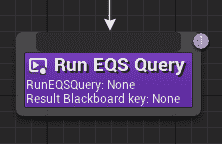

可能在详细信息面板中找到的可能设置如下：

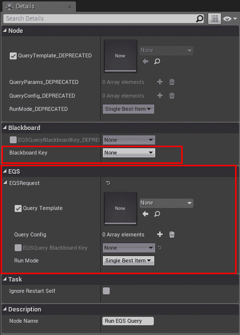

如你所见，许多已经过时（所以只需忽略它们），但我已经突出显示了最重要的那些。以下是对它们的解释：

+   ***黑板键***：这是引用包含 EQS 结果的*黑板变量*的黑板键选择器。

+   ***查询模板***：对我们要运行的特定 EQS 的引用。否则，我们可以取消激活此选项以激活一个*EQSQuery 黑板键*。

+   ***查询配置***：这是查询的可选参数（不幸的是，我们在这本书中不会详细讨论它们）。

+   ***EQSQuery 黑板键***：一个*黑板键选择器*，它引用包含*EQS*的黑板变量。如果激活，包含在*黑板变量*中的*EQSQuery*将被执行，而不是*查询模板*。

+   ***运行模式***：这显示了我们将要检索的查询结果。可能的选项如下：

    +   ***最佳单个项目***：这会检索得分最高的点（或演员）

    +   ***从最佳 5%中随机选择单个项目***：这会从得分最高的 5%的位置（或演员）中随机检索一个点

    +   ***从最佳 25%中随机选择单个项目***：这会从得分最高的 25%的位置（或演员）中随机检索一个点

    +   ***所有匹配项***：这会检索所有与查询匹配的位置（或演员）（它们尚未被过滤掉）

这就完成了我们如何运行 EQS 以及如何检索其结果，以便在行为树中使用。

当然，还有其他触发 EQSQuery 的方法，这些方法不一定是在行为树中完成的，尽管这是 EQS 最常见的使用方式。不幸的是，我们在这本书中不会涵盖运行 EQSQuery 的其他方法。

# 不仅位置，还包括演员！

当我说“……评估一个位置**（或演员）……”时，我强调了这一点。

实际上，EQS 最酷的功能之一是能够评估不仅位置，还可以评估演员！

再次强调，您可以将 EQS 用作决策过程。想象一下，您需要先选择一个敌人进行攻击。您可能需要考虑各种参数，例如该敌人的剩余生命值、它的强度以及它在未来立即被视为威胁的程度。

通过仔细设置 EQS，您可以为每个敌人分配一个分数，取决于哪个敌人最方便攻击。当然，在这种情况下，您可能需要做一些工作来创建适当的生成器，以及上下文和适当的测试，但从长远来看，这使得 EQS 在代理需要做出这类决策时成为一个非常好的选择。

# 探索内置节点

在我们创建自己的生成器、上下文和测试之前，让我们先谈谈内置节点。虚幻引擎自带了一些有用的通用内置节点。我们将在本节中探讨它们。

请记住，本节将分析性地解释 EQS 中每个内置节点的工作原理，就像文档一样。因此，如果您愿意，请将本节用作参考手册，如果您不感兴趣，请跳过这些部分。

# 内置上下文

由于我们是通过查看*上下文*来解释 EQS 的，所以让我们从*内置上下文*开始。当然，制作通用的*上下文*几乎是一个悖论，因为上下文非常具体于"*上下文*"（情境）。

然而，虚幻引擎自带了两个内置上下文：

+   ***EnvQueryContext_Querier***：这代表发起查询的 Pawn（精确地说，这并不是发起查询的 Pawn，而是运行*行为树*并发起查询的控制器，并且这个上下文返回受控 Pawn）。因此，通过使用这个*上下文*，所有内容都将相对于***查询器***。

如我之前所述，在底层，*查询器*确实是一个*上下文*。

+   ***EnvQueryContext_Item***：这返回由*生成器*生成的所有位置。

# 内置生成器

有许多内置的***生成器***，大多数情况下，这些将足够您完成大多数所需的 EQS。您只有在有特定需求或希望优化 EQS 时才会使用*自定义生成器*。

大多数这些生成器都很直观，所以我将简要解释它们，并在必要时提供截图，以展示它们生成点的方式。

以下截图使用了一个能够可视化环境查询的特殊 Pawn。我们将在本章的后面学习如何使用它。

这是可用的内置*生成器*列表，正如您在*环境查询编辑器*中找到的那样：

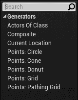

为了组织这些信息，我将每个生成器分成一个子节，并将它们按先前的截图中的顺序（按字母顺序）排列。

当我提到 Generator 的设置时，我的意思是，一旦选择了特定的 Generator，在*Details Panel*中就会显示它的可用选项。

# 类别演员

这个 Generator 会获取特定类别的所有演员，并将它们的所有位置作为生成的点返回（如果这些演员在 Context 的一定半径内）。

这是在*Environmental Query Editor*中的样子：

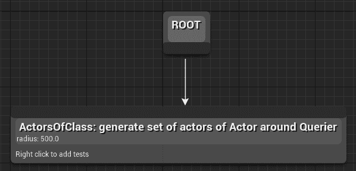

可能的选项包括***Searched Actor Class***（显然）和从***Search Center***来的***Search Radius***（这被表达为*Context*）。可选地，我们可以检索特定类别的所有演员，并忽略它们是否在*Search Radius*内：

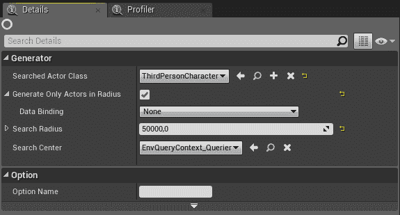

在前面的截图中，我使用了***Querier***作为***Search Center***，***Search Radius***为***50000***，以及***ThirdPersonCharacter***作为***Searched Actor Class***，因为它们已经在项目中可用。

通过使用这些设置（并放置几个***ThirdPersonCharacter***演员），我们得到以下情况：

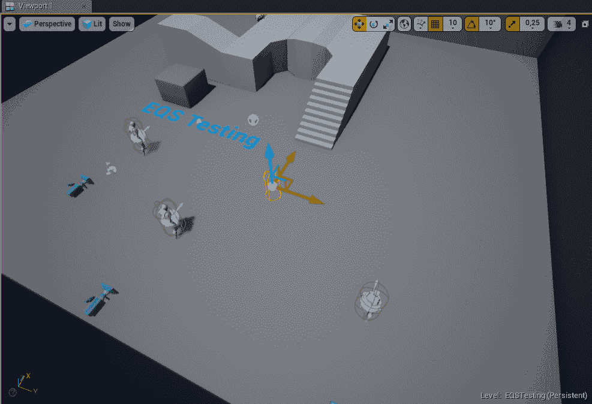

注意围绕三个***ThirdPersonCharacter***演员的（蓝色）球体。

# 当前位置

***Current Location Generator***简单地从*Context*中检索位置（或它们），并使用它（或它们）来生成点。

这是在*Environmental Query Editor*中的样子：

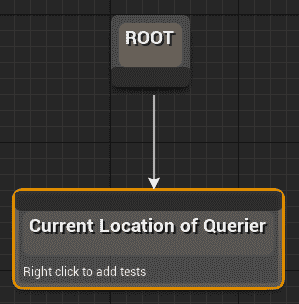

对于这个*Generator*，唯一可用的设置是***Query Context***：

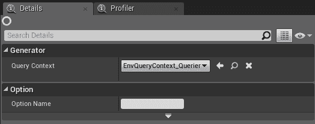

因此，如果我们使用***Querier***作为***Query Context***，那么我们只有***Querier***自己的位置，如下面的截图所示：

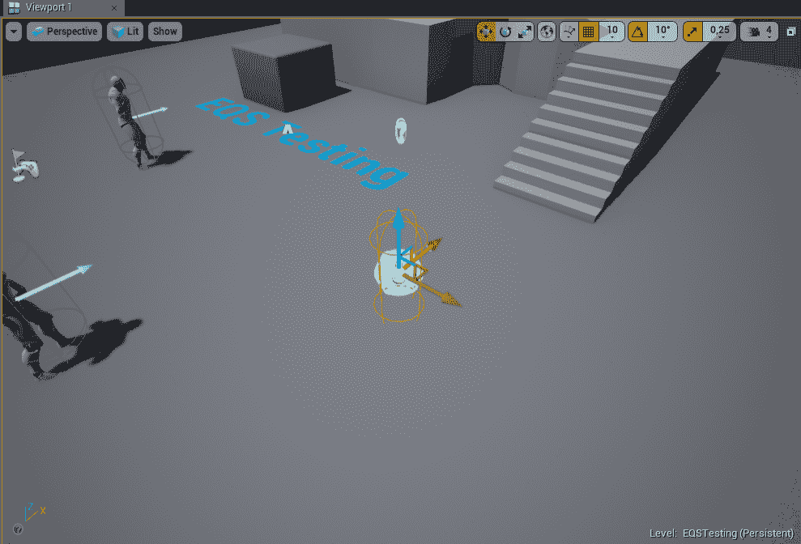

# 复合

***Composite Generator***允许你混合多个 Generator，以便有更广泛的选择点。

这是在*Environmental Query Editor*中的样子：

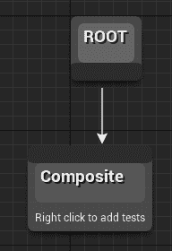

在*Settings*中，你可以设置一个***Generators***数组：

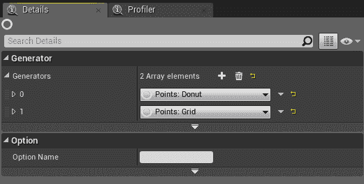

由于我们没有时间详细地查看所有内容，所以不会进一步介绍这个 Generator。

# 点：圆形

如其名所示，***Circle Generator***会在指定半径的圆周上生成点。此外，还提供了与*Navmesh*交互的选项（这样就不会在*Navmesh*之外生成点）。

这是在*Environmental Query Editor*中的样子：

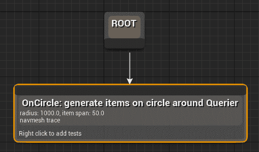

这是一个非常复杂的 Generator，因此这个 Generator 有各种设置。让我们来看看它们：

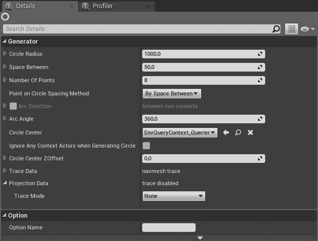

理想情况下，为每个设置提供一张截图会很好，这样我们可以更好地了解每个设置如何影响点的生成。不幸的是，这本书已经有了很多截图，仅为了这些复杂的生成器的不同设置而专门写一章将花费很多时间和空间。“书空间*”。然而，有一种更好的方法让你获得同样的感觉：***自己尝试！***是的——一旦你学会了如何设置***EQSTestingPawn***，你就可以自己尝试，看看每个设置如何影响生成过程。这是你学习和真正理解所有这些设置的最佳方式。

+   ***圆半径***：正如其名所示，它是圆的半径。

+   ***空间间隔***：每个点之间应该有多少空间；如果将*圆上点间隔方法*设置为*按空间间隔*。

+   ***点数数量***：应该生成多少个点；如果将*圆上点间隔方法*设置为*按点数*。

+   ***圆上点间隔方法***：确定要生成的点数是否应根据固定数量的点（***按点数***）计算，还是根据固定间隔的点数来计算，如果点之间的空间是固定的（***按空间间隔***）。

+   ***弧方向***：如果我们只生成圆的弧，此设置确定这个方向应该是怎样的。计算方向的方法可以是***两点***（它需要两个*上下文*并计算两点之间的方向）或***旋转***（它需要一个*上下文*并检索其旋转，然后根据该旋转决定弧的方向）。

+   ***弧角度***：如果这与*360*不同，它定义了点停止生成的地方的切割角度，从而创建一个*弧*而不是圆。这种*弧*的方向（或旋转）由*弧方向*参数控制。

+   ***圆心***：正如其名所示，它是圆的中心，表示为*上下文*。

+   ***生成圆时忽略任何上下文演员***：如果选中，它将不会考虑用作圆的上下文的演员，从而跳过在这些位置生成点。

+   ***圆心 Z 偏移***：正如其名所示，它是*圆心*沿 z 轴的偏移。

+   ***追踪数据***：在生成圆时，如果有障碍物，通常我们不想在障碍物后面生成点。此参数确定进行"*水平*"追踪的规则。这些选项如下：

    +   ***无***：将没有痕迹，所有生成的点都将位于圆上（或弧上）。

    +   ***导航***：这是默认选项。*NavMesh*结束的地方就是生成点的地方，即使中心距离小于半径（在某种程度上，如果遇到边界，圆会假设*NavMesh*的形状）。

    +   **几何形状**：与导航相同，但使用几何形状而不是*NavMesh*作为边界，追踪将使用级别的几何形状（如果你没有*NavMesh*，这可能非常有用）。

    +   **导航过边缘**：与导航相同，但现在追踪是“过边缘”。

+   **投影数据**：这与 Trace Data 类似，但通过从上方投影点进行“垂直”追踪。其余部分，概念与*Trace Data*完全相同。选项是***无***，***导航***，和***几何形状***，它们在*Trace Data*中的含义相同。“Navigation Over Ledges”不存在，因为它没有意义。

通过使用前一个屏幕截图中显示的相同设置（我在使用*Trace Data*与*Navigation*，并且在级别中有*NavMesh*），这就是它的样子（我使用`P`键激活了 NavMesh，所以你也能看到它）：

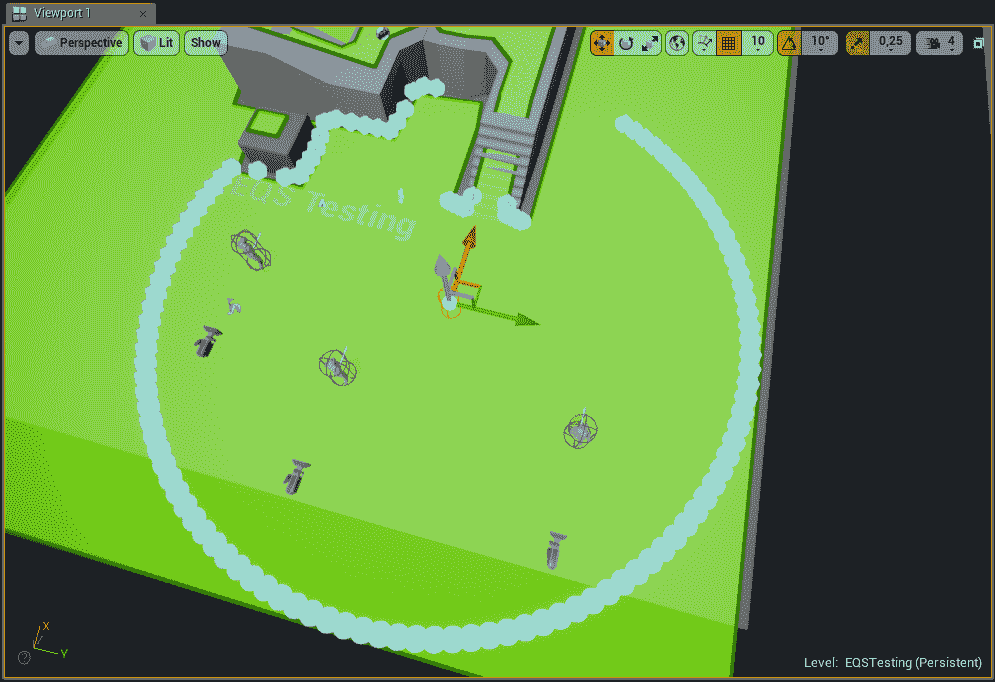

通过使用*几何形状*代替*Trace Data*，我们得到一个非常相似，但略有不同的形状：

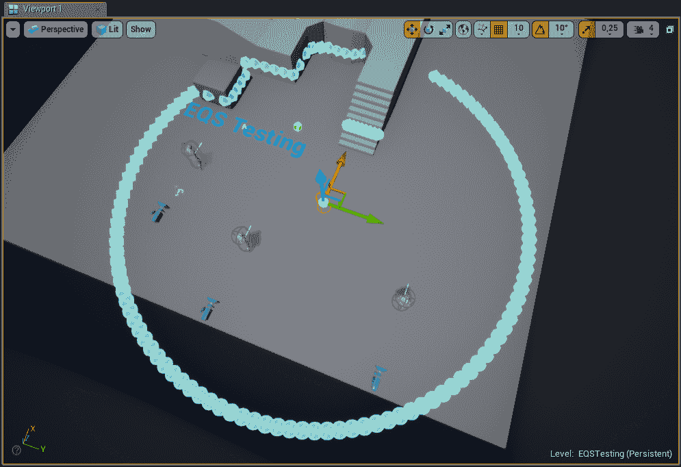

如果你有一个结束的 NavMesh，但没有级别的几何形状，效果会更加明显。

# 点：圆锥

正如其名所示，**圆锥生成器**在特定上下文（如聚光灯）的圆锥内生成点。此外，还有与*Navmesh*交互的选项（这样你就可以将点投影到*Navmesh*上）。

重要的是要理解，其形状是由许多圆生成的，我们总是取相同的弧。所以，如果我们取整个圆，我们基本上是在生成单个切片的区域中的点。

这个生成器也可以用来生成覆盖整个圆区域的点。

这是在*环境查询编辑器*中的样子：

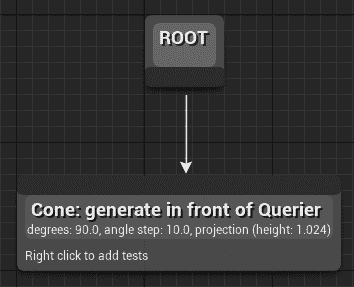

其设置主要与圆锥的形状有关，所以让我们来探索它们：

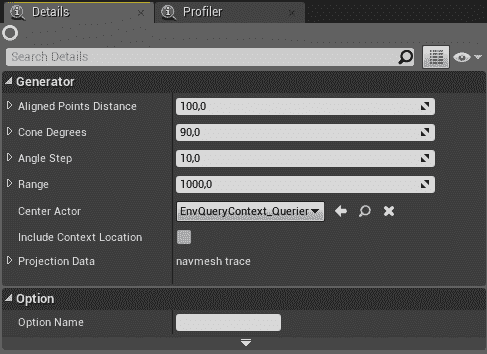

再次强调，最好为每种设置组合都有一张截图，这样你就能感受到每个设置如何影响点的生成。由于我们在这本书中没有足够的空间这样做，我鼓励你使用***EQSTestingPawn***进行实验，以便你有一个更清晰的理解。

+   +   **对齐点距离**：这是生成点之间的弧距离（从中心相同角度的点之间的距离）。较小的值生成更多的点，考虑到的区域将更加密集。

    +   **圆锥度数**：这决定了每个圆的弧度大小（我们考虑切片的宽度）。360 的值考虑了整个圆的面积。

    +   **角度步长**：这是相同弧线点之间的距离，以度为单位。较小的值意味着更多的点，考虑到的区域将更加密集。

    +   ***范围***：这决定了圆锥可以延伸多远（以聚光灯为例，它可以照亮多远）。

    +   ***中心演员***：这是生成的圆的中心，用于确定圆锥。它是中心，并以*上下文*的形式表示。

    +   ***包含上下文位置***：正如其名所示，如果选中，还会在圆锥/圆的中心生成一个点。

    +   ***投影数据***：通过从上方投影点（考虑几何形状或 *导航网格*）执行 "*垂直*" 追踪。实际上，可能的选择是 ***无***， ***导航***，和 ***几何***。

使用默认设置，圆锥在关卡中可能看起来是这样的：

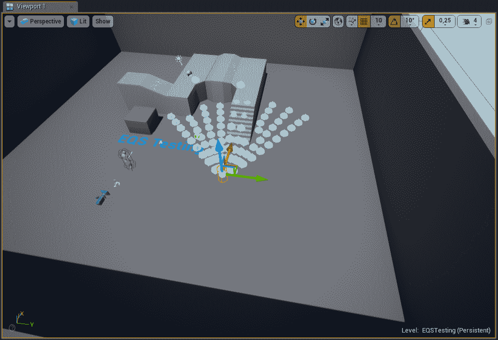

# 点：甜甜圈

正如其名所示， ***甜甜圈生成器*** 以甜甜圈形状（或对那些喜欢数学的人来说是"*圆环*"）生成点，从一个特定的中心开始，该中心作为一个上下文给出。此外，还有各种选项，以便你可以与 *导航网格* 交互（这样你就可以将点投影到 *导航网格* 上）。

此生成器还可以用于生成螺旋形状。就像圆锥形状一样，此生成器可以用于生成点来覆盖整个圆的面积。你可以通过将其*内半径*设置为零来实现这一点。

这是在 *环境查询编辑器* 中的样子：

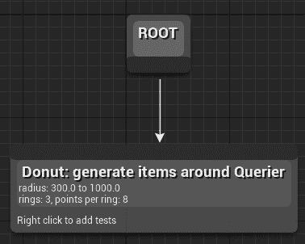

可用的以下设置：

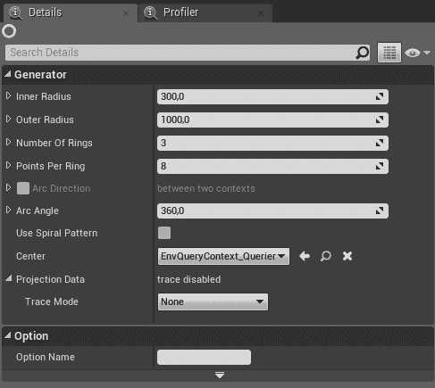

+   ***内半径***：这是甜甜圈的"*洞"*的半径；在此半径内不会生成任何点（因此它离*中心*的距离更远）。

+   ***外半径***：这是整个甜甜圈的半径；点将在*内半径*和 *外半径*之间生成环。这也意味着在此半径之外不会生成任何点（因此，它离*中心*的距离更远）。

+   ***环数***：在*内半径*和*外半径*之间应生成多少个点环。这些环总是均匀分布的，这意味着它们的距离由这个变量控制，以及*内半径*和*外半径*。

+   ***每环点数***：这决定了每个生成的环应该有多少个点。点沿环均匀分布。

+   ***弧方向***：如果我们只生成甜甜圈的弧（精确地说，只生成将生成甜甜圈的圆的弧），此设置确定这个方向。计算方向的方法可以是 ***两点***（它需要两个 *上下文*并计算两点之间的方向）或 ***旋转***（它需要一个 *上下文*并检索其旋转，然后根据该旋转决定弧的方向）。

+   ***弧度角***：如果这不是*360*，它定义了点停止生成的地方的切割角度，从而创建一个*弧*而不是圆。这种*弧*的方向（或旋转）由*弧方向*参数控制。

+   ***使用螺旋模式***：如果选中，每个环中的点略有偏移以生成螺旋图案。

+   ***中心***：这是生成的环的中心（以及用*内半径*和*外半径*指定的甜甜圈的最小和最大延伸）。它被表示为*上下文*。

+   ***投影数据***：这通过从上方投影点来执行一个"*垂直*"追踪，考虑了几何形状或*导航网格*。可能的选项是***无***，***导航***，和***几何***。

要理解这些设置，请看以下截图：

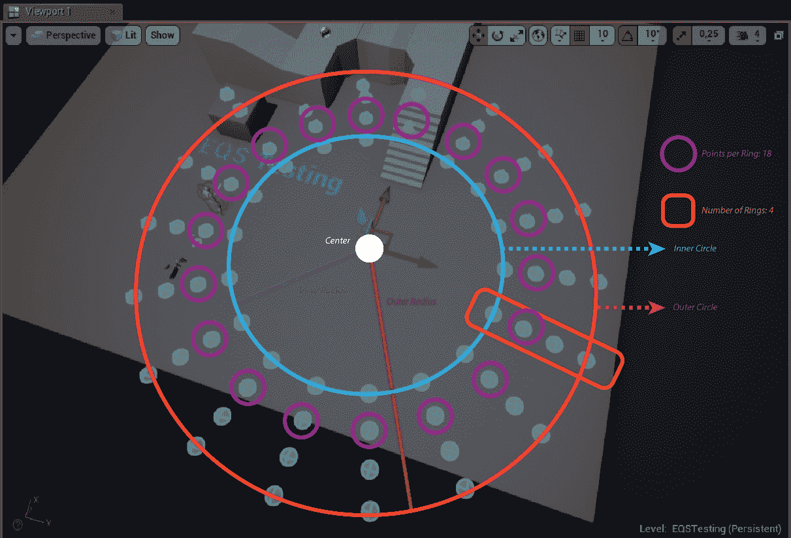

通过使用这些略微修改的设置（请注意我如何增加了*内半径*，提高了*环数*和*每环点数*，并且还使用了*导航*来投影数据），可以轻松地可视化甜甜圈。以下是使用的设置：

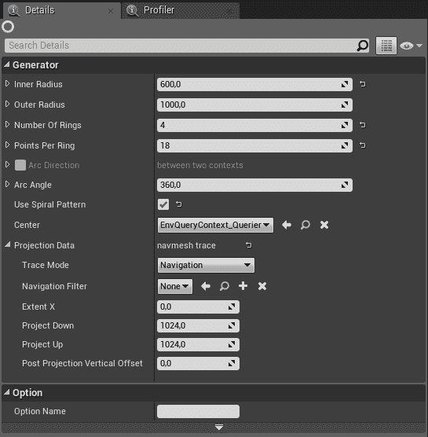

这是它们产生的结果：

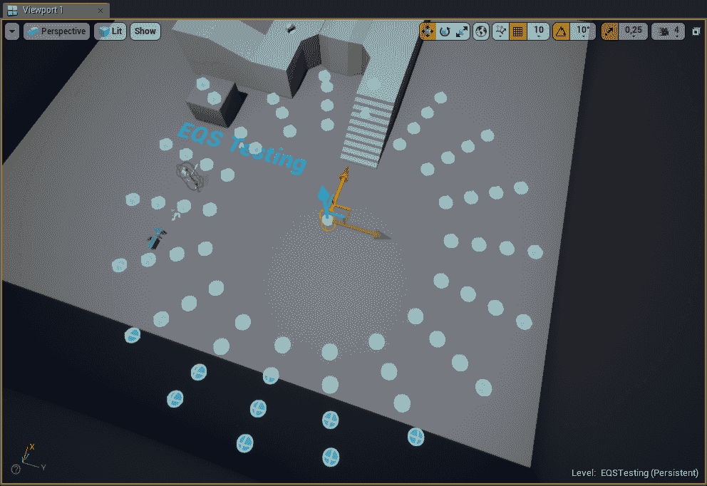

通过使用相同的设置，并检查***使用螺旋模式***，你可以看到不同环中的点略有偏移，从而创建一个螺旋图案：

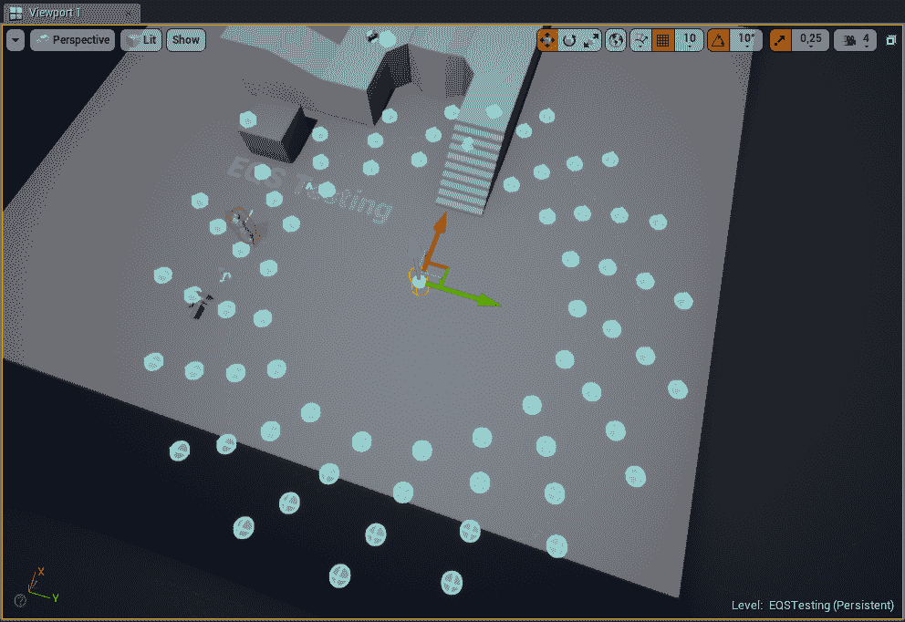

# 点：网格

如其名所示，***网格生成器***在网格内生成点。此外，还有与*导航网格*交互的选项（这样你就不必在*导航网格*外生成点）。

这是在*环境查询编辑器*中的样子：

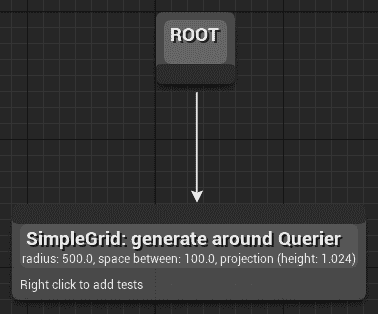

这个生成器的设置相当简单：

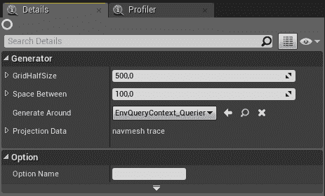

+   ***网格半尺寸***：网格应从其中心延伸多远（这意味着它是完整网格大小的一半）。网格的尺寸完全由这个参数以及*行间距*决定。

+   ***行间距***：网格的每一行和每一列之间的空间大小。网格的尺寸完全由这个参数以及*网格半尺寸*决定。

+   ***生成区域***：这是网格的中心（生成开始的地方），它被表示为*上下文*。

+   ***投影数据***：这通过从上方投影点来执行一个"*垂直*"追踪。它是通过考虑几何形状或*导航网格*来做到这一点的。可能的选项是***无***，***导航***，和***几何***。

通过查看设置，你可以看到这个生成器相当简单，但功能强大且非常常用。使用默认设置，在关卡中的样子如下（在 Navmesh 中启用了投影，并在地图中存在）：

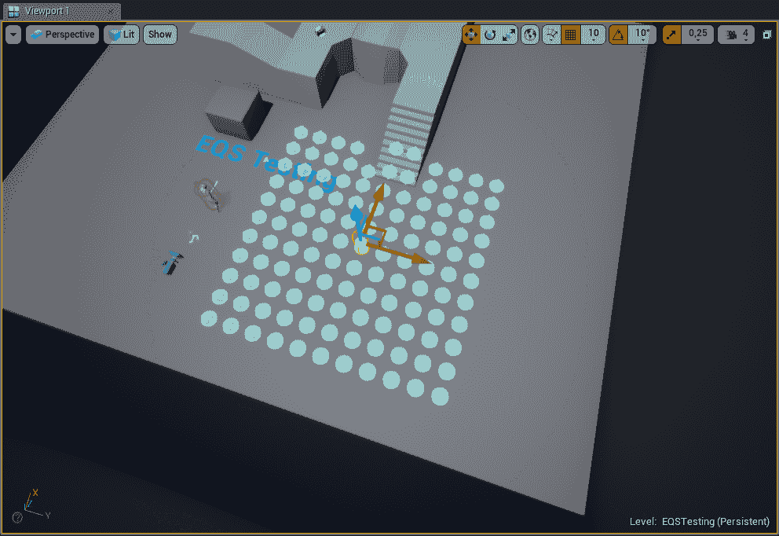

# 点：路径网格

正如其名所示，***路径网格生成器***在网格内生成点，就像***网格生成器***一样。然而，这个生成器的不同之处在于，***路径网格生成器***会检查点是否可以通过在***生成周围***设置（通常为查询者）中指定的上下文（通常为查询者），在指定距离内到达。

这是在***环境查询编辑器***中的样子：

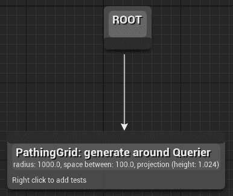

这个生成器的设置几乎与***点：网格***生成器相同：

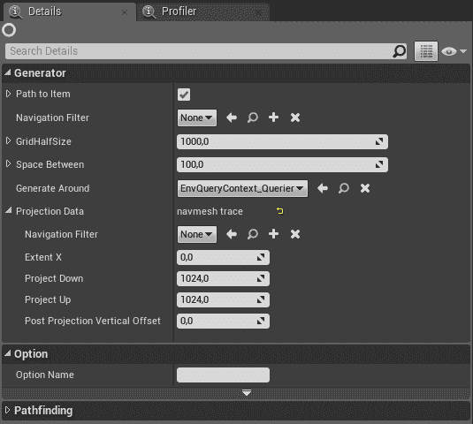

+   ***项目路径***：如果选中，则在查询者的设置中排除所有从上下文不可达的点。

+   ***导航过滤器***：正如其名所示，它是用于执行路径查找的导航过滤器。

+   ***网格半尺寸***：这表示网格应从其中心延伸多远（这意味着它是完整网格大小的一半）。网格的尺寸完全由这个参数确定，以及*空间间隔*。

+   ***空间间隔***：这表示网格的每一行和每一列之间的空间大小。网格的尺寸完全由这个参数确定，以及*网格半尺寸*。

+   ***生成周围***：这是网格的中心（它是开始生成的地方），并以***上下文***的形式表示。

+   ***投影数据***：通过从上方投影点来执行一个“***垂直***”追踪。它通过考虑几何形状或***导航网格***来完成此操作。可能的选项是***无***、***导航***和***几何***。

这就是它在环境中的样子（我稍微调整了级别以阻断楼上的路径。这清楚地表明，那些在楼梯之后的不可达的点甚至不是由这个生成器生成的）：

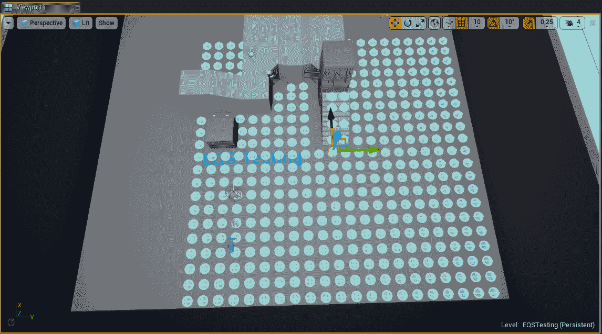

# 内置测试

现在我们已经探索了所有生成器，是时候探索引擎内可用的不同***测试***了。通常，返回值可以是布尔值或浮点值。

返回浮点值的测试通常用于***评分***，而返回布尔值的测试则更常用于***过滤***。然而，每个测试可能都有不同的返回值，这取决于测试是用于过滤还是评分。

这是可能的***内置测试***列表；让我们来探索它们：

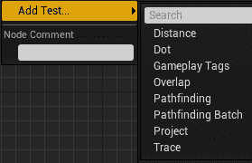

+   ***距离***：计算项目（生成的点）与特定*上下文*（例如*查询者*）之间的距离。它可以在***3D***、***2D***、沿 z 轴或***沿*** z 轴（绝对）计算。返回值是一个浮点数。

+   ***点积***：计算***线 A***和***线 B***之间的点积。这两条线都可以表示为两个上下文之间的***线***或作为特定上下文的***旋转***（通过取旋转的前向方向）。计算可以在***3D***或***2D***中进行。

+   ***游戏标签***：在*游戏标签*上执行一个*查询*。

+   ***重叠***：与一个盒子执行重叠测试；可以指定一些选项，例如偏移量或扩展，或重叠通道。

+   ***路径查找***：在正在评估的生成点和上下文之间执行*路径查找*。特别是，我们可以指定返回值是一个布尔值（如果*路径存在*）或一个浮点数（*路径成本*或甚至*路径长度*）。此外，我们可以指定路径是否从*上下文*到*点*或相反，并且可以使用*导航过滤器*。

+   ***路径查找批量处理***：与***路径查找***相同，但以批量的形式。

+   ***项目***：执行一个*投影*，可以通过不同的参数进行自定义。

+   ***追踪***：执行一个*追踪测试*，提供所有可能的选项以在引擎的其他地方执行追踪。这意味着它可以追踪一条*线*、一个*盒子*、一个*球体*或一个*胶囊*；无论是在*可见性*或*相机*追踪通道上；无论是复杂还是简单；无论是从上下文到点，还是相反。

这就结束了我们对内置节点的探索。

# 可视化环境查询

如我们之前提到的，有一个简单内置的方法可以在游戏世界中可视化***环境查询***，直接从视口进行；游戏甚至不需要运行。事实上，有一个特殊的 Pawn 能够做到这一点。然而，这个 Pawn 不能直接带入关卡，因为它已被在代码库中声明为虚拟，以确保它不会被误用。这意味着要使用它，我们需要创建自己的*蓝图 Pawn*，该 Pawn 直接从这个特殊的 Pawn 继承。

幸运的是，经过这一步，Pawn 就完全功能化了，不再需要任何更多的代码，只需要与参数一起工作（即你想要可视化的*环境查询*）。

要开始，创建一个新的蓝图。要继承的类是***EQSTestingPawn***，如下面的截图所示：

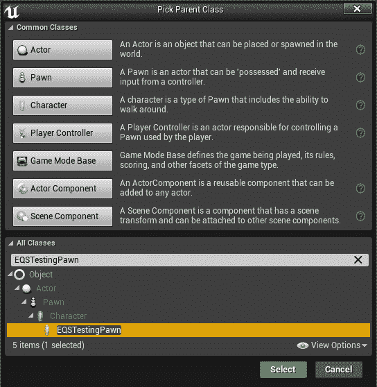

然后，你可以将其重命名为***MyEQSTestingPawn***。

如果你将其拖入地图，从*详细信息面板*，你可以更改***EQS***设置，如下面的截图所示：

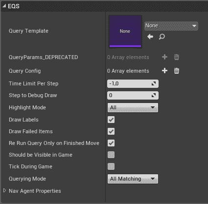

最重要的参数是 **查询模板**，在其中你指定要可视化的查询。如果你想要深入了解参数，请查看 第十二章*，调试 AI 的方法——导航、EQS 和性能分析*。

# 为环境查询系统创建组件

在本节中，我们将学习需要扩展哪个类来在 *环境查询系统* 中创建我们的自定义组件。

# 创建上下文

创建自定义 **上下文** 对于在环境查询过程中需要正确引用时至关重要。特别是，我们将创建一个简单的上下文来检索单个玩家的引用。

让我们探索如何在 *C++ 和蓝图* 中创建这个 **上下文**。

# 在蓝图中创建玩家上下文

要创建上下文，我们需要从 ***EnvQueryContext_BlueprintBase*** 类继承。在蓝图的情况下，在其创建时，只需选择突出显示的类，如下截图所示：

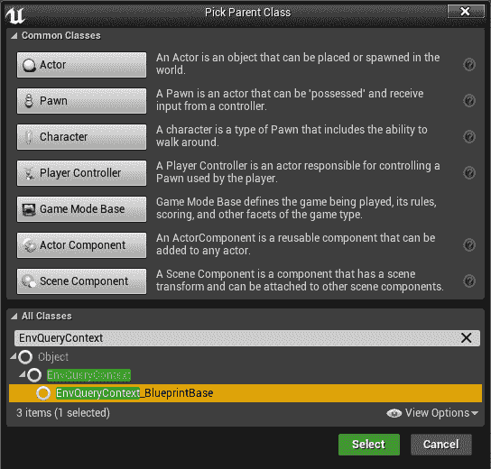

至于名称，惯例是保留前缀 "*EnvQueryContext_*"。我们可以将我们的上下文命名为 "***EnvQueryContext_BPPlayer***"。

对于蓝图上下文，你可以选择实现以下函数之一：

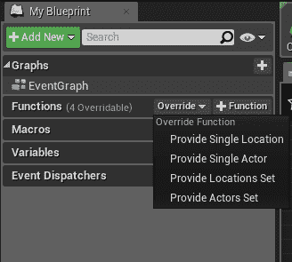

每个生成器都将为 *环境查询* 提供一个上下文。

我们可以重写“**提供单个演员**”函数，然后返回玩家 Pawn，就这么简单：

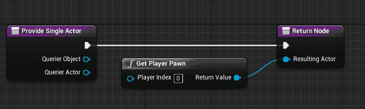

因此，我们现在有一个能够获取玩家引用的上下文。

# 在 C++ 中创建玩家上下文

在创建 C++ 上下文的情况下，从 ***EnvQueryContext*** 类继承，如下截图所示：

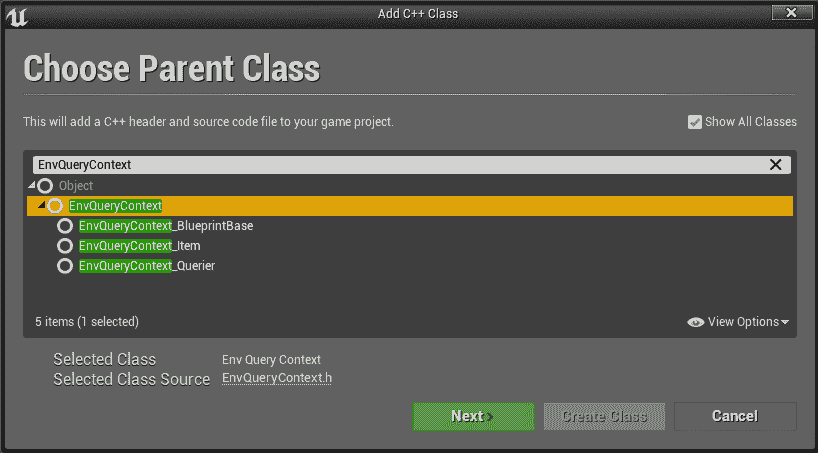

惯例相同，即用 "*EnvQueryContext_" 前缀来命名上下文。我们将把我们的类命名为 "***EnvQueryContext_Player***"。

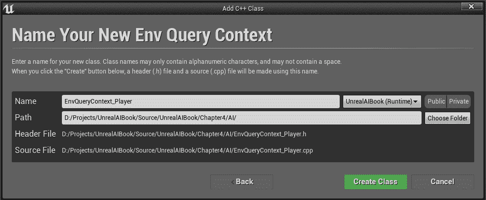

在 C++ 中，只有一个函数需要重写：`ProvideContext()`。因此，我们只需在 `.h` 文件中重写它，如下所示：

```py
#include "CoreMinimal.h"
#include "EnvironmentQuery/EnvQueryContext.h"
#include "EnvQueryContext_Player.generated.h"

/**
 * 
 */
UCLASS()
class UNREALAIBOOK_API UEnvQueryContext_Player : public UEnvQueryContext
{
  GENERATED_BODY()

  virtual void ProvideContext(FEnvQueryInstance& QueryInstance, FEnvQueryContextData& ContextData) const override;
};
```

在实现文件中，我们可以提供上下文。我不会深入讲解如何实现——你可以阅读其他上下文的代码来帮助你理解这一点。无论如何，我们的 `.cpp` 文件可以像下面这样（我可以选择不同的实现方式，但我选择了这种方式，因为它更容易理解）：

```py
#include "EnvQueryContext_Player.h"
#include "EnvironmentQuery/EnvQueryTypes.h"
#include "EnvironmentQuery/Items/EnvQueryItemType_Actor.h"
#include "Runtime/Engine/Classes/Kismet/GameplayStatics.h"
#include "Runtime/Engine/Classes/Engine/World.h"

void UEnvQueryContext_Player::ProvideContext(FEnvQueryInstance& QueryInstance, FEnvQueryContextData& ContextData) const
{
  if (GetWorld()) {
    if (GetWorld()->GetFirstPlayerController()) {
      if (GetWorld()->GetFirstPlayerController()->GetPawn()) {
        UEnvQueryItemType_Actor::SetContextHelper(ContextData, GetWorld()->GetFirstPlayerController()->GetPawn());
      }
    }
  }

}
```

因此，我们能够在 C++ 中检索玩家上下文。

# 创建生成器

与创建上下文的方式类似，我们可以创建自定义生成器。然而，我们不会详细介绍这一点，因为它们超出了本书的范围。

在蓝图的情况下，从 ***EnvQueryGenerator_BlueprintBase*** 类继承，如下截图所示：

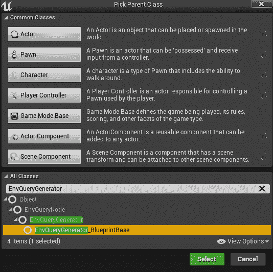

在 C++中，您需要从**EnvQueryGenerator**类继承：

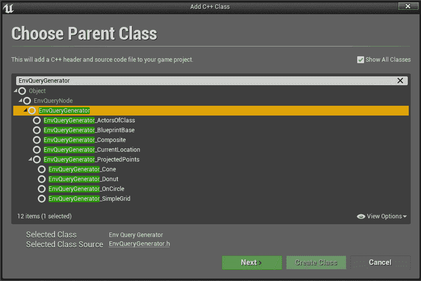

由于您已经拥有了所有投影，您可能希望直接从**EnvQueryGenerator_ProjectedPoints**开始。通过这样做，您只需关注其生成。

# 创建测试

在当前版本的虚幻引擎中，您无法在蓝图（Blueprint）中创建测试——我们只能用 C++来实现。您可以通过扩展**EnvQueryTest**类来完成这项工作：

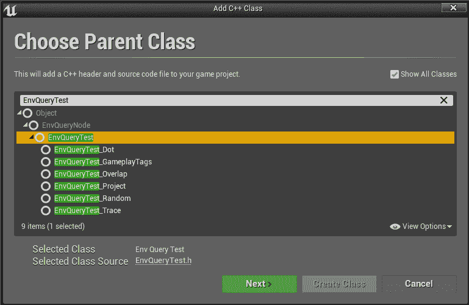

不幸的是，这也不在本书的范围之内。然而，探索虚幻引擎的源代码将为您提供大量的信息和几乎无穷无尽的学习资源。

# 摘要

在本章中，我们探讨了**环境查询系统**如何使决策领域的空间推理成为可能。

具体来说，我们了解了整个系统的一般工作原理，然后我们逐一了解了系统的内置节点。我们还看到了如何通过一个特殊的棋子来可视化查询。最后，我们探讨了如何扩展系统。

在下一章中，我们将探讨代理意识以及内置的感知系统。
