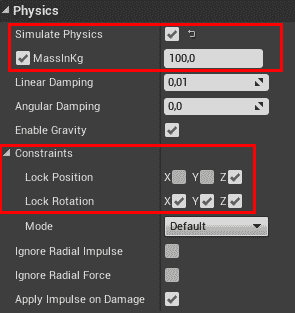

# 第五章：智能体意识

*你可以跑，但你无法藏！*

哦，你回来了？太好了，因为这意味着你的眼睛捕捉到了一些光线信息，你的大脑正在感知，这通常被称作阅读。我们做的每一件事，我们做的每一个决定，都是基于我们的感知，从生物学角度来看，我们做出快速的决定过程，因为时间是至关重要的（例如，你看到一条蛇，你的杏仁核处理这些信息比你的视觉皮层要快得多和快！）

同样的概念，AI 需要通过收集他们需要感知的信息来基于事实做出决策。本章全部关于感知，以及 AI 如何从环境中获取这些信息，以便它能够意识到其周围的环境。我们在上一章中探讨了 EQS，它收集了大量关于周围环境的信息并进行处理。在这里，我们将仅限于简单的感知行为。AI 将如何使用这些信息是其他章节（以及我们已经讨论过的章节）的主题。

下面是本章我们将要讨论的主题的简要概述：

+   现有视频游戏中的感知和意识

+   Unreal 中感知系统的概述

+   感知组件

+   视觉和听觉感知

+   感知刺激

+   在智能体中实现视觉（在蓝图和 C++中）

+   在智能体中实现听觉（在蓝图和 C++中）

那么，让我们先看看一些关于视频游戏中 AI 意识的例子，然后我们将看到如何在 Unreal 中设置感知系统。

# 游戏中的人工智能感知

这一切都是感知的问题，对吧？但是当涉及到人工智能——特别是游戏中的 AI——感知可以决定胜负。换句话说，AI 角色在游戏过程中如何感知玩家可以创造一系列不同的体验，从而在你缓慢、试探性地转弯时，营造出充满紧张和悬念的环境。

# 声音

你有没有尝试在游戏中悄悄绕过守卫，试图不发出声音或被发现？这是 AI 感知玩家并相应反应（通常不是对你有利）的最常见方式之一！然而，使用声音来影响 AI 对玩家的感知的好处是，它给了玩家发起突袭的机会（例如，《杀手》，《刺客信条》）。例如，玩家可以悄悄地接近敌人，从后面击晕或攻击他们，从而为玩家提供优势。这在敌人难以击败或玩家资源不足（例如，弹药、医疗包/药水等）时尤其有用。

# 脚步声

正如前面的例子所暗示的，AI 通过声音感知角色的最常见方式之一是通过脚步声。这里没有关于如何做到的惊喜，但检测的邻近性可能取决于许多因素。例如，一些角色可以蹲着走以避免被检测到，或者简单地通过潜行（例如 *Abe's Oddyssey*）；其他游戏允许某些角色在移动时不可检测，除非被敌人视觉上发现（例如 *Resident Evil: Revelations 2* 中的 Natalia）。使用脚步声作为 AI 感知的触发器的另一个关键因素是玩家行走的地面材料类型。例如，一个在森林中行走的玩家，踩在树叶和树皮上，会比在沙地上行走的玩家更明显（也更响亮）。

# 撞倒物体

当你在关卡中潜行或蹲着走，甚至是在卧姿（例如 *Battlefield*）时，不会触发敌人，但如果你撞倒了某个东西（例如瓶子、箱子、随机物品），它很可能会引起他们的注意。在这种情况下，环境物体在 AI 通过玩家在环境中的笨拙动作来感知玩家位置方面发挥着重要作用。在某些情况下，某些物体可能比其他物体更容易吸引注意力，这取决于它们产生的噪音大小。当然，作为游戏设计师，你有权决定这一点！

# 位置

类似于声音，AI 可以根据你与它们之间的距离看到你。当你被敌人直接看到时，这种情况会更明显，也更难以避免。想象一下，你正在悄悄地绕过敌人，一旦你足够接近他们，那就完了，你已经被发现！这是许多玩家面临的悲惨危险，但也是一个有很多回报的事情，尤其是在战胜敌人的满足感方面。

让我们通过一些例子进一步探讨这个概念。首先，我们有像 *Assassin's Creed*、*Hitman: Absolution* 和 *Thief* 这样的游戏，在这些游戏中，通过操纵来避开敌人的艺术对于玩家完成任务的成败至关重要。通常，这要求玩家利用环境周围的环境，如 NPC、墙壁、干草堆、植物（树木、灌木）、屋顶，以及利用惊喜元素。

# 距离区域

在其他情况下，有一个明确的距离区域，玩家可以在被检测到之前保持在这个区域之外。在游戏中，这通常通过光源，如手电筒来体现，迫使玩家在阴影和光线之间穿梭以避免被检测到。采用这种方法的优秀游戏例子有 *Monaco: What's Yours Is Mine* 和 *Metal Gear Solid*，其中某些 AI 角色通过火炬或长时间面对玩家来获得可见性。

你可以在下面的屏幕截图中看到这个例子：


游戏截图来自《摩纳哥：你的就是我的》

在这里（在《摩纳哥：你的就是我的》中），你可以看到手电筒的半径，一旦玩家进入，他们就有有限的时间来吸引警卫的注意。

由于《摩纳哥：你的就是我的》完全基于这种机制，让我们看看更多截图，以更好地了解这款游戏中视觉感知的工作方式。

在下面的截图中，我们可以看到当玩家改变房间时感知是如何变化的：


游戏截图来自《摩纳哥：你的就是我的》

在下面的截图中，我们看到了玩家的感知特写：


游戏截图来自《摩纳哥：你的就是我的》

然后，我们看到了一名警卫手电筒的特写：


游戏截图来自《摩纳哥：你的就是我的》

改变游戏，在《合金装备》中，感知与敌人（红色圆点）在玩家（白色圆点）周围巡逻环境的方式相似。在下面的截图中，你可以看到一个摄像头（在*小地图*中以红色圆点表示）在*小地图*中有一个黄色的视野锥（警卫有一个蓝色的视野锥）：


游戏截图来自《合金装备》

《合金装备》游戏系列完全基于感知，如果你对使用这种机制开发游戏 AI 感兴趣，那么探索更多并了解这款游戏是值得的。

总结一下，如果你离 NPC（例如，在他们的可视范围内）太近，你会被发现，他们会尝试与你的人物互动，无论是好是坏（例如《刺客信条》中的乞丐或敌人攻击你），这解锁了许多基于感知的有趣机制。

# 与其他敌人的互动

一个 AI 对你的位置的感知并不一定与你进入他们的可视区域的时间有关。在其他情况下（例如第一人称射击游戏），这可能会在你开始射击敌人时发生。这会在你的初始近距离内的许多 AI 中产生连锁反应，它们会以你为目标（例如《合金装备》、《双雄》、《战地》等）。

# 并非所有都与“敌人”有关

在许多体育游戏中，AI 必须具有感知能力才能相应地做出反应，例如防止进球、击球或投篮。在体育游戏中，AI 在与你对抗时必须具有感知能力（和竞争力）。他们需要知道你的位置和球的位置（或任何其他物体），以便他们可以做出反应（例如将球踢离球门柱）。

# 感知 AI 不仅仅是人形或动物性的

感知 AI 也可以包括机器，例如汽车和其他车辆。以游戏《侠盗猎车手》、《赛车手》和《逃离》为例，这些游戏要求玩家在车内某个时刻在 3D 世界空间中导航。在某些情况下，车内有 NPC，但大部分情况下，汽车本身会对你驾驶做出反应。这种情况也适用于更多以运动为导向的游戏，如《极品飞车》、《速度与激情》和《 Ridge Racer》（仅举几个例子）。

# 玩家的影响

正如我们所看到的，AI 检测玩家的方式有很多种。但在所有这些中，游戏设计师必须考虑的是这将对游戏体验产生怎样的影响；它将如何驱动游戏玩法？虽然感知 AI 的使用对任何游戏来说都是一个很好的补充，但它也会影响游戏玩法。例如，如果你想有一个高度关注技能、玩家敏捷性和更多环境意识的玩法，那么 AI 的感知需要非常敏感，玩家将更加脆弱（例如，盗贼）。但另一方面，如果你想有一个快节奏的动作游戏，你需要有一个平衡的感知 AI，允许玩家相应地做出反应。例如，他们有一个与 AI 对抗的公平竞技场。

# 感知系统概述

回到虚幻引擎，正如你所预期的那样，AI 框架中有一个子系统实现了 AI 感知。再次强调，你可以自由地实现自己的系统，尤其是如果你有特殊需求的话…

在**感知与感知**方面，我们处于比**决策**（如行为树和 EQS）更低的层次。实际上，这里没有需要做出的决策，没有需要选择的地方，而只是信息的流动/流程。

如果感知系统感知到某些“有趣”的东西（我们稍后会定义这是什么意思），那么它会通知 AI 控制器，AI 控制器将决定如何处理收到的刺激（这在虚幻引擎术语中是其感知）。

因此，在本章中，我们将重点介绍如何正确设置感知系统，以便我们的 AI 能够感知，但我们不会处理收到刺激后的操作（例如，玩家在视线中，开始追逐他们）。毕竟，如果你已经有了准备好的行为（例如，追逐玩家的行为树；我们将在本书后面构建这样的树），感知背后的逻辑简单到“如果玩家在视线中（AI 控制器从感知系统中收到刺激），则执行追逐行为树”。

在实际应用中，虚幻引擎内置的感知系统主要基于两个组件的使用：**AIPerceptionComponent**和**AIPerceptionStimuliSourceComponent**。前者能够感知刺激，而后者能够产生刺激（但产生刺激的方式不止这一种，我们很快就会看到）。

虽然听起来可能有些奇怪，但系统认为 AIPerceptionComponent 是附加到 AI 控制器上的（而不是它们所控制的 Pawn/Character）。实际上，是 AI 控制器将根据接收到的刺激做出决定，而不是单纯的 Pawn。因此，AIPerceptionComponent 需要直接附加到 AI 控制器上。

# AIPerceptionComponent

让我们分解一下 **AIPerceptionComponent** 的工作原理。我们将同时在蓝图和 C++ 中进行这一操作。

# 蓝图中的 AIPerceptionComponent

如果我们打开蓝图 AI 控制器，我们就可以像添加任何其他组件一样添加 **AIPerceptionComponent**：从组件选项卡，点击 **添加组件** 并选择 **AIPerceptionComponent**，如下面的截图所示：


当你选择组件时，你将看到它在 *详细信息* 面板中的样子，如下面的截图所示：


它只有两个参数。一个定义了主要感官。实际上，**AIPerceptionComponent** 可以拥有多个感官，当涉及到检索已感知的目标位置时，AI 应该使用哪一个？**主要感官**通过给予一个感官相对于其他感官的优先权来消除歧义。另一个参数是一个感官数组。当你将不同的感官填充到数组中时，你将能够自定义每一个，如下面的截图所示：


请记住，你可以拥有每种类型超过一个感官。假设你的敌人有两个头，朝向不同的方向：你可能想要有两个视觉感官，一个对应每个头。当然，在这种情况下，需要更多的设置来确保它们正确工作，因为你需要修改视觉组件的工作方式，比如说，AI 总是从其前向矢量观察。

每个感官都有自己的属性和参数。让我们来看两个主要的：视觉和听觉。

# 感官 – 视觉

视觉感官的工作方式正如你所期望的，并且它几乎可以直接使用（这可能不适用于其他感官，但视觉和听觉是最常见的）。它看起来是这样的：


让我们分解一下控制视觉感官的主要参数：

+   **视线半径**：如果一个目标（一个可以看到的对象）进入这个范围内，并且没有被遮挡，那么目标就会被检测到。在这种情况下，它就是“*最大视线距离以注意到目标*”。

+   **失去视线半径**：如果目标已经被看到，那么如果未被遮挡，目标仍然会在这个范围内被看到。这个值大于 *视线半径*，这意味着如果目标已经被看到，AI 能够在更远的距离上感知到目标。在这种情况下，它就是“*最大视线距离以注意到已经看到的目标*”。

+   **外围视野半角度数**：正如其名所示，它指定了 AI 可以看多远（以度为单位）。90 的值意味着（因为这个值只是角度的一半）AI 能够看到其前方直到 180 度的所有事物。180 的值意味着 AI 可以朝任何方向看；它有 360 度的视野。此外，重要的是要注意，这个半角是从前进向量测量的。以下图表说明了这一点：


+   **从上次看到的位置自动成功范围**：默认情况下，它设置为无效值（-1.0f），这意味着它没有被使用。这指定了从目标上次看到的位置的范围，如果它在这个范围内，则目标总是可见的。

有其他一些更通用的设置，可以应用于许多感官（包括听觉，因此它们将在下一节中不再重复）：

+   **通过隶属关系检测**：*参见不同的团队*部分。

+   **调试颜色**：正如其名所示，这是在视觉调试器中显示此感官的颜色（参见第十一章[de51b2fe-fb19-4347-8de9-a31b2c2a6f2f.xhtml]，*AI 调试方法 – 记录*，获取更多信息）。

+   **最大年龄**：它表示刺激被记录的时间（以秒为单位）。想象一下，一个目标从 AI 的视野中消失；它的最后位置仍然被记录，并分配了一个年龄（这些数据有多久）。如果年龄大于最大年龄，则刺激将被删除。例如，一个 AI 正在追逐玩家，玩家逃离了他的视野。现在，AI 应该首先检查玩家最后被看到的位置，试图将其带回视野中。如果失败，或者位置记录了许多分钟之前，那么这些数据就不再相关，可以将其删除。总之，这指定了由这个感官产生的刺激被遗忘后的年龄限制。此外，0 的值表示永不。

# 感官 – 听觉

听觉感官只有一个合适的参数，即听觉范围。这设置了 AI 能够听到的距离。其他的是我们已经看到的通用参数（例如*最大年龄*、*调试颜色*和*通过隶属关系检测*）。它看起来是这样的：


为了使这本书完整，值得提一下，还有一个选项，称为*LoSHearing*。据我所知，通过查看虚幻引擎源代码（版本 4.20），这个参数似乎不影响任何事物（除了调试）。因此，我们将其设置为未启用。

在任何情况下，都有其他选项来控制声音的产生。实际上，听觉事件需要使用特殊的功能/蓝图节点手动触发。

# AIPerceptionComponent 和 C++中的感官

如果你跳过了前面的部分，请先阅读它们。实际上，所有概念都是相同的，在这个部分，我只是将要展示组件在 C++ 中的使用，而不会重新解释所有概念。

这里是我们想要使用的类的 `#include` 语句（我只包含了视觉和听觉）：

```py
#include "Perception/AIPerceptionComponent.h"
#include "Perception/AISense_Sight.h"
#include "Perception/AISenseConfig_Sight.h"
#include "Perception/AISense_Hearing.h"
#include "Perception/AISenseConfig_Hearing.h"
```

要将组件添加到 C++ AI 控制器中，就像添加任何其他组件一样，在 `.h` 文件中添加一个变量。因此，为了跟踪它，你可以使用基类中的 `inerith` 变量，它声明如下：

```py
  UPROPERTY(VisibleDefaultsOnly, Category = AI)
  UAIPerceptionComponent* PerceptionComponent;
```

因此，你可以在任何 *AIController* 中使用这个变量，而无需在头文件（`.h`）中声明它。

然后，在 `.cpp` 文件构造函数中的 `CreateDefaultSubobject()` 函数，我们可以创建组件：

```py
PerceptionComponent = CreateDefaultSubobject<UAIPerceptionComponent>(TEXT("SightPerceptionComponent"));
```

此外，你将需要额外的变量，每个你想要配置的感官都需要一个。例如，对于视觉和听觉感官，你需要以下变量：

```py
UAISenseConfig_Sight* SightConfig;
UAISenseConfig_Hearing* HearingConfig;
```

要配置一个感官，你首先需要创建它，你可以访问它的所有属性，并设置你需要的内容：

```py
//Create the Senses
SightConfig = CreateDefaultSubobject<UAISenseConfig_Sight>(FName("Sight Config"));
HearingConfig = CreateDefaultSubobject<UAISenseConfig_Hearing>(FName("Hearing Config"));

//Configuring the Sight Sense
SightConfig->SightRadius = 600;
SightConfig->LoseSightRadius = 700;

//Configuration of the Hearing Sense
HearingConfig->HearingRange = 900;
```

最后，你需要将感官绑定到 **AIPerceptionComponent**：

```py
//Assigning the Sight and Hearing Sense to the AI Perception Component
PerceptionComponent->ConfigureSense(*SightConfig);
PerceptionComponent->ConfigureSense(*HearingConfig);
PerceptionComponent->SetDominantSense(SightConfig->GetSenseImplementation());
```

如果你需要调用回事件，你可以通过绕过回调函数（它必须具有相同的签名，不一定是相同的名称）来这样做：

```py
//Binding the OnTargetPerceptionUpdate function
PerceptionComponent->OnTargetPerceptionUpdated.AddDynamic(this, &ASightAIController::OnTargetPerceptionUpdate);
```

这就结束了在 C++ 中使用 **AIPerceptionComponent** 和 **Senses** 的过程。

# 不同团队

就内置在 Unreal 中的 AI 感知系统而言，AI 和任何可以被检测到的内容都可以有一个团队。有些团队是相互对立的，而有些则是中立的。因此，当 AI 来感知某物时，那物可以是友好的（它在同一个团队中），中立的，或者敌人。例如，如果一个 AI 在巡逻营地，我们可以忽略友好的和中立的实体，只专注于敌人。顺便说一句，默认设置是只感知敌人。

你可以通过 *Sense* 的 *Detecting for Affiliation* 设置来改变 AI 可以感知的实体类型：


这提供了三个复选框，我们可以选择我们希望 AI 感知的内容。

总共有 255 个团队，默认情况下，每个实体都在团队 255（唯一的特殊团队）中。在团队 255 中的实体被视为中立（即使两个实体都在同一个团队中）。否则，如果两个实体在同一个团队中（不同于 255），它们“看到”对方是友好的。另一方面，两个不同团队（不同于 255）的实体“看到”对方是敌人。

现在的问题是，我们如何更改团队？目前，这只能在 C++ 中完成。此外，我们已经讨论了实体，但谁实际上可以成为团队的一员？所有实现了 **IGenericTeamAgentInterface** 的内容都可以成为团队的一部分。*AIControllers* 已经实现了它。因此，在 AI 控制器上更改团队很容易，如下面的代码片段所示：

```py
    // Assign to Team 1
    SetGenericTeamId(FGenericTeamId(1));
```

对于其他实体，一旦它们实现了**IGenericTeamAgentInterface**，它们就可以重写`GetGenericTeamId()`函数，这为 AI 提供了一种检查该实体属于哪个团队的方法。

# AIStimuliSourceComponent

我们已经看到了 AI 如何通过感知来感知，但刺激最初是如何生成的？

# 所有 Pawns 都会自动检测。

在视觉感知的情况下，默认情况下，所有 Pawns 已经是刺激源。实际上，在本章的后面，我们将使用玩家角色，该角色将由 AI 检测，而无需**AIStimuliSourceComponent**。如果你有兴趣禁用此默认行为，你可以通过进入你的项目目录，然后进入**Config**文件夹来实现。在那里，你会找到一个名为**DefaultGame.ini**的文件，你可以在其中设置一系列配置变量。如果你在文件末尾添加以下两行，Pawns 将默认不产生视觉刺激，并且它们还需要**AIStimuliSourceComponent**以及所有其他内容：

```py
[/Script/AIModule.AISense_Sight]
bAutoRegisterAllPawnsAsSources=false
```

在我们的项目中，我们不会添加这些行，因为我们想要 Pawns 被检测，而无需添加更多组件。

# AIStimuliSourceComponent 在蓝图中的使用

和其他组件一样，它可以添加到蓝图：


如果你选择它，你将在**详细信息**面板中看到它只有两个参数：

+   **自动注册为源**：正如其名所示，如果选中，源将自动在感知系统中注册，并且它将从一开始就开始提供刺激。

+   **注册为感知源**：这是一个数组，包含该组件提供的所有感知刺激。

关于这个组件没有太多可说的。它非常简单易用，但很重要（你的 AI 可能无法感知任何刺激！）。因此，当你想要它们生成刺激（这可能只是被 AI 看到）时，记得将其添加到非 Pawns 实体中。

# C++中的 AIStimuliSourceComponent

在 C++中使用此组件很容易，因为你只需创建它、配置它，它就准备好了。

这是你需要使用的`#include`语句，以便你可以访问该组件的类：

```py
#include "Perception/AIPerceptionStimuliSourceComponent.h"
```

和其他组件一样，你需要在`.h`文件中添加一个变量来跟踪它：

```py
UAIPerceptionStimuliSourceComponent* PerceptionStimuliSourceComponent;
```

接下来，你需要在构造函数中使用`CreateDefaultSubobject()`函数来生成它：

```py
PerceptionStimuliSourceComponent = CreateDefaultSubobject<UAIPerceptionStimuliSourceComponent>(TEXT("PerceptionStimuliComponent"));
```

然后，你需要注册一个源感知，如下所示（在这个例子中是**视觉**，但你可以将`TSubClassOf<UAISense>()`更改为你需要的感知）：

```py
PerceptionStimuliSourceComponent->RegisterForSense(TSubclassOf<UAISense_Sight>());
```

**自动注册为源**布尔值是受保护的，默认为 true。

# 实践感知系统 – 视觉 AI 控制器

了解某物的最佳方式就是使用它。所以，让我们先创建一个简单的感知系统，当有东西进入或离开 AI 的感知区域时，我们在屏幕上打印出来，同时显示当前看到的对象数量（包括/不包括刚刚进入/离开的对象）。

再次强调，我们将这样做两次，一次使用蓝图，另一次使用 C++，这样我们就可以了解两种创建方法。

# 一个蓝图感知系统

首先，我们需要创建一个新的 AI 控制器（除非你想要继续使用我们之前一直在使用的那个）。在这个例子中，我将称它为“SightAIController”。打开蓝图编辑器，添加 AIPerception 组件，并且如果你喜欢的话，可以将其重命名为“SightPerceptionComponent”。

选择这个组件。在*详细信息*面板中，我们需要将其添加为*视野*的一个感知，如下面的截图所示：


我们可以将**视野半径**和**失去视野半径**设置为合理的值，例如*600*和*700*，这样我们就可以得到类似这样的效果：


我们可以保持角度不变，但我们需要更改**通过归属检测**。实际上，在蓝图上无法更改团队，所以玩家将处于相同的 255 号团队，这是一个中立团队。由于我们只是刚开始了解这个系统的工作原理，我们可以勾选所有三个复选框。现在，我们应该有类似这样的效果：


在组件的底部，我们应该有所有不同的事件。特别是，我们需要**目标感知更新**，每次目标进入或退出感知区域时都会调用它——这正是我们所需要的：


点击图中的“**+**”符号来添加事件：


这个事件将为我们提供导致更新并创建刺激的演员（值得记住的是，感知组件可能同时有多个感知，这个变量告诉你哪个刺激导致了更新）。在我们的例子中，我们只有视野，所以它不可能是其他任何东西。下一步是了解我们有多少目标在视野中，以及哪个目标离开了或进入了视野。

因此，将**SightPerceptionComponent**拖入图中。从那里，我们可以拖动一个引脚来获取所有的“**当前感知到的演员**”，这将给我们一个演员数组。别忘了将*感知类*设置为*视野*：


通过测量这个数组的长度，我们可以得到当前感知到的演员的数量。此外，通过检查从事件传递过来的演员是否在当前“*可见演员*”数组中，我们可以确定这样的演员是否已经离开或进入了视野：


最后一步是将所有这些信息格式化成一个漂亮的格式化字符串，以便可以在屏幕上显示。我们将使用 Append 节点来构建字符串，以及一个用于选择 "*进入*" 或 "*离开*" 实体的选择器。最后，我们将最终结果连接到 *Print String*：


*Print String* 仅用于调试目的，在发布游戏时不可用，但我们现在只是在测试和理解感知系统的工作原理。

此外，我知道当感知到的实体数量为一个是，字符串将产生 "*1 objects*"，这是不正确的，但修正复数（尽管可能，无论是使用 if 语句还是以更复杂的方式处理语言结构）超出了本书的范围。这就是为什么我使用这个表达式的理由。

保存 AI 控制器并返回到关卡。如果你不想在 C++ 中做同样的事情，请跳过下一节，直接进入 "*测试一切*"。

# C++ 感知系统

再次，如果你更倾向于 C++ 方面，或者想要实验如何用 C++ 构建相同的 AI 控制器，这部分就是为你准备的。我们将遵循完全相同的步骤（或多或少），而不是图片，我们将有代码！

让我们从创建一个新的 AIController 类开始（如果你不记得如何做，可以查看第二章，*在 AI 世界中迈出第一步*）。我们将将其命名为 SightAIController 并将其放置在 `AIControllers` 文件夹中。

让我们开始编辑 `SightAIController.h` 文件，其中我们需要包含一些其他的 `.h` 文件，以便我们的编译器知道我们需要的类的实现位置。实际上，我们需要访问 **AIPerception** 和 **AISense_Config** 类。因此，在你的代码文件顶部，你应该有以下的 `#include` 语句：

```py
#pragma once
#include "CoreMinimal.h"
#include "AIController.h"
#include "Perception/AIPerceptionComponent.h"
#include "Perception/AISense_Sight.h"
#include "Perception/AISenseConfig_Sight.h"
#include "SightAIController.generated.h"
```

然后，在我们的类中，我们需要保留对 `AIPerception` 组件的引用，以及一个将保存视觉感知配置的额外变量：

```py
 //Components Variables
 UAIPerceptionComponent* PerceptionComponent;
 UAISenseConfig_Sight* SightConfig;
```

此外，我们需要添加 `Constructor` 函数，以及 `OnTargetPerceptionUpdate` 事件的回调。为了使其工作，最后一个必须是一个 `UFUNCTION()`，并且需要有一个 **Actor** 和一个 **AIStimulus** 作为输入。这样，反射系统才能按预期工作：

```py
//Constructor
 ASightAIController();

//Binding function
 UFUNCTION()
 void OnTargetPerceptionUpdate(AActor* Actor, FAIStimulus Stimulus);
```

让我们进入我们的 `.cpp` 文件。首先，我们需要创建 `AIPerception` 组件，以及一个视觉配置：

```py
ASightAIController::ASightAIController() {
 //Creating the AI Perception Component
 PerceptionComponent = CreateDefaultSubobject<UAIPerceptionComponent>(TEXT("SightPerceptionComponent"));
 SightConfig = CreateDefaultSubobject<UAISenseConfig_Sight>(FName("Sight Config"));

}
```

然后，我们可以使用相同的参数配置 *Sight Sense*：**视野半径** 为 *600* 和 **失去视野半径** 为 *700*：

```py
ASightAIController::ASightAIController() {
  //Creating the AI Perception Component
  PerceptionComponent = CreateDefaultSubobject<UAIPerceptionComponent>(TEXT("SightPerceptionComponent"));
  SightConfig = CreateDefaultSubobject<UAISenseConfig_Sight>(FName("Sight Config"));

 //Configuring the Sight Sense
 SightConfig->SightRadius = 600;
 SightConfig->LoseSightRadius = 700;
}
```

接下来，我们需要检查 **DetectionByAffiliation** 的所有标志，以便检测我们的玩家（因为，目前，他们都在第 255 个团队中；查看 *练习* 部分了解如何改进这一点）：

```py
ASightAIController::ASightAIController() {
  //Creating the AI Perception Component
  PerceptionComponent = CreateDefaultSubobject<UAIPerceptionComponent>(TEXT("SightPerceptionComponent"));
  SightConfig = CreateDefaultSubobject<UAISenseConfig_Sight>(FName("Sight Config"));

  //Configuring the Sight Sense
  SightConfig->SightRadius = 600;
  SightConfig->LoseSightRadius = 700;
 SightConfig->DetectionByAffiliation.bDetectEnemies = true;
 SightConfig->DetectionByAffiliation.bDetectNeutrals = true;
 SightConfig->DetectionByAffiliation.bDetectFriendlies = true;
}
```

最后，我们将视觉配置与`AIPerception`组件关联起来，并将`OnTargetPerceptionUpdate`函数绑定到`AIPerceptionComponent`上的同名列事件：

```py
ASightAIController::ASightAIController() {
  //Creating the AI Perception Component
  PerceptionComponent = CreateDefaultSubobject<UAIPerceptionComponent>(TEXT("SightPerceptionComponent"));
  SightConfig = CreateDefaultSubobject<UAISenseConfig_Sight>(FName("Sight Config"));

  //Configuring the Sight Sense
  SightConfig->SightRadius = 600;
  SightConfig->LoseSightRadius = 700;
  SightConfig->DetectionByAffiliation.bDetectEnemies = true;
  SightConfig->DetectionByAffiliation.bDetectNeutrals = true;
  SightConfig->DetectionByAffiliation.bDetectFriendlies = true;

 //Assigning the Sight Sense to the AI Perception Component
 PerceptionComponent->ConfigureSense(*SightConfig);
 PerceptionComponent->SetDominantSense(SightConfig->GetSenseImplementation());

 //Binding the OnTargetPerceptionUpdate function
 PerceptionComponent->OnTargetPerceptionUpdated.AddDynamic(this, &ASightAIController::OnTargetPerceptionUpdate);
}
```

这就结束了*构造函数*，但我们仍然需要实现`OnTargetPerceptionUpdate()`函数。首先，我们需要检索所有**当前感知到的演员**。这个函数需要一个演员数组来填充，以及要使用的感知实现。

因此，我们的数组将填充感知到的演员：

```py
void ASightAIController::OnTargetPerceptionUpdate(AActor* Actor, FAIStimulus Stimulus)
{
 //Retrieving Perceived Actors
 TArray<AActor*> PerceivedActors;
 PerceptionComponent->GetPerceivedActors(TSubclassOf<UAISense_Sight>(), PerceivedActors);

}
```

通过测量数组的长度，我们可以得到当前感知到的演员数量。此外，通过检查从事件传递过来的演员（函数的参数）是否在当前"*可见演员*"数组中，我们可以确定这样的演员是否已经离开或进入了视野：

```py
void ASightAIController::OnTargetPerceptionUpdate(AActor* Actor, FAIStimulus Stimulus)
{
  //Retrieving Perceived Actors
  TArray<AActor*> PerceivedActors;
  PerceptionComponent->GetPerceivedActors(TSubclassOf<UAISense_Sight>(), PerceivedActors);

 //Calculating the Number of Perceived Actors and if the current target Left or Entered the field of view.
 bool isEntered = PerceivedActors.Contains(Actor);
 int NumberObjectSeen = PerceivedActors.Num();

}
```

最后，我们需要将此信息打包到一个格式化的字符串中，然后将其打印到屏幕上：

```py
void ASightAIController::OnTargetPerceptionUpdate(AActor* Actor, FAIStimulus Stimulus)
{
  //Retrieving Perceived Actors
  TArray<AActor*> PerceivedActors;
  PerceptionComponent->GetPerceivedActors(TSubclassOf<UAISense_Sight>(), PerceivedActors);

  //Calculating the Number of Perceived Actors and if the current target Left or Entered the field of view.
  bool isEntered = PerceivedActors.Contains(Actor);
  int NumberObjectSeen = PerceivedActors.Num();

 //Formatting the string and printing it
 FString text = FString(Actor->GetName() + " has just " + (isEntered ? "Entered" : "Left") + " the field of view. Now " + FString::FromInt(NumberObjectSeen) + " objects are visible.");
 if (GEngine) {
 GEngine->AddOnScreenDebugMessage(-1, 5.0f, FColor::Turquoise, text);
 }
 UE_LOG(LogTemp, Warning, TEXT("%s"), *text);

}
```

一次又一次，我知道“1 objects”是不正确的，但修正复数（尽管可能）超出了本书的范围；让我们保持简单。

# 测试所有这些

现在，你应该已经实现了一个带有感知系统的 AI 控制器（无论是蓝图还是 C++——这并不重要，它们应该表现相同）。

通过按*Alt* + *拖动*将玩家拖入关卡中创建另一个`ThirdPersonCharacter`（如果你想在上一章中创建的 AI 中使用，可以这样做）：


在*详细信息*面板中，我们让它由我们的 AI 控制器控制，而不是玩家（这个流程现在应该对你来说很容易）：


或者，如果你使用 C++设置，选择以下设置：


在按下播放之前，创建一些可以被检测到的其他对象会很好。我们知道所有的 Pawns 都可以被检测到（除非被禁用），所以让我们尝试一个不是 Pawn 的对象——也许是一个移动平台。因此，如果我们想检测它，我们需要使用**AIPerceptionStimuliSourceComponent**。

首先，让我们创建一个浮动平台（可以被我们的角色轻易推动）。如果你在*ThirdPersonCharacter Example*的默认关卡中，你可以通过*Alt + 拖动*复制以下截图中的大网格，否则，如果你使用自定义关卡，一个可以被压扁的立方体将工作得很好）：


到目前为止，它太大，所以让我们将其缩小到（1, 1, 0.5）。此外，为了保持一致，你可以将其移动到（-500, 310, 190）。最后，我们需要将移动性更改为可移动，因为它需要移动：


接下来，我们希望能够推动这样的平台，因此我们需要启用物理模拟。为了保持我们的角色可以推动它，让我们给它一个质量为*100 Kg*（我知道，这看起来很多，但考虑到摩擦很小，并且平台可以漂浮，这是正确的数量）。此外，我们不希望平台旋转，因此我们需要在**约束**中阻止所有三个旋转轴。如果我们想让平台漂浮，也是同样的道理——如果我们锁定 z 轴，平台只能沿着*XY 平面*移动，没有旋转。这将确保平台易于推动。这就是物理部分应该看起来像的：



最后，我们需要添加一个**AIPerceptionStimuliSourceComponent**，从 Actor 名称附近的**添加组件**绿色按钮：


一旦添加了组件，我们就可以从前面的菜单中选择它。结果，*详细信息*面板将允许我们更改**AIPerceptionStimuliSourceComponent**设置。特别是，我们想要添加*视觉感知*，并自动将组件注册为源。这就是我们应该如何设置它：


作为可选步骤，你可以将其转换为蓝图，以便可以重用，并可能赋予一个更有意义的名称。此外，如果你想让多个对象被*视觉感知系统*跟踪，你可以复制它几次。

最后，你可以点击播放并测试我们迄今为止所取得的成果。如果你通过了我们的*AI 控制角色*，你将在屏幕顶部收到通知。如果我们推动平台进入或离开 AI 的视野，我们会得到相同的结果。以下截图显示了 C++实现，但它与蓝图实现非常相似（只是打印的颜色不同）：


此外，作为预期，你可以使用可视化调试器查看 AI 的视野，我们将在第十三章中探讨，即*AI 调试方法 - 游戏调试器*。以下截图是我们创建的 AI 角色的视野参考。关于如何显示它以及理解所有这些信息的详细说明，请耐心等待第十三章的介绍，即*AI 调试方法 - 游戏调试器*：


是时候给自己鼓掌了，因为这可能看起来你只做了一点点，但实际上，你成功地了解了一个复杂的系统。此外，如果你尝试了一种方法（蓝图或 C++），如果你想掌握蓝图和 C++中的系统，尝试另一种方法。

# 摘要

难道这不是一个感知到的信息量很大吗？

我们首先理解了内置感知系统中的不同组件如何在 Unreal 的 AI 框架内工作。从那里，我们探索了如何实际使用这些组件（无论是在 C++ 中还是在蓝图），并学习了如何正确配置它们。

我们通过一个设置 *视觉* 感知系统的实际例子来总结，这次我们既在蓝图（Blueprint）中，也在 C++ 中实现了这一点。

在下一章中，我们将看到我们如何模拟大型 *人群*。
