# 第七章：群体

在本章中，我们将总结关于虚幻引擎中内置的人工智能的讨论。然后，我们将开始一段旅程，从头开始构建一个有趣的 AI 行为树，然后再检查虚幻引擎底下的巨大调试系统（包括 AI 调试）。

在本章中，我们将涵盖以下主题：

+   游戏中的群体

+   RVO 避免

+   群体管理者

这些主题可能很短，但这并不意味着它们不重要或容易实施。所以，让我们开始吧！

# 游戏中的群体

你是否曾在圣诞节时被困在繁忙的购物中心，或者在体育赛事中被一大群人包围？也许你曾在香气扑鼻的香料市场的摊位间购物？现在，想象一下这个环境中的所有人突然消失。这会改变氛围吗？我想会相当显著。无论环境中的群体大小如何，它们无疑都会增加整体氛围。

游戏中群体的一些优秀例子包括*刺客信条*系列*：

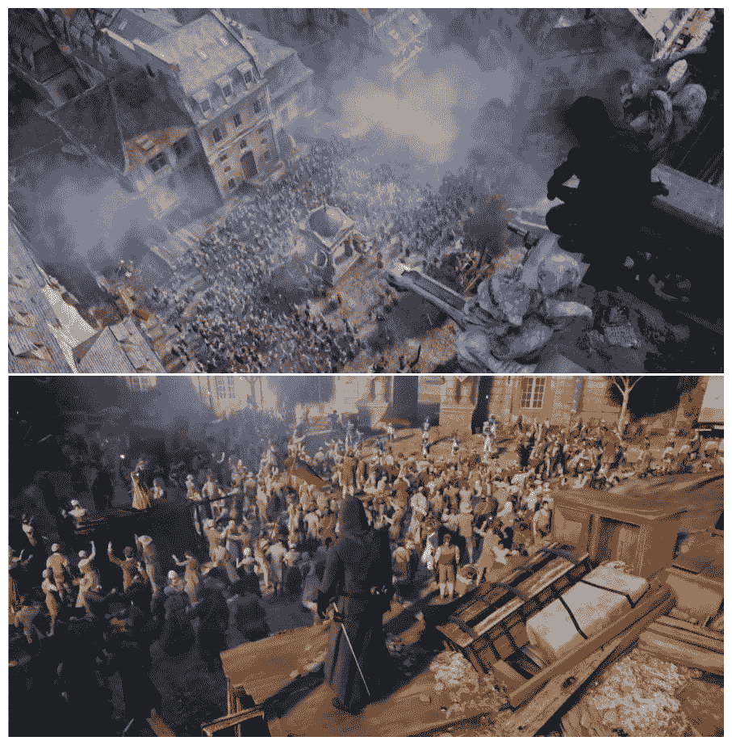

*刺客信条：大革命*中的群体

群体可以包括既可交互的非玩家角色（NPC），也可以是那些只是四处闲逛、忙着自己的事情的人。在某些情况下，比如在*刺客信条*中，群体中的成员将扮演重要的角色，例如要求你保护他们，为你提供保护，甚至要求你的资源（例如乞丐要钱）。在其他情况下，群体除了挡道外，对你的游戏玩法没有任何影响！

# 构建可信的群体

虽然群体是大量人群的集合，通常在特定地点有共同的目的，但它们的创建需要一些思考。这不仅仅是简单地堆砌一帮 NPC，给他们一些自主性（例如通过人工智能），然后按下播放。构建一个可信的群体需要我们考虑一些事情。

首先要考虑的是应该有哪些不同类型的人。回到我们关于香料市场的例子，你可能会找到店主、买家、乞丐、孩子等等。在游戏*堆叠*的以下屏幕截图中，没有大量的人群或人群：

*堆叠*中的小人群

然而，在*末日危机*中，如以下屏幕截图所示，有一大群人（在这种情况下是僵尸），都在试图攻击你：

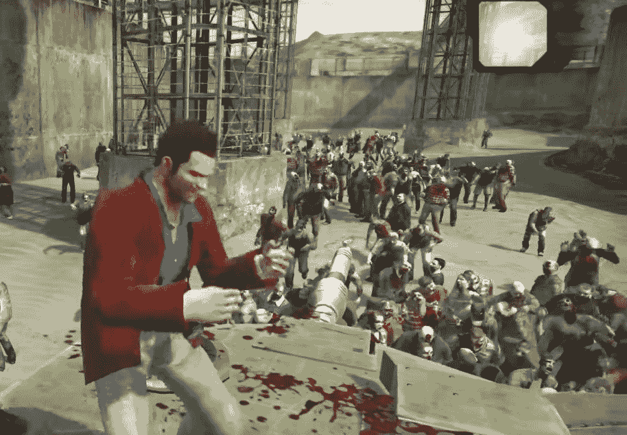

在*末日危机*中，一大群僵尸正在攻击玩家

下一个考虑因素更多的是美学方面。例如，根据其在空间和时间中的位置，运动类型、服装、年龄等也会有所不同。如果你在第三十字军东征期间攻击圣骑士，你不太可能（除非这是你追求的角度）看到穿着好像要去 20 世纪 30 年代鸡尾酒会的人物。

然后，我们有听觉方面的考虑。这个群体听起来是什么样子？他们是喧闹的还是低声细语？也许有自行车飞驰而过，孩子们在摇铃。所有这些方面都是创建逼真群体的重要元素。

最后，但同样重要的是，我们还有群体的移动。他们是怎样移动的？他们是遵循特定的路径，是被引导到特定的区域，还是可以自由地漫游到他们选择的任何地方？

# 动物

现在，并非所有群体都采取人类（或部分/类似人类）的形式。群体也可以是动物群体。正如我们之前讨论的，在开发动物群体时也需要考虑相同的因素。你还得注意动物之间的互动方式，因为这与人类的方式大不相同。例如，狼可能存在于不同大小的群体中，或者说“群体”中，比如说秃鹫群或鹿群，就像以下图片所示：

（顶部）：*刺客信条：起源* 中攻击秃鹫群体

（底部）：*孤岛惊魂 4* 中的鹿群

# 群体移动

当涉及到群体功能的更多技术方面时，我们必须考虑群体与玩家之间交互的范围。例如，如果玩家在跑过他们时击中他们，群体成员会做出反应吗？如果会，他们是如何反应的？

在像《实况足球》、《FIFA》、《火箭联盟》等游戏里，群体在根据情况欢呼或嘘声之外，不会与玩家进行交互。当然，他们也会通过不可听见的呐喊/对话/欢呼来增加氛围：

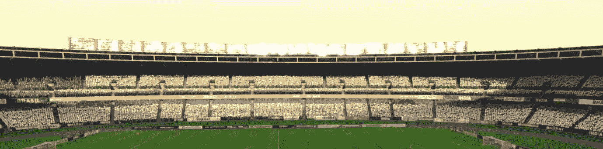

*FIFA 2018* 中的群体

通常，这种行为是通过使用巧妙动画的（顶点）材料来模拟一个玩家只能从远处看到且不与之互动的大群体来创造的。

# 群体动力学和创建逼真的行为

既然我们已经讨论了一些有助于创建逼真群体行为的特征，让我们从更技术性的角度来谈谈我们可以如何实现这一点。

# 基于流动

这些类型的方案关注的是群体而不是其组成部分。这意味着个体（在群体中）的独特行为是由于周围环境的输入而产生的。

# 实体基础

这类方法意味着这些人群中的角色没有任何自主性。这是因为他们的行为基于一系列预定义的规则，旨在模拟属于人群的个体中发生的社会/心理影响。这样，所有角色的移动都由这些规则决定。

# 基于智能体

这可能是处理人群最动态和灵活的方法。在基于智能体的方法中，角色是自主的，并且可以与个体互动。也就是说，这种类型的人群中的每个角色（在一定程度上）都有一定的智能，这使它们能够根据受其周围环境影响的规则集做出反应。

这是我们将在我们的 AI 系统中使用的方法，在本章中，我们将探讨处理人群的内置 Unreal 系统。

# Unreal 中的人群

在 Unreal 中，处理大量人群可能会很具挑战性，尤其是如果你打算有一个复杂的系统。事实上，人群系统需要快速运行并使人群表现出真实的行为。

如果内置系统无法适当地扩展大量人群，那么你很可能是基于（几乎）你的整个游戏玩法来构建人群的。在这种情况下，你应该考虑实现自己的人群系统，即使是通过修改内置系统。然而，对于大多数游戏来说，内置系统已经足够了。

在 Unreal 中，有两个内置系统用于人群模拟/管理。具体如下：

+   UCharacterMovementComponent 的 RVO

+   Detour 人群系统

虽然可以同时运行它们，但这样做并不建议。所以，请确保使用最适合你需求的那个，或者创建自己的。

# 互易速度障碍（RVO）

**互易速度障碍**（**RVO**）是一种算法，由三位研究人员 Jur van den Berg、Ming C. Lin 和 Dinesh Manocha 在 2008 年发表的论文"*互易速度障碍用于实时多智能体导航*"中发现。

RVO 算法是无路径感知的，这意味着它不知道智能体所遵循的路径，也不知道智能体正在导航的导航网格。此外，每个智能体都是独立于其他智能体进行导航，而不需要明确的通信。因此，RVO 即使对于大量智能体来说也非常快速，如果碰撞的数量有限，它还能提供足够的真实行为。

# Unreal 中的 RVO

RVO 算法在 Unreal Engine 中的实现可以追溯到 Unreal Development Kit，或 UDK（UE3）。在 UE4 中，你可以在角色移动组件中找到实现的算法。

要在特定角色上激活 RVO，请打开其*角色移动组件*并导航到*角色移动：避让*部分。在这里，你可以打开算法并设置一些设置，如下面的截图所示：

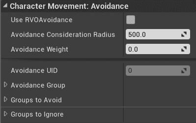

以下设置可供选择（您需要点击底部的箭头以展开所有设置）：

+   **使用 RVO 避障**：指定是否在此角色上使用 RVO 算法。

+   **避障考虑半径**：RVO 算法只会考虑位于此半径内的障碍物。因此，如果在此半径内没有障碍物，RVO 不会改变角色的航线。另一方面，如果障碍物（例如其他角色）位于此半径内，RVO 将尝试避开它们。此参数非常重要，当使用 RVO 时，需要根据角色可能遇到的障碍物类型进行适当的调整。

+   **避障权重**：这表示 RVO 在避障障碍物时需要干预的强度。实际上，算法会尝试在角色前进的方向和避开障碍物的方向之间取平均值。这是 RVO 算法的强度，决定了其行为。默认值是 0.5，在大多数情况下都适用。

+   **避障 UID**：这是一个在 RVO 使用时自动生成的识别号（您无法设置它）。当您想要与避障管理器交互时，它很重要（有关更多信息，请参阅*C++中的 RVO*部分）。

+   **避障组别**：这表示这个角色属于哪个避障组别。

+   **要避免的组别**：这表示这个角色需要避开哪些避障组别。

+   **忽略的组别**：这表示这个角色需要忽略哪些避障组，因此在执行 RVO 避障时不会考虑它们。

在多人游戏中，RVO 算法仅在服务器上运行。

这就足够使用该算法并在您的游戏中进行生产使用了。然而，如果您好奇并想深入了解，请继续阅读以下子节。

# 高级 RVO 设置

本节分为两个部分：我们可以在蓝图中进行什么操作，以及我们可以在 C++中进行什么操作。

# 蓝图中的 RVO

如果您有角色组件的引用，您会注意到您可以读取其所有变量（所有 Get 函数都在这里），但无法设置它们（没有 Set 函数），如下面的截图所示：

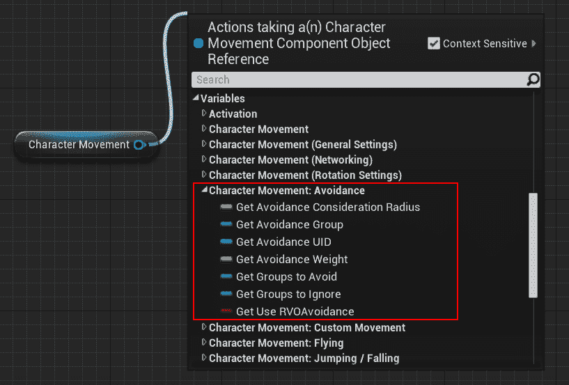

看起来您无法在游戏过程中随时开启或关闭 RVO，但这并不正确。实际上，您仍然可以在实时（游戏时间）中稍微改变 RVO 设置。特别是，您可以使用以下节点来改变 RVO 是否运行：

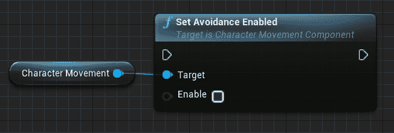

如果你查看 C++实现，其中角色需要注册到 RVO 管理器，那么为什么不能直接编辑布尔变量是显而易见的。实际上，这可能是 RVO 第一次被开启，所有初始化（例如，注册到 RVO 管理器）都需要处理。

此外，你还可以通过以下两个节点来更改角色所属的避障组以及哪些角色应该被避免：

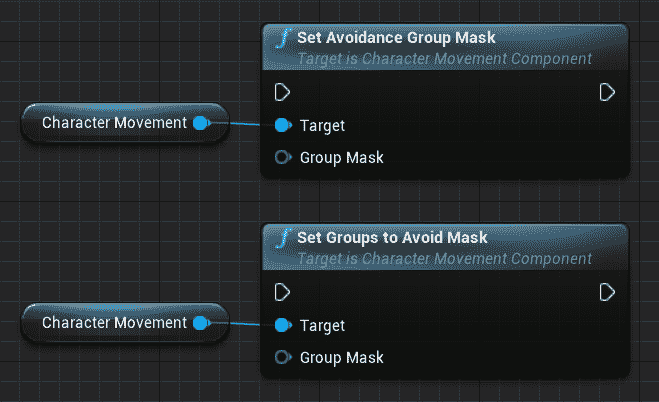

除了这三个函数之外，你在实时使用 RVO 方面相当有限，但 C++开启了新的可能性。

# C++中的 RVO

当然，每次你进入 Unreal 的 C++领域时，你可以在做什么方面有非常广泛的可能性。在本节中，我们将探讨这些可能性中的一些。

首先，你将直接访问*UAvoidanceManager*，它存储了使用 RVO 的所有代理的数据。

从*角色移动组件*的参考中，你可以检索到***避障 UID***，这可以用来查询避障管理器以获取*FNavAvoidanceData*结构，该结构包含角色的特定避障数据。除了可以访问结构中的数据外，你还可以用它进一步查询*避障管理器*以获取更多信息。

假设你想进行手动速度规划。你可以通过使用`GetAvoidanceVelocity()`函数来获取当前速度。

然而，了解所有可能性的最佳方式是查看源代码。特别是，你需要查看以下文件：`Runtime/Engine/Classes/AI/Navigation/AvoidanceManager.h`。

# RVO 观察

以下是我使用这种方法的一些观察结果：

+   由于它是路径和 navmesh 无关的，代理可能被推离 navmesh。这意味着你需要考虑这种可能性（以及这种情况可能发生的频率，例如，如果你的地图有墙壁边界，那么角色不能被推离 navmesh）。

+   如果你想让 RVO 在非角色演员上工作，那么你需要自己重新实现 RVO 算法（或者调整你的演员以使用角色移动组件）。

+   如果在非常拥挤的空间中有许多角色（例如，非现实的行为，如横向滑动），RVO 可能工作得不好。

+   如果避障考虑半径很高，并且角色需要在其他角色之间定位自己，那么位置可能对角色来说很困难（从而可能导致奇怪、古怪和不自然的行为）。

+   RVO 非常快，即使有多个角色在同一级别运行 RVO。事实上，如果没有障碍物，开销成本几乎可以忽略不计，因此通过使用适当的避障考虑半径，可以处理许多角色而不会出现任何问题。

+   你可以实现 RVO 算法的鼻祖，即 VO，它是 RVO 但没有加权。如果性能真的是一个关注点，它甚至可以更快，但现实感会降低。你可以通过查看下一节的参考文献来获取更多关于此的信息。例如，通过修改引擎源代码中的避免管理器，你将能够轻松实现此算法（或任何你选择的其他算法）。

# RVO 资源

以下是一些你可以查看的进一步 RVO 资源：

+   原始的 RVO 论文可在以下链接找到：[`gamma.cs.unc.edu/RVO/icra2008.pdf`](http://gamma.cs.unc.edu/RVO/icra2008.pdf)

+   关于 RVO 的更多信息，请参阅创作者的网站：[`gamma.cs.unc.edu/RVO`](http://gamma.cs.unc.edu/RVO)

+   RVO 版本 2（在 Unreal 引擎中实现版本）：[`gamma.cs.unc.edu/RVO2/`](http://gamma.cs.unc.edu/RVO2/)

# Detour Crowd

另一个内置的 Unreal 系统是 ***Detour Crowd***。它基于 *Recats Library*，与 RVO 相比，它将考虑代理移动的 Navmesh。该系统已经几乎可以直接使用，但让我们深入了解它是如何工作的以及我们如何使用它。

# Detour Crowd 系统的工作原理

在你的游戏世界中存在一个名为 **DetourCrowdManager** 的对象。它负责协调游戏中的群体。特别是，注册到 **DetourCrowdManager** 的代理将被考虑在内。**DetourCrowdManager** 接受任何实现了 **ICrowdAgentInterface** 的内容，该接口为 Manager 提供有关代理的数据。

实际上，在底层，*Detour Crowd Manager* 使用的是由 *Mikko Mononen* 在 *Recast Library* 中开发的 Detour Crowd 算法，Epic Games 为其需求进行了轻微修改。因此，Detour Crowd Component 为 *Unreal Framework* 和 *Recast Detour* 提供了一个接口。你可以通过查看本节末尾的资源来获取更多关于此的信息。

有潜力通过实现 **ICrowdAgentInterface** 来创建代理。然而，Unreal 为你提供了一个名为 **UCrowdFollowingComponent** 的特殊组件，该组件实现了 **ICrowdAgentInterface**，以及其他功能。因此，任何具有 **UCrowdFollowingComponent** 的内容都有资格成为具有群体管理器的代理。实际上，该组件将自动将自己注册到群体管理器并激活 *Detour Behaviour*。

为了使事情更简单，**ADetourCrowdAIController** 是一个预制的控制器，它将自动将 **UCrowdFollowingComponent** 添加到控制器本身。因此，这次，系统是由 **Character Movement Component** 的 AI 控制器直接触发的。

以下图表有助于解释这一点：

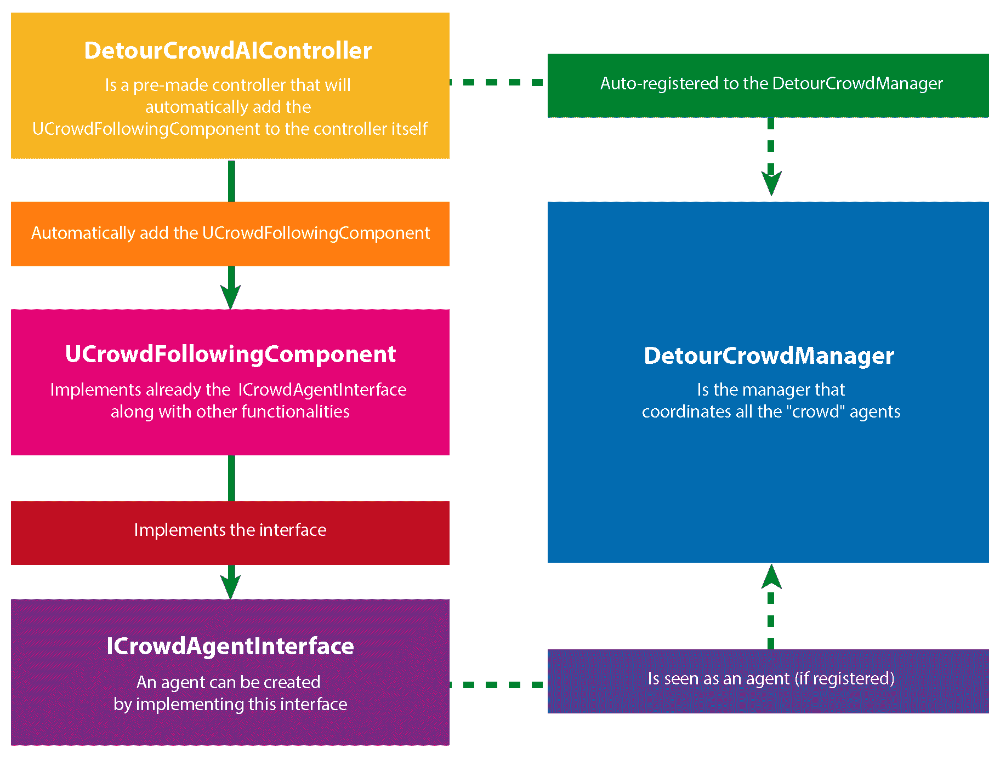

# 使用 Detour Crowd 系统

使用*Detour Crowd*系统的最简单方法是让您的 AI 控制器继承自 Detour Crowd AI Controller，如下面的截图所示：

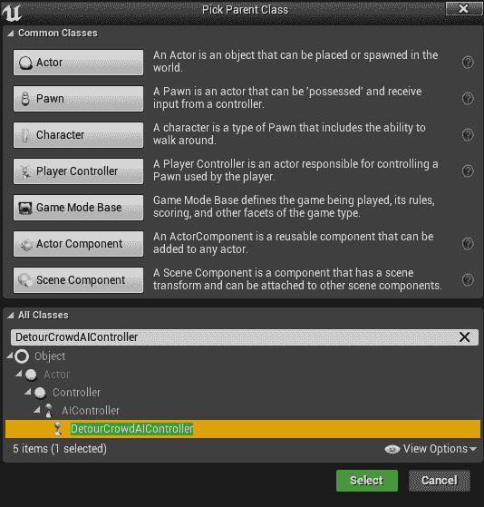

在 C++中，您需要继承自**ADetourCrowdAIController**（或向您的控制器添加**UDetourCrowdFollowingComponent**）。

一旦您为所有想要使用*Detour Crowd*的控制器完成设置，系统将基本上能够直接工作。

# Detour Crowd 设置

如果您正在使用**UCrowdFollowingComponent**，则该组件将通过在**Character Movement Component**（如果可用）中使用**避免设置**来实现**ICrowdAgentInterface**。

因此，我们在*RVO*部分看到的所有**避免设置**都将被*Detour Crowd*考虑。因此，以下截图中所突出显示的所有设置仍然适用于我们的 AI 角色：

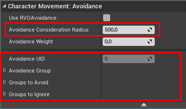

请注意，**避免权重**将不会被 Detour 系统考虑，因为它是一个*RVO*特定的参数。

因此，我们之前看到的所有蓝图函数（例如，更改组掩码）也都是有效的。

这些是针对每个角色的特定设置，但您可以调整整体的*Detour Crowd 设置*。为此，导航到**项目设置**，在**引擎**部分，您将找到一个名为**Crowd Manager**的条目，如下面的截图所示：

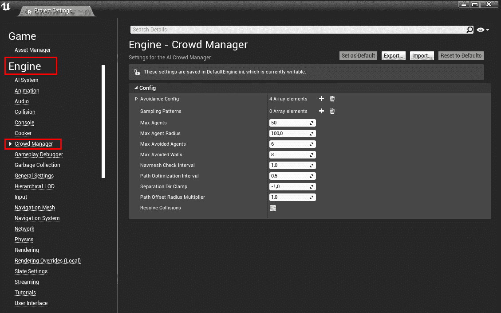

从这里，我们可以访问所有的***Detour Crowd Manager 设置***。这些设置中的大多数来自原始的*Recast Crowd 算法*，而*Unreal Detour Crowd Manager*提供了一个接口，您可以在算法中设置这些变量。让我们从简单的开始：

+   **最大代理数**: 这是 Crowd Manager 将处理的代理的最大数量。当然，数字越高，您可以一次放置的代理就越多，但这会影响性能。您应该仔细规划游戏所需的代理数量。此外，如果您查看源代码，这个数字将用于为 Crowd Manager 处理代理分配必要的内存。在内存较低的情况下，这一点值得注意。

+   **最大代理半径**: 这是从 Crowd Manager 偏离的代理可以到达的最大尺寸。

+   **最大避免代理数**: 这是 Detour 系统考虑的最大代理数量，也称为邻居。换句话说，这指定了应该考虑多少个邻居代理（最大）以进行避免行为。

+   **最大避免墙壁数**：这是 Detour 系统应考虑的最大墙壁数（通常，障碍物段）。它的工作方式与最大避免智能体类似，但询问系统周围周围障碍物的多少段需要考虑。

+   **Navmesh 检查间隔**：这是实现智能体离开 navmesh 后应该检查和重新计算其位置多少秒的设置（系统将尝试将智能体推回 navmesh）。

+   **路径优化间隔**：这是检查智能体应该多久尝试重新优化其路径的设置（以秒为单位）。

+   **分离方向限制**：当另一个智能体在后面时，此值表示向左/右的夹紧分离力（*forward*与*dirToNei*的点积；因此，-1 的值表示此分离行为被禁用）。

+   **路径偏移半径乘数**：当智能体接近角落转弯时，会对路径应用偏移。这个变量是这个偏移的乘数（这样您可以自由地增加或减少这个偏移）。

+   **解决碰撞**：尽管 Detour 系统尽了最大努力，智能体仍然可能会发生碰撞。在这种情况下，碰撞应由 Detour 系统处理（此变量的值为 true）。在这种情况下，此变量设置为 false，智能体将使用 Character Movement 组件。这个组件将负责解决碰撞。

下一个屏幕截图中显示的**避免配置**参数是 Detour 人群算法中采样如何进行的核心：

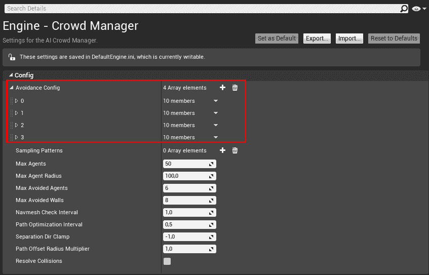

**避免配置**是一个不同采样配置的数组，参数略有不同。默认情况下，有四个，分别对应不同的采样避免质量：低、中、好和高。

质量级别是在**UCrowdFollowingComponent**中的**AvoidanceQuality**变量中设置的，该变量使用**ECrowdAvoidanceQuality**枚举。如果您有对您的**UCrowdFollowingComponent**的引用，您可以使用`SetCrowdAvoidanceQuality()`函数。

返回到设置，如果您想添加或删除配置，您需要创建自己的**UCrowdFollowingComponent**版本（或者，您可以继承它并重写函数），这将考虑不同数量的配置。

然而，改变配置的数量意味着您的游戏/应用程序正在特别使用*Detour 系统*！

在不改变配置数量的情况下，您可以更改这四个质量配置的设置。这些参数在以下屏幕截图中显示（这是第一个配置）：

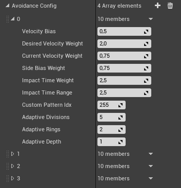

要完全理解这些设置，您应该了解算法是如何工作的，但让我们在没有这个的情况下尝试理解它。

算法中执行采样的部分首先在中心点（代理最初的位置，由于**Velocity Bias**参数的偏差，在速度方向上）周围创建一组环形（环形数量由**Adaptive Rings**参数指示）。这些环形中的每一个都通过**Adaptive Division**进行采样（分割）。然后，算法通过使用较小的一组环形，这些环形以上一迭代中最佳样本为中心，递归地细化搜索。算法重复此过程**Adaptive Depth**次。在每次迭代中，通过考虑以下因素并选择最佳样本，不同的参数确定权重（相对于其他因素的重要性）：

+   代理的方向是否与当前速度匹配？其权重为**DesiredVelocityWeight**。

+   代理是否向侧面移动？其权重为**SideBiasWeight**。

+   代理是否与任何已知障碍物发生碰撞？其权重为**ImpactTimeWeight**（如果代理在**ImpactTimeRange**秒内使用该速度发生碰撞，它将扫描一个范围，考虑代理的当前速度）。

以下图表应有助于你理解不同的参数：

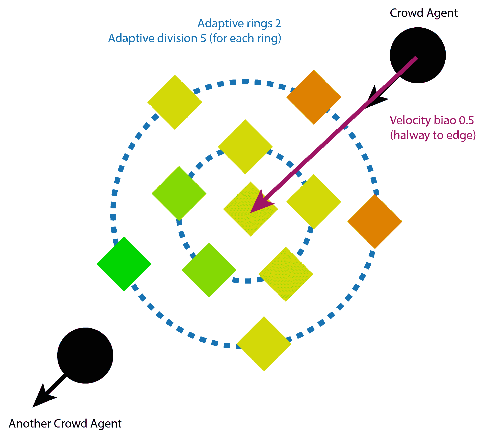

# 调试 Detour Crowd Manager

Crowd Manager 与可视化记录器集成了，这意味着，通过一些工作，我们可以可视化地调试 Detour Crowd Manager。我们将在第十三章 Chapter 13，*游戏调试器*中更详细地探讨这一点，我们将了解更多关于可视化记录器的信息。

# 更多人群资源

如果你想扩展你对 Detour Crowd Algorithm 的了解或探索其他替代方案，以下是一些资源：

+   Mikko Mononen 的原始 Recast Library：[`github.com/recastnavigation/recastnavigation`](https://github.com/recastnavigation/recastnavigation)

+   一系列处理人群的有趣研究算法：[`gamma.cs.unc.edu/research/crowds`](http://gamma.cs.unc.edu/research/crowds)

当然，你也可以继续自己探索！

# 摘要

在本章中，我们看到了 Unreal Engine 如何处理人群。特别是，我们看到了两个内置系统。第一个被称为**互易速度障碍（RVO）**，它非常快，但不是很精确。第二个是**Detour Crowd**，它稍微昂贵一些，但更精确和逼真。

在下一章中，我们将继续学习如何从头开始实现自己的*行为树*。
