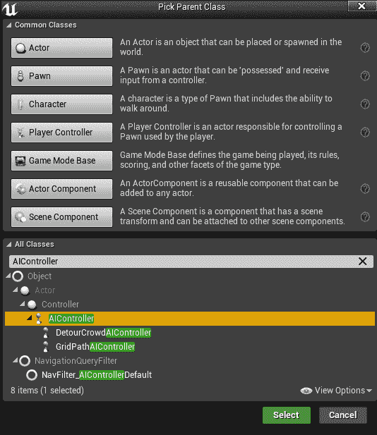

# 第八章：设计行为树 - 第一部分

本章（以及接下来的两章）将带您了解我们迄今为止所学到的更实际的方法。特别是，我们将关注如何实现一个 *行为树*，以便我们可以在游戏中追逐我们的角色。

事实上，我们将使用 第二章，*行为树和黑板* 的所有内容，以及一个 *黑板* 来执行这些动作，一个 *NavMesh* 来在环境中移动，以及一个 **感知系统** 来感知玩家。

在本章中，我们将涵盖以下主题：

+   从 **预期行为**开始设计 **行为树**

+   分析我们可能在 **行为树** 中需要的节点

+   实现 **自定义装饰器**（在蓝图和 C++ 中）以检查布尔变量

+   实现 **自定义任务**（在蓝图和 C++ 中）以找到角色周围的随机位置

+   使用 **导航系统**查询 **NavMesh** 以找到随机位置

+   实现 **自定义 AI 控制器**（在蓝图和 C++ 中）以使用 **感知系统**

+   使用 **感知系统**来感知玩家

在接下来的两章中，我们将涵盖更多内容。

我们将在蓝图和 C++ 中实现所有内容，以便您对可以使用的内容有一个更广泛的概念。或者，如果您已经知道您想使用什么，您可以直接遵循两种实现中的任何一种。

如果您想跟上来，我会创建这个示例，从启动一个干净的项目开始（在我的情况下，我在 C++ 中这样做，但如果您只想跟随本章的蓝图部分，您可以使用蓝图模板），如下面的截图所示：


Unreal 项目浏览器

该项目被称为 `BehaviorTreeDesign`，我正在使用 `Third Person` 模板。

说了这么多，让我们深入探讨吧！

# 预期行为

**设计行为树**的第一步是确定我们希望在角色中看到的 **预期行为**。这似乎是一个简单的阶段，但尝试考虑所有情况并不简单。然而，这将避免以后出现许多头痛问题。

在写下 **预期行为** 时，尽量具体。如果有什么不清楚的地方，尝试重新措辞。您使用的句子应该简短，并且总是添加信息。如果您有以 "在这种情况下…" 或 "如果…" 开头的句子，不要害怕，因为这仅仅意味着您正在考虑所有不同的可能性。一旦您写完，大声读出来，也许给朋友听，并问他/她是否清楚地理解其含义。

这是我尝试描述本章将要实现的行为：“**智能体检查它是否能看到玩家。如果是真的，那么它将追逐玩家**，直到他/她不再在视野中。如果玩家不在视野中，那么智能体将前往它最后一次看到玩家的位置（如果位置已知）。否则，智能体将在其周围选择一个随机位置并前往该位置。”

# 构建节点

在你编写了**预期行为**之后，下一步是分析它，以便你理解我们需要哪种类型的行为树节点。当然，我们总是可以在稍后阶段添加它们，但最好尽可能多地预测，以便你在创建**行为树**的过程中能够顺利地进行。让我们分解预期行为，以便我们尝试理解需要实现哪些节点。

# 已存在的节点

我们需要检查我们的行为中哪些部分已经存在于我们的项目中，以及它是否是内置功能，或者我们是否已经为该功能创建了节点（可能是为另一个 *AI 行为树*）。

“智能体检查它是否能看到玩家。如果是真的，**那么它将追逐玩家**，直到他/她不再在视野中。如果玩家不在视野中，**那么智能体将前往**它最后一次看到玩家的位置（如果位置已知）。否则，智能体将在其周围选择一个随机位置**并前往该位置**。”

特别值得一提的是，我们已经有了一个内置的 *行为树任务*，允许智能体追逐一个对象或到达一个位置。因此，**预期行为**中所有加粗的部分都已涵盖。

# 装饰器 - 检查变量

“**智能体检查它是否能看到玩家。** 如果是真的，那么它将追逐玩家，直到他/她不再在视野中。如果玩家不在视野中，那么智能体将前往它最后一次看到玩家的位置（如果位置已知）。否则，智能体将在其周围选择一个随机位置并前往该位置。”

要执行此检查，我们需要决定智能体将如何“感知”玩家。在第五章中，我们看到了内置感知系统的工作原理，对于这样一个简单的任务，系统已经非常完美。因此，值得使用它。然而，我们需要将此信息转移到**行为树**中。因此，我们需要开始假设我们将如何实现整个 AI 行为。目前，让我们假设有关玩家是否在视野中的信息存储在一个布尔**黑板**变量中。因此，我们需要实现一个装饰器，使其能够检查这个布尔变量。

你还可以使用***黑板***装饰器（用于显示“基于黑板的条件”）来检查变量是否已分配，并使用它来确定玩家是否在视野中。然而，由于本章的主要目标是学习从实际角度从头开始构建*行为树*，因此创建一个额外的装饰器节点对你来说更有用，这样你就可以更熟悉创建装饰器的过程。

此外，在设计节点时，我们需要尽可能保持通用性，这样如果我们在另一个*行为树*中有类似的需求，我们可以重用我们创建的节点。因此，我们可以通过使用*装饰器*节点来检查布尔变量，我们将使用它来检查黑板中的变量是否告诉我们玩家是否在视野中。

一旦我们建立了这个，我们需要考虑我们将如何实现这个节点。在这个特定的情况下，它相当直接，但为了尽可能保持通用性，让我们考虑这个节点可能的其他用途。

例如，如果我们想检查变量是否为假呢？实际上，我们将需要这个功能（你将在本章后面理解为什么需要它）。幸运的是，虚幻引擎已经为我们提供了这个功能。事实上，在装饰器的详细面板中有一个方便的复选框，名为“逆条件”，正如其名所示，它反转条件的输出，使我们能够检查相反的情况：


作为练习，忽略这个复选框，尝试实现你自己的条件反转版本。尽管它没有实际应用，并且*这样做实际上是不好的做法*，但它仍然是一个有用的练习，这样你可以理解如何向装饰器提供输入。在这个练习中，这个节点有两个输入：要检查的黑板键值（假设为布尔类型）和另一个布尔变量，用于确定检查的是变量的“真”值还是“假”值。

不再赘述，让我们继续进行这个节点的实际实现。像往常一样，我将在蓝图和 C++中同时进行。

# 检查变量蓝图实现

首先，让我们创建一个新的*装饰器*（回想一下，你可以从行为树编辑器或内容浏览器中创建它；前者更容易，但你需要有一个行为树打开。无论如何，将其命名为`BTDecorator_CheckBooleanVariableBP`（结尾的“BP”仅用于区分它与 C++版本的差异，因为你可能两者都会做。在实际项目中，你通常只有一个版本）。

如果你在没有向装饰器添加任何内容的情况下关闭编辑器（例如，为了重命名它），当你打开它时，你可能会看到如下屏幕：


在这种情况下，只需点击“打开完整蓝图编辑器”进入蓝图编辑器。

正如我们之前所述，我们只需要一个类型为 *Blackboard Key Selector* 的单个变量作为输入，我们将它命名为 `BoolVariableToCheckKey`。它持有我们想要检查的黑板布尔变量的引用。此外，它需要是公共的（打开变量名称旁边的眼睛），这样它就可以在行为树编辑器中看到。它应该看起来是这样的：


接下来，我们需要实现/重写 Perform Condition Check AI 函数，该函数可以在重写下拉菜单中找到，如下面的截图所示：


一旦创建了这个函数，默认情况下它看起来是这样的：


首先，我们需要检索我们的黑板键的布尔值，这可以通过使用“获取黑板值作为布尔值”节点来完成。然后，我们可以将此节点的“返回值”引脚连接到“返回节点”的“返回值”引脚。最终图形应该看起来是这样的：


保存蓝图，装饰器将准备就绪。如果您愿意，可以将它放置在行为树中的某个位置，以查看输入是否显示正确。特别是，当放置在行为树中时，它看起来是这样的：


最后，*装饰器*（在行为树编辑器中）的 *详细信息面板* 应该看起来如下：


# 检查变量 C++ 实现

关于如何扩展装饰器的详细信息，您可以查看第六章，*扩展行为树*。

首先，让我们创建一个新的 C++ 类，该类继承自 **UBTDecorator**。您需要搜索所有类并选择 BTDecorator，如下面的截图所示：


然后，您可以重命名您的类 `BTDecorator_CheckBoolVariable`。如果您愿意，您还可以将文件放置在子文件夹中，例如 `AI`。以下是一个示例截图：


点击创建类，您的 *Decorator* 类将被创建。

在您创建类之后，Unreal 将尝试编译您的代码。如果您没有正确设置项目中的公共依赖项（正如我们在第一章和第二章中学到的；特别是在第六章，*扩展行为树*），您应该收到如下类似的消息：


然而，当您尝试从 Visual Studio 编译时，错误将如下所示：


因此，您需要更改您的 `.cs` 文件（在我们的案例中，***BehaviorTreeDesign.cs***），并将“**GameplayTasks**”和“**AIModule**”作为公共依赖项添加，如下面的代码所示：

`PublicDependencyModuleNames.AddRange(new string[] { "Core", "CoreUObject", "Engine", "InputCore", "HeadMountedDisplay", **"GameplayTasks", "AIModule"** });`

现在，你应该能够无任何问题地编译。

在头文件中，我们需要添加一个输入变量，一个引用布尔值的*黑板键选择器*，命名为`BoolVariableToCheck`。我们还需要通过使用`UPROPERTY()`宏将这个变量暴露给行为树编辑器，如下面的代码所示：

```py
protected:
  UPROPERTY(EditAnywhere, Category = Blackboard)
  FBlackboardKeySelector BoolVariableToCheck;
```

然后，我们需要重写`CalculateRawConditionValue()`方法，这个方法是公开的，因此它的重写也需要是公开的。在头文件中插入以下代码行：

```py
public:
  virtual bool CalculateRawConditionValue(UBehaviorTreeComponent& OwnerComp, uint8* NodeMemory) const override;
```

接下来，我们需要实现这个函数。

首先，我们需要检索`BlackboardComponent`，这允许我们从黑板键选择器中解析和获取值。幸运的是，我们可以从`BeheviorTreeComponent`（装饰器正在其上运行）中检索它，它作为名为`OwnerComp`的变量传递给节点。然而，要使用`BlackboardComponent`，我们需要在我们的`.cpp`文件中包含其定义，如下所示：

```py
#include "BehaviorTree/BlackboardComponent.h"
```

如果由于某种原因，这个`BlackboardComponen*`t`*`无效（这可能会发生在你在项目中创建行为树但你没有黑板的情况下；否则这很难做到，因为行为树编辑器会自动选择一个黑板），我们只需`return false`：

```py
  //Get BlackboardComponent
  const UBlackboardComponent* BlackboardComp = OwnerComp.GetBlackboardComponent();
  if (BlackboardComp == NULL)
  {
    return false;
  }
```

然后，我们需要检索并返回从我们的*黑板键选择器*变量中作为布尔值的值。这是我们可以这样做的方式：

```py
  //Perform Boolean Variable Check
  return BlackboardComp->GetValueAsBool(BoolVariableToCheck.SelectedKeyName);
```

整个函数应该看起来像这样：

```py
#include "BTDecorator_CheckBoolVariable.h"
#include "BehaviorTree/BlackboardComponent.h"

bool UBTDecorator_CheckBoolVariable::CalculateRawConditionValue(UBehaviorTreeComponent & OwnerComp, uint8 * NodeMemory) const
{
  //Get BlackboardComponent
  const UBlackboardComponent* BlackboardComp = OwnerComp.GetBlackboardComponent();
  if (BlackboardComp == NULL)
  {
    return false;
  }

  //Perform Boolean Variable Check
  return BlackboardComp->GetValueAsBool(BoolVariableToCheck.SelectedKeyName);
}
```

保存你的代码，*装饰器*就会准备好了。如果你愿意，你可以将它放在行为树中的某个地方，看看输入是否显示正确。这是它在树上的样子：


在*装饰器*的*详细信息面板*（在*行为树编辑器*内）应该看起来如下：


如你所注意到的，我们的装饰器的描述不会根据我们放入其中的变量而改变，也没有图标。如果你在一个大型项目中工作，注意这些细节可能会对你和你的团队有很大帮助。在这个小例子中，我将把它作为一个练习。你可以查阅第五章，*代理意识*，以获取更多关于如何做的信息。你也可以查阅源代码，特别是`BTDecorator_TimeLimit`，它实现了`GetStaticDescription()`、`DescribeRuntimeValues()`和`GetNodeIconName()`等函数。在本节中，我们将实现`**GetStaticDescription()**`函数，这样你就可以习惯于实现这类函数了。

如果你还没有阅读前面的提示框，请先阅读。现在，我们将实现我们的装饰器的`GetStaticDescription()`函数，以便我们可以看到为`BoolVariableToCheck`变量选择了哪个黑板键。

首先，我们需要在头文件中添加以下覆盖代码：

```py
 virtual FString GetStaticDescription() const override;
```

然后，我们可以通过返回一个使用`Printf()`函数格式化的`FString`来实现它。通过使用`***?***`语句，我们可以确定键是否已设置，并显示正确的字符串值：

```py
FString UBTDecorator_CheckBoolVariable::GetStaticDescription() const
{
  return FString::Printf(TEXT("%s: '%s'"), TEXT("Bool Variable to Check"), BoolVariableToCheck.IsSet() ? *BoolVariableToCheck.SelectedKeyName.ToString() : TEXT(""));
}
```

如果你编译并将装饰器添加到*行为树*中，它现在应该看起来像这样：


现在好多了！现在是时候实现一个*行为树任务*了。

# 任务 - 寻找随机位置

"*代理检查它是否可以看到玩家。如果是，那么它会追逐玩家，直到他/她不再在视线中。如果玩家不在视线中，那么代理将前往它最后一次看到玩家的位置（如果位置已知）。否则，**代理将在其周围选择一个随机位置**并前往该位置。"*

在我们的行为过程中，代理选择它周围的一个随机位置。这意味着我们需要创建一个任务，从代理的当前位置开始，选择一个它将前往的随机位置。此外，我们应该添加这个位置需要是代理可到达的。幸运的是，我们有一些预先制作的功能来查询*导航网格*并为我们选择一个*随机位置*。

这也意味着我们需要假设我们有一个*导航网格*可供我们的代理使用。既然是这样，我们可以使用这个节点。然而，我们仍然需要创建一个可以在行为树中执行的任务，并且能够将这个值适当地存储在*黑板*中。

以一个通用节点的方式思考，我们希望添加一些额外的选项，以便我们可以自定义行为。例如，我们希望这个随机位置有多远？

我们有两个输入变量。第一个是一个黑板键选择器，它保存我们想要前往的随机位置（因为我们需要将其保存在黑板中）。第二个将是一个表示这个随机位置可以取到的最大半径的 float。

我们将再次在蓝图和 C++中执行此过程（这样你可以选择你最舒服的实现方式）。

# 寻找随机位置蓝图实现

创建一个*蓝图行为树任务*（阅读前面的章节了解如何做这个），并将其命名为`BTT_FindRandomLocation`。

创建我们需要的两个变量，一个是名为“**RandomDestination**”的黑板键选择器类型，另一个是名为“**Radius**”的*float*类型。对于 float，设置一个*不同于零的默认值*，例如，**3,000**。最后，使它们两个都*公开*：


让我们实现/覆盖以下截图所示的 Receive Execute AI 事件：


从事件中，我们可以检索到***控制器傀儡***（代理）的位置，如图下截图所示：


然后，我们可以使用 GetRandomReachablePointInRadius 节点在*导航网格*内生成一个随机的可到达位置。我们需要使用*位置*作为受控傀儡（代理）的*原点*，并将***半径***作为我们的***半径**变量：


查找随机位置蓝图

从 GetRandomReachablePointInRadius 节点的返回值中，我们创建一个分支节点。然而，生成随机位置的调用可能会失败。如果失败了，我们需要以*失败（不是成功）*结束任务。从**分支真**引脚，我们可以将**随机位置**设置到我们的**目标键**变量中，如图下截图所示：


查找随机位置蓝图

然后，无论从**分支**（从**设置黑板值为向量**节点的末尾和**分支**的**False**引脚），我们都需要**完成执行**任务。为此，我们可以将***GetRandomReachablePointInRadius***节点的返回值插入到**完成执行**的**成功**引脚中：


这就完成了我们的任务，我们现在可以保存它。

如果我们将此节点放置在*行为树*中，它将看起来像这样：


*详细信息面板*将如下所示：


如果你想，你可以阅读下一节来学习如何在 C++中实现这个任务，否则，你可以自由地跳过下一节。

# 查找随机位置 C++实现

在 C++中创建“查找随机位置”任务会比创建装饰器复杂一些，因为我们需要检索许多组件并检查它们是否有效。

首先，创建一个 C++ **行为树任务**，通过选择 BTTaskNode 作为你想要扩展的类来继承自**UBTTaskNode**，如图下截图所示：


然后，我们可以将其命名为`BTTaskNode_FindRandomLocation`并将其（就像我们对装饰器所做的那样）放置在一个文件夹中，例如`AI`：


首先，在头文件中，我们需要添加我们的两个变量。第一个是名为`DestinationVector`的*黑板键选择器*，它将持有新计算出的目标引用。第二个是一个包含***半径***参数化（在其中我们将选择一个随机可到达点）的*float*。此外，它们都需要对*行为树编辑器*可访问；因此，我们需要使用`UPROPERTY()`宏来公开它们。我们需要使用以下代码行来设置这两个变量：

```py
UPROPERTY(EditAnywhere, Category = Blackboard)
    FBlackboardKeySelector DestinationVector;

UPROPERTY(EditAnywhere, Category = Parameters)
    float Radius = 300.f;
```

和往常一样，在头文件中，我们需要重写 `ExecuteTask()` 方法，当这个任务需要执行时将会被调用：

```py
 virtual EBTNodeResult::Type ExecuteTask(UBehaviorTreeComponent& OwnerComp, uint8* NodeMemory) override;
```

整个头文件应该看起来像这样：

```py
#pragma once

#include "CoreMinimal.h"
#include "BehaviorTree/BTTaskNode.h"
#include "BTTaskNode_FindRandomLocation.generated.h"

/**
 * 
 */
UCLASS()
class BEHAVIORTREEDESIGN_API UBTTaskNode_FindRandomLocation : public UBTTaskNode
{
  GENERATED_BODY()

  UPROPERTY(EditAnywhere, Category = Blackboard)
  FBlackboardKeySelector DestinationVector;

  UPROPERTY(EditAnywhere, Category = Parameters)
  float Radius = 300.f;

  virtual EBTNodeResult::Type ExecuteTask(UBehaviorTreeComponent& OwnerComp, uint8* NodeMemory) override;
};
```

现在，当我们进入 `.cpp` 文件时，我们需要做一些准备工作，特别是在 `include` 语句中。实际上，我们将使用 **黑板组件**（就像我们在装饰器中做的那样）、**导航系统** 和 **AI 控制器** 类。因此，我们需要包含所有这些，我们可以通过以下代码来完成：

```py
#include "BTTaskNode_FindRandomLocation.h"
#include "BehaviorTree/BlackboardComponent.h"
#include "NavigationSystem.h"
#include "AIController.h"
```

因此，让我们定义 `ExecuteTask()` 函数：

```py
EBTNodeResult::Type UBTTaskNode_FindRandomLocation::ExecuteTask(UBehaviorTreeComponent & OwnerComp, uint8 * NodeMemory)
{
 *//[REST OF THE CODE]*
}
```

然后，我们需要开始填充 `ExecuteTask()` 函数。我们首先需要做的是获取 **黑板组件**。如果这个组件不可用（如 *装饰器* 部分所述，这种情况很少发生，但仍然可能），我们需要返回任务失败，如下面的代码所示：

```py
EBTNodeResult::Type UBTTaskNode_FindRandomLocation::ExecuteTask(UBehaviorTreeComponent & OwnerComp, uint8 * NodeMemory)
{

 //Get Blackboard Component
 UBlackboardComponent* BlackboardComp = OwnerComp.GetBlackboardComponent();
 if (BlackboardComp == NULL)
 {
 return EBTNodeResult::Failed;
 }

 *//[REST OF THE CODE]*

}
```

从黑板组件中，我们可以检索运行此实例的 *行为树* 的 AI 控制器的 ***受控角色***。这可以通过使用几个 GET 函数来完成。然而，一旦再次，需要检查 *角色* 的有效性，如果它无效，那么任务需要返回失败：

```py
EBTNodeResult::Type UBTTaskNode_FindRandomLocation::ExecuteTask(UBehaviorTreeComponent & OwnerComp, uint8 * NodeMemory)
{

 *//[PREVIOUS CODE]*

 //Get Controlled Pawn
 APawn* ControlledPawn = OwnerComp.GetAIOwner()->GetPawn();
 if (!ControlledPawn) {
 return EBTNodeResult::Failed;
 }

 *//[REST OF THE CODE]*

}
```

接下来，我们需要获取我们的导航系统。根据 Unreal 4.21，我们将使用 `UNavigationSystemV1` 类来完成这一任务。

从 Unreal 4.20 开始，导航系统已经被重构。因此，许多函数和类已经过时。如果你的引擎版本低于 4.20，这段代码将无法工作。在这种情况下，你需要使用 `UNavigationSystem` 类。由于这可能只对少数有特定需求的读者感兴趣，所以这本书没有涵盖这一点。

要获取 **当前导航系统**，我们需要通过使用名为 `GetCurrent()` 的特定函数（指导航系统）来指定我们想要从中检索这些数据的 **世界**。一旦我们获得了导航系统，我们想要检查其有效性，如果它无效，那么我们让任务失败：

```py
EBTNodeResult::Type UBTTaskNode_FindRandomLocation::ExecuteTask(UBehaviorTreeComponent & OwnerComp, uint8 * NodeMemory)
{

 *//[PREVIOUS CODE]*

 //Get Navigation System
 UNavigationSystemV1* NavSys = UNavigationSystemV1::GetCurrent(GetWorld());
 if (!NavSys)
 {
 return EBTNodeResult::Failed;
 }

 *//[REST OF THE CODE]*

}
```

在我们能够在导航系统上执行查询之前，还有一步要走。我们需要创建一个名为 `Result` 的 `FNavLocation` 类型的变量，这是一个结构体，我们的 **导航系统** 将在其中填充查询的结果。在我们的案例中，我们只对位置感兴趣。因此，**导航系统** 能够执行查询：

```py
EBTNodeResult::Type UBTTaskNode_FindRandomLocation::ExecuteTask(UBehaviorTreeComponent & OwnerComp, uint8 * NodeMemory)
{

 *//[PREVIOUS CODE]*

 //Prepare variables for Query
 FNavLocation Result;
 FVector Origin = ControlledPawn->GetActorLocation();

 *//[REST OF THE CODE]*

}
```

可以通过使用 `GetRandomReachablePointInRadius()` 函数来执行对查询的请求。它有三个强制参数，分别是查询需要执行的 ***起点***、**半径** 和返回结果的 **结构**。实际上，它的纯返回值是一个 *布尔值*，表示查询是否成功，我们可以用它来检查任务是否失败：

```py
EBTNodeResult::Type UBTTaskNode_FindRandomLocation::ExecuteTask(UBehaviorTreeComponent & OwnerComp, uint8 * NodeMemory)
{

 *//[PREVIOUS CODE]*

 //Perform Query
 bool bSuccess = NavSys->GetRandomReachablePointInRadius(Origin, Radius, Result);
 if (!bSuccess) {
 return EBTNodeResult::Failed;
 }

 *//[REST OF THE CODE]*

}
```

如果我们能够得到一个随机点，我们需要在黑板上分配它，并返回任务已成功完成：

```py
EBTNodeResult::Type UBTTaskNode_FindRandomLocation::ExecuteTask(UBehaviorTreeComponent & OwnerComp, uint8 * NodeMemory)
{

 *//[PREVIOUS CODE]*

 //Save Result and return success
 BlackboardComp->SetValueAsVector(DestinationVector.SelectedKeyName, Result.Location);
 return EBTNodeResult::Succeeded;
}
```

如果你现在尝试编译，你会得到一个错误。原因是我们在使用 **Navigation System**，但它没有被包含在我们的模块的公共依赖中。此外，如果你没有包含 `AIModule` 和 `GameplayTasks`，现在是添加它们的好时机，这样你就可以在没有错误的情况下编译代码。

打开 `BehaviourTreeDesign.Build.cs` 文件，并将 `NavigationSystem` 模块添加到公共依赖中，如下面的代码所示：

```py
 PublicDependencyModuleNames.AddRange(new string[] { "Core", "CoreUObject", "Engine", "InputCore", "HeadMountedDisplay", "GameplayTasks", "AIModule", "NavigationSystem" });
```

现在，我们可以无任何问题地编译。

如果我们将此 *Task* 节点添加到我们的 *Behavior Tree* 中，它将看起来是这样的：


*Details Panel* 看起来如下：


正如我们之前讨论 Decorator 时所说的，实现描述节点的函数始终是一个好习惯，这样我们就可以更容易地使用它。我明白我们可能还没有准备好图标，但至少我们可以更改描述以显示我们分配了哪些变量。

要做到这一点，我们需要实现/覆盖 `GetStaticDescription()` 函数。在头文件中声明它，添加以下行：

```py
 virtual FString GetStaticDescription() const override;
```

然后，在 `.cpp` 文件中，我们需要返回一个格式化后的 `FString`，以显示任务的变量。特别是，我们想显示 `DestinationKey` 和 ***Radius*** 的大小。我们可以使用 `Printf()` 函数轻松地格式化字符串，如下面的代码所示：

```py
FString UBTTaskNode_FindRandomLocation::GetStaticDescription() const
{

  return FString::Printf(TEXT("%s: '%s'"), TEXT("DestinationKey"), DestinationVector.IsSet() ? *DestinationVector.SelectedKeyName.ToString() : TEXT(""))
      .Append(FString::Printf(TEXT("\n%s: '%s'"), TEXT("Radius"), *FString::SanitizeFloat(Radius)));
}
```

如果我们编译并再次将此 *Task* 添加到 *Behavior Tree* 中，它现在的样子应该是这样的：


这就完成了我们在 C++ 中的 Task 实现。

# AI 控制器

从 *Expected Behavior* 中，我们得出结论，我们需要一个 *Perception System* 来检查代理是否能够看到 *Player*。

再次强调，我们可以在蓝图或 C++ 中创建我们的 AI 控制器。

# 在蓝图实现 AI 控制器

首先，创建一个新的 AI 控制器，并将其命名为 `BP_ChasingAIController`，通过选择 `AIController` *Class*：



在编辑器中，我们需要添加两个变量（这样我们下一章构建的服务就能检索到它们内部的值）。第一个变量是 `LastKnownPlayerPosition`，类型为 *Vector*，第二个变量是 `CanSeePlayer`，类型为 *boolean*，如下面的截图所示：


现在，我们需要添加感知组件。因此，从组件选项卡中，添加 AIPerception 系统，如下面的截图所示：


然后，在 Details 面板中，我们需要选择它的选项。特别是，我们需要设置 ***Sense of Sight***：


然后，在**视觉配置**设置中，检查所有的检测标志（正如我们在第五章中解释的，*代理意识*，我们需要检测玩家，默认情况下是中立的）。最后，设置应该看起来像这样：


在详情面板中，我们需要通过点击旁边的+符号来生成`On Target Perception Updated`事件：


现在，我们将事件中的**Actor**引脚从我们的玩家（例如，`FirstPersonCharacter`或`ThirdPersonCharacter`，取决于你选择的模板，或者如果你在项目中使用它，是你的*Player 类*），以检查感知的对象实际上是否是玩家：


然后，我们断开**刺激**引脚以获取**刺激位置**，我们将其存储在**LastKnownPlayerPosition**变量中，以及**Successfully Sensed**，我们将其存储在**CanSeePlayer**变量中。当然，这些 Set 函数需要在转换之后放置。这是最终的代码：


现在，***AI 控制器***已经准备好使用。

# 在 C++中实现 AI 控制器

首先，创建一个新的类，它继承自`AIController`：


然后，将其命名为`ChasingAIController`并将其放置在我们的`AI`文件夹中，如下面的截图所示：


正如我们在关于*感知*的章节中解释的，我们首先需要包含与感知相关的类，以便能够使用它们。在头文件中添加以下`#include`语句：

```py
#include "Perception/AIPerceptionComponent.h"
#include "Perception/AISense_Sight.h"
#include "Perception/AISenseConfig_Sight.h"
```

接下来，我们需要添加我们的***类构造函数***的声明，因为我们将会使用一个来设置我们的控制器。在`GENERATE_BODY()`宏下面，添加以下代码：

```py
  GENERATED_BODY()

 AChasingAIController();
```

我们需要跟踪我们将要添加到控制器中的`PerceptionComponent`。然而，AI 控制器基类已经有一个感知组件的引用，所以我们不需要声明它。你将在基类中找到这个非常相似的签名：

```py
  UPROPERTY(VisibleDefaultsOnly, Category = AI)
  UAIPerceptionComponent* PerceptionComponent;
```

然而，我们需要有一个对我们将要创建的*视觉配置*的引用，因此我们需要这个变量：

```py
UAISenseConfig_Sight* SightConfig;
```

由于在下一章中我们将创建一个服务来收集从这个控制器中的一些变量，我们需要创建两个公共变量。第一个变量是`LastKnownPlayerPosition`，类型为 Vector，第二个是`CanSeePlayer`，类型为布尔型。你可以在头文件中添加以下代码片段：

```py
public:
  FVector LastKnownPlayerPosition;
  bool bCanSeePlayer;
```

最后，在我们的头文件中，我们需要为我们的感知系统添加一个代表，该代表将更新我们的变量。我们可以将此代表命名为`OnTargetPerceptionUpdated()`并使其受保护。它以`AActor*`和`FAIStimuli`作为输入，如下面的代码所示：

```py
protected:
  UFUNCTION()
  void OnTargetPerceptionUpdate(AActor* Actor, FAIStimulus Stimulus);
```

现在，我们需要在类的**构造函数**中创建**感知组件**。添加以下代码：

```py
AChasingAIController::AChasingAIController() {

 //Creating the AI Perception Component
 PerceptionComponent = CreateDefaultSubobject<UAIPerceptionComponent>(TEXT("SightPerceptionComponent"));

  //*[REST OF THE CODE]*

}
```

然后，我们需要创建**视觉感知**，并将其配置为将所有`DetectionByAffiliation`设置为 true，如下面的代码所示：

```py
AChasingAIController::AChasingAIController() {

 *//[PREVIOUS CODE]*

 //Create the Sight Sense and Configure it
 SightConfig = CreateDefaultSubobject<UAISenseConfig_Sight>(FName("Sight Config"));
 SightConfig->DetectionByAffiliation.bDetectEnemies = true;
 SightConfig->DetectionByAffiliation.bDetectNeutrals = true;
 SightConfig->DetectionByAffiliation.bDetectFriendlies = true;

  //*[REST OF THE CODE]*

}
```

现在我们有了`PerceptionComponent`和`SightConfig`，我们需要将后者分配给前者：

```py
AChasingAIController::AChasingAIController() {

 *//[PREVIOUS CODE]*

 //Assigning the Sight Sense to the AI Perception Component
 PerceptionComponent->ConfigureSense(*SightConfig);
 PerceptionComponent->SetDominantSense(SightConfig->GetSenseImplementation());

  //*[REST OF THE CODE]*

}
```

最后一步是将我们的委托函数**绑定**到**感知系统**，如下面的代码所示：

```py
AChasingAIController::AChasingAIController() {

 *//[PREVIOUS CODE]*

 //Binding the OnTargetPerceptionUpdate function
 PerceptionComponent->OnTargetPerceptionUpdated.AddDynamic(this, &AChasingAIController::OnTargetPerceptionUpdate);

}
```

现在，我们需要实现我们的`OnTargetPerceptionUpdate()`委托。首先，我们需要包含我们的玩家类的头文件。在这个示例中，我们有一个名为`BehaviorTreeDesignCharacter`的 C++类（蓝图`ThirdPersonCharacter`从这个类继承）。在我的情况下，我添加了以下`#include`语句（你可以包含你的玩家类中的一个）：

```py
#include "BehaviorTreeDesignCharacter.h"
```

特别是，我们需要检查传递给我们的 Actor（作为输入）是否真的是**玩家**类，我们可以通过强制类型转换（到我们包含的玩家类）来完成：

```py
void AChasingAIController::OnTargetPerceptionUpdate(AActor * Actor, FAIStimulus Stimulus)
{
 if(Cast<ABehaviorTreeDesignCharacter>(Actor)){

 }
}
```

如果是这样，我们可以使用**刺激**输入来检索`StimulusLocation`，如果它`WasSuccessfullySensed`，并将其分配给我们的`LastKnownPlayerPosition`和`CanSeePlayer`变量，如下面的代码所示：

```py
void AChasingAIController::OnTargetPerceptionUpdate(AActor * Actor, FAIStimulus Stimulus)
{
  if(Cast<ABehaviorTreeDesignCharacter>(Actor)){
 LastKnownPlayerPosition = Stimulus.StimulusLocation;
 bCanSeePlayer = Stimulus.WasSuccessfullySensed();
  }
}
```

AI 控制器现在已准备好使用！

# 使用 AI 控制器

无论你使用的是蓝图还是 C++实现，你都需要将控制器分配给你的追逐代理。无论你是直接在蓝图中进行，还是在游戏的实例版本中，在 Pawn 设置下，你都需要更改 AI 控制器，使其为我们刚刚创建的那个。我们还需要确保 AI 能够自动控制这个 Pawn。

因此，你应该会有类似以下的内容：


现在，我们几乎已经拥有了构建追逐代理所需的所有组件。

# 摘要

在这一章中，我们开始深入了解如何创建**行为树**的示例，并使用了迄今为止遇到的所有系统。

尤其是我们可以看到如何写下**预期行为**，并从这里开始收集构建我们的 AI 所需的所有不同组件。我们看到了如何在 C++和蓝图中都这样做。我们创建的组件包括一个**自定义装饰器**，用于检查**行为树**中的**布尔**变量，一个**自定义任务**，通过使用**导航系统**来找到一个随机位置，以及一个**自定义 AI 控制器**，这样我们就可以使用**感知系统**来感知**玩家**。

在下一章中，我们将继续这个示例，并构建我们需要的最后一个组件，以便我们可以更新追逐行为的变量。在下一章的结尾，你将准备好构建行为树。所以，让我们继续前进！
