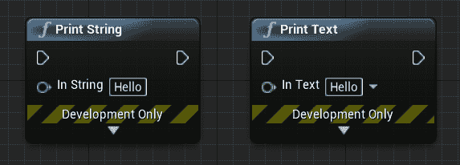
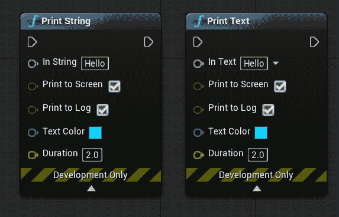
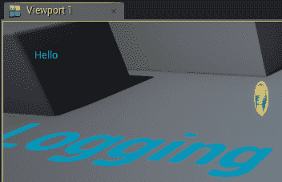
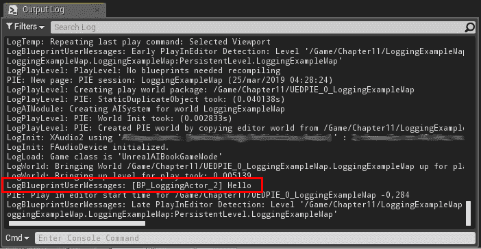
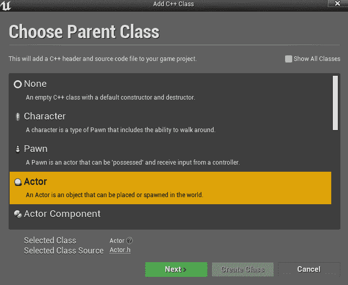
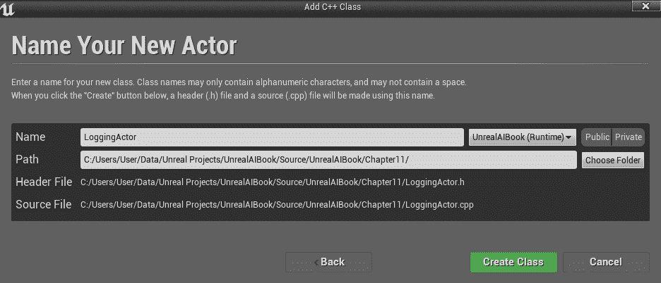
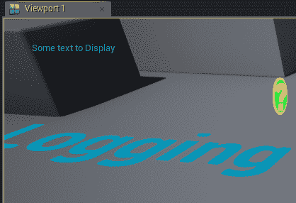
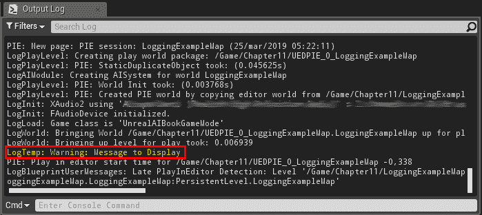
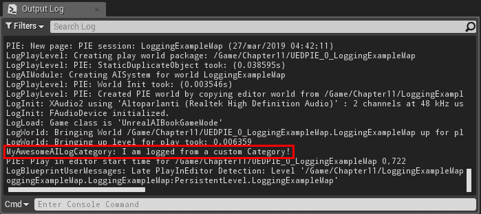

# 第十一章：AI 调试方法 - 日志记录

在本章中，我们将探讨一系列我们可以用来调试我们的 AI 系统的方法。当然，它们可以通用，而不仅仅是用于 AI。然而，由于 AI 有时可能很棘手，掌握如何在 Unreal 中进行适当的日志记录可以在你需要找到和修复与 AI 相关的错误时节省时间。实际上，由于某些变量设置不当，可能值错误，我们最终没有执行代码的一部分，或者做出了错误计算。

在本章中，我们将涵盖以下主题：

+   蓝图中的控制台日志和屏幕消息

+   C++中的屏幕消息

+   C++中的控制台日志记录

+   创建自定义日志类别（C++）

通过掌握日志记录的艺术，你将能够轻松地跟踪你的值和正在执行的代码部分。此外，创建自定义日志类别允许你定义不同的日志级别，并根据你正在调试的内容（甚至是在运行时）更改你想要看到的日志数量。此外，通过更改一个变量，可以轻松地在编译时移除所有调试代码，从而使你的发布游戏尽可能流畅地运行。

话虽如此，让我们开始吧！

# 基本日志记录

在前面的章节中，我们已经了解了如何创建日志。例如，在第五章“代理意识”中，我们看到了如何同时在控制台和屏幕上打印所需的信息。然而，在本节中，我们将更详细地探讨这些概念，并学习如何在 Unreal 中掌握日志记录。

+   **屏幕消息**：在调试阶段，你和你团队需要了解某些变量值，以便在玩游戏时进行持续测试。因此，最简单的方法是在屏幕上打印变量的值。我们可以在蓝图和 C++中以不同的方式实现这一点。

+   **控制台消息**：这些消息会打印在控制台（实际上，不止一个）和日志文件中（这样即使游戏没有运行，你也可以分析日志文件来了解发生了什么（或出了什么问题））。

虽然在蓝图中有独特的函数可以同时在屏幕上打印和打印到控制台，但在 C++中，我们有单独的函数。实际上，Unreal 的日志系统非常强大，C++可以解锁其全部功能。

# 蓝图中的控制台日志和屏幕消息

当谈到蓝图时，我们有简单易用的调试节点可以使用。最常见的一个是打印字符串，但它的对应物，打印文本，也存在。以下是一个显示打印字符串和打印文本的截图：



它们都标记为***仅限开发使用***，这意味着它们将不会在发布构建中工作。

它们的简单用法很简单。你只需要将一个*字符串*（或*文本*）连接到同名的变量。

然而，如果我们展开它们并查看它们的更高级选项，我们可以找到一个完整的参数列表，如下面的截图所示：



让我们详细看看它们：

+   **字符串/文本**：这是将在屏幕上显示的字符串或文本。因此，需要显示的任何信息都必须在这个字符串或文本中。

+   **打印到屏幕**：如果为真，节点实际上将在屏幕上打印消息（默认为真）。

+   **打印到控制台**：如果为真，节点将在控制台打印消息（默认为真）。

+   **文本颜色**：这是字符串/文本将显示的颜色（默认为浅蓝色）。当你需要从视觉上区分不同的信息时，这很有用。在这种情况下，颜色非常有帮助。

+   **持续时间**：这是消息将在屏幕上显示的时间。确保你有足够的时间阅读/吸收信息。当然，较长的消息需要更长的持续时间来阅读。

这就是它们在游戏中的显示方式：



如果“***打印到控制台***”设置为真，相同的日志也会出现在控制台，如下所示：



# C++中的屏幕消息

在 C++中，我们有一个方便的函数可以打印屏幕上的消息。我们在`UEngine`类中这样做。获取它的最简单方法是通过使用 GEngine 变量，这是一个在所有地方都可用且包含*UEngine*类实例的全局变量。请记住，这个变量可能为空（例如，游戏正在运行在发布构建上）。因此，在使用它之前检查变量是一个非常好的做法，如下面的代码片段所示：

```py
 if (GEngine) {
     //Do stuff with GEngine
 }
```

在`if`语句中，我们可以使用**GEngine**变量来调用`AddOnScreenDebugMessage()`函数。正如你所猜测的，它会在屏幕上打印一条消息。这是它的完整声明：

```py
void AddOnScreenDebugMessage(uint64 Key,float TimeToDisplay,FColor DisplayColor,const FString& DebugMessage, bool bNewerOnTop = true, const FVector2D& TextScale = FVector2D::UnitVector);
```

让我们逐一介绍不同的参数：

+   **键**：这是一个唯一键，它被赋予屏幕上的“槽位”。当需要写入新消息，但已经有一个具有相同键的消息显示时，新消息将替换旧消息。这在你有经常更新的变量且不想在屏幕上显示大量调试消息时特别有用，尤其是当只有最后一个是相关的时候。记住，在打印相同信息但更新时使用相同的键。

在定义中，键参数是一个**uint64**。然而，有一个与**int32**一起工作的包装器。如果你将键定义为**int32**，不要担心，因为它们仍然可以正常工作。

+   **显示时间**：这是消息需要在屏幕上显示的持续时间，以秒为单位。确保你有足够的时间阅读/吸收信息。当然，较长的消息需要更长的持续时间来阅读。

+   **DisplayColor**: 这是调试消息将显示的颜色。当您需要从视觉上区分不同的信息时，这很有用。在这种情况下，颜色非常有帮助。

+   **DebugMessage**: 这是将在屏幕上显示的字符串。因此，需要显示的任何信息都必须打包到**FString**中。

+   **bNewerOnTop**: 这是一个布尔值，仅在键值等于**INDEX_NONE**（表示-1 的值）时使用。如果为真，每条新消息都将显示在其他消息的顶部。否则，每条新消息都将放置在其他消息的下方（就像在正常控制台一样）。这是一个可选参数，默认设置为 true。实际上，与正常控制台不同，文本不会向下滚动，因此将最新信息放置在顶部可以保证它始终可供开发者使用。

+   **TextScale**: 这是文本的缩放比例，以**FVector2D**表示。当文本需要比其他文本更大或更小时，这对于可视化很有用。这是一个可选参数，默认设置为单元向量（无缩放）。

现在我们已经介绍了这些参数，其用法相当直接。您可以使用以下代码片段快速打印一些文本：

```py
if (GEngine) {
    GEngine->AddOnScreenDebugMessage(-1, 5.0f, FColor::Turquoise, TEXT("Some text to Display"));
}
```

如果您在打印消息之前想检查**键**是否已经存在（以避免覆盖已显示的信息），可以使用`OnScreenDebugMessageExists()`函数，该函数接受键作为参数（仅*uint64*，因为没有为*int32*提供包装器）并返回一个布尔值。如果它已经存在，则为真。以下是一个示例：

```py
if (GEngine) {
    bool bExistMessageInSlot2 = GEngine->OnScreenDebugMessageExists(2);
    // ... continue
}
```

如果您希望完全清除屏幕上的任何显示消息，可以使用`ClearOnScreenDebugMessages()`函数——没有参数，没有返回值。以下是一个示例：

```py
if (GEngine) {
    GEngine->ClearOnScreenDebugMessages();
}
```

如果您想暂时抑制任何屏幕上的消息，可以通过更改`bEnableOnScreenDebugMessages`布尔值来实现。这个变量的优点是实时更改其值允许您在飞行中暂停屏幕调试。其用法非常简单：

```py
if (GEngine) {
    //Disable On-Screen Messages
    GEngine->bEnableOnScreenDebugMessages = false;
}
```

要测试此代码，我们可以创建一个新的 C++类，类型为`Actor`，如下面的截图所示：



然后，我们可以将其重命名为**LoggingActor**，并将其放置在名为**Chapter11**的文件夹中：



接下来，我们需要在头文件（`.h`）中添加`BeginPlay()`函数覆盖，如果它尚未存在（取决于您使用的引擎版本，或者如果您在 Visual Studio 中创建了该类）。如果没有，这是代码：

```py
protected:
  // Called when the game starts or when spawned
  virtual void BeginPlay() override;
```

然后，在实现文件（`.cpp`）中，我们可以在`BeginPlay()`函数中编写将消息记录在屏幕上的函数：

```py
// Called when the game starts or when spawned
void ALoggingActor::BeginPlay()
{
  Super::BeginPlay();

  if (GEngine) {
    GEngine->AddOnScreenDebugMessage(-1, 8.0f, FColor::Turquoise, TEXT("Some text to Display"));
  }

}
```

编译此代码并将演员放置在级别中（如果已经存在蓝图，则移除它，或者如果您更喜欢，则保留它）。

请记住，我们没有为这个 Actor 创建场景组件，因为我们专注于逻辑。因此，你能够将其放置在关卡中，但不能放置在特定位置。就我们的目的而言，这没问题，但请记住，当你创建 C++ Actor 时，你可能需要一个场景组件（至少），或者一些其他组件。

一旦你按下播放，你将能够看到以下消息：



# C++ 控制台日志

当涉及到使用 C++ 在控制台打印时，可能性比蓝图要广泛得多。事实上，在 Unreal 中，日志记录是一个复杂的野兽，可以做很多事情。

如果你只是想快速地在控制台打印一些内容使用 C++，你只需使用以下代码行：

```py
UE_LOG(LogTemp, Warning, TEXT("Message to Display"));
```

这就是它在输出日志中的显示方式（我已经将此代码行放置在 `LoggingActor` 中）：



然而，如果你想了解 *Unreal 日志系统* 的潜力，那么请继续阅读。

一个好的日志系统不仅仅显示信息——它需要显示正确的信息。

因此，要开始了解 Unreal 的严肃日志记录，我们需要了解两个概念：***日志类别*** 和 ***日志详细程度***：

+   **日志类别**：日志类别就像标签，用于给调试消息分类：它们将这些消息传达的信息分类到不同的类别中。例如，你可以有一个 AI 类别，另一个 UI 类别，还有一个游戏玩法类别。因此，当消息出现在控制台时，可以知道该消息属于哪个类别。

    然而，类别的有用性并不仅限于此。想象一下，你正在调试你的 AI，但当你玩游戏时，你会被你的队友（或你，在另一个时间切片）用于测试的游戏玩法调试消息淹没。在这种情况下，只看到你的调试消息会很好。如果所有消息都在不同的日志类别中，你可以过滤它们。因此，你可以完全抑制来自特定日志类别的调试消息。

    使用 ***日志详细程度*** 可以更进一步。

+   **日志详细程度**：日志详细程度是另一个标签，用于指示调试消息的 "*详细程度*"。换句话说，调试消息的详细程度。

    例如，一条显示 "*AI 控制器发生错误*" 的消息和另一条显示 "*在行为树中执行 AttackPlayer 任务时 AI 控制器发生错误*" 的消息传达了相同的错误，但后者更为详细。游戏玩法程序员可能需要意识到 AI 控制器中存在错误，所以如果游戏表现不符合预期，可能并不是由于他的/她的代码，而是由于 AI 编程中的错误。相反，AI 程序员在尝试修复可能引起错误的问题时，需要了解更多关于错误的具体细节。

    对于日志记录，有七个有序的详细程度级别。一旦选择了详细程度级别，那么所有等于或低于所选详细程度的详细程度级别都将显示/记录到文件中。

这些是在 Unreal 中可用的不同详细程度。它们按从最不详细到最详细的顺序排列：

+   **Fatal**：这种详细程度总是会在控制台和日志文件中打印，并且它总是会崩溃系统，即使日志被禁用。这意味着每次你使用这个级别的日志时，它都会让你的游戏/应用程序崩溃。你可能只想在非常罕见和特殊的情况下使用它，如果运行时执行达到一个“致命”的无法返回的点，那么它将通过提供一些有用的信息来避免未来再次发生崩溃。

+   **Error**：这种详细程度既会在控制台打印，也会在日志文件中打印。它们默认以红色显示。

+   **Warning**：这种详细程度既会在控制台打印，也会在日志文件中打印。它们默认以黄色显示。

+   **Display**：这种详细程度既会在控制台打印，也会在日志文件中打印。

+   **Log**：这种详细程度只会在日志文件中打印，不会在控制台打印。然而，它们仍然可以在编辑器中的输出日志窗口中查看。这也是最常用的级别，因为它不会垃圾邮件式地填充控制台，你可以在输出日志窗口中接收所有信息。

+   **Verbose**：这种详细程度只会在日志文件中打印，不会在控制台打印。这通常用于详细的日志记录，尤其是在打印许多变量的值时。

+   **VeryVerbose**：这种详细程度只会在日志文件中打印，不会在控制台打印。这是最详细的日志级别，通常用于非常详细的日志消息，提供对情况的全面了解（例如，每个变量在过程中的每个值）。这类日志非常详细，几乎在输出日志中像垃圾邮件一样，因此只在真正需要这种详细程度时使用。

通过 Unreal 日志系统的力量，你可以为每个日志分类决定详细程度级别。这样，如果你是一个 AI 程序员，你可以将你的 AI 日志设置为 *VeryVerbose*，而其他分类（例如，与游戏玩法相关的内容）则只设置为 *Log* 级别。

# 创建自定义日志分类（C++）

到目前为止，我们已经看到了一个被设置为特定详细程度的日志分类是如何能够记录关于系统的正确数量的信息的。然而，真正的力量在于你能够创建自己的日志分类。这个过程相当直接，因为它依赖于几个宏的使用。

定义你分类的最佳位置是在 `*YOUR_PROJECT_NAME.h*` 和 `*YOUR_PROJECT_NAME.cpp*` 文件中，在我的情况下是在 `UnrealAIBook.h` 和 `UnrealAIBook.cpp` 文件中。

在头文件（`.h`）中，我们需要声明以下宏：

```py
DECLARE_LOG_CATEGORY_EXTERN(CategoryName, DefaultVerbosity, CompileTimeVerbosity);
```

这些是我们需要插入的参数：

+   **类别名称**: 这是你要定义的新类别的名称。尽量提供一个有意义的名称，不要太长，但要足够描述性。选择取决于你的游戏/应用程序。实际上，如果你只有一个简单的 AI 系统，你可以将所有日志记录到同一个*LogAI*类别中。然而，如果你有一个非常大且复杂的 AI 系统，它由许多子系统组成，那么将它们分为不同的日志类别可能是一个明智的选择。

+   **默认详细程度**: 这是如果没有指定其他部分（无论是在配置文件中还是在命令行中）时使用的默认详细程度。所有高于这个级别的信息都不会被显示。例如，如果你将这个级别设置为仅仅是"*Log*"，那么详细或*非常详细*的日志都不会被记录。

+   **编译时详细程度**: 这是编译器将包含日志指令的最大详细程度。任何比这个级别更详细的定义都不会被编译，这意味着它将不可用，即使详细程度被更改也是如此。例如，一旦你完成对一个系统的操作，你可能不想在代码库中的*Tick*函数内保留许多*非常详细*的日志指令。通过从编译后的代码中移除它们，你可以确保这些指令永远不会影响你的性能，特别是如果系统已经整合并且这些日志永远不会被读取。另一个用途可能是在发布游戏时，你不想在游戏中存在特定日志类别的某个详细程度。

为了举例，我们可以将以下内容添加到我们的项目中：

```py
DECLARE_LOG_CATEGORY_EXTERN(MyAwesomeAILogCategory, Log, All);
```

在`.cpp`文件中，我们需要有以下宏：

```py
DEFINE_LOG_CATEGORY(CategoryName);
```

你需要插入的唯一参数是类别的名称，并且它必须与你在头文件中插入的名称匹配。

因此，在我们的情况下，我们可以使用以下内容：

```py
DEFINE_LOG_CATEGORY(MyAwesomeAILogCategory);
```

完成这些后，你就可以使用你全新的日志类别了，这样你就可以以下述方式添加你的 C++代码：

```py
UE_LOG(MyAwesomeAILogCategory, Log, TEXT("I'm logged from a custom Category!"));
```

如果你遇到编译错误，可能是因为你放置日志的 C++代码没有访问类别定义的权限。例如，在我的情况下，我必须包含我的通用项目(/模块)头文件才能使其工作；我添加了`#include "UnrealAIBook.h"`。

这就是它在*输出日志*中的显示方式：



# 摘要

在本章中，我们探讨了如何在 C++和蓝图中进行日志记录。这使我们能够轻松地发现代码中错误的部分，或者包含错误值的变量。

了解自定义分类特别有用，因为这是 Unreal 中日志系统的一个非常强大的部分。实际上，它允许我们为游戏中的每个部分创建一个特定的分类，并根据重要性增加或减少每个分类的消息数量（甚至可以在运行时进行），此外，它还允许我们在需要发布游戏时轻松移除调试代码，这可以通过简单地更改 `DECLARE_LOG_CATEGORY_EXTERN()` 宏的值来实现。

在下一章中，我们将探讨在本书中遇到的 AI 工具进行调试的更多具体工具，从 *导航系统* 到 *EQS*。掌握这些工具对于成为 Unreal 的 AI 程序员至关重要，并且当您创建复杂的 AI 系统时，它们将非常有用。
