# 第十二章：AI 调试方法 - 导航、EQS 和性能分析

欢迎来到第十二章，*AI 调试方法 - 导航、EQS 和性能分析*。

在这里，我们将探索 Unreal Engine 内置的一些针对 AI 系统的特定工具。我们将重点关注**导航**和**EQS**，分别涵盖我们在第三章，*导航*和第四章，*环境查询系统*中未涵盖的内容。

在本章结束时，我们将看到一些与 AI 代码性能分析相关的更多工具。在下一章中，我们将通过探索**游戏调试器**来完善讨论，以便为我们的 AI 提供快速实时反馈。

在本章中，我们将涵盖以下主题：

+   检查行为树的执行情况

+   使用 EQS 测试代理可视化环境查询，并探索其设置如何帮助更好地理解查询

+   如何使用 EQS 性能分析器来识别存在性能问题的查询，以及如何深入了解以了解导致性能不佳的原因

+   可视化导航网格及其内部工作原理

+   使用导航测试代理检查导航网格中两点之间的路径

+   使用**AI 统计组**进行性能分析以收集有关 AI 系统性能的有用信息

+   创建一个**自定义统计组**，以便分析您自定义 AI 系统的性能

那么，让我们开始吧！

# 调试行为树

在深入本章的其余部分之前，我们应该学习如何调试行为树。实际上，有许多方法，其中一些我们将在本章（与统计数据相关）和下一章（如游戏调试器）中探讨。

然而，我想指出，可以看到行为树的执行情况。如果您在玩游戏时保持行为树编辑器打开，您将看到行为树上正在执行的当前分支，以及哪些装饰器被阻塞。此外，在黑板面板中，可以检查每个黑板值的当前值。以下是从设计行为树项目中的一个示例：

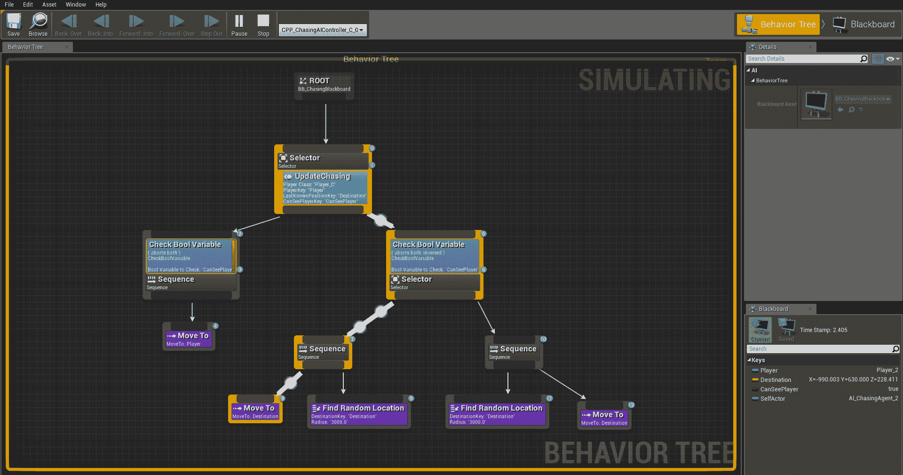

此外，如果您有多个**敌人**正在运行行为树，您可以通过顶部的菜单更改要查看的敌人，如图所示：

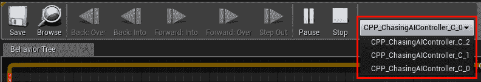

同样，也可以看到蓝图执行的流程。这虽然与 AI 没有直接关系，但值得在信息框中提及。

# 分析并可视化环境查询

在本节中，我们将探讨如何可视化和分析**环境查询**。实际上，我们将更好地理解 EQS 测试棋子如何可视化**环境查询**，并且我们将探索**分析器**工具，该工具允许我们检查每个查询的性能。

# 使用 EQS 测试棋子可视化环境查询

如在第四章，*环境查询系统*中预期的那样，有一个简单内置的方法可以在游戏世界中可视化环境查询，直接从视图中；游戏甚至不需要运行。事实上，有一个特殊的棋子能够做到这一点。然而，这个棋子不能直接带入关卡，因为它已被在代码库中声明为虚拟，以确保它不会被滥用。这意味着为了使用它，我们需要创建自己的蓝图棋子，该棋子直接从这个特殊棋子继承。

幸运的是，完成此步骤后，棋子功能齐全，不需要更多的代码，只需与参数一起工作（例如，您想要可视化的环境查询）。

您需要启用环境查询系统，查看第四章，环境查询系统，了解如何做到这一点。

如果您已经在第四章，*环境查询系统*中创建了 EQS 测试棋子，请随意跳过下一节。

# 创建 EQS 测试棋子

首先，创建一个新的蓝图；要继承的类是**EQSTestingPawn**，如下面的截图所示：

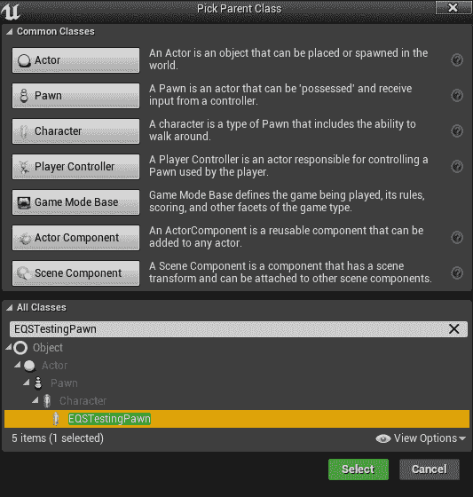

然后，您可以将其重命名为**MyEQSTestingPawn**，或者如果您已经在第四章，*环境查询系统*中这样做，您可以跳过这部分，或者给它另一个名字。

如果您只是从**详细信息**面板将其拖入地图，您可以更改 EQS 设置，如下一个截图所示：

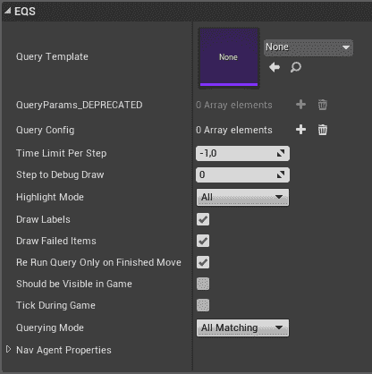

在第四章，*环境查询系统*中，我们已走到这一步，但现在我们有一些更多的时间进行调试，让我们深入探讨。

# 创建测试环境查询

我们需要一个**环境查询**来执行，以便可视化不同设置中的情况。因此，我们需要准备一个简单的查询，它在网格中生成点，然后根据与**查询者**的距离进行评分。所以，让我们构建环境查询，如下面的截图所示（在 EQS 编辑器内）：

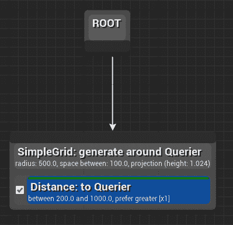

我们将保留默认设置，但为了您的方便，这是简单网格生成器在**详细信息**面板中的样子：

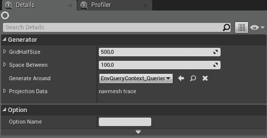

对于**距离测试**，我们将主要保留默认值，但为了展示目的，我们可以更改**过滤**设置，使**浮点值最小**和**浮点值最大**分别为 200 和 1,000。结果，我们将能够过滤掉离询问者太近的点，并查看 EQS 测试棋子如何可视化这些点：

# 用于可视化环境查询的 EQS 测试棋子的设置

现在让我们探索我们在**详细信息**面板中看到的**MyEQSTestingPawn**的设置。为了您的方便，以下是设置截图：

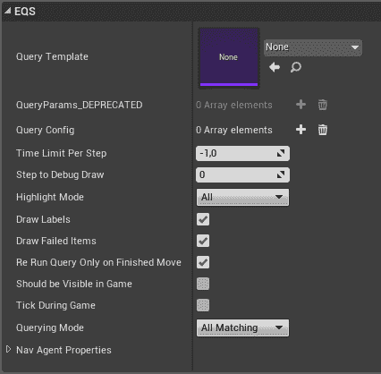

记住，您需要在该级别中选择测试棋子以可视化查询（并且必须设置查询模板）。

+   **查询模板**：正如其名所示，这是我们想要可视化的**环境查询**。

+   **QueryParams_DEPRECATED**：（*不要使用此选项*）这是设置环境查询参数的旧方法；现在请使用**查询配置**。

+   **查询配置**：这是一个数组，允许您快速更改**环境查询**的设置，以便快速测试和调试。

+   **高亮模式**：它决定了哪些位置（或项目）应该有一个高亮显示的视觉表示，这意味着有一个大球体，而不是小球体。可能假设的值如下：

    +   **全部**：这意味着所有位置或项目都会被突出显示，这是默认选项；因此，它将正好如以下截图所示，这也是我们设置**查询模板**后的默认显示方式：

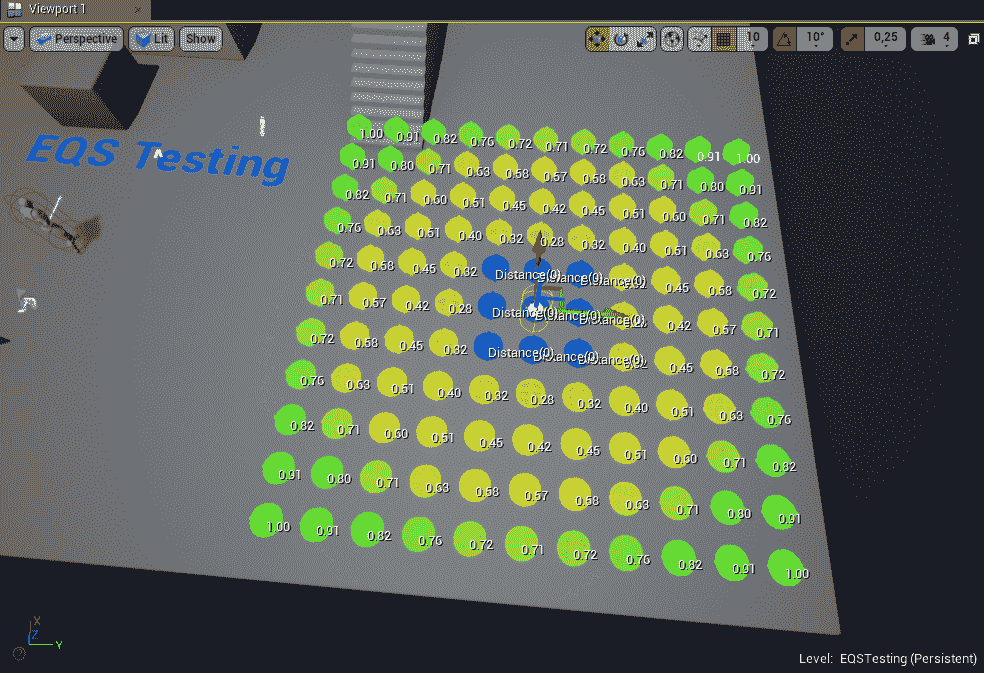

视口。这是视口的图像。其他（重叠）信息在这里并不重要

+   +   **最佳 5%**：正如其名所示，它仅显示那些得分在所有点中最佳 5%范围内的点。所有其他点将有一个更小的球体：

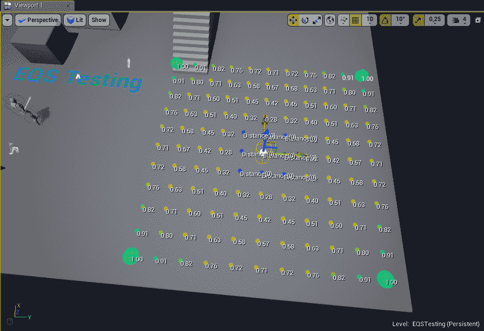

视口。这是视口的图像。其他（重叠）信息在这里并不重要

+   +   **最佳 25%**：与上一个选项一样，它仅显示那些得分在所有点中最佳 25%范围内的点。所有其他点将有一个更小的球体：

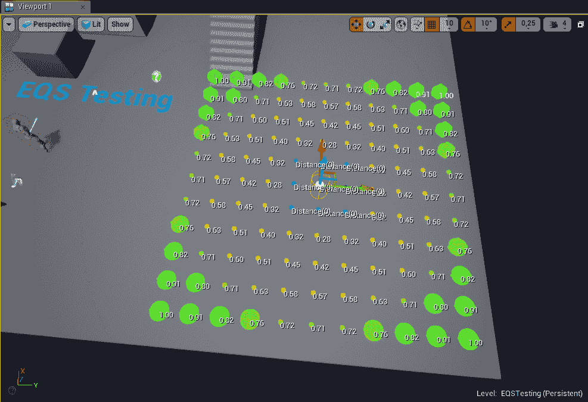

视口。这是视口的图像。其他（重叠）信息在这里并不重要

+   **绘制标签**：如果选中，它会在点旁边显示其分数。如果一个点已被过滤掉，它将显示哪个测试过滤掉了该点。在我们的例子中，靠近询问者的点已被**距离测试**过滤掉。此选项默认启用；如果我们将其关闭。

+   **绘制失败的项目**：如果选中，它还会显示那些已被过滤掉的点。默认情况下是启用的，如果我们将其关闭，在我们的例子中，我们会看到以下内容：

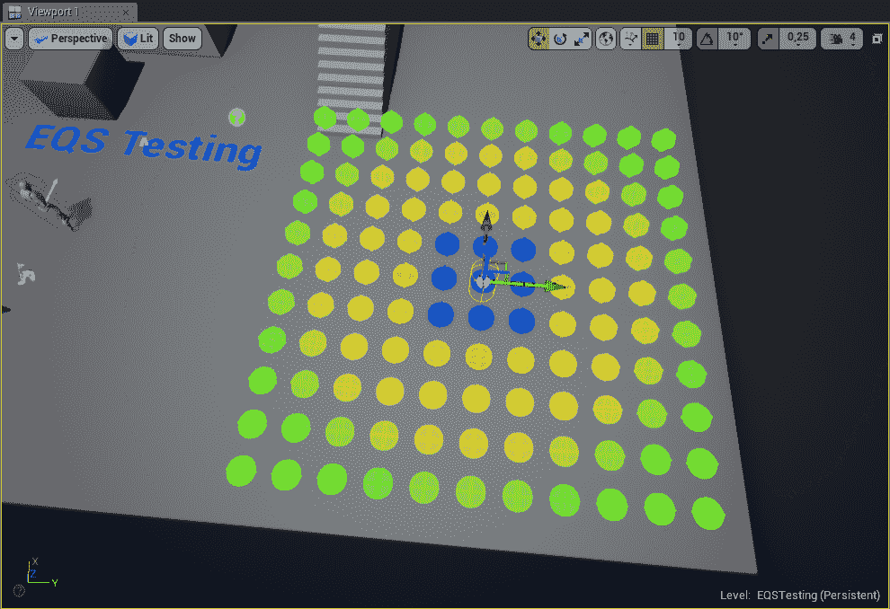

+   **仅重跑完成移动的查询**: 如果勾选，则仅在测试棋子停止移动时执行查询，而不是一直执行。默认情况下启用，出于性能原因，你应该保持开启状态，除非你需要当测试棋子移动时也可视化查询：

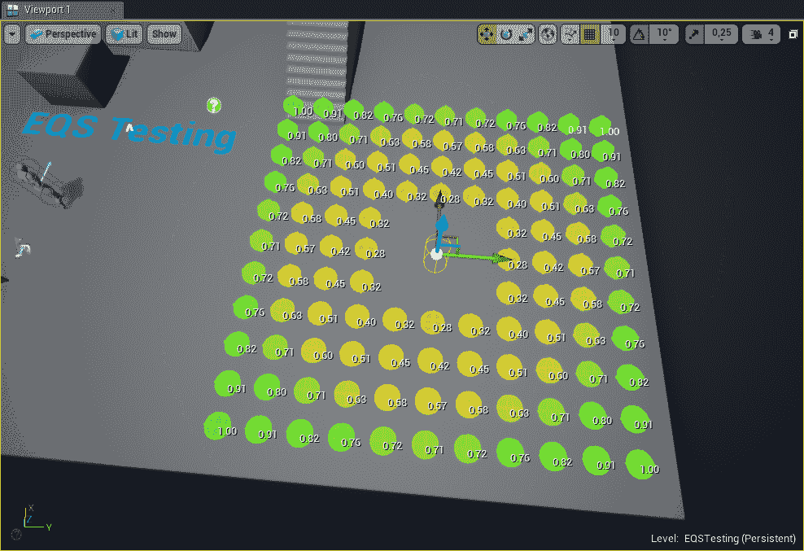

+   **在游戏中应可见**: 如果勾选，则将在游戏中以小图标的形式显示测试棋子，如这个截图所示；默认情况下是禁用的：

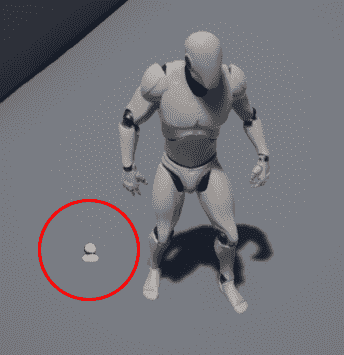

+   **游戏过程中勾选**: 如其名所示，如果勾选，则允许在游戏执行过程中勾选。

+   **查询模式**: 确定查询的最终结果，并且有许多可能的选项：

    +   **全部匹配**: 这是默认选项；它显示所有与查询匹配的点（蓝色已被过滤掉）。此外，点根据分数从橙色到绿色着色，绿色代表最高分数 1：

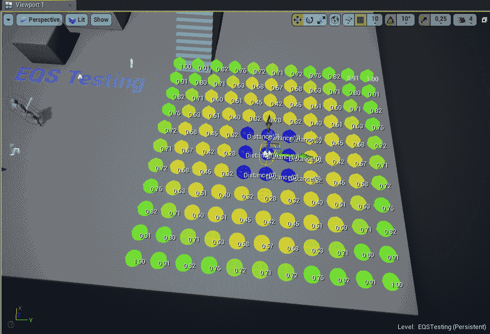

视口。这是视口的图像。其他（重叠）信息在此处不重要

+   +   **最佳单个项目**: 以绿色显示得分最高的点（因此是最佳点），其他所有点以较深的绿色阴影显示（已被过滤的点仍然以蓝色显示）：

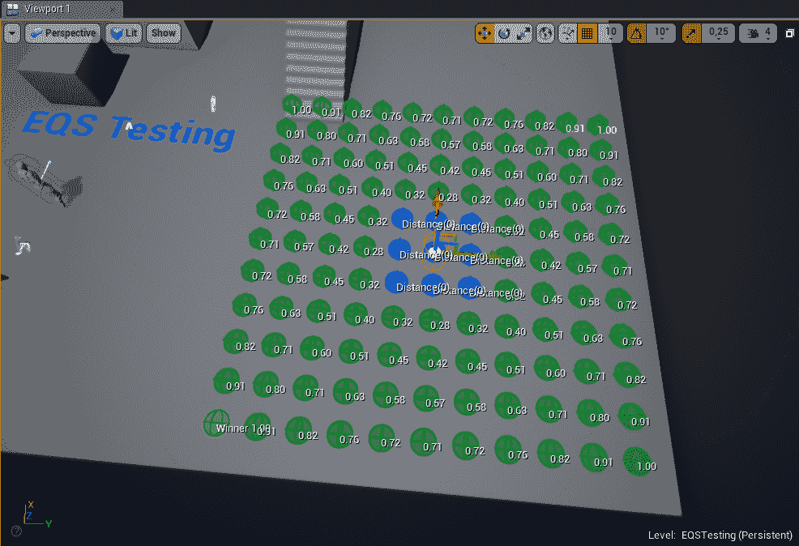

视口。这是视口的图像。其他（重叠）信息在此处不重要

+   +   **从最佳 5%中随机选择一个项目**: 它显示（或返回）最佳 5%中得分最高的点的随机一个。在下一个示例中，随机选择了一个点：

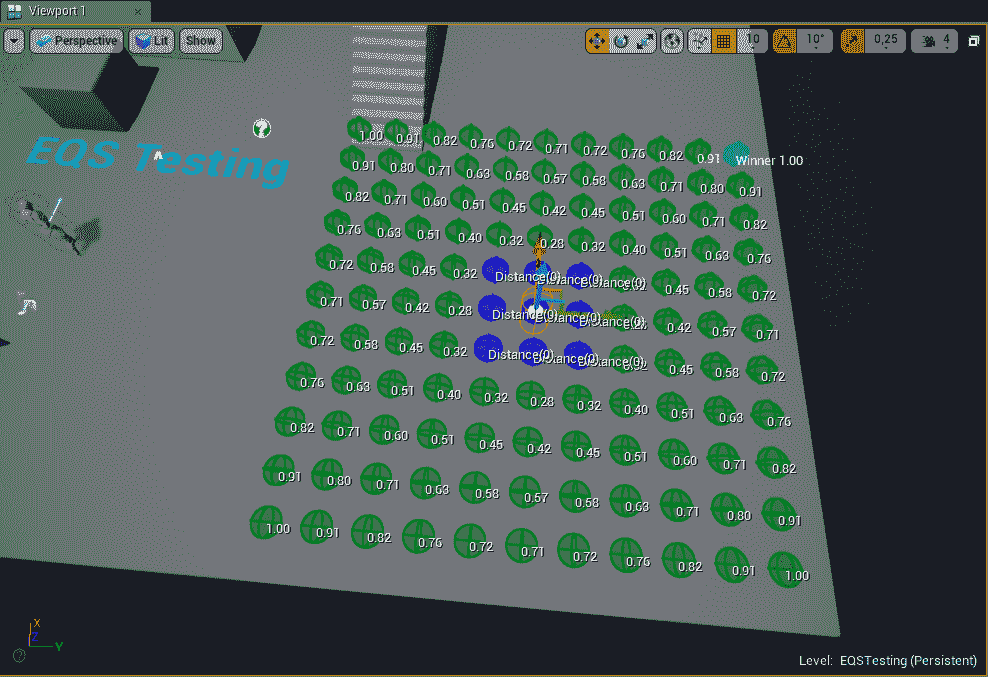

视口。这是视口的图像。其他（重叠）信息在此处不重要

+   +   **从最佳 25%中随机选择一个项目**: 它显示（或返回）最佳 25%中得分最高的点的随机一个。在下一个示例中，随机选择了一个点：

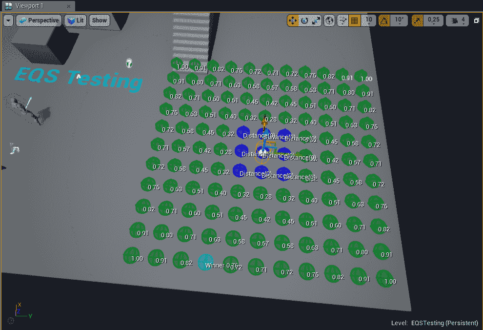

视口。这是视口的图像。其他（重叠）信息在此处不重要

+   **导航代理属性**: 由于一些**环境查询**依赖于导航系统，正如我们所见，因此这组选项允许您调整执行查询的代理在导航系统中的外观。我们不会深入探讨这些，但以下是可能的选项：


这样，我们就结束了关于使用测试棋子可视化环境查询的讨论。然而，下一节将介绍更多关于 EQS 的内容，我们将看到如何分析环境查询以检查其性能，而在下一章中，我们将看到如何在游戏调试器运行时可视化环境查询。

# 环境查询分析

在本节中，我们将学习如何快速分析环境查询。

您可能已经注意到，在 EQS 编辑器中，**详细信息**面板旁边有一个**分析**选项卡，如下面的截图所示：

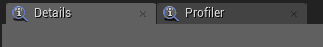

如果我们点击它，我们将有一个全新的部分，其中我们可以快速分析环境查询。目前，它是空的，因为游戏没有运行，没有执行任何环境查询：

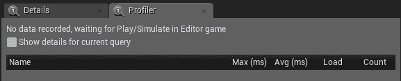

如果游戏中已经有一些查询正在运行，我们只需按**Play**并返回此菜单，其中包含所有当前正在运行的查询。然而，如果您游戏中没有任何查询，我们可以快速创建一个行为树来运行一些查询，使此行为树在 AI 控制器上运行，并将此 AI 控制器分配给游戏中的某个 AI 代理。由于我们在书中已经多次这样做，所以我就不会一步步指导您了。但是，下一节将概述这个过程，如果您想跟随，请随意。否则，您可以跳过下一节，直接进入**环境查询分析器**部分。

# 设置 EQS 分析测试资产

首先，我们需要创建环境查询；您应该在游戏中已经有了这些，因为您一直在使用它们，但如果您只想测试这个分析工具，创建几个查询，例如，**EnvQueryA**和**EnvQueryB**。我使第一个查询比平常更重（生成许多点），以便在分析器中突出显示：


然后，我们需要为行为树创建一个黑板资产；我们可以将其命名为**BB_EQSTesting**，并在其中只需要一个向量键：

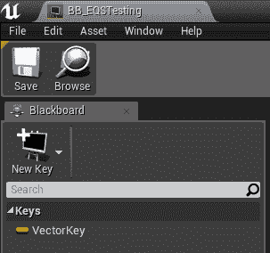

接下来，我们可以创建一个运行查询的行为树。将其命名为`BT_EQSTesting`，并在其中分配黑板。然后，我们可以通过序列节点（附带一点延迟）依次运行两个查询。请记住将查询分配给`Run Query`节点，并使用黑板中的向量键（这样查询就不会失败）。默认情况下，运行模式应设置为`Single Best Item`；请确保这是您选择的选项。以下是行为树：

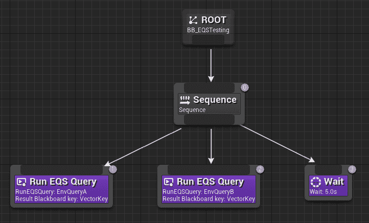

现在我们需要一个 AI 控制器；为了简单起见，我们可以在蓝图创建它，并将其命名为**B***P_EQSTestingAIController**。重写**On Possess**函数，并运行**行为树**：

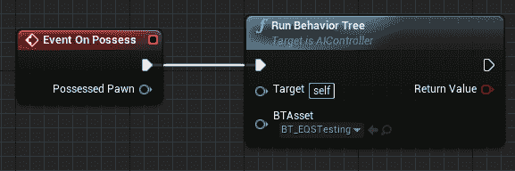

最后，在关卡中创建一个 AI 代理（如果您从**第三人称****示例地图**开始，可以复制玩家）并分配新创建的 AI 控制器：

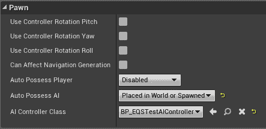

现在我们准备看到分析器在行动中的效果！

# 环境查询分析器

如果您已经走到这一步，您应该按播放按钮，并在您的游戏中运行环境查询。如果是这样，当游戏运行时，EQS 编辑器的分析器标签将填充所有正在运行的环境查询，并显示它们的统计数据：

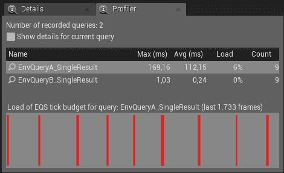

对于每种查询类型，分析器都会显示其执行的次数、从最糟糕的查询中取出的最大时间以及它们的平均时间。

如您所见，**EnvQueryA**非常重（因为我就是这样设计的），分析器可以帮助您了解哪些需要更改/改进或甚至删除。此外，我们会看到红色，因为它的运行时间非常糟糕。对于**EnvQueryB**，我们会看到任何这些情况。

此外，分析器还会根据运行模式对查询进行分类。在下面的屏幕截图中，**EnvQueryB**有两个条目，基于运行模式是**单个结果**还是**所有匹配**：

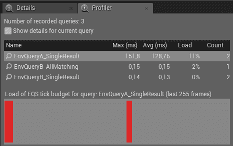

当然，当您看到分析器标签时，您已经在特定查询上打开了 EQS 编辑器。因此，在分析器的底部有一些关于当前打开 EQS 编辑器的查询的更多信息。实际上，我们可以看到一个显示查询的**EQS 滴答预算负载**（其滴答有多重）的图表。

最后，在最上方，显示了迄今为止记录了多少种查询类型，以及一个名为**显示当前查询的详细信息**的复选框。如果我们勾选此框，我们就能直接在环境查询树中看到每个生成器（及其选择率）的最坏和平均时间，以及对于每个测试，我们有以下内容：

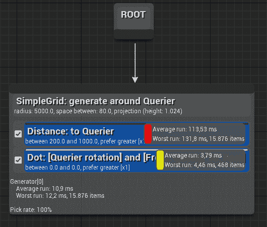

这里也是用颜色编码的：

+   **红色**表示非常糟糕的性能。

+   **黄色**表示中间性能。

+   **绿色**表示性能良好。

再次强调，**EnvQueryA**被设计成表现不佳，以展示分析器。如果我们选择**EnvQueryB**，我们会看到它表现得好得多：

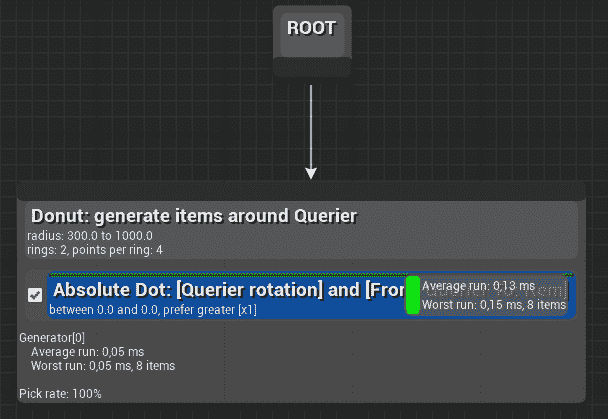

因此，这种深入到每个单个生成器和每个测试的做法，让您能够深入了解您的环境查询中哪些部分实际上表现不佳。因此，您可以使用分析器来识别有问题的查询，然后深入到需要优化的那些查询中。

# 保存和加载 EQS 统计信息

分析环境查询的另一个酷特性是您可以保存您的统计信息并再次加载它们。这为您提供了强大且灵活的工具，可以与您的团队分享您的发现。

为了保存 EQS 统计信息，您只需按顶部菜单中的**保存统计信息**按钮，如以下屏幕截图所示：

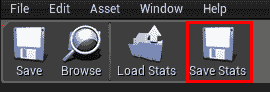

您将被提示选择一个位置来保存包含您统计信息的文件。

加载也很简单。只需按顶部菜单中的**加载统计信息**按钮，如下一张屏幕截图所示：

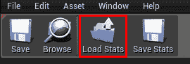

你将被提示选择一个包含你的 EQS 统计数据的文件，之后，所有你的统计数据将被加载。

# 测试和可视化导航网格

在本节中，我们将探索一些内置工具来测试和可视化**导航网格**。

尤其是我们将看到如何在底层可视化导航网格，以及导航测试演员如何快速显示“路线”（由路径查找算法生成的路径）。

# 可视化导航网格

正如我们在第三章中提到的，*导航*，当我们通过将**导航网格边界体积**引入地图来生成**导航网格**时，我们也在这个级别中创建了一个**RecastNavMesh-Default**演员。如果我们选择它，我们可以看到有很多选项可以生成导航网格，其中一些我们已经探索过。然而，我们有一个关于**显示设置**的整个章节，在第三章的*导航*中，我们没有时间进行适当的探索。因此，让我们快速浏览这些设置；这里，为了你的方便，是**详细信息**面板中显示设置的截图：

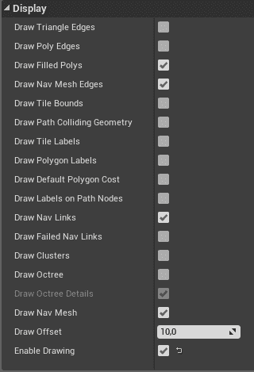

使用默认设置，它看起来是这样的（在我们的示例地图中）：

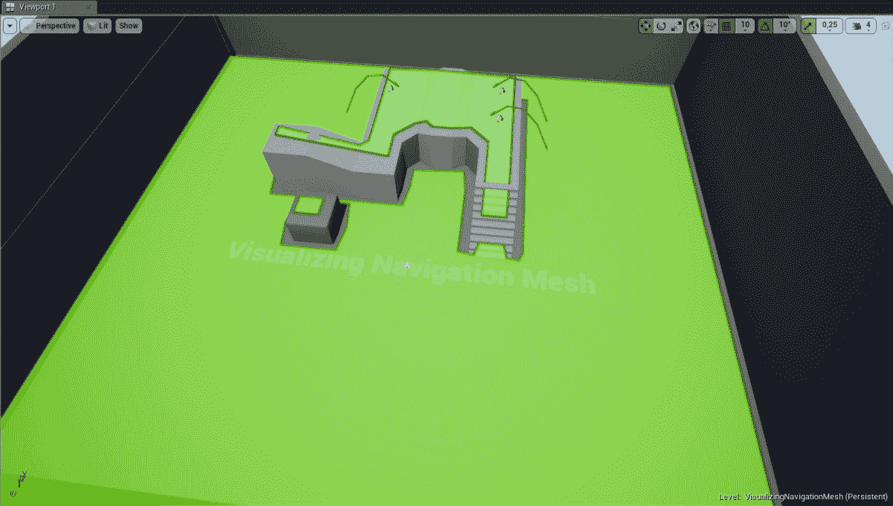

我们有很多设置，所以不深入细节，让我们直接进入：

要完全理解所有选项，你应该熟悉导航网格是如何生成的。然而，这部分内容超出了本书的范围。无论如何，你仍然可以尝试调整设置，并了解更多关于导航系统的情况。

+   **绘制三角形边**：显示构成导航网格的三角形。最终，这些三角形的连接将在图上生成，路径查找算法将在其上运行（实际上，这比这更复杂，因为系统需要根据更大的世界进行缩放，并在不同级别的不同图上使用分层路径查找）。通过启用此选项，你可以实际看到这个图上的节点：

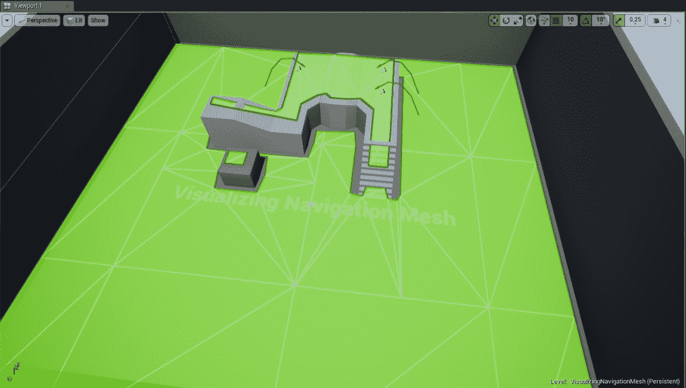

+   **绘制多边形边**：显示多边形的边。实际上，导航网格是从将级别分割成多边形开始的，如果一个多边形包含复杂的几何形状（例如，有静态网格），算法将根据几何形状将多边形细分为更小的多边形。然后，这些多边形被分割成三角形（我们之前看到的）。启用此选项后，你可以看到哪些多边形属于这个静态网格，如果你保持上一个选项开启，你可以清楚地看到所有这些多边形是如何被分割成三角形的：


+   **绘制填充多边形**：如果勾选，它会显示用我们已看到的常规绿色填充的多边形；实际上，此选项默认是开启的。但是，如果我们禁用它，我们可以更清楚地看到导航网格的“骨架”：

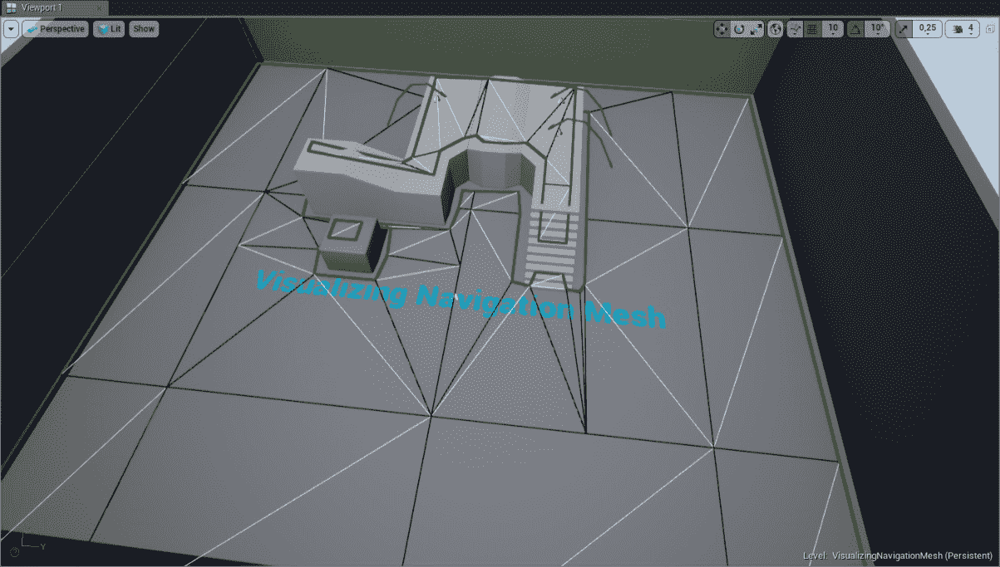

+   **绘制导航网格边缘**：如果勾选（默认情况下是勾选的），它会显示导航网格的边缘。在下面的屏幕截图中，这是关闭此选项时的样子：

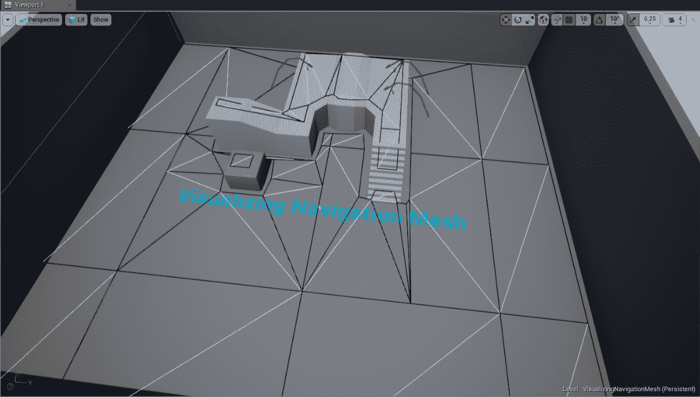

+   **绘制瓦片边界**：如果启用，它会显示导航网格瓦片的边界：

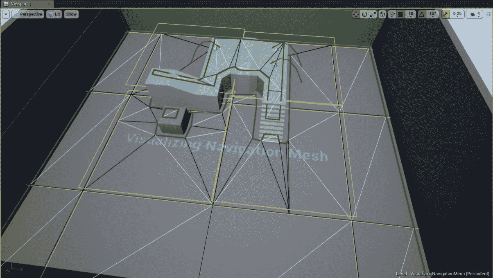

+   **绘制路径碰撞几何形状**：通过启用此选项，可以可视化传递给**导航网格生成器**的几何形状，这基本上是导航系统“知道”的所有几何形状。这有助于检查是否被导航系统考虑，因此您可以包括或排除不需要的内容（请记住，有一个选项可以让演员和对象影响导航网格，此选项允许您找到当前被导航系统考虑的内容）。通过勾选此选项，可以看到以下内容：

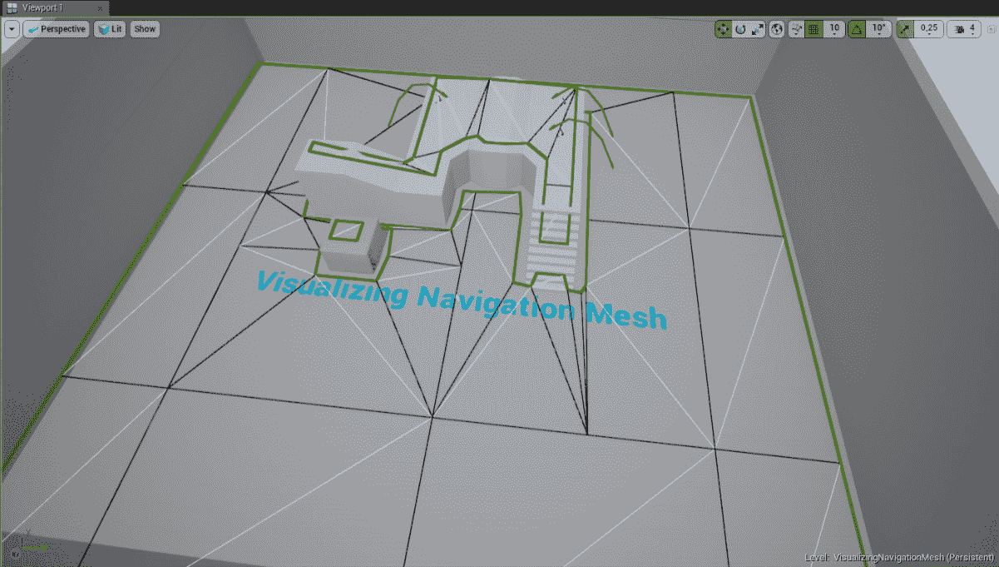

+   然而，请注意，虚幻引擎独立渲染这个几何形状。因此，您也可以在引擎中使用其他视图来隔离这个几何形状，以便更好地检查其外观。例如，您可以打开线框视图*，*仍然可以看到传递给导航网格生成器的几何形状，如下所示：


+   **绘制瓦片标签**：如果启用，这些选项显示导航网格每个瓦片的标签（以坐标表示）：

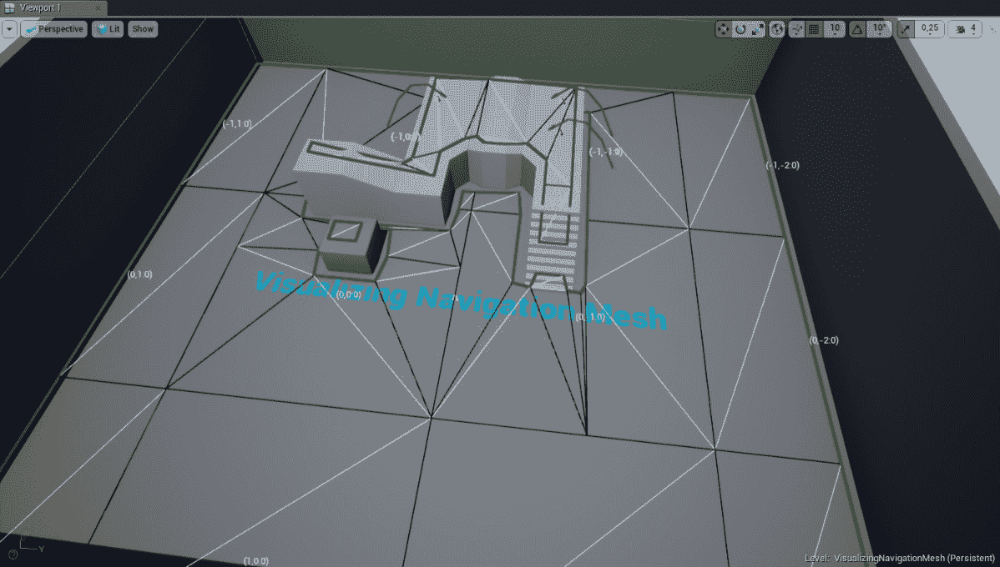

视口。这是视口的屏幕截图。其他（模糊显示）的信息在这里并不重要

+   **绘制多边形标签**：如果启用，此选项为导航网格中生成的每个多边形显示一个标签（也表达了这个多边形在生成前经过了多少次迭代），：

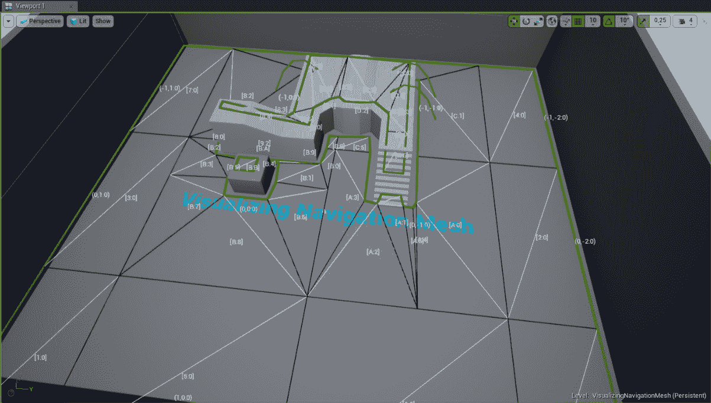

视口。这是视口的屏幕截图。其他（模糊显示）的信息在这里并不重要

+   **绘制默认多边形成本**：如果此选项启用，它会显示导航网格不同部分的全部成本。这对于检查哪些部分更难穿越非常有用。通过在我们的示例中启用它，它看起来是这样的：

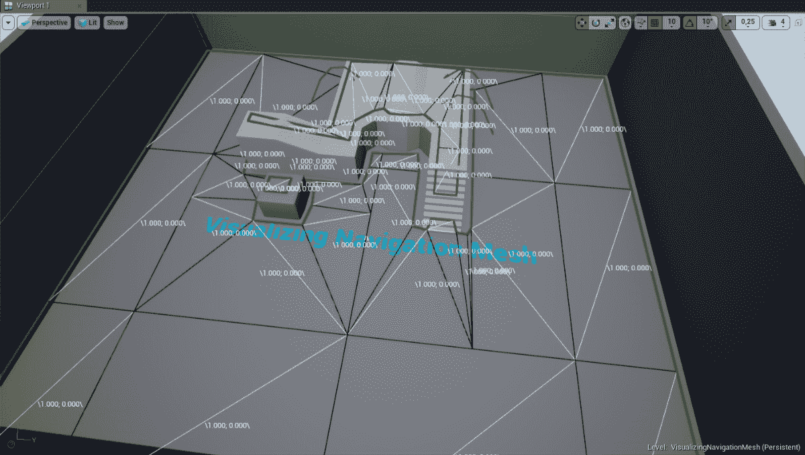

视口。这是视口的屏幕截图。其他（模糊显示）的信息在这里并不重要

+   如你所见，所有成本都是 1，这是因为我们没有其他类型的导航区域，只有默认的。如果我们引入一个导航修改器，并设置一个自定义的导航区域（不同于 null），例如，**沙漠**（或**丛林**）**区域**，就像我们在第三章中做的，*导航*，这将得到这样的结果（你会注意到导航网格生成方式的变化，以及在沙漠区域成本更高）：

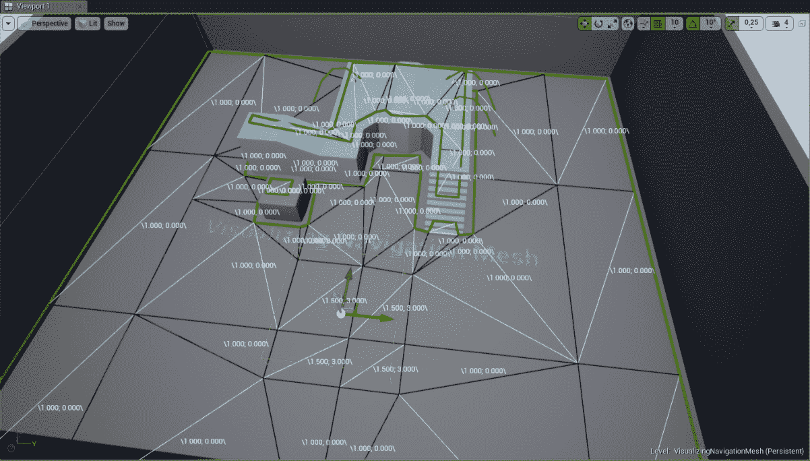

视口。这是视口的截图。其他（模糊显示）的信息在这里并不重要

+   **在路径节点上绘制标签**：如果这个选项开启，它将在路径节点上绘制标签。

+   **绘制导航链接**：如名称所示，如果这个选项开启，它将绘制导航链接。它默认开启，因为通常你希望能够看到导航链接。如果我们禁用它，在我们的示例中它将看起来像这样：


+   **绘制失败的导航链接**：这与前面的选项相同，但在**失败的导航链接**上默认是禁用的。

+   **绘制簇**：如果启用，它允许你看到簇。我不会深入细节，但正如我们之前提到的，路径查找需要优化以适应大型世界（例如，**分层路径查找**）；因此，使用这个选项，你可以看到导航网格的哪些区域是连接的（这意味着在两个区域之间以某种方式存在路径的保证），因此路径查找可以先找到连接的区域，然后再细化路径的搜索。如果这个选项被启用，这里就是它的样子：

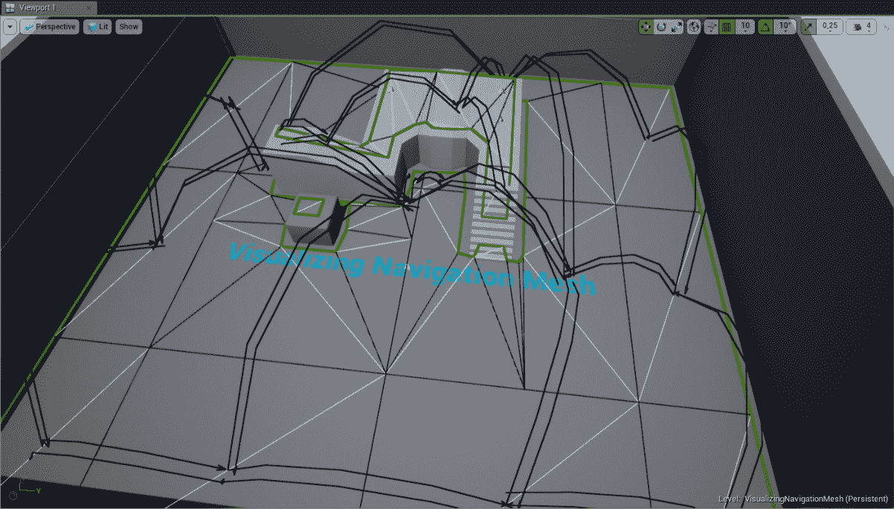

+   **绘制八叉树和绘制八叉树细节**：如果启用，它允许你看到**八叉树**。八叉树是数学结构（有八个子节点的树），用于划分 3D 空间。实际上，导航网格只位于同一表面上，但它存在于（并且需要与）3D 空间中。就像在我们的示例地图中，我们有一些楼梯和一些导航网格的区域不在同一水平面上；还有**导航链接**将楼梯上方的区域连接到楼梯下方的区域。如果我们启用它，这里就是它应该的样子（你将能够注意到八叉树主要位于需要发展高度的导航网格部分）：

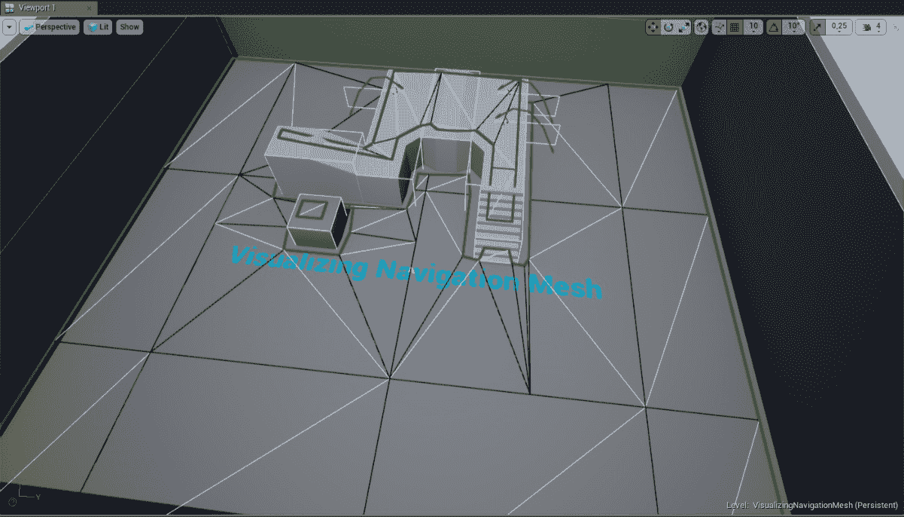

+   **绘制偏移量**：正如你可能已经注意到的，导航网格不是绘制在关卡几何形状的同一水平面上，但存在一个小的偏移。**绘制偏移量**参数控制导航网格绘制地面上的这个偏移。默认值是 10（如果我们保持虚幻单位的惯例，这意味着 10 厘米）。如果我们改变这个值（我还启用了**绘制填充多边形**以更好地查看偏移），例如，到一个更高的值，这就是我们最终得到的结果：

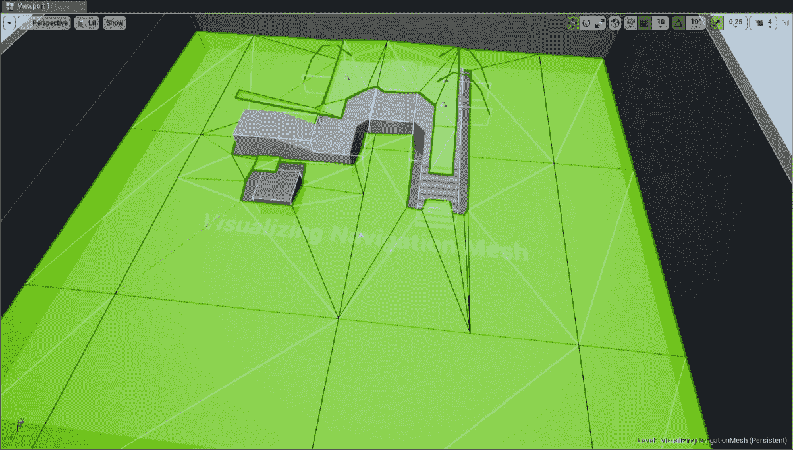

+   **启用绘制**：正如其名所示，如果启用此功能，就可以看到导航网格以及所有之前的设置。

当然，当我们开始调整其他决定导航网格如何生成的设置时，所有这些选项结合使用会更好。实际上，通过调整显示设置，您可以更好地理解生成设置的工作方式，并实际上“看到”它们如何影响导航网格的生成。

# 导航测试演员

就像我们在**EQS 测试棋子**中看到的那样，有一个内置的**导航测试演员**我们可以使用。

这个演员没有被声明为虚拟（就像 EQS 的对应物那样），因此它可以直接放置在地图上。实际上，我们可以从**模式**面板访问它，如图所示：

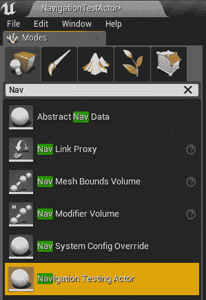

一旦放置在关卡中，它看起来就是这样：

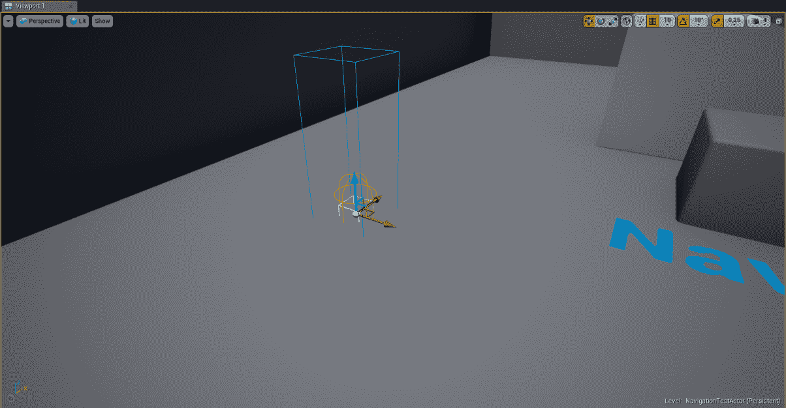

如果我们在关卡中放置另一个，那么在**详细信息**面板中，我们可以在路径查找部分分配如下所示：

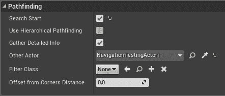

这将生成两个导航测试演员之间的路径预览：

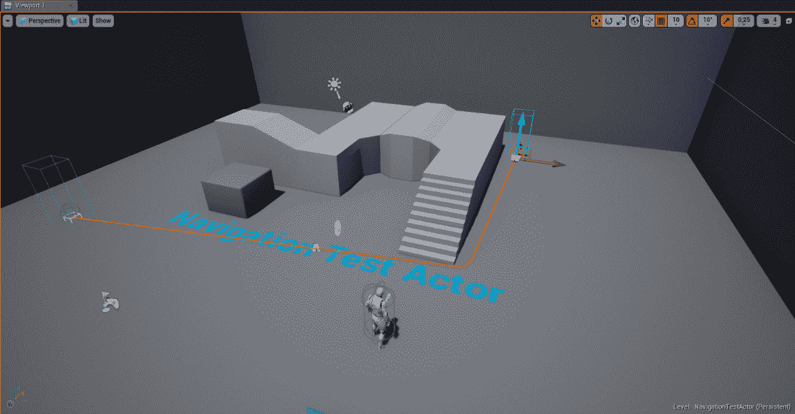

这里是一个从不同角度的例子：

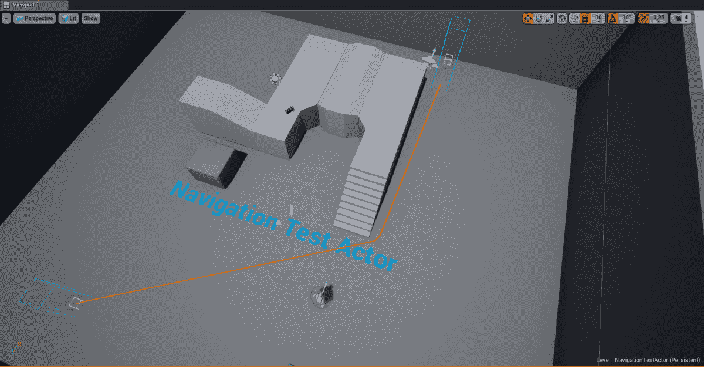

此外，如果我们修改**偏移角距离**，我们还可以在导航测试演员的路径查找部分“平滑”路径的边缘。例如，150 的值将产生以下路径：


当然，这个路径查找测试也可以与**导航区域**一起使用。如果我们在一个关卡中放置一个**沙漠区域**（在第三章，*导航*中创建的），路径查找器将尝试避开它，因为它有更高的成本。在下面的例子中（高亮显示的体积是沙漠区域），沙漠区域很小，穿过它仍然是最近的路径：


然而，如果我们扩大区域，那么从另一侧走会更便宜：


最后，值得一提的是，我们还可以在导航测试演员中使用导航过滤器，始终在其**详细信息**面板的路径查找部分。例如，我们可以放置**NavFilter_DesertAnimal**（我们在第三章，*导航*中创建的），然后沙漠区域甚至更受欢迎，产生这条其他路径：

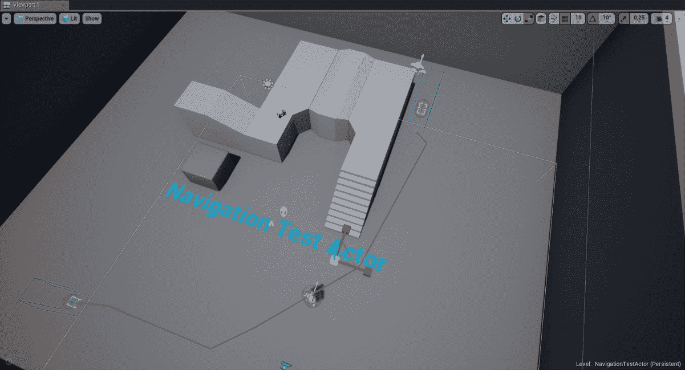

这个导航测试演员有更多功能，正如您可以从其**详细信息**面板中看到的那样，但不幸的是，它们超出了本书的范围。然而，我们已经看到了它的基本用法。

# AI 性能分析

当涉及到性能分析时，虚幻引擎提供了许多解决方案和工具。本节探讨了其中一些与 AI 相关的工具。

我们将特别介绍如何直接从控制台可视化统计信息以及如何创建自定义统计组。在本节结束时，我们将提及**会话前端**工具。

# 通过控制台进行性能分析

最常用的性能分析工具是通过控制台激活统计信息，因为它非常快速，你可以实时跟踪性能。实际上，只需在控制台中输入`stats game`，就会在屏幕上显示一整页的统计信息：


这里显示了所有出现的统计信息：


如你所见，有很多信息，但它相当通用，因为它跟踪了游戏的整体性能。这是一个开始优化游戏的完美起点；然而，作为一个 AI 开发者，你需要更具体的工具。

如果我们只输入`Stat`，屏幕上会显示一系列选项（作为建议）（86!）：

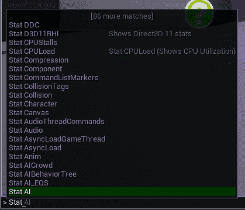

但我们可以通过输入`Stat AI`进一步细化我们的搜索，并获取与 AI 相关的统计信息（毕竟，这些选项是列表中的第一个，因为它们按字母顺序排列）：

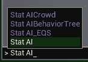

当需要快速跟踪你的 AI 性能时，这些功能非常有用。

为了关闭统计信息，只需重新输入你关闭那些特定统计信息时使用的相同命令。

如果我们输入`Stat AI`，我们会得到一个通用的 AI 性能跟踪（这还取决于你激活了哪些 AI 系统）。在右侧，你还可以检查当前级别中有多少 AI，以及有多少 AI 正在渲染：

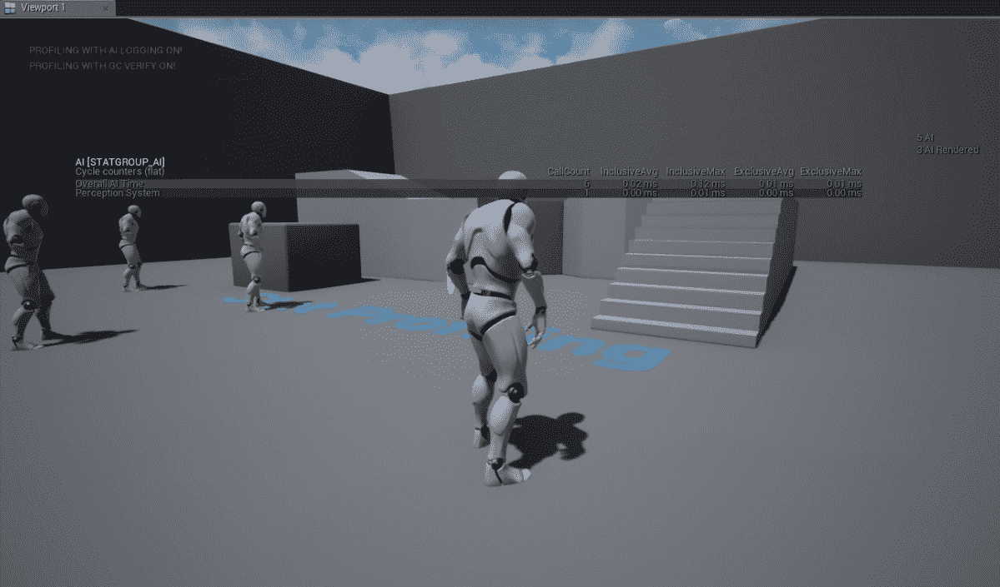

输入`Stat AI_EQS`会给我们更多关于 EQS 的信息。当然，通过使用包含五个 AI 执行我们之前创建的`EnvQueryA`和`EnvQueryB`的关卡，这将对 EQS 在这个特定示例中的性能产生巨大影响：


输入`Stat AIBehaviorTree`会给我们关于正在运行的行为树的信息。目前，在我们的示例中，我们拥有非常简单的行为树，因此在性能和内存方面都非常容易：

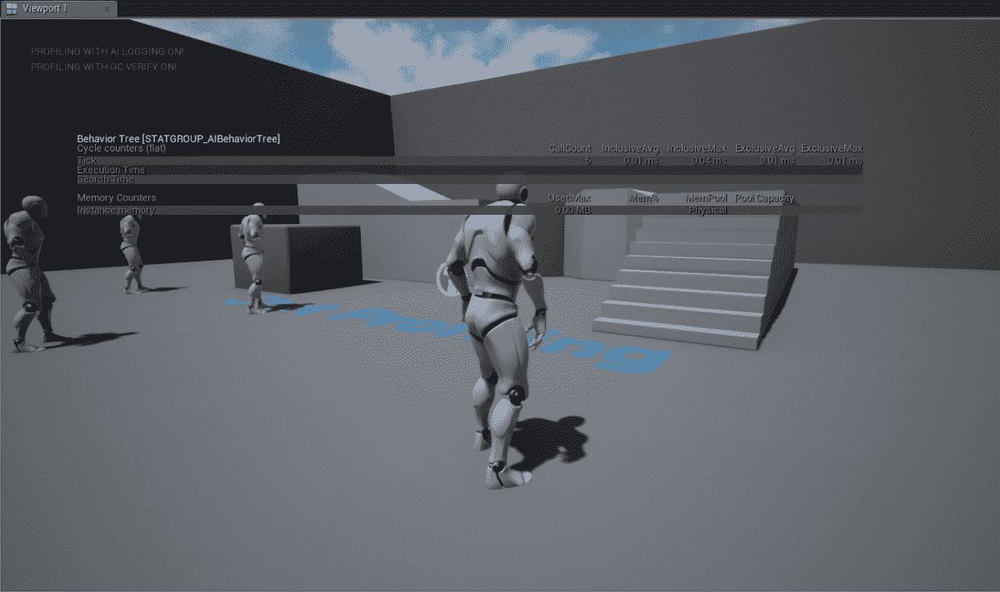

最后，输入`Stat AICrowd`会给我们关于当前阶段处理的群众的信息。由于在这个示例中我们没有使用群众，因此该类别为空：

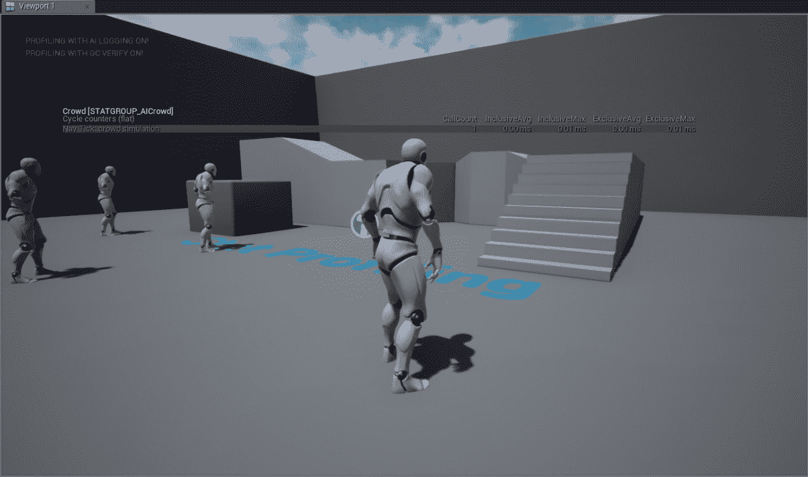

当然，如果你需要同时跟踪多个类别，你可以通过插入控制台命令来实现，它们会一起堆叠，如图所示：

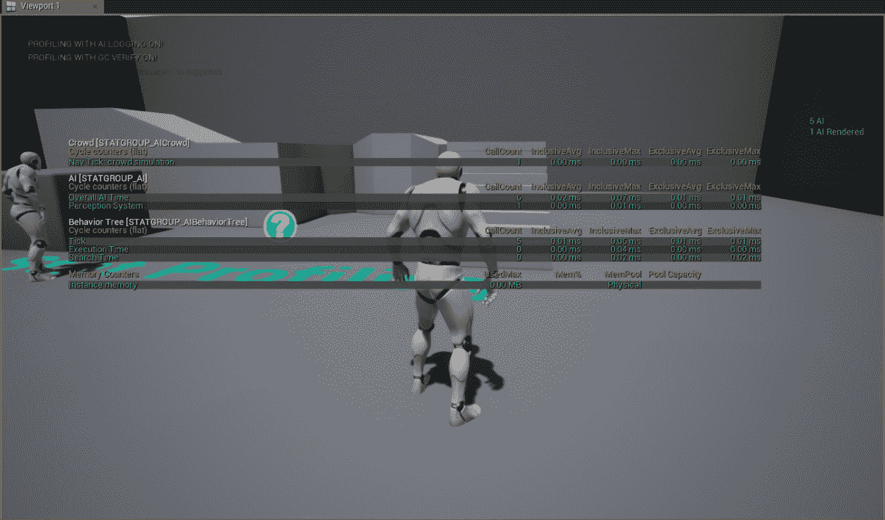

# 创建自定义统计组

如果你正在编写复杂的 AI，你可能想跟踪更具体的函数及其性能。当然，这不仅仅对 AI 编程有用，对你的游戏任何部分都很有用。虚幻引擎提供了一些简单的宏，可以添加到你的 C++代码中，以便快速输出这些函数的性能统计信息以进行检查。

要创建一个**自定义状态组**，你需要在头文件中声明它（或者如果你的系统使用继承，你可以在头文件的最高级别声明它，这样相同的统计组就可以供所有继承自这个类的类使用）：

```py
DECLARE_STATS_GROUP(TEXT("CustomStatGroupName"), STATGROUP_CustomStatGroupName, STATCAT_Advanced);
```

然后，在包含你想要跟踪的函数的类的头文件（`.h`）内部，我们需要添加这个宏（每个需要跟踪的函数一个）：

```py
DECLARE_CYCLE_STAT(TEXT("Name of how you want to display this function"), STAT_NameOfTheFunction, STATGROUP_CustomStatGroupName);
```

最后，在包含我们想要跟踪的函数的实现（`.cpp`）文件中，我们需要在函数的开始处添加这个宏：

```py
SCOPE_CYCLE_COUNTER(STAT_NameOfTheFunction);
```

让我们从实际例子开始，这样你可以更好地了解它是如何工作的。我将创建一个简单的演员，在这个演员内部创建状态组，并开始跟踪其`tick`函数的性能。

让我们创建一个新的从**Actor**继承的 C++类：

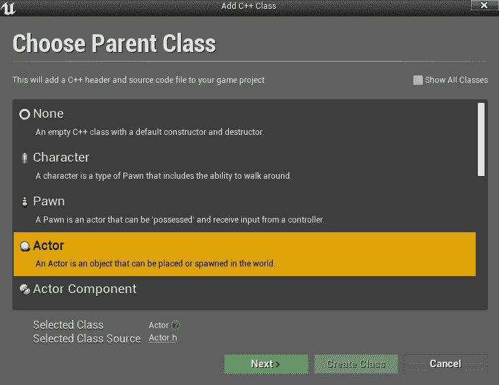

我们可以将其重命名为`***TestingStatActor***`并将其放置在`Chapter12 `文件夹中：

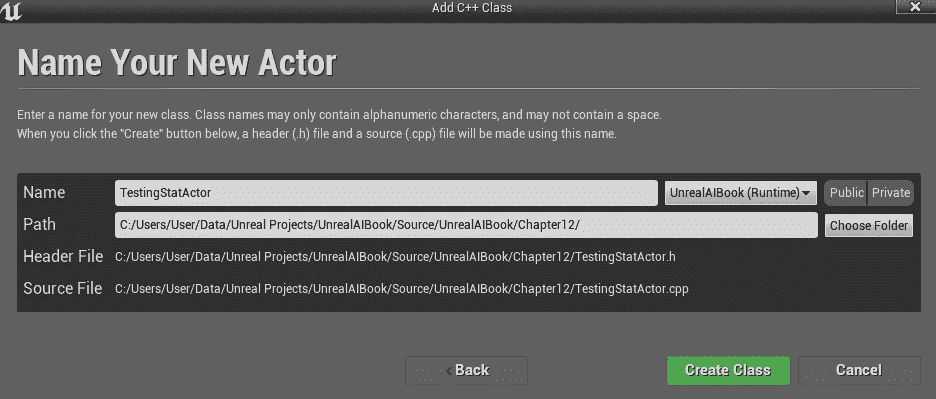

接下来，在其头文件（`.h`）中，我们需要声明统计组（在包含语句下面）：

```py
#include "CoreMinimal.h"
#include "GameFramework/Actor.h"
#include "TestingStatActor.generated.h"

DECLARE_STATS_GROUP(TEXT("AI_MyCustomGroup"), STATGROUP_AI_MyCustomGroup, STATCAT_Advanced);
```

然后，因为我们想要跟踪这个类中的函数，我们可以在上一行下面声明跟踪函数的意图：

```py
#include "CoreMinimal.h"
#include "GameFramework/Actor.h"
#include "TestingStatActor.generated.h"

DECLARE_STATS_GROUP(TEXT("AI_MyCustomGroup"), STATGROUP_AI_MyCustomGroup, STATCAT_Advanced);
DECLARE_CYCLE_STAT(TEXT("StatTestActor ~ PerformTick"), STAT_PerformTick, STATGROUP_AI_MyCustomGroup);
```

最后，在 C++文件中，我们可以在`Tick`函数的开始处添加以下宏（如果你想要跟踪`Super::Tick()`部分，甚至可以在它之前），也许我们还可以添加一个日志（这是一个繁重的任务，尤其是对于`Tick`函数，这样我们可以更好地看到其性能的峰值）：

```py
void ATestingStatActor::Tick(float DeltaTime)
{
 SCOPE_CYCLE_COUNTER(STAT_PerformTick);
  Super::Tick(DeltaTime);

  UE_LOG(LogTemp, Warning, TEXT("Test Message on Tick"));
}
```

现在你可以编译你的代码了，当编译完成后，你可以直接将**TestingStatActor**拖入场景（记住，它没有场景组件，所以它存在于场景中，但不能定位）。

如果我们在控制台中输入，我们现在能够访问我们的**AI_MyCustomGroup**：

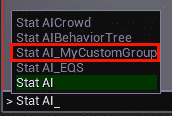

如果我们启用它，我们就能在屏幕上检查游戏中每个 TestingStatActor 的`Tick`函数的性能（在这个例子中，只有一个）：

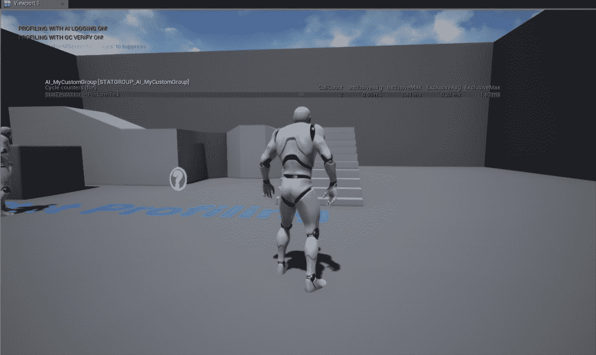

这就完成了自定义状态组的创建。这确实是一个非常强大的工具，它允许你快速开始对 C++函数进行性能分析。

# 会话前端

**会话前端**是虚幻引擎中一个非常强大的性能分析工具。它允许你检查游戏特定部分的表现，记录和保存性能分析会话，以及更多（包括自动测试！在这本书中我们不会涉及这些）。

你可以通过从顶部菜单**窗口 | 开发者工具 | 会话前端**导航来激活它，如下面的屏幕截图所示：

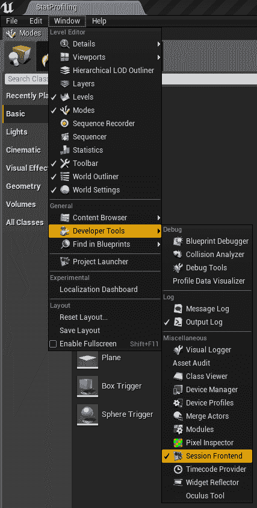

一旦打开，它看起来是这样的（它应该在**控制台**标签页中）：

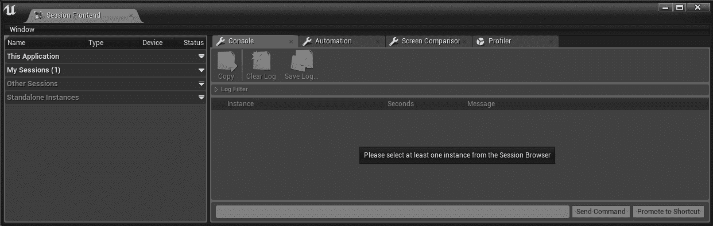

控制台标签页。这是控制台标签页的图片。其他（模糊显示）信息在这里并不重要

在**分析器**标签页中，你可以找到所有深入分析所需的信息。

当你开始分析时，这里你会找到更多关于 AI 性能的信息（实际上，你可以找到你游戏每个部分的表现）。例如，在下一张屏幕截图中，你可以看到我正在分析一些 AI 系统：

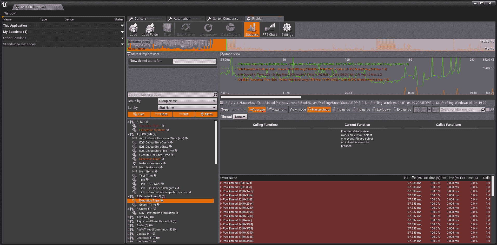

分析器标签页。这是分析器标签页的图片。其他（模糊显示）信息在这里并不重要

如果你之前创建了一个自定义统计组，你将能够在会话前端对其进行性能分析！所以，请记住，创建一个统计组非常重要，因为稍后你将需要检查你系统的性能。

不幸的是，我们没有时间探索**会话前端**工具，因为它需要整整一章的内容，并且超出了本书的范围（因为它需要深入挖掘性能分析）。然而，我提到这个工具不仅仅是因为它非常重要，还因为你应该绝对了解它的存在，并且值得你自己进一步探索。实际上，你可以在官方文档中找到更多关于这个工具的信息：[`docs.unrealengine.com/en-us/Engine/Performance/Profiler`](https://docs.unrealengine.com/en-us/Engine/Performance/Profiler)，它为学习更多关于这个工具提供了良好的起点。

# 摘要

在本章中，我们探索了我们 AI 的一些调试工具。当然，这并不全面，还有更多我们没有涉及的内容。然而，我们了解了最重要的工具及其使用方法。

尤其是进一步探索了 EQS 测试兵可用的选项，以及它们如何帮助我们可视化环境查询的运行。我们还了解了如何使用 EQS Profiler 来识别我们的环境查询性能，并深入研究了那些需要优化的部分。

我们还更详细地查看导航系统的显示设置，以便更好地了解我们的导航网格是如何生成的。此外，我们还讨论了导航测试演员，它对于直观查询导航系统并快速获得关于路径查找器性能的反馈非常有用；但我们没有时间详细说明可用的选项。

最后，我们学习了更多关于分析我们的游戏 AI 的方法，尤其是在控制台中使用`stat`命令。实际上，我们已经探讨了内置的 stat 组以及如何创建一个自定义的组。我们还提到了会话前端，这是分析我们的游戏的一个强大工具。

在下一章中，我们将介绍游戏玩法调试器，这是调试 AI 的另一个重要工具。
