# 第十三章：人工智能调试方法 - 游戏调试器

在本章中，我们将面对一个强大的调试工具。它如此强大，以至于为它单独设立一章是值得的，它是任何 Unreal 引擎中人工智能开发者的最佳拍档。实际上，它是任何 Unreal 开发者的最佳拍档，因为它可以有不同的用途，尤其是在涉及**游戏**方面（尽管到目前为止它主要被用于人工智能）。

我们将探索**游戏调试器**（正如官方文档中所述），但有时人们或书籍使用**视觉调试器**来指代它。我认为它被称为**游戏调试器**的原因是因为这个工具具有**高度抽象化**来调试任何游戏方面（包括人工智能）。然而，**游戏调试器**的内置类别与人工智能相关，这也是它被包含在这本书中的原因。

不要将视觉记录器与**游戏调试器**混淆，后者是**视觉调试器**！！

我们将特别介绍以下主题：

+   探索**游戏调试器**的解剖结构

+   了解游戏调试器的**扩展和类别**

+   理解每个**类别**显示的信息类型

+   通过**创建一个新的插件**来创建自定义模块（我们需要这个来扩展**游戏调试器**）

+   通过添加新的**类别**来**扩展游戏调试器**

+   通过添加新的**扩展**来**扩展游戏调试器**

这是本书最后一章之前的最后一个技术部分，我们将更广泛地探讨**游戏人工智能**。因此，无需多言，让我们直接进入正题！

# **游戏调试器**的解剖结构

当游戏运行时，你可以通过按“'”（撇号）键打开**游戏调试器**（或**视觉调试器**）。

所有视觉调试器的快捷键都可以更改/自定义。我们将在本章后面的**项目设置**部分看到如何更改它们。

**游戏调试器**分为两部分：**扩展**和**类别**：

+   **扩展**是触发特定功能的特定快捷键（切换）。

+   **类别**是可**切换**的信息块，它出现在屏幕上（以及 3D 空间中）与特定系统相关

在屏幕上，**游戏调试器**在视觉上分为两部分：

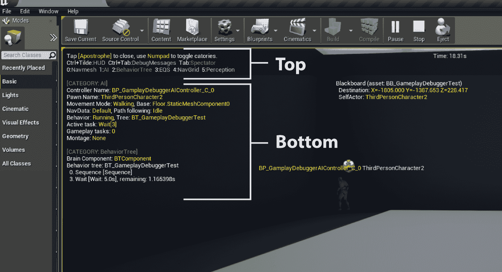

顶部部分是控制部分，显示哪些选项可用。特别是，它显示了哪些**扩展**可用，并突出显示底部部分显示的活动的**类别**：

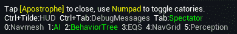

而底部部分，则显示每个选定**类别**的不同信息。以下是一些**类别**的示例：

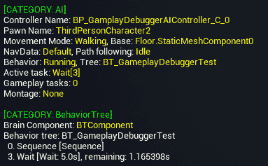

# 游戏调试器扩展

如您在以下屏幕截图中所见，**游戏调试器**只有两个默认**扩展**和一个内置扩展：

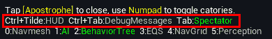

以下为默认扩展和内置扩展：

+   **观众扩展**允许你在游戏运行时（游戏进行时）将控制权从**玩家角色**分离出来，并控制一个**观众角色**，这样你就可以自由地在关卡上飞行并拥有外部视角。任何时候，你都可以通过切换**观众扩展**或关闭**游戏调试器**来重新获得对**玩家角色**的控制权。切换**观众扩展**的默认键是**Tab**键。

+   **HUD 扩展**允许你切换**HUD**的开启和关闭（特别是包含在**游戏模式**实例中的**HUD**类）。切换**HUD 扩展**的默认键是*Ctrl + Tilde*。

+   **调试消息**是**内置扩展**，正如其名称所示，它切换调试消息。默认键是*Ctrl* + *Tab*。

# 游戏调试器类别

**游戏调试器**被分为不同的类别，可以通过使用**键盘（或数字键盘）**来启用和禁用（而不仅仅是键盘上的数字）。

如果你没有**键盘/数字键盘**（例如，你正在使用小型笔记本电脑），在本章的后面，你将找到**游戏调试器**的设置，你可以更改键绑定，使其与你的键盘相匹配。

**类别**旁边的数字表示其默认位置（以及需要在**键盘**上按下的数字以激活它）。然而，这可以在设置中稍后更改。

为了探索**类别**，我创建了一个简单的测试地图，其中应该包含一些内容，这样我们就可以看到所有**游戏调试器**类别在实际操作中的表现。这个测试地图包含在本书的关联项目文件中。

# 类别 0 – 导航网格

第一个类别是**导航网格**，默认分配给“*`0`*”键。

一旦切换，你将能够直接在地图上看到**导航网格**——就这么简单。当你需要实时检查**导航网格**时，这非常有用，尤其是如果你有动态障碍物，那么**导航网格**将在运行时重建。

当此类别启用时，它看起来是这样的：

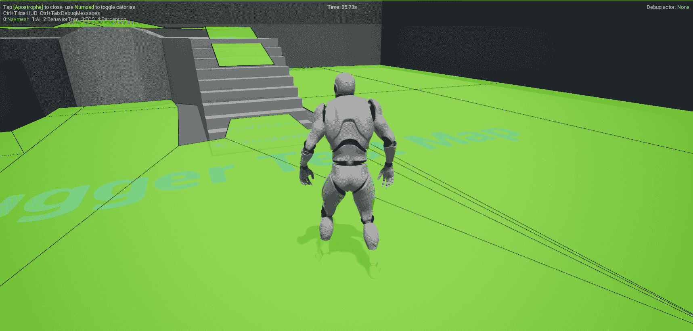

这是输出截图。其他（模糊显示）的信息在这里并不重要

# 类别 1 – AI

此类别一旦启用，就会显示有关所选 AI 的大量信息。默认情况下，它分配给“*`1`*”键。

如果没有选择演员，这个类别将不会显示任何信息。然而，它将突出显示具有其隶属关系的可用 AI（在 3D 空间中）。

当切换类别（并选择**调试演员**）时，它看起来如下：

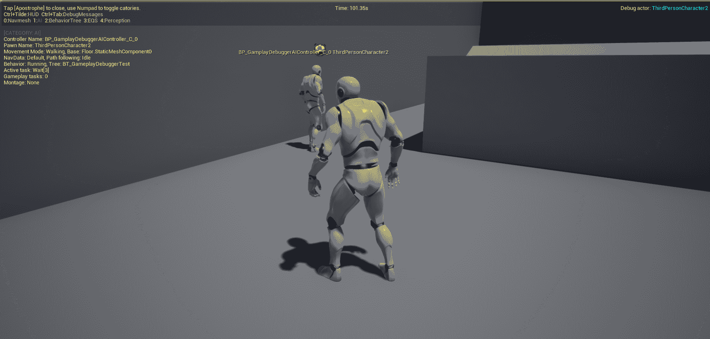

这是输出截图。其他（模糊显示）的信息在这里并不重要

在此类别中，地图上的所有 AI 及其所属关系（在 3D 空间中）都会显示出来，并且选定的**调试演员**也显示了控制器的名称（始终在 3D 空间中）。然而，直接显示在屏幕上的信息是单个**调试演员**的信息。

以下是该类别显示的信息类型（带有**类别信息**的特写）：

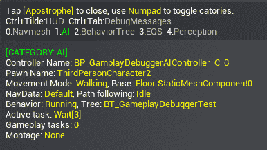

+   **控制器名称**：此部分显示拥有此**Pawn**的**AI 控制器**的名称。

+   **Pawn 名称**：此部分显示当前被**AI**拥有的**Pawn**的名称。

+   **移动模式**：如果 Pawn 附加了**角色移动组件**，则此部分显示当前的移动模式（例如行走、跑步、游泳、飞行、下落等…）

+   **基础**：如果 Pawn 附加了**角色移动组件**，则此部分显示角色站立的基础。在行走或跑步的情况下，这是 AI 当前行走或跑步的地面网格。在下落的情况下，这是“*无*”。

+   **NavData**：此部分显示 AI 当前正在使用的**NavData**。最可能的情况是，值将是“*默认*”，除非您通过 C++为 AI 角色指定了特定的**NavData**。

+   **路径跟随**：当 AI 角色移动时，此部分显示要跟随的路径的状态。还会显示诸如**点积**、**2D 距离**和**Z 距离**等信息。以下是一个角色移动时的示例：

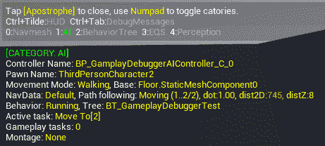

+   **行为**：此部分指示是否有行为正在运行（例如，此**AI 控制器**上是否正在运行**行为树**？）。

+   **树**：此部分指示 AI 当前正在运行的**行为树**（如果正在运行行为）。

+   **活动任务**：此部分指示当前正在执行的**行为树任务**，以及**任务编号**（该任务在树中的顺序编号）。

有关**行为树类别**中当前任务的更多信息，请参阅下一节。

+   **游戏任务**：此部分显示当前分配给此 AI 的**游戏任务**数量。

+   **蒙太奇**：此部分显示角色当前正在播放的**蒙太奇**（如果有的话）。

尽管我们在这本书中没有涉及这个话题，但同步 AI 动作与动画是 AI 程序员和动画师之间的中间地带。

值得注意的是，如果 AI 正在移动，即使**导航网格**类别没有切换，它也会显示 AI 当前用于导航的**导航网格**的一部分，如下面的截图所示：

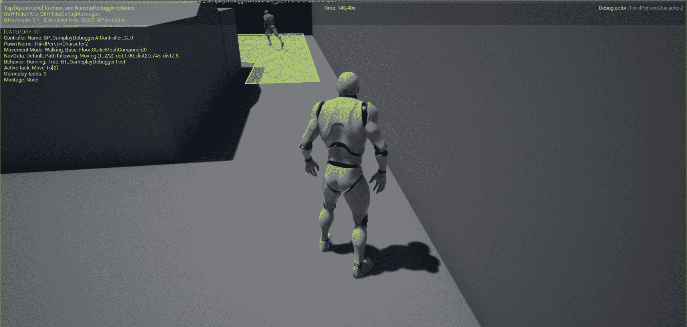

这是输出截图。其他（模糊）信息在此处不重要。

# 类别 2 – **行为树**

此类别显示关于当前正在 AI 上运行的***行为树***的信息。默认情况下，它被分配给“*`2`*”键。

如果没有运行 *行为树*，则此部分将不会显示任何内容。

当激活时，***行为树分类*** 看起来如下：

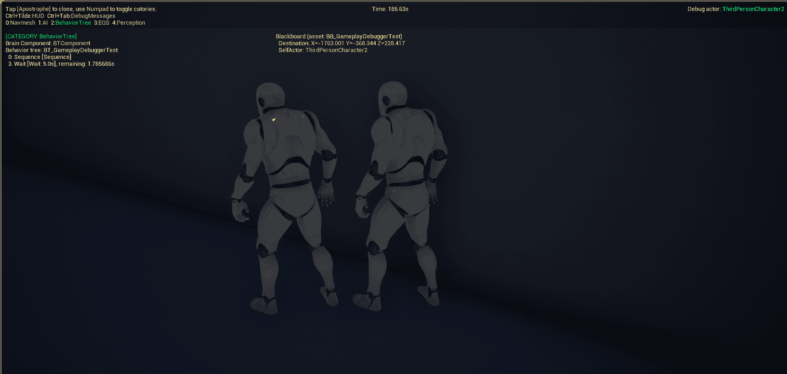

这是一张输出截图。其他（模糊处理）的信息在这里并不重要

这个分类仅显示屏幕上的信息（所以在 3D 空间中没有显示）。特别是，它在左侧显示了以下信息：

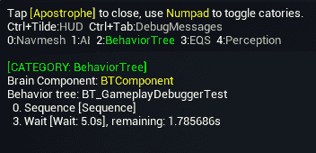

+   **大脑组件**：这显示了当前 AI 控制器正在使用的哪种类型的 *大脑组件*，它将是 *BTComponent* 类型。

由于 Unreal 是以 *模块化* 为目标开发的，所以任何可以包含 AI 逻辑的东西都可以称为 *大脑组件*。在撰写本文时，唯一的内置 *大脑组件* 是 *行为树* (*BTComponent*)。

+   **行为树**：这是 AI 正在使用的 *行为树* 的名称。

+   **任务树**：在 *行为树* 属性之后，显示了当前正在执行的所有任务分支。这是从根节点（包含所有节点名称及其相应的编号）到 AI 正在执行的任务的路径。

这非常有用，当你需要了解为什么选择了特定的任务，而不是另一个任务，可以通过沿着树路径跟踪来理解。

在右侧，相反，显示了正在使用的 *黑板* 资产的名称。在此之下，是正在使用的 *黑板* 的键及其当前值：

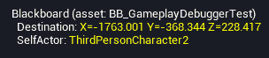

以下示例显示了两个 *黑板键*，*目的地* 和 *Self Actor*。尝试在 *设计行为树项目* 中测试 *游戏调试器*，以查看更多内容并获得更好的感觉，因为你已经从零开始构建了这些结构。以下是你将看到的一瞥：

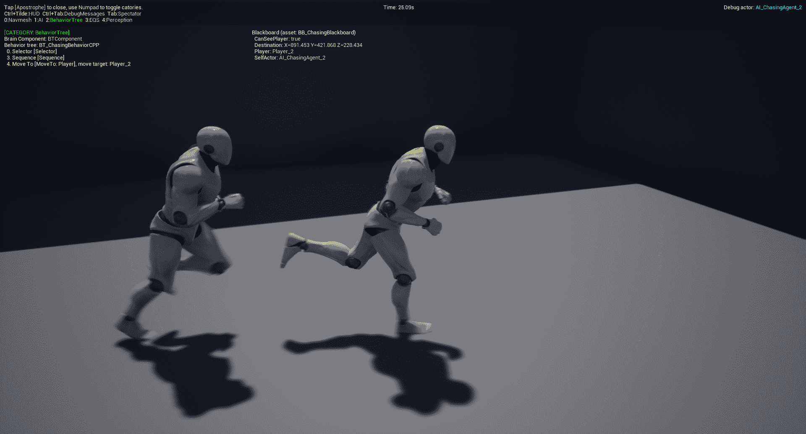

这是一张输出截图。其他（模糊处理）的信息在这里并不重要

当然，当你想要测试 *黑板* 中是否设置了正确的值时，这非常有用。

这里有一个更多示例，展示了角色移动的情况：

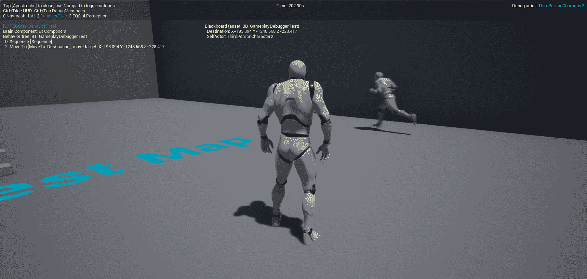

这是一张输出截图。其他（模糊处理）的信息在这里并不重要

# 分类 3 – EQS

这个分类显示了 AI 当前正在执行的 ***环境查询***。默认情况下，它被分配到 "*`3`*" 键。

如果 AI 没有执行任何 *环境查询*，那么这个分类将只显示查询数量为零。

当 ***EQS 分类*** 被激活时，屏幕上会得到以下输出：

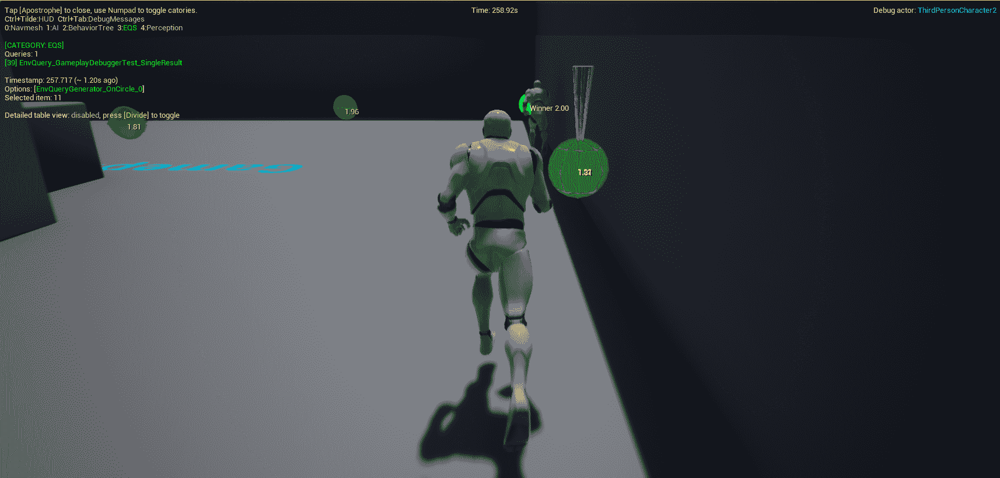

这是一张输出截图。其他（模糊处理）的信息在这里并不重要

从先前的截图中，我们可以看到这个*类别*突出了查询生成的不同点及其得分。根据查询的*运行模式*，可以看到哪个点是获胜者（它有最高的得分，其颜色比其他颜色更亮）。

此外，一个点上面的红色箭头表示它已被选中（这意味着它是你正在查看的最近的一个点）。这很有用，因为在侧面的信息显示中，你可以检查这个特定的点在排行榜上的排名位置。

在旁边，你可以找到关于查询的一些额外信息：

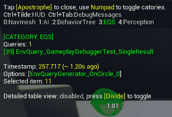

特别是，以下信息被显示：

+   ***查询***：这是*调试演员*正在运行的查询数量。

+   ***查询名称和运行模式***：这显示了哪个*查询*已被（或目前正在执行）。然后，在下划线之后，它显示了*运行模式*（在先前的截图中，它是*单个结果*）。

+   ***时间戳***：这是*查询*被执行的时间戳，以及它发生的时间。

+   ***选项***：这显示了查询的*生成器*。

+   ***所选项目***：这显示了所选项目在排行榜中的*位置/排名*。在先前的截图中，我们选择的项目在排行榜上是第 11 位（从全屏截图可以看到，它的得分为*1.31*，而获胜点的得分为*2.00*）。这对于检查你正在查看的点是如何排名的非常有用，因为它能快速给出这些点之间相对分数的概念。

请记住，当一个点被排名时，***排名从零开始***，因此***获胜点排名为 0***。所以，在先前的截图中，"*所选项目：11*"意味着它在排行榜上是第 11 位，但它是在列表中的第 12 个点。

为了方便起见，这里还有一个例子，其中所选点是获胜点（注意它的排名是 0）：

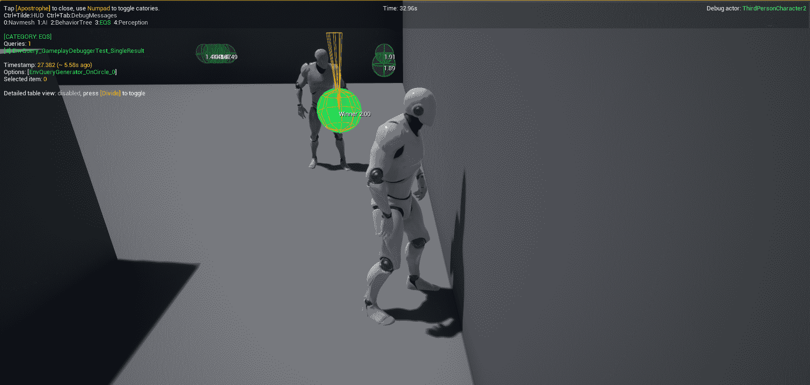

这是一张输出结果的截图。其他（被模糊处理）的信息在这里并不重要

# 类别 4 – 感知

这个类别显示了关于所选*AI 代理*的*感知*信息。默认情况下，它被分配给"*`4`*"键，也就是说，除非"*导航网格*"类别被启用；在这种情况下，默认键是"*`5`*"。

如果没有选择任何演员，这个类别不会显示任何内容。

当激活时，***感知类别***显示如下：

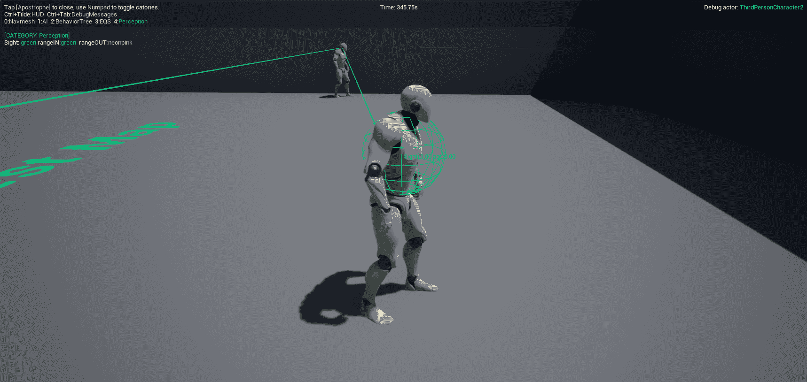

这是一张输出结果的截图。其他（被模糊处理）的信息在这里并不重要

在屏幕上，这个类别显示了所有已实现的感官，以及它们的调试颜色。然后，每个感官可以根据其`DescribeSelfToGameplayDebugger()`函数的实现显示额外的信息。例如，在视觉的情况下，有**RangeIn**和**RangeOut**的调试颜色，如下面的截图所示：

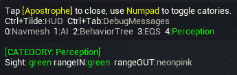

在关卡中，您将能够看到特定感官的刺激物以球形呈现（包括感官名称、刺激强度和刺激物的年龄，当为视觉时年龄为零）。然后，有一条线连接到每个*刺激物*，如果目标不在视线范围内，还有一条线连接到单个*刺激物*和目标（例如*玩家*）。这是在视觉情况下的显示方式：

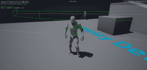

这是一张输出截图。其他（被模糊处理）的信息在这里并不重要。

为了展示当目标（例如*玩家*）不在视线范围内时的情况，因此*刺激物*的年龄大于零，并且可以看到连接*刺激物*到目标的黑色线条，这里还有另一张截图：

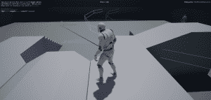

这是一张输出截图。其他（被模糊处理）的信息在这里并不重要。

如果我们还要添加*听觉*感官，这将是这样显示的：

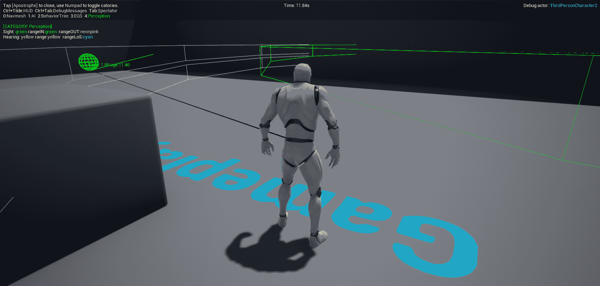

这是一张输出截图。其他（被模糊处理）的信息在这里并不重要。

请注意，*听觉感官*（黄色）在*视觉感官*的不同级别（z 轴）上显示。因此，即使我们具有相同的值，例如在前面的截图中，两者都有 1500 的范围，它们也会很好地叠加。

当然，侧面的信息提供了更多关于在游戏世界中显示的调试颜色的信息：

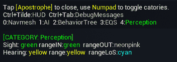

# 导航网格类别

根据您的设置，您可能已经启用了***导航网格***类别，这与*导航网格*类别不同。

这个*类别*应该处理网格移动，这是我们在这本书中没有涉及到的。然而，如果您在我们的示例地图中激活这个*类别*，它只会显示源的数量为零：

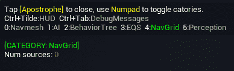

# 屏幕上的多个类别

我们已经看到了每个类别是如何单独表现的。然而，为了明确起见，您可以在显示上拥有尽可能多的类别。这意味着您可以同时显示多个类别。实际上，通常您需要同时看到多个系统：

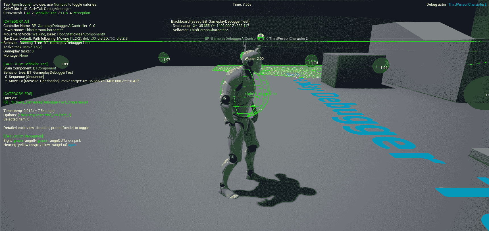

这是一张输出截图。其他（被模糊处理）的信息在这里并不重要。

我个人非常喜欢 *Gameplay Debugger* 的一个地方是，一旦您掌握了它，即使有这么多 *Categories* 打开，信息也不会使屏幕显得拥挤，并且显示得很好。

# 更多类别

虽然看起来我们已经走过了所有不同的 *Categories*，但实际上我们还没有。事实上，引擎中内置了一些额外的 *Gameplay Debugger Categories*，例如与 *HTN Planner* 或 *Ability System* 相关的类别。

很遗憾，它们超出了本书的范围，但您可以在 C++ 中搜索它们。您可以通过在 *Engine Source* 中搜索 ***GameplayDebuggerCategory*** 来开始您的搜索，以了解更多相关信息。

# Gameplay Debugger 设置

正如我们之前提到的，您可以通过更改其设置来配置 *Gameplay Debugger*。

如果您导航到 ***Project Settings***，您可能会找到一个专门针对 *Gameplay Debugger* 的部分，如下面的截图所示：

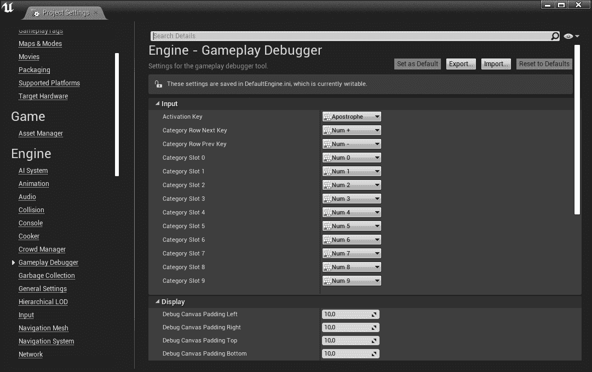

***Input*** 标签允许您覆盖打开和关闭 *Gameplay Debugger*（默认是 " '" 引号键）以及触发不同类别（默认为 *keypad/numpad* 上的 0 到 9 的数字）的默认键：

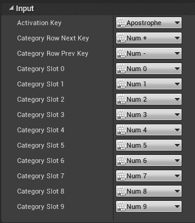

***Display*** 标签允许您定义一些填充，以便您可以显示有关 *Gameplay Debugger* 的信息。通过这样做，您不需要将其附加到屏幕上。默认值都是 *10*：

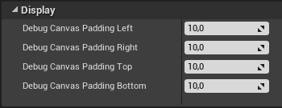

***Add-Ons tab*** 允许您为 ***Categories***（当类别默认启用时，以及它关联的键/数字）和 ***Extension***（覆盖它们的输入键）配置单个设置：

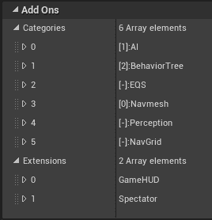

对于 *Category* 的 "-1" 值意味着该 *number/position/key* 已由编辑器分配，因为此 *Category* 没有在屏幕上的 "*preference*" 位置。

# 扩展 Gameplay Debugger

到目前为止，我们已经看到所有不同的 ***Gameplay Debugger*** 类别如何帮助我们理解我们的 *AI Character* 的行为。然而，如果我们能有一个自己的类别来可视化我们为游戏开发的定制（子）系统的数据，那岂不是很棒？

答案是肯定的，本节将解释如何做到这一点。

请记住，这个工具被称为 ***Gameplay Debugger***，因此您不仅可以扩展它用于 AI，还可以用于游戏中的任何事物，特别是与 *Gameplay* 相关的事物（因为它是一个实时工具，用于可视化信息）。到目前为止，它已被广泛用于 AI，但它有潜力用于其他任何事物！

正如我们已经看到的，***Gameplay Debugger*** 被分为 ***Categories*** 和 ***Extensions***。

首先，我们将更详细地探讨如何创建一个***自定义类别***，从为它创建一个独立的模块开始，包括我们需要的所有依赖项和编译器指令。我们将看到我们如何创建控制***类别***的类，以及我们如何将其注册到*游戏调试器*。结果，我们将拥有一个完全功能的***游戏调试类别***，它将在屏幕上打印我们的*调试 Actor*的位置：

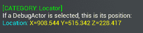

最后，我们将探讨如何为***游戏调试器***创建一个***自定义扩展***，当按下特定键时，它将能够打印玩家的位置。

有了这些，让我们开始创建一个新的*插件*！

# 使用新插件创建模块

要通过一个新的***类别***扩展***游戏调试器***，您需要在您的游戏中创建一个新的模块。实际上，引擎是由不同的模块组成的，您的游戏也是如此（通常，游戏只是一个模块，尤其是如果游戏很小；在您使用 C++开始一个新项目时，游戏只是一个模块，所以如果您需要，您将需要添加更多）。

我们有几种创建模块的方法，我不会深入讲解模块的工作原理以及如何为您的项目创建一个模块。相反，我将指导您如何设置一个用于运行新的***游戏调试类别***的自定义模块。

创建另一个模块最简单的方法是创建一个插件。因此，代码被从我们的游戏的其他部分分离出来，这既有好的一面也有不好的一面。然而，我们不会在本节中讨论这一点。相反，我将向您展示如何创建一个自定义的***游戏调试类别***，然后您可以根据自己的需求进行适配。

让我们从打开***插件***菜单开始，从*视口*顶部的***设置***菜单按钮，如下面的截图所示：

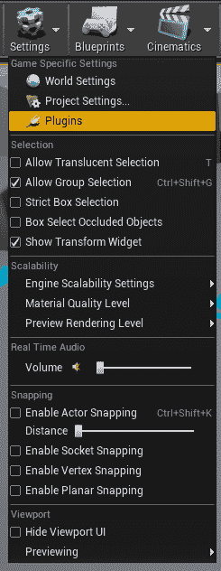

一旦打开***插件***窗口，您需要点击右下角的“新建插件”按钮：

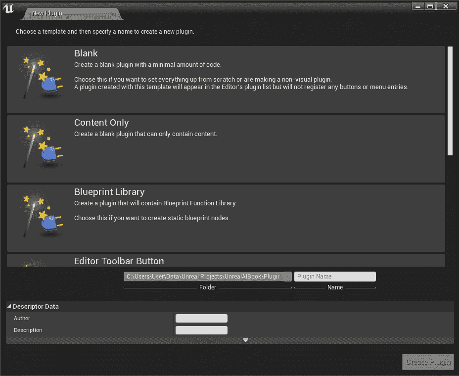

这不是创建*插件*的唯一方法，但这是最快的，因为 Unreal 包含一个简单的向导来创建不同模板的*插件*。

因此，我们将打开***新插件***窗口，这是一个用于创建新插件的向导：


我们需要选择空白模板（因为我们只想加载一个基本的模块）。然后，我们可以填写*名称*，在我们的例子中是***GameplayDebugger_Locator***。接下来，有输入字段需要填写您的插件：*作者*和*描述*。我将自己作为*作者*，在描述中插入"*一个用于可视化 Actor 位置的定制游戏调试类别*"。这就是现在屏幕应该看起来像的样子：

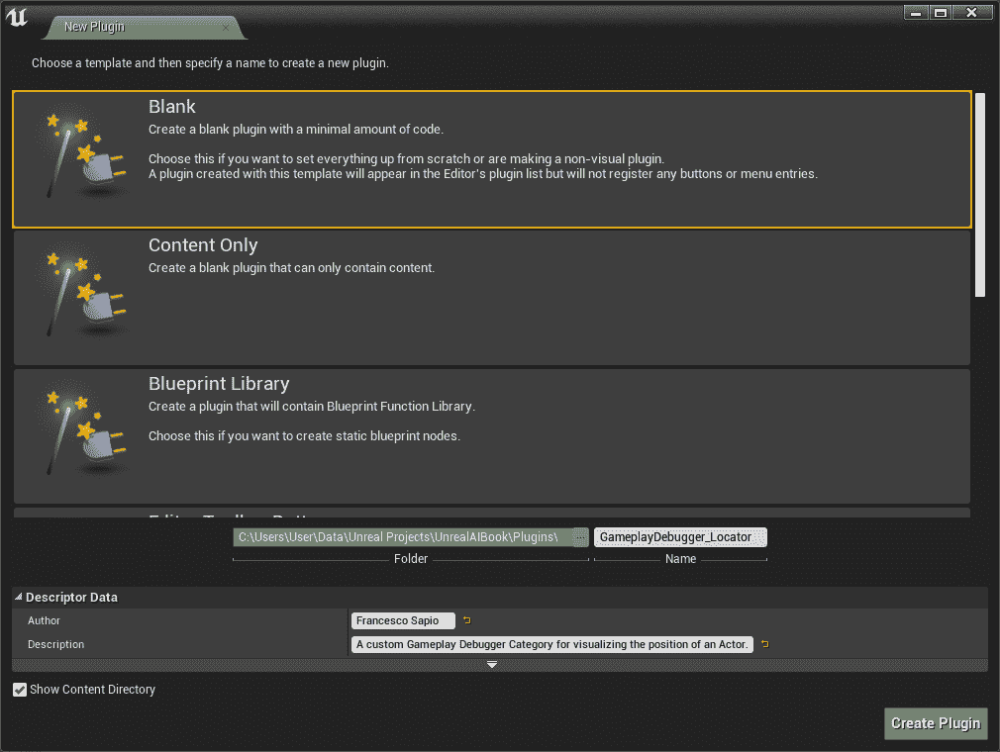

点击创建插件，我们的插件将被创建。这可能需要一些时间来处理，所以请耐心等待：

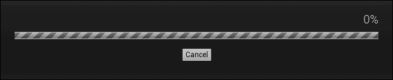

一旦编译完成，你将拥有 *Plugin* 的基本结构和代码作为一个单独的模块。你可以在 *Visual Studio* 中查看它。在 *Plugins* 文件夹下，你应该有以下结构：

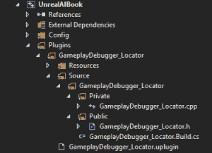

此外，如果你回到 *Plugin* 窗口，你将能够看到我们的 *Plugin*（并确保它已启用）：

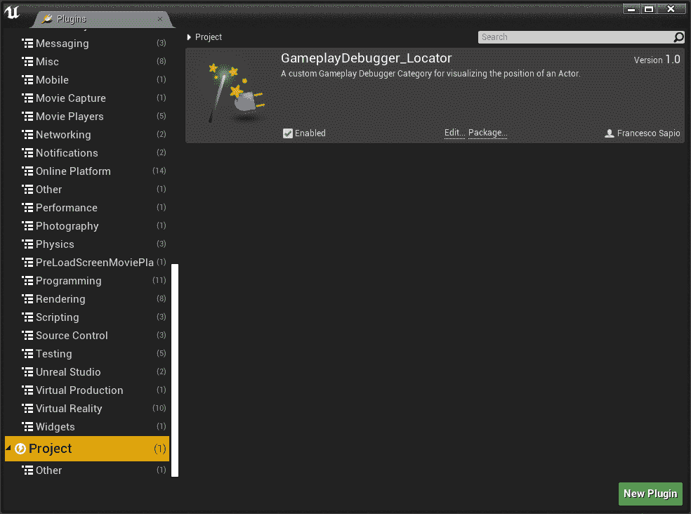

当然，你可以自由地 "*编辑*" 插件，例如，更改其图标或类别。

# 设置模块以与 Gameplay Debugger 一起工作

在我们为 *Gameplay Debugger* 的新类别添加代码之前，有一些考虑事项需要考虑。

首先，正如其名所示，*Gameplay Debugger* 是一个调试工具。这意味着它不应该与游戏一起发布。因此，如果我们正在编译一个发布版本的游戏，我们需要一种方法来去除所有与 *Gameplay Debugger* 相关的代码。当然，我们正在创建的 *Plugin* 只包含 *Gameplay Debugger* 的代码，但在你的游戏中，它更有可能存在于一个更广泛的环境中。

要去除代码，你需要违反一个可以与编译宏一起使用的编译变量；然而，我们只想在游戏未发布时将此变量定义为真（值等于一）。为了实现这一点，我们需要导航到我们的插件 ***.build.cs*** 文件。在我们的例子中，它被称为 ***GameplayDebugger_Locator.build.cs***，你可以在 *Visual Studio*（或你选择的代码编辑器）中找到它，位于我们的 *Plugin* 文件夹的层次结构中。实际上，Unreal 在编译前运行一些工具（例如，生成反射代码和替换 C++ 代码中的宏），这些工具是用 C# 编写的。因此，我们可以用一段 C# 代码来修改它们的行为。

一旦打开文件，你将找到一个函数，该函数定义了模块的不同依赖项。在此函数的末尾添加以下代码：

```py
        //Code added for a Custom Category of Gameplay Debugger
        if (Target.bBuildDeveloperTools || (Target.Configuration != UnrealTargetConfiguration.Shipping && Target.Configuration != UnrealTargetConfiguration.Test)) {
            PrivateDependencyModuleNames.Add("GameplayDebugger");
            Definitions.Add("WITH_GAMEPLAY_DEBUGGER=1");
        } else {
            Definitions.Add("WITH_GAMEPLAY_DEBUGGER=0");
        }
```

这是一个检查 ***BuildDeveloperTools*** 是否为真或目标配置（我们将用其编译 C++ 代码的配置）是否不同于 ***Shipping*** 或 ***Test*** 的 if 语句。如果这个条件得到验证，那么我们为这个模块添加一个 ***Private Dependency***，即 ***GameplayDebugger*** 模块，并将 `WITH_GAMEPLAY_DEBUGGER` 变量定义为真（用于编译 C++ 代码）。否则，我们只声明 `WITH_GAMEPLAY_DEBUGGER` 变量为假。

因此，我们能够使用编译器指令中的 `WITH_GAMEPLAY_DEBUGGER` 变量来包含或排除（取决于我们正在构建哪种配置）与 ***游戏调试器*** 相关的特定代码。所以，从现在开始，当我们为我们的 ***游戏调试器*** 类别编写代码时，不要忘记将其包裹在以下编译器指令中：

```py
#if WITH_GAMEPLAY_DEBUGGER
    //[CODE]
#endif
```

# 创建一个新的游戏调试器类别

下一步是为我们的 ***游戏调试器类别*** 创建一个新的类。

如同往常，我们可以创建一个新的 C++ 类，但这次，我们将选择 ***None*** 作为父类（我们将自己编写类并手动实现继承）：

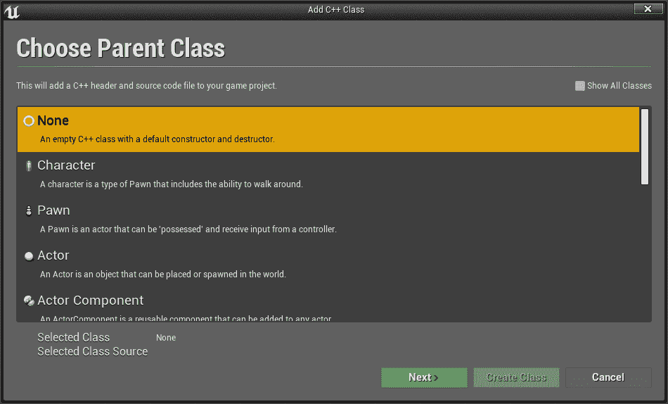

然后，我们可以将其重命名为 ***GameplayDebuggerCategory_Locator***（遵循以 *GameplayDebuggerCategory_* 开头类名的约定，后跟 *类别名称*）。现在，请小心选择正确的模块；在模块名称旁边，你可以选择该类所属的模块。到目前为止，我们一直只使用一个模块，所以没有这个问题。你需要选择 ***GameplayDebugger_Locator (Runtime)*** 模块，如下面的截图所示：

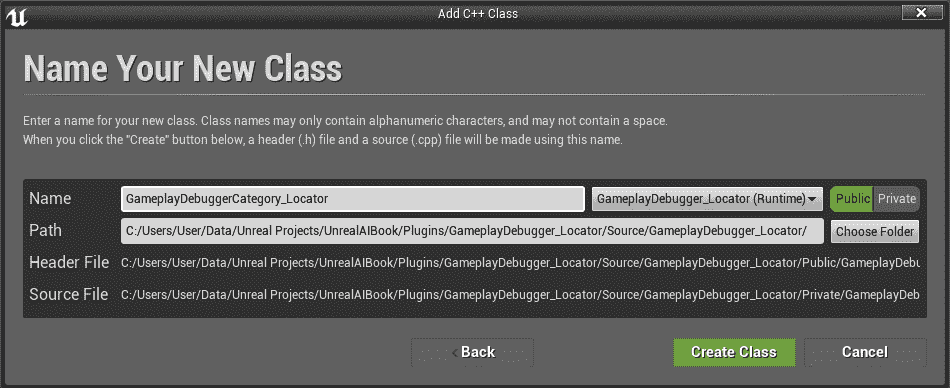

创建类，并等待它被添加到我们的 *插件* 中。

现在，是时候开始积极创建我们的类了。进入我们新创建的类的头文件（`.h` 文件）并删除所有内容。我们将首先包含引擎最小核心，然后在 `#if WITH_GAMEPLAY_DEBUGGER` 编译器指令中，我们还将包含 `GameplayDebuggerCategory.h` 文件，因为它是我们的父类：

```py
#pragma once

#include "CoreMinimal.h"

#if WITH_GAMEPLAY_DEBUGGER

#include "GameplayDebuggerCategory.h"

*//[REST OF THE CODE]*

#endif
```

然后，我们需要创建类本身。遵循约定，我们可以将类重命名为与文件名相同的名称，***FGameplayDebuggerCategory_Locator***，并使其继承自 ***FGameplayDebuggerCategory***：

```py
class FGameplayDebuggerCategory_Locator : public FGameplayDebuggerCategory
{
 *//[REST OF THE CODE]*
};
```

*游戏调试器* 是一个强大的工具，因此它具有许多功能。其中之一是它支持复制的功能。因此，我们需要设置一个支持该功能的结构。如果你打开其他 *游戏调试器类别* 的源文件（来自引擎），你会看到它们遵循声明一个名为 ***FRepData*** 的受保护结构的约定。在这个结构中，我们声明了所有我们需要可视化的变量。在我们的例子中，我们只需要一个字符串，我们将称之为 ***ActorLocationString***。此外，这个结构需要有序列化的方式，因此我们需要添加 `void Serialize(FArchive& Ar)` 函数，或者至少它的声明。最后，我们可以在 "*受保护*" 下创建一个名为 ***DataPack*** 的 ***FRepData*** 类型的变量，如下面的代码所示：

```py
protected:
  struct FRepData
  {
    FString ActorLocationString;

    void Serialize(FArchive& Ar);
  };

  FRepData DataPack;
```

接下来，我们需要重写一些公共函数以使我们的类别工作。这些函数如下：

+   ***构造函数***: 这设置了类的初始参数，并将为 *DataPack* 设置数据复制。

+   ***MakeInstance()***: 这将创建此类的一个实例（使用共享引用）。当我们稍后注册我们的类别时，*Gameplay Debugger* 需要这个操作（这意味着我们将将其添加到编辑器中）。

+   ***CollectData()***: 这收集并存储我们想要显示的数据，然后将其存储在 *DataPack*（可以复制）中。它作为输入（以便我们可以使用它），*Player Controller*，以及 ***DebugActor***（如果可用），这是我们已在 *Gameplay Debugger* 中设置的焦点 Actor（记住，当我们分析特定角色的行为时，我们选择了特定的角色；在这里，幕后，它作为参数传递给 `CollectData()` 函数）。

+   ***DrawData()***: 这将在屏幕上显示数据；我们将使用 *DataPack* 变量来检索在 `CollectData()` 函数中收集的数据。它作为输入（以便我们可以使用它），*Player Controller*，以及 ***CanvasContext*** 提供，这是我们将在屏幕上实际显示数据的工具。

现在，我们可以在我们的头文件（`.h`）文件中声明它们：

```py
public:

  FGameplayDebuggerCategory_Locator();

  static TSharedRef<FGameplayDebuggerCategory> MakeInstance();

  virtual void CollectData(APlayerController* OwnerPC, AActor* DebugActor) override;

  virtual void DrawData(APlayerController* OwnerPC, FGameplayDebuggerCanvasContext& CanvasContext) override;
```

这就完成了我们在头文件（`.h`）文件中需要的内容。为了方便起见，以下是头文件（`.h`）文件的完整代码：

```py
#pragma once
#include "CoreMinimal.h"
#if WITH_GAMEPLAY_DEBUGGER
#include "GameplayDebuggerCategory.h"
class FGameplayDebuggerCategory_Locator : public FGameplayDebuggerCategory
{
protected:
  struct FRepData
  {
    FString ActorLocationString;
    void Serialize(FArchive& Ar);
  };
  FRepData DataPack;
public:
  FGameplayDebuggerCategory_Locator();
  static TSharedRef<FGameplayDebuggerCategory> MakeInstance();
  virtual void CollectData(APlayerController* OwnerPC, AActor* DebugActor) override;
  virtual void DrawData(APlayerController* OwnerPC, FGameplayDebuggerCanvasContext& CanvasContext) override;
};
#endif
```

下一步是编写实现。因此，打开 `.cpp` 文件，如果尚未这样做，清除所有内容，以便你可以从头开始。

再次，我们需要包含一些头文件。当然，我们需要包含我们自己的类头文件（我们刚刚编辑的头文件）。然后，在 `#if WITH_GAMEPLAY_DEBUGGER` 编译器指令下，我们需要包含 *Actor* 类，因为我们需要检索 *Actor* 的位置：

```py
#include "GameplayDebuggerCategory_Locator.h"

#if WITH_GAMEPLAY_DEBUGGER
#include "GameFramework/Actor.h"

*//[REST OF THE CODE]*

#endif
```

现在，我们可以开始实现所有我们的函数。我们将从主类的 ***构造函数*** 开始。在这里，我们可以设置 *Gameplay Debugger Category* 的默认参数。

例如，我们可以将 **bShowOnlyWithDebugActor** 设置为 ***false***，正如其名称所暗示的，这允许即使我们没有选择 *Debug Actor*，此类别也可以显示。实际上，即使我们的 *Category* 需要使用 *DebugActor* 来显示其位置，我们仍然可以打印其他信息（在我们的情况下，我们将进行简单的打印）。当然，当你创建你的类别时，你可以决定这个布尔值是否为真。

然而，更重要的是通过 `SetDataPackReplication<FRepData>(&DataPack)` 函数设置我们的 ***DataPack*** 变量以进行复制：

```py
FGameplayDebuggerCategory_Locator::FGameplayDebuggerCategory_Locator()
{
  bShowOnlyWithDebugActor = false;
  SetDataPackReplication<FRepData>(&DataPack);
}
```

接下来，我们需要实现我们的 `Serialize()` 函数，用于我们的 ***RepData*** 结构。由于我们只有一个字符串，其实现相当简单；我们只需要将 *String* 插入到 *Archive* 中：

```py
void FGameplayDebuggerCategory_Locator::FRepData::Serialize(FArchive& Ar) {
  Ar << ActorLocationString;
}
```

要将这个***类别***注册到*游戏调试*中，我们必须实现`MakeInstance()`函数，该函数将返回一个对这种***类别***实例的共享引用。因此，这里的代码也很简单；只需创建一个新的实例作为共享引用并返回值：

```py
TSharedRef<FGameplayDebuggerCategory> FGameplayDebuggerCategory_Locator::MakeInstance()
{
  return MakeShareable(new FGameplayDebuggerCategory_Locator());
}
```

我们还有两个函数需要实现。前者收集数据，而后者显示数据。

`CollectData()`函数已经将*调试演员*作为参数传递。因此，在我们验证引用有效后，我们可以检索*调试演员*的位置并将其分配到包含在***DataPack***变量中的*FRepData*结构体内部的***ActorLocationString***变量中。这比解释更容易展示：

```py
void FGameplayDebuggerCategory_Locator::CollectData(APlayerController * OwnerPC, AActor * DebugActor)
{
  if (DebugActor) {
    DataPack.ActorLocationString = DebugActor->GetActorLocation().ToString();
  }
}
```

当然，在`CollectData()`函数中，你可以运行任何逻辑来检索你自己的数据。只需记住将其存储在***DataPack***变量中，它是***FRepData***结构的指针，它可以像你喜欢的那么复杂（并且记得也要序列化它）。

最后，`DrawData()`函数负责实际显示我们收集到的信息。特别是，我们有一个对***画布上下文***的引用，我们将用它来"*打印*"信息。我们甚至有一些格式化选项，例如通过在文本前加上"*{颜色}*"来给文本上色。

首先，我们将打印一些文本，然后打印*调试演员*的位置（如果有的话）。我们也会使用颜色，所以让我们了解一下如何使用它们：

```py
void FGameplayDebuggerCategory_Locator::DrawData(APlayerController * OwnerPC, FGameplayDebuggerCanvasContext & CanvasContext)
{
  CanvasContext.Printf(TEXT("If a DebugActor is selected, here below is its location:"));
  CanvasContext.Printf(TEXT("{cyan}Location: {yellow}%s"), *DataPack.ActorLocationString);
}
```

这是我们实现（`.cpp`）文件中的最后一个函数。为了方便起见，这里是有整个文件的内容：

```py
#include "GameplayDebuggerCategory_Locator.h"

#if WITH_GAMEPLAY_DEBUGGER
#include "GameFramework/Actor.h"

FGameplayDebuggerCategory_Locator::FGameplayDebuggerCategory_Locator()
{
  bShowOnlyWithDebugActor = false;
  SetDataPackReplication<FRepData>(&DataPack);
}

void FGameplayDebuggerCategory_Locator::FRepData::Serialize(FArchive& Ar) {
  Ar << ActorLocationString;
}

TSharedRef<FGameplayDebuggerCategory> FGameplayDebuggerCategory_Locator::MakeInstance()
{
  return MakeShareable(new FGameplayDebuggerCategory_Locator());
}

void FGameplayDebuggerCategory_Locator::CollectData(APlayerController * OwnerPC, AActor * DebugActor)
{
  if (DebugActor) {
    DataPack.ActorLocationString = DebugActor->GetActorLocation().ToString();
  }
}

void FGameplayDebuggerCategory_Locator::DrawData(APlayerController * OwnerPC, FGameplayDebuggerCanvasContext & CanvasContext)
{
  CanvasContext.Printf(TEXT("If a DebugActor is selected, here below is its location:"));
  CanvasContext.Printf(TEXT("{cyan}Location: {yellow}%s"), *DataPack.ActorLocationString);
}

#endif
```

现在，我们有了*游戏调试类别*，但我们需要将其***注册***到*游戏调试*中。所以，无需多言，让我们直接进入下一节。

# 注册游戏调试类别

在上一节中，我们创建了一个*游戏调试类别*，但现在我们需要将其***注册***到*游戏调试*中。

做这件事的最简单方法是在我们模块的`StartupModule()`函数内部注册类别，所以让我们打开`GameplayDebugger_Locator.cpp`文件。

我们需要做的第一件事是包含*游戏调试模块*，以及我们创建的*游戏调试类别*。我们需要用`#if WITH_GAMEPLAY_DEBUGGER`编译指令将`#include`语句包围起来，如下面的代码所示：

```py
#if WITH_GAMEPLAY_DEBUGGER
#include "GameplayDebugger.h"
#include "GameplayDebuggerCategory_Locator.h"
#endif
```

在`StartupModule()`函数内部，我们需要检查*游戏调试器模块*是否可用，如果可用，则检索其引用。然后，我们可以使用这个引用通过`RegisterCategory()`函数注册我们的类别，该函数接受三个参数（*类别*的名称、创建类别实例的函数的引用以及一些枚举选项）。最后，我们需要通知更改。当然，再次强调，此代码由`#if WITH_GAMEPLAY_DEBUGGER`编译器指令包装：

```py
void FGameplayDebugger_LocatorModule::StartupModule()
{

#if WITH_GAMEPLAY_DEBUGGER

  if (IGameplayDebugger::IsAvailable())
  {
    IGameplayDebugger& GameplayDebugger = IGameplayDebugger::Get();

    GameplayDebugger.RegisterCategory("Locator", IGameplayDebugger::FOnGetCategory::CreateStatic(&FGameplayDebuggerCategory_Locator::MakeInstance), EGameplayDebuggerCategoryState::EnabledInGameAndSimulate);

    GameplayDebugger.NotifyCategoriesChanged();
  }

#endif
}
```

到目前为止，一切顺利，但当我们在一个模块中注册某些内容时，我们还需要在模块关闭时“***注销***”。因此，在`ShutdownModule()`函数中，我们需要执行与之前相同的步骤，但这次*注销*类别。首先，我们需要检查*游戏调试器模块*的有效性，然后检索它，*注销*类别，并通知更改。同样，代码再次由`#if WITH_GAMEPLAY_DEBUGGER`编译器指令包装：

```py
void FGameplayDebugger_LocatorModule::ShutdownModule()
{

#if WITH_GAMEPLAY_DEBUGGER

  if (IGameplayDebugger::IsAvailable())
  {
    IGameplayDebugger& GameplayDebugger = IGameplayDebugger::Get();

    GameplayDebugger.UnregisterCategory("Locator");

    GameplayDebugger.NotifyCategoriesChanged();
  }
#endif
}
```

为了您的方便，以下是文件的完整代码：

```py
#include "GameplayDebugger_Locator.h"

#if WITH_GAMEPLAY_DEBUGGER
#include "GameplayDebugger.h"
#include "GameplayDebuggerCategory_Locator.h"
#endif

#define LOCTEXT_NAMESPACE "FGameplayDebugger_LocatorModule"

void FGameplayDebugger_LocatorModule::StartupModule()
{

#if WITH_GAMEPLAY_DEBUGGER

  if (IGameplayDebugger::IsAvailable())
  {
    IGameplayDebugger& GameplayDebugger = IGameplayDebugger::Get();

    GameplayDebugger.RegisterCategory("Locator", IGameplayDebugger::FOnGetCategory::CreateStatic(&FGameplayDebuggerCategory_Locator::MakeInstance), EGameplayDebuggerCategoryState::EnabledInGameAndSimulate);

    GameplayDebugger.NotifyCategoriesChanged();
  }

#endif
}

void FGameplayDebugger_LocatorModule::ShutdownModule()
{

#if WITH_GAMEPLAY_DEBUGGER

  if (IGameplayDebugger::IsAvailable())
  {
    IGameplayDebugger& GameplayDebugger = IGameplayDebugger::Get();

    GameplayDebugger.UnregisterCategory("Locator");

    GameplayDebugger.NotifyCategoriesChanged();
  }
#endif
}

#undef LOCTEXT_NAMESPACE

IMPLEMENT_MODULE(FGameplayDebugger_LocatorModule, GameplayDebugger_Locator)
```

编译后，我们的代码就准备好了。此外，请确保*插件*已激活，然后关闭并重新打开编辑器（这样我们可以确保我们的模块已正确加载）。

让我们探索我们在虚幻中创建的内容是如何工作的。

# 可视化自定义游戏调试器类别

一旦我们重新启动了编辑器，我们的*插件*也会被加载，这意味着我们的***游戏调试器类别***也被加载了。要检查这一点，我们可以导航到*项目设置*下的*游戏调试器部分*。在这里，我们有所有配置*游戏调试器*的选项，包括已加载的类别。因此，如果我们向下滚动，我们应该能够找到我们的***定位器类别***，如下面的截图所示：

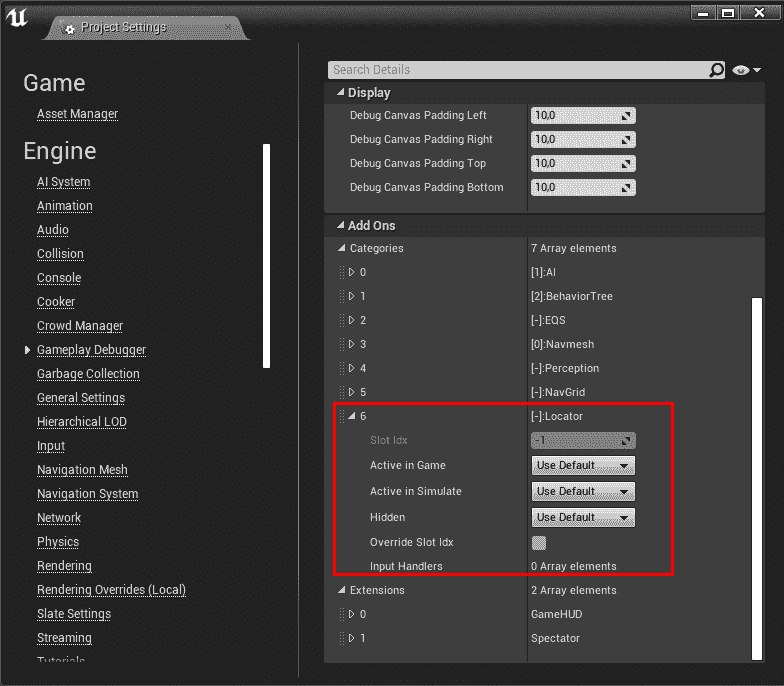

如您所见，所有选项都设置为“***使用默认设置***”，这是我们注册类别时传递第三个参数时设置的。然而，您也可以在这里覆盖它们（例如，确保它始终处于启用状态）。可选地，您可以更改触发此类别的键，或者如果您没有偏好，可以保留默认设置。*编辑器*将为您分配一个：


如果您在尝试加载带有游戏调试器的插件时遇到困难，您应该从虚幻的顶部菜单导航到***窗口 | 开发者工具 | 模块***。从这里，搜索我们的定位器模块，然后按如下截图所示按重新加载：

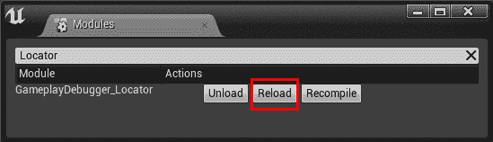

您可能需要每次加载编辑器时都这样做，以便使用您的类别和/或扩展。

现在，如果我们按下播放并激活*游戏调试器*，我们将看到我们的类别被列出（它可能默认处于激活或非激活状态，具体取决于您之前设置的设置）：

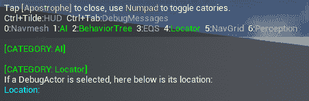

如果我们选择另一个演员，我们将能够看到**定位类别**将显示其位置：

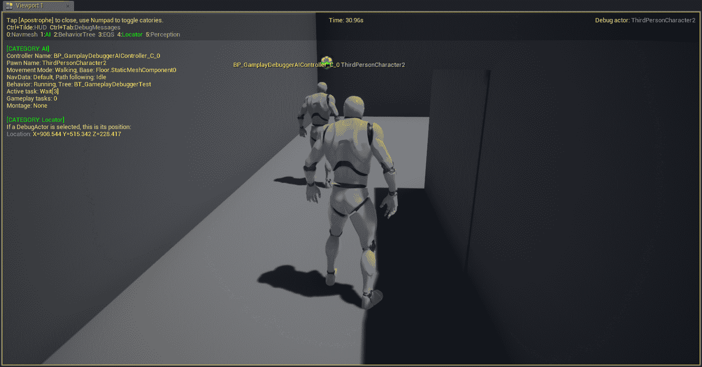

这是一张输出截图。其他（被模糊处理）的信息在这里并不重要。

这里是一个特写镜头：


这就结束了我们对创建**自定义游戏调试器类别**的讨论。当然，这是一个非常简单的例子，但你很容易想象这种工具的潜力以及它如何在你的项目工作流程中使用。

在我们结束这一章之前，正如我们之前提到的，让我们看看我们如何通过添加一个*扩展*来扩展*游戏调试器*。

# 为游戏调试器创建扩展

正如我们之前提到的，*游戏调试器*由*类别*（我们已经看到了如何创建一个自定义的）和**扩展**组成。再次强调，创建**扩展**仅限于 C++。

与*游戏调试器类别*一样，一个*扩展*需要存在于一个*自定义模块*上，但它可以是与*类别*（或*类别集*）相同的。因此，我将使用我们刚刚开发的相同插件。

特别是，我们将创建一个简单的扩展，当我们按下特定的键时，会在输出日志中打印玩家的位置。

# 扩展的结构

我们需要创建一个新的 C++类，并从**游戏调试器扩展**继承（从一个空类开始，就像我们在扩展类别时做的那样，然后在此基础上构建）。我们将在这里使用的命名约定是"*GameplayDebuggerExtension_Name*"（然而，请记住，文件名可能存在*32*个字符的限制）。在我们的例子中，我们将选择**GameplayDebuggerExtension_Player**：

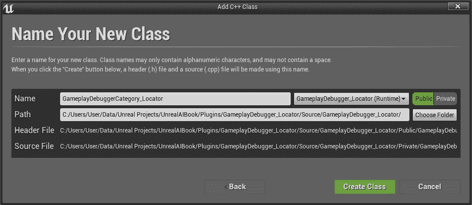

*游戏调试器扩展*的结构非常简单，因为我们需要实现和/或覆盖以下函数：

+   **构造函数**：这为扩展设置默认值，包括设置。更重要的是，它为扩展设置键绑定（并传递你希望绑定的函数的引用）。

+   **MakeInstance()**：这创建了一个*游戏调试器扩展*的实例作为共享引用。当*扩展*注册时，此函数是必需的。

+   **OnActivated()**：当*扩展*被激活时执行初始化（例如，*游戏调试器*打开）。

+   **OnDeactivated()**：当*扩展*被停用时进行清理（例如，*游戏调试器*关闭）。例如，观众扩展使用此函数来销毁观众控制器（如果存在）并将控制权返回给之前的*玩家控制器*。

+   ***GetDescription()***：这描述了*扩展*到*游戏调试器*的功能。这意味着该函数返回一个用于在游戏调试器中显示文本的*字符串*；允许使用带有颜色的常规格式。此外，您可以使用*`FGameplayDebuggerCanvasStrings::ColorNameEnabled`*和`*FGameplayDebuggerCanvasStrings::ColorNameDisabled*`来分别描述扩展的启用或禁用颜色。如果您的*扩展*使用切换功能，这将非常有用。

+   ***动作函数***：这执行您希望您的*扩展*执行的操作，因此在这里，它可以是你想要的任何东西。此函数将在构造函数中将传递给输入绑定。

# 创建扩展类

当然，我们不需要查看的所有函数。在我们的情况下，我们可以在头文件（`.h`）中声明`Constructor`、`GetDescription()`和`MakeInstance()`函数：

```py
public:
  GameplayDebuggerExtension_Player();

  //virtual void OnDeactivated() override;
  virtual FString GetDescription() const override;

  static TSharedRef<FGameplayDebuggerExtension> MakeInstance();
```

接下来，我们需要一个受保护的函数，我们将将其绑定到特定的输入：

```py
protected:

  void PrintPlayerLocation();
```

然后，我们需要一些受保护的变量：一个布尔变量用于检查是否已绑定输入，另一个布尔变量用于查看是否已缓存描述，以及一个包含缓存描述本身的变量：

```py
protected:
  uint32 bHasInputBinding : 1;
  mutable uint32 bIsCachedDescriptionValid : 1;
  mutable FString CachedDescription;
```

为了性能原因，始终缓存*游戏调试器扩展*的描述是一个好的做法。

当然，不要忘记将整个类包含在条件编译指令和`*WITH_GAMEPLAY_DEBUGGER*`宏中。这是头文件（`.h`）应该看起来像的：

```py
#include "CoreMinimal.h"

#if WITH_GAMEPLAY_DEBUGGER
#include "GameplayDebuggerExtension.h"

/**
 * 
 */
class GAMEPLAYDEBUGGER_LOCATOR_API GameplayDebuggerExtension_Player : public FGameplayDebuggerExtension
{
public:
  GameplayDebuggerExtension_Player();

  //virtual void OnDeactivated() override;
  virtual FString GetDescription() const override;

  static TSharedRef<FGameplayDebuggerExtension> MakeInstance();

protected:

  void PrintPlayerLocation();

  uint32 bHasInputBinding : 1;
  mutable uint32 bIsCachedDescriptionValid : 1;
  mutable FString CachedDescription;

};

#endif
```

对于实现，我们可以从添加以下`#include`语句开始，因为我们需要访问玩家控制器及其 Pawn 以检索玩家的位置。此外，我们还需要绑定输入，因此需要包含*输入核心类型*：

```py
#include "InputCoreTypes.h"
#include "GameFramework/PlayerController.h"
#include "GameFramework/Pawn.h"
```

接下来，我们将实现构造函数。在这里，我们将输入绑定到特定的键。在我们的例子中，我们可以将其绑定到`P`键。当然，我们需要一个委托，我们可以传递我们的`PrintPlayerLocation()`函数来完成此操作：

```py
GameplayDebuggerExtension_Player::GameplayDebuggerExtension_Player()
{
  const FGameplayDebuggerInputHandlerConfig KeyConfig(TEXT("PrintPlayer"), EKeys::NumLock.GetFName());
  bHasInputBinding = BindKeyPress(KeyConfig, this, &GameplayDebuggerExtension_Player::PrintPlayerLocation);
}
```

如我们之前提到的，如果您能的话，缓存您的描述，这样您的*扩展*就能获得一些性能。以下是缓存我们描述的代码结构：

```py
FString GameplayDebuggerExtension_Player::GetDescription() const
{
  if (!bIsCachedDescriptionValid)
  {
    CachedDescription = *[SOME CODE HERE TO RETRIEVE THE DESCRIPTION]*

    bIsCachedDescriptionValid = true;
  }

  return CachedDescription;
}
```

现在，我们需要获取描述。在这种情况下，它可以是输入处理程序（这样我们就能记住这个扩展绑定到哪个键，以及单词“玩家”来记住这是一个检索玩家位置的扩展。至于颜色，游戏调试器扩展提供了一些访问特定颜色的快捷方式（例如，对于切换不同类型的扩展，颜色可以根据是否切换而改变）。我们目前不会过多关注颜色，我们将使用默认的颜色，假设一切总是启用的。因此，这是`GetDescription()`函数：

```py
FString GameplayDebuggerExtension_Player::GetDescription() const
{
  if (!bIsCachedDescriptionValid)
  {
    CachedDescription = !bHasInputBinding ? FString() :
      FString::Printf(TEXT("{%s}%s:{%s}Player"),
        *FGameplayDebuggerCanvasStrings::ColorNameInput,
        *GetInputHandlerDescription(0),
        *FGameplayDebuggerCanvasStrings::ColorNameEnabled);

    bIsCachedDescriptionValid = true;
  }

  return CachedDescription;
}
```

另一方面，`MakeInstance()` 函数相当简单，并且非常类似于我们用于 *游戏调试器类别* 的一个；它只需要返回对这个扩展的共享引用：

```py
TSharedRef<FGameplayDebuggerExtension> GameplayDebuggerExtension_Player::MakeInstance()
{
  return MakeShareable(new GameplayDebuggerExtension_Player());
}
```

最后，在我们的 `PrintPlayerPosition()` 函数中，我们只需使用一个 *UE_LOG* 来打印玩家的位置。然而，在一个 *游戏调试器扩展* 中，真正的魔法发生在这些（绑定到输入）函数中：

```py
void GameplayDebuggerExtension_Player::PrintPlayerLocation()
{
  UE_LOG(LogTemp, Warning, TEXT("Player's Location: %s"), *GetPlayerController()->GetPawn()->GetActorLocation().ToString());
}
```

再次提醒，不要忘记用编译器指令包裹你的 C++ 类。

因此，这是我们班级的 `.cpp` 文件：

```py
#include "GameplayDebuggerExtension_Player.h"

#if WITH_GAMEPLAY_DEBUGGER
#include "InputCoreTypes.h"
#include "GameFramework/PlayerController.h"
#include "GameFramework/Pawn.h"
//#include "GameplayDebuggerPlayerManager.h"
//#include "Engine/Engine.h"

GameplayDebuggerExtension_Player::GameplayDebuggerExtension_Player()
{
  const FGameplayDebuggerInputHandlerConfig KeyConfig(TEXT("PrintPlayer"), EKeys::NumLock.GetFName());
  bHasInputBinding = BindKeyPress(KeyConfig, this, &GameplayDebuggerExtension_Player::PrintPlayerLocation);
}

FString GameplayDebuggerExtension_Player::GetDescription() const
{
  if (!bIsCachedDescriptionValid)
  {
    CachedDescription = !bHasInputBinding ? FString() :
      FString::Printf(TEXT("{%s}%s:{%s}Player"),
        *FGameplayDebuggerCanvasStrings::ColorNameInput,
        *GetInputHandlerDescription(0),
        *FGameplayDebuggerCanvasStrings::ColorNameEnabled);

    bIsCachedDescriptionValid = true;
  }

  return CachedDescription;
}

TSharedRef<FGameplayDebuggerExtension> GameplayDebuggerExtension_Player::MakeInstance()
{
  return MakeShareable(new GameplayDebuggerExtension_Player());
}

void GameplayDebuggerExtension_Player::PrintPlayerLocation()
{
  UE_LOG(LogTemp, Warning, TEXT("Player's Location: %s"), *GetPlayerController()->GetPawn()->GetActorLocation().ToString());
}

#endif
```

# 注册扩展

就像我们对 *游戏调试器类别* 所做的那样，我们还需要注册 *扩展*。

然而，在我们这样做之前，如果我们尝试编译，我们将得到一个错误。实际上，由于我们处理 *扩展* 的输入，*扩展* 所在的模块需要向 "***InputCore***" 的 ***公共依赖***。在你的 `.build.cs` 文件中添加以下行：

```py
PrivateDependencyModuleNames.Add("InputCore");
```

特别是，对于我们的定位模块，你应该在 `GameplayDebugger_Locator.build.cs` 文件中这样插入这个依赖项：

```py
        if (Target.bBuildDeveloperTools || (Target.Configuration != UnrealTargetConfiguration.Shipping && Target.Configuration != UnrealTargetConfiguration.Test)) {
            PrivateDependencyModuleNames.Add("GameplayDebugger");
 PrivateDependencyModuleNames.Add("InputCore");
            Definitions.Add("WITH_GAMEPLAY_DEBUGGER=1");
        } else {
            Definitions.Add("WITH_GAMEPLAY_DEBUGGER=0");
        }
```

在此修改后编译，你不应该得到任何错误。

现在，是时候注册扩展并通知 *游戏调试器* 这个变化了。为此，我们需要使用特定的函数。因此，在我们的 `StartupModule()` 函数（在 `GameplayDebugger_Locatot.cpp` 文件中），我们需要添加以下加粗的代码行，以便相应地注册和通知 *游戏调试器*（注意，我们需要为 *扩展* 和 *类别* 都这样做，因为它们是两个不同的函数）：

```py
 void FGameplayDebugger_LocatorModule::StartupModule()
{

#if WITH_GAMEPLAY_DEBUGGER

  UE_LOG(LogTemp, Warning, TEXT("Locator Module Loaded"));

  if (IGameplayDebugger::IsAvailable())
  {
    IGameplayDebugger& GameplayDebugger = IGameplayDebugger::Get();

 GameplayDebugger.RegisterExtension("Player", IGameplayDebugger::FOnGetExtension::CreateStatic(&GameplayDebuggerExtension_Player::MakeInstance));

 GameplayDebugger.NotifyExtensionsChanged();

    GameplayDebugger.RegisterCategory("Locator", IGameplayDebugger::FOnGetCategory::CreateStatic(&FGameplayDebuggerCategory_Locator::MakeInstance), EGameplayDebuggerCategoryState::EnabledInGameAndSimulate);

    GameplayDebugger.NotifyCategoriesChanged();

    UE_LOG(LogTemp, Warning, TEXT("GameplayDebugger Registered"));
  }

#endif
}
```

在模块关闭时注销 *扩展* 时，同样的方法也适用。以下是我们在 `ShutdownModule()` 函数中需要添加的代码：

```py
void FGameplayDebugger_LocatorModule::ShutdownModule()
{

#if WITH_GAMEPLAY_DEBUGGER

  if (IGameplayDebugger::IsAvailable())
  {
    IGameplayDebugger& GameplayDebugger = IGameplayDebugger::Get();

 GameplayDebugger.UnregisterExtension("Player");

 GameplayDebugger.NotifyExtensionsChanged();

    GameplayDebugger.UnregisterCategory("Locator");

    GameplayDebugger.NotifyCategoriesChanged();

  }
#endif
}
```

编译代码，你的插件就准备好了。你可能需要重新启动编辑器才能使效果生效。

如果你仍然在使用游戏调试器可用的情况下加载插件时遇到麻烦，请从虚幻引擎的顶部菜单导航到 ***窗口 -> 开发者工具 | 模块***。从这里，搜索我们的定位模块，然后按如下截图所示按下重新加载：


你可能每次加载编辑器时都需要这样做，以便使用你的类别和/或扩展。

如果你进入 *游戏调试器设置*，你将找到我们的 *扩展* 列表（如果你愿意，你还可以更改按键绑定）：


这就是它在游戏中的样子：


这是输出截图。其他（模糊显示）的信息在这里并不重要

这里是一个特写：

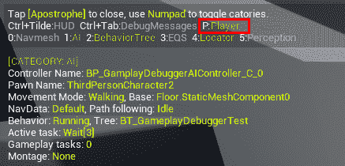

如果你按下 `P`，那么扩展将在 *输出日志* 中产生以下结果：

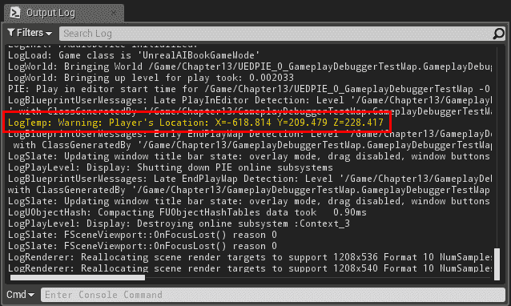

关于*游戏玩法调试器扩展*的更多信息，你应该查看`GameplayDebuggerExtension.h`中包含的类（创建*扩展*的*游戏玩法调试器*的基类）以及`GameplayDebuggerExtension_Spectator.h`（一个*扩展*的实现，其中包含*输入绑定*和*缓存描述*的示例）。

这标志着我们扩展*游戏玩法调试器*的冒险之旅结束。

# 摘要

在本章中，我们探讨如何利用**游戏玩法调试器**来测试我们的 AI 系统。特别是，我们研究了*游戏玩法调试器*的默认**类别和扩展**，它们是如何工作的，以及它们显示哪种类型的信息。

然后，我们看到了如何通过**创建一个新的类别**和一个**新的扩展**在**插件**中**扩展游戏玩法调试器**。结果，我们解锁了我们自己系统调试的巨大潜力。

在下一章中，我们将进一步探讨**游戏中的 AI**，并看看还有哪些可能性。
