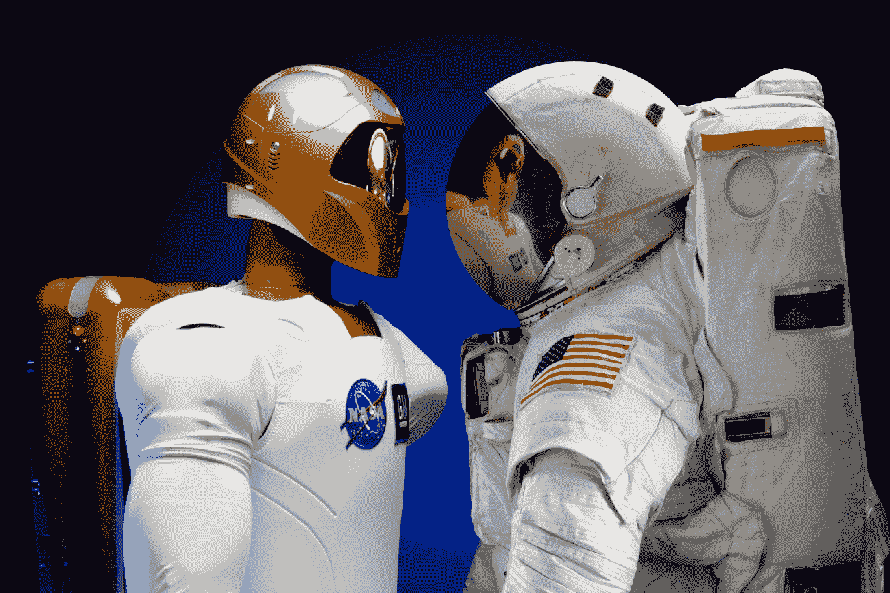

# 第十四章：超越

在本章的最后，我们将讨论本书中我们已经涵盖的内容，以及遗漏的内容。我们将有一些关于人工智能和心理学的一般性思考，每个游戏人工智能开发者都应该了解。因此，本章将以一些关于如何探索本书中提出（以及其他）的概念的建议以及一些关于人工智能的思考作为结尾。

无法想象一个未来，其中**人工智能**（**AI**）不会无处不在。它将以我们甚至未曾想象的方式融入一切。因此，为了使人工智能的设计真正能够与人类建立联系，心理学需要始终处于这些体验设计的核心。年复一年，我们可以观察到世界对技术的依赖性日益增强，在某些情况下，技术填补了人类互动的空白。这使我们能够与高度个性化和定制化的体验互动，这些体验在众多个体中使我们真正感到独特。

通常，人工智能程序员会忘记他们为谁实施系统：玩家。因此，心理学扮演着重要的角色：玩家对人工智能系统的感知比系统本身的性能更重要。本章探讨了玩家心理学与游戏中的 AI 之间的这种联系。

在本章中，我们将学习以下主题：

+   为什么心理学对人工智能是一个重要的考虑因素？

+   本书未涉及的内容

+   一些有用的资源

+   人工智能与哲学

# 为什么心理学对人工智能是一个重要的考虑因素？

到现在为止，你可能已经开始怀疑为什么心理学是人工智能发展不可或缺的一部分。心理学之所以重要，是因为它教会了我们人类思考和行为的根本推理。因此，当涉及到为用户个性化、定制和自动化体验时，我们找到将其纳入我们设计中的方法是有意义的。在考虑 AI 在互动体验中的自主角色时，它必须在某种程度上与我们作为玩家如何与虚拟世界互动和参与的方式相一致；我们如何与物体、**非角色扮演者**（NPCs）和其他玩家互动。思考这一点的其中一种方式是通过因果关系。例如，我们执行特定的动作，如从不同的角色那里偷窃或表现不佳，这反过来又会影响其他 NPC 如何回应你。一个很好的例子是在游戏《Overlord》中，你越是为了恐吓村庄而做出过激行为，他们就越不愿意帮助你，甚至与你互动。虽然这可能很有趣，但也可能相当令人沮丧，尤其是在你需要完成某些目标而被迫以困难的方式去做时，因为你现在让所有人都讨厌你！因此，记住，为了在游戏中创建 AI，你需要定义一个衡量玩家进步的指标，并在开始游戏测试时相应地调整它。

心理学与 AI 结合使用的方法有很多。例如，许多网站使用推荐系统，这些系统要么关注你购买或查看的内容，并根据这些内容提出建议。这可以在你浏览目录、将商品添加到购物车或甚至通过电子邮件以“个性化促销”的方式诱使你回来时进行。

# 游戏中的心理学与 AI

在游戏中，AI 被广泛使用。与 AI 不同，机器学习有可能在游戏中实现，但鉴于大多数游戏体验的短暂性，通常没有足够的数据供机器“学习”任何东西，更不用说将其应用于游戏玩法。因此，这并不是一个经济上或资源上可行的选择。在这种情况下，“能做并不意味着应该做”这句话将是处理这种情况最明智的方法。

更具体地说，心理学在 AI 中的应用可以针对许多其他领域，例如利用角色（和玩家）的情感。在新兴技术和使用方式的时代，我们发现一些游戏试图让玩家感觉游戏“真实”。开发者试图找到方法跨越现实和游戏的界限，并真正鼓励玩家做出道德上有疑问的选择（例如《特种部队：线》、《暴雨》），这些选择会触动我们的心弦，甚至让我们反思自己的行为。

一些游戏旨在在玩家玩游戏时对你进行“心理”分析。例如，《寂静岭：破碎记忆》使用心理分析来了解你，然后在游戏过程中使用这些信息来改变游戏，正如他们所说的，创造你自己的个人噩梦。

这非常直观地通过游戏中的一个部分来实现，在这个部分中，一位心理学家——迈克尔·考夫曼博士，或者简称 K 博士——会问你一系列不同的问题，以开始你的个人档案建立过程。但这只是档案建立的基础——随着游戏的进行，档案本身会根据你的互动方式、你频繁或偶尔做的事情（例如检查你的地图）进行修改。

在游戏中，当涉及到玩家互动时，情感是玩家最有用的指示之一。一个角色的情感可以传达愤怒、快乐、悲伤和挫败感，许多游戏通过复杂和详细的叙事选择、角色声音、表情和整体存在感来传达这一点。在许多方面，情感可以极大地影响游戏氛围，更不用说它们对玩家在互动中如何互动、响应或做出选择的影响了。然而，情感的作用远不止传达氛围那么简单。它们极大地影响了我们的决策方式。例如，如果一个角色在游戏过程中没有经历过压力事件或挑战，那么他们不太可能进行思考；而如果一个角色刚刚险些逃脱一个 Boss，现在必须快速做出决定（同时计时器正在倒计时）关于是否射击目标，那么背后的思考过程可能会有很大的不同。我所经历的最佳例子之一是在玩《特种部队：战线》时（前方有剧透）。在花了大部分时间杀敌之后，你终于到达了一个阶段，你可以将他们逼入死角，但他们随后开始“逃跑”。通过直升机切换到空中视角，你可以看到他们似乎正在汇聚到一个没有退路的角落。完美！对吗？所以，自然地，沉浸在那一刻，你不断地按按钮，试图将愤怒倾泻在他们身上，试图摧毁最后一个敌人。然而，那群发光的人并不是在逃跑。他们被困住了——他们没有反击。不用说，在将地狱倾泻在敌人身上的那一刻，你无意中失败了任务——拯救无辜者。在这个时候，你精神上已经筋疲力尽，从现在开始，在每一个对话选项中，你开始更加仔细地思考你的选择以及它们对他人产生的影响——尤其是如果你之前没有这么做的话。

# 通过心理学构建更好的 AI

要让一个非人类（AI）的行为看起来像人类，你需要记住人类并不总是理性的——我们常常是不可预测的。在做出选择（甚至在游戏中）关于接下来做什么之前，人类会考虑许多不同的事情。例如，他们可能会在决定攻击玩家之前考虑社会信息，比如玩家的排名（地位、等级等）。这很可能会影响叙事。此外，玩家在决策时可能会使用心理捷径，这取决于他们自己的心理模型，可能会导致各种不可预测的行为。这还可以受到游戏环境和先前经验的影响。因此，你如何教会计算机模仿，更不用说以可信的方式做出反应呢？

开发者需要设计 AI，在这个过程中，他们也需要考虑其背后的心理学。例如，AI 是否应该以玩家可能期望的方式（类似于正常人类）回应玩家？也许开发者创造了一个存在惯例的幻想世界，因此 AI 必须相应地做出反应（这可能超出了现实世界的惯例）。在所有情况下，都始终存在与玩家心理学相关的问题，开发者需要在设计 AI 行为时牢记这些。因此，作为一名开发者，你需要考虑 AI 如何以令人信服的方式与游戏环境互动。你需要让 AI 意识到其环境，遵守游戏规则，并相应地做出反应/行为。让玩家通过走进碰撞盒来触发 AI 的即时反应是一种破坏沉浸感的方法。AI 需要考虑其当前情况，并具有情境意识。

另一个需要考虑的因素是玩家可能形成的与**非玩家角色**（**NPCs**）之间的关系。在玩家能够影响动态和分支叙事的游戏中，目标是让玩家感受到与游戏以及其中角色的联系。最终，你希望玩家能够“感同身受”其他角色，那么如何做到这一点呢？那就是通过开发出能够与人类心理相连接的令人信服的 AI。这可以通过一种方式来实现，即开始感觉像是一个交互式的图灵测试。在这个阶段，你可以看到至少有几种方式你可以利用心理学来影响 AI 的设计。

除了分支叙事之外，另一个重要的方面是能够将情感融入人工智能与玩家的互动中。例如，如果一个玩家以负面方式与其他 NPC 互动，这将会影响人工智能的反应方式。这不仅仅是在叙事方面，还包括对玩家的态度。例如，一个 NPC 在开始时可能愿意帮助你——也许甚至在你交易时提供折扣。然而，根据你与其他 NPC 的关系（例如，负面态度），你的行为不可避免地会影响那些你没有以相同方式对待的 NPC 的态度（例如，那些之前对你有积极态度的人）。

这种讽刺之处在于，为了让人工智能看起来可信，就需要让它不完美。人类并不完美——在许多情况下我们离完美还很远——因此人工智能也应该如此。例如，如果一个人工智能正在追逐玩家——甚至射击他们——人工智能每次都能击中玩家，就像人类玩家一样，这是没有意义的；人工智能应该会错过。应该是一种人工智能几乎赢/输的情况。这样，即使在一定程度上给玩家带来了一种虚假的安全感，它也会让他们觉得自己在取得成就。这远远超过了一个“上帝模式”的场景，玩家可以轻易地摧毁一切，或者相反，因为人工智能过于强大，玩家难以前进。当然，这种平衡可以受到玩家设置的难度设置的影响。通过这样做，你能够为玩家的沉浸感做出贡献，也就是说，使游戏环境看起来可信，玩家在与另一个“人”互动，而不是仅仅与游戏中的一个脚本角色互动。

与“可信度”同样重要的是人工智能的反应时间。正如你不想让他们比玩家拥有的能力更强大一样，他们也需要以与玩家相同的速度处理事件进行反应。例如，玩家（即人类）的平均反应时间为 0.2 秒（视觉）和 0.15 秒（听觉）([www.humanbenchmark.com](http://www.humanbenchmark.com))。这意味着如果我们站在一个房间里，如果另一个人打开门，我们需要 0.2/0.15 秒来对此做出反应，无论是转头去看谁在门口，还是阻止门打开，甚至躲藏起来。因此，人工智能在反应时间上需要表现出同样的行为，尽管有所不便，以避免在人类玩家之上获得优势。然而，这还涉及到许多其他事情，比如理解一个事件（例如，爆炸是炸弹还是汽车回火？）然后做出反应（例如，寻找敌人，忽略，调查）。记住，对于这些类型的事件，必要的反应时间和反应都需要实现。

通过使用心理学来驱动 AI 的设计，我们有一个框架，帮助我们创建可信的叙事、角色和环境，以便我们可以创建更沉浸式的游戏环境。此外，心理学的考虑并不特定于 AI 的设计——我们可以在游戏事件方面在此基础上进行构建。例如，在环境中移动的 NPC 可能有自己的故事，自己的“心理学”，这驱使它们的移动，甚至与玩家的互动。例如，NPC 角色可能会相遇，发生某种争执，从而影响玩家未来与他们的互动。如果游戏中有玩家可以与之互动的角色，并且确实（以某种特定方式）或根本不与之互动，这可能会影响游戏体验中后期 AI 与玩家的互动。随机化是另一个可以帮助提高游戏环境中 AI 真实性的方面。当然，在某种程度上，NPC 在行走时可能会遵循相同的路径，尤其是在有守卫保护区域的情况下。然而，偶尔允许 NPC 偏离其路径，比如绕过喷泉而不是在其后面，都可以有助于环境的真实性。

最后，在我们结束这一章之前，**测试**你的 AI 对于其成功至关重要。就像人类行为不可预测一样，你的 AI 的行为也可能不可预测。这在路径寻找方面尤其普遍。例如，当一个玩家应该遵循一条路径时，如果另一个 NPC 或甚至玩家穿越它，可能会导致 AI 以奇怪的方式行事。结果，这可能会破坏玩家的沉浸感，或者更糟，由于故障而破坏游戏机制和/或平衡。

在我们结束这一章的时候，我可以向你推荐的一条建议是，即使你不需要获得心理学学位来创建令人信服的 AI，但如果你真正想要创建与玩家在更深层次上产生联系的 AI，这会很有帮助。

# 机器学习

仅仅人工智能本身并不足以“真正”与玩家建立联系。需要更复杂和细致的方法，以便技术以更亲密的方式与我们同步。因此，机器学习为我们提供了一整套知识，可以用来了解用户喜欢什么，不喜欢什么，跟踪他们的交互和行为，并相应地调整系统——这包括指导 AI 下一步该做什么。简单来说，机器学习是人工智能的一个子领域。这一点非常重要，因为在许多情况下，人们经常混淆不仅人工智能和机器学习的定义，还有它们所取得的成果。机器学习允许系统从数据中自主学习，而不是开发者提供数据——或者将其*硬编码*到交互中。

在考虑人工智能和心理学之前，最后一点需要注意的是不要高估任何一方的能力。它们各自都有局限性，我们对它们各自领域的了解有限（尽管在增长），以及它们如何共同使用。因此，当你考虑将它们作为你自己的项目的一部分时，务必进行调研。

# 游戏中人工智能和机器学习的应用

在某些情况下，你可能会并且可以使用人工智能在游戏中，但在这类情况下，它与你在使用机器学习时的实例会有所不同。然而，了解这两者之间的区别非常重要，正如我们已经讨论过的，而且还要了解它们在游戏环境中的应用和实施方面的差异。

# 游戏中人工智能的应用

如果需要游戏中具有自主角色的功能，游戏设计师可能会考虑在游戏中使用人工智能。例如，如果你想有敌人会在玩家射击他们时四处奔跑追逐，或者当玩家过于接近时检测到玩家。

# 游戏中机器学习的应用

另一方面，在游戏中使用机器学习需要稍微不同的方法和考虑因素。就像我们的 AI 例子一样，如果你想使游戏“学习”玩家的习惯，你可以在游戏环境中实现机器学习。

# 适应性行为

人工智能在游戏玩法中的一个实际应用是能够根据玩家的输入调整游戏环境（以及其中包含的一切）。例如，如果玩家在某个关卡的部分不断失败，那么玩家会在更靠近该部分的地方重生，或者敌人变得更容易攻击。这种调整难度的过程被称为动态难度调整，它非常棒，因为它允许玩家在游戏中的一些部分比其他部分更具挑战性的情况下前进。游戏《 Crash Bandicoot》就是一个很好的例子，它实现了这一机制，并允许你享受既具挑战性又可玩的游戏体验。

# 本书尚未涉及的内容

嗯，几乎一切都可以！

尽管这本书中有许多页面，但我们只是刚刚触及游戏 AI 这个美妙主题的表面。我在这本书里说过多少次“遗憾的是，这个[插入主题]超出了本书的范围”？太多以至于难以记住。这只是为了虚幻引擎内置的 AI 框架（例如，我们还没有涵盖如何正确扩展 EQS 的生成器和测试，或者如何创建自定义 AI 感知）。然而，我坚信这本书为你提供了一些坚实的基础，可以在此基础上迭代并继续学习虚幻引擎 AI 框架。希望你能将这本书作为你在虚幻引擎工作中的参考。

尽管我希望这本书能帮助你奠定基础，但本节的目的在于指出，这条路是由成千上万的石头铺成的。通过随机指向主要的部分，我希望激发你继续在这条路上前行。我们将在接下来的章节中更详细地讨论这些“石头”。

# 动作和导航（低级）

在第三章*导航*中，我们探讨了虚幻引擎内置的导航系统。然而，我们没有讨论动作，这在我们在第一章*在 AI 世界中迈出第一步*中提出的 AI 架构中有所体现。

动作处理角色的加速度和速度，包括避开障碍物和其他代理。当然，我们在第七章*人群*中探讨了*避开*，而在虚幻引擎中，加速度和低级运动属于动作组件。然而，关于*引导行为*的部分专门处理控制代理的加速度以创建更逼真的行为，这部分我们尚未探讨。

# 赛车游戏

赛车游戏绝对是一个独特的案例。实际上，我们需要一个能够执行连续路径查找（这在其一般形式中仍然是一个未解决的问题）并能与不同的游戏玩法机制竞争的 AI。许多其他 AI 算法在那里发挥作用，例如平衡游戏（例如，在所有汽车之间创建一个“虚拟弹簧”）。

# 代理意识

代理意识涉及赋予 AI 代理感知能力——特别是视觉，这是最常见和最广泛使用的，但还包括听觉和嗅觉。此外，我们可以开始探索如何将此数据用于高级结构，以便代理能够相应地行动。

# 环境查询系统

**环境查询系统**（**ESQ**）可以从代理周围的环境中收集信息，使代理能够据此做出决策。本书专门用一章来介绍这个系统。实际上，它位于*代理意识*和*决策制定*之间，并且是已经内置到虚幻引擎中的宝贵资源。

# 决策和规划

一旦智能体能够感知周围的世界并进入其中，它就需要通过做出有后果的决定来采取行动。某些决策过程可能会变得非常复杂，以至于智能体需要制定一个适当的计划才能成功实现目标。

我们刚刚探讨了行为树，但还有许多值得探索的决策算法和系统，从有限状态机（FSMs）到效用函数，再到多智能体系统和规划算法。

# 离散游戏/棋盘游戏

有时，智能体周围的世界不是连续的，而是离散的，并且可能是回合制的。因此，智能体不能总是使用我们在本书中探讨的算法。博弈论和离散游戏的数学原理对于许多游戏应用都很重要，从回合制游戏到战斗系统中资源的战略分配。

# 学习技巧

即使当你思考游戏中的 AI 时，智能体可能是首先想到的，但一个游戏可能包含许多其他 AI 算法。尽管由于学习技巧并不总是导致一致的结果，并且大多数情况下它们不是游戏所必需的，但这个主题开始对游戏产业产生吸引力。

# 程序性内容生成（PCG）

**程序性内容生成**（**PCG**）是另一种与智能体无关的人工智能算法的例子，而是游戏中的整个世界为玩家生成内容。这些技术不仅被关卡设计师用来创建世界，艺术家用来定制网格或纹理，而且在玩家玩游戏时，在运行时创建一个无限的世界，通常是在街机游戏中。

# 搜索与优化

搜索与优化是任何 AI 开发者的基本工具，因为这些是在人工智能中广泛使用的核心技术，但在开发游戏 AI 系统时可能会派上用场。尽管这些技术不在玩家面前使用，但它们在游戏引擎的底层被使用。

# 多智能体系统

通常，视频游戏中的智能体并不是独自行动的，它们需要协作以实现共同目标。多智能体系统在视频游戏中并不常见，因为它们有时难以实现，但如果它们能够很好地结合，就能实现非常逼真的行为。因此，大多数情况下，协作是虚假的，但这个问题可以通过多智能体系统来解决，尤其是在游戏设计需要智能体之间更高级的交互时。此外，这些系统适用于在拥有许多智能体的在线游戏中实现逼真的行为，其中计算能力可以在多台机器上分布。

# 人工智能与心理学

本章解释了人工智能在游戏开发工作流程中的更广泛作用，以及它应该如何与游戏设计相结合，以充分利用不同的系统。本节的目标是向您介绍不同常见和不那么常见的情况，在这些情况下，一个 AI 算法比另一个更适合。此外，本节还将向您展示 AI 与心理学之间的关系，以及前者如何影响后者。实际上，AI 系统的最终用户是玩家，他/她如何感到舒适或相信 AI 系统是一个关键因素。

# 超越经典 AI

目前在 AI 的世界中正在进行许多激动人心的新想法和创新，你应该始终通过内心的好奇心来继续你的美妙旅程。了解新技术和算法是始终保持最新状态的关键。

# 还有更多，更多，更多！

由于你可以探索的内容还有很多，所以这个列表绝不是详尽的！

# 一些有用的资源

如果你渴望学习更多，我完全可以理解。尽管社区非常活跃、友好，但找到关于这个主题的好材料很难。

当然，首先应该查看的是***官方文档*** ([`docs.unrealengine.com/en-us/`](https://docs.unrealengine.com/en-us/))，它需要与***论坛***和***问答社区***相结合。

其次，参加活动是与人们建立联系和分享知识的好方法。你知道虚幻引擎在全球各地都有官方的聚会吗？去看看吧：[`www.unrealengine.com/en-US/user-groups`](https://www.unrealengine.com/en-US/user-groups)。

其他活动包括***虚幻节***、***游戏开发者大会(GDC)***和***科隆游戏展(Gamescom)***（以及其他许多活动）。

如果你正在寻找更传统的资源，例如书籍和博客，我找到了一些关于虚幻引擎（特别是与 AI 相关的）的资源，我认为它们特别有用。这些是个人博客，但它们包含非常实用的信息。我希望我能列出所有这些资源，也许我们应该做一个列表，因为周围有很多在做着令人惊叹的事情的人。这些只是其中的一小部分：

+   ***Tom Looman 的博客*** ([`www.tomlooman.com`](https://www.tomlooman.com/))：你可以找到各种内容，尤其是关于 C++的。这里有一篇关于*实用 AI*的有趣文章：[`www.tomlooman.com/journey-into-utility-ai-ue4/`](https://www.tomlooman.com/journey-into-utility-ai-ue4/)。

+   ***Orfeas Eleftheriou 的博客*** ([`orfeasel.com`](https://orfeasel.com))：一个关于非常有趣主题的丰富博客。特别有趣的是关于如何扩展 AI 感知系统的文章，你可以在这里找到：[`orfeasel.com/creating-custom-ai-senses/`](https://orfeasel.com/creating-custom-ai-senses/)。老实说，我本来打算为这本书添加一个关于扩展 AI 感知系统的章节，但不幸的是，我没有时间。我希望这篇文章能让你走上正确的道路。

+   ***Vikram Saran 的博客*** ([`www.vikram.codes`](https://www.vikram.codes))：目前这是一个小博客，但你可以找到一些关于 *导航系统* 的额外信息。

# 人工智能与哲学

最后，我想以一些关于 AI 的思考来结束这本书，这些思考可能会让你觉得有趣。

如果我们在考虑人工智能的哲学方面，需要提出的关键问题是：心灵是如何工作的？机器能否以人类的方式表现出智能？机器能具有意识吗？

这些简单的问题在过去的一个世纪中引发了大量的争议（并且现在仍在继续）。本节的目的不是对这些问题进行彻底的讨论，而是提供关于这些问题的有趣对话的非常一般性的想法，并激发你对阅读更多相关文献的兴趣。

哥德尔的不完备性定理表明，对于任何足够强大以进行算术的形式公理化系统 F，都可以构造出一个具有以下性质的句子，G (F)：

+   G (F) 是 F 的一个短语，但无法在 F 内部证明

+   如果 F 是一致的，那么 G (F) 是真的

一些哲学家认为哥德尔定理表明机器不如人类，因为它们是受定理限制的形式系统，而人类没有这样的限制。或者，是这样吗？

似乎无法证明人类不受哥德尔定理的影响，因为任何严格的证明都需要对人类才能进行形式化，而这种形式化会被拒绝。

已知人类在日常推理中是不一致的，这可能会使我们无法证明我们的优越性。

*弱人工智能假设* 意味着机器可以表现得像是有智能的。在 1950 年，艾伦·图灵建议，我们不应该问机器是否能思考，而应该问自己机器是否能通过行为智能测试，这已经成为图灵测试。测试要求程序与审问者进行五分钟的对话（通过在线输入的消息）。因此，审问者必须猜测对话是与程序还是与人进行的；如果程序有 30% 的时间欺骗了审问者，则程序通过测试。图灵推测，到 2000 年，计算机可以被编程得足够好，以通过这个测试。

今天，像 Natachata 这样的互联网聊天机器人反复欺骗了他们的通讯者，Cyberlover 聊天机器人甚至能诱使人们透露足够多的个人信息，以至于他们的身份可能被盗。

另一方面，*强人工智能假设*声称机器可以真正思考，而不仅仅是模拟思考。

机器能否意识到它们的心理状态和行为？它们真的能感受到情感吗？

图灵本人反对这些问题，认为在日常生活中，我们从未有直接证据证明其他人类的内部心理状态。围绕我们的其他人是在思考，还是在模拟？

我们能否想象一个未来，那时与机器进行现实对话成为常态，不再区分真实和模拟思维的语言差异？图灵认为，一旦机器达到一定程度的复杂性，这些问题最终会自行消失，从而消除强人工智能和弱人工智能之间的差异。

另一个重要的问题是意识，它通常被分为理解和自我意识两个方面。

图灵承认良知问题很难，但否认它对人工智能的重要性。人类可以创造思考机器，但意识是否产生，这远远超出了我们当前的知识。

一个重要的争论涉及心灵和身体的物理构成以及它们之间的分离。

如果心灵和身体真的分离，心灵如何控制身体？

一种称为*物理主义*的理论断言，心灵并非与身体分离，但尚无需解释我们心中的生化过程如何产生心理状态（如恐惧或愤怒）和情感。

功能主义理论认为，心理状态是输入和输出之间的中间因果条件。在适当的条件下，人工智能可能具有与人类相同的心理状态。基本假设是存在一个抽象层次，在此层次以下，具体的实现并不重要。

*生物自然主义*对功能主义提出了强烈的挑战，根据这种观点，心理状态是神经元低级物理过程中出现的高级特征。

中国房间是一个思想实验，证明了这一愿景。它由一个只懂英语的人类组成，配备一本英语语法书和几堆纸张。系统位于一个带有小开口的房间里。

不可解的符号通过开口出现在纸上。人类在规则书和指示中检查这些符号，并遵循指示。这些指示可能包括在新的纸张上写符号，在堆叠中寻找符号，重新排列堆叠等。最后，指示将导致一个或多个符号被转录到返回外界的纸张上。

从外面看，我们看到的是一个系统，它接收中文句子作为输入，并以中文生成合理的答案。

中国房间系统会讲中文吗？语言解释发生在什么水平？这真的会发生吗？

如需更多信息，请访问 [`en.wikipedia.org/wiki/Chinese_room`](https://en.wikipedia.org/wiki/Chinese_room)

我将以一些简短的伦理考虑结束。好吧，我们可能能够创造智能...但我们应该这样做吗？我们是否有道德责任？

许多工程师和科学家都关注过他们所处理的技术中的伦理问题。想想核裂变，或者甚至汽车，每年都会导致大量死亡。

人工智能引发了许多问题，从人们可能失去工作到对失去我们在地球上的特权地位的恐惧，从将机器人作为死亡工具的军事用途到关于人类与人工智能之间关系的道德问题。但可能最普遍的关于人工智能的伦理反对意见是，人工智能的出现可能意味着人类种族的终结。

好莱坞工作室制作了无数关于赛博格或与人类作战的智能网络的科幻电影。最近，辩论已经转向不同的方面，例如自动驾驶汽车可能导致乘客死亡的事故，或者可能错误地发射反击的导弹防御系统，导致数十亿人死亡。

减缓这些风险的正确方法是将这些控制系统纳入这些系统，以便单个错误不会扩散到未计划的结果。

但要施加给人工智能的规则（从机器人阿西莫夫定律开始）可能是伦理影响的核心。我们必须非常小心我们提出的要求！

由于自然选择，人类有时会以侵略的方式使用他们的智慧。我们构建的机器不能本质上是侵略性的，除非它们是鼓励侵略行为的机制最终产品。

最重要的风险是人工智能的演变导致不可预见的行为。从一开始就不伤害人类的愿望可以设计出来，但工程师应该认识到他们的设计可能不完美，系统会随着时间的推移学习和演变。因此，真正的挑战是在制衡体系中实施人工智能系统演变的计划，并赋予系统在面临这些变化时保持友好的效用函数。

***我们需要希望人工智能能够容忍与我们一起分享这个星球！***

# 再见

我希望您喜欢与我一起的这次旅程，并希望我们的道路再次相交。

直到那时，我祝愿您在进入*人工智能游戏开发*的旅程中一切顺利。

如果你想要留言，你随时可以联系我。你可以在我的网站上找到我的详细信息：[www.francescosapio.com](http://www.francescosapio.com).
