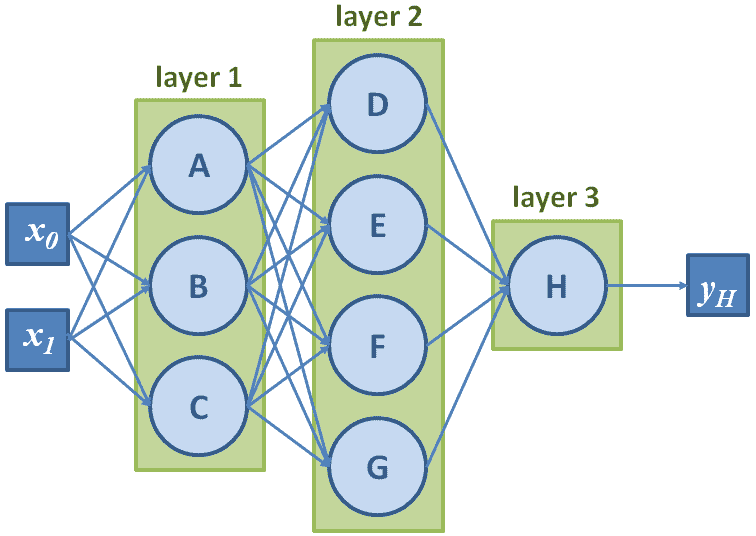
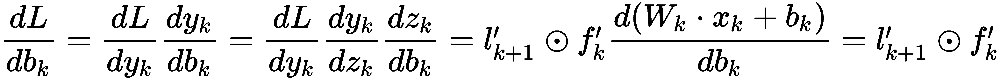

# 第一章：计算机视觉与神经网络

近年来，计算机视觉已经成长为创新的一个关键领域，越来越多的应用正在重新塑造企业和生活方式。我们将从简要介绍该领域及其历史开始，以便为读者提供一些背景信息。接着，我们将介绍人工神经网络，并解释它们如何革新计算机视觉。因为我们相信通过实践学习，因此在本章结束时，我们甚至会从零开始实现我们自己的神经网络！

本章将涉及以下主题：

+   计算机视觉及其作为一个迷人的当代领域的原因

+   我们是如何走到这一步的——从本地手工制作的描述符到深度神经网络

+   神经网络，它们究竟是什么，以及如何为一个基础的识别任务实现我们自己的神经网络

# 技术要求

在本书中，我们将使用 Python 3.5（或更高版本）。作为一种通用编程语言，Python 凭借其有用的内建特性和著名的库，已成为数据科学家们的主要工具。

对于本介绍性章节，我们将只使用两个基础库——NumPy 和 Matplotlib。它们可以在[www.numpy.org](http://www.numpy.org/)和[matplotlib.org](https://matplotlib.org/)上找到并进行安装。然而，我们建议使用 Anaconda（[www.anaconda.com](https://www.anaconda.com)），这是一个免费的 Python 发行版，使得包管理和部署变得简单。

完整的安装说明以及本章展示的所有代码，可以在 GitHub 上的[github.com/PacktPublishing/Hands-On-Computer-Vision-with-TensorFlow2/tree/master/Chapter01](https://github.com/PacktPublishing/Hands-On-Computer-Vision-with-TensorFlow2/tree/master/Chapter01)找到。

我们假设读者已经具备一些 Python 的知识，并且对图像表示（像素、通道等）和矩阵操作（形状、乘积等）有基本的理解。

# 计算机视觉的实际应用

计算机视觉如今无处不在，以至于它的定义在不同专家之间可能有很大的差异。在本节介绍中，我们将勾画计算机视觉的整体图景，重点介绍它的应用领域和面临的挑战。

# 介绍计算机视觉

计算机视觉很难定义，因为它位于多个研究和开发领域的交汇点，例如*计算机科学*（算法、数据处理和图形学）、*物理学*（光学和传感器）、*数学*（微积分和信息论）和*生物学*（视觉刺激和神经处理）。从本质上讲，计算机视觉可以总结为*从* *数字图像*中自动提取信息。

我们的大脑在视觉方面的表现令人惊叹。我们能够解读眼睛不断捕捉到的视觉刺激，瞬间区分不同物体，并识别出我们只见过一次的人脸，这一切都不可思议。对于计算机来说，图像只是像素块，是由红绿蓝值组成的矩阵，毫无其他意义。

计算机视觉的目标是教会计算机*如何像人类（及其他生物）一样理解这些像素*，甚至做得更好。事实上，计算机视觉已经取得了长足进展，尤其是在深度学习的兴起后，它在一些任务中已经达到了*超越人类*的表现，例如人脸验证和手写文字识别。

随着由全球最大 IT 公司推动的研究社区的高度活跃，以及数据和视觉传感器日益普及，越来越多的雄心勃勃的问题正在被解决：基于视觉的自动驾驶导航、基于内容的图像和视频检索，以及自动标注和增强等。这无疑是专家和新手们都充满期待的时代。

# 主要任务及其应用

基于计算机视觉的新产品每天都在出现（例如，工业控制系统、互动智能手机应用和监控系统），它们涵盖了广泛的任务。在本节中，我们将介绍其中的主要应用，并详细说明它们如何解决实际问题。

# 内容识别

计算机视觉的核心目标是*理解*图像，即从像素中提取有意义的、语义层面的信息（例如图像中出现的物体、它们的位置和数量）。这个通用问题可以分为多个子领域。以下是一个非详尽的列表。

# 物体分类

**物体分类**（或称**图像分类**）是将图像分配到预定义类别中的任务，示意图如下：


图 1.1：对人和车标签的分类器应用示例，应用于图像集

物体分类因 2012 年深度卷积神经网络首次成功应用于计算机视觉而成名（这一点将在本章后面介绍）。自那时以来，这一领域的进展非常迅速，以至于现在在各种应用场景中都达到了超越人类的表现（一个著名的例子是狗品种的分类；深度学习方法已经变得极其高效，能够识别出人类最好的朋友的区分特征）。

常见应用包括文本数字化（使用字符识别）和图像数据库的自动标注。

在第四章《*有影响力的分类工具*》中，我们将介绍先进的分类方法及其对计算机视觉的整体影响。

# 物体识别

而*物体分类*方法从预定义的集合中分配标签，*物体识别*（或*实例分类*）方法则学习*识别类别的特定实例*。

例如，一个*物体分类*工具可以配置为返回包含面部的图像，而*识别*方法则会专注于面部特征，以识别该人并在其他图像中识别他们（*识别*每一张面孔，如下图所示）：


图 1.2：应用于肖像的标识符示例

因此，物体识别可以看作是一个*聚类*数据集的过程，通常应用一些数据集分析概念（将在第六章，*增强与图像分割*中介绍）。

# 物体检测与定位

另一个任务是*图像中特定元素的检测*。它通常应用于监控应用中的人脸检测，甚至高级相机应用，医学中癌细胞的检测，工业工厂中损坏组件的检测等。

检测通常是进一步计算的前置步骤，它提供了图像的较小区域，以便分别进行分析（例如，裁剪某人的面部用于人脸识别，或提供围绕物体的边界框以评估其在增强现实应用中的姿态），如下图所示：


图 1.3：汽车检测器示例，返回候选物体的边界框

最先进的解决方案将在第五章，*物体检测模型*中详细介绍。

# 物体与实例分割

分割可以看作是更高级的检测类型。与仅提供识别元素的边界框不同，分割方法*返回标记所有像素的掩码*，这些像素属于特定类别或特定实例（请参见下图*图 1.4*）。这使得任务变得更加复杂，实际上是计算机视觉中少数几个仍远不及人类表现的任务之一（我们的脑袋确实在绘制视觉元素的精确边界/轮廓方面异常高效）。物体分割和实例分割在下图中进行了说明：


图 1.4：比较汽车的物体分割方法和实例分割方法的结果

在*图 1.4*中，虽然物体分割算法为所有属于*汽车*类的像素返回一个单一的掩膜，但实例分割算法则为每个被识别的*汽车*实例返回不同的掩膜。这对于机器人和智能汽车来说是一个关键任务，目的是让它们理解周围环境（例如，识别车辆前方的所有元素），但在医学影像中也有应用。精准分割医学扫描中的不同组织可以加速诊断并简化可视化（例如，为每个器官上色，或去除视图中的杂物）。这将在第六章《图像增强与分割》中进行展示，并针对自动驾驶应用提供具体实验。

# 姿态估计

姿态估计的含义可能根据目标任务不同而有所不同。对于刚性物体，它通常意味着*估计物体在三维空间中相对于相机的位置和方向*。这对于机器人尤其有用，使它们能够与环境互动（物体拾取、碰撞避免等）。它也常常应用于增强现实，通过叠加三维信息到物体上。

对于非刚性元素，姿态估计也可以意味着*估计其子部件之间的位置关系*。更具体地说，当将人类视为非刚性目标时，典型应用包括人类姿态的识别（站立、坐着、跑步等）或手语的理解。这些不同的情况在下图中有所示例：


图 1.5：刚性与非刚性姿态估计示例

在这两种情况下——无论是针对完整还是部分元素——算法的任务都是基于其在图像中的二维表示，评估它们在三维世界中相对于相机的实际位置和方向。

# 视频分析

计算机视觉不仅适用于单张图像，还适用于视频。如果视频流有时逐帧分析，则有些任务要求你将图像序列整体考虑，以便考虑时间一致性（这将是第八章《视频与递归神经网络》中的一个主题）。

# 实例跟踪

一些与视频流相关的任务可以通过简单地逐帧分析来完成（无记忆），但更高效的方法要么考虑图像间的差异，以指导处理到新帧，要么将完整的图像序列作为输入进行预测。*跟踪*，即*在视频流中定位特定元素*，就是这样一个任务的典型示例。

跟踪可以通过对每一帧应用检测和识别方法逐帧完成。然而，使用之前的结果来建模实例的运动，以便部分预测它们在未来帧中的位置要高效得多。因此，**运动连续性**在这里是一个关键前提，尽管它并不总是成立（例如，对于快速移动的物体）。

# 动作识别

另一方面，**动作识别**属于只能通过图像序列来执行的任务之一。就像我们不能仅凭单独且无序的词语理解一个句子一样，我们无法在不研究连续图像序列的情况下识别一个动作（参见*图 1.6*）。

识别一个动作意味着从预定义的一组中识别特定的运动（例如，针对人类动作——跳舞、游泳、画正方形，或画圆）。应用范围从监控（例如，检测异常或可疑行为）到人机交互（例如，手势控制设备）：


图 1.6：巴拉克·奥巴马是在挥手、指向某人、拍打蚊子，还是做其他事情？

只有完整的帧序列才能帮助标注这一动作。

由于物体识别可以分为物体分类、检测、分割等，动作识别也可以如此（动作分类、检测等）。

# 运动估计

一些方法侧重于*估计实际速度/轨迹*，而不是试图识别运动中的元素，这些方法在视频中被捕捉到。评估相对于表示场景的相机自身的运动（*自运动*）也是常见的做法。这在娱乐行业中尤为重要，例如，捕捉运动以便应用视觉效果，或在体育转播等电视直播中叠加 3D 信息。

# 内容感知图像编辑

除了分析其内容，计算机视觉方法还可以应用于*改善图像本身*。越来越多的基础图像处理工具（例如，图像去噪的低通滤波器）正被*更智能*的方法所取代，这些方法能够利用图像内容的先验知识来改善其视觉质量。例如，如果一个方法学习到鸟类的典型样子，它可以运用这些知识，将鸟类图片中的噪点像素替换为连贯的像素。这个概念适用于任何类型的图像修复，无论是去噪、去模糊，还是分辨率增强（*超分辨率*，如下面的图示所示）：


图 1.7：传统方法与深度学习方法在图像超分辨率上的比较。注意第二张图像中的细节更加清晰。

内容感知算法也被应用于一些摄影或艺术应用中，比如智能手机上的*智能人像*或*美颜*模式，旨在增强某些模型的特征，或者*智能去除/编辑*工具，能够去除不需要的元素并用连贯的背景替代。

在第六章《图像增强与分割》和第七章《复杂稀缺数据集的训练》中，我们将展示如何构建并实现这些*生成性*方法。

# 场景重建

最后，尽管我们在本书中不会深入讨论，*场景重建*是指在给定一张或多张图像的情况下，*恢复场景的 3D 几何结构*。一个简单的基于人类视觉的例子是立体匹配。这个过程是从不同视角对同一场景的两张图像进行匹配，以推算出每个可视化元素的距离。更先进的方法会使用多张图像，并将它们的内容匹配在一起，从而获取目标场景的 3D 模型。这种技术可以应用于物体、人类、建筑等的 3D 扫描。

# 计算机视觉简史

“如果你想定义未来，就要研究过去。”

——孔子

为了更好地理解计算机视觉的现状及其当前面临的挑战，我们建议快速回顾一下它的起源以及过去几十年的演变过程。

# 从初步成功到第一步

科学家们长期以来一直梦想着开发人工智能，包括*视觉智能*。计算机视觉的最初进展正是源自这一想法。

# 低估感知任务

计算机视觉作为一个领域，最早起步于 60 年代，源于**人工智能**（**AI**）研究社区。尽管当时深受*符号主义*哲学的影响，该哲学认为下棋和其他纯粹的智力活动是人类智慧的巅峰，这些研究人员低估了*低级动物功能*（如**感知**）的复杂性。1966 年，这些研究人员曾相信他们能够通过一个夏季项目重现人类感知，这成为计算机视觉领域的一个著名轶事。

马文·明斯基是最早提出基于感知构建 AI 系统方法的人之一（在《人工智能的步伐》一文中，发表在 1961 年的 IRE 会议录上）。他认为，利用模式识别、学习、规划和归纳等低级功能，有可能构建能够解决各种问题的机器。然而，这一理论直到 80 年代才得到深入研究。在 1984 年的《运动、视觉与智能》一书中，汉斯·莫拉维克指出，我们的神经系统通过进化过程已经发展出应对感知任务的能力（我们的大脑中超过 30%的区域专门负责视觉！）。

正如他所指出的，尽管计算机在算术运算方面表现得相当不错，但它们无法与我们感知能力相抗衡。从这个意义上说，编程让计算机解决纯粹的智力任务（例如，下棋）并不一定有助于开发在一般意义上或相对人类智能的智能系统。

# 手工制作局部特征

受人类感知的启发，计算机视觉的基本机制是简单直接的，并且自早期以来没有太大演变——其思想是*首先从原始像素中提取有意义的特征*，*然后将这些特征与已知的标记特征进行匹配*，以实现识别。

在计算机视觉中，**特征**是从与当前任务相关的数据中提取的信息片段（通常数学上表示为一维或二维向量）。特征包括图像中的一些关键点、特定的边缘、区分性补丁等。它们应该容易从新图像中获取，并包含进一步识别所需的必要信息。

研究人员曾提出越来越复杂的特征。最初考虑提取边缘和线条用于场景的基本几何理解或字符识别；接着，纹理和光照信息也被纳入考虑，促使了早期的物体分类器的发展。

在 90 年代，基于统计分析的特征，如**主成分分析**（**PCA**），首次成功应用于面部分类等复杂识别问题。一个经典的例子是由 Matthew Turk 和 Alex Pentland 提出的*特征脸*方法（《Eigenfaces for Recognition》，MIT 出版社，1991 年）。给定一个面部图像数据库，通过 PCA 计算出平均图像和*特征向量/图像*（也称为**特征向量/图像**）。这组小型的*特征图像*理论上可以线性组合，重建原始数据集中的任何面孔，甚至超出该数据集。换句话说，每张面部图像可以通过*特征图像*的加权和来逼近（参见*图 1.8*）。这意味着，一个特定的面孔仅通过每个*特征图像*的重建权重列表即可定义。因此，分类一个新面孔只需要将其分解为*特征图像*，获得其权重向量，然后与已知面孔的向量进行比较：


图 1.8：将肖像图像分解为平均图像和特征图像的加权和。这些平均图像和特征图像是在更大的面部数据集上计算得出的

另一种在 90 年代末出现并彻底改变了该领域的方法叫做**尺度不变特征变换**（**SIFT**）。顾名思义，这种方法由 David Lowe 提出（在《来自尺度不变关键点的独特图像特征》一文中，Elsevier），它通过一组对尺度和方向变化具有鲁棒性的特征来表示视觉对象。简而言之，这种方法在图像中寻找一些**关键点**（通过寻找其*梯度*中的不连续性），提取每个关键点周围的图像块，并为每个关键点计算一个特征向量（例如，图像块中或其梯度中的值的直方图）。然后，图像的**局部特征**及其相应的关键点可以用来在其他图像中匹配相似的视觉元素。在下图中，SIFT 方法应用于一张图片，使用了 OpenCV（[`docs.opencv.org/3.1.0/da/df5/tutorial_py_sift_intro.html`](https://docs.opencv.org/3.1.0/da/df5/tutorial_py_sift_intro.html)）。对于每个局部化的关键点，圆圈的半径代表考虑用于特征计算的图像块的大小，线条表示特征方向（即邻域梯度的主要方向）：


图 1.9：表示从图像中提取的 SIFT 关键点（使用 OpenCV）

随着时间的推移，出现了更先进的方法——这些方法提供了更鲁棒的方式来提取关键点、计算和结合区分性特征——但它们遵循了相同的总体流程（从一张图像中提取特征，并将其与其他图像的特征进行比较）。

# 在此基础上加入一些机器学习

然而，很快就清楚了，提取鲁棒的、区分度高的特征只是完成识别任务的一半工作。例如，同一类中的不同元素可能看起来完全不同（比如不同品种的狗），因此它们共享的共同特征可能仅限于少数几个。因此，与图像匹配任务不同，更高层次的问题，如语义分类，不能仅仅通过比较查询图像中的像素特征与标签图片中的像素特征来解决（如果必须与大型标签数据集中的每张图片进行比较，这种过程在处理时间上也可能变得不理想）。

这时，*机器学习*发挥了作用。随着越来越多的研究人员在 90 年代尝试解决图像分类问题，基于特征来区分图像的统计方法逐渐出现。**支持向量机**（**SVMs**），由 Vladimir Vapnik 和 Corinna Cortes 标准化（《支持向量网络》，Springer，1995），在很长一段时间内，是从复杂结构（如图像）到简单标签（如类别）进行映射学习的默认解决方案。

给定一组图像特征及其二进制标签（例如，*猫* 或 *非猫*，如 *图 1.10* 所示），可以优化 SVM 来学习分离一个类别与另一个类别的函数，基于提取的特征。一旦获得该函数，就只需将其应用于未知图像的特征向量，便能将其映射到两个类别中的一个（后来的 SVM 还可以扩展到更多类别）。在下面的示意图中，SVM 被训练回归一个线性函数，通过从图像中提取的特征来分离两个类别（在这个例子中，特征作为只有两个值的向量）：


图 1.10：一个由 SVM 回归的线性函数的示意图。请注意，使用一种叫做核技巧的概念，SVM 也可以找到非线性解法来分离不同的类别。

多年来，计算机视觉领域也借用了其他机器学习算法，比如*随机森林*、*词袋模型*、*贝叶斯* *模型*，显然还有*神经网络*。

# 深度学习的崛起

那么，神经网络是如何接管计算机视觉，并成为我们今天所称之为**深度学习**的呢？本节提供了一些答案，详细介绍了这一强大工具的技术发展。

# 早期的尝试和失败

可能会让人感到惊讶的是，人工神经网络的出现甚至早于现代计算机视觉的诞生。它们的发展是典型的“发明出现得太早”的故事。

# 感知机的兴起与衰落

在 50 年代，Frank Rosenblatt 提出了**感知机**，这是一种受神经元启发的机器学习算法，也是第一个神经网络的基础构成元素（《感知机：一种用于信息存储和大脑组织的概率模型》，美国心理学会，1958）。在适当的学习过程中，这种方法已经能够识别字符。然而，这种热潮是短暂的。Marvin Minsky（人工智能的奠基人之一）和 Seymor Papert 很快证明感知机无法学习像 `XOR` 这样的简单函数（`XOR`，异或函数，对于两个二进制输入值，当且仅当一个输入为 `1` 时，输出为 `1`，否则输出 `0`）。今天看来这很有道理——因为当时的感知机是基于线性函数建模的，而 `XOR` 是一个非线性函数——但在那个时候，这让研究进展停滞了多年。

# 过于庞大，难以扩展

直到 70 年代末到 80 年代初，神经网络才重新获得一些关注。几篇研究论文介绍了如何通过将多个*感知器*层堆叠在一起，使用一种相当简单的方案——反向传播，来训练神经网络。正如我们在下一部分中将详细介绍的，这一训练过程通过计算网络的误差并将其反向传播通过感知器层，从而使用*导数*更新它们的参数。很快，第一个**卷积神经网络**（**CNN**），即当前识别方法的先驱，被开发出来并成功应用于手写字符的识别。

可惜的是，这些方法计算量巨大，根本无法扩展到更大的问题上。因此，研究人员采用了更轻量的机器学习方法，如支持向量机（SVM），神经网络的应用又停滞了十年。那么，是什么使它们复兴，带来了我们今天所知的深度学习时代呢？

# 复兴的原因

这种复兴的原因是双重的，根源在于互联网的爆炸性发展和硬件效率的提升。

# 互联网——数据科学的新埃尔多拉多

互联网不仅仅是通信的革命；它也深刻地改变了数据科学。科学家们通过将图片和内容上传到网上，变得更加容易分享，进而催生了用于实验和基准测试的公共数据集。此外，不仅仅是研究人员，很快全世界的每个人都开始在线发布新内容，以指数级的速度分享图片、视频等。这开启了*大数据*和*数据科学的黄金时代*，互联网成为了新的埃尔多拉多。

通过简单地索引不断发布的内容，图像和视频数据集的规模达到了前所未有的大小，从*Caltech-101*（10,000 张图像，由 Li Fei-Fei 等人于 2003 年发布，Elsevier）到*ImageNet*（1400 万+张图像，由 Jia Deng 等人于 2009 年发布，IEEE）或*Youtube-8M*（800 万+视频，由 Sami Abu-El-Haija 等人于 2016 年发布，包括 Google）。甚至企业和政府也很快意识到收集和发布数据集在特定领域推动创新的诸多优势（例如，英国政府发布的视频监控数据集 i-LIDS，Facebook 和微软资助的图像标注数据集 COCO 等）。

随着大量数据的涌现，涵盖了各种使用场景，新的大门被打开了（*数据饥渴*算法，也就是需要大量训练样本才能收敛的方法终于可以成功应用），同时也提出了新的挑战（例如，如何高效处理这些信息）。

# 比以往更强大的力量

幸运的是，随着互联网的蓬勃发展，计算能力也在提升。硬件变得越来越便宜，同时也越来越快，似乎遵循了摩尔定律（该定律表明处理器速度每两年应翻倍——这一规律已经保持了近四十年，尽管现在观察到有所放缓）。随着计算机变得更快，它们也变得更适合计算机视觉。对此，我们要感谢视频游戏。

**图形处理单元**（**GPU**）是一种计算机组件，即专门设计用于处理运行 3D 游戏所需操作的芯片。因此，GPU 被优化用于生成或操作图像，能够并行化这些繁重的矩阵运算。尽管第一款 GPU 在 80 年代就已经构思出来，但它们直到新千年到来时才变得价格合理并流行开来。

2007 年，NVIDIA（主要设计 GPU 的公司之一）发布了**CUDA**的第一个版本，这是一种编程语言，允许开发者直接为兼容的 GPU 编程。类似的语言**OpenCL**随后也出现了。有了这些新工具，人们开始利用 GPU 的强大性能来处理新的任务，如机器学习和计算机视觉。

# 深度学习或人工神经网络的重新品牌化

终于，数据需求量大、计算密集型的算法有了展现的机会。随着*大数据*和*云计算*的兴起，*深度学习*突然无处不在。

# 什么让学习变得更深刻？

实际上，**深度学习**这个术语早在 80 年代就已经被提出，当时神经网络首次开始堆叠两层或三层神经元。与早期更简单的解决方案不同，*深度学习*重新组合了*更深*的神经网络，也就是拥有多个*隐藏层*的网络——这些额外的层设置在输入层和输出层之间。每一层处理它的输入，并将结果传递给下一层，所有层都经过训练以提取越来越抽象的信息。例如，神经网络的第一层将学习如何对图像中的基本特征作出反应，如边缘、线条或颜色渐变；下一层将学习如何利用这些线索提取更高级的特征；如此继续，直到最后一层，它推断出所需的输出（例如预测的类别或检测结果）。

然而，*深度学习*直到 2006 年才真正开始应用，那时 Geoff Hinton 和他的同事提出了一种有效的方法，可以一层一层地训练这些更深的模型，直到达到所需的深度（《深度信念网络的快速学习算法》，麻省理工学院出版社，2006 年）。

# 深度学习时代

随着神经网络研究重新回到正轨，深度学习开始快速发展，直到 2012 年发生了一次重大突破，最终让深度学习在当代声名鹊起。自从 ImageNet 发布以来，每年都会组织一次比赛（**ImageNet 大规模视觉识别挑战赛**（**ILSVRC**）—[image-net.org/challenges/LSVRC](http://image-net.org/challenges/LSVRC/)），供研究人员提交他们最新的分类算法，并与其他参赛者在 ImageNet 上的表现进行对比。2010 年和 2011 年的获胜解决方案分别有 28%和 26%的分类错误率，并采用了传统的概念，如 SIFT 特征和 SVM。然后，2012 年版出现了，一个新的研究团队将识别错误率降至令人震惊的 16%，远远甩开了其他参赛者。

在描述这一成就的论文中（*使用深度卷积神经网络进行 ImageNet 分类*，NIPS，2012），Alex Krizhevsky、Ilya Sutskever 和 Geoff Hinton 提出了现代识别方法的基础。他们设计了一个 8 层神经网络，后来被命名为**AlexNet**，该网络包含几个*卷积层*以及其他现代组件，如**dropout**和**修正线性激活单元**（**ReLUs**），这些将在第三章中详细介绍，*现代神经网络*，因为它们已成为计算机视觉的核心。更重要的是，他们使用 CUDA 实现了这一方法，使得它可以在 GPU 上运行，从而终于使得在合理的时间内训练深度神经网络成为可能，并能够迭代处理像 ImageNet 这样庞大的数据集。

同年，Google 展示了如何将**云计算**的进步应用于计算机视觉。他们使用从 YouTube 视频中提取的 1000 万张随机图像的数据集，训练神经网络识别包含猫的图像，并将训练过程并行化到 16,000 台机器上，最终使得准确率相比以前的方法翻倍。

就这样，深度学习时代开始了，我们正身处其中。每个人都加入了这一领域，提出了越来越深的模型、更先进的训练方案和适用于便携设备的轻量化解决方案。这是一个激动人心的时期，随着深度学习解决方案的效率不断提高，越来越多的人尝试将其应用于新的应用和领域。通过本书，我们希望传达一些当前的热情，并为您提供现代方法的概览以及如何开发解决方案。

# 入门神经网络

到现在为止，我们知道神经网络构成了深度学习的核心，并且是现代计算机视觉的强大工具。但它们究竟是什么呢？它们是如何工作的？在接下来的部分，我们不仅会解决它们效率背后的理论解释，还将直接将这些知识应用于简单网络在识别任务中的实现和应用。

# 构建神经网络

**人工神经网络**（**ANNs**），或简称**神经网络**（**NNs**），是强大的机器学习工具，擅长处理信息、识别常见模式或检测新模式，并逼近复杂过程。它们之所以如此强大，归功于它们的结构，接下来我们将探讨这一点。

# 模拟神经元

众所周知，神经元是我们思维和反应的基本支撑。可能不那么显而易见的是它们是如何工作的，以及它们如何被模拟。

# 生物学启发

人工神经网络（ANNs）大致受动物大脑工作的启发。我们的脑袋是一个复杂的神经元网络，每个神经元相互传递信息并将感官输入（作为电信号和化学信号）转化为思维和行动。每个神经元通过其*树突*接收电输入，树突是细胞纤维，将电信号从*突触*（与前一个神经元的连接处）传播到*胞体*（神经元的主要部分）。如果积累的电刺激超过特定阈值，细胞会被*激活*，电冲动会通过细胞的*轴突*（神经元的*输出电缆*，末端有多个突触连接到其他神经元）向下一个神经元*传播*。因此，每个神经元都可以看作一个非常*简单的信号处理单元*，一旦堆叠在一起，就能实现我们现在正在进行的思维过程。

# 数学模型

受其生物学对照物（见*图 1.11*）的启发，人工神经元接收多个*输入*（每个都是一个数字），将它们加总在一起，最后应用*激活函数*以获得*输出*信号，输出信号可以传递给网络中的下一个神经元（这可以视为一个有向图）：


图 1.11：左侧是一个简化的生物神经元，右侧是其人工对照物

输入的求和通常是加权进行的。每个**输入**会根据一个特定于此**输入**的权重进行放大或缩小。这些*权重*是网络训练阶段调整的参数，以便神经元对正确的特征做出反应。通常，还会训练并使用另一个参数来进行此求和过程——神经元的*偏置*。其值简单地添加到加权和中，作为*偏移*。

让我们迅速将这个过程数学化。假设我们有一个神经元，接受两个输入值，`x[0]` 和 `x[1]`。每个值都会分别乘以一个权重因子，`w[0]` 和 `w[1]`，然后将它们加总在一起，再加上一个可选的偏置，`b`。为了简化，我们可以将输入值表示为水平向量，`x`，将权重表示为垂直向量，`w`：


使用这种公式，整个操作可以简单地表达如下：


这个步骤很简单，对吧？两个向量之间的*点积*处理了加权求和：


现在，输入已经被缩放并汇总为结果 `z`，我们必须对其应用 *激活函数* 以获得神经元的输出。如果我们回到生物神经元的类比，它的激活函数将是一个二值函数，例如*如果* `y` *超过阈值* `t`，则返回 1 的电信号，否则返回 0*（通常 `t` = 0）。如果我们将其形式化，激活函数 `y` = `f`(`z`) 可以表示为：


**阶跃函数**是原始感知器的关键组成部分，但自那时以来，引入了更先进的激活函数，它们具有更多的优势特性，例如*非线性*（用于建模更复杂的行为）和*连续可微性*（对训练过程至关重要，我们稍后将解释）。最常见的激活函数如下：

+   **Sigmoid** 函数，   （其中 𝑒 为指数函数）

+   **双曲正切函数**， 

+   **修正线性单元**（**ReLU**），  

上述常见激活函数的图示如下：


图 1.12：绘制常见激活函数

无论如何，就这样！我们已经建模了一个简单的人工神经元。它能够接收信号、处理它并输出一个可以*转发*（这是机器学习中常用的术语）到其他神经元的值，从而构建网络。

如果没有非线性激活函数，链式神经元将等同于只有一个神经元。例如，如果我们有一个带参数 `w`[`A`] 和 `b`[`A`] 的线性神经元，后接一个带参数 `w`[`B`] 和 `b`[`B`] 的线性神经元，那么 ，其中 `w` = `w`[`A`]**^()*] `w`[`B`]，并且 `b` = `b`[`A`] + `b`[`B`]。因此，如果我们想创建复杂的模型，非线性激活函数是必要的。

# 实现

这样的模型可以在 Python 中非常容易地实现（使用 NumPy 进行向量和矩阵操作）：

```py
import numpy as np

class Neuron(object):
    """A simple feed-forward artificial neuron.
    Args:
        num_inputs (int): The input vector size / number of input values.
        activation_fn (callable): The activation function.
    Attributes:
        W (ndarray): The weight values for each input.
        b (float): The bias value, added to the weighted sum.
        activation_fn (callable): The activation function.
    """
    def __init__(self, num_inputs, activation_fn):
        super().__init__()
        # Randomly initializing the weight vector and bias value:
        self.W = np.random.rand(num_inputs)
        self.b = np.random.rand(1)
        self.activation_fn = activation_fn

    def forward(self, x):
        """Forward the input signal through the neuron."""
        z = np.dot(x, self.W) + self.b
        return self.activation_function(z)
```

正如我们所看到的，这直接是我们之前定义的数学模型的适应。使用这个人工神经元同样简单。让我们实例化一个感知器（一个使用阶跃函数作为激活方法的神经元），并将一个随机输入通过它转发：

```py
# Fixing the random number generator's seed, for reproducible results:
np.random.seed(42)
# Random input column array of 3 values (shape = `(1, 3)`)
x = np.random.rand(3).reshape(1, 3)
# > [[0.37454012 0.95071431 0.73199394]]

# Instantiating a Perceptron (simple neuron with step function):
step_fn = lambda y: 0 if y <= 0 else 1
perceptron = Neuron(num_inputs=x.size, activation_fn=step_fn)
# > perceptron.weights    = [0.59865848 0.15601864 0.15599452]
# > perceptron.bias       = [0.05808361]

out = perceptron.forward(x)
# > 1
```

我们建议在下一节中放大它们的维度之前，花些时间实验不同的输入和神经元参数。

# 将神经元层叠在一起

通常，神经网络被组织成*层*，也就是一组通常接收相同输入并应用相同操作的神经元（例如，应用相同的激活函数，尽管每个神经元首先会用自己的特定权重对输入进行加权求和）。

# 数学模型

在网络中，信息从输入层流向输出层，中间有一个或多个*隐藏层*。在*图 1.13*中，三个神经元*`A`*、*`B`*和*`C`*属于输入层，神经元*`H`*属于输出或激活层，神经元*`D`*、*`E`*、*`F`*和*`G`*属于隐藏层。第一层有一个大小为 2 的输入`x`，第二层（隐藏层）将前一层的三个激活值作为输入，依此类推。这样的层，每个神经元都与前一层的所有值相连，被称为**全连接**或**密集**层：



图 1.13：一个 3 层神经网络，包含两个输入值和一个最终输出

再次，我们可以通过用向量和矩阵表示这些元素来简化计算。以下操作由第一层完成：


这可以表达如下：


为了得到前面的方程，我们必须按如下方式定义变量：


因此，第一层的激活可以写成一个向量，，该向量可以直接作为输入向量传递到下一层，依此类推，直到最后一层。

# 实现

像单个神经元一样，这个模型可以在 Python 中实现。实际上，我们甚至不需要对`Neuron`类做太多编辑：

```py
import numpy as np

class FullyConnectedLayer(object):
    """A simple fully-connected NN layer.
    Args:
        num_inputs (int): The input vector size/number of input values.
        layer_size (int): The output vector size/number of neurons.
        activation_fn (callable): The activation function for this layer.
    Attributes:
        W (ndarray): The weight values for each input.
        b (ndarray): The bias value, added to the weighted sum.
        size (int): The layer size/number of neurons.
        activation_fn (callable): The neurons' activation function.
    """
    def __init__(self, num_inputs, layer_size, activation_fn):
        super().__init__()
        # Randomly initializing the parameters (using a normal distribution this time):
        self.W = np.random.standard_normal((num_inputs, layer_size))
        self.b = np.random.standard_normal(layer_size)
        self.size = layer_size
        self.activation_fn = activation_fn

    def forward(self, x):
        """Forward the input signal through the layer."""
        z = np.dot(x, self.W) + self.b
        return self.activation_fn(z)
```

我们只需要改变一些变量的*维度*，以反映每层中神经元的多样性。通过这种实现，我们的层甚至可以一次处理多个输入！传递一个单列向量`x`（形状为 1 × `s`，其中`x`包含`s`个值）或一堆列向量（形状为`n` × `s`，其中`n`为样本数）对于我们的矩阵计算没有任何影响，我们的层将正确输出堆叠的结果（假设`b`被加到每一行）：

```py
np.random.seed(42)
# Random input column-vectors of 2 values (shape = `(1, 2)`):
x1 = np.random.uniform(-1, 1, 2).reshape(1, 2)
# > [[-0.25091976  0.90142861]]
x2 = np.random.uniform(-1, 1, 2).reshape(1, 2)    
# > [[0.46398788 0.19731697]]

relu_fn = lambda y: np.maximum(y, 0)    # Defining our activation function
layer = FullyConnectedLayer(2, 3, relu_fn)

# Our layer can process x1 and x2 separately...
out1 = layer.forward(x1)
# > [[0.28712364 0\.         0.33478571]]
out2 = layer.forward(x2)
# > [[0\.         0\.         1.08175419]]
# ... or together:
x12 = np.concatenate((x1, x2))  # stack of input vectors, of shape `(2, 2)`
out12 = layer.forward(x12)
# > [[0.28712364 0\.         0.33478571]
#    [0\.         0\.         1.08175419]]

```

一堆输入数据通常被称为**批次**。

通过这个实现，现在只是将全连接层串联起来，构建简单的神经网络。

# 将我们的网络应用于分类

我们知道如何定义层，但尚未初始化并将它们连接成计算机视觉的网络。为了演示如何做到这一点，我们将处理一个著名的识别任务。

# 设置任务

对手写数字图像进行分类（即识别图像中是否包含`0`、`1`等数字）是计算机视觉中的一个历史性问题。**修改版国家标准与技术研究院**（**MNIST**）数据集（[`yann.lecun.com/exdb/mnist/`](http://yann.lecun.com/exdb/mnist/)），其中包含了 70,000 张手写数字的灰度图像（*28 × 28* 像素），多年来一直作为该识别任务的参考，以便人们可以测试他们的方法（此数据集的所有版权归 Yann LeCun 和 Corinna Cortes 所有，见下图）：


图 1.14：MNIST 数据集中每个数字的十个样本

对于数字分类，我们需要的是一个网络，它接收这些图像中的一张作为输入，并返回一个输出向量，表示*网络认为该图像对应于每个类别的程度*。输入向量包含*28 × 28 = 784*个值，而输出向量包含 10 个值（对应 10 个不同的数字，从`0`到`9`）。在这些之间，定义隐藏层的数量和大小是我们的任务。为了预测图像的类别，只需*将图像向量通过网络前馈，收集输出*，然后*返回得分最高的类别*。

这些*信念*分数通常会转换为概率，以简化进一步的计算或解释。例如，假设一个分类网络对*狗*类给出了 9 的分数，对其他类*猫*给出了 1 的分数。这相当于说，*根据这个网络，图像显示狗的概率为 9/10，显示猫的概率为 1/10*。

在我们实现解决方案之前，先通过加载 MNIST 数据来准备训练和测试方法。为了简便起见，我们将使用`mnist` Python 模块（[`github.com/datapythonista/mnist`](https://github.com/datapythonista/mnist)），该模块由 Marc Garcia 开发（采用 BSD 3-Clause *New*或*Revised*许可，并且已安装在本章的源代码目录中）：

```py
import numpy as np
import mnist
np.random.seed(42)

# Loading the training and testing data:
X_train, y_train = mnist.train_images(), mnist.train_labels()
X_test,  y_test  = mnist.test_images(), mnist.test_labels()
num_classes = 10    # classes are the digits from 0 to 9

# We transform the images into column vectors (as inputs for our NN):
X_train, X_test = X_train.reshape(-1, 28*28), X_test.reshape(-1, 28*28)
# We "one-hot" the labels (as targets for our NN), for instance, transform label `4` into vector `[0, 0, 0, 0, 1, 0, 0, 0, 0, 0]`:
y_train = np.eye(num_classes)[y_train]
```

有关数据集预处理和可视化的更详细操作，请参见本章的源代码。

# 实现网络

对于神经网络本身，我们需要将各个层组合在一起，并添加一些方法，供网络前向传播和根据输出向量预测类别使用。层的实现完成后，以下代码应该不言自明：

```py
import numpy as np
from layer import FullyConnectedLayer

def sigmoid(x): # Apply the sigmoid function to the elements of x.
    return 1 / (1 + np.exp(-x)) # y

class SimpleNetwork(object):
    """A simple fully-connected NN.
    Args:
        num_inputs (int): The input vector size / number of input values.
        num_outputs (int): The output vector size.
        hidden_layers_sizes (list): A list of sizes for each hidden layer to be added to the network
    Attributes:
        layers (list): The list of layers forming this simple network.
    """

    def __init__(self, num_inputs, num_outputs, hidden_layers_sizes=(64, 32)):
        super().__init__()
        # We build the list of layers composing the network:
        sizes = [num_inputs, *hidden_layers_sizes, num_outputs]
        self.layers = [
            FullyConnectedLayer(sizes[i], sizes[i + 1], sigmoid)
            for i in range(len(sizes) - 1)]

    def forward(self, x):
        """Forward the input vector `x` through the layers."""
        for layer in self.layers: # from the input layer to the output one
            x = layer.forward(x)
        return x

    def predict(self, x):
        """Compute the output corresponding to `x`, and return the index of the largest output value"""
        estimations = self.forward(x)
        best_class = np.argmax(estimations)
        return best_class

    def evaluate_accuracy(self, X_val, y_val):
        """Evaluate the network's accuracy on a validation dataset."""
        num_corrects = 0
        for i in range(len(X_val)):
            if self.predict(X_val[i]) == y_val[i]:
                num_corrects += 1
        return num_corrects / len(X_val)
```

我们刚刚实现了一个前馈神经网络，可以用于分类！现在是时候将其应用到我们的任务中了：

```py
# Network for MNIST images, with 2 hidden layers of size 64 and 32:
mnist_classifier = SimpleNetwork(X_train.shape[1], num_classes, [64, 32])

# ... and we evaluate its accuracy on the MNIST test set:
accuracy = mnist_classifier.evaluate_accuracy(X_test, y_test)
print("accuracy = {:.2f}%".format(accuracy * 100))
# > accuracy = 12.06%
```

我们的准确率只有~12.06%。这可能看起来令人失望，因为这个准确率几乎与随机猜测相当。但这也是可以理解的——目前我们的网络是由随机参数定义的。我们需要根据我们的使用案例来训练它，这一任务将在下一节中处理。

# 训练神经网络

**神经网络**是一种特殊的算法，因为它们需要进行*训练*，也就是说，它们的参数需要通过从可用数据中学习来优化，以完成特定任务。一旦网络优化到能够在*训练数据集*上表现良好，它们就可以在新的、相似的数据上使用，以提供令人满意的结果（前提是训练得当）。

在解决我们的 MNIST 任务之前，我们将提供一些理论背景，涵盖不同的学习策略，并展示训练是如何实际进行的。然后，我们将直接将其中的一些概念应用到我们的例子中，以便我们的简单网络最终学会如何解决识别任务！

# 学习策略

在教授神经网络时，根据任务和训练数据的可用性，有三种主要的学习范式。

# 有监督学习

*有监督学习* 可能是最常见的学习范式，它也确实是最容易理解的。当我们想要*教神经网络进行两种模态之间的映射*时（例如，将图像映射到它们的类别标签或语义掩膜），就会应用这种方法。它需要访问一个包含*图像*和它们的*真实标签*（如每张图像的类别信息或语义掩膜）的训练数据集。

基于此，训练过程变得直接明了：

+   将图像输入网络并收集其结果（即预测标签）。

+   评估网络的*损失*，即在将网络预测与真实标签对比时，预测的错误程度。

+   相应地调整网络参数，以减少损失。

+   重复直到网络*收敛*，即直到它在这个训练数据上无法再进一步改善。

因此，这种策略值得称为*有监督的*——一个实体（我们）通过为每个预测提供反馈（从真实标签计算出的损失）来监督网络的训练，这样方法可以通过反复练习来学习（*正确/错误*；*再试一次*）。

# 无监督学习

然而，当我们没有任何真实标签信息时，如何训练一个网络呢？*无监督学习*是一个答案。这里的想法是构建一个函数，*仅基于输入和对应输出来计算网络的损失*。

这种策略非常适用于聚类（将具有相似属性的图像分组）或压缩（在保持某些属性的同时减少内容大小）等应用。对于聚类，损失函数可以衡量一个簇中的图像与其他簇中的图像的相似度。对于压缩，损失函数可以衡量压缩数据中重要属性与原始数据中重要属性的保持情况。

无监督学习因此需要一些*专业知识*，以便我们能够提出有意义的损失函数。

# 强化学习

*强化学习*是一种**互动策略**。一个*智能体*在*环境*中导航（例如，一个机器人在房间内移动，或者一个视频游戏角色通过关卡）。智能体有一组预定义的动作列表（*走*、*转弯*、*跳跃*等），每次动作后，它都会进入一个新的*状态*。一些状态可能会带来*奖励*，这些奖励可以是即时的或延迟的，也可以是正向的或负向的（例如，视频游戏角色触碰到一个奖励物品时会得到正向奖励，或被敌人击中时会受到负向奖励）。

在每个时刻，神经网络只会接收到来自环境的*观察*（例如，机器人的视觉信息或视频游戏屏幕）和奖励反馈（*胡萝卜与大棒*）。根据这些，它需要学习什么能带来更高的奖励，并*相应地估计智能体的最佳短期或长期策略*。换句话说，它需要估计一系列动作，这些动作将最大化最终的奖励。

强化学习是一种强大的范式，但它在计算机视觉领域的应用较少。在这里我们将不再进一步介绍，但我们鼓励机器学习爱好者深入了解。

# 教学时间

无论采用什么学习策略，整体的训练步骤都是相同的。给定一些训练数据，网络会做出预测并获得反馈（例如损失函数的结果），然后用这些反馈来更新网络的参数。这些步骤会不断重复，直到网络无法进一步优化为止。在本节中，我们将详细说明并实现这一过程，从损失计算到权重优化。

# 评估损失

*损失函数*的目标是评估网络在当前权重下的表现。更正式地说，这个函数表示*预测质量与网络参数*（如权重和偏置）之间的关系。损失越小，参数就越适合所选任务。

由于损失函数代表了网络的目标（*返回正确的标签*，*在保持内容的同时压缩图像*，等等），所以任务越多，损失函数的种类就越多。然而，有些损失函数比其他的更常用。这就是*平方和*函数，也叫**L2 损失**（基于 L2 范数），它在监督学习中无处不在。这个函数简单地计算输出向量`y`（我们的网络估计的每类概率）与真实值向量*y^(true)*（每个类别值为零，除了正确的类别）的每个元素之间的平方差：


还有许多其他具有不同特性的损失函数，例如**L1 损失**，它计算向量之间的*绝对差*，或者**二元交叉熵**（**BCE**）损失，它在将预测的概率与期望值比较之前，会将其转换为对数尺度：


对数运算将概率从[0, 1]转换为-![，0]。因此，通过将结果乘以-1，损失值从+移动到 0，因为神经网络学习如何正确预测。请注意，交叉熵函数也可以应用于多类别问题（不仅仅是二元问题）。

人们通常会将损失除以向量中的元素数量，也就是说，计算均值而不是总和。**均方误差**（**MSE**）是 L2 损失的平均版本，而**均绝对误差**（**MAE**）是 L1 损失的平均版本。

目前，我们将以 L2 损失为例。我们将使用它进行后续的理论解释，并用它来训练我们的 MNIST 分类器。

# 反向传播损失

我们如何更新网络参数以使它们最小化损失呢？对于每个参数，我们需要知道稍微改变它的值会如何影响损失。如果我们知道哪些改变会稍微减少损失，那么只需要应用这些改变，并重复这一过程直到达到最小值。这正是损失函数的*梯度*所表达的内容，也是*梯度下降*过程的本质。

在每次训练迭代中，都会计算损失对网络每个参数的导数。这些导数表示需要对参数进行哪些小的调整（由于梯度表示的是函数增加的方向，因此需要乘以-1，因为我们希望最小化损失）。可以将其视为沿着损失函数相对于每个参数的*slope*逐步下降，因此这个迭代过程被称为**梯度下降**（参见下图）：


图 1.15：说明梯度下降如何优化神经网络的参数`P`

现在的问题是，我们如何计算所有这些导数（作为每个参数的*斜率*值）？这时，**链式法则**为我们提供了帮助。链式法则告诉我们，关于某一层的参数（`k`）的导数可以通过该层的输入和输出值（`x`[`k`]，`y`[`k`]）以及下一层（`k` + 1）的导数*简单*地计算出来。更正式地，对于该层的权重`W`[`k`]，我们有以下公式：


在这里，`l`'[`k`+1]是计算出的关于层`k` + 1 相对于其输入* x*[`k`+1] = `y`[`k`]的导数，其中`f`'[`k`]是该层激活函数的导数，是`x`的*转置*。注意，`z`[`k`]表示层`k`执行的加权求和结果（即，在输入层激活函数之前的结果），如在*层叠神经元*部分中定义。最后，符号表示两个向量/矩阵之间的*逐元素相乘*，也称为*Hadamard 积*。如以下方程所示，它基本上是成对地相乘元素：


回到链式法则，关于偏置的导数可以通过类似的方式计算，如下所示：



最后，为了全面性，我们得到以下方程：


这些计算看起来可能很复杂，但我们只需要理解它们表示什么——我们可以递归地计算每个参数如何影响损失，逐层向后进行（使用某一层的导数来计算前一层的导数）。这个概念也可以通过将神经网络表示为*计算图*来说明，即将数学操作链接在一起的图（第一层的加权求和操作执行，然后其结果传递给第一个激活函数，接着它的输出传递给第二层的操作，以此类推）。因此，计算整个神经网络相对于某些输入的结果，实际上就是将数据通过这个计算图进行*前向传递*，而获取相对于每个参数的导数，实际上是通过反向传播结果损失来实现的，因此这个过程被称为**反向传播**。

为了从输出层开始这个过程，需要计算损失相对于输出值的导数（参见前面的公式）。因此，损失函数需要容易求导。例如，L2 损失的导数就是以下内容：


如前所述，一旦我们知道每个参数的损失导数，接下来的任务就是相应地更新它们：


正如我们所见，导数通常会乘以一个因子  (*epsilon*)，然后用于更新参数。这个因子被称为**学习率**。它有助于控制每次迭代时每个参数的更新强度。较大的学习率可能让网络学习得更快，但也有可能步伐过大，导致网络 *错过* 损失的最小值。因此，学习率的值需要小心设置。现在，让我们总结一下完整的训练过程：

1.  选择接下来的 `n` 张训练图像，并将它们输入到网络中。

1.  计算并反向传播损失，使用链式法则计算相对于各层参数的导数。

1.  使用相应导数的值（按学习率缩放）来更新参数。

1.  重复步骤 1 到 3，遍历整个训练集。

1.  重复步骤 1 到 4，直到收敛或达到固定的迭代次数。

对整个训练集进行一次迭代（*步骤 1*到`4`）被称为**一个周期**（**epoch**）。如果 `n` = 1 且训练样本是从剩余图像中随机选择的，那么这个过程被称为**随机梯度下降**（**SGD**），这种方法易于实现和可视化，但速度较慢（需要更多更新）且 *更嘈杂*。人们更倾向于使用 *小批量随机梯度下降*。这意味着使用较大的 `n` 值（受到计算机性能的限制），这样梯度会在每个 *mini-batch*（或更简单地称为 *batch*）的 `n` 个随机训练样本上平均，从而减少了噪声。

现在，术语 SGD 被广泛使用，不论 `n` 的值是多少。

本节中，我们已经讲解了神经网络的训练过程。现在是时候将其付诸实践了！

# 教会我们的网络进行分类

到目前为止，我们仅实现了网络及其层的前向传播功能。首先，让我们更新 `FullyConnectedLayer` 类，以便我们可以为反向传播和优化添加方法：

```py
class FullyConnectedLayer(object):
    # [...] (code unchanged)
    def __init__(self, num_inputs, layer_size, activation_fn, d_activation_fn):
        # [...] (code unchanged)
        self.d_activation_fn = d_activation_fn # Deriv. activation function 
        self.x, self.y, self.dL_dW, self.dL_db = 0, 0, 0, 0 # Storage attr.

    def forward(self, x):
        z = np.dot(x, self.W) + self.b
        self.y = self.activation_fn(z)
        self.x = x  # we store values for back-propagation
        return self.y

    def backward(self, dL_dy):
        """Back-propagate the loss."""
        dy_dz = self.d_activation_fn(self.y)  # = f'
        dL_dz = (dL_dy * dy_dz) # dL/dz = dL/dy * dy/dz = l'_{k+1} * f'
        dz_dw = self.x.T
        dz_dx = self.W.T
        dz_db = np.ones(dL_dy.shape[0]) # dz/db = "ones"-vector
        # Computing and storing dL w.r.t. the layer's parameters:
        self.dL_dW = np.dot(dz_dw, dL_dz)
        self.dL_db = np.dot(dz_db, dL_dz)
        # Computing the derivative w.r.t. x for the previous layers:
        dL_dx = np.dot(dL_dz, dz_dx)
        return dL_dx

    def optimize(self, epsilon):
        """Optimize the layer's parameters w.r.t. the derivative values."""
        self.W -= epsilon * self.dL_dW
        self.b -= epsilon * self.dL_db
```

本节中展示的代码经过简化并删除了注释，以保持合理的长度。完整的源代码可以在本书的 GitHub 仓库中找到，并附有一个将所有内容连接起来的 Jupyter 笔记本。

现在，我们需要通过逐层反向传播和优化的方法，更新 `SimpleNetwork` 类，并添加一个最终的方法来涵盖整个训练过程：

```py
def derivated_sigmoid(y):  # sigmoid derivative function
    return y * (1 - y)

def loss_L2(pred, target): # L2 loss function
    return np.sum(np.square(pred - target)) / pred.shape[0] # opt. for results not depending on the batch size (pred.shape[0]), we divide the loss by it

def derivated_loss_L2(pred, target):    # L2 derivative function
    return 2 * (pred - target) # we could add the batch size division here too, but it wouldn't really affect the training (just scaling down the derivatives).

class SimpleNetwork(object):
 # [...] (code unchanged)
 def __init__(self, num_inputs, num_outputs, hidden_layers_sizes=(64, 32), loss_fn=loss_L2, d_loss_fn=derivated_loss_L2):
        # [...] (code unchanged, except for FC layers new params.)
        self.loss_fn, self.d_loss_fn = loss_fn, d_loss_fn

    # [...] (code unchanged)

    def backward(self, dL_dy):
        """Back-propagate the loss derivative from last to 1st layer."""
        for layer in reversed(self.layers):
            dL_dy = layer.backward(dL_dy)
        return dL_dy

 def optimize(self, epsilon):
        """Optimize the parameters according to the stored gradients."""
        for layer in self.layers:
            layer.optimize(epsilon)

    def train(self, X_train, y_train, X_val, y_val, batch_size=32, num_epochs=5, learning_rate=5e-3):
        """Train (and evaluate) the network on the provided dataset."""
        num_batches_per_epoch = len(X_train) // batch_size
        loss, accuracy = [], []
        for i in range(num_epochs): # for each training epoch
            epoch_loss = 0
            for b in range(num_batches_per_epoch): # for each batch
                # Get batch:
                b_idx = b * batch_size
                b_idx_e = b_idx + batch_size
                x, y_true = X_train[b_idx:b_idx_e], y_train[b_idx:b_idx_e]
                # Optimize on batch:
                y = self.forward(x) # forward pass
                epoch_loss += self.loss_fn(y, y_true) # loss 
                dL_dy = self.d_loss_fn(y, y_true) # loss derivation
                self.backward(dL_dy) # back-propagation pass
                self.optimize(learning_rate) # optimization

            loss.append(epoch_loss / num_batches_per_epoch)
            # After each epoch, we "validate" our network, i.e., we measure its accuracy over the test/validation set:
            accuracy.append(self.evaluate_accuracy(X_val, y_val))
            print("Epoch {:4d}: training loss = {:.6f} | val accuracy = {:.2f}%".format(i, loss[i], accuracy[i] * 100))
```

一切都准备好了！我们可以训练我们的模型，看看它的表现：

```py
losses, accuracies = mnist_classifier.train(
    X_train, y_train, X_test, y_test, batch_size=30, num_epochs=500)
# > Epoch    0: training loss = 1.096978 | val accuracy = 19.10%
# > Epoch    1: training loss = 0.886127 | val accuracy = 32.17%
# > Epoch    2: training loss = 0.785361 | val accuracy = 44.06%
# [...]
# > Epoch  498: training loss = 0.046022 | val accuracy = 94.83%
# > Epoch  499: training loss = 0.045963 | val accuracy = 94.83%
```

恭喜！如果你的机器足够强大，可以完成这个训练（这个简单的实现并未利用 GPU），我们刚刚获得了我们自己的神经网络，它能够以大约 94.8%的准确率对手写数字进行分类！

# 训练考虑因素 – 欠拟合与过拟合

我们邀请你尝试我们刚刚实现的框架，尝试不同的*超参数*（层大小、学习率、批量大小等）。选择合适的拓扑结构（以及其他*超参数*）可能需要大量的调整和测试。虽然输入和输出层的大小由使用案例决定（例如，对于分类任务，输入大小是图像中的像素值数量，输出大小是要预测的类别数量），但隐藏层应谨慎设计。

例如，如果网络层数过少，或层太小，准确率可能会停滞不前。这意味着网络**欠拟合**，即它没有足够的参数来应对任务的复杂性。在这种情况下，唯一的解决方案是采用一种更适合应用的新架构。

另一方面，如果网络过于复杂和/或训练数据集过小，网络可能会开始**过拟合**训练数据。这意味着网络会很好地拟合训练分布（即它的特定噪声、细节等），但无法对新样本进行泛化（因为这些新图像可能会有稍微不同的噪声，例如）。下面的图表突出了这两种问题之间的区别。最左边的回归方法没有足够的参数来建模数据的变化，而最右边的方法参数过多，这意味着它将难以泛化：


图 1.16：过拟合和欠拟合的常见示意图

虽然收集更大、更具多样性的训练数据集似乎是解决过拟合的逻辑方案，但在实践中并不总是可行的（例如，由于访问目标对象的限制）。另一种解决方案是调整网络或其训练，以约束网络学习的细节量。这些方法将在第三章《现代神经网络》中详细介绍，以及其他高级神经网络解决方案。

# 总结

在第一章中，我们覆盖了很多内容。我们介绍了计算机视觉，相关的挑战，以及一些历史方法，如 SIFT 和 SVM。我们熟悉了神经网络，并了解了它们是如何构建、训练和应用的。在从零开始实现我们自己的分类器网络后，我们现在可以更好地理解和欣赏机器学习框架的工作原理。

有了这些知识，我们现在已经完全准备好在下一章开始使用 TensorFlow 了。

# 问题

1.  以下哪个任务不属于计算机视觉范畴？

    +   根据查询搜索相似的图像

    +   从图像序列中重建 3D 场景

    +   视频角色的动画

1.  原始感知机使用了哪种激活函数？

1.  假设我们想训练一种方法来检测手写数字是否为 4。我们应该如何调整我们在本章中实现的网络来完成这个任务？

# 进一步阅读

+   *Python 图像处理实践*（[`www.packtpub.com/big-data-and-business-intelligence/hands-image-processing-python`](https://www.packtpub.com/big-data-and-business-intelligence/hands-image-processing-python)），作者：Sandipan Dey：一本很好的书，帮助你深入了解图像处理本身，以及如何使用 Python 来处理视觉数据

+   *使用 Python 进行 OpenCV 3.x 实践 – 第二版*（[`www.packtpub.com/application-development/opencv-3x-python-example-second-edition`](https://www.packtpub.com/application-development/opencv-3x-python-example-second-edition)），作者：Gabriel Garrido 和 Prateek Joshi：另一本最近出版的书，介绍了著名的计算机视觉库*OpenCV*，这个库已经存在多年（它实现了我们在本章中介绍的一些传统方法，如边缘检测器、SIFT 和 SVM）
