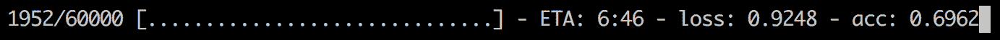

# 第二章：TensorFlow 基础与模型训练

**TensorFlow**是一个用于数值处理的库，供研究人员和机器学习从业者使用。虽然你可以使用 TensorFlow 执行任何数值运算，但它主要用于训练和运行深度神经网络。本章将介绍 TensorFlow 2 的核心概念，并带你通过一个简单的示例。

本章将涵盖以下主题：

+   使用 TensorFlow 2 和 Keras 入门

+   创建并训练一个简单的计算机视觉模型

+   TensorFlow 和 Keras 核心概念

+   TensorFlow 生态系统

# 技术要求

本书中将使用 TensorFlow 2。你可以在[`www.tensorflow.org/install`](https://www.tensorflow.org/install/)上找到适用于不同平台的详细安装说明。

如果你计划使用机器的 GPU，请确保安装相应的版本，`tensorflow-gpu`。它必须与 CUDA 工具包一起安装，CUDA 工具包是 NVIDIA 提供的一个库（[`developer.nvidia.com/cuda-zone`](https://developer.nvidia.com/cuda-zone)）。

安装说明也可以在 GitHub 的 README 中找到，链接为[`github.com/PacktPublishing/Hands-On-Computer-Vision-with-TensorFlow-2/tree/master/Chapter02`](https://github.com/PacktPublishing/Hands-On-Computer-Vision-with-TensorFlow-2/tree/master/Chapter02)。

# 使用 TensorFlow 2 和 Keras 入门

在详细介绍 TensorFlow 的核心概念之前，我们将简要介绍该框架，并提供一个基本示例。

# 介绍 TensorFlow

TensorFlow 最初由 Google 开发，用于让研究人员和开发人员进行机器学习研究。它最初被定义为*表达机器学习算法的接口，以及执行这些算法的实现*。

TensorFlow 主要用于简化在各种平台上部署机器学习解决方案——计算机 CPU、计算机 GPU、移动设备，以及最近的浏览器平台。此外，TensorFlow 还提供了许多有用的功能，用于创建机器学习模型并进行大规模运行。2019 年，TensorFlow 2 发布，重点是易用性，同时保持良好的性能。

关于 TensorFlow 1.0 概念的介绍可以在本书的附录中的《*从 TensorFlow 1 迁移到 TensorFlow 2*》找到。

该库于 2015 年 11 月开源。从那时起，它得到了不断的改进，并被全球用户广泛使用。它被认为是研究中最受欢迎的平台之一。它也是 GitHub 活动中最活跃的深度学习框架之一。

TensorFlow 既适合初学者，也适合专家使用。TensorFlow API 具有不同的复杂度级别，允许新手从简单的 API 开始，而专家则可以同时创建非常复杂的模型。让我们来探索这些不同的级别。

# TensorFlow 的主要架构

TensorFlow 的架构具有多个抽象层次。我们首先介绍最底层，然后逐层走向最顶层：


图 2.1：TensorFlow 架构图

大多数深度学习计算是用 C++编写的。为了在 GPU 上运行操作，TensorFlow 使用了 NVIDIA 开发的一个库，叫做**CUDA**。这也是你需要安装 CUDA，如果希望利用 GPU 功能的原因，同时也解释了为何不能使用来自其他硬件制造商的 GPU。

Python**低级** **API**然后对 C++源代码进行了封装。当你在 TensorFlow 中调用 Python 方法时，通常会在后台调用 C++代码。这个封装层让用户能够更快地工作，因为 Python 被认为比 C++更容易使用且不需要编译。这个 Python 封装使得执行一些非常基础的操作（如矩阵乘法和加法）成为可能。

在最顶层是**高级 API**，由两个组件组成——Keras 和 Estimator API。**Keras**是一个用户友好、模块化、可扩展的 TensorFlow 封装器。我们将在下一节介绍它。**Estimator API**包含若干预先构建的组件，允许你轻松构建机器学习模型。你可以将它们视为构建块或模板。

在深度学习中，**模型**通常指的是一个在数据上训练过的神经网络。一个模型由架构、矩阵权重和参数组成。

# 介绍 Keras

Keras 于 2015 年首次发布，旨在作为一个接口，便于快速进行神经网络实验。因此，它依赖 TensorFlow 或**Theano**（另一种已废弃的深度学习框架）来执行深度学习操作。Keras 以其用户友好性著称，是初学者的首选库。

自 2017 年起，TensorFlow 已完全集成 Keras，这意味着你只需安装 TensorFlow 即可使用它，无需额外安装其他内容。在本书中，我们将依赖`tf.keras`而不是 Keras 的独立版本。两者之间有一些小的差异，比如与 TensorFlow 其他模块的兼容性以及模型保存方式。因此，读者必须确保使用正确的版本，具体如下：

+   在你的代码中，导入`tf.keras`而不是`keras`。

+   阅读 TensorFlow 网站上的`tf.keras`文档，而不是*keras.io*文档。

+   使用外部 Keras 库时，确保它们与`tf.keras`兼容。

+   一些保存的模型可能不兼容不同版本的 Keras。

这两个版本将会在可预见的未来继续共存，并且`tf.keras`将会越来越多地与 TensorFlow 集成。为了展示 Keras 的强大和简洁，我们现在将用它实现一个简单的神经网络。

# 使用 Keras 构建的简单计算机视觉模型

在我们深入探讨 TensorFlow 的核心概念之前，让我们从一个经典的计算机视觉例子——数字识别，使用**美国国家标准与技术研究所**（**MNIST**）数据集开始。该数据集在第一章中介绍，*计算机视觉与神经网络*。

# 准备数据

首先，我们导入数据。数据由 60,000 张图像组成作为训练集，10,000 张图像作为测试集：

```py
import tensorflow as tf

num_classes = 10
img_rows, img_cols = 28, 28
num_channels = 1
input_shape = (img_rows, img_cols, num_channels)

(x_train, y_train),(x_test, y_test) = tf.keras.datasets.mnist.load_data()
x_train, x_test = x_train / 255.0, x_test / 255.0
```

在 TensorFlow 中，通常使用别名`tf`进行导入，以便更快速地读取和输入。通常也会用`x`表示输入数据，用`y`表示标签。

`tf.keras.datasets`模块提供了快速访问、下载并实例化多个经典数据集的方法。在使用`load_data`导入数据后，注意我们将数组除以`255.0`，以将数据范围缩小到[*0, 1*]而非[*0, 255*]。通常我们会对数据进行归一化处理，范围可以是[*0, 1*]或[*-1, 1*]。

# 构建模型

现在我们可以开始构建实际的模型了。我们将使用一个非常简单的架构，由两个**全连接**（也叫**密集**）层组成。在我们探索架构之前，先来看看代码。正如您所看到的，Keras 代码非常简洁：

```py
model = tf.keras.models.Sequential()
model.add(tf.keras.layers.Flatten())
model.add(tf.keras.layers.Dense(128, activation='relu'))
model.add(tf.keras.layers.Dense(num_classes, activation='softmax'))
```

由于我们的模型是一个线性堆叠的层次结构，我们从调用`Sequential`函数开始。然后逐个添加每一层。我们的模型由两个全连接层组成，我们逐层构建它：

+   **Flatten**：这个操作将代表图像像素的 2D 矩阵转换为 1D 数组。我们需要在添加全连接层之前进行此操作。*28* × *28* 的图像被转换为一个大小为 *784* 的向量。

+   **Dense**大小为*128*：这个层将*784*个像素值转化为 128 个激活值，使用一个大小为*128* × *784*的权重矩阵和一个大小为*128*的偏置矩阵。总的来说，这意味着*100,480*个参数。

+   **Dense**大小为*10*：这个层将*128*个激活值转化为我们的最终预测。请注意，由于我们希望概率的总和为`1`，我们将使用`softmax`激活函数。

`softmax`函数接收一个层的输出，并返回使其总和为`1`的概率。这是分类模型最后一层的首选激活函数。

请注意，您可以通过`model.summary()`获取模型的描述、输出及其权重。以下是输出：

```py
Model: "sequential"
_________________________________________________________________
Layer (type) Output Shape Param # 
=================================================================
flatten_1 (Flatten) (None, 784) 0 
_________________________________________________________________
dense_1 (Dense) (None, 128) 100480 
_________________________________________________________________
dense_2 (Dense) (None, 10) 1290 
=================================================================
Total params: 101,770
Trainable params: 101,770
Non-trainable params: 0
```

现在，模型已设置架构并初始化权重，可以开始训练以完成选择的任务。

# 训练模型

Keras 使得训练变得异常简单：

```py
model.compile(optimizer='sgd',
 loss='sparse_categorical_crossentropy',
 metrics=['accuracy'])

model.fit(x_train, y_train, epochs=5, verbose=1, validation_data=(x_test, y_test))
```

调用我们刚创建的模型的`.compile()`是一个必须的步骤。必须指定几个参数：

+   `optimizer`：这是执行梯度下降的组件。

+   `loss`：这是我们要优化的度量。在我们的例子中，我们选择交叉熵，就像在上一章中一样。

+   `metrics`：这些是训练过程中评估的附加指标函数，用于进一步展示模型的性能（与`loss`不同，它们不用于优化过程）。

Keras 中名为`loss`的`sparse_categorical_crossentropy`执行与`categorical_crossentropy`相同的交叉熵操作，但前者直接将真实标签作为输入，而后者要求真实标签事先进行*one-hot*编码。因此，使用`sparse_...`损失函数可以避免我们手动转换标签。

将 `'sgd'` 传递给 Keras 相当于传递 `tf.keras.optimizers.SGD()`。前者更易读，而后者则可以指定诸如自定义学习率等参数。损失函数、指标以及大多数传递给 Keras 方法的参数也是如此。

然后，我们调用 `.fit()` 方法。它与 **scikit-learn** 这一流行的机器学习库使用的接口非常相似。我们将训练五个周期，这意味着我们会在整个训练数据集上迭代五次。

注意，我们将`verbose`设置为`1`。这将允许我们看到包含先前选择的指标、损失值以及**预计到达时间**（**ETA**）的进度条。ETA 是对当前周期结束前剩余时间的估算。以下是进度条的显示效果：



图 2.2：Keras 在 verbose 模式下显示的进度条截图

# 模型性能

如第一章《计算机视觉与神经网络》所述，你会注意到我们的模型发生了过拟合——训练准确率高于测试准确率。如果我们训练模型五个周期，测试集上的准确率会达到 97%。这比上一章的 95%提高了大约 2%。最先进的算法可以达到 99.79%的准确率。

我们遵循了三个主要步骤：

1.  **加载数据**：在这种情况下，数据集已经准备好了。在未来的项目中，可能需要额外的步骤来收集和清理数据。

1.  **创建模型**：通过使用 Keras，这一步变得非常简单——我们通过添加顺序层来定义模型的架构。然后，我们选择了损失函数、优化器和监控指标。

1.  **训练模型**：我们的模型第一次运行得相当好。在更复杂的数据集上，通常需要在训练过程中对参数进行微调。

由于有了 Keras 这个 TensorFlow 的高级 API，整个过程变得非常简单。在这个简单的 API 后面，库隐藏了很多复杂性。

# TensorFlow 2 和 Keras 详解

我们已经介绍了 TensorFlow 的总体架构，并使用 Keras 训练了我们的第一个模型。现在，让我们逐步介绍 TensorFlow 2 的主要概念。我们将解释本书中涉及的 TensorFlow 核心概念，并随后介绍一些高级概念。虽然在本书的后续部分我们可能不会使用所有这些概念，但理解它们可能对你了解一些在 GitHub 上可用的开源模型或深入理解该库有所帮助。

# 核心概念

新版本的框架于 2019 年春季发布，重点是简化和易用性。在这一部分中，我们将介绍 TensorFlow 依赖的概念，并讲解它们从版本 1 到版本 2 的演变。

# 介绍张量

TensorFlow 得名于一种数学对象 **tensor**。你可以将张量想象为 N 维数组。一个张量可以是标量、向量、3D 矩阵或 N 维矩阵。

TensorFlow 的一个基础组件，`Tensor` 对象用于存储数学值。它可以包含固定值（使用 `tf.constant` 创建）或变化值（使用 `tf.Variable` 创建）。

在本书中，*tensor* 指代数学概念，而 *Tensor*（大写 `T`）则对应 TensorFlow 对象。

每个 `Tensor` 对象具有以下内容：

+   **类型**：`string`、`float32`、`float16` 或 `int8` 等。

+   **形状**：数据的维度。例如，标量的形状为 `()`，大小为 `n` 的向量的形状为 `(n)`，大小为 `n` × `m` 的 2D 矩阵的形状为 `(n, m)`。

+   **秩**：维度的数量，`0` 表示标量，`1` 表示向量，`2` 表示 2D 矩阵。

一些张量可能具有部分未知的形状。例如，一个接受可变大小图像的模型，其输入形状可能是 `(None, None, 3)`。由于图像的高度和宽度事先未知，因此前两个维度被设置为 `None`。然而，通道数（`3`，对应红色、蓝色和绿色）是已知的，因此被设置为固定值。

# TensorFlow 图

TensorFlow 使用张量作为输入和输出。将输入转化为输出的组件称为 **操作**。因此，一个计算机视觉模型是由多个操作组成的。

TensorFlow 使用 **有向无环图**（**DAC**）表示这些操作，也称为 **图**。在 TensorFlow 2 中，图操作已被隐藏，以便使框架更易于使用。然而，图的概念仍然是理解 TensorFlow 工作原理的重要部分。

在使用 Keras 构建之前的示例时，TensorFlow 实际上构建了一个图：


图 2.3：对应我们模型的简化图。在实践中，每个节点由更小的操作（如矩阵乘法和加法）组成。

虽然非常简单，这个图以操作的形式表示了我们模型的不同层。依赖图有许多优势，使 TensorFlow 能够执行以下操作：

+   在 CPU 上运行一部分操作，在 GPU 上运行另一部分操作

+   在分布式模型的情况下，在不同的机器上运行图的不同部分

+   优化图以避免不必要的操作，从而提高计算性能

此外，图的概念使得 TensorFlow 模型具有可移植性。一个图的定义可以在任何设备上运行。

在 TensorFlow 2 中，图的创建不再由用户处理。虽然在 TensorFlow 1 中管理图是一个复杂的任务，但新版本极大地提高了可用性，同时仍保持性能。在下一部分，我们将窥探 TensorFlow 的内部工作原理，简要探索图的创建过程。

# 比较延迟执行和急切执行

TensorFlow 2 的主要变化是**急切执行**。历史上，TensorFlow 1 默认总是使用**延迟执行**。它被称为*延迟*，因为在框架没有被明确要求之前，操作不会被执行。

让我们从一个非常简单的示例开始，来说明延迟执行和急切执行的区别，求和两个向量的值：

```py
import tensorflow as tf

a = tf.constant([1, 2, 3])
b = tf.constant([0, 0, 1])
c = tf.add(a, b)

print(c)
```

请注意，`tf.add(a, b)`可以被`a + b`替代，因为 TensorFlow 重载了许多 Python 运算符。

上述代码的输出取决于 TensorFlow 的版本。在 TensorFlow 1 中（默认模式为延迟执行），输出将是这样的：

```py
Tensor("Add:0", shape=(3,), dtype=int32)
```

然而，在 TensorFlow 2 中（急切执行是默认模式），你将获得以下输出：

```py
tf.Tensor([1 2 4], shape=(3,), dtype=int32)
```

在两种情况下，输出都是一个 Tensor。在第二种情况下，操作已经被急切执行，我们可以直接观察到 Tensor 包含了结果（`[1 2 4]`）。而在第一种情况下，Tensor 包含了关于加法操作的信息（`Add:0`），但没有操作的结果。

在急切模式下，你可以通过调用`.numpy()`方法来获取 Tensor 的值。在我们的示例中，调用`c.numpy()`会返回`[1 2 4]`（作为 NumPy 数组）。

在 TensorFlow 1 中，计算结果需要更多的代码，这使得开发过程更加复杂。急切执行使得代码更易于调试（因为开发者可以随时查看 Tensor 的值）并且更易于开发。在下一部分，我们将详细介绍 TensorFlow 的内部工作原理，并研究它是如何构建图的。

# 在 TensorFlow 2 中创建图

我们将从一个简单的示例开始，来说明图的创建和优化：

```py
def compute(a, b, c):
    d = a * b + c
    e = a * b * c
    return d, e
```

假设`a`、`b`和`c`是 Tensor 矩阵，这段代码计算两个新值：`d`和`e`。使用急切执行，TensorFlow 将先计算`d`的值，然后计算`e`的值。

使用延迟执行，TensorFlow 会创建一个操作图。在运行图以获得结果之前，会运行一个**图形优化器**。为了避免重复计算 `a * b`，优化器会**缓存**结果，并在需要时重用它。对于更复杂的操作，优化器还可以启用**并行性**，以加快计算速度。这两种技术在运行大型和复杂模型时非常重要。

正如我们所看到的，运行在 eager 模式下意味着每个操作在定义时都会执行。因此，无法应用这样的优化。幸运的是，TensorFlow 包括一个模块来绕过这一点——TensorFlow **AutoGraph**。

# 介绍 TensorFlow AutoGraph 和 tf.function

TensorFlow AutoGraph 模块使得将 eager 代码转换为图形变得简单，从而实现自动优化。为了做到这一点，最简单的方法是在函数上方添加 `tf.function` 装饰器：

```py
@tf.function
def compute(a, b, c):
    d = a * b + c
    e = a * b * c
    return d, e
```

**Python 装饰器**是一种概念，它允许函数被包装，添加功能或修改其行为。装饰器以`@`符号（"at"符号）开始。

当我们第一次调用 `compute` 函数时，TensorFlow 会透明地创建以下图形：


图 2.4：第一次调用 `compute` 函数时 TensorFlow 自动生成的图形

TensorFlow AutoGraph 可以转换大多数 Python 语句，如 `for` 循环、`while` 循环、`if` 语句和迭代。由于图形优化，图形执行有时可能比 eager 代码更快。更一般而言，AutoGraph 应该在以下场景中使用：

+   当模型需要导出到其他设备时

+   当性能至关重要且图形优化能够带来速度提升时

图形的另一个优势是其**自动求导**。知道所有操作的完整列表后，TensorFlow 可以轻松地计算每个变量的梯度。

请注意，为了计算梯度，操作必须是**可微分**的。某些操作，如 `tf.math.argmax`，则不是。在 `loss` 函数中使用它们可能会导致自动求导失败。用户需要确保损失函数是可微分的。

然而，由于在 eager 模式下，每个操作都是相互独立的，因此默认情况下无法进行自动求导。幸运的是，TensorFlow 2 提供了一种方法，在仍使用 eager 模式的情况下执行自动求导——**梯度带**。

# 使用梯度带回传误差

梯度带允许在 eager 模式下轻松进行反向传播。为了说明这一点，我们将使用一个简单的示例。假设我们想解方程 `A` × *X = B*，其中 `A` 和 `B` 是常数。我们想找到 `X` 的值以解方程。为此，我们将尝试最小化一个简单的损失函数，*abs(A × X - B)*。

在代码中，这转换为以下内容：

```py
A, B = tf.constant(3.0), tf.constant(6.0)
X = tf.Variable(20.0) # In practice, we would start with a random value
loss = tf.math.abs(A * X - B)
```

现在，为了更新`X`的值，我们希望计算损失函数关于`X`的梯度。然而，当打印损失的内容时，我们得到如下结果：

```py
<tf.Tensor: id=18525, shape=(), dtype=float32, numpy=54.0>
```

在 eager 模式下，TensorFlow 计算了操作的结果，而不是存储操作！没有操作及其输入的信息，将无法自动微分`loss`操作。

这时，梯度带就派上用场了。通过在`tf.GradientTape`上下文中运行我们的损失计算，TensorFlow 将自动记录所有操作，并允许我们在之后回放它们：

```py
def train_step():
    with tf.GradientTape() as tape:
        loss = tf.math.abs(A * X - B)
    dX = tape.gradient(loss, X)

    print('X = {:.2f}, dX = {:2f}'.format(X.numpy(), dX))
    X.assign(X - dX)

for i in range(7):
    train_step()
```

上述代码定义了一个训练步骤。每次调用`train_step`时，损失都会在梯度带的上下文中计算。然后，使用该上下文来计算梯度。`X`变量随后会被更新。事实上，我们可以看到`X`逐渐逼近解决方程的值：

```py
 X = 20.00, dX = 3.000000
 X = 17.00, dX = 3.000000
 X = 14.00, dX = 3.000000
 X = 11.00, dX = 3.000000
 X = 8.00, dX = 3.000000
 X = 5.00, dX = 3.000000
 X = 2.00, dX = 0.000000
```

你会注意到，在本章的第一个示例中，我们并没有使用梯度带。这是因为 Keras 模型将训练封装在`.fit()`函数中——不需要手动更新变量。然而，对于创新性模型或实验时，梯度带是一个强大的工具，它允许我们在几乎不费力的情况下进行自动微分。读者可以在第三章的正则化笔记本中找到梯度带的更实际应用，*现代神经网络*。

# Keras 模型和层

在本章的第一部分，我们构建了一个简单的 Keras Sequential 模型。生成的`Model`对象包含了许多有用的方法和属性：

+   `.inputs`和`.outputs`：提供对模型输入和输出的访问。

+   `.layers`：列出模型的所有层以及它们的形状。

+   `.summary()`：打印模型的架构。

+   `.save()`：保存模型、其架构和当前的训练状态。对于稍后恢复训练非常有用。可以使用`tf.keras.models.load_model()`从文件中实例化模型。

+   `.save_weights()`：仅保存模型的权重。

虽然 Keras 模型对象只有一种类型，但可以通过多种方式构建它们。

# Sequential 和函数式 API

你可以使用函数式 API 来代替本章开始时使用的 Sequential API：

```py
model_input = tf.keras.layers.Input(shape=input_shape)
output = tf.keras.layers.Flatten()(model_input)
output = tf.keras.layers.Dense(128, activation='relu')(output)
output = tf.keras.layers.Dense(num_classes, activation='softmax')(output)
model = tf.keras.Model(model_input, output)
```

注意到代码比之前稍长了一些。然而，函数式 API 比 Sequential API 更加灵活和富有表现力。前者允许构建分支模型（即构建具有多个并行层的架构），而后者只能用于线性模型。为了更大的灵活性，Keras 还提供了子类化`Model`类的可能性，如第三章中所述，*现代神经网络*。

无论`Model`对象是如何构建的，它都是由层组成的。一个层可以看作是一个节点，接受一个或多个输入并返回一个或多个输出，类似于 TensorFlow 操作。它的权重可以通过`.get_weights()`访问，并通过`.set_weights()`设置。Keras 提供了用于最常见深度学习操作的预制层。对于更具创新性或复杂的模型，`tf.keras.layers.Layer`也可以被子类化。

# 回调函数

**Keras 回调函数**是一些实用函数，可以传递给 Keras 模型的`.fit()`方法，以增加其默认行为的功能。可以定义多个回调函数，Keras 会在每个批次迭代、每个 epoch 或整个训练过程中，在回调函数之前或之后调用它们。预定义的 Keras 回调函数包括以下内容：

+   `CSVLogger`：将训练信息记录到 CSV 文件中。

+   `EarlyStopping`：如果损失或某个度量停止改善，它会停止训练。它可以在避免过拟合方面发挥作用。

+   `LearningRateScheduler`：根据计划在每个 epoch 改变学习率。

+   `ReduceLROnPlateau`：当损失或某个度量停止改善时，自动降低学习率。

也可以通过子类化`tf.keras.callbacks.Callback`来创建自定义回调函数，如后续章节和代码示例中所示。

# 高级概念

总结来说，AutoGraph 模块、`tf.function`装饰器和梯度带上下文使得图的创建和管理变得非常简单——如果不是不可见的话。然而，很多复杂性对用户来说是隐藏的。在这一部分中，我们将探索这些模块的内部工作原理。

本节介绍了一些高级概念，这些概念在全书中并不需要，但它们可能有助于你理解更复杂的 TensorFlow 代码。更急于学习的读者可以跳过这一部分，稍后再回来查看。

# tf.function 的工作原理

如前所述，当第一次调用用`tf.function`装饰的函数时，TensorFlow 将创建一个对应函数操作的图。TensorFlow 会缓存这个图，以便下次调用该函数时无需重新创建图。

为了说明这一点，让我们创建一个简单的`identity`函数：

```py
@tf.function
def identity(x):
  print('Creating graph !')
  return x
```

这个函数将在 TensorFlow 每次创建与其操作对应的图时打印一条消息。在这种情况下，由于 TensorFlow 缓存了图，它只会在第一次运行时打印一些信息：

```py
x1 = tf.random.uniform((10, 10))
x2 = tf.random.uniform((10, 10))

result1 = identity(x1) # Prints 'Creating graph !'
result2 = identity(x2) # Nothing is printed
```

但是，请注意，如果我们更改输入类型，TensorFlow 将重新创建图：

```py
x3 = tf.random.uniform((10, 10), dtype=tf.float16)
result3 = identity(x3) # Prints 'Creating graph !'
```

这一行为的解释在于，TensorFlow 图是通过它们的操作以及它们接收的输入张量的形状和类型来定义的。因此，当输入类型发生变化时，需要创建一个新的图。在 TensorFlow 术语中，当`tf.function`函数定义了输入类型时，它就变成了**具体函数**。

总结来说，每次一个装饰过的函数首次运行时，TensorFlow 会缓存与输入类型和输入形状对应的图。如果函数使用不同类型的输入运行，TensorFlow 将创建一个新的图并进行缓存。

然而，每次执行具体函数时记录信息可能会很有用，而不仅仅是第一次执行时。为此，可以使用`tf.print`：

```py
@tf.function
def identity(x):
  tf.print("Running identity")
  return x
```

这个函数将不会仅仅在第一次打印信息，而是每次运行时都会打印`Running identity`。

# TensorFlow 2 中的变量

TensorFlow 使用`Variable`实例来存储模型权重。在我们的 Keras 示例中，我们可以通过访问`model.variables`列出模型的内容。它将返回模型中包含的所有变量的列表：

```py
print([variable.name for variable in model.variables])
# Prints ['sequential/dense/kernel:0', 'sequential/dense/bias:0', 'sequential/dense_1/kernel:0', 'sequential/dense_1/bias:0']
```

在我们的示例中，变量管理（包括命名）完全由 Keras 处理。如前所述，我们也可以创建自己的变量：

```py
a = tf.Variable(3, name='my_var')
print(a) # Prints <tf.Variable 'my_var:0' shape=() dtype=int32, numpy=3>
```

请注意，对于大型项目，建议为变量命名以明确代码的含义并简化调试。要更改变量的值，可以使用`Variable.assign`方法：

```py
a.assign(a + 1)
print(a.numpy()) # Prints 4
```

如果不使用`.assign()`方法，将会创建一个新的`Tensor`方法：

```py
b = a + 1
print(b) # Prints <tf.Tensor: id=21231, shape=(), dtype=int32, numpy=4>
```

最后，删除 Python 对变量的引用将会把该对象从活动内存中移除，为其他变量创建腾出空间。

# 分布式策略

我们在一个非常小的数据集上训练了一个简单的模型。在使用更大的模型和数据集时，需要更多的计算能力——这通常意味着需要多个服务器。`tf.distribute.Strategy` API 定义了多个机器如何协同工作以高效训练模型。

TensorFlow 定义的一些策略如下：

+   `MirroredStrategy`：用于在单台机器上训练多个 GPU。模型的权重会在各个设备之间保持同步。

+   `MultiWorkerMirroredStrategy`：类似于`MirroredStrategy`，但用于在多台机器上训练。

+   `ParameterServerStrategy`：用于在多台机器上训练。不同于在每个设备上同步权重，权重会保存在参数服务器上。

+   `TPUStrategy`：用于在 Google 的**张量处理单元**（**TPU**）芯片上进行训练。

TPU 是 Google 定制的芯片，类似于 GPU，专门设计用于运行神经网络计算。它可以通过 Google Cloud 访问。

要使用分布式策略，在其作用域内创建并编译模型：

```py
mirrored_strategy = tf.distribute.MirroredStrategy()
with mirrored_strategy.scope():
  model = make_model() # create your model here
  model.compile([...])
```

请注意，你可能需要增加批处理大小，因为每个设备现在只会接收每个批次的小部分数据。根据你的模型，你可能还需要调整学习率。

# 使用 Estimator API

我们在本章的第一部分看到，Estimator API 是 Keras API 的高级替代方法。Estimator 简化了训练、评估、预测和服务过程。

估计器有两种类型。预制估计器是由 TensorFlow 提供的非常简单的模型，允许你快速尝试机器学习架构。第二种类型是自定义估计器，可以使用任何模型架构创建。

估计器处理模型生命周期的所有小细节——数据队列、异常处理、从失败中恢复、周期性检查点等。在 TensorFlow 1 中，使用估计器被认为是最佳实践，而在版本 2 中，建议使用 Keras API。

# 可用的预制估计器

在撰写本文时，现有的预制估计器有`DNNClassifier`、`DNNRegressor`、`LinearClassifier`和`LinearRegressor`。其中，DNN 代表**深度神经网络**。还提供了基于两种架构的组合估计器——`DNNLinearCombinedClassifier`和`DNNLinearCombinedRegressor`。

在机器学习中，分类是预测离散类别的过程，而回归是预测连续数字的过程。

**组合估计器**，也称为**深度宽度模型**，利用线性模型（用于记忆）和深度模型（用于泛化）。它们主要用于推荐或排序模型。

预制估计器适用于一些机器学习问题。然而，它们不适用于计算机视觉问题，因为没有带有卷积的预制估计器，卷积是一种强大的层类型，将在下一章中描述。

# 训练自定义估计器

创建估计器的最简单方法是转换 Keras 模型。在模型编译后，调用`tf.keras.estimator.model_to_estimator()`：

```py
estimator = tf.keras.estimator.model_to_estimator(model, model_dir='./estimator_dir')
```

`model_dir`参数允许你指定一个位置，在该位置保存模型的检查点。如前所述，估计器将自动保存我们的模型检查点。

训练估计器需要使用**输入函数**——一个返回特定格式数据的函数。接受的格式之一是 TensorFlow 数据集。数据集 API 在第七章中有详细描述，*复杂和稀缺数据集的训练*。现在，我们将定义以下函数，该函数以正确的格式批量返回本章第一部分定义的数据集，每批包含*32*个样本：

```py
BATCH_SIZE = 32
def train_input_fn():
    train_dataset = tf.data.Dataset.from_tensor_slices((x_train, y_train))
    train_dataset = train_dataset.batch(BATCH_SIZE).repeat()
    return train_dataset
```

一旦定义了这个函数，我们可以启动训练与估计器：

```py
estimator.train(train_input_fn, steps=len(x_train)//BATCH_SIZE)
```

就像 Keras 一样，训练部分非常简单，因为估计器处理了繁重的工作。

# TensorFlow 生态系统

除了主要库外，TensorFlow 还提供了许多对机器学习有用的工具。虽然其中一些工具随 TensorFlow 一起提供，但其他工具被归类在**TensorFlow 扩展**（**TFX**）和**TensorFlow 附加组件**（**TensorFlow Addons**）下。我们将介绍最常用的工具。

# TensorBoard

虽然我们在本章第一个示例中使用的进度条提供了有用的信息，但我们可能希望访问更详细的图表。TensorFlow 提供了一个强大的监控工具——**TensorBoard**。它在安装 TensorFlow 时默认包含，并且与 Keras 的回调函数结合使用时非常简单：

```py
callbacks = [tf.keras.callbacks.TensorBoard('./logs_keras')]
model.fit(x_train, y_train, epochs=5, verbose=1, validation_data=(x_test, y_test), callbacks=callbacks)
```

在这段更新后的代码中，我们将 TensorBoard 回调传递给 `model.fit()` 方法。默认情况下，TensorFlow 会自动将损失值和指标写入我们指定的文件夹中。然后，我们可以从命令行启动 TensorBoard：

```py
$ tensorboard --logdir ./logs_keras
```

这个命令会输出一个 URL，我们可以打开它来显示 TensorBoard 界面。在 Scalars 选项卡中，我们可以找到显示损失值和准确率的图表：


图 2.5：训练期间由 TensorBoard 显示的两个图表

正如你在本书中将看到的，训练一个深度学习模型需要大量的微调。因此，监控模型的表现至关重要。TensorBoard 让你可以精确地完成这项任务。最常见的使用场景是监控模型损失的变化过程。但你还可以执行以下操作：

+   绘制任何指标（如准确率）

+   显示输入和输出图像

+   显示执行时间

+   绘制模型的图形表示

TensorBoard 非常灵活，有许多使用方法。每条信息都存储在 `tf.summary` 中——这可以是标量、图像、直方图或文本。例如，要记录标量，你可以先创建一个摘要写入器，然后使用以下方法记录信息：

```py
writer = tf.summary.create_file_writer('./model_logs')
with writer.as_default():
  tf.summary.scalar('custom_log', 10, step=3)
```

在前面的代码中，我们指定了步骤——它可以是 epoch 数、batch 数量或自定义信息。它将对应于 TensorBoard 图表中的 `x` 轴。TensorFlow 还提供了生成汇总的工具。为了手动记录准确率，你可以使用以下方法：

```py
accuracy = tf.keras.metrics.Accuracy()
ground_truth, predictions = [1, 0, 1], [1, 0, 0] # in practice this would come from the model
accuracy.update_state(ground_truth, predictions)
tf.summary.scalar('accuracy', accuracy.result(), step=4)
```

其他可用的指标，例如 `Mean`、`Recall` 和 `TruePositives`。虽然在 TensorBoard 中设置指标的日志记录可能看起来有些复杂且耗时，但它是 TensorFlow 工具包中的一个重要部分。它将节省你无数小时的调试和手动日志记录工作。

# TensorFlow 附加组件和 TensorFlow 扩展

**TensorFlow 附加组件**是一个将额外功能收集到单一库中的集合 ([`github.com/tensorflow/addons`](https://github.com/tensorflow/addons))。它包含一些较新的深度学习进展，这些进展由于不够稳定或使用人数不足，无法被加入到 TensorFlow 主库中。它也作为 `tf.contrib` 的替代品，后者已从 TensorFlow 1 中移除。

**TensorFlow 扩展**是一个为 TensorFlow 提供端到端机器学习平台的工具。它提供了几个有用的工具：

+   **TensorFlow 数据验证**：用于探索和验证机器学习数据的库。你可以在构建模型之前使用它。

+   **TensorFlow Transform**：一个用于数据预处理的库。它确保训练数据和评估数据的处理方式一致。

+   **TensorFlow 模型分析**：用于评估 TensorFlow 模型的库。

+   **TensorFlow Serving**：一个用于机器学习模型的服务系统。服务是通过 REST API 从模型提供预测的过程：


图 2.6：创建和使用深度学习模型的端到端过程

如*图 2.6*所示，这些工具实现了端到端的目标，涵盖了构建和使用深度学习模型的每个步骤。

# TensorFlow Lite 和 TensorFlow.js

TensorFlow 的主要版本设计用于 Windows、Linux 和 Mac 计算机。要在其他设备上运行，则需要不同版本的 TensorFlow。**TensorFlow Lite**旨在在手机和嵌入式设备上运行模型预测（推断）。它包括一个转换器，将 TensorFlow 模型转换为所需的`.tflite`格式，并包含一个可以安装在移动设备上进行推断的解释器。

最近，开发了**TensorFlow.js**（也称为**tfjs**），它使几乎任何 Web 浏览器都能进行深度学习。它不需要用户安装，且有时可以利用设备的 GPU 加速。我们在第九章《优化模型并在移动设备上部署》中详细介绍了 TensorFlow Lite 和 TensorFlow.js 的使用，*优化模型并部署到移动设备上*。

# 模型运行的位置

由于计算机视觉模型处理大量数据，因此训练需要较长时间。因此，在本地计算机上训练可能会花费相当多的时间。你还会发现，创建高效的模型需要很多次迭代。这两个观点将影响你决定在哪里训练和运行模型。在本节中，我们将比较不同的训练和使用模型的选项。

# 在本地机器上

在你的计算机上编码模型通常是开始的最快方式。由于你可以使用熟悉的环境，你可以根据需要轻松修改代码。然而，个人计算机，尤其是笔记本电脑，缺乏训练计算机视觉模型的计算能力。使用 GPU 进行训练的速度可能比使用 CPU 快 10 到 100 倍。这就是为什么建议使用 GPU 的原因。

即使你的计算机拥有 GPU，也只有非常特定的模型可以运行 TensorFlow。你的 GPU 必须与 CUDA 兼容，CUDA 是 NVIDIA 的计算库。撰写本文时，TensorFlow 的最新版本要求 CUDA 计算能力为 3.5 或更高。

一些笔记本电脑支持外接 GPU 机箱，但这违背了便携电脑的初衷。一个更实际的方法是将你的模型运行在一台远程计算机上，该计算机拥有 GPU。

# 在远程机器上

如今，你可以按小时租用带 GPU 的强大计算机。定价因 GPU 性能和供应商而异。单个 GPU 机器的费用通常为每小时约 $1，且价格每日有所下降。如果你承诺租用整个月份的机器，每月大约 $100 就可以获得良好的计算性能。考虑到你在训练模型时节省的时间，租用远程机器通常从经济角度来说是明智的选择。

另一个选择是搭建你自己的深度学习服务器。请注意，这需要投资和组装，并且 GPU 消耗大量电力。

一旦你获得了远程机器的访问权限，你有两个选择：

+   在远程服务器上运行 Jupyter Notebook。然后，你可以通过浏览器在全球任何地方访问 Jupyter Lab 或 Jupyter Notebook。这是一种非常方便的深度学习执行方式。

+   同步本地开发文件夹并远程运行代码。大多数 IDE 都有将本地代码与远程服务器同步的功能。这使得你可以在自己喜欢的 IDE 中编程，同时仍然享受强大的计算机性能。

基于 Jupyter 笔记本的 Google Colab 允许你在云端运行笔记本，*免费*使用。你甚至可以启用 GPU 模式。Colab 有存储空间限制，并且连续运行时间限制为 8 小时。虽然它是一个非常适合入门或实验的工具，但对于更大的模型来说并不方便。

# 在 Google Cloud 上

要在远程机器上运行 TensorFlow，你需要自己管理——安装正确的软件，确保其更新，并开启和关闭服务器。虽然对于一台机器来说仍然可以这样做，有时你还需要将训练分配到多个 GPU 上，但使用 Google Cloud ML 来运行 TensorFlow 可以让你专注于模型而不是操作。

你会发现 Google Cloud ML 对以下内容非常有用：

+   通过云中的弹性资源快速训练模型

+   使用并行化方法在最短时间内找到最佳模型参数

+   一旦模型准备好，你可以在无需自己运行预测服务器的情况下提供预测

有关打包、发送和运行模型的所有细节都可以在 Google Cloud ML 文档中找到（[`cloud.google.com/ml-engine/docs/`](https://cloud.google.com/ml-engine/docs/)）。

# 总结

在本章中，我们首先使用 Keras API 训练了一个基本的计算机视觉模型。我们介绍了 TensorFlow 2 背后的主要概念——张量、图、AutoGraph、即时执行和梯度带。我们还详细介绍了框架中的一些更高级的概念。我们通过库周围的主要工具进行了讲解，从用于监控的 TensorBoard 到用于预处理和模型分析的 TFX。最后，我们讨论了根据需求选择运行模型的位置。

拥有这些强大工具后，你现在准备好在下一章探索现代计算机视觉模型了。

# 问题

1.  Keras 在 TensorFlow 中的作用是什么，它的目的是什么？

1.  为什么 TensorFlow 使用图形？如何手动创建图形？

1.  急切执行模式和懒惰执行模式有什么区别？

1.  如何在 TensorBoard 中记录信息，并如何显示它？

1.  TensorFlow 1 和 TensorFlow 2 之间的主要区别是什么？
