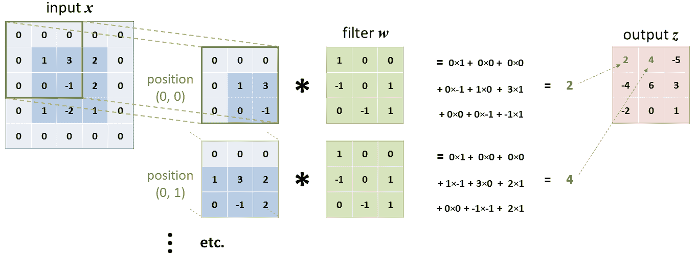
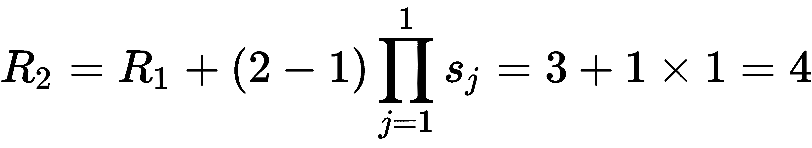
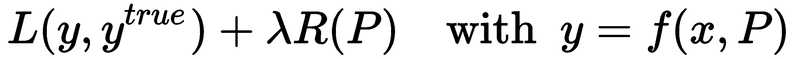

# 第三章：现代神经网络

在第一章《计算机视觉与神经网络》中，我们介绍了近年来更适合图像处理的神经网络是如何超越过去十年计算机视觉方法的。然而，由于受限于我们从头开始重新实现的能力，我们只涵盖了基本架构。现在，随着 TensorFlow 强大的 API 触手可得，是时候探索什么是**卷积神经网络**（**CNNs**），以及这些现代方法是如何被训练以进一步提高它们的鲁棒性。

本章将涵盖以下主题：

+   CNN 及其与计算机视觉的相关性

+   使用 TensorFlow 和 Keras 实现这些现代网络

+   高级优化器和如何高效训练 CNN

+   正则化方法和如何避免过拟合

# 技术要求

本章的主要资源是用 TensorFlow 实现的。同时，Matplotlib 包（[`matplotlib.org`](https://matplotlib.org)）和 scikit-image 包（[`scikit-image.org`](https://scikit-image.org)）也有使用，尽管它们仅用于显示一些结果或加载示例图像。

如同前几章一样，展示本章概念的 Jupyter 笔记本可以在以下 GitHub 文件夹中找到：[github.com/PacktPublishing/Hands-On-Computer-Vision-with-TensorFlow-2/tree/master/Chapter03](https://github.com/PacktPublishing/Hands-On-Computer-Vision-with-TensorFlow-2/tree/master/Chapter03)。

# 探索卷积神经网络

本章的第一部分，我们将介绍 CNN，也称为**卷积网络**（**ConvNets**），并解释为什么它们在视觉任务中变得无处不在。

# 多维数据的神经网络

CNNs 的引入是为了解决原始神经网络的一些缺陷。在本节中，我们将讨论这些问题，并展示 CNN 是如何处理它们的。

# 完全连接网络的问题

通过我们在第一章《计算机视觉与神经网络》和第二章《TensorFlow 基础与训练模型》的入门实验，我们已经突出了基本网络在处理图像时的以下两个主要缺点：

+   爆炸性的参数数量

+   空间推理的缺乏

让我们在这里讨论一下这些内容。

# 爆炸性的参数数量

图像是具有大量值的复杂结构（即，*H* × *W* × *D* 个值，其中*H*表示图像的高度，*W*表示宽度，*D*表示深度/通道数，例如 RGB 图像的*D* = 3）。即使是我们在前两章中使用的单通道小图像，也代表了大小为*28 × 28 × 1 = 784*的输入向量。对于我们实现的基础神经网络的第一层，这意味着一个形状为(784, 64)的权重矩阵。这意味着仅仅这个变量就需要优化 50,176（784 × 64）个参数值！

当我们考虑更大的 RGB 图像或更深的网络时，参数的数量会呈指数级增长。

# 缺乏空间推理

因为它们的神经元接收来自上一层的所有值且没有任何区分（它们是*全连接的*），这些神经网络没有*距离*/*空间性*的概念。数据中的空间关系丧失了。多维数据，如图像，也可以是从列向量到密集层的任何形式，因为它们的操作没有考虑数据的维度性和输入值的位置。更准确地说，这意味着**全连接**（**FC**）层丧失了像素间的接近概念，因为所有像素值在层内被组合时并不考虑它们的原始位置。

由于它不会改变全连接层的行为，为了简化计算和参数表示，通常会在将多维输入传递到这些层之前，先对其进行*展平*（即将其重塑为列向量）。

直观地看，如果神经网络能够考虑**空间信息**，即某些输入值属于同一个像素（通道值）或属于同一区域（相邻像素），那么神经层将更加智能。

# 引入卷积神经网络（CNN）

CNN 为这些不足提供了简单的解决方案。尽管它们与我们之前介绍的网络（如前馈网络和反向传播网络）工作原理相同，但它们的架构做了一些巧妙的改进。

首先，CNN 能够处理多维数据。对于图像，CNN 输入的是三维数据（高度 × 宽度 × 深度），并且它的神经元排列方式也类似于一个体积（参见*图 3.1*）。这导致了 CNN 的第二个创新——与全连接网络不同，在 CNN 中，每个神经元只访问上一层中相邻区域的一些元素，而不是连接到上一层的所有元素。这个区域（通常是正方形并跨越所有通道）被称为神经元的**感受野**（或过滤器大小）：


图 3.1：CNN 表示，展示了从第一层到最后一层的左上角神经元的*感受野*（更多解释可在以下小节中找到）

通过只将神经元与上一层中相邻的神经元相连，CNN 不仅大幅减少了需要训练的参数数量，还保留了图像特征的定位。

# 卷积神经网络操作

在这种架构范式下，还引入了几种新的层类型，充分利用了*多维性*和*局部连接性*。

# 卷积层

CNN 之所以得名，是因为它们的核心架构包含了*卷积层*。在这些层中，通过在所有连接到同一输出通道的神经元之间共享相同的权重和偏置，进一步减少了参数的数量。

# 概念

这些具有共享权重和偏置的特定神经元也可以被认为是一个在整个输入矩阵上滑动的单一神经元，具有*空间有限的连接性*。在每一步，这个神经元只与当前滑动的输入体积（*H* × *W* × *D*）中的局部区域进行空间连接。考虑到这种有限维度的输入，*k[H]* × *k[W]* × *D*，对于具有过滤器大小（*k[H]*，*k[W]*）的神经元，该神经元的工作方式与我们第一章中建模的神经元类似——它在线性组合输入值（*k[H]* × *k[W]* × *D* 个值）之后，再应用激活函数对和进行处理（线性或非线性函数）。从数学角度来看，当神经元接受从位置 *(i, j)* 开始的输入块时，它的响应 *z[i,j]* 可以表示为：


 是神经元的权重（即形状为 *k[H]* × *k[W]* × *D* 的二维矩阵）， 是神经元的偏置， 是激活函数（例如，*sigmoid*）。对于神经元可以在输入数据上滑动的每个位置，重复此操作后，我们得到其完整的响应矩阵 𝑧，尺寸为 *H*[o] × *W*[o]，其中 *H*[o] 和 *W*[o] 分别是神经元可以在输入张量上垂直和水平滑动的次数。

实际上，大多数情况下使用的是方形过滤器，这意味着它们的大小是 (*k*, *k*)，其中 *k =* *k[H]* = *k[W]*。在本章的其余部分，为了简化解释，我们将只考虑方形过滤器，尽管值得记住的是，它们的高度和宽度可能会有所变化。

由于卷积层仍然可以有 *N* 组不同的神经元（即，具有共享参数的 *N* 组神经元），它们的响应图被堆叠在一起，形成形状为 *H*[o] × *W*[o] × *N* 的输出张量。

就像我们在全连接层中应用矩阵乘法一样，**卷积操作**也可以在这里用来一次性计算所有响应图（因此这些层的名称）。熟悉这种操作的人，可能在我们提到*在输入矩阵上滑动过滤器*时就认出了它。对于那些不熟悉这种操作的人，卷积的结果确实是通过将一个过滤器 *w* 滑动到输入矩阵 *x* 上，并在每个位置计算过滤器与从当前起始位置开始的 *x* 块的点积来获得的。此操作在*图 3.2*中得到了说明（使用单通道输入张量，以便使图示易于理解）：



图 3.2：卷积示意图

在*图 3.2*中，请注意输入*x*已经被填充为零，这在卷积层中是常见的操作，例如当我们希望输出与原始输入（例如本例中的 3 × 3 大小）相同尺寸时。填充的概念在本章后面进一步发展。

这种操作的正确数学术语实际上是*交叉相关*，尽管在机器学习社区中通常使用*卷积*。矩阵*x*与滤波器*w*的交叉相关定义为：


请注意我们用于*z*的方程式的对应关系。另一方面，矩阵*x*与滤波器*w*的实际数学卷积对所有有效位置(*i*, *j*)定义为：


如我们所见，在这种设置中，这两种操作非常相似，通过简单地在执行之前*翻转*滤波器，可以从交叉相关操作中获得卷积结果。

# 属性

一个具有*N*组不同神经元的卷积层由形状为*D* × *k* × *k*（当滤波器为正方形时）的*N*个权重矩阵（也称为**滤波器**或**核心**）和*N*个偏置值定义。因此，这一层只需训练*N* × (*D**k*² + 1)个值。与具有相似输入和输出维度的全连接层不同，后者需要(*H* × *W* × *D*) × (*H*[o] × *W*[o] × *N*)个参数。正如我们之前所示，全连接层的参数数量受数据维度的影响，而这并不影响卷积层的参数数量。

正是这一特性使得卷积层在计算机视觉中成为强大的工具，原因有两点。首先，正如前文所示，这意味着我们可以训练适用于更大输入图像的网络，而不影响需要调整的参数数量。其次，这也意味着卷积层可以应用于任何尺寸的图像！与具有全连接层的网络不同，纯卷积层不需要为不同尺寸的输入进行适应和重新训练。

当将 CNN 应用于各种大小的图像时，对输入批次进行采样仍然需要注意。事实上，只有所有图像具有相同尺寸时，才能将图像的子集堆叠到普通的批次张量中。因此，在实践中，在批处理之前应对图像进行排序（主要在训练阶段）或简单地分别处理每个图像（通常在测试阶段）。然而，为了简化数据处理和网络任务，人们通常会预处理图像，使它们的大小都相同（通过缩放和/或裁剪）。

除了那些计算优化外，卷积层还有一些与图像处理相关的有趣特性。经过训练，卷积层的滤波器能够非常擅长对特定的*局部特征*做出反应（一个拥有*N*个滤波器的层意味着能够对*N*种不同的特征做出反应）。例如，CNN 中第一层卷积层的每个卷积核将学习对特定的低级特征做出响应，比如特定的线条方向或颜色渐变。接下来，较深的层将使用这些结果来定位更加抽象或高级的特征，比如人脸的形状或特定物体的轮廓。此外，每个滤波器（即每组共享的神经元）都会对图像中的特定特征作出反应，无论该特征在图像中的位置如何。更正式地说，卷积层对图像坐标空间中的平移是不变的。

滤波器对输入图像的响应图可以描述为一个表示滤波器对目标特征响应位置的地图。因此，这些中间结果在 CNN 中通常被称为**特征图**。因此，一个拥有*N*个滤波器的层将返回*N*个特征图，每个特征图对应于输入张量中特定特征的检测。由层返回的*N*个特征图的堆叠通常被称为**特征体积**（形状为*H*[o] × *W*[o] × *N*）。

# 超参数

卷积层首先由其滤波器的数量*N*、输入深度*D*（即输入通道的数量）和滤波器/卷积核的大小（*k[H]*，*k[W]*）来定义。由于常用的是方形滤波器，大小通常仅由*k*来定义（尽管如前所述，有时也会考虑非方形滤波器）。

然而，正如前面提到的，卷积层实际上与同名的数学运算有所不同。输入与滤波器之间的操作可以有几个额外的超参数，影响滤波器在图像上*滑动*的方式。

首先，我们可以应用不同的*步幅*，即滤波器滑动的步伐。步幅超参数定义了当滑动时，图像块与滤波器之间的点积是否应在每个位置计算（*stride = 1*），还是在每*s*个位置计算（*stride = s*）。步幅越大，得到的特征图就越稀疏。

图像在进行卷积之前也可以进行*零填充*；即通过在原始内容周围添加零的行和列，合成地增加图像的尺寸。如*图 3.2*所示，这种填充增加了滤波器可以覆盖的图像位置数量。我们因此可以指定要应用的填充值（即要在输入的每一侧添加的空行和空列的数量）。

字母*k*通常用于表示滤波器/核大小（*k*代表*kernel*）。类似地，*s*通常用于表示步幅，*p*用于表示填充。请注意，与滤波器大小一样，通常会对水平和垂直步幅使用相同的值（*s = s[H] = s[W]*），并且水平和垂直填充也通常使用相同的值；不过，在某些特定的使用案例中，它们可能会有不同的值。

所有这些参数（核的数量*N*；核的大小*k*；步幅*s*；以及填充*p*）不仅影响层的操作，还会影响其输出形状。到目前为止，我们定义的输出形状为(*H*[o]，*W*[o]，*N*)，其中*H*[o]和*W*[o]*是神经元在输入上垂直和水平滑动的次数。那么，*H*[o]和*W*[o]*到底是什么呢？从形式上来看，它们可以按以下方式计算：


虽然我们邀请你选择一些具体的例子来更好地理解这些公式，但我们可以直观地理解它们背后的逻辑。大小为𝑘的滤波器在大小为*H* × *W*的图像中，可以占据最多*H - k + 1*个不同的垂直位置和*W - k + 1*个水平位置。此外，如果这些图像在每一边都进行了*p*的填充，那么这些位置的数量将增加到*H - k + 2p + 1*（关于*W - k + 2p + 1*）。最后，增加步幅*s*，基本上意味着只考虑*s*个位置中的一个，这就解释了除法（注意这是整数除法）。

有了这些超参数，我们可以轻松控制层的输出尺寸。这在物体分割等应用中尤其方便；也就是说，当我们希望输出的分割掩码与输入图像的大小相同。

# TensorFlow/Keras 方法

在低级 API 中可用，`tf.nn.conv2d()`（请参考文档：[`www.tensorflow.org/api_docs/python/tf/nn/conv2d`](https://www.tensorflow.org/api_docs/python/tf/nn/conv2d)）是进行图像卷积的默认选择。其主要参数如下：

+   `input`：输入图像的批次，形状为*(B, H, W, D*)，其中*B*是批次大小。

+   `filter`：堆叠成形状为(*k[H], k[W], D, N*)的*N*个滤波器。

+   `strides`：表示批量输入每个维度步幅的四个整数的列表。通常，你会使用*[1, s[H], s[W], 1]*（即，仅对图像的两个空间维度应用自定义步幅）。

+   `padding`：一个*4 × 2*整数列表，表示每个批量输入维度的前后填充，或者一个字符串，定义要使用的预定义填充案例；即，`VALID`或`SAME`（接下来的解释）。

+   `name`：用于标识该操作的名称（有助于创建清晰、易读的图形）。

请注意，`tf.nn.conv2d()`接受一些更高级的参数，我们暂时不会介绍（请参考文档）。*图 3.3*和*3.4*展示了两种不同参数的卷积操作效果：


图 3.3：使用 TensorFlow 对图像进行卷积的示例。这里的卷积核是一个著名的卷积核，常用于对图像应用*高斯模糊*。

在以下截图中，应用了计算机视觉领域中一个知名的卷积核：


图 3.4：另一个 TensorFlow 卷积的示例，具有更大的步幅。这个特定的卷积核通常用于提取图像中的边缘/轮廓。

关于填充，TensorFlow 开发者选择提供两种不同的预实现模式，以便用户无需自己去搞清楚在常规情况下需要使用哪个值，*p*。`VALID` 表示图像不会被填充（*p* = 0），滤波器只会在默认的*有效*位置上滑动。而选择 `SAME` 时，TensorFlow 会计算 *p* 的值，以确保卷积输出的高度和宽度与输入在步幅为 `1` 时相同（也就是说，根据前面章节中给出的方程，暂时将 *s* 设置为 1，从而解得 *H*[o] = *H*[o] 和 *W*[o] = *W*）。

有时候，你可能需要使用比零更复杂的填充。在这种情况下，建议使用 `tf.pad()` 方法（请参考文档：[`www.tensorflow.org/api_docs/python/tf/pad`](https://www.tensorflow.org/api_docs/python/tf/pad)），然后简单地实例化一个使用 `VALID` 填充的卷积操作。

TensorFlow 还提供了其他几个低级别的卷积方法，例如 `tf.nn.conv1d()`（请参考文档：[`www.tensorflow.org/api_docs/python/tf/nn/conv1d`](https://www.tensorflow.org/api_docs/python/tf/nn/conv1d)）和 `tf.nn.conv3d()`（请参考文档：[`www.tensorflow.org/api_docs/python/tf/nn/conv3d`](https://www.tensorflow.org/api_docs/python/tf/nn/conv3d)），分别用于一维和三维数据，或者使用 `tf.nn.depthwise_conv2d()`（请参考文档：[`www.tensorflow.org/api_docs/python/tf/nn/depthwise_conv2d`](https://www.tensorflow.org/api_docs/python/tf/nn/depthwise_conv2d)）对图像的每个通道进行不同滤波器的卷积等。

到目前为止，我们只展示了使用固定滤波器的卷积。对于卷积神经网络（CNN），我们必须使滤波器可训练。卷积层还会在将结果传递给激活函数之前应用一个学习到的偏置。因此，这一系列操作可以如下实现：

```py
# Initializing the trainable variables (for instance, the filters with values from a Glorot distribution, and the bias with zeros):
kernels_shape = [k, k, D, N]
glorot_uni_initializer = tf.initializers.GlorotUniform()
# ^ this object is defined to generate values following the Glorot distribution (note that other famous parameter more or less random initializers exist, also covered by TensorFlow)
kernels = tf.Variable(glorot_uni_initializer(kernels_shape), 
                      trainable=True, name="filters")
bias = tf.Variable(tf.zeros(shape=[N]), trainable=True, name="bias")

# Defining our convolutional layer as a compiled function:
@tf.function
def conv_layer(x, kernels, bias, s):
    z = tf.nn.conv2d(x, kernels, strides=[1,s,s,1], padding='VALID')
    # Finally, applying the bias and activation function (for instance, ReLU):
    return tf.nn.relu(z + bias)
```

这个前馈函数可以进一步封装成一个`Layer`对象，类似于我们在第一章中实现的全连接层，*计算机视觉与神经网络*，是围绕矩阵操作构建的。通过 Keras API，TensorFlow 2 提供了自己的`tf.keras.layers.Layer`类，我们可以对其进行扩展（参见[`www.tensorflow.org/api_docs/python/tf/keras/layers/Layer`](https://www.tensorflow.org/api_docs/python/tf/keras/layers/Layer)的文档）。以下代码块演示了如何基于此构建一个简单的卷积层：

```py
class SimpleConvolutionLayer(tf.keras.layers.Layer):
    def __init__(self, num_kernels=32, kernel_size=(3, 3), stride=1):
        """ Initialize the layer.
        :param num_kernels: Number of kernels for the convolution
        :param kernel_size: Kernel size (H x W)
        :param stride: Vertical/horizontal stride
        """
        super().__init__() 
        self.num_kernels = num_kernels
        self.kernel_size = kernel_size
        self.stride = stride

    def build(self, input_shape):
        """ Build the layer, initializing its parameters/variables.
        This will be internally called the 1st time the layer is used.
        :param input_shape: Input shape for the layer (for instance, BxHxWxC)
        """
        num_input_ch = input_shape[-1] # assuming shape format BHWC
        # Now we know the shape of the kernel tensor we need:
        kernels_shape = (*self.kernel_size, num_input_ch, self.num_kernels)
        # We initialize the filter values fior instance, from a Glorot distribution:
        glorot_init = tf.initializers.GlorotUniform()
        self.kernels = self.add_weight( # method to add Variables to layer
            name='kernels', shape=kernels_shape, initializer=glorot_init,
            trainable=True) # and we make it trainable.
        # Same for the bias variable (for instance, from a normal distribution):
        self.bias = self.add_weight(
            name='bias', shape=(self.num_kernels,), 
            initializer='random_normal', trainable=True)

    def call(self, inputs):
        """ Call the layer, apply its operations to the input tensor."""
        return conv_layer(inputs, self.kernels, self.bias, self.stride)
```

TensorFlow 的大多数数学操作（例如`tf.math`和`tf.nn`中的操作）已经由框架定义了它们的导数。因此，只要一个层由这些操作组成，我们就不需要手动定义它的反向传播，节省了大量的精力！

尽管这个实现的优点是显式的，但 Keras API 也封装了常见层的初始化（如第二章中介绍的，*TensorFlow 基础与模型训练*），从而加速了开发过程。通过`tf.keras.layers`模块，我们可以通过一次调用实例化一个类似的卷积层，如下所示：

```py
conv = tf.keras.layers.Conv2D(filters=N, kernel_size=(k, k), strides=s,
                              padding='valid', activation='relu')
```

`tf.keras.layers.Conv2D()`（参见[`www.tensorflow.org/api_docs/python/tf/keras/layers/Conv2D`](https://www.tensorflow.org/api_docs/python/tf/keras/layers/Conv2D)的文档）有一个长长的附加参数列表，封装了多个概念，比如权重正则化（将在本章稍后介绍）。因此，建议在构建高级 CNN 时使用此方法，而不是花时间重新实现这些概念。

# 池化层

另一个与 CNN 一起使用的常见层类别是*池化*类型。

# 概念和超参数

这些池化层有点特别，因为它们没有任何可训练的参数。每个神经元仅仅取其*窗口*（感受野）中的值，并返回一个单一的输出，该输出是通过预定义函数计算得出的。最常见的两种池化方法是最大池化和平均池化。**最大池化**层仅返回池化区域每个深度的最大值（参考*图 3.5*），而**平均池化**层计算池化区域每个深度的平均值（参考*图 3.6*）。

池化层通常与 *步幅* 值等于其 *窗口/核大小* 一起使用，以便对不重叠的区域应用池化函数。它们的目的是 *减少数据的空间维度*，从而减少网络中所需的参数总数以及计算时间。例如，具有 *2 × 2* 窗口大小和步幅为 *2* 的池化层（即 *k* = 2 和 *s* = 2）将取每个深度的四个值，并返回一个单一的数字。这样，它将把特征的高度和宽度除以 *2*；也就是说，减少接下来层的计算次数 *2 × 2 = 4*。最后，注意，和卷积层一样，你可以在应用操作之前对张量进行填充（如 *图 3.5* 所示）：


图 3.5：展示了一个窗口大小为 3 × 3、填充为 1、步幅为 2 的单通道输入的最大池化操作

通过填充（padding）和步幅（stride）参数，可以控制生成张量的维度。*图 3.6* 提供了另一个示例：


图 3.6：展示了一个窗口大小为 2 × 2、填充为 0、步幅为 2 的单通道输入的平均池化操作

由于池化层的超参数与卷积层类似，除了没有可训练的卷积核，因此池化层是易于使用且轻量级的解决方案，适用于控制数据的维度。

# TensorFlow/Keras 方法

也可以从 `tf.nn` 包中获得，`tf.nn.max_pool()`（参考文档 [`www.tensorflow.org/api_docs/python/tf/nn/max_pool`](https://www.tensorflow.org/api_docs/python/tf/nn/max_pool)）和 `tf.nn.avg_pool()`（参考文档 [`www.tensorflow.org/api_docs/python/tf/nn/avg_pool`](https://www.tensorflow.org/api_docs/python/tf/nn/avg_pool)）的签名与 `tf.nn.conv2d()` 非常相似，如下所示：

+   `value`：形状为 (*B*, *H*, *W*, *D*) 的输入图像批次，其中 *B* 是批次大小

+   `ksize`：一个包含四个整数的列表，表示每个维度的窗口大小；通常使用 *[1, k, k, 1]* 

+   `strides`：一个包含四个整数的列表，表示批处理输入每个维度的步幅，类似于 `tf.nn.conv2d()` 

+   `padding`：一个字符串，定义要使用的填充算法（`VALID` 或 `SAME`）

+   `name`：用于标识此操作的名称（对于创建清晰、可读的图形非常有用）

*图 3.7* 展示了应用于图像的平均池化操作：


图 3.7：使用 TensorFlow 对图像进行平均池化的示例

在 *图 3.8* 中，对相同的图像应用了最大池化函数：


图 3.8：另一个最大池化操作的示例，窗口大小与步幅相比过大（仅用于演示目的）

在这里，我们仍然可以使用更高级的 API，使得实例化过程更加简洁：

```py
avg_pool = tf.keras.layers.AvgPool2D(pool_size=k, strides=[s, s], padding='valid')
max_pool = tf.keras.layers.MaxPool2D(pool_size=k, strides=[s, s], padding='valid')
```

由于池化层没有可训练的权重，因此池化操作与 TensorFlow 中对应的层之间没有实际区别。这使得这些操作不仅轻量级，而且易于实例化。

# 全连接层

值得一提的是，全连接层也用于 CNN，就像在常规网络中一样。接下来的段落中，我们将介绍何时考虑使用它们，以及如何将它们包含在 CNN 中。

# 在 CNN 中的应用

虽然全连接层可以添加到处理多维数据的 CNN 中，但这意味着传递给这些层的输入张量必须首先被重塑为批处理的列向量——就像我们在第一章《计算机视觉与神经网络》和第二章《TensorFlow 基础与模型训练》中所做的那样（即将高度、宽度和深度维度*展平*为一个单一的向量）。

全连接层也常被称为**密集连接**层，或简洁地称为**密集**层（与其他连接性较为有限的 CNN 层相对）。

虽然在某些情况下，神经元访问完整的输入图（例如，结合空间上远离的特征）可能是有利的，但全连接层有几个缺点，如本章开头所述（例如，空间信息丢失和参数数量庞大）。此外，与其他 CNN 层不同，全连接层是由其输入和输出的大小来定义的。特定的全连接层不能处理形状与其配置时不同的输入。因此，在神经网络中使用全连接层通常意味着失去将其应用于不同尺寸图像的可能性。

尽管存在这些缺点，这些层仍然在 CNN 中广泛使用。它们通常位于网络的最后几层，用于将多维特征转换为 1D 分类向量。

# TensorFlow/Keras 方法

尽管我们在上一章中已经使用了 TensorFlow 的全连接层，但我们没有停下来关注它们的参数和属性。再次提醒，`tf.keras.layers.Dense()`的签名（请参考[`www.tensorflow.org/api_docs/python/tf/keras/layers/Dense`](https://www.tensorflow.org/api_docs/python/tf/keras/layers/Dense)的文档）与之前介绍的层类似，不同之处在于它们不接受任何`strides`或`padding`参数，而是使用`units`来表示神经元/输出大小，具体如下：

```py
fc = tf.keras.layers.Dense(units=output_size, activation='relu')
```

然而，请记住，在将数据传递给密集层之前，你应当小心*展平*多维张量。`tf.keras.layers.Flatten()`（参考文档 [`www.tensorflow.org/api_docs/python/tf/keras/layers/Flatten`](https://www.tensorflow.org/api_docs/python/tf/keras/layers/Flatten)）可以作为一个中间层来实现这一目的。

# 有效感受野

正如我们在本节中将详细说明的那样，神经网络的**有效感受野** (**ERF**) 是深度学习中的一个重要概念，因为它可能影响网络跨引用并结合输入图像中远距离元素的能力。

# 定义

虽然感受野表示神经元与前一层连接的局部区域，但 ERF 定义了*输入图像的区域*（而不仅仅是前一层的区域），该区域影响给定层神经元的激活，如*图 3.9*所示：


图 3.9：具有两个卷积层简单网络的层的感受野示意图

请注意，通常会将**感受野** (**RF**) 用作 ERF 的替代术语，因为 RF 可以简单地指代层的过滤器大小或窗口大小。一些人还使用 RF 或 ERF 来特指影响输出层每个单元的输入区域（而不仅仅是网络的任何中间层）。

更加令人困惑的是，一些研究人员开始将 ERF 称为实际影响神经元的输入区域子集。这一观点由 Wenjie Luo 等人在他们的论文《Understanding the Effective Receptive Field in Deep Convolutional Neural Networks》中提出，该论文发表在《Advances in Neural Information Processing Systems (2016)》上。他们的观点是，并非所有被神经元“看到”的像素都对其响应有*相等*的贡献。我们可以直观地接受，例如，感受野中心的像素对神经元的响应权重会大于外围像素。这些中心像素携带的信息可以通过网络的中间层沿多条路径传播到达某个神经元，而感受野外围的像素则通过单一路径连接到该神经元。因此，Luo 等人定义的 ERF 遵循伪高斯分布，而传统 ERF 是均匀分布的。

作者将这种感受野的表示与人类的**中央黄斑**做了有趣的类比，中央黄斑是眼睛中负责清晰中央视觉的区域。视力的这一细节部分是许多人类活动的基础。尽管其相对较小，但一半的视神经与黄斑相连，就像有效感受野中的中央像素连接到更多的人工神经元一样。

# 公式

无论其像素实际扮演什么角色，卷积神经网络第*i*层的有效感受野（此处称为*R[i]*）可以通过递归方式计算如下：


在这个方程中，*k[i]* 是该层的滤波器大小，*s[i]* 是它的步长（因此，方程的最后一部分表示所有前面层的步长的乘积）。例如，我们可以将此公式应用于*图 3.9* 中展示的极简二层卷积神经网络（CNN），以定量评估第二层的有效感受野（ERF），计算方法如下：



该公式确认了网络的有效感受野（ERF）直接受到中间层数量、滤波器大小和步长的影响。子采样层（例如池化层或具有较大步长的层）会大大增加有效感受野，但会以牺牲特征分辨率为代价。

由于卷积神经网络（CNN）的局部连接性，在定义网络架构时，你应当牢记层与其超参数如何影响视觉信息在网络中的流动。

# 使用 TensorFlow 实现卷积神经网络

大多数最先进的计算机视觉算法都基于卷积神经网络（CNN），这些网络使用我们刚刚介绍的三种不同类型的层（即卷积层、池化层和全连接层），并进行一些调整和技巧，这些内容我们将在本书中介绍。在这一部分，我们将实现第一个卷积神经网络，并将其应用于数字识别任务。

# 实现我们的第一个卷积神经网络（CNN）

对于我们的第一个卷积神经网络，我们将实现*LeNet-5*。该网络最早由 Yann Le Cun 于 1995 年提出（在*Learning algorithms for classification: A comparison on handwritten digit recognition*, *World Scientific Singapore*一书中），并应用于 MNIST 数据集。LeNet-5 可能不是一个新的网络，但它仍然是介绍卷积神经网络的常用模型。实际上，凭借其七个层次，这个网络非常容易实现，同时也能得到有趣的结果。

# LeNet-5 架构

如*图 3.10*所示，LeNet-5 首先由两个模块组成，每个模块包含一个卷积层（卷积核大小*k* = 5，步长*s* = 1），后接一个最大池化层（池化核*k* = 2，步长*s* = 2）。在第一个模块中，输入图像在进行卷积前在每一边填充 2 个像素（即，*p* = 2，因此实际输入大小为*32 × 32*），卷积层有六个不同的滤波器（*N* = 6）。第二个卷积层前没有填充（*p* = 0），它的滤波器数量设置为 16（*N* = 16）。经过这两个模块后，三个全连接层将特征合并并最终输出分类结果（10 个数字类别）。在第一个全连接层之前，*5 × 5 × 16* 的特征体积被展平成一个 400 个值的向量。完整的网络架构如下图所示：


图 3.10：LeNet-5 架构（使用 NN-SVG 工具渲染，由 Alexander Lenail 提供—http://alexlenail.me/NN-SVG）

在原始实现中，除了最后一层外，每个卷积层和全连接层都使用 *tanh* 作为激活函数。然而，*ReLU* 现在比 *tanh* 更为常用，已在大多数 LeNet-5 实现中取代了 *tanh*。对于最后一层，应用 *softmax* 函数。该函数接受一个 *N* 值的向量，并返回一个相同大小的向量，*y*，其值被归一化为概率分布。换句话说，*softmax* 会归一化一个向量，使其所有值都在 0 和 1 之间，并且它们的和恰好等于 1。因此，这个函数通常应用于分类任务的神经网络末尾，将网络的预测值转换为每个类别的概率值，如 第一章，*计算机视觉与神经网络* 中所述（即，给定输出张量，*y* = [*y[0], ..., y[i], ..., y[N]*]，*y[i]* 表示样本属于类别 *i* 的可能性）。

网络的原始预测（即，未经过归一化的预测值）通常被称为 **logits**。这些无界的值通常通过 *softmax* 函数转换为概率值。这个归一化过程使得预测更加 *易读*（每个值代表网络对对应类别的置信度；参见 第一章，*计算机视觉与神经网络*），并简化了训练损失的计算（即，分类任务中的类别交叉熵）。

# TensorFlow 和 Keras 实现

我们手头有了实现此网络的所有工具。在查看 TensorFlow 和 Keras 提供的实现之前，建议你自己尝试实现。使用 第二章，*TensorFlow 基础与模型训练* 中的符号和变量，使用 Keras Sequential API 实现的 LeNet-5 网络如下：

```py
from tensorflow.keras.model import Model, Sequential
from tensorflow.keras.layers import Conv2D, MaxPooling2D, Flatten, Dense

model = Sequential() # `Sequential` inherits from tf.keras.Model
# 1st block:
model.add(Conv2D(6, kernel_size=(5, 5), padding='same', activation='relu', 
 input_shape=(img_height, img_width, img_channels))
model.add(MaxPooling2D(pool_size=(2, 2)))
# 2nd block:
model.add(Conv2D(16, kernel_size=(5, 5), activation='relu')
model.add(MaxPooling2D(pool_size=(2, 2)))
# Dense layers:
model.add(Flatten())
model.add(Dense(120, activation='relu'))
model.add(Dense(84, activation='relu'))
model.add(Dense(num_classes, activation='softmax'))
```

该模型通过逐一实例化并添加层，*按顺序*创建。如同在 第二章，*TensorFlow 基础与模型训练* 中提到的，Keras 还提供了 **功能性 API**。该 API 使得用更面向对象的方式定义模型成为可能（如以下代码所示），尽管也可以直接通过层操作实例化 `tf.keras.Model`（如在我们的某些 Jupyter 笔记本中所示）：

```py
from tensorflow.keras import Model
from tensorflow.keras.layers import Conv2D, MaxPooling2D, Flatten, Dense

class LeNet5(Model): # `Model` has the same API as `Layer` + extends it
    def __init__(self, num_classes): # Create the model and its layers
        super(LeNet5, self).__init__()
        self.conv1 = Conv2D(6, kernel_size=(5, 5), padding='same', 
                            activation='relu')
        self.conv2 = Conv2D(16, kernel_size=(5, 5), activation='relu')
        self.max_pool = MaxPooling2D(pool_size=(2, 2))
        self.flatten = Flatten()
        self.dense1 = Dense(120, activation='relu')
        self.dense2 = Dense(84, activation='relu')
        self.dense3 = Dense(num_classes, activation='softmax')
    def call(self, x): # Apply the layers in order to process the inputs
        x = self.max_pool(self.conv1(x)) # 1st block
        x = self.max_pool(self.conv2(x)) # 2nd block
        x = self.flatten(x)
        x = self.dense3(self.dense2(self.dense1(x))) # dense layers
        return x
```

Keras 层确实可以像函数一样，对输入数据进行处理并进行链式操作，直到获得所需的输出。功能性 API 允许你构建更复杂的神经网络；例如，当某一特定层在网络中被多次复用，或者当层具有多个输入或输出时。

对于已经尝试过 PyTorch（[`pytorch.org`](https://pytorch.org)）的用户来说，这种面向对象的神经网络构建方法可能很熟悉，因为它在 PyTorch 中被广泛使用。

# 应用到 MNIST

我们现在可以编译并训练我们的数字分类模型。通过 Keras API（并重用上一章中准备的 MNIST 数据变量），我们实例化优化器（一个简单的**随机梯度下降**（**SGD**）优化器），并在启动训练之前定义损失函数（类别交叉熵），如下所示：

```py
model.compile(optimizer='sgd', loss='sparse_categorical_crossentropy',
              metrics=['accuracy'])
# We also instantiate some Keras callbacks, that is, utility functions automatically called at some points during training to monitor it:
callbacks = [
    # To interrupt the training if `val_loss` stops improving for over 3 epochs:
    tf.keras.callbacks.EarlyStopping(patience=3, monitor='val_loss'),
    # To log the graph/metrics into TensorBoard (saving files in `./logs`):
    tf.keras.callbacks.TensorBoard(log_dir='./logs', histogram_freq=1)]
# Finally, we launch the training:
model.fit(x_train, y_train, batch_size=32, epochs=80, 
          validation_data=(x_test, y_test), callbacks=callbacks)
```

请注意使用 `sparse_categorical_crossentropy`，而非 `categorical_crossentropy`，以避免对标签进行独热编码。这个损失函数在第二章中有描述，*TensorFlow 基础与模型训练*。

经过大约 60 个 epoch 后，我们观察到网络在验证数据上的准确率达到了超过 98.5%！与我们之前使用非卷积网络的尝试相比，相对误差降低了*2*倍（从约 3.0%的误差降至约 1.5%），这是一个显著的改进（考虑到已经非常高的准确率）。

在接下来的章节中，我们将充分理解卷积神经网络（CNN）的分析能力，并将其应用于越来越复杂的视觉任务。

# 精炼训练过程

网络架构不仅在这些年中得到了改进，网络的训练方式也在不断发展，提升了网络收敛的可靠性与速度。在本节中，我们将讨论在第一章中介绍的梯度下降算法的一些不足，并探讨避免过拟合的一些方法。

# 现代网络优化器

优化多维函数（如神经网络）是一项复杂的任务。我们在第一章中介绍的梯度下降解法是一个优雅的解决方案，但它有一些局限性，接下来的部分将重点说明这些局限性。幸运的是，研究人员已经开发出新一代的优化算法，我们也将讨论这些算法。

# 梯度下降的挑战

我们之前展示了神经网络的参数 *P*（即所有层的权重和偏置参数）如何在训练过程中通过反向传播梯度，逐步更新以最小化损失 *L*。如果把这个梯度下降过程用一个公式来总结，应该是下面这个样子：


 是学习率超参数，它强调或减弱网络参数在每次训练迭代时，根据损失函数的梯度更新的方式。虽然我们提到学习率值应谨慎设置，但并未解释为何及如何设置。对此需要谨慎的原因有三。

# 训练速度与权衡

我们之前部分地讨论过这一点。虽然设置较高的学习率可能会让训练后的网络更快地收敛（即，在较少的迭代中，由于每次迭代时参数更新幅度较大），但它也可能会阻止网络找到合适的损失最小值。*图 3.11* 是一个著名的插图，展示了优化时过于谨慎与急于求成之间的权衡：


图 3.11：学习率权衡的插图

从*图 3.11*中，我们可以观察到，过低的学习率会减慢收敛速度（左侧的图表 A），而过高的学习率可能会导致其超过局部最小值（右侧的图表 B）。

直观地说，应该有比反复试验更好的方法来找到合适的学习率。例如，一种常见的解决方案是在训练过程中动态调整学习率，从较大的值开始（以便初期更快速地探索损失域），然后在每个周期后将其减小（以便在接近最小值时进行更谨慎的更新）。这一过程称为**学习率衰减**。手动衰减仍然可以在许多实现中找到，不过，现在 TensorFlow 提供了更先进的学习率调度器和具有自适应学习率的优化器。

# 次优局部最小值

在优化复杂（即，*非凸*）方法时，一个常见的问题是陷入**次优局部最小值**。事实上，梯度下降法可能会将我们带到一个无法逃脱的局部最小值，即使*更好的*最小值就在旁边，如*图 3.12*所示：


图 3.12：梯度下降最终陷入次优局部最小值的示例

由于训练样本的随机采样（导致每个小批次的梯度常常有所不同），第一章中介绍的 SGD（随机梯度下降），*计算机视觉与神经网络*，已经能够*跳出*浅层局部最小值。

请注意，梯度下降过程不能确保收敛到**全局最小值**（即，收敛到所有可能组合中的最佳参数集）。这将意味着扫描完整的损失域，以确保给定的最小值确实是*最好的*（这将意味着，例如，计算所有可能参数组合的损失）。考虑到视觉任务的复杂性和解决这些任务所需的庞大参数量，数据科学家通常更愿意找到一个令人满意的局部最小值。

# 一个适用于异质参数的超参数

最后，在传统的梯度下降法中，相同的学习率用于更新网络中的所有参数。然而，并不是所有这些变量对变化的敏感度相同，也不是它们在每次迭代中都会对损失产生相同的影响。

可能会觉得使用不同的学习率（例如，针对参数的子集）更新关键参数，以便更加精细地更新这些参数，同时大胆更新那些对网络预测贡献不足的参数，这样做是有利的。

# 高级优化器

我们在前述段落中提出的一些直觉已经被研究人员进行了适当的研究和形式化，从而导致了基于 SGD 的新优化算法。现在我们将列出这些优化器中最常见的几种，详细介绍它们的贡献以及如何在 TensorFlow 中使用它们。

# 动量算法

动量算法最早由 Boris Polyak 提出（见*某些加速迭代方法收敛的方法*，Elsevier，1964 年），该算法基于 SGD 并受到物理学中**动量**概念的启发——只要一个物体在下坡，它的速度将在每一步中加速。应用于梯度下降时，理念是考虑到之前的参数更新，*v[i-1]*，并将其加入到新的更新项中，*v[i]*，如下所示：


其中，（*mu*）是动量权重（介于 0 和 1 之间的值），定义了应用前次更新的比例。如果当前步骤和前一步的方向相同，它们的幅度将会叠加，导致 SGD 在该方向上加速。如果方向不同，动量将抑制这些振荡。

在`tf.optimizers`（也可以通过`tf.keras.optimizers`访问）中，动量被定义为 SGD 的一个可选参数（参见[`www.tensorflow.org/api_docs/python/tf/keras/optimizers/SGD`](https://www.tensorflow.org/api_docs/python/tf/keras/optimizers/SGD)）如下所示：

```py
optimizer = tf.optimizers.SGD(lr=0.01, momentum=0.9, # `momentum` = "mu"
                              decay=0.0, nesterov=False)
```

该优化器接受一个`decay`参数，用于修正每次更新时的学习率衰减（参见前述段落）。

然后，可以直接将此优化器实例作为参数传递给`model.fit()`，通过 Keras API 启动训练。对于更复杂的训练场景（例如，当训练互依网络时），优化器也可以被调用，并提供损失梯度和模型的可训练参数。以下是一个简单的训练步骤示例，手动实现：

```py
@tf.function
def train_step(batch_images, batch_gts): # typical training step
    with tf.GradientTape() as grad_tape: # Tell TF to tape the gradients
        batch_preds = model(batch_images, training=True) # forward
        loss = tf.losses.MSE(batch_gts, batch_preds)     # compute loss
    # Get the loss gradients w.r.t trainable parameters and back-propagate:
    grads = grad_tape.gradient(loss, model.trainable_variables)
    optimizer.apply_gradients(zip(grads, model.trainable_variables))
```

`tf.optimizers.SGD`有一个有趣的布尔参数——用于将常见的动量方法切换到 Nesterov 算法。实际上，前一种方法的一个主要问题是，当网络非常接近损失最小值时，积累的动量通常会非常高，这可能导致方法错过或在目标最小值周围振荡。

**Nesterov 加速梯度**（**NAG** 或 **Nesterov 动量**）为这个问题提供了解决方案（相关课程为 *凸编程基础讲座第一卷：基础课程*，由 Yurii Nesterov 编写，*Springer Science and Business Media* 出版）。早在 1980 年代，Yurii Nesterov 的想法是让优化器有机会提前查看坡度，以便 *知道* 如果坡度开始上升，它应该放慢速度。更正式地说，Nesterov 建议直接重用过去的项 *v[i-1]* 来估算如果我们继续沿此方向前进，参数 *P[i+1]* 会取什么值。然后，梯度将基于这些近似的未来参数进行评估，并最终用于计算实际的更新，公式如下：


这种动量优化器版本（其中损失是基于参数的值计算的，更新值根据之前的步骤进行调整）对梯度变化更具适应性，可以显著加快梯度下降的过程。

# Ada 家族

**Adagrad**、**Adadelta** 和 **Adam** 是围绕根据每个神经元的敏感性和/或激活频率调整学习率的思路的几个迭代和变体。

*Adagrad* 优化器（用于 *自适应梯度*）最初由 John Duchi 等人在《*在线学习和随机优化的自适应子梯度方法*》（《机器学习研究杂志》，2011）中提出，使用一个精巧的公式（我们在这里不展开，欢迎你自行查阅）来自动更快地减少与常见特征相关的参数的学习率，对于不常见的特征则减小得较慢。换句话说，正如 Keras 文档中所描述，*一个参数接受的更新次数越多，更新的幅度越小*（可以参考 [`keras.io/optimizers/`](https://keras.io/optimizers/) 的文档）。这种优化算法不仅消除了手动调整/衰减学习率的需求，还使得 SGD 过程更加稳定，特别是在具有稀疏表示的数据集上。

2013 年，Matthew D. Zeiler 等人在《*ADADELTA: 一种自适应学习率方法*》（*arXiv 预印本*）中介绍了 *Adadelta*，为 *Adagrad* 固有的问题提供了解决方案。由于 *Adagrad* 在每次迭代中都会衰减学习率，因此到某个时刻，学习率变得过小，网络将无法继续学习（除了可能一些不常见的参数）。*Adadelta* 通过控制每个参数用于除以学习率的因子，避免了这个问题。

**RMSprop** 由 Geoffrey Hinton 提出，是另一个著名的优化器（在他的 Coursera 课程中介绍，<q>Lecture 6.5-rmsprop: 将梯度除以其近期幅度的滑动平均值</q>）。与 *Adadelta* 密切相关且相似，**RMSprop** 也被开发用来修正 *Adagrad* 的缺陷。

**Adam**（自适应矩估计法）是 Diederik P. Kingma 等人提出的另一种优化方法（见*Adam: A method for stochastic optimization*，ICLR，2015）。除了存储先前的更新项 *v[i]* 来调整每个参数的学习率外，*Adam* 还会跟踪过去的动量值。因此，它通常被认为是*Adadelta*和*momentum*的混合体。同样，**Nadam**是继承自*Adadelta*和*NAG*的优化器。

所有这些不同的优化器都可以在`tf.optimizers`包中找到（请参考[`www.tensorflow.org/api_docs/python/tf/train/`](https://www.tensorflow.org/api_docs/python/tf/train/)中的文档）。需要注意的是，目前没有共识认为哪个优化器是最好的。然而，*Adam* 被许多计算机视觉专业人士所青睐，因为它在数据稀缺的情况下表现有效。*RMSprop* 也常被认为是递归神经网络的一个不错选择（如在第八章，*视频和递归神经网络*中介绍的）。

一个展示如何使用这些不同优化器的 Jupyter notebook 已提供在 Git 仓库中。每个优化器还应用于我们用于 MNIST 分类的*LeNet-5*的训练，以便比较它们的收敛情况。

# 正则化方法

然而，仅仅高效地训练神经网络，使其在训练数据上最小化损失，还不够。我们还希望这些网络在应用于新图像时表现良好。我们不希望它们*过拟合*训练集（如在第一章，*计算机视觉与神经网络*中提到的那样）。为了让我们的网络具备良好的泛化能力，我们提到过，丰富的训练集（足够的变异性来覆盖可能的测试场景）和明确定义的架构（既不浅以避免欠拟合，也不复杂以防止过拟合）是关键。然而，随着时间的推移，已经开发了其他正则化方法；例如，优化阶段的精细调整过程，用以避免过拟合。

# 早期停止

当神经网络在同一小批训练样本上迭代过多时，它们就会开始过拟合。因此，防止这种问题的一个简单解决方案是确定模型需要的训练周期数。这个数字应该足够低，以便在网络开始过拟合之前停止，但又足够高，让网络从这个训练集学到它能学到的一切。

**交叉验证** 在这里是评估何时停止训练的关键。通过为优化器提供验证数据集，优化器可以测量模型在网络未直接优化过的图像上的表现。通过对网络进行*验证*，例如在每个训练周期后，我们可以判断训练是否应继续（即，当验证准确率仍在上升时）或应停止（即，当验证准确率停滞或下降时）。后一种情况称为**早停**。

实际上，我们通常会监控并绘制验证损失和指标与训练迭代次数的关系，并在最优点恢复保存的权重（因此，在训练过程中定期保存网络非常重要）。这种监控、早停和最优权重恢复可以通过一个可选的 Keras 回调函数（`tf.keras.callbacks.EarlyStopping`）自动完成，正如我们之前的训练中展示的那样。

# L1 和 L2 正则化

另一种防止过拟合的方法是修改损失函数，将正则化作为训练目标之一。L1 和 L2 正则化就是这种方法的典型例子。

# 原则

在机器学习中，可以在训练前将一个计算出来的**正则化项** *R(P)*（它是方法 *f* 的参数 *P*）添加到损失函数 *L* 中进行优化（例如，一个神经网络），如下所示：



在这里， 是控制正则化强度的因子（通常，用来缩小正则化项相对于主损失的幅度），而 *y = f(x, P)* 是该方法的输出，*f*，通过输入数据 *x* 的参数 *P* 来参数化。通过将这个项 *R(P)* 添加到损失中，我们迫使网络不仅优化其任务，而且在*约束*其参数可能取值的同时进行优化。

L1 和 L2 正则化的相应项如下：


**L2 正则化**（也称为**岭正则化**）因此迫使网络最小化其参数值的平方和。虽然这种正则化导致所有参数值在优化过程中逐渐衰减，但由于平方项的存在，它对大参数的惩罚更为强烈。因此，L2 正则化鼓励网络*保持其参数值较低，从而更加均匀地分布*。它防止网络发展出一组具有大值的参数，这些大值会影响其预测（因为这可能会阻碍网络的泛化能力）。

另一方面，**L1 正则化器**（也叫**LASSO**（**最小绝对收缩和选择算子**）正则化器，最早由*Fadil Santosa* 和 *William Symes*在 *《带限反射地震图的线性反演》* 中提出，SIAM，1986）迫使网络最小化其参数值的绝对值之和。乍一看，L1 正则化和 L2 正则化的区别可能显得微不足道，但它们的特性实际上是非常不同的。由于较大的权重不会因平方而受到惩罚，L1 正则化会迫使网络将与不重要特征相关联的参数缩小到零。因此，它通过强制网络忽略较不重要的特征（例如与数据集噪声相关的特征）来防止过拟合。换句话说，L1 正则化强迫网络采用稀疏参数，即依赖于一小部分非零参数。如果网络的内存占用需要最小化（例如移动应用程序），这一点尤其有优势。

# TensorFlow 和 Keras 实现

要实现这些技术，我们应该定义正则化损失并将此函数附加到每个目标层。在每次训练迭代中，这些附加损失应该基于层的参数计算，并与主要任务特定的损失（例如网络预测的交叉熵）求和，以便它们可以通过优化器一起反向传播。幸运的是，TensorFlow 2 提供了多个工具来简化这一过程。

可以通过`tf.keras.layers.Layer`和`tf.keras.Model`实例的`.add_loss(losses, ...)`方法将附加的损失添加到网络中，其中`losses`是返回损失值的张量或无参可调用对象。一旦正确地添加到层（参见以下代码），这些损失将在每次调用层/模型时计算。附加到`Layer`或`Model`实例的所有损失，以及附加到其子层的损失，将会计算，并且在调用`.losses`属性时返回损失值列表。为了更好地理解这一概念，我们将扩展之前实现的简单卷积层，向其参数添加可选的正则化：

```py
from functools import partial

def l2_reg(coef=1e-2): # reimplementation of tf.keras.regularizers.l2()
    return lambda x: tf.reduce_sum(x ** 2) * coef

class ConvWithRegularizers(SimpleConvolutionLayer):
    def __init__(self, num_kernels=32, kernel_size=(3, 3), stride=1,
                 kernel_regularizer=l2_reg(), bias_regularizer=None):
        super().__init__(num_kernels, kernel_size, stride)  
        self.kernel_regularizer = kernel_regularizer
        self.bias_regularizer = bias_regularizer

    def build(self, input_shape):
        super().build(input_shape)
        # Attaching the regularization losses to the variables.
        if self.kernel_regularizer is not None:
            # for instance, we tell TF to compute and save
            # `tf.nn.l1_loss(self.kernels)` at each call (that is iteration):
            self.add_loss(partial(self.kernel_regularizer, self.kernels))
        if self.bias_regularizer is not None:
            self.add_loss(partial(self.bias_regularizer, self.bias))
```

正则化损失应引导模型学习更强健的特征。它们不应优先于主要的训练损失，后者是为了让模型适应其任务。因此，我们应该小心不要过度强调正则化损失。正则化损失的值通常会通过一个介于 0 和 1 之间的系数进行衰减（参见我们`l2_reg()`损失函数中的`coef`）。这种加权尤其重要，例如，当主要损失是平均值时（例如，MSE 和 MAE）。为了使正则化损失不至于过大，我们应该确保它们也在参数维度上平均，或者进一步减小它们的系数。

在每次训练迭代中，对于由这些层组成的网络，正则化损失可以被计算、列出并加入到主损失中，具体如下：

```py
# We create a NN containing layers with regularization/additional losses:
model = Sequential()
model.add(ConvWithRegularizers(6, (5, 5), kernel_regularizer=l2_reg())
model.add(...) # adding more layers
model.add(Dense(num_classes, activation='softmax'))

# We train it (c.f. function `training_step()` defined before):
for epoch in range(epochs):
    for (batch_images, batch_gts) in dataset:
        with tf.GradientTape() as grad_tape:
            loss = tf.losses.sparse_categorical_crossentropy(
                batch_gts, model(batch_images)) # main loss
            loss += sum(model.losses)           # list of addit. losses
        # Get the gradients of combined losses and back-propagate:
        grads = grad_tape.gradient(loss, model.trainable_variables)
        optimizer.apply_gradients(zip(grads, model.trainable_variables))
```

我们引入了`.add_loss()`方法，因为该方法可以极大地简化将特定层损失添加到自定义网络中的过程。然而，当涉及到添加正则化损失时，TensorFlow 提供了一个更直接的解决方案。我们只需将正则化损失函数作为`.add_weight()`方法（也称为`.add_variable()`）的参数，该方法用于创建并附加变量到`Layer`实例。例如，卷积核的变量可以通过以下方式直接创建，并附加正则化损失：`self.kernels = self.add_weight(..., regularizer=self.kernel_regularizer)`。在每次训练迭代中，得到的正则化损失值仍然可以通过该层或模型的`.losses`属性获得。

在使用预定义的 Keras 层时，我们无需扩展类来添加正则化项。这些层可以通过参数接收正则化器。Keras 甚至在其`tf.keras.regularizers`模块中显式定义了一些正则化器可调用函数。最后，在使用 Keras 训练操作（如`model.fit(...)`）时，Keras 会自动考虑额外的`model.losses`（即正则化项和其他可能的特定层损失），如下所示：

```py
# We instantiate a regularizer (L1 for example):
l1_reg = tf.keras.regularizers.l1(0.01)
# We can then pass it as a parameter to the target model's layers:
model = Sequential()
model.add(Conv2D(6, kernel_size=(5, 5), padding='same', activation='relu', 
                 input_shape=input_shape, kernel_regularizer=l1_reg))
model.add(...) # adding more layers
model.fit(...) # training automatically taking into account the reg. terms.

```

# Dropout

到目前为止，我们介绍的正则化方法主要影响网络的训练方式。其他一些解决方案则影响网络的架构。**Dropout**（丢弃法）就是其中一种方法，也是最流行的正则化技巧之一。

# 定义

在*Dropout: A Simple Way to Prevent Neural Networks from Overfitting*（*JMLR, 2014*）中，Hinton 及其团队（他们为深度学习做出了许多贡献）首次引入了*dropout*方法，*dropout*通过在每次训练迭代中随机断开目标层的一些神经元（即“丢弃”）来实现。这种方法因此需要一个超参数比率， ，该比率表示每次训练步骤中神经元被关闭的概率（通常设定在 0.1 到 0.5 之间）。该概念在*图 3.13*中有所展示：


图 3.13：在简单神经网络中表示的 Dropout（注意，每次迭代时，丢弃的层神经元是随机选择的）

通过人为且随机地削弱网络，这种方法迫使网络学习到更加鲁棒且并行的特征。例如，由于 dropout 可能会停用负责某个关键特征的神经元，网络必须找到其他重要特征来达到相同的预测结果。这样就能促使网络发展出冗余的特征表示，用于预测。

丢弃法也常被解释为一种廉价的解决方案，可以同时训练*多个*模型（原始网络的随机失效版本）。在测试阶段，丢弃法不会应用于网络，因此网络的预测可以看作是各个部分模型结果的结合。因此，这种信息平均可以防止网络过拟合。

# TensorFlow 和 Keras 方法

丢弃法可以通过函数`tf.nn.dropout(x, rate, ...)`调用（请参阅[`www.tensorflow.org/api_docs/python/tf/nn/dropout`](https://www.tensorflow.org/api_docs/python/tf/nn/dropout)）直接获得一个值随机丢弃的张量，或者通过`tf.keras.layers.Dropout()`作为层调用（请参阅[`www.tensorflow.org/api_docs/python/tf/layers/dropout`](https://www.tensorflow.org/api_docs/python/tf/layers/dropout)），可以将其添加到神经网络模型中。默认情况下，`tf.keras.layers.Dropout()`仅在训练时应用（当层/模型被调用时，带有`training=True`参数），否则会被禁用（转发未经修改的值）。

丢弃层应该直接添加到我们希望防止过拟合的层后面（因为丢弃层会随机丢弃前一层返回的值，迫使其进行适应）。例如，你可以在 Keras 中对全连接层应用丢弃法（例如，使用一个比率，），如下面的代码块所示：

```py
model = Sequential([ # ...
    Dense(120, activation='relu'),
    Dropout(0.2),    # ...
])
```

# 批量归一化

尽管我们的列表并不详尽，但我们将介绍一种常见的正则化方法，这种方法也被直接集成到网络的架构中。

# 定义

类似于丢弃法，**批量归一化**（由 Sergey Ioffe 和 Christian Szegedy 在《批量归一化：通过减少内部协方差偏移加速深度网络训练》一文中提出，*JMLR, 2015*）是一种可以插入神经网络并影响其训练的操作。该操作获取前一层的批量结果并进行*归一化*处理；即，减去批量均值并除以批量标准差。

由于在 SGD 中批次是随机采样的（因此很少有两个批次完全相同），这意味着数据几乎永远不会以相同的方式进行归一化。因此，网络必须学习如何处理这些数据波动，使其变得更加健壮和通用。此外，这一步归一化同时改善了梯度在网络中的流动方式，促进了 SGD 过程。

批量归一化层的行为实际上比我们简洁地呈现的要复杂。这些层有一些可训练的参数，用于去归一化操作，以便下一层不会仅仅试图学习如何撤销批量归一化。

# TensorFlow 和 Keras 方法

类似于 dropout，批量归一化在 TensorFlow 中既可以作为函数 `tf.nn.batch_normalization()` 使用（请参阅[`www.tensorflow.org/api_docs/python/tf/nn/batch_normalization`](https://www.tensorflow.org/api_docs/python/tf/nn/batch_normalization)中的文档），也可以作为层 `tf.keras.layers.BatchNormalization()` 使用（请参阅[`www.tensorflow.org/api_docs/python/tf/keras/layers/BatchNormalization`](https://www.tensorflow.org/api_docs/python/tf/keras/layers/BatchNormalization)中的文档），这使得将这一正则化工具轻松地集成到网络中变得更加简单。

所有这些不同的优化技术都是深度学习中的宝贵工具，特别是在处理不平衡或稀缺数据集时训练 CNN 时，这种情况在定制应用中经常发生（如第七章《在复杂和稀缺数据集上的训练》中详细阐述）。

与优化器学习的 Jupyter 笔记本类似，我们提供了另一个笔记本，展示了如何应用这些正则化方法，以及它们如何影响我们简单 CNN 的性能。

# 总结

在 TensorFlow 和 Keras 的帮助下，我们赶上了深度学习领域多年的研究进展。由于 CNN 已成为现代计算机视觉（以及机器学习一般）的核心，了解它们的性能以及它们由哪些层组成是至关重要的。正如本章所展示的，TensorFlow 和 Keras 提供了清晰的接口，可以高效地构建这样的网络。它们还实现了多种先进的优化和正则化技术（例如各种优化器、L1/L2 正则化、dropout 和批量归一化），以提高训练模型的性能和鲁棒性，这对于任何应用都是非常重要的。

我们现在拥有了最终应对更具挑战性的计算机视觉任务的工具。

在下一章中，我们将介绍几种应用于大规模图像数据集分类任务的 CNN 架构。

# 问题

1.  为什么卷积层的输出宽度和高度比输入小，除非进行了填充？

1.  一个大小为 (2, 2)，步幅为 2 的最大池化层，作用于*图 3.6*中的输入矩阵，输出会是什么？

1.  如何使用 Keras 函数式 API 以非面向对象的方式实现 LeNet-5？

1.  L1/L2 正则化如何影响网络？

# 进一步阅读

+   *关于深度学习中初始化和动量的重要性*（[`proceedings.mlr.press/v28/sutskever13.pdf`](http://proceedings.mlr.press/v28/sutskever13.pdf)），Ilya Sutskever 等人撰写。该篇经常被引用的会议论文于 2013 年发布，提出并比较了动量和 NAG 算法。

+   *Dropout: 防止神经网络过拟合的简单方法* ([`www.jmlr.org/papers/volume15/srivastava14a/srivastava14a.pdf`](http://www.jmlr.org/papers/volume15/srivastava14a/srivastava14a.pdf?utm_content=buffer79b43&utm_medium=social&utm_source=twitter.com&utm_campaign=buffer))，作者：Nitish Srivastava 等人。该篇 2014 年发布的会议论文介绍了 dropout 方法。对于那些想深入了解这一方法并看到其在多个著名计算机视觉数据集中的应用的读者来说，这是一篇值得一读的好文章。
