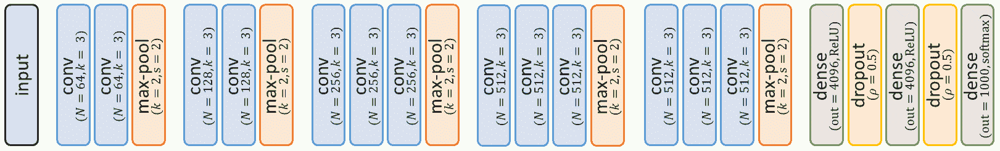
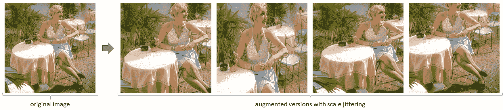
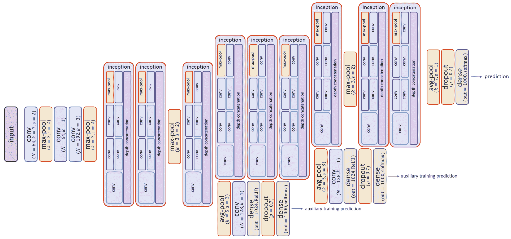
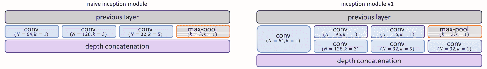
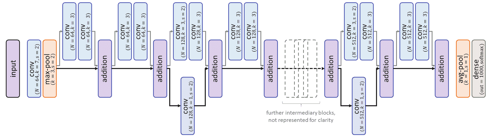

# 第四章：影响力的分类工具

在 2012 年深度学习突破之后，基于**卷积神经网络**（**CNNs**）的更精细的分类系统研究获得了动力。如今创新的速度越来越快，因为越来越多的公司在开发智能产品。在多年来为物体分类开发的众多解决方案中，有一些因为其对计算机视觉的贡献而变得非常著名。它们被衍生和改编用于如此多的不同应用，已达到必须了解的地位，因此值得拥有自己的一章。

与这些解决方案所引入的先进网络架构并行，其他方法也被探索用来更好地为 CNN 做好特定任务的准备。因此，在本章的第二部分，我们将探讨如何将网络在特定使用案例中获得的知识转移到新的应用中，以提高性能。

本章将涵盖以下主题：

+   VGG、Inception 和 ResNet 等重要架构对计算机视觉带来了什么

+   这些解决方案如何能够重新实现或直接用于分类任务

+   什么是迁移学习，如何高效地重新利用已训练的网络

# 技术要求

解释本章概念的 Jupyter notebook 可以在 GitHub 文件夹中找到，地址为 [github.com/PacktPublishing/Hands-On-Computer-Vision-with-TensorFlow-2/tree/master/Chapter04](https://github.com/PacktPublishing/Hands-On-Computer-Vision-with-TensorFlow-2/tree/master/Chapter04)。

本章唯一新增的包是 `tensorflow-hub`。安装说明可以在 [`www.tensorflow.org/hub/installation`](https://www.tensorflow.org/hub/installation) 找到（它是一个通过 `pip` 安装的单行命令：`pip install tensorflow-hub`）。

# 理解先进的 CNN 架构

计算机视觉的研究一直在通过渐进式的贡献和重大的创新飞跃不断向前发展。由研究人员和公司组织的挑战赛，邀请专家提交新的解决方案，以便最佳地解决预定任务，这些挑战赛在推动这些关键贡献方面起到了重要作用。**ImageNet 大规模视觉识别挑战赛** *(***ILSVRC**); 参见 第一章，*计算机视觉与神经网络*) 就是一个典型的例子。尽管 2012 年 AlexNet 获得了具有重大意义的胜利，但它依然代表着一个巨大的挑战，挑战的图像库包含数百万张图片，分为 1,000 个细粒度的类别，依然是勇敢的研究者们面临的巨大挑战。

在本节中，我们将介绍一些经典的深度学习方法，这些方法在 AlexNet 之后，针对 ILSVRC 持续进行改进，涵盖了导致这些方法发展的原因以及它们做出的贡献。

# VGG – 一种标准的 CNN 架构

我们将介绍的第一个网络架构是**VGG**（或*VGGNet*），由牛津大学的*视觉几何组*（Visual Geometry Group）开发。尽管该小组在 2014 年 ILSVRC 分类任务中仅获得第二名，但他们的方法影响了许多后来的架构。

# VGG 架构概述

了解 VGG 作者的动机，再看他们的贡献，我们将展示 VGG 架构如何通过更少的参数实现更高的准确率。

# 动机

AlexNet 是一次革命性的突破，它是第一个成功训练的 CNN，用于如此复杂的识别任务，并作出了多个至今仍然有效的贡献，诸如以下几点：

+   使用**修正线性单元**（***ReLU***）作为激活函数，这有效避免了梯度消失问题（将在本章后面解释），从而提高了训练效果（与使用 sigmoid 或 tanh 相比）

+   在 CNN 中应用**dropout**（详见第三章，*现代神经网络*，其中覆盖了所有相关好处）

+   典型的 CNN 架构结合了卷积层和池化层的块，最后通过全连接层进行最终预测

+   对图像进行随机变换（图像平移、水平翻转等），以合成性地扩展数据集（即通过随机编辑原始样本来增加不同的训练图像数量——更多细节请参见第七章，*在复杂且稀缺的数据集上训练*）

尽管如此，即便在当时，很明显这个原型架构仍有改进的空间。许多研究者的主要动力是尝试让网络更深（也就是构建一个由更多层堆叠组成的网络），尽管这会带来一些挑战。事实上，更多的层通常意味着需要训练更多的参数，这使得学习过程变得更加复杂。然而，正如我们将在下一段中描述的那样，牛津大学 VGG 小组的 Karen Simonyan 和 Andrew Zisserman 成功地解决了这个挑战。他们提交给 ILSVRC 2014 的方法达到了 7.3%的 Top-5 错误率，比 AlexNet 的 16.4%错误率低了超过一半！

**Top-5 准确率**是 ILSVRC 的主要分类指标之一。如果正确类别在前五个猜测之内，方法就被认为预测正确。事实上，对于许多应用程序来说，能够将大量类别候选缩小到较少的候选类别的方法是可以接受的（例如，可以将剩下的选择留给专家用户）。Top-5 指标是更通用的 top-k 指标的特例。

# 架构

在他们的论文（*《用于大规模图像识别的非常深的卷积网络》，* *ArXiv, 2014*）中，Simonyan 和 Zisserman 展示了他们如何将网络设计得比大多数以前的网络更深。实际上，他们介绍了六种不同的 CNN 架构，从 11 层到 25 层不等。每个网络由五个块组成，每个块包含几个连续的卷积层，后接最大池化层和三个最终的全连接层（训练时采用 dropout）。所有的卷积层和最大池化层都使用`SAME`作为填充方式。卷积的步长是*s = 1*，并且使用*ReLU*函数作为激活函数。总体来说，一个典型的 VGG 网络在下图中表示：



图 4.1：VGG-16 架构

两个最具表现力的架构，时至今日仍被广泛使用，它们被称为**VGG-16**和**VGG-19**。这些数字（16 和 19）代表了这些 CNN 架构的*深度*；即，堆叠在一起的*可训练*层数。例如，如*图 4.1*所示，VGG-16 包含 13 个卷积层和 3 个全连接层，因此深度为 16（不包括非可训练操作；即 5 个最大池化层和 2 个 dropout 层）。VGG-19 也是如此，包含额外的三个卷积层。VGG-16 大约有 1.38 亿个参数，而 VGG-19 有 1.44 亿个参数。这些数字相当高，尽管正如我们将在接下来的部分中展示的，VGG 研究人员采取了一种新的方法来保持这些值的控制，尽管其架构深度较大。

# 贡献 – 标准化 CNN 架构

在接下来的段落中，我们将总结这些研究人员介绍的最重要的贡献，并进一步详细说明他们的架构。

# 用多个较小的卷积代替较大的卷积

作者从一个简单的观察开始——一堆两个*3* × *3*核的卷积与一个*5* × *5*核的卷积具有相同的感受野（请参考第三章*, 现代神经网络*，了解**有效感受野**（**ERF**）公式）。

同样，三个连续的*3* × *3*卷积会得到*7* × *7*的感受野，而五个*3* × *3*操作会得到*11* × *11*的感受野。因此，尽管 AlexNet 使用了较大的滤波器（最大*11* × *11*），VGG 网络却包含更多数量但较小的卷积，以获得更大的 ERF。这一变化的好处有两个：

+   **它减少了参数的数量**：实际上，*11* × *11*卷积层的*N*个滤波器意味着需要训练*11* × *11* × *D* × *N* = *121D**N*个值（其中*D*为输入的深度），而五个*3* × *3*卷积层则需要*1* × *(3* × *3* × *D* × *N**)* + *4* × *(3* × *3* × *N* × *N**)* = *9**D**N* + *36**N²*个权重（用于它们的滤波器）。只要*N* < *3.6**D*，这意味着参数会更少。例如，当*N* = *2**D*时，参数的数量从*242**D²*降到*153**D²*（参考前面的公式）。这使得网络更容易优化，而且更加轻量（我们邀请你查看*7* × *7*和*5* × *5*卷积替换后的下降情况）。

+   **它增加了非线性**：拥有更多的卷积层——每一层后面跟着一个*非线性*激活函数，如*ReLU*——增加了网络学习复杂特征的能力（即，通过结合更多的非线性操作）。

总的来说，用小的连续卷积替代更大的卷积，使得 VGG 的作者能够有效地加深网络。

# 增加特征图的深度

基于另一种直觉，VGG 的作者将每个卷积块的特征图深度加倍（从第一次卷积后的 64 增加到 512）。由于每一组后面都有一个*2* × *2*的最大池化层，并且步幅为 2，深度加倍，而空间维度则减半。

这使得空间信息能够编码为越来越复杂且具有区分度的特征，用于分类。

# 使用尺度抖动进行数据增强

Simonyan 和 Zisserman 还引入了一种他们称之为**数据增强**的机制，名为**尺度抖动**。在每次训练迭代中，他们随机缩放批处理图像（将其较小的一边从 256 像素缩放到 512 像素），然后将其裁剪到适当的输入尺寸（他们的 ILSVRC 提交使用*224* × *224*）。通过这种随机变换，网络将面临不同尺度的样本，并学习尽管存在尺度抖动，仍然正确分类这些样本（参见*图 4.2*）。因此，网络变得更加稳健，因为它是在涵盖更多现实变换范围的图像上进行训练的。

数据增强是通过对图像应用随机变换，从而合成地增加训练数据集大小的过程，以创建不同版本的图像。详细信息和具体示例可参见第七章，*复杂和稀缺数据集的训练*。

作者们还建议在测试时应用随机缩放和裁剪。这个想法是通过这种方式生成查询图像的多个版本，并将它们全部输入网络，直觉是这样可以增加将内容以网络特别适应的尺度输入的机会。最终的预测是通过对每个版本的结果进行平均得到的。

在他们的论文中，他们展示了这一过程如何有助于提高准确性：



图 4.2：尺度抖动的示例。注意，通常不会保持内容的纵横比，以进一步转换图像。

这一原则之前被 AlexNet 的作者使用。在训练和测试过程中，他们为每张图像生成了多个版本，通过不同的裁剪和翻转变换的组合。

# 用卷积替代全连接层

虽然经典的 VGG 架构以多个**全连接**（**FC**）层（如 AlexNet）结束，但作者建议了一种替代版本。在这个版本中，全连接层被卷积层所替代。

第一组使用较大卷积核（*7* × *7* 和 *3* × *3*）的卷积操作将特征图的空间大小减少到 *1* × *1*（之前没有应用填充），并将其深度增加到 4,096。最后，使用一个 *1* × *1* 的卷积，其滤波器数量等于要预测的类别数（即，*N* = 1,000 用于 ImageNet）。最终的 *1* × *1* × *N* 向量通过 `softmax` 函数进行归一化，然后将其展开成最终的类别预测（向量的每个值表示预测的类别概率）。

*1* × *1* 卷积通常用于改变输入体积的深度，而不影响其空间结构。对于每个空间位置，新值是从该位置所有深度值的插值计算出来的。

没有任何全连接层的网络被称为**全卷积网络**（**FCN**）。正如在第三章《现代神经网络》中提到的，并且正如 VGG 作者所强调的那样，FCN 可以应用于不同大小的图像，而无需提前裁剪。

有趣的是，为了在 ILSVRC 中获得最佳准确率，作者同时训练并使用了两种版本（普通版和 FCN），再次通过平均它们的结果来获得最终的预测。这种技术被称为**模型平均**，在生产中经常使用。

# TensorFlow 和 Keras 的实现

由于作者在创建清晰架构方面的努力，VGG-16 和 VGG-19 是最容易重新实现的分类器之一。示例代码可以在本章的 GitHub 文件夹中找到，供教学用途。然而，在计算机视觉领域，像许多其他领域一样，通常建议不要重新发明轮子，而是重用现有的工具。以下段落展示了不同的预实现 VGG 解决方案，您可以直接调整并重用。

# TensorFlow 模型

虽然 TensorFlow 本身没有提供 VGG 架构的官方实现，但在`tensorflow/models` GitHub 库中可以找到精心实现的 VGG-16 和 VGG-19 网络（[`github.com/tensorflow/models`](https://github.com/tensorflow/models)）。这个由 TensorFlow 贡献者维护的库包含了许多精心策划的先进模型或实验性模型。通常建议在寻找特定网络时，应该搜索这个库。

我们邀请读者查看那里的 VGG 代码（目前可在[`github.com/tensorflow/tensorflow/blob/master/tensorflow/contrib/slim/python/slim/nets/vgg.py`](https://github.com/tensorflow/tensorflow/blob/master/tensorflow/contrib/slim/python/slim/nets/vgg.py)找到），它重新实现了我们之前描述的 FCN 版本。

# Keras 模型

Keras API 提供了这些架构的官方实现，可以通过其`tf.keras.applications`包访问（请参见文档：[`www.tensorflow.org/api_docs/python/tf/keras/applications`](https://www.tensorflow.org/api_docs/python/tf/keras/applications)）。该包包含了其他几个著名的模型，并为每个模型提供了*预训练*参数（即从先前在特定数据集上训练中保存的参数）。例如，你可以使用以下命令实例化一个 VGG 网络：

```py
vgg_net = tf.keras.applications.VGG16(
    include_top=True, weights='imagenet', input_tensor=None, 
    input_shape=None, pooling=None, classes=1000)
```

使用这些默认参数，Keras 会实例化 VGG-16 网络并加载在 ImageNet 上经过完整训练周期后保存的参数值。通过这一条命令，我们得到了一个准备好将图像分类为 1,000 个 ImageNet 类别的网络。如果我们想要重新从头训练网络，我们应该将`weights=None`，Keras 将随机设置权重。

在 Keras 术语中，*top*层对应于最后一层的连续全连接层。因此，如果我们设置`include_top=False`，VGG 的全连接层将被排除，网络的输出将是最后一个卷积/最大池化块的特征图。如果我们想要重用预训练的 VGG 网络来提取有意义的特征（这些特征可以应用于更高级的任务），而不仅仅是用于分类，这时可以使用`pooling`函数参数（即当`include_top=False`时）来指定在返回特征图之前对其进行的可选操作（`pooling='avg'`或`pooling='max'`，用于应用全局平均池化或最大池化）。

# GoogLeNet 和 inception 模块

由谷歌研究人员开发的架构，我们现在将要介绍的这一架构也被应用于 ILSVRC 2014，并在分类任务中超越了 VGGNet，获得了第一名。**GoogLeNet**（源自*Google*和*LeNet*，向这一开创性网络致敬）在结构上与其线性对手有很大不同，引入了*inception blocks*的概念（该网络也通常被称为**inception network**）。

# GoogLeNet 架构概述

正如我们将在接下来的章节中看到的，GoogLeNet 的作者 Christian Szegedy 等人，从一个与 VGG 研究人员截然不同的角度出发，构思了一个更高效的 CNN（*深入卷积网络*，CVPR IEEE 会议论文，2014）。

# 动机

虽然 VGG 的作者基于 AlexNet 并致力于标准化和优化其结构，以获得更清晰和更深的架构，谷歌的研究人员则采取了不同的方法。正如论文中提到的，他们的第一个考虑因素是优化 CNN 的计算开销。

实际上，尽管经过精心设计（参见 VGG），CNN 越深，训练参数的数量和每次预测的计算量就越大（在内存和时间上都很昂贵）。例如，VGG-16 大约占 93 MB（参数存储方面），而 VGG 在 ILSVRC 的提交需要两到三周的时间，在四个 GPU 上进行训练。GoogLeNet 拥有大约 500 万个参数，比 AlexNet 轻 12 倍，比 VGG-16 轻 21 倍，而且该网络在一周内就能训练完成。因此，GoogLeNet——以及更近期的 inception 网络——甚至可以在较为普通的机器（如智能手机）上运行，这也促进了它们的长期流行。

我们必须记住，尽管在参数和操作数量上大幅减少，GoogLeNet 仍然在 2014 年的分类挑战中获胜，具有 6.7% 的 top-5 错误率（而 VGG 为 7.3%）。这一表现是 Szegedy 等人第二个目标的结果——构建一个不仅更深而且更大的网络，具有并行层块用于 *多尺度处理*。虽然我们将在本章后面详细介绍这个解决方案，但其直觉其实很简单。构建一个 CNN 是一项复杂的迭代任务。我们如何知道应该在堆叠中添加哪个层（如卷积层或池化层）以提高准确性？我们如何知道哪个卷积核尺寸最适合某一层？毕竟，不同尺寸的卷积核对不同尺度的特征反应不同。我们如何避免这种取舍？根据作者的说法，一个解决方案是使用他们开发的 * inception 模块*，由多个不同的层并行工作组成。

# 架构

如*图 4.3*所示，GoogLeNet 架构不像我们之前学习的架构那样简单，尽管可以按区域逐一分析。输入图像首先通过经典的卷积层和最大池化层系列进行处理。然后，信息经过九个 Inception 模块的堆叠。这些模块（通常称为**子网络**；详见*图 4.4*）是垂直和水平方向堆叠的层块。对于每个模块，输入特征图会传递到由一个或两个不同层（具有不同卷积核大小的卷积和最大池化）组成的四个并行子块。

这四个并行操作的结果会沿深度维度被串联在一起，形成一个单一的特征体积：



图 4.3：GoogLeNet 架构。Inception 模块详见*图 4.4*

在前面的图中，所有的卷积层和最大池化层都使用了`SAME`填充。卷积层如果没有特别说明，*s = 1*（步幅为 1），并使用*ReLU*函数作为激活函数。

该网络由几个层块组成，这些层块共享相似的结构，并具有并行层——即 Inception 模块。例如，第一 Inception 模块，如*图 4.3*所示，接收一个大小为*28* × *28* × *192*的特征体积作为输入。它的第一个并行子块，由一个*1* × *1*卷积输出组成（*N* = 64，*s* = 1），因此生成一个*28* × *28* × *64*的张量。同样，第二个子模块，由两个卷积组成，输出一个*28* × *28* × *128*的张量；剩下的两个子模块分别输出一个*28* × *28* × *32*和*28* × *28* × *32*的特征体积。因此，通过将这四个结果沿最后一个维度堆叠，第一 Inception 模块输出一个*28* × *28* × *256*的张量，然后将其传递到第二模块，以此类推。在下面的图示中，左侧表示的是朴素解法，右侧显示的是 GoogLeNet 中使用的模块（即 Inception 模块 v1）（请注意，在 GoogLeNet 中，随着模块的深度增加，滤波器数量*N*也会增加）：



图 4.4：Inception 模块：朴素解法与实际解法

最后一个模块的特征通过平均池化从*7* × *7* × *1,024*池化到*1* × *1* × *1,024*，并最终密集地转换为预测向量。如*图 4.3*所示，网络进一步由两个辅助分支组成，这些分支也指向预测。它们的目的将在下一节中详细说明。

总的来说，GoogLeNet 是一个 22 层深的架构（仅计算可训练的层），总共有超过 60 个卷积层和全连接层。尽管如此，这个更大的网络参数量比 AlexNet 少了 12 倍。

# 贡献 – 推广更大块和瓶颈结构

低数量的参数以及网络的性能是 GoogLeNet 作者实现的多个概念的结果。我们将在本节中介绍这些主要概念。

本节中，我们将仅介绍与之前介绍的网络不同的关键概念。请注意，GoogLeNet 的作者重新应用了我们已覆盖的几种其他技术，例如对每个输入图像进行多个裁剪的预测以及在训练期间使用其他图像变换。

# 使用 inception 模块捕获各种细节

由 Min Lin 等人在其具有影响力的 **Network in Network** (**NIN**) 论文中于 2013 年提出，构建由子网络模块组成的 CNN 的理念被 Google 团队采用并充分利用。如前所述并在*图 4.4*中展示，他们开发的基本 inception 模块由四个并行层组成——三个卷积层，滤波器大小分别为 *1* × *1*、*3* × *3* 和 *5* × *5*，以及一个步长为 `1` 的最大池化层。此并行处理的优势，在结果拼接后，显而易见。

正如在动机小节中所解释的，这种架构允许对数据进行多尺度处理。每个 inception 模块的结果结合了不同尺度的特征，捕获了更广泛的信息。我们不需要选择哪个卷积核大小可能是最好的（这样的选择需要进行多次训练和测试迭代），即网络会自己学习在每个模块中依赖哪些卷积。

此外，虽然我们展示了如何通过垂直堆叠具有非线性激活函数的层来积极影响网络性能，但对于水平组合，情况也是如此。来自不同层的特征拼接进一步增强了卷积神经网络（CNN）的非线性特性。

# 使用 *1* × *1* 卷积作为瓶颈

尽管这本身不是一种贡献，Szegedy 等人通过高效地将其应用于他们的网络，使得以下技术广为人知。

如在*用卷积替代全连接层*部分中提到的，*1* × *1* 卷积层（步长为 1）常用于在不影响输入空间结构的情况下改变输入体积的整体深度。这样的层具有 *N* 个滤波器，输入形状为 *H* × *W* × *D*，并返回一个插值后的 *H* × *W* × *N* 张量。对于输入图像中的每个像素，其 *D* 通道的值将通过该层（根据其滤波器权重）被插值为 *N* 个通道值。

这一特性可以应用于通过预先压缩特征深度（使用*N* < *D*）来减少更大卷积所需的参数数量。该技术基本上使用*1* × *1*的卷积作为**瓶颈**（即作为中间层，降低维度，从而减少参数数量）。由于神经网络中的激活通常是冗余的或未被使用，这样的瓶颈通常几乎不影响性能（只要它们不会大幅度减少深度）。此外，GoogLeNet 有并行层来补偿深度的减少。实际上，在 Inception 网络中，每个模块中都有瓶颈，出现在所有较大卷积之前和最大池化操作之后，如*图 4.4*所示。

以第一个 Inception 模块中的*5* × *5*卷积为例（输入为*28* × *28* × *192*的体积），其过滤器的张量在传统版本中将是*5* × *5* × *192* × *32*的维度。仅这个卷积就代表了 153,600 个参数。在 Inception 模块的第一个版本（即带瓶颈的版本）中，在 5 × 5 卷积之前引入了一个*1* × *1*的卷积，其中*N* = 16。结果，这两个卷积的总参数为*1* × *1* × *192* × *16* + *5* × *5* × *16* × *32* = *15,872*个可训练的核值。这比之前版本（仅对于这个单独的*5* × *5*层）少了 10 倍的参数，且输出大小相同！此外，正如前面所提到的，添加具有非线性激活函数（*ReLU*）的层进一步提高了网络抓取复杂概念的能力。

本章展示的是 GoogLeNet 提交给 ILSVRC 2014 的版本。更常被称为**Inception V1**，该架构自那时以来已被作者进一步改进。**Inception V2**和**Inception V3**包含了几个改进，例如将*5 × 5*和*7 × 7*卷积替换为更小的卷积（如 VGG 中所做的），改进瓶颈的超参数以减少信息损失，并添加了*BatchNorm*层。

# 使用池化代替全连接

为了减少参数的数量，Inception 的作者们采用了一个解决方案，即在最后一个卷积块之后使用平均池化层，而不是全连接层。通过使用*7* × *7*的窗口大小和步长为 1，该层将特征体积从*7* × *7* × *1,024*减少到*1* × *1* × *1,024*，而无需训练任何参数。如果使用全连接层，则会增加（*7* × *7* × *1,024*）× 1,024 = *51,380,224*个参数。尽管使用这个替代方法网络的表达能力有所降低，但计算上的提升是巨大的（并且网络已经包含了足够的非线性操作来捕捉最终预测所需的信息）。

GoogLeNet 中的最后一层全连接层（FC 层）具有*1,024* × *1,000* = *1,024,000*个参数，占网络总参数的五分之一！

# 通过中间损失来应对梯度消失问题

如在介绍架构时简要提到的，GoogLeNet 在训练时有两个辅助分支（训练后移除），也用于生成预测。

它们的目的是在训练过程中改善损失在网络中的传播。事实上，较深的 CNN 经常会遇到**梯度消失**问题。许多 CNN 操作（例如，*sigmoid*）的导数幅度较小（小于一）。因此，层数越高，反向传播时导数的乘积就会变得越小（因为更多小于一的值相乘，结果会更接近零）。通常，梯度在到达第一层时会消失或缩小为零。由于梯度值直接用于更新参数，如果梯度太小，这些层将无法有效学习。

另一个相反的现象——**梯度爆炸**问题——也可能发生在更深的网络中。当使用导数可能具有更大幅度的操作时，它们在反向传播时的乘积可能会变得非常大，以至于导致训练不稳定（权重更新剧烈且不稳定），甚至有时会溢出（`NaN`值）。

这里实现的解决方案非常务实且有效：通过在不同的网络深度引入额外的分类损失，减少第一层与预测之间的距离。如果最终损失的梯度无法正常流向第一层，那么这些层仍然会通过更靠近的中间损失进行训练，从而有助于分类。顺便提一下，这个解决方案还略微提高了受多个损失影响的层的鲁棒性，因为它们必须学习提取既对主网络有用，又对较短分支有用的判别特征。

# 在 TensorFlow 和 Keras 中的实现

尽管 Inception 架构乍一看可能显得复杂，但我们已经拥有大部分实现它的工具。此外，TensorFlow 和 Keras 也提供了几个预训练版本。

# 使用 Keras 功能 API 的 Inception 模块

到目前为止，我们实现的网络完全是顺序结构，从输入到预测只有一条路径。与此不同，Inception 模型有多个并行的层和分支。这使得我们有机会展示，这种操作图形在现有的 API 下并没有比其他网络更难实例化。在接下来的部分，我们将使用 Keras 功能 API 编写一个 Inception 模块（参见文档：[`keras.io/getting-started/sequential-model-guide/`](https://keras.io/getting-started/sequential-model-guide/)）。

到目前为止，我们主要使用的是 Keras Sequential API，而它并不太适合多路径架构（正如其名字所暗示的那样）。Keras Functional API 更接近 TensorFlow 的范式，通过将每一层的 Python 变量作为参数传递给下一层来构建图形。以下代码展示了使用这两种 API 实现的一个简化模型：

```py
from keras.models import Sequential, Model
from keras.layers import Dense, Conv2D, MaxPooling2D, Flatten, Input

# Sequential version:
model = Sequential()
model.add(Conv2D(32, kernel_size=(5, 5), input_shape=input_shape))
model.add(MaxPooling2D(pool_size=(2, 2)))
model.add(Flatten())
model.add(Dense(10, activation='softmax'))

# Functional version:
inputs = Input(shape=input_shape)
conv1 = Conv2D(32, kernel_size=(5, 5))(inputs)
maxpool1 = MaxPooling2D(pool_size=(2, 2))(conv1)
predictions = Dense(10, activation='softmax')(Flatten()(maxpool1))
model = Model(inputs=inputs, outputs=predictions)
```

使用功能性 API，可以轻松地将一个层传递给多个其他层，这正是我们需要用于 Inception 模块的并行块。它们的结果可以通过 `concatenate` 层合并在一起（参见文档 [`keras.io/layers/merge/#concatenate_1`](https://keras.io/layers/merge/#concatenate_1)）。因此，*图 4.4* 中展示的简单 Inception 块可以按如下方式实现：

```py
from keras.layers import Conv2D, MaxPooling2D, concatenate

def naive_inception_block(previous_layer, filters=[64, 128, 32]):
    conv1x1 = Conv2D(filters[0], kernel_size=(1, 1), padding='same', 
                     activation='relu')(previous_layer)
    conv3x3 = Conv2D(filters[1], kernel_size=(3, 3), padding='same',
                     activation='relu')(previous_layer)
    conv5x5 = Conv2D(filters[2], kernel_size=(5, 5), padding='same', 
                     activation='relu')(previous_layer)
    max_pool = MaxPooling2D((3, 3), strides=(1, 1), 
                            padding='same')(previous_layer)
    return concatenate([conv1x1, conv3x3, conv5x5, max_pool], axis=-1)
```

我们将留给你自己来调整这段代码，以通过添加瓶颈层来实现 Inception V1 的正确模块。

# TensorFlow 模型和 TensorFlow Hub

Google 提供了几种脚本和教程，解释如何直接使用其 Inception 网络，或者如何对其进行重新训练以适应新的应用。`tensorflow/models` Git 仓库中专门针对这一架构的目录（[`github.com/tensorflow/models/tree/master/research/inception`](https://github.com/tensorflow/models/tree/master/research/inception)）也非常丰富且文档详尽。此外，Inception V3 的预训练版本已在 **TensorFlow Hub** 上提供，这为我们介绍这一平台提供了机会。

TensorFlow Hub 是一个预训练模型的仓库。类似于 Docker 允许人们轻松共享和重用软件包，避免重新配置分发，TensorFlow Hub 提供了访问预训练模型的功能，让人们无需花时间和资源去重新实现和重新训练模型。它结合了一个网站（[`tfhub.dev`](https://tfhub.dev)），用户可以在其中搜索特定的模型（例如，基于目标识别任务），以及一个 Python 包来轻松下载和开始使用这些模型。例如，我们可以按如下方式获取并设置 Inception V3 网络：

```py
import tensorflow as tf
import tensorflow_hub as hub

url = "https://tfhub.dev/google/tf2-preview/inception_v3/feature_vector/2"
hub_feature_extractor = hub.KerasLayer( # TF-Hub model as Layer
    url, # URL of the TF-Hub model (here, an InceptionV3 extractor)
    trainable=False, # Flag to set the layers as trainable or not
    input_shape=(299, 299, 3), # Expected input shape (found on tfhub.dev)
    output_shape=(2048,), # Output shape (same, found on the model's page)
    dtype=tf.float32) # Expected dtype

inception_model = Sequential(
    [hub_feature_extractor, Dense(num_classes, activation='softmax')], 
    name="inception_tf_hub")
```

尽管这段代码相当简洁，但实际上发生了很多事情。初步步骤是浏览 [tfhub.dev](https://tfhub.dev) 网站，并在其中选择一个模型。在展示所选模型的页面上（[`tfhub.dev/google/tf2-preview/inception_v3/feature_vector/2`](https://tfhub.dev/google/tf2-preview/inception_v3/feature_vector/2); 存储在 `model_url` 中），我们可以看到所选的 Inception 模型被定义为 **图像特征向量**，它期望接收 *299* × *299* × *3* 的输入，此外还有其他一些细节。要使用 TensorFlow Hub 模型，我们需要知道如何与其交互。

*图像特征向量*类型告诉我们该网络返回的是提取的特征；也就是说，它返回的是在密集操作之前，最后一个卷积块的输出。使用这样的模型，我们可以自行添加最终层（例如，确保输出大小与考虑的类别数量相符）。

TensorFlow Hub 接口的最新版本与 Keras 完美兼容，并且可以通过 `tensorflow_hub.KerasLayer(model_url, trainable, ...)` 将完整的预训练 TensorFlow Hub 模型提取并实例化为 Keras 层。像任何 Keras 层一样，它可以在更大的 Keras 模型或 TensorFlow 估算器中使用。

尽管这可能看起来不像使用 Keras Applications API 那么直接，TensorFlow Hub 拥有一个异国情调的模型目录，并且预计随着时间的推移会不断增加。

Git 仓库中提供的一个 Jupyter notebook 专门介绍了 TensorFlow Hub 及其使用方法。

# Keras 模型

与 VGG 一样，Keras 提供了 Inception V3 的实现，并且可以选择使用在 ImageNet 上预训练的权重。`tf.keras.applications.InceptionV3()`（参见文档：[`keras.io/applications/#inceptionv3`](https://keras.io/applications/#inceptionv3)）的函数签名与 VGG 的一致。

我们提到了 AlexNet，这是 2012 年 ILSVRC 的获胜解决方案，以及 VGGNet 和 GoogLeNet，它们在 2014 年的比赛中脱颖而出。你可能会想知道 2013 年是谁赢得了比赛。那一年的挑战赛被 **ZFNet** 架构主导（以其创建者 Matthew Zeiler 和 Rob Fergus 为名，二人来自纽约大学）。如果本章没有介绍 ZFNet，那是因为其架构并不特别创新，并且此后并未广泛使用。

然而，Zeiler 和 Fergus 的重要贡献在于他们在其他方面的工作——他们开发并应用了多个卷积神经网络（CNN）可视化操作（如**反池化**和**转置卷积**，也称为**反卷积**，这两者在第六章《增强与图像分割》中有详细介绍）。事实上，神经网络的一个常见批评是它们像*黑盒子*一样运行，没人真正理解它们为什么以及如何如此有效。Zeiler 和 Fergus 的工作是揭示 CNN 内部过程的重要第一步（例如，它们是如何对特定特征作出反应的，以及它们如何随着层次加深学习更加抽象的概念）。通过可视化每一层网络对特定图像的反应及其对最终预测的贡献，作者能够优化超参数，从而提高模型性能（《卷积神经网络的可视化与理解》，Springer，2014）。

对神经网络的理解研究仍在进行中（例如，最近的许多工作捕捉并分析了网络对特定元素的*注意力*），并且已经极大地帮助改进了当前的系统。

# ResNet —— 残差网络

本章中我们将讨论的最后一个架构，在 2015 年的 ILSVRC 中获胜。它由一种新型模块——残差模块组成，**ResNet**（**残差网络**）提供了一种高效的方法来构建非常深的网络，在性能上超越了更大的模型，如 Inception。

# ResNet 架构概述

由微软研究员 Kaiming He 等人开发的 ResNet 架构，是一个有趣的解决方案，旨在解决影响 CNN 的学习问题。按照前述章节的结构，我们将首先明确作者的目标，并介绍他们的新颖架构（参见*深度残差学习用于图像识别*，CVPR IEEE 会议论文集，2016）。

# 动机

Inception 网络证明，增加网络规模是图像分类以及其他识别任务中的一种有效策略。然而，专家们仍然不断尝试通过增加网络的深度来解决越来越复杂的任务。然而，He 等人在论文前言中提出的那个问题*“学习更好的网络就像堆叠更多的层一样简单吗？”*是有道理的。

我们已经知道，网络越深，训练就越困难。但除了*梯度消失/爆炸*问题（已有其他解决方案处理过），He 等人指出了深度卷积神经网络（CNN）面临的另一个问题——*性能退化*。这一切源于一个简单的观察——CNN 的准确率并不会随着新层的增加而线性提高。随着网络深度的增加，出现了退化问题。准确率开始饱和甚至下降。即使是训练损失，在不加注意地堆叠过多层时，也开始下降，证明问题并不是由于过拟合引起的。例如，作者将 18 层深的 CNN 和 34 层深的 CNN 进行了比较，结果显示后者在训练过程中以及训练后表现都不如较浅的版本。在他们的论文中，He 等人提出了解决方案，以构建非常深且具有良好性能的网络。

通过*模型平均*（应用不同深度的 ResNet 模型）和*预测平均*（对每个输入图像的多个裁剪结果进行预测平均），ResNet 作者在 ILSVRC 挑战中达到了历史最低的 3.6% 的 top-5 错误率。这是首次有算法在该数据集上超过了人类。挑战组织者曾测量人类的表现，最佳人类候选者的错误率为 5.1%（参见*ImageNet 大规模视觉识别挑战*，Springer，2015）。在这样的任务中实现超越人类的表现，是深度学习的一个巨大里程碑。然而，我们仍需牢记，尽管算法能够熟练地解决特定任务，但它们仍不具备将这些知识扩展到其他任务，或者理解所处理数据的上下文的能力。

# 架构

与 Inception 类似，ResNet 也经历了多次架构的迭代改进，例如添加了瓶颈卷积或使用了更小的卷积核。与 VGG 类似，ResNet 也有多个伪标准化版本，特点是其深度：ResNet-18、ResNet-50、ResNet-101、ResNet-152 等。事实上，2015 年 ILSVRC 的获胜 ResNet 网络堆叠了 152 个可训练层（总共有 6000 万个参数），这是当时一个令人印象深刻的成就：



图 4.5: 示例 ResNet 架构

在前面的图示中，所有卷积层和最大池化层的填充方式都是`SAME`，并且步幅未指定时为*s = 1*。每个*3* × *3*卷积后都应用批量归一化（在残差路径上，灰色部分），而*1* × *1*卷积（在映射路径上，黑色部分）没有激活函数（为恒等映射）。

如我们在*图 4.5*中看到的，ResNet 架构比 Inception 架构更简洁，尽管它也由具有并行操作的层块组成。与 Inception 不同的是，每个并行层会非线性地处理输入信息，而 ResNet 的模块由一个非线性路径和一个恒等路径组成。前者（由*图 4.5*中较细的灰色箭头表示）对输入特征图进行若干次卷积、批量归一化和*ReLU*激活。后者（由较粗的黑色箭头表示）则简单地转发特征而不进行任何转换。

最后一条陈述并不总是正确的。如*图 4.5*所示，当特征的深度通过非线性分支并行增加时，使用*1* × *1*卷积来调整特征的深度。在这种情况下，为了避免参数数量的急剧增加，空间维度在两侧也使用步幅*s* = 2 进行减小。

与 Inception 模块一样，来自每个分支的特征图（即转换后的特征和原始特征）在传递到下一个模块之前会被合并在一起。然而，与 Inception 模块不同的是，这种合并并不是通过深度连接来实现的，而是通过逐元素加法（这是一种简单的操作，不需要额外的参数）。我们将在接下来的部分中探讨这些残差模块的优势。

请注意，在大多数实现中，每个残差块的最后一个*3* × *3*卷积后并不会直接跟随*ReLU*激活。相反，非线性函数是在与恒等路径合并之后才应用的。

最后，来自最后一个模块的特征经过平均池化并密集地转换成预测结果，如同在 GoogLeNet 中一样。

# 贡献 – 更深入地传递信息

残差模块对机器学习和计算机视觉作出了重要贡献。在接下来的部分，我们将探讨这一点的原因。

# 估计残差函数而非映射

正如 ResNet 的作者所指出的，如果层能够轻松地学习**恒等映射**（也就是说，如果一组层能够学习权重，使得它们的一系列操作最终返回与输入层相同的张量），则不会发生退化现象。

事实上，作者们认为，当在 CNN 上添加一些层时，如果这些额外的层能够收敛到恒等函数，我们应该至少获得相同的训练/验证误差。它们至少会学习将原始网络的结果传递下去，而不会使其退化。由于我们经常可以观察到退化现象，这意味着 CNN 层并不容易学习到恒等映射。

这促使了引入残差块的想法，残差块有两条路径：

+   一条路径进一步处理数据，增加了一些卷积层

+   一条路径执行恒等映射（也就是，直接转发数据，不做任何更改）

我们可以直观地理解这如何解决退化问题。当在 CNN 上添加一个残差块时，至少可以通过将处理分支的权重设置为零来保持原有的性能，从而只留下预定义的恒等映射。只有当处理路径有助于最小化损失时，它才会被考虑。

数据转发路径通常被称为**跳跃**路径或**快捷方式**。处理路径通常被称为**残差****路径**，因为其操作的输出会被加到原始输入上，当恒等映射接近最优时，处理后的张量的大小比输入的张量小得多（因此使用了*残差*这一术语）。总体来说，这条残差路径仅对输入数据引入微小的变化，使得它能够将模式传递到更深的层。

在他们的论文中，何等人展示了他们的架构不仅解决了退化问题，而且他们的 ResNet 模型在相同层数下比传统模型的准确率更高。

# 极深网络

还值得注意的是，残差块比传统块不包含更多的参数，因为跳跃和加法操作不需要额外的参数。因此，它们可以高效地作为*超深*网络的构建块。

除了应用于 ImageNet 挑战的 152 层网络外，作者们还通过训练一个令人印象深刻的 1,202 层网络来展示他们的贡献。他们报告说，训练这样一个庞大的卷积神经网络（CNN）没有遇到困难（尽管其验证准确率略低于 152 层网络，可能是因为过拟合）。

更近的研究开始探索利用残差计算来构建更深更高效的网络，例如**高速公路**网络（带有可训练的开关值来决定每个残差块应使用哪个路径）或**DenseNet**模型（在块之间添加更多的跳跃连接）。

# TensorFlow 和 Keras 的实现

与之前的架构一样，我们已经具备了重新实现 ResNet 所需的工具，并且可以直接访问预实现/预训练版本。

# 使用 Keras 函数式 API 实现残差块

作为练习，让我们自己实现一个基本的残差块。如*图 4.5*所示，残差路径由两个卷积层组成，每个卷积层后跟一个批量归一化层。*ReLU* 激活函数直接应用于第一个卷积层之后。对于第二个卷积层，激活函数仅在与另一条路径合并之后应用。使用 Keras 函数式 API，残差路径可以通过五六行代码轻松实现，具体代码如下所示。

快捷路径甚至更简单。它要么没有任何层，要么只有一个 *1* × *1* 的卷积层，用于在残差路径改变输入张量的维度时（例如，当使用更大的步幅时）进行重塑。

最后，将两条路径的结果相加，并对和应用*ReLU*函数。总的来说，一个基本的残差块可以如下实现：

```py
from tf.keras.layers import Activation, Conv2D, BatchNormalization, add

def residual_block_basic(x, filters, kernel_size=3, strides=1):
    # Residual Path:
    conv_1 = Conv2D(filters=filters, kernel_size=kernel_size, 
                    padding='same', strides=strides)(x)
    bn_1 = BatchNormalization(axis=-1)(conv_1)
    act_1 = Activation('relu')(bn_1)
    conv_2 = Conv2D(filters=filters, kernel_size=kernel_size, 
                    padding='same', strides=strides)(act_1)
    residual = BatchNormalization(axis=-1)(conv_2)
    # Shortcut Path:
    shortcut = x if strides == 1 else Conv2D(
        filters, kernel_size=1, padding='valid', strides=strides)(x)
    # Merge and return :
    return Activation('relu')(add([shortcut, residual]))
```

在一个 Jupyter notebook 中展示了一个更优雅的函数。该 notebook 还包含了 ResNet 架构的完整实现和一个分类问题的简要演示。

# TensorFlow 模型与 TensorFlow Hub

和 Inception 网络一样，ResNet 网络也有自己的官方实现，提供在 `tensorflow/models` Git 仓库中，并且有自己的预训练 TensorFlow Hub 模块。

我们邀请你查看官方的 `tensorflow/models` 实现，因为它提供了多个来自最新研究的残差块类型。

# Keras 模型

最后，Keras 再次提供了自己的 ResNet 实现——例如，`tf.keras.applications.ResNet50()`（请参考 [`keras.io/applications/#resnet50`](https://keras.io/applications/#resnet50) 中的文档）——并可以加载在 ImageNet 上预训练的参数。这些方法的签名与之前介绍的 Keras 应用程序相同。

这个 Keras 应用程序的完整代码也已提供在 Git 仓库中。

本章中展示的 CNN 架构列表并不声称是详尽无遗的。它经过精心挑选，涵盖了计算机视觉领域中的重要解决方案和具有教学价值的内容。

随着视觉识别领域的研究不断快速进展，越来越多的先进架构应运而生，这些架构是在之前的解决方案（例如 Highway 和 DenseNet 方法对 ResNet 的改进）基础上提出的，或通过合并它们（如 Inception-ResNet 解决方案）而成，或为特定的使用场景进行了优化（如专为手机运行的轻量级 MobileNet）。因此，在尝试重新发明轮子之前，查看一下当前的技术前沿总是个不错的主意（例如，在官方仓库或研究期刊中）。

# 利用迁移学习

这种重新利用他人提供的知识的理念不仅在计算机科学中非常重要。人类技术的发展几千年来，正是源于我们将知识从一代传递到另一代、从一个领域传递到另一个领域的能力。许多研究人员认为，将这一理念应用于机器学习，可能是开发更高效系统的关键之一，使其能够解决新任务，而无需从头开始重新学习一切。

因此，本节将介绍**迁移学习**对人工神经网络的意义，以及它如何应用于我们的模型。

# 概述

我们将首先介绍什么是迁移学习，以及根据不同的应用场景，它是如何在深度学习中实现的。

# 定义

在本章的第一部分，我们介绍了几种为 ImageNet 分类挑战赛开发的著名 CNN。我们提到这些模型通常被重新利用到更广泛的应用中。在接下来的章节中，我们将最终详细说明这种重新调适的原因及其实施方法。

# 人类启示

就像许多机器学习的发展一样，迁移学习的灵感来源于我们人类处理复杂任务和获取知识的方式。

如本节引言中所提到的，第一个灵感来源是我们作为一个物种将知识从一个个体转移到另一个个体的能力。专家可以通过口头或书面教学，迅速将他们多年来积累的宝贵知识传授给大量学生。通过利用一代又一代积累并提炼的知识，人类文明能够不断精炼并扩展其技术能力。我们祖先花费千年才理解的现象——如人类生物学、太阳系等——已成为常识。

此外，作为个体，我们也具备将某些专长从一项任务转移到另一项任务的能力。例如，掌握一门外语的人更容易学习类似的语言。类似地，已经有一段时间驾驶汽车的人，已经掌握了交通规则和一些相关的反应技能，这些对他们学习驾驶其他车辆非常有帮助。

这些通过利用已有知识来掌握复杂任务的能力，以及将获得的技能转用于相似活动的能力，是人类智慧的核心。机器学习领域的研究人员梦寐以求能够复制这些能力。

# 动机

与人类不同，迄今为止，大多数机器学习系统都是为单一特定任务设计的。直接将训练好的模型应用到不同的数据集上通常会得到较差的结果，尤其是当数据样本不共享相同的语义内容（例如，MNIST 手写数字图像与 ImageNet 照片）或相同的图像质量/分布（例如，智能手机图片数据集与高质量图片数据集）时。由于 CNN 被训练来提取和解释特定特征，因此如果特征分布发生变化，它们的性能将会受到影响。因此，必须进行一些转换才能将网络应用于新任务。

解决方案已经被研究了几十年。在 1998 年，Sebastian Thrun 和 Lorien Pratt 编辑了*Learning to Learn*，一本汇编了该主题流行研究观点的书籍。最近，在他们的*Deep Learning*书中（[`www.deeplearningbook.org/contents/representation.html`](http://www.deeplearningbook.org/contents/representation.html)，MIT 出版社，第 534 页），Ian Goodfellow、Yoshua Bengio 和 Aaron Courville 将迁移学习定义如下：

[...] 这种情况是指在一个设置中学到的知识（例如，分布 p[1]）被用来提高另一个设置中的泛化能力（例如，分布 p[2]）。

对研究人员来说，假设例如 CNN 提取的一些特征可以部分重用于分类手写文本是合理的，尤其是手写数字分类。类似地，一个学习了检测人脸的网络可以部分用于评估面部表情。事实上，尽管输入（用于人脸检测的完整图像与新任务的裁剪图像）和输出（检测结果与分类值）不同，但该网络的一些层已经被训练来提取面部特征，这对这两项任务都有帮助。

在机器学习中，**任务**由提供的输入（例如，智能手机的图片）和期望的输出（例如，特定类别集的预测结果）定义。例如，ImageNet 上的分类和检测是两个不同的任务，尽管它们使用相同的输入图像，但输出却不同。

在某些情况下，算法可以针对相似的任务（例如，行人检测），但使用不同的数据集（例如，不同位置的 CCTV 图像，或不同质量的摄像头图像）。因此，这些方法是在不同的**领域**（即，数据分布）上进行训练的。

迁移学习的目标是将知识从一个任务应用到另一个任务，或者从一个领域应用到另一个领域。后一种类型的迁移学习被称为**领域适应**，将在第七章中更具体地讨论，*在复杂和稀缺数据集上的训练*。

迁移学习在数据不足以充分学习新任务时尤为有趣（即，缺乏足够的图像样本来估计分布）。事实上，深度学习方法非常依赖数据；它们需要大量的数据集进行训练。这些数据集——特别是用于监督学习的标注数据集——通常非常繁琐，甚至不可能收集。例如，专家们在为工业自动化建立识别系统时，不能去每个工厂拍摄每个新制造的产品及其组件的数百张照片。他们通常不得不处理较小的数据集，而这些数据集对于 CNN 来说不足以令人满意地收敛。这些限制解释了为何要将已经在充分记录的视觉任务上获得的知识重用于其他任务的努力。

ImageNet 及最近的 COCO 是特别丰富的数据集，包含了来自大量类别的数百万张标注图像。假设在这些数据集上训练的 CNN 已获得了相当的视觉识别专业知识，因此，Keras 和 TensorFlow Hub 提供了在这些数据集上已训练的标准模型（如 Inception、ResNet-50 等）。人们常常使用这些模型来进行知识迁移。

# 迁移 CNN 知识

那么，如何将某些知识从一个模型转移到另一个模型呢？人工神经网络相对于人脑有一个有利之处，那就是它们可以轻松存储和复制。CNN 的专业知识无非是其参数在训练后得到的值——这些值可以很容易地恢复并转移到相似的网络中。

CNN 的迁移学习主要是通过重用在丰富数据集上训练的高性能网络的完整或部分架构和权重，来实例化一个用于不同任务的新模型。通过这种条件化的实例化，新模型可以进行*微调*；也就是说，它可以在可用数据上进一步训练，以适应新的任务或领域。

正如我们在前几章中强调的那样，网络的第一层通常提取低级特征（如线条、边缘或颜色渐变），而最终的卷积层则反应更为复杂的概念（如特定的形状和模式）。对于分类任务，最终的池化层和/或全连接层处理这些高级特征图（通常称为**瓶颈特征**），从而做出类别预测。

这一典型的设置和相关观察促成了各种迁移学习策略的提出。去掉最终预测层的预训练 CNN，开始作为高效的*特征提取器*使用。当新任务与这些提取器训练的任务足够相似时，它们可以直接用来输出相关的特征（例如，TensorFlow Hub 上的*图像特征向量*模型正是为了这个目的而存在）。然后，这些特征可以通过一两个新的全连接层进行处理，这些层经过训练后可以输出与任务相关的预测。为了保持提取特征的质量，特征提取器的层通常会在训练阶段被*冻结*；即，它们的参数在梯度下降过程中不会被更新。在其他情况下，当任务/领域不太相似时，特征提取器的最后几层——或者所有层——会被*微调*；也就是说，这些层与新的预测层一起在任务数据上进行训练。这些不同的策略将在接下来的段落中进一步解释。

# 使用场景

实际上，我们应该重用哪个预训练模型？哪些层应该被冻结或微调？这些问题的答案取决于目标任务与模型已训练任务之间的相似性，以及新应用的训练样本的丰富性。

# 相似任务，拥有有限的训练数据

迁移学习尤其有用，当你想解决一个特定任务且没有足够的训练样本来有效训练一个高性能模型时，但你却能够访问到一个更大且相似的训练数据集。

该模型可以在更大的数据集上进行预训练，直到收敛（或者，如果可用且相关，我们可以获取一个已经预训练的模型）。然后，当目标任务不同（即其输出与预训练任务不同）时，应移除其最终层，并用适应目标任务的层进行替换。例如，假设我们想训练一个模型来区分蜜蜂和黄蜂的图片。ImageNet 中包含这两个类别的图片，可以用作训练数据集，但它们的数量不足以让一个高效的 CNN 在不发生过拟合的情况下进行学习。然而，我们可以首先在完整的 ImageNet 数据集上训练该网络，以便从 1,000 个类别中进行分类，从而发展更广泛的专业知识。在这个预训练之后，其最终的全连接层可以被移除，并替换为配置成输出我们两个目标类别预测的层。

如我们之前提到的，新模型最终可以通过冻结预训练的层，并仅训练其上方的全连接层来为其任务做准备。实际上，由于目标训练数据集过小，如果我们不冻结其特征提取组件，模型最终会过拟合。通过固定这些参数，我们确保网络保持它在更丰富数据集上所发展出的表达能力。

# 相似任务，拥有丰富的训练数据

可用于目标任务的训练数据集越大，完全重新训练网络时网络过拟合的可能性就越小。因此，在这种情况下，通常会解冻特征提取器的最新层。换句话说，目标数据集越大，越多的层可以安全地进行微调。这使得网络能够提取与新任务相关性更高的特征，从而更好地学习如何执行该任务。

模型已经在一个相似的数据集上经历了第一次训练阶段，并且可能已经接近收敛。因此，在微调阶段使用较小的学习率是常见做法。

# 具有丰富训练数据的不相似任务

如果我们有足够丰富的训练集来进行应用，是否还有必要使用预训练模型？如果原始任务与目标任务之间的相似性太低，这个问题是合理的。预训练模型，甚至下载预训练权重，可能会很昂贵。然而，研究人员通过各种实验表明，在大多数情况下，用预训练权重（即使来自不相似的使用案例）初始化网络，通常比用随机权重初始化更为有效。

迁移学习在任务或其领域至少具有某些基本相似性时才有意义。例如，图像和音频文件都可以作为二维张量存储，并且卷积神经网络（如 ResNet）通常应用于两者。然而，模型在视觉和音频识别中依赖的是完全不同的特征。通常情况下，视觉识别模型从训练音频相关任务的网络中获取权重并不会带来好处。

# 具有有限训练数据的不相似任务

最后，如果目标任务非常具体，以至于几乎没有训练样本可用，而使用预训练权重没有太大意义该怎么办？首先，需要重新考虑是否应用或重新利用深度模型。在小数据集上训练这样的模型会导致过拟合，而深度预训练提取器返回的特征对于特定任务来说可能过于无关。然而，如果我们记住卷积神经网络（CNN）的前几层会响应低层次的特征，仍然可以从迁移学习中受益。我们不仅可以去掉预训练模型的最终预测层，还可以去掉一些过于特定于任务的最后几个卷积块。然后，可以在剩余层之上添加一个浅层分类器，最终对新模型进行微调。

# 使用 TensorFlow 和 Keras 进行迁移学习

为了总结本章内容，我们将简要介绍如何使用 TensorFlow 和 Keras 执行迁移学习。我们邀请读者并行阅读相关的 Jupyter 笔记本，通过分类任务演示迁移学习的过程。

# 模型手术

间接地，我们已经展示了如何通过 TensorFlow Hub 和 Keras 应用提供的标准预训练模型，轻松地将其提取为新任务的特征提取器。然而，重新使用非标准网络也很常见；例如，由专家提供的更具体的最新 CNNs，或者已经针对某些先前任务进行过训练的自定义模型。我们将演示如何编辑任何模型以进行迁移学习。

# 删除层

第一项任务是删除预训练模型的最终层，将其转换为特征提取器。像往常一样，Keras 使这个操作非常简单。对于`Sequential`模型，层的列表可以通过`model.layers`属性访问。这个结构有一个`pop()`方法，可以删除模型的最后一层。因此，如果我们知道需要删除的最终层的数量以将网络转换为特定的特征提取器（例如，标准 ResNet 模型的两层），可以像下面这样做：

```py
for i in range(num_layers_to_remove):
    model.layers.pop()
```

在纯 TensorFlow 中，编辑支持模型的操作图既不简单也不推荐。然而，我们必须记住，在运行时未使用的图操作不会被执行。因此，即使在编译图中保留旧层，也不会影响新模型的计算性能，只要它们不再被调用。因此，我们只需确定我们想保留的先前模型的最后一层/操作，而不是删除层。如果我们不知道其对应的 Python 对象，但知道其名称（例如，通过 TensorBoard 检查图表），则可以通过循环遍历模型的层并检查它们的名称来恢复其代表张量：

```py
for layer in model.layers:
    if layer.name == name_of_last_layer_to_keep:
        bottleneck_feats = layer.output
        break
```

然而，Keras 提供了额外的方法来简化这个过程。知道要保留的最后一层的名称（例如，在使用`model.summary()`打印名称后），可以在几行代码中构建一个特征提取器模型：

```py
bottleneck_feats = model.get_layer(last_layer_name).output
feature_extractor = Model(inputs=model.input, outputs=bottleneck_feats)
```

将其权重与原始模型共享，这个特征提取模型已经准备好使用。

# 嫁接层

在特征提取器之上添加新的预测层相对简单（与以前的 TensorFlow Hub 示例相比），因为只需在相应模型的顶部添加新层。例如，可以使用 Keras API 如下完成这项工作：

```py
dense1 = Dense(...)(feature_extractor.output) # ...
new_model = Model(model.input, dense1)
```

正如我们所见，通过 Keras，TensorFlow 2 使缩短、扩展或组合模型变得简单！

# 选择性训练

迁移学习使训练阶段变得更加复杂，因为我们首先应该恢复预训练层，并定义哪些层应该被冻结。幸运的是，有几个工具可用来简化这些操作。

# 恢复预训练参数

TensorFlow 有一些实用函数可以为估算器进行热启动；即初始化其中一些层的预训练权重。以下代码片段告诉 TensorFlow 使用预训练估算器的保存参数来为具有相同名称的层的新估算器初始化：

```py
def model_function():
    # ... define new model, reusing pretrained one as feature extractor.

ckpt_path = '/path/to/pretrained/estimator/model.ckpt'
ws = tf.estimator.WarmStartSettings(ckpt_path)
estimator = tf.estimator.Estimator(model_fn, warm_start_from=ws)
```

`WarmStartSettings` 初始化器接受一个可选的 `vars_to_warm_start` 参数，该参数还可以用于提供您希望从检查点文件中恢复的特定变量的名称（作为列表或正则表达式）（有关更多详细信息，请参阅[`www.tensorflow.org/api_docs/python/tf/estimator/WarmStartSettings`](https://www.tensorflow.org/api_docs/python/tf/estimator/WarmStartSettings) 的文档）。

使用 Keras，我们可以在为新任务进行转换之前简单地恢复预训练模型：

```py
# Assuming the pretrained model was saved with `model.save()`:
model = tf.keras.models.load_model('/path/to/pretrained/model.h5')
# ... then pop/add layers to obtain the new model.
```

尽管在删除一些层之前完全恢复完整模型并不完全理想，但这种解决方案的优点在于简洁性。

# 冻结层

在 TensorFlow 中，冻结层的最通用方法是从传递给优化器的变量列表中删除它们的 `tf.Variable` 属性：

```py
# For instance, we want to freeze the model's layers with "conv" in their name:
vars_to_train = model.trainable_variables
vars_to_train = [v for v in vars_to_train if "conv" in v.name]

# Applying the optimizer to the remaining model's variables:
optimizer.apply_gradients(zip(gradient, vars_to_train))
```

在 Keras 中，层具有 `.trainable` 属性，只需将其设置为 `False` 即可冻结它们：

```py
for layer in feature_extractor_model.layers:
    layer.trainable = False  # freezing the complete extractor
```

再次，为了完整的迁移学习示例，我们邀请您查阅 Jupyter 笔记本。

# 总结

诸如 ILSVRC 等分类挑战是研究人员的良好试验场，导致了更先进的深度学习解决方案的发展。在这一章中详细介绍的每个架构都以其独特的方式成为计算机视觉中的重要组成部分，并仍然应用于越来越复杂的应用程序。正如我们将在接下来的章节中看到的那样，它们的技术贡献激发了其他方法，适用于广泛的视觉任务。

此外，我们不仅学会了重用最先进的解决方案，还发现了算法本身如何从先前任务获取的知识中受益。通过迁移学习，CNN 的性能可以在特定应用中得到极大的改善。这对于诸如目标检测之类的任务尤为重要，这也将是我们下一章的主题。对于目标检测的数据集注释比图像级别识别更为繁琐，因此方法通常只能访问较小的训练数据集。因此，牢记迁移学习作为获取高效模型的解决方案非常重要。

# 问题

1.  哪个 TensorFlow Hub 模块可以用于实例化 ImageNet 的 Inception 分类器？

1.  如何冻结 Keras 应用程序中 ResNet-50 模型的前三个残差宏块？

1.  何时不建议使用迁移学习？

# 进一步阅读

+   *使用 Python 进行实践迁移学习* ([`www.packtpub.com/big-data-and-business-intelligence/hands-transfer-learning-python`](https://www.packtpub.com/big-data-and-business-intelligence/hands-transfer-learning-python))，作者：Dipanjan Sarkar、Raghav Bali 和 Tamoghna Ghosh：本书更详细地介绍了迁移学习，同时将深度学习应用于计算机视觉以外的领域。
