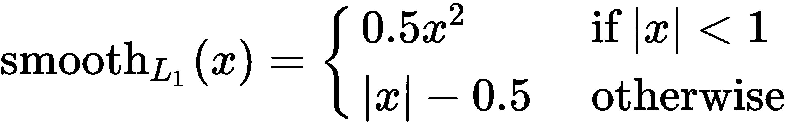

# 第五章：目标检测模型

从自动驾驶汽车到内容审查，检测图像中的物体及其位置是计算机视觉中的经典任务。本章将介绍用于**目标检测**的技术。我们将详细说明当前最主流的两种模型架构——**You Only Look Once**（**YOLO**）和**Regions with Convolutional Neural Networks**（**R-CNN**）。

本章将涵盖以下主题：

+   目标检测技术的发展历史

+   主要的目标检测方法

+   使用 YOLO 架构实现快速目标检测

+   使用 Faster R-CNN 架构提高目标检测效果

+   使用 Faster R-CNN 与 TensorFlow 目标检测 API

# 技术要求

本章的代码以笔记本的形式可以在[`github.com/PacktPublishing/Hands-On-Computer-Vision-with-TensorFlow-2/tree/master/Chapter05`](https://github.com/PacktPublishing/Hands-On-Computer-Vision-with-TensorFlow-2/tree/master/Chapter05)获取。

# 介绍目标检测

目标检测在第一章《计算机视觉与神经网络》中做了简要介绍。在本节中，我们将介绍其历史以及核心技术概念。

# 背景

目标检测，也称为**目标定位**，是检测图像中的物体及其**边界框**的过程。边界框是能够完全包含物体的图像中最小的矩形。

目标检测算法的常见输入是图像。常见的输出是边界框和物体类别的列表。对于每个边界框，模型会输出对应的预测类别及其置信度。

# 应用

目标检测的应用广泛，涵盖了许多行业。例如，目标检测可用于以下目的：

+   在自动驾驶汽车中，用于定位其他车辆和行人

+   用于内容审查，定位禁止物体及其大小

+   在医疗领域，通过放射线影像定位肿瘤或危险组织

+   在制造业中，用于装配机器人组装或修理产品

+   在安全行业，用于检测威胁或统计人数

+   在野生动物保护中，用于监控动物种群

这些只是其中的一些例子——随着目标定位技术越来越强大，越来越多的应用每天都在被发现。

# 简要历史

历史上，目标检测依赖于经典的计算机视觉技术：**图像描述符**。为了检测一个物体，例如一辆自行车，你需要从多张该物体的照片中开始。然后从图像中提取与自行车相关的描述符。这些描述符表示自行车的特定部分。在寻找该物体时，算法会尝试在目标图像中再次找到这些描述符。

在图像中定位自行车时，最常用的技术是**浮动窗口**。图像的多个小矩形区域依次进行检查，匹配描述符最多的部分将被认为包含物体。随着时间的推移，使用了许多变种。

这种技术具有一些优点：它对旋转和颜色变化具有鲁棒性，不需要大量的训练数据，并且适用于大多数物体。然而，准确度水平并不令人满意。

虽然神经网络在 1990 年代初期就已经被用来检测图像中的面部、手部或文本，但它们在 2010 年代初期开始在 ImageNet 挑战赛中大幅超越描述符技术。

从那时起，性能稳步提高。性能指的是算法在以下方面的表现：

+   **边界框精度**：提供正确的边界框（既不太大也不太小）

+   **召回率**：找到所有物体（没有遗漏任何物体）

+   **类别精度**：为每个物体输出正确的类别（避免将猫误认为狗）

性能改进还意味着模型在计算结果时变得越来越快（针对特定的输入图像尺寸和计算能力）。虽然早期的模型需要相当长的时间（超过几秒钟）才能检测到物体，但现在它们可以实时使用。在计算机视觉的背景下，实时通常意味着每秒检测超过五次。

# 评估模型性能

要比较不同的物体检测模型，我们需要统一的评估指标。对于给定的测试集，我们运行每个模型并收集其预测结果。我们使用预测结果和真实值计算评估指标。在本节中，我们将看看用于评估物体检测模型的指标。

# 精确度和召回率

尽管它们通常不用于评估物体检测模型，**精确度**和**召回率**是计算其他指标的基础。因此，理解精确度和召回率非常重要。

要衡量精确度和召回率，我们首先需要为每张图像计算以下内容：

+   **真阳性**的数量：**真阳性**（**TP**）决定了有多少个预测与同类的真实框匹配。

+   **假阳性**的数量：**假阳性**（**FP**）决定了有多少个预测与同类的真实框不匹配。

+   **假阳性**的数量：**假阳性**（**FN**）决定了有多少个真实值没有匹配的预测。

然后，精确度和召回率的定义如下：


请注意，如果预测完全匹配所有的实际标签，则不会出现假阳性或假阴性。因此，准确率和召回率都将等于 1，这是一个完美的分数。如果模型基于不稳健的特征频繁预测物体的存在，准确率将下降，因为会有很多假阳性。相反，如果模型过于严格，只有在满足精确条件时才会认为物体被检测到，召回率将下降，因为会有很多假阴性。

# 精确召回曲线

**精确召回曲线**在许多机器学习问题中都有应用。其基本思想是可视化模型在每个**置信度阈值**下的准确率和召回率。对于每个边界框，我们的模型会输出一个置信度——这是一个介于 0 和 1 之间的数字，表示模型对预测正确性的信心。

因为我们不希望保留那些信心较低的预测，通常会移除低于某个阈值的预测，𝑇。例如，如果𝑇 = 0.4，我们将不考虑任何置信度低于此数值的预测。

移动阈值会对准确率和召回率产生影响：

+   **如果 T 接近 1**：准确率会很高，但召回率会很低。由于我们筛除了很多对象，错过了很多对象——召回率下降。由于我们只保留有信心的预测，因此没有太多假阳性——准确率上升。

+   **如果 T 接近 0**：准确率会很低，但召回率会很高。由于我们保留了大部分预测，因此不会有假阴性——召回率上升。由于模型对其预测的信心较低，我们会有很多假阳性——准确率下降。

通过计算在 0 到 1 之间每个阈值下的准确率和召回率，我们可以获得精确召回曲线，如下所示：


图 5.1：精确召回曲线

选择一个阈值是在准确率和召回率之间的权衡。如果模型检测行人，我们会选择一个较高的召回率，以确保不会错过任何路人，即使这意味着有时车辆会因没有有效理由而停下。如果模型检测投资机会，我们会选择较高的准确率，以避免选择错误的机会，即使这意味着错过一些机会。

# 平均准确率和均值平均准确率

虽然精确召回曲线能告诉我们很多关于模型的信息，但通常更方便的是拥有一个单一的数字。**平均准确率**（**AP**）对应于曲线下的面积。由于它始终包含在一个 1×1 的矩形内，因此 AP 的值始终介于 0 和 1 之间。

平均准确率提供了模型在单个类别上的性能信息。为了获得全局评分，我们使用**均值平均准确率**（**mAP**）。这对应于每个类别的平均准确率的平均值。如果数据集有 10 个类别，我们将计算每个类别的平均准确率，并取这些数值的平均值。

平均精度（mAP）至少在两个目标检测挑战中使用——**PASCAL Visual Object Classes**（通常称为**Pascal VOC**）和**Common Objects in Context**（通常称为**COCO**）。后者规模更大，包含的类别更多；因此，通常得到的分数比前者低。

# 平均精度阈值

我们之前提到过，真阳性和假阳性是通过预测与真实框是否匹配来定义的。然而，如何决定预测和真实框是否匹配呢？一个常见的指标是**Jaccard 指数**，它衡量两个集合重叠的程度（在我们的例子中，就是由框表示的像素集合）。它也被称为**交集与并集的比率**（**IoU**），定义如下：


|𝐴| 和 |𝐵| 是每个集合的**基数**；即它们各自包含的元素数量。𝐴 ⋂ 𝐵 是两个集合的交集，因此分子 |𝐴 ⋂ 𝐵| 代表它们共有的元素数量。类似地，𝐴 ⋃ 𝐵 是集合的并集（如下面的图示所示），因此分母 |𝐴 ⋃ 𝐵| 代表两个集合总共覆盖的元素数量：


图 5.2：框的交集与并集示意图

为什么要计算这样的比率，而不是直接使用交集呢？虽然交集可以很好地指示两个集合/框的重叠程度，但这个值是绝对的，而非相对的。因此，两个大框可能会比两个小框重叠更多的像素。这就是为什么要使用这个比率——它的值总是介于 0（如果两个框没有重叠）和 1（如果两个框完全重叠）之间。

计算平均精度时，我们说两个框重叠，当它们的 IoU 超过某个阈值时。通常选择的阈值是*0.5*。

对于 Pascal VOC 挑战，0.5 也被使用——我们说使用的是 mAP@0.5（读作*mAP* *at 0.5*）。对于 COCO 挑战，使用略有不同的指标——mAP@[0.5:0.95]。这意味着我们计算 mAP@0.5，mAP@0.55，...，*mAP*@0.95，并取其平均值。对 IoU 进行平均会奖励定位更精确的模型。

# 一个快速的目标检测算法——YOLO

虽然这个缩写可能会让你会心一笑，但 YOLO 是目前最快的目标检测算法之一。最新版本 YOLOv3 在现代 GPU 上，对于*256×256*的图像大小，可以以每秒超过 170 帧的速度运行（**FPS**）。在这一节中，我们将介绍其架构背后的理论概念。

# 介绍 YOLO

YOLO 首次发布于 2015 年，在速度和精度上超越了几乎所有其他目标检测架构。此后，该架构已被多次改进。在本章中，我们将借鉴以下三篇论文的内容：

+   *You Only Look Once: 统一的实时目标检测（2015）*，Joseph Redmon、Santosh Divvala、Ross Girshick 和 Ali Farhadi

+   *YOLO9000：更好、更快、更强（2016）*，Joseph Redmon 和 Ali Farhadi

+   *YOLOv3：一个渐进的改进（2018）*，Joseph Redmon 和 Ali Farhadi

为了清晰简洁，我们不会描述所有细节，来阐述 YOLO 如何达到其最大性能。相反，我们将专注于网络的总体架构。我们将提供 YOLO 的实现，以便你可以将我们的架构与代码进行比较。它可以在本章的代码库中找到。

该实现已被设计为易于阅读和理解。我们邀请那些希望深入理解架构的读者，先阅读本章内容，然后参考原始论文和实现。

YOLO 论文的主要作者维护了一个深度学习框架，叫做 **Darknet**（[`github.com/pjreddie/darknet`](https://github.com/pjreddie/darknet)）。这个框架包含了 YOLO 的官方实现，并且可以用于复现论文中的结果。它是用 C++ 编写的，并且没有基于 TensorFlow。

# YOLO 的优缺点

YOLO 以其速度而闻名。然而，最近在准确性方面被 **Faster R-CNN**（将在本章后面介绍）所超越。此外，由于 YOLO 检测物体的方式，它在处理小物体时表现不佳。例如，它可能很难从一群鸟中检测出单只鸟。与大多数深度学习模型一样，它也很难正确检测出与训练集偏差较大的物体（例如不寻常的长宽比或外观）。尽管如此，架构在不断演进，相关问题正在得到解决。

# YOLO 的主要概念

YOLO 的核心思想是：**将目标检测重新框定为一个单一的回归问题**。这是什么意思？与其使用滑动窗口或其他复杂技术，我们将把输入划分为一个 *w × h* 的网格，如下图所示：


图 5.3：一个涉及飞机起飞的示例。这里，w = 5，h = 5，B = 2，这意味着总共有 5 × 5 × 2 = 50 个潜在的框，但图像中仅显示了 2 个框

对于网格的每一部分，我们将定义`B`个边界框。然后，我们的唯一任务就是预测每个边界框的以下内容：

+   盒子的中心

+   盒子的宽度和高度

+   这个框包含了一个物体的概率

+   该物体的类别

由于所有这些预测都是数值，我们因此将目标检测问题转化为回归问题。

很重要的一点是要区分网格单元（将图像分成等份的部分，准确来说是 `w` × `h` 部分）与定位物体的边界框。每个网格单元包含 `B` 个边界框。因此，最终会有 `w` × `h` × `B` 个可能的边界框。

在实际应用中，YOLO 使用的概念比这个稍微复杂。假设网格的一部分有多个物体怎么办？如果一个物体跨越多个网格部分怎么办？更重要的是，如何选择一个损失函数来训练我们的模型？接下来，我们将深入了解 YOLO 架构。

# 使用 YOLO 进行推理

由于模型的架构可能很难一次性理解，我们将把模型分为两个部分——推理和训练。**推理**是将图像输入并计算结果的过程。**训练**是学习模型权重的过程。在从头实现模型时，推理在模型训练之前无法使用。但为了简化，我们将从推理开始。

# YOLO 主干模型

像大多数图像检测模型一样，YOLO 基于**主干模型**。该模型的作用是从图像中提取有意义的特征，供最终的层使用。这也是为什么主干模型被称为**特征提取器**，这一概念在第四章《有影响力的分类工具》中介绍。YOLO 的总体架构如下图所示：


图 5.4：YOLO 架构总结。请注意，主干模型是可交换的，其架构可能有所不同。

虽然可以选择任何架构作为特征提取器，但 YOLO 论文使用了一个自定义架构。最终模型的性能在很大程度上取决于特征提取器架构的选择。

主干模型的最终层输出一个大小为`w` × `h` × `D`的特征体积，其中`w` × `h`是网格的大小，`D`是特征体积的深度。例如，对于 VGG-16，*D = 512*。

网格的大小，`w` × `h`，取决于两个因素：

+   **完整特征提取器的步幅**：对于 VGG-16，步幅为 16，意味着特征体积输出将是输入图像的 1/16 大小。

+   **输入图像的大小**：由于特征体积的大小与图像大小成正比，因此输入图像越小，网格也越小。

YOLO 的最终层接受特征体积作为输入。它由大小为`1` × `1`的卷积滤波器组成。如在第四章《有影响力的分类工具》中所示，`1` × `1`的卷积层可以用于改变特征体积的深度，而不影响其空间结构。

# YOLO 的层输出

YOLO 的最终输出是一个`w` × `h` × `M`矩阵，其中`w` × `h`是网格的大小，`M`对应于公式`B` × *(C + 5)*，其中适用以下内容：

+   `B`是每个网格单元的边界框数量。

+   `C`是类别的数量（在我们的例子中，我们将使用 20 个类别）。

请注意，我们在类别数上加了`5`。这是因为对于每个边界框，我们需要预测*(C + 5)*个数字：

+   `t[x]`和`t[y]`将用来计算边界框中心的坐标。

+   `t[w]`和`t[h]`将用来计算边界框的宽度和高度。

+   `c`是物体位于边界框中的置信度。

+   *p1*、*p2*、...和*pC*是边界框包含物体属于类别`1`、`2`、...、`C`的概率（在我们的示例中，*C = 20*）。

该图总结了输出矩阵的显示方式：


图 5.5：YOLO 的最终矩阵输出。在这个示例中，*B = 5*，*C = 20*，*w = 13*，*h = 13*。大小为 13 × 13 × 125

在我们解释如何使用该矩阵计算最终的边界框之前，我们需要介绍一个重要概念——**锚框**。

# 引入锚框

我们提到过，`t[x]`、`t[y]`、`t[w]`和`t[h]`用来计算边界框的坐标。为什么不直接让网络输出坐标（`x`、`y`、`w`、`h`）呢？实际上，这正是 YOLO v1 中的做法。不幸的是，这会导致很多误差，因为物体的大小各异。

确实，如果训练数据集中的大多数物体较大，网络将倾向于预测*宽度*（`w`）和*高度*（`h`）非常大。当使用训练好的模型来检测小物体时，它通常会失败。为了解决这个问题，YOLO v2 引入了**锚框**。

锚框（也叫**先验框**）是一组在训练网络之前就决定好的边界框大小。例如，当训练神经网络来检测行人时，会选择高而窄的锚框。如下所示：


图 5.6：左侧是用于检测行人的三种边界框大小。右侧是我们如何调整其中一个边界框以匹配行人。

一组锚框通常较小——在实践中通常包含 3 到 25 种不同的尺寸。由于这些框不能完全匹配所有物体，网络会用于细化最接近的锚框。在我们的示例中，我们将行人图像中的物体与最接近的锚框匹配，并使用神经网络来修正锚框的高度。这就是`t[x]`、`t[y]`、`t[w]`和`t[h]`对应的内容——**锚框的修正**。

当锚框首次在文献中提出时，它们是手动选择的。通常使用九种框大小：

+   三个正方形（小号、中号、大号）

+   三个水平矩形（小号、中号、大号）

+   三个垂直矩形（小号、中号、大号）

然而，在 YOLOv2 的论文中，作者意识到锚框的大小因数据集而异。因此，在训练模型之前，他们建议对数据进行分析，以选择合适的锚框大小。比如，在检测行人时，如前所述，使用垂直矩形框；在检测苹果时，则使用正方形的锚框。

# YOLO 如何细化锚框

在实践中，YOLOv2 使用以下公式计算每个最终边界框的坐标：


前面公式中的各项可以按如下方式解释：

+   *t[x] , t[y] , t[w] ,* 和 `t`[`h`] 是最后一层的输出。

+   *b[x] , b[y] , b[w] ,* 和 `b[h]` 分别表示预测边界框的位置和大小。

+   `p[w]` 和 `p[h]` 代表锚框的原始尺寸。

+   `c[x]` 和 `c`[`y`] 是当前网格单元的坐标（对于左上框，它们将是 (0,0)，对于右上框，它们将是 (w - 1,0)，对于左下框，它们将是 (0, h - 1)）。

+   *exp* 是指数函数。

+   *sigmoid* 是 sigmoid 函数，描述见第一章，*计算机视觉与神经网络*。

尽管这个公式看起来复杂，但这个示意图可能有助于澄清问题：


图 5.7：YOLO 如何精炼并定位锚框

在前面的示意图中，我们看到左侧实线为锚框，虚线为精炼后的边界框。右侧的点是边界框的中心。

神经网络的输出是一个包含原始数值的矩阵，需要转换为边界框列表。简化版的代码如下所示：

```py
boxes = []
for row in range(grid_height):
    for col in range(grid_width):
        for b in range(num_box):
            tx, ty, tw, th = network_output[row, col, b, :4]
            box_confidence = network_output[row, col, b, 4]
            classes_scores = network_output[row, col, b, 5:]

            bx = sigmoid(tx) + col
            by = sigmoid(ty) + row

            # anchor_boxes is a list of dictionaries containing the size of each anchor
            bw = anchor_boxes[b]['w'] * np.exp(tw)
            bh = anchors_boxes[b]['h'] * np.exp(th)

            boxes.append((bx, by, bw, bh, box_confidence, classes_scores))
```

这段代码需要在每次推理时运行，以便为图像计算边界框。在我们显示框之前，还需要进行一次后处理操作。

# 后处理框

我们得到了预测边界框的坐标和大小，以及置信度和类概率。现在我们只需将置信度乘以类概率，并进行阈值处理，只保留高概率：

```py
# Confidence is a float, classes is an array of size NUM_CLASSES
final_scores = box_confidence * classes_scores

OBJECT_THRESHOLD = 0.3
# filter will be an array of booleans, True if the number is above threshold
filter = classes_scores >= OBJECT_THRESHOLD

filtered_scores = class_scores * filter
```

这是使用简单示例的该操作示例，阈值为 `0.3`，该框的置信度（对于此特定框）为 `0.5`：

| **CLASS_LABELS** | *dog* | *airplane* | *bird* | *elephant* |
| --- | --- | --- | --- | --- |
| **classes_scores** | 0.7 | 0.8 | 0.001 | 0.1 |
| **final_scores** | 0.35 | 0.4 | 0.0005 | 0.05 |
| **filtered_scores** | 0.35 | 0.4 | 0 | 0 |

然后，如果`filtered_scores`包含非空值，这意味着我们至少有一个类的分数超过了阈值。我们保留得分最高的类：

```py
class_id = np.argmax(filtered_scores)
class_label = CLASS_LABELS[class_id]
```

在我们的示例中，`class_label` 将是 *airplane*。

一旦我们对网格中的所有边界框应用了这个过滤操作，我们就会得到绘制预测所需的所有信息。以下照片显示了这样做后的结果：


图 5.8：原始边界框输出在图像上的绘制示例

许多边界框重叠。由于平面覆盖了多个网格单元，因此它被多次检测到。为了解决这个问题，我们需要在后处理管道中进行最后一步——**非极大值抑制** (**NMS**)。

# NMS

NMS 的思路是去除与概率最高框重叠的框。因此，我们移除**非最大**框。为此，我们根据概率对所有框进行排序，先选取概率最高的框。然后，对于每个框，我们计算它与其他所有框的 IoU。

计算一个框与其他框的 IoU 后，我们去除那些 IoU 超过某个阈值的框（该阈值通常在 0.5 到 0.9 之间）。

使用伪代码，NMS 的实现如下所示：

```py
sorted_boxes = sort_boxes_by_confidence(boxes)
ids_to_suppress = []

for maximum_box in sorted_boxes:
    for idx, box in enumerate(boxes):
        iou = compute_iou(maximum_box, box)
        if iou > iou_threshold:
            ids_to_suppress.append(idx)

processed_boxes = np.delete(boxes, ids_to_suppress)
```

实际上，TensorFlow 提供了自己的 NMS 实现，`tf.image.non_max_suppression(boxes, ...)`（请参阅文档：[`www.tensorflow.org/api_docs/python/tf/image/non_max_suppression`](https://www.tensorflow.org/api_docs/python/tf/image/non_max_suppression)），我们建议使用它（它已经过优化并提供了有用的选项）。还要注意，NMS 被大多数物体检测模型的后处理管道所使用。

在执行 NMS 后，我们得到了一个更好的结果，只有一个边界框，如下图所示：


图 5.9：NMS 后在图像上绘制的边界框示例

# YOLO 推理总结

将所有步骤整合起来，YOLO 推理包括若干个小步骤。YOLO 的架构示意图如下所示：


图 5.10：YOLO 架构示意图。在这个示例中，我们对每个网格单元使用两个边界框。

YOLO 推理过程可以总结如下：

1.  接受输入图像，并使用 CNN 骨干网计算特征体积。

1.  使用卷积层计算锚框修正、物体存在分数和类别概率。

1.  使用该输出计算边界框的坐标。

1.  筛选掉低阈值的框，并使用 NMS 对剩余框进行后处理。

在这个过程的最后，我们得到了最终的预测结果。

由于整个过程由卷积和过滤操作组成，网络可以接受任何大小和任何比例的图像。因此，它具有很高的灵活性。

# 训练 YOLO

我们已经概述了 YOLO 的推理过程。利用在线提供的预训练权重，可以直接实例化模型并生成预测结果。然而，您可能希望在特定数据集上训练一个模型。在本节中，我们将讲解 YOLO 的训练过程。

# YOLO 骨干网的训练方式

正如我们之前提到的，YOLO 模型由两个主要部分组成——骨干网和 YOLO 头。骨干网可以使用许多架构。在训练完整模型之前，骨干网会在传统的分类任务中，通过使用 ImageNet 并采用第四章中详细描述的迁移学习技术进行训练。虽然我们可以从头开始训练 YOLO，但这样做需要花费更多的时间。

Keras 使得在我们的网络中使用预训练的主干网络变得非常简单：

```py
input_image = Input(shape=(IMAGE_H, IMAGE_W, 3))
true_boxes = Input(shape=(1, 1, 1, TRUE_BOX_BUFFER , 4))

inception = InceptionV3(input_shape=(IMAGE_H, IMAGE_W,3), weights='imagenet', include_top=False)

features = inception(input_image)
GRID_H, GRID_W =  inception.get_output_shape_at(-1)[1:3]
# print(grid_h, grid_w)
output = Conv2D(BOX * (4 + 1 + CLASS), 
                        (1, 1), strides=(1,1), 
                        padding='same', 
                        name='DetectionLayer', 
                        kernel_initializer='lecun_normal')(features)

output = Reshape((GRID_H, GRID_W, BOX, 4 + 1 + CLASS))(output)
```

在我们的实现中，我们将采用 YOLO 论文中提出的架构，因为它能提供最佳的结果。然而，如果你要在手机上运行你的模型，你可能会想要使用一个更小的模型。

# YOLO 损失

由于最后一层的输出相当不寻常，因此相应的损失也是如此。实际上，YOLO 损失因其复杂性而著称。为了说明它，我们将把损失分解为多个部分，每个部分对应于最后一层返回的某种输出。网络预测多种信息：

+   边界框的坐标和大小

+   物体出现在边界框中的置信度

+   类别的得分

损失的一般思路是，当误差较大时，我们希望损失也较大。损失会惩罚不正确的值。然而，我们只希望在有意义的情况下这样做——如果一个边界框不包含任何物体，我们就不希望惩罚它的坐标，因为它们反正不会被使用。

神经网络的实现细节通常在原始论文中没有提供。因此，它们在不同的实现之间会有所不同。我们在这里概述的是一种实现建议，而不是绝对参考。我们建议阅读现有实现中的代码，以了解损失是如何计算的。

# 边界框损失

损失函数的第一部分帮助网络学习预测边界框坐标和大小的权重：


尽管这个方程式一开始看起来可能很吓人，但这一部分其实相对简单。让我们分解它：

+   λ（lambda）是损失的权重——它反映了在训练过程中，我们希望给予边界框坐标多大重要性。

+   ∑（大写希腊字母 sigma）表示我们要对它后面的内容求和。在这个例子中，我们对网格的每个部分（从 i = 0 到*i = S²*）以及该部分网格中的每个框（从 0 到 B）求和。

+   *1^(obj)*（*物体指示函数*）是一个函数，当网格的第 i 部分和第 j 个边界框**负责**某个物体时，其值为 1。我们将在下一段解释“负责”是什么意思。

+   `xᵢ`、`yᵢ`、`wᵢ` 和 `hᵢ` 对应于边界框的大小和坐标。我们取预测值（网络输出）与目标值（也称为**真实值**）之间的差异。这里，预测值带有上标(`ˆ`)。

+   我们将差异平方化，以确保其为正数。

+   注意，我们取了 w[i]和 h[i]的平方根。这样做是为了确保小的边界框错误受到比大的边界框更重的惩罚。

这个损失的关键部分是**指示函数**。只有当边界框负责检测物体时，坐标才会是正确的。对于图像中的每个物体，难点是确定哪个边界框负责它。对于 YOLOv2，具有与检测到物体最高 IoU 的锚框被认为是负责的。这里的基本思想是让每个锚框专注于一种物体类型。

# 物体置信度损失

损失的第二部分教会网络学习预测边界框是否包含物体的权重：


我们已经涵盖了该函数中的大部分符号。剩下的符号如下：

+   *`C[ij]`*: 第`i`网格部分的第`j`边界框包含物体（任意类型）的置信度

+   **1^(noobj)（无物体的指示函数）**：当第`i`网格部分和第`j`边界框*不负责*某物体时，函数值为 1

计算*1^(noobj)*的一个简单方法是*(1 - 1^(obj))*。然而，如果我们这样做，它可能会在训练过程中引发一些问题。实际上，我们的网格上有很多边界框。在确定某个边界框负责特定物体时，可能会有其他适合该物体的候选框。我们不希望惩罚那些适合物体的其他优秀候选框的物体性得分。因此，*1^(noobj)*的定义如下：


在实践中，对于位置(`i`, `j`)上的每个边界框，都会计算它与每个地面真实框的 IoU。如果 IoU 超过某个阈值（通常为 0.6），则将 1^(noobj)设为 0。这个想法的依据是避免惩罚那些包含物体但并不负责该物体的边界框。

# 分类损失

损失的最后一部分——分类损失，确保网络学习为每个边界框预测正确的类别：


这个损失与第一章中介绍的*计算机视觉与神经网络*的损失非常相似。需要注意的是，虽然 YOLO 论文中展示的损失是 L2 损失，但许多实现使用的是交叉熵损失。这个损失部分确保正确的物体类别被预测出来。

# 完整 YOLO 损失

**完整 YOLO 损失**是前面提到的三个损失的总和。通过组合这三个项，损失惩罚边界框坐标的精细调整、物体性得分和类别预测的错误。通过反向传播错误，我们能够训练 YOLO 网络预测正确的边界框。

在本书的 GitHub 仓库中，读者将找到 YOLO 网络的简化实现。特别地，代码中包含了大量注释的损失函数。

# 训练技巧

一旦损失函数被正确定义，YOLO 就可以通过反向传播进行训练。然而，为了确保损失不会发散，并且获得良好的性能，我们将详细介绍一些训练技巧：

+   数据增强（在第七章中解释，*在复杂和稀缺数据集上的训练*）和丢弃法（在第三章中解释，*现代神经网络*）被用来防止网络过拟合训练数据，从而使其能够更好地泛化。

+   另一种技术是**多尺度训练**。每经过`n`个批次，网络的输入会被更改为不同的尺寸。这迫使网络学习在各种输入维度下进行精确预测。

+   与大多数检测网络一样，YOLO 在图像分类任务上进行预训练。

+   尽管论文中没有提到，官方 YOLO 实现使用了**预热**——在训练开始时降低学习率，以避免损失爆炸。

# Faster R-CNN – 一个强大的目标检测模型

YOLO 的主要优点是其速度。尽管它可以取得非常好的结果，但现在已被更复杂的网络超越。**更快的区域卷积神经网络**（**Faster R-CNN**）被认为是在写作时的最先进技术。它也相当快速，在现代 GPU 上达到 4-5 帧每秒。在这一部分，我们将探讨其架构。

Faster R-CNN 架构经过多年的研究逐步设计完成。更准确地说，它是从两个架构——R-CNN 和 Fast R-CNN——逐步构建而成的。在这一部分，我们将重点介绍最新的架构，Faster R-CNN：

+   *Faster R-CNN：通过区域提议网络实现实时目标检测（2015）*，Shaoqing Ren, Kaiming He, Ross Girshick 和 Jian Sun

本文借鉴了之前两个设计中的大量知识。因此，部分架构细节可以在以下论文中找到：

+   *精确目标检测和语义分割的丰富特征层次（2013）*，Ross Girshick, Jeff Donahue, Trevor Darrell 和 Jitendra Mali

+   *Fast R-CNN（2015）*，Ross Girshick

就像 YOLO 架构一样，我们建议先阅读本章，然后查看这些论文以获得更深的理解。在本章中，我们将使用与论文中相同的符号。

# Faster R-CNN 的通用架构

YOLO 被认为是一个单次检测器——正如其名称所示，每个图像像素只分析一次。这就是它速度非常快的原因。为了获得更精确的结果，Faster R-CNN 分为两个阶段工作：

1.  第一阶段是提取**兴趣区域**（**RoI**，复数形式为 RoIs）。RoI 是输入图像中可能包含物体的区域。对于每张图像，第一步生成大约 2,000 个 RoI**。**

1.  第二阶段是 **分类步骤**（有时也称为 **检测步骤**）。我们将每个 2,000 个 RoI 调整为正方形，以适应卷积网络的输入。然后我们使用 CNN 对 RoI 进行分类。

在 R-CNN 和 Fast R-CNN 中，兴趣区域是使用一种叫做 **选择性搜索** 的技术生成的。这里不再详细介绍，因为它在 Faster R-CNN 论文中被删除了，原因是其速度较慢。此外，选择性搜索并不涉及任何深度学习技术。

由于 Faster R-CNN 的两个部分是独立的，我们将分别介绍每一部分。然后我们将介绍完整模型的训练细节。

# 第一阶段 – 区域提议

使用 **区域提议网络**（**RPN**）生成兴趣区域。为了生成 RoI，RPN 使用卷积层。因此，它可以在 GPU 上实现，并且速度非常快。

RPN 架构与 YOLO 的架构共享许多特征：

+   它还使用锚框——在 Faster R-CNN 论文中，使用了九种锚框尺寸（三种竖直矩形、三种水平矩形和三种正方形）。

+   它可以使用任何骨干网络来生成特征体积。

+   它使用一个网格，网格的大小取决于特征体积的大小。

+   它的最后一层输出数字，允许锚框被精炼成一个合适的边界框以适应物体。

然而，该架构与 YOLO 的架构并不完全相同。RPN 接受图像作为输入并输出兴趣区域。每个兴趣区域由一个边界框和一个物体存在概率组成。为了生成这些数字，使用 CNN 提取特征体积。然后使用该特征体积生成区域、坐标和概率。RPN 的架构在下图中进行了说明：


图 5.11：RPN 架构概述

图 5.11 中表示的逐步过程如下：

1.  网络接受图像作为输入，并应用多个卷积层。

1.  它输出一个特征体积。一个卷积滤波器应用于特征体积。其大小为 `3` × `3` × `D`，其中 `D` 是特征体积的深度（在我们的示例中，*D = 512*）。

1.  在特征体积的每个位置，滤波器生成一个中间的 `1` × `D` 向量。

1.  两个兄弟 `1` × `1` 的卷积层计算物体存在性分数和边界框坐标。每个 `k` 个边界框有两个物体存在性分数。此外，还有四个浮动值，用于优化锚框的坐标。

在后处理之后，最终输出是 RoI 的列表。在这一步骤中，不会生成有关物体类别的信息，只会生成它的位置。在下一步分类中，我们将对物体进行分类，并优化边界框。

# 第二阶段 – 分类

Faster R-CNN 的第二部分是**分类**。它输出最终的边界框，并接受两个输入——来自前一步（RPN）的 RoI 列表，以及从输入图像计算出的特征体积。

由于大部分分类阶段的架构来自之前的论文《Fast R-CNN》，有时也称其为相同的名字。因此，Faster R-CNN 可以视为 RPN 和 Fast R-CNN 的结合。

分类部分可以与任何对应于输入图像的特征体积一起工作。然而，由于特征图已在前一个区域提议步骤中计算，因此在这里它们只是被重复使用。这种技术有两个好处：

+   **共享权重**：如果我们使用不同的 CNN，我们将不得不为两个骨干网络存储权重——一个用于 RPN，另一个用于分类。

+   **共享计算**：对于一个输入图像，我们只计算一个特征体积，而不是两个。由于这一操作是整个网络中最昂贵的部分，避免重复计算可以显著提高计算性能。

# Faster R-CNN 架构

Faster R-CNN 的第二阶段接受第一阶段的特征图，以及 RoI 列表。对于每个 RoI，应用卷积层以获得类别预测和**边界框精细调整**信息。操作流程如下：


图 5.12：Faster R-CNN 的架构总结

逐步过程如下：

1.  接受来自 RPN 步骤的特征图和 RoI。原始图像坐标系统中生成的 RoI 被转换为特征图坐标系统。在我们的示例中，CNN 的步幅为 16。因此，它们的坐标会被除以 16。

1.  调整每个 RoI 的大小，使其适应全连接层的输入。

1.  应用全连接层。它与任何卷积网络的最终层非常相似。我们得到一个特征向量。

1.  应用两层不同的卷积层。一层处理分类（称为**cls**），另一层处理 RoI 的精细调整（称为**rgs**）。

最终结果是类别分数和边界框精细调整浮动，我们可以对其进行后处理以生成模型的最终输出。

特征体积的大小取决于输入的大小和 CNN 的架构。例如，对于 VGG-16，特征体积的大小是`w` × `h` × *512*，其中*w = input_width/16*，*h = input_height/16*。我们说 VGG-16 的步幅为 16，因为特征图中的一个像素等于输入图像中的 16 个像素。

虽然卷积网络可以接受任何大小的输入（因为它们在图像上使用滑动窗口），但最终的全连接层（在步骤 2 和步骤 3 之间）只能接受固定大小的特征体积作为输入。由于区域提议的大小不同（例如，人的垂直矩形、苹果的正方形……），这使得最终层无法直接使用。

为了绕过这个问题，在 Fast R-CNN 中引入了一种技术——**兴趣区域池化**（**RoI** **池化**）。它将特征图的可变大小区域转换为固定大小的区域。调整大小后的特征区域可以传递给最终的分类层。

# RoI 池化

RoI 池化层的目标很简单——将一个大小可变的激活图部分转换为固定大小。输入激活图的子窗口大小为*h × w*，目标激活图的大小为*H × W*。RoI 池化通过将输入划分为一个网格来工作，每个单元格的大小为*h/H* × *w/W*。

让我们通过一个例子来说明。如果输入的大小是`h` × *w = 5 × 4*，目标激活图的大小是`H` × *W = 2 × 2*，那么每个单元格的大小应该是*2.5* × `2`。由于我们只能使用整数，因此我们将使某些单元格的大小为`3` × `2`，其他单元格的大小为`2` × `2`。然后，我们将取每个单元格的最大值：


图 5.13：RoI 池化示例，其中 RoI 的大小为 5 × 4（从 B3 到 E7），输出大小为 2 × 2（从 J4 到 K5）

RoI 池化层非常类似于最大池化层。不同之处在于，RoI 池化能够处理大小可变的输入，而最大池化只能处理固定大小的输入。RoI 池化有时被称为**RoI 最大池化**。

在原始的 R-CNN 论文中，RoI 池化尚未引入。因此，每个 RoI 是从原始图像中提取的，经过调整大小后直接传递给卷积网络。由于大约有 2,000 个 RoI，这样做非常慢。Fast R-CNN 中的*Fast*来源于 RoI 池化层带来的巨大加速。

# 训练 Faster R-CNN

在我们解释如何训练网络之前，先来看看 Faster R-CNN 的完整架构：


图 5.14：Faster R-CNN 的完整架构。注意，它可以处理任何输入大小

由于其独特的架构，Faster R-CNN 不能像普通的 CNN 一样进行训练。如果将网络的两个部分分别训练，两个部分的特征提取器将无法共享相同的权重。在接下来的部分中，我们将解释如何训练每个部分，以及如何使这两个部分共享卷积权重。

# 训练 RPN

RPN 的输入是图像，输出是一个 RoI 列表。正如我们之前看到的，对于每张图像，有`H` × `W` × `k`个提议（其中`H`和`W`代表特征图的大小，`k`是锚点的数量）。在这一步，物体的类别尚未被考虑。

一次性训练所有候选框会很困难——由于图像大多由背景组成，大多数候选框将被训练为预测*背景*。因此，网络将学习始终预测背景。相反，更倾向于使用采样技术。

构建了 256 个实际锚点的小批量；其中 128 个是正样本（包含物体），另外 128 个是负样本（仅包含背景）。如果图像中正样本少于 128 个，则使用所有可用的正样本，并用负样本填充批次。

# RPN 损失

RPN 损失比 YOLO 的损失更简单。它由两部分组成：


前面公式中的各项可以解释如下：

+   `i`是训练批次中一个锚点的索引。

+   `pᵢ`是锚点为物体的概率。`pᵢ`*是实际值——如果锚点是“正样本”，则为 1；否则为 0。

+   `tᵢ`是表示坐标修正的向量；`tᵢ`*是实际值。

+   `N[cls]`是训练小批量中实际锚点的数量。

+   `N[reg]`是可能的锚点位置数量。

+   `L[cls]`是两个类别（物体和背景）的对数损失。

+   *λ*是一个平衡参数，用于平衡损失的两个部分。

最后，损失由 *Lreg = R(t[i] - t[i]*)* 组成，其中 R 是*平滑*L1 损失函数，定义如下：



*平滑[L1]*函数被引入，作为替代先前使用的 L2 损失。当误差过大时，L2 损失会变得过大，导致训练不稳定。

正如 YOLO 一样，回归损失仅用于包含物体的锚点框，这要归功于`pᵢ`*项。两部分通过`N[cls]`和`N[reg]`进行划分。这两个值被称为**归一化项**——如果我们改变小批量的大小，损失不会失去平衡。

最后，lambda 是一个平衡参数。在论文配置中，*N[cls] ~= 256* 和 *N[reg] ~= 2,400*。作者将*λ*设置为 10，以便两个项具有相同的总权重。

总结来说，类似于 YOLO，损失惩罚以下内容：

+   第一个项中物体分类的误差

+   第二项中边界框修正的误差

然而，与 YOLO 的损失相反，它并不处理物体类别，因为 RPN 只预测 RoI。除了损失和小批量构建方式外，RPN 的训练方式与其他网络相同，使用反向传播。

# Fast R-CNN 损失

如前所述，Faster R-CNN 的第二阶段也被称为 Fast R-CNN。因此，其损失通常被称为 Fast R-CNN 损失。尽管 Fast R-CNN 损失的公式与 RPN 损失不同，但在本质上非常相似：


前述方程中的术语可以解释如下：

+   *Lcls* 是实际类别 `u` 与类别概率 `p` 之间的对数损失。

+   *Lloc* 与 RPN 损失中的 L[reg] 相同。

+   *λ[u ≥ 1]* 在 u ≥ 1 时等于 1，否则为 0。

在 Fast R-CNN 训练过程中，我们始终使用背景类别，*id = 0*。事实上，RoI 可能包含背景区域，且将其分类为背景是非常重要的。术语 *λ[u ≥ 1]* 用于避免惩罚背景框的边界框误差。对于所有其他类别，由于 `u` 将大于 `0`，我们将惩罚误差。

# 训练方案

如前所述，在网络的两部分之间共享权重可以使模型更快（因为 CNN 只应用一次）且更轻。在 Faster R-CNN 论文中，推荐的训练过程被称为 **四步交替训练**。该过程的简化版本如下：

1.  训练 RPN，使其预测可接受的 RoI。

1.  使用训练好的 RPN 输出训练分类部分。在训练结束时，由于 RPN 和分类部分分别训练，它们的卷积权重不同。

1.  用分类部分的 CNN 替换 RPN 的 CNN，使它们共享卷积权重。冻结共享的 CNN 权重。重新训练 RPN 的最后几层。

1.  再次使用 RPN 的输出训练分类部分的最后一层。

该过程结束后，我们得到一个训练好的网络，其中两部分共享卷积权重。

# TensorFlow 物体检测 API

由于 Faster R-CNN 始终在改进，我们没有提供本书的参考实现。相反，我们建议使用 TensorFlow 物体检测 API。它提供了一个由贡献者和 TensorFlow 团队维护的 Faster R-CNN 实现，提供了预训练模型和训练自己模型的代码。

物体检测 API 不属于核心 TensorFlow 库的一部分，而是作为一个单独的仓库提供，详细介绍见 第四章，*影响力分类工具*：[`github.com/tensorflow/models/tree/master/research/object_detection`](https://github.com/tensorflow/models/tree/master/research/object_detection)。

# 使用预训练模型

物体检测 API 提供了多个在 COCO 数据集上训练的预训练模型。这些模型在架构上有所不同——虽然它们都基于 Faster R-CNN，但使用了不同的参数和骨干网络。这对推理速度和性能产生了影响。一个经验法则是，推理时间随着平均精度的提高而增加。

# 在自定义数据集上训练

也可以训练一个模型来检测不在 COCO 数据集中的物体。为此，需要大量的数据。一般来说，建议每个物体类别至少有 1,000 个样本。为了生成训练集，需要手动标注训练图像，方法是画出物体的边界框。

使用物体检测 API 不涉及编写 Python 代码。相反，架构是通过配置文件来定义的。我们建议从现有的配置文件开始，并在此基础上进行调整以获得良好的性能。本章的代码库中提供了一个完整的示例。

# 总结

我们介绍了两种物体检测模型的架构。第一个是 YOLO，以推理速度快著称。我们讲解了其整体架构以及推理的工作原理，此外还讲解了训练过程。我们还详细说明了用于训练模型的损失函数。第二个是 Faster R-CNN，以其最先进的性能著称。我们分析了网络的两个阶段以及如何训练它们。我们还描述了如何通过 TensorFlow 物体检测 API 使用 Faster R-CNN。

在下一章，我们将通过学习如何将图像分割成有意义的部分，以及如何转换和增强它们，进一步扩展物体检测。

# 问题

1.  边界框、锚框和真实框有什么区别？

1.  特征提取器的作用是什么？

1.  应该偏向使用哪种模型，YOLO 还是 Faster R-CNN？

1.  使用锚框意味着什么？

# 深入阅读

+   *精通 OpenCV 4* ([`www.packtpub.com/application-development/mastering-opencv-4-third-edition`](https://www.packtpub.com/application-development/mastering-opencv-4-third-edition))，由 Roy Shilkrot 和 David Millán Escrivá 编写，包含了实际的计算机视觉项目，包括高级物体检测技术。

+   *OpenCV 4 计算机视觉应用编程实战* ([`www.packtpub.com/application-development/opencv-4-computer-vision-application-programming-cookbook-fourth-edition`](https://www.packtpub.com/application-development/opencv-4-computer-vision-application-programming-cookbook-fourth-edition))，由 David Millán Escrivá 和 Robert Laganiere 编写，涵盖了经典的物体描述符以及物体检测概念。
