# 第六章：图像增强与分割

我们刚刚学习了如何创建神经网络，输出比单一类别更复杂的预测。在本章中，我们将进一步拓展这一概念，介绍**编码器-解码器**，这些模型用于编辑或生成完整图像。我们将展示编码器-解码器网络如何应用于从图像去噪到物体和实例分割的广泛应用。本章将提供几个具体示例，例如编码器-解码器在自动驾驶汽车语义分割中的应用。

本章将涵盖以下主题：

+   编码器-解码器是什么，以及如何训练它们进行像素级预测

+   它们使用了哪些新颖的层来输出高维数据（反池化、转置卷积和空洞卷积）

+   FCN 和 U-Net 架构如何解决语义分割问题

+   我们迄今为止所讲解的模型如何扩展以处理实例分割

# 技术要求

展示本章概念的 Jupyter 笔记本可以在以下 Git 文件夹中找到：[github.com/PacktPublishing/Hands-On-Computer-Vision-with-TensorFlow-2/tree/master/Chapter06](https://github.com/PacktPublishing/Hands-On-Computer-Vision-with-TensorFlow-2/tree/master/Chapter06)[.](https://github.com/PacktPublishing/Hands-On-Computer-Vision-with-Tensorflow/tree/master/ch3)

本章稍后我们将介绍`pydensecrf`库，以提高分割结果。根据其 GitHub 页面的详细说明（请参阅文档：[`github.com/lucasb-eyer/pydensecrf#installation`](https://github.com/lucasb-eyer/pydensecrf#installation)），此 Python 模块可以通过`pip`安装（`pip install git+https://github.com/lucasb-eyer/pydensecrf.git`），并需要安装最新版本的 Cython（`pip install -U cython`）。

# 使用编码器-解码器转换图像

如第一章《计算机视觉与神经网络》中所述，*计算机视觉与神经网络*，多个典型的计算机视觉任务要求像素级结果。例如，语义分割方法对图像的每个像素进行分类，智能编辑工具返回的图像会对某些像素进行修改（例如，删除不需要的元素）。在本节中，我们将介绍编码器-解码器，以及如何将遵循这一范式的**卷积神经网络**（**CNN**）应用于此类任务。

# 编码器-解码器简介

在处理复杂应用之前，让我们首先介绍什么是编码器-解码器及其所实现的功能。

# 编码与解码

编码器-解码器架构是一个非常通用的框架，广泛应用于通信、密码学、电子学等领域。根据该框架，**编码器**是一个将输入样本映射到**潜在空间**的函数，也就是由编码器定义的一组隐藏的结构化值。**解码器**是与之互补的函数，它将潜在空间中的元素映射到预定义的目标域。例如，可以构建一个编码器来解析媒体文件（其内容在潜在空间中表示为元素），并可以与一个解码器配对，后者将媒体内容输出为不同的文件格式。我们现在常用的图像和音频压缩格式就是这种类型的例子。JPEG 工具对我们的媒体进行编码，将其压缩为更小的二进制文件；然后它们解码这些文件以在显示时恢复像素值。

在机器学习中，编码器-解码器网络已经被使用了很长时间（例如，用于文本翻译）。一个编码器网络会将源语言的句子作为输入（例如，法语句子），并学习将它们投影到潜在空间中，在这个空间中，句子的意义会作为特征向量进行编码。解码器网络会与编码器一起训练，将编码后的向量转换为目标语言的句子（例如，英语）。

编码器-解码器模型中的潜在空间向量通常称为**代码**。

请注意，编码器-解码器的一个常见特性是其潜在空间比输入和目标潜在空间要小，如*图 6-1*所示：

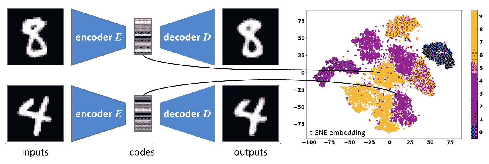

图 6-1：在 MNIST 数据集上训练的自编码器示例（版权归 Yann LeCun 和 Corinna Cortes 所有）

在*图 6-1*中，编码器被训练将*28* × *28*的图像转换为*32*个值的向量（代码），而解码器被训练来恢复这些图像。这些代码可以与它们的类别标签一起绘制，以突出数据集中的相似性/结构（*32*维的向量通过**t-SNE**方法投影到二维平面上，该方法由 Laurens van der Maatens 和 Geoffrey Hinton 开发，并在笔记本中详细介绍）。

编码器被设计或训练来提取/压缩样本中包含的语义信息（例如，法语句子的意思，而不考虑该语言的语法特点）。然后，解码器根据其对目标领域的知识，解压/补充信息（例如，将编码后的信息转换为正确的英语句子）。

# 自编码

**自编码器**（**AEs**）是一种特殊类型的编码器-解码器。如*图 6-1*所示，它们的输入和目标领域是相同的，因此它们的目标是正确编码并解码图像，而不影响图像质量，尽管它们有一个*瓶颈*（即其较低维度的潜在空间）。输入被压缩为一种压缩表示（作为特征向量）。如果后来需要原始输入，它可以通过解码器从压缩表示中重构出来。

因此，JPEG 工具可以被称为自编码器（AEs），因为它们的目标是编码图像，然后将其解码回去而不失去太多质量。输入和输出数据之间的距离是自编码算法需要最小化的典型损失。对于图像，这个距离可以简单地通过交叉熵损失来计算，或者通过输入图像与结果图像之间的 L1/L2 损失（分别是曼哈顿距离和欧几里得距离）（如在第三章，*现代神经网络*中所示）。

在机器学习中，自编码网络非常容易训练，不仅因为其损失函数表达直接，如我们刚才所描述的那样，还因为其训练不需要任何标签。输入图像是用来计算损失的目标。

在机器学习专家中，对于自编码器存在分歧。有些人认为这些模型是**无监督**的，因为它们的训练不需要任何额外的标签。另一些人则认为，与纯粹的无监督方法（通常使用复杂的损失函数来发现无标签数据集中的模式）不同，自编码器有明确的目标（即，它们的输入图像）。因此，这些模型也常被称为**自监督**（即，它们的目标可以直接从输入中推导出来）。

由于自编码器的潜在空间较小，它们的编码子网络必须学习如何正确地压缩数据，而解码器必须学习如何正确地映射并解压数据。

如果没有瓶颈条件，对于具有快捷路径的网络（例如 ResNet），这种恒等映射将是直接的（参考第四章，*影响力分类工具*）。它们可以简单地将完整的输入信息从编码器传递到解码器。由于存在较低维度的潜在空间（瓶颈），它们被迫学习一种正确的压缩表示。

# 目的

关于更通用的编码器-解码器，它们的应用非常广泛。它们用于转换图像，将它们从一个域或模态映射到另一个域。例如，这些模型经常被应用于**深度回归**，即估计相机与图像内容（深度）之间的距离，对于每个像素。例如，这对增强现实应用非常重要，因为它们可以建立环境的 3D 表示，从而更好地与环境进行交互。

类似地，编码器-解码器常用于**语义分割**（参见第一章，*计算机视觉和神经网络*，以获取其定义）。在这种情况下，网络被训练不是返回深度，而是为每个像素估计的类别（参见*图 6-2-c*）。这个重要的应用将在本章的第二部分详细讨论。最后，编码器-解码器也因其更具*艺术性的用例*而闻名，例如将涂鸦艺术转换为伪现实图像或估算在夜间拍摄的照片的白天等效图像：

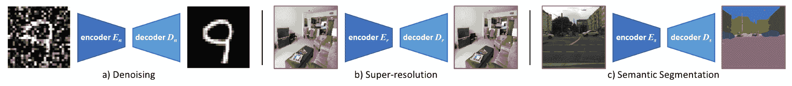

图 6-2：编码器-解码器的应用示例。这三个应用在本章的 Jupyter 笔记本中有详细说明和实现细节。

城市场景图像及其语义分割标签在*图 6-2*、*图 6-10*和*图 6-11*中来自*Cityscapes*数据集（[`www.cityscapes-dataset.com`](https://www.cityscapes-dataset.com)）。*Cityscapes*是一个很棒的数据集，也是应用于自动驾驶识别算法的基准。该数据集的研究者 Marius Cordts 等很慷慨地授权我们使用其中的一些图像来说明本书内容，并在本章后面的 Jupyter 笔记本中演示一些算法。

现在让我们考虑自动编码器（AE）。为什么一个网络应该被训练来返回其输入图像呢？答案再次在于 AE 的瓶颈特性。尽管编码和解码组件作为一个整体进行训练，但根据使用情况它们是分开应用的。

由于瓶颈的存在，编码器必须在尽可能保留信息的同时压缩数据。因此，如果训练数据集具有重复的模式，网络将尝试揭示这些相关性以改善编码。因此，AE 的编码器部分可以用来从其训练的域中获取图像的低维表示。它们提供的低维表示通常能够有效地保持图像之间的内容相似性，例如。因此，它们有时用于数据集可视化，以突出集群和模式（参见*图 6-1*）。

自动编码器（AEs）并不像 JPEG 等算法那样适合通用的图像压缩。事实上，AEs 是*数据特定的*；也就是说，它们只能有效地压缩它们所知道的领域中的图像（例如，训练在自然风景图像上的 AE 在处理肖像时效果较差，因为视觉特征差异太大）。然而，与传统压缩方法不同，AEs 对它们所训练的图像有更好的理解，了解其重复出现的特征、语义信息等等。

在某些情况下，自动编码器（AEs）会针对其解码器进行训练，解码器可以用于**生成任务**。实际上，如果潜在空间在训练过程中得到了恰当的结构化，那么从这个空间中随机挑选的任何向量都可以通过解码器转化为一张图像！正如我们将在本章后面简要解释的，以及在第七章《复杂和稀缺数据集的训练》中提到的，*在复杂和稀缺数据集上的训练*，训练一个用于生成新图像的解码器实际上并不像想象的那么简单，这需要一些精心的工程设计，才能使生成的图像看起来真实（这对于**生成对抗网络**（**GANs**）的训练尤其如此，我们将在下一章中详细说明）。

然而，**去噪自动编码器**（denoising AEs）是实践中最常见的 AE 实例。这些模型有一个特点，即它们的输入图像在传递给网络之前会经历一个有损的转换。由于这些模型仍然是被训练来恢复原始图像（即转换前的图像），它们将学会取消这个有损操作并恢复一些缺失的信息（参见*图 6-2-a*）。典型的模型会被训练来去除白噪声或高斯噪声，或者恢复丢失的内容（例如，遮挡或删除的图像区域）。此类 AEs 也被用于**智能图像放大**，也称为**图像超分辨率**。事实上，这些网络可以学习部分去除传统放大算法（如双线性插值）产生的伪影（即噪声）（参见*图 6-2-b*）。

# 基本示例 – 图像去噪

我们将通过一个简单的示例来说明 AEs 的有用性——去噪损坏的 MNIST 图像。

# 简单的全连接 AE

为了演示这些模型是如何简单又高效，我们将选择一个浅层的、全连接的架构，并使用 Keras 实现：

```py
inputs = Input(shape=[img_height * img_width])
# Encoding layers:
enc_1  = Dense(128, activation='relu')(inputs)
code   = Dense(64,  activation='relu')(enc_1)
# Decoding layers:
dec_1  = Dense(64,  activation='relu')(code)
preds  = Dense(128, activation='sigmoid')(dec_1)
autoencoder = Model(inputs, preds)
# Training:
autoencoder.compile(loss='binary_crossentropy')
autoencoder.fit(x_train, x_train) # x_train as inputs and targets
```

我们在此强调了常见的对称编码器-解码器架构，及其低维瓶颈。为了训练我们的 AE，我们使用图像（`x_train`）作为输入和目标。训练完成后，这个简单的模型可以用来嵌入数据集，如*图 6-1*所示。

我们选择了*sigmoid*作为最后的激活函数，以便将输出值限制在 0 和 1 之间，像输入值一样。

# 应用于图像去噪

训练我们之前的图像去噪模型其实非常简单，只需创建一份带噪声的训练图像副本，并将其作为输入传递给我们的网络即可：

```py
x_noisy = x_train + np.random.normal(loc=.0, scale=.5, size=x_train.shape)
autoencoder.fit(x_noisy, x_train)
```

本章的前两本笔记本详细介绍了训练过程，提供了插图和额外的提示（例如，用于可视化训练过程中预测的图像）。

# 卷积编码器-解码器

与其他基于**神经网络**（**NN**）的系统一样，编码器-解码器从卷积层和池化层的引入中受益匪浅。**深度自编码器**（**DAEs**）和其他架构很快就被广泛应用于越来越复杂的任务。

在本节中，我们将首先介绍为卷积编码器-解码器开发的新层。然后，我们将展示基于这些操作的一些重要架构。

# 反池化、转置和膨胀

正如我们在前几章中所看到的，例如在第三章，《现代神经网络》和第四章，《影响力分类工具》中，CNNs 是出色的*特征提取器*。它们的卷积层将输入张量转换为越来越高层次的特征图，而池化层则逐渐对数据进行下采样，从而生成紧凑且语义丰富的特征。因此，CNNs 非常适合作为高效的编码器。

然而，如何逆转这一过程，将这些低维特征解码为完整的图像呢？正如我们在接下来的段落中将要展示的那样，就像卷积和池化操作替代了密集层用于图像的编码一样，逆操作——如**转置卷积**（也称为**反卷积**）、**膨胀卷积**和**反池化**——也被开发出来，以更好地解码特征。

# 转置卷积（反卷积）

在第三章，《现代神经网络》中，我们介绍了卷积层、它们执行的操作，以及它们的超参数（卷积核大小`k`、输入深度`D`、卷积核数量`N`、填充`p`和步幅`s`）如何影响输出的维度（*图 6-3*可作为提醒）。对于形状为(`H`, `W`, `D`)的输入张量，我们提出了以下方程来评估输出形状(*H[o]*, *W[o]*, `N`)：

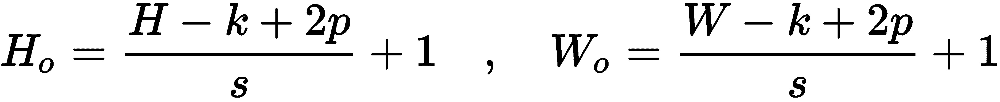

现在，假设我们想要开发一个层来逆转卷积的空间变换。换句话说，给定形状为(*H[o]*, *W[o]*, `N`)的特征图和相同的超参数，`k`、`D`、`N`、`p`和`s`，我们希望一个*类似卷积*的操作能恢复一个形状为(`H`, `W`, `D`)的张量。在前面的方程式中隔离`H`和`W`，因此我们希望这个操作满足以下特性：

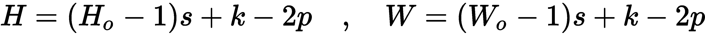

这就是**反卷积**的定义。如我们在第四章，*影响力分类工具*中简要提到的那样，这种新类型的层是由 Zeiler 和 Fergus 提出的，他们是 ZFNet 背后的研究人员，ZFNet 是 2013 年 ILSVRC 竞赛的获胜方法（*可视化与理解卷积网络*，*Springer，2014*）。

使用 `k` × `k` × `D` × `N` 的卷积核堆栈，这些层将 *H[o]* × *W[o]* × `N` 的张量卷积成 `H` × `W` × `D` 的映射。为了实现这一点，输入张量首先会经过**膨胀**操作。膨胀操作由一个速率 `d` 定义，包括在输入张量的每对行和列之间插入 `d` – 1 行和列的零值，如*图 6-4*所示。在反卷积中，膨胀率设置为 `s`（即它所反转的标准卷积所用的步幅）。经过这种重采样后，张量将使用 `p`' = `k` – `p` – 1 进行填充。膨胀和填充参数这样定义是为了恢复原始形状（`H`，`W`，`D`）。然后，张量最终使用步幅 `s`' = 1 与层的滤波器进行卷积，最终得到 `H` × `W` × `D` 的映射。标准卷积和反卷积的比较见*图 6-3*和*图 6-4*。

以下是标准卷积操作：

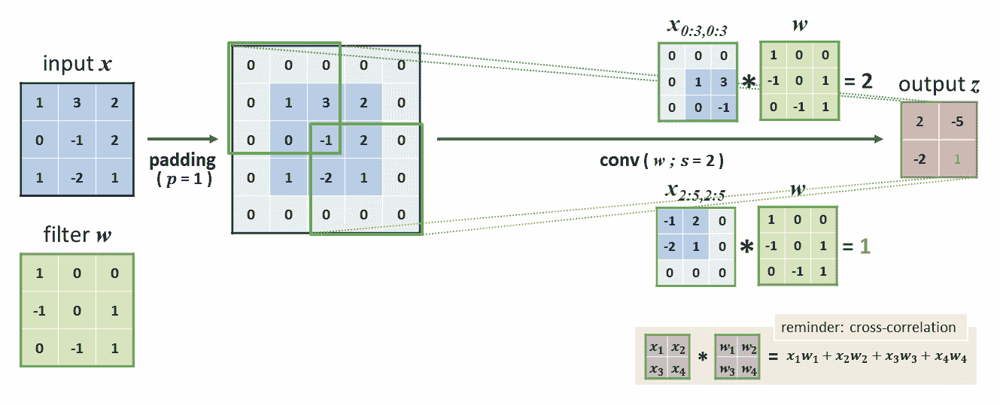

图 6-3：卷积层执行的操作提醒（这里定义为一个 3 × 3 的卷积核 w，填充 p = 1，步幅 s = 2）

请注意，在*图 6-3*中，补丁与卷积核之间的数学操作实际上是互相关（请参见第三章，*现代神经网络*）。

以下是反卷积操作：

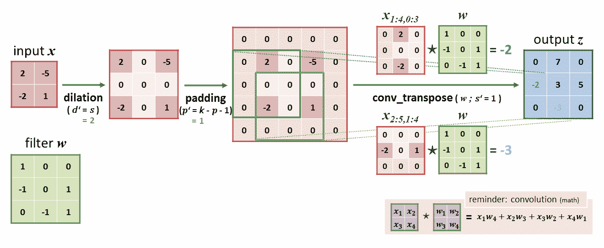

图 6-4：反卷积层执行的操作，用于逆转标准卷积的空间变换（这里定义为 3 × 3 卷积核 `w`，填充 `p` = 1，膨胀 `d` = 2，如图 6-3 所示）

请注意，这次在*图 6-4*中，补丁与卷积核之间的操作是数学卷积。

如果这个过程看起来有些抽象，那么只需要记住，转置卷积层通常用于镜像标准卷积，以增加特征图的空间维度，同时与可训练的过滤器对其内容进行卷积。这使得这些层非常适合用于解码器架构。它们可以通过 `tf.layers.conv2d_transpose()`（参见[`www.tensorflow.org/api_docs/python/tf/layers/conv2d_transpose`](https://www.tensorflow.org/api_docs/python/tf/layers/conv2d_transpose)）和 `tf.keras.layers.Conv2DTranspose()`（参见[`www.tensorflow.org/api_docs/python/tf/keras/layers/Conv2DTranspose`](https://www.tensorflow.org/api_docs/python/tf/keras/layers/Conv2DTranspose)）进行实例化，这些方法的签名与标准的 `conv2d` 相同。

标准卷积和转置卷积之间还有一个微妙的区别，虽然在实际应用中没有什么重大影响，但知道这一点仍然是有益的。回到第三章，《现代神经网络》，我们提到 CNN 中的卷积层实际上执行的是交叉相关（cross-correlation）。如*图 6-4*所示，转置卷积层实际上使用的是数学卷积，翻转了卷积核的索引。

转置卷积也常被错误地称为**反卷积**。虽然确实存在一种名为*反卷积*的数学操作，但其执行方式与转置卷积不同。反卷积实际上完全恢复卷积，返回原始张量。而转置卷积仅仅是近似这个过程，返回形状相同的张量。如*图 6-3*和*6-4*所示，原始张量和最终张量的形状匹配，但它们的值并不相同。

转置卷积（Transposed convolutions）有时也被称为**分数步幅卷积**。实际上，输入张量的扩张（dilation）可以在某种程度上看作是使用*分数*步幅进行卷积的等效操作。

# 反池化（Unpooling）

尽管步幅卷积（strided convolutions）常用于 CNN 架构中，但在减少图像空间维度时，平均池化（average-pooling）和最大池化（max-pooling）是最常见的操作。因此，Zeiler 和 Fergus 还提出了一种**最大反池化**操作（通常简称为**反池化**），用于伪逆最大池化。他们在一个名为**deconvnet**的网络中使用了这一操作，用于解码和可视化其*卷积网络*（即 CNN）的特征。在描述他们的解决方案的论文中（在赢得 ILSVRC 2013 后发表，见《可视化和理解卷积网络》，*Springer, 2014*），他们解释道，尽管最大池化不是可逆的（也就是说，我们无法通过数学方式恢复池化操作丢弃的所有非最大值），但至少在空间采样方面，定义一个近似其反转的操作是可能的。

为了实现这个伪逆操作，他们首先修改了每个最大池化层，使其除了输出结果张量外，还输出池化掩码。换句话说，这个掩码表示所选最大值的原始位置。最大反池化操作的输入为池化后的张量（它可能在操作之间经过了其他保持形状的操作）和池化掩码。它利用池化掩码将输入值散布到一个上采样到池化前形状的张量中。图片胜过千言万语，*图 6-5*可能会帮助你理解该操作：

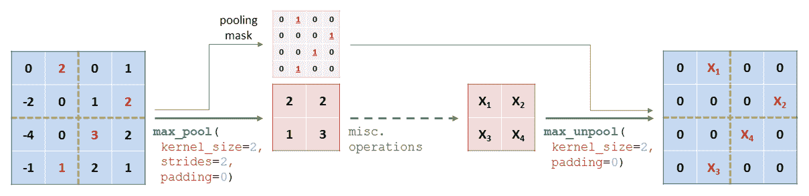

图 6-5：最大反池化操作示例，跟随一个最大池化层，并且该池化层也输出其池化掩码

注意，像池化层一样，反池化操作是固定/不可训练的操作。

# 上采样与调整大小

类似地，开发了**平均反池化**操作以模拟平均池化。后者操作将一个`k` × `k` 元素的池化区域进行平均，得到一个单一的值。因此，平均反池化层会将张量中的每个值复制到一个`k` × `k` 的区域，如*图 6-6*所示：

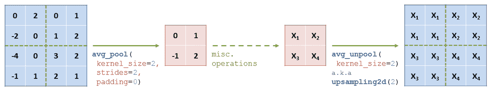

图 6-6：平均反池化操作示例（也称为上采样）

目前，这种操作比最大反池化操作使用得更为频繁，更常被称为**上采样**。例如，这个操作可以通过`tf.keras.layers.UpSampling2D()`来实例化（请参考[`www.tensorflow.org/api_docs/python/tf/keras/layers/UpSampling2D`](https://www.tensorflow.org/api_docs/python/tf/keras/layers/UpSampling2D)中的文档）。该方法本质上只是`tf.image.resize()`的包装器（请参考[`www.tensorflow.org/api_docs/python/tf/image/resize`](https://www.tensorflow.org/api_docs/python/tf/image/resize)中的文档），当使用`method=tf.image.ResizeMethod.NEAREST_NEIGHBOR`参数调用时，用于通过最近邻插值来调整图像大小（正如其名称所示）。最后，注意双线性插值有时也用于放大特征图而无需添加任何训练参数，例如通过使用`interpolation="bilinear"`参数来实例化`tf.keras.layers.UpSampling2D()`（而不是默认的`"nearest"`值），这等同于使用默认的`method=tf.image.ResizeMethod.BILINEAR`属性来调用`tf.image.resize()`。

在解码器架构中，每次最近邻或双线性上采样通常后跟一个步长`s`=1 和填充`"SAME"`的卷积（以保持新的形状）。这些预定义的上采样和卷积操作的组合与组成编码器的卷积和池化层相对应，并允许解码器学习自己的特征，以更好地恢复目标信号。

一些研究人员，如 Augustus Odena，更喜欢这些操作而不是转置卷积，特别是在像图像超分辨率这样的任务中。事实上，当内核大小不是步长的倍数时，转置卷积往往会导致一些棋盘状伪影（由于特征重叠），从而影响输出质量（*反卷积和棋盘伪影，Distill，2016*）。

# 扩张/孔卷积

我们将在本章介绍的最后一个操作与前面的操作略有不同，因为它并非旨在对提供的特征图进行上采样。相反，它被提出是为了在不进一步牺牲数据的空间维度的情况下人为地增加卷积的感受野。为了实现这一点，在这里也应用了**扩张**（请参阅*转置卷积（反卷积）*部分），尽管方法有所不同。

确实，**扩张卷积**类似于标准卷积，但具有额外的超参数`d`，定义其内核所应用的扩张。*图 6-7*说明了这个过程如何人为地增加了层的感受野：

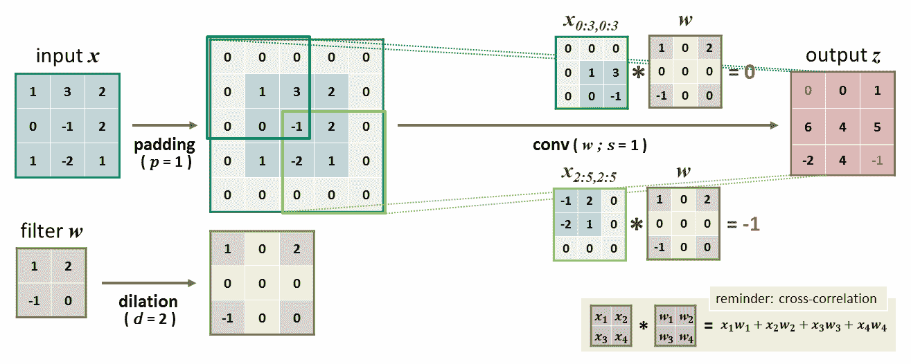

图 6-7：由扩张卷积层执行的操作（此处由 2 × 2 内核 w 定义，填充 p = 1，步长 s = 1，扩张 d = 2）

这些层也被称为**孔卷积**，来自法语表达*à trous*（*带孔*）。确实，虽然内核扩张增加了感受野，但却是通过在其中切割孔来实现的。

凭借这些特性，这种操作经常用于现代编码器-解码器中，将图像从一个域映射到另一个域。在 TensorFlow 和 Keras 中，实例化扩张卷积只需为`tf.layers.conv2d()`和`tf.keras.layers.Conv2D()`的`dilation_rate`参数提供高于默认值 1 的值。

开发这些各种操作旨在保留或增加特征图的空间性质，从而导致了多种 CNN 架构用于像素级密集预测和数据生成。

# 示例架构 – FCN 和 U-Net

大多数卷积编码器-解码器遵循与其全连接对应物相同的模板，但利用其局部连接层的空间性质以获得更高质量的结果。一个典型的卷积 AE 在 Jupyter 笔记本中展示。在本小节中，我们将介绍从这个基本模板衍生出的两个更先进的架构。发布于 2015 年的 FCN 和 U-Net 模型仍然很受欢迎，并且通常用作更复杂系统（如语义分割，域自适应等）的组成部分。

# 完全卷积网络

如在 第四章，*影响力分类工具* 中简要介绍的那样，**全卷积网络**（**FCNs**）基于 VGG-16 架构，最终的全连接层被 *1 × 1* 的卷积层替代。我们没有提到的是，这些网络通常会扩展为带有上采样模块的结构，并作为编码器-解码器使用。由加利福尼亚大学伯克利分校的 Jonathan Long、Evan Shelhamer 和 Trevor Darrell 提出的 FCN 架构完美地展示了前一小节中发展出的概念：

+   如何将用于特征提取的 CNNs 用作高效的编码器

+   然后，他们的特征图如何通过我们刚才介绍的操作有效地进行上采样和解码

事实上，Jonathan Long 等人建议重用预训练的 VGG-16 作为特征提取器（参见 第四章，*影响力分类工具*）。VGG-16 通过其五个卷积块有效地将图像转换为特征图，尽管在每个块后空间维度都会减半。为了从最后一个块解码特征图（例如，转换为语义掩码），用于分类的全连接层被卷积层替代。然后应用最终层——一个转置卷积，将数据上采样回输入形状（即，步幅为 `s` = 32，因为空间维度在 VGG 中被除以 32）。

然而，Long 等人很快注意到，这种名为 **FCN-32s** 的架构产生了过于 *粗糙* 的结果。正如他们在论文中解释的那样（《用于语义分割的全卷积网络》，《IEEE CVPR 会议论文集》，2015），最后一层的大步幅确实限制了细节的尺度。尽管来自最后一个 VGG 块的特征包含丰富的上下文信息，但它们的空间定义已经丢失了太多。因此，作者们想到将最后一个块的特征图与来自前面块的更大特征图进行融合。

在 FCN-16s 中，FCN-32s 的最后一层被一个步幅为 `s` = 2 的转置层替代，这样得到的张量与第四个块的特征图具有相同的维度。通过跳跃连接，将两个张量的特征进行合并（逐元素加法）。最终结果通过另一个转置卷积（步幅 `s` = 16）缩放回输入形状。在 FCN-8s 中，重复相同的过程，但使用来自第三个块的特征，最终再进行一个步幅 `s` = 8 的转置卷积。为了清晰起见，完整的架构在 *图 6-8* 中展示，下一示例中提供了一个 Keras 实现：

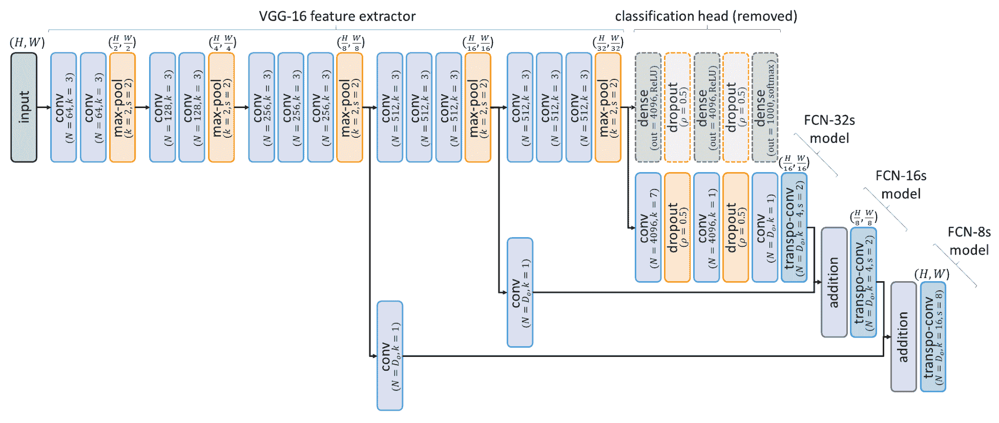

图 6-8：FCN-8s 架构。每个模块后的数据维度显示在图中，假设输入为 `H` × `W`。`D[o]` 表示所需的输出通道数。

*图 6-8*展示了 VGG-16 如何作为特征提取器/编码器，以及如何使用转置卷积进行解码。该图还强调了 FCN-32s 和 FCN-16s 是更简单、更轻量的架构，仅有一个或完全没有跳跃连接。

由于其使用迁移学习并融合了多尺度特征图，FCN-8s 能够输出具有细节的图像。此外，由于其完全卷积的特性，它可以应用于编码/解码不同大小的图像。FCN-8s 表现出色且具有多功能性，仍然广泛应用于许多领域，并且启发了其他多种架构。

# U-Net

在受 FCN 启发的解决方案中，U-Net 架构不仅是最早的之一，而且可能是最受欢迎的（由 Olaf Ronneberger、Philipp Fischer 和 Thomas Brox 在一篇名为*U-Net: Convolutional networks for biomedical image segmentation*的论文中提出，该论文由 Springer 出版）。

该模型也用于语义分割（应用于医学影像），它与 FCN 有许多相似之处。它由一个多块的收缩型编码器组成，通过增加特征的深度而减少其空间维度，以及一个扩展型解码器，恢复图像的分辨率。此外，像 FCN 一样，跳跃连接用于将编码块与其解码对接块连接。因此，解码块既能接收来自前一块的上下文信息，也能接收来自编码路径的位置数据。

U-Net 与 FCN 在两个主要方面有所不同。与 FCN-8s 不同，U-Net 是**对称**的，采用传统的 U 形编码器-解码器结构（因此得名）。此外，通过**连接**（沿通道轴）而非加法来合并来自跳跃连接的特征图。U-Net 架构如*图 6-9*所示。至于 FCN，一个 Jupyter Notebook 专门用于从头实现 FCN：

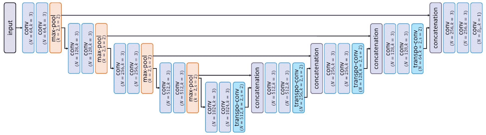

图 6-9：U-Net 架构

还需要注意的是，虽然原始解码块具有*升采样时 s = 2*的转置卷积，但常见的实现使用最近邻插值缩放（请参阅前一小节的讨论）。由于其流行性，U-Net 已经有了许多变体，并且仍然启发了多种架构（例如，用残差块替代其原有块，并且增强块内和块外的连接性）。

# 中介示例——图像超分辨率

让我们简要地将这些模型应用到一个新问题——图像超分辨率（完整的实现和附加提示可以在相关的 Notebook 中找到）。

# FCN 实现

记住我们刚刚介绍的架构，可以按照以下方式实现简化版的 FCN-8s（请注意，实际模型在每个转置卷积之前还有额外的卷积层）：

```py
inputs = Input(shape=(224, 224, 3))
# Building a pretrained VGG-16 feature extractor as encoder:
vgg16 = VGG16(include_top=False, weights='imagenet', input_tensor=inputs)
# We recover the feature maps returned by each of the 3 final blocks:
f3 = vgg16.get_layer('block3_pool').output # shape: (28, 28, 256)
f4 = vgg16.get_layer('block4_pool').output # shape: (14, 14, 512)
f5 = vgg16.get_layer('block5_pool').output # shape: ( 7, 7, 512)
# We replace the VGG dense layers by convs, adding the "decoding" layers instead after the conv/pooling blocks:
f3 = Conv2D(filters=out_ch, kernel_size=1, padding='same')(f3)
f4 = Conv2D(filters=out_ch, kernel_size=1, padding='same')(f4)
f5 = Conv2D(filters=out_ch, kernel_size=1, padding='same')(f5)
# We upscale `f5` to a 14x14 map so it can be merged with `f4`:
f5x2 = Conv2DTranspose(filters=out_chh, kernel_size=4,strides=2, 
                       padding='same', activation='relu')(f5)
# We merge the 2 feature maps with an element-wise addition:
m1 = add([f4, f5x2])
# We repeat the operation to merge `m1` and `f3` into a 28x28 map:
m1x2 = Conv2DTranspose(filters=out_ch, kernel_size=4, strides=2,
                       padding='same', activation='relu')(m1)
m2 = add([f3, m1x2])
# Finally, we use a transp-conv to recover the original shape:
outputs = Conv2DTranspose(filters=out_ch, kernel_size=16, strides=8,
                          padding='same', activation='sigmoid')(m2)
fcn_8s = Model(inputs, outputs)
```

通过重用 VGG 的 Keras 实现和功能性 API，可以轻松创建一个 FCN-8s 模型。

# 应用于图像放大

训练超分辨率网络的一个简单技巧是使用传统的放大方法（如双线性插值）将图像放大到目标尺寸，然后再输入模型。通过这种方式，网络可以作为去噪自编码器进行训练，任务是清除上采样伪影并恢复丢失的细节：

```py
x_noisy = bilinear_upscale(bilinear_downscale(x_train)) # pseudo-code
fcn_8s.fit(x_noisy, x_train)
```

适当的代码和完整的图像演示可以在笔记本中找到。

如前所述，我们刚刚介绍的架构通常应用于多种任务，如从彩色图像中估计深度、下一帧预测（即预测下一帧图像的内容，输入为一系列视频帧）和图像分割。在本章的第二部分，我们将深入探讨后一项任务，这在许多现实应用中至关重要。

# 理解语义分割

**语义分割**是将图像划分为有意义部分的任务的更广泛术语。它包括对象分割和实例分割，这两者在第一章《计算机视觉与神经网络》中介绍。与前几章中涉及的图像分类和目标检测不同，分割任务要求方法返回像素级的密集预测，即为输入图像中的每个像素分配一个标签。

在更详细地解释为什么编码器-解码器如此擅长对象分割，以及如何进一步优化其结果之后，我们将介绍一些针对更复杂任务——实例分割的解决方案。

# 使用编码器-解码器进行对象分割

正如我们在本章第一部分所看到的，编码-解码网络被训练来将数据样本从一个领域映射到另一个领域（例如，从噪声到无噪声，或从彩色到深度）。对象分割可以看作是其中的一种操作——将图像从颜色域映射到类别域。根据其价值和上下文，我们希望为图片中的每个像素分配一个目标类别，从而返回具有相同高度和宽度的**标签图**。

教授编码器-解码器将图像转换为标签图仍然需要一些考虑，我们现在将讨论这一点。

# 概述

在接下来的段落中，我们将展示如何使用 U-Net 等网络进行对象分割，以及如何进一步处理其输出以生成精细的标签图。

# 解码为标签图

构建直接输出标签图的编码器-解码器——其中每个像素值表示一个类别（例如，`1`表示*狗*，`2`表示*猫*）——会产生较差的结果。与分类器一样，我们需要一种更好的方法来输出类别值。

为了将图像分类为 `N` 类别，我们学习了如何构建网络，使最终层输出 `N` 个 logits，表示每个类别的预测得分。我们还学习了如何使用 **softmax** 操作将这些得分转换为概率，并通过选择最大值（例如，使用 **argmax**）返回最有可能的类别。相同的机制可以应用于语义分割，在像素级别而不是图像级别。我们的网络被构建为返回一个 `H` × `W` × `N` 的张量，其中包含每个像素的得分（参见 *图 6-10*）：

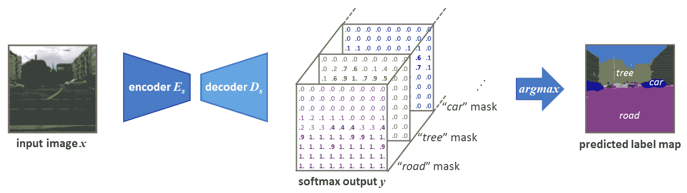

图 6-10：给定一个尺寸为 `H` × `W` 的输入图像，网络返回一个 `H` × `W` × `N` 的概率图，其中 `N` 是类别数。使用 argmax 可以获得预测的标签图。

对于本章中展示的架构，获得这样的输出张量只是设置 `D`*[o]* = `N` 的问题，也就是在构建模型时将输出通道数设置为类别数（参见 *图 6-8* 和 *图 6-9*）。然后可以将它们作为分类器进行训练。**交叉熵损失**用于将 softmax 值与 one-hot 编码的真实标签图进行比较（尽管被比较的张量在分类时具有更多的维度，但这不会影响计算）。此外，`H` × `W` × `N` 的预测结果也可以通过选择沿通道轴的最大值索引（即，沿通道轴的 `argmax`）类似地转换为每个像素的标签。例如，前面展示的 FCN-8s 代码可以调整为训练一个用于物体分割的模型，如下所示：

```py
inputs = Input(shape=(224, 224, 3))
out_ch = num_classes = 19 # e.g., for object segmentation over Cityscapes
# [...] building e.g. a FCN-8s architecture, c.f. previous snippet.
outputs = Conv2DTranspose(filters=out_ch, kernel_size=16, strides=8,
                          padding='same', activation=None)(m2)
seg_fcn = Model(inputs, outputs)
seg_fcn.compile(optimizer='adam', loss='sparse_categorical_crossentropy')
# [...] training the network. Then we use it to predict label maps:
label_map = np.argmax(seg_fcn.predict(image), axis=-1)
```

Git 仓库包含一个完整的 FCN-8s 模型示例，该模型已构建并训练用于语义分割，同时还包含一个 U-Net 模型。

# 使用分割损失和指标进行训练

使用先进的架构，如 FCN-8s 和 U-Net，是构建高性能语义分割系统的关键。然而，最先进的模型仍然需要一个合适的损失函数才能最优化收敛。虽然交叉熵是训练模型进行粗分类和密集分类的默认损失，但在后者的情况下应采取适当的预防措施。

对于图像级和像素级分类任务，**类别不平衡**是一个常见问题。假设我们训练一个模型，数据集包含 990 张猫的图片和 10 张狗的图片。如果模型学会总是输出猫，那么它将在训练集上达到 99%的准确率，但在实际应用中并没有什么用处。对于图像分类，可以通过添加或删除图片来避免此问题，从而使所有类别以相同的比例出现。对于像素级分类问题，这个问题更为棘手。一些类别可能出现在每张图像中，但仅占很少的像素，而其他类别可能覆盖大部分图像（例如，对于自动驾驶汽车应用中的*交通标志*与*道路*类别）。数据集无法通过编辑来弥补这种不平衡。

为了防止分割模型对大类别产生偏倚，它们的损失函数应该进行调整。例如，通常的做法是加权每个类别对交叉熵损失的贡献。如我们在自动驾驶汽车语义分割笔记本中展示的以及*图 6-11*所示，类别在训练图像中出现得越少，它在损失中的权重就应越大。这样，如果网络开始忽略较小的类别，就会受到严重惩罚：

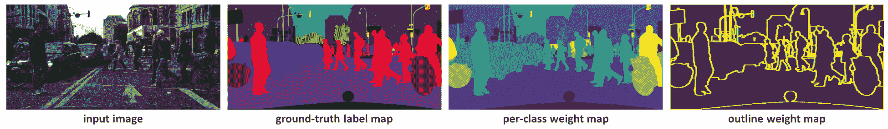

图 6-11：语义分割中像素加权策略示例（像素越亮，其在损失中的权重越大）

权重图通常是根据地面真值标签图计算得出的。需要注意的是，如*图 6-11*所示，应用于每个像素的权重不仅可以根据类别设置，还可以根据像素相对于其他元素的位置进行设置，等等。

另一种解决方案是用另一种不受类别比例影响的代价函数来替代交叉熵。毕竟，交叉熵是一个代理准确性函数，由于其良好的可微性而被采用。然而，这个函数并未真正表达我们模型的实际目标——正确分割不同的类别，无论它们的面积如何。因此，研究人员提出了几种针对语义分割的损失函数和度量指标，以更明确地捕捉这一目标。

**交集并集比**（**IoU**），在第五章中介绍，*目标检测模型*，是常见的评估指标之一。**Sørensen–Dice 系数**（通常简称为**Dice 系数**）是另一个。像 IoU 一样，它衡量两个集合的重叠程度：

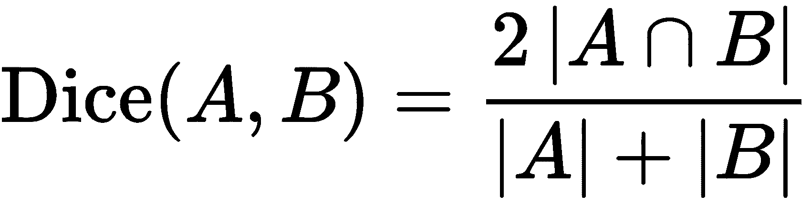

在这里，*|**A|*和*|B|*表示每个集合的基数（参考上一章中的解释），而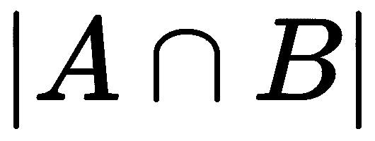表示它们的交集中的元素数量（交集的基数）。IoU 和 Dice 有几个共同特性，实际上其中一个可以帮助计算另一个：

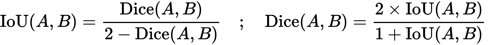

在语义分割中，*Dice* 因此用来衡量每个类的预测掩码与实际掩码的重叠程度。对于一个类，分子表示正确分类的像素数，分母表示该类在预测和实际掩码中所有像素的总数。作为一种度量，*Dice* 系数因此不依赖于一个类在图像中所占的像素相对数量。在多类任务中，科学家通常计算每个类的 *Dice* 系数（比较每一对预测和实际掩码），然后取其平均值。

从公式中可以看到，*Dice* 系数的定义范围在 0 和 1 之间——如果 `A` 和 `B` 完全不重叠，则其值为 0；如果它们完全重叠，则值为 1。因此，为了将其作为一个网络应当最小化的损失函数，我们需要反转这个评分。总的来说，对于应用于 `N` 类的语义分割，*Dice* 损失通常定义如下：

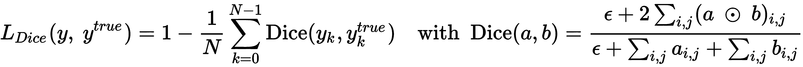

让我们再澄清一下这个公式。如果 `a` 和 `b` 是两个一热编码张量，那么 *Dice* 分子（即它们的交集）可以通过对它们进行元素级的相乘来近似（参见 第一章，*计算机视觉与神经网络*），然后将得到的张量中的所有值相加。分母是通过将 `a` 和 `b` 中的所有元素相加得到的。最后，如果张量为空，通常会在分母中添加一个小值，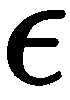（例如，低于 *1e-6*），并在分子中也添加该小值，以避免除零错误，并平滑结果。

请注意，在实际应用中，与实际的 ground truth 一热编码张量不同，预测值并不包含二进制值。它们由连续从 0 到 1 的 softmax 概率组成。因此，这种损失函数通常被称为 **soft Dice**。

在 TensorFlow 中，损失函数可以如下实现：

```py
def dice_loss(labels, logits, num_classes, eps=1e-6, spatial_axes=[1, 2]):
    # Transform logits in probabilities, and one-hot the ground truth:
    pred_proba = tf.nn.softmax(logits, axis=-1)
    gt_onehot  = tf.one_hot(labels, num_classes, dtype=tf.float32)
    # Compute Dice numerator and denominator:
    num_perclass = 2 * tf.reduce_sum(pred_proba * gt_onehot, axis=spatial_axes)
    den_perclass = tf.reduce_sum(pred_proba + gt_onehot, axis=spatial_axes)
    # Compute Dice and average over batch and classes:
    dice = tf.reduce_mean((num_perclass + eps) / (den_perclass + eps))
    return 1 - dice
```

*Dice* 和 *IoU* 是分割任务中重要的工具，它们的实用性在相关的 Jupyter notebook 中得到了进一步的展示。

# 使用条件随机场进行后处理

正确标记每个像素是一个复杂的任务，通常会得到预测的标签图，其中轮廓较差并且存在小的错误区域。幸运的是，有一些方法可以对结果进行后处理，修正一些明显的缺陷。在这些方法中，**条件随机场**（**CRFs**）方法因其整体效率而最为流行。

这背后的理论超出了本书的范围，但 CRFs 能够通过考虑每个像素在原始图像中的上下文来提高像素级的预测。如果两个相邻像素之间的颜色梯度较小（即颜色没有急剧变化），那么它们很可能属于同一类别。考虑到这个基于空间和颜色的模型，以及预测器提供的概率图（在我们的案例中，是 CNN 的 softmax 张量），CRF 方法返回的是经过精细化的标签图，它们在视觉轮廓方面更为准确。

有多个现成的实现可用，例如由 Lucas Beyer 开发的`pydensecrf`（[`github.com/lucasb-eyer/pydensecrf`](https://github.com/lucasb-eyer/pydensecrf)），这是一个 Python 包装器，用于实现 Philipp Krähenbühl 和 Vladlen Koltun 提出的带高斯边缘潜力的稠密 CRF（参见*Efficient inference in fully connected CRFs with gaussian edge potentials*，*Advances in neural information processing systems*，*2011*）。在本章的最后一个笔记本中，我们将解释如何使用这个框架。

# 高级示例 – 自驾车的图像分割

如本章开头所建议的，我们将把这些新知识应用于一个复杂的实际用例——自驾车的交通图像分割。

# 任务展示

像人类驾驶员一样，自驾车需要理解其环境，并意识到周围的元素。将语义分割应用于前置摄像头的视频图像可以让系统知道是否有其他汽车在周围，知道是否有行人或自行车正在穿越道路，是否在跟随交通线和标志等。

因此，这是一个关键过程，研究人员正在投入大量精力来优化模型。因此，有多个相关数据集和基准可供使用。我们为演示选择的*Cityscapes*数据集（[`www.cityscapes-dataset.com`](https://www.cityscapes-dataset.com)）是最著名的之一。由 Marius Cordts 等人分享（参见*The Cityscapes Dataset for Semantic Urban Scene Understanding*，*IEEE CVPR Conference Proceedings*），它包含来自多个城市的视频序列，并为超过 19 个类别（如*道路、汽车、植物*等）提供语义标签。专门有一个笔记本用于帮助入门该基准。

# 示例解决方案

在本章的两个最终 Jupyter 笔记本中，使用 FCN 和 U-Net 模型训练来处理这个任务，运用了本节中介绍的多个技巧。我们展示了如何在计算损失时正确地对每个类别加权，如何对标签图进行后处理，等等。

由于整个解决方案比较长，且笔记本更适合展示当前代码，我们邀请你如果对这个用例感兴趣，可以继续阅读笔记本。这样，我们可以将本章的其余部分专注于另一个引人入胜的问题——实例分割。

# 实例分割的更难情况

使用为对象分割训练的模型时，*softmax* 输出表示每个像素属于 `N` 个类别之一的概率。然而，它并不表示两个像素或像素块是否属于同一类别的实例。例如，给定如 *图 6-10* 所示的预测标签图，我们无法统计出 *树* 或 *建筑物* 实例的数量。

在接下来的子章节中，我们将介绍通过扩展已解决的两个相关任务——对象分割和对象检测——的解决方案来实现实例分割的两种不同方法。

# 从对象分割到实例分割

首先，我们将介绍一些工具，帮助我们从刚才提到的分割模型中获得实例掩模。U-Net 的作者普及了调整编码器-解码器的概念，使其输出可用于实例分割。这个想法被 Alexander Buslaev、Victor Durnov 和 Selim Seferbekov 推得更远，他们因在 2018 年 Kaggle 数据科学大赛（[`www.kaggle.com/c/data-science-bowl-2018`](https://www.kaggle.com/c/data-science-bowl-2018)）中获胜而广为人知，这场赞助比赛旨在推进医学应用中的实例分割技术。

# 尊重边界

如果语义掩模捕获的元素是良好分隔/不重叠的，那么将掩模拆分以区分每个实例并不是一项复杂的任务。现在有很多算法可以用来估计二值矩阵中不同块的轮廓，和/或为每个块提供一个单独的掩模。对于多类别实例分割，这个过程可以针对对象分割方法返回的每个类别掩模重复进行，进一步将它们拆分成实例。

但是，首先应该获得精确的语义掩模，否则相互过于接近的元素可能会被当作一个整体返回。那么，我们如何确保分割模型在生成具有精确轮廓的掩模时能够给予足够的关注，至少对于不重叠的元素？我们已经知道答案——教网络做某件具体的事情的唯一方法是相应地调整它们的训练损失。

U-Net 是为生物医学应用而开发的，用于分割显微镜图像中的神经结构。为了教会网络正确分离相邻细胞，作者决定对损失函数进行加权，以更重地惩罚位于多个实例边界的错误分类像素。正如在*图 6-11*中所示，这种策略与我们在前一小节中介绍的逐类损失加权非常相似，尽管这里的加权是针对每个像素具体计算的。U-Net 的作者提出了一个公式来基于地面真实类掩膜计算这些权重图。对于每个像素和每个类，该公式考虑了像素到最近两个类实例的距离。两个距离越小，权重越大。权重图可以预先计算并与地面真实掩膜一起存储，以便在训练时共同使用。

请注意，这种逐像素的加权可以与多类场景中的逐类加权相结合。对图像中某些区域给予更高惩罚的思想也可以适应于其他应用（例如，更好地分割制造物体的关键部件）。

我们提到了 2018 年 Kaggle 数据科学挑战赛的获胜者，他们对这个思想做出了值得注意的改进。对于每个类，他们的定制 U-Net 输出了两个掩膜：一个是预测逐像素类别概率的常规掩膜，另一个是捕捉类别边界的掩膜。地面真实的边界掩膜是根据类别掩膜预先计算的。在适当训练后，来自两个预测掩膜的信息可以用于获得每个类的良好分离元素。

# 后处理成实例掩膜

正如前一小节所讨论的，一旦获得精确的掩膜，就可以通过应用适当的算法从中识别出不重叠的实例。这个后处理通常使用**形态学函数**，如**掩膜****腐蚀**和**膨胀**来完成。

**分水岭变换**是另一类常见的算法，可以将类别掩膜进一步分割成实例。这些算法将单通道张量视为一个地形表面，其中每个值代表一个高程。通过我们不会详细讨论的各种方法，它们提取出代表实例边界的山脊顶部。这些变换的多种实现可用，其中一些是基于 CNN 的，例如 Min Bai 和 Raquel Urtasun（来自多伦多大学）所提出的*Deep watershed transform for instance segmentation*（*IEEE CVPR 会议论文集*，*2017*）。受到 FCN 架构的启发，他们的网络将预测的语义掩膜和原始 RGB 图像作为输入，输出一个能量图，能够用于识别山脊。得益于 RGB 信息，这种解决方案甚至能够准确地分离重叠的实例。

# 从目标检测到实例分割 – Mask R-CNN

处理实例分割的第二种方法是从物体检测的角度出发。在第五章，*物体检测模型*中，我们介绍了如何返回图像中出现的物体实例的边界框。在接下来的段落中，我们将展示如何将这些结果转化为更精细的实例掩码。更准确地说，我们将介绍**Mask R-CNN**，它是一个扩展**Faster R-CNN**的网络。

# 将语义分割应用于边界框

当我们在第一章中介绍物体检测时，*计算机视觉与神经网络*部分，我们解释了这个过程通常作为一个初步步骤，提供包含单个实例的图像块以供进一步分析。考虑到这一点，实例分割就变成了两步操作：

1.  使用物体检测模型返回每个目标类别实例的边界框

1.  将每个图像块输入到语义分割模型中以获得实例掩码

如果预测的边界框准确（每个边界框捕捉到一个完整的、单一的元素），那么分割网络的任务就很简单——就是分类哪些像素属于捕捉到的类别，哪些像素属于背景/属于其他类别。

这种解决实例分割的方法是有优势的，因为我们已经拥有了实现它所需的所有工具（物体检测和语义分割模型）！

# 使用 Faster-RCNN 构建实例分割模型

虽然我们可以简单地使用预训练的检测网络，再接上预训练的分割网络，但如果这两个网络被串联在一起并以端到端的方式训练，整个管道的效果肯定会更好。通过公共层反向传播分割损失将更好地确保提取的特征对于检测和分割任务都具有意义。这几乎就是**Facebook AI Research**（**FAIR**）的 Kaiming He 等人在 2017 年提出的*Mask R-CNN*的原始思想（*Mask R-CNN*，*IEEE CVPR 会议论文*）。

如果这个名字让你有些印象，Kaiming He 也是 ResNet 和 Faster R-CNN 的主要作者之一。

Mask R-CNN 主要基于 Faster R-CNN。与 Faster R-CNN 一样，Mask R-CNN 由一个区域提议网络组成，后面跟着两个分支，分别预测每个提议区域的类别和框偏移量（参见第五章，*目标检测模型*）。然而，作者在此基础上扩展了该模型，增加了一个*第三并行分支*，为每个区域中的元素输出二进制掩码（如*图 6-12*所示）。需要注意的是，这个附加分支仅由几个标准卷积和转置卷积组成。正如作者在论文中强调的那样，这种并行处理遵循 Faster R-CNN 的精神，与其他实例分割方法形成对比，后者通常是顺序进行的：

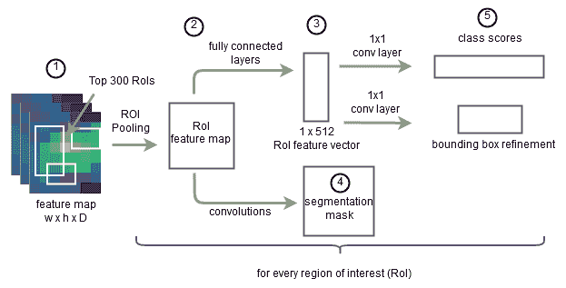

图 6-12：基于 Faster R-CNN 的 Mask R-CNN 架构

得益于这种并行处理，He 等人能够解耦分类和分割。虽然分割分支被定义为输出`N`个二进制掩码（每个类别一个，就像任何常见的语义分割模型一样），但只有与另一分支预测的类别对应的掩码会被考虑用于最终预测和训练损失。换句话说，只有实例类别的掩码才会对应用于分割分支的交叉熵损失产生贡献。正如作者所解释的那样，这使得分割分支能够在没有类别之间竞争的情况下预测标签图，从而简化了其任务。

Mask R-CNN 作者的另一个著名贡献是**RoI** **align** 层，取代了 Faster R-CNN 中的**RoI 池化**。二者之间的差异实际上相当微妙，但提供了显著的准确度提升。RoI 池化会引入量化误差，例如通过离散化子窗口单元的坐标（参见第五章，*目标检测模型*，以及*图 5-13*）。虽然这对分类分支的预测影响不大（它对这些微小的错位具有鲁棒性），但会影响分割分支的像素级预测质量。为了避免这种情况，He 等人简单地*去除了离散化*，而是*使用了双线性插值*来获取单元格的内容。

Mask R-CNN 在 COCO 2017 挑战中脱颖而出，现如今被广泛使用。多个实现可以在线找到，例如，在专门用于目标检测和实例分割的`tensorflow/models`库的文件夹中（[`github.com/tensorflow/models/tree/master/research/object_detection`](https://github.com/tensorflow/models/tree/master/research/object_detection)）。

# 总结

本章中，我们介绍了几种用于像素精确应用的范式。我们介绍了编码器-解码器及一些特定架构，并将其应用于从图像去噪到语义分割的多个任务。我们还展示了如何结合不同的解决方案来应对更复杂的问题，例如实例分割。

随着我们处理越来越复杂的任务，新的挑战也随之而来。例如，在语义分割中，精确标注图像以训练模型是一项耗时的工作。因此，现有的数据集通常稀缺，应该采取具体措施避免过拟合。此外，由于训练图像及其真实标注较大，需构建良好的数据管道以实现高效训练。

在接下来的章节中，我们将深入介绍如何有效地使用 TensorFlow 来增强和服务训练批次。

# 问题

1.  AEs 有什么特殊性？

1.  FCNs 基于哪种分类架构？

1.  如何训练语义分割模型，使其不忽视小类别？

# 进一步阅读

*Mask R-CNN* ([`openaccess.thecvf.com/content_iccv_2017/html/He_Mask_R-CNN_ICCV_2017_paper.html`](http://openaccess.thecvf.com/content_iccv_2017/html/He_Mask_R-CNN_ICCV_2017_paper.html)) 由 Kaiming He、Georgia Gkioxari、Piotr Dollar 和 Ross Girshick 提出：本章中提到的这篇精心撰写的会议论文介绍了 Mask R-CNN，提供了更多的插图和细节，可能有助于您理解该模型。
