# 第七章：在复杂且稀缺的数据集上进行训练

数据是深度学习应用的命脉。因此，训练数据应该能够顺畅地流入网络，并且应包含所有对准备方法任务至关重要的有意义信息。然而，数据集往往有复杂的结构，或者存储在异构设备上，这使得将其内容高效地提供给模型的过程变得复杂。在其他情况下，相关的训练图像或注释可能不可用，从而剥夺了模型学习所需的信息。

幸运的是，在前述情况中，TensorFlow 提供了一个丰富的框架来建立优化的数据管道——`tf.data`。在后者的情况下，当相关的训练数据稀缺时，研究人员提出了多种替代方法——数据增强、合成数据集生成、域适应等。这些替代方法还将为我们提供机会，详细阐述生成模型，如 **变分自编码器**（**VAEs**）和 **生成对抗网络**（**GANs**）。

本章将涵盖以下主题：

+   如何使用 `tf.data` 构建高效的输入管道，提取和处理各种样本

+   如何增强和渲染图像，以弥补训练数据的稀缺性

+   域适应方法是什么，它们如何帮助训练更强大的模型

+   如何使用生成模型（如 VAE 和 GAN）创建新颖的图像

# 技术要求

再次提醒，多个 Jupyter 笔记本和相关源文件用于说明本章内容，可以在专门为本书创建的 Git 仓库中找到：[`github.com/PacktPublishing/Hands-On-Computer-Vision-with-TensorFlow-2/tree/master/Chapter07`](https://github.com/PacktPublishing/Hands-On-Computer-Vision-with-TensorFlow-2/tree/master/Chapter07)。

笔记本需要一些额外的 Python 包，演示如何从 3D 模型中渲染合成图像，如 `vispy` ([`vispy.org`](http://vispy.org)) 和 `plyfile` ([`github.com/dranjan/python-plyfile`](https://github.com/dranjan/python-plyfile))。安装说明已在笔记本中提供。

# 高效的数据提供

精确的输入管道不仅可以大大减少训练模型所需的时间，还可以更好地预处理训练样本，引导网络朝向更高效的配置。在本节中，我们将演示如何构建这些优化管道，深入探讨 TensorFlow `tf.data` API。

# 介绍 TensorFlow 数据 API

尽管 `tf.data` 在 Jupyter 笔记本中已经出现过多次，但我们还没有正式介绍这个 API 及其多个方面。

# TensorFlow 数据 API 背后的直觉

在介绍 `tf.data` 之前，我们将提供一些背景，以证明它与深度学习模型训练的相关性。

# 为快速且数据需求量大的模型提供输入

**神经网络**（**NNs**）是*数据饥渴型*的模型。它们在训练过程中能够迭代的训练数据集越大，神经网络的准确性和鲁棒性就会越强。正如我们在实验中已经注意到的那样，训练一个网络是一项繁重的任务，可能需要数小时，甚至数天的时间。

随着 GPU/TPU 硬件架构的不断提升，随着这些设备逐渐变得更加高效，每次训练迭代中前向传播和反向传播所需的时间不断减少（对于能够负担这些设备的人来说）。如今的速度已经快到神经网络倾向于*消耗*训练批次的速度超过典型输入管道*生产*它们的速度。这在计算机视觉中尤为真实。图像数据集通常太庞大，无法完全预处理，并且实时读取/解码图像文件可能会导致显著的延迟（尤其是在每次训练中反复执行时）。

# 懒加载结构的启示

更普遍地说，随着*大数据*的崛起，近年来出现了大量的文献、框架、最佳实践等，为各种应用提供了处理和服务大量数据的新解决方案。`tf.data` API 是 TensorFlow 开发人员在这些框架和实践的基础上构建的，旨在提供*一个清晰且高效的框架来为神经网络提供数据*。更准确地说，该 API 的目标是定义输入管道，使其能够在*当前步骤完成之前为下一步提供数据*（参考官方 API 指南，[`www.tensorflow.org/guide/performance/datasets`](https://www.tensorflow.org/guide/performance/datasets)）。

正如 Derek Murray（谷歌的一位 TensorFlow 专家）在几次线上演示中所解释的那样（他的一次演示被录制成视频，并可以在[`www.youtube.com/watch?v=uIcqeP7MFH0`](https://www.youtube.com/watch?v=uIcqeP7MFH0)观看），通过`tf.data` API 构建的管道与功能语言中的*懒加载列表*类似。它们可以以按需调用的方式批量处理巨大的或无限的数据集（例如，当新数据样本实时生成时就是*无限*的）。它们提供如`map()`、`reduce()`、`filter()`和`repeat()`等操作来处理数据并控制其流动。它们可以与 Python 生成器*进行比较*，但具有更先进的接口，更重要的是，它们具有 C++的计算性能支撑。尽管你可以手动实现一个多线程的 Python 生成器来与主训练循环并行处理和提供批次数据，但`tf.data`能够开箱即用地完成所有这些工作（并且很可能以更优化的方式完成）。

# TensorFlow 数据管道的结构

正如前面几段所指出的，数据科学家们已经积累了大量关于大型数据集处理和管道化的专业知识，而`tf.data`管道的结构直接遵循了这些最佳实践。

# 提取、转换、加载

API 指南还将训练数据管道与**提取、转换、加载**（**ETL**）过程进行了类比。ETL 是计算机科学中常见的数据处理范式。在计算机视觉中，负责为模型提供训练数据的 ETL 管道通常是这样的：

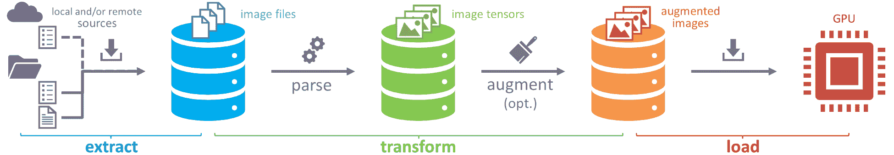

图 7-1：提供计算机视觉模型训练数据的典型 ETL 管道

**提取**步骤包括选择数据源并提取其内容。这些源可以由文档显式列出（例如，包含所有图像文件名的 CSV 文件），也可以隐式列出（例如，数据集中的所有图像已存储在特定文件夹中）。这些源可能*存储在不同设备*上（本地或远程），提取器的任务还包括列出这些不同的源并提取其内容。例如，在计算机视觉中，数据集通常非常庞大，需要将其存储在多个硬盘上。为了以有监督的方式训练神经网络，我们还需要提取图像的标注/真实值（例如，存储在 CSV 文件中的类别标签，以及存储在另一个文件夹中的真实分割掩码）。

获取的数据样本接下来应进行*转换*。最常见的转换之一是将提取的数据样本解析为统一格式。例如，这意味着将从图像文件中读取的字节解析为矩阵表示（例如，将 JPEG 或 PNG 字节解码为图像张量）。在此步骤中，还可以应用其他较重的转换，例如将图像裁剪/缩放为相同的尺寸，或使用各种随机操作对图像进行*增强*。同样，这也适用于有监督学习的标注。它们也应该被解析，例如，解析为张量，以便稍后传递给损失函数。

一旦准备好，数据将被*加载*到目标结构中。对于机器学习方法的训练，这意味着将批次样本发送到负责运行模型的设备，例如所选的 GPU。处理后的数据集还可以缓存/保存到某个地方以备后用。

例如，这个 ETL 过程已经在 Jupyter notebook 中观察到，在第六章中设置了*Cityscapes*输入管道，*增强和分割图像*。输入管道遍历提供的输入/真实值文件名，并解析和增强它们的内容，然后将结果作为批次传递给我们的训练过程。

# API 接口

`tf.data.Dataset`是`tf.data` API 提供的核心类（参考文档：[`www.tensorflow.org/api_docs/python/tf/data/Dataset`](https://www.tensorflow.org/api_docs/python/tf/data/Dataset)）。该类的实例（通常称为**数据集**）代表数据源，遵循我们刚刚介绍的懒加载列表范式。

数据集可以通过多种方式初始化，这取决于它们的内容最初是如何存储的（例如文件、NumPy 数组、张量等）。例如，数据集可以基于一个图像文件的列表，如下所示：

```py
dataset = tf.data.Dataset.list_files("/path/to/dataset/*.png")
```

数据集还拥有许多可以应用于自身的方法，以提供一个变换后的数据集。例如，以下函数返回一个新的数据集实例，将文件的内容正确转换（即解析）为统一大小的图像张量：

```py
def parse_fn(filename):
    img_bytes = tf.io.read_file(filename)
    img = tf.io.decode_png(img_bytes, channels=3)
    img = tf.image.resize(img, [64, 64])
    return img  # or for instance, `{'image': img}` if we want to name this input
dataset = dataset.map(map_func=parse_fn)
```

传递给`.map()`的函数将在遍历数据集时应用于每个样本。事实上，一旦所有必要的转换应用完成，数据集可以像任何懒加载的列表/生成器一样使用，如下所示：

```py
print(dataset.output_types)  # > "tf.uint8"
print(dataset.output_shapes) # > "(64, 64, 3)"
for image in dataset:
     # do something with the image
```

所有的数据样本已经作为`Tensor`返回，并可以轻松加载到负责训练的设备上。为了更加简便，`tf.estimator.Estimator`和`tf.keras.Model`实例可以直接接收`tf.data.Dataset`对象作为输入进行训练（对于估算器，数据集操作必须包装成一个返回数据集的函数），如下所示：

```py
keras_model.fit(dataset, ...)     # to train a Keras model on the data
def input_fn():
    # ... build dataset
    return dataset
tf_estimator.train(input_fn, ...) # ... or to train a TF estimator
```

通过将估算器和模型与`tf.data` API 紧密集成，TensorFlow 2 使得数据预处理和数据加载变得更加模块化且清晰。

# 设置输入管道

牢记 ETL 过程，我们将开发`tf.data`提供的一些最常见和最重要的方法，至少是针对计算机视觉应用的。对于完整的列表，我们邀请读者参考文档（[`www.tensorflow.org/api_docs/python/tf/data`](https://www.tensorflow.org/api_docs/python/tf/data)）。

# 提取（来自张量、文本文件、TFRecord 文件等）

数据集通常是为特定需求而构建的（如公司收集图像以训练更智能的算法、研究人员设置基准测试等），因此很少能找到结构和格式相同的两个数据集。幸运的是，TensorFlow 的开发者对此非常清楚，并提供了大量工具来列出和提取数据。

# 从 NumPy 和 TensorFlow 数据

首先，如果数据样本已经以某种方式被程序加载（例如，作为 NumPy 或 TensorFlow 结构），则可以通过`.from_tensors()`或`.from_tensor_slices()`静态方法直接传递给`tf.data`。

两者都接受嵌套的数组/张量结构，但后者会沿第一个轴切片数据，将其拆分为样本，如下所示：

```py
x, y = np.array([1, 2, 3, 4]), np.array([5, 6, 7, 8])
d = tf.data.Dataset.from_tensors((x,y))
print(d.output_shapes) # > (TensorShape([4]), TensorShape([4]))
d_sliced = tf.data.Dataset.from_tensor_slices((x,y))
print(d_sliced.output_shapes) # > (TensorShape([]), TensorShape([]))
```

如我们所观察到的，第二个数据集`d_sliced`最终包含四对样本，每对仅包含一个值。

# 从文件中

如前面的示例所示，数据集可以使用`.list_files()`静态方法遍历文件。此方法创建一个字符串张量的数据集，每个张量包含一个列出文件的路径。然后可以通过例如`tf.io.read_file()`来打开每个文件（`tf.io`包含与文件相关的操作）。

`tf.data` API 还提供了一些特定的数据集，用于遍历二进制或文本文件。`tf.data.TextLineDataset()`可以按行读取文档（这对于某些公开数据集很有用，它们将图像文件和/或标签列出在文本文件中）；`tf.data.experimental.CsvDataset()`也可以解析 CSV 文件，并按行返回其内容。

`tf.data.experimental`并不保证与其他模块的向后兼容性。当本书到达读者手中时，一些方法可能已经被移到`tf.data.Dataset`中，或者已经被删除（对于一些是 TensorFlow 限制的临时解决方案的函数）。我们邀请读者查看文档。

# 从其他输入（生成器、SQL 数据库、范围等）

虽然我们不会列举所有的情况，但需要记住的是，`tf.data.Dataset`可以从多种输入源进行定义。例如，简单遍历数字的数据集可以通过`.range()`静态方法初始化。数据集也可以基于 Python 生成器使用`.from_generator()`构建。最后，即使元素存储在 SQL 数据库中，TensorFlow 也提供了一些（实验性的）工具来查询数据库，包括以下内容：

```py
dataset = tf.data.experimental.SqlDataset(
    "sqlite", "/path/to/my_db.sqlite3",
    "SELECT img_filename, label FROM images", (tf.string, tf.int32))
```

对于更具体的数据集实例化器，我们邀请读者查看`tf.data`文档。

# 转换样本（解析、增强等）

ETL 管道的第二步是**转换**。转换可以分为两类——那些单独影响数据样本的，和那些影响整个数据集的。在接下来的段落中，我们将介绍前者的转换，并解释如何对我们的样本进行预处理。

# 解析图像和标签

在我们之前章节中为`dataset.map()`编写的`parse_fn()`方法中，调用了`tf.io.read_file()`来读取数据集中列出的每个文件名对应的文件，然后`tf.io.decode_png()`将字节转换为图像张量。

**`tf.io`** 还包含 `decode_jpeg()`、`decode_gif()`等方法。它还提供了更通用的`decode_image()`，能够自动推断使用哪种图像格式（请参考文档：[`www.tensorflow.org/api_docs/python/tf/io`](https://www.tensorflow.org/api_docs/python/tf/io)）。

此外，有许多方法可以应用于解析计算机视觉标签。显然，如果标签也是图像（例如，用于图像分割或编辑），我们刚才列出的那些方法仍然可以重复使用。如果标签存储在文本文件中，可以使用`TextLineDataset`或`FixedLengthRecordDataset`（参见[`www.tensorflow.org/api_docs/python/tf/data`](https://www.tensorflow.org/api_docs/python/tf/data)中的文档）进行迭代处理，并且像`tf.strings`这样的模块可以帮助解析行/记录。例如，假设我们有一个训练数据集，其中包含一个文本文件，每行列出了图像文件名及其类标识符，两者之间由逗号分隔。每对图像/标签可以通过这种方式进行解析：

```py
def parse_fn(line):
    img_filename, img_label = tf.strings.split(line, sep=',')
    img = tf.io.decode_image(tf.io.read_file(img_filename))[0]
    return {'image': img, 'label': tf.strings.to_number(img_label)}
dataset = tf.data.TextLineDataset('/path/to/file.txt').map(parse_fn)
```

正如我们所观察到的，TensorFlow 提供了多个辅助函数来处理和转换字符串、读取二进制文件、解码 PNG 或 JPEG 字节为图像等。有了这些函数，处理异构数据的管道可以以最小的努力搭建。

# 解析 TFRecord 文件

虽然列出所有图像文件，然后迭代打开和解析它们是一种直接的管道解决方案，但它可能并不高效。逐个加载和解析图像文件会消耗大量资源。将大量图像存储到一个二进制文件中，可以使从磁盘读取操作（或者远程文件的流操作）变得更加高效。因此，TensorFlow 用户通常被建议使用 TFRecord 文件格式，它基于 Google 的协议缓冲区（Protocol Buffers），一种语言中立、平台中立的可扩展机制，用于序列化结构化数据（参见[`developers.google.com/protocol-buffers`](https://developers.google.com/protocol-buffers/)中的文档）。

TFRecord 文件是聚合数据样本（如图像、标签和元数据）的二进制文件。一个 TFRecord 文件包含序列化的`tf.train.Example`实例，基本上是一个字典，命名每个数据元素（根据此 API 称为**特征**）来组成样本（例如，`{'img': image_sample1, 'label': label_sample1, ...}`）。每个样本包含的每个元素/特征都是`tf.train.Feature`或其子类的实例。这些对象将数据内容存储为字节、浮动数值或整数的列表（参见[`www.tensorflow.org//api_docs/python/tf/train`](https://www.tensorflow.org//api_docs/python/tf/train)中的文档）。

由于它是专为 TensorFlow 开发的，这种文件格式得到了 `tf.data` 的很好支持。为了将 TFRecord 文件作为输入管道的数据源，TensorFlow 用户可以将文件传递给 `tf.data.TFRecordDataset(filenames)`（请参考文档 [`www.tensorflow.org/api_docs/python/tf/data/TFRecordDataset`](https://www.tensorflow.org/api_docs/python/tf/data/TFRecordDataset)），该函数可以遍历其中包含的序列化 `tf.train.Example` 元素。要解析其内容，应执行以下操作：

```py
dataset = tf.data.TFRecordDataset(['file1.tfrecords','file2.tfrecords'])
# Dictionary describing the features/tf.trainExample structure:
feat_dic = {'img': tf.io.FixedLenFeature([], tf.string), # image's bytes
            'label': tf.io.FixedLenFeature([1], tf.int64)} # class label
def parse_fn(example_proto): # Parse a serialized tf.train.Example
    sample = tf.parse_single_example(example_proto, feat_dic)
    return tf.io.decode_image(sample['img])[0], sample['label']
dataset = dataset.map(parse_fn)
```

`tf.io.FixedLenFeature(shape, dtype, default_value)` 让管道知道预期从序列化样本中获得什么类型的数据，然后可以通过一个命令进行解析。

在其中一个 Jupyter 笔记本中，我们更详细地讲解了 TFRecord，逐步解释如何预处理数据并将其存储为 TFRecord 文件，以及如何将这些文件作为 `tf.data` 管道的数据源使用。

# 编辑样本

`.map()` 方法是 `tf.data` 管道的核心。除了解析样本外，它还可用于进一步编辑它们。例如，在计算机视觉中，一些应用通常需要将输入图像裁剪/调整大小为相同的尺寸（例如，应用 `tf.image.resize()`）或将目标标签转换为独热编码（`tf.one_hot()`）。

正如我们将在本章后面详细说明的那样，建议将可选的数据增强操作封装为传递给 `.map()` 的函数。

# 转换数据集（洗牌、打包、并行化等）

该 API 还提供了众多函数，用于将一个数据集转换成另一个数据集，调整其结构，或者将其与其他数据源合并。

# 结构化数据集

在数据科学和机器学习中，过滤数据、洗牌样本和将样本堆叠成批次等操作非常常见。`tf.data` API 为大多数这些操作提供了简单的解决方案（请参考文档 [`www.tensorflow.org/api_docs/python/tf/data/Dataset`](https://www.tensorflow.org/api_docs/python/tf/data/Dataset)）。例如，以下是一些最常用的数据集方法：

+   `.batch(batch_size, ...)`，它返回一个新的数据集，数据样本按批次处理（`tf.data.experimental.unbatch()` 执行相反的操作）。请注意，如果在 `.batch()` 后调用 `.map()`，则映射函数将接收到批处理数据作为输入。

+   `.repeat(count=None)`，它将数据重复 `count` 次（如果 `count = None`，则无限次重复）。

+   `.shuffle(buffer_size, seed, ...)`，它在填充缓冲区后对元素进行洗牌（例如，如果 `buffer_size = 10`，数据集将被虚拟地划分为 10 个元素的小子集，并随机排列每个子集中的元素，然后逐个返回）。缓冲区大小越大，洗牌的随机性就越强，但过程也越重。

+   `.filter(predicate)`，该方法根据提供的 `predicate` 函数的布尔输出来保留/移除元素。例如，如果我们想过滤一个数据集，移除存储在在线的数据，我们可以如下使用该方法：

```py
url_regex = "(?i)([a-z][a-z0-9]*)://([^ /]+)(/[^ ]*)?|([^ @]+)@([^ @]+)"
def is_not_url(filename): #NB: the regex isn't 100% sure/covering all cases
    return ~(tf.strings.regex_full_match(filename, url_regex))
dataset = dataset.filter(is_not_url)
```

+   `**.**take(count)`，该方法返回一个包含最多 `count` 个元素的数据集。

+   `**.**skip(count)`，该方法返回一个去除了前 `count` 个元素的数据集。这两个方法都可以用来拆分数据集，例如，按如下方式将数据集拆分为训练集和验证集：

```py
num_training_samples, num_epochs = 10000, 100
dataset_train = dataset.take(num_training_samples)
dataset_train = dataset_train.repeat(num_epochs)
dataset_val   = dataset.skip(num_training_samples)
```

还有许多其他方法可用于结构化数据或控制数据流，通常这些方法受到其他数据处理框架的启发（如 `.unique()`、`.reduce()` 和 `.group_by_reducer()`）。

# 合并数据集

一些方法也可以用于合并数据集。最简单的两种方法是 `.concatenate(dataset)` 和静态方法 `.zip(datasets)`（请参考文档 [`www.tensorflow.org/api_docs/python/tf/data/Dataset`](https://www.tensorflow.org/api_docs/python/tf/data/Dataset)）。前者*连接*提供的数据集样本与当前数据集样本，而后者则*组合*数据集的元素成元组（类似于 Python 中的 `zip()`），如下所示：

```py
d1 = tf.data.Dataset.range(3)
d2 = tf.data.Dataset.from_tensor_slices([[4, 5], [6, 7], [8, 9]])
d = tf.data.Dataset.zip((d1, d2))
# d will return [0, [4, 5]], [1, [6, 7]], and [2, [8, 9]]
```

另一种常用于合并来自不同来源的数据的方法是 `.interleave(map_func, cycle_length, block_length, ...)`（请参考文档 [`www.tensorflow.org/api_docs/python/tf/data/Dataset#interleave`](https://www.tensorflow.org/api_docs/python/tf/data/Dataset#interleave)）。该方法将 `map_func` 函数应用于数据集的元素，并对结果进行*交错*。现在让我们回到 *解析图像和标签* 部分中展示的示例，图像文件和类名列在一个文本文件中。如果我们有多个这样的文本文件，并希望将它们的所有图像合并成一个数据集，可以按如下方式使用 `.interleave()`：

```py
filenames = ['/path/to/file1.txt', '/path/to/file2.txt', ...]
d = tf.data.Dataset.from_tensor_slices(filenames)
d = d.interleave(lambda f: tf.data.TextLineDataset(f).map(parse_fn), 
                 cycle_length=2, block_length=5)
```

`cycle_length` 参数固定了并行处理的元素数量。在我们之前的示例中，`cycle_length = 2` 意味着函数将并行遍历前两个文件的行，然后再遍历第三和第四个文件的行，以此类推。`block_length` 参数控制每个元素返回的连续样本数量。在这里，`block_length = 5` 意味着该方法将在遍历另一个文件之前，从一个文件中返回最多 `5` 行连续的样本。

利用所有这些方法以及更多可用的工具，可以轻松地设置复杂的数据提取和转换流程，正如之前的一些笔记本中所示（例如，*CIFAR* 和 *Cityscapes* 数据集）。

# 加载

`tf.data` 的另一个优点是它的所有操作都已注册到 TensorFlow 操作图中，提取和处理的样本会作为 `Tensor` 实例返回。因此，我们在 ETL 的最后一步，即 *加载*，不需要做太多的工作。与任何其他 TensorFlow 操作或张量一样，库会负责将它们加载到目标设备上——除非我们希望自行选择设备（例如，使用 `tf.device()` 包装数据集的创建）。当我们开始遍历 `tf.data` 数据集时，生成的样本可以直接传递给模型。

# 优化和监控输入管道

虽然这个 API 简化了高效输入管道的设置，但为了充分发挥其功能，应该遵循一些最佳实践。除了分享来自 TensorFlow 创建者的一些建议外，我们还将介绍如何监控和重用管道。

# 遵循优化的最佳实践

该 API 提供了几种方法和选项来优化数据处理和流动，我们将详细介绍这些内容。

# 并行化和预取

默认情况下，大多数数据集方法都是逐个处理样本，没有并行性。然而，这种行为可以很容易地改变，例如，利用多个 CPU 核心。例如，`.interleave()` 和 `.map()` 方法都有一个 **`num_parallel_calls`** 参数，用于指定它们可以创建的线程数（请参阅文档 [`www.tensorflow.org/api_docs/python/tf/data/Dataset`](https://www.tensorflow.org/api_docs/python/tf/data/Dataset)）。**并行化**图像的提取和转换可以大大减少生成训练批次所需的时间，因此，始终正确设置 `num_parallel_calls` 是非常重要的（例如，设置为处理机器的 CPU 核心数）。

TensorFlow 还提供了 `tf.data.experimental.parallel_interleave()`（请参阅文档 [`www.tensorflow.org/versions/r2.0/api_docs/python/tf/data/experimental/parallel_interleave`](https://www.tensorflow.org/versions/r2.0/api_docs/python/tf/data/experimental/parallel_interleave)），这是 `.interleave()` 的并行化版本，带有一些额外的选项。例如，它有一个 `sloppy` 参数，如果设置为 `True`，允许每个线程在其输出准备好后立即返回。这样一方面意味着数据将不再按确定的顺序返回，另一方面，这可以进一步提高管道性能。

`tf.data` 的另一个与性能相关的特性是能够 *预取* 数据样本。通过数据集的 `.prefetch(buffer_size)` 方法应用时，该特性允许输入管道在当前样本被消费的同时开始准备下一个样本，而不是等待下一个数据集调用。具体而言，这使得 TensorFlow 能够在当前批次被 GPU 上的模型使用时，在 CPU 上开始准备下一个训练批次。

预取基本上实现了数据准备和训练操作的 *并行化*，以 *生产者-消费者* 的方式进行。因此，通过启用并行调用和预取，可以通过少量更改大大减少训练时间，如下所示：

```py
dataset = tf.data.TextLineDataset('/path/to/file.txt')
dataset = dataset.map(parse_fn, num_threads).batch(batch_size).prefetch(1)
```

受 TensorFlow 官方指南的启发（[`www.tensorflow.org/guide/performance/datasets`](https://www.tensorflow.org/guide/performance/datasets)），*图 7-2* 展示了这些最佳实践所带来的性能提升：

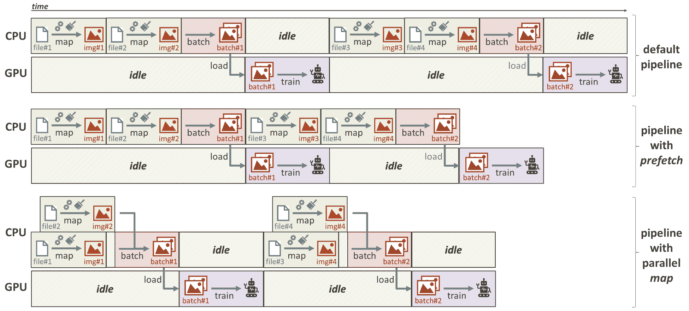

图 7-2：展示并行化和预取操作带来的性能提升

通过结合这些不同的优化方法，CPU/GPU 的空闲时间可以进一步减少。在预处理时间方面的性能提升可能会非常显著，正如本章中的一个 Jupyter Notebook 所展示的那样。

# 融合操作

还需要了解的是，`tf.data` 提供了一些函数，将一些关键操作进行组合，以提高性能或获得更可靠的结果。

例如，`tf.data.experimental.shuffle_and_repeat(buffer_size, count, seed)` 将打乱和重复操作融合在一起，使得每个训练周期（epoch）都能以不同的方式打乱数据集（详细信息请参见文档 [`www.tensorflow.org/versions/r2.0/api_docs/python/tf/data/experimental/shuffle_and_repeat`](https://www.tensorflow.org/versions/r2.0/api_docs/python/tf/data/experimental/shuffle_and_repeat)）。

回到优化问题，`tf.data.experimental.map_and_batch(map_func, batch_size, num_parallel_batches, ...)`（详细信息请参见文档 [`www.tensorflow.org/versions/r2.0/api_docs/python/tf/data/experimental/map_and_batch`](https://www.tensorflow.org/versions/r2.0/api_docs/python/tf/data/experimental/map_and_batch)）首先应用`map_func`函数，然后将结果批处理在一起。通过融合这两项操作，该方案避免了一些计算开销，因此应该优先采用。

`map_and_batch()` 将被淘汰，因为 TensorFlow 2 正在实现多个工具来自动优化 `tf.data` 操作，例如将多个 `.map()` 调用组合在一起、对 `.map()` 操作进行向量化并与 `.batch()` 直接融合、融合 `.map()` 和 `.filter()` 等。一旦这种自动优化被完全实现并经过 TensorFlow 社区验证，就不再需要 `map_and_batch()`（再强调一次，到你阅读这一章节时，这可能已经是事实）。

# 传递选项以确保全局属性

在 TensorFlow 2 中，还可以通过*设置全局选项*来配置数据集，这将影响它们的所有操作。`tf.data.Options` 是一种可以通过 `.with_options(options)` 方法传递给数据集的结构，它有多个属性用于参数化数据集（请参阅文档 [`www.tensorflow.org/api_docs/python/tf/data/Options`](https://www.tensorflow.org/api_docs/python/tf/data/Options)）。

例如，如果将 `.experimental_autotune` 布尔属性设置为 `True`，TensorFlow 将根据目标机器的容量自动调整所有数据集操作的 `num_parallel_calls` 值。

当前名为 `.experimental_optimization` 的属性包含一组与数据集操作自动优化相关的*子选项*（请参阅前面的信息框）。例如， `.map_and_batch_fusion` 属性可以设置为 `True`，以使 TensorFlow 自动融合 `.map()` 和 `.batch()` 调用；`.map_parallelization` 可以设置为 `True`，使 TensorFlow 自动并行化某些映射函数，等等，具体如下：

```py
options = tf.data.Options()
options.experimental_optimization.map_and_batch_fusion = True
dataset = dataset.with_options(options)
```

还有许多其他选项可供选择（可能还会有更多）。我们邀请读者查看文档，特别是当输入管道的性能对他们来说至关重要时。

# 监控和重用数据集

我们介绍了多个优化 `tf.data` 管道的工具，但我们如何确保它们能对性能产生积极影响呢？是否还有其他工具可以帮助我们找出可能导致数据流缓慢的操作？在接下来的段落中，我们将通过演示如何监控输入管道以及如何缓存和恢复它们以供后续使用来回答这些问题。

# 聚合性能统计

TensorFlow 2 的一个新特性是能够聚合有关 `tf.data` 管道的一些统计信息，例如它们的延迟（整个过程的延迟和/或每个操作的延迟）或每个元素产生的字节数。

可以通过 TensorFlow 的全局选项来通知收集这些数据集的指标值*（参见前面的段落）*。`tf.data.Options`实例具有`.experimental_stats`字段，该字段来自`tf.data.experimental.StatsOption`类（请参考文档：[`www.tensorflow.org/versions/r2.0/api_docs/python/tf/data/experimental/StatsOptions`](https://www.tensorflow.org/versions/r2.0/api_docs/python/tf/data/experimental/StatsOptions)）。此类定义了与上述数据集指标相关的几个选项（例如，将`.latency_all_edges`设置为`True`以测量延迟）。它还具有`.aggregator`属性，可以接收`tf.data.experimental.StatsAggregator`的实例（请参考文档：[`www.tensorflow.org/versions/r2.0/api_docs/python/tf/data/experimental/StatsAggregator`](https://www.tensorflow.org/versions/r2.0/api_docs/python/tf/data/experimental/StatsAggregator)）。顾名思义，该对象将附加到数据集并汇总请求的统计数据，提供可以记录并在 TensorBoard 中可视化的摘要，如以下代码示例所示。

在编写本书时，这些功能仍然处于高度实验阶段，尚未完全实现。例如，目前没有简单的方法来记录包含聚合统计信息的摘要。鉴于监控工具的重要性，我们仍然涵盖了这些功能，认为它们很快会完全可用。

因此，数据集的统计信息可以聚合并保存（例如，供 TensorBoard 使用），如下所示：

```py
# Use utility function to tell TF to gather latency stats for this dataset:
dataset = dataset.apply(tf.data.experimental.latency_stats("data_latency"))
# Link stats aggregator to dataset through the global options:
stats_aggregator = tf.data.experimental.StatsAggregator()
options = tf.data.Options()
options.experimental_stats.aggregator = stats_aggregator
dataset = dataset.with_options(options)
# Later, aggregated stats can be obtained as summary, for instance, to log them:
summary_writer = tf.summary.create_file_writer('/path/to/summaries/folder')
with summary_writer.as_default():
    stats_summary = stats_aggregator.get_summary()
    # ... log summary with `summary_writer` for Tensorboard (TF2 support coming soon)
```

请注意，不仅可以获取整个输入管道的统计信息，还可以获取其每个内部操作的统计数据。

# 缓存和重用数据集

最后，TensorFlow 提供了多个函数来*缓存*生成的样本或保存`tf.data`管道的状态。

可以通过调用数据集的`.cache(filename)`方法来缓存样本。如果已缓存，数据在下一次迭代时将无需经过相同的转换（即，在接下来的时期）。请注意，缓存数据的内容将取决于该方法应用的时机。请看以下示例：

```py
dataset = tf.data.TextLineDataset('/path/to/file.txt')
dataset_v1 = dataset.cache('cached_textlines.temp').map(parse_fn)
dataset_v2 = dataset.map(parse_fn).cache('cached_images.temp')
```

第一个数据集将缓存`TextLineDataset`返回的样本，即文本行（缓存的数据存储在指定的文件`cached_textlines.temp`中）。`parse_fn`所做的转换（例如，为每个文本行打开并解码相应的图像文件）必须在每个时期重复进行。另一方面，第二个数据集则缓存了`parse_fn`返回的样本，即图像。虽然这可以为下一轮的训练节省宝贵的计算时间，但这也意味着需要缓存所有生成的图像，这可能会导致内存效率低下。因此，缓存需要仔细考虑。

最后，*保存数据集的状态*也是可能的，例如，当训练被意外中断时，可以在不重新迭代先前输入批次的情况下恢复训练。如文档中所提到的，这个功能对在少量不同批次上训练的模型（因此存在过拟合风险）有积极影响。对于估算器，一个保存数据集迭代器状态的解决方案是设置以下钩子——`tf.data.experimental.CheckpointInputPipelineHook`（请参考文档 [`www.tensorflow.org/api_docs/python/tf/data/experimental/CheckpointInputPipelineHook`](https://www.tensorflow.org/api_docs/python/tf/data/experimental/CheckpointInputPipelineHook)）。

由于深知可配置和优化的数据流对机器学习应用的重要性，TensorFlow 开发者持续提供新特性来完善 `tf.data` API。正如在上一部分中提到并在相关的 Jupyter Notebook 中展示的那样，利用这些特性——即使是实验性的——可以大大减少实现开销和训练时间。

# 如何应对数据稀缺

能够高效地提取和转化数据以训练复杂的应用程序至关重要，但这假设首先有*足够的数据*可供此类任务使用。毕竟，神经网络是*数据饥渴型*方法，即使我们身处大数据时代，足够大的数据集仍然很难收集，且更难以标注。标注一张图像可能需要几分钟（例如，为语义分割模型创建地面真值标签图），某些标注可能还需要专家验证/修正（例如，在标注医学图片时）。在某些情况下，图像本身可能不容易获得。例如，在为工业厂房构建自动化模型时，拍摄每个制造物品及其组件的照片既耗时又费钱。

因此，**数据稀缺**是计算机视觉中的一个常见问题，尽管缺乏训练图像或严格标注，仍有很多努力尝试训练出鲁棒的模型。在本节中，我们将介绍多年来提出的几种解决方案，并展示它们在不同任务中的优缺点。

# 增强数据集

我们从第四章《影响力分类工具》开始就提到了这一第一种方法，并且我们在之前的笔记本中已将其应用于某些应用程序。这终于是我们正确介绍**数据增强**的机会，并展示如何在 TensorFlow 2 中应用它。

# 概述

正如之前所指出的，*增广* 数据集意味着对它们的内容应用随机转换，以获取每个内容的不同版本。我们将介绍这一过程的好处，以及一些相关的最佳实践。

# 为什么要增广数据集？

数据增广可能是处理过小的训练集最常见和简单的方法。它可以通过提供每个图像的不同外观版本来几乎使它们的图像数量倍增。这些不同的版本是通过应用随机转换的组合获得的，例如尺度抖动、随机翻转、旋转和色彩偏移。数据增广可以意外地帮助*防止过拟合*，这在用小样本集训练大模型时通常会发生。

但即使有足够的训练图像可用，仍应考虑这一过程。事实上，数据增广还有其他好处。即使是大型数据集也可能存在*偏差*，而数据增广可以部分补偿其中的一些偏差。我们将通过一个例子说明这个概念。假设我们想要为画笔与钢笔图片建立一个分类器。然而，每个类别的图片是由两个不同的团队收集的，事先并未就准确的获取协议达成一致（例如，选择哪种相机型号或照明条件）。结果，*画笔* 训练图片明显比*钢笔* 图片更暗更嘈杂。由于神经网络训练以正确预测任何视觉线索，这些模型在这样的数据集上学习时可能最终依赖于这些明显的光照/噪声差异来分类对象，而不是纯粹专注于对象的表征（如它们的形状和纹理）。一旦投入生产，这些模型表现会很差，不再能依赖这些偏差。这个例子在 *图 7-3* 中有所说明：

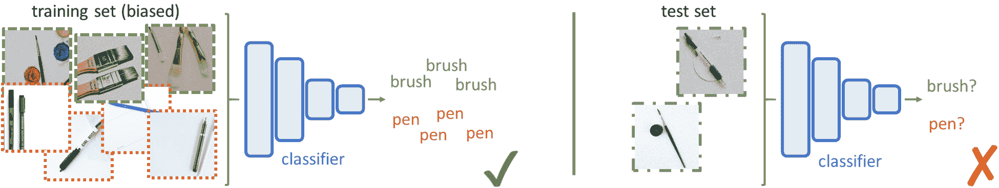

图 7-3：一个在偏差数据集上训练的分类器示例，无法将其知识应用到目标数据上

随机向图片添加一些噪声或随机调整它们的亮度，将阻止网络依赖这些线索。这些增广将部分补偿数据集的偏差，并使这些视觉差异变得太不可预测，无法被网络使用（即防止模型过度拟合偏差数据集）。

数据增强还可以用于提高数据集的覆盖范围。训练数据集无法涵盖所有图像变化（否则我们就不需要构建机器学习模型来处理新的不同图像）。例如，如果某个数据集中的所有图像都是在相同的光照下拍摄的，那么在不同光照条件下拍摄的图像，训练出来的识别模型效果会非常差。这些模型本质上没有学习到*光照条件是一个因素*，它们应该学会忽略光照条件，专注于实际的图像内容。因此，在将训练图像传递给网络之前，随机调整图像亮度可以帮助模型学习这一视觉特性。通过更好地为目标图像的变化性做好准备，数据增强有助于训练出更强大的解决方案。

# 考虑事项

数据增强可以采取多种形式，在执行这一过程时应考虑多个选项。首先，数据增强可以是离线进行的，也可以是在线进行的。离线增强意味着在训练开始之前转换所有图像，并将各种版本保存以备后用。在线增强则意味着在训练输入管道中生成每个新批次时应用转换。

由于增强操作可能计算开销较大，因此提前应用这些操作并存储结果，在输入管道的延迟方面可能具有优势。然而，这意味着需要足够的内存空间来存储增强后的数据集，这通常会限制生成的不同版本的数量。通过在实时处理时随机转换图像，在线解决方案可以为每个训练周期提供不同的版本。尽管计算开销更大，但这意味着网络将接收到更多的变化。因此，离线增强和在线增强之间的选择受限于可用设备的内存/处理能力，以及所需的变化性。

变化性本身由要应用的转换类型决定。例如，如果仅应用随机水平和垂直翻转操作，那么每张图像最多会有四个不同版本。根据原始数据集的大小，您可以考虑离线应用转换，并存储四倍大小的数据集。另一方面，如果考虑应用随机裁剪和随机色彩偏移等操作，则可能的变化数量几乎是无限的。

因此，在设置数据增强时，首先要做的是筛选出相关的转换操作（以及在适用时它们的参数）。可能的操作列表非常庞大，但并非所有操作都适用于目标数据和使用案例。例如，垂直翻转仅应在图像内容自然会出现在倒立状态下时考虑（如大系统的特写图像或鸟瞰图/卫星图像）。如果垂直翻转城市景观图像（例如 *Cityscapes* 图像），对于模型没有任何帮助，因为它们（希望）永远不会遇到这种倒立的图像。

同样，你应该小心地正确参数化一些转换操作，例如裁剪或亮度调整。如果图像变得过暗或过亮，以至于其内容无法再被识别，或者如果关键元素被裁剪掉，那么模型将无法从这些编辑后的图片中学习任何东西（如果过多的图像经过不恰当的增强处理，甚至可能会混淆模型）。因此，重要的是要筛选和参数化那些能为数据集（针对目标使用案例）增加有意义变化的转换，同时保持其语义内容。

*图 7-4* 提供了一些对于自动驾驶应用来说，哪些增强操作是有效的，哪些是无效的示例：

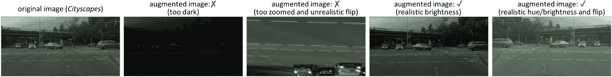

图 7-4：自动驾驶应用中的有效/无效增强操作

同样，值得记住的是，数据增强无法完全弥补数据稀缺问题。如果我们希望模型能够识别猫，但仅有波斯猫的训练图像，那么任何简单的图像变换都无法帮助模型识别其他猫品种（例如斯芬克斯猫）。

一些先进的数据增强解决方案包括应用计算机图形学或编码器-解码器方法来改变图像。例如，可以使用计算机图形学算法添加虚假的太阳光晕或运动模糊，CNN 可以训练将白天的图像转换为夜间图像。我们将在本章后面介绍这些技术。

最后，当适用时，你不应忘记相应地转换标签，特别是当进行几何转换时，涉及检测和分割标签时。如果图像被调整大小或旋转，相关的标签图或边界框也应该进行相同的操作，以保持对齐（参见第六章的 *Cityscapes* 实验，*图像增强与分割*）。

# 使用 TensorFlow 进行图像增强

在阐明了*为什么*和*何时*应该进行图像增强之后，接下来就是详细解释*如何*进行图像增强了。我们将介绍 TensorFlow 提供的一些有用工具来转换图像，并分享一些具体的示例。

# TensorFlow 图像模块

Python 提供了各种各样的框架来处理和转换图像。除了 *OpenCV*（[`opencv.org`](https://opencv.org)）和 *Python Imaging Library*（PIL—[`effbot.org/zone/pil-index.htm`](http://effbot.org/zone/pil-index.htm)）等通用框架外，还有一些包专门提供用于机器学习系统的数据增强方法。在这些包中，Alexander Jung 提供的 `imgaug`（[`github.com/aleju/imgaug`](https://github.com/aleju/imgaug)）和 Marcus D. Bloice 提供的 `Augmentor`（[`github.com/mdbloice/Augmentor`](https://github.com/mdbloice/Augmentor)）可能是最广泛使用的，它们都提供了丰富的操作和简洁的接口。即使是 Keras 也提供了用于预处理和增强图像数据集的函数。`ImageDataGenerator`（[`keras.io/preprocessing/image`](https://keras.io/preprocessing/image)）可以用来实例化图像批处理生成器，涵盖数据增强（如图像旋转、缩放或通道偏移）。

然而，TensorFlow 有自己专门的图像处理模块，可以与 `tf.data` 数据管道无缝集成——`tf.image`（请参阅[`www.tensorflow.org/api_docs/python/tf/image`](https://www.tensorflow.org/api_docs/python/tf/image)中的文档）。该模块包含各种函数。其中一些实现了常见的图像相关度量（例如，`tf.image.psnr()` 和 `tf.image.ssim()`），还有一些可以用于将图像从一种格式转换为另一种格式（例如，`tf.image.rgb_to_grayscale()`）。但最重要的是，`tf.image` 实现了多种图像变换。这些函数大多成对出现——一个函数实现了操作的固定版本（例如，`tf.image.central_crop()`、`tf.image.flip_left_right()` 和 `tf.image.adjust_jpeg_quality()`），另一个则是随机版本（例如，`tf.image.random_crop()`、`tf.image.random_flip_left_right()` 和 `tf.image.random_jpeg_quality()`）。随机化函数通常接受一个值的范围作为参数，从中随机抽取变换的属性（例如，`tf.image.random_jpeg_quality()` 的 `min_jpeg_quality` 和 `max_jpeg_quality` 参数）。

`tf.image` 函数直接应用于图像张量（无论是单个还是批量），在 `tf.data` 数据管道中推荐用于在线增强（将操作分组为传递给 `.map()` 的函数）。

# 示例 – 为我们的自动驾驶应用增强图像

在前一章中，我们介绍了一些最先进的语义分割模型，并将它们应用于城市场景，以指导自动驾驶汽车。在相关的 Jupyter 笔记本中，我们提供了一个传递给 `dataset.map()` 的 `_augmentation_fn(img, gt_img)` 函数，用于增强图像及其地面真值标签图。虽然当时我们没有提供详细解释，但这个增强函数很好地展示了 `tf.image` 如何增强复杂数据。

例如，它为解决同时变换输入图像和其密集标签的问题提供了一个简单的解决方案。假设我们想让一些样本随机水平翻转。如果我们分别对输入图像和真实标签图调用`tf.image.random_flip_left_right()`，那么两张图像会经历相同变换的概率只有一半。

确保对图像对应用相同几何变换的一个解决方案如下：

```py
img_dim, img_ch = tf.shape(img)[-3:-1], tf.shape(img)[-1]
# Stack/concatenate the image pairs along the channel axis:
stacked_imgs = tf.concat([img, tf.cast(gt_img, img.dtype)], -1)
# Apply the random operations, for instance, horizontal flipping:
stacked_imgs = tf.image.random_flip_left_right(stacked_imgs)
# ... or random cropping (for instance, keeping from 80 to 100% of the images):
rand_factor = tf.random.uniform([], minval=0.8, maxval=1.)
crop_shape = tf.cast(tf.cast(img_dim, tf.float32) * rand_factor, tf.int32)
crop_shape = tf.concat([crop_shape, tf.shape(stacked_imgs)[-1]], axis=0)
stacked_imgs = tf.image.random_crop(stacked_imgs, crop_shape)
# [...] (apply additional geometrical transformations)
# Unstack to recover the 2 augmented tensors:
img = stacked_imgs[..., :img_ch]
gt_img = tf.cast(stacked_imgs[..., img_ch:], gt_img.dtype)
# Apply other transformations in the pixel domain, for instance:
img = tf.image.random_brightness(image, max_delta=0.15)
```

由于大多数`tf.image`几何函数对图像的通道数没有任何限制，因此提前沿通道轴将图像拼接在一起是一个简单的技巧，可以确保它们经历相同的几何操作。

上述示例还说明了一些操作如何通过从随机分布中抽取一些参数来进一步随机化。`tf.image.random_crop(images, size)`返回固定大小的裁剪，裁剪位置随机选自图像中的位置。通过使用`tf.random.uniform()`选择一个尺寸因子，我们获得的裁剪不仅在原图像中随机定位，而且尺寸也是随机的。

最后，这个例子也提醒我们，*并非*所有的变换都应该应用于输入图像及其标签图。尝试调整标签图的亮度或饱和度是没有意义的（并且在某些情况下会引发异常）。

我们将通过强调此过程应始终考虑来结束这一小节关于数据增强的讨论。即使在大数据集上进行训练，增强其图像也能使模型更加稳健——只要随机变换是小心选择并应用的。

# 渲染合成数据集

然而，如果我们根本没有图像进行训练怎么办？计算机视觉中一种常见的解决方案是使用*合成数据集*。在接下来的小节中，我们将解释什么是合成图像，它们如何生成以及它们的局限性。

# 概述

首先让我们澄清什么是*合成图像*，以及为什么它们在计算机视觉中如此常见。

# 3D 数据库的崛起

正如本节介绍数据匮乏时所提到的，完全缺乏训练图像的情况在工业界并不少见。收集每个新元素的几百张图像是昂贵的，有时甚至是完全不切实际的（例如，当目标物体尚未生产出来，或者仅在某个遥远地点可用时）。

然而，对于工业应用和其他场景，越来越常见的是能够获取目标物体或场景的 3D 模型（例如 3D **计算机辅助设计**（**CAD**）蓝图或使用深度传感器捕捉的 3D 场景）。大规模的 3D 模型数据集甚至在网络上成倍增加。随着计算机图形学的发展，越来越多的专家开始使用这些 3D 数据库来*渲染*合成图像，用于训练他们的识别模型。

# 合成数据的优势

**合成图像**是通过计算机图形库从 3D 模型生成的图像。得益于盈利丰厚的娱乐产业，计算机图形技术确实取得了长足进展，现在的渲染引擎能够从 3D 模型中生成高度逼真的图像（例如用于视频游戏、3D 动画电影和特效）。科学家们很快就看到了计算机视觉的潜力。

给定一些目标物体/场景的详细 3D 模型，使用现代 3D 引擎可以渲染出大量伪现实的图像数据集。通过适当的脚本，举例来说，你可以从每个角度、不同的距离、不同的光照条件或背景等渲染目标物体的图像。使用各种渲染方法，甚至可以模拟不同类型的相机和传感器（例如，深度传感器，如*Microsoft Kinect*或*Occipital Structure*传感器）。

拥有对场景/图像内容的完全控制，你还可以轻松获得每张合成图像的各种地面真值标签（例如渲染模型的精确 3D 位置或物体掩码）。例如，针对驾驶场景，巴塞罗那自治大学的一个研究团队构建了城市环境的虚拟副本，并利用这些副本渲染了多个城市场景数据集，名为*SYNTHIA*（[`synthia-dataset.net`](http://synthia-dataset.net)）。这个数据集类似于*Cityscapes*（[`www.cityscapes-dataset.com`](https://www.cityscapes-dataset.com)），但规模更大。

来自达姆施塔特工业大学和英特尔实验室的另一支团队成功演示了使用现实感十足的电子游戏*Grand Theft Auto V (GTA 5)*（[`download.visinf.tu-darmstadt.de/data/from_games`](https://download.visinf.tu-darmstadt.de/data/from_games)）中的图像训练的自动驾驶模型。

这三个数据集展示在*图 7-5*中：

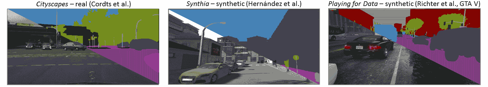

图 7-5：*Cityscapes*、*SYNTHIA* 和 *Playing for Data* 数据集的样本（数据集链接在本节中提供）。图像及其类别标签已叠加。

除了生成静态数据集，3D 模型和游戏引擎还可以用于创建*互动仿真环境*。毕竟，*基于仿真的学习*通常用于教导人类复杂的技能，例如当在真实环境中学习过于危险或复杂时（例如，模拟零重力环境来教宇航员如何在太空中执行某些任务，或构建基于游戏的平台帮助外科医生在虚拟病人上学习）。如果这对人类有效，为什么不对机器有效呢？公司和研究实验室一直在开发多种仿真框架，涵盖了各种应用（如机器人学、自动驾驶、监控等）。

在这些虚拟环境中，人们可以训练和测试他们的模型。在每个时间步骤，模型会从环境中接收一些视觉输入，模型可以利用这些输入采取进一步的行动，进而影响仿真过程，依此类推（这种互动式训练实际上是*强化学习*的核心内容，如第一章《计算机视觉与神经网络》中所提到的）。

合成数据集和虚拟环境用于弥补缺乏真实训练数据的问题，或者避免将不成熟的解决方案直接应用到复杂或危险的情境中。

# 从 3D 模型生成合成图像

**计算机图形学**本身是一个广泛且迷人的领域。在接下来的段落中，我们将简单介绍一些实用的工具和现成的框架，供那些需要为其应用渲染数据的人使用。

# 从 3D 模型进行渲染

从 3D 模型生成图像是一个复杂的多步骤过程。大多数 3D 模型由*网格*表示，网格是一组由*顶点*（即 3D 空间中的点）限定的小*面*（通常是三角形）组成，表示模型的表面。一些模型还包含一些*纹理或颜色信息*，指示每个顶点或小表面应该具有的颜色。最后，模型可以被放置到一个更大的 3D 场景中（进行平移/旋转）。给定一个由**内参**（如焦距和主点）定义的虚拟相机及其在 3D 场景中的姿态，任务是渲染出相机在场景中所看到的内容。该过程在下方的*图 7-6*中以简化的方式展示：

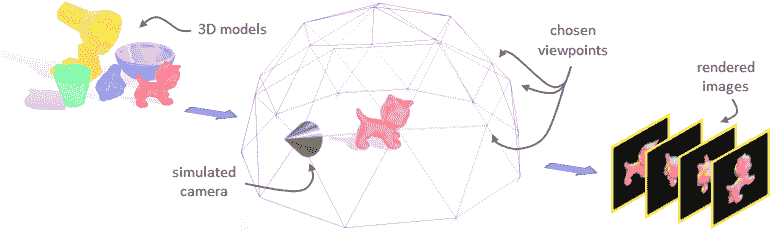

图 7-6：简化的 3D 渲染管线表示（3D 模型来自 LineMOD 数据集——http://campar.in.tum.de/Main/StefanHinterstoisser）

将 3D 场景转换为 2D 图像意味着需要进行多个变换，首先将每个模型的面从 3D 坐标（相对于物体）投影到全局场景坐标（世界坐标），然后再投影到相机坐标系（相机坐标），最后将其投影到图像空间中的 2D 坐标（图像坐标）。所有这些投影可以通过直接的*矩阵乘法*来表示，但它们（遗憾的是）只是渲染过程的一小部分。表面颜色也应正确插值，*可见性*应得到尊重（被其他物体遮挡的元素不应绘制），还应应用现实的光照效果（例如，光照、反射和折射）等等。

操作繁多且计算量大。幸运的是，GPU 最初是为了高效地执行这些操作而设计的，像*OpenGL*（[`www.opengl.org`](https://www.opengl.org)）这样的框架已经开发出来，帮助与 GPU 进行接口连接，以实现计算机图形学（例如，将顶点/面加载到 GPU 作为*缓冲区*，或定义名为*着色器*的程序来指定如何投影和着色场景），并简化一些过程。

大多数现代计算机语言提供了基于*OpenGL*的库，如`PyOpenGL`（[`pyopengl.sourceforge.net`](http://pyopengl.sourceforge.net)）或面向对象的`vispy`（[`vispy.org`](http://vispy.org)）库（适用于 Python）。像*Blender*（[`www.blender.org`](https://www.blender.org)）这样的应用程序提供了图形界面来构建和渲染 3D 场景。尽管掌握所有这些工具需要一些努力，但它们极为灵活，可以极大地帮助渲染任何类型的合成数据。

然而，值得记住的是，正如我们之前提到的，实验室和公司已经共享了许多高级框架，用于专门为机器学习应用渲染合成数据集。例如，来自萨尔茨堡大学的 Michael Gschwandtner 和 Roland Kwitt 开发了*BlenSor*（[`www.blensor.org`](https://www.blensor.org)），这是一个基于 Blender 的应用程序，用于模拟各种传感器（*BlenSor: Blender 传感器模拟工具箱*，Springer，2011 年）；最近，Simon Brodeur 和来自不同领域的研究人员分享了*HoME-Platform*，该平台模拟了多种室内环境，用于智能系统（*HoME: 家庭多模态环境*，ArXiv，2017 年）。

在手动设置完整的渲染管线或使用特定的仿真系统时，无论是哪种情况，最终目标都是渲染大量带有真实数据和足够变化（视角、光照条件、纹理等）的训练数据。

为了更好地说明这些概念，专门有一个完整的笔记本来渲染来自 3D 模型的合成数据集，简要介绍了*3D 网格*、*着色器*和*视图矩阵*等概念。使用`vispy`实现了一个简单的渲染器。

# 合成图像的后期处理

虽然目标对象的 3D 模型在工业环境中通常是可获得的，但很少能够获得它们所处环境的 3D 表示（例如，工业厂房的 3D 模型）。因此，3D 对象/场景往往显得孤立，没有适当的背景。但是，就像任何其他视觉内容一样，如果模型没有经过训练去处理背景/杂乱物体，它们在面对真实图像时就无法正常工作。因此，研究人员通常会对合成图像进行后期处理，例如将它们与相关的背景图片合成（用相关环境的图像像素值替换空白背景）。

虽然某些增强操作可以通过渲染管道来处理（例如亮度变化或运动模糊），但其他 2D 变换在训练期间仍然常常应用于合成数据。这种额外的后期处理再次是为了减少过拟合的风险，并提高模型的鲁棒性。

2019 年 5 月，**TensorFlow Graphics**发布了。这个模块提供了一个计算机图形学管道，可以从 3D 模型生成图像。由于这个渲染管道由新颖的可微分操作组成，它可以与神经网络（NNs）紧密结合——或者集成到其中——（这些图形操作是可微分的，因此训练误差可以通过它们进行反向传播，就像其他任何神经网络层一样）。随着越来越多的功能被添加到 TensorFlow Graphics 中（例如 TensorBoard 的 3D 可视化插件和额外的渲染选项），它无疑将成为解决 3D 应用或依赖合成训练数据的应用方案的核心组件。更多信息以及详细教程可以在相关的 GitHub 仓库中找到（[`github.com/tensorflow/graphics`](https://github.com/tensorflow/graphics)）。

# 问题——真实感差距

尽管合成图像的渲染已经使得各种计算机视觉应用成为可能，但它仍然不是数据稀缺的完美解决方案（或者至少目前还不是）。虽然如今计算机图形学框架可以渲染出超真实的图像，但它们*需要详细的 3D 模型*（具有精确的表面和高质量的纹理信息）。收集数据以构建这样的模型与直接构建目标对象的真实图像数据集的成本一样*昂贵*——甚至可能更贵。

由于 3D 模型有时具有简化的几何形状或缺乏与纹理相关的信息，因此真实感合成数据集并不常见。这种渲染训练数据与真实目标图像之间的**真实感差距**会*损害模型的表现*。它们在合成数据上训练时学到的视觉线索可能在真实图像中并不存在（这些图像可能具有不同的饱和度颜色、更复杂的纹理或表面等）。

即使 3D 模型能够正确描绘原始物体，物体的外观随着时间的推移（例如，由于磨损）也常常发生变化。

目前，许多努力正致力于解决计算机视觉中的现实差距。虽然一些专家正在致力于构建更逼真的 3D 数据库或开发更先进的仿真工具，其他专家则提出了新的机器学习模型，这些模型能够将它们在合成环境中获得的知识转移到真实场景中。后者的方法将是本章最后小节的主题。

# 利用领域适应和生成模型（VAE 和 GAN）

**领域适应**方法在第四章中简要提到过，属于迁移学习策略中的一部分。它们的目标是将模型在一个*源领域*（即一个数据分布）中获得的知识转移到另一个*目标领域*。因此，得到的模型应该能够正确识别来自新分布的样本，即使它们没有在该分布上进行直接训练。这适用于当目标领域的训练样本不可用时，但可以考虑使用其他相关数据集作为训练替代品的场景。

假设我们希望训练一个模型，在真实场景中对家用工具进行分类，但我们只能获得制造商提供的整洁的产品图片。如果没有领域适应，基于这些广告图片训练的模型在面对目标图像时——例如有杂乱物品、光照不佳等问题时——将无法正常工作。

在合成数据上训练识别模型，使其能够应用于真实图像，已经成为领域适应方法的一种常见应用。实际上，具有相同语义内容的合成图像和真实照片可以被看作是两个不同的数据分布，也就是说，它们是具有不同细节、噪声等特征的两个领域。

本节中，我们将考虑以下两种不同的方法：

+   领域适应方法旨在训练模型，使其在源领域和目标领域上表现相同

+   适应训练图像使其与目标图像更相似的方法

# 训练模型以适应领域变化的鲁棒性

域适应的第一种方法是鼓励模型关注在源领域和目标领域中都能找到的鲁棒特征。基于这种方法，已经提出了多种解决方案，具体取决于训练过程中是否有目标数据可用。

# 监督式领域适应

有时，你可能幸运地能够获得来自目标领域的一些图像及相关注释，除此之外还有一个较大的源数据集（例如，合成图像）。这种情况通常出现在工业界，在那里公司必须在收集足够的目标图像以训练识别模型的高昂成本与如果模型仅在合成数据上进行训练时所遭遇的性能下降之间找到折衷。

幸运的是，多个研究表明，将少量目标样本添加到训练集中可以提升算法的最终表现。通常提出的两个主要原因是：

+   即使目标数据稀缺，它也为模型提供了目标领域的一些信息。为了最小化对所有样本的训练损失，网络必须学会如何处理这一小部分添加的图像（这甚至可以通过对这些图像加重损失来进一步强调）。

+   由于源分布和目标分布本质上是不同的，混合数据集展示了*更大的视觉变异性*。正如前面所解释的，模型需要学习更强大的特征，这在仅应用于目标图像时是有益的（例如，模型变得更好地准备处理多样化的数据，从而更好地应对目标图像分布）。

也可以直接将其与我们在第四章中探讨的迁移学习方法相类比，*影响力分类工具*（先在大型源数据集上训练模型，然后在较小的目标训练集上进行微调）。正如当时所提到的，源数据与目标领域越接近，这样的训练方案就越有效——反之亦然（在 Jupyter Notebook 中，我们强调了这些限制，尝试在过于偏离目标分布的合成图像上训练自驾车的分割模型）。

# 无监督领域适应

在准备训练数据集时，收集图像通常不是主要问题。但正确地为这些图像进行注释才是，因为这是一个繁琐且因此成本高昂的过程。因此，许多领域适应方法专注于这些仅有源图像、其对应注释和目标图像的场景。在没有真实标签的情况下，这些目标样本无法像通常的*监督*方式那样直接用于训练模型。相反，研究人员一直在探索*无监督*方案，以利用这些图像仍能提供的目标领域的视觉信息。

例如，像《*通过深度适应网络学习可转移特征*》这样的工作，作者是来自清华大学的 Mingsheng Long 等人，他们在模型的某些层中添加了约束，使得无论输入图像属于哪个领域，它们生成的特征图都有相同的分布。这种方法提出的训练方案可以简化为以下几种步骤：

1.  在多个迭代中，以监督方式在源批次上训练模型。

1.  偶尔，将训练集输入到模型中，并计算我们希望适应的层生成的特征图的分布（例如，均值和方差）。

1.  类似地，将目标图像集输入到模型中，并计算生成的特征图的分布。

1.  优化每一层，以减少两个分布之间的距离。

1.  重复整个过程，直到达到收敛。

在没有目标标签的情况下，这些解决方案迫使网络学习可以在两个领域之间迁移的特征，而网络则在源数据上进行训练（约束通常添加到负责特征提取的最后卷积层，因为前面的层通常已经足够通用）。

其他方法则考虑到在这些训练场景中始终存在的隐式标签——每个图像所属的领域（即*源*或*目标*）。这个信息可以用来训练一个监督式二分类器——给定一张图像或特征图，其任务是预测它来自源领域还是目标领域。这个次级模型可以与主模型一起训练，指导其提取可能属于任一领域的特征。

例如，在他们的**领域对抗神经网络**（**DANN**）论文中（发表于 JMLR，2016），Hana Ajakan、Yaroslav Ganin 等人（来自 Skoltech）提出在模型中添加一个次级分支（紧接着特征提取层）进行训练，任务是识别输入数据的领域（即二分类）。然后，训练过程如下（再次简化）：

1.  生成一批源图像及其任务相关的真实标签，以训练主网络（通过主分支进行常规的前馈和反向传播）。

1.  生成一批混合了源图像和目标图像的批次，并带有其领域标签，然后通过特征提取器和次级分支进行前馈，次级分支尝试预测每个输入的正确领域（*源*或*目标*）。

1.  正常地通过次分支的层进行领域分类损失的反向传播，但在通过特征提取器反向传播之前，*反转梯度*。

1.  重复整个过程直到收敛，即直到主网络能够按预期执行任务，而领域分类分支不再正确地预测领域。

这个训练过程如*图 7-7*所示：

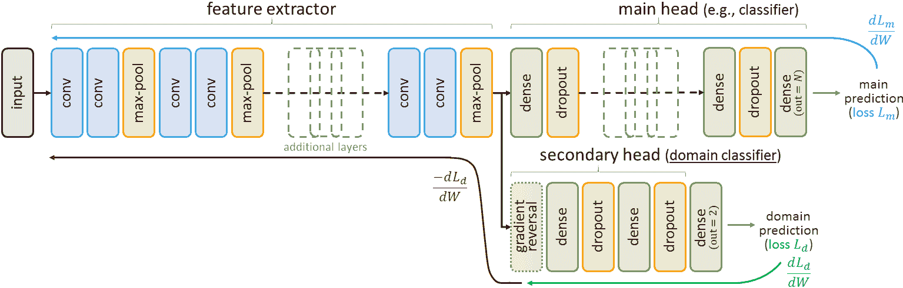

图 7-7：应用于分类器训练的 DANN 概念

通过适当控制数据流或主损失的加权，三个步骤可以在一次迭代中同时执行。这在我们为该方法专门编写的 Jupyter Notebook 中有演示。

这个框架因其巧妙而受到了广泛关注。通过*反转*来自领域分类损失的梯度（即，将其乘以 *-1*）再通过特征提取器传播，特征提取器的各层将*学习最大化这个损失*，而不是*最小化*它。这个方法被称为**对抗性**，因为次级头会不断尝试正确预测领域，而上游特征提取器将学习*混淆*它。具体来说，这使得特征提取器学习到无法用于*区分*输入图像领域的特征，但对网络的主要任务是有用的（因为主头的正常训练是并行进行的）。训练完成后，领域分类头可以被简单地丢弃。

请注意，在 TensorFlow 2 中，操控特定操作的梯度是非常直接的。可以通过应用 `@tf.custom_gradient` 装饰器（参考文档 [`www.tensorflow.org/api_docs/python/tf/custom_gradient`](https://www.tensorflow.org/api_docs/python/tf/custom_gradient)）到函数，并提供自定义的梯度操作来完成此任务。通过这种方式，我们可以为 *DANN* 实现以下操作，操作将在特征提取器后、领域分类层之前调用，以便在反向传播时反转该点的梯度：

```py
# This decorator specifies the method has a custom gradient. Along with its normal output, the method should return the function to compute its gradient:
@tf.custom_gradient 
def reverse_gradient(x): # Flip the gradient's sign.
    y = tf.identity(x) # the value of the tensor itself isn't changed
    return y, lambda dy: tf.math.negative(dy) # output + gradient method
```

自*DANN*之后，发布了许多其他领域适应方法（例如，*ADDA* 和 *CyCaDa*），它们遵循类似的对抗性框架。

在某些情况下，目标图像的注释是可用的，但密度不符合要求（例如，当目标任务是像素级语义分割时，只有图像级类别标签）。**自动标注方法**已经被提出用于这种情况。例如，在稀疏标签的指导下，训练于源数据的模型用于预测目标训练图像的更密集标签。然后，这些源标签被添加到训练集中，以细化模型。这个过程会反复进行，直到目标标签看起来足够正确，并且基于混合数据训练的模型已经收敛。

# 领域随机化

最后，可能出现完全*没有目标数据可用于训练*的情况（没有图像，没有注释）。此时，模型的性能完全依赖于源数据集的相关性（例如，渲染的合成图像在外观上多么逼真，并且与任务的相关性有多大）。

将数据增强概念推向极限，*领域随机化*也是一种可行的方式。这个方法主要由工业专家探索，基本思路是在大范围的数据变异下训练模型（如在《*通过领域随机化将深度神经网络从模拟迁移到现实世界*》，IEEE, 2017 中所述）。举个例子，如果我们只能访问到目标物体的 3D 模型，但不知道这些物体可能会出现在什么样的场景中，我们可以使用 3D 仿真引擎生成带有大量*随机*背景、光照、场景布局等的图像。其理论是，通过足够多的变异，仿真数据对模型而言可能就像是另一种变体，只要目标领域与随机化的训练领域在某种程度上重叠，网络在训练后就不会完全没有方向。

显然，我们不能指望这样的神经网络（NNs）能表现得像那些在目标样本上训练过的网络一样好，但领域随机化是应对困境的一种合理解决方案。

# 使用 VAEs 和 GANs 生成更大或更现实的数据集

本章将介绍的第二种主要的领域适应方法将为我们提供一个机会，介绍近年来机器学习中被称为最有趣的发展之一——生成模型，尤其是*变分自编码器（VAEs）*和*生成对抗网络（GANs）*。自从这些模型被提出以来，它们就非常流行，已被应用到多种不同的解决方案中。因此，我们将在这里进行一个通用的介绍，然后再呈现这些模型如何应用于数据集生成和领域适应。

# 判别模型与生成模型

到目前为止，我们研究的大多数模型都是**判别**模型。给定一个输入`x`，它们通过学习合适的参数`W`，来返回/区分出正确的标签`y`（例如，`x`可能是输入图像，`y`可能是该图像的类别标签）。判别模型可以被解释为*函数 f(x ; W) = y*。它们也可以被解释为尝试学习*条件概率分布*，`p`(`y`|`x`)（意思是*给定 x 的情况下 y 的概率*；例如，给定一张特定的图片`x`，它的标签是*猫的图片*的概率是多少？）。

还有一个我们尚未介绍的模型类别——*生成*模型。给定一些样本，`x`，这些样本来自未知的概率分布`p`（`x`），生成模型的目标是*建模这个分布*。例如，给定一些代表猫的图像`x`，生成模型将试图推测数据分布（这些猫的图像是如何通过所有可能的像素组合形成的），从而生成新的猫图像，这些图像可能属于与`x`相同的集合。

换句话说，判别模型通过特定特征学习识别图像（例如，它可能是一张猫的图片，因为它描绘了胡须、爪子和尾巴）。生成模型则学习从输入域中抽取新的图像，重现其典型特征（例如，这是一张合理的新猫的图片，通过生成并组合典型的猫特征得到）。

作为函数，生成性 CNN 需要一个输入，可以将其处理成一张新图片。通常，它们是通过*噪声向量*进行条件化的，也就是说，`z`是从随机分布中抽样得到的张量（例如 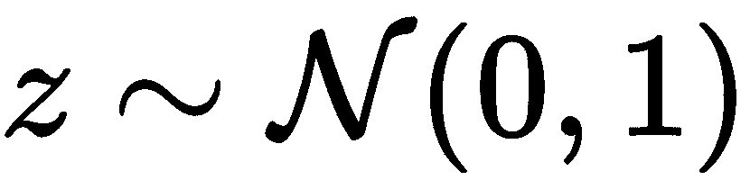，意味着`z`是从均值为 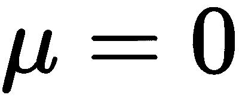 和标准差为 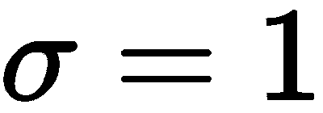的正态分布中随机抽样得到的）。对于每一个接收到的随机输入，模型都会提供一个从它们学会建模的分布中生成的新图像。当标签可用时，生成性网络还可以通过标签进行条件化，`y`。在这种情况下，它们需要建模条件分布，`p`(`x`|`y`)（例如，考虑标签`y` = "cat"，那么抽取特定图像`x`的概率是多少？）

根据大多数专家的观点，生成模型是机器学习下一阶段的关键。为了能够生成大量且多样的新数据，尽管其参数数量有限，网络必须提炼数据集，以揭示其结构和关键特征。它们必须*理解*数据。

# VAE

虽然自编码器也可以学习数据分布的某些方面，但它们的目标仅仅是重建编码后的样本，也就是说，通过编码后的特征*辨别*出原始图像，而不是从所有可能的像素组合中重建它们。标准自编码器并不旨在*生成*新的样本。如果我们随机从它们的潜在空间中抽取一个*编码*向量，那么从它们的解码器中得到一张无意义的图像的可能性是非常高的。这是因为它们的潜在空间没有约束，通常*不是连续的*（也就是说，潜在空间中通常有很大一部分区域并不对应任何有效图像）。

**变分自编码器**（**VAE**）是一种特别的自编码器，旨在具有连续的潜在空间，因此它们被用作生成模型。VAE 的编码器不是直接提取与图像`x`对应的编码，而是提供潜在空间中图像所属于分布的简化估计。

通常，编码器被构建为返回两个向量，分别表示多元正态分布的均值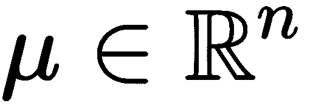和标准差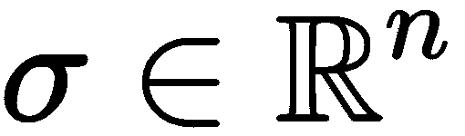（针对`n`维潜在空间）。形象地说，均值表示图像在潜在空间中的*最可能*位置，而标准差控制围绕该位置的圆形区域的大小，该区域也是图像*可能存在的地方*。从编码器定义的这个分布中，选取一个随机编码`z`并传递给解码器。解码器的任务是基于`z`恢复图像`x`。由于相同图像的`z`可能会有所变化，解码器必须学会处理这些变化，以返回输入图像。

为了说明它们之间的区别，自编码器和 VAE 并排显示在*图 7-8*中：

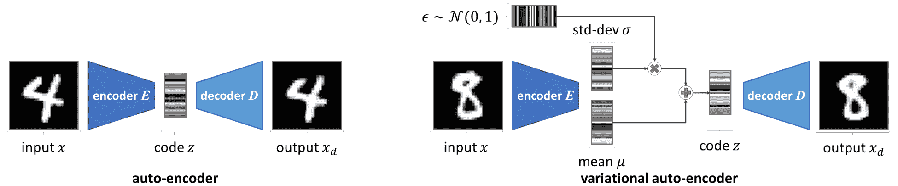

图 7-8：标准自编码器与变分自编码器的比较

梯度无法通过随机采样操作反向传播。为了能够在尽管有采样 `z` 的情况下通过编码器反向传播损失，采用了**重参数化技巧**。该操作通过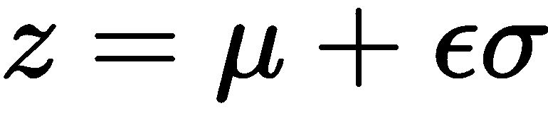来近似，而不是直接采样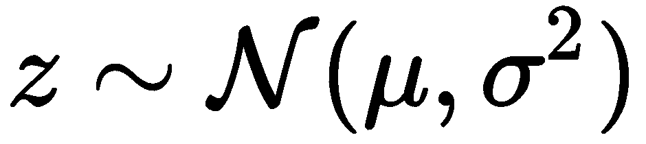，并且有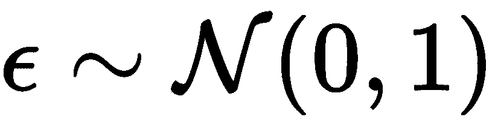。通过这种方式，`z` 可以通过可导操作获得，将视为一个随机向量，作为额外的输入传递给模型。

在训练过程中，一个损失—通常是**均方误差**（**MSE**）—衡量输出图像与输入图像的相似度，就像我们在标准自编码器中做的一样。然而，VAE 模型中还添加了另一个损失，以确保其编码器估计的分布是明确的。如果没有这个约束，VAE 可能会表现得像普通的自编码器，返回空值和作为图像的编码。这个第二个损失基于**Kullback–Leibler 散度**（以其创始人的名字命名，通常缩写为*KL 散度*）。KL 散度度量两个概率分布之间的差异。它被转化为一个损失，以确保编码器定义的分布足够接近标准正态分布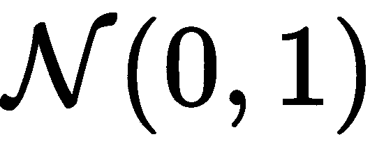。

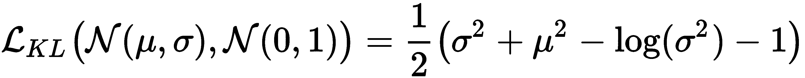

通过这种重参数化技巧和 KL 散度，自编码器变成了强大的生成模型。一旦模型训练完成，它们的编码器可以被丢弃，解码器可以直接用来生成新的图像，只需将随机向量作为输入！[](img/1e481d38-a9c2-48fb-978f-aa41debe27a4.png)。例如，*图 7-9* 显示了一个简单卷积变分自编码器（VAE）生成的图像网格，该 VAE 的潜在空间维度为*n = 2*，经过训练以生成类似 MNIST 的图像（更多细节和源代码可以在 Jupyter Notebook 中找到）：

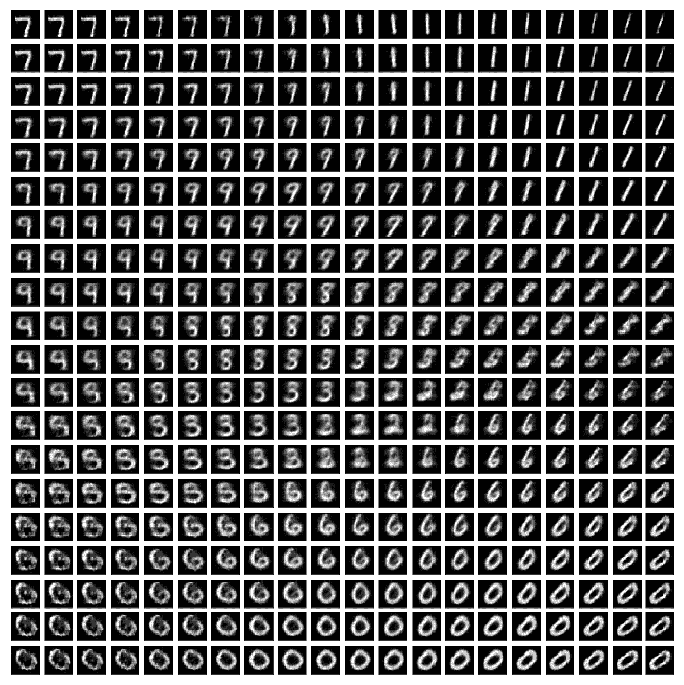

图 7-9：由简单 VAE 生成的图像网格，训练以生成类似 MNIST 的结果

为了生成这个网格，不同的向量`z`不是随机选取的，而是通过采样均匀覆盖 2D 潜在空间的一部分，因此生成的网格图展示了`z`从（*-1.5, -1.5*）到（*1.5, 1.5*）变化时的输出图像。我们因此可以观察到潜在空间的连续性，生成图像的内容从一个数字到另一个数字有所变化。

# GANs

生成对抗网络（GANs）最早由蒙特利尔大学的 Ian Goodfellow 等人于 2014 年提出，毫无疑问，它们是生成任务中最受欢迎的解决方案。

正如其名字所示，GANs 使用对抗性方案，因此它们可以以无监督的方式进行训练（这个方案启发了本章前面介绍的*DANN*方法）。在仅有一组图像`x`的情况下，我们希望训练一个*生成器*网络来建模`p`(`x`)，也就是说，生成新的有效图像。因此，我们没有适当的真实标签数据可以用来直接与新图像进行比较（因为它们是*新的*）。无法使用典型的损失函数时，我们将生成器与另一个网络——**判别器**对抗。

判别器的任务是评估一张图像是否来自原始数据集（*真实*图像），还是由另一个网络生成（*伪造*图像）。类似于*DANN*中的领域判别头，判别器作为二分类器以监督方式进行训练，使用隐式图像标签（*真实*与*伪造*）进行训练。在与判别器对抗的过程中，生成器试图欺骗判别器，通过噪声向量`z`生成新的图像，使判别器认为它们是*真实*图像（即，从*p(x)*中采样的图像）。

当判别器预测生成图像的二分类时，其结果会通过反向传播传递回生成器。生成器因此从*判别器的反馈*中学习。例如，如果判别器学会检查图像中是否有胡须来标记其为*真实*（如果我们想要创建猫的图像），那么生成器就会从反向传播中接收到这一反馈，并学会画胡须（即使只有判别器接收到实际猫图像！）。*图 7-10* 通过生成手写数字图像来说明 GAN 的概念：

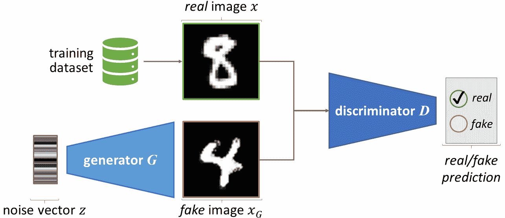

图 7-10：GAN 表示

GANs 的灵感来源于 *博弈论*，它们的训练可以解释为一个 *二人零和极小极大博弈*。博弈的每一阶段（即每次训练迭代）如下进行：  

1.  生成器 `G` 接收 `N` 个噪声向量 `z`，并输出相同数量的图像 `x[G]`[.]  

1.  这些 𝑁 个 *虚假的* 图像与 `N` 个从训练集中挑选出来的 *真实的* 图像 `x` 混合在一起。  

1.  判别器 `D` 在这个混合批次上进行训练，试图估计哪些图像是 *真实的*，哪些是 *虚假的*。  

1.  生成器 `G` 在另一个 `N` 个噪声向量的批次上进行训练，试图生成图像，使得 `D` 假设它们是真实的。

因此，在每次迭代中，判别器 `D`（由 `P`[`D`] 参数化）试图最大化博弈奖励 `V`(`G`, `D`)，而生成器 `G`（由 `P`[`G`] 参数化）试图最小化它：  

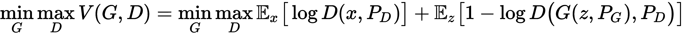  

注意，这个方程假设标签 *真实* 为 1，标签 *虚假* 为 0。*V(G, D*) 的第一项代表判别器 `D` 对图像 `x` 是 *真实的* 的平均对数概率估计（`D` 应该返回 1 对每一个）。第二项代表 `D` 对生成器输出是 *虚假的* 的平均对数概率估计（`D` 应该返回 0 对每一个）。因此，这个奖励 *V(G, D*) 被用来训练判别器 `D`，作为一个分类度量，`D` 必须最大化这个度量（尽管在实践中，人们更习惯于训练网络最小化 - *V(G, D*)，以减少损失）。  

从理论上讲，*V(G, D*) 也应该用于训练生成器 `G`，作为一个值，目的是最小化这个值。然而，如果 `D` 变得过于自信，它的第二项的梯度将会 *消失*，趋近于 0（因为第一项相对于 `P`[`G`] 的导数始终为零，因为 `P`[`G`] 在其中不起作用）。这种消失梯度可以通过一个小的数学变化避免，使用以下损失来训练 `G`：  

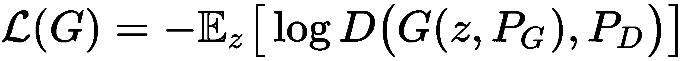  

根据博弈论，这个 *极小极大* *博弈* 的结果是 `G` 和 `D` 之间的 *均衡*（称为 **纳什均衡**，以数学家约翰·福布斯·纳什 Jr. 的名字命名，他定义了这个概念）。虽然在 GANs 中很难实现，但训练应该最终使 `D` 无法区分 *真实* 和 *虚假*（即 `D`(`x`) = ¹/[2] 和 *D(G(z))* = ¹/[2] 对所有样本成立），同时使 `G` 模拟目标分布 *p(x)*。  

尽管训练困难，GANs 可以产生非常真实的结果，因此常用于生成新的数据样本（GANs 可应用于任何数据模态：图像、视频、语音、文本等）。  

虽然变分自编码器（VAE）较容易训练，但生成对抗网络（GANs）通常返回更清晰的结果。使用均方误差（MSE）评估生成的图像时，VAE 的结果可能略显模糊，因为模型倾向于返回平均图像以最小化该损失。而 GANs 中的生成器无法采用这种方式作弊，因为判别器可以轻松识别模糊的图像为 *虚假*。VAE 和 GANs 都可以用于生成更大的训练数据集，以进行图像级别的识别（例如，准备一个 GAN 生成新的 *狗* 图像，另一个生成新的 *猫* 图像，用于在更大的数据集上训练 *狗* 对 *猫* 分类器）。

VAE 和 GANs 都在提供的 Jupyter Notebooks 中得到了实现。

# 使用条件生成对抗网络（GANs）扩增数据集

生成对抗网络（GANs）的另一个重要优势是它们可以通过任何类型的数据进行条件化。**条件生成对抗网络**（**cGANs**）可以被训练来建模 *条件分布 p(x|y)*，即生成根据一组输入值 `y` 条件化的图像（参见生成模型的介绍）。条件输入 `y` 可以是图像、类别或连续标签、噪声向量等，或者它们的任何组合。

在条件生成对抗网络（GANs）中，判别器被修改为接收图像 `x`（真实或虚假）及其对应的条件变量 `y`，作为配对输入（即 `D`(`x`, `y`)）。尽管其输出仍然是介于 `0` 和 `1` 之间的值，用于衡量输入看起来有多“真实”，其任务略有变化。为了被视为*真实*，图像不仅需要看起来像是从训练数据集中绘制的，还应该与其配对变量相对应。

举个例子，假设我们想要训练一个生成器 `G`，用来生成手写数字的图像。如果这个生成器能够根据请求生成特定数字的图像，那么它会更加有用，而不是生成随机数字的图像（即，*生成一个图像，其* `y` *= 3*，其中 `y` 是类别数字标签）。如果判别器没有给定 `y`，生成器将学习生成真实的图像，但不能确定这些图像是否展示了所需的数字（例如，我们可能从 `G` 得到一个真实的 `5` 图像，而不是 `3`）。将条件信息提供给 `D` 后，网络将立即发现不对应 `y` 的虚假图像，迫使 `G` 有效地建模 *p(x|y)*。

由 Phillip Isola 等人（来自伯克利 AI 研究中心）提出的*Pix2Pix*模型是一种著名的图像到图像条件 GAN（即，`y`是图像），它在多个任务中得到了演示，例如将手绘草图转换为图片、将语义标签转换为实际图片等（*Image-to-image translation with conditional adversarial networks*，IEEE，2017）。虽然*Pix2Pix*在监督学习的背景下表现最好，当目标图像可用并能为 GAN 目标添加 MSE 损失时，更新的解决方案移除了这一约束。例如，*CycleGAN*（由 Jun-Yan Zhu 等人从伯克利 AI 研究中心提出，2017 年 IEEE 发表，与*Pix2Pix*作者合作）或*PixelDA*（由 Konstantinos Bousmalis 和 Google Brain 的同事提出，*Unsupervised pixel-level domain adaptation with generative adversarial networks*，IEEE，2017）便是这样的例子。

像其他近期的条件 GAN 一样，*PixelDA*可以作为一种领域适应方法，用于将源领域的训练图像映射到目标领域。例如，*PixelDA*生成器可以应用于生成逼真的合成图像版本，从一小组未标注的真实图像中进行学习。因此，它可以用于增强合成数据集，以使在其上训练的模型不那么受限于现实差距。

尽管主要以艺术应用而闻名（GAN 生成的肖像已经在许多艺术画廊展出），生成模型是强大的工具，从长远来看，它们可能会成为理解复杂数据集的核心。但如今，尽管训练数据稀缺，它们已经被公司用来训练更强大的识别模型。

# 总结

尽管计算能力的指数级增长和更大数据集的可用性促成了深度学习时代的到来，但这并不意味着数据科学的最佳实践应该被忽视，也不意味着所有应用都能轻松获得相关数据集。

在本章中，我们深入研究了`tf.data` API，学习了如何优化数据流。接着，我们介绍了几种不同但兼容的解决方案来解决数据稀缺的问题：数据增强、合成数据生成和领域适应。后者的解决方案使我们有机会介绍了 VAEs 和 GANs 这两种强大的生成模型。

在下一章中，我们将强调定义良好的输入管道的重要性，因为我们将应用神经网络（NNs）于更高维度的数据：图像序列和视频。

# 问题

1.  给定一个张量，`a = [1, 2, 3]`，和另一个张量，`b = [4, 5, 6]`，你如何构建一个`tf.data`管道，使其能够单独输出每个值，从`1`到`6`？

1.  根据`tf.data.Options`的文档，如何确保数据集每次运行时都能以相同的顺序返回样本？

1.  我们介绍的哪些领域适应方法可以在没有目标注释的情况下用于训练？

1.  判别器在生成对抗网络（GANs）中起什么作用？

# 进一步阅读

+   *学习 OpenGL* ([`www.packtpub.com/game-development/learn-opengl`](https://www.packtpub.com/game-development/learn-opengl))，作者：Frahaan Hussain：对于有兴趣了解计算机图形学并渴望学习如何使用 OpenCV 的读者，这本书是一个很好的起点。

+   *初学者的人工智能实践* ([`www.packtpub.com/big-data-and-business-intelligence/hands-artificial-intelligence-beginners`](https://www.packtpub.com/big-data-and-business-intelligence/hands-artificial-intelligence-beginners))，作者：Patrick D. Smith：尽管这本书是为 TensorFlow 1 编写的，但它为生成网络专门分配了完整的一章。
