# 第八章：视频与递归神经网络

到目前为止，本书只讨论了静态图像。然而，在这一章中，我们将介绍应用于视频分析的技术。从自动驾驶汽车到视频流网站，计算机视觉技术已经发展出来，用以处理图像序列。

我们将介绍一种新的神经网络类型——**递归神经网络**（**RNNs**），它们专门为处理视频等序列输入而设计。作为一个实际应用，我们将它们与**卷积神经网络**（**CNNs**）结合，用来检测短视频片段中的动作。

本章将覆盖以下主题：

+   递归神经网络简介

+   长短时记忆网络的内部工作原理

+   计算机视觉模型在视频中的应用

# 技术要求

本书的 GitHub 仓库中提供了以 Jupyter notebooks 形式的注释代码，网址为[`github.com/PacktPublishing/Hands-On-Computer-Vision-with-TensorFlow-2/tree/master/Chapter08`](https://github.com/PacktPublishing/Hands-On-Computer-Vision-with-TensorFlow-2/tree/master/Chapter08)。

# 介绍 RNNs

RNNs 是一种适用于*序列*（或*递归*）数据的神经网络。序列数据的例子包括句子（词语序列）、时间序列（例如股票价格序列）或视频（帧序列）。它们属于递归数据，因为每个时间步都与前面的步骤相关。

虽然 RNNs 最初是为时间序列分析和自然语言处理任务而开发的，但现在它们已被应用于各种计算机视觉任务。

我们将首先介绍 RNNs 的基本概念，然后尝试对它们的工作原理进行一般性的理解。接着，我们将描述它们的权重如何学习。

# 基本形式

为了介绍 RNNs，我们将以视频识别为例。一个视频由 *N* 帧组成。分类一个视频的简单方法是对每一帧应用 CNN，然后对输出结果取平均值。

尽管这种方法能提供不错的结果，但它并未反映出视频中的某些部分比其他部分更为重要。而且，重要部分并不总是需要比无意义的部分更多的帧。将输出进行平均的风险在于可能会丢失重要信息。

为了避免这个问题，RNN 会将视频的所有帧依次处理，从第一帧到最后一帧。RNN 的主要特点是能够有效地结合所有帧的特征，从而生成有意义的结果。

我们并不会直接将 RNN 应用于帧的原始像素。如本章稍后所述，我们首先使用 CNN 生成一个特征体积（一个特征图的堆叠）。特征体积的概念在第三章，*现代神经网络*中有详细介绍。提醒一下，特征体积是 CNN 的输出，通常表示的是具有较小维度的输入。

为了实现这一点，RNN 引入了一个新的概念，叫做**状态**。状态可以看作是 RNN 的记忆。在实践中，*状态*是一个浮动矩阵。*状态*最初是一个零矩阵，并在每一帧视频中进行更新。过程结束时，最终状态被用来生成 RNN 的输出。

RNN 的主要组件是 **RNN 单元**，我们将对每一帧应用该单元。一个单元接受的输入包括 *当前帧* 和 *上一个状态*。对于由 *N* 帧组成的视频，简单递归网络的展开表示如图 *8-1* 所示：

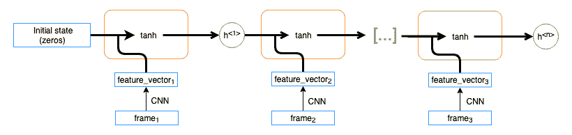

图 8-1：基本 RNN 单元

具体来说，我们从一个空状态 (*h^(<0>)* ) 开始。第一步，单元将当前状态 (*h^(<0>)* ) 与当前帧 (frame[1]) 结合生成新的状态 (*h^(<1>)* )。然后，相同的过程会应用于接下来的帧。过程结束时，我们会得到最终状态 (*h^(<n>)* )。

请注意这里的术语——*RNN* 指的是接收图像并返回最终输出的组件。*RNN 单元* 指的是将一帧和当前状态结合起来，并返回下一个状态的子组件。

在实践中，单元将当前状态和帧结合起来生成新的状态。这个组合是根据以下公式进行的：

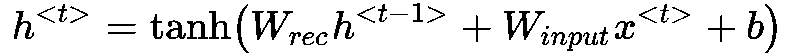

在公式中，以下内容适用：

+   *b* 是偏置。

+   *W[rec]* 是递归权重矩阵，*W[input]* 是权重矩阵。

+   *x^(<t>)* 是输入。

+   *h*^(*<t-1>*)^> 是当前状态，*h*^(<t>)* 是新状态。

隐藏状态不是直接使用的。会使用一个权重矩阵 *V* 来计算最终的预测：

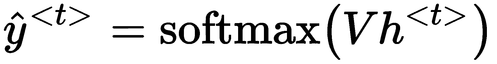

在本章中，我们将使用尖括号 (*< >*) 来表示时间信息。其他来源可能使用不同的约定。然而，请注意，带有帽子的 *y*（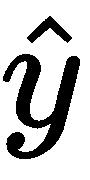）通常表示神经网络的预测，而 *y* 则表示真实值。

在应用于视频时，RNN 可以用于对整个视频或每一帧进行分类。在前一种情况下，例如，在预测视频是否暴力时，只有最终的预测 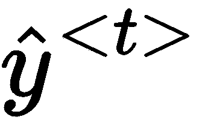 会被使用。在后一种情况下，例如，为了检测哪些帧可能包含裸露内容，每个时间步的预测都会被使用。

# RNN 的一般理解

在详细说明网络如何学习 *W[input]*、*W[rec]* 和 *V* 的权重之前，我们先尝试大致了解基本的 RNN 是如何工作的。一般来说，*W[input]* 会影响结果，如果输入中的某些特征进入了隐藏状态，*W[rec]* 会影响结果，如果某些特征停留在隐藏状态中。

让我们用具体的例子来说明——分类暴力视频和舞蹈视频。

由于枪声通常是非常突然而短暂的，它只会出现在视频中的少数几帧中。理想情况下，网络将学习 *W[input]*，以便当 *x^(<t>)* 包含枪声信息时，*暴力视频* 的概念会被加入到状态中。此外，*W[rec]*（在前面方程中定义）必须以一种防止 *暴力* 概念从状态中消失的方式进行学习。这样，即使枪声只出现在视频的前几帧，视频仍然会被分类为暴力视频（见 *图 8-2*）。

然而，为了对舞蹈视频进行分类，我们需要采用另一种行为。理想情况下，网络应该学习 *W[input]*，因此，例如，当 *x^(<t>)* 包含看起来像在跳舞的人时，*舞蹈* 的概念只会轻微地增加到状态中（见 *图 8-2*）：

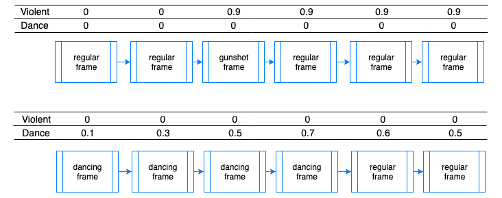

图 8-2：隐藏状态应如何根据视频内容演变的简化表示

确实，如果输入的是一段体育视频，我们不希望某一帧被错误地分类为 *跳舞的人*，进而改变我们的状态为 *跳舞*。由于舞蹈视频大多由包含跳舞人物的帧组成，通过逐步递增状态，我们可以避免误分类。

此外，*W[rec]* 必须被学习，以使 *舞蹈* 概念逐渐从状态中消失。这样，如果视频的开头是关于舞蹈的，但整个视频并不是舞蹈视频，它就不会被分类为舞蹈视频。

# 学习 RNN 权重

实际上，网络的状态比前面例子中仅包含每个类别的权重的向量要复杂得多。*W[input]*、*W[rec]* 和 *V* 的权重无法手工设计。幸运的是，它们可以通过 **反向传播** 进行学习。该技术在第一章，*计算机视觉与神经网络* 中有详细介绍。一般的思路是通过根据网络所犯的错误来修正权重，从而学习这些权重。

# 通过时间的反向传播

然而，对于 RNN，我们不仅通过网络的深度进行反向传播误差，还需要通过时间进行反向传播。首先，我们通过对所有时间步的个体损失（*L*）求和来计算总损失：

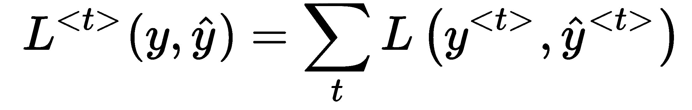

这意味着我们可以单独计算每个时间步的梯度。为了大大简化计算，我们将假设 *tanh* = *identity*（也就是说，我们假设没有激活函数）。例如，在 *t* = *4* 时，我们将通过应用链式法则来计算梯度：

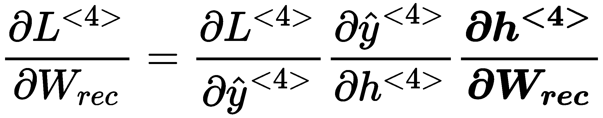

在这里，我们遇到了一种复杂性——方程右侧的第三项（加粗部分）无法轻易求导。实际上，要对 *h^(<4>)* 关于 *W[rec]* 求导，所有其他项不能依赖于 *W[rec]*。然而，*h^(<4>)* 也依赖于 *h^(<3>)*，而 *h^(<3>)* 又依赖于 *W[rec]*，因为 *h^(<3>)* = *tanh* (*W**[rec] h^(<2>)* + *W**[input] x^(<3>)* + *b*)，以此类推，直到我们到达 *h^(<0>)*，它完全由零组成。

为了正确地推导这个项，我们在这个偏导数上应用全微分公式：

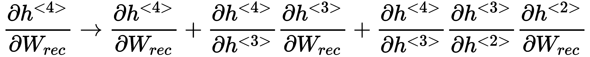

乍一看，似乎有些奇怪：一个项等于它自己加上其他（非零）项。然而，由于我们正在对一个偏导数进行全微分，我们需要考虑所有项，以生成梯度。

通过注意到其他所有项保持不变，我们可以得到以下方程：

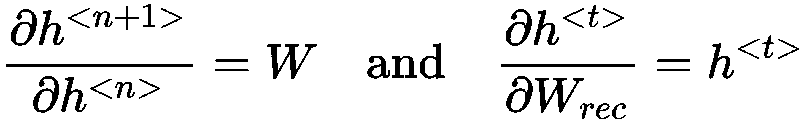

因此，之前呈现的偏导数可以表示为如下：

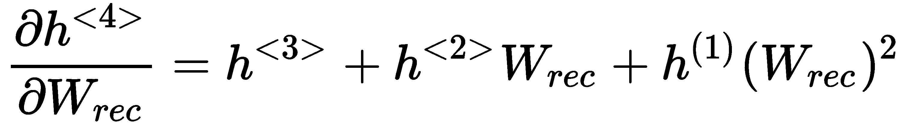

总结来说，我们注意到梯度将依赖于所有之前的状态以及 *W[rec]*。这个概念被称为 **时间反向传播**（**BPTT**）。由于最新的状态依赖于它之前的所有状态，因此考虑这些状态来计算误差是有意义的。当我们将每个时间步的梯度相加以计算总梯度时，并且由于对于每个时间步，我们必须回到第一个时间步来计算梯度，因此涉及大量的计算。因此，RNN 在训练时往往非常慢。

此外，我们可以将之前的公式推广，表明 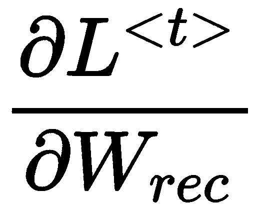 依赖于 *W[rec]* 的 *t-2* 次方。当 *t* 较大时，这非常棘手。事实上，如果 *W[rec]* 的项小于 1，随着指数的增大，它们变得非常小。更糟糕的是，如果这些项大于 1，梯度将趋向于无穷大。这些现象分别被称为 **梯度消失** 和 **梯度爆炸**（它们在第四章中有描述，*影响力分类工具*）。幸运的是，存在一些解决方法可以避免这个问题。

# 截断反向传播

为了避免长时间的训练过程，可以选择每 *k[1]* 个时间步计算一次梯度，而不是每一步计算一次。这将梯度计算的次数除以 *k[1]*，使得网络的训练更加迅速。

我们可以将反向传播限制在 *k[2]* 步之前，而不是遍历所有时间步。这有效地限制了梯度消失，因为梯度最多只会依赖于 *W^(k[2])*。这也限制了计算梯度所需的计算量。然而，网络将不太可能学习长期的时间关系。

这两种技术的结合被称为 **截断反向传播**，其两个参数通常被称为 *k[1]* 和 *k[2]*。它们必须进行调整，以确保在训练速度和模型性能之间达到良好的平衡。

这个技术——尽管强大——仍然是解决一个基本 RNN 问题的权宜之计。在接下来的章节中，我们将介绍一种架构的改变，可以用来彻底解决这个问题。

# 长短期记忆单元

正如我们之前看到的，常规 RNN 存在梯度爆炸问题。因此，有时候它们很难学习数据序列中的长期关系。此外，它们将信息存储在单一的状态矩阵中。例如，如果枪声发生在一个非常长的视频的开始部分，到视频结束时，RNN 的隐藏状态很可能已经被噪声覆盖。这个视频可能不会被分类为暴力内容。

为了解决这两个问题，Sepp Hochreiter 和 Jürgen Schmidhuber 在他们的论文（*Long Short-Term Memory*，*Neural Computation*，1997）中提出了基本 RNN 的一种变种——**长短期记忆**（**LSTM**）单元。多年来，这一方法有了显著的改进，并引入了许多变体。在本节中，我们将概述其内部工作原理，并展示为什么梯度消失问题不再那么严重。

# LSTM 的基本原理

在详细介绍 LSTM 单元背后的数学原理之前，我们先尝试理解它是如何工作的。为此，我们将以一个应用于奥林匹克运动会的实时分类系统为例。该系统必须检测每一帧中正在进行的运动项目。

如果网络看到人们站成一排，它能推测是什么运动吗？是足球运动员在唱国歌，还是运动员准备跑 100 米比赛？如果没有关于前面几帧发生了什么的信息，预测就不会准确。我们之前介绍的基本 RNN 架构能够将这些信息存储在隐藏状态中。然而，如果运动项目是一个接一个交替出现的，那么这将变得更加困难。事实上，状态被用来生成当前的预测。基本 RNN 无法存储那些它不会立即使用的信息。

LSTM 架构通过存储一个被称为**单元状态**的记忆矩阵来解决这个问题，它被表示为 *C^(<t>)*。在每个时间步，*C^(<t>)* 包含当前状态的信息。但这些信息不会直接用于生成输出。相反，它将通过一个*门*进行过滤。

注意，LSTM 的单元状态与简单 RNN 的状态不同，如下方程所示。LSTM 的单元状态在转化为最终状态之前会经过过滤。

门是 LSTM 单元的核心思想。一个门是一个矩阵，将与 LSTM 中的另一个元素逐项相乘。如果门的所有值为*0*，则其他元素的信息将无法通过。另一方面，如果门的值接近*1*，则所有其他元素的信息都将通过。

提醒一下，逐项相乘的示例（也称为**元素级乘法**或**哈达玛积**）可以如下表示：

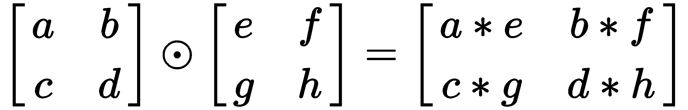

在每个时间步长，利用当前输入和前一输出计算三个门矩阵：

+   **输入门**：应用于输入，以决定哪些信息能通过。在我们的示例中，如果视频显示的是观众成员，我们可能不希望使用此输入来生成预测。此时，门的值大多为零。

+   **遗忘门**：应用于单元状态，以决定忘记哪些信息。在我们的示例中，如果视频展示的是讲解员在讲话，我们可能希望忘记当前的运动项目，因为接下来可能会展示新的运动项目。

+   **输出门**：将与单元状态相乘，以决定哪些信息被输出。我们可能希望在单元状态中保留先前的体育项目为足球这一事实，但这对于当前帧并没有用处。输出此信息可能会扰乱接下来的时间步。通过将门的值设为接近零，我们可以有效地将此信息保留到后面。

在下一部分，我们将介绍如何计算这些门和候选状态，并展示为什么 LSTM 在梯度消失问题上影响较小。

# LSTM 内部工作原理

首先，让我们详细说明门是如何计算的：

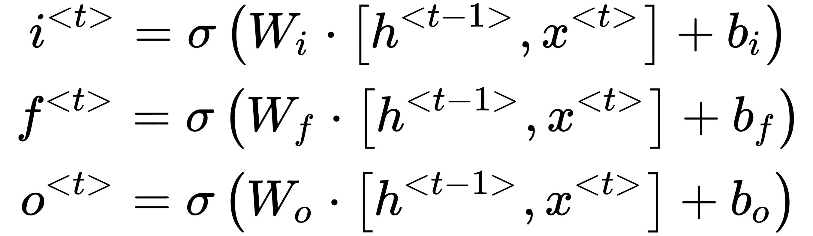

如前面方程所述，三个门是通过相同的原理计算的——将权重矩阵 (*W*) 与前一输出 (*h^(<t-1>)*) 和当前输入 (*x^(<t>)*）相乘。请注意，激活函数是 sigmoid（σ）。因此，门的值始终介于*0*和*1*之间。

候选状态（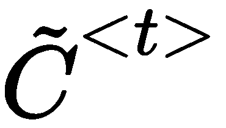）以类似方式计算。然而，所使用的激活函数是双曲正切函数，而非 sigmoid 函数：

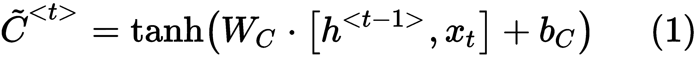

请注意，这个公式与在基本 RNN 架构中用于计算*h^(<t>)*的公式完全相同。然而，*h^(<t>)* 是*隐藏状态*，而在这种情况下，我们计算的是**候选单元状态**。为了计算新的单元状态，我们将前一个单元状态与候选单元状态结合。两个状态分别通过遗忘门和输入门进行控制：

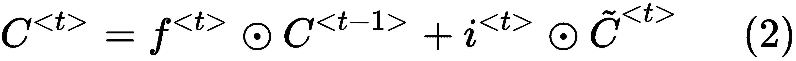

最后，LSTM 隐藏状态（输出）将从单元状态计算如下：

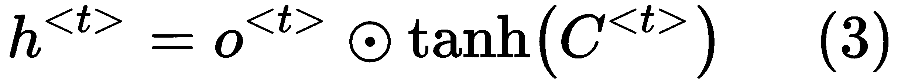

LSTM 单元的简化表示如*图 8-3*所示：

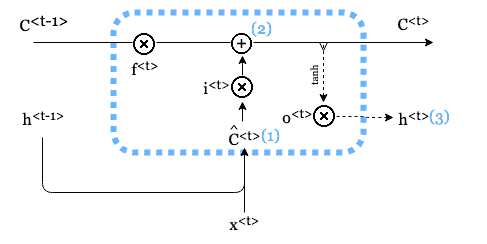

图 8-3：LSTM 单元的简化表示。门控计算已省略

LSTM 权重同样通过时间反向传播进行计算。由于 LSTM 单元中存在众多信息路径，梯度计算变得更加复杂。然而，我们可以观察到，如果遗忘门的项*f^(<t>)*接近*1*，则信息可以从一个单元状态传递到另一个单元状态，如下方公式所示：

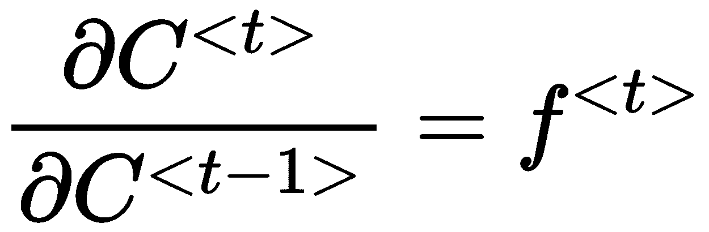

因此，通过将遗忘门偏置初始化为全为 1 的向量，我们可以确保信息能够通过多个时间步进行反向传播。这样，LSTM 在梯度消失问题上表现得较少。

这标志着我们对 RNN 的介绍结束；我们现在可以开始进行视频的实际分类。

# 视频分类

从电视到网络流媒体，视频格式越来越受欢迎。自计算机视觉诞生以来，研究人员一直尝试将计算机视觉应用于多张图像的处理。尽管最初受到计算能力的限制，但最近他们已经开发出了强大的视频分析技术。在本节中，我们将介绍与视频相关的任务，并详细介绍其中之一——视频分类。

# 将计算机视觉应用于视频

在每秒 30 帧的情况下，处理每一帧视频意味着每分钟需要分析*30 × 60* = *180* 帧。这一问题在计算机视觉早期阶段就已经出现，在深度学习兴起之前。当时，开发出了高效的视频分析技术。

最明显的技术是**采样**。我们可以每秒分析一到两帧，而不是分析所有帧。虽然这样更高效，但如果一个重要场景短暂出现，例如之前提到的枪声，我们可能会失去信息。

更高级的技术是**场景提取**。这对于分析电影特别流行。算法检测视频何时从一个场景切换到另一个场景。例如，如果镜头从特写镜头切换到广角镜头，我们将分析每个镜头中的一帧。即使特写镜头非常短，而广角镜头跨越多个帧，我们也只会从每个镜头中提取一帧。*场景提取*可以通过使用快速高效的算法来完成。它们处理图像的像素，并评估两个连续帧之间的变化。大的变化意味着场景切换。

此外，所有在第一章中描述的与图像相关的任务，*计算机视觉与神经网络*，也适用于视频。例如，超分辨率、分割和风格迁移通常针对视频进行。但视频的时间维度创造了新的应用形式，具体体现在以下特定于视频的任务中：

+   **动作检测**：这是视频分类的一个变种，目标是分类一个人正在完成的动作。动作从跑步到踢足球不等，甚至可以精确到表演的舞蹈类型或演奏的乐器。

+   **下一帧预测**：给定*N*连续帧，预测第*N+1*帧的样子。

+   **超慢动作**：这也叫做**帧插值**。模型需要生成中间帧，以使慢动作看起来不那么卡顿。

+   **物体跟踪**：这通常使用传统的计算机视觉技术，如描述符来执行。然而，现在已经采用深度学习来跟踪视频中的物体。

在这些特定于视频的任务中，我们将重点介绍动作检测。在下一节中，我们将介绍一个动作视频数据集，并介绍如何将 LSTM 单元应用于视频。

# 使用 LSTM 对视频进行分类

我们将使用*UCF101*数据集（[`www.crcv.ucf.edu/data/UCF101.php`](https://www.crcv.ucf.edu/data/UCF101.php)），该数据集由 K. Soomro 等人编制（请参阅*UCF101：来自野外视频的 101 个人类动作类别数据集*，CRCV-TR-12-01，2012）。以下是数据集中的一些示例：

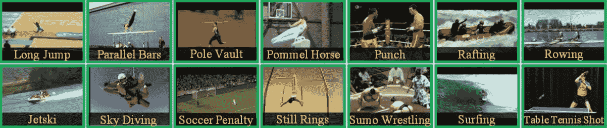

图 8-4：UCF101 数据集中的示例图像

该数据集包含 13,320 个视频片段。每个片段包含一个人执行 101 种可能动作中的一种。

为了对视频进行分类，我们将采用两步过程。事实上，递归网络并不会直接输入原始的像素图像。虽然理论上可以直接输入完整图像，但在此之前使用 CNN 特征提取器来减少维度，并减少 LSTM 的计算量。因此，我们的网络架构可以通过*图 8-5*表示：

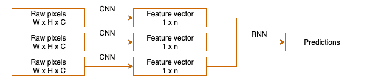

图 8-5：结合 CNN 和 RNN 进行视频分类。在这个简化的示例中，序列长度为 3

如前所述，通过 RNN 反向传播错误是困难的。虽然我们可以从头开始训练 CNN，但这将花费大量时间并得到不理想的结果。因此，我们使用预训练网络，应用第四章《有影响力的分类工具》中介绍的迁移学习技术。

出于同样的原因，通常不对 CNN 进行微调，并保持其权重不变，因为这样不会带来性能提升。由于 CNN 在整个训练周期中保持不变，因此特定帧始终返回相同的特征向量。这使我们能够*缓存*特征向量。由于 CNN 步骤是最耗时的，缓存结果意味着只需计算一次特征向量，而不是每个周期都计算，从而节省大量训练时间。

因此，我们将视频分为两个步骤进行分类。首先，我们将提取特征并缓存它们。一旦完成此操作，我们将在提取的特征上训练 LSTM。

# 从视频中提取特征

为了生成特征向量，我们将使用在 ImageNet 数据集上训练过的预训练 Inception 网络来对图像进行分类。

我们将移除最后一层（全连接层），仅保留最大池化操作后生成的特征向量。

另一个选择是保留平均池化层之前的输出，即高维特征图。然而，在我们的示例中，我们不需要空间信息——无论动作发生在画面中央还是角落，预测结果都会相同。因此，我们将使用二维最大池化层的输出。这将加速训练，因为 LSTM 的输入将比原来小 64 倍（*64* = *8* × *8* = 输入图像大小为 *299* × *299* 的特征图大小）。

TensorFlow 允许我们通过一行代码访问预训练模型，如第四章《有影响力的分类工具》中所描述：

```py
inception_v3 = tf.keras.applications.InceptionV3(include_top=False, weights='imagenet')
```

我们添加最大池化操作，将*8* × *8* × *2,048* 的特征图转换为*1* × *2,048* 的向量：

```py
x = inception_v3.output
pooling_output = tf.keras.layers.GlobalAveragePooling2D()(x)

feature_extraction_model = tf.keras.Model(inception_v3.input, pooling_output)
```

我们将使用`tf.data` API 从视频中加载帧。一个初步问题是——所有视频的长度不同。以下是帧数的分布情况：

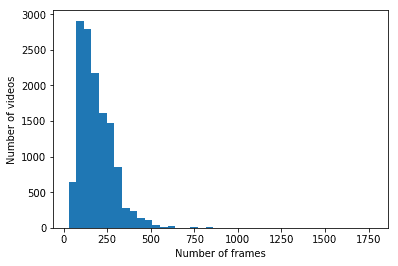

图 8-6：UCF101 数据集中每个视频的帧数分布

在使用数据之前，最好进行快速分析。手动检查数据并绘制分布图可以节省大量实验时间。

在 TensorFlow 中，与大多数深度学习框架一样，批次中的所有示例必须具有相同的长度。为满足此要求，最常见的解决方案是*padding*（填充）——我们用实际数据填充前几个时间步，将最后几个时间步填充为零。

在我们的案例中，我们不会使用视频中的所有帧。每秒 25 帧的情况下，大多数帧看起来相似。通过只使用一部分帧，我们可以减少输入的大小，从而加快训练过程。为了选择这个子集，我们可以使用以下任意一种选项：

+   每秒提取*N*帧。

+   从所有帧中采样*N*帧。

+   将视频分段为场景并从每个场景中提取*N*帧，如下图所示：

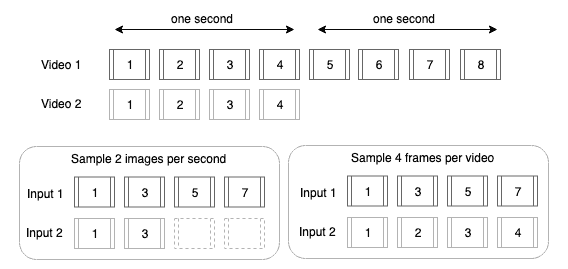

图 8-7：两种采样技术的比较。虚线矩形表示零填充

由于视频长度的巨大变化，每秒提取*N*帧也会导致输入长度的巨大变化。虽然可以通过填充解决这个问题，但我们最终会得到一些几乎全部由零组成的输入——这可能导致训练性能不佳。因此，我们将从每个视频中采样*N*张图像。

我们将使用 TensorFlow 数据集 API 将输入馈送到我们的特征提取网络：

```py
dataset = tf.data.Dataset.from_generator(frame_generator,
             output_types=(tf.float32, tf.string),
             output_shapes=((299, 299, 3), ())
```

在之前的代码中，我们指定了输入类型和输入形状。我们的生成器将返回形状为*299* × *299*的图像，并且具有三个通道，还会返回一个表示文件名的字符串。文件名稍后将用于根据视频对帧进行分组。

`frame_generator`的作用是选择将由网络处理的帧。我们使用 OpenCV 库从视频文件中读取数据。对于每个视频，我们每隔*N*帧采样一张图像，其中*N*等于`num_frames / SEQUENCE_LENGTH`，而`SEQUENCE_LENGTH`是 LSTM 输入序列的大小。该生成器的简化版本如下所示：

```py
def frame_generator():
    video_paths = tf.io.gfile.glob(VIDEOS_PATH)
    for video_path in video_paths:
        capture = cv2.VideoCapture(video_path)
        num_frames = int(cap.get(cv2.CAP_PROP_FRAME_COUNT))
        sample_every_frame = max(1, num_frames // SEQUENCE_LENGTH)
        current_frame = 0

        label = os.path.basename(os.path.dirname(video_path))
        while True:
            success, frame = capture.read()
            if not success:
                break

            if current_frame % sample_every_frame == 0:
                img = preprocess_frame(frame)
                yield img, video_path

            current_frame += 1
```

我们遍历视频的帧，只处理其中的一部分。在视频结束时，OpenCV 库将返回`success`为`False`，循环将终止。

注意，与任何 Python 生成器一样，我们不是使用`return`关键字，而是使用`yield`关键字。这样我们可以在循环结束之前就开始返回帧。这样，网络可以在不等待所有帧预处理完成的情况下开始训练。

最后，我们遍历数据集以生成视频特征：

```py
dataset = dataset.batch(16).prefetch(tf.data.experimental.AUTOTUNE)
current_path = None
all_features = []

for img, batch_paths in tqdm.tqdm(dataset):
    batch_features = feature_extraction_model(img)

    for features, path in zip(batch_features.numpy(), batch_paths.numpy()):
        if path != current_path and current_path is not None:
            output_path = current_path.decode().replace('.avi', '')
            np.save(output_path, all_features)
            all_features = []

        current_path = path
        all_features.append(features)
```

在之前的代码中，注意我们迭代批次输出并比较视频文件名。我们这样做是因为批次大小不一定与*N*（我们每个视频采样的帧数）相同。因此，一个批次可能包含多个连续序列的帧：

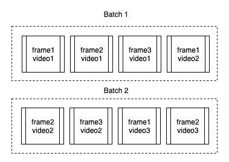

图 8-8：批次大小为四，每个视频采样三帧的输入表示

我们读取网络的输出，当遇到不同的文件名时，我们将视频特征保存到文件中。请注意，这种技术只有在帧的顺序正确时才有效。如果数据集被打乱，它将无法正常工作。视频特征会保存到与视频相同的位置，但扩展名不同（`.npy`而不是`.avi`）。

这一步会迭代数据集中 13,320 个视频，并为每个视频生成特征。每个视频采样 40 帧，使用现代 GPU 大约需要一个小时。

# 训练 LSTM

现在视频特征已生成，我们可以用它们来训练 LSTM。这个步骤与本书前面描述的训练步骤非常相似——我们定义模型和输入管道，并启动训练。

# 定义模型

我们的模型是一个简单的顺序模型，使用 Keras 层定义：

```py
model = tf.keras.Sequential([
    tf.keras.layers.Masking(mask_value=0.),
    tf.keras.layers.LSTM(512, dropout=0.5, recurrent_dropout=0.5),
    tf.keras.layers.Dense(256, activation='relu'),
    tf.keras.layers.Dropout(0.5),
    tf.keras.layers.Dense(len(LABELS), activation='softmax')
])
```

我们应用了一个 dropout，这是在第三章中介绍的概念，*现代神经网络*。LSTM 的`dropout`参数控制输入权重矩阵上应用的 dropout 量。`recurrent_dropout`参数控制对前一个状态应用的 dropout 量。与 mask 类似，`recurrent_dropout`会随机忽略部分前一状态的激活值，以避免过拟合。

我们模型的第一层是一个`Masking`层。由于我们将图像序列填充了空帧以便批处理，因此我们的 LSTM 单元会不必要地迭代这些添加的帧。添加`Masking`层可以确保 LSTM 层在遇到零矩阵之前停止在实际的序列末尾。

该模型将把视频分为 101 个类别，比如*kayaking*、*rafting*或*fencing*。然而，它只会预测一个表示预测的向量。我们需要一种方法将这 101 个类别转换成向量形式。我们将使用一种叫做**独热编码**的技术，详细说明见第一章，*计算机视觉与神经网络*。由于我们有 101 个不同的标签，我们将返回一个大小为 101 的向量。对于*kayaking*，该向量将除了第一个元素外全为零，第一个元素设置为*1*。对于*rafting*，除了第二个元素外其余全为*0*，第二个元素设置为*1*，其他类别以此类推。

# 加载数据

我们将使用生成器加载生成帧特征时产生的`.npy`文件。代码确保所有输入序列具有相同的长度，必要时会用零进行填充：

```py
def make_generator(file_list):
    def generator():
        np.random.shuffle(file_list)
        for path in file_list:
            full_path = os.path.join(BASE_PATH, path)
            full_path = full_path.replace('.avi', '.npy')

            label = os.path.basename(os.path.dirname(path))
            features = np.load(full_path)

            padded_sequence = np.zeros((SEQUENCE_LENGTH, 2048))
            padded_sequence[0:len(features)] = np.array(features)

            transformed_label = encoder.transform([label])
            yield padded_sequence, transformed_label[0]
    return generator
```

在前面的代码中，我们定义了一个 Python **闭包函数**——一个返回另一个函数的函数。这个技术使我们能够通过一个生成器函数创建`train_dataset`（返回训练数据）和`validation_dataset`（返回验证数据）：

```py
train_dataset = tf.data.Dataset.from_generator(make_generator(train_list),
                 output_types=(tf.float32, tf.int16),
                 output_shapes=((SEQUENCE_LENGTH, 2048), (len(LABELS))))
train_dataset = train_dataset.batch(16)
train_dataset = train_dataset.prefetch(tf.data.experimental.AUTOTUNE)

valid_dataset = tf.data.Dataset.from_generator(make_generator(test_list),
                 output_types=(tf.float32, tf.int16),
                 output_shapes=((SEQUENCE_LENGTH, 2048), (len(LABELS))))
valid_dataset = valid_dataset.batch(16)
valid_dataset = valid_dataset.prefetch(tf.data.experimental.AUTOTUNE)
```

我们还根据第七章中描述的最佳实践，对数据进行批处理和预取，**在复杂和稀缺数据集上训练**。

# 训练模型

训练过程与书中先前描述的非常相似，我们邀请读者参考本章附带的笔记本。使用之前描述的模型，我们在验证集上达到了 72%的精度。

这个结果可以与使用更先进技术时获得的 94%的最先进精度水平进行比较。我们的简单模型可以通过改善帧采样、使用数据增强、采用不同的序列长度，或通过优化层的大小来增强。

# 总结

我们通过描述 RNN 的基本原理扩展了对神经网络的理解。在介绍了基本 RNN 的内部工作原理后，我们将反向传播扩展到递归网络的应用。正如本章所介绍的，当应用于 RNN 时，BPTT 会遭遇梯度消失问题。可以通过使用截断反向传播，或采用不同类型的架构——LSTM 网络来解决这个问题。

我们将这些理论原则应用于一个实际问题——视频中的动作识别。通过结合 CNN 和 LSTM，我们成功地训练了一个网络，将视频分类为 101 个类别，并引入了视频特有的技术，如帧采样和填充。

在下一章中，我们将通过介绍新平台——移动设备和网页浏览器，扩展我们对神经网络应用的了解。

# 问题

1.  LSTM 相较于简单 RNN 架构的主要优势是什么？

1.  当 CNN 应用于 LSTM 之前，它的用途是什么？

1.  什么是梯度消失，为什么会发生？它为什么是个问题？

1.  梯度消失的一些解决方法有哪些？

# 进一步阅读

+   *Python 快速入门指南中的 RNN* ([`www.packtpub.com/big-data-and-business-intelligence/recurrent-neural-networks-python-quick-start-guide`](https://www.packtpub.com/big-data-and-business-intelligence/recurrent-neural-networks-python-quick-start-guide))，作者：Simeon Kostadinov：本书详细介绍了 RNN 架构，并通过使用 TensorFlow 1 的示例进行应用。

+   *RNN 在序列学习中的批判性回顾* ([`arxiv.org/abs/1506.00019`](https://arxiv.org/abs/1506.00019))，作者：Zachary C. Lipton 等人：本文综述并综合了三十年的 RNN 架构。

+   *门控 RNN 在序列建模中的经验评估* ([`arxiv.org/abs/1412.3555`](https://arxiv.org/abs/1412.3555))，作者：Junyoung Chung 等人：本文比较了不同 RNN 架构的性能。
