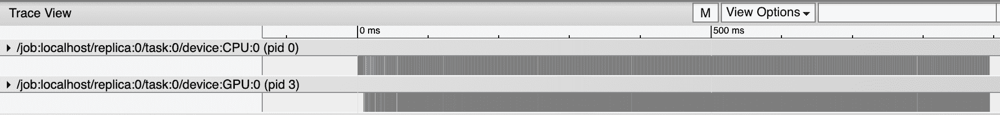
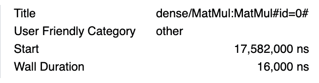
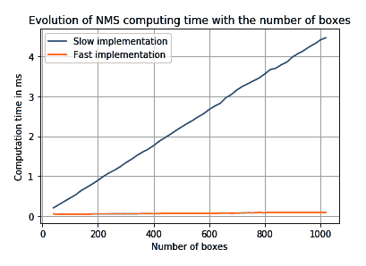
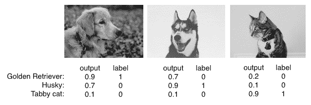
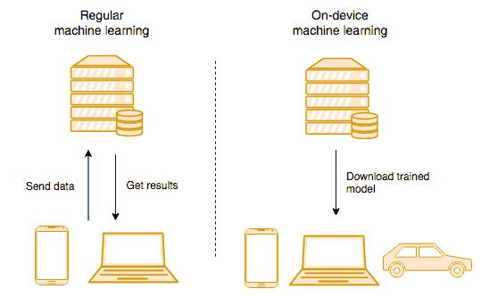
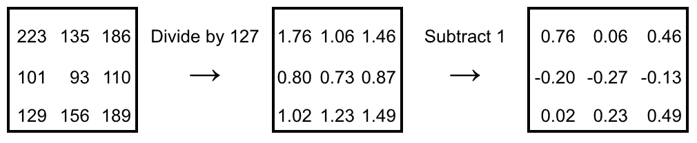
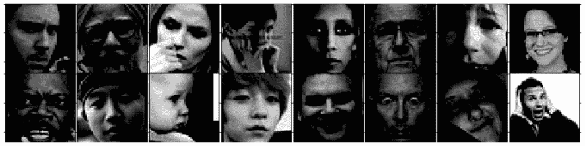
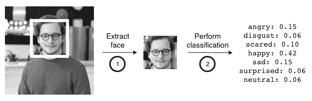
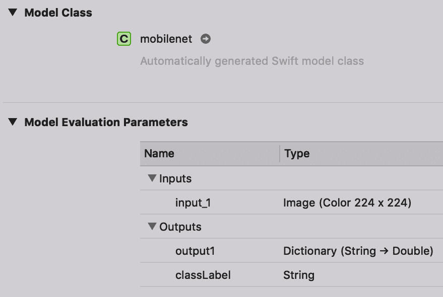

# 第九章：优化模型并部署到移动设备

计算机视觉应用种类繁多、涉及面广。虽然大多数训练步骤发生在服务器或计算机上，但深度学习模型也广泛应用于各种前端设备，如手机、自动驾驶汽车和**物联网**（**IoT**）设备。在有限的计算能力下，性能优化变得尤为重要。

在本章中，我们将介绍一些技术，帮助你限制模型大小并提高推理速度，同时保持良好的预测质量。作为一个实际示例，我们将创建一个简单的移动应用，识别 iOS 和 Android 设备上的面部表情，以及在浏览器中运行。

本章将涵盖以下主题：

+   如何减少模型大小并提升速度，同时保持准确性

+   深入分析模型计算性能

+   在移动设备（iOS 和 Android）上运行模型

+   介绍 TensorFlow.js 在浏览器中运行模型

# 技术要求

本章的代码可以从 [`github.com/PacktPublishing/Hands-On-Computer-Vision-with-TensorFlow-2/tree/master/Chapter09`](https://github.com/PacktPublishing/Hands-On-Computer-Vision-with-TensorFlow-2/tree/master/Chapter09) 获取。

在为移动设备开发应用时，你需要掌握 **Swift**（用于 iOS）或 **Java**（用于 Android）。如果在浏览器中进行计算机视觉开发，你需要了解 **JavaScript**。本章中的示例简单且有详细解释，即便你更熟悉 Python，理解起来也非常容易。

此外，要运行示例 iOS 应用，你需要一台兼容的设备以及安装了 Xcode 的 Mac 电脑。要运行 Android 应用，你需要一台 Android 设备。

# 优化计算和磁盘占用

使用计算机视觉模型时，有些特性至关重要。优化模型的*速度*可能使它实现实时运行，开启许多新的应用场景。即使是提高模型的*准确性*几个百分点，也可能决定一个模型是玩具级别还是能够实际应用的。

另一个重要特征是*大小*，它影响模型所需的存储空间以及下载时间。对于一些平台，如手机或网页浏览器，模型的大小对最终用户来说至关重要。

本节将介绍提升模型推理速度的技术，并讨论如何减少模型的大小。

# 测量推理速度

**推理**描述了使用深度学习模型进行预测的过程。推理速度通常以每秒图像数或每张图像的秒数来衡量。模型必须在每秒处理 5 到 30 张图像之间，才能算作实时处理。在提高推理速度之前，我们需要正确地测量它。

如果一个模型每秒能处理`i`张图像，我们可以同时运行`N`个推理管道来提高性能——这样，模型将能够每秒处理`N` × `i`张图像。虽然并行化对许多应用有益，但它并不适用于实时应用。

在实时场景中，例如自动驾驶汽车，无论能并行处理多少图像，真正重要的是**延迟**——为单张图像计算预测所需的时间。因此，对于实时应用，我们只测量模型的延迟——处理*单张图像*所需的时间。

对于非实时应用，您可以并行运行任意多的推理进程。例如，对于一个视频，您可以并行分析`N`段视频，并在过程结束时将预测结果连接起来。唯一的影响是财务成本，因为您需要更多的硬件来并行处理这些帧。

# 测量延迟

如前所述，要衡量模型的性能，我们希望计算处理*单张图像*所需的时间。然而，为了最小化测量误差，我们实际上会测量多个图像的处理时间。然后，我们将获得的时间除以图像的数量。

我们并不测量单张图像的计算时间，原因有几个。首先，我们希望消除测量误差。第一次运行推理时，机器可能正在忙碌，GPU 可能尚未初始化，或者其他许多技术因素可能导致性能下降。多次运行可以帮助我们减少这种误差。

第二个原因是 TensorFlow 和 CUDA 的预热。当第一次运行某个操作时，深度学习框架通常会比较慢——它们需要初始化变量、分配内存、移动数据等。此外，在执行重复操作时，它们通常会自动优化。

基于以上原因，建议使用多个图像来测量推理时间，以模拟实际环境。

在测量推理时间时，包含数据加载、数据预处理和后处理时间也非常重要，因为这些可能占有相当大的比例。

# 使用跟踪工具来理解计算性能

虽然测量模型的总推理时间可以告诉您应用的可行性，但有时您可能需要更详细的性能报告。为此，TensorFlow 提供了多个工具。在本节中，我们将讨论**跟踪工具**，它是 TensorFlow 摘要包的一部分。

在第七章，《复杂和稀缺数据集上的训练》中，我们描述了如何分析输入管道的性能。请参考本章以监控预处理和数据摄取的性能。

要使用它，调用`trace_on`并将`profiler`设置为`True`。然后，您可以运行 TensorFlow 或 Keras 操作，并将跟踪信息导出到一个文件夹：

```py
logdir = './logs/model'
writer = tf.summary.create_file_writer(logdir)

tf.summary.trace_on(profiler=True)
model.predict(train_images)
with writer.as_default():
  tf.summary.trace_export('trace-model', profiler_outdir=logdir)
```

忽略调用 `create_file_writer` 和 `with writer.as_default()` 仍然会生成操作的追踪信息。然而，模型图表示将不会写入磁盘。

一旦模型开始运行并启用追踪，我们可以通过在命令行执行以下命令来将 TensorBoard 指向该文件夹：

```py
$ tensorboard --logdir logs
```

在浏览器中打开 TensorBoard 并点击 **Profile** 标签后，我们可以查看操作信息：



图 9-1：在多个数据批次上进行简单全连接模型的操作追踪

如前所述，模型由许多小的操作组成。通过点击某个操作，我们可以获取它的名称及持续时间。例如，以下是一个密集矩阵乘法（全连接层）的详细信息：



图 9-2：矩阵乘法操作的细节

TensorFlow 追踪可能会占用大量磁盘空间。因此，我们建议仅在少量数据批次上运行你希望追踪的操作。

在 TPU 上，TensorBoard 提供了一个专用的 Capture Profile 按钮。需要指定 TPU 名称、IP 地址以及追踪记录的时间。

实际上，追踪工具通常用于更大的模型，以确定以下信息：

+   哪些层占用了最多的计算时间。

+   为什么在修改架构后模型需要更多时间。

+   判断 TensorFlow 是否始终在计算数字，或者是否在等待数据。这可能是因为数据预处理时间过长，或者 CPU 之间存在大量的数据交换。

我们鼓励你追踪所使用的模型，以更好地理解计算性能。

# 提高模型推理速度

现在我们知道如何正确衡量模型推理速度，接下来可以使用几种方法来提高推理速度。有些方法涉及更换硬件，而其他方法则需要改变模型架构本身。

# 针对硬件进行优化

正如我们之前看到的，推理使用的硬件对速度至关重要。从最慢的选项到最快的选项，推荐使用以下硬件：

+   **CPU**：虽然较慢，但通常是最便宜的选择。

+   **GPU**：速度较快，但价格较贵。许多智能手机都配备了集成 GPU，可用于实时应用。

+   **专用硬件**：例如，Google 的 *TPU*（用于服务器）、Apple 的 *Neural Engine*（用于移动设备）或 *NVIDIA Jetson*（用于便携式硬件）。这些都是专门为运行深度学习操作设计的芯片。

如果速度对你的应用至关重要，那么使用最快的硬件并调整你的代码是很重要的。

# 在 CPU 上优化

现代英特尔 CPU 通过特殊指令可以更快速地计算矩阵运算。这是通过**深度神经网络数学核心库**（**MKL-DNN**）实现的。TensorFlow 默认并未利用这些指令。使用这些指令需要重新编译 TensorFlow 并启用正确的选项，或安装一个名为 `tensorflow-mkl` 的特殊版本。

如何使用 MKL-DNN 构建 TensorFlow 的相关信息可以在[`www.tensorflow.org/`](https://www.tensorflow.org/)上找到。请注意，该工具包目前仅适用于 Linux。

# 优化 GPU 上的操作

要在 NVIDIA GPU 上运行模型，两个库是必需的——`CUDA` 和 `cuDNN`。TensorFlow 天生就能利用这些库提供的加速。

为了正确在 GPU 上运行操作，必须安装 `tensorflow-gpu` 包。此外，`tensorflow-gpu` 的 CUDA 版本必须与计算机上安装的版本匹配。

一些现代 GPU 提供**16 位浮点**（**FP16**）指令。其理念是使用较低精度的浮点数（16 位而不是常用的 32 位），以加速推理，而不会对输出质量产生太大影响。并非所有 GPU 都支持 FP16。

# 在专用硬件上优化

由于每个芯片都不同，确保更快推理的技术在不同的制造商之间有所不同。运行模型所需的步骤由制造商进行了详细文档化。

一个经验法则是避免使用特殊操作。如果某一层运行的操作包含条件判断或分支，那么该芯片很可能不支持它。操作将不得不在 CPU 上运行，从而使整个过程变慢。因此，建议*仅使用标准操作*——卷积、池化和全连接层。

# 优化输入

计算机视觉模型的推理速度与输入图像的大小成正比。此外，将图像的维度除以二意味着模型需要处理的像素减少四倍。因此，使用*较小的图像可以提高推理速度*。

使用较小的图像时，模型可以获取的信息较少，细节也更少。这通常会影响结果的质量。需要通过实验图像大小来找到一个良好的*速度与准确性之间的平衡*。

# 优化后处理

正如我们在本书前面看到的，大多数模型需要后处理操作。如果使用不合适的工具实现，后处理可能会耗费大量时间。虽然大多数后处理发生在 CPU 上，但有时也可以将部分操作放在 GPU 上执行。

使用追踪工具，我们可以分析后处理所需的时间，从而对其进行优化。**非极大值抑制**（**NMS**）是一项操作，如果实现不当，可能会消耗大量时间（请参见第五章，*目标检测模型*）：



图 9-3：NMS 计算时间与框数的关系

注意前面的图表，慢速实现采用线性计算时间，而快速实现则几乎是常数。虽然四毫秒看起来非常短，但请记住，一些模型可能返回更多的框，从而导致后处理时间。

# 当模型仍然太慢时

一旦模型在速度上得到了优化，它有时仍然太慢，无法满足实时应用的要求。有几种技术可以绕过这种慢速问题，同时保持用户的实时体验。

# 插值与跟踪

目标检测模型通常计算量非常大。在每一帧视频上运行有时是不切实际的。常用的技术是只在每几帧运行一次模型。在中间帧之间，使用线性插值来跟踪目标物体。

虽然这种技术不适用于实时应用，但另一种常用的技术是**目标跟踪**。一旦通过深度学习模型检测到目标，就使用一个更简单的模型来跟踪物体的边界。

目标跟踪几乎适用于任何类型的物体，只要它能与背景清晰区分，并且其形状不会发生过度变化。有许多目标跟踪算法（其中一些可以通过 OpenCV 的 tracker 模块获得，文档可在此查看 [`docs.opencv.org/master/d9/df8/group__tracking.html`](https://docs.opencv.org/master/d9/df8/group__tracking.html)）；其中许多算法也适用于移动应用。

# 模型蒸馏

当其他技术都不起作用时，最后的选择是**模型蒸馏**。其基本思路是训练一个小模型，让它学习更大模型的输出。我们不是让小模型学习原始标签（我们可以用数据来做到这一点），而是让它学习更大模型的输出。

让我们看一个例子——我们训练了一个非常大的网络，通过图片预测动物的品种。输出如下：



图 9-4：我们网络所做的预测示例

由于我们的模型太大，无法在移动设备上运行，因此我们决定训练一个较小的模型。我们没有直接用已有的标签来训练它，而是决定将大网络的知识进行蒸馏。为此，我们将使用大网络的输出作为目标。

对于第一张图片，我们不再用* [1, 0, 0] *作为新模型的目标，而是使用大网络的输出，目标为* [0.9, 0.7, 0.1] *。这个新目标被称为**软目标**。通过这种方式，小网络将被教导，尽管第一张图片中的动物不是哈士奇，但根据更先进的模型，它看起来与哈士奇相似，因为这张图片在*哈士奇*类别中的得分为*0.7*。

更大的网络能够直接从原始标签中学习（例如我们示例中的 *[1, 0, 0]*），因为它拥有更多的计算和内存能力。在训练过程中，它能够推测出不同品种的狗虽然长得相似，但属于不同的类别。一个较小的模型自己可能无法学习到这样的抽象关系，但可以通过其他网络进行引导。按照上述过程，第一个模型推断出的知识将传递给新的模型，这就是**知识蒸馏**的名称由来。

# 减少模型大小

在浏览器或移动设备上使用深度学习模型时，模型需要下载到设备上。为了以下原因，模型必须尽可能轻量：

+   用户通常使用手机在移动网络下连接，且这个网络有时是计量的。

+   连接也可能较慢。

+   模型可能需要频繁更新。

+   便携设备的磁盘空间有时是有限的。

深度学习模型拥有数亿个参数，这使得它们非常占用磁盘空间。幸运的是，有一些技术可以减少它们的大小。

# 量化

最常见的技术是减少参数的精度。我们可以将参数存储为 16 位或 8 位浮点数，而不是 32 位浮点数。已经有实验使用二进制参数，仅用 1 位存储。

**量化**通常在训练结束时进行，当模型转换为在设备上使用时进行。这一转换会影响模型的准确性。因此，在量化后评估模型非常重要。

在所有的压缩技术中，量化通常对模型大小的影响最大，而对性能的影响最小。它也非常容易实现。

# 通道剪枝和权重稀疏化

还有一些技术存在，但实现起来可能更困难。因为这些技术主要依赖于反复试验，所以没有直接的应用方法。

第一种方法，**通道剪枝**，包括去除一些卷积滤波器或通道。卷积层通常有 16 到 512 个不同的滤波器。在训练阶段结束时，通常会发现其中一些滤波器是无用的。我们可以去除这些滤波器，以避免存储那些对模型性能无帮助的权重。

第二种方法叫做**权重稀疏化**。我们可以只存储那些被认为重要或远离零值的权重，而不是存储整个矩阵的权重。

例如，我们可以存储一个权重向量，如*[0.1, 0.9, 0.05, 0.01, 0.7, 0.001]*，而不是存储所有权重。我们可以保留那些远离零值的权重。最终结果是一个元组列表，形式为*(位置, 值)*。在我们的例子中，它会是*[(1, 0.9), (4, 0.7)]*。如果向量中的许多值接近零，我们可以预期存储的权重大幅减少。

# 设备端机器学习

由于深度学习算法对计算资源的高要求，它们通常在强大的服务器上运行。这些计算机是专门为此任务设计的。出于延迟、隐私或成本的原因，有时在客户的设备上运行推理更具吸引力：智能手机、连接设备、汽车或微型计算机。

所有这些设备的共同特点是较低的计算能力和低功耗要求。由于它们处于数据生命周期的末端，设备端机器学习也被称为**边缘计算**或**边缘机器学习**。

使用常规机器学习时，计算通常发生在数据中心。例如，当你将照片上传到 Facebook 时，一个深度学习模型会在 Facebook 的数据中心运行，以检测你朋友的面孔并帮助你标记他们。

使用设备端机器学习时，推理发生在你的设备上。一个常见的例子是 Snapchat 面部滤镜——检测你面部位置的模型直接在设备上运行。然而，模型训练仍然发生在数据中心——设备使用的是从服务器获取的训练模型：



图 9-5: 比较设备端机器学习与传统机器学习的示意图

大多数设备端机器学习都是用于推理。模型的训练仍然主要在专用服务器上进行。

# 设备端机器学习的考虑因素

使用**设备端机器学习**（**on-device ML**）通常是由多种原因推动的，但也有其局限性。

# 设备端机器学习的好处

以下段落列出了直接在用户设备上运行机器学习算法的主要好处。

# 延迟

最常见的动机是**延迟**。因为将数据发送到服务器进行处理需要时间，实时应用使得使用传统机器学习变得不可能。最引人注目的例子是自动驾驶汽车。为了快速反应环境，汽车必须拥有尽可能低的延迟。因此，在汽车内运行模型至关重要。此外，一些设备被使用在没有互联网连接的地方。

# 隐私

随着消费者对隐私的关注越来越高，企业正在设计技术，以在尊重这一需求的同时运行深度学习模型。

让我们来看一个来自 Apple 的大规模示例。当你在 iOS 设备上浏览照片时，你可能会注意到可以搜索对象或事物——`cat`、`bottle`、`car` 会返回相应的图片。即使这些图片没有发送到云端，也能实现这一点。对于 Apple 来说，在尊重用户隐私的同时提供这个功能非常重要。如果没有用户的同意，发送照片进行处理是不可能的。

因此，苹果决定使用设备端机器学习。每晚，当手机在充电时，iPhone 上会运行计算机视觉模型，检测图像中的物体并启用此功能。

# 成本

除了尊重用户隐私外，这项功能还帮助苹果公司降低了成本，因为公司无需支付服务器费用来处理其客户生成的数亿张图片。

在更小的规模上，现在已经可以在浏览器中运行一些深度学习模型。这对于演示特别有用——通过在用户的计算机上运行模型，您可以避免为大规模推理支付高昂的 GPU 服务器费用。此外，不会出现过载问题，因为页面访问的用户越多，所能使用的计算能力也越多。

# 设备端机器学习的局限性

尽管它有许多好处，但这一概念也存在一些局限性。首先，设备的计算能力有限，意味着一些最强大的模型无法被考虑。

此外，许多设备端深度学习框架与最创新或最复杂的层不兼容。例如，TensorFlow Lite 不兼容自定义 LSTM 层，这使得使用该框架在移动设备上移植高级循环神经网络变得困难。

最后，使模型在设备上可用意味着要与用户共享权重和架构。尽管存在加密和混淆方法，但这增加了反向工程或模型盗窃的风险。

# 实际的设备端计算机视觉

在讨论设备端计算机视觉的实际应用之前，我们先来看一下在移动设备上运行深度学习模型的一般考虑因素。

# 设备端计算机视觉的特点

在移动设备上运行计算机视觉模型时，重点从原始性能指标转向用户体验。在手机上，这意味着要尽量减少电池和磁盘的使用：我们不希望在几分钟内耗尽手机电池或填满设备的所有可用空间。在移动设备上运行时，建议使用较小的模型。由于它们包含更少的参数，因此占用的磁盘空间更少。此外，由于所需的操作更少，这也减少了电池的使用。

手机的另一个特点是方向。在训练数据集中，大多数图片都是正确方向的。尽管我们有时在数据增强过程中会改变方向，但图像很少会完全倒置或侧向。然而，手机的持握方式多种多样。因此，我们必须监控设备的方向，以确保我们向模型输入的图像方向正确。

# 生成 SavedModel

正如我们之前提到的，设备端机器学习通常用于推理。因此，前提是需要有一个*训练好的模型*。希望本书能让你对如何实现和准备网络有一个好的了解。我们现在需要将模型转换为中间文件格式。然后，它将通过一个库转换为移动端使用。

在 TensorFlow 2 中，首选的中间格式是**SavedModel**。一个 SavedModel 包含了模型架构（图）和权重。

大多数 TensorFlow 对象都可以导出为 SavedModel。例如，以下代码导出一个训练过的 Keras 模型：

```py
tf.saved_model.save(model, export_dir='./saved_model')
```

# 生成冻结图

在引入**SavedModel** API 之前，TensorFlow 主要使用**冻结图**格式。实际上，SavedModel 是一个冻结图的封装。前者包含更多的元数据，并且可以包含服务模型所需的预处理函数。虽然 SavedModel 越来越受欢迎，但一些库仍然要求使用冻结模型。

要将 SavedModel 转换为冻结图，可以使用以下代码：

```py
from tensorflow.python.tools import freeze_graph

output_node_names = ['dense/Softmax']
input_saved_model_dir = './saved_model_dir'
input_binary = False
input_saver_def_path = False
restore_op_name = None
filename_tensor_name = None
clear_devices = True
input_meta_graph = False
checkpoint_path = None
input_graph_filename = None
saved_model_tags = tag_constants.SERVING

freeze_graph.freeze_graph(input_graph_filename, input_saver_def_path,
                          input_binary, checkpoint_path, output_node_names,
                          restore_op_name, filename_tensor_name,
                          'frozen_model.pb', clear_devices, "", "", "",
                          input_meta_graph, input_saved_model_dir,
                          saved_model_tags)
```

除了指定输入和输出之外，我们还需要指定`output_node_names`。事实上，模型的推理输出并不总是很清楚。例如，图像检测模型有多个输出——框坐标、分数和类别。我们需要指定使用哪个（些）输出。

请注意，许多参数的值是`False`或`None`，因为这个函数可以接受许多不同的格式，而 SavedModel 只是其中之一。

# 预处理的重要性

正如在第三章中所解释的，*现代神经网络*，输入图像必须进行**预处理**。最常见的预处理方法是将每个通道的值除以*127.5*（*127.5* = *255/2* = 图像像素的中间值），并减去 1。这样，我们将图像的值表示为-1 到 1 之间的数值：



图 9-6： 单通道*3 x 3*图像的预处理示例

然而，表示图像的方法有很多种，具体取决于以下几个方面：

+   通道的顺序：RGB 或 BGR

+   图像的范围是`0`到`1`，* -1*到`1`，还是`0`到*255*？

+   维度的顺序：*[W, H, C]* 或 *[C, W, H]*

+   图像的方向

在移植模型时，至关重要的是在设备上使用与训练时*完全相同的预处理*。如果没有做到这一点，模型的推理效果会很差，有时甚至会完全失败，因为输入数据与训练数据之间的差异太大。

所有的移动深度学习框架都提供了一些选项来指定预处理设置。由你来设置正确的参数。

现在我们已经获得了**SavedModel**，并且了解了预处理的重要性，我们可以在不同的设备上使用我们的模型了。

# 示例应用 – 识别面部表情

为了直接应用本章介绍的概念，我们将开发一个使用轻量级计算机视觉模型的应用程序，并将其部署到各种平台。

我们将构建一个分类面部表情的应用程序。当指向一个人的脸时，它会输出该人的表情——高兴、悲伤、惊讶、厌恶、生气或中立。我们将在**面部表情识别**（**FER**）数据集上训练我们的模型，该数据集可在[`www.kaggle.com/c/challenges-in-representation-learning-facial-expression-recognition-challenge`](https://www.kaggle.com/c/challenges-in-representation-learning-facial-expression-recognition-challenge)上获得，由 Pierre-Luc Carrier 和 Aaron Courville 整理。它由 28,709 张灰度图像组成，大小为*48 × 48*：



图 9-7：从 FER 数据集中采样的图像

在应用程序中，最简单的方法是使用相机捕捉图像，然后将其直接输入到训练好的模型中。然而，这样会导致结果不佳，因为环境中的物体会影响预测的质量。我们需要在将图像输入给用户之前，先裁剪出用户的面部。



图 9-8：我们的面部表情分类应用的两步流程

尽管我们可以为第一步（人脸检测）构建自己的模型，但使用现成的 API 要方便得多。它们在 iOS 上原生支持，在 Android 和浏览器中通过库提供支持。第二步，表情分类，将使用我们的自定义模型进行。

# 介绍 MobileNet

我们将用于分类的架构被命名为**MobileNet**。它是一个为移动设备设计的卷积模型。该模型在 2017 年由 Andrew G Howard 等人提出，论文名为《MobileNets: Efficient Convolutional Neural Networks for Mobile Vision Applications》，它使用一种特殊类型的卷积来减少生成预测所需的参数数量和计算量。

MobileNet 使用**深度可分离**卷积。实际上，这意味着该架构由两种类型的卷积交替组成：

1.  **逐点** **卷积**：这些与常规卷积类似，但使用的是`1` × `1` 卷积核。逐点卷积的目的是结合输入的不同通道。应用于 RGB 图像时，它们将计算所有通道的加权和。

1.  **深度** **卷积**：这些卷积与常规卷积类似，但不合并通道。深度卷积的作用是过滤输入的内容（检测线条或模式）。应用于 RGB 图像时，它们将为每个通道计算一个特征图。

这两种类型的卷积结合使用时，表现与常规卷积相似。然而，由于它们的卷积核较小，所需的参数和计算量较少，因此这种架构非常适合移动设备。

# 在设备上部署模型

为了说明设备端的机器学习，我们将把一个模型移植到 iOS 和 Android 设备，以及网页浏览器上。我们还将描述其他可用的设备类型。

# 在 iOS 设备上使用 Core ML 运行

随着最新设备的发布，苹果公司将重点放在了机器学习上。他们设计了一款定制的芯片——**神经引擎**。该芯片可以实现快速的深度学习操作，同时保持低功耗。为了充分利用这款芯片，开发者必须使用一组官方 API，称为**Core ML**（请参阅[`developer.apple.com/documentation/coreml`](https://developer.apple.com/documentation/coreml)中的文档）。

要在 Core ML 中使用现有模型，开发者需要将其转换为`.mlmodel`格式。幸运的是，苹果提供了 Python 工具，用于将 Keras 或 TensorFlow 模型转换为该格式。

除了速度和能效，Core ML 的一个优势是它与其他 iOS API 的集成。存在强大的本地方法，用于增强现实、面部检测、物体追踪等多个功能。

尽管 TensorFlow Lite 支持 iOS，但目前我们仍然推荐使用 Core ML。它能够提供更快的推理时间和更广泛的功能兼容性。

# 从 TensorFlow 或 Keras 转换

要将我们的模型从 Keras 或 TensorFlow 转换，另一个工具是必需的——`tf-coreml` ([`github.com/tf-coreml/tf-coreml`](https://github.com/tf-coreml/tf-coreml))。

在撰写本文时，`tf-coreml`与 TensorFlow 2 不兼容。我们提供了一个修改版本，直到该库的开发者更新它。请参阅本章的笔记本，以获取最新的安装说明。

我们可以将模型转换为`.mlmodel`格式：

```py
import tfcoreml as tf_converter

tf_converter.convert('frozen_model.pb',
                     'mobilenet.mlmodel',
                     class_labels=EMOTIONS,
                     image_input_names=['input_0:0'],
                     output_feature_names=[output_node_name + ':0'],
                     red_bias=-1,
                     green_bias=-1,
                     blue_bias=-1,
                     image_scale=1/127.5,
                     is_bgr=False)
```

一些参数是重要的：

+   `class_labels`：标签列表。如果没有这个，我们最终得到的将是类 ID，而不是可读的文本。

+   `input_names`：输入层的名称。

+   `image_input_names`：这是用于指定 Core ML 框架我们的输入是图像。这个设置稍后会很有用，因为库将为我们处理所有的预处理工作。

+   `output_feature_names`：与冻结模型转换一样，我们需要指定模型中要目标的输出。在这种情况下，它们不是操作，而是输出。因此，必须在名称后附加`:0`。

+   `image_scale`：用于预处理的缩放比例。

+   `bias`：每种颜色的预处理偏差。

+   `is_bgr`：如果通道是 BGR 顺序，则必须为`True`，如果是 RGB 顺序，则为`False`。

如前所述，`scale`、`bias`和`is_bgr`必须与训练时使用的设置相匹配。

将模型转换为`.mlmodel`文件后，可以在 Xcode 中打开它：



图 9-9：Xcode 截屏，显示模型的详细信息

注意，由于我们指定了`image_input_names`，输入被识别为`Image`。因此，Core ML 将能够为我们处理图像的预处理工作。

# 加载模型

完整的应用程序可以在章节仓库中找到。构建和运行它需要一台 Mac 计算机和一台 iOS 设备。让我们简要介绍一下如何从模型中获取预测的步骤。请注意，以下代码是用 Swift 编写的，它与 Python 语法类似：

```py
private lazy var model: VNCoreMLModel = try! VNCoreMLModel(for: mobilenet().model)

private lazy var classificationRequest: VNCoreMLRequest = {
    let request = VNCoreMLRequest(model: model, completionHandler: { [weak self] request, error in
        self?.processClassifications(for: request, error: error)
    })
    request.imageCropAndScaleOption = .centerCrop
    return request
}()
```

代码由三个主要步骤组成：

1.  加载模型。有关模型的所有信息都包含在 `.mlmodel` 文件中。

1.  设置自定义回调。在我们的情况下，图像分类完成后，我们将调用 `processClassifications`。

1.  设置 `imageCropAndScaleOption`。我们的模型设计为接受正方形图像，但输入图像的比例通常不同。因此，我们配置 Core ML 通过将其设置为 `centerCrop` 来裁剪图像的中心部分。

我们还使用本机的 `VNDetectFaceRectanglesRequest` 和 `VNSequenceRequestHandler` 函数加载用于面部检测的模型：

```py
private let faceDetectionRequest = VNDetectFaceRectanglesRequest()
private let faceDetectionHandler = VNSequenceRequestHandler()
```

# 使用模型

作为输入，我们访问 `pixelBuffer`，它包含设备摄像头的视频流中的像素。我们运行面部检测模型并获得 `faceObservations`。这将包含检测结果。如果该变量为空，则表示未检测到面部，我们将不会进一步处理该函数：

```py
try faceDetectionHandler.perform([faceDetectionRequest], on: pixelBuffer, orientation: exifOrientation)

guard let faceObservations = faceDetectionRequest.results as? [VNFaceObservation], faceObservations.isEmpty == false else {
    return
}
```

然后，对于每个 `faceObservation` 在 `faceObservations` 中，我们将对包含面部的区域进行分类：

```py
let classificationHandler = VNImageRequestHandler(cvPixelBuffer: pixelBuffer, orientation: .right, options: [:])

let box = faceObservation.boundingBox
let region = CGRect(x: box.minY, y: 1 - box.maxX, width: box.height, height:box.width)
self.classificationRequest.regionOfInterest = region

try classificationHandler.perform([self.classificationRequest])
```

为此，我们指定请求的 `regionOfInterest`。这会通知 Core ML 框架，输入是图像的这个特定区域。这非常方便，因为我们不需要裁剪和调整图像的大小——框架会为我们处理这些。最后，我们调用 `classificationHandler.perform` 本机方法。

请注意，我们需要更改坐标系统。面部坐标是以图像的左上角为原点返回的，而 `regionOfInterest` 必须以左下角为原点来指定。

一旦生成预测，我们的自定义回调 `processClassifications` 将会被调用并传入结果。然后，我们将能够将结果显示给用户。这部分内容在本书的 GitHub 仓库中的完整应用程序中有介绍。

# 在 Android 上使用 TensorFlow Lite 运行

**TensorFlow Lite** 是一个移动框架，可以在移动设备和嵌入式设备上运行 TensorFlow 模型。它支持 Android、iOS 和 Raspberry Pi。与 iOS 设备上的 Core ML 不同，它不是一个本地库，而是一个必须添加到应用中的外部依赖项。

尽管 Core ML 已为 iOS 设备硬件进行了优化，但 TensorFlow Lite 的性能可能因设备而异。在某些 Android 设备上，它可以使用 GPU 来提高推理速度。

为了在我们的示例应用中使用 TensorFlow Lite，我们首先需要使用 TensorFlow Lite 转换器将模型转换为该库的格式。

# 从 TensorFlow 或 Keras 转换模型

TensorFlow 集成了一个功能，用于将 SavedModel 模型转换为 TF Lite 格式。为此，我们首先创建一个 TensorFlow Lite 转换器对象：

```py
# From a Keras model
converter = tf.lite.TFLiteConverter.from_keras_model(model)
## Or from a SavedModel
converter = tf.lite.TFLiteConverter('./saved_model')
```

然后，将模型保存到磁盘：

```py
tflite_model = converter.convert()
open("result.tflite", "wb").write(tflite_model)
```

你会注意到，TensorFlow Lite 的功能提供的选项比 Apple Core ML 少。确实，TensorFlow Lite 不自动处理图像的预处理和调整大小。这些需要在 Android 应用中由开发者手动处理。

# 加载模型

在将模型转换为`.tflite`格式后，我们可以将其添加到 Android 应用的 assets 文件夹中。然后，我们可以使用辅助函数`loadModelFile`加载模型：

```py
tfliteModel = loadModelFile(activity);

```

由于我们的模型在应用的 assets 文件夹中，我们需要传递当前活动。如果你不熟悉 Android 应用开发，可以将活动理解为应用中的一个特定屏幕。

然后，我们可以创建`Interpreter`。在 TensorFlow Lite 中，解释器用于运行模型并返回预测结果。在我们的示例中，我们传递默认的`Options`构造函数。`Options`构造函数可以用来改变线程数或模型的精度：

```py
Interpreter.Options tfliteOptions = new Interpreter.Options();
tflite = new Interpreter(tfliteModel, tfliteOptions);

```

最后，我们将创建`ByteBuffer`。这是一种包含输入图像数据的数据结构：

```py
imgData =
    ByteBuffer.allocateDirect(
        DIM_BATCH_SIZE
            * getImageSizeX()
            * getImageSizeY()
            * DIM_PIXEL_SIZE
            * getNumBytesPerChannel());

```

`ByteBuffer`是一个数组，将包含图像的像素数据。其大小取决于以下因素：

+   批次大小——在我们的例子中为 1。

+   输入图像的维度。

+   通道数（`DIM_PIXEL_SIZE`）——RGB 为 3，灰度为 1。

+   最后，每个通道的字节数。因为*1 字节 = 8 位*，所以一个 32 位的输入需要 4 个字节。如果使用量化，8 位输入需要 1 个字节。

为了处理预测，我们稍后将填充这个`imgData`缓冲区并传递给解释器。我们的面部表情检测模型已经准备好使用。在开始使用我们的完整流程之前，我们只需要实例化人脸检测器：

```py
faceDetector = new FaceDetector.Builder(this.getContext())
        .setMode(FaceDetector.FAST_MODE)
        .setTrackingEnabled(false)
        .setLandmarkType(FaceDetector.NO_LANDMARKS)
        .build();
```

请注意，这个`FaceDetector`类来自 Google Vision 框架，与 TensorFlow Lite 无关。

# 使用该模型

对于我们的示例应用，我们将处理位图图像。你可以将位图视为一个原始像素矩阵。它们与 Android 上的大多数图像库兼容。我们从显示相机视频流的视图`textureView`获取这个位图：

```py
Bitmap bitmap = textureView.getBitmap(previewSize.getHeight() / 4, previewSize.getWidth() / 4)

```

我们并没有以全分辨率捕获位图。相反，我们将其尺寸除以`4`（这个数字是通过反复试验选出来的）。选择过大的尺寸会导致人脸检测非常慢，从而增加我们流程的推理时间。

接下来，我们将从位图创建`vision.Frame`。这个步骤是必要的，以便将图像传递给`faceDetector`：

```py
Frame frame = new Frame.Builder().setBitmap(bitmap).build();
faces = faceDetector.detect(frame);
```

然后，对于`faces`中的每个`face`，我们可以在位图中裁剪出用户的面部。在 GitHub 仓库中提供的`cropFaceInBitmap`辅助函数正是执行此操作——它接受面部坐标并裁剪位图中的相应区域：

```py
Bitmap faceBitmap = cropFaceInBitmap(face, bitmap);
Bitmap resized = Bitmap.createScaledBitmap(faceBitmap, 
classifier.getImageSizeX(), classifier.getImageSizeY(), true)
```

在调整位图大小以适应模型输入后，我们填充`imgData`，即`ByteBuffer`，它是`Interpreter`接受的格式：

```py
imgData.rewind();
resized.getPixels(intValues, 0, resized.getWidth(), 0, 0, resized.getWidth(), resized.getHeight());

int pixel = 0;
for (int i = 0; i < getImageSizeX(); ++i) {
  for (int j = 0; j < getImageSizeY(); ++j) {
    final int val = intValues[pixel++];
    addPixelValue(val);
  }
}
```

如您所见，我们遍历位图的像素并将其添加到`imgData`中。为此，我们使用`addPixelValue`。这个函数处理每个像素的预处理。它会根据模型的特性有所不同。在我们的案例中，模型使用的是灰度图像。因此，我们必须将每个像素从彩色转换为灰度：

```py
protected void addPixelValue(int pixelValue) {
  float mean =  (((pixelValue >> 16) & 0xFF) + ((pixelValue >> 8) & 0xFF) + (pixelValue & 0xFF)) / 3.0f;
  imgData.putFloat(mean / 127.5f - 1.0f);
}
```

在这个函数中，我们使用位运算来计算每个像素的三种颜色的平均值。然后将其除以`127.5`并减去`1`，这是我们模型的预处理步骤。

在此过程的最后，`imgData`包含了正确格式的输入信息。最后，我们可以运行推理：

```py
float[][] labelProbArray = new float[1][getNumLabels()];
tflite.run(imgData, labelProbArray);
```

预测结果将存放在`labelProbArray`中。然后我们可以处理并显示它们。

# 在浏览器中使用 TensorFlow.js 运行

随着每年浏览器功能的不断增加，能够运行深度学习模型只是时间问题。在浏览器中运行模型有许多优势：

+   用户无需安装任何东西。

+   计算在用户的机器上进行（无论是手机还是电脑）。

+   该模型有时可以使用设备的 GPU。

在浏览器中运行的库称为 TensorFlow.js（请参考文档：[`github.com/tensorflow/tfjs`](https://github.com/tensorflow/tfjs)）。我们将使用它来实现我们的面部表情分类应用。

虽然 TensorFlow 不能利用非 NVIDIA 的 GPU，但 TensorFlow.js 可以在几乎任何设备上使用 GPU。浏览器中的 GPU 支持最初是为了通过 WebGL（一个用于 Web 应用程序的计算机图形 API，基于 OpenGL）显示图形动画而实现的。由于它涉及矩阵运算，后来被重新用于运行深度学习操作。

# 将模型转换为 TensorFlow.js 格式

要使用 TensorFlow.js，必须先通过`tfjs-converter`将模型转换为正确的格式。它可以转换 Keras 模型、冻结的模型和 SavedModels。安装说明可在 GitHub 仓库中找到。

然后，转换模型的过程与 TensorFlow Lite 的过程非常相似。不同之处在于，它不是在 Python 中完成，而是通过命令行完成：

```py
$ tensorflowjs_converter ./saved_model --input_format=tf_saved_model my-tfjs --output_format tfjs_graph_model
```

类似于 TensorFlow Lite，我们需要指定输出节点的名称。

输出由多个文件组成：

+   `optimized_model.pb`：包含模型图

+   `weights_manifest.json`：包含权重列表的信息

+   `group1-shard1of5`，`group1-shard2of5`，...，`group1-shard5of5`：包含模型的权重，分成多个文件

模型被分割成多个文件，因为并行下载通常更快。

# 使用该模型

在我们的 JavaScript 应用程序中，导入 TensorFlow.js 后，我们可以加载模型。请注意，以下代码是用 JavaScript 编写的。它的语法类似于 Python：

```py
import * as tf from '@tensorflow/tfjs';
const model = await tf.loadModel(MOBILENET_MODEL_PATH);

```

我们还将使用一个名为`face-api.js`的库来提取人脸：

```py
import * as faceapi from 'face-api.js';
await faceapi.loadTinyFaceDetectorModel(DETECTION_MODEL_PATH)
```

一旦两个模型加载完毕，我们就可以开始处理用户的图像：

```py
const video = document.getElementById('video');
const detection = await faceapi.detectSingleFace(video, new faceapi.TinyFaceDetectorOptions())

if (detection) {
 const faceCanvases = await faceapi.extractFaces(video, [detection])
 const values = await predict(faceCanvases[0])
}
```

在这里，我们从`video`元素中抓取一帧显示用户网络摄像头的图像。`face-api.js`库将尝试检测该帧中的人脸。如果它检测到人脸，则提取图像中包含人脸的部分，并将其输入到我们的模型中。

`predict`函数处理图像的预处理和分类。它的具体操作如下：

```py
async function predict(imgElement) {
  let img = await tf.browser.fromPixels(imgElement, 3).toFloat();

  const logits = tf.tidy(() => {
    // tf.fromPixels() returns a Tensor from an image element.
    img = tf.image.resizeBilinear(img, [IMAGE_SIZE, IMAGE_SIZE]);
    img = img.mean(2);
    const offset = tf.scalar(127.5);
    // Normalize the image from [0, 255] to [-1, 1].
    const normalized = img.sub(offset).div(offset);
    const batched = normalized.reshape([1, IMAGE_SIZE, IMAGE_SIZE, 1]);

    return mobilenet.predict(batched);
  });

  return logits
}
```

我们首先使用`resizeBilinear`调整图像大小，并通过`mean`将其从彩色转换为灰度。然后，我们对像素进行预处理，将其标准化到`-1`到`1`之间。最后，我们将数据传递给`model.predict`进行预测。在这个流程的末端，我们得到了可以展示给用户的预测结果。

注意使用`tf.tidy`。这一点非常重要，因为 TensorFlow.js 会创建一些中间张量，而这些张量可能永远不会从内存中清除。将我们的操作包装在`tf.tidy`中可以自动清除内存中的中间元素。

近年来，技术进步使得浏览器中的新应用成为可能——图像分类、文本生成、风格迁移和姿势估计现在对任何人都可以使用，无需安装任何软件。

# 在其他设备上运行

我们已经涵盖了如何将模型转换为浏览器、iOS 和 Android 设备上运行的内容。TensorFlow Lite 也可以在运行 Linux 的袖珍计算机——树莓派上运行。

此外，专门为运行深度学习模型设计的设备也在这些年中陆续出现。以下是一些例子：

+   **英伟达 Jetson TX2**：大小相当于手掌，常用于机器人应用。

+   **谷歌 Edge TPU**：谷歌为物联网应用设计的一款芯片，大小类似于指甲，并提供开发者工具包。

+   **英特尔神经计算棒**：大小类似于 USB 闪存驱动器；可以连接到任何计算机（包括树莓派），以提高其机器学习能力。

这些设备都专注于最大化计算能力，同时最小化功耗。随着每一代设备的不断增强，设备端机器学习领域发展迅速，每年都在开启新的应用。

# 概要

在本章中，我们讨论了多个性能相关的话题。首先，我们学习了如何正确地测量模型的推理速度，然后我们介绍了减少推理时间的技巧：选择合适的硬件和库、优化输入大小以及优化后处理。我们还介绍了使较慢的模型看起来像是实时处理的技巧，并减少了模型的大小。

接着，我们介绍了设备端机器学习（on-device ML），以及其优缺点。我们学习了如何将 TensorFlow 和 Keras 模型转换为与设备端深度学习框架兼容的格式。通过 iOS、Android 和浏览器的实例，我们涵盖了广泛的设备。我们还介绍了一些现有的嵌入式设备。

在本书中，我们详细介绍了 TensorFlow 2，并将其应用于多个计算机视觉任务。我们涵盖了多种先进的解决方案，提供了理论背景和一些实际实现。最后一章涉及模型的部署，现在由你来利用 TensorFlow 2 的强大功能，开发适用于你选择的用例的计算机视觉应用！

# 问题

1.  在衡量模型推理速度时，是应该使用单张图像还是多张图像来进行测量？

1.  权重为*float32*的模型比权重为*float16*的模型更小还是更大？

1.  在 iOS 设备上，应该偏向使用 Core ML 还是 TensorFlow Lite？那在 Android 设备上呢？

1.  在浏览器中运行模型有哪些好处和局限性？

1.  嵌入式设备运行深度学习算法的最重要要求是什么？
