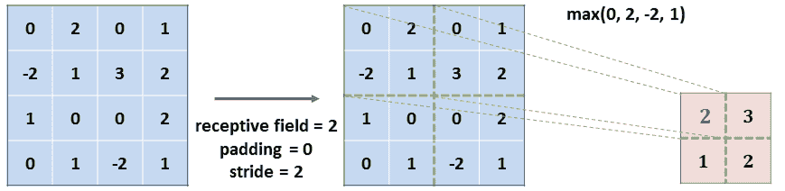

# 第十一章：评估

# 答案

每章末尾的评估问题的答案将在以下部分中共享。

# 第一章

1.  **以下哪个任务不属于计算机视觉：基于查询图像进行相似图片的网络搜索、从图像序列中重建 3D 场景，还是动画视频角色？**

*后者*，它属于 **计算机图形学** 的领域。然而，值得注意的是，越来越多的计算机视觉算法正在帮助艺术家更高效地生成或动画化内容（例如，*动作捕捉* 方法，记录演员执行某些动作并将这些动作转移到虚拟角色身上）。

1.  **原始感知机使用了哪种激活函数？**

`step` 函数。

1.  **假设我们想训练一种方法来检测手写数字是否为 *4*。我们应该如何调整本章中实现的网络以完成这个任务？**

在本章中，我们训练了一个分类网络来识别数字图片，范围从 `0` 到 `9`。因此，网络必须在 10 个类别中预测出正确的类别，因此，输出向量包含 10 个值（每个类别一个得分/概率）。

在这个问题中，我们定义了一个不同的分类任务。我们希望网络识别图像中是否包含 *4* 或 *不是 4*。这是一个 **二分类任务**，因此，网络应进行编辑，*仅输出两个值*。

# 第二章

1.  **Keras 与 TensorFlow 有什么区别？它的目的是什么？**

Keras 被设计为其他深度学习库的封装器，以便简化开发。TensorFlow 现在通过 `tf.keras` 与 Keras 完全集成。在 TensorFlow 2 中，最佳实践是使用该模块创建模型。

1.  **为什么 TensorFlow 使用图？如何手动创建图？**

TensorFlow 依赖于图来确保模型的性能和可移植性。在 TensorFlow 2 中，手动创建图的最佳方式是使用 `tf.function` 装饰器。

1.  **急切执行模式和延迟执行模式有什么区别？**

在延迟执行模式下，直到用户特别请求结果时才会执行计算。而在急切执行模式下，每个操作在定义时都会执行。虽然前者由于图优化可能更快，但后者更易于使用和调试。在 TensorFlow 2 中，延迟执行模式已被弃用，转而支持急切执行模式。

1.  **如何在 TensorBoard 中记录信息，如何显示它？**

要在 TensorBoard 中记录信息，您可以使用 `tf.keras.callbacks.TensorBoard` 回调函数，并将其传递给 `.fit` 方法以训练模型。要手动记录信息，您可以使用 `tf.summary` 模块。要显示信息，请启动以下命令：

```py
$ tensorboard --logdir ./model_logs
```

在这里，`model_logs` 是存储 TensorBoard 日志的目录。此命令将输出一个 URL。导航到该 URL 以监控训练过程。

1.  **TensorFlow 1 和 2 之间的主要区别是什么？**

TensorFlow 2 通过将图管理从用户手中移除，专注于简化操作。它默认使用即时执行（eager execution），使得模型更容易调试。然而，它依然通过 AutoGraph 和 `tf.function` 保持了高性能。同时，它与 Keras 深度集成，使得模型创建比以往任何时候都更简单。

# 第三章

1.  **为什么卷积层的输出宽度和高度会比输入小，除非进行了填充？**

卷积层输出的空间维度表示内核在垂直和水平方向上滑动时能够取到的有效位置数量。由于内核跨越 *k* × *k* 像素（如果是正方形），它们可以在输入图像上取的位置数量只能等于（如果 *k* = 1）或小于图像的维度。

这是通过本章中提出的方程来表达的，方程用于基于层的超参数计算输出维度。

1.  **在图 3-6 中的输入矩阵上，具有（2，2）感受野和步幅为 2 的最大池化层输出会是什么？**



1.  **如何通过 Keras Functional API 以非面向对象的方式实现 LeNet-5？**

代码如下：

```py
from tensorflow.keras import Model
from tensorflow.keras.layers import Inputs, Conv2D, MaxPooling2D, Flatten, Dense

# "Layer" representing the network's inputs:
inputs = Input(shape=input_shape)
# First block (conv + max-pool):
conv1 = Conv2D(6, kernel_size=5, padding='same', activation='relu')(inputs)
max_pool1 = MaxPooling2D(pool_size=(2, 2))(conv1)
# 2nd block:
conv2 = Conv2D(16, kernel_size=5, activation='relu')(max_pool1)
max_pool2 = MaxPooling2D(pool_size=(2, 2))(conv2)
# Dense layers:
flatten = Flatten()(max_pool2)
dense1 = Dense(120, activation='relu')(flatten)
dense2 = Dense(84, activation='relu')(dense1)
dense3 = Dense(num_classes, activation='softmax')(dense2)

lenet5_model = Model(inputs=inputs, outputs=dense3)
```

1.  **L1/L2 正则化如何影响网络？**

**L1 正则化** 强制应用它的层将与不重要特征相关联的参数值拉向零；也就是说，忽略那些不重要的特征（如与数据集噪声相关的特征）。

**L2 正则化** 强制层将其变量保持在较低的水平，从而使它们更加均匀分布。它防止网络形成一小组具有大值的参数，这些参数会过度影响模型的预测。

# 第四章

1.  **哪个 TensorFlow Hub 模块可以用来实例化一个用于 ImageNet 的 Inception 分类器？**

位于 [`tfhub.dev/google/tf2-preview/inception_v3/classification/2`](https://tfhub.dev/google/tf2-preview/inception_v3/classification/2) 的模型可以直接用于分类类似 ImageNet 的图像，因为该分类模型是在该数据集上预训练的。

1.  **如何冻结 Keras Applications 中 ResNet-50 模型的前三个残差宏块？**

代码如下：

```py
freeze_num = 3
# Looking at `resnet50.summary()`, we could observe that the 1st layer of the 4th macro-block is named "res5[...]":
break_layer_name = 'res{}'.format(freeze_num + 2)
for layer in resnet50_finetune.layers:
   if break_layer_name in layer.name:
        break
    if isinstance(layer, tf.keras.layers.Conv2D):
        # If the layer is a convolution, and isn't after 
        # the 1st layer not to train:
        layer.trainable = False
```

1.  **何时不建议使用迁移学习？**

当 *领域* 差异过大且目标数据的结构与源数据结构完全不同时，迁移学习可能并不会带来好处。正如本章所述，尽管 CNN 可以应用于图像、文本和音频文件，但将针对一种模态训练的权重迁移到另一种模态是不推荐的。

# 第五章

1.  **边界框、锚框和真实框之间有什么区别？**

**边界框**是包围物体的最小矩形。**锚框**是具有特定大小的边界框。对于图像网格中的每个位置，通常会有几个具有不同纵横比的锚框——正方形、竖直矩形和横向矩形。通过调整锚框的大小和位置，目标检测模型可以生成预测结果。**地面实况框**是与训练集中某个特定物体对应的边界框。如果一个模型训练得很好，它会生成非常接近地面实况框的预测结果。

1.  **特征提取器的作用是什么？**

特征提取器是一个 CNN，它将图像转换为特征体积。特征体积的维度通常比输入图像小，并且包含可以传递给网络其他部分的有意义特征，从而生成预测结果。

1.  **你应该选择以下哪种模型：YOLO 还是 Faster R-CNN？**

如果速度是优先考虑的因素，你应该选择 YOLO，因为它是最快的架构。如果准确性至关重要，你应该选择 Faster R-CNN，因为它生成最好的预测结果。

1.  **何时使用锚框？**

在锚框出现之前，框的预测维度是通过网络的输出生成的。由于物体的大小不同（一个人通常适合竖直矩形，而一辆车适合横向矩形），因此引入了锚框。使用这种技术，每个锚框可以专门化为一个物体比例，从而生成更精确的预测。

# 第六章

1.  **自编码器的特性是什么？**

自编码器是输入和目标相同的编码器-解码器。它们的目标是正确编码并解码图像，而不影响图像的质量，尽管它们有*瓶颈*（即其低维度的潜在空间）。

1.  **完全卷积网络（FCNs）基于哪种分类架构？**

**FCNs** 使用 **VGG-16** 作为特征提取器。

1.  **如何训练语义分割模型，以便它不忽略小类别？**

**类别加权**可以应用于交叉熵损失，从而对较小类别的重像素进行更多的惩罚，这些像素被误分类。也可以使用不受类别比例影响的损失函数，例如**Dice**。

# 第七章

1.  **给定一个 `a = [1, 2, 3]` 的张量和一个 `b = [4, 5, 6]` 的张量，如何构建一个 `tf.data` 管道，以便将每个值从 `1` 到 `6` 单独输出？**

代码如下：

```py
dataset_a = tf.data.Dataset.from_tensor_slices(a)
dataset_b = tf.data.Dataset.from_tensor_slices(b)
dataset_ab = dataset_a.concatenate(dataset_b)
for element in dataset_ab:
    print(element) # will print 1, then 2, ... until 6
```

1.  **根据 `tf.data.Options` 的文档，如何确保数据集在每次运行时始终以相同的顺序返回样本？**

`tf.data.Options` 的 `.experimental_deterministic` 属性应该在传递给数据集之前设置为 `True`。

1.  **在没有目标注释用于训练时，我们介绍的哪些领域自适应方法可以使用？**

应该考虑使用无监督领域适应方法，例如*通过深度适应网络学习可转移特征*，该方法由中国清华大学的龙铭生等人提出，或者是**领域对抗神经网络**（**DANN**），由 Skoltech 的 Yaroslav Ganin 等人提出。

1.  **判别器在 GAN 中扮演什么角色？**

它与生成器对抗，试图区分假图像和真实图像。判别器可以看作是一个**可训练的损失函数**，用于引导生成器——生成器试图最小化判别器的*正确*程度，随着训练的进行，两个网络在各自的任务上会变得越来越好。

# 第八章

1.  **LSTM 相对于简单 RNN 架构的主要优点是什么？**

LSTM 在梯度消失方面的影响较小，且能够更好地存储递归数据中的长期关系。尽管它们需要更多的计算能力，但这通常会导致更好的预测结果。

1.  **当 CNN 应用在 LSTM 之前时，它的作用是什么？**

CNN 作为特征提取器，减少了输入数据的维度。通过应用预训练的 CNN，我们可以从输入图像中提取有意义的特征。LSTM 训练得更快，因为这些特征的维度比输入图像小得多。

1.  **什么是梯度消失，为什么会发生？为什么这是一个问题？**

在 RNN 中反向传播误差时，我们还需要回溯时间步。如果时间步数很多，由于梯度计算的方式，信息会逐渐消失。这是一个问题，因为它使得网络更难学习如何生成好的预测结果。

1.  **解决梯度消失问题有哪些方法？**

一种解决方法是使用截断反向传播，这是一种在本章中描述的技术。另一种选择是使用 LSTM 而不是简单的 RNN，因为 LSTM 在梯度消失方面的影响较小。

# 第九章

1.  **在测量模型推理速度时，应该使用单张图片还是多张图片？**

应该使用多张图片，以避免测量偏差。

1.  **具有`float32`权重的模型比具有`float16`权重的模型大还是小？**

`Float16`权重使用的空间大约是`float32`权重的一半。在兼容设备上，它们也可以更快。

1.  **在 iOS 设备上，应该使用 Core ML 还是 TensorFlow Lite？安卓设备呢？**

在 iOS 设备上，我们建议尽可能使用 Core ML，因为它原生支持并且与硬件紧密集成。在 Android 设备上，应该使用 TensorFlow Lite，因为没有其他替代方案。

1.  **在浏览器中运行模型有哪些好处和局限性？**

它不需要在用户端安装任何东西，也不需要在服务器端占用计算能力，使得应用几乎可以无限扩展。

1.  **嵌入式设备运行深度学习算法的最重要要求是什么？**

除了计算能力外，最重要的需求是功耗，因为大多数嵌入式设备依赖电池供电。
