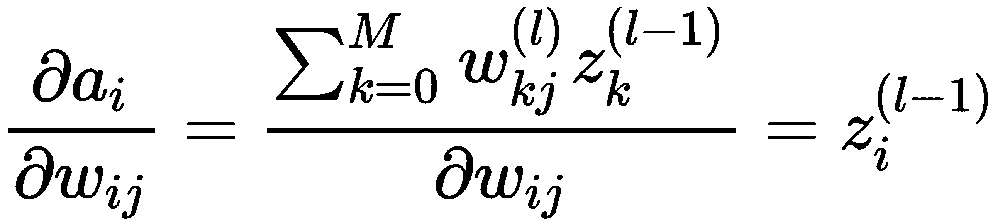
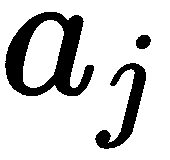

# 第一章：游戏中的深度学习

欢迎来到*《游戏中的深度学习实践》*。本书适用于任何希望以极具实践性的方式学习游戏中的**深度学习**（**DL**）的人。值得注意的是，本书讨论的概念不仅仅局限于游戏。我们在这里学到的许多内容将轻松地转移到其他应用或模拟中。

**强化学习**（**RL**），这是我们在后续章节中将讨论的核心内容之一，正迅速成为主流的**机器学习**（**ML**）技术。它已经应用于从服务器优化到预测零售市场客户活动等方方面面。本书的旅程将主要集中在游戏开发上，我们的目标是构建一个可运行的冒险游戏。请始终记住，您在本书中发现的相同原理也可以应用于其他问题，比如模拟、机器人技术等。

在本章中，我们将从神经网络和深度学习的基本知识开始。我们将讨论神经网络的背景，并逐步构建一个能够玩简单文本游戏的神经网络。具体来说，本章将涉及以下主题：

+   深度学习的过去、现在与未来

+   神经网络 – 基础

+   在**TensorFlow**（**TF**）中实现多层感知机

+   理解 TensorFlow

+   使用反向传播训练神经网络

+   在 Keras 中构建自动编码器

本书假设您具备 Python 的基础知识。您应该能够设置并激活虚拟环境。后续章节将使用 Unity 3D，该软件仅限于 Windows 和 macOS（对硬核 Linux 用户表示歉意）。

如果您已经掌握了深度学习，您可能会倾向于跳过这一章。然而，无论如何，这一章非常值得一读，并将为我们在全书中使用的术语奠定基础。至少做一下动手练习——您稍后会感谢自己的！

# 深度学习的过去、现在与未来

虽然*深*度*学习*这一术语最早是由 Igor Aizenberg 及其同事在 2000 年与神经网络相关联的，但它在过去五年中才真正流行开来。在此之前，我们称这种类型的算法为**人工神经网络**（**ANN**）。然而，深度学习所指的是比人工神经网络更广泛的内容，涵盖了许多其他领域的互联机器。因此，为了澄清，我们将在本书的后续部分主要讨论 ANN 形式的深度学习。不过，我们也会在第五章中讨论一些可以在游戏中使用的其他形式的深度学习，*介绍 DRL*。

# 过去

**多层感知器**（**MLP**）网络的第一个形式，或者我们现在称之为人工神经网络（ANN），是由 Alexey Ivakhnenko 于 1965 年提出的。Ivakhnenko 等了好几年才在 1971 年写下关于多层感知器的文章。这个概念花了一些时间才被理解，直到 1980 年代才开始有更多的研究。这一次，尝试了图像分类和语音识别，虽然失败了，但进展已经开始。又过了 10 年，到了 90 年代末，人工神经网络再次流行起来。流行的程度甚至让 ANN 进入了某些游戏，直到更好的方法出现。之后局势平静下来，又过了大约十年。

然后，在 2012 年，Andrew Ng 和 Jeff Dean 使用人工神经网络（ANN）来识别视频中的猫咪，深度学习的兴趣爆发了。他们的进展是若干微不足道（但有趣的）突破之一，使得人们开始关注深度学习。接着，在 2015 年，谷歌的**DeepMind**团队开发了 AlphaGo，这一次全世界都注意到了。AlphaGo 被证明能够轻松战胜世界上最顶尖的围棋选手，这改变了一切。很快，其他技术也跟进，**深度强化学习**（**DRL**）就是其中之一，证明了在以前被认为不可能的领域，人类的表现可以被持续超越。

在教授学生们神经网络时，教授们喜欢分享一个幽默且贴切的故事：*美国陆军在 80 年代做过早期研究，使用人工神经网络识别敌方坦克。这个算法 100%有效，陆军还组织了一个大型演示来展示其成功。不幸的是，在演示中什么都没能正常工作，每个测试都惨败。回去分析之后，陆军才意识到这个人工神经网络根本没有识别敌方坦克。相反，它是经过在多云天拍摄的图像进行训练的，它做的只是识别云层。*

# 现在的情况

目前，至少在写作时，我们仍处于深度学习爆炸的中期，充满了碎片和混乱，作为开发者，我们的任务就是理清这一切。神经网络目前是许多深度学习技术的基础，其中几项我们将在本书中讲解。只是，似乎每天都有新的、更强大的技术出现，研究人员争先恐后地去理解它们。实际上，这种思想的激增可能会使一项技术陷入停滞，因为研究人员花费越来越多的时间试图复制结果。这无疑是先前人工神经网络（深度学习）停滞不前的主要原因之一。事实上，行业中许多怀疑者预测，这种情况可能会再次发生。那么，你应该担心吗？读这本书值得吗？简短的回答是*值得*。长答案是*可能不值得*，这一次的情况非常不同，许多深度学习概念现在已经在创造收入，这是一个好兆头。深度学习技术现在是经过验证的赚钱工具，这让投资者感到放心，并且鼓励新的投资和增长。究竟增长会有多大还未可知，但机器和深度学习领域现在充满了各行业的机会和增长。

那么，游戏行业是否还可能再次抛弃游戏？这也不太可能，通常是因为许多最近的重要进展，如强化学习，都是为了玩经典的 Atari 游戏而构建的，并以游戏为问题。这只会促使更多的研究通过游戏来进行深度学习。游戏平台 Unity 3D 已经对强化学习在游戏中的应用做出了重大投资。实际上，Unity 正在开发一些最前沿的强化学习技术，我们稍后会与这个平台合作。Unity 确实使用 C#进行脚本编写，但使用 Python 来构建和训练深度学习模型。

# 未来

预测任何事物的未来都是极其困难的，但如果你足够仔细地观察，可能会对事物的发展方向、发展地点或发展方式有所洞察。当然，拥有一个水晶球或训练有素的神经网络肯定会有所帮助，但许多流行的事物往往依赖于下一个伟大的成就。没有任何预测的能力，我们可以观察到深度学习研究和商业开发中当前的趋势是什么吗？嗯，目前的趋势是使用机器学习（ML）来生成深度学习（DL）；也就是说，一台机器基本上会自己组装一个神经网络，解决一个问题。谷歌目前正在大量投资建设一项名为**AutoML**的技术，它可以生成一个神经网络推理模型，能够识别图像中的物体/活动、语音识别或手写识别等。Geoffery Hinton，通常被誉为人工神经网络的教父，最近展示了复杂的深度网络系统可以被分解成可重用的层。基本上，你可以使用从各种预训练模型中提取的层来构建一个网络。这无疑会发展成更有趣的技术，并且在深度学习的探索中发挥重要作用，同时也为计算的下一个阶段铺平道路。

现在，编程代码在某些时候将变得过于繁琐、困难和昂贵。我们已经能看到这种情况的爆发，许多公司正在寻找最便宜的开发人员。现在估计代码的平均成本是每行$10-$20，是的，**每行**。那么，开发人员在什么时候会开始以人工神经网络（ANN）或**TensorFlow**（**TF**）推理图的形式构建他们的代码呢？嗯，在本书的大部分内容中，我们开发的深度学习（DL）代码将生成到 TF 推理图，也可以说是一个大脑。我们将在书的最后一章使用这些“大脑”来构建我们冒险游戏中的智能。构建图模型的技术正迅速成为主流。许多在线机器学习应用程序现在允许用户通过上传训练内容并按下按钮来构建可以识别图像、语音和视频中的物体的模型。这是否意味着将来应用程序可以这样开发而不需要编程？答案是肯定的，而且这种情况已经在发生。

现在我们已经探索了深度学习的过去、现在和未来，接下来可以开始深入研究更多的术语以及神经网络是如何工作的，下一部分将会展开讨论。

# 神经网络 – 基础

神经网络或多层感知器的灵感来源于人类的大脑和神经系统。我们神经系统的核心是上图所示的类比计算机的神经元，它就是一个感知器：


人类神经元与感知器的示意图

我们大脑中的神经元会收集输入，进行处理，然后像计算机的 **感知器** 一样输出响应。感知器接受一组输入，将它们加总，并通过激活函数处理。激活函数决定是否输出，以及在激活时以什么水平输出。让我们仔细看看感知器，具体如下：


感知器

在前面图表的左侧，你可以看到一组输入被推送进来，并加上一个常数偏置。稍后我们会详细讨论这个偏置。然后，输入会被一组单独的权重相乘，并通过激活函数处理。在 Python 代码中，它就像 `Chapter_1_1.py` 中的那样简单：

```py

inputs = [1,2]
weights = [1,1,1]

def perceptron_predict(inputs, weights):
    activation = weights[0]
    for i in range(len(inputs)-1):
        activation += weights[i] * input
    return 1.0 if activation >= 0.0 else 0.0

print(perceptron_predict(inputs,weights))
```

请注意，`weights` 列表比 `inputs` 列表多一个元素；这是为了考虑偏置（`weights[0]`）。除此之外，你可以看到我们只是简单地遍历 `inputs`，将它们与指定的权重相乘并加上偏置。然后，将 `activation` 与 `0.0` 进行比较，如果大于 0，则输出。在这个非常简单的示例中，我们只是将值与 0 进行比较，本质上是一个简单的阶跃函数。稍后我们会花时间多次回顾各种激活函数，可以认为这个简单模型是执行这些函数的基本组成部分。

上述示例代码的输出是什么？看看你能否自己找出答案，或者采取更简单的方式，复制粘贴到你最喜欢的 Python 编辑器中并运行。代码将直接运行，无需任何特殊库。

在前面的代码示例中，我们看到的是一个输入数据点 `[1,2]`，但在深度学习中，这样的单一数据点几乎没什么用处。深度学习模型通常需要数百、数千甚至数百万个数据点或数据集来进行有效的训练和学习。幸运的是，通过一个感知器，我们所需的数据量不到 10 个。

让我们扩展前面的例子，并通过打开你喜欢的 Python 编辑器，按照以下步骤将一个包含 10 个点的训练集输入到 `perceptron_predict` 函数中：

我们将在本书的后续章节中使用 Visual Studio Code 来处理大部分主要的编码部分。当然，你可以使用你喜欢的编辑器，但如果你是 Python 新手，不妨试试这段代码。代码适用于 Windows、macOS 和 Linux。

1.  在你喜欢的 Python 编辑器中输入以下代码块，或者打开从下载的源代码中提取的 `Chapter_1_2.py`：

```py
train = [[1,2],[2,3],[1,1],[2,2],[3,3],[4,2],[2,5],[5,5],[4,1],[4,4]]
weights = [1,1,1]

def perceptron_predict(inputs, weights):
    activation = weights[0]    
    for i in range(len(inputs)-1):
      activation += weights[i+1] * inputs[i]
      return 1.0 if activation >= 0.0 else 0.0

for inputs in train:
  print(perceptron_predict(inputs,weights))
```

1.  这段代码只是扩展了我们之前看到的例子。在这个例子中，我们正在测试定义在 `train` 列表中的多个数据点。然后，我们只需遍历列表中的每个项目，并打印出预测值。

1.  运行代码并观察输出。如果你不确定如何运行 Python 代码，确保先学习相关课程再继续深入。

你应该看到一个输出，重复显示 1.0，这意味着所有输入值都被识别为相同的。这并不是很有用。原因在于我们没有训练或调整输入权重以匹配已知的输出。我们需要做的是训练这些权重以识别数据，接下来我们将看看如何做到这一点。

# 在 Python 中训练感知机

完美！我们创建了一个简单的感知机，它接受输入并输出结果，但实际上并没有做任何事情。我们的感知机需要训练它的权重，才能真正发挥作用。幸运的是，有一种已定义的方法，叫做**梯度下降**，我们可以用它来调整这些权重。重新打开你的 Python 编辑器，更新或输入以下代码，或者从代码下载中打开`Chapter_1_3.py`：

```py
def perceptron_predict(inputs, weights):
 activation = weights[0]
 for i in range(len(inputs)-1):
  activation += weights[i + 1] * inputs[i]
 return 1.0 if activation >= 0.0 else 0.0

def train_weights(train, learning_rate, epochs):
 weights = [0.0 for i in range(len(train[0]))]
 for epoch in range(epochs):
  sum_error = 0.0
  for inputs in train:
   prediction = perceptron_predict(inputs, weights)
   error = inputs[-1] - prediction
   sum_error += error**2
   weights[0] = weights[0] + learning_rate * error
   for i in range(len(inputs)-1):
    weights[i + 1] = weights[i + 1] + learning_rate * error * inputs[i]
  print('>epoch=%d, learning_rate=%.3f, error=%.3f' % (epoch, learning_rate, sum_error))
 return weights

train = [[1.5,2.5,0],[2.5,3.5,0],[1.0,11.0,1],[2.3,2.3,1],[3.6,3.6,1],[4.2,2.4,0],[2.4,5.4,0],[5.1,5.1,1],[4.3,1.3,0],[4.8,4.8,1]]

learning_rate = 0.1
epochs = 10
weights = train_weights(train, learning_rate, epochs)
print(weights)
```

`train_weights`函数是新的，将用于通过迭代误差最小化来训练感知机，并且为我们在更复杂的网络中使用梯度下降打下基础。这里有很多内容，我们将逐步解析。首先，我们用这一行将`weights`列表初始化为`0.0`：

```py
weights = [0.0 for i in range(len(train[0]))]
```

然后我们开始在`for`循环中训练每个周期。**周期（epoch）**本质上是通过我们的训练数据的一次传递。之所以需要多次传递，是为了让我们的权重在全局最小值而非局部最小值处收敛。在每个周期中，权重是通过以下方程训练的：


考虑以下内容：

 = 权重

 = 感知机学习的速率

 = 标注的训练值

 = 感知机返回的值

 =  - 

偏差以类似的方式进行训练，但只需记住它是`weight`。还需要注意的是，我们现在如何在`train`列表中标注数据点，结束值为`0.0`或`1.0`。`0.0`表示*不匹配*，而`1.0`表示*完全匹配*，如下代码片段所示：

```py
train = [[1.5,2.5,0.0],[2.5,3.5,0.0],[1.0,11.0,1.0],[2.3,2.3,1.0],[3.6,3.6,1.0],[4.2,2.4,0.0],[2.4,5.4,0.0],[5.1,5.1,1.0],[4.3,1.3,0.0],[4.8,4.8,1.0]]
```

这种数据标注在训练神经网络中非常常见，被称为**监督训练**。我们将在后续章节中探索其他无监督和半监督的训练方法。如果你运行之前的代码，你将看到以下输出：


示例输出来自样本训练运行

现在，如果你有一些机器学习经验，你会立即识别出训练过程中围绕某些局部最小值的波动，这导致我们的训练无法收敛。你可能在深度学习的过程中多次遇到这种波动，所以了解如何解决它是非常有帮助的。

在这种情况下，我们的问题很可能出在`激活`函数的选择上，正如你可能记得的那样，它只是一个简单的步进函数。我们可以通过输入一个新的函数来解决这个问题，称为**修正线性单元**（**ReLU**）。下图展示了`step`和`ReLU`函数并排的示例：


步进函数与 ReLU 激活函数的对比

要更改激活函数，请打开之前的代码清单并跟随操作：

1.  定位以下代码行：

```py
return 1.0 if activation >= 0.0 else 0.0
```

1.  像这样修改它：

```py
return 1.0 if activation * (activation>0) >= 0.0 else 0.0
```

1.  如果激活函数的值大于 0，则通过自身相乘的微妙差异即为`ReLU`函数的实现。是的，它看起来就这么简单。

1.  运行代码并观察输出的变化。

当你运行代码时，数值迅速收敛并保持稳定。这是我们训练的巨大进步，也是将激活函数更改为`ReLU`的原因。原因在于，现在我们的感知器权重可以更慢地收敛到全局最大值，而之前使用`step`函数时，它们仅在局部最小值附近波动。接下来，我们将在本书的过程中测试许多其他激活函数。在下一节中，我们将讨论当我们开始将感知器组合成多个层时，情况变得更加复杂。

# TensorFlow 中的多层感知器

到目前为止，我们一直在看一个简单的单一感知器示例以及如何训练它。这对我们的小数据集来说很有效，但随着输入数量的增加，网络的复杂性也在增加，这也反映在数学计算上。下图展示了一个多层感知器，或者我们通常所称的 ANN：


多层感知器或 ANN

在图示中，我们看到一个具有一个输入层、一个隐藏层和一个输出层的网络。输入现在通过一个神经元输入层共享。第一层神经元处理输入，并将结果输出到隐藏层进行处理，依此类推，直到最终到达输出层。

多层网络可能变得相当复杂，这些模型的代码通常通过高级接口如 Keras、PyTorch 等进行抽象化。这些工具非常适合快速探索网络架构和理解深度学习概念。然而，当涉及到性能时，尤其是在游戏中，确实需要在 TensorFlow 或支持低级数学运算的 API 中构建模型。在本书中，我们将在引导性的深度学习章节中从 Keras（一个高级 SDK）切换到 TensorFlow，并来回切换。这将帮助你看到使用这两种接口时的差异与相似之处。

Unity ML-Agents 最初是使用 Keras 原型开发的，但后来已迁移到 TensorFlow。毫无疑问，Unity 团队以及其他团队这样做是出于性能和某种程度上的控制考虑。与 TensorFlow 一起工作类似于编写你自己的着色器。虽然编写着色器和 TensorFlow 代码都非常困难，但定制你自己的渲染和现在的学习能力将使你的游戏独一无二，脱颖而出。

接下来有一个非常好的 TensorFlow 多层感知机示例，供你参考，列出在 `Chapter_1_4.py` 中。为了使用 TensorFlow 运行此代码，请按照以下步骤操作：

在下一节之前，我们不会涉及 TensorFlow 的基础知识。这是为了让你先看到 TensorFlow 的实际应用，再避免因细节让你感到乏味。

1.  首先，通过以下命令在 Windows 或 macOS 上的 Python 3.5/3.6 环境中安装 TensorFlow。你也可以使用带有管理员权限的 Anaconda Prompt：

```py
pip install tensorflow 
OR 
conda install tensorflow    //using Anaconda
```

1.  确保安装适用于默认 Python 环境的 TensorFlow。我们稍后会关注创建更结构化的虚拟环境。如果你不确定什么是 Python 虚拟环境，建议先离开书本，立即参加 Python 课程。

在这个练习中，我们正在加载 **MNIST** 手写数字数据库。如果你读过任何关于机器学习（ML）和深度学习（DL）的资料，你很可能已经见过或听说过这个数据集。如果没有，只需快速 Google *MNIST*，就可以了解这些数字的样子。

1.  以下的 Python 代码来自 `Chapter_1_4.py` 列表，每个部分将在接下来的步骤中解释：

```py
from tensorflow.examples.tutorials.mnist import input_data
mnist = input_data.read_data_sets("/tmp/data/", one_hot=True)
```

1.  我们首先加载 `mnist` 训练集。`mnist` 数据集包含了 28 x 28 像素的图像，显示了手绘的 0-9 数字，或者我们称之为 10 个类别：

```py
import tensorflow as tf
# Parameters
learning_rate = 0.001
training_epochs = 15
batch_size = 100
display_step = 1
# Network Parameters
n_hidden_1 = 256 # 1st layer number of neurons
n_hidden_2 = 256 # 2nd layer number of neurons
n_input = 784 # MNIST data input (img shape: 28*28)
n_classes = 10 # MNIST total classes (0-9 digits)
```

1.  然后我们导入 `tensorflow` 库并指定为 `tf`。接着，我们设置一些稍后将使用的参数。注意我们如何定义输入和隐藏层参数：

```py
# tf Graph input
X = tf.placeholder("float", [None, n_input])
Y = tf.placeholder("float", [None, n_classes])

# Store layers weight & bias
weights = {
 'h1': tf.Variable(tf.random_normal([n_input, n_hidden_1])),
 'h2': tf.Variable(tf.random_normal([n_hidden_1, n_hidden_2])),
 'out': tf.Variable(tf.random_normal([n_hidden_2, n_classes]))
}
biases = {
 'b1': tf.Variable(tf.random_normal([n_hidden_1])),
 'b2': tf.Variable(tf.random_normal([n_hidden_2])),
 'out': tf.Variable(tf.random_normal([n_classes]))
}
```

1.  接下来，我们使用 `tf.placeholder` 设置一些 TensorFlow 占位符，用来存储输入数量和类别，数据类型为 `'float'`。然后，我们使用 `tf.Variable` 创建并初始化变量，首先是权重，再是偏置。在变量声明中，我们使用 `tf.random_normal` 初始化正态分布的数据，将其填充到一个二维矩阵或张量中，矩阵的维度等于 `n_input` 和 `n_hidden_1`，从而填充一个随机分布的数据张量：

```py
# Create model
def multilayer_perceptron(x):
 # Hidden fully connected layer with 256 neurons
 layer_1 = tf.add(tf.matmul(x, weights['h1']), biases['b1'])
 # Hidden fully connected layer with 256 neurons
 layer_2 = tf.add(tf.matmul(layer_1, weights['h2']), biases['b2'])
 # Output fully connected layer with a neuron for each class
 out_layer = tf.matmul(layer_2, weights['out']) + biases['out']
 return out_layer

# Construct model
logits = multilayer_perceptron(X)
```

1.  然后我们通过对每一层操作的权重和偏置进行乘法运算来创建模型。我们在这里做的基本上是将我们的激活方程转化为一个矩阵/张量方程。现在，我们不再进行单次传递，而是通过矩阵/张量乘法在一次操作中进行多次传递。这使得我们可以一次性处理多个训练图像或数据集，这是我们用来更好地推广学习的技术。

对于我们神经网络中的每一层，我们使用`tf.add`和`tf.matmul`将矩阵乘法操作加入到我们通常所说的**TensorFlow 推理图**中。从我们创建的代码中可以看到，我们的模型有两个隐藏层和一个输出层：

```py
# Define loss and optimizer
loss_op = tf.reduce_mean(tf.nn.softmax_cross_entropy_with_logits(logits=logits, labels=Y))
optimizer = tf.train.AdamOptimizer(learning_rate=learning_rate)
train_op = optimizer.minimize(loss_op)
```

1.  接下来，我们定义一个`loss`函数和优化器。`loss_op`用于计算网络的总损失。然后，`AdamOptimizer`根据`loss`或`cost`函数进行优化。我们稍后会详细解释这些术语，因此如果现在不太明白也不用担心：

```py
# Initializing the variables
init = tf.global_variables_initializer()
with tf.Session() as sess:
 sess.run(init)
 # Training cycle
 for epoch in range(training_epochs):
   avg_cost = 0.
   total_batch = int(mnist.train.num_examples/batch_size)
   # Loop over all batches
   for i in range(total_batch):
     batch_x, batch_y = mnist.train.next_batch(batch_size)
     # Run optimization op (backprop) and cost op (to get loss value)
     _, c = sess.run([train_op, loss_op], feed_dict={X: batch_x,Y: batch_y})
     # Compute average loss
     avg_cost += c / total_batch
```

1.  然后我们通过创建一个新会话并运行它来初始化一个新的 TensorFlow 会话。我们再次使用周期性迭代训练方法，对每一批图像进行循环训练。记住，一整个图像批次会同时通过网络，而不仅仅是一张图像。然后，我们在每个周期中循环遍历每一批图像，并优化（反向传播和训练）成本，或者说，最小化成本：

```py
# Display logs per epoch step
 if epoch % display_step == 0:
 print("Epoch:", '%04d' % (epoch+1), "cost={:.9f}".format(avg_cost))
 print("Optimization Finished!")
```

1.  然后，我们输出每个周期运行的结果，展示网络如何最小化误差：

```py
# Test model
 pred = tf.nn.softmax(logits) # Apply softmax to logits
 correct_prediction = tf.equal(tf.argmax(pred, 1), tf.argmax(Y, 1))
```

1.  接下来，我们实际运行前面的代码进行预测，并使用我们之前选择的优化器来确定`logits`模型中正确值的百分比：

```py
# Calculate accuracy
 accuracy = tf.reduce_mean(tf.cast(correct_prediction, "float"))
 print("Accuracy:", accuracy.eval({X: mnist.test.images, Y: mnist.test.labels}))
```

1.  最后，我们计算并输出模型的`accuracy`。如果你运行这个练习，不要只是关注模型的准确度，还要思考如何提高准确度的方法。

在前面的参考示例中有很多内容，我们将在接下来的章节中进一步讲解。希望你此时已经能够看到事情变得复杂的程度。这也是为什么在本书的大部分基础章节中，我们会先通过 Keras 讲解概念。Keras 是一个强大且简单的框架，能够帮助我们迅速构建复杂的网络，同时也使我们教学和学习变得更加简单。我们还将提供在 TensorFlow 中开发的重复示例，并在书中进展过程中展示一些关键的差异。

在下一节中，我们将解释 TensorFlow 的基本概念，它是什么，以及我们如何使用它。

# TensorFlow 基础

**TensorFlow**（**TF**）正在迅速成为许多深度学习应用的核心技术。虽然还有像 Theano 这样的其他 API，但它是最受关注的，且对我们来说最适用。像 Keras 这样的高层框架提供了部署 TF 或 Theano 模型的能力。例如，这对于原型设计和快速验证概念非常有帮助，但作为游戏开发者，你知道，对于游戏而言，最重要的要求总是性能和控制。TF 比任何高层框架（如 Keras）提供更好的性能和更多的控制。换句话说，要成为一名认真的深度学习开发者，你很可能需要并且希望学习 TF。

正如其名所示，TF（TensorFlow）就是围绕张量展开的。张量是一个数学概念，描述的是一个在`n`维度中组织的数据集合，其中`n`可以是 1、2x2、4x4x4，等等。一个一维张量将描述一个单一的数字，例如，一个 2x2 张量将是，或者你可能称之为矩阵。一个 3x3x3 的张量将描述一个立方体形状。本质上，你可以将任何应用于矩阵的操作应用于张量，而且在 TF 中，一切都是张量。当你刚开始使用张量时，作为一个有游戏开发背景的人，将它们视为矩阵或向量是很有帮助的。

张量不过是多维数组、向量或矩阵，许多示例展示在下面的图表中：


多种形式的张量（占位符）

让我们回到`Chapter_1_4.py`并按照接下来的步骤操作，以更好地理解 TF 示例是如何运行的：

1.  首先，再次检查顶部部分，特别注意占位符和变量的声明；这在下面的代码片段中再次展示：

```py
tf.placeholder("float", [None, n_input])
...
tf.Variable(tf.random_normal([n_input, n_hidden_1]))
```

1.  `placeholder`用于定义输入和输出张量。`Variable`设置一个变量张量，可以在 TF 会话或程序执行时进行操作。在这个例子中，一个名为`random_normal`的辅助方法将隐藏权重填充为正态分布的数据集。还有其他类似的辅助方法可以使用；有关更多信息，请查看文档。

1.  接下来，我们构建`logits`模型，它是一个名为`multilayer_perceptron`的函数，如下所示：

```py
def multilayer_perceptron(x):
  layer_1 = tf.add(tf.matmul(x, weights['h1']), biases['b1'])
  layer_2 = tf.add(tf.matmul(layer_1, weights['h2']), biases['b2'])
  out_layer = tf.matmul(layer_2, weights['out']) + biases['out']
  return out_layer

logits = multilayer_perceptron(X)
```

1.  在函数内部，我们看到定义了三个网络层，其中两个是输入层，一个是输出层。每个层使用`add`或`+`函数来将`matmul(x, weights['h1'])`和`biases['b1']`的结果相加。`Matmul`做的是每个权重与输入`x`的简单矩阵乘法。回想一下我们第一个例子中的感知机；这就像将所有权重乘以输入，然后加上偏差。注意，结果张量`(layer_1, layer_2)`作为输入传递到下一个层。

1.  跳到第 50 行左右，注意我们是如何获取`loss`、`optimizer`和`initialization`函数的引用：

```py
loss_op = tf.reduce_mean(tf.nn.softmax_cross_entropy_with_logits(logits=logits, labels=Y))
optimizer = tf.train.AdamOptimizer(learning_rate=learning_rate)
train_op = optimizer.minimize(loss_op)
init = tf.global_variables_initializer()
```

1.  重要的是要理解，我们这里只是存储了对函数的引用，并没有立即执行它们。损失和优化器函数已经详细讨论过了，但也要特别注意`global_variables_initializer()`函数。这个函数是所有变量初始化的地方，我们必须先运行这个函数。

1.  接下来，滚动到会话初始化和启动的开始，如下所示：

```py
with tf.Session() as sess:
  sess.run(init)
```

1.  我们在 TF 中构建 `Session`，作为执行的容器或所谓的图。这个数学图描述了节点和连接，与我们模拟的网络有相似之处。TF 中的所有操作都需要在一个 session 内进行。然后我们运行第一个函数 `init`，通过 `run` 来执行。

1.  正如我们已经详细介绍了训练过程，接下来我们将查看的下一个元素是通过以下代码执行的下一个函数 `run`：

```py
_, c = sess.run([train_op, loss_op], feed_dict={X: batch_x,Y: batch_y})
```

1.  `run` 函数中发生了很多事情。我们通过当前的 `feed_dict` 字典作为输入，将训练和损失函数 `train_op` 和 `loss_op` 作为一组输入。结果输出值 `c` 等于总成本。请注意，输入函数集被定义为 `train_op` 然后是 `loss_op`。在这种情况下，顺序定义为 `train`/`loss`，但如果你选择，也可以将其反转。你还需要反转输出值，因为输出顺序与输入顺序相匹配。

代码的其余部分已经在某种程度上定义了，但理解在使用 TF 构建模型时的一些关键区别还是很重要的。如你所见，现在我们已经能够相对快速地构建复杂的神经网络。然而，我们仍然缺少一些在构建更复杂的网络时将会非常有用的关键知识。我们缺少的正是训练神经网络时使用的基础数学，这部分内容将在下一节进行探讨。

# 使用反向传播训练神经网络

计算神经元的激活、前向传播，或者我们称之为 **前馈传播**，是相当简单的过程。我们现在遇到的复杂性是将误差反向传播通过网络。当我们现在训练网络时，我们从最后的输出层开始，确定总误差，就像我们在单个感知机中做的那样，但现在我们需要总结所有输出层的误差。然后我们需要使用这个值将误差反向传播回网络，通过每个权重更新它们，基于它们对总误差的贡献。理解一个在成千上万甚至数百万个权重的网络中，单个权重的贡献可能会非常复杂，幸运的是，通过微分和链式法则的帮助，这一过程变得可行。在我们进入复杂的数学之前，我们需要先讨论 `Cost` 函数以及如何计算误差，下一节会详细讲解。

虽然反向传播的数学原理很复杂，可能让人感到有些困难，但总有一天，你会希望或者需要理解它。尽管如此，对于本书的目的，你可以忽略这一部分，或者根据需要再回顾这部分内容。我们在后面的章节中开发的所有网络都会自动为我们处理反向传播。当然，你也不能完全避免数学的部分；它是深度学习中无处不在的。

# 成本函数

`Cost` 函数描述了我们整个网络中一个批次的误差的平均和，通常由以下方程定义：


输入定义为每个权重，输出是我们在处理的批次中遇到的总平均成本。可以将这个成本看作是误差的平均和。现在，我们的目标是将这个函数或误差成本最小化到尽可能低的值。在前面几个示例中，我们已经看到一种名为**梯度下降**的技术被用来最小化这个成本函数。梯度下降的原理是通过对`Cost`函数进行微分，并确定相对于每个权重的梯度。然后，对于每个权重，或者说每个维度，算法会根据计算出的梯度调整权重，以最小化`Cost`函数。

在我们深入讨论解释微分的复杂数学之前，先来看一下梯度下降在二维空间中的工作原理，参考下图：


梯度下降找到全局最小值的示例

简单来说，算法所做的就是通过缓慢渐进的步骤寻找最小值。我们使用小步伐来避免超过最小值，正如你之前看到的那样，这种情况可能会发生（记住“摆动”现象）。这时**学习率**的概念就出现了，它决定了我们训练的速度。训练越慢，你对结果的信心就越高，但通常会以时间为代价。另一种选择是通过提高学习率来加快训练速度，但正如你现在看到的，可能很容易超过任何全局最小值。

梯度下降是我们将要讨论的最简单形式，但请记住，还有许多其他优化算法的高级变体，我们将进一步探讨。例如，在 TF 示例中，我们使用了`AdamOptimizer`来最小化`Cost`函数，但还有许多其他变体。不过，暂时我们将专注于如何计算`Cost`函数的梯度，并在下一节中了解梯度下降的反向传播基础。

# 偏导数和链式法则

在我们深入计算每个权重的细节之前，让我们稍微回顾一下微积分和微分。如果你还记得你最喜欢的数学课——微积分，你可以通过微分来确定函数中任何一点的变化斜率。下面的图示是一个微积分复习：


基本微积分方程的回顾

在图中，我们有一个非线性函数`f`，它描述了蓝色线条的方程。通过对 f'进行微分并求解，我们可以确定任何一点的斜率（变化率）。回想一下，我们也可以利用这个新函数来确定局部和全局的最小值或最大值，正如图中所示。简单的微分使我们能够求解一个变量，但我们需要求解多个权重，因此我们将使用偏导数或对一个变量进行微分。

如你所记得的，偏微分使我们能够对一个变量进行求导，同时将其他变量视为常数。让我们回到我们的 `Cost` 函数，看看如何对一个单一的权重进行求导：

1.  ** 是我们描述的成本函数，表达如下：


1.  我们可以通过如下方式，对这个函数进行关于单一变量权重的求导：


1.  如果我们将所有这些偏导数合并在一起，我们就得到了我们的 `Cost` 函数的向量梯度， ，表示为如下：


1.  这个梯度定义了我们希望取反并用来最小化 `Cost` 函数的向量方向。在我们之前的例子中，这个向量包含了超过 13,000 个分量。这些分量对应着网络中需要优化的超过 13,000 个权重。为了计算梯度，我们需要结合很多偏导数。幸运的是，微积分中的链式法则能够帮助我们简化这个数学过程。回想一下，链式法则的定义如下：


1.  这使得我们能够使用链式法则为单一权重定义梯度，如下所示：


1.  这里， 表示输入值，而  表示神经元位置。注意，我们现在需要对给定神经元的激活函数 `a` 进行偏导数，这一过程可以通过以下方式总结：


上标符号  表示当前层，而  表示上一层。 表示来自上一层的输入或输出。 表示激活函数，回想一下我们之前使用过 `Step` 和 `ReLU` 函数来扮演这个角色。

1.  然后，我们对这个函数进行偏导数，如下所示：



为了方便起见，我们定义如下：


1.  在这一点上，事情可能看起来比实际情况复杂得多。试着理解符号的所有细微之处，记住我们现在所看的本质上是激活函数对 `Cost` 函数的偏导数。额外的符号仅仅是帮助我们索引各个权重、神经元和层。然后我们可以将其表达为如下：


1.  再次强调，我们所做的只是为 ^(th) 输入、^(th) 神经元和层 的权重定义梯度 ()。结合梯度下降，我们需要使用前面的基础公式将调整反向传播到权重中。对于输出层（最后一层），这现在可以总结如下：


1.  对于内部或隐藏层，方程式的结果如下：


1.  经过一些替换和对一般方程的操作，我们最终得到了这个结果：


在这里， *f'* 表示激活函数的导数。

上面的方程式使我们能够运行网络并通过以下过程进行误差反向传播：

1.  首先，你需要计算每一层的激活值  和 ，从输入层开始并向前传播。

1.  然后我们使用在输出层评估该项 。

1.  我们通过使用余项来评估每一层，使用 ，从输出层开始并向后传播。

1.  再次强调，我们使用偏导数  来获得每一层所需的导数。

你可能需要多读几遍这一部分才能理解所有概念。另一个有用的做法是运行前面的示例并观察训练过程，尝试想象每个权重是如何被更新的。我们还没有完全完成这里的内容，接下来还有几个步骤——使用自动微分就是其中之一。除非你在开发自己的低级网络，否则仅仅对这些数学知识有基本的理解就能帮助你更好地理解训练神经网络的需求。在下一部分，我们将回到一些更基本的操作，并通过构建神经网络代理将我们的新知识付诸实践。

学习不应也很可能不应完全依赖于同一个来源。务必将学习扩展到其他书籍、视频和课程。这样不仅能让你在学习上更为成功，还能在过程中获得更多理解。

# 使用 Keras 构建自动编码器

尽管我们已经涵盖了理解深度学习所需的许多重要内容，但我们还没有构建出能够真正执行任何操作的东西。当我们开始学习深度学习时，第一个要解决的问题之一就是构建自编码器来编码和重构数据。通过完成这个练习，我们可以确认网络中的输入也能从网络中输出，基本上能让我们确信人工神经网络并不是一个完全的黑箱。构建和使用自编码器还允许我们调整和测试各种参数，以便理解它们的作用。让我们开始吧，首先打开 `Chapter_1_5.py` 文件，并按照以下步骤操作：

1.  我们将逐节讲解这个代码。首先，我们输入基础层 `Input` 和 `Dense`，然后是 `Model`，这些都来自 `tensorflow.keras` 模块，具体的导入如下：

```py
from tensorflow.keras.layers import Input, Dense
from tensorflow.keras.models import Model
```

1.  我们在 Keras 中定义深度学习模型时，使用的是层或神经元，而非单独的神经元。`Input` 和 `Dense` 层是我们最常用的层，但我们也会看到其他层。如其名称所示，`Input` 层处理输入，而 `Dense` 层则是典型的完全连接神经元层，我们之前已经看过这一点。

我们在这里使用的是嵌入式版本的 Keras。原始示例来自 Keras 博客，并已转换为 TensorFlow。

1.  接下来，我们通过以下代码设置 `encoding` 维度的数量：

```py
encoding_dim = 32
```

1.  这是我们希望将样本降维到的维度数量。在这种情况下，它只是 32，即对一个有 784 输入维度的图像进行大约 24 倍的压缩。记住，我们得到 `784` 输入维度是因为我们的输入图像是 28 x 28，并且我们将其展平为一个长度为 784 的向量，每个像素代表一个单独的值或维度。接下来，我们使用以下代码设置具有 784 输入维度的 `Input` 层：

```py
input_img = Input(shape=(784,))
```

1.  那一行代码创建了一个形状为 784 输入的 `Input` 层。然后，我们将使用以下代码将这 784 个维度编码到我们的下一个 `Dense` 层：

```py
encoded = Dense(encoding_dim, activation='ReLU')(input_img)
encoder = Model(input_img, encoded)
```

1.  上述代码简单地创建了我们完全连接的隐藏层（`Dense`），包含 32 个（`encoding_dim`）神经元，并构建了编码器。可以看到，`input_img`，即 `Input` 层，被用作输入，我们的激活函数是 `ReLU`。下一行使用 `Input` 层（`input_img`）和 `Dense`（`encoded`）层构建了一个 `Model`。通过这两层，我们将图像从 784 维编码到 32 维。

1.  接下来，我们需要使用更多的层来解码图像，代码如下：

```py
decoded = Dense(784, activation='sigmoid')(encoded)
autoencoder = Model(input_img, decoded)
encoded_input = Input(shape=(encoding_dim,))

decoder_layer = autoencoder.layers[-1]
decoder = Model(encoded_input, decoder_layer(encoded_input))

autoencoder.compile(optimizer='adadelta', loss='binary_crossentropy')
```

1.  下一组层和模型将用于将图像解码回 784 维度。底部的最后一行代码是我们使用 `adadelta` 优化器调用来编译 `autoencoder` 模型，并使用 `binary_crossentropy` 作为 `loss` 函数。我们稍后会更多地讨论损失函数和优化参数的类型，但现在只需要注意，当我们编译一个模型时，实际上就是在为反向传播和优化算法设置模型。记住，所有这些操作都是自动完成的，我们无需处理这些复杂的数学问题。

1.  这设置了我们模型的主要部分，包括编码器、解码器和完整的自动编码器模型，我们随后会编译这些模型以便进行训练。在接下来的部分，我们将处理模型的训练和预测。

    # 训练模型

    接下来，我们需要用一组数据样本来训练我们的模型。我们将再次使用 MNIST 手写数字数据集；这个数据集既简单、免费又方便。回到代码列表，按照以下步骤继续练习：

    1.  从我们上次停下的地方继续，找到以下代码段：

    ```py
    from tensorflow.keras.datasets import mnist
    import numpy as np
    (x_train, _), (x_test, _) = mnist.load_data()
    ```

    1.  我们首先导入 `mnist` 库和 `numpy`，然后将数据加载到 `x_train` 和 `x_test` 数据集。作为数据科学和机器学习中的一般规则，通常我们会使用一个训练集来进行学习，然后使用评估集来进行测试。这些数据集通常通过随机拆分数据来生成，通常是将 `80%` 用于训练，`20%` 用于测试。

    1.  然后我们使用以下代码进一步定义我们的训练和测试输入：

    ```py
    x_train = x_train.astype('float32') / 255.
    x_test = x_test.astype('float32') / 255.
    x_train = x_train.reshape((len(x_train), np.prod(x_train.shape[1:])))
    x_test = x_test.reshape((len(x_test), np.prod(x_test.shape[1:])))
    print( x_train.shape)
    print( x_test.shape)
    ```

    1.  前两行代码将我们的输入灰度像素颜色值从 `0` 到 `255` 进行归一化，方法是除以 `255`。这会将值转换为从 `0` 到 `1` 的范围。通常，我们希望尝试对输入数据进行归一化处理。接下来，我们将训练和测试集重塑为输入的 `Tensor`。

    1.  模型都已经构建并编译好，现在是时候开始训练了。接下来的几行代码将是网络学习如何编码和解码图像的部分：

    ```py
    autoencoder.fit(x_train, x_train, epochs=50, batch_size=256,
     shuffle=True, validation_data=(x_test, x_test))

    encoded_imgs = encoder.predict(x_test)
    decoded_imgs = decoder.predict(encoded_imgs)
    ```

    1.  你可以看到我们的代码中，我们正在设置使用 `x_train` 作为输入和输出来拟合数据。我们使用 `50` 个 `epochs` 和 `256` 张图像的 `batch size`。稍后可以自行调整这些参数，看看它们对训练的影响。之后，`encoder` 和 `decoder` 模型被用来预测测试图像。

    这完成了我们为这个模型（或者如果你愿意的话，多个模型）所需的模型和训练设置。记住，我们正在将一个 28 x 28 的图像解压缩为本质上的 32 个数字，然后使用神经网络重建图像。现在我们的模型已经完成并训练好了，接下来我们将回顾输出结果，下一节我们将进行这个操作。

    # 检查输出

    我们这次的最后一步是查看图像实际发生了什么。我们将通过输出一小部分图像来获得我们的成功率，完成这个练习。继续下一个练习，完成代码并运行自编码器：

    1.  继续上一个练习，找到以下代码的最后一部分：

    ```py
    import matplotlib.pyplot as plt
    n = 10 # how many digits we will display
    plt.figure(figsize=(20, 4))
    for i in range(n):
     # display original
     ax = plt.subplot(2, n, i + 1)
     plt.imshow(x_test[i].reshape(28, 28))
     plt.gray()
     ax.get_xaxis().set_visible(False)
     ax.get_yaxis().set_visible(False)

    # display reconstruction
     ax = plt.subplot(2, n, i + 1 + n)
     plt.imshow(decoded_imgs[i].reshape(28, 28))
     plt.gray()
     ax.get_xaxis().set_visible(False)
     ax.get_yaxis().set_visible(False)
    plt.show()
    ```

    1.  在这段代码中，我们只是输出所有训练完成后输入和结果自编码图像。代码从导入 `mathplotlib` 开始，用于绘图，然后我们循环遍历多张图像来显示结果。其余的代码只是输出图像。

    1.  像往常一样运行 Python 代码，这次预计训练会花费几分钟。完成后，你应该会看到一张类似于下面的图片：

    原始输入图像与编码和解码后的输出图像的示例

    这就是我们构建一个简单的 Keras 模型的过程，该模型可以对图像进行编码然后解码。通过这个过程，我们可以看到多层神经网络的每个小部分是如何用 Keras 函数编写的。在最后一节中，我们邀请你，读者，进行一些额外的练习以便进一步学习。

    # 练习

    使用这些额外的练习来帮助你学习并进一步测试你的知识。

    回答以下问题：

    1.  列举三种不同的激活函数。记住，Google 是你的好朋友。

    1.  偏置的作用是什么？

    1.  如果你减少了某个章节示例中的 epoch 数量，你预期会发生什么？你试过了吗？

    1.  反向传播的作用是什么？

    1.  解释代价函数的作用。

    1.  在 Keras 自编码器示例中，增加或减少编码维度的数量会发生什么情况？

    1.  我们输入的层类型叫什么名字？

    1.  增加或减少批量大小会发生什么？

    1.  Keras 示例中输入的 `Tensor` 形状是什么？提示：我们已经有一个打印语句显示了这一点。

    1.  在上一个练习中，我们使用了多少个 MNIST 样本进行训练和测试？

    随着我们在书中的进展，额外的练习肯定会变得更加困难。不过现在，花些时间回答这些问题并测试你的知识。

    # 总结

    在本章中，我们探讨了深度学习的基础，从简单的单层感知器到更复杂的多层感知器模型。我们从深度学习的过去、现在和未来开始，从那里构建了一个基本的单层感知器参考实现，以帮助我们理解深度学习的基本简单性。接着，我们通过将多个感知器添加到一个多层实现中，进一步扩展了我们的知识，使用了 TensorFlow（TF）。使用 TF 使我们能够看到如何表示和训练一个原始内部模型，并用一个更复杂的数据集 MNIST 进行训练。然后，我们经历了数学的长篇旅程，尽管很多复杂的数学被 Keras 抽象化了，我们还是深入探讨了梯度下降和反向传播的工作原理。最后，我们通过 Keras 的另一个参考实现结束了这一章，其中包括了一个自动编码器。自动编码让我们能够训练一个具有多重用途的网络，并扩展了我们对网络架构不必线性的理解。

    在下一章中，我们将在现有知识的基础上，探索**卷积神经网络**和**循环神经网络**。这些扩展为神经网络的基础形式提供了额外的功能，并在我们最近的深度学习进展中发挥了重要作用。

    在下一章中，我们将开始构建游戏组件的旅程，探索被认为是深度学习（DL）基础的另一个元素——生成对抗网络（GAN）。GAN 在深度学习中就像是一把瑞士军刀，正如我们将在下一章中看到的那样，它为我们提供了很多用途。
