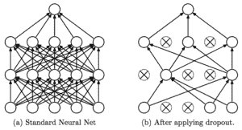

# 第二章：卷积与递归网络

人脑通常是我们在构建 AI 时的主要灵感来源和比较对象，深度学习研究人员经常从大脑中寻找灵感或获得确认。通过更详细地研究大脑及其各个部分，我们经常发现神经子过程。一个神经子过程的例子是我们的视觉皮层，这是大脑中负责视觉的区域或部分。我们现在了解到，大脑的这个区域的连接方式与反应输入的方式是不同的。这正好与我们之前在使用神经网络进行图像分类时的发现相似。现在，人脑有许多子过程，每个子过程在大脑中都有特定的映射区域（视觉、听觉、嗅觉、语言、味觉、触觉以及记忆/时间性），但在本章中，我们将探讨如何通过使用高级形式的深度学习来模拟视觉和记忆，这些高级形式被称为**卷积神经网络和递归网络**。视觉和记忆这两个核心子过程在许多任务中被广泛应用，包括游戏，它们也成为了许多深度学习研究的重点。

研究人员常常从大脑中寻找灵感，但他们构建的计算机模型通常与生物大脑的对应结构并不完全相似。然而，研究人员已经开始识别出大脑内几乎完美对应于神经网络的类比。例如，ReLU 激活函数就是其中之一。最近发现，我们大脑中神经元的兴奋程度绘制出来后，与 ReLU 图形完全匹配。

在本章中，我们将详细探讨卷积神经网络和递归神经网络。我们将研究它们如何解决在深度学习中复制准确视觉和记忆的问题。这两种新的网络或层类型是相对较新的发现，但它们在某些方面促进了深度学习的诸多进展。本章将涵盖以下主题：

+   卷积神经网络

+   理解卷积

+   构建自驾 CNN

+   记忆和递归网络

+   用 LSTM 玩石头剪子布

在继续之前，确保你已经较好地理解了前一章中概述的基本内容。这包括运行代码示例，安装本章所需的依赖项。

# 卷积神经网络

视觉是最常用的子过程。你现在就正在使用它！当然，研究人员早期尝试通过神经网络来模拟这一过程，然而直到引入卷积的概念并用于图像分类，才真正有效。卷积的概念是检测、分组和隔离图像中常见特征的想法。例如，如果你遮住了一张熟悉物体的图片的四分之三，然后展示给某人，他们几乎肯定能通过识别部分特征来认出这张图。卷积也以同样的方式工作，它会放大图像然后隔离特征，供之后识别使用。

卷积通过将图像分解成其特征部分来工作，这使得训练网络变得更加容易。让我们进入一个代码示例，该示例基于上一章的内容，并且现在引入了卷积。打开`Chapter_2_1.py`文件并按照以下步骤操作：

1.  看一下导入部分的前几行：

```py
import tensorflow as tf
from tensorflow.keras.layers import Input, Dense, Conv2D, MaxPooling2D, UpSampling2D
from tensorflow.keras.models import Model
from tensorflow.keras import backend as K
```

1.  在这个示例中，我们导入了新的层类型：`Conv2D`、`MaxPooling2D`和`UpSampling2D`。

1.  然后我们设置`Input`并使用以下代码构建编码和解码网络部分：

```py
input_img = Input(shape=(28, 28, 1)) # adapt this if using `channels_first` image data format

x = Conv2D(16, (3, 3), activation='relu', padding='same')(input_img)
x = MaxPooling2D((2, 2), padding='same')(x)
x = Conv2D(8, (3, 3), activation='relu', padding='same')(x)
x = MaxPooling2D((2, 2), padding='same')(x)
x = Conv2D(8, (3, 3), activation='relu', padding='same')(x)
encoded = MaxPooling2D((2, 2), padding='same')(x)

x = Conv2D(8, (3, 3), activation='relu', padding='same')(encoded)
x = UpSampling2D((2, 2))(x)
x = Conv2D(8, (3, 3), activation='relu', padding='same')(x)
x = UpSampling2D((2, 2))(x)
x = Conv2D(16, (3, 3), activation='relu')(x)
x = UpSampling2D((2, 2))(x)
decoded = Conv2D(1, (3, 3), activation='sigmoid', padding='same')(x)
```

1.  首先需要注意的是，我们现在保持图像的维度，在这个例子中是 28 x 28 像素宽，且只有 1 层或 1 个通道。这个示例使用的是灰度图像，所以只有一个颜色通道。这与之前完全不同，以前我们只是将图像展开成一个 784 维的向量。

第二点需要注意的是使用了`Conv2D`层（即二维卷积层）和随后的`MaxPooling2D`或`UpSampling2D`层。池化层或采样层用于收集或反过来解开特征。注意我们如何在图像编码后使用池化或下采样层，在解码图像时使用上采样层。

1.  接下来，我们使用以下代码块构建并训练模型：

```py
autoencoder = Model(input_img, decoded)
autoencoder.compile(optimizer='adadelta', loss='binary_crossentropy')

from tensorflow.keras.datasets import mnist
import numpy as np

(x_train, _), (x_test, _) = mnist.load_data()

x_train = x_train.astype('float32') / 255.
x_test = x_test.astype('float32') / 255.
x_train = np.reshape(x_train, (len(x_train), 28, 28, 1)) 
x_test = np.reshape(x_test, (len(x_test), 28, 28, 1)) 

from tensorflow.keras.callbacks import TensorBoard

autoencoder.fit(x_train, x_train,
 epochs=50,
 batch_size=128,
 shuffle=True,
 validation_data=(x_test, x_test),
 callbacks=[TensorBoard(log_dir='/tmp/autoencoder')])

decoded_imgs = autoencoder.predict(x_test)
```

1.  上面代码中的模型训练与上一章末尾我们所做的相似，但现在请注意训练集和测试集的选择。我们不再压缩图像，而是保持其空间属性作为卷积层的输入。

1.  最后，我们通过以下代码输出结果：

```py
n = 10
plt.figure(figsize=(20, 4))
for i in range(n):
  ax = plt.subplot(2, n, i)
  plt.imshow(x_test[i].reshape(28, 28))
  plt.gray()
  ax.get_xaxis().set_visible(False)
  ax.get_yaxis().set_visible(False)
  ax = plt.subplot(2, n, i + n)
  plt.imshow(decoded_imgs[i].reshape(28, 28))
  plt.gray()
  ax.get_xaxis().set_visible(False)
  ax.get_yaxis().set_visible(False)
plt.show()
```

1.  如你之前所做，运行代码，你会立刻注意到训练速度大约慢了 100 倍。这可能需要你等待，具体取决于你的机器；如果需要等待，去拿一杯饮料或三杯，或者来一顿饭吧。

现在，训练我们的简单示例需要大量时间，这在旧硬件上可能会非常明显。在下一节中，我们将详细介绍如何开始监控训练过程。

# 使用 TensorBoard 监控训练过程

TensorBoard 本质上是一个数学图形或计算引擎，在处理数字时表现非常出色，因此我们在深度学习中使用它。该工具本身仍然相当不成熟，但它具有一些非常有用的功能，可以用于监控训练过程。

按照以下步骤开始监控我们的样本训练：

1.  您可以通过在与运行样本相同的目录/文件夹中，在新的 **Anaconda** 或命令窗口中输入以下命令来监控训练会话：

```py
//first change directory to sample working folder
tensorboard --logdir=/tmp/autoencoder
```

1.  这将启动一个 TensorBoard 服务器，您可以通过将浏览器导航到以斜体显示的 URL 来查看输出，正如您运行 `TensorBoard` 所在的窗口中显示的那样。它通常会像下面这样：

```py
TensorBoard 1.10.0 at ***http://DESKTOP-V2J9HRG:6006*** (Press CTRL+C to quit)
or use
http://0.0.0.0:6000
```

1.  请注意，URL 应使用您的机器名称，但如果无法工作，可以尝试第二种形式。如果提示，请确保允许端口 `6000` 和 `6006` 以及 **TensorBoard** 应用程序通过您的防火墙。

1.  当样本运行完毕时，您应该会看到以下内容：


使用卷积进行自动编码数字

1.  返回并对比本示例和第一章《*深度学习游戏*》中的最后一个示例的结果。请注意性能的提升。

您可能会立即想到，“*我们经历的训练时间是否值得付出这么多努力？*”毕竟，在前一个示例中，解码后的图像看起来非常相似，而且训练速度要快得多，除了请记住，我们是通过在每次迭代中调整每个权重来缓慢训练网络权重，这些权重然后可以保存为模型。这个模型或“大脑”可以用来以后再次执行相同的任务，而无需重新训练。效果惊人地有效！在我们学习本章时，请始终牢记这个概念。在第三章《*游戏中的 GAN*》中，我们将开始保存并移动我们的“大脑”模型。

在接下来的部分中，我们将更深入地探讨卷积的工作原理。当您第一次接触卷积时，它可能比较难以理解，所以请耐心些。理解它的工作原理非常重要，因为我们稍后会广泛使用它。

# 理解卷积

**卷积** 是从图像中提取特征的一种方式，它可能使我们根据已知特征更容易地对其进行分类。在深入探讨卷积之前，让我们先退一步，理解一下为什么网络以及我们的视觉系统需要在图像中孤立出特征。请看下面的内容：这是一张名为 Sadie 的狗的样本图像，应用了各种图像滤镜：


应用不同滤镜的图像示例

上面展示了四种不同的版本，分别应用了没有滤波器、边缘检测、像素化和发光边缘滤波器。然而，在所有情况下，作为人类的你都能清晰地识别出这是一张狗的图片，不论应用了什么滤波器，除了在边缘检测的情况下，我们去除了那些对于识别狗不必要的额外图像数据。通过使用滤波器，我们只提取了神经网络识别狗所需要的特征。这就是卷积滤波器的全部功能，在某些情况下，这些滤波器中的一个可能只是一个简单的边缘检测。

卷积滤波器是一个由数字组成的矩阵或核，定义了一个单一的数学操作。这个过程从将其与左上角的像素值相乘开始，然后将矩阵操作的结果求和并作为输出。该核沿着图像滑动，步幅称为**步幅**，并演示了此操作：


应用卷积滤波器

在上图中，使用了步幅为 1 的卷积。应用于卷积操作的滤波器实际上是一个边缘检测滤波器。如果你观察最终操作的结果，你会看到中间部分现在被填充了 OS，这大大简化了任何分类任务。我们的网络需要学习的信息越少，学习速度越快，所需的数据也越少。现在，有趣的部分是，卷积学习滤波器、数字或权重，它需要应用这些权重以提取相关特征。这一点可能不太明显，可能会让人困惑，所以我们再来讲解一遍。回到我们之前的例子，看看我们如何定义第一个卷积层：

```py
x = Conv2D(16, (3, 3), activation='relu', padding='same')(input_img)
```

在那行代码中，我们将第一个卷积层定义为具有`16`个输出滤波器，意味着这一层的输出实际上是 16 个滤波器。然后我们将核大小设置为`(3,3)`，这表示一个`3x3`矩阵，就像我们在例子中看到的那样。请注意，我们没有指定各种核滤波器的权重值，因为毕竟这就是网络正在训练去做的事情。

让我们看看当所有内容组合在一起时，这在以下图示中是怎样的：


完整的卷积操作

卷积的第一步输出是特征图。一个特征图表示应用了单个卷积滤波器，并通过应用学习到的滤波器/核生成。在我们的例子中，第一层生成**16 个核**，从而生成**16 个特征图**；请记住，`16`是指滤波器的数量。

卷积后，我们应用池化或子采样操作，以便将特征收集或聚集到一起。这种子采样进一步创建了新的集中的特征图，突出显示了我们正在训练的图像中的重要特征。回顾一下我们在之前的例子中如何定义第一个池化层：

```py
x = MaxPooling2D((2, 2), padding='same')(x)
```

在代码中，我们使用 `pool_size` 为 `(2,2)` 进行子采样。该大小表示图像在宽度和高度方向下采样的因子。所以一个 2 x 2 的池化大小将创建四个特征图，其宽度和高度各减半。这会导致我们的第一层卷积和池化后总共生成 64 个特征图。我们通过将 16（卷积特征图）x 4（池化特征图） = 64 特征图来得到这个结果。考虑一下我们在这个简单示例中构建的特征图总数：


那就是 65,536 个 4 x 4 图像的特征图。这意味着我们现在在 65,536 张更小的图像上训练我们的网络；对于每张图像，我们尝试对其进行编码或分类。这显然是训练时间增加的原因，但也要考虑到我们现在用于分类图像的额外数据量。现在，我们的网络正在学习如何识别图像的部分或特征，就像我们人类识别物体一样。

例如，如果你仅仅看到了狗的鼻子，你很可能就能认出那是一只狗。因此，我们的样本网络现在正在识别手写数字的各个部分，正如我们现在所知道的，这大大提高了性能。

正如我们所看到的，卷积非常适合识别图像，但池化过程可能会破坏空间关系的保持。因此，当涉及到需要某种形式的空间理解的游戏或学习时，我们倾向于限制池化或完全消除池化。由于理解何时使用池化以及何时不使用池化非常重要，我们将在下一节中详细讨论这一点。

# 构建自驾车卷积神经网络（CNN）

Nvidia 在 2017 年创建了一个名为**PilotNet**的多层卷积神经网络（CNN），它通过仅仅展示一系列图像或视频，就能控制车辆的方向。这是神经网络，特别是卷积网络强大功能的一个引人注目的演示。下图展示了 PilotNet 的神经网络架构：


PilotNet 神经网络架构

图中显示了网络的输入从底部开始，上升到单个输入图像的结果输出到一个神经元，表示转向方向。由于这是一个很好的示例，许多人已在博客中发布了 PilotNet 的示例，其中一些实际上是有效的。我们将查看这些博客中的一个代码示例，看看如何用 Keras 构建类似的架构。接下来是来自原始 PilotNet 博客的一张图，展示了我们的自驾网络将用于训练的一些图像类型：


PilotNet 训练图像示例

这个例子的训练目标是输出方向盘应该转动的角度，以保持车辆行驶在道路上。打开`Chapter_2_2.py`中的代码列表，并按照以下步骤操作：

1.  我们将转而使用 Keras 进行一些样本处理。虽然 TensorFlow 内嵌版的 Keras 一直表现良好，但有一些功能我们需要的仅在完整版 Keras 中才有。要安装 Keras 和其他依赖项，打开 Shell 或 Anaconda 窗口，并运行以下命令：

```py
pip install keras
pip install pickle
pip install matplotlib
```

1.  在代码文件（`Chapter_2_2.py`）的开始部分，我们首先进行一些导入操作，并使用以下代码加载示例数据：

```py
import os
import urllib.request
import pickle
import matplotlib
import matplotlib.pyplot as plt

***#downlaod driving data (450Mb)*** 
data_url = 'https://s3.amazonaws.com/donkey_resources/indoor_lanes.pkl'
file_path, headers = urllib.request.urlretrieve(data_url)
print(file_path)

with open(file_path, 'rb') as f:
  X, Y = pickle.load(f)
```

1.  这段代码只是做一些导入操作，然后从作者的源数据中下载示例驾驶帧。这篇博客的原文是由**Roscoe's Notebooks**编写的，链接可以在[`wroscoe.github.io/keras-lane-following-autopilot.html`](https://wroscoe.github.io/keras-lane-following-autopilot.html)找到。

    `pickle`是一个解压库，用于解压前面列表底部数据集`X`和`Y`中的数据。

1.  然后我们会将帧的顺序打乱，或者说本质上是对数据进行随机化。我们通常这样随机化数据以增强训练效果。通过随机化数据顺序，网络需要学习图像的绝对转向值，而不是可能的相对或增量值。以下代码完成了这个打乱过程：

```py
import numpy as np
def unison_shuffled_copies(X, Y):
  assert len(X) == len(Y)
  p = np.random.permutation(len(X))
  return X[p], Y[p]

shuffled_X, shuffled_Y = unison_shuffled_copies(X,Y)
len(shuffled_X)
```

1.  这段代码的作用仅仅是使用`numpy`随机打乱图像帧的顺序。然后它会输出第一个打乱数据集`shuffled_X`的长度，以便我们确认训练数据没有丢失。

1.  接下来，我们需要创建训练集和测试集数据。训练集用于训练网络（权重），而测试集或验证集用于验证在新数据或原始数据上的准确性。正如我们之前所看到的，这在使用监督式训练或标注数据时是一个常见的主题。我们通常将数据划分为 80%的训练数据和 20%的测试数据。以下代码执行了这一操作：

```py
test_cutoff = int(len(X) * .8) # 80% of data used for training
val_cutoff = test_cutoff + int(len(X) * .2) # 20% of data used for validation and test data
train_X, train_Y = shuffled_X[:test_cutoff], shuffled_Y[:test_cutoff]
val_X, val_Y = shuffled_X[test_cutoff:val_cutoff], shuffled_Y[test_cutoff:val_cutoff]
test_X, test_Y = shuffled_X[val_cutoff:], shuffled_Y[val_cutoff:]

len(train_X) + len(val_X) + len(test_X)
```

1.  在创建了训练集和测试集后，我们现在想要增强或扩展训练数据。在这个特定的案例中，作者通过翻转原始图像并将其添加到数据集中来增强数据。我们将在后续章节中发现许多其他增强数据的方法，但这种简单有效的翻转方法是你可以加入到机器学习工具库中的一个技巧。执行这个翻转的代码如下：

```py
X_flipped = np.array([np.fliplr(i) for i in train_X])
Y_flipped = np.array([-i for i in train_Y])
train_X = np.concatenate([train_X, X_flipped])
train_Y = np.concatenate([train_Y, Y_flipped])
len(train_X)
```

1.  现在进入了重要部分。数据已经准备好，现在是构建模型的时候，如下代码所示：

```py
from keras.models import Model, load_model
from keras.layers import Input, Convolution2D, MaxPooling2D, Activation, Dropout, Flatten, Dense

img_in = Input(shape=(120, 160, 3), name='img_in')
angle_in = Input(shape=(1,), name='angle_in')

x = Convolution2D(8, 3, 3)(img_in)
x = Activation('relu')(x)
x = MaxPooling2D(pool_size=(2, 2))(x)

x = Convolution2D(16, 3, 3)(x)
x = Activation('relu')(x)
x = MaxPooling2D(pool_size=(2, 2))(x)

x = Convolution2D(32, 3, 3)(x)
x = Activation('relu')(x)
x = MaxPooling2D(pool_size=(2, 2))(x)

merged = Flatten()(x)

x = Dense(256)(merged)
x = Activation('linear')(x)
x = Dropout(.2)(x)

angle_out = Dense(1, name='angle_out')(x)

model = Model(input=[img_in], output=[angle_out])
model.compile(optimizer='adam', loss='mean_squared_error')
model.summary()
```

1.  目前构建模型的代码应该比较容易理解。注意架构的变化以及代码是如何与我们之前的示例不同的。还要注意两个高亮的行。第一行使用了一种新的层类型，叫做`Flatten`。这个层的作用就是将 2 x 2 的图像展平为一个向量，然后输入到一个标准的`Dense`全连接隐藏层。第二行高亮的代码引入了另一种新的层类型，叫做`Dropout`。这个层类型需要更多的解释，将在本节末尾进行更详细的讲解。

1.  最后是训练部分，这段代码进行如下设置：

```py
import os
from keras import callbacks

model_path = os.path.expanduser('~/best_autopilot.hdf5')

save_best = callbacks.ModelCheckpoint(model_path, monitor='val_loss', verbose=1, 
 save_best_only=True, mode='min')

early_stop = callbacks.EarlyStopping(monitor='val_loss', min_delta=0, patience=5, 
 verbose=0, mode='auto')

callbacks_list = [save_best, early_stop]

model.fit(train_X, train_Y, batch_size=64, epochs=4, validation_data=(val_X, val_Y), callbacks=callbacks_list)
```

1.  这段代码设置了一组`callbacks`来更新和控制训练。我们已经使用过 callbacks 来更新 TensorBoard 服务器的日志。在这种情况下，我们使用 callbacks 在每个检查点（epoch）后重新保存模型并检查是否提前退出。请注意我们保存模型的形式——一个`hdf5`文件。这个文件格式表示的是一种层次化的数据结构。

1.  像你之前一样运行代码。这个示例可能需要一些时间，因此再次请保持耐心。当你完成后，将不会有输出，但请特别注意最小化的损失值。

在你深度学习的这段职业生涯中，你可能意识到你需要更多的耐心，或者更好的电脑，或者也许是一个支持 TensorFlow 的 GPU。如果你想尝试后者，可以下载并安装 TensorFlow GPU 库以及与你的操作系统相对应的其他必需库，这些会有所不同。网上可以找到大量文档。在安装了 TensorFlow 的 GPU 版本后，Keras 将自动尝试使用它。如果你有支持的 GPU，你应该会注意到性能的提升，如果没有，考虑购买一个。

虽然这个示例没有输出，为了简化，试着理解正在发生的事情。毕竟，这同样可以设置为一款驾驶游戏，网络仅通过查看截图来控制车辆。我们省略了作者原始博客文章中的结果，但如果你想进一步查看其表现，请返回并查看[源链接](https://wroscoe.github.io/keras-lane-following-autopilot.html)。

作者在他的博客文章中做的一件事是使用了池化层，正如我们所见，当处理卷积时，这是相当标准的做法。然而，池化层的使用时机和方式现在有些争议，需要进一步详细讨论，这将在下一节中提供。

# 空间卷积和池化

Geoffrey Hinton 及其团队最近强烈建议，使用池化与卷积会去除图像中的空间关系。Hinton 则建议使用**CapsNet**，或称为**胶囊网络**。胶囊网络是一种保留数据空间完整性的池化方法。现在，这并非在所有情况下都是问题。对于手写数字，空间关系并不那么重要。然而，对于自动驾驶汽车或从事空间任务的网络——比如游戏——使用池化时，性能往往不如预期。事实上，Unity 团队在卷积后并不使用池化层；让我们来了解原因。

池化或下采样是通过将数据的共同特征聚集在一起的方式来增强数据。这样做的问题是，数据中的任何关系通常会完全丢失。下图演示了在卷积图上进行**MaxPooling(2,2)**的效果：


最大池化的工作原理

即便是在简单的前图中，你也能迅速理解池化操作会丢失角落（上左、下左、下右和上右）的空间关系。需要注意的是，经过几层池化后，任何空间关系将完全消失。

我们可以通过以下步骤测试从模型中移除池化层的效果，并再次进行测试：

1.  打开`Chapter_2_3.py`文件，并注意我们注释掉了几个池化层，或者你也可以像下面这样删除这些行：

```py
x = Convolution2D(8, 3, 3)(img_in)
x = Activation('relu')(x)
x = MaxPooling2D(pool_size=(2, 2))(x)

x = Convolution2D(16, 3, 3)(x)
x = Activation('relu')(x)
#x = MaxPooling2D(pool_size=(2, 2))(x)

x = Convolution2D(32, 3, 3)(x)
x = Activation('relu')(x)
#x = MaxPooling2D(pool_size=(2, 2))(x)
```

1.  注意我们没有注释掉（或删除）所有的池化层，而是保留了一个。在某些情况下，你可能仍然希望保留一些池化层，可能是为了识别那些空间上不重要的特征。例如，在识别数字时，空间关系对于整体形状的影响较小。然而，如果我们考虑识别面孔，那么人的眼睛、嘴巴等之间的距离，就是区分面孔的关键特征。不过，如果你只想识别一个面孔，包含眼睛、嘴巴等，单纯使用池化层也完全可以接受。

1.  接下来，我们还会在`Dropout`层上增加丢弃率，代码如下：

```py
x = Dropout(.5)(x)
```

1.  我们将在下一节中详细探讨丢弃层。现在，只需明白这个更改将对我们的模型产生更积极的影响。

1.  最后，我们将`epochs`的数量增加到`10`，代码如下：

```py
model.fit(train_X, train_Y, batch_size=64, epochs=10, validation_data=(val_X, val_Y), callbacks=callbacks_list)
```

1.  在我们之前的运行中，如果你在训练时观察损失率，你会发现最后一个例子大约在四个 epoch 时开始收敛。由于去掉了池化层也减少了训练数据，我们还需要增加 epoch 的数量。记住，池化或下采样增加了特征图的数量，特征图更少意味着网络需要更多的训练轮次。如果你不是在 GPU 上训练，这个模型将需要一段时间，所以请耐心等待。

1.  最后，再次运行这个示例，应用那些小的修改。你会注意到的第一件事是训练时间剧烈增加。记住，这是因为我们的池化层确实加速了训练，但代价也不小。这也是我们允许只有单个池化层的原因之一。

1.  当示例运行完毕后，比较一下我们之前运行的`Chapter_2_2.py`示例的结果。它达到了你预期的效果吗？

我们之所以专注于这篇博客文章，是因为它展示得非常好，写得也很出色。作者显然非常懂行，但这个示例也展示了在尽可能详细的情况下理解这些概念基础的重要性。面对信息的泛滥，这不是一件容易的事，但这也再次强调了开发有效的深度学习模型并非一项简单的任务，至少目前还不是。

现在我们已经理解了池化层的成本/惩罚，我们可以进入下一部分，回到理解`Dropout`的内容。它是一个非常有效的工具，你将一次又一次地使用它。

# Dropout 的必要性

现在，让我们回到我们非常需要讨论的`Dropout`。在深度学习中，我们使用 Dropout 作为在每次迭代过程中随机切断层之间网络连接的一种方式。下面的示意图展示了 Dropout 在三层网络中应用的一次迭代：



Dropout 前后的变化

需要理解的重要一点是，并非所有连接都会被切断。这样做是为了让网络变得不那么专注于特定任务，而是更加通用。使模型具备通用性是深度学习中的一个常见主题，我们通常这么做是为了让模型能更快地学习更广泛的问题。当然，有时将网络通用化也可能限制了网络的学习能力。

如果我们现在回到之前的示例，并查看代码，我们可以看到这样使用了`Dropout`层：

```py
x = Dropout(.5)(x)
```

这一行简单的代码告诉网络在每次迭代后随机丢弃或断开 50%的连接。Dropout 仅对全连接层（**Input** -> **Dense** -> **Dense**）有效，但作为提高性能或准确性的一种方式非常有用。这可能在某种程度上解释了之前示例中性能提升的原因。

在下一部分，我们将探讨深度学习如何模仿记忆子过程或时间感知。

# 记忆和递归网络

记忆通常与**递归神经网络**（**RNN**）相关联，但这并不完全准确。RNN 实际上只是用来存储事件序列或你可能称之为**时间感知**的东西，如果你愿意的话，它是“时间的感觉”。RNN 通过在递归或循环中将状态保存回自身来实现这一点。下面是这种方式的一个示例：


展开式递归神经网络

图示展示了一个循环神经元的内部表示，该神经元被设置为跟踪若干时间步或迭代，其中**x**表示某一时间步的输入，**h**表示状态。**W**、**U**和**V**的网络权重在所有时间步中保持不变，并使用一种叫做**时间反向传播（BPTT）**的技术进行训练。我们不会深入讨论 BPTT 的数学原理，留给读者自己去发现，但要明白，循环神经网络中的网络权重使用一种成本梯度方法来进行优化。

循环神经网络（RNN）允许神经网络识别元素序列并预测通常接下来会出现的元素。这在预测文本、股票和当然是游戏中有巨大的应用。几乎任何能够从对时间或事件序列的理解中受益的活动，都可以通过使用 RNN 来获益，除了标准的 RNN，前面展示的类型，由于梯度问题，无法预测更长的序列。我们将在下一节中进一步探讨这个问题及其解决方案。

# LSTM 拯救了梯度消失和爆炸问题

RNN 所面临的问题是梯度消失或爆炸。这是因为，随着时间的推移，我们尝试最小化或减少的梯度变得非常小或非常大，以至于任何额外的训练都不会产生影响。这限制了 RNN 的实用性，但幸运的是，这个问题已经通过**长短期记忆（LSTM）**块得到解决，如下图所示：


LSTM 块示例

LSTM 块使用一些技术克服了梯度消失问题。在图示中，您会看到一个圈内有一个**x**，它表示由激活函数控制的门控。在图示中，激活函数是**σ**和**tanh**。这些激活函数的工作方式类似于步长函数或 ReLU，我们可能会在常规网络层中使用任一函数作为激活。大多数情况下，我们会将 LSTM 视为一个黑箱，您只需要记住，LSTM 克服了 RNN 的梯度问题，并能够记住长期序列。

让我们看一个实际的例子，看看如何将这些内容组合在一起。打开`Chapter_2_4.py`并按照以下步骤操作：

1.  我们像往常一样，首先导入我们需要的各种 Keras 组件，如下所示：

这个例子取自[`machinelearningmastery.com/understanding-stateful-lstm-recurrent-neural-networks-python-keras/`](https://machinelearningmastery.com/understanding-stateful-lstm-recurrent-neural-networks-python-keras/)。这个网站由**Jason Brownlee 博士**主办，他有许多出色的例子，解释了 LSTM 和循环神经网络的使用。

```py
import numpy
from keras.models import Sequential
from keras.layers import Dense
from keras.layers import LSTM
from keras.utils import np_utils
```

1.  这次我们引入了两个新的类，`Sequential` 和 `LSTM`。当然我们知道`LSTM`的作用，那`Sequential`呢？`Sequential`是一种模型形式，按顺序定义层级，一个接一个。我们之前对这个细节不太关注，因为我们之前的模型都是顺序的。

1.  接下来，我们将随机种子设置为一个已知值。这样做是为了使我们的示例能够自我复制。你可能在之前的示例中注意到，并非每次运行的结果都相同。在许多情况下，我们希望训练的一致性，因此我们通过以下代码设置一个已知的种子值：

```py
numpy.random.seed(7)
```

1.  需要意识到的是，这只是设置了`numpy`的随机种子值。其他库可能使用不同的随机数生成器，并需要不同的种子设置。我们将在未来尽可能地识别这些不一致之处。

1.  接下来，我们需要确定一个训练的序列；在此示例中，我们将使用如下代码中的`alphabet`：

```py
alphabet = "ABCDEFGHIJKLMNOPQRSTUVWXYZ"

char_to_int = dict((c, i) for i, c in enumerate(alphabet))
int_to_char = dict((i, c) for i, c in enumerate(alphabet))

seq_length = 1
dataX = []
dataY = []

for i in range(0, len(alphabet) - seq_length, 1):
  seq_in = alphabet[i:i + seq_length]
  seq_out = alphabet[i + seq_length]
  dataX.append([char_to_int[char] for char in seq_in])
  dataY.append(char_to_int[seq_out])
  print(seq_in, '->', seq_out)
```

1.  前面的代码构建了我们的字符序列，并构建了每个字符序列的映射。它构建了`seq_in`和`seq_out`，展示了正向和反向的位置。由于序列长度由`seq_length = 1`定义，因此我们只关心字母表中的一个字母及其后面的字符。当然，你也可以使用更长的序列。

1.  构建好序列数据后，接下来是使用以下代码对数据进行形状调整和归一化：

```py
X = numpy.reshape(dataX, (len(dataX), seq_length, 1))
# normalize
X = X / float(len(alphabet))
# one hot encode the output variable
y = np_utils.to_categorical(dataY)
```

1.  前面的代码的第一行将数据重塑为一个张量，其大小长度为`dataX`，即步骤数或序列数，以及要识别的特征数。然后我们对数据进行归一化。归一化数据的方式有很多种，但在此我们将值归一化到 0 到 1 之间。接着，我们对输出进行独热编码，以便于训练。

独热编码是将数据或响应的位置值设置为 1，其它位置设置为 0。在此示例中，我们的模型输出是 26 个神经元，它也可以用 26 个零表示，每个神经元对应一个零，像这样：

**00000000000000000000000000**

每个零代表字母表中匹配的字符位置。如果我们想表示字符**A**，我们会输出如下的独热编码值：

**10000000000000000000000000**

1.  然后，我们构建模型，使用与之前略有不同的代码形式，如下所示：

```py
model = Sequential()
model.add(LSTM(32, input_shape=(X.shape[1], X.shape[2])))
model.add(Dense(y.shape[1], activation='softmax'))
model.compile(loss='categorical_crossentropy', optimizer='adam', metrics=['accuracy'])
model.fit(X, y, epochs=500, batch_size=1, verbose=2)

scores = model.evaluate(X, y, verbose=0)
print("Model Accuracy: %.2f%%" % (scores[1]*100))
```

1.  前面代码中的关键部分是高亮显示的那一行，展示了`LSTM`层的构建。我们通过设置单元数来构建`LSTM`层，在这个例子中是`32`，因为我们的序列长度为 26 个字符，我们希望通过`2`来禁用单元。然后我们将`input_shape`设置为与之前创建的张量`X`相匹配，`X`用于保存我们的训练数据。在这种情况下，我们只是设置形状以匹配所有字符（26 个）和序列长度，在这种情况下是`1`。

1.  最后，我们用以下代码输出模型：

```py
for pattern in dataX:
  x = numpy.reshape(pattern, (1, len(pattern), 1))
  x = x / float(len(alphabet))
  prediction = model.predict(x, verbose=0)
  index = numpy.argmax(prediction)
  result = int_to_char[index]
  seq_in = [int_to_char[value] for value in pattern]
  print(seq_in, "->", result)
```

1.  像平常一样运行代码并检查输出。你会注意到准确率大约为 80%。看看你能否提高模型预测字母表下一个序列的准确率。

这个简单的示例展示了使用 LSTM 块识别简单序列的基本方法。在下一部分，我们将看一个更复杂的例子：使用 LSTM 来玩石头、剪刀、布。

# 使用 LSTM 玩石头、剪刀、布

记住，数据序列的记忆在许多领域有着广泛的应用，尤其是在游戏中。当然，制作一个简单、清晰的示例是另一回事。幸运的是，互联网上有很多示例，`Chapter_2_5.py`展示了一个使用 LSTM 来玩石头、剪刀、布的例子。

打开那个示例文件并按照以下步骤进行操作：

这个示例来自[`github.com/hjpulkki/RPS`](https://github.com/hjpulkki/RPS)，但是代码需要在多个地方进行调整才能适应我们的需求。

1.  让我们像往常一样开始导入。在这个示例中，确保像上次练习那样安装 Keras：

```py
import numpy as np
from keras.utils import np_utils
from keras.models import Sequential
from keras.layers import Dense, LSTM
```

1.  然后，我们设置一些常量，如下所示：

```py
EPOCH_NP = 100
INPUT_SHAPE = (1, -1, 1)
OUTPUT_SHAPE = (1, -1, 3)
DATA_FILE = "data.txt"
MODEL_FILE = "RPS_model.h5"
```

1.  然后，我们构建模型，这次有三个 LSTM 层，分别对应于序列中的每个元素（石头、剪刀和布），如下所示：

```py
def simple_model(): 
  new_model = Sequential()
  new_model.add(LSTM(output_dim=64, input_dim=1, return_sequences=True, activation='sigmoid'))
  new_model.add(LSTM(output_dim=64, return_sequences=True, activation='sigmoid'))
  new_model.add(LSTM(output_dim=64, return_sequences=True, activation='sigmoid'))
  new_model.add(Dense(64, activation='relu'))
  new_model.add(Dense(64, activation='relu'))
  new_model.add(Dense(3, activation='softmax'))
  new_model.compile(loss='categorical_crossentropy', optimizer='adam', metrics=['accuracy', 'categorical_crossentropy'])
  return new_model
```

1.  然后，我们创建一个函数，从`data.txt`文件中提取数据。该文件使用以下代码保存了训练数据的序列：

```py
def batch_generator(filename): 
  with open('data.txt', 'r') as data_file:
    for line in data_file:
      data_vector = np.array(list(line[:-1]))
      input_data = data_vector[np.newaxis, :-1, np.newaxis]
      temp = np_utils.to_categorical(data_vector, num_classes=3) 
      output_data = temp[np.newaxis, 1:]
      yield (input_data, output_data)
```

1.  在这个示例中，我们将每个训练块通过 100 次 epoch 进行训练，顺序与文件中的顺序一致。更好的方法是以随机顺序训练每个训练序列。

1.  然后我们创建模型：

```py
# Create model
np.random.seed(7)
model = simple_model()
```

1.  使用循环训练数据，每次迭代从`data.txt`文件中获取一个批次：

```py
for (input_data, output_data) in batch_generator('data.txt'):
  try:
    model.fit(input_data, output_data, epochs=100, batch_size=100)
  except:
    print("error")
```

1.  最后，我们使用验证序列评估结果，如以下代码所示：

```py
print("evaluating")
validation = '100101000110221110101002201101101101002201011012222210221011011101011122110010101010101'
input_validation = np.array(list(validation[:-1])).reshape(INPUT_SHAPE)
output_validation = np_utils.to_categorical(np.array(list(validation[1:]))).reshape(OUTPUT_SHAPE)
loss_and_metrics = model.evaluate(input_validation, output_validation, batch_size=100)

print("\n Evaluation results")

for i in range(len(loss_and_metrics)):
  print(model.metrics_names[i], loss_and_metrics[i])

input_test = np.array([0, 0, 0, 1, 1, 1, 2, 2, 2]).reshape(INPUT_SHAPE)
res = model.predict(input_test)
prediction = np.argmax(res[0], axis=1)
print(res, prediction)

model.save(MODEL_FILE)
del model
```

1.  像平常一样运行示例。查看最后的结果，并注意模型在预测序列时的准确性。

一定要多次运行这个简单示例，理解 LSTM 层是如何设置的。特别注意参数及其设置方式。

这就结束了我们快速了解如何使用递归，也就是 LSTM 块，来识别和预测数据序列。我们当然会在本书的其他章节中多次使用这一多功能的层类型。

在本章的最后一部分，我们再次展示了一些练习，鼓励你们为自己的利益进行尝试。

# 练习

完成以下练习，以便在自己的时间里提高学习体验。加深你对材料的理解会让你成为一个更成功的深度学习者，也能让你更享受本书的内容：

1.  在`Chapter_2_1.py`示例中，将`Conv2D`层的过滤器大小更改为不同的值。再次运行示例，看看这对训练性能和准确度有何影响。

1.  注释掉或删除 `Chapter_2_1.py` 示例中的几个**MaxPooling**层和相应的**UpSampling**层。记住，如果你删除了第 2 层和第 3 层之间的池化层，你也需要删除上采样层以保持一致性。重新运行示例，观察这对训练时间、准确度和性能的影响。

1.  修改 `Chapter_2_2.py` 示例中的**Conv2D**层，使用不同的滤波器大小。观察这对训练的影响。

1.  修改 `Chapter_2_2.py` 示例中的**Conv2D**层，使用步幅值为**2**。你可能需要参考**Keras**文档来完成此操作。观察这对训练的影响。

1.  修改 `Chapter_2_2.py` 示例中的**MaxPooling**层，改变池化的维度。观察这对训练的影响。

1.  删除或注释掉 `Chapter_2_3.py` 示例中使用的所有**MaxPooling**层。如果所有池化层都被注释掉，会发生什么？现在需要增加训练周期数吗？

1.  修改本章中使用的各个示例中的**Dropout**使用方式。这包括添加 dropout。测试使用不同 dropout 比例的效果。

1.  修改 `Chapter_2_4.py` 示例，使模型提高准确率。你需要做什么来提高训练性能？

1.  修改 `Chapter_2_4.py` 示例，以便预测序列中的多个字符。如果需要帮助，请回顾原始博客文章，获取更多信息。

1.  如果你改变 `Chapter_2_5.py` 示例中三个**LSTM**层使用的单元数，会发生什么？如果将其增加到 128、32 或 16 会怎样？尝试这些值，了解它们的影响。

可以自行扩展这些练习。尝试自己写一个新的示例，即使只是一个简单的例子。没有什么比写代码更能帮助你学习编程了。

# 总结

在本章以及上一章中，我们深入探讨了深度学习和神经网络的核心元素。尽管我们在过去几章中的回顾不够全面，但它应该为你继续阅读本书的其他部分打下良好的基础。如果你在前两章的任何内容上遇到困难，现在就回去复习这些内容，花更多时间进行复习。理解神经网络架构的基本概念和各种专用层的使用非常重要，如本章所讨论的（CNN 和 RNN）。确保你理解 CNN 的基础知识以及如何有效地使用它来选择特征，并了解使用池化或子采样时的权衡。同时，理解 RNN 的概念，以及在预测或检测时何时使用 LSTM 块。卷积层和 LSTM 块现在是深度学习的基础组件，接下来我们将在构建的多个网络中使用它们。

在下一章，我们将开始为本书构建我们的示例游戏，并介绍 GANs，即生成对抗网络。我们将探讨 GANs 以及它们如何用于生成游戏内容。
